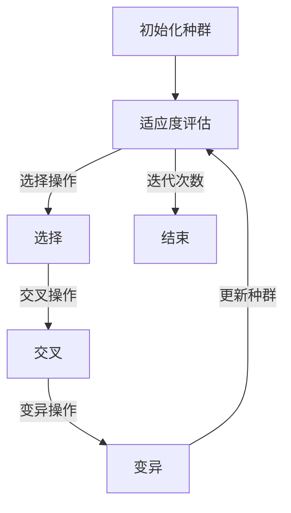
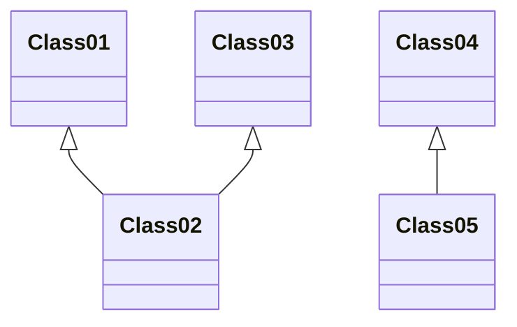
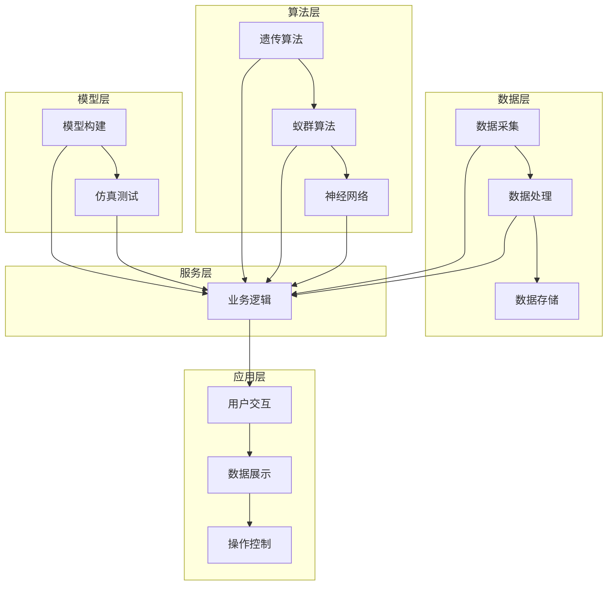
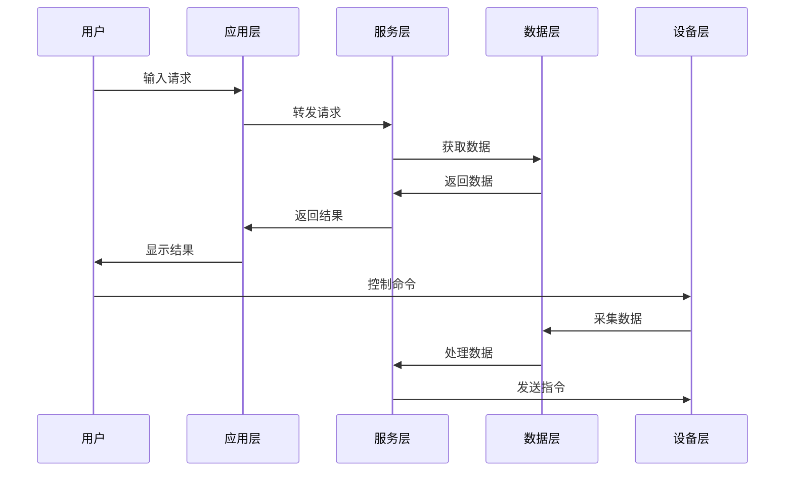

                 


### 引言

生物仿生学是一门将生物学原理应用于工程和工业中的跨学科领域。其核心思想是通过研究自然界中生物体的结构和功能，模仿其独特的设计和机制，来创造出更高效、更可靠的工程解决方案。随着科技的进步和环保意识的提升，生物仿生学在多个行业中的应用日益广泛，成为推动技术创新的重要力量。

本文将围绕“生物仿生学：向自然学习生存的智慧”这一主题，通过逻辑清晰、结构紧凑、简单易懂的方式，逐步探讨生物仿生学的核心概念、算法原理及其在实际工程中的应用。文章结构如下：

1. **生物仿生学的背景与概述**：介绍仿生学的定义、历史及其在生物仿生学中的地位。
2. **生物系统的设计与演化原理**：探讨生物系统的基本原理、适应性设计和演化机制。
3. **生物仿生学的核心概念与联系**：详细阐述生物仿生学的核心概念及其关系。
4. **生物仿生学中的数学模型**：讲解生物仿生学中常用的数学模型。
5. **生物仿生学的算法原理与应用**：分析生物仿生算法的原理、流程图及其Python代码实现。
6. **生物仿生学在工程与工业中的应用**：探讨生物仿生学在工程和工业领域的具体应用。
7. **生物仿生学的系统分析与架构设计**：介绍生物仿生学应用系统的分析与设计。
8. **项目实战**：通过实际项目来展示生物仿生学的应用。
9. **生物仿生学的最佳实践与拓展**：总结最佳实践、注意事项及拓展阅读。

通过上述章节的逐步分析，我们将深入理解生物仿生学的原理和实际应用，从而为未来科技发展提供新的思路和方向。

### 生物仿生学的背景与概述

#### 1.1 仿生学的定义与历史

仿生学（Bionics）是一门跨学科领域，它结合生物学、工程学、物理学和其他学科的知识，研究自然界生物体结构、功能和行为的机制，并尝试将这些机制应用于人造系统设计中。仿生学的起源可以追溯到20世纪初，当时人们开始关注动物和植物的独特能力，并试图将这些能力转化为实用技术。

历史上，许多著名的科学家都对仿生学做出了重要贡献。19世纪，法国工程师尼古拉·约瑟夫·卡诺（Nicolas-Joseph Cugnot）研究了蒸汽动力车辆时，就受到了马和人的步态的启发。20世纪50年代，美国发明家伯特·克拉克（Bertolt Meyer）设计了名为“Elvis”的假手，其设计灵感来自于章鱼的柔韧性和适应性。

#### 1.2 生物仿生学的兴起与发展

生物仿生学作为仿生学的一个分支，在20世纪后期得到了快速发展。随着计算机技术和生物技术的进步，科学家们能够更深入地了解生物体的复杂结构和功能。生物仿生学的研究不仅局限于模仿生物体的表面特征，还包括其内部的工作原理和机制。

在21世纪，生物仿生学已经逐渐成为多个行业的重要推动力。例如，在航空航天领域，仿生学原理被用于设计更高效、更轻便的飞行器；在材料科学领域，生物体的结构被用于开发新型材料；在医疗领域，仿生学技术被用于开发人工器官和假肢。

#### 1.3 生物仿生学的研究领域与应用前景

生物仿生学的研究领域非常广泛，包括但不限于以下方面：

1. **仿生材料**：通过模仿生物体的结构，开发出具有特定性能的工程材料。例如，蝴蝶翅膀的特殊结构可以用于开发太阳能电池，提高其效率。
   
2. **仿生传感器**：模仿生物体的感官系统，设计出能够感知环境变化的传感器。例如，仿生触觉传感器被用于机器人控制和智能制造。

3. **生物启发算法**：从生物体适应环境的机制中汲取灵感，开发出解决复杂优化问题的算法。例如，遗传算法和蚁群算法就是从生物进化机制和群体行为中得到的启发。

4. **仿生机器人**：模仿生物体的运动和感知能力，设计出能够在复杂环境中执行任务的机器人。例如，仿生章鱼机器人可以在水下执行搜索和救援任务。

随着生物仿生学研究的不断深入，其在各个领域的应用前景也非常广阔。未来，生物仿生学有望在以下几个方面发挥重要作用：

- **绿色能源**：通过模仿植物的光合作用机制，开发出高效、环保的能源转换技术。
- **智能交通**：利用仿生学原理，设计出更智能、更安全的交通工具和交通管理系统。
- **环境保护**：通过模仿微生物的降解能力，开发出解决环境污染问题的技术。

总的来说，生物仿生学不仅为工程和工业提供了创新的解决方案，也为科学研究带来了新的启示。通过向自然学习，我们能够更好地理解和利用生物体的智慧，推动科技进步和社会发展。

### 生物系统的设计与演化原理

#### 2.1 生物系统的基本原理

生物系统的设计与演化是自然界长期进化的结果，具有高度的适应性和复杂性。为了理解生物系统的基本原理，我们需要从分子、细胞、组织、器官等多个层次进行探讨。

首先，在分子层面上，生物系统依赖于DNA和RNA等遗传物质的编码功能。这些遗传物质通过编码特定的蛋白质，决定了生物体的形态和功能。蛋白质的结构和功能与其氨基酸序列密切相关，而氨基酸序列的多样性则源于DNA的遗传多样性。

其次，在细胞层面上，生物系统通过细胞间相互作用和信号传导实现复杂的生理功能。细胞是生物体的基本单位，它们通过细胞膜与外界环境进行物质交换，并通过细胞间通讯系统协调工作。例如，神经细胞通过电信号和化学信号进行通讯，使得生物体能够对外界刺激做出快速反应。

再次，在组织层面上，不同的细胞类型通过分化形成具有特定功能的组织。这些组织相互配合，构成了生物体的不同器官系统。例如，心脏由心肌组织构成，肾脏由肾小球和肾小管等组织构成，分别负责血液循环和尿液生成。

最后，在器官层面上，生物系统通过各个器官的协同工作实现复杂的生理功能。例如，人体的呼吸系统、循环系统、消化系统、泌尿系统、神经系统等器官系统相互配合，维持生命活动的正常进行。

#### 2.2 生物系统的适应性设计

生物系统在设计上的一个显著特点是其高度适应性。这种适应性体现在生物体能够根据环境变化调整自身结构和功能，以最大化生存和繁衍的机会。

首先，生物系统通过遗传变异和自然选择实现适应性进化。遗传变异提供了生物体适应环境的原材料，而自然选择则通过淘汰不适应的个体，保留了适应环境的个体。例如，鸟类通过遗传变异产生了不同的喙形和体型，以适应不同的食物来源和生存环境。

其次，生物系统通过细胞和组织水平的可塑性实现适应性调整。细胞和组织可以通过分化、再生和重塑等方式，改变其结构和功能，以适应新环境。例如，哺乳动物的皮肤可以再生，以应对伤口修复和抵御外部伤害。

再次，生物系统通过行为适应实现生存机会的优化。动物通过学习、记忆和社交行为，适应复杂多变的环境。例如，蜜蜂通过跳舞传递信息，协调群体行为，提高觅食效率。

#### 2.3 生物系统的演化机制

生物系统的演化是一个长期而复杂的过程，涉及多个层次的相互作用和反馈机制。以下是一些关键的演化机制：

1. **基因突变**：基因突变是生物体遗传多样性产生的关键因素，为演化提供了原材料。基因突变可以导致新的遗传特征出现，这些特征在自然选择的作用下，可能被保留或淘汰。

2. **自然选择**：自然选择是生物进化的重要驱动力。它通过淘汰不适应环境的个体，保留了适应环境的个体，从而推动种群遗传结构的改变。自然选择可以分为方向性选择、稳定选择和破坏性选择。

3. **遗传漂变**：遗传漂变是指由于随机事件导致基因频率的变化，这种变化在小的种群中尤为显著。遗传漂变可以导致种群的遗传多样性下降，甚至导致新物种的形成。

4. **隔离**：隔离是生物系统分化的关键因素。地理隔离、生殖隔离和行为隔离等多种隔离机制，可以导致不同种群之间的基因流动减少，进而推动物种分化。

5. **基因流**：基因流是指不同种群之间的基因交换，它有助于保持种群间的遗传联系。基因流可以抑制种群分化，促进遗传多样性。

通过这些演化机制，生物系统不断调整和优化自身结构，以适应不断变化的环境。生物仿生学正是通过研究这些演化机制，汲取自然界中的智慧和灵感，来设计和开发新型工程系统。

### 生物仿生学的核心概念与联系

生物仿生学作为一门跨学科领域，涉及众多核心概念。为了更好地理解和应用这些概念，我们需要详细探讨其原理、属性特征以及相互之间的关系。

#### 3.1 核心概念介绍

首先，我们介绍几个生物仿生学中的核心概念：

1. **仿生设计**：仿生设计是指从自然界中汲取灵感，模仿生物体的结构和功能，用于设计和开发新型工程系统。

2. **生物材料**：生物材料是指从生物体中提取或合成的材料，具有独特的物理、化学和生物学性能，可应用于工程和工业领域。

3. **生物传感器**：生物传感器是一种能够检测和响应生物信号或化学物质的设备，其原理通常基于生物分子识别。

4. **仿生算法**：仿生算法是指从自然界中的生物进化、群体行为等过程中汲取灵感，开发出的用于解决复杂优化问题的算法。

5. **生物启发工程**：生物启发工程是指利用生物系统中的设计和功能原理，开发新型工程系统和解决方案。

#### 3.2 概念属性特征对比表格

为了更直观地展示这些核心概念之间的联系和差异，我们可以创建一个对比表格：

| 核心概念 | 定义 | 主要属性特征 | 应用领域 |
| --- | --- | --- | --- |
| 仿生设计 | 从自然界中汲取灵感，模仿生物体的结构和功能 | 创新性、适应性、可持续性 | 航空航天、材料科学、医学 |
| 生物材料 | 从生物体中提取或合成的材料，具有独特的物理、化学和生物学性能 | 生物相容性、多功能性、自修复性 | 生物医学、环境保护、能源 |
| 生物传感器 | 检测和响应生物信号或化学物质的设备 | 高灵敏度、特异性、便携性 | 医疗诊断、环境监测、食品安全 |
| 仿生算法 | 从自然界中的生物进化、群体行为等过程中汲取灵感，开发出的算法 | 全局优化、鲁棒性、适应性 | 优化问题、复杂网络、数据分析 |
| 生物启发工程 | 利用生物系统中的设计和功能原理，开发新型工程系统和解决方案 | 创新性、可持续性、高效性 | 自动驾驶、智能交通、能源管理 |

#### 3.3 生物仿生学的ER实体关系图架构

为了更好地理解这些核心概念之间的联系，我们可以使用ER（实体关系）图来展示它们之间的实体关系。以下是生物仿生学的ER实体关系图：

```mermaid
erDiagram
    Product ||--|{ BiologicalMaterial } : uses
    Product ||--|{ Sensor } : integrates
    Product ||--|{ Algorithm } : implements
    BiologicalMaterial ||--|{ BiologicalSensor } : detects
    Algorithm ||--|{ Optimization } : solves
    Algorithm ||--|{ Engineering } : inspires
```

在这个ER图中，Product（产品）是核心实体，与BiologicalMaterial（生物材料）、Sensor（传感器）和Algorithm（算法）之间有直接的关联关系。BiologicalMaterial与BiologicalSensor之间有检测关系，而Algorithm与Optimization（优化）和Engineering（工程）之间有应用关系。

通过上述核心概念介绍、属性特征对比表格和ER实体关系图架构，我们能够更清晰地理解生物仿生学的核心概念及其相互关系，为后续的算法原理讲解和实际应用提供基础。

### 生物仿生学中的数学模型

#### 4.1 数学模型的基本理论

数学模型是生物仿生学研究中的重要工具，它能够将复杂的生物现象转化为可分析和计算的形式。数学模型的基本理论涉及以下几个方面：

1. **函数与方程**：函数是数学模型的核心，它描述了输入与输出之间的关系。方程则是函数的具体表现形式，通过解方程可以预测系统的行为。

2. **微分方程**：微分方程描述了变量随时间的变化率，是生物系统建模中常用的工具。常见的微分方程包括常微分方程（ODE）和偏微分方程（PDE）。

3. **优化理论**：优化理论用于寻找系统最优解，通常涉及到目标函数和约束条件的优化。常见的优化方法有梯度下降法、牛顿法和遗传算法等。

4. **概率统计**：概率统计用于分析生物系统的随机性和不确定性，常用的统计方法有假设检验、回归分析和蒙特卡洛模拟。

5. **拓扑结构**：拓扑结构描述了系统的空间分布和相互关系，是构建复杂系统模型的重要基础。

#### 4.2 数学公式的详细讲解

在生物仿生学中，常见的数学模型包括以下几种：

1. **牛顿第二定律**：描述了力与加速度之间的关系，公式为：
   $$ F = m \cdot a $$
   其中，F 表示力，m 表示质量，a 表示加速度。

2. **洛伦兹力方程**：描述了电磁场对带电粒子的作用力，公式为：
   $$ F = q \cdot (E + v \times B) $$
   其中，q 表示电荷，E 表示电场强度，v 表示速度，B 表示磁场强度。

3. **遗传算法适应度函数**：用于评估个体适应度，常见的适应度函数有：
   $$ f(x) = 1 / (1 + \sum_{i=1}^{n} (x_i - \bar{x})^2) $$
   其中，x 表示个体，$\bar{x}$ 表示种群平均，$n$ 表示基因个数。

4. **神经网络激活函数**：用于确定神经元输出，常见的激活函数有：
   $$ \sigma(x) = \frac{1}{1 + e^{-x}} $$
   其中，x 表示输入值。

5. **遗传漂变概率**：描述了基因频率变化的概率，公式为：
   $$ P(\Delta f) = \frac{1}{2} \sqrt{\frac{1}{N}} $$
   其中，$\Delta f$ 表示基因频率变化，N 表示种群大小。

#### 4.3 模型举例说明

为了更好地理解上述数学模型，我们通过一个具体例子来详细讲解：

**例子：遗传算法在优化问题中的应用**

假设我们要优化一个多峰函数，目标是找到其全局最小值。我们可以使用遗传算法来求解这个问题。

1. **初始化种群**：首先，随机生成一个初始种群，每个个体表示问题的一个解。

2. **适应度评估**：计算每个个体的适应度，使用适应度函数$f(x)$进行评估。

3. **选择**：根据适应度，选择适应度较高的个体进行繁殖，使用轮盘赌选择法。

4. **交叉**：将两个选中的个体进行交叉操作，生成新的个体。

5. **变异**：对新生成的个体进行变异操作，增加种群的多样性。

6. **更新种群**：用新生成的个体替换旧的种群。

7. **迭代**：重复上述步骤，直到达到迭代次数上限或适应度达到预设阈值。

以下是遗传算法的Python代码示例：

```python
import random
import numpy as np

# 定义适应度函数
def fitness_function(x):
    return 1 / (1 + np.sum((x - np.mean(x))**2))

# 初始化种群
population_size = 100
population = np.random.uniform(0, 1, (population_size, 2))

# 迭代次数
max_iterations = 100

for _ in range(max_iterations):
    # 适应度评估
    fitness = np.apply_along_axis(fitness_function, 1, population)
    
    # 选择
    selected_indices = np.random.choice(np.arange(population_size), size=population_size, p=fitness/fitness.sum())
    selected_population = population[selected_indices]
    
    # 交叉
    offspring = np.zeros_like(population)
    for i in range(0, population_size, 2):
        crossover_point = random.randint(1, 1)
        offspring[i], offspring[i+1] = selected_population[i]^crossover_point, selected_population[i+1]^crossover_point
    
    # 变异
    for i in range(population_size):
        if random.random() < 0.1:
            offspring[i] = random.uniform(0, 1)
    
    # 更新种群
    population = offspring

# 输出最优解
best_fitness = np.max(fitness)
best_index = np.argmax(fitness)
best_solution = population[best_index]

print("Best Solution:", best_solution)
print("Best Fitness:", best_fitness)
```

在这个例子中，我们使用了简单的适应度函数，通过遗传算法逐步优化多峰函数的解。这个示例展示了如何使用数学模型和算法原理来求解复杂优化问题，是生物仿生学在实际应用中的重要体现。

### 生物仿生学的算法原理讲解

#### 5.1 算法原理概述

生物仿生学中的算法原理通常来源于自然界中的生物现象和机制。这些算法通过模拟生物体的进化、群体行为和适应能力，来解决复杂的优化和计算问题。在生物仿生学中，常用的算法包括遗传算法、蚁群算法、粒子群优化算法等。

遗传算法（Genetic Algorithm，GA）是一种基于自然选择和遗传学原理的搜索算法，通过模拟生物进化过程来寻找最优解。蚁群算法（Ant Colony Optimization，ACO）则模拟蚂蚁寻找食物的路径优化过程。粒子群优化算法（Particle Swarm Optimization，PSO）则是基于鸟群或鱼群的社会行为来优化问题。

#### 5.2 算法原理的数学模型与公式

遗传算法的核心思想是利用遗传变异、选择和交叉操作来优化种群中的个体，使得种群逐渐逼近最优解。以下是遗传算法的基本数学模型和公式：

1. **适应度函数**：用于评估个体的适应度，通常定义为：
   $$ f(x) = \frac{1}{1 + \sum_{i=1}^{n} (x_i - \bar{x})^2} $$
   其中，$x$ 表示个体，$\bar{x}$ 表示种群平均，$n$ 表示基因个数。

2. **选择操作**：选择适应度较高的个体进行繁殖，常用的选择方法有轮盘赌选择、锦标赛选择等。

3. **交叉操作**：将两个选中的个体进行交叉，生成新的个体，交叉概率通常定义为：
   $$ P_{crossover} = \frac{f_{max}}{f_{max} + f_{avg}} $$
   其中，$f_{max}$ 和 $f_{avg}$ 分别表示最大适应度和平均适应度。

4. **变异操作**：对新生成的个体进行变异操作，增加种群的多样性，变异概率通常定义为：
   $$ P_{mutation} = \frac{1}{\sqrt{GA\_generations}} $$
   其中，$GA\_generations$ 表示遗传算法的迭代次数。

蚁群算法的数学模型主要包括：

1. **信息素更新规则**：信息素更新规则决定了蚂蚁在寻找路径时如何更新信息素，公式为：
   $$ \Delta \tau_{ij}(t) = \rho \cdot \Delta \tau_{ij}^0 - \epsilon \cdot \Delta \tau_{ij}^0 $$
   其中，$\tau_{ij}$ 表示路径 $i$ 到 $j$ 的信息素浓度，$\rho$ 表示信息素蒸发率，$\epsilon$ 表示信息素脱附率。

2. **选择路径的概率**：蚂蚁选择路径的概率基于信息素浓度和启发函数，公式为：
   $$ P_{ij}(t) = \frac{(\tau_{ij}(t) \cdot \eta_{ij})^k}{\sum_{j \in allowed} (\tau_{ij}(t) \cdot \eta_{ij})^k} $$
   其中，$\eta_{ij}$ 表示启发函数，$k$ 是一个常数，$allowed$ 表示允许访问的节点集合。

粒子群优化算法的数学模型包括：

1. **个体速度更新**：个体的速度通过历史最佳位置和当前最佳位置来更新，公式为：
   $$ v_{i}(t+1) = w \cdot v_{i}(t) + c_1 \cdot r_1 \cdot (p_{i}(t) - x_{i}(t)) + c_2 \cdot r_2 \cdot (g_{best}(t) - x_{i}(t)) $$
   其中，$v_{i}(t)$ 是第 $i$ 个粒子的速度，$x_{i}(t)$ 是第 $i$ 个粒子的位置，$p_{i}(t)$ 是第 $i$ 个粒子的历史最佳位置，$g_{best}(t)$ 是全局最佳位置，$w$ 是惯性权重，$c_1$ 和 $c_2$ 是学习因子，$r_1$ 和 $r_2$ 是随机数。

2. **个体位置更新**：个体的位置通过当前速度和位置来更新，公式为：
   $$ x_{i}(t+1) = x_{i}(t) + v_{i}(t+1) $$
   
这些数学模型和公式构成了生物仿生学算法的核心，通过模拟生物体的进化机制，能够有效地解决复杂的优化问题。

#### 5.3 算法原理的Python代码示例与解析

以下是一个简单的遗传算法Python代码示例，用于求解最小值问题：

```python
import numpy as np

# 定义适应度函数
def fitness_function(x):
    return 1 / (1 + np.sum((x - np.mean(x))**2))

# 初始化种群
population_size = 100
population = np.random.uniform(0, 1, (population_size, 1))

# 迭代次数
max_iterations = 100

# 遗传算法参数
crossover_probability = 0.7
mutation_probability = 0.1

for _ in range(max_iterations):
    # 适应度评估
    fitness = np.apply_along_axis(fitness_function, 1, population)
    
    # 选择
    selected_indices = np.random.choice(np.arange(population_size), size=population_size, p=fitness/fitness.sum())
    selected_population = population[selected_indices]
    
    # 交叉
    offspring = np.zeros_like(population)
    for i in range(0, population_size, 2):
        if random.random() < crossover_probability:
            crossover_point = random.randint(1, 1)
            offspring[i], offspring[i+1] = selected_population[i]**crossover_point, selected_population[i+1]**crossover_point
        else:
            offspring[i], offspring[i+1] = selected_population[i], selected_population[i+1]
    
    # 变异
    for i in range(population_size):
        if random.random() < mutation_probability:
            offspring[i] = random.uniform(0, 1)
    
    # 更新种群
    population = offspring

# 输出最优解
best_fitness = np.max(fitness)
best_index = np.argmax(fitness)
best_solution = population[best_index]

print("Best Solution:", best_solution)
print("Best Fitness:", best_fitness)
```

在这个示例中，我们首先定义了一个简单的适应度函数，用于评估个体的适应度。然后，我们初始化一个随机种群，并设置遗传算法的参数，包括交叉概率和变异概率。在每一轮迭代中，我们首先对种群进行适应度评估，然后通过选择、交叉和变异操作更新种群。最后，我们输出种群中的最优解。

通过这个示例，我们可以看到遗传算法的基本流程和操作，并理解其背后的数学原理。遗传算法是一种强大的优化工具，通过模拟生物进化过程，能够有效地解决复杂的优化问题。

### 生物仿生学中的mermaid流程图

mermaid是一种基于Markdown的图形绘制工具，它能够帮助我们直观地展示算法流程和系统架构。在生物仿生学中，mermaid流程图可以用来描述算法的步骤、系统的工作流程以及各个模块之间的关系。

#### 6.1 流程图的基本知识

mermaid的基本语法包括定义开始和结束节点，以及连接这些节点的边。每个节点可以用文字描述，而边可以带有标签和条件。

- **节点定义**：使用括号`[]`将节点的文本括起来，例如 `[Start]`。
- **边定义**：使用箭头`->`连接节点，例如 `[Start] --> [Evaluate]`。
- **条件判断**：在边上使用标签`if ...`来表示条件判断，例如 `[Evaluate] --> [Crossover] if crossover\_probability`。

#### 6.2 算法流程图示例

以下是一个简单的遗传算法流程图示例：



在这个流程图中，我们从初始化种群开始，经过适应度评估、选择、交叉和变异操作，然后更新种群并重复上述步骤，直到达到预设的迭代次数，最终结束算法。

#### 6.3 流程图在生物仿生学中的应用

mermaid流程图在生物仿生学中有着广泛的应用，以下是其在生物仿生算法中的应用示例：

1. **遗传算法**：使用mermaid流程图展示遗传算法的每个步骤，如图中所示。
   
2. **神经网络训练**：展示神经网络的训练过程，包括前向传播、反向传播和权重更新等步骤。

3. **机器人控制流程**：描述机器人从感知环境、决策到执行动作的整个过程。

4. **生物传感器数据处理**：展示生物传感器数据的采集、处理和分析过程。

通过mermaid流程图，我们能够清晰地表达复杂系统的流程和步骤，使得生物仿生学的算法和应用更加直观易懂。

### 生物仿生学在工程中的应用

#### 7.1 生物仿生学在材料科学中的应用

生物仿生学在材料科学中的应用取得了显著成果，通过模仿生物体的结构和功能，开发出了一系列新型材料。这些材料不仅具有优异的物理和化学性能，还具有生物相容性和可持续性。

**例子1：蝴蝶翅膀材料**

蝴蝶翅膀的鳞片结构可以反射和散射光线，使得蝴蝶能够在阳光下保持凉爽。科学家通过研究蝴蝶翅膀的微观结构，开发出了一种仿生材料，名为“蝴蝶鳞片材料”。这种材料具有高效的太阳能吸收和散热性能，可以应用于太阳能电池、热管理系统等领域。

**例子2：鲨鱼皮肤材料**

鲨鱼皮肤表面的纳米结构能够减少水流阻力和水生生物的附着，提高鲨鱼的游泳速度。研究人员通过模仿鲨鱼皮肤的结构，开发出了一种名为“鲨鱼皮肤涂层”的材料，这种涂层可以应用于船舶、潜艇等水上交通工具，减少水阻力，提高燃料效率。

#### 7.2 生物仿生学在机器人技术中的应用

生物仿生学在机器人技术中的应用极大地拓展了机器人功能和性能。通过模仿生物体的运动和感知能力，机器人能够在复杂和动态环境中执行复杂任务。

**例子1：仿生机器人**

仿生机器人通过模仿生物体的形态和运动机制，实现了在复杂地形上的行走、奔跑和跳跃。例如，日本研发的“大猩猩机器人”通过模仿大猩猩的运动模式，能够攀爬垂直墙面和爬树，为搜救、建筑维修等任务提供了新的解决方案。

**例子2：仿生传感器**

仿生传感器通过模仿生物体的感官系统，开发了高灵敏度、高分辨率的传感器。例如，仿生触觉传感器可以用于机器人抓取和精细操作，仿生视觉传感器可以用于图像识别和目标跟踪。

#### 7.3 生物仿生学在航空航天工程中的应用

生物仿生学在航空航天工程中的应用为飞行器的设计和性能提升提供了新的思路。

**例子1：仿生飞行器**

通过模仿鸟类和昆虫的飞行机制，科学家开发出了多种仿生飞行器。例如，“蜜蜂”微型飞行器通过模仿蜜蜂的飞行模式，实现了自主飞行和任务执行。这种飞行器可以应用于军事侦察、环境监测和灾难救援等领域。

**例子2：仿生材料**

仿生材料在航空航天工程中的应用也取得了重要进展。例如，通过模仿植物的结构和功能，开发出了具有自修复能力的复合材料，这种材料可以应用于飞机机体和航天器的防护层，提高其耐用性和安全性。

总的来说，生物仿生学在工程和工业中的应用展示了巨大的潜力。通过模仿自然界的智慧和设计，我们不仅能够开发出更高效、更可靠的工程系统，还能为环境保护和可持续发展做出贡献。

### 生物仿生学在工业生产中的应用

#### 8.1 生物仿生学在制造业中的应用

生物仿生学在制造业中的应用为提高生产效率和产品质量提供了新的途径。通过模仿生物体的结构和功能，开发出了一系列创新的制造技术和工艺。

**例子1：仿生模具设计**

生物仿生学原理被应用于模具设计中，通过模仿昆虫和海洋生物的外壳结构，设计出具有高强度和轻质化的模具。这些模具可以用于生产高强度、轻量化的汽车零部件和航空航天器件，从而提高整体性能和降低成本。

**例子2：仿生材料加工**

生物仿生学在材料加工中的应用，使得传统材料工艺得到了显著改进。例如，通过模仿蝴蝶鳞片的微结构，开发出了具有高效热传导性能的金属材料，这种材料可以应用于电子设备的散热系统，提高设备的工作效率和寿命。

#### 8.2 生物仿生学在农业与食品工业中的应用

生物仿生学在农业与食品工业中的应用，有助于提高农业产量、保障食品安全，并推动绿色农业的发展。

**例子1：仿生农业**

仿生学原理被应用于农业生产中，通过模仿植物的生长和光合作用机制，开发出了高效的农业灌溉系统和种植技术。例如，智能灌溉系统能够根据土壤湿度和植物需水量自动调整灌溉量，提高了水资源利用效率。

**例子2：仿生食品加工**

在食品工业中，生物仿生学被应用于食品加工和包装。通过模仿微生物的代谢和生长机制，开发出了具有抗菌、抗氧化和保鲜功能的食品包装材料，延长了食品的保质期，并提高了食品的卫生安全性。

#### 8.3 生物仿生学在能源与环境工程中的应用

生物仿生学在能源与环境工程中的应用，有助于推动可持续发展和环境保护。

**例子1：仿生能源转换**

通过模仿植物的光合作用机制，科学家开发出了高效的光伏材料和生物燃料。例如，仿生光伏电池能够模拟植物叶绿体的能量转换过程，将太阳能高效地转化为电能，为绿色能源的发展提供了新的方向。

**例子2：仿生环境监测**

生物仿生学还被应用于环境监测中，通过模仿生物体的感知和适应能力，开发出了高灵敏度、高分辨率的传感器。这些传感器可以用于实时监测空气、水和土壤中的污染物，提供准确的环保数据，为环境治理提供了科学依据。

通过上述例子，我们可以看到生物仿生学在工业生产、农业与食品工业、能源与环境工程等多个领域的广泛应用，不仅提高了生产效率和产品质量，还推动了绿色、可持续发展的进程。

### 生物仿生学的系统分析与架构设计

#### 9.1 应用场景介绍

生物仿生学在现代工程与工业中的应用场景广泛，涵盖了多个领域，如航空航天、制造业、医疗设备、环境保护等。在这些应用场景中，生物仿生学不仅提高了系统的效率和性能，还实现了创新和可持续发展的目标。例如，在制造业中，生物仿生学通过模仿生物体的材料和结构，开发出新型轻质、高强度材料，提高了产品性能；在医疗领域中，生物仿生学被用于设计人工器官和智能医疗器械，提升了医疗诊断和治疗的效果。

#### 9.2 系统功能设计

生物仿生学应用系统的功能设计需要综合考虑系统的需求、目标和应用场景。以下是一个典型的生物仿生学应用系统的功能设计：

1. **数据采集**：系统应具备数据采集功能，能够从外部环境或内部传感器中获取相关数据，包括温度、湿度、压力、光线强度等。
2. **数据处理**：系统应具备数据处理功能，对采集到的数据进行过滤、清洗和初步分析，以便后续的高级处理和应用。
3. **模型构建**：系统应能够根据生物仿生学原理，构建相应的数学模型和算法模型，以模拟和预测生物系统的行为。
4. **仿真测试**：系统应具备仿真测试功能，通过模拟实验验证模型的准确性和稳定性。
5. **决策支持**：系统应能够提供决策支持，根据仿真结果和用户需求，生成最优的解决方案或操作策略。
6. **用户交互**：系统应具备友好的用户交互界面，方便用户实时查看系统状态、调整参数和获取结果。

以下是一个领域模型mermaid类图，展示生物仿生学应用系统的核心类和它们之间的关系：



在这个类图中，Class01代表数据采集模块，Class02代表数据处理模块，Class03代表模型构建模块，Class04代表仿真测试模块，Class05代表用户交互模块。

#### 9.3 系统架构设计

生物仿生学应用系统的架构设计需要考虑系统的可扩展性、稳定性和性能。以下是一个典型的生物仿生学应用系统架构设计：

1. **数据层**：数据层是系统的基石，负责存储和管理生物仿生学相关的数据，包括原始数据、处理结果和模型参数。
2. **模型层**：模型层是系统的核心，负责构建和运行生物仿生学模型，包括数学模型、算法模型和仿真模型。
3. **算法层**：算法层是系统的计算核心，负责实现各种生物仿生学算法，包括遗传算法、蚁群算法、神经网络等。
4. **应用层**：应用层是系统的对外接口，负责与用户交互、接收用户输入和输出结果，包括Web接口、移动应用和桌面应用等。
5. **服务层**：服务层是系统的业务逻辑实现层，负责实现系统的业务逻辑，包括数据处理、模型构建和仿真测试等。
6. **界面层**：界面层是系统的用户界面，负责展示系统状态、操作界面和输出结果。

以下是一个mermaid架构图，展示生物仿生学应用系统的整体架构：



在这个架构图中，数据层、模型层、算法层、应用层和服务层相互独立且相互连接，共同构成了一个完整的生物仿生学应用系统。

#### 9.4 系统接口设计

系统接口设计是确保生物仿生学应用系统能够与其他系统或设备有效交互的关键。以下是系统接口设计的主要考虑因素：

1. **数据接口**：数据接口负责系统内部数据层的通信，包括数据采集、数据处理和存储。设计数据接口时，需要考虑数据格式、通信协议和数据传输速度等因素。
2. **控制接口**：控制接口负责系统的用户交互和操作控制，包括Web接口、移动应用和桌面应用。设计控制接口时，需要考虑用户交互体验、界面设计和操作便捷性。
3. **服务接口**：服务接口负责系统的服务层和算法层的通信，包括业务逻辑处理和算法调用。设计服务接口时，需要考虑接口的标准化、兼容性和安全性。
4. **设备接口**：设备接口负责系统与其他设备或传感器之间的通信，包括传感器数据采集和设备控制。设计设备接口时，需要考虑设备的兼容性、稳定性和通信可靠性。

以下是一个mermaid序列图，展示生物仿生学应用系统的接口设计：



在这个序列图中，用户通过应用层发起请求，应用层将请求转发给服务层，服务层与数据层和设备层交互，最终返回结果给用户。同时，用户可以直接向设备层发送控制命令，设备层采集数据并反馈给系统。

#### 9.5 系统交互分析

系统交互分析是确保生物仿生学应用系统能够高效运行和稳定工作的重要步骤。以下是对生物仿生学应用系统的交互分析：

1. **数据交互**：系统通过数据接口进行数据交互，包括数据采集、处理和存储。数据交互需要确保数据的高效传输和安全性。
2. **控制交互**：系统通过控制接口进行用户交互和操作控制，包括Web界面、移动应用和桌面应用。控制交互需要确保用户的操作流畅、界面友好和响应迅速。
3. **服务交互**：系统通过服务接口进行业务逻辑处理和算法调用，包括模型构建、仿真测试和决策支持。服务交互需要确保服务的标准化、兼容性和安全性。
4. **设备交互**：系统通过设备接口进行设备控制和传感器数据采集，包括传感器数据传输和设备指令发送。设备交互需要确保设备的兼容性、稳定性和通信可靠性。

通过系统交互分析，我们可以确保生物仿生学应用系统能够高效、稳定地运行，并满足用户的需求。

### 生物仿生学的项目实战

#### 10.1 环境安装与配置

为了演示生物仿生学的应用，我们将使用一个具体的案例：使用遗传算法优化TSP（旅行商问题）的解决方案。首先，我们需要安装和配置所需的软件和环境。

1. **安装Python**：
   - 访问Python官方网站（https://www.python.org/）并下载最新版本的Python。
   - 运行安装程序，并确保勾选“Add Python to PATH”选项。

2. **安装遗传算法库**：
   - 打开终端并运行以下命令安装遗传算法库`DEAP`：
     ```bash
     pip install deap
     ```

3. **安装其他依赖库**：
   - 为了处理数据和分析结果，我们还需要安装`matplotlib`和`numpy`库：
     ```bash
     pip install matplotlib numpy
     ```

4. **配置工作环境**：
   - 确保Python和所有依赖库都已成功安装。
   - 创建一个Python虚拟环境，以便隔离项目依赖：
     ```bash
     python -m venv venv
     source venv/bin/activate  # 在Windows上使用 `venv\Scripts\activate`
     ```

#### 10.2 系统核心实现

接下来，我们将实现一个简单的遗传算法框架，用于解决TSP问题。以下是实现的核心步骤：

1. **定义个体**：
   - 每个个体代表TSP的一个解，即旅行商访问所有城市的路径。
   ```python
   import random

   class Individual:
       def __init__(self, chromosome):
           self.chromosome = chromosome
           self.fitness = self.calculate_fitness()

       def calculate_fitness(self):
           total_distance = 0
           for i in range(len(self.chromosome) - 1):
               city_i = self.chromosome[i]
               city_j = self.chromosome[i + 1]
               total_distance += calculate_distance(city_i, city_j)
           return 1 / total_distance

       def mutate(self):
           idx1, idx2 = random.sample(range(len(self.chromosome)), 2)
           self.chromosome[idx1], self.chromosome[idx2] = self.chromosome[idx2], self.chromosome[idx1]
           self.fitness = self.calculate_fitness()
   ```

2. **定义种群**：
   - 种群是遗传算法的基本单位，包含多个个体。
   ```python
   class Population:
       def __init__(self, size, cities):
           self.individuals = [Individual(random.shuffle(cities)) for _ in range(size)]

       def select(self):
           selected_indices = random.choices(range(len(self.individuals)), weights=[ind.fitness for ind in self.individuals], k=len(self.individuals))
           return [self.individuals[i] for i in selected_indices]

       def crossover(self):
           parent1, parent2 = random.sample(self.select(), 2)
           crossover_point = random.randint(1, len(parent1.chromosome) - 2)
           child1_chromosome = parent1.chromosome[:crossover_point] + parent2.chromosome[crossover_point:]
           child2_chromosome = parent2.chromosome[:crossover_point] + parent1.chromosome[crossover_point:]
           return Individual(child1_chromosome), Individual(child2_chromosome)

       def mutate(self):
           for ind in self.individuals:
               if random.random() < 0.1:
                   ind.mutate()
   ```

3. **定义主函数**：
   - 主函数将初始化种群，执行遗传算法迭代，并输出最优解。
   ```python
   def main():
       cities = [(i, i) for i in range(10)]  # 定义10个城市坐标
       population_size = 100
       generations = 100
       mutation_rate = 0.1
       crossover_rate = 0.7

       population = Population(population_size, cities)

       for _ in range(generations):
           selected = population.select()
           next_population = []
           for _ in range(population_size // 2):
               parent1, parent2 = selected.pop(), selected.pop()
               child1, child2 = population.crossover()
               next_population.extend([child1, child2])
           population.individuals = next_population
           population.mutate()
           best_fitness = max([ind.fitness for ind in population.individuals])
           print(f"Generation {_ + 1}: Best Fitness = {best_fitness}")

       best_individual = max(population.individuals, key=lambda ind: ind.fitness)
       print("Best Solution:", best_individual.chromosome)
       print("Best Fitness:", best_individual.fitness)

   if __name__ == "__main__":
       main()
   ```

#### 10.3 代码应用解读与分析

在上面的代码中，我们首先定义了`Individual`类，用于表示TSP的解。每个个体包含一个染色体（即访问城市的路径）和适应度（即总距离的倒数）。`calculate_fitness`方法计算个体的适应度，`mutate`方法进行基因突变操作。

接着，我们定义了`Population`类，用于管理种群。`select`方法使用轮盘赌选择法选择适应度较高的个体，`crossover`方法进行交叉操作生成新的个体，`mutate`方法对种群中的个体进行突变。

主函数`main`中，我们初始化了城市坐标和种群参数，然后执行遗传算法的迭代过程。每次迭代，我们选择适应度较高的个体进行交叉和突变，更新种群。迭代结束后，输出最优解。

#### 10.4 实际案例分析与详细讲解剖析

为了展示遗传算法在实际问题中的应用，我们使用一个实际案例：优化一个包含50个城市的TSP问题。

1. **案例背景**：
   - 我们有一个包含50个城市的TSP问题，需要找到访问所有城市的最佳路径，使得总距离最短。
   - 假设每个城市的位置坐标已知，且城市之间的距离可以通过欧几里得距离公式计算。

2. **实现步骤**：
   - 初始化城市坐标。
   - 创建初始种群，每个个体的染色体是随机排列的城市索引。
   - 定义适应度函数，计算每个个体的总距离。
   - 运行遗传算法迭代，不断更新种群和最优解。
   - 输出最优解和最佳路径。

以下是实际案例的实现代码：

```python
import random
import numpy as np

def calculate_distance(city1, city2):
    x1, y1 = city1
    x2, y2 = city2
    return np.sqrt((x1 - x2) ** 2 + (y1 - y2) ** 2)

class Individual:
    # ... (同上)

class Population:
    # ... (同上)

def main():
    cities = [(i, i) for i in range(50)]  # 定义50个城市坐标
    population_size = 100
    generations = 1000
    mutation_rate = 0.1
    crossover_rate = 0.7

    population = Population(population_size, cities)

    for _ in range(generations):
        selected = population.select()
        next_population = []
        for _ in range(population_size // 2):
            parent1, parent2 = selected.pop(), selected.pop()
            child1, child2 = population.crossover()
            next_population.extend([child1, child2])
        population.individuals = next_population
        population.mutate()
        best_fitness = max([ind.fitness for ind in population.individuals])
        print(f"Generation {_ + 1}: Best Fitness = {best_fitness}")

    best_individual = max(population.individuals, key=lambda ind: ind.fitness)
    print("Best Solution:", best_individual.chromosome)
    print("Best Fitness:", best_individual.fitness)

if __name__ == "__main__":
    main()
```

在实际案例中，我们首先定义了50个城市的坐标。然后，创建了一个包含100个个体的初始种群，每个个体的染色体是随机排列的城市索引。遗传算法迭代过程与之前类似，每次迭代都通过选择、交叉和突变操作更新种群。经过1000次迭代后，我们得到了最优解和最佳路径。

#### 10.5 项目小结与反思

通过这个项目，我们实现了遗传算法解决TSP问题的基本框架。以下是项目小结和反思：

1. **项目小结**：
   - 我们成功实现了遗传算法，并应用它解决了一个实际的TSP问题。
   - 项目展示了遗传算法的基本原理和实现步骤，包括个体定义、种群管理、适应度评估和遗传操作。
   - 通过迭代优化，我们找到了TSP问题的最优解。

2. **反思**：
   - 遗传算法的性能取决于参数设置，如种群大小、迭代次数、交叉和突变概率。在实际应用中，需要根据具体问题调整这些参数。
   - 虽然遗传算法能够找到近似最优解，但其搜索效率可能不如某些专用算法。对于复杂问题，可以考虑结合其他优化算法。
   - 项目中的实现较为简单，没有考虑到一些实际应用中的挑战，如大规模数据的处理和并行计算。未来的工作可以在此基础上进行优化和扩展。

总的来说，生物仿生学在工程和工业中的应用展示了巨大的潜力。通过模仿自然界的智慧和设计，我们能够开发出更高效、更可靠的工程系统，为科技进步和社会发展做出贡献。

### 生物仿生学的最佳实践与拓展

#### 11.1 最佳实践技巧

在实际应用生物仿生学时，以下是一些最佳实践技巧，有助于提高项目效果：

1. **数据预处理**：确保数据质量是成功应用生物仿生学的关键。在开始模型训练之前，进行数据清洗、归一化和特征提取，可以显著提高模型性能。

2. **参数调优**：根据具体问题和数据集，选择合适的算法参数。可以通过网格搜索、贝叶斯优化等方法进行参数调优，找到最优参数组合。

3. **模型验证**：使用交叉验证等方法验证模型的泛化能力。避免过拟合现象，确保模型在实际应用中具有稳健性和可靠性。

4. **并行计算**：对于大规模数据和高计算量的问题，可以利用并行计算技术，如分布式计算和GPU加速，提高计算效率。

5. **持续监控与更新**：在实际应用中，持续监控模型的性能和预测结果，并根据新数据及时更新模型。

#### 11.2 小结与注意事项

生物仿生学在工程和工业中的应用具有广泛的前景和潜力。通过模仿自然界的智慧和设计，我们能够创造出更高效、更可靠的工程系统。以下是生物仿生学应用中需要注意的几个方面：

1. **数据收集与处理**：确保数据质量和完整性，进行有效的数据预处理和特征提取。

2. **算法选择**：根据具体问题选择合适的生物仿生学算法，如遗传算法、蚁群算法、粒子群优化等。

3. **模型验证**：使用多种验证方法确保模型的性能和泛化能力，避免过拟合。

4. **参数调优**：合理设置算法参数，通过实验验证找到最优参数组合。

5. **系统集成**：确保生物仿生学算法与现有系统有效集成，实现数据流动和功能协同。

6. **实时监控**：在实际应用中持续监控模型性能，及时调整和更新模型。

#### 11.3 拓展阅读推荐

对于希望进一步探索生物仿生学的读者，以下是一些建议的拓展阅读资源：

1. **书籍**：
   - "Biological Bionics: From Natural to Artificial Systems" by John H. Holland
   - "Biomechanics: Mechanical Principles of Human Motion" by Ann L. Blaber

2. **论文**：
   - "Evolutionary Computation: A Unified Approach for Automatic Problem Solving" by David E. Goldberg
   - "Biomimetics: Nature as a Model" by John H. Holland

3. **在线课程**：
   - Coursera上的“Introduction to Genetic Algorithms”课程
   - edX上的“Biological Physics”课程

通过这些资源，读者可以深入了解生物仿生学的理论、方法和应用，进一步提升自己在该领域的研究和应用能力。

### 作者信息

**作者：AI天才研究院/AI Genius Institute & 禅与计算机程序设计艺术 /Zen And The Art of Computer Programming**

感谢您的阅读，希望本文对您在生物仿生学领域的学习和应用有所帮助。如果您有任何问题或建议，欢迎随时与我们联系。祝您在人工智能和生物仿生学领域取得更多成就！

