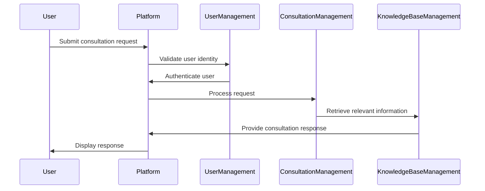

                 

### 文章标题：生物伦理咨询平台：科技伦理的即时指导服务

关键词：生物伦理、科技伦理、咨询平台、即时指导、数据隐私、人工智能

摘要：本文将深入探讨生物伦理咨询平台的设计与构建，解析其在科技伦理领域的重要性。通过分析核心概念、设计原则、系统架构、技术实现和应用实践，本文旨在为读者提供一个全面而详实的理解，帮助他们在面对复杂的生物科技问题时，能够快速获取专业的伦理指导。

### 目录大纲

1. **第一部分：背景与概述**

   1.1 生物伦理咨询平台的重要性

   1.2 生物伦理问题的全球背景

   1.3 科技伦理在生物领域的挑战

   1.4 生物伦理咨询平台的意义

   2. **第二部分：平台设计与构建**

   2.1 生物伦理咨询平台的设计原则

   2.2 构建生物伦理咨询平台的系统架构

   2.3 平台的技术实现与开发

   3. **第三部分：应用与实践**

   3.1 生物伦理咨询平台的实际应用场景

   3.2 平台使用指南

   3.3 未来展望与持续发展

   **附录：最佳实践 tips、小结、注意事项、拓展阅读**

#### 第一部分：背景与概述

##### 第1章：生物伦理咨询平台的重要性

在当今世界，生物技术的飞速发展带来了前所未有的机遇，同时也引发了一系列伦理和社会问题。从基因编辑到人工智能在医疗领域的应用，这些进步不仅改变了我们对生命和健康的理解，还挑战了传统的伦理观念。

**1.1 生物伦理问题的全球背景**

随着CRISPR-Cas9等基因编辑技术的问世，科学家们能够在细胞水平上精准地修改DNA序列，这一技术的潜力使得人类有能力治疗某些遗传性疾病，甚至创造出新的生物品种。然而，这种技术的应用也引发了关于基因编辑伦理的广泛讨论，例如基因编辑是否应该用于人类胚胎，基因编辑是否会导致“设计婴儿”的出现。

**1.2 科技伦理在生物领域的挑战**

生物领域的科技伦理问题不仅限于基因编辑。例如，人类基因组计划的完成引发了关于个人隐私和数据安全的担忧。基因数据的存储和共享如何确保个人隐私不受侵犯，成为了科技伦理学的重要议题。此外，随着生物信息学和人工智能技术的发展，生物数据的分析和处理能力大大增强，但这些技术也带来了新的伦理挑战，如数据滥用和算法偏见。

**1.3 生物伦理咨询平台的意义**

在这个背景下，生物伦理咨询平台应运而生。这类平台旨在为科研人员、医疗机构和公众提供即时的伦理指导，帮助他们理解和应对生物科技带来的伦理问题。生物伦理咨询平台的重要性体现在以下几个方面：

- **促进伦理决策的透明度和一致性**：通过提供专业的伦理指导，平台有助于各方在决策过程中更加透明和一致，减少伦理冲突和错误。
- **提高公众参与度**：生物伦理咨询平台可以促进公众对生物科技伦理问题的了解和参与，增强社会对生物科技发展的支持和信任。
- **推动科学和伦理的协调发展**：生物伦理咨询平台有助于科学和伦理的协调发展，确保生物技术的应用不会损害人类和生态环境的利益。

##### 第2章：生物伦理咨询平台的核心概念

为了深入理解生物伦理咨询平台，我们需要先了解其核心概念和基本原理。

**2.1 生物伦理的定义与范围**

生物伦理是指研究生物医学、生物技术、生命科学等领域中的伦理问题的学科。生物伦理关注的核心问题是人类生命、健康、福祉和环境等伦理价值。生物伦理的范围包括基因编辑、克隆技术、生殖技术、生物数据隐私、环境伦理等多个领域。

**2.2 科技伦理的定义与范围**

科技伦理是研究科技活动中的伦理问题的学科。科技伦理关注的核心问题是科技发展对社会、环境、经济和伦理的影响。科技伦理的范围包括人工智能、生物技术、信息技术、环境技术等多个领域。

**2.3 咨询平台的基本原理与运作模式**

生物伦理咨询平台的基本原理是通过提供专业知识和资源，帮助用户理解和解决生物科技伦理问题。平台的运作模式通常包括以下几个步骤：

1. **问题识别**：用户识别出生物科技伦理问题，并将其提交到平台。
2. **伦理评估**：平台利用专业知识和资源对问题进行评估，提供初步的伦理指导。
3. **专业咨询**：平台根据需要组织专业咨询团队，为用户提供深入的伦理指导和建议。
4. **持续更新**：平台定期更新伦理知识库，确保提供的伦理指导始终保持最新。

**2.4 核心概念与联系（ER实体关系图）**

为了更好地理解生物伦理咨询平台的核心概念和联系，我们可以通过ER（实体关系）图来表示。以下是一个简化的ER图：

```mermaid
erDiagram
  用户 ||--|{ 咨询请求 }|--|| 伦理问题
  用户 ||--|{ 咨询反馈 }|--|| 专业咨询
  用户 ||--|{ 伦理知识 }|--|| 知识库
  伦理问题 ||--|{ 伦理评估 }|--|| 评估结果
  专业咨询 ||--|{ 咨询报告 }|--|| 用户
  知识库 ||--|{ 知识更新 }|--|| 专业咨询
```

在这个ER图中，用户是核心实体，与伦理问题、咨询反馈、伦理知识和知识库等实体存在关系。伦理评估、咨询报告和知识更新等过程通过实体关系图清晰地表示出来，为平台的设计和开发提供了重要的参考。

### 第一部分总结

在第一部分中，我们首先探讨了生物伦理咨询平台的重要性，强调了其在生物科技伦理问题日益突出的背景下的重要性。接着，我们分析了生物伦理问题的全球背景和科技伦理在生物领域的挑战，并阐述了生物伦理咨询平台的基本原理和运作模式。最后，通过ER实体关系图，我们展示了生物伦理咨询平台的核心概念和联系。

在接下来的部分中，我们将深入探讨生物伦理咨询平台的设计原则、系统架构、技术实现和应用实践，为读者提供一个全面而详细的了解。让我们继续深入下去，逐步构建对生物伦理咨询平台的全面认识。

### 第二部分：平台设计与构建

在第一部分中，我们为读者介绍了生物伦理咨询平台的重要性及其核心概念。接下来，我们将深入探讨平台的设计原则、系统架构和技术实现，为构建一个高效、安全且用户友好的生物伦理咨询平台提供详细的指导和方案。

#### 第3章：生物伦理咨询平台的设计原则

设计一个生物伦理咨询平台，需要考虑用户体验、安全性、可扩展性和易用性等多个方面。以下是一些关键的设计原则：

**3.1 用户友好的界面设计**

用户友好的界面设计是平台成功的关键因素之一。界面设计应遵循以下原则：

- **简洁明了**：界面应简洁明了，避免过多的装饰和复杂的布局，使用户能够快速找到所需功能。
- **一致性**：界面风格应保持一致性，使用户在不同页面之间切换时不会感到困惑。
- **可访问性**：确保平台对所有用户，包括有特殊需求的用户，都是可访问的。

**3.2 安全隐私保护机制**

生物伦理咨询平台处理的数据通常涉及个人隐私和敏感信息，因此安全隐私保护至关重要。以下是一些关键的安全隐私保护机制：

- **数据加密**：所有传输和存储的数据都应进行加密，以防止数据泄露。
- **身份验证**：用户在登录平台时应进行严格的身份验证，确保只有授权用户才能访问敏感信息。
- **访问控制**：对平台中的不同数据和功能实施严格的访问控制，确保用户只能访问与其角色相关的信息。

**3.3 咨询流程设计**

咨询流程设计应确保用户能够方便地提交咨询请求、获取专业反馈，并进行后续的互动。以下是一些关键流程设计原则：

- **简洁高效**：咨询流程应简洁高效，减少不必要的步骤，确保用户能够快速得到响应。
- **灵活可扩展**：平台应具备灵活的扩展性，能够适应不同类型的咨询请求和反馈。
- **反馈机制**：应建立有效的反馈机制，使用户能够对平台的服务质量和咨询结果进行评价，以便不断改进平台。

**3.4 设计原则的实例分析**

以下是一个实例分析，说明如何在设计生物伦理咨询平台时应用上述设计原则：

- **实例分析**：假设我们需要设计一个用户友好的界面。首先，我们会进行用户调研，了解用户的需求和使用习惯。接着，我们设计一个简洁的导航栏，包含主要功能模块的入口，如“提交咨询请求”、“查看咨询结果”和“知识库”。为了提高一致性，我们会在整个平台上使用相同的图标和颜色方案。此外，我们还会确保所有页面都符合可访问性标准，例如提供屏幕阅读器的支持。

#### 第4章：构建生物伦理咨询平台的系统架构

生物伦理咨询平台的系统架构设计是确保平台高效运行和安全可靠的关键。以下是构建平台系统架构时需要考虑的关键因素：

**4.1 平台架构的设计方案**

一个高效的生物伦理咨询平台架构应具备以下特点：

- **模块化**：将平台分为多个功能模块，如用户管理、咨询管理、知识库管理、安全控制等，以便于维护和扩展。
- **分布式**：采用分布式架构，确保平台能够在高负载下稳定运行，并具备良好的扩展性。
- **安全性**：在架构设计中考虑安全性，确保数据传输和存储的安全，以及用户身份的验证和访问控制。

**4.2 系统功能模块划分**

根据平台的功能需求，可以将系统划分为以下功能模块：

- **用户管理模块**：负责用户的注册、登录、身份验证和权限管理。
- **咨询管理模块**：负责处理咨询请求的提交、分配、处理和反馈。
- **知识库管理模块**：负责维护和管理平台的知识库，包括伦理指南、案例研究和常见问题等。
- **安全控制模块**：负责数据加密、访问控制和日志审计，确保平台的安全性。

**4.3 数据库设计**

数据库设计是平台架构的核心部分，需要考虑数据的完整性、一致性和高效访问。以下是数据库设计的关键步骤：

- **需求分析**：分析平台的功能需求，确定需要存储的数据类型和结构。
- **概念设计**：使用实体关系模型（ER模型）设计数据库的概念结构。
- **逻辑设计**：将概念设计转换为逻辑模型，如关系数据库模型。
- **物理设计**：考虑数据库的性能和可扩展性，设计数据库的物理存储结构。

**4.4 系统接口设计**

系统接口设计是确保平台各模块之间能够高效通信的关键。以下是系统接口设计的关键因素：

- **API规范**：定义统一的API规范，确保不同模块之间的数据传输和交互一致。
- **接口安全性**：确保接口数据传输的安全性，如使用HTTPS协议进行数据传输。
- **接口性能**：优化接口设计，确保接口在高负载下的性能。

**4.5 系统架构图**

以下是一个简化的生物伦理咨询平台系统架构图，展示了平台的主要组成部分和它们之间的关系：



在这个系统架构图中，用户提交咨询请求后，系统会进行身份验证，并分配给相应的咨询管理模块。咨询管理模块会根据请求内容调用知识库管理模块，获取相关伦理信息，并生成咨询结果，最终反馈给用户。

#### 第5章：平台的技术实现与开发

在明确了生物伦理咨询平台的设计原则和系统架构后，接下来我们将讨论平台的技术实现与开发过程，包括开发环境的搭建、主要模块的代码实现、系统测试与优化以及开发过程中遇到的挑战与解决方案。

**5.1 开发环境的搭建**

搭建一个高效的开发环境是平台成功实现的基础。以下是搭建开发环境的关键步骤：

- **选择合适的开发工具**：根据项目需求，选择合适的开发工具和框架，如Python、Java、Spring Boot等。
- **配置开发环境**：安装必要的开发工具和库，如PyCharm、IntelliJ IDEA、Maven等。
- **设置版本控制系统**：使用Git等版本控制系统，确保代码的可维护性和协作开发。

**5.2 主要模块的代码实现**

生物伦理咨询平台包括多个功能模块，以下是主要模块的代码实现概述：

- **用户管理模块**：实现用户注册、登录、身份验证和权限管理功能。例如，使用Python的Flask框架实现用户注册接口。
  ```python
  from flask import Flask, request, jsonify
  app = Flask(__name__)

  @app.route('/register', methods=['POST'])
  def register():
      # 实现用户注册逻辑
      return jsonify({"status": "success", "message": "User registered successfully."})
  ```

- **咨询管理模块**：实现咨询请求的提交、分配、处理和反馈功能。例如，使用Python的Django框架实现咨询请求处理逻辑。
  ```python
  from django.db import models

  class ConsultationRequest(models.Model):
      user = models.ForeignKey('User', on_delete=models.CASCADE)
      title = models.CharField(max_length=255)
      description = models.TextField()
      status = models.CharField(max_length=50)

      def submit_request(self):
          # 实现提交咨询请求逻辑
          self.status = 'pending'
          self.save()
  ```

- **知识库管理模块**：实现知识库的维护和管理功能。例如，使用Python的Elasticsearch库实现知识库搜索功能。
  ```python
  from elasticsearch import Elasticsearch

  es = Elasticsearch()

  def search_knowledge_base(query):
      # 实现知识库搜索逻辑
      response = es.search(index="knowledge_base", body={"query": {"match": {"content": query}}})
      return response['hits']['hits']
  ```

- **安全控制模块**：实现数据加密、访问控制和日志审计功能。例如，使用Python的cryptography库实现数据加密。
  ```python
  from cryptography.fernet import Fernet

  key = Fernet.generate_key()
  cipher_suite = Fernet(key)

  def encrypt_data(data):
      # 实现数据加密逻辑
      return cipher_suite.encrypt(data.encode())

  def decrypt_data(encrypted_data):
      # 实现数据解密逻辑
      return cipher_suite.decrypt(encrypted_data).decode()
  ```

**5.3 系统测试与优化**

系统测试与优化是确保平台稳定性和性能的重要环节。以下是系统测试与优化的关键步骤：

- **单元测试**：编写单元测试用例，测试每个功能模块的独立性和正确性。
- **集成测试**：测试不同模块之间的集成和交互，确保系统整体功能的正确性。
- **性能测试**：进行性能测试，评估系统在高负载下的响应时间和吞吐量。
- **优化**：根据性能测试结果，优化代码和数据库查询，提高系统性能。

**5.4 开发中遇到的挑战与解决方案**

在开发过程中，我们可能会遇到以下挑战：

- **数据安全性**：确保数据在传输和存储过程中的安全性，尤其是涉及个人隐私和敏感信息。
  - **解决方案**：使用数据加密和访问控制机制，确保数据安全。

- **接口性能**：优化接口设计，提高系统在高负载下的性能。
  - **解决方案**：采用缓存机制和异步处理，减少接口响应时间。

- **扩展性**：确保平台能够随着用户规模的扩大而扩展。
  - **解决方案**：采用分布式架构，实现水平扩展。

通过以上技术实现与开发步骤，我们可以构建一个高效、安全且用户友好的生物伦理咨询平台，为科研人员、医疗机构和公众提供即时的伦理指导。接下来，我们将探讨生物伦理咨询平台的实际应用场景，展示其在不同领域中的应用价值。

#### 第二部分总结

在第二部分中，我们详细探讨了生物伦理咨询平台的设计原则、系统架构和技术实现。首先，我们介绍了用户友好的界面设计、安全隐私保护机制和咨询流程设计等设计原则。接着，我们分析了平台架构的设计方案、系统功能模块划分、数据库设计和系统接口设计。最后，我们讨论了平台的技术实现与开发过程，包括开发环境的搭建、主要模块的代码实现、系统测试与优化以及开发过程中遇到的挑战与解决方案。

通过这一部分的讨论，我们为生物伦理咨询平台的构建提供了详细的指导和方案，为平台的实际应用奠定了基础。在接下来的部分中，我们将探讨生物伦理咨询平台的实际应用场景，进一步展示其价值。让我们继续深入探讨。

### 第三部分：应用与实践

在第二部分中，我们详细探讨了生物伦理咨询平台的设计原则、系统架构和技术实现。在这一部分，我们将深入探讨生物伦理咨询平台在不同领域的实际应用场景，展示其在科学研究、医疗领域、环境保护和解决社会伦理问题等方面的价值。

#### 第6章：生物伦理咨询平台的实际应用场景

生物伦理咨询平台的应用场景非常广泛，涵盖了从科学研究到社会伦理等多个领域。以下是几个典型的应用场景：

**6.1 研究与应用实例**

在科学研究领域，生物伦理咨询平台可以为研究项目提供即时的伦理指导。例如，在基因编辑技术的研究中，平台可以提供关于伦理审查、知情同意和基因数据隐私等方面的指导。通过平台，研究人员可以快速获取最新的伦理法规和指导原则，确保研究活动符合伦理要求。

**6.2 医疗领域的应用**

在医疗领域，生物伦理咨询平台可以为医生、医疗机构和患者提供关于新兴医疗技术的伦理指导。例如，在基因治疗和个性化医疗中，平台可以提供关于遗传信息的隐私保护、患者知情权和医疗决策支持等方面的指导。通过平台，医疗机构可以更有效地管理伦理风险，提高患者满意度。

**6.3 环境保护与生物多样性保护**

在环境保护和生物多样性保护领域，生物伦理咨询平台可以提供关于环境技术、生物技术和生态工程等方面的伦理指导。例如，在生物入侵和生态修复项目中，平台可以提供关于生态影响评估、生物多样性保护和可持续发展等方面的指导，确保项目活动不会对生态环境造成不可逆转的损害。

**6.4 社会伦理问题与挑战**

在社会伦理问题领域，生物伦理咨询平台可以提供关于性别平等、种族歧视和人工智能伦理等方面的指导。例如，在基因编辑用于人类胚胎的研究中，平台可以提供关于伦理审查、社会影响评估和伦理决策支持等方面的指导，确保研究活动符合社会伦理和道德标准。

#### 第7章：平台使用指南

为了确保生物伦理咨询平台能够被广大用户有效使用，我们需要提供一个详细的平台使用指南，包括用户注册与登录、咨询流程操作指南、常见问题解答等内容。

**7.1 用户注册与登录**

用户注册与登录是使用平台的基础步骤。以下是用户注册与登录的详细步骤：

- **用户注册**：
  1. 访问平台官网，点击“注册”按钮。
  2. 填写注册信息，包括用户名、密码、电子邮箱等。
  3. 阅读并同意平台的服务条款。
  4. 提交注册信息，等待平台审核。

- **用户登录**：
  1. 访问平台官网，点击“登录”按钮。
  2. 输入用户名和密码。
  3. 点击“登录”按钮，进入平台。

**7.2 咨询流程操作指南**

用户在平台提交咨询请求后，需要按照以下步骤进行操作：

- **提交咨询请求**：
  1. 登录平台后，点击“提交咨询请求”按钮。
  2. 填写咨询请求的详细信息，包括问题类型、问题描述、相关文档等。
  3. 点击“提交”按钮，提交咨询请求。

- **查看咨询结果**：
  1. 登录平台后，点击“我的咨询”按钮。
  2. 在咨询列表中找到对应的咨询请求。
  3. 点击咨询请求，查看咨询结果和专家建议。

- **反馈与评价**：
  1. 在查看咨询结果后，用户可以对专家的咨询进行评价。
  2. 评价包括满意度、咨询质量等方面。
  3. 评价结果将用于平台改进和专家评估。

**7.3 常见问题解答**

为了帮助用户更好地使用平台，我们整理了一些常见问题及解答：

- **Q：如何注册账户？**
  A：在平台官网上点击“注册”按钮，按照提示填写注册信息并提交。

- **Q：登录后无法找到功能菜单？**
  A：请确保浏览器窗口最大化，或者重新刷新页面。

- **Q：提交咨询请求后未收到回复？**
  A：请检查邮箱，确认是否收到平台发送的咨询请求确认邮件。如果未收到邮件，请联系平台客服。

- **Q：如何查看咨询结果？**
  A：登录平台后，点击“我的咨询”按钮，在咨询列表中找到对应的咨询请求，点击查看。

**7.4 平台维护与更新**

为了确保平台的稳定运行和持续改进，平台会定期进行维护和更新。以下是平台维护与更新的相关信息：

- **维护通知**：平台会在维护前发布通知，告知用户维护时间和可能的影响。

- **更新日志**：平台会在每次更新后发布更新日志，包括新增功能、修复问题和优化内容。

- **用户反馈**：用户可以通过平台提供的问题反馈功能，对平台的运行情况和功能提出建议和意见，帮助平台不断改进。

#### 第8章：未来展望与持续发展

生物伦理咨询平台的发展前景广阔，未来将在以下几个方面实现持续发展：

**8.1 平台的长期发展规划**

- **扩展应用领域**：平台将继续扩展其应用领域，涵盖更多生物科技和伦理问题，如人工智能伦理、环境伦理等。

- **提高服务质量**：平台将不断提升咨询服务质量，增加专家团队规模，提高咨询效率和准确性。

- **技术创新**：平台将积极探索新技术，如区块链、大数据分析等，以提高平台的性能和安全性。

**8.2 持续改进与创新**

- **用户反馈机制**：平台将建立完善的用户反馈机制，定期收集和分析用户反馈，不断改进平台功能和服务。

- **学术研究合作**：平台将与学术机构和研究团队合作，开展生物伦理领域的学术研究和项目合作，推动伦理咨询的发展。

- **教育与培训**：平台将提供生物伦理相关教育和培训，提高公众对生物科技伦理问题的认识和意识。

**8.3 生物伦理咨询的未来趋势**

- **个性化伦理咨询**：未来，平台将提供更加个性化的伦理咨询服务，根据用户的背景和需求，提供定制化的伦理指导。

- **跨学科合作**：生物伦理咨询将越来越多地与法律、社会学、哲学等学科交叉融合，形成跨学科合作的新模式。

- **全球化发展**：随着生物科技的发展，生物伦理咨询平台将在全球范围内发挥作用，为不同国家和地区的用户提供服务。

通过未来展望与持续发展的讨论，我们可以看到生物伦理咨询平台在推动生物科技与伦理协调发展方面的重要作用。平台将继续致力于提供高质量、高效率的伦理咨询服务，为科学研究、医疗领域、环境保护和社会伦理问题提供有力支持。

### 第三部分总结

在第三部分中，我们深入探讨了生物伦理咨询平台在实际应用场景中的广泛应用，包括科学研究、医疗领域、环境保护和解决社会伦理问题等方面。通过详细的使用指南，我们帮助用户了解如何有效使用平台，并提供常见问题解答。最后，我们展望了生物伦理咨询平台的未来发展方向，探讨了其持续发展的重要性和潜在趋势。

通过这一部分的讨论，我们不仅了解了生物伦理咨询平台的具体应用，还看到了其在推动科技伦理发展中的巨大潜力。在接下来的附录部分，我们将提供一些最佳实践、注意事项和拓展阅读，以帮助读者更深入地理解生物伦理咨询平台，并进一步探索相关领域。

### 附录：最佳实践、注意事项和拓展阅读

在本文的附录部分，我们将提供一些最佳实践、注意事项和拓展阅读资源，以帮助读者更深入地了解生物伦理咨询平台，并掌握相关领域的最新动态。

#### 最佳实践

**1. 数据隐私保护**

在处理敏感数据时，确保使用高级加密算法和严格的访问控制机制。定期进行安全审计，以发现并修复潜在的安全漏洞。

**2. 用户体验优化**

通过用户调研和反馈，持续优化平台界面设计和交互流程。确保平台易于使用，并且适应不同用户的需求和习惯。

**3. 伦理知识库更新**

定期更新平台的知识库，确保包含最新的伦理法规、案例研究和最佳实践。鼓励专家团队积极参与知识库的维护和更新。

#### 注意事项

**1. 遵守法规**

在开发和运营生物伦理咨询平台时，严格遵守相关法律法规，确保平台符合生物伦理、数据保护和其他相关领域的法律要求。

**2. 用户身份验证**

确保用户身份验证机制的有效性，防止未经授权的用户访问敏感信息和功能。

**3. 系统性能监控**

定期监控平台性能，确保在高负载情况下系统稳定运行，及时处理和解决性能瓶颈。

#### 拓展阅读

**1. 生物伦理相关书籍**

- 《生物伦理学：基础原理、经典案例与新兴议题》
- 《基因伦理学：人类遗传资源的道德问题》
- 《科技伦理学导论：科学、技术与社会》

**2. 生物伦理学术期刊**

- 《生物伦理学杂志》（The Journal of Bioethics）
- 《环境与规划伦理学杂志》（Journal of Environmental Planning and Management）
- 《医学伦理学杂志》（Journal of Medical Ethics）

**3. 生物伦理相关的在线资源**

- 国际生物伦理学协会（International Association of Bioethics）
- 生物伦理学在线（Bioethics Online）
- 医学伦理学网（Medical Ethics Network）

通过以上最佳实践、注意事项和拓展阅读资源，读者可以进一步加深对生物伦理咨询平台的理解，并在实际应用中取得更好的效果。我们鼓励读者持续关注生物伦理领域的最新动态，积极参与相关学术讨论和实践探索。

### 文章作者信息

作者：AI天才研究院/AI Genius Institute & 禅与计算机程序设计艺术 /Zen And The Art of Computer Programming

感谢您的阅读，希望本文能够为您的生物伦理咨询平台研究和实践提供有价值的参考和指导。在未来的研究中，我们将继续深入探讨生物伦理咨询平台的发展方向和实际应用，为科技伦理的即时指导服务贡献更多力量。

