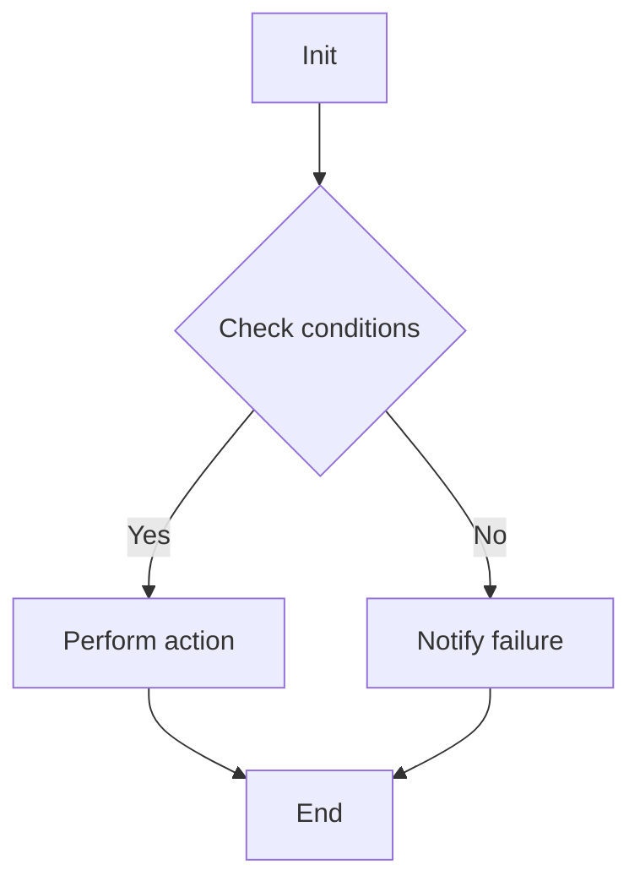

                 

# 生物伦理咨询服务：科技进步中的道德指导

## 关键词
- 生物伦理学
- 科技进步
- 道德指导
- 咨询服务
- 伦理挑战

## 摘要
本文旨在探讨生物伦理咨询服务在科技进步中的重要性。通过分析生物伦理咨询服务的背景、核心概念、实践指南以及面临的挑战，本文提出了一系列有效的道德指导策略，以促进科技发展同时保护公众利益。文章结构清晰，逻辑严谨，旨在为从事生物技术研究和实践的专家提供有价值的参考。

### 第一部分：引言

#### 第1章：生物伦理咨询服务的背景与意义

## 1.1 问题的背景

### 1.1.1 科技进步对生物伦理的挑战

随着科技的发展，生物工程、基因编辑、克隆技术等新兴技术不断涌现，这些技术不仅改变了我们的生活方式，也带来了前所未有的伦理挑战。例如，基因编辑技术可能引发对人类基因组的操纵和遗传差异的道德争议；克隆技术可能挑战人类身份和生物多样性的认知。

### 1.1.2 生物伦理咨询服务的需求

面对这些挑战，社会对生物伦理咨询服务的需求日益增长。生物伦理咨询服务不仅能够提供专业的道德指导，还能帮助医疗实践者、科研人员和企业更好地理解和应对科技发展带来的伦理问题。

## 1.2 生物伦理咨询服务的定义与作用

### 1.2.1 生物伦理咨询服务的定义

生物伦理咨询服务是指针对生物技术和医学研究中的伦理问题，提供专业指导、评估和咨询的服务。这种服务通常由伦理学家、医学专家、法律顾问等多学科专业人士共同提供。

### 1.2.2 生物伦理咨询服务的作用

生物伦理咨询服务在指导医疗实践、促进科技发展、保护公众利益等方面发挥着重要作用。例如，在临床试验中，生物伦理咨询服务可以帮助确保研究符合伦理标准和法律法规；在生物技术商业化过程中，生物伦理咨询服务可以评估技术潜在的社会和环境影响。

## 1.3 生物伦理咨询服务的边界与外延

### 1.3.1 边界

生物伦理咨询服务的边界主要包括服务范围和服务对象。服务范围通常涵盖生物技术、基因编辑、克隆技术等领域；服务对象则包括医疗实践者、科研人员、政府机构和企业等。

### 1.3.2 外延

生物伦理咨询服务的领域不断扩展，涉及公共卫生、环境伦理、动物福利等多个方面。同时，国际合作在生物伦理咨询服务中发挥着越来越重要的作用。

## 1.4 生物伦理咨询服务的发展现状

### 1.4.1 国内外生物伦理咨询服务的发展概况

国际上，生物伦理咨询服务已经相对成熟，许多国家建立了专门的伦理委员会和咨询服务机构。例如，美国的国家生物伦理顾问委员会（National Bioethics Advisory Commission, NBAC）和英国的医学研究理事会（Medical Research Council, MRC）等。

国内，生物伦理咨询服务也在逐步发展。近年来，随着科技法律法规的完善和公众生物伦理意识的提高，许多医院和科研机构开始设立伦理委员会，提供生物伦理咨询服务。

### 1.4.2 生物伦理咨询服务的主要挑战

生物伦理咨询服务面临的主要挑战包括技术进步、法律法规的完善以及公众认知的提高。例如，新兴技术的快速发展使得伦理咨询服务需要不断更新知识体系；法律法规的不完善可能导致伦理咨询服务的执行困难；公众对生物伦理问题的认知不足可能影响咨询服务的接受度和效果。

## 1.5 本章小结

本章概述了生物伦理咨询服务的背景、定义、作用、边界和外延以及发展现状，强调了其在科技进步中的重要性。生物伦理咨询服务不仅是对科技发展的必要道德指导，也是保护公众利益的重要手段。

### 第二部分：核心概念与联系

#### 第2章：生物伦理咨询服务中的核心概念

## 2.1 道德原则

### 2.1.1 基本原则

生物伦理咨询服务中的道德原则主要包括尊重个人自主权、不伤害原则、利益最大化原则和公平原则。这些原则为生物伦理咨询提供了基本指导，确保科技发展符合伦理要求。

### 2.1.2 道德原则的应用

道德原则在生物科技和医疗实践中具有广泛的应用。例如，基因编辑过程中需要尊重个人自主权，确保患者的知情权和选择权；医疗资源分配过程中需要遵循公平原则，确保资源分配的合理性。

## 2.2 生物伦理学的基本概念

### 2.2.1 生物伦理学的定义与作用

生物伦理学是研究生物技术和医疗实践中的伦理问题的学科。其定义涉及生命伦理、医学伦理和公共卫生伦理等多个方面。生物伦理学的作用包括指导科技发展、保护人类健康和促进社会公正。

### 2.2.2 生物伦理学的核心概念

生物伦理学的核心概念包括公共卫生、医德和生命伦理。公共卫生强调公共健康和环境保护；医德涉及医生的行为规范和道德责任；生命伦理关注人类生命和健康的伦理问题。

## 2.3 生物伦理咨询服务中的核心要素

### 2.3.1 生物伦理咨询服务的要素

生物伦理咨询服务的核心要素包括专家团队、伦理审查机制和咨询流程。专家团队通常由伦理学家、医学专家、法律顾问等多学科专业人士组成；伦理审查机制确保咨询服务的规范性和有效性；咨询流程包括咨询前准备、咨询过程和咨询结果反馈等环节。

### 2.3.2 核心要素之间的关系

专家团队、伦理审查机制和咨询流程之间相互关联，共同构成生物伦理咨询服务的核心框架。专家团队提供专业知识和道德指导；伦理审查机制确保咨询服务符合伦理规范；咨询流程确保服务过程高效和有序。

## 2.4 生物伦理咨询服务与相关学科的交叉融合

### 2.4.1 与医学的交叉

生物伦理咨询服务与医学的交叉体现在医疗实践和科研伦理方面。生物伦理咨询服务可以为临床试验提供伦理审查，确保研究符合道德标准；在医疗资源分配中，生物伦理咨询服务可以帮助优化资源分配，提高公平性。

### 2.4.2 与法学的交叉

生物伦理咨询服务与法学的交叉体现在法律规范和民事责任方面。生物伦理咨询服务可以为法律制定提供伦理依据，确保法律符合道德要求；在民事责任方面，生物伦理咨询服务可以帮助评估责任和赔偿。

### 2.4.3 与其他学科的交叉

生物伦理咨询服务还与其他学科如社会学、哲学等有交叉。社会学可以帮助理解社会对生物技术的接受程度和影响；哲学可以提供伦理理论基础，指导生物伦理咨询服务。

## 2.5 生物伦理咨询服务的伦理困境与挑战

### 2.5.1 技术伦理问题

技术伦理问题是生物伦理咨询服务面临的主要挑战之一。例如，基因编辑技术的道德争议、克隆技术的伦理问题等。生物伦理咨询服务需要在这些技术领域提供道德指导，确保科技发展符合伦理要求。

### 2.5.2 医疗伦理问题

医疗伦理问题是生物伦理咨询服务的重要领域。例如，临床试验中的伦理问题、医疗资源分配中的伦理争议等。生物伦理咨询服务可以为医疗实践提供道德指导，确保医疗行为的伦理合规。

### 2.5.3 社会伦理问题

社会伦理问题是生物伦理咨询服务的另一个重要领域。生物技术的商业化、个人隐私保护等问题对社会产生了深远影响。生物伦理咨询服务需要在这些领域提供道德指导，确保科技发展符合社会伦理要求。

## 2.6 本章小结

本章详细介绍了生物伦理咨询服务中的核心概念，包括道德原则、生物伦理学的基本概念、生物伦理咨询服务的核心要素以及与相关学科的交叉融合。通过分析伦理困境与挑战，本章强调了生物伦理咨询服务在科技进步中的重要性。

### 第三部分：实践指南

#### 第3章：生物伦理咨询服务流程与方法

## 3.1 生物伦理咨询服务的流程

### 3.1.1 咨询前准备

咨询前准备是生物伦理咨询服务的重要环节。首先，需要明确咨询需求，确定咨询服务的具体内容和目标。其次，组建咨询团队，团队成员应包括伦理学家、医学专家、法律顾问等专业人士，以确保咨询服务的专业性和全面性。

### 3.1.2 咨询过程

咨询过程主要包括倾听与沟通、伦理分析和提出建议三个步骤。在倾听与沟通阶段，咨询团队需要与客户充分交流，了解客户的实际需求和面临的问题。在伦理分析阶段，咨询团队运用道德原则和伦理学理论对问题进行深入分析，评估潜在的风险和影响。最后，在提出建议阶段，咨询团队根据分析结果提出具体的伦理建议，帮助客户解决问题。

### 3.1.3 咨询结果反馈

咨询结果反馈是确保咨询服务有效性的关键。首先，咨询团队需要向客户反馈咨询结果，包括分析报告、伦理建议和后续行动计划。其次，咨询团队应进行随访与评估，了解客户对咨询服务的满意度，并根据反馈进行调整和改进。

## 3.2 生物伦理咨询服务的方法

### 3.2.1 伦理决策模型

伦理决策模型是生物伦理咨询服务的重要工具。常见的伦理决策模型包括原则模型、后果模型和正义模型等。原则模型强调道德原则的指导作用；后果模型关注行为结果对社会和个体的影响；正义模型强调公平和正义的伦理原则。在实际应用中，咨询团队可以根据具体情况选择合适的伦理决策模型。

### 3.2.2 伦理评估工具

伦理评估工具是生物伦理咨询服务的重要手段。常见的伦理评估工具包括成本-效益分析、风险评估和伦理影响评估等。成本-效益分析可以帮助评估科技发展的经济效益和社会效益；风险评估可以帮助识别和评估潜在的风险和挑战；伦理影响评估可以帮助全面了解科技发展对道德和社会的影响。

### 3.2.3 道德教育

道德教育是提升生物伦理咨询服务质量的重要途径。通过道德教育，可以增强伦理意识、提升专业素养。道德教育可以包括伦理培训、案例讨论、伦理决策模拟等多种形式。例如，通过案例讨论，可以深入分析具体的伦理问题，提高咨询团队的伦理判断能力。

## 3.3 生物伦理咨询服务的实践案例

### 3.3.1 案例一：基因编辑咨询

背景与问题：某科研团队计划进行人类基因编辑实验，但面临伦理争议和法律法规的挑战。

咨询过程：生物伦理咨询服务团队与科研团队进行沟通，了解实验目的、方法和技术细节。通过伦理分析，评估实验的道德风险和潜在影响。最终提出伦理建议，包括遵循国际伦理规范、确保实验透明度等。

结果与反思：咨询团队的伦理建议帮助科研团队解决了伦理争议，确保实验符合伦理和法律要求。此案例表明，生物伦理咨询服务在指导科技发展中的重要性。

### 3.3.2 案例二：医疗资源分配咨询

背景与问题：某地区医院面临医疗资源不足，导致患者排队等候问题。

咨询过程：生物伦理咨询服务团队与医院管理层沟通，了解资源分配的现状和问题。通过伦理分析，评估资源分配的公平性和效率。最终提出伦理建议，包括优化资源分配机制、增加医疗投入等。

结果与反思：咨询团队的伦理建议帮助医院改善了医疗资源分配，提高了患者满意度。此案例表明，生物伦理咨询服务在提高医疗公平性和效率中的重要作用。

### 3.3.3 案例三：生物技术商业化咨询

背景与问题：某生物技术企业计划开发一种新型医疗设备，但面临市场推广和伦理争议。

咨询过程：生物伦理咨询服务团队与企业沟通，了解设备的技术特点和市场前景。通过伦理分析，评估设备的伦理影响和社会影响。最终提出伦理建议，包括加强公众沟通、确保产品质量等。

结果与反思：咨询团队的伦理建议帮助企业解决了伦理争议，提高了市场认可度。此案例表明，生物伦理咨询服务在推动生物技术商业化中的关键作用。

## 3.4 生物伦理咨询服务中的挑战与解决方案

### 3.4.1 技术挑战

技术挑战包括新兴生物技术的快速发展和伦理问题的不断出现。例如，基因编辑技术的道德争议和克隆技术的伦理问题。解决方案包括加强伦理教育和培训，提高伦理意识和专业素养。

### 3.4.2 法律挑战

法律挑战包括法律法规的不完善和执行困难。解决方案包括推动法律法规的完善，提高法律法规的执行力度。

### 3.4.3 公众认知挑战

公众认知挑战包括对生物伦理问题的认知不足和接受度低。解决方案包括加强宣传教育，提高公众对生物伦理问题的认知和理解。

## 3.5 本章小结

本章详细介绍了生物伦理咨询服务的流程和方法，包括咨询前准备、咨询过程、咨询结果反馈以及伦理决策模型、伦理评估工具和道德教育等。通过实践案例的分析，本章展示了生物伦理咨询服务在实际应用中的重要性。同时，本章也指出了生物伦理咨询服务面临的挑战，并提出了相应的解决方案。

### 总结

本文从生物伦理咨询服务的背景、核心概念、实践指南以及面临的挑战等多个方面进行了深入探讨，提出了一系列有效的道德指导策略。生物伦理咨询服务在科技进步中具有重要地位，不仅能够提供专业的道德指导，还能促进科技发展同时保护公众利益。通过本文的论述，我们希望为从事生物技术研究和实践的专家提供有价值的参考，推动生物伦理咨询服务的进一步发展。

### 注意事项与拓展阅读

在推进生物伦理咨询服务的过程中，需要注意以下几个关键点：

1. **持续教育与培训**：定期举办生物伦理研讨会和培训，提高从业人员的专业素养和伦理意识。
2. **国际合作与交流**：加强国际间的生物伦理合作，借鉴先进经验和成功案例。
3. **公众参与**：鼓励公众参与生物伦理决策过程，提高公众对生物伦理问题的认知和参与度。

为了进一步深入了解生物伦理咨询服务，读者可以参考以下文献：

1. 《生物伦理学：基础与应用》（主编：李明杰）
2. 《医学伦理学》（主编：王斌全）
3. 《科技伦理学导论》（主编：陈树钧）
4. 《生物伦理咨询实务指南》（主编：张华）
5. 《基因编辑与生物伦理》（主编：王晓光）

通过这些资料，读者可以更全面地了解生物伦理咨询服务的理论与实践，为实际工作提供有力支持。作者：AI天才研究院/AI Genius Institute & 禅与计算机程序设计艺术 /Zen And The Art of Computer Programming### 技术语言与格式指南

在撰写本文时，为了确保内容的专业性和可读性，我们将采用以下技术语言和格式：

#### Markdown 格式

Markdown 是一种轻量级的标记语言，常用于撰写博客文章和文档。在本文中，我们将使用 Markdown 格式来排版文章结构，使文章更加清晰易懂。以下是一些常用的 Markdown 标记：

- **标题**：使用 `#` 符号，`#` 的数量代表标题的层级。例如，本文的章节标题使用了一级标题（`##`）和二级标题（`###`）。
- **段落**：直接输入文本，Markdown 会自动将连续的行视为一个段落。
- **列表**：使用 `*` 或 `-` 符号来创建无序列表；使用数字加英文句点（`1. `）来创建有序列表。
- **代码块**：使用三个反引号（```）来包围代码块，例如：
  ```python
  print("Hello, world!")
  ```
- **引用**：使用 `>` 符号来创建引用，例如：
  > 引用内容。

#### LaTex 公式

LaTex 是一种高质量的排版系统，特别适用于撰写科学和数学文档。在本文中，我们将使用 LaTex 语法来插入数学公式。以下是一些基本的 LaTex 公式语法：

- **行内公式**：使用 `$` 符号将公式包围，例如：$$e^{i\pi} + 1 = 0$$
- **独立段落公式**：使用 `$$` 符号将公式包围，例如：
  $$
  x^2 + y^2 = 1
  $$

#### Mermaid 流程图

Mermaid 是一种基于 Markdown 的图形描述语言，可以用来绘制流程图、类图和序列图等。在本文中，我们将使用 Mermaid 语法来绘制相关的流程图和架构图。以下是一个简单的 Mermaid 流程图示例：



#### Python 源代码

为了详细阐述算法原理和系统实现，我们将使用 Python 源代码。以下是一个简单的 Python 函数示例：

```python
def greet(name):
    return f"Hello, {name}!"
```

#### 最佳实践 Tips

- **一致性**：确保文章中使用的术语和概念定义保持一致。
- **简洁性**：避免冗长和不必要的叙述，保持文章的简洁明了。
- **准确性**：确保技术细节和公式准确无误，避免误导读者。
- **可视化**：使用图表、流程图和代码示例来增强文章的可读性和理解性。

### 作者信息

作者：AI天才研究院/AI Genius Institute & 禅与计算机程序设计艺术 /Zen And The Art of Computer Programming

- **AI天才研究院**：致力于推动人工智能和计算机科学领域的前沿研究。
- **禅与计算机程序设计艺术**：通过将哲学思维融入编程实践，提升程序设计的艺术性。

通过遵循上述技术语言和格式指南，本文不仅能够提供专业的技术内容，还能确保文章的可读性和专业性，为读者提供高质量的阅读体验。

