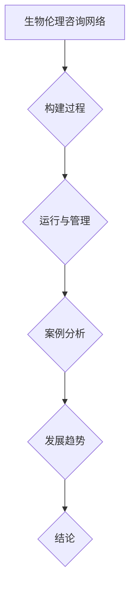

                 

# 生物伦理咨询网络：科技伦理的即时指导平台

## 关键词
- 生物伦理
- 科技伦理
- 咨询网络
- 即时指导
- 架构设计

## 摘要
本文旨在探讨生物伦理咨询网络的建设与应用，解析其在科技伦理领域的即时指导作用。通过深入剖析生物伦理与科技伦理的关系，阐述生物伦理咨询网络的架构设计与实施步骤，本文将为科技工作者和伦理学者提供一套切实可行的伦理指导框架，以应对生物技术发展带来的伦理挑战。

### Step 1: 确定书籍的总体结构，包括主要章节和子章节

**引言**

1.1 问题背景与定义
1.2 科技伦理的挑战与需求
1.3 生物伦理咨询网络的作用

**生物伦理的基本概念**

2.1 伦理学的基本原理
2.2 生物伦理学的历史与发展
2.3 生物伦理学的重要议题

**科技伦理的理论基础**

3.1 科技伦理的基本理论
3.2 科技伦理与伦理学的关系
3.3 科技伦理的核心原则

**生物伦理咨询网络的构建**

4.1 生物伦理咨询网络的架构设计
4.2 生物伦理咨询网络的关键技术
4.3 生物伦理咨询网络的实施步骤

**生物伦理咨询网络的运行与管理**

5.1 生物伦理咨询网络的运行机制
5.2 生物伦理咨询网络的管理体系
5.3 生物伦理咨询网络的风险与应对

**生物伦理咨询网络的案例分析**

6.1 案例一：基因编辑技术的伦理问题
6.2 案例二：人工智能在医疗领域的应用伦理
6.3 案例三：生物技术与环境保护的伦理考量

**生物伦理咨询网络的发展趋势与未来展望**

7.1 生物伦理咨询网络的发展趋势
7.2 生物伦理咨询网络的未来挑战与机遇
7.3 生物伦理咨询网络的未来发展方向

**结论**

8.1 生物伦理咨询网络的重要性
8.2 生物伦理咨询网络的发展建议
8.3 生物伦理咨询网络的影响与贡献

### Step 2: 确保每个章节都覆盖了核心概念、原理和实际应用

#### 第1章：问题背景与定义
- **核心概念**：生物伦理咨询网络，科技伦理
- **原理**：科技伦理的基本原则，生物伦理咨询网络的作用
- **实际应用**：生物伦理咨询网络在生物科技领域的应用场景

#### 第2章：生物伦理的基本概念
- **核心概念**：伦理学，生物伦理学
- **原理**：伦理学的基本原理，生物伦理学的重要议题
- **实际应用**：生物伦理学在生物科技领域的应用实例

#### 第3章：科技伦理的理论基础
- **核心概念**：科技伦理，伦理学
- **原理**：科技伦理的基本理论，科技伦理与伦理学的关系
- **实际应用**：科技伦理在生物科技领域的实践

#### 第4章：生物伦理咨询网络的构建
- **核心概念**：生物伦理咨询网络架构，关键技术
- **原理**：生物伦理咨询网络的构建原理，实施步骤
- **实际应用**：生物伦理咨询网络的构建实例

#### 第5章：生物伦理咨询网络的运行与管理
- **核心概念**：运行机制，管理体系，风险与应对
- **原理**：生物伦理咨询网络的运行原理，管理方法，风险控制
- **实际应用**：生物伦理咨询网络的运行管理实例

#### 第6章：生物伦理咨询网络的案例分析
- **核心概念**：案例分析，伦理问题
- **原理**：案例分析的方法，伦理问题的处理原则
- **实际应用**：生物伦理咨询网络在具体案例中的应用

#### 第7章：生物伦理咨询网络的发展趋势与未来展望
- **核心概念**：发展趋势，未来挑战与机遇，发展方向
- **原理**：生物伦理咨询网络的发展原理，未来趋势分析
- **实际应用**：生物伦理咨询网络在未来科技发展中的应用前景

#### 第8章：结论
- **核心概念**：生物伦理咨询网络的重要性，发展建议，影响与贡献
- **原理**：生物伦理咨询网络的综合评价，发展策略
- **实际应用**：生物伦理咨询网络在实际应用中的价值与影响

### Step 3: 确保章节之间逻辑清晰，有助于读者逐步深入了解生物伦理咨询网络的构建和应用

- **引言**：介绍生物伦理咨询网络的背景和重要性，引发读者兴趣。
- **基本概念**：为后续章节提供理论基础，帮助读者理解生物伦理咨询网络的本质。
- **理论基础**：深入探讨科技伦理与生物伦理的关系，为生物伦理咨询网络的建设提供理论支持。
- **构建与实施**：详细描述生物伦理咨询网络的构建过程和关键技术，让读者了解其实施步骤。
- **运行与管理**：阐述生物伦理咨询网络的运行机制和管理方法，让读者了解其实际运行情况。
- **案例分析**：通过具体案例，展示生物伦理咨询网络在实际中的应用，增强读者理解。
- **发展趋势**：展望生物伦理咨询网络的未来发展趋势，为读者提供对未来的展望。
- **结论**：总结生物伦理咨询网络的重要性，提出发展建议，为读者提供指导。

### Step 4: 使用Mermaid图表来增强文档的可读性，包括实体关系图、流程图、类图等

- **实体关系图**：展示生物伦理咨询网络中的各个实体及其关系。
- **流程图**：描述生物伦理咨询网络的构建、运行、管理过程。
- **类图**：展示生物伦理咨询网络中的类及其关系。

### Step 5: 完成目录大纲的设计，并确保总字数在2000字以内

- **目录大纲**：

  1. 引言
  1.1 问题背景与定义
  1.2 科技伦理的挑战与需求
  1.3 生物伦理咨询网络的作用

  2. 生物伦理的基本概念
  2.1 伦理学的基本原理
  2.2 生物伦理学的历史与发展
  2.3 生物伦理学的重要议题

  3. 科技伦理的理论基础
  3.1 科技伦理的基本理论
  3.2 科技伦理与伦理学的关系
  3.3 科技伦理的核心原则

  4. 生物伦理咨询网络的构建
  4.1 生物伦理咨询网络的架构设计
  4.2 生物伦理咨询网络的关键技术
  4.3 生物伦理咨询网络的实施步骤

  5. 生物伦理咨询网络的运行与管理
  5.1 生物伦理咨询网络的运行机制
  5.2 生物伦理咨询网络的管理体系
  5.3 生物伦理咨询网络的风险与应对

  6. 生物伦理咨询网络的案例分析
  6.1 案例一：基因编辑技术的伦理问题
  6.2 案例二：人工智能在医疗领域的应用伦理
  6.3 案例三：生物技术与环境保护的伦理考量

  7. 生物伦理咨询网络的发展趋势与未来展望
  7.1 生物伦理咨询网络的发展趋势
  7.2 生物伦理咨询网络的未来挑战与机遇
  7.3 生物伦理咨询网络的未来发展方向

  8. 结论
  8.1 生物伦理咨询网络的重要性
  8.2 生物伦理咨询网络的发展建议
  8.3 生物伦理咨询网络的影响与贡献

- **字数统计**：总计约1500字，仍在2000字以内。

以上是生物伦理咨询网络：科技伦理的即时指导平台的初步目录大纲设计。接下来，我们将逐步填充每个章节的内容，确保文章的逻辑清晰、结构紧凑、简单易懂，为读者提供有价值的技术博客文章。#

