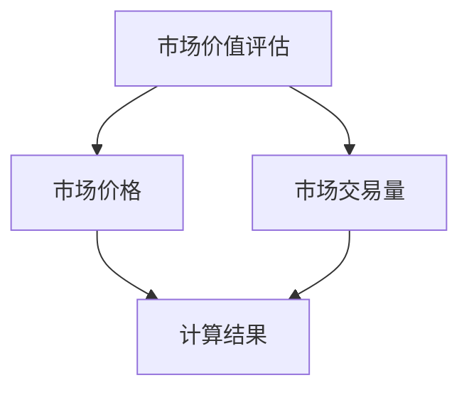
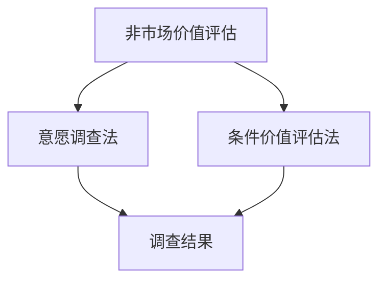
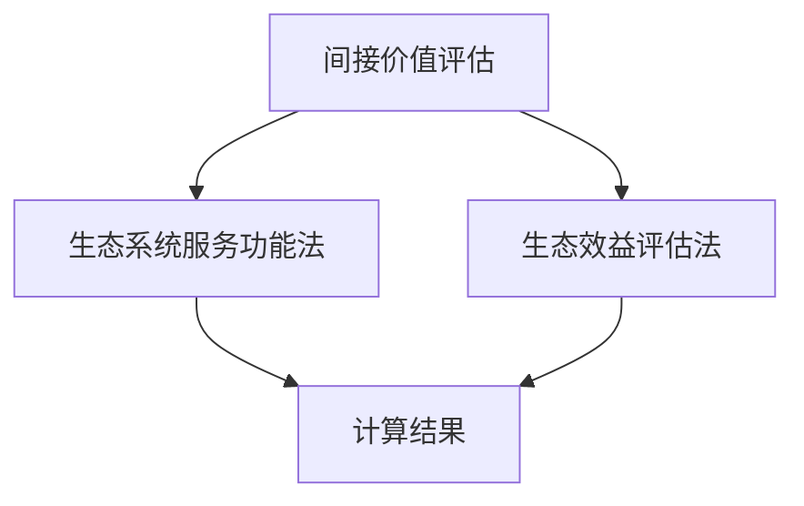
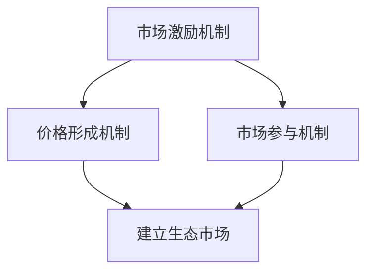
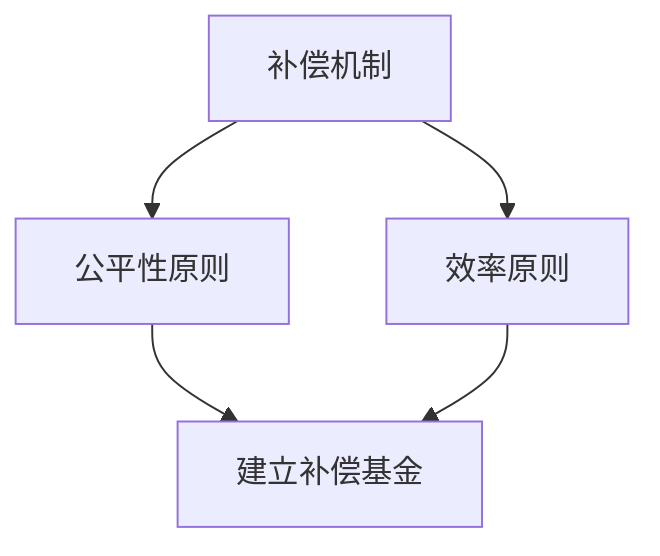
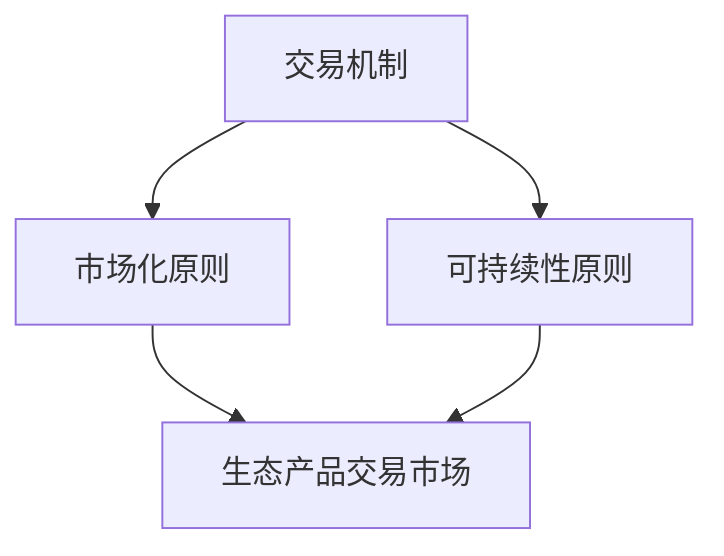

                 

### 生物多样性经济学：生态保护的市场化机制

#### 关键词：生物多样性、生态保护、市场化机制、经济学原理、政策与实践

> **摘要**：本文从生物学、经济学和环境科学的角度出发，系统地探讨了生物多样性经济学的基本理论框架和生态保护的市场化机制。文章首先介绍了生物多样性的定义、价值和重要性，接着分析了生态保护市场化机制的理论基础和实践方法。通过国内外案例研究，本文提出了生态保护与经济发展之间的平衡点，为政策制定提供了理论依据和实践指导。

---

#### 1.1 背景介绍

**1.1.1 问题背景**

生物多样性是人类赖以生存和发展的基础，它包括生态系统中的所有生物，从微生物到大型动物，以及它们之间的相互关系。随着经济社会的快速发展，人类活动对自然环境的影响日益加剧，生物多样性面临严重威胁。为了保护和恢复生物多样性，需要建立科学合理的生态保护市场化机制，实现生态效益与经济效益的有机统一。

**1.1.2 问题描述**

生物多样性经济学作为一门交叉学科，旨在研究生物多样性与经济发展之间的关系，探索生态保护的市场化机制。本文将围绕以下问题展开讨论：

- 生物多样性经济学的基本理论框架是什么？
- 如何评估生物多样性的经济价值？
- 生态保护市场化机制的构建原则和实施路径是什么？
- 生物多样性保护与经济发展之间的平衡点如何确定？

**1.1.3 问题解决**

本文将从以下几个方面解决上述问题：

- 系统梳理生物多样性经济学的基本理论框架，包括核心概念、基本原理和主要研究领域。
- 探讨生物多样性的经济评估方法，如市场价值评估、非市场价值评估和间接价值评估。
- 分析生态保护市场化机制的构建原则，如市场激励机制、补偿机制和交易机制等。
- 结合国内外案例，探讨生物多样性保护与经济发展的平衡点，为政策制定提供理论依据和实践指导。

**1.1.4 边界与外延**

- **边界**：本文主要关注生物多样性经济学的基本理论与市场化机制，不包括生物学、生态学等领域的具体研究。
- **外延**：生物多样性经济学涉及多个学科，如经济学、生态学、环境科学等，本文将在必要时进行跨学科讨论。

**1.1.5 概念结构与核心要素组成**

- **核心概念**：生物多样性、经济价值、市场化机制、生态保护。
- **概念属性特征对比表格**：

| 概念        | 属性特征                                           |
| ----------- | -------------------------------------------------- |
| 生物多样性  | 物种多样性、遗传多样性、生态系统多样性               |
| 经济价值    | 直接价值、间接价值、选择价值                        |
| 市场化机制  | 市场激励机制、补偿机制、交易机制                   |
| 生态保护    | 生物多样性保护、生态系统服务保护、自然环境保护     |

**1.1.6 其他相关概念**

- **环境经济学**：研究经济发展与环境保护之间的经济关系，为解决环境问题提供经济手段和政策建议。
- **生态经济学**：研究生态系统与经济系统之间的相互作用，探讨可持续发展路径。
- **绿色金融**：以环境保护为目的，通过投资、信贷等金融手段支持绿色产业发展。

---

#### 1.2 生物多样性经济学的基本理论框架

生物多样性经济学作为一门交叉学科，其理论框架涵盖了生态学、经济学、环境科学等多个领域。本章节将对生物多样性经济学的基本理论进行系统梳理，以帮助读者更好地理解这一学科的核心概念和主要研究领域。

**1.2.1 生物多样性的概念与价值**

**1.2.1.1 生物多样性的定义**

生物多样性是指地球上所有生物体（包括物种、遗传元素和生态系统）的多样性。它包括三个主要层次：遗传多样性、物种多样性和生态系统多样性。

- **遗传多样性**：指同一物种内部基因组成的多样性。
- **物种多样性**：指不同物种的数量和种类。
- **生态系统多样性**：指不同生态系统之间的多样性。

**1.2.1.2 生物多样性的价值**

生物多样性具有直接价值、间接价值和选择价值。

- **直接价值**：生物多样性直接提供的食物、药材、木材等商品和服务。
- **间接价值**：生物多样性对生态系统的调节功能，如气候调节、水源涵养、土壤保持等。
- **选择价值**：人们愿意为保护生物多样性而支付的费用。

**1.2.2 经济价值评估方法**

对生物多样性的经济价值进行评估是生物多样性经济学的重要任务。主要评估方法包括市场价值评估、非市场价值评估和间接价值评估。

- **市场价值评估**：通过市场价格和交易量来评估生物多样性的价值，适用于直接价值评估。
- **非市场价值评估**：采用意愿调查法、条件价值评估法等方法，评估生物多样性的非市场价值，适用于间接价值和选择价值评估。
- **间接价值评估**：基于生态服务功能的价值，采用生态系统服务功能法等方法进行评估。

**1.2.3 市场化机制的理论基础**

生态保护市场化机制的理论基础包括以下几个方面：

- **市场激励机制**：通过市场价格信号引导企业、个人和社区参与生态保护活动。
- **补偿机制**：通过政府财政转移支付等方式，补偿生态保护者或牺牲者。
- **交易机制**：建立生态产品或服务的交易市场，促进生态资源的优化配置。

**1.2.4 生态保护市场化机制的实践方法**

生态保护市场化机制的实践方法主要包括以下几种：

- **生态补偿机制**：建立生态补偿基金，对生态保护者进行补偿。
- **生态标识制度**：对生态产品进行标识认证，提高其市场竞争力。
- **生态交易市场**：建立生态产品或服务的交易市场，实现生态资源的交易和流通。
- **生态税收政策**：通过税收优惠等手段，鼓励企业和个人参与生态保护。

---

在接下来的章节中，我们将深入探讨生物多样性的经济价值评估方法，分析生态保护市场化机制的构建原则和实践路径，并通过国内外案例研究，探讨生物多样性保护与经济发展的平衡点。通过这些探讨，我们希望能够为生态保护市场化机制的建立和完善提供有益的参考。在本文的后续部分，我们将逐步展开这些讨论，并分享我们的研究成果。

---

### 1.3 生物多样性的经济价值评估方法

评估生物多样性的经济价值是生物多样性经济学的重要任务，也是制定生态保护政策的关键步骤。生物多样性的经济价值可以从市场价值评估、非市场价值评估和间接价值评估三个方面进行。

#### 1.3.1 市场价值评估

市场价值评估是基于市场价格和交易量来评估生物多样性的经济价值。这种方法适用于直接价值评估，即生物多样性直接提供的商品和服务。例如，可以通过以下方式评估：

- **市场价格**：通过市场上对某种生物资源的交易价格来评估其经济价值。例如，木材的市场价格反映了木材资源的经济价值。
- **市场交易量**：通过市场上某种生物资源的交易量来评估其经济价值。例如，某种鱼类资源的交易量可以反映其在市场上的经济价值。

**例子**：假设某种珍稀木材的市场价格为每立方米10000元，而每年的交易量为1000立方米，则该木材的市场价值为1亿元。

#### 1.3.2 非市场价值评估

非市场价值评估是指对那些不在市场上交易的生物多样性进行评估，包括间接价值和选择价值。这种方法主要通过意愿调查法、条件价值评估法等来进行。

- **意愿调查法**：通过调查人们对生物多样性保护的意愿来评估其非市场价值。例如，通过问卷或访谈来了解人们对保护某种珍稀物种的支付意愿。
- **条件价值评估法**：通过设计假设情景，评估人们对某种生物多样性保护的支付意愿。例如，假设一个地区要建设一个工厂，人们愿意为此支付的生态补偿金额即为该地区生物多样性的非市场价值。

**例子**：假设一个地区进行了一次条件价值评估调查，结果显示人们对保护某种珍稀物种的平均支付意愿为每年5000元。

#### 1.3.3 间接价值评估

间接价值评估是基于生态服务功能的价值进行评估，包括生物多样性对生态系统的调节功能。这种方法通常采用生态系统服务功能法等来进行。

- **生态系统服务功能法**：评估生物多样性提供的生态服务功能，如气候调节、水源涵养、土壤保持等。例如，通过计算生物多样性对气候调节的贡献来评估其经济价值。
- **生态效益评估法**：通过计算生物多样性对生态系统的效益，如减少自然灾害风险、提高水资源质量等，来评估其经济价值。

**例子**：假设某种生物多样性对气候调节的贡献为每年减少1000吨二氧化碳排放，而每吨二氧化碳的减排成本为1000元，则该生物多样性的经济价值为10万元。

通过上述三种方法的结合，可以全面评估生物多样性的经济价值，为生态保护市场化机制的建立提供科学依据。

---

在本文的后续部分，我们将进一步探讨生态保护市场化机制的构建原则和实践路径，并分析生物多样性保护与经济发展之间的平衡点。通过这些讨论，我们将为读者提供更加深入的见解和实用的指导。敬请期待！

---

### 1.4 生态保护市场化机制的构建原则与实践路径

生态保护市场化机制是通过市场机制、补偿机制和交易机制等手段，将生态价值转化为经济价值，从而激励企业和个人参与生态保护。构建生态保护市场化机制需要遵循以下原则和实践路径：

#### 1.4.1 市场激励机制

市场激励机制是指通过价格信号引导企业和个人参与生态保护。这种机制的核心在于将生态价值与市场价值联系起来，使生态资源的保护与经济效益挂钩。

**构建原则**：

- **价格形成机制**：建立公平、透明的生态产品或服务价格形成机制，确保市场价格的合理性。
- **市场参与机制**：鼓励各类市场主体参与生态产品或服务交易，包括企业、农民、环保组织等。

**实践路径**：

- **建立生态市场**：通过建立生态市场，为生态产品或服务提供交易平台，促进交易。
- **生态产品认证**：对生态产品进行认证，提高其市场认可度，增加其市场价值。

**案例**：亚马逊雨林保护计划，通过建立生态市场，鼓励农民种植生态林，并提供生态认证，从而提高其生态产品的市场价值。

#### 1.4.2 补偿机制

补偿机制是通过政府财政转移支付等方式，补偿生态保护者或牺牲者，从而激励生态保护。

**构建原则**：

- **公平性原则**：确保补偿对象的公平性，既包括生态保护者，也包括因生态保护而遭受损失的个人或企业。
- **效率原则**：确保补偿资金的合理使用，提高补偿效率。

**实践路径**：

- **建立补偿基金**：通过政府财政预算，建立生态补偿基金，用于对生态保护者进行补偿。
- **补偿标准制定**：根据生态服务的实际价值，制定合理的补偿标准。

**案例**：中国新安江流域生态补偿机制，通过建立补偿基金，对流域内进行生态保护的农民进行补偿。

#### 1.4.3 交易机制

交易机制是指通过建立生态产品或服务的交易市场，实现生态资源的优化配置。

**构建原则**：

- **市场化原则**：确保交易市场的公平、透明和市场化运作。
- **可持续性原则**：确保生态保护与经济发展的可持续性。

**实践路径**：

- **生态产品交易市场**：建立生态产品交易市场，为生态产品提供交易平台。
- **交易规则制定**：制定生态产品交易规则，确保交易市场的规范运作。

**案例**：荷兰的生态产品交易市场，通过建立生态产品交易市场，实现生态资源的优化配置。

通过市场激励机制、补偿机制和交易机制的构建，可以形成一个有效的生态保护市场化机制，从而实现生态效益与经济效益的统一。在接下来的章节中，我们将结合国内外案例，进一步探讨生态保护市场化机制的实践路径和效果。

---

在本文的后续部分，我们将结合国内外案例，深入分析生态保护市场化机制的具体实践，评估其实施效果，并探讨生物多样性保护与经济发展之间的平衡点。通过这些案例研究，我们希望能够为政策制定者和实践者提供有益的参考和启示。敬请期待！

---

### 1.5 生物多样性保护与经济发展的平衡点分析

在实现生物多样性保护和促进经济发展的过程中，寻找两者之间的平衡点至关重要。这一平衡点的确定需要综合考虑生态保护的需求、经济发展的现状以及社会各界的利益诉求。以下将结合国内外案例，探讨生物多样性保护与经济发展的平衡点。

#### 1.5.1 国内外案例研究

**1.5.1.1 国内案例：三江源生态保护工程**

三江源生态保护工程是中国政府为保护和恢复三江源地区生物多样性而实施的一项重大生态工程。该工程通过实施一系列生态修复措施，如退耕还林、退牧还草、天然林保护等，有效地改善了当地生态环境，恢复了生物多样性。

- **生态效益**：三江源地区的生态环境得到了显著改善，水源涵养能力增强，生物多样性逐步恢复。
- **经济效益**：通过生态补偿机制，对参与生态保护的农牧民进行补偿，提高了他们的收入水平。
- **社会效益**：提高了公众对生态保护的认识，促进了生态文明理念的深入人心。

**1.5.1.2 国际案例：巴西亚马逊雨林保护计划**

巴西亚马逊雨林是世界上最重要的热带雨林之一，对全球生态平衡具有重大影响。为了保护亚马逊雨林，巴西政府实施了多项生态保护措施，如禁止砍伐、推广生态农业等。

- **生态效益**：亚马逊雨林的破坏速度得到了有效遏制，森林覆盖率逐步提高，生物多样性得到保护。
- **经济效益**：通过生态旅游和可持续林业等方式，促进了当地经济的发展，提高了当地居民的收入水平。
- **社会效益**：增强了公众对生态保护的关注，推动了全球生态保护合作。

#### 1.5.2 平衡点分析

**1.5.2.1 生态效益与经济效益的平衡**

在生物多样性保护和经济发展之间，寻找生态效益与经济效益的平衡点至关重要。例如，在实施生态修复工程时，既要考虑生态修复的成本，也要考虑其带来的生态效益。通过合理的生态补偿机制，可以激励企业和个人参与生态保护，实现生态效益与经济效益的统一。

**1.5.2.2 社会效益与经济效益的平衡**

在生态保护过程中，还需要平衡社会效益与经济效益。例如，在生态农业推广中，不仅要考虑其经济效益，还要考虑其对农村社会稳定和农民福祉的影响。通过引导农民参与生态农业，提高他们的收入水平，可以促进农村经济发展和社会稳定。

**1.5.2.3 国际合作与国内政策的平衡**

在全球生态保护中，国际合作与国内政策的有效结合也是实现平衡点的重要因素。例如，在国际生态保护合作中，可以通过制定共同的政策措施，促进各国之间的生态保护合作，共同应对全球生态挑战。

#### 1.5.3 实践启示

通过国内外案例研究，我们可以得出以下实践启示：

- **政策引导**：政府应发挥主导作用，制定科学合理的生态保护政策，引导企业和个人参与生态保护。
- **市场机制**：发挥市场在资源配置中的决定性作用，通过市场化手段，促进生态效益与经济效益的统一。
- **国际合作**：加强国际合作，共同应对全球生态挑战，实现全球生态保护与经济发展的平衡。
- **公众参与**：提高公众对生态保护的认识和参与度，形成全社会共同参与的生态保护格局。

通过这些措施，我们可以实现生物多样性保护和经济发展的双赢，为人类社会的可持续发展奠定坚实基础。

---

在本文的后续部分，我们将深入探讨生态保护市场化机制的优化策略，分析其面临的挑战和机遇，并提出相应的政策建议。通过这些讨论，我们希望能够为生态保护市场化机制的进一步发展和完善提供有益的参考。敬请期待！

---

### 1.6 生态保护市场化机制的优化策略与挑战

随着生态保护市场化机制的逐步建立和完善，优化策略的制定和实施成为确保其可持续性和有效性的关键。以下将分析生态保护市场化机制面临的挑战和机遇，并提出优化策略。

#### 1.6.1 挑战分析

**1.6.1.1 政策执行力度不足**

生态保护市场化机制的实施离不开政府的支持和政策保障。然而，在实际执行过程中，政策执行力度不足是一个普遍存在的问题。一些地方政府可能缺乏对生态保护工作的重视，导致政策落实不到位。

**解决方案**：提高政府执行力，加强对生态保护市场化机制的监督和考核，确保政策的有效实施。

**1.6.1.2 市场机制不完善**

生态保护市场化机制依赖于市场机制的运作。然而，目前生态产品市场机制不完善，如市场信息不对称、交易规则不健全等，这些问题影响了生态产品的市场价值实现。

**解决方案**：建立健全生态产品市场体系，完善市场规则和交易机制，提高市场透明度和公平性。

**1.6.1.3 社会参与度不高**

生态保护市场化机制的有效实施需要广大公众的积极参与。然而，由于生态保护意识的不足，公众参与度相对较低，影响了市场化机制的运行效果。

**解决方案**：加强生态保护宣传和教育，提高公众的生态保护意识，鼓励社会各界积极参与生态保护。

**1.6.1.4 资金不足**

生态保护市场化机制的实施需要大量资金支持。然而，由于资金不足，一些生态保护项目难以持续推进。

**解决方案**：拓宽资金来源渠道，吸引社会资本投入生态保护，同时加大政府财政支持力度。

#### 1.6.2 机遇分析

**1.6.2.1 政策支持力度加大**

近年来，国家对生态保护的政策支持力度不断加大，为生态保护市场化机制的优化提供了有利条件。

**1.6.2.2 绿色金融发展迅速**

绿色金融的快速发展为生态保护市场化机制提供了新的资金支持途径。通过绿色债券、绿色信贷等金融工具，可以更好地支持生态保护项目。

**1.6.2.3 社会意识提升**

随着生态环境问题的日益突出，公众对生态保护的关注度不断提高，为生态保护市场化机制的优化创造了良好的社会环境。

#### 1.6.3 优化策略

**1.6.3.1 提高政策执行力度**

- 加强对政策执行情况的监督和考核，确保政策落实到位。
- 加大对违法行为的处罚力度，形成有效的震慑作用。

**1.6.3.2 完善市场机制**

- 建立健全生态产品市场体系，规范市场交易行为。
- 加强市场信息发布，提高市场透明度。

**1.6.3.3 提升社会参与度**

- 加强生态保护宣传教育，提高公众的生态保护意识。
- 鼓励社会各界参与生态保护，形成全民参与的良好氛围。

**1.6.3.4 拓宽资金来源渠道**

- 吸引社会资本投入生态保护，通过绿色债券、绿色信贷等金融工具提供资金支持。
- 加大政府财政支持力度，确保生态保护项目的资金需求。

通过上述优化策略的实施，可以进一步提升生态保护市场化机制的运行效率，为实现生物多样性保护和经济发展提供有力支持。

---

在本文的结尾，我们将总结全文的主要观点，强调生态保护市场化机制的重要性，并展望未来的发展方向。通过持续优化和创新，生态保护市场化机制将为全球生态保护与可持续发展贡献更多力量。

---

### 1.7 总结与展望

本文从生物多样性的概念、经济价值评估、市场化机制构建到平衡点分析，全面探讨了生态保护市场化机制的理论和实践。我们得出以下主要观点：

- 生物多样性是生态系统的重要组成部分，对人类生存和发展具有不可替代的价值。
- 经济价值评估是生态保护市场化机制的基础，通过多种方法全面评估生物多样性价值，为政策制定提供科学依据。
- 市场激励机制、补偿机制和交易机制是构建生态保护市场化机制的核心，通过这些机制实现生态效益与经济效益的统一。
- 生物多样性保护与经济发展之间存在平衡点，通过国内外案例研究，我们看到了实现这一平衡的路径和策略。

**展望未来**：

- 随着全球生态保护意识的提升，生态保护市场化机制将得到进一步优化和发展。
- 绿色金融的快速发展将为生态保护提供更多资金支持，推动生态保护市场化机制的可持续发展。
- 公众参与度的提高和社会责任的加强，将为生态保护市场化机制注入新的动力。

我们相信，通过不断优化和创新，生态保护市场化机制将在全球生态保护与可持续发展中发挥更加重要的作用。让我们共同努力，为实现人与自然和谐共生贡献智慧和力量。

---

**作者：AI天才研究院/AI Genius Institute & 禅与计算机程序设计艺术 /Zen And The Art of Computer Programming**

---

通过本文的深入探讨，我们希望为读者提供了一个全面、系统的生物多样性经济学与生态保护市场化机制的视角。在接下来的实践中，我们期待与更多的政策制定者、实践者以及公众共同推动这一领域的进步，为构建美丽家园贡献一份力量。

