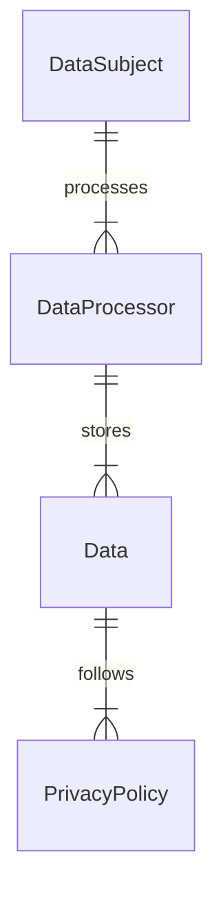

                 

## 文章标题

### 生物特征数据伦理：个人隐私的新疆界

关键词：生物特征识别，隐私伦理，数据保护，加密算法，信息安全

摘要：本文将探讨生物特征数据在隐私伦理领域中的新挑战，详细分析生物特征数据的重要性、隐私伦理问题及其解决方案。通过深入探讨生物特征数据加密算法原理，结合实际案例，旨在为个人隐私保护提供科学依据和实践指导。

## 目录大纲

### 第一部分：问题背景与核心概念

#### 第1章：生物特征数据的兴起与隐私伦理挑战

1.1 引言

1.2 生物特征数据隐私伦理问题

1.3 生物特征数据隐私伦理挑战

1.4 生物特征数据隐私伦理的边界与外延

1.5 本章小结

### 第二部分：核心概念与联系

#### 第2章：生物特征数据伦理原理

2.1 生物特征数据伦理原理概述

2.2 生物特征数据伦理与相关概念的联系

2.3 生物特征数据伦理与相关理论的联系

2.4 生物特征数据伦理的ER实体关系图架构

2.5 本章小结

### 第三部分：算法原理与数学模型

#### 第3章：生物特征数据加密算法原理

3.1 生物特征数据加密算法概述

3.2 生物特征数据加密算法原理详解

3.2.1 对称加密算法

3.2.2 非对称加密算法

3.3 生物特征数据加密算法实例解析

3.4 本章小结

### 第四部分：系统分析与架构设计

#### 第4章：生物特征数据保护系统架构设计

4.1 问题场景介绍

4.2 系统功能设计

4.3 系统架构设计

4.4 系统接口设计

4.5 系统交互设计

4.6 本章小结

### 第五部分：项目实战

#### 第5章：生物特征数据保护项目实战

5.1 环境安装

5.2 系统核心实现源代码

5.3 代码应用解读与分析

5.4 实际案例分析与讲解

5.5 项目小结

### 第六部分：最佳实践与拓展阅读

#### 第6章：生物特征数据保护最佳实践

6.1 生物特征数据保护最佳实践

6.2 注意事项

6.3 拓展阅读

## 文章正文

### 第一部分：问题背景与核心概念

#### 第1章：生物特征数据的兴起与隐私伦理挑战

##### 1.1 引言

随着科技的进步，生物特征识别技术逐渐成为现代社会的重要手段。从指纹识别、人脸识别到虹膜扫描，生物特征数据以其独特性和不可替代性，广泛应用于金融、安防、医疗等多个领域。然而，生物特征数据的高度个人化和敏感性，使得其在隐私伦理方面面临着前所未有的挑战。

生物特征数据的隐私伦理问题主要体现在以下几个方面：首先，生物特征数据一旦泄露，将导致个人身份被盗用，给个人生活带来严重困扰；其次，生物特征数据可能被滥用，用于非法监控或身份追踪；最后，生物特征数据的安全存储和传输也成为了一个亟待解决的问题。

##### 1.2 生物特征数据隐私伦理问题

**隐私权**

隐私权是个人对自己个人信息控制的权利，包括个人身份信息、健康信息、行为记录等。生物特征数据作为个人身份的重要组成部分，其隐私权保护尤为重要。

**数据安全**

数据安全是指防止数据泄露、篡改、丢失等风险。对于生物特征数据，由于其高度个人化，一旦发生安全事件，后果将不堪设想。

**数据匿名化**

数据匿名化是指通过技术手段，去除数据中的个人身份标识，从而保护个人隐私。然而，对于生物特征数据，由于其固有的唯一性，数据匿名化难度较大。

##### 1.3 生物特征数据隐私伦理挑战

**技术层面**

- **数据收集与存储**：如何在不侵犯个人隐私的情况下，高效地收集和存储生物特征数据？
- **数据传输与共享**：如何确保生物特征数据在传输和共享过程中的安全？

**法律层面**

- **数据保护法规**：各国在生物特征数据保护方面的法律法规存在较大差异，如何实现国际合作与协调？
- **隐私权争议**：如何在保障个人隐私的同时，充分发挥生物特征数据的社会价值？

##### 1.4 生物特征数据隐私伦理的边界与外延

**概念结构与核心要素组成**

生物特征数据隐私伦理的核心概念包括隐私权、数据安全、数据匿名化等。其概念结构可视为一个包含边界和外延的复杂系统。

**生物特征数据伦理的基本架构**

生物特征数据伦理的基本架构包括法律、技术、道德等多个层面。法律层面提供法规保障，技术层面提供技术支持，道德层面提供伦理指导。

**生物特征数据伦理的应用场景**

生物特征数据伦理的应用场景广泛，包括但不限于个人身份认证、医疗健康、金融支付等。在不同应用场景下，生物特征数据隐私伦理面临的具体挑战和解决方案也有所不同。

##### 1.5 本章小结

生物特征数据在隐私伦理方面面临着诸多挑战。为了保护个人隐私，我们需要在技术、法律和道德等多个层面进行综合考量。通过本章的探讨，我们了解了生物特征数据隐私伦理的核心问题和挑战，为后续章节的深入分析奠定了基础。

### 第二部分：核心概念与联系

#### 第2章：生物特征数据伦理原理

##### 2.1 生物特征数据伦理原理概述

生物特征数据伦理原理是研究如何合理、合法地使用和管理生物特征数据的一系列原则和规范。其核心在于平衡个人隐私与社会利益，确保生物特征数据的安全性和合法性。

**伦理学的基本概念**

伦理学是研究道德现象、道德原则和道德规范的学科。在生物特征数据伦理中，伦理学的基本概念包括：

- **道德原则**：如公正、尊重、自主等。
- **道德规范**：如隐私保护、数据安全、数据匿名化等。

**生物特征数据伦理的属性特征**

生物特征数据伦理具有以下属性特征：

- **敏感性**：生物特征数据高度个人化，涉及个人隐私和安全。
- **复杂性**：生物特征数据的使用和管理涉及多个层面，包括技术、法律、道德等。
- **动态性**：随着科技的发展，生物特征数据伦理面临的新挑战和问题不断涌现。

##### 2.2 生物特征数据伦理与相关概念的联系

**个人隐私权**

个人隐私权是指个人对其个人信息控制的权利。在生物特征数据伦理中，个人隐私权是保护的核心。

- **定义**：个人隐私权是指个人对其个人信息控制的权利。
- **保护措施**：包括隐私权声明、隐私保护协议、数据匿名化等。

**数据保护法律框架**

数据保护法律框架是规范和管理生物特征数据的重要手段。

- **基本原则**：如数据最小化、目的明确、合法获取等。
- **各国数据保护法的比较**：不同国家在数据保护法律框架上存在差异，如欧盟的《通用数据保护条例》（GDPR）和美国的《加州消费者隐私法》（CCPA）等。

##### 2.3 生物特征数据伦理与相关理论的联系

**信息伦理**

信息伦理是研究信息技术应用中道德问题的学科。

- **基本概念**：信息伦理涉及隐私、公正、透明等问题。
- **与生物特征数据伦理的关系**：信息伦理为生物特征数据伦理提供了理论指导，两者在道德原则和规范上有诸多相似之处。

**人工智能伦理**

人工智能伦理是研究人工智能应用中道德问题的学科。

- **基本原则**：如公平性、透明性、可解释性等。
- **与生物特征数据伦理的结合**：人工智能技术在生物特征数据采集、处理、分析等方面具有重要应用，人工智能伦理为生物特征数据伦理提供了新的挑战和解决方案。

##### 2.4 生物特征数据伦理的ER实体关系图架构

**ER图的基本概念**

实体-关系（Entity-Relationship，ER）图是数据库设计中的重要工具，用于描述实体之间的关系。

- **定义**：ER图是一种用于描述实体及其关系的图形化表示。
- **作用**：ER图可以帮助我们直观地理解数据模型，为数据库设计提供指导。

**生物特征数据伦理ER图实例**

以下是一个简单的生物特征数据伦理ER图实例：



- **数据主体（DataSubject）**：表示个人，拥有生物特征数据。
- **数据处理者（DataProcessor）**：表示处理生物特征数据的机构或个人。
- **数据（Data）**：表示生物特征数据。
- **隐私政策（PrivacyPolicy）**：表示处理生物特征数据时遵循的隐私保护规则。

##### 2.5 本章小结

本章介绍了生物特征数据伦理的基本概念、与相关概念的联系以及ER实体关系图架构。通过本章的学习，我们了解了生物特征数据伦理的核心内容和应用场景，为后续章节的深入分析奠定了基础。

### 第三部分：算法原理与数学模型

#### 第3章：生物特征数据加密算法原理

##### 3.1 生物特征数据加密算法概述

生物特征数据加密算法是保护生物特征数据安全的重要手段。加密算法通过将明文转换为密文，防止数据在传输和存储过程中被非法窃取或篡改。

**加密算法的基本概念**

- **加密算法**：一种将明文转换为密文的算法。
- **密文**：加密后的文本。
- **明文**：未加密的文本。
- **加密过程**：将明文转换为密文的过程。
- **解密过程**：将密文转换为明文的过程。

**生物特征数据加密算法的需求**

生物特征数据具有高度个人化和敏感性，其保护需求如下：

- **数据保密性**：确保数据在传输和存储过程中不被非法窃取。
- **数据完整性**：确保数据在传输和存储过程中不被非法篡改。
- **数据可用性**：确保数据在合法授权情况下可以正常访问和使用。

##### 3.2 生物特征数据加密算法原理详解

**对称加密算法**

对称加密算法是一种加密和解密使用相同密钥的加密算法。常见的对称加密算法包括：

- **AES（Advanced Encryption Standard，高级加密标准）**
- **DES（Data Encryption Standard，数据加密标准）**
- **RSA（Rivest-Shamir-Adleman，RSA加密算法）**

**对称加密算法的工作原理**

1. **密钥生成**：生成一对密钥，包括加密密钥和解密密钥。
2. **加密过程**：使用加密密钥将明文转换为密文。
3. **解密过程**：使用解密密钥将密文转换为明文。

**常见的对称加密算法**

- **AES**：使用128位、192位或256位密钥，支持多种加密模式，如ECB、CBC、CFB等。
- **DES**：使用56位密钥，已经被认为不安全，不建议使用。
- **RSA**：使用一对密钥，公钥加密，私钥解密，支持大整数运算。

**非对称加密算法**

非对称加密算法是一种加密和解密使用不同密钥的加密算法。常见的非对称加密算法包括：

- **RSA**
- **ECC（Elliptic Curve Cryptography，椭圆曲线加密算法）**

**非对称加密算法的工作原理**

1. **密钥生成**：生成一对密钥，包括公钥和私钥。
2. **加密过程**：使用公钥加密，私钥解密。
3. **解密过程**：使用私钥加密，公钥解密。

**常见的非对称加密算法**

- **RSA**：使用大整数运算，支持多种加密模式和数字签名。
- **ECC**：使用椭圆曲线数学，提供更高的安全性和效率。

##### 3.3 生物特征数据加密算法实例解析

以下是一个使用AES加密算法的简单实例：

**加密过程**

```python
from Crypto.Cipher import AES
from Crypto.Util.Padding import pad
from Crypto.Random import get_random_bytes

# 生成密钥
key = get_random_bytes(16)  # 生成128位密钥

# 创建加密对象
cipher = AES.new(key, AES.MODE_CBC)

# 加密数据
plaintext = b"Hello, World!"
ciphertext = cipher.encrypt(pad(plaintext, AES.block_size))

# 输出密文和密钥
print("Ciphertext:", ciphertext.hex())
print("Key:", key.hex())
```

**解密过程**

```python
from Crypto.Cipher import AES
from Crypto.Util.Padding import unpad
from Crypto.Random import get_random_bytes

# 输入密文和密钥
ciphertext = b'6bc1bee22e409f96e93d7e117393172a'
key = b'2b7e151628aed2a6abf7158809cf4f3c'

# 创建解密对象
cipher = AES.new(key, AES.MODE_CBC)

# 解密数据
plaintext = unpad(cipher.decrypt(ciphertext), AES.block_size)

# 输出明文
print("PlainText:", plaintext.decode())
```

**加密算法的数学模型**

对称加密算法和非对称加密算法在数学模型上有所不同。

**对称加密算法**

$$
C = E_K(P)
$$

其中，$C$表示密文，$P$表示明文，$K$表示密钥，$E_K$表示加密函数。

**非对称加密算法**

$$
C = E_K(P)
$$

$$
P = D_K(C)
$$

其中，$C$表示密文，$P$表示明文，$K$表示密钥，$E_K$表示加密函数，$D_K$表示解密函数。

##### 3.4 本章小结

本章介绍了生物特征数据加密算法的基本概念、原理和实例。通过本章的学习，我们了解了不同加密算法的优缺点，为实际应用提供了理论依据和实践指导。

### 第四部分：系统分析与架构设计

#### 第4章：生物特征数据保护系统架构设计

##### 4.1 问题场景介绍

在现代社会，生物特征数据被广泛应用于个人身份认证、金融支付、医疗健康等领域。然而，随着生物特征数据的应用日益广泛，其隐私和安全问题也日益凸显。为了解决这一问题，我们需要设计一个高效、安全的生物特征数据保护系统。

##### 4.2 系统功能设计

生物特征数据保护系统的主要功能包括：

- **数据收集**：收集用户提供的生物特征数据，如指纹、人脸、虹膜等。
- **数据加密**：使用加密算法对收集到的生物特征数据进行加密，确保数据在传输和存储过程中的安全性。
- **数据存储**：将加密后的生物特征数据存储在安全数据库中。
- **身份认证**：用户通过提供生物特征数据，进行身份认证。
- **数据备份与恢复**：定期对生物特征数据进行备份，并在需要时进行数据恢复。
- **系统监控与报警**：实时监控系统运行状态，并在发生异常时及时报警。

##### 4.3 系统架构设计

生物特征数据保护系统采用分层架构设计，包括以下几个方面：

- **数据层**：存储生物特征数据的数据库，包括用户数据、加密密钥等。
- **业务层**：实现系统业务功能的业务逻辑处理模块，包括数据收集、加密、存储、认证等。
- **表示层**：为用户提供交互界面的Web前端和移动端应用。
- **安全层**：提供数据加密、身份认证、访问控制等安全功能。

##### 4.4 系统接口设计

生物特征数据保护系统的主要接口包括：

- **数据收集接口**：用于接收用户上传的生物特征数据。
- **数据加密接口**：用于对收集到的生物特征数据进行加密。
- **数据存储接口**：用于将加密后的生物特征数据存储到数据库中。
- **身份认证接口**：用于用户进行身份认证。
- **数据备份接口**：用于对生物特征数据进行备份。
- **数据恢复接口**：用于在需要时对生物特征数据进行恢复。

##### 4.5 系统交互设计

生物特征数据保护系统的交互设计主要包括以下几个方面：

- **用户与数据收集接口的交互**：用户通过Web前端或移动端应用上传生物特征数据。
- **数据收集接口与数据加密接口的交互**：数据收集接口将用户上传的生

