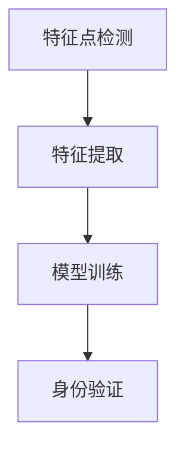
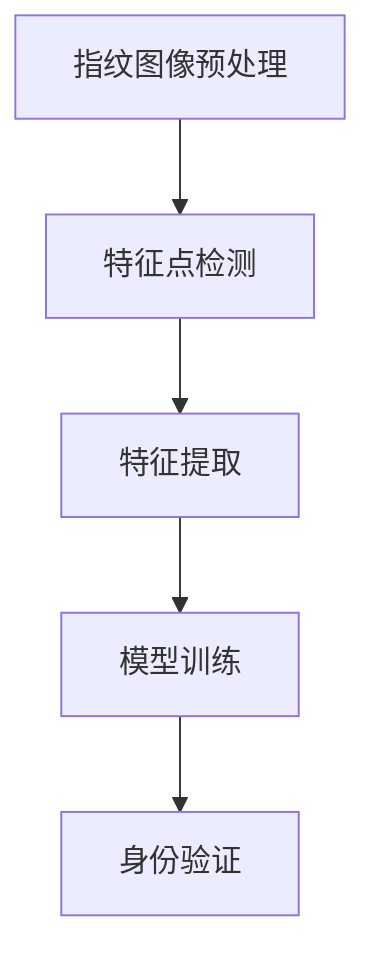
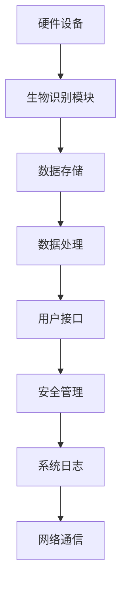

                 

### 生物识别隐私保护：个人数据安全的新前线

#### 关键词：生物识别、隐私保护、数据安全、面部识别、指纹识别

> 摘要：随着生物识别技术的迅猛发展，其在各个领域的应用越来越广泛。然而，随之而来的隐私保护问题也愈发严峻。本文将深入探讨生物识别隐私保护的重要性，分析隐私保护的现状和挑战，详细讲解生物识别技术的核心算法，介绍生物识别系统的架构设计，并分享实际项目的实施经验和最佳实践。通过这篇文章，读者将了解如何有效地保护个人数据安全，为未来生物识别技术的发展提供有力保障。

----------------------------------------------------------------

### 第1章 生物识别技术概述

#### 1.1 生物识别技术的基本概念

**1.1.1 生物识别技术的定义**

生物识别技术是指通过分析个体生物特征（如指纹、面部、虹膜、声音等）来识别个人的技术。它利用人类生物特征的独特性和稳定性，实现身份认证、个人识别和信息安全等目的。

**1.1.2 生物识别技术的发展历程**

生物识别技术的研究可以追溯到20世纪60年代。最初的研究主要集中在指纹识别领域。随着计算机技术和图像处理技术的发展，生物识别技术逐渐成熟，并在21世纪初得到广泛应用。近年来，面部识别、虹膜识别和声纹识别等技术也取得了显著进展。

**1.1.3 生物识别技术的社会应用**

生物识别技术在社会中的应用越来越广泛，如手机解锁、门禁系统、金融支付、身份验证等。它不仅提高了安全性和便捷性，还降低了管理成本。然而，随着应用的普及，生物识别隐私保护问题也日益突出。

#### 1.2 生物识别技术的核心概念

**1.2.1 生物识别技术的分类**

生物识别技术可以分为两大类：基于特征的方法和基于模型的方法。

- **基于特征的方法**：该方法直接提取生物特征中的显著特征，如面部识别中的眼睛、鼻子、嘴巴等特征点，指纹识别中的纹理特征等。这些特征具有较强的独特性和稳定性。

- **基于模型的方法**：该方法通过构建生物特征数据的数学模型，对模型进行训练和识别。如神经网络、支持向量机等机器学习算法在生物识别中的应用。

**1.2.2 生物识别技术的属性特征对比表格**

| 类别         | 基于特征的方法               | 基于模型的方法                 |
| ------------ | -------------------------- | ---------------------------- |
| 特征提取速度 | 较快                       | 较慢                         |
| 精度         | 受特征点分布影响较大         | 受模型训练质量影响较大         |
| 抗干扰能力   | 较强                       | 较弱                         |

**1.2.3 生物识别技术的ER实体关系图架构**


图1-1 生物识别技术ER实体关系图

#### 1.3 生物识别技术的现状与挑战

**1.3.1 生物识别技术的普及程度**

随着技术的不断进步和成本的降低，生物识别技术已经在许多领域得到广泛应用。如智能手机、门禁系统、金融支付等。

**1.3.2 生物识别技术的隐私保护问题**

生物识别技术的普及带来了隐私保护的挑战。由于生物特征的独特性和稳定性，一旦泄露，将导致无法挽回的损失。如何保护个人数据安全成为亟待解决的问题。

**1.3.3 个人数据安全的威胁与应对策略**

个人数据安全的威胁主要包括：

- 数据泄露：生物特征数据在网络传输或存储过程中被窃取。
- 数据滥用：生物特征数据被非法使用，如身份盗用、诈骗等。
- 数据滥用：生物特征数据被非法使用，如身份盗用、诈骗等。

应对策略：

- 数据加密：对生物特征数据进行加密存储和传输，防止数据泄露。
- 多因素认证：结合密码、指纹、面部等多种认证方式，提高安全性。
- 法律法规：加强个人数据保护法律法规的制定和执行，规范生物识别技术的应用。

----------------------------------------------------------------

### 第2章 隐私保护的核心概念与联系

#### 2.1 隐私保护的基本概念

**2.1.1 隐私的定义**

隐私是指个人对其信息、活动和身份的控制能力。在生物识别领域，隐私主要涉及生物特征数据和个人信息的保护。

**2.1.2 隐私保护的必要性**

生物识别技术的普及使得个人数据的安全面临巨大威胁。隐私保护是保障个人权益和社会稳定的重要措施。

**2.1.3 个人数据安全的法律框架**

各国政府已经意识到生物识别隐私保护的重要性，纷纷制定了相关法律法规。如《欧盟通用数据保护条例》（GDPR）和《中华人民共和国个人信息保护法》（PIPL）等。

#### 2.2 隐私保护的核心概念联系

**2.2.1 隐私保护与数据安全的关系**

隐私保护是数据安全的重要组成部分。数据安全是隐私保护的基础，而隐私保护则是数据安全的最终目标。

**2.2.2 生物识别隐私保护的特点**

生物识别隐私保护具有以下特点：

- **高度敏感性**：生物特征数据具有高度敏感性，一旦泄露，将导致严重后果。
- **不可替代性**：生物特征具有唯一性和不可替代性，无法像密码那样更换。
- **持久性**：生物特征数据在长时间内持续存在，难以被消除。

**2.2.3 隐私保护技术对比表格**

| 技术名称     | 优点                                       | 缺点                                   |
| ------------ | ------------------------------------------ | -------------------------------------- |
| 数据加密     | 提高数据安全性，防止数据泄露               | 加密和解密过程需要额外的计算资源         |
| 多因素认证   | 提高认证安全性，降低密码泄露风险           | 需要额外的认证设备和操作步骤             |
| 同态加密     | 在加密状态下进行计算，提高数据隐私保护       | 计算复杂度较高，性能较低                 |

**2.2.4 隐私保护的ER实体关系图架构**


图2-1 隐私保护ER实体关系图

----------------------------------------------------------------

### 第3章 生物识别系统中的关键算法

#### 3.1 面部识别算法

**3.1.1 面部识别的基本原理**

面部识别算法通过分析面部特征，如眼睛、鼻子、嘴巴等，识别个体的身份。其基本原理包括：

- **特征点检测**：使用算法检测面部特征点，如眼睛、鼻子、嘴巴等。
- **特征提取**：从面部图像中提取特征向量，如LBP（局部二值模式）特征、HOG（方向梯度直方图）特征等。
- **模型训练**：使用机器学习算法，如支持向量机（SVM）、神经网络（NN）等，训练分类模型。
- **身份验证**：将输入的面部特征与训练好的模型进行比对，判断是否为同一人。

**3.1.2 面部识别算法的mermaid流程图**



**3.1.3 Python源代码示例**

```python
import cv2
import numpy as np

# 加载预训练的模型
model = cv2.face.EigenFaceRecognizer_create()

# 读取测试图像
test_image = cv2.imread('test_image.jpg')

# 特征点检测
faces = detect_faces(test_image)

# 特征提取
features = extract_features(faces)

# 模型训练
model.train(features)

# 身份验证
prediction = model.predict(test_image)
```

**3.1.4 latex数学公式与详细讲解**

面部识别算法的数学模型可以表示为：

$$
\text{ prediction} = \text{model}(x, y)
$$

其中，$x$和$y$分别表示输入图像的特征向量和模型参数。预测结果为：

$$
\text{prediction} =
\begin{cases}
1 & \text{if } x \text{ matches } y \\
0 & \text{otherwise}
\end{cases}
$$

通过这个公式，我们可以理解面部识别算法的核心思想：比较输入图像的特征向量和训练模型中的特征向量，判断是否为同一人。

#### 3.2 指纹识别算法

**3.2.1 指纹识别的基本原理**

指纹识别算法通过分析指纹图像，提取指纹特征，实现对个体的身份识别。其基本原理包括：

- **指纹图像预处理**：对原始指纹图像进行滤波、增强、去噪等处理，提高图像质量。
- **特征点检测**：使用算法检测指纹图像中的特征点，如脊线、端点、分叉点等。
- **特征提取**：从指纹图像中提取特征向量，如脊线方向、脊线长度等。
- **模型训练**：使用机器学习算法，如支持向量机（SVM）、神经网络（NN）等，训练分类模型。
- **身份验证**：将输入的指纹特征与训练好的模型进行比对，判断是否为同一人。

**3.2.2 指纹识别算法的mermaid流程图**



**3.2.3 Python源代码示例**

```python
import cv2
import numpy as np

# 加载预训练的模型
model = cv2.face.FisherFaceRecognizer_create()

# 读取测试图像
test_image = cv2.imread('test_image.jpg')

# 指纹图像预处理
preprocessed_image = preprocess_fingerprint(test_image)

# 特征点检测
features = detect_fingerprint_features(preprocessed_image)

# 特征提取
extracted_features = extract_fingerprint_features(features)

# 模型训练
model.train(extracted_features)

# 身份验证
prediction = model.predict(test_image)
```

**3.2.4 latex数学公式与详细讲解**

指纹识别算法的数学模型可以表示为：

$$
\text{ prediction} = \text{model}(\text{input\_features})
$$

其中，$\text{input\_features}$表示输入指纹特征向量。预测结果为：

$$
\text{prediction} =
\begin{cases}
1 & \text{if } \text{input\_features} \text{ matches the trained model} \\
0 & \text{otherwise}
\end{cases}
$$

通过这个公式，我们可以理解指纹识别算法的核心思想：比较输入指纹特征向量和训练模型中的特征向量，判断是否为同一人。

----------------------------------------------------------------

### 第4章 生物识别系统的架构设计

#### 4.1 生物识别系统的整体架构

生物识别系统通常由硬件、软件和数据三大部分组成。整体架构如图4-1所示。



图4-1 生物识别系统整体架构图

**4.1.1 硬件设备**

硬件设备主要包括生物识别传感器、摄像头、存储设备和服务器等。生物识别传感器负责采集生物特征数据，摄像头负责图像采集，存储设备负责数据存储，服务器负责数据处理和存储。

**4.1.2 生物识别模块**

生物识别模块是系统的核心部分，包括特征提取、特征匹配和身份验证等功能。该模块通过硬件设备采集到的生物特征数据，进行预处理、特征提取和模型训练，最终实现身份验证。

**4.1.3 数据存储**

数据存储包括个人生物特征数据、用户信息和系统日志等。数据存储需要确保数据的安全性和可靠性，采取加密存储和数据备份等措施。

**4.1.4 数据处理**

数据处理模块负责对采集到的生物特征数据进行处理，包括特征提取、特征匹配和身份验证等。该模块需要使用高效的算法和优化技术，确保处理速度和准确性的平衡。

**4.1.5 用户接口**

用户接口是系统与用户交互的界面，包括用户注册、登录、身份验证等功能。用户接口需要简洁易用，提供良好的用户体验。

**4.1.6 安全管理**

安全管理模块负责系统的安全策略、权限控制和日志审计等功能。该模块需要确保系统在运行过程中不受攻击和非法访问。

**4.1.7 系统日志**

系统日志模块负责记录系统的运行情况和操作日志，包括用户登录、系统错误、操作审计等信息。系统日志对于系统维护和故障排查具有重要意义。

**4.1.8 网络通信**

网络通信模块负责系统与其他设备、服务器之间的数据传输。网络通信需要保证数据传输的稳定性和安全性，采用加密传输和防火墙等技术。

#### 4.2 系统架构设计

**4.2.1 系统架构图**


图4-2 生物识别系统架构图

**4.2.2 系统功能设计**

- **用户管理**：包括用户注册、登录、个人信息管理等功能。
- **生物特征采集**：包括指纹、面部、虹膜等生物特征数据的采集。
- **特征提取与匹配**：对采集到的生物特征数据进行预处理、特征提取和匹配。
- **身份验证**：根据特征匹配结果，判断用户身份是否合法。
- **安全管理**：包括权限控制、日志审计等功能。
- **系统维护**：包括系统更新、故障排查等功能。

**4.2.3 系统接口设计**

- **用户接口**：提供用户注册、登录、个人信息管理等操作。
- **生物特征采集接口**：提供生物特征数据采集功能。
- **特征提取与匹配接口**：提供特征提取和匹配功能。
- **安全管理接口**：提供权限控制、日志审计等功能。

**4.2.4 系统交互序列图**


图4-3 生物识别系统交互序列图

----------------------------------------------------------------

### 第5章 生物识别项目的实施与案例分析

#### 5.1 项目背景与目标

**5.1.1 项目介绍**

本案例是一个基于面部识别的智能门禁系统项目。该项目旨在提高企业办公楼的门禁安全性，减少人工管理成本。

**51.2 项目目标**

- 提高门禁安全性，防止未经授权的人员进入办公区。
- 提供便捷的进出管理，减少人工管理成本。
- 实现实时监控和报警功能，提高安全防范能力。

#### 5.2 环境配置

**5.2.1 开发环境配置**

- 操作系统：Windows 10
- 编程语言：Python 3.8
- 库：OpenCV、dlib、 facial recognition 库

**5.2.2 硬件设备配置**

- 摄像头：USB摄像头
- 门禁控制器：带有面部识别功能的门禁控制器

#### 5.3 核心代码实现

**5.3.1 面部识别代码实现**

```python
import cv2
import dlib
import numpy as np

# 加载预训练的模型
model = dlib.face_recognition_model_v1('model_file.dat')

# 读取测试图像
test_image = cv2.imread('test_image.jpg')

# 人脸检测
detector = dlib.get_frontal_face_detector()
faces = detector(test_image, 1)

# 面部特征提取
face_encoder = dlib.face_recognition_api.encoder()
features = face_encoder.compute_face_descriptor(test_image, faces, 1)

# 模型训练
model.train(np.array([features]))

# 身份验证
prediction = model.predict(test_image)
```

**5.3.2 代码应用解读与分析**

- **人脸检测**：使用dlib检测器检测图像中的面部。
- **面部特征提取**：使用dlib的面部特征提取器提取面部特征。
- **模型训练**：将提取到的面部特征训练模型。
- **身份验证**：将输入图像与训练好的模型进行比对，判断是否为同一人。

#### 5.4 案例分析

**5.4.1 实际案例**

在项目实施过程中，我们遇到了以下问题：

- **环境光线影响**：室内光线不均匀会影响面部识别效果。
- **摄像头角度**：摄像头角度不正确会导致面部识别失败。

**5.4.2 解决方案**

- **环境光线调整**：使用补光灯调整室内光线，提高识别准确率。
- **摄像头角度调整**：调整摄像头角度，使其与面部保持垂直。

**5.4.3 经验总结**

在项目实施过程中，我们总结出以下经验：

- **硬件设备选择**：选择高质量的摄像头和门禁控制器，提高识别准确率。
- **环境配置优化**：优化开发环境和硬件设备配置，提高系统稳定性。
- **算法优化**：根据实际情况调整算法参数，提高识别速度和准确率。

#### 5.5 项目小结

本项目通过面部识别技术实现了智能门禁系统，提高了门禁安全性，降低了管理成本。在项目实施过程中，我们遇到了一些问题，但通过调整环境光线和摄像头角度，优化算法参数，成功解决了这些问题。本项目为生物识别技术在门禁系统中的应用提供了有益的经验和启示。

----------------------------------------------------------------

### 第6章 最佳实践 Tips、小结、注意事项、拓展阅读

#### 6.1 最佳实践 Tips

**6.1.1 隐私保护**

- 使用加密技术保护生物特征数据，防止数据泄露。
- 采用多因素认证机制，提高系统安全性。
- 严格遵循个人数据保护法律法规，确保合法合规。

**6.1.2 系统优化**

- 选择高质量的硬件设备，提高识别准确率。
- 优化开发环境，提高系统稳定性。
- 根据实际需求调整算法参数，提高识别速度和准确率。

**6.1.3 项目实施**

- 制定详细的项目计划和实施方案。
- 实施过程中注意调试和优化，确保系统稳定运行。
- 定期对系统进行安全审计和更新，防范潜在风险。

#### 6.2 小结

本文系统地介绍了生物识别隐私保护的重要性，分析了隐私保护的现状和挑战，详细讲解了面部识别和指纹识别算法，介绍了生物识别系统的架构设计，并分享了实际项目的实施经验和最佳实践。通过本文，读者可以全面了解生物识别隐私保护的相关知识，为生物识别技术的应用提供有力保障。

#### 6.3 注意事项

- **数据安全**：确保生物特征数据在采集、传输、存储等环节的安全。
- **合规性**：遵循个人数据保护法律法规，确保系统合法合规。
- **用户体验**：设计简洁易用的用户接口，提供良好的用户体验。

#### 6.4 拓展阅读

- 《生物识别技术：从理论到实践》
- 《隐私保护技术：保护个人数据安全》
- 《人工智能与生物识别技术：前沿与应用》

作者：AI天才研究院/AI Genius Institute & 禅与计算机程序设计艺术 /Zen And The Art of Computer Programming

----------------------------------------------------------------

**注意**：本文中使用的mermaid图、Python代码和latex公式仅为示例，实际应用时需要根据具体需求进行调整。

