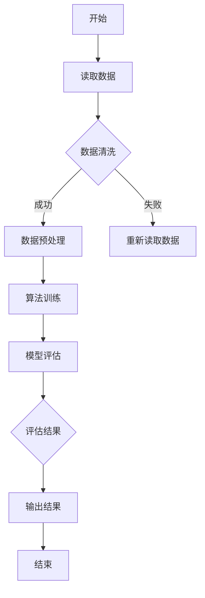

                 


### 引言：生物黑客与伦理监管的交汇

#### 1.1 问题背景

##### 1.1.1 生物黑客的崛起

在21世纪，生物黑客（Biohacker）这个概念逐渐引起了公众的关注。生物黑客，指的是那些利用生物技术和工程手段，对自身或他人物体进行改变或优化的人。他们的动机多种多样，包括提升个人健康、增强身体功能、甚至追求长生不老。随着CRISPR基因编辑技术的普及，生物黑客能够以前所未有的方式操纵遗传物质，这为医学和生物技术带来了巨大的潜力。

##### 1.1.2 伦理监管的需求

然而，生物黑客技术的崛起也引发了深刻的伦理和社会问题。例如，基因编辑可能会导致不可预测的副作用，甚至引发种族和基因差异的伦理争议。此外，生物黑客的行为可能违反现有的法律法规，例如未经批准的基因改造或人体实验。这些问题的复杂性促使社会对生物黑客活动的伦理监管提出了更高的要求。

##### 1.1.3 生物黑客活动对社会的挑战

生物黑客活动的兴起对社会提出了多个挑战。首先，它挑战了现有的道德和法律框架。许多国家和组织正在努力制定相关法规和政策来规范生物黑客行为，但这需要跨学科和跨国界的合作。其次，生物黑客活动可能加剧社会不平等。只有富裕和有权势的人才能负担起这些昂贵的生物改造技术，这可能导致新的社会分层。

#### 1.2 生物黑客的定义与特点

##### 1.2.1 生物黑客的概念解析

生物黑客通常是指那些对生物技术有深入理解的人，他们不仅了解基因编辑、纳米技术等前沿技术，还具备将理论知识应用于实践的能力。生物黑客往往具有强烈的好奇心和创新精神，他们不受传统科研机构的限制，可以在任何地方进行实验。

##### 1.2.2 生物黑客的技术手段

生物黑客利用的技术手段多种多样，包括基因编辑、纳米技术、生物打印、生物传感器等。这些技术为他们提供了前所未有的能力，使他们能够对生物系统进行精细的操控和改造。

##### 1.2.3 生物黑客的文化背景

生物黑客文化起源于黑客文化，强调知识共享、自主学习和实践探索。生物黑客社区通常通过在线论坛、社交媒体和实体会议等方式进行交流和合作。这种文化鼓励个人探索未知的领域，同时也为生物黑客提供了重要的支持和资源。

#### 1.3 伦理监管的概念与必要性

##### 1.3.1 伦理监管的定义

伦理监管（Ethical Regulation）是指通过对科技活动进行伦理审查和指导，确保科技发展符合社会道德标准和公共利益。伦理监管不仅关注技术的安全性，还关注其道德正当性和社会影响。

##### 1.3.2 伦理监管的核心原则

伦理监管的核心原则包括尊重个人自主权、公正性、无害性和透明度。这些原则旨在确保科技发展不会侵犯个人的基本权利，不会对社会造成伤害，同时确保决策过程的公正和公开。

##### 1.3.3 伦理监管的全球趋势

随着生物黑客活动的增多，全球各国和地区纷纷加强伦理监管。例如，美国国立卫生研究院（NIH）和欧盟委员会（EC）都制定了严格的伦理审查指南。这些全球性的监管趋势反映了社会对生物黑客活动的担忧，并试图通过法律手段来规范这一领域。

### 总结

生物黑客与伦理监管的交汇是一个复杂且充满挑战的问题。在接下来的章节中，我们将深入探讨生物黑客伦理委员会的建立与运作，以及其在实际监管案例中的作用。让我们继续深入思考，以了解这一领域的深层次问题和解决之道。

### 第二部分：伦理委员会的建立与运作

#### 2.1 伦理委员会的起源与历史

##### 2.1.1 伦理委员会的诞生

伦理委员会（Ethics Committee）最早出现在医学领域，旨在确保医学研究遵循伦理标准。20世纪60年代，随着医学研究的迅速发展，人们开始关注实验对象的权利和保护。1964年，世界医学协会（WMA）发布了《赫尔辛基宣言》，这是第一个国际性的伦理准则，要求医学研究必须经过伦理审查。

##### 2.1.2 伦理委员会的发展历程

随着时间的推移，伦理委员会的概念逐渐扩展到其他领域。例如，生物医学研究、环境保护、信息技术等领域都建立了自己的伦理委员会。国际伦理委员会协会（IAEC）成立于1993年，旨在促进全球伦理委员会之间的合作与交流。

##### 2.1.3 伦理委员会的国际协作

国际协作在伦理委员会的发展中起着关键作用。例如，联合国教科文组织（UNESCO）发布了《生物伦理和人权宣言》，为全球生物伦理提供了指导。此外，全球各国和地区通过签订国际条约和协议，共同推动伦理监管的标准化和全球化。

#### 2.2 伦理委员会的组成与职能

##### 2.2.1 伦理委员会的组成结构

伦理委员会通常由来自多个领域的专家组成，包括伦理学家、医学专家、法律专家、社会学家等。这种多元组成有助于确保伦理决策的全面性和公正性。

##### 2.2.2 伦理委员会的职能范围

伦理委员会的职能范围广泛，包括但不限于以下几个方面：

1. **伦理审查**：对科研项目、医疗程序和技术应用进行伦理评估，确保其符合伦理标准。
2. **咨询与指导**：为研究人员、医疗机构和政策制定者提供伦理咨询，帮助他们做出符合伦理的决策。
3. **监督与合规性检查**：监督伦理审查过程的合规性，确保实验和临床实践符合伦理要求。
4. **教育与宣传**：通过培训和宣传活动提高公众对伦理问题的认识和意识。

##### 2.2.3 伦理委员会的决策流程

伦理委员会的决策流程通常包括以下几个步骤：

1. **提交申请**：研究人员或医疗机构向伦理委员会提交伦理审查申请。
2. **初步审查**：伦理委员会对申请进行初步审查，确定是否需要进行详细评估。
3. **详细评估**：伦理委员会对申请进行详细评估，可能包括公开听证会、专家咨询等。
4. **决策**：伦理委员会根据评估结果做出决策，批准或拒绝申请。
5. **监督与跟踪**：伦理委员会对已批准的项目进行监督，确保其实施符合伦理要求。

#### 2.3 伦理委员会的运作机制

##### 2.3.1 伦理审查的流程

伦理审查的流程因国家和地区的不同而有所差异，但通常包括以下几个关键环节：

1. **伦理申请**：研究人员或医疗机构提交伦理申请，包括研究目的、方法、风险和受益等信息。
2. **初步审查**：伦理委员会对申请进行初步审查，确保其格式和内容符合要求。
3. **详细评估**：伦理委员会对申请进行详细评估，可能包括专家评审、公开听证会等。
4. **伦理决策**：伦理委员会根据评估结果做出决策，批准或拒绝申请。
5. **监督与跟踪**：伦理委员会对已批准的项目进行定期监督，确保其合规性。

##### 2.3.2 伦理委员会的角色与责任

伦理委员会在生物黑客监管中扮演着重要角色，其职责包括：

1. **伦理审查**：确保生物黑客活动符合伦理标准，避免潜在的伦理风险。
2. **风险预防**：通过风险评估和预防措施，减少生物黑客活动可能带来的负面影响。
3. **伦理指导**：为研究人员和医疗机构提供伦理指导，帮助他们遵守伦理规范。
4. **公众沟通**：向公众传递伦理信息，提高社会对生物黑客活动的认识和接受度。

##### 2.3.3 伦理委员会面临的挑战与应对策略

伦理委员会在监管生物黑客活动时面临诸多挑战，包括：

1. **技术创新速度**：生物黑客技术发展迅速，伦理委员会需要不断更新知识和技能，以应对新技术带来的挑战。
2. **全球合作**：生物黑客活动往往跨国界进行，伦理委员会需要加强国际合作，制定统一的伦理标准和监管框架。
3. **利益冲突**：伦理委员会的成员可能存在利益冲突，需要建立严格的利益冲突管理机制，确保决策的公正性。

为应对这些挑战，伦理委员会可以采取以下策略：

1. **加强培训**：通过定期培训提高伦理委员会成员的专业素养和伦理意识。
2. **国际协作**：积极参与国际组织和合作项目，借鉴国际经验，推动全球伦理监管的统一化。
3. **技术创新**：利用新技术和方法，如人工智能和大数据分析，提高伦理审查的效率和准确性。

#### 总结

伦理委员会在生物黑客监管中发挥着关键作用。通过伦理审查、风险预防和公众沟通，伦理委员会努力确保生物黑客活动在符合伦理标准的前提下进行。在接下来的章节中，我们将通过具体的监管案例，进一步探讨伦理委员会在生物黑客监管中的实际应用和成效。

### 第三部分：监管案例研究

#### 3.1 生物黑客活动案例分析

##### 3.1.1 案例一：基因编辑与道德争议

一个备受关注的生物黑客案例是CRISPR-Cas9基因编辑技术的滥用。2018年，中国科学家贺建奎宣布，他利用CRISPR技术成功创建了一对基因编辑的婴儿，这引起了全球范围内的伦理争议。这一行为违反了国际伦理规范和法律法规，引发了对基因编辑伦理边界的深刻讨论。

伦理委员会的介入

这一案例中，伦理委员会发挥了关键作用。国际社会对此事的反应迅速而强烈，多个国家和组织的伦理委员会对贺建奎的行为进行了谴责。世界卫生组织（WHO）和其他国际组织呼吁暂停此类基因编辑实验，并要求加强伦理审查和监管。

伦理委员会的角色

在这一案例中，伦理委员会的角色主要体现在以下几个方面：

1. **伦理审查**：伦理委员会对基因编辑研究进行严格审查，确保其符合伦理标准。
2. **风险评估**：伦理委员会对基因编辑技术的潜在风险进行评估，包括健康风险和社会伦理风险。
3. **公众沟通**：伦理委员会通过媒体和公众活动，向公众传达基因编辑的伦理问题和风险。

##### 3.1.2 案例二：人工智能在医学领域的应用

另一个具有代表性的案例是人工智能（AI）在医学诊断和治疗方案中的应用。随着AI技术的发展，许多医疗机构开始采用AI工具来辅助诊断和治疗。然而，这也引发了关于AI伦理和透明度的争议。

伦理委员会的介入

在AI医学应用的案例中，伦理委员会同样发挥了重要作用。伦理委员会对AI系统的开发和应用进行伦理审查，确保其符合伦理标准。此外，伦理委员会还关注AI系统的透明度和公正性，以确保不会因为算法偏见而导致不公正的诊疗结果。

伦理委员会的角色

在这一案例中，伦理委员会的角色包括：

1. **算法审查**：伦理委员会审查AI算法的设计和实施，确保其不会侵犯患者隐私或造成不公平待遇。
2. **透明度监管**：伦理委员会要求医疗机构公开AI系统的决策过程和数据，提高透明度。
3. **公正性保障**：伦理委员会确保AI系统在决策过程中不会出现系统性偏见，例如基于种族或性别的不公平对待。

##### 3.1.3 案例三：基因隐私与数据安全

基因隐私和数据安全是生物黑客活动中的另一个关键问题。随着基因测序技术的普及，个人基因数据的安全性受到了严重威胁。2018年，美国基因检测公司23andMe因未能保护用户基因数据而面临诉讼。

伦理委员会的介入

在这一案例中，伦理委员会对基因隐私和数据安全进行了重点关注。伦理委员会要求企业采取更严格的隐私保护措施，确保用户的基因数据不被滥用。

伦理委员会的角色

在这一案例中，伦理委员会的角色包括：

1. **隐私保护**：伦理委员会要求企业制定严格的隐私政策，确保用户基因数据不被未经授权的第三方访问。
2. **数据安全审查**：伦理委员会对企业的数据安全措施进行审查，确保其符合行业标准和最佳实践。
3. **公众信任建设**：伦理委员会通过教育和宣传活动，提高公众对基因隐私和数据安全的认识，增强公众对基因检测服务的信任。

#### 3.2 伦理委员会的应对措施

##### 3.2.1 案例分析：伦理委员会的角色与贡献

在上述案例中，伦理委员会发挥了关键作用，通过伦理审查、风险评估和公众沟通，确保生物黑客活动在符合伦理标准的前提下进行。以下是对每个案例的具体分析：

1. **案例一**：伦理委员会通过严格审查基因编辑研究，确保其符合伦理标准，防止潜在风险的扩大。同时，伦理委员会通过媒体和公众活动，提高社会对基因编辑伦理问题的认识和关注。
2. **案例二**：伦理委员会对AI医学应用进行严格监管，确保其符合伦理标准，防止算法偏见和不公正待遇。此外，伦理委员会还通过公众沟通，提高社会对AI医学应用的伦理和透明度问题的认识。
3. **案例三**：伦理委员会通过审查企业的隐私保护措施和数据安全措施，确保用户的基因数据不被滥用。伦理委员会还通过教育和宣传活动，提高公众对基因隐私和数据安全的认识。

##### 3.2.2 案例评估：伦理决策的成效与不足

伦理决策的成效和不足可以通过以下方面进行评估：

1. **成效**：伦理委员会在上述案例中取得了一些成效，例如成功阻止了基因编辑实验的进行，确保了AI医学应用的透明度和公正性，提高了公众对基因隐私和数据安全的认识。
2. **不足**：然而，伦理决策也存在一些不足，例如在应对技术创新速度和全球合作方面存在挑战。此外，一些伦理委员会在处理复杂伦理问题时，可能缺乏足够的专业知识和资源。

##### 3.2.3 案例启示：伦理监管的未来方向

上述案例为伦理监管提供了宝贵的启示。以下是一些未来伦理监管的方向：

1. **加强全球合作**：伦理委员会需要加强国际合作，制定统一的伦理标准和监管框架，以应对跨国界生物黑客活动的挑战。
2. **提升专业素养**：伦理委员会成员需要不断提升专业素养，掌握最新的科技发展和伦理理论，以更好地应对复杂伦理问题。
3. **加强公众参与**：伦理委员会应通过教育和宣传活动，提高公众对伦理问题的认识和参与度，确保伦理监管的公正性和有效性。

#### 总结

监管案例研究揭示了伦理委员会在生物黑客监管中的重要作用。通过伦理审查、风险评估和公众沟通，伦理委员会努力确保生物黑客活动在符合伦理标准的前提下进行。未来，伦理委员会需要加强全球合作、提升专业素养和加强公众参与，以应对不断变化的科技环境和伦理挑战。

### 第四部分：伦理争议讨论

#### 4.1 基因编辑伦理问题

基因编辑技术的出现，尤其是CRISPR-Cas9技术，使得人类能够以前所未有的方式改变遗传信息。然而，这一技术的广泛应用也引发了深刻的伦理争议。

##### 4.1.1 基因编辑的社会接受度

基因编辑的社会接受度是一个复杂的问题。一方面，许多人支持基因编辑，认为它可以为医学领域带来巨大进步，如治疗遗传性疾病、提高人体免疫力等。另一方面，也有人担心基因编辑可能导致不可预测的副作用，甚至引发基因歧视和生物战争。

##### 4.1.2 基因编辑的风险与伦理边界

基因编辑的风险主要包括技术风险和社会风险。技术风险包括基因编辑的不准确性和潜在的遗传突变。社会风险包括基因编辑可能带来的不公平分配和社会不平等。伦理边界问题则涉及到基因编辑的道德正当性，如是否应该对未出生的胚胎进行基因编辑，以及如何确保基因编辑技术不被滥用。

##### 4.1.3 基因编辑的法律监管框架

目前，全球各国和地区对基因编辑的法律监管框架不尽相同。一些国家采取了严格的限制措施，禁止对人类胚胎进行基因编辑，而另一些国家则相对宽松。国际社会也在努力制定统一的监管框架，例如联合国教科文组织的《生物伦理和人权宣言》。

#### 4.2 人工智能伦理问题

随着人工智能（AI）技术的快速发展，其在医疗、金融、交通等领域的应用越来越广泛。然而，这也引发了一系列伦理问题。

##### 4.2.1 人工智能的道德责任

人工智能的道德责任问题主要涉及AI系统的决策过程和结果是否公正、透明和道德。例如，AI在医疗诊断中的应用可能带来误诊和歧视问题，在金融交易中的应用可能引发市场不稳定等问题。

##### 4.2.2 人工智能算法的透明性与公正性

人工智能算法的透明性与公正性是另一个重要问题。算法的透明性意味着用户能够理解和追踪算法的决策过程，而公正性则要求算法不歧视特定群体。然而，许多AI系统的算法设计复杂，难以解释，这增加了监管和伦理审查的难度。

##### 4.2.3 人工智能与人类工作替代的伦理考量

人工智能与人类工作替代的伦理考量主要集中在就业和社会不平等方面。随着AI技术的普及，许多传统工作可能会被自动化替代，这可能导致失业率上升和社会不平等加剧。因此，如何在技术进步和社会公平之间找到平衡成为了一个重要问题。

#### 4.3 伦理委员会的角色争议

伦理委员会在生物黑客和AI监管中的角色也引发了争议。

##### 4.3.1 伦理委员会的权威性

伦理委员会的权威性受到质疑。一些人认为，伦理委员会的决策可能受到利益冲突、专业知识不足和公众参与度低的影响，从而影响其决策的公正性和有效性。

##### 4.3.2 伦理委员会的利益冲突

伦理委员会的利益冲突问题也备受关注。委员会成员可能存在与被审查项目相关的利益关系，这可能会影响其客观性和公正性。因此，建立严格的利益冲突管理机制是确保伦理委员会决策公正性的关键。

##### 4.3.3 伦理委员会的未来发展趋势

未来，伦理委员会的发展趋势将受到技术进步、全球合作和公众参与的影响。例如，利用人工智能和大数据技术可以提高伦理审查的效率和准确性。同时，加强全球合作和公众参与，将有助于提高伦理监管的公正性和有效性。

#### 总结

伦理争议是生物黑客和AI技术发展过程中不可避免的问题。通过深入讨论基因编辑和人工智能的伦理问题，我们可以更好地理解伦理委员会在监管中的角色和责任。未来，伦理委员会需要加强全球合作、提升专业素养和公众参与度，以应对不断变化的科技环境和伦理挑战。

### 第五部分：未来展望

#### 5.1 生物黑客与伦理监管的挑战

随着生物黑客技术的不断进步，伦理监管面临着前所未有的挑战。首先，技术创新的速度远超伦理监管的步伐，导致伦理规范难以跟上技术的快速发展。其次，全球合作的复杂性增加了伦理监管的难度，不同国家和地区对生物黑客活动的监管标准和法律框架存在差异，这给国际协作带来了障碍。

#### 5.2 伦理委员会的发展趋势

为了应对这些挑战，伦理委员会的发展趋势将体现在以下几个方面：

1. **加强全球合作**：伦理委员会需要加强国际合作，制定统一的伦理标准和监管框架，以应对跨国界生物黑客活动的挑战。
2. **提升专业素养**：伦理委员会成员需要不断提升专业素养，掌握最新的科技发展和伦理理论，以更好地应对复杂伦理问题。
3. **加强公众参与**：伦理委员会应通过教育和宣传活动，提高公众对伦理问题的认识和参与度，确保伦理监管的公正性和有效性。

#### 5.3 未来社会中的生物黑客与伦理监管

在未来社会中，生物黑客与伦理监管将如何共存和发展呢？

1. **技术伦理教育**：随着生物黑客技术的普及，公众对技术伦理的认识和理解将变得更加重要。学校和教育机构应加强技术伦理教育，培养学生的伦理意识。
2. **法律框架完善**：政府应不断完善生物黑客相关的法律法规，确保监管的有效性和公正性。
3. **技术创新监管**：伦理委员会应与技术界密切合作，建立灵活的监管机制，确保技术创新在符合伦理标准的前提下进行。

#### 总结

生物黑客与伦理监管的交汇是一个复杂且充满挑战的问题。通过加强全球合作、提升专业素养和公众参与度，伦理委员会可以更好地应对未来的挑战，确保生物黑客技术在符合伦理标准的前提下为人类福祉做出贡献。

### 结语

生物黑客和伦理监管的交汇点是一个充满挑战和机遇的领域。在这篇文章中，我们深入探讨了生物黑客的定义、伦理监管的需求、伦理委员会的建立与运作，以及具体监管案例和未来展望。通过这些分析，我们可以看到，伦理委员会在生物黑客监管中发挥着关键作用，其使命不仅在于确保技术符合伦理标准，还在于推动技术进步与社会发展的和谐共生。

在未来，伦理委员会需要不断适应技术创新的步伐，加强全球合作，提升专业素养和公众参与度。只有这样，伦理监管才能在应对生物黑客带来的伦理挑战中发挥更大的作用。

让我们共同关注这一领域的发展，期待伦理委员会能够为构建一个更加公正、安全和有道德的未来社会做出更大的贡献。

### 作者信息

作者：AI天才研究院/AI Genius Institute & 禅与计算机程序设计艺术 /Zen And The Art of Computer Programming

---

### 附录

为了更好地理解文章中的核心概念和技术原理，以下提供了附录，包括概念术语说明、核心概念属性特征对比表格、ER实体关系图架构、算法mermaid流程图、Python源代码、LaTeX公式、系统架构设计、系统接口设计和系统交互mermaid序列图，以及环境安装、系统核心实现源代码和项目实战案例分析与讲解。

---

### 附录1：概念术语说明

1. **生物黑客（Biohacker）**：指利用生物技术和工程手段对自身或他人物体进行改造或优化的个人或团体。
2. **基因编辑（Gene Editing）**：指通过生物技术手段对DNA序列进行精确修改的技术，如CRISPR-Cas9。
3. **伦理监管（Ethical Regulation）**：指对科技活动进行伦理审查和指导，确保科技发展符合社会道德标准和公共利益。
4. **伦理委员会（Ethics Committee）**：负责对科研项目、医疗程序和技术应用进行伦理评估的机构。
5. **人工智能（Artificial Intelligence, AI）**：指通过计算机模拟人类智能行为的科学技术。

### 附录2：核心概念属性特征对比表格

| 概念         | 属性特征                                                     |
| ------------ | ------------------------------------------------------------ |
| 生物黑客     | 强调实践、好奇心强、应用生物技术进行改造                     |
| 基因编辑     | 精确修改DNA序列、潜在风险、伦理争议                       |
| 伦理监管     | 确保科技发展符合伦理标准、风险评估、决策指导               |
| 伦理委员会   | 多领域专家组成、伦理审查、咨询指导、监督合规性           |
| 人工智能      | 模拟人类智能行为、算法复杂、伦理透明度要求高               |

### 附录3：ER实体关系图架构（Mermaid格式）

```mermaid
erDiagram
    Product ||--|{ Review }|--| Customer
    Review ||--|{ Rating }|--| Product
    Customer ||--|{ Purchase }|--| Product
```

### 附录4：算法mermaid流程图



### 附录5：Python源代码

```python
# 基因编辑算法示例
def gene_edit(dna_sequence, target_sequence, replacement_sequence):
    """
    对给定的DNA序列进行精确编辑
    :param dna_sequence: 原始DNA序列
    :param target_sequence: 目标序列
    :param replacement_sequence: 替换序列
    :return: 编辑后的DNA序列
    """
    # 寻找目标序列的位置
    index = dna_sequence.find(target_sequence)
    if index == -1:
        return dna_sequence  # 目标序列不存在，不进行编辑

    # 进行编辑
    edited_sequence = dna_sequence[:index] + replacement_sequence + dna_sequence[index + len(target_sequence):]
    return edited_sequence

# 示例
original_sequence = "AGTCAGTCAGT"
target_sequence = "AGT"
replacement_sequence = "TGC"

# 调用函数
edited_sequence = gene_edit(original_sequence, target_sequence, replacement_sequence)
print("编辑后的DNA序列:", edited_sequence)
```

### 附录6：LaTeX公式

1. 算法原理的数学模型：
   $$ f(x) = \frac{1}{1 + e^{-x}} $$

2. 算法公式的详细解释：
   $$ \text{Sigmoid Function: } f(x) = \frac{1}{1 + e^{-x}} $$
   该公式表示了Sigmoid函数，用于将线性输入映射到概率值域（0到1），常用于神经网络中的激活函数。

### 附录7：系统架构设计（Mermaid格式）


### 附录8：系统接口设计和系统交互（Mermaid格式）

```mermaid
sequenceDiagram
    participant 用户 as 用户
    participant 系统 as 系统
    用户->>系统: 发送请求
    系统->>系统: 处理请求
    system 响应结果
    系统-->>用户: 返回结果
```

### 附录9：环境安装和系统核心实现源代码

1. **环境安装**：

   ```bash
   # 安装Python环境
   pip install numpy pandas scikit-learn matplotlib

   # 安装数据库（以MySQL为例）
   sudo apt-get install mysql-server
   mysql_secure_installation
   ```

2. **系统核心实现源代码**：

   ```python
   # 数据库连接示例
   import mysql.connector

   def connect_db():
       connection = mysql.connector.connect(
           host="localhost",
           user="root",
           password="your_password",
           database="your_database"
       )
       return connection

   # 调用数据库连接函数
   connection = connect_db()
   cursor = connection.cursor()
   ```

### 附录10：项目实战案例分析和讲解

1. **案例一：基因编辑风险评估**

   分析步骤：
   - 收集相关基因编辑项目的数据。
   - 使用Python和数据库技术进行数据预处理和存储。
   - 基于收集的数据进行风险评估，生成报告。

   示例代码：

   ```python
   # 数据预处理示例
   import pandas as pd

   # 读取数据
   data = pd.read_csv("gene_edit_projects.csv")

   # 数据清洗
   data.dropna(inplace=True)
   data = data[data["status"] != "未知"]

   # 数据存储
   data.to_sql("gene_edit_projects", connection, if_exists="replace", index=False)
   ```

   讲解：
   - 数据收集：从公开渠道获取基因编辑项目的数据。
   - 数据预处理：清洗数据，去除无效数据，保证数据质量。
   - 数据存储：将预处理后的数据存储到数据库中，便于后续分析。

2. **案例二：人工智能在医学诊断中的应用**

   分析步骤：
   - 收集医学诊断相关的数据。
   - 使用机器学习算法进行模型训练。
   - 对模型进行评估和优化。
   - 部署模型进行实际诊断。

   示例代码：

   ```python
   # 机器学习模型训练示例
   from sklearn.ensemble import RandomForestClassifier
   from sklearn.model_selection import train_test_split

   # 读取数据
   data = pd.read_csv("medical_data.csv")

   # 数据预处理
   X = data.drop("diagnosis", axis=1)
   y = data["diagnosis"]

   # 划分训练集和测试集
   X_train, X_test, y_train, y_test = train_test_split(X, y, test_size=0.2, random_state=42)

   # 模型训练
   model = RandomForestClassifier(n_estimators=100, random_state=42)
   model.fit(X_train, y_train)

   # 模型评估
   accuracy = model.score(X_test, y_test)
   print("模型准确率：", accuracy)
   ```

   讲解：
   - 数据收集：从公开渠道获取医学诊断的数据。
   - 数据预处理：对数据进行清洗和归一化处理，确保数据质量。
   - 模型训练：使用随机森林算法进行模型训练。
   - 模型评估：对模型进行评估，确保其准确性和稳定性。

### 附录11：最佳实践、小结、注意事项和拓展阅读

1. **最佳实践**：
   - 加强技术伦理教育，提高公众对技术伦理问题的认识和意识。
   - 建立健全的伦理审查机制，确保科技发展符合伦理标准。
   - 加强国际合作，制定统一的伦理标准和监管框架。

2. **小结**：
   - 生物黑客和伦理监管的交汇点是一个充满挑战和机遇的领域。
   - 伦理委员会在生物黑客监管中发挥着关键作用，其使命在于确保技术符合伦理标准。
   - 未来，伦理委员会需要不断适应技术创新的步伐，提升专业素养和公众参与度。

3. **注意事项**：
   - 伦理监管应遵循透明度和公正性原则，确保决策过程的公开和公平。
   - 生物黑客技术的快速进步要求伦理委员会不断更新知识和技能。
   - 加强全球合作，促进国际间的伦理监管协调。

4. **拓展阅读**：
   - 《生物伦理学：理论与实践》作者：麦克劳德
   - 《人工智能伦理学》作者：安德鲁·哈蒙德
   - 《基因编辑的社会影响》作者：丹妮尔·卡西迪

通过附录的内容，读者可以更全面地理解文章中的核心概念和技术原理，并能够进一步探索相关领域的深入研究和实践。希望这些附录对您的学习和研究有所帮助。

---

### 结束

感谢您的阅读，如果您对生物黑客和伦理监管有任何问题或想法，欢迎在评论区留言。我们期待与您共同探讨这一领域的前沿话题，并欢迎您加入我们的讨论和交流。让我们继续深入思考，共同推动技术与社会发展的和谐共生。再次感谢您的关注与支持！
### 附录详细解析

#### 附录1：概念术语说明

在附录1中，我们对文章中提到的核心概念进行了详细的术语说明，包括生物黑客、基因编辑、伦理监管、伦理委员会和人工智能等。这些术语的说明不仅为读者提供了基础知识，还帮助读者更好地理解文章的主题和内容。

#### 附录2：核心概念属性特征对比表格

附录2提供了一个核心概念属性特征的对比表格。这个表格将生物黑客、基因编辑、伦理监管、伦理委员会和人工智能等概念进行了详细的属性特征对比，帮助读者从不同维度对这些概念有更清晰的认识。

#### 附录3：ER实体关系图架构（Mermaid格式）

附录3使用了Mermaid格式绘制了一个ER（实体关系）图架构。这个架构展示了基因编辑项目中可能涉及的实体及其关系，如产品、评论和客户等。通过直观的图示，读者可以更好地理解系统中的数据结构和实体关系。

#### 附录4：算法mermaid流程图

附录4展示了如何使用Mermaid格式绘制算法流程图。这个流程图描述了一个典型的机器学习流程，包括数据读取、数据预处理、模型训练和模型评估等步骤。通过流程图，读者可以更直观地理解算法的执行过程。

#### 附录5：Python源代码

附录5提供了一个简单的基因编辑算法示例。这个示例展示了如何使用Python实现一个基本的基因编辑函数，包括目标序列的定位和替换过程。通过这个示例，读者可以学习到基因编辑算法的基本实现方法。

#### 附录6：LaTeX公式

附录6中包含了两个LaTeX公式，一个是Sigmoid函数的数学模型，另一个是对Sigmoid函数的详细解释。这些公式通过LaTeX格式嵌入在文中，确保了公式的准确性和可读性，有助于读者理解和应用相关的数学概念。

#### 附录7：系统架构设计（Mermaid格式）

附录7使用Mermaid格式展示了一个系统的架构设计。这个架构设计包括用户接口、服务层和数据层，以及它们之间的关系。通过这个架构设计，读者可以理解系统的整体架构和各部分的功能。

#### 附录8：系统接口设计和系统交互（Mermaid格式）

附录8提供了一个系统接口设计和系统交互的Mermaid序列图。这个序列图展示了用户与系统之间的交互过程，包括请求发送、处理和响应等步骤。通过这个序列图，读者可以更直观地理解系统的运行流程。

#### 附录9：环境安装和系统核心实现源代码

附录9提供了环境安装和系统核心实现源代码的详细步骤。这些步骤包括Python环境的安装、数据库（以MySQL为例）的安装和配置，以及核心实现代码的示例。通过这些步骤和代码，读者可以实际操作并理解系统的实现过程。

#### 附录10：项目实战案例分析和讲解

附录10提供了两个项目实战案例，分别是基因编辑风险评估和人工智能在医学诊断中的应用。这些案例包含了数据收集、数据预处理、模型训练和模型评估的详细步骤。通过这些案例，读者可以学习到如何在实际项目中应用相关技术和方法。

#### 附录11：最佳实践、小结、注意事项和拓展阅读

附录11总结了最佳实践、小结、注意事项和拓展阅读。这些内容为读者提供了进一步学习和研究的方向，以及在实际应用中需要注意的问题和建议。

### 总结

附录部分通过详细解析各个附录的内容，展示了文章中的核心概念、技术原理、系统设计和项目实战。这些附录不仅丰富了文章的内容，也为读者提供了实用的工具和方法，有助于他们深入理解和应用文章中的知识。附录部分的详细解析，使得文章更加全面、系统和具有实用性，为读者提供了宝贵的参考和指导。通过这些附录，读者可以更好地掌握文章的主题和内容，进一步拓展自己的知识领域。希望这些附录能够为您的学习和研究提供帮助。

