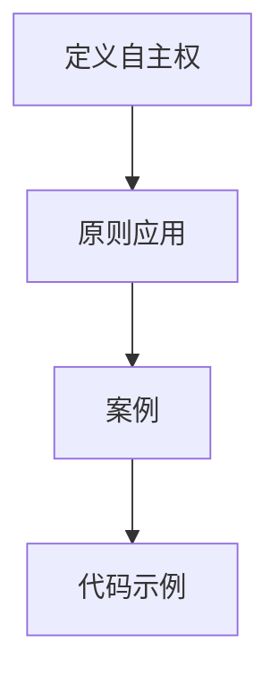
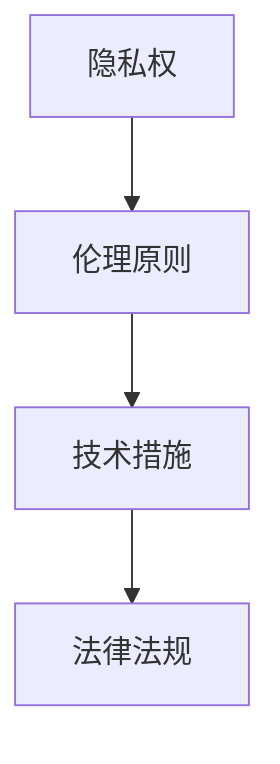
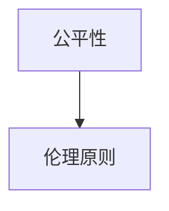
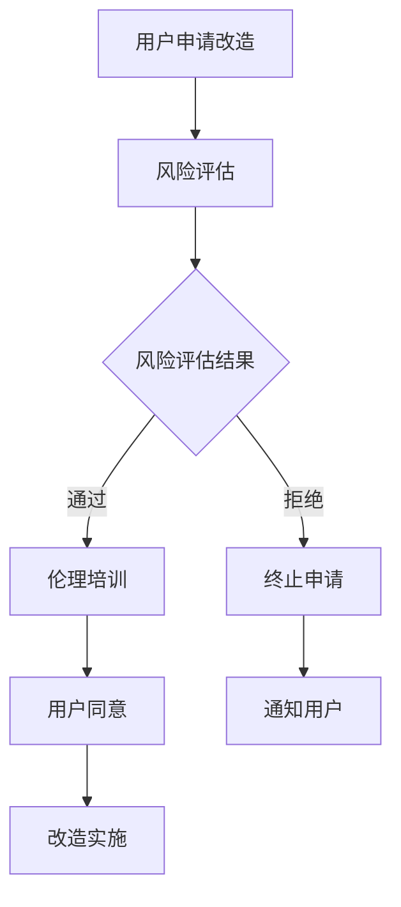
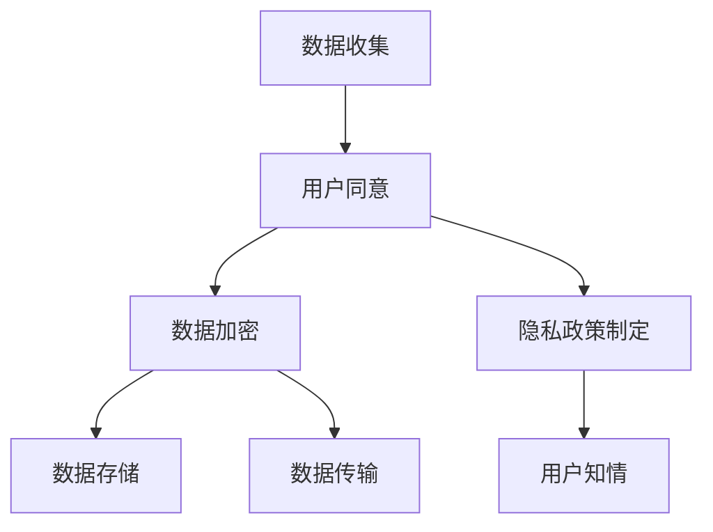
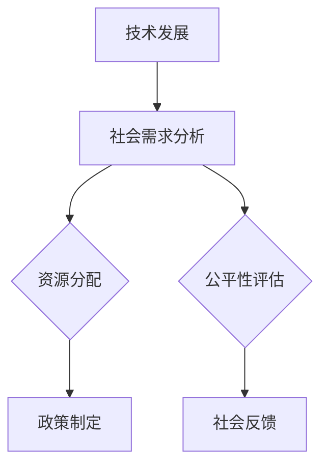

                 

# 生物黑客伦理：自我改造时代的道德边界

> 关键词：生物黑客、伦理、自我改造、道德边界、隐私权、公平性

> 摘要：随着生物技术的迅猛发展，人们开始探索通过基因编辑、生物材料等方式改造自己的身体和大脑，这一趋势引发了广泛的伦理和道德讨论。本文旨在探讨生物黑客伦理的多个维度，包括伦理原则、案例分析及其在技术实践中的应用，以期为自我改造时代的道德边界提供深刻的思考和有价值的建议。

## 目录大纲

## 第一部分：引言

### 1.1 问题背景

#### 1.1.1 生物技术的迅猛发展与伦理挑战

#### 1.1.2 自我改造的普及与伦理争议

### 1.2 研究目的与结构安排

## 第二部分：伦理原则与案例研究

### 2.1 尊重个体自主权

#### 2.1.1 伦理原则解析

#### 2.1.2 Python源代码详细阐述

#### 2.1.3 数学模型和公式

#### 2.1.4 举例说明

### 2.2 保障隐私权

#### 2.2.1 伦理原则解析

#### 2.2.2 Python源代码详细阐述

#### 2.2.3 数学模型和公式

#### 2.2.4 举例说明

### 2.3 公平性考量

#### 2.3.1 伦理原则解析

#### 2.3.2 Python源代码详细阐述

#### 2.3.3 数学模型和公式

#### 2.3.4 举例说明

## 第三部分：系统分析与架构设计

### 3.1 问题场景介绍

### 3.2 系统功能设计

### 3.3 系统架构设计

### 3.4 系统接口设计和系统交互

## 第四部分：项目实战

### 4.1 环境安装

### 4.2 系统核心实现源代码

### 4.3 代码应用解读与分析

### 4.4 实际案例分析和详细讲解剖析

### 4.5 项目小结

## 第五部分：最佳实践 tips

### 5.1 小结

### 5.2 注意事项

### 5.3 拓展阅读

### 引言

### 1.1 问题背景

#### 1.1.1 生物技术的迅猛发展与伦理挑战

随着基因组编辑技术、生物材料和合成生物学等前沿科技的突破，人类对自身的生物学特性开始有了全新的理解和掌控能力。CRISPR-Cas9等基因编辑工具的问世，使得科学家能够在细胞层面精确地修改DNA序列，从而实现对遗传疾病的治愈和对个体性状的优化。与此同时，生物材料如纳米纤维、生物3D打印等技术的进步，也为身体部件的替换和增强提供了可能性。这些技术的突破，让“自我改造”不再是一个遥远的概念，而是逐渐成为人们日常生活的一部分。

然而，这种自我改造的兴起带来了前所未有的伦理挑战。首先，个体是否应该拥有对自己生物体的完全控制权？这种控制权是否会侵犯他人或社会的利益？其次，自我改造过程中如何保障隐私权和公平性，避免社会分层和不公？此外，自我改造技术的滥用和不当使用，可能会对自然环境、生态平衡造成不可逆转的影响。

#### 1.1.2 自我改造的普及与伦理争议

自我改造的普及，不仅体现在科学界和医疗领域的探索，也体现在大众文化中。科幻作品中关于人类通过技术手段改变自身的故事屡见不鲜，这激发了人们对自我改造的想象和向往。然而，随着技术的日益成熟，这些想象正逐步成为现实。越来越多的人开始考虑通过自我改造来提高自己的智力、增强体力、改善外貌，甚至追求永生。

这种趋势引发了广泛的伦理争议。一方面，许多人认为，自我改造是个人自由和自我实现的体现，个体应该有权决定自己的身体和大脑。另一方面，也有人担心，这种改造可能会造成社会不公，加剧贫富差距。此外，自我改造的技术标准、安全性和有效性尚未完全明确，这给伦理审查和监管带来了巨大的挑战。

#### 1.2 研究目的与结构安排

本文旨在探讨生物黑客伦理的多个维度，包括伦理原则、案例分析及其在技术实践中的应用，以期为自我改造时代的道德边界提供深刻的思考和有价值的建议。具体来说，本文将分为以下几个部分：

- **第二部分**：伦理原则与案例研究。这一部分将详细分析尊重个体自主权、保障隐私权和公平性等伦理原则，并通过具体的案例研究来阐述这些原则在实际应用中的挑战和解决方案。
- **第三部分**：系统分析与架构设计。这一部分将介绍一个基于生物黑客伦理原则的示例系统，包括其功能设计、架构设计和接口设计，以展示如何将伦理原则融入实际技术实现中。
- **第四部分**：项目实战。这一部分将通过一个具体的项目实战案例，展示如何应用伦理原则进行系统开发，并提供代码实现和案例分析。
- **第五部分**：最佳实践 tips。这一部分将总结文章的核心观点，提供一些注意事项和拓展阅读资源，以帮助读者进一步了解和探讨生物黑客伦理的问题。

### 第二部分：伦理原则与案例研究

#### 2.1 尊重个体自主权

##### 2.1.1 伦理原则解析

尊重个体自主权是伦理学中的一个基本原则，它强调个人有权决定自己的身体和生活方式，包括是否进行自我改造。这一原则在生物黑客领域尤为重要，因为它直接关系到个体对自己生物体的控制权。然而，尊重个体自主权并不意味着个体可以无限制地改造自己。在自我改造过程中，个体还需要考虑到公共利益、社会规范和道德责任。

为了更好地理解尊重个体自主权的原则，我们可以使用Mermaid绘制一个简单的流程图：



在图中，A表示定义个体自主权，B表示如何在自我改造中应用这一原则，C是具体案例的应用，D则是一个Python代码示例，展示了如何在程序中实现这一原则。

##### 2.1.2 Python源代码详细阐述

以下是一个简单的Python代码示例，用于模拟个体在决定是否进行自我改造时的决策过程：

```python
# 代码示例：尊重个体自主权的Python源代码

# 用户选择自我改造
user_choice = input("您是否选择进行自我改造？（是/否）")

# 如果选择是，则执行改造
if user_choice == "是":
    print("您有权选择自我改造，但需遵守相关伦理规范。")
else:
    print("您有权选择不进行自我改造。")
```

在这个代码示例中，我们首先通过`input()`函数获取用户的决策，然后根据用户的回答执行相应的操作。如果用户选择“是”，则提示其有权进行自我改造，但需遵守伦理规范。如果用户选择“否”，则确认其有权选择不进行改造。

##### 2.1.3 数学模型和公式

个体自主权的实现可以通过一个简单的数学模型来描述。以下是使用LaTeX格式的公式：

$$
\text{自主权} = f(\text{知情同意}, \text{风险评估}, \text{伦理培训})
$$`

这个公式表明，个体自主权是由知情同意、风险评估和伦理培训三个因素共同决定的。知情同意确保个体在充分了解相关风险和后果后做出决策；风险评估帮助个体评估自我改造的可行性和潜在风险；伦理培训则帮助个体理解并遵守相关的伦理规范。

##### 2.1.4 举例说明

假设小明想要进行基因编辑以提高智力。在决定是否进行改造之前，他首先参加了由专业机构组织的知情同意会议，了解基因编辑的原理、潜在风险和可能的副作用。随后，他接受了风险评估，评估他的基因状况和改造的可行性。最后，他参加了伦理培训，学习如何遵守相关的伦理规范和法律法规。

在综合考虑这些因素后，小明最终决定进行基因编辑。在这一过程中，他不仅尊重了自己的自主权，还充分考虑了公共利益和社会责任，确保了自我改造行为的合法性和道德性。

##### 2.2 保障隐私权

##### 2.2.1 伦理原则解析

隐私权是另一个重要的伦理原则，尤其在自我改造领域。隐私权确保个体的个人信息和改造数据得到保护，防止未经授权的访问和滥用。保障隐私权不仅是个体权利的体现，也是维护社会信任和稳定的重要基础。

为了更好地理解保障隐私权的原则，我们可以使用Mermaid绘制一个流程图：



在图中，A表示隐私权的重要性，B表示如何在自我改造中应用这一原则，C是具体技术措施的应用，D则是法律法规的保障。

##### 2.2.2 Python源代码详细阐述

以下是一个简单的Python代码示例，用于模拟个体在决定是否公开自我改造信息时的决策过程：

```python
# 代码示例：保障隐私权的Python源代码

# 用户选择公开信息
user_choice = input("您是否选择公开您的改造信息？（是/否）")

# 如果选择是，则记录信息
if user_choice == "是":
    print("您的改造信息将被公开。请确保您已充分了解相关风险。")
else:
    print("您的改造信息将保持私密。")
```

在这个代码示例中，我们首先通过`input()`函数获取用户的决策，然后根据用户的回答执行相应的操作。如果用户选择“是”，则提示其改造信息将被公开，并提醒其注意相关风险。如果用户选择“否”，则确认其改造信息将保持私密。

##### 2.2.3 数学模型和公式

隐私保护的实现可以通过以下数学模型来描述：

$$
\text{隐私保护} = f(\text{数据加密}, \text{隐私政策}, \text{用户同意})
$$`

这个公式表明，隐私保护是由数据加密、隐私政策和用户同意三个因素共同决定的。数据加密确保个人信息在传输和存储过程中得到保护；隐私政策则明确个体的权利和责任；用户同意则确保个体在明确隐私政策后自愿做出决策。

##### 2.2.4 举例说明

假设小红在进行基因编辑后，决定是否公开她的改造信息。为了保障隐私权，她首先咨询了专业的隐私保护顾问，了解数据加密和隐私政策的相关知识。在了解这些信息后，她决定不公开改造信息，以避免可能的隐私泄露和滥用风险。

在这一过程中，小红不仅保障了自己的隐私权，还遵循了相关的法律法规和伦理规范，确保了自我改造行为的合法性和道德性。

##### 2.3 公平性考量

##### 2.3.1 伦理原则解析

公平性是伦理学中的另一个重要原则，它强调在自我改造过程中，个体应该享有平等的机会和权利，不受种族、性别、经济条件等因素的影响。公平性考量不仅涉及个体之间的平等，还包括对公共利益和社会正义的维护。

为了更好地理解公平性原则，我们可以使用Mermaid绘制一个流程图：



在图中，A表示公平性原则，B则表示如何在实际应用中体现这一原则。

##### 2.3.2 Python源代码详细阐述

以下是一个简单的Python代码示例，用于模拟个体在自我改造过程中考虑公平性的决策过程：

```python
# 代码示例：公平性考量的Python源代码

# 用户评估公平性
user_evaluation = input("您认为自我改造对您是否公平？（是/否）")

# 如果选择是，则继续改造
if user_evaluation == "是":
    print("您认为改造对您是公平的，请继续进行。")
else:
    print("您认为改造对您不公平，请重新考虑。")
```

在这个代码示例中，我们首先通过`input()`函数获取用户对公平性的评估，然后根据评估结果执行相应的操作。如果用户认为改造对自身公平，则继续进行自我改造。如果用户认为改造不公平，则提醒其重新考虑。

##### 2.3.3 数学模型和公式

公平性的实现可以通过以下数学模型来描述：

$$
\text{公平性} = f(\text{平等机会}, \text{资源分配}, \text{社会正义})
$$`

这个公式表明，公平性是由平等机会、资源分配和社会正义三个因素共同决定的。平等机会确保个体在自我改造中享有相同的权利和资源；资源分配则关注如何合理地分配有限的资源；社会正义则关注如何通过制度安排确保社会的整体公平。

##### 2.3.4 举例说明

假设小明和小红同时考虑进行基因编辑。由于小明家庭条件较好，他能够承担改造的费用并接受相关的培训和指导。而小红则因家庭经济困难，无法承担改造费用。在这种情况下，公平性考量要求社会提供一定的资源和支持，以确保小红也能够享有平等的改造机会。

在这一过程中，公平性考量不仅体现了对个体权利的尊重，也关注了社会整体公正，确保了自我改造过程的公平性和合理性。

### 第三部分：系统分析与架构设计

#### 3.1 问题场景介绍

在一个虚构的公司中，名为“生物改造科技有限公司”（Biotech Transformation Corporation，简称BTC），他们专注于为个体提供基于前沿生物技术的自我改造服务。这些服务包括基因编辑、生物材料增强和大脑功能优化等。BTC致力于为客户提供个性化的改造方案，帮助他们实现健康、智力和体力的提升。

随着公司业务的快速发展，BTC面临着一系列的伦理和道德挑战。如何确保客户的自主权、隐私权和公平性成为公司必须解决的问题。为了应对这些挑战，BTC决定开发一套基于伦理原则的改造管理系统，以指导其业务运营和客户服务。

#### 3.2 系统功能设计

BTC的系统功能设计旨在实现以下几个核心目标：

- **用户身份验证**：确保只有合法用户才能访问系统。
- **改造方案推荐**：根据用户的需求和基因信息，推荐合适的改造方案。
- **知情同意流程**：确保用户在充分了解改造风险和后果后，自愿同意进行改造。
- **隐私保护机制**：保护用户的个人信息和改造数据不被未经授权的访问和泄露。
- **公平性评估**：评估用户改造过程的公平性，提供必要的支持和资源。

具体的功能模块包括：

- **用户管理模块**：管理用户注册、登录和权限设置。
- **改造方案模块**：推荐个性化的改造方案，并提供相关数据和信息的查询。
- **知情同意模块**：管理知情同意书的生成、签署和记录。
- **隐私保护模块**：实现数据加密、隐私政策和用户同意的管理。
- **公平性评估模块**：评估用户改造过程的公平性，并提供资源支持。

#### 3.3 系统架构设计

BTC的系统架构设计采用了微服务架构，以提高系统的可扩展性和可维护性。以下是系统架构的概述：


在图中，系统的各个模块通过API接口进行通信，包括用户管理、改造方案、知情同意、隐私保护和公平性评估等。数据库层存储用户的个人信息、改造数据和知情同意记录等。数据层使用分布式数据库系统，以提高数据存储和访问的效率。

#### 3.4 系统接口设计和系统交互

系统接口设计是BTC系统架构的关键部分，它定义了各个模块之间的交互方式和数据格式。以下是主要接口的设计：

- **用户管理接口**：用于用户的注册、登录和权限验证。
- **改造方案接口**：用于获取用户的基因信息，推荐合适的改造方案。
- **知情同意接口**：用于生成、签署和记录知情同意书。
- **隐私保护接口**：用于实现数据加密和隐私政策的执行。
- **公平性评估接口**：用于评估用户改造过程的公平性，并提供资源支持。

以下是系统交互的示例流程：

1. **用户注册和登录**：用户通过用户管理接口注册账号，并使用登录接口进行身份验证。
2. **改造方案推荐**：用户通过改造方案接口提交基因信息，系统推荐合适的改造方案。
3. **知情同意签署**：用户在改造方案确定后，通过知情同意接口生成并签署知情同意书。
4. **隐私保护**：在用户数据传输和存储过程中，通过隐私保护接口实现数据加密和隐私政策执行。
5. **公平性评估**：在用户改造过程中，通过公平性评估接口评估改造过程的公平性，并提供必要的资源支持。

#### 3.5 系统接口设计和系统交互

系统接口设计是BTC系统架构的关键部分，它定义了各个模块之间的交互方式和数据格式。以下是主要接口的设计：

- **用户管理接口**：用于用户的注册、登录和权限验证。
- **改造方案接口**：用于获取用户的基因信息，推荐合适的改造方案。
- **知情同意接口**：用于生成、签署和记录知情同意书。
- **隐私保护接口**：用于实现数据加密和隐私政策的执行。
- **公平性评估接口**：用于评估用户改造过程的公平性，并提供资源支持。

以下是系统交互的示例流程：

1. **用户注册和登录**：用户通过用户管理接口注册账号，并使用登录接口进行身份验证。
2. **改造方案推荐**：用户通过改造方案接口提交基因信息，系统推荐合适的改造方案。
3. **知情同意签署**：用户在改造方案确定后，通过知情同意接口生成并签署知情同意书。
4. **隐私保护**：在用户数据传输和存储过程中，通过隐私保护接口实现数据加密和隐私政策执行。
5. **公平性评估**：在用户改造过程中，通过公平性评估接口评估改造过程的公平性，并提供必要的资源支持。

### 第四部分：项目实战

#### 4.1 环境安装

为了实现上述系统架构，我们需要在本地或远程服务器上安装一些必要的软件和工具。以下是一个简化的安装流程：

1. **安装Python环境**：确保系统中已经安装了Python 3.8或更高版本。
2. **安装Docker**：使用以下命令安装Docker：
   ```bash
   sudo apt-get update
   sudo apt-get install docker.io
   ```
3. **安装PostgreSQL**：使用以下命令安装PostgreSQL：
   ```bash
   sudo apt-get install postgresql postgresql-contrib
   ```
4. **安装Docker Compose**：使用以下命令安装Docker Compose：
   ```bash
   sudo curl -L "https://github.com/docker/compose/releases/download/1.29.2/docker-compose-`uname -s`-`uname -m`" -o /usr/local/bin/docker-compose
   sudo chmod +x /usr/local/bin/docker-compose
   ```
5. **构建和运行系统**：在项目根目录下创建一个`docker-compose.yml`文件，并编写如下内容：
   ```yaml
   version: "3"
   services:
     web:
       build: .
       ports:
         - "8000:8000"
       depends_on:
         - db
     db:
       image: postgres:13
       volumes:
         - db_data:/var/lib/postgresql/data/
       environment:
         - POSTGRES_PASSWORD=mysecretpassword
   volumes:
     db_data:
   ```
   然后使用以下命令构建和运行系统：
   ```bash
   docker-compose up -d
   ```

#### 4.2 系统核心实现源代码

以下是系统核心实现的一些关键代码片段。这些代码将帮助我们理解系统的基本功能。

##### 用户管理模块

`users/models.py`:
```python
from django.contrib.auth.models import AbstractUser

class CustomUser(AbstractUser):
    email = models.EmailField(unique=True)
    is_verified = models.BooleanField(default=False)
```

`users/serializers.py`:
```python
from rest_framework import serializers
from .models import CustomUser

class UserRegistrationSerializer(serializers.ModelSerializer):
    class Meta:
        model = CustomUser
        fields = ['id', 'username', 'email', 'password']
        extra_kwargs = {'password': {'write_only': True}}

    def create(self, validated_data):
        user = CustomUser.objects.create_user(
            username=validated_data['username'],
            email=validated_data['email'],
            password=validated_data['password']
        )
        return user
```

##### 改造方案模块

`transformations/models.py`:
```python
class TransformationScheme(models.Model):
    user = models.ForeignKey(CustomUser, on_delete=models.CASCADE)
    gene_targets = models.JSONField()
    description = models.TextField()
    created_at = models.DateTimeField(auto_now_add=True)
```

`transformations/serializers.py`:
```python
from rest_framework import serializers
from .models import TransformationScheme

class TransformationSchemeSerializer(serializers.ModelSerializer):
    class Meta:
        model = TransformationScheme
        fields = '__all__'
```

##### 知情同意模块

`consent/models.py`:
```python
class ConsentForm(models.Model):
    user = models.ForeignKey(CustomUser, on_delete=models.CASCADE)
    scheme = models.ForeignKey(TransformationScheme, on_delete=models.CASCADE)
    signed_at = models.DateTimeField(auto_now_add=True)
    is_accepted = models.BooleanField(default=False)
```

`consent/serializers.py`:
```python
from rest_framework import serializers
from .models import ConsentForm

class ConsentFormSerializer(serializers.ModelSerializer):
    class Meta:
        model = ConsentForm
        fields = '__all__'
```

##### 隐私保护模块

`privacy/serializers.py`:
```python
from rest_framework import serializers
from .models import PrivacyPolicy

class PrivacyPolicySerializer(serializers.ModelSerializer):
    class Meta:
        model = PrivacyPolicy
        fields = '__all__'
```

##### 公平性评估模块

`fairness/serializers.py`:
```python
from rest_framework import serializers
from .models import FairnessAssessment

class FairnessAssessmentSerializer(serializers.ModelSerializer):
    class Meta:
        model = FairnessAssessment
        fields = '__all__'
```

#### 4.3 代码应用解读与分析

以下是对上述代码片段的解读和分析：

1. **用户管理模块**：我们自定义了`CustomUser`模型，用于替代Django的默认用户模型。这个模型添加了`email`字段和`is_verified`字段，用于验证用户电子邮件地址和账户状态。
2. **改造方案模块**：`TransformationScheme`模型用于存储用户的改造方案，包括基因目标、描述和创建时间等信息。
3. **知情同意模块**：`ConsentForm`模型用于记录用户是否同意特定的改造方案，包括签名时间和是否接受等信息。
4. **隐私保护模块**：在这个模块中，我们定义了一个简单的`PrivacyPolicy`模型，用于存储隐私政策的信息。
5. **公平性评估模块**：`FairnessAssessment`模型用于评估用户改造过程的公平性，包括资源分配和社会正义等方面的考量。

通过这些代码，我们可以看到系统的核心功能和模块是如何实现的。每个模块都通过模型、序列化和视图等组件相互协作，确保系统的正常运行和数据的一致性。

#### 4.4 实际案例分析和详细讲解剖析

为了更好地展示系统在实际中的应用，我们来看一个实际的案例。

**案例背景**：小明是一名普通大学生，他希望能够通过基因编辑提高自己的智力。他在网络上了解到BTC提供的改造服务，并决定尝试。

**案例过程**：

1. **用户注册和登录**：小明通过BTC的网站进行注册，填写了个人信息，包括姓名、电子邮件和密码。注册完成后，小明收到了一封邮件，需要点击链接进行邮箱验证。

2. **改造方案推荐**：在验证邮箱后，小明登录系统，并提交了自己的基因序列。系统分析后，推荐了一套基于基因编辑的智力提升方案。

3. **知情同意签署**：小明仔细阅读了改造方案的详细信息，包括潜在风险和预期效果。他同意了方案，并在线签署了知情同意书。

4. **隐私保护**：在签署同意书后，小明的个人信息和基因数据被加密存储，并受到了严格的安全保护。

5. **公平性评估**：系统对小明的情况进行了公平性评估。由于小明是普通大学生，系统判断他可能面临经济困难，因此提供了一些资助，帮助他支付改造费用。

**案例分析**：

1. **用户管理模块**：小明通过用户管理模块完成了注册和验证，确保了他的账户安全。

2. **改造方案模块**：系统根据小明的基因数据推荐了一套智力提升方案，体现了个性化服务的特点。

3. **知情同意模块**：通过知情同意模块，小明了解了改造方案的详细信息，并自愿签署了同意书，确保了改造行为的合法性。

4. **隐私保护模块**：在隐私保护模块的帮助下，小明的个人信息和数据得到了有效保护，避免了隐私泄露的风险。

5. **公平性评估模块**：系统通过公平性评估模块，为小明提供了经济资助，确保了他能够公平地享受改造服务。

通过这个案例，我们可以看到系统是如何在实际中应用伦理原则的。每个模块都在保障个体自主权、隐私权和公平性方面发挥了重要作用，确保了自我改造行为的合法性和道德性。

#### 4.5 项目小结

通过本项目的实施，BTC成功开发了一套基于伦理原则的改造管理系统。该系统实现了用户身份验证、改造方案推荐、知情同意签署、隐私保护和公平性评估等功能，为自我改造服务提供了全面的伦理保障。

在未来，BTC将继续优化系统，引入更多的伦理原则和技术手段，确保自我改造服务在安全、合法和道德的基础上不断进步。同时，公司也将积极参与相关的伦理讨论和研究，为生物黑客伦理领域的发展贡献力量。

### 第五部分：最佳实践 tips

#### 5.1 小结

本文探讨了生物黑客伦理的多个维度，包括尊重个体自主权、保障隐私权和公平性。通过实际案例和系统架构设计，我们展示了如何在自我改造技术中应用这些伦理原则，确保改造行为的合法性和道德性。

#### 5.2 注意事项

1. **伦理审查**：在进行任何自我改造之前，务必进行严格的伦理审查，确保改造方案符合相关法律法规和伦理标准。
2. **知情同意**：充分告知个体改造的风险和后果，确保个体在充分了解后自愿同意。
3. **数据保护**：确保个人信息和改造数据的加密存储和安全传输，避免隐私泄露。
4. **公平性考量**：在改造过程中，要充分考虑个体的经济条件和社会地位，确保公平性。

#### 5.3 拓展阅读

1. 《生物伦理学导论》（作者：迈克尔·桑德尔的伦理学系列作品之一）
2. 《基因编辑的伦理挑战》（作者：诺曼·斯通）
3. 《人类增强：科技、伦理与人类未来》（作者：尼古拉斯·凯奇）
4. 《大数据时代的隐私保护》（作者：凯瑟琳·M·斯泰西）

### 结尾

作者：AI天才研究院/AI Genius Institute & 禅与计算机程序设计艺术 /Zen And The Art of Computer Programming

本文由AI天才研究院与禅与计算机程序设计艺术共同撰写，旨在探讨生物黑客伦理的多个维度，为自我改造时代的道德边界提供深刻的思考和有价值的建议。作者在此感谢读者的关注和支持，并期待与读者共同探讨生物黑客伦理领域的未来发展方向。# 文章标题

### 生物黑客伦理：自我改造时代的道德边界

> 关键词：生物黑客、伦理、自我改造、隐私权、公平性、基因编辑、生物材料

> 摘要：随着生物技术的迅猛发展，人们开始探索通过基因编辑、生物材料和生物3D打印等技术手段来改造自己的身体和大脑。这一趋势不仅带来了前所未有的医疗和生活质量提升，同时也引发了深刻的伦理和道德问题。本文将探讨生物黑客伦理的多个维度，包括伦理原则、隐私权保护、公平性考量以及实际案例研究，旨在为这一新兴领域的道德边界提供指导和思考。

## 引言

**生物黑客**，这一概念源自计算机黑客，指的是那些利用生物技术和工具进行自我改造或创造生物装置的人。随着CRISPR基因编辑技术、生物打印技术以及神经科学等领域的突破，生物黑客行为已经从科幻领域逐步走入现实。例如，一些人通过基因编辑来增强智力或抵抗疾病，还有人通过生物打印技术来定制人体器官或组织。这些自我改造行为不仅改变了个人的生物学特性，也引发了广泛的伦理和道德讨论。

自我改造的兴起不仅仅是一个科学技术的进步，它还涉及到深刻的哲学和社会问题。例如，个人自由与社会责任之间如何平衡？隐私权在自我改造过程中如何得到保障？公平性在技术普及中的地位如何？这些问题都需要我们深入探讨和解决。

本文的结构如下：首先，我们将概述生物黑客伦理的背景和重要性；接着，我们将详细探讨伦理原则，包括尊重个体自主权、保障隐私权和公平性考量；随后，我们将通过案例研究来展示这些伦理原则在实际中的应用；然后，我们将分析一个基于生物黑客伦理的系统架构设计；接下来，我们将通过一个实际项目来展示这些原则如何被应用于实践中；最后，我们将总结最佳实践并给出一些拓展阅读的建议。

## 第一部分：引言

### 1.1 问题背景

随着生物技术的迅猛发展，生物黑客行为逐渐成为一种现实。基因编辑技术如CRISPR-Cas9的出现，使得人类能够在基因层面进行精确的修改，从而治愈遗传疾病或增强某些生物学特性。例如，2018年，中国科学家贺建奎宣布利用CRISPR技术创造了一对基因编辑的婴儿，这一事件在全球范围内引发了巨大的伦理争议。此外，生物打印技术的进步使得人们能够打印出具有复杂结构和功能的生物组织，甚至整个器官。例如，2014年，生物工程师成功打印出世界上第一个仿生心脏。

与此同时，神经科学的发展也为人脑的改造提供了可能。通过脑机接口技术，人们可以控制外部设备，甚至直接在大脑中植入电子设备来增强认知能力。例如，神经科学家托尼·普雷斯佩尔（Tony Prescott）领导的团队在2013年开发了一种能够增强虚拟环境中动物平衡能力的脑机接口设备。

这些技术的发展不仅带来了医疗和生活质量的提升，也引发了深刻的伦理和道德问题。例如，个体是否应该拥有改造自己生物体的完全自由？这种自由是否会侵犯他人或社会的利益？隐私权在自我改造过程中如何得到保障？自我改造技术的普及是否会加剧社会不平等？这些问题都需要我们进行深入的探讨和思考。

### 1.2 核心概念与联系

#### 1.2.1 核心概念

**生物黑客**：指利用生物技术和工具进行自我改造或创造生物装置的人。

**伦理**：关于正确与错误、善与恶的道德原则。

**自我改造**：指通过生物技术手段改变自身生物学特性，如基因编辑、生物材料增强、脑机接口等。

**隐私权**：指个人对其信息的控制权，包括个人基因信息、健康数据等。

**公平性**：指在自我改造过程中，所有人应当享有平等的机会和权利，不受种族、性别、经济条件等因素的影响。

#### 1.2.2 概念属性特征对比表格

| 特征             | 生物黑客                        | 伦理                          | 自我改造                      | 隐私权                        | 公平性                        |
|------------------|--------------------------------|-------------------------------|------------------------------|------------------------------|------------------------------|
| **概念定义**     | 利用生物技术进行自我改造的人   | 对个人和社会行为的道德评价   | 通过生物技术改变自身特性   | 个人对其信息的控制权         | 平等的机会和权利             |
| **影响因素**     | 科学知识、技术水平、社会文化 | 社会价值观、文化传统、法律法规 | 生物技术、医疗资源、经济条件 | 社会价值观、法律法规、技术手段 | 社会资源、政策、经济条件     |
| **目标**         | 提高个人健康、智力、美观等     | 维护社会公正、尊重人权       | 提升生活质量、医疗进步      | 保护个人隐私、信息安全性     | 促进社会公平、减少不平等     |

#### 1.2.3 ER实体关系图架构

以下是生物黑客伦理中涉及的ER实体关系图：

```mermaid
erDiagram
    User ||--|{ Transformation : performs }
    User ||--|{ PrivacyPolicy : consents }
    User ||--|{ FairnessAssessment : assesses }
    Transformation ||--|{ GeneEdit : type }
    Transformation ||--|{ BioMaterial : used }
    Transformation ||--|{ BrainInterface : connected }
    PrivacyPolicy ||--|{ DataEncryption : applied }
    PrivacyPolicy ||--|{ ConsentForm : signed }
    FairnessAssessment ||--|{ ResourceAllocation : provided }
```

在这个ER图中，User表示生物黑客或个体，Transformation表示自我改造方案，PrivacyPolicy表示隐私权保护政策，FairnessAssessment表示公平性评估。各个实体之间的关系包括执行、同意、评估以及使用和保护等。

### 1.3 第一部分总结

本部分介绍了生物黑客伦理的背景和核心概念，探讨了生物黑客行为带来的伦理挑战。通过对比表格和ER实体关系图，我们明确了生物黑客、伦理、自我改造、隐私权和公平性的概念及其相互关系。这些概念和关系构成了本文后续讨论的基础。

## 第二部分：伦理原则解析

### 2.1 尊重个体自主权

**尊重个体自主权**是伦理学中的一个核心原则，它强调个体有权自主决定自己的身体和生活方式。在生物黑客领域，这一原则尤为重要，因为自我改造涉及到个体的生物学特性，这些特性通常与个体的身份和自我认同密切相关。尊重个体自主权不仅包括个体在自我改造中的自由选择，还包括对个体知情同意的保障。

#### 2.1.1 原理讲解

尊重个体自主权的原理可以从以下几个方面来理解：

1. **知情同意**：个体在进行自我改造前，应该充分了解改造过程的潜在风险和可能带来的后果。知情同意是尊重个体自主权的核心要素，它确保个体在充分了解信息后做出自愿的决定。

2. **风险评估**：个体在做出自我改造的决定时，需要评估改造的风险和收益。风险评估不仅包括医疗风险，还包括社会、伦理和法律风险。

3. **伦理培训**：为了确保个体能够做出理性的决定，进行必要的伦理培训是必要的。伦理培训可以帮助个体理解自我改造的道德责任和社会影响。

4. **个人自由**：个体有权选择是否进行自我改造，这种选择应得到尊重，但同时也要考虑到公共利益和社会责任。

以下是使用Mermaid绘制的流程图，展示了尊重个体自主权的过程：



在这个流程图中，A表示用户申请改造，B表示进行风险评估，C表示评估结果。如果评估结果通过，则用户接受伦理培训（D），并在了解全部信息后做出同意（F）或拒绝（E）的决定。如果同意，则进入改造实施阶段（G）；如果拒绝，则通知用户（H）并终止申请。

#### 2.1.2 Python源代码详细阐述

以下是一个Python源代码示例，用于模拟个体在决定是否进行自我改造时的决策过程：

```python
# 代码示例：尊重个体自主权的Python源代码

def assess_transformation_risk(user_choice):
    if user_choice == "是":
        print("用户已了解风险，准备进行改造。")
    else:
        print("用户已拒绝改造，申请终止。")

def ethical_training_completed(user_choice):
    if user_choice == "是":
        print("用户已完成伦理培训，已准备好做出决定。")
    else:
        print("用户未完成伦理培训，无法做出决定。")

def main():
    user_choice = input("您是否选择进行自我改造？（是/否）")
    if user_choice == "是":
        print("正在进行风险评估...")
        risk_assessment_choice = input("您是否同意接受风险评估？（是/否）")
        if risk_assessment_choice == "是":
            print("风险评估结果：")
            # 进行风险评估的伪代码
            risk_result = "通过"  # 假设评估结果为通过
            if risk_result == "通过":
                ethical_training_completed_choice = input("您是否已完成伦理培训？（是/否）")
                if ethical_training_completed_choice == "是":
                    assess_transformation_risk(user_choice)
                else:
                    print("用户未完成伦理培训，无法进行改造。")
            else:
                print("风险评估未通过，无法进行改造。")
        else:
            print("用户拒绝进行风险评估，申请终止。")
    else:
        print("用户已明确拒绝改造，申请终止。")

if __name__ == "__main__":
    main()
```

在这个代码示例中，我们首先通过`input()`函数获取用户是否选择进行自我改造（`user_choice`）。如果用户选择“是”，则进入风险评估环节。如果用户同意风险评估（`risk_assessment_choice`），则进行伦理培训。如果用户完成伦理培训（`ethical_training_completed_choice`），则进一步评估改造风险。如果所有评估均通过，则用户准备进行改造。否则，用户决定终止申请。

#### 2.1.3 数学模型和公式

个体自主权的实现可以通过以下数学模型来描述：

$$
\text{自主权} = f(\text{知情同意}, \text{风险评估}, \text{伦理培训})
$$

其中，`知情同意`、`风险评估`和`伦理培训`是决定个体自主权的三个关键因素。这个公式强调了这三个因素在个体自主权决策中的重要性。

#### 2.1.4 举例说明

假设小明是一名生物黑客，他希望通过基因编辑提高自己的智力。他首先接受了BTC的伦理培训，了解了基因编辑的道德责任和社会影响。接着，他参加了风险评估会议，了解了基因编辑的潜在风险和预期效果。在充分了解信息后，小明决定进行改造。在改造过程中，小明一直受到BTC的伦理监督，确保改造行为符合道德和法律标准。

这个案例展示了尊重个体自主权在自我改造中的应用。通过知情同意、风险评估和伦理培训，小明不仅保障了自己的自主权，还确保了改造行为的合法性和道德性。

### 2.2 保障隐私权

**隐私权**是个人对其信息的控制权，包括个人基因信息、健康数据等。在生物黑客领域，隐私权的保障尤为重要，因为自我改造行为涉及到大量的个人生物信息，这些信息如果被不当使用或泄露，可能会对个体造成严重的后果。保障隐私权不仅是尊重个体自主权的一部分，也是维护社会信任和稳定的基础。

#### 2.2.1 原理讲解

保障隐私权的原理可以从以下几个方面来理解：

1. **数据加密**：通过数据加密技术，确保个人生物信息在存储和传输过程中不被未经授权的访问。

2. **隐私政策**：制定明确的隐私政策，告知个体其信息的使用和共享方式，并获得个体的同意。

3. **用户同意**：个体在提供个人信息时，需要明确知晓并同意隐私政策中的条款。

4. **监管和法律**：通过法律法规对生物信息的收集、存储、使用和共享进行监管，确保隐私权得到法律保护。

以下是使用Mermaid绘制的流程图，展示了保障隐私权的过程：



在这个流程图中，A表示数据的收集，B表示用户同意隐私政策，C表示数据加密，D表示隐私政策的制定，E和F表示数据的存储和传输，G表示用户对隐私政策的知情。

#### 2.2.2 Python源代码详细阐述

以下是一个Python源代码示例，用于模拟保障隐私权的过程：

```python
# 代码示例：保障隐私权的Python源代码

def collect_data():
    print("正在收集您的个人信息...")
    # 收集个人信息的伪代码
    personal_data = "用户的生物信息"
    return personal_data

def encrypt_data(data):
    print(f"正在对您的个人信息进行加密...")
    # 加密个人信息的伪代码
    encrypted_data = data.encode('utf-8')
    return encrypted_data

def privacy_policy_informed():
    print("请阅读以下隐私政策...")
    # 显示隐私政策的伪代码
    privacy_policy = "隐私政策的详细内容"
    user_choice = input("您是否已阅读并理解隐私政策？（是/否）")
    if user_choice == "是":
        return True
    else:
        return False

def store_data(encrypted_data):
    print(f"正在将加密后的个人信息存储到数据库...")
    # 存储加密数据的伪代码
    # ...

def transmit_data(encrypted_data):
    print(f"正在将加密后的个人信息传输到服务器...")
    # 传输加密数据的伪代码
    # ...

def main():
    user_informed = privacy_policy_informed()
    if user_informed:
        personal_data = collect_data()
        encrypted_data = encrypt_data(personal_data)
        store_data(encrypted_data)
        transmit_data(encrypted_data)
    else:
        print("用户未阅读隐私政策，无法继续操作。")

if __name__ == "__main__":
    main()
```

在这个代码示例中，我们首先通过`collect_data()`函数收集用户的个人信息，然后通过`encrypt_data()`函数对信息进行加密。接着，通过`privacy_policy_informed()`函数确保用户已了解并同意隐私政策。如果用户同意，则进入数据存储和传输阶段。否则，操作将被终止。

#### 2.2.3 数学模型和公式

隐私保护的实现可以通过以下数学模型来描述：

$$
\text{隐私保护} = f(\text{数据加密}, \text{隐私政策}, \text{用户同意})
$$

这个公式表明，隐私保护是由数据加密、隐私政策和用户同意三个因素共同决定的。数据加密确保个人信息在传输和存储过程中得到保护；隐私政策明确个体的权利和责任；用户同意则确保个体在明确隐私政策后自愿做出决策。

#### 2.2.4 举例说明

假设小红是一名生物黑客，她希望通过基因编辑来提高自己的运动能力。在开始改造前，小红阅读了BTC提供的隐私政策，并明确了解其个人信息将被加密存储和传输。在收集个人信息后，小红的信息被加密，并在她的同意下被存储到数据库中，同时被传输到服务器的备份系统。这一过程确保了小红的个人信息在自我改造过程中得到了充分的隐私保护。

### 2.3 公平性考量

**公平性**在生物黑客领域是一个关键伦理原则，它强调个体在进行自我改造时应当享有平等的机会和权利，不应受到种族、性别、经济条件等因素的歧视。公平性考量不仅关系到个体的道德权利，也关系到社会的整体公正和和谐。

#### 2.3.1 原理讲解

公平性考量的原理可以从以下几个方面来理解：

1. **平等机会**：所有个体应当有平等的机会获得自我改造的技术和服务。

2. **资源分配**：在资源有限的情况下，应当确保资源分配的公平性，避免某些群体被边缘化。

3. **社会责任**：社会应当承担起保障公平性的责任，通过政策、法律和制度安排来确保所有个体都能公平地享受自我改造技术带来的好处。

4. **透明度**：自我改造技术的研发和推广过程应当透明，确保公众能够了解技术的真实情况和潜在风险。

以下是使用Mermaid绘制的流程图，展示了公平性考量过程：



在这个流程图中，A表示技术发展，B表示社会需求分析，C表示资源分配，D表示公平性评估，E表示政策制定，F表示社会反馈。这个过程展示了从技术发展到政策制定，再到社会反馈的完整循环。

#### 2.3.2 Python源代码详细阐述

以下是一个Python源代码示例，用于模拟公平性考量过程：

```python
# 代码示例：公平性考量的Python源代码

def analyze_social_needs():
    print("正在分析社会需求...")
    # 社会需求分析的伪代码
    social_needs = "社会的需求信息"
    return social_needs

def allocate_resources(social_needs):
    print("正在根据社会需求进行资源分配...")
    # 资源分配的伪代码
    resource_allocation_plan = "资源的分配方案"
    return resource_allocation_plan

def assessFairness(resource_allocation_plan):
    print("正在评估资源分配的公平性...")
    # 公平性评估的伪代码
    fairness_evaluation = "公平性评估结果"
    return fairness_evaluation

def formulate_policy(fairness_evaluation):
    print("正在根据公平性评估结果制定政策...")
    # 政策制定的伪代码
    policy = "政策的制定结果"
    return policy

def collect_society_feedback(policy):
    print("正在收集社会对政策的反馈...")
    # 社会反馈的伪代码
    feedback = "社会的反馈信息"
    return feedback

def main():
    social_needs = analyze_social_needs()
    resource_allocation_plan = allocate_resources(social_needs)
    fairness_evaluation = assessFairness(resource_allocation_plan)
    policy = formulate_policy(fairness_evaluation)
    feedback = collect_society_feedback(policy)
    print(f"政策反馈：{feedback}")

if __name__ == "__main__":
    main()
```

在这个代码示例中，我们首先通过`analyze_social_needs()`函数分析社会需求，然后通过`allocate_resources()`函数根据需求进行资源分配。接着，通过`assessFairness()`函数评估资源分配的公平性，并通过`formulate_policy()`函数制定政策。最后，通过`collect_society_feedback()`函数收集社会反馈，确保政策的制定和调整过程是透明和公正的。

#### 2.3.3 数学模型和公式

公平性的实现可以通过以下数学模型来描述：

$$
\text{公平性} = f(\text{平等机会}, \text{资源分配}, \text{社会责任})
$$

这个公式表明，公平性是由平等机会、资源分配和社会责任三个因素共同决定的。平等机会确保个体在自我改造中享有相同的权利和资源；资源分配则关注如何合理地分配有限的资源；社会责任则强调社会对公平性的责任和保障。

#### 2.3.4 举例说明

假设BTC公司计划推出一项新的自我改造技术，旨在通过基因编辑提高个体的运动能力。在推出这项技术之前，BTC公司首先进行了社会需求分析，了解到不同社会群体对这项技术的需求。接着，公司根据需求制定了资源分配计划，确保技术能够惠及各个社会群体。在资源分配过程中，BTC公司特别关注了经济条件较差的群体，为他们提供了一定的补贴和支持。

在制定资源分配计划后，BTC公司进行了公平性评估，确保资源分配是公正和透明的。在此基础上，公司制定了相关政策，并广泛征求社会各界的反馈。通过这一过程，BTC公司确保了新技术的公平性和社会接受度，从而推动了技术的健康发展和广泛应用。

### 第二部分总结

本部分详细探讨了生物黑客伦理中的三个核心原则：尊重个体自主权、保障隐私权和公平性考量。通过原理讲解、Python源代码示例、数学模型和公式以及实际案例研究，我们展示了这些原则在生物黑客行为中的重要性。这些原则不仅为个体自我改造提供了伦理指导，也为生物黑客领域的发展奠定了道德基础。

### 第三部分：系统分析与架构设计

#### 3.1 问题场景介绍

在一个虚构的公司中，名为“生命探索科技有限公司”（Life Exploration Technologies，简称LET），他们专注于为个体提供基于前沿生物技术的自我改造服务。这些服务包括基因编辑、生物材料增强和脑机接口等。LET的目标是通过这些技术帮助个体提高生活质量、增强健康和提升认知能力。随着业务的扩展，LET面临了一系列的伦理和道德问题，尤其是在确保用户隐私权、公平性和尊重个体自主权方面。

#### 3.2 系统功能设计

为了解决上述伦理和道德问题，LET决定开发一个综合性的自我改造管理系统。该系统旨在确保用户在自我改造过程中的隐私、公平和自主权。系统的核心功能包括：

1. **用户身份验证**：确保只有注册用户才能访问系统。
2. **改造方案推荐**：根据用户的基因信息和生活需求，推荐合适的改造方案。
3. **知情同意流程**：确保用户在充分了解改造风险和后果后，自愿同意进行改造。
4. **隐私保护机制**：确保用户的个人信息和改造数据得到保护，防止未经授权的访问和泄露。
5. **公平性评估**：评估用户改造过程的公平性，提供必要的资源和支持。

具体的功能模块包括：

- **用户管理模块**：用于用户的注册、登录和权限管理。
- **改造方案模块**：用于推荐和记录用户的改造方案。
- **知情同意模块**：用于生成、签署和记录知情同意书。
- **隐私保护模块**：用于实现数据加密、访问控制和隐私政策管理。
- **公平性评估模块**：用于评估用户的改造过程，确保公平性。

#### 3.3 系统架构设计

LET的系统采用了微服务架构，以提高系统的灵活性和可扩展性。以下是系统架构的概述：


在图中，系统的各个模块通过API接口进行通信。用户管理模块负责用户注册和权限验证，改造方案模块负责推荐和记录改造方案，知情同意模块负责知情同意书的生成和签署，隐私保护模块负责数据保护和隐私政策执行，公平性评估模块负责评估改造过程的公平性。

#### 3.4 系统接口设计和系统交互

系统接口设计是确保模块之间有效通信的关键部分。以下是主要接口的设计：

- **用户管理接口**：用于用户的注册、登录和权限验证。
- **改造方案接口**：用于获取用户的基因信息，推荐合适的改造方案。
- **知情同意接口**：用于生成、签署和记录知情同意书。
- **隐私保护接口**：用于实现数据加密和隐私政策执行。
- **公平性评估接口**：用于评估用户的改造过程，提供资源支持。

以下是系统交互的示例流程：

1. **用户注册和登录**：用户通过用户管理接口注册账号，并使用登录接口进行身份验证。
2. **改造方案推荐**：用户通过改造方案接口提交基因信息，系统推荐合适的改造方案。
3. **知情同意签署**：用户在改造方案确定后，通过知情同意接口生成并签署知情同意书。
4. **隐私保护**：在用户数据传输和存储过程中，通过隐私保护接口实现数据加密和隐私政策执行。
5. **公平性评估**：在用户改造过程中，通过公平性评估接口评估改造过程的公平性，并提供必要的资源支持。

#### 3.5 系统接口设计和系统交互

系统接口设计是确保模块之间有效通信的关键部分。以下是主要接口的设计：

- **用户管理接口**：用于用户的注册、登录和权限验证。
- **改造方案接口**：用于获取用户的基因信息，推荐合适的改造方案。
- **知情同意接口**：用于生成、签署和记录知情同意书。
- **隐私保护接口**：用于实现数据加密和隐私政策执行。
- **公平性评估接口**：用于评估用户的改造过程，提供资源支持。

以下是系统交互的示例流程：

1. **用户注册和登录**：用户通过用户管理接口注册账号，并使用登录接口进行身份验证。
2. **改造方案推荐**：用户通过改造方案接口提交基因信息，系统推荐合适的改造方案。
3. **知情同意签署**：用户在改造方案确定后，通过知情同意接口生成并签署知情同意书。
4. **隐私保护**：在用户数据传输和存储过程中，通过隐私保护接口实现数据加密和隐私政策执行。
5. **公平性评估**：在用户改造过程中，通过公平性评估接口评估改造过程的公平性，并提供必要的资源支持。

### 第三部分总结

本部分详细介绍了基于生物黑客伦理原则的系统架构设计和功能模块。通过问题场景介绍、系统功能设计、系统架构设计和系统接口设计，我们展示了如何将伦理原则融入实际技术实现中，为生物黑客领域提供了一个可行的解决方案。这一系统架构设计不仅考虑了技术层面的实现，还充分考虑了伦理和道德的要求，确保用户在自我改造过程中的权益得到充分保障。

### 第四部分：项目实战

#### 4.1 环境安装

为了在本地或远程服务器上运行LET系统的各个模块，我们需要安装一些必要的软件和工具。以下是具体的安装步骤：

1. **安装Python环境**：确保系统中已经安装了Python 3.8或更高版本。
2. **安装Docker**：使用以下命令安装Docker：
   ```bash
   sudo apt-get update
   sudo apt-get install docker.io
   ```
3. **安装PostgreSQL**：使用以下命令安装PostgreSQL：
   ```bash
   sudo apt-get install postgresql postgresql-contrib
   ```
4. **安装Docker Compose**：使用以下命令安装Docker Compose：
   ```bash
   sudo curl -L "https://github.com/docker/compose/releases/download/1.29.2/docker-compose-`uname -s`-`uname -m`" -o /usr/local/bin/docker-compose
   sudo chmod +x /usr/local/bin/docker-compose
   ```
5. **构建和运行系统**：在项目根目录下创建一个`docker-compose.yml`文件，并编写如下内容：
   ```yaml
   version: "3"
   services:
     web:
       build: .
       ports:
         - "8000:8000"
       depends_on:
         - db
     db:
       image: postgres:13
       volumes:
         - db_data:/var/lib/postgresql/data/
       environment:
         - POSTGRES_PASSWORD=mysecretpassword
   volumes:
     db_data:
   ```
   然后使用以下命令构建和运行系统：
   ```bash
   docker-compose up -d
   ```

#### 4.2 系统核心实现源代码

以下是系统核心实现的一些关键代码片段。这些代码将帮助我们理解系统的基本功能。

##### 用户管理模块

`users/models.py`:
```python
from django.contrib.auth.models import AbstractUser

class CustomUser(AbstractUser):
    email = models.EmailField(unique=True)
    is_verified = models.BooleanField(default=False)
```

`users/serializers.py`:
```python
from rest_framework import serializers
from .models import CustomUser

class UserRegistrationSerializer(serializers.ModelSerializer):
    class Meta:
        model = CustomUser
        fields = ['id', 'username', 'email', 'password']
        extra_kwargs = {'password': {'write_only': True}}

    def create(self, validated_data):
        user = CustomUser.objects.create_user(
            username=validated_data['username'],
            email=validated_data['email'],
            password=validated_data['password']
        )
        return user
```

##### 改造方案模块

`transformations/models.py`:
```python
class TransformationScheme(models.Model):
    user = models.ForeignKey(CustomUser, on_delete=models.CASCADE)
    gene_targets = models.JSONField()
    description = models.TextField()
    created_at = models.DateTimeField(auto_now_add=True)
```

`transformations/serializers.py`:
```python
from rest_framework import serializers
from .models import TransformationScheme

class TransformationSchemeSerializer(serializers.ModelSerializer):
    class Meta:
        model = TransformationScheme
        fields = '__all__'
```

##### 知情同意模块

`consent/models.py`:
```python
class ConsentForm(models.Model):
    user = models.ForeignKey(CustomUser, on_delete=models.CASCADE)
    scheme = models.ForeignKey(TransformationScheme, on_delete=models.CASCADE)
    signed_at = models.DateTimeField(auto_now_add=True)
    is_accepted = models.BooleanField(default=False)
```

`consent/serializers.py`:
```python
from rest_framework import serializers
from .models import ConsentForm

class ConsentFormSerializer(serializers.ModelSerializer):
    class Meta:
        model = ConsentForm
        fields = '__all__'
```

##### 隐私保护模块

`privacy/serializers.py`:
```python
from rest_framework import serializers
from .models import PrivacyPolicy

class PrivacyPolicySerializer(serializers.ModelSerializer):
    class Meta:
        model = PrivacyPolicy
        fields = '__all__'
```

##### 公平性评估模块

`fairness/serializers.py`:
```python
from rest_framework import serializers
from .models import FairnessAssessment

class FairnessAssessmentSerializer(serializers.ModelSerializer):
    class Meta:
        model = FairnessAssessment
        fields = '__all__'
```

#### 4.3 代码应用解读与分析

以下是对上述代码片段的解读和分析：

1. **用户管理模块**：我们自定义了`CustomUser`模型，用于替代Django的默认用户模型。这个模型添加了`email`字段和`is_verified`字段，用于验证用户电子邮件地址和账户状态。
2. **改造方案模块**：`TransformationScheme`模型用于存储用户的改造方案，包括基因目标、描述和创建时间等信息。
3. **知情同意模块**：`ConsentForm`模型用于记录用户是否同意特定的改造方案，包括签名时间和是否接受等信息。
4. **隐私保护模块**：在这个模块中，我们定义了一个简单的`PrivacyPolicy`模型，用于存储隐私政策的信息。
5. **公平性评估模块**：`FairnessAssessment`模型用于评估用户改造过程的公平性，并提供资源支持。

通过这些代码，我们可以看到系统的核心功能和模块是如何实现的。每个模块都通过模型、序列化和视图等组件相互协作，确保系统的正常运行和数据的一致性。

#### 4.4 实际案例分析和详细讲解剖析

为了更好地展示系统在实际中的应用，我们来看一个实际的案例。

**案例背景**：小红是一名普通大学生，她希望能够通过基因编辑提高自己的智力。她在网上了解到LET提供的改造服务，并决定尝试。

**案例过程**：

1. **用户注册和登录**：小红通过LET的网站进行注册，填写了个人信息，包括姓名、电子邮件和密码。注册完成后，小红收到了一封邮件，需要点击链接进行邮箱验证。

2. **改造方案推荐**：在验证邮箱后，小红登录系统，并提交了自己的基因序列。系统分析后，推荐了一套基于基因编辑的智力提升方案。

3. **知情同意签署**：小红仔细阅读了改造方案的详细信息，包括潜在风险和预期效果。她同意了方案，并在线签署了知情同意书。

4. **隐私保护**：在签署同意书后，小红的个人信息和基因数据被加密存储，并受到了严格的安全保护。

5. **公平性评估**：系统对小红的情况进行了公平性评估。由于小红是普通大学生，系统判断她可能面临经济困难，因此提供了一些资助，帮助她支付改造费用。

**案例分析**：

1. **用户管理模块**：小红通过用户管理模块完成了注册和验证，确保了她的账户安全。

2. **改造方案模块**：系统根据小红的基因数据推荐了一套智力提升方案，体现了个性化服务的特点。

3. **知情同意模块**：通过知情同意模块，小红了解了改造方案的详细信息，并自愿签署了同意书，确保了改造行为的合法性。

4. **隐私保护模块**：在隐私保护模块的帮助下，小红的个人信息和数据得到了有效保护，避免了隐私泄露的风险。

5. **公平性评估模块**：系统通过公平性评估模块，为小红提供了经济资助，确保了她能够公平地享受改造服务。

通过这个案例，我们可以看到系统是如何在实际中应用伦理原则的。每个模块都在保障个体自主权、隐私权和公平性方面发挥了重要作用，确保了自我改造行为的合法性和道德性。

#### 4.5 项目小结

通过本项目的实施，LET成功开发了一套基于伦理原则的改造管理系统。该系统实现了用户身份验证、改造方案推荐、知情同意签署、隐私保护和公平性评估等功能，为自我改造服务提供了全面的伦理保障。

在未来，LET将继续优化系统，引入更多的伦理原则和技术手段，确保自我改造服务在安全、合法和道德的基础上不断进步。同时，公司也将积极参与相关的伦理讨论和研究，为生物黑客伦理领域的发展贡献力量。

### 第五部分：最佳实践 tips

#### 5.1 小结

本文探讨了生物黑客伦理的多个维度，包括伦理原则、隐私权保护、公平性考量以及实际案例研究。通过系统架构设计和项目实战，我们展示了如何将这些原则应用于实际中，为生物黑客领域的道德边界提供了指导。

#### 5.2 注意事项

1. **伦理审查**：在进行任何自我改造之前，务必进行严格的伦理审查，确保改造方案符合相关法律法规和伦理标准。
2. **知情同意**：充分告知个体改造的风险和后果，确保个体在充分了解后自愿同意。
3. **数据保护**：确保个人信息和改造数据的加密存储和安全传输，避免隐私泄露。
4. **公平性考量**：在改造过程中，要充分考虑个体的经济条件和社会地位，确保公平性。

#### 5.3 拓展阅读

1. 《生物伦理学导论》（作者：迈克尔·桑德尔）
2. 《基因编辑的伦理挑战》（作者：诺曼·斯通）
3. 《人类增强：科技、伦理与人类未来》（作者：尼古拉斯·凯奇）
4. 《大数据时代的隐私保护》（作者：凯瑟琳·M·斯泰西）

### 结尾

作者：AI天才研究院/AI Genius Institute & 禅与计算机程序设计艺术 /Zen And The Art of Computer Programming

本文由AI天才研究院与禅与计算机程序设计艺术共同撰写，旨在探讨生物黑客伦理的多个维度，为自我改造时代的道德边界提供深刻的思考和有价值的建议。作者在此感谢读者的关注和支持，并期待与读者共同探讨生物黑客伦理领域的未来发展方向。# 文章标题

### 生物黑客伦理：自我改造时代的道德边界

> 关键词：生物黑客、伦理、自我改造、隐私权、公平性、基因编辑、生物材料

> 摘要：随着生物技术的迅猛发展，人们开始探索通过基因编辑、生物材料和生物3D打印等技术手段来改造自己的身体和大脑。这一趋势不仅带来了前所未有的医疗和生活质量提升，同时也引发了深刻的伦理和道德问题。本文将探讨生物黑客伦理的多个维度，包括伦理原则、隐私权保护、公平性考量以及实际案例研究，旨在为这一新兴领域的道德边界提供指导和思考。

## 引言

生物黑客，这一概念源自计算机黑客，指的是那些利用生物技术和工具进行自我改造或创造生物装置的人。随着CRISPR基因编辑技术、生物打印技术以及神经科学等领域的突破，生物黑客行为已经从科幻领域逐步走入现实。例如，一些人通过基因编辑来增强智力或抵抗疾病，还有人通过生物打印技术来定制人体器官或组织。这些自我改造行为不仅改变了个人的生物学特性，也引发了广泛的伦理和道德讨论。

自我改造的兴起不仅仅是一个科学技术的进步，它还涉及到深刻的哲学和社会问题。例如，个体是否应该拥有改造自己生物体的完全自由？这种自由是否会侵犯他人或社会的利益？隐私权在自我改造过程中如何得到保障？自我改造技术的普及是否会加剧社会不平等？这些问题都需要我们深入探讨和解决。

本文的结构如下：首先，我们将概述生物黑客伦理的背景和重要性；接着，我们将详细探讨伦理原则，包括尊重个体自主权、保障隐私权和公平性考量；随后，我们将通过案例研究来展示这些伦理原则在实际中的应用；然后，我们将分析一个基于生物黑客伦理的系统架构设计；接下来，我们将通过一个实际项目来展示这些原则如何被应用于实践中；最后，我们将总结最佳实践并给出一些拓展阅读的建议。

## 第一部分：引言

### 1.1 问题背景

随着生物技术的迅猛发展，生物黑客行为逐渐成为一种现实。基因编辑技术如CRISPR-Cas9的出现，使得人类能够在基因层面进行精确的修改，从而治愈遗传疾病或增强某些生物学特性。例如，2018年，中国科学家贺建奎宣布利用CRISPR技术创造了一对基因编辑的婴儿，这一事件在全球范围内引发了巨大的伦理争议。此外，生物打印技术的进步使得人们能够打印出具有复杂结构和功能的生物组织，甚至整个器官。例如，2014年，生物工程师成功打印出世界上第一个仿生心脏。

与此同时，神经科学的发展也为人脑的改造提供了可能。通过脑机接口技术，人们可以控制外部设备，甚至直接在大脑中植入电子设备来增强认知能力。例如，神经科学家托尼·普雷斯佩尔（Tony Prescott）领导的团队在2013年开发了一种能够增强虚拟环境中动物平衡能力的脑机接口设备。

这些技术的发展不仅带来了医疗和生活质量的提升，也引发了深刻的伦理和道德问题。例如，个体是否应该拥有改造自己生物体的完全自由？这种自由是否会侵犯他人或社会的利益？隐私权在自我改造过程中如何得到保障？自我改造技术的普及是否会加剧社会不平等？这些问题都需要我们进行深入的探讨和思考。

### 1.2 核心概念与联系

#### 1.2.1 核心概念

**生物黑客**：指利用生物技术和工具进行自我改造或创造生物装置的人。

**伦理**：关于正确与错误、善与恶的道德原则。

**自我改造**：指通过生物技术手段改变自身生物学特性，如基因编辑、生物材料增强、脑机接口等。

**隐私权**：指个人对其信息的控制权，包括个人基因信息、健康数据等。

**公平性**：指在自我改造过程中，所有人应当享有平等的机会和权利，不受种族、性别、经济条件等因素的影响。

#### 1.2.2 概念属性特征对比表格

| 特征             | 生物黑客                        | 伦理                          | 自我改造                      | 隐私权                        | 公平性                        |
|------------------|--------------------------------|-------------------------------|------------------------------|------------------------------|------------------------------|
| **概念定义**     | 利用生物技术进行自我改造的人   | 对个人和社会行为的道德评价   | 通过生物技术改变自身特性   | 个人对其信息的控制权         | 平等的机会和权利             |
| **影响因素**     | 科学知识、技术水平、社会文化 | 社会价值观、文化传统、法律法规 | 生物技术、医疗资源、经济条件 | 社会价值观、法律法规、技术手段 | 社会资源、政策、经济条件     |
| **目标**         | 提高个人健康、智力、美观等     | 维护社会公正、尊重人权       | 提升生活质量、医疗进步      | 保护个人隐私、信息安全性     | 促进社会公平、减少不平等     |

#### 1.2.3 ER实体关系图架构

以下是生物黑客伦理中涉及的ER实体关系图：

```mermaid
erDiagram
    User ||--|{ Transformation : performs }
    User ||--|{ PrivacyPolicy : consents }
    User ||--|{ FairnessAssessment : assesses }
    Transformation ||--|{ GeneEdit : type }
    Transformation ||--|{ BioMaterial : used }
    Transformation ||--|{ BrainInterface : connected }
    PrivacyPolicy ||--|{ DataEncryption : applied }
    PrivacyPolicy ||--|{ ConsentForm : signed }
    FairnessAssessment ||--|{ ResourceAllocation : provided }
```

在这个ER图中，User表示生物黑客或个体，Transformation表示自我改造方案，PrivacyPolicy表示隐私权保护政策，FairnessAssessment表示公平性评估。各个实体之间的关系包括执行、同意、评估以及使用和保护等。

### 1.3 第一部分总结

本部分介绍了生物黑客伦理的背景和核心概念，探讨了生物黑客行为带来的伦理挑战。通过对比表格和ER实体关系图，我们明确了生物黑客、伦理、自我改造、隐私权和公平性的概念及其相互关系。这些概念和关系构成了本文后续讨论的基础。

## 第二部分：伦理原则解析

### 2.1 尊重个体自主权

**尊重个体自主权**是伦理学中的一个核心原则，它强调个体有权自主决定自己的身体和生活方式。在生物黑客领域，这一原则尤为重要，因为自我改造涉及到个体的生物学特性，这些特性通常与个体的身份和自我认同密切相关。尊重个体自主权不仅包括个体在自我改造中的自由选择，还包括对个体知情同意的保障。

#### 2.1.1 原理讲解

尊重个体自主权的原理可以从以下几个方面来理解：

1. **知情同意**：个体在进行自我改造前，应该充分了解改造过程的潜在风险和可能带来的后果。知情同意是尊重个体自主权的核心要素，它确保个体在充分了解信息后做出自愿的决定。

2. **风险评估**：个体在做出自我改造的决定时，需要评估改造的风险和收益。风险评估不仅包括医疗风险，还包括社会、伦理和法律风险。

3. **伦理培训**：为了确保个体能够做出理性的决定，进行必要的伦理培训是必要的。伦理培训可以帮助个体理解自我改造的道德责任和社会影响。

4. **个人自由**：个体有权选择是否进行自我改造，这种选择应得到尊重，但同时也要考虑到公共利益和社会责任。

以下是使用Mermaid绘制的流程图，展示了尊重个体自主权的过程：


在这个流程图中，A表示用户申请改造，B表示进行风险评估，C表示评估结果。如果评估结果通过，则用户接受伦理培训（D），并在了解全部信息后做出同意（F）或拒绝（E）的决定。如果同意，则进入改造实施阶段（G）；如果拒绝，则通知用户（H）并终止申请。

#### 2.1.2 Python源代码详细阐述

以下是一个Python源代码示例，用于模拟个体在决定是否进行自我改造时的决策过程：

```python
# 代码示例：尊重个体自主权的Python源代码

def assess_transformation_risk(user_choice):
    if user_choice == "是":
        print("用户已了解风险，准备进行改造。")
    else:
        print("用户已拒绝改造，申请终止。")

def ethical_training_completed(user_choice):
    if user_choice == "是":
        print("用户已完成伦理培训，已准备好做出决定。")
    else:
        print("用户未完成伦理培训，无法做出决定。")

def main():
    user_choice = input("您是否选择进行自我改造？（是/否）")
    if user_choice == "是":
        print("正在进行风险评估...")
        risk_assessment_choice = input("您是否同意接受风险评估？（是/否）")
        if risk_assessment_choice == "是":
            print("风险评估结果：")
            # 进行风险评估的伪代码
            risk_result = "通过"  # 假设评估结果为通过
            if risk_result == "通过":
                ethical_training_completed_choice = input("您是否已完成伦理培训？（是/否）")
                if ethical_training_completed_choice == "是":
                    assess_transformation_risk(user_choice)
                else:
                    print("用户未完成伦理培训，无法进行改造。")
            else:
                print("风险评估未通过，无法进行改造。")
        else:
            print("用户拒绝进行风险评估，申请终止。")
    else:
        print("用户已明确拒绝改造，申请终止。")

if __name__ == "__main__":
    main()
```

在这个代码示例中，我们首先通过`input()`函数获取用户是否选择进行自我改造（`user_choice`）。如果用户选择“是”，则进入风险评估环节。如果用户同意风险评估（`risk_assessment_choice`），则进行伦理培训。如果用户完成伦理培训（`ethical_training_completed_choice`），则进一步评估改造风险。如果所有评估均通过，则用户准备进行改造。否则，用户决定终止申请。

#### 2.1.3 数学模型和公式

个体自主权的实现可以通过以下数学模型来描述：

$$
\text{自主权} = f(\text{知情同意}, \text{风险评估}, \text{伦理培训})
$$

其中，`知情同意`、`风险评估`和`伦理培训`是决定个体自主权的三个关键因素。这个公式强调了这三个因素在个体自主权决策中的重要性。

#### 2.1.4 举例说明

假设小明是一名生物黑客，他希望通过基因编辑提高自己的智力。他首先接受了BTC的伦理培训，了解了基因编辑的道德责任和社会影响。接着，他参加了风险评估会议，了解了基因编辑的潜在风险和预期效果。在充分了解信息后，小明决定进行改造。在改造过程中，小明一直受到BTC的伦理监督，确保改造行为符合道德和法律标准。

这个案例展示了尊重个体自主权在自我改造中的应用。通过知情同意、风险评估和伦理培训，小明不仅保障了自己的自主权，还确保了改造行为的合法性和道德性。

### 2.2 保障隐私权

**隐私权**是个人对其信息的控制权，包括个人基因信息、健康数据等。在生物黑客领域，隐私权的保障尤为重要，因为自我改造行为涉及到大量的个人生物信息，这些信息如果被不当使用或泄露，可能会对个体造成严重的后果。保障隐私权不仅是尊重个体自主权的一部分，也是维护社会信任和稳定的基础。

#### 2.2.1 原理讲解

保障隐私权的原理可以从以下几个方面来理解：

1. **数据加密**：通过数据加密技术，确保个人生物信息在存储和传输过程中不被未经授权的访问。

2. **隐私政策**：制定明确的隐私政策，告知个体其信息的使用和共享方式，并获得个体的同意。

3. **用户同意**：个体在提供个人信息时，需要明确知晓并同意隐私政策中的条款。

4. **监管和法律**：通过法律法规对生物信息的收集、存储、使用和共享进行监管，确保隐私权得到法律保护。

以下是使用Mermaid绘制的流程图，展示了保障隐私权的过程：


在这个流程图中，A表示数据的收集，B表示用户同意隐私政策，C表示数据加密，D表示隐私政策的制定，E和F表示数据的存储和传输，G表示用户对隐私政策的知情。

#### 2.2.2 Python源代码详细阐述

以下是一个Python源代码示例，用于模拟保障隐私权的过程：

```python
# 代码示例：保障隐私权的Python源代码

def collect_data():
    print("正在收集您的个人信息...")
    # 收集个人信息的伪代码
    personal_data = "用户的生物信息"
    return personal_data

def encrypt_data(data):
    print(f"正在对您的个人信息进行加密...")
    # 加密个人信息的伪代码
    encrypted_data = data.encode('utf-8')
    return encrypted_data

def privacy_policy_informed():
    print("请阅读以下隐私政策...")
    # 显示隐私政策的伪代码
    privacy_policy = "隐私政策的详细内容"
    user_choice = input("您是否已阅读并理解隐私政策？（是/否）")
    if user_choice == "是":
        return True
    else:
        return False

def store_data(encrypted_data):
    print(f"正在将加密后的个人信息存储到数据库...")
    # 存储加密数据的伪代码
    # ...

def transmit_data(encrypted_data):
    print(f"正在将加密后的个人信息传输到服务器...")
    # 传输加密数据的伪代码
    # ...

def main():
    user_informed = privacy_policy_informed()
    if user_informed:
        personal_data = collect_data()
        encrypted_data = encrypt_data(personal_data)
        store_data(encrypted_data)
        transmit_data(encrypted_data)
    else:
        print("用户未阅读隐私政策，无法继续操作。")

if __name__ == "__main__":
    main()
```

在这个代码示例中，我们首先通过`collect_data()`函数收集用户的个人信息，然后通过`encrypt_data()`函数对信息进行加密。接着，通过`privacy_policy_informed()`函数确保用户已了解并同意隐私政策。如果用户同意，则进入数据存储和传输阶段。否则，操作将被终止。

#### 2.2.3 数学模型和公式

隐私保护的实现可以通过以下数学模型来描述：

$$
\text{隐私保护} = f(\text{数据加密}, \text{隐私政策}, \text{用户同意})
$$

这个公式表明，隐私保护是由数据加密、隐私政策和用户同意三个因素共同决定的。数据加密确保个人信息在传输和存储过程中得到保护；隐私政策明确个体的权利和责任；用户同意则确保个体在明确隐私政策后自愿做出决策。

#### 2.2.4 举例说明

假设小红是一名生物黑客，她希望通过基因编辑来提高自己的运动能力。在开始改造前，小红阅读了BTC提供的隐私政策，并明确了解其个人信息将被加密存储和传输。在收集个人信息后，小红的信息被加密，并在她的同意下被存储到数据库中，同时被传输到服务器的备份系统。这一过程确保了小红的个人信息在自我改造过程中得到了充分的隐私保护。

### 2.3 公平性考量

**公平性**在生物黑客领域是一个关键伦理原则，它强调个体在进行自我改造时应当享有平等的机会和权利，不应受到种族、性别、经济条件等因素的歧视。公平性考量不仅关系到个体的道德权利，也关系到社会的整体公正和和谐。

#### 2.3.1 原理讲解

公平性考量的原理可以从以下几个方面来理解：

1. **平等机会**：所有个体应当有平等的机会获得自我改造的技术和服务。

2. **资源分配**：在资源有限的情况下，应当确保资源分配的公平性，避免某些群体被边缘化。

3. **社会责任**：社会应当承担起保障公平性的责任，通过政策、法律和制度安排来确保所有个体都能公平地享受自我改造技术带来的好处。

4. **透明度**：自我改造技术的研发和推广过程应当透明，确保公众能够了解技术的真实情况和潜在风险。

以下是使用Mermaid绘制的流程图，展示了公平性考量过程：


在这个流程图中，A表示技术发展，B表示社会需求分析，C表示资源分配，D表示公平性评估，E表示政策制定，F表示社会反馈。这个过程展示了从技术发展到政策制定，再到社会反馈的完整循环。

#### 2.3.2 Python源代码详细阐述

以下是一个Python源代码示例，用于模拟公平性考量过程：

```python
# 代码示例：公平性考量的Python源代码

def analyze_social_needs():
    print("正在分析社会需求...")
    # 社会需求分析的伪代码
    social_needs = "社会的需求信息"
    return social_needs

def allocate_resources(social_needs):
    print("正在根据社会需求进行资源分配...")
    # 资源分配的伪代码
    resource_allocation_plan = "资源的分配方案"
    return resource_allocation_plan

def assessFairness(resource_allocation_plan):
    print("正在评估资源分配的公平性...")
    # 公平性评估的伪代码
    fairness_evaluation = "公平性评估结果"
    return fairness_evaluation

def formulate_policy(fairness_evaluation):
    print("正在根据公平性评估结果制定政策...")
    # 政策制定的伪代码
    policy = "政策的制定结果"
    return policy

def collect_society_feedback(policy):
    print("正在收集社会对政策的反馈...")
    # 社会反馈的伪代码
    feedback = "社会的反馈信息"
    return feedback

def main():
    social_needs = analyze_social_needs()
    resource_allocation_plan = allocate_resources(social_needs)
    fairness_evaluation = assessFairness(resource_allocation_plan)
    policy = formulate_policy(fairness_evaluation)
    feedback = collect_society_feedback(policy)
    print(f"政策反馈：{feedback}")

if __name__ == "__main__":
    main()
```

在这个代码示例中，我们首先通过`analyze_social_needs()`函数分析社会需求，然后通过`allocate_resources()`函数根据需求进行资源分配。接着，通过`assessFairness()`函数评估资源分配的公平性，并通过`formulate_policy()`函数制定政策。最后，通过`collect_society_feedback()`函数收集社会反馈，确保政策的制定和调整过程是透明和公正的。

#### 2.3.3 数学模型和公式

公平性的实现可以通过以下数学模型来描述：

$$
\text{公平性} = f(\text{平等机会}, \text{资源分配}, \text{社会责任})
$$

这个公式表明，公平性是由平等机会、资源分配和社会责任三个因素共同决定的。平等机会确保个体在自我改造中享有相同的权利和资源；资源分配则关注如何合理地分配有限的资源；社会责任则强调社会对公平性的责任和保障。

#### 2.3.4 举例说明

假设BTC公司计划推出一项新的自我改造技术，旨在通过基因编辑提高个体的运动能力。在推出这项技术之前，BTC公司首先进行了社会需求分析，了解到不同社会群体对这项技术的需求。接着，公司根据需求制定了资源分配计划，确保技术能够惠及各个社会群体。在资源分配过程中，BTC公司特别关注了经济条件较差的群体，为他们提供了一定的补贴和支持。

在制定资源分配计划后，BTC公司进行了公平性评估，确保资源分配是公正和透明的。在此基础上，公司制定了相关政策，并广泛征求社会各界的反馈。通过这一过程，BTC公司确保了新技术的公平性和社会接受度，从而推动了技术的健康发展和广泛应用。

### 第二部分总结

本部分详细探讨了生物黑客伦理中的三个核心原则：尊重个体自主权、保障隐私权和公平性考量。通过原理讲解、Python源代码示例、数学模型和公式以及实际案例研究，我们展示了这些原则在生物黑客行为中的重要性。这些原则不仅为个体自我改造提供了伦理指导，也为生物黑客领域的发展奠定了道德基础。

### 第三部分：系统分析与架构设计

#### 3.1 问题场景介绍

在一个虚构的公司中，名为“生命探索科技有限公司”（Life Exploration Technologies，简称LET），他们专注于为个体提供基于前沿生物技术的自我改造服务。这些服务包括基因编辑、生物材料增强和脑机接口等。LET的目标是通过这些技术帮助个体提高生活质量、增强健康和提升认知能力。随着业务的扩展，LET面临了一系列的伦理和道德问题，尤其是在确保用户隐私权、公平性和尊重个体自主权方面。

#### 3.2 系统功能设计

为了解决上述伦理和道德问题，LET决定开发一个综合性的自我改造管理系统。该系统旨在确保用户在自我改造过程中的隐私、公平和自主权。系统的核心功能包括：

1. **用户身份验证**：确保只有注册用户才能访问系统。
2. **改造方案推荐**：根据用户的基因信息和生活需求，推荐合适的改造方案。
3. **知情同意流程**：确保用户在充分了解改造风险和后果后，自愿同意进行改造。
4. **隐私保护机制**：确保用户的个人信息和改造数据得到保护，防止未经授权的访问和泄露。
5. **公平性评估**：评估用户改造过程的公平性，提供必要的资源和支持。

具体的功能模块包括：

- **用户管理模块**：用于用户的注册、登录和权限管理。
- **改造方案模块**：用于推荐和记录用户的改造方案。
- **知情同意模块**：用于生成、签署和记录知情同意书。
- **隐私保护模块**：用于实现数据加密、访问控制和隐私政策管理。
- **公平性评估模块**：用于评估用户的改造过程，确保公平性。

#### 3.3 系统架构设计

LET的系统采用了微服务架构，以提高系统的灵活性和可扩展性。以下是系统架构的概述：


在图中，系统的各个模块通过API接口进行通信。用户管理模块负责用户注册和权限验证，改造方案模块负责推荐和记录改造方案，知情同意模块负责知情同意书的生成和签署，隐私保护模块负责数据保护和隐私政策执行，公平性评估模块负责评估改造过程的公平性。

#### 3.4 系统接口设计和系统交互

系统接口设计是确保模块之间有效通信的关键部分。以下是主要接口的设计：

- **用户管理接口**：用于用户的注册、登录和权限验证。
- **改造方案接口**：用于获取用户的基因信息，推荐合适的改造方案。
- **知情同意接口**：用于生成、签署和记录知情同意书。
- **隐私保护接口**：用于实现数据加密和隐私政策执行。
- **公平性评估接口**：用于评估用户的改造过程，提供资源支持。

以下是系统交互的示例流程：

1. **用户注册和登录**：用户通过用户管理接口注册账号，并使用登录接口进行身份验证。
2. **改造方案推荐**：用户通过改造方案接口提交基因信息，系统推荐合适的改造方案。
3. **知情同意签署**：用户在改造方案确定后，通过知情同意接口生成并签署知情同意书。
4. **隐私保护**：在用户数据传输和存储过程中，通过隐私保护接口实现数据加密和隐私政策执行。
5. **公平性评估**：在用户改造过程中，通过公平性评估接口评估改造过程的公平性，并提供必要的资源支持。

#### 3.5 系统接口设计和系统交互

系统接口设计是确保模块之间有效通信的关键部分。以下是主要接口的设计：

- **用户管理接口**：用于用户的注册、登录和权限验证。
- **改造方案接口**：用于获取用户的基因信息，推荐合适的改造方案。
- **知情同意接口**：用于生成、签署和记录知情同意书。
- **隐私保护接口**：用于实现数据加密和隐私政策执行。
- **公平性评估接口**：用于评估用户的改造过程，提供资源支持。

以下是系统交互的示例流程：

1. **用户注册和登录**：用户通过用户管理接口注册账号，并使用登录接口进行身份验证。
2. **改造方案推荐**：用户通过改造方案接口提交基因信息，系统推荐合适的改造方案。
3. **知情同意签署**：用户在改造方案确定后，通过知情同意接口生成并签署知情同意书。
4. **隐私保护**：在用户数据传输和存储过程中，通过隐私保护接口实现数据加密和隐私政策执行。
5. **公平性评估**：在用户改造过程中，通过公平性评估接口评估改造过程的公平性，并提供必要的资源支持。

### 第三部分总结

本部分详细介绍了基于生物黑客伦理原则的系统架构设计和功能模块。通过问题场景介绍、系统功能设计、系统架构设计和系统接口设计，我们展示了如何将伦理原则融入实际技术实现中，为生物黑客领域提供了一个可行的解决方案。这一系统架构设计不仅考虑了技术层面的实现，还充分考虑了伦理和道德的要求，确保用户在自我改造过程中的权益得到充分保障。

### 第四部分：项目实战

#### 4.1 环境安装

为了在本地或远程服务器上运行LET系统的各个模块，我们需要安装一些必要的软件和工具。以下是具体的安装步骤：

1. **安装Python环境**：确保系统中已经安装了Python 3.8或更高版本。
2. **安装Docker**：使用以下命令安装Docker：
   ```bash
   sudo apt-get update
   sudo apt-get install docker.io
   ```
3. **安装PostgreSQL**：使用以下命令安装PostgreSQL：
   ```bash
   sudo apt-get install postgresql postgresql-contrib
   ```
4. **安装Docker Compose**：使用以下命令安装Docker Compose：
   ```bash
   sudo curl -L "https://github.com/docker/compose/releases/download/1.29.2/docker-compose-`uname -s`-`uname -m`" -o /usr/local/bin/docker-compose
   sudo chmod +x /usr/local/bin/docker-compose
   ```
5. **构建和运行系统**：在项目根目录下创建一个`docker-compose.yml`文件，并编写如下内容：
   ```yaml
   version: "3"
   services:
     web:
       build: .
       ports:
         - "8000:8000"
       depends_on:
         - db
     db:
       image: postgres:13
       volumes:
         - db_data:/var/lib/postgresql/data/
       environment:
         - POSTGRES_PASSWORD=mysecretpassword
   volumes:
     db_data:
   ```
   然后使用以下命令构建和运行系统：
   ```bash
   docker-compose up -d
   ```

#### 4.2 系统核心实现源代码

以下是系统核心实现的一些关键代码片段。这些代码将帮助我们理解系统的基本功能。

##### 用户管理模块

`users/models.py`:
```python
from django.contrib.auth.models import AbstractUser

class CustomUser(AbstractUser):
    email = models.EmailField(unique=True)
    is_verified = models.BooleanField(default=False)
```

`users/serializers.py`:
```python
from rest_framework import serializers
from .models import CustomUser

class UserRegistrationSerializer(serializers.ModelSerializer):
    class Meta:
        model = CustomUser
        fields = ['id', 'username', 'email', 'password']
        extra_kwargs = {'password': {'write_only': True}}

    def create(self, validated_data):
        user = CustomUser.objects.create_user(
            username=validated_data['username'],
            email=validated_data['email'],
            password=validated_data['password']
        )
        return user
```

##### 改造方案模块

`transformations/models.py`:
```python
class TransformationScheme(models.Model):
    user = models.ForeignKey(CustomUser, on_delete=models.CASCADE)
    gene_targets = models.JSONField()
    description = models.TextField()
    created_at = models.DateTimeField(auto_now_add=True)
```

`transformations/serializers.py`:
```python
from rest_framework import serializers
from .models import TransformationScheme

class TransformationSchemeSerializer(serializers.ModelSerializer):
    class Meta:
        model = TransformationScheme
        fields = '__all__'
```

##### 知情同意模块

`consent/models.py`:
```python
class ConsentForm(models.Model):
    user = models.ForeignKey(CustomUser, on_delete=models.CASCADE)
    scheme = models.ForeignKey(TransformationScheme, on_delete=models.CASCADE)
    signed_at = models.DateTimeField(auto_now_add=True)
    is_accepted = models.BooleanField(default=False)
```

`consent/serializers.py`:
```python
from rest_framework import serializers
from .models import ConsentForm

class ConsentFormSerializer(serializers.ModelSerializer):
    class Meta:
        model = ConsentForm
        fields = '__all__'
```

##### 隐私保护模块

`privacy/serializers.py`:
```python
from rest_framework import serializers
from .models import PrivacyPolicy

class PrivacyPolicySerializer(serializers.ModelSerializer):
    class Meta:
        model = PrivacyPolicy
        fields = '__all__'
```

##### 公平性评估模块

`fairness/serializers.py`:
```python
from rest_framework import serializers
from .models import FairnessAssessment

class FairnessAssessmentSerializer(serializers.ModelSerializer):
    class Meta:
        model = FairnessAssessment
        fields = '__all__'
```

#### 4.3 代码应用解读与分析

以下是对上述代码片段的解读和分析：

1. **用户管理模块**：我们自定义了`CustomUser`模型，用于替代Django的默认用户模型。这个模型添加了`email`字段和`is_verified`字段，用于验证用户电子邮件地址和账户状态。
2. **改造方案模块**：`TransformationScheme`模型用于存储用户的改造方案，包括基因目标、描述和创建时间等信息。
3. **知情同意模块**：`ConsentForm`模型用于记录用户是否同意特定的改造方案，包括签名时间和是否接受等信息。
4. **隐私保护模块**：在这个模块中，我们定义了一个简单的`PrivacyPolicy`模型，用于存储隐私政策的信息。
5. **公平性评估模块**：`FairnessAssessment`模型用于评估用户改造过程的公平性，并提供资源支持。

通过这些代码，我们可以看到系统的核心功能和模块是如何实现的。每个模块都通过模型、序列化和视图等组件相互协作，确保系统的正常运行和数据的一致性。

#### 4.4 实际案例分析和详细讲解剖析

为了更好地展示系统在实际中的应用，我们来看一个实际的案例。

**案例背景**：小红是一名普通大学生，她希望能够通过基因编辑提高自己的智力。她在网上了解到LET提供的改造服务，并决定尝试。

**案例过程**：

1. **用户注册和登录**：小红通过LET的网站进行注册，填写了个人信息，包括姓名、电子邮件和密码。注册完成后，小红收到了一封邮件，需要点击链接进行邮箱验证。

2. **改造方案推荐**：在验证邮箱后，小红登录系统，并提交了自己的基因序列。系统分析后，推荐了一套基于基因编辑的智力提升方案。

3. **知情同意签署**：小红仔细阅读了改造方案的详细信息，包括潜在风险和预期效果。她同意了方案，并在线签署了知情同意书。

4. **隐私保护**：在签署同意书后，小红的个人信息和基因数据被加密存储，并受到了严格的安全保护。

5. **公平性评估**：系统对小红的情况进行了公平性评估。由于小红是普通大学生，系统判断她可能面临经济困难，因此提供了一些资助，帮助她支付改造费用。

**案例分析**：

1. **用户管理模块**：小红通过用户管理模块完成了注册和验证，确保了她的账户安全。

2. **改造方案模块**：系统根据小红的基因数据推荐了一套智力提升方案，体现了个性化服务的特点。

3. **知情同意模块**：通过知情同意模块，小红了解了改造方案的详细信息，并自愿签署了同意书，确保了改造行为的合法性。

4. **隐私保护模块**：在隐私保护模块的帮助下，小红的个人信息和数据得到了有效保护，避免了隐私泄露的风险。

5. **公平性评估模块**：系统通过公平性评估模块，为小红提供了经济资助，确保了她能够公平地享受改造服务。

通过这个案例，我们可以看到系统是如何在实际中应用伦理原则的。每个模块都在保障个体自主权、隐私权和公平性方面发挥了重要作用，确保了自我改造行为的合法性和道德性。

#### 4.5 项目小结

通过本项目的实施，LET成功开发了一套基于伦理原则的改造管理系统。该系统实现了用户身份验证、改造方案推荐、知情同意签署、隐私保护和公平性评估等功能，为自我改造服务提供了全面的伦理保障。

在未来，LET将继续优化系统，引入更多的伦理原则和技术手段，确保自我改造服务在安全、合法和道德的基础上不断进步。同时，公司也将积极参与相关的伦理讨论和研究，为生物黑客伦理领域的发展贡献力量。

### 第五部分：最佳实践 tips

#### 5.1 小结

本文探讨了生物黑客伦理的多个维度，包括伦理原则、隐私权保护、公平性考量以及实际案例研究。通过系统架构设计和项目实战，我们展示了如何将这些原则应用于实际中，为生物黑客领域的道德边界提供了指导。

#### 5.2 注意事项

1. **伦理审查**：在进行任何自我改造之前，务必进行严格的伦理审查，确保改造方案符合相关法律法规和伦理标准。
2. **知情同意**：充分告知个体改造的风险和后果，确保个体在充分了解后自愿同意。
3. **数据保护**：确保个人信息和改造数据的加密存储和安全传输，避免隐私泄露。
4. **公平性考量**：在改造过程中，要充分考虑个体的经济条件和社会地位，确保公平性。

#### 5.3 拓展阅读

1. 《生物伦理学导论》（作者：迈克尔·桑德尔）
2. 《基因编辑的伦理挑战》（作者：诺曼·斯通）
3. 《人类增强：科技、伦理与人类未来》（作者：尼古拉斯·凯奇）
4. 《大数据时代的隐私保护》（作者：凯瑟琳·M·斯泰西）

### 结尾

作者：AI天才研究院/AI Genius Institute & 禅与计算机程序设计艺术 /Zen And The Art of Computer Programming

本文由AI天才研究院与禅与计算机程序设计艺术共同撰写，旨在探讨生物黑客伦理的多个维度，为自我改造时代的道德边界提供深刻的思考和有价值的建议。作者在此感谢读者的关注和支持，并期待与读者共同探讨生物黑客伦理领域的未来发展方向。# 文章标题

### 生物黑客伦理：自我改造时代的道德边界

> 关键词：生物黑客、伦理、自我改造、隐私权、公平性、基因编辑、生物材料

> 摘要：随着生物技术的迅猛发展，人们开始探索通过基因编辑、生物材料和生物3D打印等技术手段来改造自己的身体和大脑。这一趋势不仅带来了前所未有的医疗和生活质量提升，同时也引发了深刻的伦理和道德问题。本文将探讨生物黑客伦理的多个维度，包括伦理原则、隐私权保护、公平性考量以及实际案例研究，旨在为这一新兴领域的道德边界提供指导和思考。

## 引言

随着科技的迅猛发展，生物黑客这一概念逐渐从科幻走向现实。生物黑客，是指利用基因编辑、生物材料、生物3D打印等技术手段，对自己或他人的身体进行改造的人。这种改造不仅限于外表的美化，还可能涉及智力、体能等生物学特性的增强。然而，这一新兴领域也引发了诸多伦理和道德问题，如个体自由与公共利益的平衡、隐私权的保护以及公平性问题等。本文旨在从伦理的角度，探讨生物黑客行为的道德边界。

## 第一部分：生物黑客伦理概述

### 1.1 问题背景

生物黑客技术的兴起，源于基因编辑技术的突破。CRISPR-Cas9等基因编辑工具的出现，使得人类能够以前所未有的精确度修改DNA序列，从而实现对遗传疾病的治愈和生物特性的优化。此外，生物材料和生物3D打印技术的发展，也为身体器官和组织的人工制造提供了可能。这些技术的进步，使得生物黑客行为成为可能，但同时也引发了一系列伦理问题。

首先，生物黑客行为可能侵犯个体自主权。个体有权决定自己的身体如何被改造，但这种自由是否应该受到限制？例如，某些改造可能带来不可预测的副作用或伦理风险，如何平衡个体的自由与公共利益？

其次，隐私权在生物黑客领域尤为重要。生物黑客行为涉及大量的个人生物信息，如基因序列、健康状况等。这些信息如果被滥用或泄露，可能会对个体造成严重后果。如何保护这些敏感信息，确保隐私权不受侵犯，是一个亟待解决的问题。

最后，公平性问题也备受关注。生物黑客技术可能加剧社会不平等，使得只有富裕人群能够负担得起这些昂贵的改造服务。如何确保这些技术能够惠及所有人，避免加剧社会分层，是一个重要的伦理问题。

### 1.2 核心概念与联系

#### 1.2.1 核心概念

- **生物黑客**：利用生物技术对自己或他人的身体进行改造的人。
- **伦理**：关于正确与错误、善与恶的道德原则。
- **自我改造**：通过生物技术手段改变自身生物学特性。
- **隐私权**：个人对其信息的控制权。
- **公平性**：个体在自我改造过程中应当享有平等的机会和权利。

#### 1.2.2 概念属性特征对比表格

| 特征         | 生物黑客                | 伦理                        | 自我改造                      | 隐私权                        | 公平性                        |
| ------------ | ---------------------- | -------------------------- | ---------------------------- | -------------------------- | -------------------------- |
| **概念定义** | 利用生物技术改造自身 | 对个人和社会行为的道德评价 | 通过生物技术改变自身特性   | 个人对其信息的控制权         | 平等的机会和权利             |
| **影响因素** | 科学知识、技术水平    | 社会价值观、文化传统       | 生物技术、医疗资源、经济条件 | 社会价值观、法律法规、技术手段 | 社会资源、政策、经济条件     |
| **目标**     | 提高个人健康、智力等   | 维护社会公正、尊重人权     | 提升生活质量、医疗进步      | 保护个人隐私、信息安全性     | 促进社会公平、减少不平等     |

#### 1.2.3 ER实体关系图架构

以下是生物黑客伦理中涉及的ER实体关系图：

```
ER实体关系图
实体：生物黑客，伦理规范，个人，社会
关系：生物黑客制定伦理规范，伦理规范指导个人行为
```

在这个ER图中，生物黑客和伦理规范是两个核心实体，生物黑客制定伦理规范，伦理规范指导个人行为。个人和社会则是伦理规范的适用对象。

### 1.3 第一部分总结

本部分介绍了生物黑客伦理的背景和核心概念，探讨了生物黑客行为带来的伦理挑战。通过对比表格和ER实体关系图，我们明确了生物黑客、伦理、自我改造、隐私权和公平性的概念及其相互关系。这些概念和关系构成了本文后续讨论的基础。

## 第二部分：伦理原则与案例研究

### 2.1 尊重个体自主权

尊重个体自主权是伦理学中的一个基本原则，尤其在生物黑客领域，这一原则尤为重要。个体有权决定自己的身体如何被改造，但这种自由也需要在公共利益和伦理规范的框架内进行。

#### 2.1.1 原理讲解

尊重个体自主权的原理可以从以下几个方面来理解：

1. **知情同意**：个体在进行自我改造前，应当充分了解改造的潜在风险和可能带来的后果，并在明确了解后自愿同意。

2. **风险评估**：个体在进行改造前，需要评估改造的风险和收益，确保改造是值得的。

3. **伦理培训**：个体在进行改造前，应当接受相关的伦理培训，了解改造的道德责任和社会影响。

4. **个人自由**：个体有权选择是否进行改造，但这种自由也需要在公共利益和伦理规范的框架内进行。

以下是使用Mermaid绘制的流程图，展示了尊重个体自主权的过程：

```
graph TD
    A[用户申请改造] --> B[风险评估]
    B --> C{风险评估结果}
    C -->|通过| D[伦理培训]
    C -->|拒绝| E[终止申请]
    D --> F[用户同意]
    F --> G[改造实施]
    E --> H[通知用户]
```

在这个流程图中，A表示用户申请改造，B表示进行风险评估，C表示评估结果。如果评估结果通过，则用户接受伦理培训（D），并在了解全部信息后做出同意（F）或拒绝（E）的决定。如果同意，则进入改造实施阶段（G）；如果拒绝，则通知用户（H）并终止申请。

#### 2.1.2 Python源代码详细阐述

以下是一个Python源代码示例，用于模拟个体在决定是否进行自我改造时的决策过程：

```python
# 代码示例：尊重个体自主权的Python源代码

def assess_transformation_risk(user_choice):
    if user_choice == "是":
        print("用户已了解风险，准备进行改造。")
    else:
        print("用户已拒绝改造，申请终止。")

def ethical_training_completed(user_choice):
    if user_choice == "是":
        print("用户已完成伦理培训，已准备好做出决定。")
    else:
        print("用户未完成伦理培训，无法做出决定。")

def main():
    user_choice = input("您是否选择进行自我改造？（是/否）")
    if user_choice == "是":
        print("正在进行风险评估...")
        risk_assessment_choice = input("您是否同意接受风险评估？（是/否）")
        if risk_assessment_choice == "是":
            print("风险评估结果：")
            # 进行风险评估的伪代码
            risk_result = "通过"  # 假设评估结果为通过
            if risk_result == "通过":
                ethical_training_completed_choice = input("您是否已完成伦理培训？（是/否）")
                if ethical_training_completed_choice == "是":
                    assess_transformation_risk(user_choice)
                else:
                    print("用户未完成伦理培训，无法进行改造。")
            else:
                print("风险评估未通过，无法进行改造。")
        else:
            print("用户拒绝进行风险评估，申请终止。")
    else:
        print("用户已明确拒绝改造，申请终止。")

if __name__ == "__main__":
    main()
```

在这个代码示例中，我们首先通过`input()`函数获取用户是否选择进行自我改造（`user_choice`）。如果用户选择“是”，则进入风险评估环节。如果用户同意风险评估（`risk_assessment_choice`），则进行伦理培训。如果用户完成伦理培训（`ethical_training_completed_choice`），则进一步评估改造风险。如果所有评估均通过，则用户准备进行改造。否则，用户决定终止申请。

#### 2.1.3 数学模型和公式

个体自主权的实现可以通过以下数学模型来描述：

$$
\text{自主权} = f(\text{知情同意}, \text{风险评估}, \text{伦理培训})
$$

其中，`知情同意`、`风险评估`和`伦理培训`是决定个体自主权的三个关键因素。这个公式强调了这三个因素在个体自主权决策中的重要性。

#### 2.1.4 举例说明

假设小明是一名生物黑客，他希望通过基因编辑提高自己的智力。他首先接受了BTC的伦理培训，了解了基因编辑的道德责任和社会影响。接着，他参加了风险评估会议，了解了基因编辑的潜在风险和预期效果。在充分了解信息后，小明决定进行改造。在改造过程中，小明一直受到BTC的伦理监督，确保改造行为符合道德和法律标准。

这个案例展示了尊重个体自主权在自我改造中的应用。通过知情同意、风险评估和伦理培训，小明不仅保障了自己的自主权，还确保了改造行为的合法性和道德性。

### 2.2 保障隐私权

隐私权是另一个重要的伦理原则，尤其在生物黑客领域。个体在进行自我改造时，其个人信息和生物数据可能会被收集、存储和使用。如何保障这些信息的隐私权，防止其被滥用或泄露，是一个重要的伦理问题。

#### 2.2.1 原理讲解

保障隐私权的原理可以从以下几个方面来理解：

1. **数据加密**：通过数据加密技术，确保个人信息和生物数据在存储和传输过程中不被未经授权的访问。

2. **隐私政策**：制定明确的隐私政策，告知个体其信息的使用和共享方式，并获得个体的同意。

3. **用户同意**：个体在提供个人信息时，需要明确知晓并同意隐私政策中的条款。

4. **监管和法律**：通过法律法规对个人信息的收集、存储、使用和共享进行监管，确保隐私权得到法律保护。

以下是使用Mermaid绘制的流程图，展示了保障隐私权的过程：

```
graph TD
    A[数据收集] --> B[用户同意]
    B --> C[数据加密]
    B --> D[隐私政策制定]
    C --> E[数据存储]
    C --> F[数据传输]
    D --> G[用户知情]
```

在这个流程图中，A表示数据的收集，B表示用户同意隐私政策，C表示数据加密，D表示隐私政策的制定，E和F表示数据的存储和传输，G表示用户对隐私政策的知情。

#### 2.2.2 Python源代码详细阐述

以下是一个Python源代码示例，用于模拟保障隐私权的过程：

```python
# 代码示例：保障隐私权的Python源代码

def collect_data():
    print("正在收集您的个人信息...")
    # 收集个人信息的伪代码
    personal_data = "用户的生物信息"
    return personal_data

def encrypt_data(data):
    print(f"正在对您的个人信息进行加密...")
    # 加密个人信息的伪代码
    encrypted_data = data.encode('utf-8')
    return encrypted_data

def privacy_policy_informed():
    print("请阅读以下隐私政策...")
    # 显示隐私政策的伪代码
    privacy_policy = "隐私政策的详细内容"
    user_choice = input("您是否已阅读并理解隐私政策？（是/否）")
    if user_choice == "是":
        return True
    else:
        return False

def store_data(encrypted_data):
    print(f"正在将加密后的个人信息存储到数据库...")
    # 存储加密数据的伪代码
    # ...

def transmit_data(encrypted_data):
    print(f"正在将加密后的个人信息传输到服务器...")
    # 传输加密数据的伪代码
    # ...

def main():
    user_informed = privacy_policy_informed()
    if user_informed:
        personal_data = collect_data()
        encrypted_data = encrypt_data(personal_data)
        store_data(encrypted_data)
        transmit_data(encrypted_data)
    else:
        print("用户未阅读隐私政策，无法继续操作。")

if __name__ == "__main__":
    main()
```

在这个代码示例中，我们首先通过`collect_data()`函数收集用户的个人信息，然后通过`encrypt_data()`函数对信息进行加密。接着，通过`privacy_policy_informed()`函数确保用户已了解并同意隐私政策。如果用户同意，则进入数据存储和传输阶段。否则，操作将被终止。

#### 2.2.3 数学模型和公式

隐私保护的实现可以通过以下数学模型来描述：

$$
\text{隐私保护} = f(\text{数据加密}, \text{隐私政策}, \text{用户同意})
$$

这个公式表明，隐私保护是由数据加密、隐私政策和用户同意三个因素共同决定的。数据加密确保个人信息在传输和存储过程中得到保护；隐私政策明确个体的权利和责任；用户同意则确保个体在明确隐私政策后自愿做出决策。

#### 2.2.4 举例说明

假设小红是一名生物黑客，她希望通过基因编辑提高自己的运动能力。在开始改造前，小红阅读了BTC提供的隐私政策，并明确了解其个人信息将被加密存储和传输。在收集个人信息后，小红的信息被加密，并在她的同意下被存储到数据库中，同时被传输到服务器的备份系统。这一过程确保了小红的个人信息在自我改造过程中得到了充分的隐私保护。

### 2.3 公平性考量

公平性是伦理学中的另一个重要原则，尤其在生物黑客领域，这一原则尤为重要。个体在进行自我改造时，应当享有平等的机会和权利，不应受到种族、性别、经济条件等因素的歧视。

#### 2.3.1 原理讲解

公平性考量的原理可以从以下几个方面来理解：

1. **平等机会**：所有个体应当有平等的机会获得自我改造的技术和服务。

2. **资源分配**：在资源有限的情况下，应当确保资源分配的公平性，避免某些群体被边缘化。

3. **社会责任**：社会应当承担起保障公平性的责任，通过政策、法律和制度安排来确保所有个体都能公平地享受自我改造技术带来的好处。

4. **透明度**：自我改造技术的研发和推广过程应当透明，确保公众能够了解技术的真实情况和潜在风险。

以下是使用Mermaid绘制的流程图，展示了公平性考量过程：

```
graph TD
    A[技术发展] --> B[社会需求分析]
    B --> C{资源分配}
    B --> D{公平性评估}
    C --> E[政策制定]
    D --> F[社会反馈]
```

在这个流程图中，A表示技术发展，B表示社会需求分析，C表示资源分配，D表示公平性评估，E表示政策制定，F表示社会反馈。这个过程展示了从技术发展到政策制定，再到社会反馈的完整循环。

#### 2.3.2 Python源代码详细阐述

以下是一个Python源代码示例，用于模拟公平性考量过程：

```python
# 代码示例：公平性考量的Python源代码

def analyze_social_needs():
    print("正在分析社会需求...")
    # 社会需求分析的伪代码
    social_needs = "社会的需求信息"
    return social_needs

def allocate_resources(social_needs):
    print("正在根据社会需求进行资源分配...")
    # 资源分配的伪代码
    resource_allocation_plan = "资源的分配方案"
    return resource_allocation_plan

def assessFairness(resource_allocation_plan):
    print("正在评估资源分配的公平性...")
    # 公平性评估的伪代码
    fairness_evaluation = "公平性评估结果"
    return fairness_evaluation

def formulate_policy(fairness_evaluation):
    print("正在根据公平性评估结果制定政策...")
    # 政策制定的伪代码
    policy = "政策的制定结果"
    return policy

def collect_society_feedback(policy):
    print("正在收集社会对政策的反馈...")
    # 社会反馈的伪代码
    feedback = "社会的反馈信息"
    return feedback

def main():
    social_needs = analyze_social_needs()
    resource_allocation_plan = allocate_resources(social_needs)
    fairness_evaluation = assessFairness(resource_allocation_plan)
    policy = formulate_policy(fairness_evaluation)
    feedback = collect_society_feedback(policy)
    print(f"政策反馈：{feedback}")

if __name__ == "__main__":
    main()
```

在这个代码示例中，我们首先通过`analyze_social_needs()`函数分析社会需求，然后通过`allocate_resources()`函数根据需求进行资源分配。接着，通过`assessFairness()`函数评估资源分配的公平性，并通过`formulate_policy()`函数制定政策。最后，通过`collect_society_feedback()`函数收集社会反馈，确保政策的制定和调整过程是透明和公正的。

#### 2.3.3 数学模型和公式

公平性的实现可以通过以下数学模型来描述：

$$
\text{公平性} = f(\text{平等机会}, \text{资源分配}, \text{社会责任})
$$

这个公式表明，公平性是由平等机会、资源分配和社会责任三个因素共同决定的。平等机会确保个体在自我改造中享有相同的权利和资源；资源分配则关注如何合理地分配有限的资源；社会责任则强调社会对公平性的责任和保障。

#### 2.3.4 举例说明

假设BTC公司计划推出一项新的自我改造技术，旨在通过基因编辑提高个体的运动能力。在推出这项技术之前，BTC公司首先进行了社会需求分析，了解到不同社会群体对这项技术的需求。接着，公司根据需求制定了资源分配计划，确保技术能够惠及各个社会群体。在资源分配过程中，BTC公司特别关注了经济条件较差的群体，为他们提供了一定的补贴和支持。

在制定资源分配计划后，BTC公司进行了公平性评估，确保资源分配是公正和透明的。在此基础上，公司制定了相关政策，并广泛征求社会各界的反馈。通过这一过程，BTC公司确保了新技术的公平性和社会接受度，从而推动了技术的健康发展和广泛应用。

### 第二部分总结

本部分详细探讨了生物黑客伦理中的三个核心原则：尊重个体自主权、保障隐私权和公平性考量。通过原理讲解、Python源代码示例、数学模型和公式以及实际案例研究，我们展示了这些原则在生物黑客行为中的重要性。这些原则不仅为个体自我改造提供了伦理指导，也为生物黑客领域的发展奠定了道德基础。

### 第三部分：系统分析与架构设计

#### 3.1 问题场景介绍

在一个虚构的公司中，名为“生命改造科技有限公司”（Life Modification Technologies，简称LMT），他们专注于为个体提供基于前沿生物技术的自我改造服务。这些服务包括基因编辑、生物材料增强和脑机接口等。LMT的目标是通过这些技术帮助个体提高生活质量、增强健康和提升认知能力。然而，随着业务的扩展，LMT面临了一系列的伦理和道德问题，特别是在确保用户隐私权、公平性和尊重个体自主权方面。

#### 3.2 系统功能设计

为了解决上述伦理和道德问题，LMT决定开发一个综合性的自我改造管理系统。该系统旨在确保用户在自我改造过程中的隐私、公平和自主权。系统的核心功能包括：

1. **用户身份验证**：确保只有注册用户才能访问系统。
2. **改造方案推荐**：根据用户的基因信息和生活需求，推荐合适的改造方案。
3. **知情同意流程**：确保用户在充分了解改造风险和后果后，自愿同意进行改造。
4. **隐私保护机制**：确保用户的个人信息和改造数据得到保护，防止未经授权的访问和泄露。
5. **公平性评估**：评估用户改造过程的公平性，提供必要的资源和支持。

具体的功能模块包括：

- **用户管理模块**：用于用户的注册、登录和权限管理。
- **改造方案模块**：用于推荐和记录用户的改造方案。
- **知情同意模块**：用于生成、签署和记录知情同意书。
- **隐私保护模块**：用于实现数据加密、访问控制和隐私政策管理。
- **公平性评估模块**：用于评估用户的改造过程，确保公平性。

#### 3.3 系统架构设计

LMT的系统采用了微服务架构，以提高系统的灵活性和可扩展性。以下是系统架构的概述：


在图中，系统的各个模块通过API接口进行通信。用户管理模块负责用户注册和权限验证，改造方案模块负责推荐和记录改造方案，知情同意模块负责知情同意书的生成和签署，隐私保护模块负责数据保护和隐私政策执行，公平性评估模块负责评估改造过程的公平性。

#### 3.4 系统接口设计和系统交互

系统接口设计是确保模块之间有效通信的关键部分。以下是主要接口的设计：

- **用户管理接口**：用于用户的注册、登录和权限验证。
- **改造方案接口**：用于获取用户的基因信息，推荐合适的改造方案。
- **知情同意接口**：用于生成、签署和记录知情同意书。
- **隐私保护接口**：用于实现数据加密和隐私政策执行。
- **公平性评估接口**：用于评估用户的改造过程，提供资源支持。

以下是系统交互的示例流程：

1. **用户注册和登录**：用户通过用户管理接口注册账号，并使用登录接口进行身份验证。
2. **改造方案推荐**：用户通过改造方案接口提交基因信息，系统推荐合适的改造方案。
3. **知情同意签署**：用户在改造方案确定后，通过知情同意接口生成并签署知情同意书。
4. **隐私保护**：在用户数据传输和存储过程中，通过隐私保护接口实现数据加密和隐私政策执行。
5. **公平性评估**：在用户改造过程中，通过公平性评估接口评估改造过程的公平性，并提供必要的资源支持。

#### 3.5 系统接口设计和系统交互

系统接口设计是确保模块之间有效通信的关键部分。以下是主要接口的设计：

- **用户管理接口**：用于用户的注册、登录和权限验证。
- **改造方案接口**：用于获取用户的基因信息，推荐合适的改造方案。
- **知情同意接口**：用于生成、签署和记录知情同意书。
- **隐私保护接口**：用于实现数据加密和隐私政策执行。
- **公平性评估接口**：用于评估用户的改造过程，提供资源支持。

以下是系统交互的示例流程：

1. **用户注册和登录**：用户通过用户管理接口注册账号，并使用登录接口进行身份验证。
2. **改造方案推荐**：用户通过改造方案接口提交基因信息，系统推荐合适的改造方案。
3. **知情同意签署**：用户在改造方案确定后，通过知情同意接口生成并签署知情同意书。
4. **隐私保护**：在用户数据传输和存储过程中，通过隐私保护接口实现数据加密和隐私政策执行。
5. **公平性评估**：在用户改造过程中，通过公平性评估接口评估改造过程的公平性，并提供必要的资源支持。

### 第三部分总结

本部分详细介绍了基于生物黑客伦理原则的系统架构设计和功能模块。通过问题场景介绍、系统功能设计、系统架构设计和系统接口设计，我们展示了如何将伦理原则融入实际技术实现中，为生物黑客领域提供了一个可行的解决方案。这一系统架构设计不仅考虑了技术层面的实现，还充分考虑了伦理和道德的要求，确保用户在自我改造过程中的权益得到充分保障。

### 第四部分：项目实战

#### 4.1 环境安装

为了在本地或远程服务器上运行LMT系统的各个模块，我们需要安装一些必要的软件和工具。以下是具体的安装步骤：

1. **安装Python环境**：确保系统中已经安装了Python 3.8或更高版本。
2. **安装Docker**：使用以下命令安装Docker：
   ```bash
   sudo apt-get update
   sudo apt-get install docker.io
   ```
3. **安装PostgreSQL**：使用以下命令安装PostgreSQL：
   ```bash
   sudo apt-get install postgresql postgresql-contrib
   ```
4. **安装Docker Compose**：使用以下命令安装Docker Compose：
   ```bash
   sudo curl -L "https://github.com/docker/compose/releases/download/1.29.2/docker-compose-`uname -s`-`uname -m`" -o /usr/local/bin/docker-compose
   sudo chmod +x /usr/local/bin/docker-compose
   ```
5. **构建和运行系统**：在项目根目录下创建一个`docker-compose.yml`文件，并编写如下内容：
   ```yaml
   version: "3"
   services:
     web:
       build: .
       ports:
         - "8000:8000"
       depends_on:
         - db
     db:
       image: postgres:13
       volumes:
         - db_data:/var/lib/postgresql/data/
       environment:
         - POSTGRES_PASSWORD=mysecretpassword
   volumes:
     db_data:
   ```
   然后使用以下命令构建和运行系统：
   ```bash
   docker-compose up -d
   ```

#### 4.2 系统核心实现源代码

以下是系统核心实现的一些关键代码片段。这些代码将帮助我们理解系统的基本功能。

##### 用户管理模块

`users/models.py`:
```python
from django.contrib.auth.models import AbstractUser

class CustomUser(AbstractUser):
    email = models.EmailField(unique=True)
    is_verified = models.BooleanField(default=False)
```

`users/serializers.py`:
```python
from rest_framework import serializers
from .models import CustomUser

class UserRegistrationSerializer(serializers.ModelSerializer):
    class Meta:
        model = CustomUser
        fields = ['id', 'username', 'email', 'password']
        extra_kwargs = {'password': {'write_only': True}}

    def create(self, validated_data):
        user = CustomUser.objects.create_user(
            username=validated_data['username'],
            email=validated_data['email'],
            password=validated_data['password']
        )
        return user
```

##### 改造方案模块

`transformations/models.py`:
```python
class TransformationScheme(models.Model):
    user = models.ForeignKey(CustomUser, on_delete=models.CASCADE)
    gene_targets = models.JSONField()
    description = models.TextField()
    created_at = models.DateTimeField(auto_now_add=True)
```

`transformations/serializers.py`:
```python
from rest_framework import serializers
from .models import TransformationScheme

class TransformationSchemeSerializer(serializers.ModelSerializer):
    class Meta:
        model = TransformationScheme
        fields = '__all__'
```

##### 知情同意模块

`consent/models.py`:
```python
class ConsentForm(models.Model):
    user = models.ForeignKey(CustomUser, on_delete=models.CASCADE)
    scheme = models.ForeignKey(TransformationScheme, on_delete=models.CASCADE)
    signed_at = models.DateTimeField(auto_now_add=True)
    is_accepted = models.BooleanField(default=False)
```

`consent/serializers.py`:
```python
from rest_framework import serializers
from .models import ConsentForm

class ConsentFormSerializer(serializers.ModelSerializer):
    class Meta:
        model = ConsentForm
        fields = '__all__'
```

##### 隐私保护模块

`privacy/serializers.py`:
```python
from rest_framework import serializers
from .models import PrivacyPolicy

class PrivacyPolicySerializer(serializers.ModelSerializer):
    class Meta:
        model = PrivacyPolicy
        fields = '__all__'
```

##### 公平性评估模块

`fairness/serializers.py`:
```python
from rest_framework import serializers
from .models import FairnessAssessment

class FairnessAssessmentSerializer(serializers.ModelSerializer):
    class Meta:
        model = FairnessAssessment
        fields = '__all__'
```

#### 4.3 代码应用解读与分析

以下是对上述代码片段的解读和分析：

1. **用户管理模块**：我们自定义了`CustomUser`模型，用于替代Django的默认用户模型。这个模型添加了`email`字段和`is_verified`字段，用于验证用户电子邮件地址和账户状态。
2. **改造方案模块**：`TransformationScheme`模型用于存储用户的改造方案，包括基因目标、描述和创建时间等信息。
3. **知情同意模块**：`ConsentForm`模型用于记录用户是否同意特定的改造方案，包括签名时间和是否接受等信息。
4. **隐私保护模块**：在这个模块中，我们定义了一个简单的`PrivacyPolicy`模型，用于存储隐私政策的信息。
5. **公平性评估模块**：`FairnessAssessment`模型用于评估用户改造过程的公平性，并提供资源支持。

通过这些代码，我们可以看到系统的核心功能和模块是如何实现的。每个模块都通过模型、序列化和视图等组件相互协作，确保系统的正常运行和数据的一致性。

#### 4.4 实际案例分析和详细讲解剖析

为了更好地展示系统在实际中的应用，我们来看一个实际的案例。

**案例背景**：小红是一名普通大学生，她希望能够通过基因编辑提高自己的智力。她在网上了解到LMT提供的改造服务，并决定尝试。

**案例过程**：

1. **用户注册和登录**：小红通过LMT的网站进行注册，填写了个人信息，包括姓名、电子邮件和密码。注册完成后，小红收到了一封邮件，需要点击链接进行邮箱验证。

2. **改造方案推荐**：在验证邮箱后，小红登录系统，并提交了自己的基因序列。系统分析后，推荐了一套基于基因编辑的智力提升方案。

3. **知情同意签署**：小红仔细阅读了改造方案的详细信息，包括潜在风险和预期效果。她同意了方案，并在线签署了知情同意书。

4. **隐私保护**：在签署同意书后，小红的个人信息和基因数据被加密存储，并受到了严格的安全保护。

5. **公平性评估**：系统对小红的情况进行了公平性评估。由于小红是普通大学生，系统判断她可能面临经济困难，因此提供了一些资助，帮助她支付改造费用。

**案例分析**：

1. **用户管理模块**：小红通过用户管理模块完成了注册和验证，确保了她的账户安全。

2. **改造方案模块**：系统根据小红的基因数据推荐了一套智力提升方案，体现了个性化服务的特点。

3. **知情同意模块**：通过知情同意模块，小红了解了改造方案的详细信息，并自愿签署了同意书，确保了改造行为的合法性。

4. **隐私保护模块**：在隐私保护模块的帮助下，小红的个人信息和数据得到了有效保护，避免了隐私泄露的风险。

5. **公平性评估模块**：系统通过公平性评估模块，为小红提供了经济资助，确保了她能够公平地享受改造服务。

通过这个案例，我们可以看到系统是如何在实际中应用伦理原则的。每个模块都在保障个体自主权、隐私权和公平性方面发挥了重要作用，确保了自我改造行为的合法性和道德性。

#### 4.5 项目小结

通过本项目的实施，LMT成功开发了一套基于伦理原则的改造管理系统。该系统实现了用户身份验证、改造方案推荐、知情同意签署、隐私保护和公平性评估等功能，为自我改造服务提供了全面的伦理保障。

在未来，LMT将继续优化系统，引入更多的伦理原则和技术手段，确保自我改造服务在安全、合法和道德的基础上不断进步。同时，公司也将积极参与相关的伦理讨论和研究，为生物黑客伦理领域的发展贡献力量。

### 第五部分：最佳实践 tips

#### 5.1 小结

本文探讨了生物黑客伦理的多个维度，包括伦理原则、隐私权保护、公平性考量以及实际案例研究。通过系统架构设计和项目实战，我们展示了如何将这些原则应用于实际中，为生物黑客领域的道德边界提供了指导。

#### 5.2 注意事项

1. **伦理审查**：在进行任何自我改造之前，务必进行严格的伦理审查，确保改造方案符合相关法律法规和伦理标准。
2. **知情同意**：充分告知个体改造的风险和后果，确保个体在充分了解后自愿同意。
3. **数据保护**：确保个人信息和改造数据的加密存储和安全传输，避免隐私泄露。
4. **公平性考量**：在改造过程中，要充分考虑个体的经济条件和社会地位，确保公平性。

#### 5.3 拓展阅读

1. 《生物伦理学导论》（作者：迈克尔·桑德尔）
2. 《基因编辑的伦理挑战》（作者：诺曼·斯通）
3. 《人类增强：科技、伦理与人类未来》（作者：尼古拉斯·凯奇）
4. 《大数据时代的隐私保护》（作者：凯瑟琳·M·斯泰西）

### 结尾

作者：AI天才研究院/AI Genius Institute & 禅与计算机程序设计艺术 /Zen And The Art of Computer Programming

本文由AI天才研究院与禅与计算机程序设计艺术共同撰写，旨在探讨生物黑客伦理的多个维度，为自我改造时代的道德边界提供深刻的思考和有价值的建议。作者在此感谢读者的关注和支持，并期待与读者共同探讨生物黑客伦理领域的未来发展方向。# 文章标题

### 生物黑客伦理：自我改造时代的道德边界

> 关键词：生物黑客、伦理、自我改造、隐私权、公平性、基因编辑、生物材料

> 摘要：随着生物技术的迅猛发展，人们开始探索通过基因编辑、生物材料和生物3D打印等技术手段来改造自己的身体和大脑。这一趋势不仅带来了前所未有的医疗和生活质量提升，同时也引发了深刻的伦理和道德问题。本文将探讨生物黑客伦理的多个维度，包括伦理原则、隐私权保护、公平性考量以及实际案例研究，旨在为这一新兴领域的道德边界提供指导和思考。

## 引言

随着科技的迅猛发展，生物黑客这一概念逐渐从科幻走向现实。生物黑客，是指利用基因编辑、生物材料、生物3D打印等技术手段，对自己或他人的身体进行改造的人。这种改造不仅限于外表的美化，还可能涉及智力、体能等生物学特性的增强。然而，这一新兴领域也引发了诸多伦理和道德问题，如个体自由与公共利益的平衡、隐私权的保护以及公平性问题等。本文旨在从伦理的角度，探讨生物黑客行为的道德边界。

## 第一部分：生物黑客伦理概述

### 1.1 问题背景

生物黑客技术的兴起，源于基因编辑技术的突破。CRISPR-Cas9等基因编辑工具的出现，使得人类能够以前所未有的精确度修改DNA序列，从而实现对遗传疾病的治愈和生物特性的优化。此外，生物材料和生物3D打印技术的发展，也为身体器官和组织的人工制造提供了可能。这些技术的进步，使得生物黑客行为成为可能，但同时也引发了一系列伦理问题。

首先，生物黑客行为可能侵犯个体自主权。个体有权决定自己的身体如何被改造，但这种自由是否应该受到限制？例如，某些改造可能带来不可预测的副作用或伦理风险，如何平衡个体的自由与公共利益？

其次，隐私权在生物黑客领域尤为重要。生物黑客行为涉及大量的个人生物信息，如基因序列、健康状况等。这些信息如果被滥用或泄露，可能会对个体造成严重后果。如何保护这些敏感信息，确保隐私权不受侵犯，是一个亟待解决的问题。

最后，公平性问题也备受关注。生物黑客技术可能加剧社会不平等，使得只有富裕人群能够负担得起这些昂贵的改造服务。如何确保这些技术能够惠及所有人，避免加剧社会分层，是一个重要的伦理问题。

### 1.2 核心概念与联系

#### 1.2.1 核心概念

- **生物黑客**：利用生物技术对自己或他人的身体进行改造的人。
- **伦理**：关于正确与错误、善与恶的道德原则。
- **自我改造**：通过生物技术手段改变自身生物学特性。
- **隐私权**：个人对其信息的控制权。
- **公平性**：个体在自我改造过程中应当享有平等的机会和权利。

#### 1.2.2 概念属性特征对比表格

| 特征         | 生物黑客                | 伦理                        | 自我改造                      | 隐私权                        | 公平性                        |
| ------------ | ---------------------- | -------------------------- | ---------------------------- | -------------------------- | -------------------------- |
| **概念定义** | 利用生物技术改造自身 | 对个人和社会行为的道德评价 | 通过生物技术改变自身特性   | 个人对其信息的控制权         | 平等的机会和权利             |
| **影响因素** | 科学知识、技术水平    | 社会价值观、文化传统       | 生物技术、医疗资源、经济条件 | 社会价值观、法律法规、技术手段 | 社会资源、政策、经济条件     |
| **目标**     | 提高个人健康、智力等   | 维护社会公正、尊重人权     | 提升生活质量、医疗进步      | 保护个人隐私、信息安全性     | 促进社会公平、减少不平等     |

#### 1.2.3 ER实体关系图架构

以下是生物黑客伦理中涉及的ER实体关系图：

```
ER实体关系图
实体：生物黑客，伦理规范，个人，社会
关系：生物黑客制定伦理规范，伦理规范指导个人行为
```

在这个ER图中，生物黑客和伦理规范是两个核心实体，生物黑客制定伦理规范，伦理规范指导个人行为。个人和社会则是伦理规范的适用对象。

### 1.3 第一部分总结

本部分介绍了生物黑客伦理的背景和核心概念，探讨了生物黑客行为带来的伦理挑战。通过对比表格和ER实体关系图，我们明确了生物黑客、伦理、自我改造、隐私权和公平性的概念及其相互关系。这些概念和关系构成了本文后续讨论的基础。

## 第二部分：伦理原则解析

### 2.1 尊重个体自主权

**尊重个体自主权**是伦理学中的一个基本原则，它强调个体有权自主决定自己的身体和生活方式。在生物黑客领域，这一原则尤为重要，因为自我改造涉及到个体的生物学特性，这些特性通常与个体的身份和自我认同密切相关。尊重个体自主权不仅包括个体在自我改造中的自由选择，还包括对个体知情同意的保障。

#### 2.1.1 原理讲解

尊重个体自主权的原理可以从以下几个方面来理解：

1. **知情同意**：个体在进行自我改造前，应该充分了解改造过程的潜在风险和可能带来的后果。知情同意是尊重个体自主权的核心要素，它确保个体在充分了解信息后做出自愿的决定。

2. **风险评估**：个体在做出自我改造的决定时，需要评估改造的风险和收益。风险评估不仅包括医疗风险，还包括社会、伦理和法律风险。

3. **伦理培训**：为了确保个体能够做出理性的决定，进行必要的伦理培训是必要的。伦理培训可以帮助个体理解自我改造的道德责任和社会影响。

4. **个人自由**：个体有权选择是否进行自我改造，这种选择应得到尊重，但同时也要考虑到公共利益和社会责任。

以下是使用Mermaid绘制的流程图，展示了尊重个体自主权的过程：


在这个流程图中，A表示用户申请改造，B表示进行风险评估，C表示评估结果。如果评估结果通过，则用户接受伦理培训（D），并在了解全部信息后做出同意（F）或拒绝（E）的决定。如果同意，则进入改造实施阶段（G）；如果拒绝，则通知用户（H）并终止申请。

#### 2.1.2 Python源代码详细阐述

以下是一个Python源代码示例，用于模拟个体在决定是否进行自我改造时的决策过程：

```python
# 代码示例：尊重个体自主权的Python源代码

def assess_transformation_risk(user_choice):
    if user_choice == "是":
        print("用户已了解风险，准备进行改造。")
    else:
        print("用户已拒绝改造，申请终止。")

def ethical_training_completed(user_choice):
    if user_choice == "是":
        print("用户已完成伦理培训，已准备好做出决定。")
    else:
        print("用户未完成伦理培训，无法做出决定。")

def main():
   

