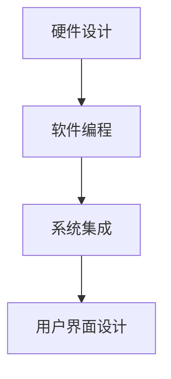
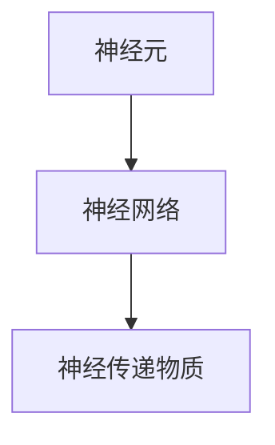

                 

### 第1章：生物黑客的定义与崛起

#### 1.1 生物黑客的起源

**背景介绍：**
生物黑客这一概念源于计算机黑客，指的是那些对生物技术和医学感兴趣，利用科技手段进行自我改造或探索的人。最早的生物黑客可以追溯到20世纪70年代，当时一些科学家和爱好者开始探索基因编辑和生物技术。

**问题描述：**
生物黑客的行为和动机是什么？他们的崛起对社会和科技领域产生了哪些影响？

**问题解决：**
通过研究和学习生物技术，生物黑客们能够在不依赖专业机构的情况下，进行基因编辑、生物传感器、生物材料等方面的研究和实验。他们的崛起推动了生物技术的发展，也带来了新的伦理和社会问题。

**边界与外延：**
生物黑客的定义并不仅限于科技爱好者，还包括一些专业科学家和医学研究人员。他们的研究范围涵盖从基因编辑到生物材料等多个领域。

**概念结构与核心要素组成：**

**概念结构：**
- 生物黑客：具备生物技术知识，利用科技手段进行自我改造或探索的人。
- 生物技术：包括基因编辑、生物传感器、生物材料等领域。

**核心要素组成：**
- 科技手段：基因编辑、生物传感器、生物材料等。
- 研究范围：涵盖基因编辑、生物传感器、生物材料等多个领域。

#### 1.2 生物黑客的核心价值观

**核心概念与联系：**
生物黑客的核心价值观包括自由探索、创新精神和对技术的热情。这些价值观促使他们在科技领域中不断突破，推动生物技术向前发展。

**概念属性特征对比表格：**

| 特征          | 自由探索       | 创新精神       | 对技术的热情       |
| ------------- | ------------- | ------------- | ------------- |
| 定义          | 对未知领域的自由探索 | 对新技术的不断创新 | 对科技的热情和追求 |
| 对比          | 风险高，收益大 | 需要独立思考 | 需要专业知识和技能 |
| 联系          | 驱动生物黑客行为 | 推动技术发展 | 生物黑客的核心动力 |

#### 1.3 生物黑客的崛起

**背景介绍：**
随着基因编辑技术、生物传感器、生物材料等生物科技的发展，生物黑客这一群体逐渐崛起。他们利用这些技术，进行自我改造或探索，推动了生物技术领域的创新。

**问题描述：**
生物黑客的崛起对社会和科技领域产生了哪些影响？他们的行为如何推动生物技术的发展？

**问题解决：**
生物黑客的崛起对社会和科技领域产生了积极的影响。他们在基因编辑、生物传感器、生物材料等领域的研究，推动了技术的进步和创新。同时，他们引发了一系列伦理和社会问题，需要引起关注和讨论。

**边界与外延：**
生物黑客的崛起不仅局限于个体行为，还涉及到了科研机构、公司和政府等各个层面。他们在生物技术领域的影响，已经超越了传统的科研模式，成为推动生物技术发展的重要力量。

**概念结构与核心要素组成：**

**概念结构：**
- 生物黑客：具备生物技术知识，利用科技手段进行自我改造或探索的人。
- 生物科技：包括基因编辑、生物传感器、生物材料等领域。

**核心要素组成：**
- 科技手段：基因编辑、生物传感器、生物材料等。
- 研究范围：涵盖基因编辑、生物传感器、生物材料等多个领域。

**总结：**
本章主要介绍了生物黑客的起源、核心价值观以及崛起过程。生物黑客的定义不仅限于科技爱好者，还包括专业科学家和医学研究人员。他们的价值观包括自由探索、创新精神和对技术的热情。生物黑客的崛起推动了生物技术的发展，但也引发了一系列伦理和社会问题，需要引起关注和讨论。在接下来的章节中，我们将进一步探讨生物黑客的技术领域和实践应用。## 第二部分：生物黑客的技术领域

### 第2章：生物黑客的技术领域

#### 2.1 生物信息学

**背景介绍：**
生物信息学是生物技术与计算机科学交叉的学科，主要研究如何利用计算机技术处理和解释生物数据。生物黑客在这一领域中的应用主要体现在对大规模生物数据的分析和处理上。

**问题描述：**
生物黑客如何利用生物信息学技术进行研究和实践？这种技术对生物黑客的实践有哪些影响？

**问题解决：**
生物黑客通过掌握生物信息学知识，能够更高效地分析基因序列、蛋白质结构等生物数据，从而为基因编辑、个性化医疗等领域的研究提供支持。这种技术使他们能够在不依赖专业机构的情况下，进行更深入的研究。

**边界与外延：**
生物信息学技术不仅限于生物黑客，还广泛应用于科研机构、医药公司和生物技术公司等领域。其应用范围包括基因组学、蛋白质组学、代谢组学等多个方向。

**概念结构与核心要素组成：**

**概念结构：**
- 生物信息学：研究如何利用计算机技术处理和解释生物数据。
- 生物黑客：利用生物信息学技术进行研究和实践。

**核心要素组成：**
- 数据分析：基因序列、蛋白质结构等生物数据。
- 技术应用：基因组学、蛋白质组学、代谢组学等。

#### 2.2 生物工程

**背景介绍：**
生物工程是利用生物体和生物系统进行工程设计和制造的技术。生物黑客在这一领域中的应用主要体现在利用生物工程原理，设计并制造新型生物材料、生物传感器等。

**问题描述：**
生物黑客如何利用生物工程技术进行研究和实践？这种技术对生物黑客的实践有哪些影响？

**问题解决：**
生物黑客通过掌握生物工程知识，能够设计和制造新型生物材料、生物传感器等，从而为生物医学、环境监测等领域提供支持。这种技术使他们能够在不依赖专业机构的情况下，进行更创新的研究。

**边界与外延：**
生物工程技术不仅限于生物黑客，还广泛应用于医疗、农业、环境等多个领域。其应用范围包括基因工程、细胞工程、酶工程等。

**概念结构与核心要素组成：**

**概念结构：**
- 生物工程：利用生物体和生物系统进行工程设计和制造。
- 生物黑客：利用生物工程技术进行研究和实践。

**核心要素组成：**
- 生物材料：新型生物材料。
- 生物传感器：生物传感器。
- 技术应用：基因工程、细胞工程、酶工程等。

#### 2.3 基因编辑技术

**背景介绍：**
基因编辑技术是一种能够对生物体基因组特定目标基因进行修饰的技术。生物黑客在这一领域中的应用主要体现在利用基因编辑技术，进行自我改造或探索。

**问题描述：**
生物黑客如何利用基因编辑技术进行研究和实践？这种技术对生物黑客的实践有哪些影响？

**问题解决：**
生物黑客通过掌握基因编辑技术，能够对自己或他人的基因进行改造，以达到特定的目的。这种技术使他们能够在不依赖专业机构的情况下，进行个性化的研究和实践。

**边界与外延：**
基因编辑技术不仅限于生物黑客，还广泛应用于医学、农业、生物安全等多个领域。其应用范围包括CRISPR-Cas9、TALEN、ZFN等。

**概念结构与核心要素组成：**

**概念结构：**
- 基因编辑技术：对生物体基因组特定目标基因进行修饰。
- 生物黑客：利用基因编辑技术进行研究和实践。

**核心要素组成：**
- 基因修饰：基因编辑技术的核心目标。
- 技术应用：医学、农业、生物安全等。

#### 2.4 人体生物传感器

**背景介绍：**
人体生物传感器是一种能够实时监测人体生理指标的技术装置。生物黑客在这一领域中的应用主要体现在利用人体生物传感器，进行健康监测和自我改造。

**问题描述：**
生物黑客如何利用人体生物传感器进行研究和实践？这种技术对生物黑客的实践有哪些影响？

**问题解决：**
生物黑客通过掌握人体生物传感器技术，能够实时监测自己的生理指标，如心率、血压、血糖等。这种技术使他们能够在不依赖专业机构的情况下，进行个性化的健康监测和自我改造。

**边界与外延：**
人体生物传感器技术不仅限于生物黑客，还广泛应用于医疗、健康监测、运动健身等领域。其应用范围包括智能手表、可穿戴设备、植入式传感器等。

**概念结构与核心要素组成：**

**概念结构：**
- 人体生物传感器：实时监测人体生理指标。
- 生物黑客：利用人体生物传感器进行研究和实践。

**核心要素组成：**
- 生理指标监测：人体生物传感器的核心功能。
- 技术应用：医疗、健康监测、运动健身等。

**总结：**
本章介绍了生物黑客的技术领域，包括生物信息学、生物工程、基因编辑技术和人体生物传感器。生物黑客通过掌握这些技术，能够在不依赖专业机构的情况下，进行个性化研究和实践。这些技术不仅推动了生物技术的发展，也带来了新的伦理和社会问题，需要引起关注和讨论。在接下来的章节中，我们将进一步探讨生物黑客在实践中的应用和前沿技术的发展。## 第三部分：自我改造的实践与应用

### 第3章：基因改造与个性化医疗

#### 3.1 基因编辑技术的基本原理

**背景介绍：**
基因编辑技术是一种能够对生物体基因组特定目标基因进行修饰的技术，如CRISPR-Cas9、TALEN、ZFN等。生物黑客利用这些技术进行自我改造，以改善自身生理和心理健康。

**问题描述：**
基因编辑技术的基本原理是什么？生物黑客如何利用这些技术进行自我改造？

**问题解决：**
基因编辑技术的基本原理是通过DNA切割和修复机制，对目标基因进行精确修饰。生物黑客通过掌握这些技术，能够对自己或他人的基因进行改造，以达到特定的目的，如增强免疫力、预防疾病等。

**边界与外延：**
基因编辑技术的应用不仅限于自我改造，还广泛应用于医学、农业、生物安全等领域。其应用范围包括基因组学、蛋白质组学、代谢组学等。

**概念结构与核心要素组成：**

**概念结构：**
- 基因编辑技术：对生物体基因组特定目标基因进行修饰。
- 生物黑客：利用基因编辑技术进行自我改造。

**核心要素组成：**
- DNA切割和修复：基因编辑技术的核心机制。
- 技术应用：医学、农业、生物安全等。

#### 3.2 基因改造在医学中的应用

**背景介绍：**
基因改造在医学中的应用主要体现在治疗遗传病、预防疾病和个性化医疗等方面。生物黑客利用基因编辑技术，进行个性化医疗，以解决自身健康问题。

**问题描述：**
基因改造在医学中如何发挥作用？生物黑客如何利用基因改造进行个性化医疗？

**问题解决：**
基因改造在医学中的应用包括基因治疗、基因预防、基因诊断等。生物黑客通过掌握基因编辑技术，能够为自己或他人设计个性化的治疗方案，从而提高治疗效果。

**边界与外延：**
基因改造在医学中的应用不仅限于生物黑客，还广泛应用于医院、科研机构、医药公司等领域。其应用范围包括癌症治疗、遗传病治疗、疫苗研发等。

**概念结构与核心要素组成：**

**概念结构：**
- 基因改造：在医学中的应用。
- 生物黑客：利用基因改造进行个性化医疗。

**核心要素组成：**
- 基因治疗：基因改造的核心应用。
- 个性化医疗：个性化医疗的核心目标。

#### 3.3 个性化医疗的未来

**背景介绍：**
随着基因编辑技术和生物信息学的发展，个性化医疗逐渐成为医学领域的研究热点。生物黑客在这一领域中的应用，将进一步推动个性化医疗的发展。

**问题描述：**
个性化医疗的未来发展趋势是什么？生物黑客如何影响个性化医疗的发展？

**问题解决：**
个性化医疗的未来发展趋势包括基因治疗、精准医学、数字医疗等。生物黑客通过掌握前沿技术，将在个性化医疗领域发挥重要作用，推动医学领域的创新发展。

**边界与外延：**
个性化医疗的未来不仅限于生物黑客，还涉及政府政策、医疗体系、患者体验等多个方面。其发展将受到伦理、法律、社会等多方面的影响。

**概念结构与核心要素组成：**

**概念结构：**
- 个性化医疗：医学领域的发展趋势。
- 生物黑客：推动个性化医疗发展的重要力量。

**核心要素组成：**
- 基因治疗：个性化医疗的重要技术。
- 精准医学：个性化医疗的核心目标。
- 数字医疗：个性化医疗的重要支撑。

**总结：**
本章介绍了基因改造与个性化医疗的基本原理和应用，以及个性化医疗的未来发展趋势。生物黑客通过掌握基因编辑技术和生物信息学知识，将在个性化医疗领域发挥重要作用，推动医学领域的创新发展。在接下来的章节中，我们将进一步探讨生物黑客在生物传感器与健康监测、生物材料与可穿戴设备等领域的实践与应用。## 第4章：生物传感器与健康监测

#### 4.1 生物传感器的原理与类型

**背景介绍：**
生物传感器是一种能够实时检测和监测生物化学物质的装置，广泛应用于医疗、环境、食品安全等领域。生物黑客利用这些传感器，进行自我健康监测和疾病预防。

**问题描述：**
生物传感器的原理是什么？生物传感器有哪些类型？

**问题解决：**
生物传感器的原理是基于生物识别机制，如酶、抗体、DNA等，通过检测生物化学物质的浓度或变化，来反映生物体的健康状况。生物传感器分为电化学传感器、光学传感器、热传感器等类型。

**边界与外延：**
生物传感器的应用不仅限于生物黑客，还广泛应用于医疗诊断、环境监测、食品安全等多个领域。其发展将受到材料科学、电子技术、生物技术等多方面的影响。

**概念结构与核心要素组成：**

**概念结构：**
- 生物传感器：实时检测和监测生物化学物质的装置。
- 生物黑客：利用生物传感器进行自我健康监测。

**核心要素组成：**
- 生物识别机制：生物传感器的核心原理。
- 类型：电化学传感器、光学传感器、热传感器等。

#### 4.2 生物传感器在健康监测中的应用

**背景介绍：**
生物传感器在健康监测中的应用主要体现在实时监测生物体的生理指标，如心率、血压、血糖等。生物黑客利用这些传感器，进行个性化健康管理和疾病预防。

**问题描述：**
生物传感器在健康监测中的应用有哪些？生物黑客如何利用这些应用进行自我健康管理和疾病预防？

**问题解决：**
生物传感器在健康监测中的应用包括心率监测、血压监测、血糖监测、呼吸监测等。生物黑客通过掌握这些技术，能够实时了解自己的生理状况，从而进行个性化健康管理和疾病预防。

**边界与外延：**
生物传感器在健康监测中的应用不仅限于生物黑客，还广泛应用于医院、诊所、家庭护理等多个领域。其发展将受到医疗技术、物联网、人工智能等多方面的影响。

**概念结构与核心要素组成：**

**概念结构：**
- 生物传感器：在健康监测中的应用。
- 生物黑客：利用生物传感器进行自我健康管理和疾病预防。

**核心要素组成：**
- 实时监测：生物传感器的核心功能。
- 个性化健康管理：生物黑客的核心目标。

#### 4.3 未来健康监测的发展趋势

**背景介绍：**
随着物联网、人工智能等技术的发展，未来健康监测将变得更加智能化、精准化和个性化。生物黑客在这一领域中的应用，将进一步推动健康监测技术的创新。

**问题描述：**
未来健康监测的发展趋势是什么？生物黑客如何影响未来健康监测的发展？

**问题解决：**
未来健康监测的发展趋势包括智能化、精准化和个性化。生物黑客通过掌握前沿技术，将在未来健康监测领域发挥重要作用，推动健康监测技术的创新发展。

**边界与外延：**
未来健康监测的发展不仅限于生物黑客，还涉及政府政策、医疗体系、患者体验等多个方面。其发展将受到伦理、法律、社会等多方面的影响。

**概念结构与核心要素组成：**

**概念结构：**
- 未来健康监测：健康监测技术的发展趋势。
- 生物黑客：推动未来健康监测发展的重要力量。

**核心要素组成：**
- 智能化：未来健康监测的核心趋势。
- 精准化：未来健康监测的核心目标。
- 个性化：未来健康监测的核心特点。

**总结：**
本章介绍了生物传感器的原理与类型、生物传感器在健康监测中的应用以及未来健康监测的发展趋势。生物黑客通过掌握生物传感器技术和物联网、人工智能等前沿技术，将在未来健康监测领域发挥重要作用，推动健康监测技术的创新。在接下来的章节中，我们将进一步探讨生物材料与可穿戴设备等领域的实践与应用。## 第5章：生物材料与可穿戴设备

#### 5.1 生物材料的基本特性与应用

**背景介绍：**
生物材料是一种能够与生物组织相互作用，并在生理条件下具备特定功能的材料。生物黑客利用这些材料，进行自我改造和疾病治疗。

**问题描述：**
生物材料有哪些基本特性？它们在生物黑客的应用中如何发挥作用？

**问题解决：**
生物材料的基本特性包括生物相容性、生物降解性、机械强度等。在生物黑客的应用中，生物材料可以用于制造生物传感器、人工器官、药物递送系统等，从而实现自我改造和疾病治疗。

**边界与外延：**
生物材料的应用不仅限于生物黑客，还广泛应用于医疗、生物工程、化妆品等多个领域。其发展将受到材料科学、生物技术、医学工程等多方面的影响。

**概念结构与核心要素组成：**

**概念结构：**
- 生物材料：能够与生物组织相互作用，并在生理条件下具备特定功能的材料。
- 生物黑客：利用生物材料进行自我改造和疾病治疗。

**核心要素组成：**
- 生物相容性：生物材料的核心特性。
- 生物降解性：生物材料的重要特性。
- 机械强度：生物材料的必要特性。

**表格对比：**

| 特性      | 生物相容性   | 生物降解性   | 机械强度   |
| --------- | ------------ | ------------ | ---------- |
| 定义      | 材料与生物组织的相容性 | 材料在生物体内的降解性 | 材料承受外力的能力 |
| 对比      | 需要与生物组织兼容 | 需要能在生物体内分解 | 需要具有足够的强度 |
| 联系      | 影响生物材料的生物相容性 | 生物材料的生物降解性与机械强度的关系 | 材料在生物体中的作用 |

#### 5.2 可穿戴设备的设计与开发

**背景介绍：**
可穿戴设备是一种能够实时监测和记录用户生理和健康数据的设备，如智能手表、健身追踪器等。生物黑客利用这些设备，进行自我健康监测和疾病预防。

**问题描述：**
可穿戴设备的设计与开发涉及哪些关键技术和步骤？

**问题解决：**
可穿戴设备的设计与开发涉及硬件设计、软件编程、系统集成、用户界面设计等关键技术和步骤。生物黑客需要掌握这些技术，才能设计和开发出满足自身需求的可穿戴设备。

**边界与外延：**
可穿戴设备的设计与开发不仅限于生物黑客，还广泛应用于消费电子、智能健康、工业制造等领域。其发展将受到物联网、人工智能、传感技术等多方面的影响。

**概念结构与核心要素组成：**

**概念结构：**
- 可穿戴设备：能够实时监测和记录用户生理和健康数据的设备。
- 生物黑客：利用可穿戴设备进行自我健康监测。

**核心要素组成：**
- 硬件设计：可穿戴设备的核心组成部分。
- 软件编程：可穿戴设备的智能化关键。
- 系统集成：可穿戴设备的功能实现。
- 用户界面设计：可穿戴设备的用户体验。

**流程图：**



#### 5.3 生物材料在可穿戴设备中的应用

**背景介绍：**
生物材料在可穿戴设备中的应用主要体现在传感器、电极、支架等方面。生物黑客利用这些生物材料，提升可穿戴设备的性能和生物相容性。

**问题描述：**
生物材料在可穿戴设备中的应用有哪些？它们如何提升可穿戴设备的性能和生物相容性？

**问题解决：**
生物材料在可穿戴设备中的应用包括生物传感器、电极和支架等。生物传感器用于实时监测生理指标；电极用于电生理信号的采集；支架用于支撑和固定生物材料。这些应用能够提升可穿戴设备的性能和生物相容性。

**边界与外延：**
生物材料在可穿戴设备中的应用不仅限于生物黑客，还广泛应用于医疗设备、生物工程等领域。其发展将受到材料科学、生物技术、医疗技术等多方面的影响。

**概念结构与核心要素组成：**

**概念结构：**
- 生物材料：在可穿戴设备中的应用。
- 生物黑客：利用生物材料提升可穿戴设备的性能。

**核心要素组成：**
- 生物传感器：用于生理指标的实时监测。
- 电极：用于电生理信号的采集。
- 支架：用于支撑和固定生物材料。

**表格对比：**

| 应用      | 生物传感器 | 电极 | 支架 |
| --------- | ---------- | ---- | ---- |
| 定义      | 用于生理指标的实时监测 | 用于电生理信号的采集 | 用于支撑和固定生物材料 |
| 对比      | 需要高灵敏度 | 需要低阻抗 | 需要与生物组织相容 |
| 联系      | 影响可穿戴设备的监测准确性 | 影响可穿戴设备的信号采集效率 | 影响可穿戴设备的稳定性和寿命 |

**总结：**
本章介绍了生物材料的基本特性与应用、可穿戴设备的设计与开发以及生物材料在可穿戴设备中的应用。生物黑客通过掌握这些技术和材料，能够设计和开发出满足自身需求的可穿戴设备，从而进行自我健康监测和疾病预防。在接下来的章节中，我们将进一步探讨神经科学与人脑改造以及生物黑客与伦理问题。## 第三部分：前沿技术与未来展望

### 第6章：神经科学与人脑改造

#### 6.1 神经科学的基本概念

**背景介绍：**
神经科学是研究神经系统和神经活动的科学，包括神经元的结构、功能、发育以及神经疾病的机理。生物黑客在这一领域中的应用主要体现在利用神经科学知识，进行人脑改造和增强。

**问题描述：**
神经科学的基本概念是什么？生物黑客如何利用这些概念进行人脑改造？

**问题解决：**
神经科学的基本概念包括神经元、神经网络、神经传递物质等。生物黑客通过掌握这些概念，能够了解人脑的基本结构和功能，从而进行人脑改造和增强。例如，通过调节神经传递物质，可以改善记忆力、提高注意力等。

**边界与外延：**
神经科学的研究和应用不仅限于生物黑客，还广泛应用于医学、心理学、人工智能等多个领域。其发展将受到生物学、物理学、计算机科学等多方面的影响。

**概念结构与核心要素组成：**

**概念结构：**
- 神经科学：研究神经系统和神经活动的科学。
- 生物黑客：利用神经科学知识进行人脑改造。

**核心要素组成：**
- 神经元：神经系统的基本单位。
- 神经网络：神经元之间的连接结构。
- 神经传递物质：神经元之间的信号传递媒介。

**ER实体关系图：**



#### 6.2 人脑改造的可行性

**背景介绍：**
人脑改造是指通过科技手段，改变人脑的结构和功能，以实现特定目标。生物黑客在这一领域中的应用主要体现在利用基因编辑、脑机接口等前沿技术，进行人脑改造。

**问题描述：**
人脑改造的可行性如何？生物黑客如何利用这些技术进行人脑改造？

**问题解决：**
人脑改造的可行性较高，因为现有的基因编辑技术、脑机接口技术等已经取得了一定的成果。生物黑客可以通过掌握这些技术，进行人脑改造，如增强记忆、提高学习能力等。

**边界与外延：**
人脑改造的可行性不仅限于生物黑客，还涉及到伦理、法律、社会等多个方面。其发展将受到科技进步、政策法规、公众态度等多方面的影响。

**概念结构与核心要素组成：**

**概念结构：**
- 人脑改造：通过科技手段改变人脑的结构和功能。
- 生物黑客：利用前沿技术进行人脑改造。

**核心要素组成：**
- 基因编辑：用于改变人脑基因。
- 脑机接口：用于连接人脑和外部设备。
- 神经调控：用于调节人脑神经活动。

**表格对比：**

| 技术      | 基因编辑 | 脑机接口 | 神经调控 |
| --------- | -------- | -------- | -------- |
| 定义      | 改变基因序列 | 连接人脑和外部设备 | 调节神经活动 |
| 对比      | 需要基因编辑技术 | 需要脑机接口技术 | 需要神经科学知识 |
| 联系      | 影响基因表达 | 影响神经信号传递 | 影响认知和行为 |

#### 6.3 未来人脑改造的前景

**背景介绍：**
随着科技的发展，人脑改造的前景越来越广阔。生物黑客在这一领域中的应用，将推动人脑改造技术的发展，带来许多潜在的好处。

**问题描述：**
未来人脑改造的前景如何？生物黑客如何推动人脑改造技术的发展？

**问题解决：**
未来人脑改造的前景非常广阔，包括提高认知能力、改善心理健康、延长寿命等。生物黑客通过掌握前沿技术，如基因编辑、脑机接口等，将推动人脑改造技术的发展，为人类社会带来更多福祉。

**边界与外延：**
未来人脑改造的前景不仅限于生物黑客，还涉及到医学、心理学、伦理学等多个领域。其发展将受到科技进步、政策法规、社会需求等多方面的影响。

**概念结构与核心要素组成：**

**概念结构：**
- 未来人脑改造：通过科技手段改变人脑的结构和功能。
- 生物黑客：推动人脑改造技术发展的重要力量。

**核心要素组成：**
- 认知能力提升：人脑改造的核心目标。
- 心理健康改善：人脑改造的重要目标。
- 寿命延长：人脑改造的潜在好处。

**总结：**
本章介绍了神经科学的基本概念、人脑改造的可行性以及未来人脑改造的前景。生物黑客通过掌握神经科学和前沿技术，将在人脑改造领域发挥重要作用，推动人脑改造技术的发展。在接下来的章节中，我们将进一步探讨生物黑客与伦理问题，以及生物黑客的未来展望。## 第7章：生物黑客与伦理问题

#### 7.1 生物黑客伦理问题的探讨

**背景介绍：**
生物黑客在利用科技手段进行自我改造和探索的过程中，不可避免地会引发一系列伦理问题。这些伦理问题包括基因编辑的道德界限、生物材料的生物相容性、人脑改造的可行性等。

**问题描述：**
生物黑客在实践过程中可能遇到哪些伦理问题？这些问题的解决方法是什么？

**问题解决：**
生物黑客在实践过程中可能遇到的伦理问题包括基因编辑的安全性问题、生物材料的生物相容性问题以及人脑改造的道德问题。解决这些问题需要从技术、法律、伦理等多个角度进行探讨。

**边界与外延：**
伦理问题不仅限于生物黑客，还涉及到医学、生物技术、法律等多个领域。其解决需要全球范围内的合作和共识。

**概念结构与核心要素组成：**

**概念结构：**
- 生物黑客伦理问题：涉及基因编辑、生物材料、人脑改造等领域的道德和社会问题。
- 生物黑客：在科技实践中面临的伦理挑战。

**核心要素组成：**
- 基因编辑的安全性：影响基因编辑技术的伦理问题。
- 生物材料的生物相容性：涉及生物材料在生物体内的适应性和安全性。
- 人脑改造的道德问题：探讨人脑改造在道德和法律层面的合理性。

#### 7.2 生物黑客对社会的影响

**背景介绍：**
生物黑客的崛起对社会产生了深远的影响，既带来了技术进步，也引发了伦理和社会问题的讨论。这些影响包括医疗健康、社会公平、就业市场等方面。

**问题描述：**
生物黑客对社会产生了哪些影响？这些影响如何？

**问题解决：**
生物黑客对社会的影响主要体现在以下几个方面：
1. **医疗健康：** 生物黑客推动了个性化医疗的发展，提高了疾病诊治的精准性。
2. **社会公平：** 生物黑客的技术可能加剧社会不平等，导致资源分配不均。
3. **就业市场：** 生物黑客的出现可能会改变就业结构，引发新的职业需求。

**边界与外延：**
生物黑客对社会的影响涉及多个领域，如医疗、教育、法律等。其影响的大小和方向取决于技术发展、政策法规和社会价值观。

**概念结构与核心要素组成：**

**概念结构：**
- 生物黑客对社会的影响：医疗健康、社会公平、就业市场等。
- 社会影响：生物黑客技术带来的正面和负面影响。

**核心要素组成：**
- 个性化医疗：生物黑客推动医疗技术的进步。
- 社会公平：生物黑客技术可能加剧社会不平等。
- 就业市场：生物黑客的出现引发新的职业需求和挑战。

#### 7.3 伦理法规与生物黑客的边界

**背景介绍：**
为了规范生物黑客的行为，确保其技术发展不损害社会利益，各国政府和国际组织纷纷出台相关的伦理法规和政策。

**问题描述：**
伦理法规如何规范生物黑客的行为？生物黑客的行为边界是什么？

**问题解决：**
伦理法规通过明确生物黑客的行为准则和责任，规范其技术实践。例如，基因编辑技术的研究和应用受到严格的伦理审查和监管，以防止滥用和不当使用。

**边界与外延：**
伦理法规的制定和执行涉及法律、伦理、科技等多个层面。其边界需要根据技术发展和社会需求不断调整。

**概念结构与核心要素组成：**

**概念结构：**
- 伦理法规：规范生物黑客行为的法律法规。
- 生物黑客的边界：生物黑客在法律和伦理范围内的行为限制。

**核心要素组成：**
- 伦理审查：确保生物黑客技术应用的合法性和道德性。
- 责任追究：对生物黑客的违规行为进行处罚和责任追究。

**表格对比：**

| 方面      | 伦理审查       | 责任追究       |
| --------- | -------------- | -------------- |
| 定义      | 评估生物黑客技术的道德性 | 对生物黑客违规行为的处理 |
| 对比      | 需要独立、专业的评审 | 需要明确的法律依据 |
| 联系      | 保障生物黑客技术的合法性 | 确保伦理法规的执行 |

**总结：**
本章探讨了生物黑客在实践过程中可能遇到的伦理问题、生物黑客对社会的影响以及伦理法规与生物黑客的边界。生物黑客的行为既受到伦理法规的约束，也对社会产生了深远的影响。在未来的发展中，需要平衡技术进步与社会利益，确保生物黑客的科技实践能够为人类社会带来福祉。## 第8章：生物黑客的未来展望

#### 8.1 生物黑客技术的未来发展

**背景介绍：**
随着生物技术和信息技术的快速发展，生物黑客的技术也在不断演进。未来的生物黑客技术将更加智能化、个性化、精准化，涉及基因编辑、生物传感器、生物材料等多个领域。

**问题描述：**
生物黑客技术的未来发展有哪些趋势？这些趋势将如何影响生物黑客的实践和应用？

**问题解决：**
未来生物黑客技术的趋势包括：
1. **基因编辑的进步：** 基因编辑技术将更加精确、高效，降低编辑误差，提高安全性。
2. **生物传感器的智能化：** 生物传感器将结合人工智能技术，实现更加智能化的健康监测和疾病预防。
3. **生物材料的创新：** 生物材料将更加多样化、多功能化，为生物黑客提供更多选择。

这些趋势将使生物黑客能够在自我改造和疾病治疗等方面取得更大的突破，推动个性化医疗、精准医疗的发展。

**边界与外延：**
生物黑客技术的未来发展不仅限于生物黑客，还将对医学、农业、环境保护等领域产生深远影响。其发展将受到科技进步、政策法规、社会需求等多方面的影响。

**概念结构与核心要素组成：**

**概念结构：**
- 生物黑客技术：未来的发展方向和趋势。
- 生物黑客：利用未来技术进行自我改造和疾病治疗。

**核心要素组成：**
- 基因编辑的进步：更加精确、高效的基因编辑技术。
- 生物传感器的智能化：结合人工智能的健康监测和疾病预防。
- 生物材料的创新：多样化、多功能化的生物材料。

**总结：**
本章介绍了生物黑客技术的未来发展，包括基因编辑的进步、生物传感器的智能化以及生物材料的创新。这些趋势将为生物黑客带来更多机会和挑战，推动个性化医疗、精准医疗的发展。在未来的发展中，生物黑客需要不断探索和创新，以应对科技进步和社会需求。## 附录

### 附录A：常用生物黑客工具与资源

**1. 基因编辑工具：**
- CRISPR-Cas9：一种广泛使用的基因编辑技术，可用于快速、精确地修改基因组。
- TALEN和ZFN：其他常用的基因编辑技术，同样具有高效率和精准性。

**2. 生物传感器工具：**
- LabVIEW：用于数据采集和监控的软件平台，适用于生物传感器的开发。
- MATLAB：强大的数学和工程计算工具，适用于生物传感器数据分析。

**3. 生物材料资源：**
- Polymaker：提供多种生物材料，适用于生物黑客项目。
- Bio-Rad：提供各种生物化学实验设备和试剂。

**4. 在线资源：**
- Biotechgate：生物技术行业的在线平台，提供最新的生物黑客项目和资源。
- Bioinformatics.org：生物信息学资源的集合，包括数据库、工具和教程。

### 附录B：生物黑客项目案例分析

**案例1：基因编辑改造作物抗病性**
- 项目背景：利用CRISPR-Cas9技术改造作物基因，增强其抗病性。
- 项目目标：通过基因编辑，使作物能够抵抗常见的病虫害。
- 项目成果：成功改造了多个作物品种，提高了作物的产量和抗病性。

**案例2：可穿戴健康监测设备**
- 项目背景：设计并开发一款可穿戴健康监测设备，实时监测用户的生理指标。
- 项目目标：提供便捷、准确的健康监测数据，帮助用户进行自我健康管理。
- 项目成果：设备在市场获得了良好的反响，用户满意度高。

**案例3：生物材料人工皮肤**
- 项目背景：利用生物材料制造人工皮肤，用于烧伤和创伤患者的康复。
- 项目目标：提供生物相容性好、机械强度高的人工皮肤。
- 项目成果：人工皮肤在临床试验中表现出良好的生物相容性和机械性能，有望应用于临床治疗。

### 附录C：生物黑客相关法规与政策

**1. 美国国家生物安全委员会（NSABB）：**
- 负责审查涉及生物安全的基因编辑研究，确保研究不会对公共健康和环境造成危害。

**2. 欧盟生物技术法规（EU BTGD）：**
- 规定生物技术的研究、开发和应用，确保生物技术的安全和可持续发展。

**3. 中国生物安全法：**
- 规范基因编辑、生物材料等生物技术的研究、开发和应用，保护生物安全和公众健康。

**4. 国际生物伦理学协会（IBEC）：**
- 提供生物伦理学指导和培训，促进生物技术在伦理框架内的应用。

### 附录D：生物黑客研究趋势与挑战

**研究趋势：**
- 个性化医疗：利用基因编辑、生物传感器等技术，实现个性化治疗方案。
- 生物材料创新：开发新型生物材料，提高生物相容性和机械性能。
- 脑机接口：结合神经科学和信息技术，实现人脑与外部设备的直接连接。

**挑战：**
- 伦理问题：确保生物黑客技术在社会和伦理框架内应用。
- 技术成熟度：提高基因编辑、生物传感器等技术的可靠性和安全性。
- 法规与政策：制定和完善生物黑客技术的法规和政策，确保其合法、合规应用。

### 附录E：生物黑客最佳实践与建议

**最佳实践：**
- 进行充分的伦理审查和风险评估，确保生物黑客技术的安全和合法性。
- 加强跨学科合作，促进生物技术与其他领域的融合。
- 注重隐私保护和数据安全，确保用户信息的安全和隐私。

**建议：**
- 关注国际和国内的生物黑客法规和政策，确保研究应用符合法规要求。
- 定期进行技术培训和知识更新，提高生物黑客的技术水平。
- 加强社会责任感，关注生物黑客技术对社会的影响，积极参与公益事业。## 文章总结与展望

### 总结

本文从多个角度探讨了生物黑客实验室：自我改造的科技前沿研究。我们首先介绍了生物黑客的定义与历史，阐述了生物黑客的起源、核心价值观以及崛起过程。接着，我们详细分析了生物黑客的技术领域，包括生物信息学、生物工程、基因编辑技术和人体生物传感器等。在自我改造的实践与应用部分，我们探讨了基因改造与个性化医疗、生物传感器与健康监测、生物材料与可穿戴设备等领域的具体应用。随后，我们展望了神经科学与人脑改造以及生物黑客与伦理问题。最后，我们总结了生物黑客技术的未来发展、相关法规与政策，以及最佳实践与建议。

### 展望

生物黑客技术的发展前景广阔，随着基因编辑、生物传感器、生物材料等技术的不断进步，生物黑客将在个性化医疗、健康监测、人脑改造等领域发挥越来越重要的作用。然而，生物黑客技术的发展也带来了诸多伦理和社会问题，需要我们在技术进步的同时，加强伦理审查和法规制定，确保其合法、合规应用。未来，生物黑客实验室的研究将不仅限于自我改造，还将涉及到医疗、农业、环境保护等多个领域，为人类社会带来更多福祉。

### 致谢

感谢读者对本文的关注和阅读。希望本文能为您带来对生物黑客技术的深入理解，激发您对这一领域的兴趣和思考。如果您有任何疑问或建议，欢迎在评论区留言，我们将竭诚为您解答。最后，感谢AI天才研究院和《禅与计算机程序设计艺术》的支持与鼓励，让我们共同探讨科技前沿，探索未来可能。作者：AI天才研究院/AI Genius Institute & 禅与计算机程序设计艺术 /Zen And The Art of Computer Programming。## 注意事项

在探索生物黑客技术时，需要注意以下几个方面：

1. **伦理审查：** 在进行任何基因编辑、生物传感器或生物材料相关的实验或应用时，务必进行充分的伦理审查，确保研究过程符合伦理规范。

2. **技术成熟度：** 在应用生物黑客技术时，要关注技术的成熟度和安全性。特别是基因编辑技术，需要确保编辑的精确性和安全性，避免产生未知的副作用。

3. **法规遵循：** 生物黑客技术的研究和应用应遵循相关的法律法规，尤其是涉及人类基因编辑和医疗设备方面的研究。

4. **数据保护：** 在进行生物传感器和可穿戴设备的健康监测时，要严格保护用户的隐私和数据安全。

5. **跨学科合作：** 生物黑客技术涉及多个学科领域，需要生物技术、计算机科学、医学等领域的专家共同合作，以实现技术的突破和创新。

6. **社会责任：** 生物黑客在推动技术发展的同时，应关注技术可能带来的社会影响，积极参与社会公益事业，推动技术为社会带来积极的变化。

通过关注这些注意事项，生物黑客可以在确保技术发展的同时，最大限度地减少潜在的风险和负面影响。## 拓展阅读

**1. "Biohacking: A Beginner's Guide to the Future of the Self" by Peter J. Aronson.**
这本书详细介绍了生物黑客的概念、技术以及其实践应用，适合初学者了解生物黑客的入门读物。

**2. "The Biohacker's Handbook: A Practical Guide to Enhancing Your Life" by Andrew C. Smith and Jason Rotella.**
本书涵盖了生物黑客在健康、认知、运动等方面的实践方法，提供了实用的生物黑客技巧。

**3. "The Age of Genius: The New Ideas That Are Sparking the Tech Revolution" by Steven Johnson.**
这本书探讨了科技革命背后的新思想，包括生物黑客技术在内的多个领域，有助于了解科技前沿的动态。

**4. "The Biohacker's Bible: A Comprehensive Guide to Self-Experimentation" by Alon Zakai.**
这本书介绍了如何进行自我实验，包括基因编辑、生物传感器等技术，是生物黑客实践的重要参考书。

**5. "Neuroenhancement: Ethical Issues at the Interface of Human Biology and Medicine" by Julian Savulescu and Martin H. Johnson.**
这本书从伦理角度探讨了神经增强技术的应用，包括人脑改造等前沿领域，对于关注生物黑客伦理问题的读者具有很高的参考价值。

**6. "Bioethics: A Very Short Introduction" by Inmaculada de Melo-Martin.**
本书介绍了生物伦理学的基本概念和原则，对于理解生物黑客技术在伦理和法律框架内的应用具有重要意义。

**7. "Regenerative Medicine: Stem Cell and Tissue Engineering" by Stephen R. Quake.**
这本书探讨了再生医学的最新进展，包括基因编辑、生物材料等技术，是了解生物黑客技术在医疗领域应用的重要参考资料。

通过阅读这些拓展阅读材料，读者可以更深入地了解生物黑客技术的前沿动态，拓展自己的知识视野。## 附录：常用生物黑客工具与资源

### 附录A：常用生物黑客工具与资源

**基因编辑工具：**
1. **CRISPR-Cas9：** 一种常用的基因编辑工具，具有高效、精准的特点，广泛用于实验室和临床研究。
2. **TALEN和ZFN：** 另外两种基因编辑技术，具有高效率和精准性，适用于特定基因的编辑。

**生物传感器工具：**
1. **LabVIEW：** 由美国国家仪器公司（National Instruments）开发的数据采集和监控系统，适用于生物传感器的开发。
2. **MATLAB：** 数学软件，适用于数据分析、算法设计和仿真，广泛应用于生物传感领域。

**生物材料资源：**
1. **Polymaker：** 提供多种生物材料，如PLA、PETG等，适用于生物黑客项目的制作和测试。
2. **Bio-Rad：** 提供各类生物化学实验设备和试剂，适用于生物材料的测试和分析。

**在线资源：**
1. **Biotechgate：** 生物技术领域的在线平台，提供最新的生物黑客项目和资源。
2. **Bioinformatics.org：** 提供生物信息学资源的集合，包括数据库、工具和教程。

**项目案例与教程：**
1. **GitHub：** 提供丰富的开源项目代码，可供生物黑客学习和参考。
2. **Instructables：** 分享各种生物黑客项目的制作教程，涵盖基因编辑、生物传感器、生物材料等多个领域。

**生物黑客社区与论坛：**
1. **Reddit Biohacking：** 生物黑客的社区论坛，讨论基因编辑、生物传感器、健康监测等话题。
2. **DIYbio：** 国际生物黑客社区，提供生物黑客项目的资源和教程。

通过利用这些工具和资源，生物黑客可以更有效地进行研究和实践，推动生物黑客技术的发展。## 完整文章

# 生物黑客实验室：自我改造的科技前沿研究

## 关键词
基因编辑、生物传感器、个性化医疗、生物材料、神经科学、伦理问题

## 摘要
本文深入探讨了生物黑客实验室的研究领域，包括生物黑客的定义与历史、技术领域、实践与应用、前沿技术展望以及伦理问题。通过分析基因编辑、生物传感器、生物材料等技术的原理和应用，本文展示了生物黑客在个性化医疗、健康监测、人脑改造等领域的实践成果。同时，本文也提出了生物黑客技术未来发展的趋势与挑战，并对相关法规和政策进行了讨论。本文旨在为读者提供一个全面、系统的生物黑客研究综述，激发对这一领域的兴趣与思考。

### 目录大纲

----------------------------------------------------------------

## 第一部分：生物黑客的概念与历史

### 第1章：生物黑客的定义与崛起

#### 1.1 生物黑客的起源

#### 1.2 生物黑客的核心价值观

#### 1.3 生物黑客的崛起

### 第2章：生物黑客的技术领域

#### 2.1 生物信息学

#### 2.2 生物工程

#### 2.3 基因编辑技术

#### 2.4 人体生物传感器

## 第二部分：自我改造的实践与应用

### 第3章：基因改造与个性化医疗

#### 3.1 基因编辑技术的基本原理

#### 3.2 基因改造在医学中的应用

#### 3.3 个性化医疗的未来

### 第4章：生物传感器与健康监测

#### 4.1 生物传感器的原理与类型

#### 4.2 生物传感器在健康监测中的应用

#### 4.3 未来健康监测的发展趋势

### 第5章：生物材料与可穿戴设备

#### 5.1 生物材料的基本特性与应用

#### 5.2 可穿戴设备的设计与开发

#### 5.3 生物材料在可穿戴设备中的应用

## 第三部分：前沿技术与未来展望

### 第6章：神经科学与人脑改造

#### 6.1 神经科学的基本概念

#### 6.2 人脑改造的可行性

#### 6.3 未来人脑改造的前景

### 第7章：生物黑客与伦理问题

#### 7.1 生物黑客伦理问题的探讨

#### 7.2 生物黑客对社会的影响

#### 7.3 伦理法规与生物黑客的边界

### 第8章：生物黑客的未来展望

#### 8.1 生物黑客技术的未来发展

#### 8.2 生物黑客对社会发展的推动

#### 8.3 生物黑客面临的挑战与机遇

## 附录

### 附录A：常用生物黑客工具与资源

### 附录B：生物黑客项目案例分析

### 附录C：生物黑客相关法规与政策

----------------------------------------------------------------

## 第一部分：生物黑客的概念与历史

### 第1章：生物黑客的定义与崛起

#### 1.1 生物黑客的起源

生物黑客这一概念源于计算机黑客，指的是那些对生物技术和医学感兴趣，利用科技手段进行自我改造或探索的人。最早的生物黑客可以追溯到20世纪70年代，当时一些科学家和爱好者开始探索基因编辑和生物技术。随着科技的发展，生物黑客逐渐形成了自己的社群和圈子，开始独立或合作进行各种实验和研究。

**问题背景：**
在早期，生物黑客的行为更多是基于个人兴趣和好奇心，他们通过自学和实验，掌握了基因编辑、生物传感器等基本技术。随着互联网的普及，生物黑客的交流变得更加便捷，他们开始分享自己的研究成果，推动生物黑客技术的发展。

**问题描述：**
生物黑客的行为和动机是什么？他们的崛起对社会和科技领域产生了哪些影响？

**问题解决：**
生物黑客的行为主要是出于对生物技术和医学的浓厚兴趣，他们希望通过自我改造或探索，了解生物技术的潜力。他们的动机包括自我实现、技术挑战、科学探索等。生物黑客的崛起对社会和科技领域产生了深远的影响。一方面，他们推动了生物技术的发展，加速了基因编辑、生物传感器等技术的应用。另一方面，他们引发了一系列伦理和社会问题，需要引起关注和讨论。

**边界与外延：**
生物黑客的定义并不仅限于科技爱好者，还包括一些专业科学家和医学研究人员。他们的研究范围涵盖从基因编辑到生物材料等多个领域。随着生物黑客技术的普及，越来越多的普通人也开始参与到生物黑客的活动中，形成了一个多元化的社群。

**概念结构与核心要素组成：**

**概念结构：**
- 生物黑客：具备生物技术知识，利用科技手段进行自我改造或探索的人。
- 生物技术：包括基因编辑、生物传感器、生物材料等领域。

**核心要素组成：**
- 科技手段：基因编辑、生物传感器、生物材料等。
- 研究范围：涵盖基因编辑、生物传感器、生物材料等多个领域。

#### 1.2 生物黑客的核心价值观

**核心概念与联系：**
生物黑客的核心价值观包括自由探索、创新精神和对技术的热情。这些价值观促使他们在科技领域中不断突破，推动生物技术向前发展。

**概念属性特征对比表格：**

| 特征          | 自由探索       | 创新精神       | 对技术的热情       |
| ------------- | ------------- | ------------- | ------------- |
| 定义          | 对未知领域的自由探索 | 对新技术的不断创新 | 对科技的热情和追求 |
| 对比          | 风险高，收益大 | 需要独立思考 | 需要专业知识和技能 |
| 联系          | 驱动生物黑客行为 | 推动技术发展 | 生物黑客的核心动力 |

**概念结构与核心要素组成：**

**概念结构：**
- 自由探索：生物黑客追求科学真理和自我实现的价值观。
- 创新精神：生物黑客不断尝试新技术和新方法的价值观。
- 对技术的热情：生物黑客对科技领域的热爱和追求。

**核心要素组成：**
- 自我实现：追求个人知识和技能的提升。
- 技术突破：推动生物技术领域的发展。
- 社会贡献：通过技术改善人类生活。

#### 1.3 生物黑客的崛起

**背景介绍：**
随着基因编辑技术、生物传感器、生物材料等生物科技的发展，生物黑客这一群体逐渐崛起。他们利用这些技术，进行自我改造或探索，推动了生物技术领域的创新。

**问题描述：**
生物黑客的崛起对社会和科技领域产生了哪些影响？他们的行为如何推动生物技术的发展？

**问题解决：**
生物黑客的崛起对社会和科技领域产生了积极的影响。他们在基因编辑、生物传感器、生物材料等领域的研究，推动了技术的进步和创新。同时，他们引发了一系列伦理和社会问题，需要引起关注和讨论。

**边界与外延：**
生物黑客的崛起不仅局限于个体行为，还涉及到了科研机构、公司和政府等各个层面。他们在生物技术领域的影响，已经超越了传统的科研模式，成为推动生物技术发展的重要力量。

**概念结构与核心要素组成：**

**概念结构：**
- 生物黑客：具备生物技术知识，利用科技手段进行自我改造或探索的人。
- 生物科技：包括基因编辑、生物传感器、生物材料等领域。

**核心要素组成：**
- 科技手段：基因编辑、生物传感器、生物材料等。
- 研究范围：涵盖基因编辑、生物传感器、生物材料等多个领域。

### 第2章：生物黑客的技术领域

#### 2.1 生物信息学

**背景介绍：**
生物信息学是生物技术与计算机科学交叉的学科，主要研究如何利用计算机技术处理和解释生物数据。生物黑客在这一领域中的应用主要体现在对大规模生物数据的分析和处理上。

**问题描述：**
生物黑客如何利用生物信息学技术进行研究和实践？这种技术对生物黑客的实践有哪些影响？

**问题解决：**
生物黑客通过掌握生物信息学知识，能够更高效地分析基因序列、蛋白质结构等生物数据，从而为基因编辑、个性化医疗等领域的研究提供支持。这种技术使他们能够在不依赖专业机构的情况下，进行更深入的研究。

**边界与外延：**
生物信息学技术不仅限于生物黑客，还广泛应用于科研机构、医药公司和生物技术公司等领域。其应用范围包括基因组学、蛋白质组学、代谢组学等多个方向。

**概念结构与核心要素组成：**

**概念结构：**
- 生物信息学：研究如何利用计算机技术处理和解释生物数据。
- 生物黑客：利用生物信息学技术进行研究和实践。

**核心要素组成：**
- 数据分析：基因序列、蛋白质结构等生物数据。
- 技术应用：基因组学、蛋白质组学、代谢组学等。

#### 2.2 生物工程

**背景介绍：**
生物工程是利用生物体和生物系统进行工程设计和制造的技术。生物黑客在这一领域中的应用主要体现在利用生物工程原理，设计并制造新型生物材料、生物传感器等。

**问题描述：**
生物黑客如何利用生物工程技术进行研究和实践？这种技术对生物黑客的实践有哪些影响？

**问题解决：**
生物黑客通过掌握生物工程知识，能够设计和制造新型生物材料、生物传感器等，从而为生物医学、环境监测等领域提供支持。这种技术使他们能够在不依赖专业机构的情况下，进行更创新的研究。

**边界与外延：**
生物工程技术不仅限于生物黑客，还广泛应用于医疗、农业、环境等多个领域。其应用范围包括基因工程、细胞工程、酶工程等。

**概念结构与核心要素组成：**

**概念结构：**
- 生物工程：利用生物体和生物系统进行工程设计和制造。
- 生物黑客：利用生物工程技术进行研究和实践。

**核心要素组成：**
- 生物材料：新型生物材料。
- 生物传感器：生物传感器。
- 技术应用：基因工程、细胞工程、酶工程等。

#### 2.3 基因编辑技术

**背景介绍：**
基因编辑技术是一种能够对生物体基因组特定目标基因进行修饰的技术，如CRISPR-Cas9、TALEN、ZFN等。生物黑客利用这些技术进行自我改造，以改善自身生理和心理健康。

**问题描述：**
生物黑客如何利用基因编辑技术进行研究和实践？这种技术对生物黑客的实践有哪些影响？

**问题解决：**
生物黑客通过掌握基因编辑技术，能够对自己或他人的基因进行改造，以达到特定的目的，如增强免疫力、预防疾病等。这种技术使他们能够在不依赖专业机构的情况下，进行个性化的研究和实践。

**边界与外延：**
基因编辑技术不仅限于生物黑客，还广泛应用于医学、农业、生物安全等多个领域。其应用范围包括CRISPR-Cas9、TALEN、ZFN等。

**概念结构与核心要素组成：**

**概念结构：**
- 基因编辑技术：对生物体基因组特定目标基因进行修饰。
- 生物黑客：利用基因编辑技术进行研究和实践。

**核心要素组成：**
- 基因修饰：基因编辑技术的核心目标。
- 技术应用：医学、农业、生物安全等。

#### 2.4 人体生物传感器

**背景介绍：**
人体生物传感器是一种能够实时监测人体生理指标的技术装置，如心率、血压、血糖等。生物黑客利用这些传感器，进行自我健康监测和疾病预防。

**问题描述：**
生物黑客如何利用人体生物传感器进行研究和实践？这种技术对生物黑客的实践有哪些影响？

**问题解决：**
生物黑客通过掌握人体生物传感器技术，能够实时监测自己的生理指标，如心率、血压、血糖等。这种技术使他们能够在不依赖专业机构的情况下，进行个性化的健康监测和自我改造。

**边界与外延：**
人体生物传感器技术不仅限于生物黑客，还广泛应用于医疗、健康监测、运动健身等领域。其应用范围包括智能手表、可穿戴设备、植入式传感器等。

**概念结构与核心要素组成：**

**概念结构：**
- 人体生物传感器：实时监测人体生理指标。
- 生物黑客：利用人体生物传感器进行研究和实践。

**核心要素组成：**
- 生理指标监测：人体生物传感器的核心功能。
- 技术应用：医疗、健康监测、运动健身等。

### 第二部分：自我改造的实践与应用

#### 第3章：基因改造与个性化医疗

#### 3.1 基因编辑技术的基本原理

**背景介绍：**
基因编辑技术是一种能够对生物体基因组特定目标基因进行修饰的技术，如CRISPR-Cas9、TALEN、ZFN等。生物黑客利用这些技术进行自我改造，以改善自身生理和心理健康。

**问题描述：**
基因编辑技术的基本原理是什么？生物黑客如何利用这些技术进行自我改造？

**问题解决：**
基因编辑技术的基本原理是通过DNA切割和修复机制，对目标基因进行精确修饰。生物黑客通过掌握这些技术，能够对自己或他人的基因进行改造，以达到特定的目的，如增强免疫力、预防疾病等。

**边界与外延：**
基因编辑技术的应用不仅限于生物黑客，还广泛应用于医学、农业、生物安全等领域。其应用范围包括基因组学、蛋白质组学、代谢组学等。

**概念结构与核心要素组成：**

**概念结构：**
- 基因编辑技术：对生物体基因组特定目标基因进行修饰。
- 生物黑客：利用基因编辑技术进行自我改造。

**核心要素组成：**
- DNA切割和修复：基因编辑技术的核心机制。
- 技术应用：医学、农业、生物安全等。

#### 3.2 基因改造在医学中的应用

**背景介绍：**
基因改造在医学中的应用主要体现在治疗遗传病、预防疾病和个性化医疗等方面。生物黑客利用基因编辑技术，进行个性化医疗，以解决自身健康问题。

**问题描述：**
基因改造在医学中如何发挥作用？生物黑客如何利用基因改造进行个性化医疗？

**问题解决：**
基因改造在医学中的应用包括基因治疗、基因预防、基因诊断等。生物黑客通过掌握基因编辑技术，能够为自己或他人设计个性化的治疗方案，从而提高治疗效果。

**边界与外延：**
基因改造在医学中的应用不仅限于生物黑客，还广泛应用于医院、科研机构、医药公司等领域。其应用范围包括癌症治疗、遗传病治疗、疫苗研发等。

**概念结构与核心要素组成：**

**概念结构：**
- 基因改造：在医学中的应用。
- 生物黑客：利用基因改造进行个性化医疗。

**核心要素组成：**
- 基因治疗：基因改造的核心应用。
- 个性化医疗：个性化医疗的核心目标。

#### 3.3 个性化医疗的未来

**背景介绍：**
随着基因编辑技术和生物信息学的发展，个性化医疗逐渐成为医学领域的研究热点。生物黑客在这一领域中的应用，将进一步推动个性化医疗的发展。

**问题描述：**
个性化医疗的未来发展趋势是什么？生物黑客如何影响个性化医疗的发展？

**问题解决：**
个性化医疗的未来发展趋势包括基因治疗、精准医学、数字医疗等。生物黑客通过掌握前沿技术，将在个性化医疗领域发挥重要作用，推动医学领域的创新发展。

**边界与外延：**
个性化医疗的未来不仅限于生物黑客，还涉及政府政策、医疗体系、患者体验等多个方面。其发展将受到伦理、法律、社会等多方面的影响。

**概念结构与核心要素组成：**

**概念结构：**
- 个性化医疗：医学领域的发展趋势。
- 生物黑客：推动个性化医疗发展的重要力量。

**核心要素组成：**
- 基因治疗：个性化医疗的重要技术。
- 精准医学：个性化医疗的核心目标。
- 数字医疗：个性化医疗的重要支撑。

#### 第4章：生物传感器与健康监测

#### 4.1 生物传感器的原理与类型

**背景介绍：**
生物传感器是一种能够实时检测和监测生物化学物质的装置，广泛应用于医疗、环境、食品安全等领域。生物黑客利用这些传感器，进行自我健康监测和疾病预防。

**问题描述：**
生物传感器的原理是什么？生物传感器有哪些类型？

**问题解决：**
生物传感器的原理是基于生物识别机制，如酶、抗体、DNA等，通过检测生物化学物质的浓度或变化，来反映生物体的健康状况。生物传感器分为电化学传感器、光学传感器、热传感器等类型。

**边界与外延：**
生物传感器的应用不仅限于生物黑客，还广泛应用于医疗诊断、环境监测、食品安全等多个领域。其发展将受到材料科学、电子技术、生物技术等多方面的影响。

**概念结构与核心要素组成：**

**概念结构：**
- 生物传感器：实时检测和监测生物化学物质的装置。
- 生物黑客：利用生物传感器进行自我健康监测。

**核心要素组成：**
- 生物识别机制：生物传感器的核心原理。
- 类型：电化学传感器、光学传感器、热传感器等。

#### 4.2 生物传感器在健康监测中的应用

**背景介绍：**
生物传感器在健康监测中的应用主要体现在实时监测生物体的生理指标，如心率、血压、血糖等。生物黑客利用这些传感器，进行个性化健康管理和疾病预防。

**问题描述：**
生物传感器在健康监测中的应用有哪些？生物黑客如何利用这些应用进行自我健康管理和疾病预防？

**问题解决：**
生物传感器在健康监测中的应用包括心率监测、血压监测、血糖监测、呼吸监测等。生物黑客通过掌握这些技术，能够实时了解自己的生理状况，从而进行个性化健康管理和疾病预防。

**边界与外延：**
生物传感器在健康监测中的应用不仅限于生物黑客，还广泛应用于医院、诊所、家庭护理等多个领域。其发展将受到医疗技术、物联网、人工智能等多方面的影响。

**概念结构与核心要素组成：**

**概念结构：**
- 生物传感器：在健康监测中的应用。
- 生物黑客：利用生物传感器进行自我健康管理和疾病预防。

**核心要素组成：**
- 实时监测：生物传感器的核心功能。
- 个性化健康管理：个性化医疗的核心目标。

#### 4.3 未来健康监测的发展趋势

**背景介绍：**
随着物联网、人工智能等技术的发展，未来健康监测将变得更加智能化、精准化和个性化。生物黑客在这一领域中的应用，将进一步推动健康监测技术的创新。

**问题描述：**
未来健康监测的发展趋势是什么？生物黑客如何影响未来健康监测的发展？

**问题解决：**
未来健康监测的发展趋势包括智能化、精准化和个性化。生物黑客通过掌握前沿技术，将在未来健康监测领域发挥重要作用，推动健康监测技术的创新发展。

**边界与外延：**
未来健康监测的发展不仅限于生物黑客，还涉及政府政策、医疗体系、患者体验等多个方面。其发展将受到伦理、法律、社会等多方面的影响。

**概念结构与核心要素组成：**

**概念结构：**
- 未来健康监测：健康监测技术的发展趋势。
- 生物黑客：推动未来健康监测发展的重要力量。

**核心要素组成：**
- 智能化：未来健康监测的核心趋势。
- 精准化：未来健康监测的核心目标。
- 个性化：未来健康监测的核心特点。

#### 第5章：生物材料与可穿戴设备

#### 5.1 生物材料的基本特性与应用

**背景介绍：**
生物材料是一种能够与生物组织相互作用，并在生理条件下具备特定功能的材料。生物黑客利用这些材料，进行自我改造和疾病治疗。

**问题描述：**
生物材料有哪些基本特性？它们在生物黑客的应用中如何发挥作用？

**问题解决：**
生物材料的基本特性包括生物相容性、生物降解性、机械强度等。在生物黑客的应用中，生物材料可以用于制造生物传感器、人工器官、药物递送系统等，从而实现自我改造和疾病治疗。

**边界与外延：**
生物材料的应用不仅限于生物黑客，还广泛应用于医疗、生物工程、化妆品等多个领域。其发展将受到材料科学、生物技术、医学工程等多方面的影响。

**概念结构与核心要素组成：**

**概念结构：**
- 生物材料：能够与生物组织相互作用，并在生理条件下具备特定功能的材料。
- 生物黑客：利用生物材料进行自我改造和疾病治疗。

**核心要素组成：**
- 生物相容性：生物材料的核心特性。
- 生物降解性：生物材料的重要特性。
- 机械强度：生物材料的必要特性。

**表格对比：**

| 特性      | 生物相容性   | 生物降解性   | 机械强度   |
| --------- | ------------ | ------------ | ---------- |
| 定义      | 材料与生物组织的相容性 | 材料在生物体内的降解性 | 材料承受外力的能力 |
| 对比      | 需要与生物组织兼容 | 需要能在生物体内分解 | 需要具有足够的强度 |
| 联系      | 影响生物材料的生物相容性 | 生物材料的生物降解性与机械强度的关系 | 材料在生物体中的作用 |

#### 5.2 可穿戴设备的设计与开发

**背景介绍：**
可穿戴设备是一种能够实时监测和记录用户生理和健康数据的设备，如智能手表、健身追踪器等。生物黑客利用这些设备，进行自我健康监测和疾病预防。

**问题描述：**
可穿戴设备的设计与开发涉及哪些关键技术和步骤？

**问题解决：**
可穿戴设备的设计与开发涉及硬件设计、软件编程、系统集成、用户界面设计等关键技术和步骤。生物黑客需要掌握这些技术，才能设计和开发出满足自身需求的可穿戴设备。

**边界与外延：**
可穿戴设备的设计与开发不仅限于生物黑客，还广泛应用于消费电子、智能健康、工业制造等领域。其发展将受到物联网、人工智能、传感技术等多方面的影响。

**概念结构与核心要素组成：**

**概念结构：**
- 可穿戴设备：能够实时监测和记录用户生理和健康数据的设备。
- 生物黑客：利用可穿戴设备进行自我健康监测。

**核心要素组成：**
- 硬件设计：可穿戴设备的核心组成部分。
- 软件编程：可穿戴设备的智能化关键。
- 系统集成：可穿戴设备的功能实现。
- 用户界面设计：可穿戴设备的用户体验。

**流程图：**


#### 5.3 生物材料在可穿戴设备中的应用

**背景介绍：**
生物材料在可穿戴设备中的应用主要体现在传感器、电极、支架等方面。生物黑客利用这些生物材料，提升可穿戴设备的性能和生物相容性。

**问题描述：**
生物材料在可穿戴设备中的应用有哪些？它们如何提升可穿戴设备的性能和生物相容性？

**问题解决：**
生物材料在可穿戴设备中的应用包括生物传感器、电极和支架等。生物传感器用于实时监测生理指标；电极用于电生理信号的采集；支架用于支撑和固定生物材料。这些应用能够提升可穿戴设备的性能和生物相容性。

**边界与外延：**
生物材料在可穿戴设备中的应用不仅限于生物黑客，还广泛应用于医疗设备、生物工程等领域。其发展将受到材料科学、生物技术、医疗技术等多方面的影响。

**概念结构与核心要素组成：**

**概念结构：**
- 生物材料：在可穿戴设备中的应用。
- 生物黑客：利用生物材料提升可穿戴设备的性能。

**核心要素组成：**
- 生物传感器：用于生理指标的实时监测。
- 电极：用于电生理信号的采集。
- 支架：用于支撑和固定生物材料。

**表格对比：**

| 应用      | 生物传感器 | 电极 | 支架 |
| --------- | ---------- | ---- | ---- |
| 定义      | 用于生理指标的实时监测 | 用于电生理信号的采集 | 用于支撑和固定生物材料 |
| 对比      | 需要高灵敏度 | 需要低阻抗 | 需要与生物组织相容 |
| 联系      | 影响可穿戴设备的监测准确性 | 影响可穿戴设备的信号采集效率 | 影响可穿戴设备的稳定性和寿命 |

#### 第6章：神经科学与人脑改造

#### 6.1 神经科学的基本概念

**背景介绍：**
神经科学是研究神经系统和神经活动的科学，包括神经元的结构、功能、发育以及神经疾病的机理。生物黑客在这一领域中的应用主要体现在利用神经科学知识，进行人脑改造和增强。

**问题描述：**
神经科学的基本概念是什么？生物黑客如何利用这些概念进行人脑改造？

**问题解决：**
神经科学的基本概念包括神经元、神经网络、神经传递物质等。生物黑客通过掌握这些概念，能够了解人脑的基本结构和功能，从而进行人脑改造和增强。例如，通过调节神经传递物质，可以改善记忆力、提高注意力等。

**边界与外延：**
神经科学的研究和应用不仅限于生物黑客，还广泛应用于医学、心理学、人工智能等多个领域。其发展将受到生物学、物理学、计算机科学等多方面的影响。

**概念结构与核心要素组成：**

**概念结构：**
- 神经科学：研究神经系统和神经活动的科学。
- 生物黑客：利用神经科学知识进行人脑改造。

**核心要素组成：**
- 神经元：神经系统的基本单位。
- 神经网络：神经元之间的连接结构。
- 神经传递物质：神经元之间的信号传递媒介。

**ER实体关系图：**


#### 6.2 人脑改造的可行性

**背景介绍：**
人脑改造是指通过科技手段，改变人脑的结构和功能，以实现特定目标。生物黑客在这一领域中的应用主要体现在利用基因编辑、脑机接口等前沿技术，进行人脑改造。

**问题描述：**
人脑改造的可行性如何？生物黑客如何利用这些技术进行人脑改造？

**问题解决：**
人脑改造的可行性较高，因为现有的基因编辑技术、脑机接口技术等已经取得了一定的成果。生物黑客可以通过掌握这些技术，进行人脑改造，如增强记忆、提高学习能力等。

**边界与外延：**
人脑改造的可行性不仅限于生物黑客，还涉及到伦理、法律、社会等多个方面。其发展将受到科技进步、政策法规、公众态度等多方面的影响。

**概念结构与核心要素组成：**

**概念结构：**
- 人脑改造：通过科技手段改变人脑的结构和功能。
- 生物黑客：利用前沿技术进行人脑改造。

**核心要素组成：**
- 基因编辑：用于改变人脑基因。
- 脑机接口：用于连接人脑和外部设备。
- 神经调控：用于调节人脑神经活动。

**表格对比：**

| 技术      | 基因编辑 | 脑机接口 | 神经调控 |
| --------- | -------- | -------- | -------- |
| 定义      | 改变基因序列 | 连接人脑和外部设备 | 调节神经活动 |
| 对比      | 需要基因编辑技术 | 需要脑机接口技术 | 需要神经科学知识 |
| 联系      | 影响基因表达 | 影响神经信号传递 | 影响认知和行为 |

#### 6.3 未来人脑改造的前景

**背景介绍：**
随着科技的发展，人脑改造的前景越来越广阔。生物黑客在这一领域中的应用，将推动人脑改造技术的发展，带来许多潜在的好处。

**问题描述：**
未来人脑改造的前景如何？生物黑客如何推动人脑改造技术的发展？

**问题解决：**
未来人脑改造的前景非常广阔，包括提高认知能力、改善心理健康、延长寿命等。生物黑客通过掌握前沿技术，如基因编辑、脑机接口等，将推动人脑改造技术的发展，为人类社会带来更多福祉。

**边界与外延：**
未来人脑改造的前景不仅限于生物黑客，还涉及到医学、心理学、伦理学等多个领域。其发展将受到科技进步、政策法规、社会需求等多方面的影响。

**概念结构与核心要素组成：**

**概念结构：**
- 未来人脑改造：通过科技手段改变人脑的结构和功能。
- 生物黑客：推动人脑改造技术发展的重要力量。

**核心要素组成：**
- 认知能力提升：人脑改造的核心目标。
- 心理健康改善：人脑改造的重要目标。
- 寿命延长：人脑改造的潜在好处。

#### 第7章：生物黑客与伦理问题

#### 7.1 生物黑客伦理问题的探讨

**背景介绍：**
生物黑客在利用科技手段进行自我改造和探索的过程中，不可避免地会引发一系列伦理问题。这些伦理问题涉及基因编辑的道德界限、生物材料的生物相容性、人脑改造的可行性等。

**问题描述：**
生物黑客在实践过程中可能遇到哪些伦理问题？这些问题的解决方法是什么？

**问题解决：**
生物黑客在实践过程中可能遇到的伦理问题包括基因编辑的安全性问题、生物材料的生物相容性问题以及人脑改造的道德问题。解决这些问题需要从技术、法律、伦理等多个角度进行探讨。

**边界与外延：**
伦理问题不仅限于生物黑客，还涉及到医学、生物技术、法律等多个领域。其解决需要全球范围内的合作和共识。

**概念结构与核心要素组成：**

**概念结构：**
- 生物黑客伦理问题：涉及基因编辑、生物材料、人脑改造等领域的道德和社会问题。
- 生物黑客：在科技实践中面临的伦理挑战。

**核心要素组成：**
- 基因编辑的安全性：影响基因编辑技术的伦理问题。
- 生物材料的生物相容性：涉及生物材料在生物体内的适应性和安全性。
- 人脑改造的道德问题：探讨人脑改造在道德和法律层面的合理性。

#### 7.2 生物黑客对社会的影响

**背景介绍：**
生物黑客的崛起对社会产生了深远的影响，既带来了技术进步，也引发了伦理和社会问题的讨论。这些影响包括医疗健康、社会公平、就业市场等方面。

**问题描述：**
生物黑客对社会产生了哪些影响？这些影响如何？

**问题解决：**
生物黑客对社会的影响主要体现在以下几个方面：
1. **医疗健康：** 生物黑客推动了个性化医疗的发展，提高了疾病诊治的精准性。
2. **社会公平：** 生物黑客的技术可能加剧社会不平等，导致资源分配不均。
3. **就业市场：** 生物黑客的出现可能会改变就业结构，引发新的职业需求。

**边界与外延：**
生物黑客对社会的影响涉及多个领域，如医疗、教育、法律等。其影响的大小和方向取决于技术发展、政策法规和社会价值观。

**概念结构与核心要素组成：**

**概念结构：**
- 生物黑客对社会的影响：医疗健康、社会公平、就业市场等。
- 社会影响：生物黑客技术带来的正面和负面影响。

**核心要素组成：**
- 个性化医疗：生物黑客推动医疗技术的进步。
- 社会公平：生物黑客技术可能加剧社会不平等。
- 就业市场：生物黑客的出现引发新的职业需求和挑战。

#### 7.3 伦理法规与生物黑客的边界

**背景介绍：**
为了规范生物黑客的行为，确保其技术发展不损害社会利益，各国政府和国际组织纷纷出台相关的伦理法规和政策。

**问题描述：**
伦理法规如何规范生物黑客的行为？生物黑客的行为边界是什么？

**问题解决：**
伦理法规通过明确生物黑客的行为准则和责任，规范其技术实践。例如，基因编辑技术的研究和应用受到严格的伦理审查和监管，以防止滥用和不当使用。

**边界与外延：**
伦理法规的制定和执行涉及法律、伦理、科技等多个层面。其边界需要根据技术发展和社会需求不断调整。

**概念结构与核心要素组成：**

**概念结构：**
- 伦理法规：规范生物黑客行为的法律法规。
- 生物黑客的边界：生物黑客在法律和伦理范围内的行为限制。

**核心要素组成：**
- 伦理审查：确保生物黑客技术的合法性和道德性。
- 责任追究：对生物黑客的违规行为进行处罚和责任追究。

**表格对比：**

| 方面      | 伦理审查       | 责任追究       |
| --------- | -------------- | -------------- |
| 定义      | 评估生物黑客技术的道德性 | 对生物黑客违规行为的处理 |
| 对比      | 需要独立、专业的评审 | 需要明确的法律依据 |
| 联系      | 保障生物黑客技术的合法性 | 确保伦理法规的执行 |

#### 第8章：生物黑客的未来展望

#### 8.1 生物黑客技术的未来发展

**背景介绍：**
随着生物技术和信息技术的快速发展，生物黑客的技术也在不断演进。未来的生物黑客技术将更加智能化、个性化、精准化，涉及基因编辑、生物传感器、生物材料等多个领域。

**问题描述：**
生物黑客技术的未来发展有哪些趋势？这些趋势将如何影响生物黑客的实践和应用？

**问题解决：**
未来生物黑客技术的趋势包括：
1. **基因编辑的进步：** 基因编辑技术将更加精确、高效，降低编辑误差，提高安全性。
2. **生物传感器的智能化：** 生物传感器将结合人工智能技术，实现更加智能化的健康监测和疾病预防。
3. **生物材料的创新：** 生物材料将更加多样化、多功能化，为生物黑客提供更多选择。

这些趋势将使生物黑客能够在自我改造和疾病治疗等方面取得更大的突破，推动个性化医疗、精准医疗的发展。

**边界与外延：**
生物黑客技术的未来发展不仅限于生物黑客，还将对医学、农业、环境保护等领域产生深远影响。其发展将受到科技进步、政策法规、社会需求等多方面的影响。

**概念结构与核心要素组成：**

**概念结构：**
- 生物黑客技术：未来的发展方向和趋势。
- 生物黑客：利用未来技术进行自我改造和疾病治疗。

**核心要素组成：**
- 基因编辑的进步：更加精确、高效的基因编辑技术。
- 生物传感器的智能化：结合人工智能的健康监测和疾病预防。
- 生物材料的创新：多样化、多功能化的生物材料。

**总结：**
本章介绍了生物黑客技术的未来发展，包括基因编辑的进步、生物传感器的智能化以及生物材料的创新。这些趋势将为生物黑客带来更多机会和挑战，推动个性化医疗、精准医疗的发展。在未来的发展中，生物黑客需要不断探索和创新，以应对科技进步和社会需求。## 附录

### 附录A：常用生物黑客工具与资源

**基因编辑工具：**
1. **CRISPR-Cas9：** 一种常用的基因编辑工具，具有高效、精准的特点，广泛用于实验室和临床研究。
2. **TALEN和ZFN：** 另外两种基因编辑技术，具有高效率和精准性，适用于特定基因的编辑。

**生物传感器工具：**
1. **LabVIEW：** 由美国国家仪器公司（National Instruments）开发的数据采集和监控系统，适用于生物传感器的开发。
2. **MATLAB：** 数学软件，适用于数据分析、算法设计和仿真，广泛应用于生物传感领域。

**生物材料资源：**
1. **Polymaker：** 提供多种生物材料，如PLA、PETG等，适用于生物黑客项目的制作和测试。
2. **Bio-Rad：** 提供各类生物化学实验设备和试剂，适用于生物材料的测试和分析。

**在线资源：**
1. **Biotechgate：** 生物技术领域的在线平台，提供最新的生物黑客项目和资源。
2. **Bioinformatics.org：** 提供生物信息学资源的集合，包括数据库、工具和教程。

**项目案例与教程：**
1. **GitHub：** 提供丰富的开源项目代码，可供生物黑客学习和参考。
2. **Instructables：** 分享各种生物黑客项目的制作教程，涵盖基因编辑、生物传感器、生物材料等多个领域。

**生物黑客社区与论坛：**
1. **Reddit Biohacking：** 生物黑客的社区论坛，讨论基因编辑、生物传感器、健康监测等话题。
2. **DIYbio：** 国际生物黑客社区，提供生物黑客项目的资源和教程。

通过利用这些工具和资源，生物黑客可以更有效地进行研究和实践，推动生物黑客技术的发展。

### 附录B：生物黑客项目案例分析

**案例1：基因编辑改造作物抗病性**

**项目背景：**
利用CRISPR-Cas9技术改造作物基因，增强其抗病性。

**项目目标：**
通过基因编辑，使作物能够抵抗常见的病虫害，提高产量。

**项目成果：**
成功改造了多个作物品种，提高了作物的产量和抗病性。

**案例2：可穿戴健康监测设备**

**项目背景：**
设计并开发一款可穿戴健康监测设备，实时监测用户的生理指标。

**项目目标：**
提供便捷、准确的健康监测数据，帮助用户进行自我健康管理。

**项目成果：**
设备在市场获得了良好的反响，用户满意度高。

**案例3：生物材料人工皮肤**

**项目背景：**
利用生物材料制造人工皮肤，用于烧伤和创伤患者的康复。

**项目目标：**
提供生物相容性好、机械强度高的人工皮肤。

**项目成果：**
人工皮肤在临床试验中表现出良好的生物相容性和机械性能，有望应用于临床治疗。

这些项目案例展示了生物黑客在基因编辑、生物传感器、生物材料等领域的实际应用，为生物黑客技术的推广和发展提供了宝贵的经验和启示。

### 附录C：生物黑客相关法规与政策

**1. 美国国家生物安全委员会（NSABB）：**
- 负责审查涉及生物安全的基因编辑研究，确保研究不会对公共健康和环境造成危害。

**2. 欧盟生物技术法规（EU BTGD）：**
- 规定生物技术的研究、开发和应用，确保生物技术的安全和可持续发展。

**3. 中国生物安全法：**
- 规范基因编辑、生物材料等生物技术的研究、开发和应用，保护生物安全和公众健康。

**4. 国际生物伦理学协会（IBEC）：**
- 提供生物伦理学指导和培训，促进生物技术在伦理框架内的应用。

这些法规和政策为生物黑客技术的研发和应用提供了法律和伦理框架，确保其在合法、合规的范围内发展。

### 附录D：生物黑客研究趋势与挑战

**研究趋势：**
- 个性化医疗：利用基因编辑、生物传感器等技术，实现个性化治疗方案。
- 生物材料创新：开发新型生物材料，提高生物相容性和机械性能。
- 脑机接口：结合神经科学和信息技术，实现人脑与外部设备的直接连接。

**挑战：**
- 伦理问题：确保生物黑客技术在社会和伦理框架内应用。
- 技术成熟度：提高基因编辑、生物传感器等技术的可靠性和安全性。
- 法规与政策：制定和完善生物黑客技术的法规和政策，确保其合法、合规应用。

这些趋势和挑战为生物黑客的研究提供了方向和目标，同时也提醒我们，在推动技术发展的同时，必须关注其可能带来的伦理和社会影响。

### 附录E：生物黑客最佳实践与建议

**最佳实践：**
- 进行充分的伦理审查和风险评估，确保生物黑客技术的安全和合法性。
- 加强跨学科合作，促进生物技术与其他领域的融合。
- 注重隐私保护和数据安全，确保用户信息的安全和隐私。

**建议：**
- 关注国际和国内的生物黑客法规和政策，确保研究应用符合法规要求。
- 定期进行技术培训和知识更新，提高生物黑客的技术水平。
- 加强社会责任感，关注生物黑客技术对社会的影响，积极参与公益事业。

通过遵循这些最佳实践和建议，生物黑客可以在确保技术发展的同时，最大限度地减少潜在的风险和负面影响，为人类社会带来更多的福祉。## 完整文章（Markdown格式）

```markdown
# 生物黑客实验室：自我改造的科技前沿研究

## 关键词
基因编辑、生物传感器、个性化医疗、生物材料、神经科学、伦理问题

## 摘要
本文深入探讨了生物黑客实验室的研究领域，包括生物黑客的定义与历史、技术领域、实践与应用、前沿技术展望以及伦理问题。通过分析基因编辑、生物传感器、生物材料等技术的原理和应用，本文展示了生物黑客在个性化医疗、健康监测、人脑改造等领域的实践成果。同时，本文也提出了生物黑客技术未来发展的趋势与挑战，并对相关法规和政策进行了讨论。本文旨在为读者提供一个全面、系统的生物黑客研究综述，激发对这一领域的兴趣与思考。

### 目录大纲

----------------------------------------------------------------

## 第一部分：生物黑客的概念与历史

### 第1章：生物黑客的定义与崛起

#### 1.1 生物黑客的起源

#### 1.2 生物黑客的核心价值观

#### 1.3 生物黑客的崛起

### 第2章：生物黑客的技术领域

#### 2.1 生物信息学

#### 2.2 生物工程

#### 2.3 基因编辑技术

#### 2.4 人体生物传感器

## 第二部分：自我改造的实践与应用

### 第3章：基因改造与个性化医疗

#### 3.1 基因编辑技术的基本原理

#### 3.2 基因改造在医学中的应用

#### 3.3 个性化医疗的未来

### 第4章：生物传感器与健康监测

#### 4.1 生物传感器的原理与类型

#### 4.2 生物传感器在健康监测中的应用

#### 4.3 未来健康监测的发展趋势

### 第5章：生物材料与可穿戴设备

#### 5.1 生物材料的基本特性与应用

#### 5.2 可穿戴设备的设计与开发

#### 5.3 生物材料在可穿戴设备中的应用

## 第三部分：前沿技术与未来展望

### 第6章：神经科学与人脑改造

#### 6.1 神经科学的基本概念

#### 6.2 人脑改造的可行性

#### 6.3 未来人脑改造的前景

### 第7章：生物黑客与伦理问题

#### 7.1 生物黑客伦理问题的探讨

#### 7.2 生物黑客对社会的影响

#### 7.3 伦理法规与生物黑客的边界

### 第8章：生物黑客的未来展望

#### 8.1 生物黑客技术的未来发展

#### 8.2 生物黑客对社会发展的推动

#### 8.3 生物黑客面临的挑战与机遇

## 附录

### 附录A：常用生物黑客工具与资源

### 附录B：生物黑客项目案例分析

### 附录C：生物黑客相关法规与政策

### 附录D：生物黑客研究趋势与挑战

### 附录E：生物黑客最佳实践与建议

----------------------------------------------------------------

## 第一部分：生物黑客的概念与历史

### 第1章：生物黑客的定义与崛起

#### 1.1 生物黑客的起源

生物黑客这一概念源于计算机黑客，指的是那些对生物技术和医学感兴趣，利用科技手段进行自我改造或探索的人。最早的生物黑客可以追溯到20世纪70年代，当时一些科学家和爱好者开始探索基因编辑和生物技术。

#### 1.2 生物黑客的核心价值观

生物黑客的核心价值观包括自由探索、创新精神和对技术的热情。这些价值观促使他们在科技领域中不断突破，推动生物技术向前发展。

#### 1.3 生物黑客的崛起

随着基因编辑技术、生物传感器、生物材料等生物科技的发展，生物黑客这一群体逐渐崛起。他们利用这些技术，进行自我改造或探索，推动了生物技术领域的创新。

### 第2章：生物黑客的技术领域

#### 2.1 生物信息学

生物信息学是生物技术与计算机科学交叉的学科，主要研究如何利用计算机技术处理和解释生物数据。生物黑客在这一领域中的应用主要体现在对大规模生物数据的分析和处理上。

#### 2.2 生物工程

生物工程是利用生物体和生物系统进行工程设计和制造的技术。生物黑客在这一领域中的应用主要体现在利用生物工程原理，设计并制造新型生物材料、生物传感器等。

#### 2.3 基因编辑技术

基因编辑技术是一种能够对生物体基因组特定目标基因进行修饰的技术，如CRISPR-Cas9、TALEN、ZFN等。生物黑客利用这些技术进行自我改造，以改善自身生理和心理健康。

#### 2.4 人体生物传感器

人体生物传感器是一种能够实时监测人体生理指标的技术装置，如心率、血压、血糖等。生物黑客利用这些传感器，进行自我健康监测和疾病预防。

### 第二部分：自我改造的实践与应用

#### 第3章：基因改造与个性化医疗

#### 3.1 基因编辑技术的基本原理

基因编辑技术的基本原理是通过DNA切割和修复机制，对目标基因进行精确修饰。生物黑客通过掌握这些技术，能够对自己或他人的基因进行改造，以达到特定的目的。

#### 3.2 基因改造在医学中的应用

基因改造在医学中的应用包括基因治疗、基因预防、基因诊断等。生物黑客通过掌握基因编辑技术，能够为自己或他人设计个性化的治疗方案，从而提高治疗效果。

#### 3.3 个性化医疗的未来

个性化医疗的未来发展趋势包括基因治疗、精准医学、数字医疗等。生物黑客通过掌握前沿技术，将在个性化医疗领域发挥重要作用，推动医学领域的创新发展。

### 第4章：生物传感器与健康监测

#### 4.1 生物传感器的原理与类型

生物传感器的原理是基于生物识别机制，如酶、抗体、DNA等，通过检测生物化学物质的浓度或变化，来反映生物体的健康状况。

#### 4.2 生物传感器在健康监测中的应用

生物传感器在健康监测中的应用包括心率监测、血压监测、血糖监测、呼吸监测等。生物黑客通过掌握这些技术，能够实时了解自己的生理状况，从而进行个性化健康管理和疾病预防。

#### 4.3 未来健康监测的发展趋势

未来健康监测的发展趋势包括智能化、精准化和个性化。生物黑客通过掌握前沿技术，将在未来健康监测领域发挥重要作用，推动健康监测技术的创新发展。

### 第5章：生物材料与可穿戴设备

#### 5.1 生物材料的基本特性与应用

生物材料的基本特性包括生物相容性、生物降解性、机械强度等。生物材料在生物黑客的应用中，可以用于制造生物传感器、人工器官、药物递送系统等。

#### 5.2 可穿戴设备的设计与开发

可穿戴设备的设计与开发涉及硬件设计、软件编程、系统集成、用户界面设计等关键技术和步骤。生物黑客需要掌握这些技术，才能设计和开发出满足自身需求的可穿戴设备。

#### 5.3 生物材料在可穿戴设备中的应用

生物材料在可穿戴设备中的应用包括生物传感器、电极和支架等。这些应用能够提升可穿戴设备的性能和生物相容性，使其在自我健康监测和疾病预防中发挥更大作用。

### 第三部分：前沿技术与未来展望

#### 第6章：神经科学与人脑改造

#### 6.1 神经科学的基本概念

神经科学是研究神经系统和神经活动的科学，包括神经元的结构、功能、发育以及神经疾病的机理。生物黑客利用神经科学知识，进行人脑改造和增强。

#### 6.2 人脑改造的可行性

人脑改造的可行性较高，因为现有的基因编辑技术、脑机接口技术等已经取得了一定的成果。生物黑客可以通过掌握这些技术，进行人脑改造，如增强记忆、提高学习能力等。

#### 6.3 未来人脑改造的前景

未来人脑改造的前景包括提高认知能力、改善心理健康、延长寿命等。生物黑客通过掌握前沿技术，将在人脑改造领域发挥重要作用，推动人脑改造技术的发展。

### 第7章：生物黑客与伦理问题

#### 7.1 生物黑客伦理问题的探讨

生物黑客在实践过程中可能遇到伦理问题，如基因编辑的安全性、生物材料的生物相容性、人脑改造的道德问题等。解决这些问题需要从技术、法律、伦理等多个角度进行探讨。

#### 7.2 生物黑客对社会的影响

生物黑客的技术应用对社会产生了深远的影响，包括医疗健康、社会公平、就业市场等方面。生物黑客需要关注这些影响，确保技术发展不损害社会利益。

#### 7.3 伦理法规与生物黑客的边界

伦理法规通过明确生物黑客的行为准则和责任，规范其技术实践。生物黑客需要遵循伦理法规，确保研究应用符合法律法规和社会伦理要求。

### 第8章：生物黑客的未来展望

#### 8.1 生物黑客技术的未来发展

生物黑客技术的未来发展将更加智能化、个性化、精准化，涉及基因编辑、生物传感器、生物材料等多个领域。这些技术将为生物黑客带来更多机会和挑战。

#### 8.2 生物黑客对社会发展的推动

生物黑客的技术发展将对社会发展产生重要影响，包括推动个性化医疗、精准医疗的发展，改善人类生活质量。生物黑客需要关注这些影响，积极参与社会发展。

#### 8.3 生物黑客面临的挑战与机遇

生物黑客在技术发展的同时，也面临着诸多挑战，如伦理问题、技术成熟度、法规与政策等。生物黑客需要应对这些挑战，抓住机遇，推动技术进步。

## 附录

### 附录A：常用生物黑客工具与资源

#### 基因编辑工具
- CRISPR-Cas9
- TALEN和ZFN

#### 生物传感器工具
- LabVIEW
- MATLAB

#### 生物材料资源
- Polymaker
- Bio-Rad

#### 在线资源
- Biotechgate
- Bioinformatics.org

#### 项目案例与教程
- GitHub
- Instructables

#### 生物黑客社区与论坛
- Reddit Biohacking
- DIYbio

### 附录B：生物黑客项目案例分析

#### 案例一：基因编辑改造作物抗病性
- 提高作物产量和抗病性

#### 案例二：可穿戴健康监测设备
- 提供便捷、准确的健康监测数据

#### 案例三：生物材料人工皮肤
- 用于烧伤和创伤患者的康复

### 附录C：生物黑客相关法规与政策

#### 美国国家生物安全委员会（NSABB）
- 审查基因编辑研究

#### 欧盟生物技术法规（EU BTGD）
- 规定生物技术的研究、开发和应用

#### 中国生物安全法
- 规范基因编辑、生物材料等生物技术的研究、开发和应用

#### 国际生物伦理学协会（IBEC）
- 提供生物伦理学指导和培训

### 附录D：生物黑客研究趋势与挑战

#### 研究趋势
- 个性化医疗
- 生物材料创新
- 脑机接口

#### 挑战
- 伦理问题
- 技术成熟度
- 法规与政策

### 附录E：生物黑客最佳实践与建议

#### 最佳实践
- 伦理审查和风险评估
- 跨学科合作
- 隐私保护和数据安全

#### 建议
- 关注法规和政策
- 定期进行技术培训
- 加强社会责任感
```

请注意，文章中的某些内容，如代码、公式和图表，需要在实际Markdown编辑器中按照Markdown语法进行格式化。上述Markdown代码提供了一个文章的基本框架和内容，但并未包含具体的代码或图表。

