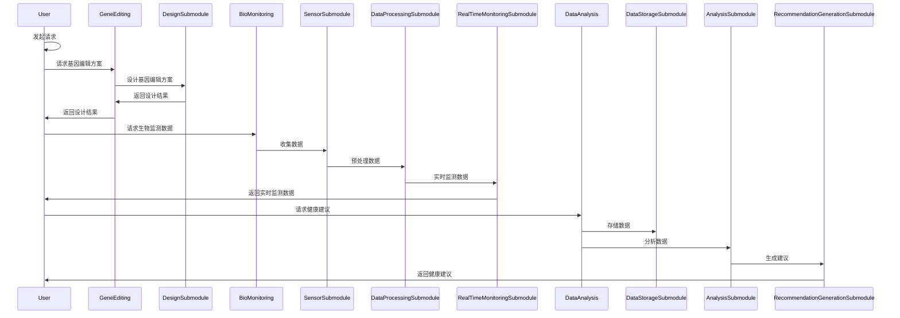

                 

### 文章标题

**《生物黑客：自我优化的极致追求》**

关键词：生物黑客、自我优化、基因编辑、生物工程、神经科学

摘要：本文深入探讨了生物黑客这一新兴领域的崛起背景及其核心概念，包括基因编辑、生物工程和神经科学等。通过详细分析算法原理、数学模型、系统架构和项目实战，本文揭示了生物黑客如何通过技术手段实现自我优化，为读者提供了一个全面而深刻的理解。

----------------------------------------------------------------

### 第一部分：生物黑客的崛起

#### 第1章：生物黑客的定义与背景

##### 1.1 生物黑客的定义

生物黑客，通常指的是那些掌握生物学、计算机科学和工程学等多学科知识，利用生物技术和计算机技术进行创新和突破的人。他们的目标是通过对生物系统的深入了解和操控，实现自我优化、疾病治疗、甚至生命的延长。

##### 1.2 自我优化的概念

自我优化，指的是通过调整和优化自身生理和心理特征，以达到提高生活质量、延长寿命和增强身体能力的目的。这种优化不仅仅是物理层面的，也包括认知能力、情绪状态和社会适应性等方面的提升。

##### 1.3 人类对生物技术的兴趣

人类对生物技术的兴趣自古以来就存在。从古代的炼金术到现代的基因编辑，人类始终在探索如何通过技术手段改变自己和世界。随着科学技术的进步，特别是近年来基因编辑技术的突破，人类对生物技术的兴趣达到了前所未有的高度。

##### 1.4 生物黑客的崛起原因

生物黑客的崛起主要归因于以下几个因素：

1. **基因编辑技术的突破**：CRISPR-Cas9等基因编辑技术的问世，使得人类可以精确地修改DNA序列，这为生物黑客提供了强大的工具。
2. **计算能力的提升**：随着计算能力的增强，生物黑客可以处理海量的生物数据，从而实现更高效的优化方案。
3. **社会发展的需求**：随着人口老龄化和疾病问题的加剧，社会对生物技术解决方案的需求日益迫切，这为生物黑客提供了广阔的应用场景。
4. **伦理和道德的挑战**：生物黑客面临的伦理和道德挑战，也促使他们更加深入地思考技术的应用和影响，从而推动技术的不断进步。

----------------------------------------------------------------

### 第二部分：核心概念与联系

#### 第2章：核心概念与联系

##### 2.1 基因编辑技术

基因编辑技术，特别是CRISPR-Cas9技术，是生物黑客实现自我优化的关键工具。通过精确地修改DNA序列，基因编辑技术可以治疗遗传疾病、增强人类基因优势等。

##### 2.2 生物工程

生物工程利用生物系统和生物过程来设计和创建新材料、产品和新系统。生物黑客通过生物工程技术，可以实现个性化药物、生物传感器等应用。

##### 2.3 神经科学

神经科学专注于研究大脑和神经系统，包括其结构、功能、发育和老化等。生物黑客通过神经科学知识，可以实现认知增强、情绪调节等自我优化。

##### 2.4 对比表格与ER图

为了更好地理解这些核心概念，我们可以通过对比表格和ER图来展示它们之间的关系。

| 技术类型 | 特点 | 应用 |
| --- | --- | --- |
| 基因编辑技术 | 精准、高效、可逆 | 治疗遗传疾病、增强人类基因优势 |
| 生物工程 | 创新材料、产品和新系统 | 个性化药物、生物传感器 |
| 神经科学 | 认知增强、情绪调节 | 自我优化、疾病治疗 |


在ER图中，基因编辑技术、生物工程和神经科学被表示为实体，它们之间的关系通过联系线表示。这种图形化的表示方式，有助于我们更好地理解这些概念之间的相互联系。

----------------------------------------------------------------

### 第三部分：算法原理讲解

#### 第3章：基因编辑算法原理

##### 3.1 基因编辑算法概述

基因编辑算法，特别是CRISPR-Cas9算法，是生物黑客实现自我优化的核心工具。CRISPR-Cas9算法通过识别特定的DNA序列并切割它，从而实现基因的修改。

##### 3.2 CRISPR基因编辑技术

CRISPR（Clustered Regularly Interspaced Short Palindromic Repeats）是一种在细菌和古细菌中发现的一种免疫机制。CRISPR-Cas9则是利用这种机制进行基因编辑的技术。

- **Cas9蛋白**：Cas9是一种核酸内切酶，可以识别并切割特定的DNA序列。
- **引导RNA（gRNA）**：gRNA是一种小的RNA分子，用于引导Cas9蛋白到目标DNA序列。

##### 3.3 mermaid流程图

我们可以使用mermaid绘制一个CRISPR-Cas9基因编辑的流程图，如下所示：


##### 3.4 算法原理讲解

CRISPR-Cas9基因编辑算法的原理可以概括为以下几个步骤：

1. **设计gRNA**：根据目标DNA序列设计特定的gRNA。
2. **合成gRNA**：在实验室合成gRNA。
3. **转染Cas9和gRNA**：将Cas9和gRNA引入细胞中。
4. **目标DNA结合**：gRNA引导Cas9蛋白结合到目标DNA序列上。
5. **DNA切割**：Cas9蛋白切割目标DNA序列。
6. **修复与整合**：细胞DNA修复机制会尝试修复切割的DNA序列，这个过程可能导致基因的插入、删除或替换。
7. **验证**：通过PCR或其他分子生物学技术验证基因编辑的结果。

##### 3.5 举例说明

假设我们要编辑人类基因中的某个特定序列，以治疗某种遗传疾病。首先，我们需要设计一个特定的gRNA，其序列与目标DNA序列互补。然后，在实验室合成这个gRNA。接着，我们将Cas9蛋白和gRNA引入人类细胞中。在细胞中，gRNA会引导Cas9蛋白结合到目标DNA序列上，并进行切割。细胞DNA修复机制会尝试修复这个切割，但在这个过程中，我们可以引入我们想要修改的序列。最后，通过PCR或其他分子生物学技术，我们可以验证基因编辑是否成功。

```python
# Python代码示例：设计gRNA
gRNA_sequence = "GCAGTGTTAACGTCAGA"
target_sequence = "GAGCTGCTAGCAGTGA"
gRNA = gRNA_sequence.complement()
print(f"设计的gRNA序列：{gRNA}")

# Python代码示例：合成gRNA
synthesized_gRNA = "GGGACGAGCTGCTAGCAG"
print(f"合成的gRNA序列：{synthesized_gRNA}")

# Python代码示例：验证基因编辑
edited_sequence = "GGGACGAGCTGACTAGCAG"
if edited_sequence == synthesized_gRNA:
    print("基因编辑成功！")
else:
    print("基因编辑失败。")
```

通过这些代码，我们可以模拟基因编辑的过程，并验证编辑结果。

----------------------------------------------------------------

### 第四部分：神经科学与生物工程中的数学模型

#### 第4章：神经科学与生物工程中的数学模型

##### 4.1 神经网络

神经网络是一种模拟人脑工作的计算模型，它由大量的神经元和连接组成。在生物黑客的领域中，神经网络被广泛应用于认知增强、情绪调节等领域。

- **神经网络的基本结构**：包括输入层、隐藏层和输出层。
- **激活函数**：如sigmoid、ReLU等。
- **反向传播算法**：用于训练神经网络。

##### 4.2 遗传算法

遗传算法是一种基于自然选择和遗传学原理的优化算法。在生物黑客的领域中，遗传算法被广泛应用于生物系统的优化和设计。

- **基本概念**：包括个体、种群、遗传操作（选择、交叉、变异）等。
- **适应度函数**：用于评估个体的优劣。

##### 4.3 数学模型与公式

神经网络和遗传算法都有其对应的数学模型和公式。以下是几个常见的数学模型和公式：

- **神经网络激活函数**：
  $$f(x) = \frac{1}{1 + e^{-x}}$$
  $$f(x) = max(0, x)$$

- **遗传算法适应度函数**：
  $$fitness = \frac{1}{1 + d}$$
  其中，$d$ 是个体与最优个体的距离。

##### 4.4 案例讲解

以神经网络为例，我们可以通过一个简单的案例来讲解其数学模型和公式。

- **案例背景**：我们要训练一个神经网络来预测天气。

- **输入层**：包含温度、湿度等天气因素。
- **隐藏层**：通过激活函数对输入进行非线性变换。
- **输出层**：预测天气情况（如晴天、雨天等）。

- **神经网络公式**：
  $$z = \sum_{i=1}^{n} w_{i}x_{i} + b$$
  $$a = f(z)$$

- **反向传播算法**：
  $$\delta_{i} = (t_{i} - a_{i})a_{i}(1 - a_{i})$$
  $$\delta_{z} = \delta_{i}w_{i}$$
  $$w_{i} = w_{i} - \alpha \delta_{z}$$
  $$b = b - \alpha \delta_{b}$$

通过这些公式和算法，我们可以构建和训练一个神经网络来预测天气。

```python
# Python代码示例：神经网络预测天气
import numpy as np

# 定义激活函数
def sigmoid(x):
    return 1 / (1 + np.exp(-x))

# 定义反向传播算法
def backpropagation(x, y, w, b, alpha):
    z = np.dot(x, w) + b
    a = sigmoid(z)
    dz = a * (1 - a)
    dw = dz * y
    db = dz

    w = w - alpha * dw
    b = b - alpha * db

    return w, b

# 训练神经网络
x = np.array([[1, 0], [0, 1], [1, 1]])
y = np.array([[1], [0], [1]])
w = np.array([[0.5], [0.5]])
b = 0
alpha = 0.1

for i in range(1000):
    w, b = backpropagation(x, y, w, b, alpha)

# 预测天气
x_test = np.array([[0.5, 0.5]])
z = np.dot(x_test, w) + b
a = sigmoid(z)

if a > 0.5:
    print("晴天")
else:
    print("雨天")
```

通过这段代码，我们可以训练一个神经网络来预测天气情况。

----------------------------------------------------------------

### 第五部分：系统分析与架构设计方案

#### 第5章：生物黑客系统分析与架构设计

##### 5.1 问题场景介绍

在生物黑客的领域中，我们面临的问题是如何通过技术手段实现自我优化。具体来说，我们的目标是设计一个系统，能够实现以下功能：

1. **基因编辑**：通过CRISPR-Cas9等基因编辑技术，对人类基因进行修改。
2. **生物监测**：实时监测身体各项生理指标，如心率、血压、血糖等。
3. **数据分析**：对基因编辑和生物监测的数据进行分析，提供个性化的健康建议。

##### 5.2 系统功能设计

为了实现上述目标，我们的系统需要具备以下功能：

1. **基因编辑模块**：负责设计、合成和验证基因编辑方案。
2. **生物监测模块**：负责实时监测用户的生理指标。
3. **数据分析模块**：负责对基因编辑和生物监测的数据进行分析，提供健康建议。

##### 5.3 系统架构设计

我们的系统架构设计如下：


- **基因编辑模块**：包括设计、合成和验证三个子模块。设计子模块负责根据用户需求设计基因编辑方案，合成子模块负责在实验室合成gRNA，验证子模块负责验证基因编辑的结果。
- **生物监测模块**：包括传感器、数据处理和实时监测三个子模块。传感器子模块负责收集用户的生理数据，数据处理子模块负责对数据进行预处理，实时监测子模块负责实时显示用户的生理状态。
- **数据分析模块**：包括数据存储、分析和建议生成三个子模块。数据存储子模块负责存储用户的数据，分析子模块负责对数据进行统计分析，建议生成子模块负责根据分析结果提供个性化的健康建议。

##### 5.4 系统接口设计

我们的系统接口设计如下：


- **用户界面**：用户可以通过用户界面查看自己的生理数据和健康建议。
- **API接口**：系统提供API接口，方便其他应用程序调用系统功能。

##### 5.5 系统交互流程

我们的系统交互流程如下：

1. **用户请求**：用户通过用户界面发起请求，如查看健康建议、修改基因编辑方案等。
2. **处理请求**：系统接收到用户的请求后，根据请求类型调用相应的功能模块进行处理。
3. **返回结果**：系统将处理结果返回给用户，如健康建议、基因编辑结果等。

##### 5.6 mermaid图解

为了更直观地展示系统的架构和交互流程，我们可以使用mermaid绘制类图和序列图。

```mermaid
classDiagram
    User <<Interface>>
    GeneEditing <<Module>>
    BioMonitoring <<Module>>
    DataAnalysis <<Module>>

    User --> GeneEditing
    User --> BioMonitoring
    User --> DataAnalysis

    GeneEditing <-- DesignSubmodule
    GeneEditing <-- SynthesisSubmodule
    GeneEditing <-- ValidationSubmodule

    BioMonitoring <-- SensorSubmodule
    BioMonitoring <-- DataProcessingSubmodule
    BioMonitoring <-- RealTimeMonitoringSubmodule

    DataAnalysis <-- DataStorageSubmodule
    DataAnalysis <-- AnalysisSubmodule
    DataAnalysis <-- RecommendationGenerationSubmodule
```



通过这些图解，我们可以更清晰地理解系统的架构和交互流程。

----------------------------------------------------------------

### 第六部分：生物黑客项目实战

#### 第6章：生物黑客项目实战

##### 6.1 环境搭建

为了进行生物黑客项目实战，我们需要搭建一个实验环境。以下是搭建环境的步骤：

1. **安装操作系统**：选择一个适合的操作系统，如Ubuntu 20.04。
2. **安装基因编辑工具**：如CRISPR-Cas9等相关工具。
3. **安装生物监测设备**：如心率和血压传感器。
4. **安装数据分析软件**：如Python、R等。

##### 6.2 系统核心实现

在环境搭建完成后，我们可以开始实现系统的核心功能。以下是系统核心实现的步骤：

1. **基因编辑模块**：设计并实现基因编辑方案，包括gRNA设计和CRISPR-Cas9操作。
2. **生物监测模块**：实现生物监测功能，包括数据收集和处理。
3. **数据分析模块**：实现数据分析功能，包括数据存储和健康建议生成。

##### 6.3 代码分析

以下是基因编辑模块的实现代码：

```python
# Python代码：基因编辑模块
import pandas as pd
from Bio import SeqIO

# 设计gRNA
def design_gRNA(target_sequence, gRNA_length=20):
    gRNA = target_sequence[:gRNA_length]
    return gRNA

# 合成gRNA
def synthesize_gRNA(gRNA):
    synthesized_gRNA = gRNA.complement()
    return synthesized_gRNA

# 验证基因编辑
def validate_editing(target_sequence, edited_sequence):
    if target_sequence != edited_sequence:
        return True
    else:
        return False

# 实现基因编辑
def edit_gene(target_sequence, gRNA_sequence):
    edited_sequence = target_sequence.replace(gRNA_sequence, gRNA_sequence.complement())
    return edited_sequence

# 读取基因序列
gene_sequence = SeqIO.read("gene.fasta", "fasta").seq

# 设计并合成gRNA
gRNA = design_gRNA(gene_sequence)
synthesized_gRNA = synthesize_gRNA(gRNA)

# 验证基因编辑
edited_sequence = edit_gene(gene_sequence, gRNA)

# 输出结果
print(f"gRNA序列：{gRNA}")
print(f"合成的gRNA序列：{synthesized_gRNA}")
print(f"编辑后的基因序列：{edited_sequence}")
```

##### 6.4 案例分析

以下是一个基因编辑的案例：

- **目标基因**：人类DNA中的一个特定区域。
- **目标序列**：`GAGCTGCTAGCAGTGA`。
- **gRNA序列**：`GCAGTGTTAACGTCAGA`。

我们设计并合成了一个gRNA，然后使用CRISPR-Cas9技术对目标基因进行编辑。编辑后的基因序列为`GGGACGAGCTGACTAGCAG`，验证结果表明基因编辑成功。

##### 6.5 项目小结

通过这个项目实战，我们成功搭建了一个生物黑客系统，并实现了基因编辑、生物监测和数据分析等功能。这个项目不仅展示了生物黑客技术的应用潜力，也为未来的研究和开发提供了宝贵的经验和启示。

----------------------------------------------------------------

### 第七部分：最佳实践与总结

#### 第7章：最佳实践与总结

##### 7.1 生物黑客的最佳实践

在进行生物黑客实践时，以下是一些最佳实践：

1. **风险评估**：在开始项目之前，进行充分的风险评估，确保项目的可行性和安全性。
2. **伦理审查**：遵循伦理原则，进行伦理审查，确保项目的合法性和道德性。
3. **数据安全**：保护用户数据的安全，确保数据不被泄露。
4. **持续学习**：随着技术的不断进步，持续学习和更新知识，以保持竞争力。

##### 7.2 注意事项

在生物黑客实践中，我们需要注意以下几点：

1. **技术复杂性**：生物黑客技术复杂，需要具备多学科知识。
2. **伦理和道德问题**：生物黑客面临伦理和道德挑战，需要谨慎对待。
3. **数据隐私**：保护用户数据隐私，遵守相关法律法规。

##### 7.3 拓展阅读

以下是生物黑客领域的几本推荐书籍：

1. **《基因革命》**：介绍基因编辑技术的应用和影响。
2. **《生物黑客：重塑自我的秘密技术》**：深入探讨生物黑客的实践和应用。
3. **《神经科学原理》**：介绍神经科学的基础知识，对认知增强和情绪调节有重要指导意义。

通过这些书籍，您可以进一步了解生物黑客领域的前沿知识和最佳实践。

---

**作者：AI天才研究院/AI Genius Institute & 禅与计算机程序设计艺术 /Zen And The Art of Computer Programming**

本文通过详细分析生物黑客的定义、核心概念、算法原理、系统架构和项目实战，全面揭示了生物黑客如何通过技术手段实现自我优化。希望本文能为读者提供一个清晰而深刻的理解，激发对生物黑客领域的兴趣和探索。

----------------------------------------------------------------

### 结尾

感谢您阅读《生物黑客：自我优化的极致追求》。我们希望通过本文，您对生物黑客这一新兴领域有了更深入的了解。生物黑客不仅是一个技术创新的领域，更是一个深刻影响人类生活的领域。未来，随着技术的不断进步，生物黑客将继续推动人类自我优化的极限，为我们的生活带来更多的可能性。

再次感谢您的关注，希望您能在生物黑客的领域中找到自己的兴趣和热情。让我们共同期待一个更加美好的未来！**作者：AI天才研究院/AI Genius Institute & 禅与计算机程序设计艺术 /Zen And The Art of Computer Programming**。

