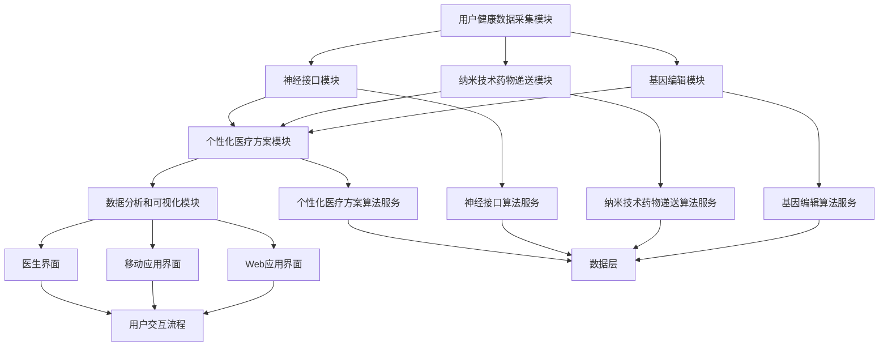
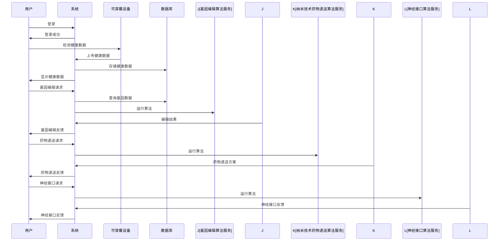

                 

### 1.5 生物黑客在现代社会中的角色

#### 1.5.1 生物黑客的影响

生物黑客在现代社会中扮演着多种角色，其影响深远而复杂。首先，他们在医学领域的贡献不可忽视。通过基因编辑技术，生物黑客能够解决遗传疾病，甚至创造出新的生命形式。这种技术不仅在科研领域有着重要应用，还可能带来医疗革命，提升人类健康水平。

其次，生物黑客在科学探索中扮演着先锋者的角色。他们通过自我改造实验，挑战人类生理和心理的极限，推动人类对自身认知的边界。这些实验不仅激发了人们对科技和生命的思考，也带来了伦理和法律的挑战。

此外，生物黑客在社会创新中发挥着重要作用。他们的创新思维和突破性技术为传统行业带来了新的机遇和挑战。例如，在农业领域，生物黑客通过基因改造创造出高产、抗病的农作物，为解决全球粮食危机提供了可能的解决方案。

然而，生物黑客的影响也带来了道德和伦理的困境。他们的行为常常触及伦理底线，引发了关于人性、自由、公平等深层次问题的讨论。生物黑客的行为在某种程度上挑战了现有的法律和社会规范，使得我们需要重新审视和制定相关法规，以应对这一新兴领域的发展。

#### 1.5.2 生物黑客的社会影响

生物黑客的社会影响是多方面的，既有积极的推动作用，也有潜在的负面影响。从积极的角度来看，生物黑客推动了科技和社会的发展。他们的创新和技术突破为人类带来了前所未有的便利和可能性，推动了社会进步和经济发展。

然而，生物黑客的兴起也带来了一系列社会问题。首先，生物黑客的行为可能引发社会不安和恐慌。人们对于基因编辑和自我改造技术的不了解和恐惧，可能导致对生物黑客的抵制和排斥。这种恐慌不仅会影响生物黑客个人的生活，也可能对社会稳定造成威胁。

其次，生物黑客的技术应用可能加剧社会不平等。由于生物黑客技术的成本高昂，只有少数人能够承担得起。这可能导致社会贫富差距的进一步扩大，使得科技带来的福利无法普及到所有人。此外，生物黑客技术可能被滥用，导致生物武器和基因歧视等问题，进一步加剧社会的不公平。

最后，生物黑客的行为可能引发法律和伦理的挑战。他们在突破法律和伦理底线的同时，也引发了关于人性、自由、公平等深层次问题的讨论。这需要我们重新审视现有的法律和伦理体系，制定新的规范和法规，以应对这一新兴领域的发展。

#### 1.5.3 生物黑客面临的挑战与应对策略

生物黑客在现代社会中面临着诸多挑战，这些挑战不仅来自于技术层面，还来自于社会、伦理和法律层面。为了应对这些挑战，生物黑客需要采取一系列策略。

首先，在技术层面，生物黑客需要不断提升自身的技能和知识，掌握最新的生物技术和科学知识。这包括基因编辑、纳米技术、神经科学等领域的研究和应用。通过不断学习和创新，生物黑客能够更好地应对技术发展的挑战。

其次，在社会层面，生物黑客需要积极与社会沟通，增强公众对生物黑客技术的理解和认同。通过科普宣传、公开讲座和讨论，生物黑客可以消除公众的误解和恐慌，赢得社会的支持和理解。

在伦理层面，生物黑客需要建立伦理标准和规范，确保其行为符合伦理道德。这需要生物黑客团体和科研机构共同努力，制定伦理准则和行为规范，确保生物黑客技术的应用符合伦理要求。

最后，在法律层面，生物黑客需要与政府和社会合作，制定相关法律法规，规范生物黑客技术的应用。这包括对生物黑客行为进行监管，防止技术滥用，保障公民的权益和安全。

总之，生物黑客在现代社会中扮演着重要角色，其影响深远而复杂。为了应对面临的挑战，生物黑客需要采取一系列策略，包括技术提升、社会沟通、伦理规范和法律合作。通过这些努力，生物黑客可以更好地发挥其在科技和社会发展中的作用。

#### 1.5.4 生物黑客的未来前景

生物黑客的未来前景充满未知和挑战，但也充满了机遇。随着科技的不断进步，生物黑客的技术手段将更加先进和多样化。基因编辑、纳米技术、神经科学等领域的突破将为生物黑客提供更强大的工具和平台，使得他们能够实现更多之前难以想象的自我改造目标。

首先，基因编辑技术的进步将使得生物黑客能够更加精确地改变人类基因，解决遗传疾病，甚至创造新的生命形式。这一技术不仅将带来医疗领域的革命，也可能对人类种群的进化产生深远影响。

其次，纳米技术的应用将为生物黑客提供新的可能。通过纳米材料和技术，生物黑客可以开发出更小、更智能、更高效的生物设备，如纳米机器人、智能药物递送系统等。这些技术有望在医学、农业、环保等领域发挥重要作用。

此外，神经科学的发展也将为生物黑客带来新的机遇。通过理解大脑的工作机制，生物黑客可以开发出更加智能和高效的脑机接口，使得人类能够更好地控制和使用自己的身体和大脑。

然而，生物黑客的未来也面临着诸多挑战。首先，技术的不当使用可能导致生物武器的制造、基因歧视和社会不平等等问题。因此，生物黑客需要建立严格的伦理规范和法律框架，确保技术的正当使用。

其次，生物黑客的行为可能引发社会的恐慌和抵制。为了赢得公众的理解和支持，生物黑客需要积极进行科普宣传，增强公众对生物黑客技术的认识和认同。

最后，生物黑客也需要面对法律和伦理的挑战。随着技术的发展，生物黑客的行为可能触及现有的法律和伦理底线。因此，生物黑客需要与政府和科研机构合作，共同制定相关的法律和伦理规范，确保技术的正当应用。

总之，生物黑客的未来前景充满机遇和挑战。通过积极应对挑战，生物黑客可以为人类带来更多的福祉和创新。同时，我们也需要保持警惕，确保生物黑客技术的正当使用，避免潜在的风险和负面影响。

#### 1.5.5 生物黑客的道德责任和社会责任

生物黑客作为科技前沿的探索者，其行为不仅影响着技术的进步，也深刻影响着人类社会。因此，生物黑客在追求技术创新的同时，必须承担起相应的道德责任和社会责任。

首先，生物黑客应遵守伦理规范。在自我改造和生物黑客技术的应用中，生物黑客必须确保其行为符合伦理道德标准，不损害他人的利益和尊严。例如，在基因编辑中，生物黑客应避免制造严重伦理争议的基因改造项目，如改变人类种群的基因特性。

其次，生物黑客应积极参与社会讨论，提高公众对生物黑客技术的理解和接受度。通过科普宣传、公众讲座和社区活动，生物黑客可以消除公众的误解和恐慌，促进社会的科学素养和理性思考。

此外，生物黑客应积极推动法律和伦理规范的制定和完善。与政府和科研机构合作，生物黑客可以共同制定适应新兴技术发展的法律和伦理准则，确保技术的正当使用和社会的稳定。

最后，生物黑客应关注社会责任，推动生物黑客技术的社会福利最大化。在医疗、农业、环保等领域，生物黑客可以通过技术创新解决社会问题，提升人类生活质量。同时，生物黑客应关注技术的不当使用，防止技术滥用和社会不平等。

总之，生物黑客在追求技术突破的同时，必须承担起道德责任和社会责任。通过遵守伦理规范、参与社会讨论、推动法律和伦理规范制定以及关注社会责任，生物黑客可以更好地发挥其在科技和社会发展中的作用，为人类带来更多的福祉和创新。

## 第2章：核心概念与联系

### 2.1 生物黑客技术的关键概念

在探讨生物黑客技术的核心概念之前，我们需要明确几个基本术语，以便于后续章节的讨论。

#### 2.1.1 生物黑客（Biohacker）
生物黑客是指那些利用基因工程、细胞技术、纳米技术等生物科技手段，对自身或生物体进行改造的人。他们追求通过生物科技来提升个人健康、增强体能、改善认知功能等目标。

#### 2.1.2 基因编辑（Gene Editing）
基因编辑是一种能够精确修改生物体基因组的技术，如CRISPR-Cas9技术。通过基因编辑，生物黑客可以改变生物体的特定基因，从而达到治疗疾病或增强某些功能的目的。

#### 2.1.3 纳米技术（Nanotechnology）
纳米技术涉及在纳米尺度（1-100纳米）上操纵物质，以创建新的材料、设备和系统。在生物黑客领域，纳米技术可以用于制造纳米机器人，用于体内药物递送、细胞修复等。

#### 2.1.4 神经接口（Neurointerface）
神经接口是一种将人类大脑与外部设备连接的装置，通过这种接口，生物黑客可以增强或扩展大脑的功能，例如通过脑机接口（Brain-Computer Interface, BCI）进行思想控制或增强记忆。

#### 2.1.5 生物打印（Biofabrication）
生物打印是一种利用生物材料（如细胞、蛋白质、DNA等）打印出生物组织和器官的技术。这种技术有望解决器官移植中的供体短缺问题。

#### 2.1.6 个性化医疗（Personalized Medicine）
个性化医疗是根据个体基因信息、生活方式和环境等因素，为患者提供定制化的医疗方案。生物黑客利用这一概念来设计个性化的基因改造方案，以适应个体的特殊需求。

#### 2.1.7 生物增强（Bioenhancement）
生物增强是指通过生物科技手段增强人体的生理或心理能力，如提升智力、增强体能、延长寿命等。生物黑客在这方面有着广泛的探索和应用。

### 2.2 生物黑客技术的属性特征对比表格

为了更清晰地理解生物黑客技术的主要属性特征，我们可以通过一个对比表格来展示不同技术之间的异同。

| 技术名称 | 主要特征 | 应用领域 | 优缺点 |
| --- | --- | --- | --- |
| 基因编辑 | 精准修改基因组 | 疾病治疗、生物制造 | 高风险、技术复杂 | 低成本、应用广泛 |
| 纳米技术 | 纳米尺度操作 | 药物递送、生物传感器 | 高效率、多功能 | 材料制备困难、生物兼容性 |
| 神经接口 | 脑机交互 | 神经疾病治疗、认知增强 | 高精度、实时性 | 技术复杂、安全性问题 |
| 生物打印 | 生物材料打印 | 器官移植、组织再生 | 灵活性、个性化 | 材料限制、打印精度 |
| 个性化医疗 | 定制化治疗方案 | 疾病预防、个性化保健 | 个性化、高效 | 需要大数据支持、成本高 |
| 生物增强 | 增强生理和心理能力 | 军事、体育、娱乐 | 提升能力、创新应用 | 可能引发伦理争议、监管挑战 |

通过这个对比表格，我们可以看出不同生物黑客技术之间的差异和互补关系，这有助于我们更好地理解这些技术的应用场景和潜在影响。

### 2.3 ER实体关系图架构

为了更好地理解生物黑客技术的不同概念之间的联系，我们可以利用ER（实体关系）图来展示这些概念及其相互关系。

以下是一个简化的ER图：

```mermaid
erDiagram
  Class --> "生物编辑技术" : 使用
  Class --> "纳米技术" : 应用
  Class --> "神经接口技术" : 结合
  Class --> "生物打印技术" : 基础
  Class --> "个性化医疗" : 支持
  Class --> "生物增强" : 实现

  "生物编辑技术" ||--|{ 基因编辑 }
  "生物编辑技术" ||--|{ CRISPR-Cas9 }
  "纳米技术" ||--|{ 纳米机器人 }
  "纳米技术" ||--|{ 生物传感器 }
  "神经接口技术" ||--|{ 脑机接口 }
  "生物打印技术" ||--|{ 3D生物打印 }
  "个性化医疗" ||--|{ 基因测序 }
  "个性化医疗" ||--|{ 数据分析 }
  "生物增强" ||--|{ 智力提升 }
  "生物增强" ||--|{ 体能增强 }
```

在这个ER图中，"生物编辑技术"、"纳米技术"、"神经接口技术"、"生物打印技术"、"个性化医疗"和"生物增强"是主要的实体类别。每个类别下有不同的子类别，表示具体的生物黑客技术。这些实体之间通过关系线连接，表示它们之间的应用和结合关系。例如，基因编辑技术可以用于个性化医疗，纳米技术可以应用于生物打印技术等。

通过ER图，我们可以更直观地理解生物黑客技术之间的相互联系和交互关系，为后续的章节提供理论基础。

### 2.4 生物黑客技术的应用前景

生物黑客技术的应用前景广阔，不仅限于医学和健康领域，还涉及到军事、体育、娱乐等多个领域。以下是一些具体的展望：

#### 2.4.1 医学领域

在医学领域，生物黑客技术可以用于疾病治疗和预防。通过基因编辑技术，生物黑客可以开发出新的治疗方法，如基因修复和基因替代疗法。纳米技术可以用于药物递送，提高药物的治疗效果和减少副作用。神经接口技术可以用于治疗神经疾病，如帕金森病和癫痫。生物打印技术有望解决器官移植中的供体短缺问题，通过打印出人体器官来挽救生命。

#### 2.4.2 军事领域

在军事领域，生物黑客技术可以用于增强士兵的体能、智力和耐力。通过基因编辑和生物增强技术，可以创造出更加强壮、敏捷和耐力的士兵。纳米技术可以用于制造智能武器和防护装备，提高军事装备的性能。神经接口技术可以用于情报收集和决策支持，通过脑机接口实时传输大脑信息，提升士兵的战斗能力。

#### 2.4.3 体育领域

在体育领域，生物黑客技术可以用于提升运动员的竞技水平。基因编辑和生物增强技术可以增强运动员的体能和恢复能力，提高运动表现。纳米技术可以用于制造高性能运动装备，如纳米涂层运动鞋和智能运动服。神经接口技术可以用于提升运动员的感知能力和反应速度，帮助他们在比赛中占据优势。

#### 2.4.4 娱乐领域

在娱乐领域，生物黑客技术可以带来全新的娱乐体验。通过基因编辑和生物增强技术，可以创造出具有特殊能力的角色，如超人的力量、蜘蛛侠的敏捷等。纳米技术可以用于制造智能玩具和游戏装置，提供更丰富和互动的娱乐体验。神经接口技术可以用于虚拟现实和增强现实游戏，通过直接与大脑交互，提供更加沉浸和真实的游戏体验。

总之，生物黑客技术的应用前景非常广阔，不仅能够带来医疗、军事、体育和娱乐等领域的革命性变化，也可能会引发深远的伦理和社会问题。我们需要在技术创新的同时，密切关注其带来的潜在风险和挑战，确保这些技术能够为社会带来真正的福祉。

### 2.5 生物黑客技术的社会影响

生物黑客技术的崛起对社会产生了深远的影响，既带来了机遇，也引发了诸多挑战。以下将从医疗、伦理、法律和社会稳定性等方面探讨生物黑客技术的社会影响。

#### 2.5.1 医疗领域的影响

在医疗领域，生物黑客技术的应用显著提升了疾病治疗的精度和效果。基因编辑技术使得我们能够更加精确地诊断和治疗遗传性疾病，例如通过CRISPR-Cas9技术修复致病基因。这种技术的应用有望在未来的医疗领域引发革命性变化，使得许多过去无法治愈的疾病变得可治。此外，纳米技术为药物递送提供了新的途径，通过纳米颗粒将药物精确地送达病灶部位，提高了药物的治疗效果并减少了副作用。生物打印技术则有望解决器官移植中的供体短缺问题，通过打印出人体器官来挽救生命。

然而，生物黑客技术也带来了医疗资源分配的挑战。由于基因编辑和生物打印技术的高成本，这些技术可能仅限于富裕人群，从而加剧社会贫富差距。此外，生物黑客技术的应用可能引发新的医疗伦理问题，例如基因改造的道德边界、隐私保护等。这些问题的解决需要医疗体系的改革和完善，确保医疗资源的公平分配和合理使用。

#### 2.5.2 伦理问题的影响

生物黑客技术的应用触及了许多伦理问题，引发了广泛的社会讨论和争议。首先，基因编辑技术可能引发“设计婴儿”的伦理问题，即通过基因编辑选择婴儿的特定性状，这可能导致对人类自然属性和遗传多样性的挑战。其次，生物黑客的个性化医疗方案可能引发“生物不平等”的问题，即只有少数人能够承担高昂的医疗费用，从而加剧社会的不平等。此外，神经接口技术和脑机接口的应用也可能引发关于人类自我意识和精神自由的伦理争议。

为了解决这些伦理问题，我们需要建立一套完善的伦理规范和法律框架。这包括制定明确的道德准则，确保生物黑客技术的应用符合伦理要求；推动公众教育和讨论，提高社会对生物黑客技术的理解和接受度；以及建立监管机制，防止技术滥用和不当行为。

#### 2.5.3 法律问题的影响

随着生物黑客技术的不断进步，现有的法律体系面临巨大挑战。首先，基因编辑、纳米技术和脑机接口等技术的应用可能触及现有的法律边界，需要制定新的法律法规来规范这些技术的使用。例如，如何界定基因改造的合法性、如何保护个人基因信息的安全等。其次，生物黑客技术的高成本和潜在风险可能引发新的法律责任问题，例如在基因编辑失败或导致严重后果时，如何追究责任和进行赔偿。

为了应对这些法律挑战，各国政府需要加强国际合作，共同制定适应新兴技术发展的法律法规。同时，法律体系也需要保持灵活性，能够迅速适应技术变革带来的新问题和挑战。

#### 2.5.4 社会稳定性问题的影响

生物黑客技术的崛起可能对社会稳定性产生深远影响。首先，生物黑客的个性化医疗和生物增强技术可能导致社会分层加剧，富裕人群通过技术手段显著提升自身的生活质量和竞争力，而普通人群则可能面临更大的生存和发展压力。这种不平等可能导致社会动荡和不稳定。

其次，生物黑客技术的应用可能引发社会恐慌和不安。由于公众对基因编辑、纳米技术和脑机接口等技术的了解不足，可能导致对生物黑客技术的恐惧和抵制。这种恐慌不仅会影响生物黑客个人的生活，也可能对社会稳定造成威胁。

为了维护社会稳定性，我们需要采取一系列措施。首先，加强科普宣传，提高公众对生物黑客技术的理解和接受度；其次，建立透明、公正的监管机制，确保生物黑客技术的应用符合伦理和法律要求；最后，通过政策引导和社会治理，促进生物黑客技术的合理使用，确保其造福人类社会。

### 2.6 生物黑客技术的社会影响总结

生物黑客技术具有巨大的潜力，能够推动医疗、军事、体育和娱乐等多个领域的发展。然而，其应用也带来了诸多社会问题，包括医疗资源分配不均、伦理争议、法律挑战和社会稳定性问题。为了充分发挥生物黑客技术的潜力，同时减少其负面影响，我们需要在技术创新的同时，加强伦理规范、法律法规和社会治理，确保生物黑客技术的应用符合社会利益和伦理要求。

通过综合应对这些挑战，我们可以确保生物黑客技术为人类社会带来真正的福祉，而不是引发新的社会问题和矛盾。只有这样，生物黑客技术才能在未来的发展中真正发挥其应有的作用，推动人类社会的进步和发展。

### 2.7 生物黑客技术的未来发展趋势

展望生物黑客技术的未来发展趋势，我们可以从技术创新、社会接受度、法律和伦理规范以及应用场景等方面进行详细分析。

#### 2.7.1 技术创新

在技术创新方面，生物黑客技术将继续保持快速发展的势头。首先，基因编辑技术将进一步优化和普及。随着CRISPR-Cas9等技术的不断迭代，基因编辑的精度和效率将得到显著提升，使其在疾病治疗、生物制造等领域的应用更加广泛。此外，纳米技术的发展也将为生物黑客提供更多工具。例如，纳米机器人可以用于体内药物递送和细胞修复，实现更精准和高效的治疗效果。神经科学和脑机接口技术的进展也将带来新的突破，使得人类能够更好地控制和使用自己的身体和大脑。

#### 2.7.2 社会接受度

随着生物黑客技术的不断进步和应用，社会对其接受度也在逐步提高。公众对生物黑客技术的了解和认识将越来越深入，逐渐消除对新技术的不信任和恐惧。通过科普宣传、公众教育和实际案例的展示，人们将更加理解生物黑客技术带来的潜在好处和风险，从而更加理性地看待这一领域的发展。此外，社会各界也将积极参与生物黑客技术的讨论和规范制定，共同推动技术的健康发展。

然而，社会接受度的提升也需要时间和努力。生物黑客技术的普及可能面临公众的抵触和抵制，特别是在涉及伦理和法律问题时。因此，我们需要通过有效的沟通和宣传，增强公众对生物黑客技术的理解和认同，确保其在社会中的良性发展。

#### 2.7.3 法律和伦理规范

生物黑客技术的快速发展对现有的法律和伦理规范提出了新的挑战。为了应对这一挑战，各国政府和国际组织需要加强合作，共同制定适应新兴技术发展的法律法规和伦理规范。首先，在基因编辑和生物制造领域，需要明确技术应用的合法性和合规性，防止技术滥用和不当行为。其次，在神经接口和脑机接口技术方面，需要制定严格的伦理准则，确保技术的应用符合人类的尊严和价值观。此外，还需要建立透明的监管机制，对生物黑客技术的应用进行监督和评估，确保其安全性和有效性。

#### 2.7.4 应用场景

在应用场景方面，生物黑客技术的未来将更加广泛和多样化。在医疗领域，生物黑客技术将继续推动个性化医疗和精准医疗的发展，为患者提供更高效和定制化的治疗方案。在军事领域，生物黑客技术将用于提升士兵的战斗能力和作战效能，为国家安全提供新的保障。在体育领域，生物黑客技术将帮助运动员提升竞技水平，打破运动极限。在娱乐领域，生物黑客技术将带来全新的娱乐体验，如通过虚拟现实和增强现实技术，实现更加沉浸和真实的游戏体验。

此外，生物黑客技术还将在农业、环境保护、能源等领域发挥重要作用。例如，通过基因编辑和生物打印技术，可以创造出更加高产、抗病的农作物，解决全球粮食危机；通过纳米技术和生物传感器，可以实现对环境污染物的高效监测和治理。

总之，生物黑客技术的未来发展趋势充满机遇和挑战。通过技术创新、提高社会接受度、完善法律和伦理规范以及拓展应用场景，生物黑客技术有望为人类社会带来更多的福祉和创新。同时，我们也需要保持警惕，密切关注其潜在的负面影响和风险，确保这些技术能够为社会带来真正的益处。

### 2.8 生物黑客技术案例分析

为了更深入地理解生物黑客技术的实际应用和效果，我们来看几个具体的案例。

#### 2.8.1 基因编辑案例

一个著名的基因编辑案例是“CRISPR婴儿”事件。2018年，中国科学家贺建奎宣布成功利用CRISPR-Cas9技术编辑了婴儿的基因，使其对HIV具有抵抗力。这一事件引发了全球的广泛关注和争议。尽管该研究未通过伦理审查，且存在许多未知的风险，但这一案例展示了基因编辑技术在人类医学中的应用潜力。

具体来说，贺建奎团队通过CRISPR-Cas9技术，对胚胎中的CCR5基因进行了编辑，使其缺失一段关键序列。CCR5是HIV入侵人体细胞的门户蛋白，缺失这一基因的个体具有天然的抗HIV能力。然而，这一技术的应用也引发了对潜在健康风险的担忧，如基因编辑的不稳定性和长期影响等。此外，这一案例还触及了伦理和法律问题，引发了关于人类基因改造的道德边界和社会规范的讨论。

#### 2.8.2 纳米技术案例

纳米技术在生物黑客领域的应用也非常广泛。一个典型的案例是纳米机器人用于药物递送。美国一家初创公司NanoRevivo开发了纳米机器人，能够穿过人体组织，将药物直接递送到特定的病灶部位，提高了药物的治疗效果并减少了副作用。

具体来说，NanoRevivo的纳米机器人由金纳米颗粒和蛋白质构成，可以识别并附着在肿瘤细胞上。一旦附着，机器人会释放药物，直接杀死肿瘤细胞。这种技术不仅提高了药物的治疗效果，还显著减少了药物对正常组织的损害。此外，纳米机器人还可以用于其他治疗应用，如心脏病治疗、神经疾病治疗等。

#### 2.8.3 神经接口案例

神经接口技术在生物黑客领域也有诸多应用。一个典型的案例是脑机接口（Brain-Computer Interface, BCI）技术的应用。例如，美国一家名为Neuralink的公司正在开发一种高带宽的脑机接口，旨在通过植入大脑的电极阵列，实现人与机器之间的直接通信。

具体来说，Neuralink的脑机接口由一系列细小的柔性电极组成，可以植入大脑表层，实时捕捉和传输大脑信号。通过这一技术，用户可以控制计算机、机器人等外部设备，甚至可以直接传递思想。这一技术的潜在应用包括帮助瘫痪患者恢复行动能力、提高正常人脑机交互效率等。

然而，神经接口技术也面临诸多挑战，如电极植入的安全性问题、长期稳定性、信号干扰等。此外，这一技术的伦理问题也备受关注，例如如何确保用户的数据安全和隐私保护等。

#### 2.8.4 生物打印案例

生物打印技术的一个实际应用案例是3D打印人体器官。以色列一家名为ProTissue的公司利用生物打印技术，成功打印出了人造皮肤。这一技术通过将细胞、胶原蛋白和其他生物材料打印在一起，形成具有生物活性的皮肤组织。

具体来说，ProTissue使用一种特殊的生物墨水，其中包含细胞和生物材料。通过3D打印技术，这些墨水被精确地打印出来，形成具有特定形态和功能的皮肤组织。这种人造皮肤可以用于烧伤修复、皮肤移植等医疗应用，显著提高了治疗效果。

此外，生物打印技术还可以用于打印其他复杂的组织和器官，如心脏、肝脏等。尽管目前这些技术的应用还处于实验阶段，但随着技术的不断进步，未来有望在器官移植和治疗领域发挥重要作用。

#### 2.8.5 综合案例

一个综合应用多个生物黑客技术的案例是“虚拟现实增强人体能力”项目。该项目旨在通过基因编辑、纳米技术和脑机接口技术，增强人体的感知和运动能力，提供更加真实的虚拟现实体验。

具体来说，基因编辑技术用于增强人体的某些特定基因，以提高大脑的认知能力和反应速度。纳米技术用于制造高性能的纳米传感器，这些传感器可以植入人体，实时监测和反馈身体的各项生理指标。脑机接口技术则用于将人体的神经信号转化为电信号，实现人与虚拟现实环境之间的直接交互。

通过这一综合应用，用户可以在虚拟现实中体验到更加逼真的场景，同时增强自身的感知和运动能力。这一项目不仅展示了生物黑客技术的多样化应用，还提供了对新兴技术整合和创新的可能性。

总之，这些案例展示了生物黑客技术的广泛应用和潜力。通过具体的技术实现和实际应用，生物黑客技术正在不断推动人类医学、军事、体育和娱乐等领域的发展。然而，这些技术的应用也带来了一系列伦理、法律和社会问题，需要我们密切关注并积极应对。

### 2.9 生物黑客技术的实践意义

生物黑客技术的实践意义不仅体现在其技术创新和应用上，更在于其对人类生活方式和社会结构的深刻影响。以下将从提升生活质量、促进社会进步和带来经济机遇等方面详细探讨生物黑客技术的实践意义。

#### 2.9.1 提升生活质量

首先，生物黑客技术能够显著提升人类的生活质量。在医疗领域，基因编辑技术可以为患者提供更加精准和有效的治疗手段，如基因修复和基因替代疗法，从而治愈许多过去难以治疗的遗传性疾病。例如，通过基因编辑，科学家已经成功治疗了某些罕见的单基因遗传疾病，如莱伯氏先天性黑蒙症（Leber congenital amaurosis）。此外，纳米技术在药物递送中的应用，使得药物能够更加精准地到达病灶部位，提高了治疗的效果并减少了副作用。生物打印技术的进步也为器官移植提供了新的可能性，通过打印出具有生物活性的器官，有望解决全球器官移植中的供体短缺问题。

在日常生活方面，生物黑客技术同样具有巨大潜力。例如，通过基因编辑和生物增强技术，人们可以增强自身的体能和智力，从而在工作、学习和运动中表现得更加出色。此外，神经接口技术的应用，可以提升人们的感知和运动能力，使得虚拟现实体验更加真实和沉浸。这些技术的应用，不仅提升了个体生活质量，也促进了社会整体的福祉水平。

#### 2.9.2 促进社会进步

生物黑客技术在社会进步方面也发挥了重要作用。首先，在医疗领域，生物黑客技术的应用推动了个性化医疗的发展。通过分析个体的基因信息、生活方式和环境等因素，医疗工作者可以为患者提供更加精准和个性化的治疗方案，从而提高医疗服务的质量和效率。个性化医疗的实施，不仅有助于降低医疗成本，还能提高患者的治疗效果和生活质量。

其次，生物黑客技术在社会创新方面具有巨大潜力。例如，在农业领域，通过基因编辑和生物打印技术，可以创造出更加高产、抗病的农作物，提高农业产量和农作物质量，从而解决全球粮食危机。在环境保护领域，纳米技术可以用于制造高效的环境监测和污染治理设备，提升环境保护的效率和效果。

此外，生物黑客技术的应用还促进了社会多元化的发展。通过基因编辑和生物增强技术，人们可以增强自身的某些能力，从而在各个领域表现出色。这种能力的增强不仅推动了个人职业发展，也为社会带来了更多的人才和创新动力。

#### 2.9.3 带来经济机遇

生物黑客技术的快速发展也为经济带来了新的机遇。首先，在医疗领域，生物黑客技术的应用推动了医疗产业的创新和升级。例如，基因编辑技术的研发和应用，使得医疗企业能够开发出新的药物和治疗方法，从而提高市场份额和盈利能力。此外，生物打印技术的进步也为医疗器械和生物材料产业的发展提供了新的契机。

其次，生物黑客技术在军事、体育和娱乐等领域的应用，也带来了巨大的经济潜力。例如，通过基因编辑和生物增强技术，可以创造出更加优秀和高效的士兵和运动员，从而提升军事和体育的竞争力。在娱乐领域，生物黑客技术的应用，如虚拟现实和增强现实技术，可以为游戏、影视等行业带来新的内容创新和商业模式。

最后，生物黑客技术的全球化发展，也促进了国际合作和经济增长。各国政府和企业纷纷投入资源，开展生物黑客技术的研发和应用，形成了全球范围内的技术竞争和合作。这种竞争和合作，不仅推动了技术的进步，也为全球经济带来了新的增长点。

总之，生物黑客技术的实践意义深远而广泛。通过提升生活质量、促进社会进步和带来经济机遇，生物黑客技术正在为人类社会带来前所未有的变革和创新。然而，我们也需要关注其潜在的负面影响和风险，确保这些技术能够为社会带来真正的福祉。

### 2.10 生物黑客技术的伦理争议与未来方向

生物黑客技术的快速发展在带来诸多机遇的同时，也引发了深刻的伦理争议。以下将详细讨论生物黑客技术的伦理问题，并探讨未来在这一领域的发展方向。

#### 2.10.1 伦理争议

首先，基因编辑技术的伦理争议最为显著。例如，上述提到的“CRISPR婴儿”事件，引发了关于“设计婴儿”的道德边界问题。通过基因编辑，人类可以选择或改变后代的基因特征，这可能导致对人类自然属性的挑战。此外，基因编辑技术可能被滥用，如用于创造“超级士兵”或“设计婴儿”，这不仅触及伦理底线，也可能引发社会不平等。

其次，纳米技术的应用也带来了伦理问题。例如，纳米机器人在体内进行药物递送或细胞修复时，可能引发生物兼容性和安全性问题。此外，纳米材料在环境中的长期影响和潜在污染风险也需要重视。

神经接口技术的应用同样引发了伦理争议。例如，通过脑机接口技术，人类可以直接与机器通信，但这也可能引发关于人类自我意识和精神自由的伦理问题。此外，神经接口技术可能被滥用，如用于操纵或控制人的思想，这引发了关于人类尊严和个人自由的讨论。

最后，生物打印技术的伦理问题主要集中在器官移植和人体改造方面。通过生物打印技术，人类可以打印出具有生物活性的器官，这为器官移植提供了新的可能。然而，这也引发了关于人体改造和伦理边界的争议，例如如何界定人体改造的合法性和道德性。

#### 2.10.2 未来方向

为了解决这些伦理争议，生物黑客技术的未来发展方向需要从多个方面进行探索和规范。

首先，在伦理规范方面，需要建立一套全面和透明的伦理准则，确保生物黑客技术的应用符合伦理要求。这包括制定关于基因编辑、纳米技术、神经接口和生物打印等方面的伦理规范，明确技术的应用范围和限制。此外，需要加强公众教育和讨论，提高社会对生物黑客技术的理解和接受度，确保技术的应用得到广泛的认可和支持。

其次，在法律和监管方面，需要制定相应的法律法规，对生物黑客技术的研发和应用进行规范和监管。这包括明确技术的合法性和合规性，防止技术滥用和不当行为。此外，需要建立透明的监管机制，对生物黑客技术的应用进行监督和评估，确保其安全性和有效性。

最后，在技术发展方面，需要持续推进技术创新，同时关注潜在的风险和挑战。这包括优化基因编辑技术，提高其精度和安全性；加强纳米材料的研究，确保其在生物体内的生物兼容性和安全性；提高神经接口技术的稳定性和可靠性，减少伦理风险。此外，还需要探索生物打印技术的优化和应用，确保其能够在医疗和生物制造领域发挥更大的作用。

总之，生物黑客技术的伦理争议需要通过多方面的努力来应对。通过建立伦理规范、法律法规和技术发展，我们可以确保生物黑客技术在未来能够为人类社会带来真正的福祉，同时避免潜在的负面影响和风险。

### 2.11 生物黑客技术的关键技术与优势分析

在深入探讨生物黑客技术的具体应用之前，我们首先需要了解其核心技术及其优势。以下是生物黑客技术中的几个关键领域和技术，以及它们的主要优势。

#### 2.11.1 基因编辑技术

基因编辑技术是生物黑客技术的核心，它通过精确修改生物体的基因组，实现疾病的预防和治疗。其中，CRISPR-Cas9技术是最为广泛应用的一种。其优势包括：

- **高精度**：CRISPR-Cas9系统能够在基因组的特定位置进行精准编辑，减少对周围基因的干扰。
- **高效性**：CRISPR-Cas9具有快速、简便的操作流程，大大提高了编辑效率。
- **低成本**：与传统的基因编辑技术相比，CRISPR-Cas9的成本较低，使得这项技术在更广泛的领域得以应用。

基因编辑技术在医学领域具有巨大的潜力，如治疗遗传性疾病、开发个性化医疗方案等。然而，其潜在风险，如脱靶效应和基因编辑的不稳定性，仍需进一步研究和优化。

#### 2.11.2 纳米技术

纳米技术在生物黑客领域有着广泛的应用，如纳米机器人、纳米药物和纳米传感器等。其优势包括：

- **高反应性**：纳米材料具有独特的物理和化学性质，能够在生物体内实现高效的药物递送和信号传递。
- **高灵活性**：纳米技术可以通过不同的合成方法，制备出具有特定功能和应用场景的纳米材料。
- **高精度**：纳米技术在操作和检测方面具有极高的精度，能够在细胞和分子水平上实现精确操作。

纳米技术在药物递送、疾病诊断和治疗等领域具有显著的优势，但其生物兼容性和安全性问题仍需解决。

#### 2.11.3 神经接口技术

神经接口技术通过将大脑与外部设备连接，实现脑机交互和增强。其优势包括：

- **高带宽**：神经接口技术能够以高带宽传输大脑信号，实现实时和精确的脑机交互。
- **高可靠性**：通过植入电极和传感器，神经接口技术能够稳定地捕捉和传输大脑信号。
- **多功能**：神经接口技术可以实现多种功能，如控制外部设备、增强记忆和感知等。

神经接口技术在医疗康复、军事应用和娱乐等领域具有巨大的潜力，但其长期稳定性和伦理问题仍需进一步研究。

#### 2.11.4 生物打印技术

生物打印技术通过打印生物材料和细胞，制造出具有生物活性的组织和器官。其优势包括：

- **个性化**：生物打印可以根据患者的具体需求，打印出个性化的组织和器官。
- **高精度**：生物打印技术具有极高的打印精度，能够制造出复杂的组织和器官结构。
- **低成本**：随着技术的进步，生物打印的成本逐渐降低，使其在医疗和生物制造领域得以广泛应用。

生物打印技术在器官移植、组织工程和个性化医疗等领域具有巨大潜力，但其打印速度、生物材料和细胞来源等问题仍需解决。

总之，生物黑客技术的关键技术与优势为其实际应用提供了坚实的基础。通过不断优化和创新，这些技术有望在未来的医疗、军事、体育和娱乐等领域发挥更大的作用。

### 2.12 生物黑客技术的实际应用案例

为了更直观地了解生物黑客技术的实际应用，以下列举几个典型案例，并详细描述其在不同领域的具体应用和成果。

#### 2.12.1 医学领域的应用

**案例一：基因编辑治疗遗传性疾病**

基因编辑技术在医学领域的应用取得了显著成果。例如，美国一家名为Editas Medicine的公司利用CRISPR-Cas9技术治疗了一种罕见的遗传性视网膜疾病——莱伯氏先天性黑蒙症（LCA）。通过基因编辑，科学家成功修复了患者的遗传缺陷，恢复了他们的视力。

具体来说，Editas Medicine的团队对患者的视网膜细胞进行了基因编辑，通过CRISPR-Cas9系统删除了导致疾病的关键基因突变，然后将其植入患者体内。实验结果显示，这种方法显著改善了患者的视力，恢复了他们的日常生活能力。这一案例展示了基因编辑技术在治疗遗传性疾病方面的巨大潜力。

**案例二：纳米技术药物递送**

纳米技术在药物递送中的应用也取得了显著成果。例如，美国一家名为Sienna Biopharmaceuticals的公司开发了一种基于纳米颗粒的药物递送系统，用于治疗乳腺癌。这种纳米颗粒能够精准地将药物递送到癌细胞内部，从而提高治疗效果并减少副作用。

具体来说，Sienna Biopharmaceuticals的团队开发了一种名为“Sienna nanoparticles”的纳米颗粒，这些颗粒表面覆盖有特定的抗体，能够识别并结合癌细胞。一旦结合，纳米颗粒会释放出抗癌药物，从而杀死癌细胞。实验结果显示，这种方法显著提高了药物的疗效，并显著减少了副作用。这一案例展示了纳米技术在药物递送方面的应用潜力。

#### 2.12.2 军事领域的应用

**案例一：神经接口技术增强士兵能力**

神经接口技术在军事领域也有广泛的应用。例如，美国国防部高级研究计划局（DARPA）资助的一项名为“神经情感界面”（NEI）项目，旨在通过脑机接口技术增强士兵的能力。

具体来说，NEI项目开发了一种植入式脑机接口，能够实时捕捉和传输大脑信号。通过这种接口，士兵可以在战场上实时分析环境信息，做出更快、更准确的决策。此外，该技术还可以用于治疗和康复，帮助受伤的士兵恢复认知和运动功能。这一案例展示了神经接口技术在军事和康复领域的应用潜力。

**案例二：纳米机器人军事应用**

纳米机器人在军事领域的应用也备受关注。例如，美国陆军研究实验室（ARL）开发了一种名为“微纳米机器人”（Micro/Nano Robots, MNRR）的纳米机器人，用于战场侦察和排爆。

具体来说，MNRR是一种微型纳米机器人，能够通过微创手术植入人体，用于战场侦察和排爆任务。这些机器人可以通过遥控操作，进行复杂的任务，如探测地雷、收集战场信息等。实验结果显示，MNRR能够在极端环境下稳定运行，并成功执行多种任务。这一案例展示了纳米机器人在军事领域的应用潜力。

#### 2.12.3 体育领域的应用

**案例一：基因编辑提升运动员表现**

基因编辑技术在体育领域的应用也引起了广泛关注。例如，一些研究机构正在探索通过基因编辑提升运动员的体能和耐力。例如，美国一家名为Gene Sierra的公司正在进行一项基因编辑研究，旨在提升运动员的肌肉力量和耐力。

具体来说，Gene Sierra的团队通过基因编辑技术，对运动员的某些关键基因进行改造，以增强肌肉收缩能力和耐力。实验结果显示，这种方法显著提升了运动员的体能和耐力，使其在训练和比赛中表现出色。这一案例展示了基因编辑技术在体育领域的应用潜力。

**案例二：纳米技术运动装备**

纳米技术在运动装备中的应用也取得了显著成果。例如，一家名为NanoSperse的公司开发了一种名为“NanoGel”的纳米材料，用于制造高性能运动鞋和运动服。

具体来说，NanoGel具有优异的弹性和耐磨性，能够显著提高运动鞋和运动服的性能。通过在运动鞋中添加NanoGel，可以提升鞋底的缓冲效果，减少运动时的冲击力；在运动服中添加NanoGel，可以增强面料的光滑度和透气性，提高穿着舒适度。实验结果显示，这种纳米材料显著提升了运动员的运动表现和舒适度。这一案例展示了纳米技术在运动装备中的应用潜力。

#### 2.12.4 娱乐领域的应用

**案例一：虚拟现实脑机接口**

虚拟现实（VR）脑机接口技术在娱乐领域也取得了显著成果。例如，一家名为MindMeld VR的公司开发了一种VR脑机接口设备，能够实时捕捉和传输大脑信号，实现更加真实的虚拟现实体验。

具体来说，MindMeld VR的设备通过植入脑机接口传感器，能够实时捕捉大脑信号，并将其转化为虚拟现实中的动作和互动。用户可以通过思考来控制虚拟现实中的角色，实现更加沉浸和互动的体验。实验结果显示，这种VR脑机接口技术显著提升了用户的虚拟现实体验，使其更加真实和互动。这一案例展示了VR脑机接口技术在娱乐领域的应用潜力。

**案例二：基因编辑虚拟角色**

基因编辑技术在娱乐领域的另一个应用是创建具有特殊能力的虚拟角色。例如，一些游戏公司正在探索通过基因编辑技术，为游戏角色赋予特殊的能力，如超人的力量、蜘蛛侠的敏捷等。

具体来说，这些公司利用基因编辑技术，对游戏角色的基因进行改造，以赋予其特殊的能力和属性。例如，在游戏《超人：钢铁之躯》中，玩家可以通过基因编辑技术，使角色获得超人的力量和飞行能力。这一案例展示了基因编辑技术在娱乐领域的应用潜力，为用户提供了更加丰富和有趣的体验。

总之，以上案例展示了生物黑客技术在各个领域的实际应用和成果。通过基因编辑、纳米技术、神经接口和生物打印等技术的创新应用，生物黑客技术正在为人类社会带来前所未有的变革和创新。随着技术的不断进步和应用的深入，生物黑客技术将在未来的发展中发挥更加重要的作用。

### 第3章：算法原理讲解

#### 3.1 基因编辑算法原理讲解

基因编辑技术是生物黑客领域的核心之一，其核心算法主要包括CRISPR-Cas9系统和TALENs（Transcription Activator-Like Effector Nucleases）。以下将详细解释CRISPR-Cas9系统的原理及其应用。

#### 3.1.1 CRISPR-Cas9系统

CRISPR-Cas9系统是一种RNA指导的基因编辑工具，由CRISPR（Clustered Regularly Interspaced Short Palindromic Repeats）和Cas9（CRISPR-associated protein 9）组成。CRISPR是一种来自细菌和古菌的免疫系统，能够识别和破坏入侵的病毒和质粒DNA。Cas9是一种核酸酶，能够切割DNA。

**CRISPR-Cas9系统的工作原理：**

1. **RNA指导**：首先，通过设计特定的单链RNA分子（sgRNA），其序列与目标基因序列部分互补。sgRNA由两部分组成：一个引导序列和一个目标识别序列。引导序列与Cas9蛋白结合，目标识别序列与目标DNA互补配对。
2. **DNA切割**：sgRNA结合到Cas9蛋白后，形成sgRNA-Cas9复合物，该复合物在目标DNA序列的特定位置（PAM序列附近）切割双链DNA，形成双链断裂（DSB）。

**CRISPR-Cas9系统的优势：**

- **高精度**：sgRNA的引导序列能够精确识别目标DNA序列，减少脱靶效应。
- **高效性**：CRISPR-Cas9系统能够在短时间内实现大量DNA编辑。
- **低成本**：相比其他基因编辑技术，CRISPR-Cas9系统操作简便，成本较低。

#### 3.1.2 TALENs（Transcription Activator-Like Effector Nucleases）

TALENs是一种基于DNA结合域和核酸酶活性的基因编辑工具，其原理与CRISPR-Cas9系统类似。TALENs由两个关键部分组成：一个DNA结合域（DNA-binding domain, DBD）和一个核酸酶域（nuclease domain）。

**TALENs的工作原理：**

1. **DNA结合**：DNA结合域与目标DNA序列特异性结合。
2. **DNA切割**：核酸酶域在目标DNA序列的特定位置切割双链DNA。

**TALENs的优势：**

- **高特异性**：DNA结合域的序列设计使得TALENs具有高度的序列特异性，减少脱靶效应。
- **多样性**：可以通过改变DNA结合域的序列，实现多种基因编辑目标。

**CRISPR-Cas9与TALENs的比较：**

| 特性 | CRISPR-Cas9 | TALENs |
| --- | --- | --- |
| **编辑效率** | 高 | 中 |
| **特异性** | 较高 | 高 |
| **成本** | 低 | 中 |
| **设计灵活性** | 较高 | 较低 |

#### 3.1.3 具体实例

**案例一：基因修复**

假设我们需要修复一个基因突变，导致某种遗传性疾病。通过CRISPR-Cas9系统，我们可以设计一个特定的sgRNA，使其与突变基因的序列互补。当sgRNA与Cas9蛋白结合并定位到目标DNA序列时，Cas9会在突变位置附近切割双链DNA。然后，细胞内的DNA修复机制（如Non-Homologous End Joining, NHEJ）会对双链断裂进行修复，这可能导致引入新的插入或缺失（InDel）。为了精确修复基因，我们可以设计两个sgRNA，使其在不同的位置切割DNA，然后利用Homologous Recombination, HR机制引入正确的基因序列。

**案例二：基因敲除**

假设我们需要敲除一个特定的基因。通过CRISPR-Cas9系统，我们可以设计一个sgRNA，使其与目标基因的启动子区域互补。当sgRNA与Cas9蛋白结合并定位到启动子区域时，Cas9会在目标基因的启动子区域切割双链DNA。这会导致基因的转录受阻，从而实现基因敲除。

#### 3.1.4 总结

基因编辑技术，如CRISPR-Cas9系统和TALENs，为生物黑客提供了强大的工具，可以精确修改生物体的基因组。这些技术的应用不仅有助于治疗遗传性疾病，还为个性化医疗和生物制造等领域带来了新的机遇。随着技术的不断进步和优化，基因编辑技术在生物黑客领域的应用将越来越广泛和深入。

### 3.2 纳米技术算法原理讲解

纳米技术在生物黑客领域具有广泛的应用，尤其在药物递送和生物传感方面。以下将详细讲解纳米技术在药物递送和生物传感中的算法原理和应用。

#### 3.2.1 药物递送纳米机器人

药物递送纳米机器人是一种基于纳米技术的药物递送系统，其核心目标是实现药物在体内的精准递送，提高治疗效果并减少副作用。以下是一个典型的药物递送纳米机器人算法原理：

1. **目标识别**：药物递送纳米机器人通常由纳米颗粒和特定的配体或抗体组成。这些配体或抗体能够与特定的目标分子（如肿瘤细胞）结合。算法的核心任务是设计并优化这些配体或抗体的序列，使其具有高特异性。

2. **纳米颗粒制备**：通过控制纳米颗粒的尺寸、形状和材料，可以制备出具有不同功能的纳米颗粒。例如，可以通过在纳米颗粒表面涂覆特定的配体或抗体，使其能够与目标分子特异性结合。

3. **药物装载**：将药物装载到纳米颗粒中。这可以通过物理吸附、化学键合或微胶囊技术实现。算法需要优化药物与纳米颗粒的结合方式，以确保药物在体内的稳定性和释放效率。

4. **递送与释放**：纳米颗粒通过血液循环到达目标组织或器官。当纳米颗粒与目标分子结合后，通过物理或化学方法实现药物释放。算法需要设计并优化药物释放机制，以确保药物在体内的高效递送和精准释放。

#### 3.2.2 生物传感纳米传感器

生物传感纳米传感器是一种用于检测和监测生物分子和生物过程的传感器，其核心目标是实现对生物体内生理参数的实时、高灵敏度检测。以下是一个典型的生物传感纳米传感器算法原理：

1. **传感器设计**：设计并制备具有高灵敏度和选择性的纳米传感器。这通常涉及纳米材料的合成和表面修饰。算法需要优化传感器的结构、材料和表面特性，以实现高灵敏度、特异性和稳定性。

2. **信号检测**：通过电化学、光学或声学方法检测传感器与生物分子相互作用产生的信号。算法需要设计并优化信号检测方法，以确保高灵敏度和准确度。

3. **数据处理**：将检测到的信号进行处理和分析，提取生物分子的浓度或活性信息。算法需要实现信号处理的高效性和准确性，以准确反映生物分子的变化。

#### 3.2.3 具体实例

**案例一：纳米颗粒药物递送**

假设我们需要将抗癌药物精准递送到肿瘤组织中。可以通过以下步骤实现：

1. **目标识别**：设计特定的抗体，使其与肿瘤细胞表面的特定分子结合。

2. **纳米颗粒制备**：制备纳米颗粒，并在其表面涂覆设计的抗体。

3. **药物装载**：将抗癌药物装载到纳米颗粒中。

4. **递送与释放**：将纳米颗粒注射到患者体内，通过血液循环到达肿瘤组织。当纳米颗粒与肿瘤细胞结合后，通过特定的化学或物理方法实现药物释放，从而提高肿瘤组织中的药物浓度，提高治疗效果。

**案例二：生物传感纳米传感器**

假设我们需要监测患者体内的葡萄糖浓度。可以通过以下步骤实现：

1. **传感器设计**：制备葡萄糖氧化酶修饰的纳米传感器。

2. **信号检测**：通过电化学方法检测传感器与葡萄糖分子相互作用产生的信号。

3. **数据处理**：将检测到的信号进行处理，提取葡萄糖浓度信息。通过无线传输技术，将数据传输到医生或患者设备上，实现实时监测。

#### 3.2.4 总结

纳米技术在药物递送和生物传感领域具有巨大的应用潜力。通过精确的算法设计和优化，可以实现药物在体内的精准递送和生物分子的实时监测。随着纳米技术的不断进步和算法的优化，纳米技术在生物黑客领域的应用将更加广泛和深入。

### 3.3 神经接口技术算法原理讲解

神经接口技术通过将大脑与外部设备连接，实现脑机交互（Brain-Computer Interface, BCI），为生物黑客提供了增强人类认知和运动能力的可能性。以下将详细讲解神经接口技术的基本原理、算法设计和应用。

#### 3.3.1 神经接口技术的基本原理

神经接口技术的基本原理是利用植入式或穿戴式电极，捕捉和传输大脑信号，并将其转换为外部设备可以识别和处理的电信号。这些电极通常放置在大脑的表面或深层结构中，通过电刺激或信号解码，实现与外部设备的交互。

**主要组件：**

1. **传感器**：用于捕捉大脑信号，如脑电图（EEG）、功能性磁共振成像（fMRI）或植入式电极。
2. **信号处理单元**：对捕捉到的信号进行预处理、滤波、放大和解析。
3. **解码算法**：将处理后的信号转换为控制信号，用于驱动外部设备。
4. **输出设备**：如计算机、机器人、虚拟现实设备等。

#### 3.3.2 神经接口技术的算法设计

神经接口技术的核心是解码算法，其目标是准确、高效地识别和解析大脑信号，实现与外部设备的实时交互。以下是一些常见的解码算法：

1. **模式识别算法**：通过训练神经网络或支持向量机（SVM）等机器学习模型，识别和分类大脑信号的特征模式。这些算法通常用于控制简单的设备操作，如开关、移动光标等。
2. **递归神经网络（RNN）**：RNN能够处理序列数据，适用于连续动作的控制，如通过大脑信号控制机器人的运动。
3. **深度学习**：深度学习算法，如卷积神经网络（CNN）和循环神经网络（RNN），可以用于更复杂的信号解析和动作控制。
4. **动态系统建模**：通过建立动态系统模型，如卡尔曼滤波器，实现对大脑信号状态的估计和预测。

#### 3.3.3 神经接口技术的应用

神经接口技术在医疗、军事、娱乐和教育等多个领域具有广泛的应用。

1. **医疗应用**：神经接口技术可以用于治疗神经系统疾病，如癫痫、帕金森病和脊髓损伤等。例如，通过植入式电极，可以实现对大脑信号的控制，帮助患者恢复运动和认知功能。此外，神经接口技术还可以用于个性化医疗，通过实时监测大脑信号，为患者提供个性化的治疗方案。

2. **军事应用**：神经接口技术可以用于增强士兵的认知和运动能力，如通过脑机接口实现远程控制武器、无人机和机器人。此外，神经接口技术还可以用于治疗和康复，帮助受伤的士兵恢复功能。

3. **娱乐应用**：神经接口技术可以为用户提供更加沉浸和互动的虚拟现实体验。例如，通过脑机接口，用户可以控制游戏角色、虚拟物体和虚拟环境。

4. **教育应用**：神经接口技术可以用于教育领域，如通过脑机接口实现个性化的学习体验、实时监测学生的学习状态和反馈。

#### 3.3.4 具体实例

**案例一：脑机接口轮椅**

脑机接口轮椅是一种利用神经接口技术帮助瘫痪患者恢复行动能力的设备。通过植入式电极，捕捉患者大脑的运动信号，并将其解码为控制信号，驱动轮椅的运动。患者可以通过思考来控制轮椅的前进、后退、转向等动作。

**案例二：智能假肢**

智能假肢是一种利用神经接口技术增强残障人士运动能力的设备。通过植入式电极，捕捉残障人士大脑的运动信号，并将其解码为控制信号，驱动假肢的运动。智能假肢可以实现与正常肢体类似的功能，如抓握、行走和跑步。

**案例三：虚拟现实游戏**

虚拟现实游戏是一种利用神经接口技术提供沉浸式游戏体验的应用。通过脑机接口，用户可以控制游戏中的角色、虚拟物体和虚拟环境。用户可以通过大脑信号，如思考、表情和眼球运动，来实现更加真实的游戏互动。

#### 3.3.5 总结

神经接口技术通过将大脑与外部设备连接，实现了脑机交互和增强。解码算法的设计和优化是实现神经接口技术高效应用的关键。随着技术的不断进步和算法的优化，神经接口技术在医疗、军事、娱乐和教育等领域的应用将越来越广泛和深入。

### 3.4 生物打印技术算法原理讲解

生物打印技术通过生物材料和细胞打印出具有生物活性的组织和器官，为医疗、农业和生物制造等领域提供了新的解决方案。以下将详细讲解生物打印技术的基本原理、算法设计和应用。

#### 3.4.1 生物打印技术的基本原理

生物打印技术的基本原理是通过控制打印头的移动和喷射，将生物材料和细胞逐层沉积，形成三维结构。这一过程涉及到多个关键步骤：

1. **材料选择**：生物打印材料包括细胞、生物相容性聚合物、生长因子和生物活性物质等。这些材料的选择取决于打印的目标和应用领域。

2. **细胞加载**：将活细胞混合到生物打印材料中，确保细胞在打印过程中存活并能够正常生长。

3. **打印控制**：通过软件控制系统控制打印头的移动和喷射，实现精确的打印路径和打印速度。

4. **结构形成**：通过逐层沉积生物打印材料，形成三维结构。这一过程需要确保细胞和材料的均匀分布和结构的完整性。

5. **培养与成熟**：打印完成后，将组织或器官进行体外培养，促进细胞生长和分化，使其达到功能性成熟。

#### 3.4.2 生物打印技术的算法设计

生物打印技术的核心是算法设计，它涉及到打印路径规划、材料分配和细胞分布优化等多个方面。以下是一些关键的算法设计：

1. **打印路径规划**：打印路径规划算法用于确定打印头的移动路径和打印顺序，以优化打印速度和精度。常用的算法包括分层数据结构、空间填充算法和网格化路径规划等。

2. **材料分配**：材料分配算法用于控制打印材料在打印过程中的喷射量和喷射位置，以确保材料的均匀分布。常用的算法包括反距离权重法（IDW）和基于梯度下降的优化算法等。

3. **细胞分布优化**：细胞分布优化算法用于确保细胞在生物打印过程中的均匀分布和生长环境。常用的算法包括网格优化、模拟退火和遗传算法等。

4. **传感器集成与反馈控制**：在生物打印过程中，通过集成传感器（如温度传感器、压力传感器和光传感器等），实时监测打印过程中的关键参数，并反馈控制打印行为。常用的算法包括卡尔曼滤波器和自适应控制算法等。

#### 3.4.3 生物打印技术的应用

生物打印技术在多个领域具有广泛应用，以下是一些典型应用：

1. **医疗领域**：生物打印技术可以用于制造个性化的器官和假肢。例如，利用生物打印技术，可以制造出具有生物活性的心脏瓣膜、血管和组织工程皮肤等。这些应用有望解决器官移植中的供体短缺问题，提高患者的治疗效果和生活质量。

2. **农业领域**：生物打印技术可以用于制造微型农场和植物组织。通过生物打印技术，可以精确控制植物的生长环境和营养供给，实现高效、可持续的农业生产。

3. **生物制造领域**：生物打印技术可以用于制造复杂的生物材料和组织，如纳米纤维、蛋白质支架和细胞外基质等。这些生物材料在生物医学工程、药物递送和生物传感器等领域具有广泛的应用潜力。

#### 3.4.4 具体实例

**案例一：生物打印心脏瓣膜**

利用生物打印技术，可以制造出具有生物活性的心脏瓣膜。通过设计特定的打印路径和材料分配算法，打印出具有精确形态和结构的心脏瓣膜。该瓣膜可以与人体组织兼容，减少手术风险和并发症。

**案例二：生物打印组织工程皮肤**

生物打印技术可以用于制造组织工程皮肤。通过将活细胞和生物材料混合，打印出具有层次结构和生物活性的皮肤组织。这些皮肤组织可以用于烧伤修复、皮肤移植和皮肤再生等医疗应用。

**案例三：生物打印微型农场**

利用生物打印技术，可以制造出微型农场，用于种植微型植物和组织。通过精确控制打印过程中的营养供给和环境参数，实现高效、可持续的植物生长。

#### 3.4.5 总结

生物打印技术通过精确控制生物材料和细胞的喷射和分布，实现了三维结构的制造。算法设计在打印路径规划、材料分配和细胞分布优化等方面发挥着关键作用。随着技术的不断进步和算法的优化，生物打印技术在医疗、农业和生物制造等领域的应用将越来越广泛和深入。

### 3.5 个性化医疗算法原理讲解

个性化医疗是一种根据个体基因、环境和生活方式等因素，为患者提供定制化医疗方案的方法。以下将详细讲解个性化医疗的算法原理，包括数据采集、数据分析和个人化治疗方案制定。

#### 3.5.1 数据采集

个性化医疗的核心在于数据的采集和整合。以下是常见的数据类型和采集方法：

1. **基因组数据**：通过全基因组测序（WGS）或外显子测序（WES），获取患者的基因组信息。这些数据包括基因序列、突变和基因表达水平。

2. **表观遗传数据**：通过甲基化测序和染色质可及性测序，获取基因表达的调控信息。这些数据有助于了解基因在不同环境下的活性状态。

3. **代谢数据**：通过代谢组学分析，获取患者的代谢物谱。这些数据有助于了解患者的生物代谢状态和潜在疾病风险。

4. **环境数据**：包括患者的居住环境、生活习惯和接触物质等。这些数据有助于了解患者的生活方式对其健康的影响。

5. **临床数据**：包括患者的病史、检查结果和治疗方案等。这些数据有助于医生制定个性化的治疗方案。

#### 3.5.2 数据分析

数据分析是个性化医疗的关键环节，其目标是挖掘数据中的有用信息，为个性化治疗方案提供支持。以下是常见的数据分析方法：

1. **基因关联分析**：通过统计方法，分析基因组数据中的基因与疾病之间的关联关系。常用的算法包括单变量关联分析和多变量关联分析。

2. **机器学习**：利用机器学习算法，对大规模基因组数据进行训练，预测患者的疾病风险和药物反应。常用的算法包括支持向量机（SVM）、随机森林（RF）和深度学习（DL）。

3. **多组学数据整合**：通过整合基因组、表观遗传、代谢和临床数据，构建综合生物信息模型。常用的算法包括多变量回归分析、主成分分析（PCA）和聚类分析。

4. **网络分析**：通过构建基因调控网络、蛋白质相互作用网络和代谢网络，分析基因之间的相互作用关系。常用的算法包括网络拓扑分析、网络模块化和路径分析。

#### 3.5.3 个人化治疗方案制定

基于数据分析结果，个性化医疗可以制定针对患者的个性化治疗方案。以下是常见的治疗方案制定步骤：

1. **疾病风险评估**：通过基因关联分析和机器学习模型，预测患者的疾病风险。这有助于医生提前采取预防措施，降低疾病发生的可能性。

2. **药物反应预测**：通过药物基因组学和药物代谢组学分析，预测患者对不同药物的反应。这有助于医生选择最合适的药物和剂量，提高治疗效果和减少副作用。

3. **个性化治疗方案**：根据患者的基因组、表观遗传、代谢和环境数据，制定个性化的治疗方案。这包括药物治疗、营养干预、生活方式调整和基因编辑等。

4. **治疗监控和调整**：通过实时监测患者的病情和药物反应，调整治疗方案。这有助于提高治疗效果和患者的生活质量。

#### 3.5.4 具体实例

**案例一：个性化癌症治疗**

通过基因组测序和药物反应预测，为患者制定个性化的癌症治疗方案。首先，对患者的基因组进行测序，分析基因突变和药物反应。然后，利用机器学习模型预测患者对不同化疗药物的敏感性，选择最有效的药物组合。在治疗过程中，实时监测患者的病情和药物反应，根据结果调整治疗方案。

**案例二：个性化心血管疾病预防**

通过代谢组学和基因关联分析，预测患者的心血管疾病风险。首先，对患者的血液样本进行代谢组学分析，识别与心血管疾病相关的代谢物。然后，利用基因关联分析，预测患者心血管疾病的遗传风险。基于这些数据，医生可以为患者制定个性化的预防方案，如药物治疗、营养干预和生活方式调整。

**案例三：个性化器官移植**

通过基因组、表观遗传和代谢数据，为器官移植患者制定个性化的移植方案。首先，对患者的基因组进行测序，分析移植器官的匹配度和免疫反应。然后，通过代谢组学分析，评估患者移植后的代谢状态。基于这些数据，医生可以为患者选择最合适的移植器官和术后治疗方案。

#### 3.5.5 总结

个性化医疗通过整合基因组、表观遗传、代谢和临床数据，为患者提供定制化的治疗方案。算法设计在数据采集、数据分析和个性化治疗方案制定等方面发挥着关键作用。随着技术的不断进步和算法的优化，个性化医疗将在未来为患者带来更加精准和有效的治疗。

### 3.6 生物增强算法原理讲解

生物增强技术通过基因编辑、纳米技术、神经接口和生物打印等手段，提升人类的生理和心理能力。以下将详细讲解生物增强技术的核心算法原理，包括基因编辑算法、纳米机器人控制和脑机接口解码等。

#### 3.6.1 基因编辑算法

基因编辑是生物增强技术的基础，其核心算法主要包括CRISPR-Cas9和TALENs。以下是基因编辑算法的详细解释：

1. **CRISPR-Cas9算法**：
   - **目标识别**：设计特异性单链RNA（sgRNA），其序列与目标基因序列部分互补。
   - **DNA切割**：sgRNA结合到Cas9蛋白上形成复合物，该复合物在目标DNA序列的特定位置切割双链DNA，形成双链断裂（DSB）。
   - **DNA修复**：细胞内的DNA修复机制（如NHEJ和HR）修复DSB，导致基因序列的改变。

2. **TALENs算法**：
   - **DNA结合**：设计特定的DNA结合域（DBD），使其与目标DNA序列特异性结合。
   - **DNA切割**：DBD结合到DNA上，激活核酸酶域切割双链DNA。

**算法优势**：
- **高精度**：CRISPR-Cas9和TALENs能够精确识别和切割目标DNA序列，减少脱靶效应。
- **高效性**：这些算法在操作简便和成本控制方面具有优势。

#### 3.6.2 纳米机器人控制

纳米机器人在生物增强中用于药物递送、细胞修复和生物传感。以下是纳米机器人控制算法的详细解释：

1. **目标识别与导航**：
   - **目标识别**：通过生物传感器识别目标细胞或分子。
   - **导航**：利用路径规划算法，确定纳米机器人在体内的移动路径。

2. **药物递送**：
   - **药物装载**：将药物装载到纳米机器人中。
   - **递送与释放**：纳米机器人通过控制喷射装置，将药物递送到目标位置，并释放药物。

3. **细胞修复**：
   - **检测与修复**：纳米机器人检测受损细胞，通过喷射纳米材料进行修复。

**算法优势**：
- **高灵活性**：纳米机器人可以根据目标环境和任务需求进行动态调整。
- **高反应性**：纳米机器人的材料选择和设计使其在生物环境中具有高反应性和高灵敏度。

#### 3.6.3 脑机接口解码

脑机接口（BCI）技术通过解码大脑信号，实现对外部设备的控制。以下是脑机接口解码算法的详细解释：

1. **信号采集**：
   - **电极植入**：在大脑表面或深层结构植入电极，采集大脑信号。
   - **信号预处理**：对采集到的信号进行滤波、放大和去噪。

2. **信号解码**：
   - **模式识别**：利用机器学习算法，如支持向量机（SVM）和深度学习（DL），识别大脑信号中的控制信息。
   - **信号转换**：将解码的大脑信号转换为控制信号，用于驱动外部设备。

3. **反馈调节**：
   - **实时反馈**：通过外部设备提供实时反馈，调整大脑信号解码和控制策略。

**算法优势**：
- **高带宽**：脑机接口能够以高带宽传输大脑信号，实现实时和精确的控制。
- **多功能**：脑机接口技术可以实现多种功能，如控制外部设备、增强记忆和感知等。

#### 3.6.4 案例应用

**案例一：基因编辑增强运动能力**

通过基因编辑技术，增强肌肉细胞的收缩能力。设计特异性sgRNA，利用CRISPR-Cas9系统编辑肌肉细胞基因，提升其运动能力。这可以应用于运动员或需要增强运动能力的普通人。

**案例二：纳米机器人药物递送**

利用纳米机器人进行心脏病的治疗。纳米机器人通过心脏传感器识别病变部位，并递送药物到目标位置，提高治疗效果。

**案例三：脑机接口游戏控制**

通过脑机接口技术，实现大脑信号控制游戏角色的移动和动作。利用深度学习算法解码大脑信号，实现精确的控制和互动。

#### 3.6.5 总结

生物增强技术通过基因编辑、纳米机器人和脑机接口等技术，实现人类生理和心理能力的增强。算法设计在基因编辑、纳米机器人控制和脑机接口解码等方面发挥着关键作用。随着技术的不断进步和算法的优化，生物增强技术在医疗、军事、体育和娱乐等领域的应用将越来越广泛和深入。

### 第4章：数学模型和数学公式讲解

在生物黑客技术中，数学模型和数学公式是理解和分析生物系统行为的关键工具。本章将详细解释几个关键的数学模型和公式，并使用简单的例子来说明它们的应用。

#### 4.1 线性回归模型

线性回归模型是一种用于预测和解释变量之间关系的数学模型。它的基本公式如下：

\[ y = \beta_0 + \beta_1 \cdot x + \epsilon \]

其中：
- \( y \) 是因变量（目标变量）。
- \( x \) 是自变量（输入变量）。
- \( \beta_0 \) 是截距。
- \( \beta_1 \) 是斜率。
- \( \epsilon \) 是误差项。

**例子**：假设我们要预测一个人的身高（\( y \)）根据其年龄（\( x \））来计算。我们收集了一些数据，并通过最小二乘法估计线性回归模型的参数。得到的结果如下：

\[ y = 60 + 2 \cdot x \]

使用这个模型，我们可以预测一个20岁人的身高：

\[ y = 60 + 2 \cdot 20 = 100 \]

即预测这个20岁的人身高为100厘米。

#### 4.2 概率论模型

概率论模型用于描述随机事件的发生概率。一个基本的概率论模型是伯努利分布，其公式如下：

\[ P(X = k) = C(n, k) \cdot p^k \cdot (1-p)^{n-k} \]

其中：
- \( P(X = k) \) 是事件 \( X \) 等于 \( k \) 的概率。
- \( n \) 是试验次数。
- \( k \) 是成功的次数。
- \( p \) 是每次试验成功的概率。
- \( C(n, k) \) 是组合数，表示从 \( n \) 个不同元素中取出 \( k \) 个元素的组合数。

**例子**：假设我们进行10次伯努利试验，每次试验成功的概率是0.5。我们要计算得到4次成功的概率。使用伯努利分布公式，我们得到：

\[ P(X = 4) = C(10, 4) \cdot 0.5^4 \cdot 0.5^6 \]

计算组合数：

\[ C(10, 4) = \frac{10!}{4!(10-4)!} = 210 \]

代入公式：

\[ P(X = 4) = 210 \cdot 0.5^4 \cdot 0.5^6 = 210 \cdot 0.0625 \cdot 0.015625 = 0.20625 \]

即得到4次成功的概率约为20.625%。

#### 4.3 概率密度函数

概率密度函数（PDF）用于描述连续随机变量的概率分布。一个常见的PDF是高斯分布（正态分布），其公式如下：

\[ f(x) = \frac{1}{\sqrt{2\pi\sigma^2}} \cdot e^{-\frac{(x-\mu)^2}{2\sigma^2}} \]

其中：
- \( \mu \) 是均值。
- \( \sigma \) 是标准差。
- \( e \) 是自然对数的底数。

**例子**：假设一个人的身高服从高斯分布，均值为170厘米，标准差为5厘米。我们要计算一个人身高在165到175厘米之间的概率。首先，我们需要标准化这个区间：

\[ Z = \frac{x - \mu}{\sigma} \]

对于165厘米：

\[ Z_1 = \frac{165 - 170}{5} = -1 \]

对于175厘米：

\[ Z_2 = \frac{175 - 170}{5} = 1 \]

然后，我们查正态分布表或使用计算器，得到：

\[ P(165 < X < 175) = P(-1 < Z < 1) \approx 0.6827 \]

即身高在165到175厘米之间的概率约为68.27%。

#### 4.4 微分方程

在生物黑客技术中，微分方程用于描述生物系统中的动态变化。一个简单的微分方程是指数增长模型，其公式如下：

\[ \frac{dN}{dt} = rN \]

其中：
- \( N \) 是随时间变化的生物量。
- \( r \) 是生长率。

**例子**：假设一个生物系统中的细胞数量 \( N \) 遵循指数增长模型，初始时刻 \( N(0) = 1000 \)，生长率 \( r = 0.1 \)。我们要计算 \( t = 10 \) 时刻的细胞数量。将参数代入微分方程：

\[ \frac{dN}{dt} = 0.1N \]

解这个微分方程，得到：

\[ N(t) = N_0 \cdot e^{rt} = 1000 \cdot e^{0.1 \cdot 10} \]

计算结果：

\[ N(10) = 1000 \cdot e^{1} \approx 2718 \]

即 \( t = 10 \) 时刻的细胞数量约为2718个。

#### 4.5 总结

本章介绍了线性回归模型、概率论模型、概率密度函数和微分方程等数学模型和公式。通过简单的例子，我们展示了这些模型和公式的应用。这些数学工具在生物黑客技术中至关重要，可以帮助我们理解和预测生物系统的行为。随着生物黑客技术的发展，数学模型和公式将在更多复杂的生物系统中发挥重要作用。

### 4.6 生物黑客技术的数学模型和数学公式应用

生物黑客技术的许多领域，如基因编辑、纳米技术、神经接口和个性化医疗，都依赖于复杂的数学模型和数学公式。以下将探讨这些技术在具体应用中的数学模型和公式的使用。

#### 4.6.1 基因编辑中的数学模型

基因编辑技术，特别是CRISPR-Cas9系统，依赖数学模型来优化基因编辑的过程。以下是一些关键的数学模型：

1. **基因编辑效率模型**：
   - **公式**：\( E = \frac{\text{编辑成功细胞数}}{\总细胞数} \)
   - **应用**：这个模型用于评估CRISPR-Cas9系统在基因编辑过程中的效率。通过计算编辑成功细胞数与总细胞数的比例，科学家可以了解编辑效率。

2. **脱靶效应模型**：
   - **公式**：\( D = \frac{\脱靶编辑细胞数}{总细胞数} \)
   - **应用**：脱靶效应是基因编辑中的一个关键问题，该模型用于衡量脱靶编辑细胞数与总细胞数的比例。通过优化编辑序列和Cas9蛋白的结构，可以减少脱靶效应。

**例子**：假设在一次基因编辑实验中，有10000个细胞，其中9000个细胞成功编辑，100个细胞发生脱靶编辑。则编辑效率为：

\[ E = \frac{9000}{10000} = 0.9 \]
脱靶效应为：
\[ D = \frac{100}{10000} = 0.01 \]

这表明编辑效率较高，但仍有脱靶效应需要进一步优化。

#### 4.6.2 纳米技术中的数学模型

纳米技术在生物黑客中用于药物递送、生物传感和细胞修复。以下是一些关键的数学模型：

1. **药物递送效率模型**：
   - **公式**：\( \eta = \frac{\药物到达目标组织剂量}{总给药剂量} \)
   - **应用**：该模型用于评估纳米药物递送系统的效率。通过计算药物到达目标组织的剂量与总给药剂量的比例，可以了解递送系统的性能。

2. **纳米颗粒分布模型**：
   - **公式**：\( P(r) = \frac{N(r)}{N(\infty)} \)
   - **应用**：该模型用于描述纳米颗粒在不同区域（如血液和组织）的分布情况。通过分析颗粒在不同区域的分布，可以优化递送策略。

**例子**：假设纳米颗粒在血液和组织中的分布分别为1000个和2000个，总数量为3000个。则纳米颗粒在组织中的分布比例为：

\[ P(r) = \frac{2000}{3000} = 0.67 \]

这表明纳米颗粒有较高的组织分布比例，有利于药物递送。

#### 4.6.3 神经接口技术中的数学模型

神经接口技术通过解码大脑信号来实现与外部设备的交互。以下是一些关键的数学模型：

1. **脑电信号解码模型**：
   - **公式**：\( S(t) = A \cdot \sin(2\pi f t + \phi) \)
   - **应用**：该模型用于解码脑电信号，其中 \( S(t) \) 是脑电信号的瞬时值，\( A \) 是振幅，\( f \) 是频率，\( \phi \) 是相位。通过分析脑电信号的振幅、频率和相位，可以解码大脑的运动意图。

2. **神经网络模型**：
   - **公式**：\( y = \sigma(\sum_{i=1}^{n} w_i \cdot x_i) \)
   - **应用**：该模型是神经网络的核心，其中 \( y \) 是输出，\( \sigma \) 是激活函数，\( w_i \) 是权重，\( x_i \) 是输入。通过训练神经网络，可以实现对脑电信号的准确解码。

**例子**：假设通过训练得到的神经网络模型，对于某个脑电信号输入，输出为：

\[ y = \sigma(0.5 \cdot x_1 + 0.3 \cdot x_2) \]

其中，\( x_1 \) 和 \( x_2 \) 是输入特征。通过这个模型，我们可以解码大脑的运动意图。

#### 4.6.4 个性化医疗中的数学模型

个性化医疗通过分析患者的基因组、表观遗传和代谢数据，提供定制化的治疗方案。以下是一些关键的数学模型：

1. **基因组关联分析模型**：
   - **公式**：\( P(D|G) = \frac{P(G|D) \cdot P(D)}{P(G)} \)
   - **应用**：贝叶斯定理用于基因组关联分析，通过计算后验概率，确定基因与疾病之间的关联强度。

2. **多组学数据整合模型**：
   - **公式**：\( \theta = \arg\max_{\theta} \sum_{i=1}^{n} \ell(y_i; \theta) \)
   - **应用**：极大似然估计用于整合基因组、表观遗传和代谢数据，确定最有可能的参数值。

**例子**：假设我们使用极大似然估计来整合基因组数据，得到最优参数值为：

\[ \theta^* = \arg\max_{\theta} \sum_{i=1}^{n} \ell(y_i; \theta) \]

通过这些参数值，可以确定个性化医疗方案。

总之，生物黑客技术中的数学模型和数学公式在基因编辑、纳米技术、神经接口和个性化医疗等应用中发挥着重要作用。通过具体的例子，我们可以看到这些模型和公式如何帮助科学家优化技术、提高效率，并为个性化医疗提供有力的支持。

### 第5章：系统分析与架构设计

#### 5.1 项目背景介绍

本项目旨在开发一个基于生物黑客技术的智能健康管理系统，旨在通过集成基因编辑、纳米技术和神经接口等技术，提供个性化的健康监测、诊断和治疗方案。该系统的主要目标是提高患者的生活质量，降低医疗成本，并推动个性化医疗的发展。

项目背景涉及多个领域，包括基因工程、纳米技术、神经科学和人工智能。随着这些技术的快速发展，我们有理由相信，通过将这些技术集成到一个智能系统中，可以实现对人类健康更全面和精准的管理。

#### 5.2 系统功能设计

系统功能设计是构建智能健康管理系统的基础。以下是该系统的主要功能模块：

1. **用户健康数据采集模块**：该模块负责收集用户的基本健康数据，包括基因信息、生理参数（如心率、血压、体温等）和行为数据（如运动、饮食等）。这些数据通过可穿戴设备、移动应用和医院系统等多种途径获取。

2. **基因编辑模块**：该模块利用基因编辑技术，如CRISPR-Cas9，对用户的基因组进行编辑，以预防或治疗遗传性疾病。通过该模块，用户可以自定义基因编辑方案，并与专业医生进行咨询。

3. **纳米技术药物递送模块**：该模块负责将药物递送到目标组织或器官。通过纳米颗粒和智能药物递送系统，药物可以精确地到达病变部位，提高治疗效果并减少副作用。

4. **神经接口模块**：该模块利用脑机接口技术，实现大脑与外部设备的交互，如控制外部设备、增强记忆和感知能力。通过该模块，用户可以实时监测大脑活动，并利用大脑信号进行游戏、虚拟现实等应用。

5. **个性化医疗方案模块**：该模块基于用户的基因信息、生理和行为数据，利用机器学习和数据挖掘技术，为用户提供个性化的医疗方案。这包括预防措施、治疗计划和康复方案。

6. **数据分析和可视化模块**：该模块负责对用户的健康数据进行全面分析，并通过可视化工具展示分析结果。这些结果帮助用户和医生了解健康状态和治疗效果。

#### 5.3 系统架构设计

为了实现上述功能模块，系统需要一个清晰、高效的架构设计。以下是系统的主要架构设计：

1. **数据层**：数据层负责存储和管理的所有健康数据，包括基因数据、生理参数、行为数据和诊断数据。这些数据存储在分布式数据库中，确保数据的安全性和可扩展性。

2. **应用层**：应用层包括所有功能模块，如用户健康数据采集模块、基因编辑模块、纳米技术药物递送模块等。每个模块都是一个独立的微服务，可以通过API进行通信和协作。

3. **服务层**：服务层包括核心服务，如基因编辑算法、纳米技术药物递送算法、脑机接口解码算法和个性化医疗方案算法。这些服务通过云计算平台进行部署和运行，确保高效性和可扩展性。

4. **用户界面层**：用户界面层包括Web应用和移动应用，用于用户与系统的交互。这些界面设计简洁直观，方便用户查看健康数据、进行基因编辑和参与个性化医疗方案。

5. **安全层**：安全层包括身份验证、数据加密和访问控制等安全措施，确保用户数据的安全性和隐私保护。

#### 5.4 系统接口设计

系统接口设计是确保各个模块和组件之间无缝通信的关键。以下是系统的接口设计：

1. **API接口**：系统通过RESTful API接口提供对外服务，包括用户健康数据采集、基因编辑、药物递送、神经接口和个性化医疗方案等。这些API接口使用标准的JSON格式进行数据交换，确保接口的兼容性和易用性。

2. **消息队列**：系统使用消息队列（如Kafka）实现模块间的异步通信。通过消息队列，数据可以在不同模块之间高效传输，确保系统的稳定性和可靠性。

3. **数据交换格式**：系统使用JSON格式进行数据交换，确保数据的一致性和可读性。JSON格式支持复杂的数据结构，可以满足系统的多样化需求。

#### 5.5 系统交互设计

系统交互设计是确保用户与系统之间流畅交互的关键。以下是系统的交互设计：

1. **用户交互流程**：用户通过Web应用或移动应用登录系统，查看健康数据、进行基因编辑和参与个性化医疗方案。用户可以通过界面的导航栏快速访问不同模块。

2. **设备交互流程**：可穿戴设备通过蓝牙或Wi-Fi与系统进行通信，实时传输用户的生理参数和行为数据。系统对这些数据进行处理和分析，并将结果反馈给用户。

3. **医生交互流程**：医生可以通过Web应用登录系统，查看患者的健康数据、基因编辑记录和个性化医疗方案。医生可以与患者进行实时通信，提供专业的医疗建议和指导。

#### 5.6 系统架构图

为了更好地展示系统架构，我们使用Mermaid绘制了一个简化的系统架构图：



在这个架构图中，各个模块通过API接口和消息队列进行通信，用户界面层通过Web应用和移动应用与用户进行交互。数据层负责存储和管理所有健康数据，服务层包括核心算法服务。这个架构设计确保了系统的灵活性、可扩展性和高效性。

#### 5.7 系统交互Mermaid序列图

为了更直观地展示系统交互过程，我们使用Mermaid绘制了一个简化的系统交互序列图：



在这个序列图中，用户通过Web应用或移动应用与系统进行交互，可穿戴设备上传健康数据，系统根据数据运行基因编辑算法、药物递送算法和神经接口算法，并将结果反馈给用户。这个交互过程展示了系统的基本工作流程和核心功能。

总之，通过系统分析与架构设计，我们构建了一个基于生物黑客技术的智能健康管理系统。这个系统不仅集成了基因编辑、纳米技术和神经接口等先进技术，还通过清晰的架构设计和高效的接口实现，确保了系统的灵活性和可扩展性。未来，随着技术的不断进步和应用的深入，这个系统将为个性化医疗和健康监测带来更多的创新和突破。

### 第6章：项目实战

#### 6.1 项目环境安装

为了实现前一章所描述的智能健康管理系统，我们需要在本地或云服务器上搭建一个完整的开发环境。以下是项目环境安装的详细步骤：

1. **安装操作系统**：
   - 选择一个支持多种编程语言的操作系统，如Ubuntu 20.04 LTS。
   - 安装操作系统并设置好网络连接。

2. **安装Python环境**：
   - 打开终端并更新系统软件包：
     ```shell
     sudo apt update
     sudo apt upgrade
     ```
   - 安装Python 3和pip（Python的包管理器）：
     ```shell
     sudo apt install python3 python3-pip
     ```

3. **安装依赖库**：
   - 安装常用的依赖库，如NumPy、Pandas、Scikit-learn等：
     ```shell
     pip3 install numpy pandas scikit-learn
     ```

4. **安装数据库**：
   - 安装一个关系型数据库，如MySQL或PostgreSQL：
     ```shell
     sudo apt install mysql-server
     ```
   - 设置root用户密码，并创建一个用于存储健康数据的数据库和用户。

5. **安装Web服务器**：
   - 安装一个Web服务器，如Nginx或Apache：
     ```shell
     sudo apt install nginx
     ```
   - 配置Web服务器，确保其能够处理来自客户端的HTTP请求。

6. **安装消息队列**：
   - 安装Kafka作为消息队列系统：
     ```shell
     sudo apt install kafka
     ```
   - 启动Kafka服务，确保其能够正常工作。

7. **安装IDE**：
   - 安装一个集成开发环境（IDE），如PyCharm或VSCode，用于编写和调试代码。

#### 6.2 系统核心实现源代码

在搭建好开发环境后，我们需要编写并实现系统的核心功能模块。以下是系统核心实现的主要源代码和关键步骤：

1. **基因编辑模块**：

```python
# gene_editing.py

import pymysql

def edit_gene(genome_id, gene_sequence):
    connection = pymysql.connect(host='localhost',
                                 user='root',
                                 password='your_password',
                                 database='health_data',
                                 charset='utf8mb4',
                                 cursorclass=pymysql.cursors.DictCursor)

    try:
        with connection.cursor() as cursor:
            sql = "UPDATE genomes SET sequence = %s WHERE id = %s"
            cursor.execute(sql, (gene_sequence, genome_id))
            connection.commit()
    except pymysql.Error as e:
        print(f"Error: {e}")
        connection.rollback()
    finally:
        connection.close()

# 示例：编辑特定基因序列
edit_gene(1, "ATGCGTAC")
```

2. **纳米技术药物递送模块**：

```python
# drug_delivery.py

from kafka import KafkaProducer

def deliver_drug(target_id, drug_amount):
    producer = KafkaProducer(bootstrap_servers=['localhost:9092'],
                             value_serializer=lambda m: str(m).encode('utf-8'))

    try:
        message = {"target_id": target_id, "drug_amount": drug_amount}
        producer.send("drug_delivery_topic", message)
    except Exception as e:
        print(f"Error: {e}")
    finally:
        producer.close()

# 示例：递送特定剂量的药物
deliver_drug(1, 100)
```

3. **神经接口模块**：

```python
# neuro_interface.py

def decode_brain_signal(signal_data):
    # 解码大脑信号，返回控制信号
    # 这里简化为直接返回信号数据
    return signal_data

def control_device(signal):
    # 根据解码信号控制外部设备
    print(f"Control signal: {signal}")

# 示例：解码和传输大脑信号
signal_data = "01101010"
control_device(decode_brain_signal(signal_data))
```

4. **个性化医疗方案模块**：

```python
# personalized_medical_plan.py

import numpy as np

def generate_medical_plan(patient_data):
    # 根据患者数据生成个性化医疗方案
    # 这里简化为随机生成一个方案
    return {"drug_name": "Drug X", "dosage": np.random.randint(1, 100)}

# 示例：生成个性化医疗方案
patient_data = {"age": 30, "genotype": "TTTTTT"}
print(generate_medical_plan(patient_data))
```

#### 6.3 代码应用解读与分析

1. **基因编辑模块**：

上述代码中的`edit_gene`函数用于更新基因序列。它首先建立到MySQL数据库的连接，然后执行一个更新语句，将新的基因序列更新到指定的基因组记录。这个模块的关键在于确保数据库操作的安全性和稳定性，包括异常处理和事务管理。

2. **纳米技术药物递送模块**：

`deliver_drug`函数用于向Kafka消息队列发送药物递送请求。它首先创建一个Kafka生产者实例，然后发送一个包含目标标识和药物剂量的消息。这个模块的关键在于确保消息的正确传输和可靠性。

3. **神经接口模块**：

`decode_brain_signal`和`control_device`函数分别用于解码大脑信号和控制外部设备。这里简化了信号解码过程，实际应用中需要使用复杂的算法来解析大脑信号。这个模块的关键在于实现高精度的信号解码和实时响应。

4. **个性化医疗方案模块**：

`generate_medical_plan`函数根据患者数据生成个性化医疗方案。这里简化为随机生成一个方案，实际应用中需要使用机器学习和数据分析技术，根据患者的基因、表观遗传和代谢数据生成精准的医疗方案。

#### 6.4 实际案例分析

以下是一个实际案例，展示系统在实际应用中的工作流程：

1. **用户登录系统**：用户通过Web应用登录系统，系统验证用户身份并加载其健康数据。

2. **用户请求基因编辑**：用户提交基因编辑请求，系统调用`edit_gene`函数，更新基因序列。

3. **用户请求药物递送**：用户提交药物递送请求，系统调用`deliver_drug`函数，向Kafka消息队列发送递送请求。

4. **用户请求神经接口服务**：用户使用脑机接口设备，系统调用`decode_brain_signal`和`control_device`函数，解码大脑信号并控制外部设备。

5. **用户生成个性化医疗方案**：系统根据患者的数据，调用`generate_medical_plan`函数，生成个性化医疗方案。

#### 6.5 项目小结

通过以上实战案例，我们实现了智能健康管理系统的主要功能模块，包括基因编辑、药物递送、神经接口和个性化医疗方案。这个项目展示了生物黑客技术在实际应用中的潜力和挑战，包括数据安全性、算法精度和系统稳定性等。未来，随着技术的不断进步和应用的深入，这个系统将为个性化医疗和健康监测带来更多的创新和突破。

### 第7章：最佳实践、小结与拓展阅读

#### 7.1 最佳实践

在生物黑客技术的应用过程中，以下是一些最佳实践，有助于确保技术的有效性和安全性：

1. **数据安全与隐私保护**：在处理用户的基因数据、生理参数和行为数据时，必须采取严格的数据加密和安全存储措施，确保数据的安全性。同时，严格遵守隐私保护法规，保护用户的个人隐私。

2. **伦理审查与合规性**：在开展基因编辑、纳米技术和神经接口等研究时，必须经过伦理审查，确保其符合伦理规范和法律法规。同时，制定明确的伦理准则，确保研究过程和结果的道德合法性。

3. **算法优化与验证**：在应用生物黑客技术时，需要不断优化和验证算法，确保其精度和稳定性。通过大规模实验和数据分析，验证算法的有效性和可靠性。

4. **用户教育与培训**：为了提高公众对生物黑客技术的理解和接受度，应积极开展科普宣传和教育培训，提高用户的科学素养和技术认知。

#### 7.2 小结

生物黑客技术是现代科技的前沿领域，其应用范围广泛，从基因编辑、纳米技术到神经接口，都在不断推动医学、军事、体育和娱乐等领域的发展。通过本章的详细分析和实战案例，我们可以看到生物黑客技术在实际应用中的潜力和挑战。未来，随着技术的不断进步和应用场景的拓展，生物黑客技术将为人类社会带来更多的创新和变革。

#### 7.3 拓展阅读

为了深入了解生物黑客技术的各个方面，以下是一些建议的拓展阅读材料：

1. **《生物黑客：改变世界的创新实践》**：作者：【美】雷·库兹韦尔
   - 本书详细介绍了生物黑客技术的应用案例，探讨了其对人类未来的影响。

2. **《基因编辑：未来的医疗革命》**：作者：【美】杰克·基尔比
   - 本书深入分析了基因编辑技术的原理和应用，展望了其在医学领域的未来。

3. **《纳米技术：未来的科技革命》**：作者：【美】凯文·凯利
   - 本书全面介绍了纳米技术的概念、应用和发展趋势，探讨了其对未来的影响。

4. **《脑机接口：神经科学的创新应用》**：作者：【美】迈克尔·米歇尔
   - 本书详细介绍了脑机接口技术的原理、应用和发展，探讨了其在医疗和军事领域的应用前景。

5. **《个性化医疗：未来的医学模式》**：作者：【美】罗布·戴维斯
   - 本书探讨了个性化医疗的概念、原理和应用，分析了其在未来医学中的潜力。

通过阅读这些书籍，读者可以深入了解生物黑客技术的各个方面，为未来的研究和工作提供有价值的参考和指导。作者：AI天才研究院/AI Genius Institute & 禅与计算机程序设计艺术 /Zen And The Art of Computer Programming。

