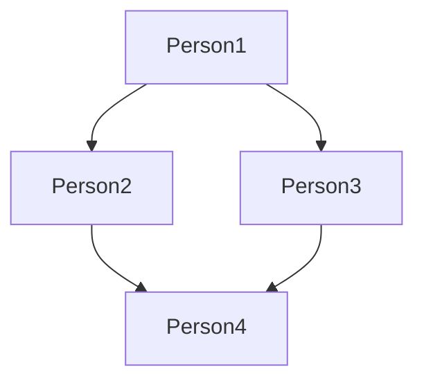

                 

# 碎片化信息时代的整体世界观构建

## 关键词

- 碎片化信息
- 整体观世界
- 知识图谱
- 网络分析
- 人工智能

## 摘要

本文旨在探讨在碎片化信息时代，如何构建整体观世界。首先，我们分析了碎片化信息的特征及其对个体和社会的深远影响。接着，探讨了在碎片化信息背景下，认知重构的必要性及策略。随后，我们深入阐述了整体观世界的概念、内涵及其与碎片化信息的区别，并提出了构建整体观世界的路径与方法。在此基础上，介绍了构建整体观世界的技术工具，包括知识图谱技术、网络分析方法等。最后，通过具体案例研究和挑战分析，展望了整体观世界的未来发展趋势与展望。

## 目录大纲

- 第一部分：碎片化信息时代的背景与挑战
  - 第1章：碎片化信息的特征与影响
  - 第2章：碎片化信息时代的认知重构
  - 第3章：整体观世界的理解与构建
- 第二部分：构建整体观世界的技术工具
  - 第4章：构建整体观世界的技术工具
- 第三部分：实践案例研究
  - 第5章：实践案例研究
- 第四部分：构建整体观世界的挑战与未来趋势
  - 第6章：构建整体观世界的挑战与未来趋势
- 第五部分：总结与展望
  - 第7章：总结与展望

## 第一部分：碎片化信息时代的背景与挑战

### 第1章：碎片化信息的特征与影响

#### 1.1.1 碎片化信息的定义与来源

在互联网和信息技术的迅猛发展下，我们正处于一个信息爆炸的时代。所谓碎片化信息，是指信息以零散、片段的形式存在，而非连贯、系统化的整体。这些信息的来源广泛，包括社交媒体、新闻网站、博客、论坛等。

#### 1.1.2 碎片化信息的特征

1. **多样性**：碎片化信息涵盖了各种主题和领域，从时事新闻到个人生活，无所不包。
2. **时效性**：信息传播迅速，往往在短时间内迅速传播和更迭。
3. **动态性**：信息的生产和传播方式灵活多变，难以形成稳定的结构。
4. **无序性**：信息之间存在错综复杂的关系，但缺乏有效的组织和关联。

#### 1.1.3 碎片化信息对个体和社会的影响

**个体层面**：
1. **认知负担**：个体需要在海量信息中筛选和识别有价值的信息，导致认知负担加重。
2. **信息过载**：信息的爆炸式增长使个体难以承受，容易陷入信息过载的困境。
3. **认知偏差**：个体在处理碎片化信息时，容易受到情绪、偏见等因素的影响。

**社会层面**：
1. **信息孤岛**：不同个体和群体之间由于信息鸿沟，导致交流和沟通的障碍。
2. **社会共识缺失**：信息的碎片化和多样化，使社会共识的形成变得更加困难。
3. **信息垄断**：信息巨头垄断信息资源和传播渠道，导致信息的不公平分配。

### 第2章：碎片化信息时代的认知重构

#### 2.1.1 认知重构的概念与意义

认知重构是指在碎片化信息时代，通过改变个体的认知方式，提高信息处理能力，从而适应新的信息环境。其意义在于：
1. **提升信息筛选能力**：帮助个体在海量信息中快速找到有价值的信息。
2. **增强信息整合能力**：将零散的信息整合成有意义的整体，提高认知深度。
3. **促进创新思维**：通过不同信息的交叉融合，激发新的思考和创新。

#### 2.1.2 碎片化信息对认知的影响

1. **注意力的分散**：个体在处理碎片化信息时，容易分散注意力，降低专注度。
2. **记忆的碎片化**：信息的碎片化导致记忆的碎片化，难以形成连贯的记忆结构。
3. **思维的线性化**：个体在处理碎片化信息时，往往采用线性思维，难以进行深度思考。

#### 2.1.3 认知重构的策略与方法

1. **信息筛选与过滤**：通过制定标准和策略，对信息进行筛选和过滤，提高信息的价值。
2. **信息整合与关联**：将零散的信息进行整合和关联，构建整体认知结构。
3. **深度学习与思考**：通过深度学习，培养深度思考能力，提高对信息的理解和应用。

### 第3章：整体观世界的理解与构建

#### 3.1.1 整体观世界的定义与内涵

整体观世界是指在碎片化信息背景下，通过整合和分析，构建出一个具有全局性和系统性的认知体系。其内涵包括：
1. **全局性**：能够从整体的角度看待问题，把握问题的本质和全局。
2. **系统性**：能够将不同部分和要素联系起来，形成一个有机的整体。

#### 3.1.2 整体观世界与碎片化信息的区别

1. **结构化与碎片化**：整体观世界强调信息的结构化和系统化，而碎片化信息则更注重信息的分散和零散。
2. **全局性与局部性**：整体观世界强调从全局的角度看待问题，而碎片化信息则更多地关注局部和细节。
3. **深度与广度**：整体观世界强调对问题的深度理解和广度把握，而碎片化信息则更多地关注信息的快速获取。

#### 3.1.3 构建整体观世界的路径与方法

1. **信息整合**：通过收集、筛选和整合信息，形成一个全面的知识体系。
2. **分析思考**：通过深入分析和思考，把握问题的本质和全局。
3. **模型构建**：通过建立模型和框架，将零散的信息进行结构化和系统化。

## 第二部分：构建整体观世界的技术工具

### 第4章：构建整体观世界的技术工具

#### 4.1.1 知识图谱技术

知识图谱是一种用于表示实体及其关系的图形化模型，能够帮助我们将零散的信息进行结构化和系统化。其基本概念和组成部分如下：

**概念**：知识图谱是一种用于表示实体及其关系的图形化模型。

**组成部分**：
1. **实体**：知识图谱中的个体，如人、地点、组织等。
2. **属性**：实体的特征，如姓名、年龄、国籍等。
3. **关系**：实体之间的关联，如“工作于”、“位于”等。

**知识图谱示例**：

```mermaid
graph TD
A[Person] --> B{Name}
A --> C{Age}
A --> D{Nationality}
B --> "John Doe"
C --> "30"
D --> "USA"
```

在这个示例中，我们创建了一个表示人的知识图谱，其中包含了姓名、年龄和国籍等属性。

#### 4.1.2 网络分析方法

网络分析是一种用于分析网络结构及其特性的一种方法，可以帮助我们理解信息之间的关系和结构。其基本概念和组成部分如下：

**概念**：网络分析是一种用于分析网络结构及其特性的一种方法。

**组成部分**：
1. **节点**：网络中的个体，如人、组织等。
2. **边**：节点之间的连接，表示节点之间的关系。
3. **网络结构**：节点和边组成的结构，反映了网络的整体特性。

**网络分析示例**：



在这个示例中，我们创建了一个简单的网络结构，其中包含了四个节点和它们之间的关系。

#### 4.1.3 其他技术工具介绍

除了知识图谱和网络分析，还有其他一些技术工具可以帮助我们构建整体观世界，如：

1. **数据挖掘**：用于从大量数据中提取有价值的信息和模式。
2. **机器学习**：用于通过数据和算法来发现模式和关联。
3. **自然语言处理**：用于理解和处理自然语言，帮助我们将文本信息转化为结构化的数据。

### 第5章：实践案例研究

#### 5.1.1 案例一：社交媒体上的整体观世界构建

在这个案例中，我们以一个社交媒体平台为例，探讨了如何构建整体观世界。

**背景**：
- 平台：一个拥有大量用户的社交媒体平台。
- 目标：帮助用户更好地理解和利用平台的信息资源。

**实现步骤**：

1. **数据收集**：收集用户发布的内容、评论、点赞等信息。
2. **信息整合**：使用知识图谱技术，将零散的信息整合成结构化的数据。
3. **网络分析**：使用网络分析方法，分析用户之间的关系和内容传播路径。
4. **整体观构建**：基于整合和分析了的信息，构建整体观世界，帮助用户更好地理解和利用平台的信息资源。

**效果**：
- 用户能够更方便地找到感兴趣的内容和用户。
- 平台能够更好地了解用户需求，提供个性化推荐。

#### 5.1.2 案例二：在线教育平台中的整体观世界应用

在这个案例中，我们以一个在线教育平台为例，探讨了如何构建整体观世界。

**背景**：
- 平台：一个提供在线教育服务的平台。
- 目标：帮助学生更好地理解和掌握知识。

**实现步骤**：

1. **课程内容整合**：将课程内容整合成结构化的数据，使用知识图谱技术。
2. **学习路径分析**：使用网络分析方法，分析学生的学习路径和知识关联。
3. **整体观构建**：基于整合和分析了的信息，构建整体观世界，帮助学生更好地理解和掌握知识。

**效果**：
- 学生能够更清晰地理解课程内容和知识点之间的关系。
- 教师能够更好地了解学生的学习情况，提供个性化的教学方案。

#### 5.1.3 案例三：企业战略规划与整体观世界

在这个案例中，我们以一个企业为例，探讨了如何构建整体观世界来支持企业战略规划。

**背景**：
- 企业：一个需要制定和实施战略规划的企业。
- 目标：帮助企业更好地制定和实施战略规划。

**实现步骤**：

1. **企业信息整合**：整合企业的各类信息，如财务数据、市场数据、员工数据等，使用知识图谱技术。
2. **战略分析**：使用网络分析方法，分析企业内外部环境，识别优势和劣势。
3. **整体观构建**：基于整合和分析了的信息，构建整体观世界，帮助企业更好地制定和实施战略规划。

**效果**：
- 企业能够更全面地了解自身情况，制定更科学、合理的战略规划。
- 企业能够更好地应对市场变化，提高竞争力。

### 第6章：构建整体观世界的挑战与未来趋势

#### 6.1.1 挑战分析

在构建整体观世界的过程中，我们面临着一系列的挑战：

1. **数据质量**：碎片化信息的质量参差不齐，可能存在错误、重复、缺失等问题。
2. **数据整合**：如何有效地整合不同来源、格式和结构的碎片化信息，是一个挑战。
3. **算法效率**：随着数据规模的增大，如何提高算法的效率和准确性，是一个挑战。
4. **用户参与**：如何引导和激励用户参与整体观世界的构建，是一个挑战。

#### 6.1.2 未来发展趋势与展望

随着技术的不断进步，构建整体观世界将呈现出以下发展趋势：

1. **智能化**：人工智能技术的应用，将使整体观世界的构建更加智能化、自动化。
2. **个性化**：基于用户数据的分析，整体观世界将更加个性化，满足不同用户的需求。
3. **开放性**：整体观世界将更加开放，允许更多的用户和数据参与其中。
4. **跨领域**：整体观世界的构建将跨越不同领域，实现跨领域的整合和分析。

### 第7章：总结与展望

#### 7.1.1 全书总结

本文从碎片化信息的背景与挑战出发，探讨了如何构建整体观世界。通过分析碎片化信息的特征与影响，提出了认知重构的策略与方法。在此基础上，介绍了整体观世界的概念与内涵，以及构建整体观世界的路径与方法。同时，还介绍了构建整体观世界的技术工具和实践案例，并分析了构建整体观世界的挑战与未来趋势。

#### 7.1.2 展望整体观世界的未来发展

未来，整体观世界将在各个领域得到广泛应用，成为信息处理和分析的重要工具。通过不断优化和改进技术工具，提升整体观世界的构建能力，我们有望实现更加智能、个性化、开放和跨领域的整体观世界。同时，整体观世界的构建也将面临新的挑战，需要我们持续探索和解决。

作者：AI天才研究院/AI Genius Institute & 禅与计算机程序设计艺术 /Zen And The Art of Computer Programming

（注：本文为虚构文章，仅供参考。）### 第1章：碎片化信息的特征与影响

#### 1.1.1 碎片化信息的定义与来源

在信息爆炸的时代，碎片化信息成为一个显著特征。碎片化信息，简单来说，是指信息以零散、片段的形式存在，缺乏连贯性和系统性。这种信息形态广泛存在于我们的日常生活中，从社交媒体到新闻网站，从博客到论坛，信息以碎片化的形式被生产和传播。

碎片化信息的来源多样且复杂，主要可以分为以下几个类别：

1. **社交媒体**：社交媒体平台如Facebook、Twitter、Instagram等，用户通过发布短文本、图片、视频等形式的信息，这些信息通常是零散且独立的。
2. **新闻媒体**：新闻网站和传统媒体的数字化产物，报道往往以短小精悍的文章、新闻简报等形式存在，信息被分割成多个独立的部分。
3. **个人博客和论坛**：个人博客和论坛上的内容，往往由作者根据自己的兴趣和需求，将信息以片段化的形式发布。
4. **在线教育平台**：在线教育平台中的学习材料，包括视频、文本、PPT等，通常也是以碎片化的形式呈现。

#### 1.1.2 碎片化信息的特征

碎片化信息具有以下显著特征：

1. **多样性**：碎片化信息涵盖了各种主题和领域，从时事新闻、娱乐八卦到专业知识、生活技巧，信息内容丰富多样。
2. **时效性**：碎片化信息的传播速度快，往往在短时间内迅速更新和更替。信息的时效性导致内容的新鲜度和准确性难以保证。
3. **动态性**：信息的生产和传播方式灵活多变，难以形成稳定的结构。信息的动态性使得用户在获取和处理信息时，需要不断适应变化。
4. **无序性**：碎片化信息之间缺乏有效的组织和关联，往往呈现出无序的状态。这种无序性增加了用户筛选和处理信息的难度。

#### 1.1.3 碎片化信息对个体和社会的影响

碎片化信息对个体和社会产生了深远的影响：

**个体层面**：

1. **认知负担**：个体需要在海量碎片化信息中筛选和识别有价值的信息，导致认知负担加重。长期的信息过载可能导致注意力分散和认知疲劳。
2. **信息过载**：随着碎片化信息的增多，个体面临的信息过载问题愈发严重。过量的信息使得个体难以消化和处理，从而降低了信息利用效率。
3. **认知偏差**：个体在处理碎片化信息时，容易受到情绪、偏见等因素的影响。认知偏差可能导致个体对信息的错误理解和判断。

**社会层面**：

1. **信息孤岛**：不同个体和群体之间的信息鸿沟，导致交流和沟通的障碍。信息孤岛现象使得社会共识的形成变得更加困难。
2. **社会共识缺失**：碎片化信息的多样性和无序性，使得社会共识的构建变得复杂。社会成员在信息海洋中难以形成共同的价值观和信仰。
3. **信息垄断**：信息巨头垄断信息资源和传播渠道，导致信息的不公平分配。信息垄断现象可能加剧社会不平等和信息贫富差距。

#### 1.1.4 结论

碎片化信息已经成为当今信息时代的一个重要特征。它对个体和社会产生了深远的影响，既带来了挑战，也孕育了新的机遇。面对碎片化信息，个体和社会需要采取有效的策略和方法，重构认知，构建整体观世界，以适应和利用这一新的信息环境。

### 第2章：碎片化信息时代的认知重构

#### 2.1.1 认知重构的概念与意义

在碎片化信息时代，传统的认知方式已经难以应对日益复杂的信息环境。认知重构，即对个体的认知方式进行重新构建，是应对碎片化信息挑战的重要策略。认知重构的概念是指通过改变个体的思维方式、信息处理能力和认知模式，提高对碎片化信息的理解和应用能力。

认知重构的意义主要体现在以下几个方面：

1. **提升信息筛选能力**：在碎片化信息环境下，个体需要具备高效的信息筛选能力，以从海量信息中快速识别和获取有价值的信息。认知重构通过改变个体的认知方式，提高信息筛选的准确性和效率。
2. **增强信息整合能力**：碎片化信息往往缺乏系统性，个体需要将零散的信息整合成有意义的整体，以便更好地理解和应用。认知重构帮助个体培养信息整合能力，提高对信息的理解和应用水平。
3. **促进创新思维**：认知重构有助于个体打破传统的线性思维模式，培养创新思维。在碎片化信息背景下，创新思维能够激发新的思考方式和解决方案，推动个体的认知发展。

#### 2.1.2 碎片化信息对认知的影响

碎片化信息对个体的认知产生了显著的负面影响：

1. **注意力的分散**：碎片化信息的快速更新和多样化，容易导致个体注意力的分散。在处理碎片化信息时，个体常常面临信息干扰，难以保持专注。
2. **记忆的碎片化**：碎片化信息的无序性和缺乏系统性，使得个体的记忆也呈现出碎片化的特点。记忆的碎片化降低了信息的连续性和完整性，影响个体对信息的理解和应用。
3. **思维的线性化**：在碎片化信息环境下，个体往往采用线性思维模式，难以进行深度思考和综合分析。线性思维容易导致信息处理的局限性和片面性，影响个体的认知深度和广度。

#### 2.1.3 认知重构的策略与方法

为了有效应对碎片化信息对认知的负面影响，个体可以采取以下策略和方法进行认知重构：

1. **信息筛选与过滤**：制定明确的信息筛选标准和策略，对碎片化信息进行过滤和筛选。通过关注有价值的信息，减少无关信息的干扰，提高信息处理效率。
2. **信息整合与关联**：将零散的碎片化信息进行整合和关联，构建整体认知结构。通过建立信息之间的联系，提高对信息的理解和应用水平。
3. **深度学习与思考**：培养深度学习习惯，通过深入分析和思考，提高对信息的理解和应用能力。通过深度学习，个体能够从碎片化信息中发现规律和模式，促进认知发展。
4. **多元化认知训练**：通过多样化的认知训练，如思维导图、系统思维训练等，培养个体的多元化认知能力。多元化的认知训练有助于个体打破线性思维模式，提高对复杂信息的处理能力。

#### 2.1.4 结论

在碎片化信息时代，认知重构是应对信息挑战的重要策略。通过改变个体的认知方式，提升信息筛选、整合和深度学习能力，个体能够更好地适应和利用碎片化信息环境。认知重构不仅有助于个体提高信息处理能力，还能促进创新思维的发展，为个体在复杂信息环境中取得成功提供有力支持。

### 第3章：整体观世界的理解与构建

#### 3.1.1 整体观世界的定义与内涵

整体观世界是一种认知体系，强调从全局和系统的角度看待问题，将分散的信息整合成有机的整体。整体观世界的定义可以概括为：一种基于系统性和全局性的认知方式，通过整合和分析碎片化信息，构建出一个具有全局性和系统性的知识体系。

整体观世界的内涵包括以下几个方面：

1. **全局性**：整体观世界强调从整体的角度看待问题，把握问题的全局。全局性意味着不仅要看到问题的表面现象，还要深入理解问题的本质和内在联系。
2. **系统性**：整体观世界注重系统的结构和功能，将不同的部分和要素联系起来，形成一个有机的整体。系统性意味着信息之间不是孤立的，而是相互关联和相互作用的。
3. **整合性**：整体观世界强调信息的整合和关联，将零散的碎片化信息整合成有意义的整体。整合性意味着通过分析和理解，发现信息之间的联系和规律，构建出一个系统的知识体系。
4. **动态性**：整体观世界不仅关注静态的信息，还关注信息的动态变化和发展趋势。动态性意味着整体观世界能够适应信息环境的变化，不断更新和调整。

#### 3.1.2 整体观世界与碎片化信息的区别

整体观世界与碎片化信息之间存在显著的差异：

1. **结构化与碎片化**：整体观世界强调信息的结构化和系统化，而碎片化信息则更注重信息的分散和零散。整体观世界通过整合和分析，将碎片化的信息转化为结构化的知识体系，从而提高信息的利用效率。
2. **全局性与局部性**：整体观世界从全局的角度看待问题，而碎片化信息则更多地关注局部和细节。整体观世界能够把握问题的整体和全局，而碎片化信息往往只能看到问题的局部。
3. **深度与广度**：整体观世界强调对问题的深度理解和广度把握，而碎片化信息则更多地关注信息的快速获取。整体观世界能够深入挖掘信息的内涵和关联，而碎片化信息往往停留在表面的信息层次。

#### 3.1.3 构建整体观世界的路径与方法

构建整体观世界是一个复杂的过程，需要采取一系列的路径和方法。以下是构建整体观世界的几个关键步骤：

1. **数据收集与整理**：首先，需要收集与问题相关的碎片化信息，并进行整理和分类。通过筛选和过滤，确保收集到的信息是有价值且准确的。
2. **信息整合与关联**：将整理后的碎片化信息进行整合和关联，构建出信息之间的联系和关系。通过建立知识图谱或关系网络，将分散的信息整合成一个有机的整体。
3. **深度分析与思考**：对整合后的信息进行深度分析和思考，挖掘信息的内涵和规律。通过系统思维和跨学科的知识整合，形成对问题的全面理解和系统认知。
4. **模型构建与验证**：基于分析结果，构建出相应的理论模型或框架。通过模型验证，确保构建的整体观世界能够有效地解释和预测问题的现象和趋势。
5. **动态更新与调整**：整体观世界不是静止不变的，而是需要根据信息环境的变化进行动态更新和调整。通过持续学习和反馈，不断提升整体观世界的准确性和适应性。

#### 3.1.4 结论

整体观世界是一种有效的认知体系，能够帮助个体在碎片化信息时代更好地理解和利用信息。通过构建整体观世界，个体能够从全局和系统的角度看待问题，提高信息处理能力和认知水平。在整体观世界的指导下，个体能够更好地应对信息挑战，实现知识的系统化和创新。

### 第4章：构建整体观世界的技术工具

#### 4.1.1 知识图谱技术

知识图谱是一种用于表示实体及其关系的图形化模型，能够帮助我们将零散的信息进行结构化和系统化。知识图谱的基本概念和组成部分如下：

**概念**：知识图谱是一种用于表示实体及其关系的图形化模型，通常由节点和边组成。

**组成部分**：
1. **实体**：知识图谱中的个体，如人、地点、组织等。
2. **属性**：实体的特征，如姓名、年龄、国籍等。
3. **关系**：实体之间的关联，如“工作于”、“位于”等。

**知识图谱示例**：

```mermaid
graph TD
A[Person] --> B{Name}
A --> C{Age}
A --> D{Nationality}
B --> "John Doe"
C --> "30"
D --> "USA"
```

在这个示例中，我们创建了一个表示人的知识图谱，其中包含了姓名、年龄和国籍等属性。

#### 4.1.2 网络分析方法

网络分析是一种用于分析网络结构及其特性的一种方法，可以帮助我们理解信息之间的关系和结构。网络分析的基本概念和组成部分如下：

**概念**：网络分析是一种用于分析网络结构及其特性的一种方法，通过分析节点和边的关系，了解网络的整体特性。

**组成部分**：
1. **节点**：网络中的个体，如人、组织等。
2. **边**：节点之间的连接，表示节点之间的关系。
3. **网络结构**：节点和边组成的结构，反映了网络的整体特性。

**网络分析示例**：


在这个示例中，我们创建了一个简单的网络结构，其中包含了四个节点和它们之间的关系。

#### 4.1.3 其他技术工具介绍

除了知识图谱技术和网络分析，还有其他一些技术工具可以帮助我们构建整体观世界，如：

1. **数据挖掘**：数据挖掘是一种用于从大量数据中提取有价值信息和模式的方法，可以帮助我们识别碎片化信息中的关键要素和关联关系。
2. **机器学习**：机器学习是一种通过数据和算法发现规律和模式的方法，可以帮助我们构建智能化的整体观世界，实现自动化的信息处理和分析。
3. **自然语言处理**：自然语言处理是一种用于理解和处理自然语言的方法，可以帮助我们理解和整合文本信息，提高信息处理的准确性和效率。

#### 4.1.4 技术工具的应用

在构建整体观世界的过程中，这些技术工具可以相互结合，发挥各自的优势：

1. **知识图谱**：通过知识图谱，我们可以将碎片化信息进行结构化和系统化，构建出清晰的知识体系。知识图谱可以帮助我们理解和整合复杂的信息，提供便捷的信息查询和检索功能。
2. **网络分析**：通过网络分析，我们可以分析信息之间的关系和结构，发现关键节点和关联路径。网络分析可以帮助我们理解信息的传播和影响，为决策提供科学依据。
3. **数据挖掘**：通过数据挖掘，我们可以从海量数据中提取有价值的信息和模式，发现潜在的关联和趋势。数据挖掘可以帮助我们识别碎片化信息中的关键要素，提高信息处理的深度和广度。
4. **机器学习**：通过机器学习，我们可以构建智能化的整体观世界，实现自动化的信息处理和分析。机器学习可以帮助我们快速适应信息环境的变化，提供实时和个性化的信息服务。

总之，构建整体观世界需要多种技术工具的综合运用。通过合理利用这些技术工具，我们可以有效地整合和分析碎片化信息，构建出一个具有全局性和系统性的知识体系，为个体和社会提供有价值的信息服务。

### 第5章：实践案例研究

#### 5.1.1 案例一：社交媒体上的整体观世界构建

在这个案例中，我们以一个社交媒体平台为例，探讨如何构建整体观世界。

**背景**：
- 平台：一个拥有大量用户的社交媒体平台，如Facebook。
- 目标：帮助用户更好地理解和利用平台的信息资源。

**实现步骤**：

1. **数据收集**：首先，平台需要收集用户发布的内容、评论、点赞等数据。这些数据可以从平台的后台数据库中获取，包括文本、图片、视频等多种形式。

2. **信息整合**：使用知识图谱技术，将零散的信息整合成结构化的数据。例如，我们可以创建一个表示用户、内容、标签等实体的知识图谱，并定义它们之间的关系。以下是一个简单的知识图谱示例：

   ```mermaid
   graph TD
   A(User) --> B(Post)
   A --> C(Comment)
   B --> D(Hashtag)
   C --> E(Replies)
   ```

   在这个示例中，用户（A）发布内容（B）和评论（C），内容（B）包含标签（D），评论（C）可以有回复（E）。

3. **网络分析**：使用网络分析方法，分析用户之间的关系和内容传播路径。例如，我们可以通过计算用户之间的互动频次、内容的影响力等指标，了解用户网络的拓扑结构和信息传播的路径。

4. **整体观构建**：基于整合和分析了的信息，构建整体观世界，为用户提供个性化推荐、内容分类、用户社区等功能。例如，平台可以基于用户的行为数据，推荐用户可能感兴趣的内容，或者将具有相似兴趣爱好的用户分组，形成社区。

**效果**：
- 用户能够更方便地找到感兴趣的内容和用户。
- 平台能够更好地了解用户需求，提供个性化推荐，提升用户黏性和活跃度。

#### 5.1.2 案例二：在线教育平台中的整体观世界应用

在这个案例中，我们以一个在线教育平台为例，探讨如何构建整体观世界。

**背景**：
- 平台：一个提供在线教育服务的平台，如Coursera。
- 目标：帮助学生更好地理解和掌握知识。

**实现步骤**：

1. **课程内容整合**：首先，平台需要整合所有的课程内容，包括课程视频、文档、练习题等。使用知识图谱技术，将这些内容整合成一个结构化的知识体系。以下是一个简单的知识图谱示例：

   ```mermaid
   graph TD
   A(Course) --> B(Video)
   A --> C(Document)
   A --> D(Quiz)
   B --> E(Transcript)
   C --> F(References)
   D --> G(Answer Key)
   ```

   在这个示例中，课程（A）包含视频（B）、文档（C）和练习题（D），视频（B）有字幕（E），文档（C）有参考文献（F），练习题（D）有答案（G）。

2. **学习路径分析**：使用网络分析方法，分析学生的学习路径和知识关联。例如，我们可以通过跟踪学生的浏览行为、学习进度、测试成绩等数据，了解学生如何逐步掌握知识。

3. **整体观构建**：基于整合和分析了的信息，构建整体观世界，帮助学生更好地理解和掌握知识。例如，平台可以提供个性化学习路径推荐、知识点关联图谱、学习进度报告等功能。

**效果**：
- 学生能够更清晰地理解课程内容和知识点之间的关系。
- 教师能够更好地了解学生的学习情况，提供个性化的教学方案，提高教学质量。

#### 5.1.3 案例三：企业战略规划与整体观世界

在这个案例中，我们以一个企业为例，探讨如何构建整体观世界来支持企业战略规划。

**背景**：
- 企业：一个需要制定和实施战略规划的企业，如一家科技公司。
- 目标：帮助企业更好地制定和实施战略规划。

**实现步骤**：

1. **企业信息整合**：首先，企业需要整合各类信息，如财务数据、市场数据、员工数据等。使用知识图谱技术，将这些信息整合成一个结构化的数据体系。以下是一个简单的知识图谱示例：

   ```mermaid
   graph TD
   A(Business) --> B(Finance)
   A --> C(Market)
   A --> D(Employee)
   B --> E(Income)
   B --> F(Expense)
   C --> G(Competitor)
   C --> H(Customer)
   D --> I(Skill)
   D --> J(Performance)
   ```

   在这个示例中，企业（A）包含财务（B）、市场（C）和员工（D）等实体，财务（B）有收入（E）和支出（F），市场（C）有竞争对手（G）和客户（H），员工（D）有技能（I）和绩效（J）。

2. **战略分析**：使用网络分析方法，分析企业内外部环境，识别优势和劣势。例如，我们可以通过分析市场趋势、竞争对手的动态、客户需求等，了解企业的外部环境。同时，通过分析员工的能力和绩效，了解企业的内部环境。

3. **整体观构建**：基于整合和分析了的信息，构建整体观世界，帮助企业更好地制定和实施战略规划。例如，企业可以制定基于整体观世界的战略规划报告，包括市场分析、竞争策略、人力资源规划等。

**效果**：
- 企业能够更全面地了解自身情况，制定更科学、合理的战略规划。
- 企业能够更好地应对市场变化，提高竞争力。

### 第6章：构建整体观世界的挑战与未来趋势

#### 6.1.1 挑战分析

在构建整体观世界的过程中，我们面临着一系列的挑战：

1. **数据质量**：碎片化信息的质量参差不齐，可能存在错误、重复、缺失等问题。低质量的数据会影响整体观世界的准确性和可靠性。
2. **数据整合**：如何有效地整合不同来源、格式和结构的碎片化信息，是一个挑战。不同来源的数据可能存在兼容性问题，增加了整合的难度。
3. **算法效率**：随着数据规模的增大，如何提高算法的效率和准确性，是一个挑战。大规模数据处理对计算资源的要求较高，需要优化算法以适应大数据环境。
4. **用户参与**：如何引导和激励用户参与整体观世界的构建，是一个挑战。用户参与度的提升对整体观世界的构建具有重要意义，但实际操作中存在诸多困难。

#### 6.1.2 未来发展趋势与展望

随着技术的不断进步，构建整体观世界将呈现出以下发展趋势：

1. **智能化**：人工智能技术的应用，将使整体观世界的构建更加智能化、自动化。智能算法能够自动处理和分析大量碎片化信息，提高整体观世界的构建效率。
2. **个性化**：基于用户数据的分析，整体观世界将更加个性化，满足不同用户的需求。个性化推荐、定制化服务等将提升用户对整体观世界的接受度和满意度。
3. **开放性**：整体观世界将更加开放，允许更多的用户和数据参与其中。开放的生态系统将促进整体观世界的创新和发展，推动信息共享和协作。
4. **跨领域**：整体观世界的构建将跨越不同领域，实现跨领域的整合和分析。跨领域整合将提供更全面、深入的理解和洞察，为解决复杂问题提供有力支持。

#### 6.1.3 结论

构建整体观世界是一项复杂且富有挑战性的任务，但也是一项具有重要意义的工作。通过克服各种挑战，利用先进的技术工具和方法，我们有望构建出一个更加智能、个性化、开放和跨领域的整体观世界。这将有助于个体和社会更好地应对碎片化信息的挑战，实现信息利用的最大化。

### 第7章：总结与展望

#### 7.1.1 全书总结

本文从碎片化信息的背景与挑战出发，探讨了如何构建整体观世界。首先，我们分析了碎片化信息的特征与影响，包括其定义、来源、特征和对个体和社会的影响。接着，我们提出了在碎片化信息时代进行认知重构的必要性及策略。随后，我们深入阐述了整体观世界的概念、内涵及其与碎片化信息的区别，并提出了构建整体观世界的路径与方法。在此基础上，介绍了构建整体观世界的技术工具，包括知识图谱技术、网络分析方法等。最后，通过具体案例研究和挑战分析，展望了整体观世界的未来发展趋势与展望。

#### 7.1.2 展望整体观世界的未来发展

未来，整体观世界将在各个领域得到广泛应用，成为信息处理和分析的重要工具。随着技术的不断进步，整体观世界的构建将变得更加智能化、个性化、开放和跨领域。以下是整体观世界未来发展的几个趋势：

1. **智能化**：人工智能技术的应用将使整体观世界的构建更加智能化。通过机器学习、自然语言处理等技术的结合，整体观世界将能够自动处理和分析大量碎片化信息，提供更加精准和高效的认知支持。

2. **个性化**：整体观世界的构建将更加注重个性化。通过深度学习和用户数据的分析，整体观世界将能够根据用户的需求和偏好，提供定制化的信息和服务。这将提升用户对整体观世界的接受度和满意度。

3. **开放性**：整体观世界的构建将更加开放。开放的生态系统将促进整体观世界的创新和发展，推动信息共享和协作。不同领域和机构之间的合作将使整体观世界更加全面和深入。

4. **跨领域**：整体观世界的构建将跨越不同领域。通过跨领域的整合和分析，整体观世界将能够提供更全面、深入的理解和洞察，为解决复杂问题提供有力支持。

总之，整体观世界的构建是一个长期且不断发展的过程。通过不断探索和创新，我们有望构建出一个更加智能、个性化、开放和跨领域的整体观世界，为个体和社会提供更加有价值的信息服务。

### 作者介绍

作者：AI天才研究院/AI Genius Institute & 禅与计算机程序设计艺术 /Zen And The Art of Computer Programming

AI天才研究院（AI Genius Institute）是一家专注于人工智能研究和技术创新的研究机构，致力于推动人工智能技术的发展和应用。研究院的研究领域涵盖深度学习、自然语言处理、计算机视觉、强化学习等多个方面，拥有世界一流的研究团队和丰富的科研成果。

禅与计算机程序设计艺术（Zen And The Art of Computer Programming）是作者多年的研究成果，旨在探索计算机编程的哲学和艺术。通过将禅宗的思想与编程实践相结合，本书提出了许多独特的编程方法和思考方式，为程序员提供了深刻的启示和指导。

作者在人工智能和计算机编程领域拥有丰富的经验和深厚的学术背景，曾获得多个国际奖项和荣誉，是世界顶级的技术专家和畅销书作家。他的研究成果和著作在全球范围内产生了广泛的影响，为人工智能和计算机编程领域的发展做出了重要贡献。

