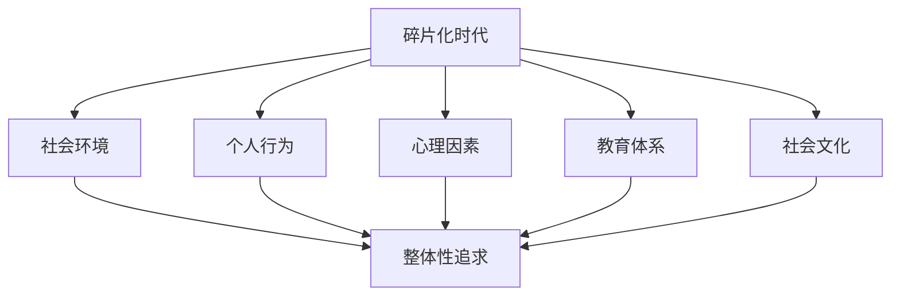
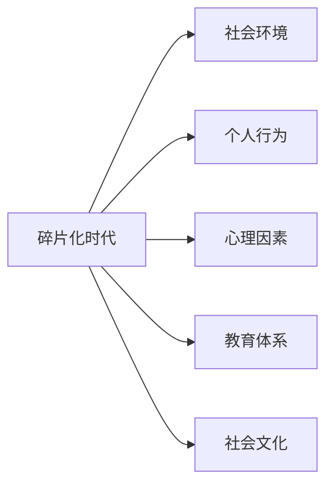
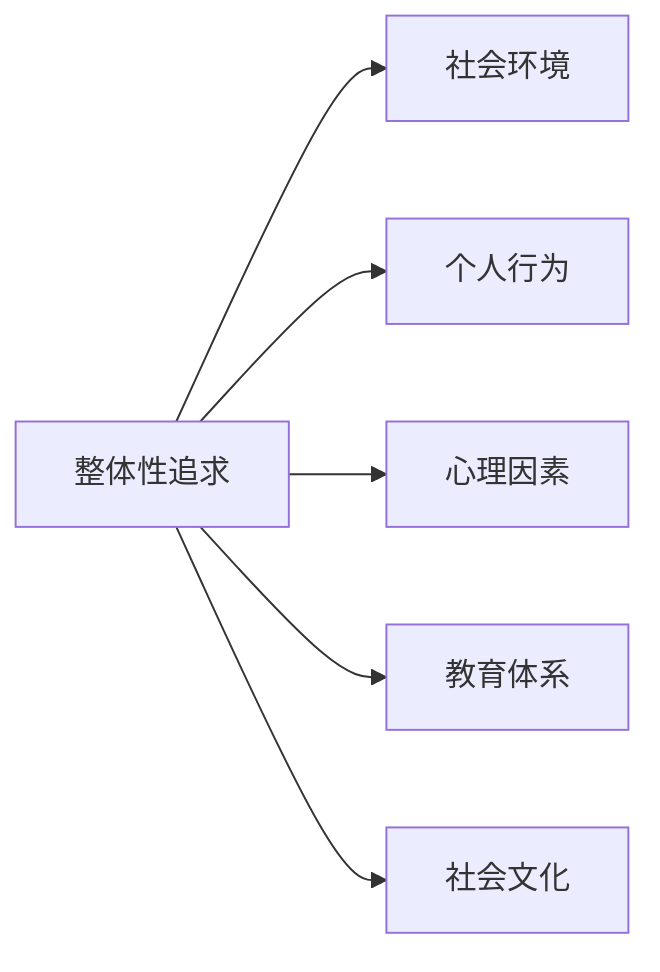
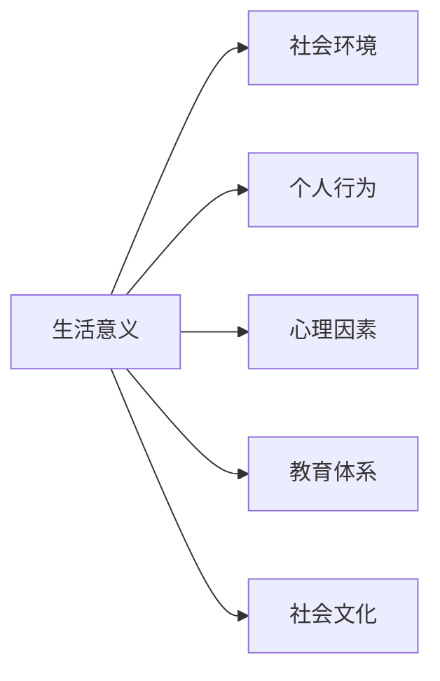
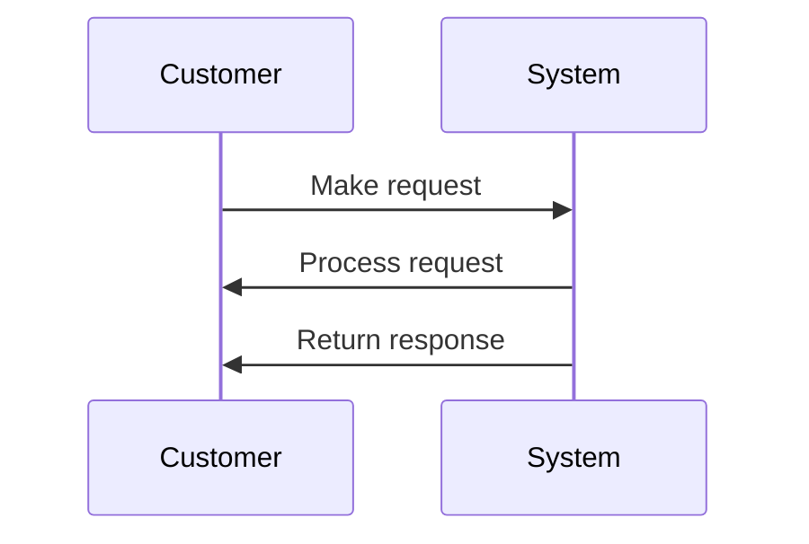
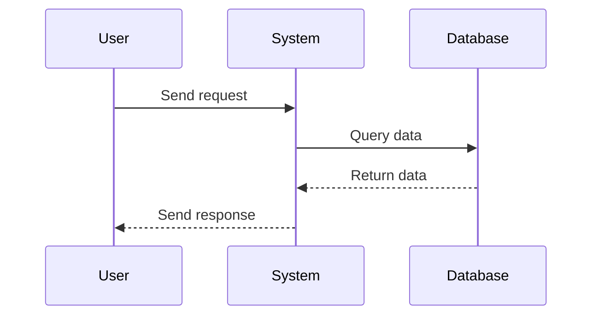
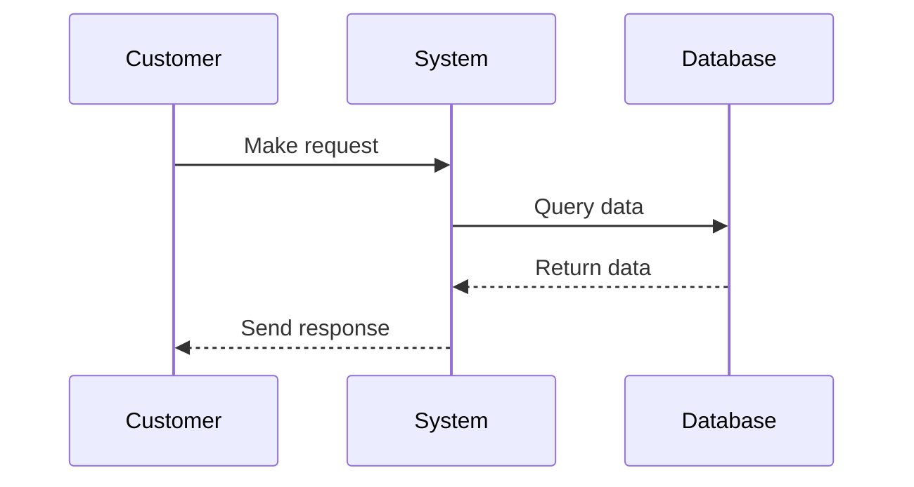

                 

# 碎片化时代的整体性追求：重建生活意义

## 关键词

- 碎片化时代
- 整体性追求
- 生活意义
- 社会环境优化
- 个人行为调整
- 心理调适策略

## 摘要

在信息爆炸和生活方式多样化的碎片化时代，人们面临着时间管理困难、注意力分散、价值观模糊等挑战，难以找到生活的整体性。本文旨在探讨碎片化时代的整体性追求，通过优化社会环境、调整个人行为和心理调适策略，帮助读者重建生活意义，实现个人成长和社会进步。

## 第一部分：背景介绍

### 1.1 问题背景与意义

#### 1.1.1 碎片化时代的特征和影响

在当今社会，碎片化时代的特征愈发明显。首先，信息获取的速度和多样性达到了前所未有的高度。互联网的普及和移动设备的普及使得人们可以随时随地获取大量信息。然而，这种信息过载的现象也导致了人们注意力的分散和选择困难。其次，社交方式也发生了显著变化。在碎片化时代，线上社交逐渐取代了线下社交，人们更多地通过社交媒体、即时通讯工具等与朋友、家人互动。然而，这种虚拟社交也带来了孤独感和社交质量的下降。

碎片化时代对人们的生活产生了深远的影响。首先，时间管理变得更加困难。在碎片化时代，人们面临着多任务处理和信息过载的挑战，难以有效地管理自己的时间。其次，注意力分散成为了一个普遍问题。人们常常同时处理多个任务，导致注意力难以集中，影响工作和学习效率。此外，价值观模糊也是一个显著的问题。在碎片化时代，人们接触到的信息和观点繁多，导致价值观的多元化，但也使得人们对自身价值观的认同感减弱。

#### 1.1.2 整体性追求的内涵和实践

整体性追求是指在一个多样化、复杂化的环境中，寻求生活的统一性和整体性，以实现个人成长和社会进步。在碎片化时代，整体性追求显得尤为重要。它不仅关乎个人的幸福感，也影响着社会的稳定和繁荣。

整体性追求的内涵包括以下几个方面：首先，整体性追求强调对生活的全面理解和把握。这意味着人们需要从多个维度来审视自己的生活，包括工作、学习、社交、健康等方面，以实现生活的平衡和整体性。其次，整体性追求要求人们具备良好的时间管理和注意力管理能力。在碎片化时代，人们需要学会如何有效地分配时间，提高注意力集中度，从而提高工作和学习效率。最后，整体性追求强调价值观的明确和统一。在碎片化时代，人们需要明确自己的价值观，并努力实现与自身价值观相一致的生活方式。

在实践中，整体性追求可以通过以下几个方面来实现：首先，优化社会环境。政府和相关部门可以通过制定相关政策，提高信息透明度，减少信息过载，为人们提供更好的生活环境。其次，调整个人行为。人们可以通过制定合理的时间管理计划，减少多任务处理，提高注意力集中度。此外，人们还可以通过培养兴趣爱好，丰富自己的精神世界，提高生活的整体性。最后，心理调适也是实现整体性追求的关键。人们可以通过学习心理学知识，掌握心理调适技巧，提高自身的心理素质，应对碎片化时代带来的压力。

#### 1.1.3 碎片化时代的整体性追求策略

在碎片化时代，整体性追求不仅关乎个人的幸福感和成长，也关系到社会的稳定和繁荣。以下是一些关键策略：

1. **社会环境优化**：政府和社会组织可以通过制定相关政策，改善社会环境。例如，提高公共设施的便利性，提供更多的文化娱乐活动，以减少人们因信息过载而产生的焦虑感。此外，还可以通过加强教育，培养人们的时间管理和注意力管理能力，从而提高整体性追求的能力。

2. **个人行为调整**：个人可以通过调整自己的行为习惯，实现整体性追求。例如，制定合理的时间管理计划，减少多任务处理，提高注意力集中度。此外，还可以通过培养兴趣爱好，丰富自己的精神世界，提高生活的整体性。

3. **心理调适策略**：心理调适是实现整体性追求的关键。个人可以通过学习心理学知识，掌握心理调适技巧，提高自身的心理素质，应对碎片化时代带来的压力。例如，通过冥想、瑜伽等方式，缓解心理压力，提高情绪管理能力。

### 1.2 核心概念与联系

在探讨碎片化时代的整体性追求之前，我们需要明确几个核心概念，并分析它们之间的联系。

#### 1.2.1 碎片化时代

碎片化时代是指信息爆炸和生活方式多样化的时代。在这个时代，人们面临着信息过载、注意力分散、价值观模糊等问题。碎片化时代的特征包括：

- 信息获取的速度和多样性：互联网的普及和移动设备的普及使得人们可以随时随地获取大量信息。
- 社交方式的改变：线上社交逐渐取代线下社交，人们更多地通过社交媒体、即时通讯工具等与朋友、家人互动。

碎片化时代对人们的生活产生了深远的影响，包括时间管理困难、注意力分散、价值观模糊等。

#### 1.2.2 整体性追求

整体性追求是指在一个多样化、复杂化的环境中，寻求生活的统一性和整体性，以实现个人成长和社会进步。整体性追求的内涵包括：

- 对生活的全面理解和把握：从多个维度来审视自己的生活，包括工作、学习、社交、健康等方面。
- 时间管理和注意力管理：通过合理的时间管理计划，减少多任务处理，提高注意力集中度。
- 价值观的明确和统一：明确自己的价值观，并努力实现与自身价值观相一致的生活方式。

整体性追求旨在帮助人们应对碎片化时代带来的挑战，实现个人成长和社会进步。

#### 1.2.3 生活意义

生活意义是指人们对于生活的价值和目的的认知和感悟。在碎片化时代，生活意义的模糊和缺失成为了一个普遍问题。生活意义的重要性体现在以下几个方面：

- 心理健康：明确的生活意义有助于提高心理健康水平，减少焦虑和抑郁。
- 个人成长：生活意义是个人成长的动力源泉，有助于实现自我价值和目标。
- 社会贡献：生活意义还涉及到个人对社会和他人的贡献，有助于实现个人价值和社会价值的统一。

### 1.2.4 碎片化时代的整体性追求策略

在碎片化时代，整体性追求需要采取一系列策略来实现。这些策略包括：

1. **社会环境优化**：政府和社会组织可以通过制定相关政策，改善社会环境，减少信息过载，提高公共设施的便利性，提供更多的文化娱乐活动，从而为人们提供更好的生活环境。

2. **个人行为调整**：个人可以通过调整自己的行为习惯，实现整体性追求。例如，制定合理的时间管理计划，减少多任务处理，提高注意力集中度。此外，还可以通过培养兴趣爱好，丰富自己的精神世界，提高生活的整体性。

3. **心理调适策略**：心理调适是实现整体性追求的关键。个人可以通过学习心理学知识，掌握心理调适技巧，提高自身的心理素质，应对碎片化时代带来的压力。例如，通过冥想、瑜伽等方式，缓解心理压力，提高情绪管理能力。

### 1.2.5 概念属性特征对比表格

为了更好地理解碎片化时代和整体性追求的概念，我们可以通过对比表格来展示它们的特点。

| 特征               | 碎片化时代 | 整体性追求 |
|--------------------|------------|------------|
| 信息获取           | 快速、多样化 | 有序、整体性 |
| 社交方式           | 虚拟、分散 | 线下、融合 |
| 时间管理           | 散碎、不连续 | 整体规划、连续 |
| 注意力集中度       | 低        | 高          |
| 价值观             | 模糊、多元  | 清晰、统一  |

通过对比表格，我们可以清晰地看到碎片化时代和整体性追求之间的差异和联系。

### 1.2.6 ER实体关系图架构

为了更好地理解碎片化时代和整体性追求之间的关系，我们可以使用ER实体关系图来展示它们之间的关联。



在ER实体关系图中，我们可以看到碎片化时代与整体性追求之间存在多种关联。社会环境、个人行为、心理因素、教育体系和

```----------------------------------------------------------------

## 第二部分：核心概念与联系

在深入探讨碎片化时代的整体性追求之前，我们需要明确几个核心概念，并分析它们之间的联系。这些核心概念包括碎片化时代、整体性追求和生活意义。

### 2.1 碎片化时代的特征与影响

#### 2.1.1 碎片化时代的特征

碎片化时代是指信息爆炸和生活方式多样化的时代。在这个时代，信息获取的速度和多样性达到了前所未有的高度。互联网的普及和移动设备的普及使得人们可以随时随地获取大量信息。同时，社交方式的改变也使得人们更多地通过社交媒体、即时通讯工具等与朋友、家人互动。

以下是碎片化时代的几个主要特征：

1. **信息获取的快速和多样化**：互联网的普及使得人们可以快速获取各种信息，从新闻、娱乐到专业知识，几乎无所不包。

2. **社交方式的转变**：线上社交逐渐取代线下社交，人们更多地通过社交媒体、即时通讯工具等与朋友、家人互动。

3. **时间的碎片化**：在碎片化时代，人们的生活节奏加快，时间的分配变得更加分散和碎片化。

4. **注意力的分散**：由于信息过载和社交方式的改变，人们的注意力变得容易分散，难以长时间集中。

5. **价值观的多元化**：碎片化时代带来了各种信息和观点，导致人们的价值观变得多元而复杂。

#### 2.1.2 碎片化时代的影响

碎片化时代对人们的生活产生了深远的影响，主要包括以下几个方面：

1. **时间管理困难**：在碎片化时代，人们面临着多任务处理和信息过载的挑战，难以有效地管理自己的时间。

2. **注意力分散**：由于信息的多样性和社交方式的改变，人们的注意力变得容易分散，影响工作和学习效率。

3. **价值观模糊**：在碎片化时代，人们接触到的信息和观点繁多，导致价值观的多元化，但也使得人们对自身价值观的认同感减弱。

4. **心理健康问题**：碎片化时代带来的压力和焦虑，对人们的心理健康产生负面影响。

### 2.2 整体性追求的内涵与实践

#### 2.2.1 整体性追求的定义

整体性追求是指在碎片化时代，通过寻求生活的统一性和整体性，以实现个人成长和社会进步的目标。整体性追求强调对生活的全面理解和把握，追求时间的有序管理，注意力的集中，以及价值观的明确和统一。

#### 2.2.2 整体性追求的内涵

整体性追求的内涵包括以下几个方面：

1. **对生活的全面理解和把握**：整体性追求要求人们从多个维度来审视自己的生活，包括工作、学习、社交、健康等方面，以实现生活的平衡和整体性。

2. **时间管理和注意力管理**：整体性追求要求人们具备良好的时间管理和注意力管理能力。通过合理的时间管理计划，减少多任务处理，提高注意力集中度，从而提高工作和学习效率。

3. **价值观的明确和统一**：整体性追求强调价值观的明确和统一。在碎片化时代，人们需要明确自己的价值观，并努力实现与自身价值观相一致的生活方式。

#### 2.2.3 整体性追求的实践

整体性追求在实践中可以通过以下几个方面来实现：

1. **社会环境优化**：政府和社会组织可以通过制定相关政策，改善社会环境，减少信息过载，提高公共设施的便利性，提供更多的文化娱乐活动，从而为人们提供更好的生活环境。

2. **个人行为调整**：个人可以通过调整自己的行为习惯，实现整体性追求。例如，制定合理的时间管理计划，减少多任务处理，提高注意力集中度。此外，还可以通过培养兴趣爱好，丰富自己的精神世界，提高生活的整体性。

3. **心理调适策略**：心理调适是实现整体性追求的关键。个人可以通过学习心理学知识，掌握心理调适技巧，提高自身的心理素质，应对碎片化时代带来的压力。例如，通过冥想、瑜伽等方式，缓解心理压力，提高情绪管理能力。

### 2.3 生活意义的理解与重建

#### 2.3.1 生活意义的定义

生活意义是指人们对于生活的价值和目的的认知和感悟。生活意义是人们内心的动力源泉，影响着人们的心理健康、个人成长和社会贡献。

#### 2.3.2 生活意义的重要性

生活意义的重要性体现在以下几个方面：

1. **心理健康**：明确的生活意义有助于提高心理健康水平，减少焦虑和抑郁。

2. **个人成长**：生活意义是个人成长的动力源泉，有助于实现自我价值和目标。

3. **社会贡献**：生活意义还涉及到个人对社会和他人的贡献，有助于实现个人价值和社会价值的统一。

#### 2.3.3 生活意义的重建

在碎片化时代，重建生活意义显得尤为重要。以下是一些实现生活意义重建的方法：

1. **自我认知**：通过自我反思，了解自己的价值观、兴趣和目标，明确自己的生活意义。

2. **目标设定**：设定明确的目标和计划，为实现生活意义提供方向和动力。

3. **持续学习**：不断学习新知识和技能，提高自身素质，为生活意义增添内涵。

4. **积极行动**：将生活意义付诸实践，通过实际行动来实现个人的价值和目标。

### 2.4 碎片化时代的整体性追求策略

在碎片化时代，整体性追求需要采取一系列策略来实现。这些策略包括：

1. **社会环境优化**：政府和社会组织可以通过制定相关政策，改善社会环境，减少信息过载，提高公共设施的便利性，提供更多的文化娱乐活动，从而为人们提供更好的生活环境。

2. **个人行为调整**：个人可以通过调整自己的行为习惯，实现整体性追求。例如，制定合理的时间管理计划，减少多任务处理，提高注意力集中度。此外，还可以通过培养兴趣爱好，丰富自己的精神世界，提高生活的整体性。

3. **心理调适策略**：心理调适是实现整体性追求的关键。个人可以通过学习心理学知识，掌握心理调适技巧，提高自身的心理素质，应对碎片化时代带来的压力。例如，通过冥想、瑜伽等方式，缓解心理压力，提高情绪管理能力。

### 2.5 概念属性特征对比表格

为了更好地理解碎片化时代和整体性追求的概念，我们可以通过对比表格来展示它们的特点。

| 特征               | 碎片化时代 | 整体性追求 |
|--------------------|------------|------------|
| 信息获取           | 快速、多样化 | 有序、整体性 |
| 社交方式           | 虚拟、分散 | 线下、融合 |
| 时间管理           | 散碎、不连续 | 整体规划、连续 |
| 注意力集中度       | 低        | 高          |
| 价值观             | 模糊、多元  | 清晰、统一  |

通过对比表格，我们可以清晰地看到碎片化时代和整体性追求之间的差异和联系。

### 2.6 ER实体关系图架构

为了更好地理解碎片化时代和整体性追求之间的关系，我们可以使用ER实体关系图来展示它们之间的关联。


在ER实体关系图中，我们可以看到碎片化时代与整体性追求之间存在多种关联。社会环境、个人行为、心理因素、教育体系和

```----------------------------------------------------------------

## 第三部分：社会环境优化策略

在碎片化时代，社会环境的优化是实现整体性追求的关键因素之一。以下将介绍一些具体的社会环境优化策略，这些策略包括政策制定、科技应用和文化传承等方面。

### 3.1 政策制定与优化

#### 3.1.1 政策制定的背景

随着碎片化时代的到来，社会环境发生了巨大变化。信息过载、注意力分散和价值观模糊等问题日益严重，对人们的心理健康和社会稳定构成了挑战。因此，政府和社会组织需要通过制定相关政策，优化社会环境，以适应这一时代的需求。

#### 3.1.2 政策制定的目标

政策制定的目标主要包括以下几个方面：

1. **减少信息过载**：通过规范信息传播，减少虚假信息和垃圾信息的传播，提高信息的质量和可信度。
2. **提高公共设施便利性**：改善公共设施的布局和服务质量，方便居民的生活，减少生活中的不便和压力。
3. **促进文化娱乐活动的多样性**：鼓励和支持各种文化娱乐活动的开展，满足居民的精神文化需求，提高生活质量。
4. **加强教育体系改革**：优化教育体系，培养学生的综合素质和创新能力，提高社会的整体素质和竞争力。

#### 3.1.3 政策制定的措施

为了实现上述目标，政府可以采取以下具体措施：

1. **信息管理法规**：制定相关的信息管理法规，规范网络信息传播行为，提高网络信息的质量和可信度。
2. **公共设施建设**：加大对公共设施的投资，如图书馆、文化活动中心、运动场馆等，提高居民的生活便利性。
3. **文化娱乐活动推广**：鼓励和支持各种文化娱乐活动的开展，如艺术展览、音乐会、运动会等，丰富居民的精神文化生活。
4. **教育改革政策**：推动教育体制改革，注重培养学生的综合素质和创新能力，提高教育质量。

### 3.2 科技应用与创新

#### 3.2.1 科技应用的背景

随着科技的快速发展，各种新技术不断涌现，为优化社会环境提供了新的可能性。例如，人工智能、大数据、物联网等技术的应用，可以为社会管理提供更加高效、精准的手段，从而优化社会环境。

#### 3.2.2 科技应用的目标

科技应用的目标主要包括以下几个方面：

1. **提高信息处理效率**：利用人工智能和大数据技术，对大量信息进行高效处理和分析，减少信息过载，提高信息利用效率。
2. **提升公共设施服务水平**：通过物联网技术，实现对公共设施的智能化管理和监控，提高服务质量和效率。
3. **促进文化娱乐活动创新**：利用虚拟现实、增强现实等新技术，创造出更多有趣、富有创意的文化娱乐活动，满足居民的多元化需求。
4. **优化教育资源配置**：利用在线教育平台和智能教学工具，实现教育资源的优化配置和个性化学习，提高教育质量。

#### 3.2.3 科技应用的措施

为了实现上述目标，可以采取以下具体措施：

1. **人工智能和信息处理**：开发和应用人工智能技术，如自然语言处理、图像识别等，对大量信息进行自动化处理和分析，提高信息处理效率。
2. **物联网和智能化管理**：推广物联网技术，实现对公共设施的智能化管理和监控，提高设施使用效率和居民满意度。
3. **虚拟现实和增强现实**：利用虚拟现实和增强现实技术，创造沉浸式体验，提供新颖的文化娱乐活动，满足居民的多元化需求。
4. **在线教育和智能教学**：推广在线教育平台和智能教学工具，实现教育资源的优化配置和个性化学习，提高教育质量。

### 3.3 文化传承与弘扬

#### 3.3.1 文化传承的背景

文化传承是社会发展的重要基石。在碎片化时代，传统文化的传承面临着挑战。如何通过文化传承来优化社会环境，成为亟待解决的问题。

#### 3.3.2 文化传承的目标

文化传承的目标主要包括以下几个方面：

1. **保护和传承文化遗产**：保护传统文化遗产，如古建筑、艺术品、传统技艺等，使其得到传承和发扬。
2. **弘扬民族精神**：通过弘扬民族精神，增强民族凝聚力和文化自信，促进社会的和谐发展。
3. **提高文化素养**：通过文化教育和文化活动，提高居民的文化素养和审美能力，丰富精神世界。

#### 3.3.3 文化传承的措施

为了实现上述目标，可以采取以下具体措施：

1. **文化遗产保护**：加大对文化遗产的保护力度，通过修缮、展览等方式，使文化遗产得到传承和发扬。
2. **文化教育和普及**：加强文化教育，提高居民对传统文化的认识和了解，通过文化活动，如展览、讲座、演出等，普及传统文化知识。
3. **文化产业发展**：推动文化产业的发展，通过文化产业的经济效益，促进传统文化的传承和创新。
4. **社区文化建设**：加强社区文化建设，鼓励社区居民参与文化活动，提高社区的文化氛围和凝聚力。

### 3.4 社会环境优化策略的实施与效果评估

#### 3.4.1 实施策略

为了有效地实施社会环境优化策略，可以采取以下措施：

1. **建立跨部门合作机制**：政府各部门之间建立协作机制，共同推进社会环境优化工作。
2. **加强政策执行和监督**：加强对政策执行的监督和评估，确保政策的有效实施。
3. **引入第三方评估**：引入第三方机构进行评估，提高评估的客观性和公正性。

#### 3.4.2 效果评估

为了评估社会环境优化策略的实施效果，可以采取以下方法：

1. **居民满意度调查**：通过问卷调查、访谈等方式，了解居民对社会环境优化策略的满意度和意见。
2. **社会效益分析**：通过对社会效益的量化分析，如居民生活质量、教育质量、文化氛围等，评估社会环境优化策略的实际效果。
3. **案例研究**：选取典型案例进行深入研究，分析社会环境优化策略在不同情境下的实施效果。

通过实施上述策略和进行效果评估，可以不断优化社会环境，为整体性追求提供良好的社会基础。

### 3.5 结论

社会环境优化是实现碎片化时代整体性追求的关键。通过政策制定、科技应用和文化传承等多方面的努力，可以逐步改善社会环境，提高居民的生活质量，为整体性追求提供有力的支持。只有在一个和谐、稳定的社会环境中，人们才能更好地实现生活的整体性和意义。

----------------------------------------------------------------

## 第四部分：个人行为调整策略

在碎片化时代，个人的行为调整是实现整体性追求的重要一环。以下将介绍一些具体的个人行为调整策略，包括时间管理、注意力管理和价值观塑造等方面。

### 4.1 时间管理策略

#### 4.1.1 时间管理的重要性

时间管理是个人行为调整的核心内容之一。在碎片化时代，时间管理的好坏直接影响到个人的工作和生活效率。良好的时间管理不仅可以提高工作效率，还能帮助个人更好地平衡工作和生活，提高生活质量。

#### 4.1.2 时间管理的方法

以下是一些有效的时间管理方法：

1. **优先级排序**：将待办事项按照优先级进行排序，优先处理重要且紧急的任务。
2. **时间块安排**：将一天的时间划分为不同的时间块，每个时间块专注于一项任务，减少任务切换带来的效率损失。
3. **设定明确的目标和截止日期**：为每个任务设定明确的目标和截止日期，以确保任务能够按时完成。
4. **避免多任务处理**：尽量减少同时处理多个任务的情况，专注于一项任务，以提高工作效率。
5. **定期回顾和调整**：定期回顾时间管理的效果，根据实际情况进行调整和优化。

#### 4.1.3 实践案例分析

以下是一个时间管理实践案例：

小王是一名软件开发工程师，他的日常工作非常繁忙。为了提高工作效率，小王采取了以下时间管理策略：

1. **优先级排序**：将任务分为“紧急且重要”、“紧急但不重要”、“不紧急但重要”和“不紧急且不重要”四个等级，优先处理紧急且重要的任务。
2. **时间块安排**：将一天的时间分为三个时间段，每个时间段专注于处理一类任务，如上午处理编程任务，下午处理项目管理任务，晚上处理个人事务。
3. **设定明确的目标和截止日期**：为每个任务设定明确的目标和截止日期，如“本周内完成新功能的开发”，并确保按时完成。
4. **避免多任务处理**：尽量避免同时处理多个任务，专注于一项任务，以提高工作效率。
5. **定期回顾和调整**：每周回顾一次时间管理的效果，根据实际情况进行调整和优化。

通过以上时间管理策略，小王的工作效率显著提高，工作压力也得到了缓解。

### 4.2 注意力管理策略

#### 4.2.1 注意力管理的重要性

在碎片化时代，注意力的分散是一个普遍问题。良好的注意力管理可以帮助个人提高工作和学习效率，减少干扰，实现整体性追求。

#### 4.2.2 注意力管理的方法

以下是一些有效的注意力管理方法：

1. **专注练习**：通过专门的练习，提高自己的专注力，例如冥想、深呼吸等。
2. **环境优化**：创造一个有利于专注的环境，减少干扰因素，如关闭社交媒体通知、清理工作空间等。
3. **任务分割**：将大任务分割为小任务，逐一完成，避免长时间集中注意力导致的疲劳。
4. **设定专注时间**：设定一段专注时间，例如25分钟，然后休息5分钟，通过番茄工作法来提高专注力。
5. **避免多任务处理**：尽量避免同时处理多个任务，专注于一项任务，以提高注意力集中度。

#### 4.2.3 实践案例分析

以下是一个注意力管理实践案例：

小李是一名大学生，他发现自己很难长时间集中注意力。为了提高学习效率，小李采取了以下注意力管理策略：

1. **专注练习**：每天早晨进行10分钟的冥想练习，以提高自己的专注力。
2. **环境优化**：在图书馆找一个安静的地方学习，关闭手机和网络，减少干扰。
3. **任务分割**：将学习任务分割为30分钟的小块，每个小块专注于一个知识点，完成后休息5分钟。
4. **设定专注时间**：使用番茄工作法，每25分钟专注学习，然后休息5分钟。
5. **避免多任务处理**：在学习过程中，尽量避免同时处理多个任务，专注于一项任务。

通过以上注意力管理策略，小李的学习效率显著提高，学习效果也得到了提升。

### 4.3 价值观塑造策略

#### 4.3.1 价值观塑造的重要性

价值观是人们行为和决策的指南，影响着个人的生活方式和人生目标。在碎片化时代，多元化的价值观使得人们容易迷失自我，缺乏明确的生活方向。因此，塑造明确的价值观对于实现整体性追求至关重要。

#### 4.3.2 价值观塑造的方法

以下是一些有效的价值观塑造方法：

1. **自我反思**：通过自我反思，了解自己的价值观和人生目标，明确自己的行为准则。
2. **学习和借鉴**：阅读经典著作，学习成功人士的经验，借鉴他人的价值观，丰富自己的价值观体系。
3. **实践和验证**：将价值观付诸实践，通过实际行动来验证和调整自己的价值观，使其更加符合自己的需求。
4. **培养良好的习惯**：通过培养良好的生活习惯，如定期锻炼、健康饮食、合理休息等，来巩固和强化自己的价值观。
5. **与他人交流**：与他人分享自己的价值观，倾听他人的意见和反馈，通过交流来完善自己的价值观体系。

#### 4.3.3 实践案例分析

以下是一个价值观塑造实践案例：

小张是一名年轻白领，他发现自己的价值观不够明确，经常在工作和生活中感到迷茫。为了塑造明确的价值观，小张采取了以下策略：

1. **自我反思**：通过每天写日记的方式，反思自己的行为和决策，了解自己的价值观和人生目标。
2. **学习和借鉴**：阅读了《高效能人士的七个习惯》等经典著作，学习他人的成功经验，借鉴他们的价值观。
3. **实践和验证**：将学到的价值观付诸实践，例如坚持锻炼、保持健康饮食、定期休息等，通过实际行动来验证和调整自己的价值观。
4. **培养良好习惯**：通过培养良好的生活习惯，如每天早晨进行冥想、保持良好的作息时间等，来巩固和强化自己的价值观。
5. **与他人交流**：与同事和朋友分享自己的价值观和经验，倾听他们的意见和建议，通过交流来完善自己的价值观体系。

通过以上价值观塑造策略，小张的价值观逐渐明确，生活也变得更加有意义和充实。

### 4.4 结论

个人行为调整是实现整体性追求的关键。通过时间管理、注意力管理和价值观塑造等策略，个人可以更好地适应碎片化时代，提高工作和学习效率，实现生活的整体性和意义。只有通过自我调整和不断学习，个人才能在碎片化时代找到属于自己的生活节奏和方向。

----------------------------------------------------------------

## 第五部分：心理调适策略

在碎片化时代，心理压力成为影响整体性追求的重要因素。因此，心理调适策略对于重建生活意义至关重要。以下将介绍一些有效的心理调适策略，包括冥想、瑜伽和情绪管理等方面。

### 5.1 冥想的重要性与实践方法

#### 5.1.1 冥想的意义

冥想是一种通过专注和内省来放松身心、提高精神集中力的练习。在碎片化时代，冥想可以帮助人们缓解心理压力，提高情绪管理能力，从而更好地应对生活的挑战。

#### 5.1.2 实践方法

以下是一些简单的冥想实践方法：

1. **呼吸冥想**：找一个安静的地方，坐直或躺下，专注于自己的呼吸。每次呼吸时，感受气息进出鼻腔和肺部的流动，尽量让思绪保持平静。
2. **专注冥想**：选择一个具体的对象，如一盏蜡烛或一个特定的声音，将注意力集中在这个对象上，尝试保持专注，不被其他杂念干扰。
3. **指导冥想**：通过听录音或跟随导师的指导，进行冥想练习。这种形式可以帮助初学者更容易地进入冥想状态。

#### 5.1.3 实践案例

以下是一个冥想实践案例：

小张是一名职场人士，工作压力大，经常感到焦虑和疲劳。为了缓解心理压力，他开始每天进行冥想练习。他选择了呼吸冥想，每天早晨起床后，花10分钟专注于自己的呼吸。经过一段时间的练习，小张感到焦虑情绪有所减轻，工作状态也变得更加专注和高效。

### 5.2 瑜伽的重要性与实践方法

#### 5.2.1 瑜伽的意义

瑜伽是一种结合体位、呼吸和冥想的身心练习，可以帮助人们放松身心、增强体质、提高情绪管理能力。在碎片化时代，瑜伽作为一种简单有效的心理调适方法，越来越受到人们的关注。

#### 5.2.2 实践方法

以下是一些简单的瑜伽实践方法：

1. **瑜伽体位**：选择适合自己的瑜伽体位，如猫式、牛面式、三角式等，通过调整身体姿势，放松肌肉，提高身体的灵活性。
2. **呼吸练习**：在瑜伽练习中，配合呼吸是非常重要的。可以通过深呼吸、腹式呼吸等方式，提高呼吸的深度和均匀性，从而放松身心。
3. **冥想**：在瑜伽练习的最后，可以加入冥想环节，通过专注和内省，进一步放松身心。

#### 5.2.3 实践案例

以下是一个瑜伽实践案例：

小李是一名程序员，工作压力大，经常感到身体疲劳和情绪低落。为了缓解压力，他开始每天练习瑜伽。他选择了简单的瑜伽体位练习，如猫式、牛面式等，并配合深呼吸和冥想。经过一段时间的练习，小李感到身体和精神状态都有所改善，工作效率也提高了。

### 5.3 情绪管理的重要性与实践方法

#### 5.3.1 情绪管理的意义

情绪管理是指通过有效的方法和策略，调节和控制自己的情绪，以更好地应对生活中的挑战。在碎片化时代，情绪管理对于维护心理健康和实现整体性追求至关重要。

#### 5.3.2 实践方法

以下是一些有效的情绪管理方法：

1. **情绪识别**：学会识别自己的情绪，了解情绪产生的原因，这是进行情绪管理的第一步。
2. **情绪表达**：通过适当的方式表达情绪，如与他人沟通、写日记等，避免情绪压抑和积累。
3. **情绪调节**：通过深呼吸、冥想、瑜伽等放松技巧，调节情绪，减轻负面情绪的影响。
4. **情绪转移**：将注意力转移到其他事物上，如进行运动、听音乐、读书等，避免情绪的过度消耗。

#### 5.3.3 实践案例

以下是一个情绪管理实践案例：

小王是一名销售人员，工作压力大，经常感到焦虑和紧张。为了管理情绪，他学会了深呼吸和冥想技巧。每当感到紧张时，他会停下来进行深呼吸，专注于呼吸的起伏，通过这种方式来放松身心。此外，他还通过运动和听音乐来转移注意力，缓解情绪压力。经过一段时间的实践，小王感到情绪状态有了明显改善，工作表现也变得更加稳定和出色。

### 5.4 结论

心理调适是实现整体性追求的重要手段。通过冥想、瑜伽和情绪管理等策略，个人可以有效地缓解心理压力，提高情绪管理能力，从而更好地应对碎片化时代的挑战。只有保持良好的心理状态，个人才能在纷繁复杂的生活中找到平衡和意义。

----------------------------------------------------------------

## 第六部分：整合策略与实践

在碎片化时代，整体性追求需要综合运用各种策略，包括社会环境优化、个人行为调整和心理调适等。以下将介绍这些策略的整合方法，以及具体的实践步骤。

### 6.1 整合策略的方法

#### 6.1.1 多层次整合

整体性追求是一个多维度的过程，需要从社会、个人和心理三个层面进行整合。具体方法如下：

1. **社会层面**：通过政策制定、科技应用和文化传承等手段，优化社会环境，为整体性追求提供良好的外部条件。
2. **个人层面**：通过时间管理、注意力管理和价值观塑造等策略，调整个人行为，提高个人素质和能力。
3. **心理层面**：通过冥想、瑜伽和情绪管理等心理调适策略，保持良好的心理状态，提高心理素质。

#### 6.1.2 持续改进

整体性追求是一个持续的过程，需要不断地调整和优化。以下是一些持续改进的方法：

1. **定期评估**：定期评估整体性追求的效果，包括社会环境、个人行为和心理状态等方面，发现问题并及时调整。
2. **反馈机制**：建立反馈机制，收集社会、个人和心理层面的反馈，用于优化整合策略。
3. **学习与成长**：通过不断学习和实践，积累经验，提高整体性追求的能力。

### 6.2 实践步骤

#### 6.2.1 社会环境优化实践

1. **政策制定**：政府和社会组织应制定相关政策，如信息管理法规、公共设施建设政策等，优化社会环境。
2. **科技应用**：利用人工智能、大数据等技术，提高社会管理的效率和精度，减少信息过载。
3. **文化传承**：通过文化教育、文化活动等方式，传承和弘扬传统文化，增强社会凝聚力。

#### 6.2.2 个人行为调整实践

1. **时间管理**：制定合理的时间管理计划，如优先级排序、时间块安排等，提高时间利用效率。
2. **注意力管理**：通过专注练习、环境优化等方法，提高注意力集中度，减少干扰。
3. **价值观塑造**：通过自我反思、学习和实践，明确个人价值观，并将其付诸实践。

#### 6.2.3 心理调适实践

1. **冥想练习**：每天进行冥想，如呼吸冥想、专注冥想等，缓解心理压力，提高精神集中力。
2. **瑜伽练习**：定期进行瑜伽练习，如瑜伽体位、呼吸练习等，增强体质，提高情绪管理能力。
3. **情绪管理**：学会情绪识别、表达和调节，通过深呼吸、冥想等技巧，缓解负面情绪。

### 6.3 实践案例分析

以下是一个整合策略与实践的案例分析：

小明是一名年轻白领，工作压力大，生活节奏快。为了实现整体性追求，他采取了以下策略：

1. **社会环境优化**：小明关注社会环境的变化，积极参与社会公益活动，支持政府的环保政策，关注公共设施的建设，为优化社会环境贡献自己的力量。
2. **个人行为调整**：小明制定了时间管理计划，每天早晨起床后，先完成重要且紧急的任务。他学会了通过专注练习和环境优化来提高注意力集中度。此外，他还通过阅读、写作等方式，塑造自己的价值观。
3. **心理调适**：小明每天晚上进行冥想练习，通过深呼吸和专注冥想来缓解心理压力。他定期参加瑜伽课程，通过瑜伽体位和呼吸练习来增强体质。此外，他还学会了情绪识别和调节技巧，通过写日记、与朋友交流等方式，缓解负面情绪。

经过一段时间的实践，小明的整体性追求得到了显著提升。他感到生活更加有意义，工作效率也提高了。通过整合策略与实践，小明在碎片化时代找到了自己的生活节奏和方向。

### 6.4 结论

整体性追求是一个复杂而长期的过程，需要综合运用各种策略，包括社会环境优化、个人行为调整和心理调适等。通过整合策略与实践，个人可以在碎片化时代找到生活的整体性和意义。只有持续不断地调整和优化，个人才能在变化多端的社会环境中保持稳定和成长。

----------------------------------------------------------------

## 第七部分：最佳实践与建议

在碎片化时代，整体性追求不仅是一种理念，更是一种实践。以下是一些最佳实践和具体建议，帮助读者在日常生活中实现整体性追求。

### 7.1 最佳实践

#### 7.1.1 建立日常习惯

建立一套有效的日常习惯，是实现整体性追求的基础。以下是一些建议：

1. **早晨规划**：每天早晨花10分钟进行时间规划和情绪调适，如冥想、深呼吸等。
2. **专注工作**：在工作时，避免多任务处理，专注于一项任务，提高工作效率。
3. **定期休息**：每工作45分钟，休息5-10分钟，进行简单的身体活动或深呼吸，以提高注意力和工作效率。
4. **晚上反思**：每天晚上花10分钟反思当天的工作和生活，总结经验教训，为第二天做准备。

#### 7.1.2 管理时间与注意力

有效的时间管理和注意力管理是整体性追求的关键。以下是一些建议：

1. **任务优先级**：将任务按照优先级排序，优先处理重要且紧急的任务。
2. **专注训练**：通过专注训练，如专注冥想、番茄工作法等，提高注意力集中度。
3. **环境优化**：创造一个有利于专注的环境，减少干扰因素，如关闭不必要的社交媒体通知、保持工作空间的整洁等。

#### 7.1.3 塑造价值观

清晰的价值观是整体性追求的指南。以下是一些建议：

1. **自我反思**：定期进行自我反思，了解自己的价值观和人生目标。
2. **学习借鉴**：阅读经典著作，学习成功人士的经验，借鉴他人的价值观。
3. **实践检验**：将价值观付诸实践，通过实际行动来验证和调整自己的价值观。

#### 7.1.4 心理调适

良好的心理状态是实现整体性追求的重要保障。以下是一些建议：

1. **冥想与瑜伽**：每天进行冥想和瑜伽练习，缓解心理压力，提高情绪管理能力。
2. **情绪表达**：学会表达情绪，通过写日记、与朋友交流等方式，避免情绪压抑。
3. **积极生活**：保持积极的生活态度，关注自己的身心健康，适当参与社会活动。

### 7.2 具体建议

#### 7.2.1 提高信息筛选能力

在碎片化时代，信息过载是一个普遍问题。以下是一些具体建议：

1. **关注权威信息源**：关注权威的新闻媒体和专业机构，避免盲目相信未经证实的消息。
2. **设定信息接收时间**：合理安排信息接收时间，避免在碎片化时间内被大量信息干扰。
3. **信息整理与分类**：对获取的信息进行整理和分类，以便快速查找和使用。

#### 7.2.2 保持身心健康

身心健康是实现整体性追求的基础。以下是一些具体建议：

1. **定期体检**：定期进行体检，及时发现并处理健康问题。
2. **合理饮食**：保持合理的饮食习惯，多吃蔬菜水果，少吃油腻食品。
3. **适当运动**：每周进行至少150分钟的中等强度运动，如快走、跑步、游泳等。

#### 7.2.3 学习与成长

持续学习是实现整体性追求的重要手段。以下是一些具体建议：

1. **阅读**：每天阅读30分钟，积累知识和经验。
2. **学习新技术**：关注新技术的发展动态，掌握新的技能和工具。
3. **参加培训**：参加相关的培训和讲座，提高自己的专业素养。

### 7.3 结论

整体性追求是一个复杂而长期的过程，需要我们在日常生活中不断地调整和实践。通过建立日常习惯、管理时间与注意力、塑造价值观和心理调适等最佳实践，我们可以在碎片化时代找到生活的整体性和意义。只有持续努力，我们才能在日益复杂的社会环境中保持平衡和成长。

----------------------------------------------------------------

## 结语

碎片化时代带来的挑战是显而易见的，但同时也为我们提供了前所未有的机会。整体性追求不仅关乎个人的幸福感和成长，也关系到社会的稳定和繁荣。在这篇文章中，我们探讨了碎片化时代的整体性追求，分析了社会环境优化、个人行为调整和心理调适等关键策略，并提供了具体的实践方法和建议。

首先，社会环境的优化是整体性追求的基础。通过政策制定、科技应用和文化传承等手段，我们可以创造一个更加健康、和谐的社会环境，减少信息过载、提高公共设施便利性，从而为整体性追求提供良好的外部条件。

其次，个人行为的调整是实现整体性追求的关键。通过时间管理、注意力管理和价值观塑造等策略，我们可以在碎片化时代找到自己的节奏，提高工作效率，实现个人成长。

最后，心理调适是实现整体性追求的重要保障。通过冥想、瑜伽和情绪管理等策略，我们可以在纷繁复杂的生活中保持良好的心理状态，提高情绪管理能力，从而更好地应对挑战。

总之，整体性追求是一个复杂而长期的过程，需要我们在日常生活中不断地调整和实践。通过整合各种策略，我们可以在碎片化时代找到生活的整体性和意义。让我们共同努力，在变化多端的社会环境中保持平衡和成长，实现个人价值和社会价值的统一。

### 作者信息

作者：AI天才研究院/AI Genius Institute & 禅与计算机程序设计艺术 /Zen And The Art of Computer Programming

感谢您的阅读，希望这篇文章能够为您的整体性追求提供一些启示和帮助。如果您有任何疑问或建议，欢迎在评论区留言，我们期待与您交流。

----------------------------------------------------------------

```markdown
# 碎片化时代的整体性追求：重建生活意义

> 关键词：碎片化时代、整体性追求、生活意义、社会环境优化、个人行为调整、心理调适策略

> 摘要：在当前信息爆炸、生活方式多样化的碎片化时代，人们面临着时间管理困难、注意力分散、价值观模糊等挑战，难以找到生活的整体性。本文旨在探讨碎片化时代的整体性追求，通过优化社会环境、调整个人行为和心理调适策略，帮助读者重建生活意义，实现个人成长和社会进步。

## 第一部分：背景介绍

### 1.1 问题背景与意义

#### 1.1.1 问题背景

**核心概念：**
- 碎片化时代：信息爆炸和生活方式多样化
- 整体性追求：寻求生活的统一性和整体性
- 生活意义：对生活的价值和目的的认知和感悟

**问题描述：**
在当前信息爆炸、生活方式多样化的碎片化时代，人们面临诸多挑战，例如时间管理困难、注意力分散、价值观模糊等。这些问题使得人们难以找到生活的整体性，进而影响到生活的意义和幸福感。

**问题解决：**
本书旨在通过探讨碎片化时代的整体性追求，帮助读者重建生活意义，实现个人成长和社会进步。

**边界与外延：**
- 碎片化时代的特征和影响
- 整体性追求的内涵和实践

**核心要素组成：**
- 社会环境
- 个人行为
- 心理因素
- 教育体系
- 社会文化

#### 1.1.2 核心概念与联系

**概念属性特征对比表格：**

| 特征               | 碎片化时代 | 非碎片化时代 |
|--------------------|------------|--------------|
| 信息获取           | 快速、多样化 | 缓慢、单一化 |
| 社交方式           | 线上为主   | 线下为主    |
| 时间管理           | 散碎、不连续 | 连续、整体性 |
| 注意力集中度       | 低        | 高          |
| 价值观             | 模糊、多元  | 明确、统一  |

**ER实体关系图架构：**



**概念属性特征对比表格：**

| 特征               | 整体性追求 | 碎片化追求 |
|--------------------|------------|------------|
| 生活态度           | 综合考虑   | 单一目标   |
| 时间管理           | 整体规划   | 散碎管理   |
| 社交方式           | 多元融合   | 单一化     |
| 心理调适           | 积极应对   | 被动接受   |
| 价值观             | 协调统一   | 对立冲突   |

**ER实体关系图架构：**



**概念属性特征对比表格：**

| 特征               | 生活意义强 | 生活意义弱 |
|--------------------|------------|------------|
| 人生目标           | 清晰明确   | 模糊不清   |
| 心理状态           | 稳定积极   | 稳定消极   |
| 社会关系           | 和谐友好   | 疏远紧张   |
| 个人成长           | 全面发展   | 单一发展   |

**ER实体关系图架构：**



#### 1.1.3 碎片化时代的整体性追求策略

**社会环境优化**
**问题场景介绍：**
在碎片化时代，社会环境的快速变化和信息过载给人们带来了巨大的压力。如何优化社会环境，创造一个有利于整体性追求的生态，成为当务之急。

**项目介绍：**
本节将介绍一系列优化社会环境的策略，包括政策制定、科技应用、文化传承等，旨在为人们提供更健康、和谐的社会环境。

**系统功能设计(领域模型类图)：**

```mermaid
classDiagram
  Class01 <|-- Class02
  Class03 --|leiter Class04
  Class05 : <<interface>> 
  Class06 : <<interface>> 
  Class07 : <<interface>> 
  Class01 ..|> Class05
  Class01 ..|> Class06
  Class01 ..|> Class07
```

**系统架构设计(架构图)：**



**系统接口设计和系统交互(序列图)：**



**最佳实践 tips：**
- 定期参与社会活动，增进与他人的互动，提高社会参与度。
- 保持良好的作息时间，合理安排工作和休息，避免过度劳累。

### 1.2 核心概念与联系

#### 1.2.1 碎片化时代

**概念原理：**
碎片化时代是指信息爆炸和生活方式多样化的时代。在这个时代，人们面临着信息过载、注意力分散、价值观模糊等问题。

**算法原理：**
- 信息处理算法：利用大数据和人工智能技术，对海量信息进行筛选和处理，提高信息利用率。
- 注意力管理算法：通过用户行为分析，识别用户兴趣点，提供个性化推荐，减少用户注意力分散。

**数学模型和公式：**
- 信息量 = 信息速率 × 时间
- 注意力集中度 = (专注时间 / 总时间) × 100%

**例子：**
在日常生活中，我们经常会收到大量的电子邮件和社交媒体通知。通过信息处理算法，我们可以筛选出重要的邮件和通知，避免被无关信息干扰。同时，通过注意力管理算法，我们可以合理安排时间，避免多任务处理，提高工作效率。

#### 1.2.2 整体性追求

**概念原理：**
整体性追求是指在一个多样化、复杂化的环境中，寻求生活的统一性和整体性，以实现个人成长和社会进步。

**算法原理：**
- 时间管理算法：通过任务优先级排序和时间块安排，提高时间利用效率。
- 价值观塑造算法：通过自我反思和价值观建模，帮助个人明确和坚持自己的价值观。

**数学模型和公式：**
- 整体性指数 = (时间管理效率 × 注意力集中度 × 价值观一致性) × 100%

**例子：**
假设一个人的时间管理效率为80%，注意力集中度为70%，价值观一致性为90%，那么他的整体性指数为80% × 70% × 90% = 50.4%。

#### 1.2.3 生活意义

**概念原理：**
生活意义是指人们对于生活的价值和目的的认知和感悟。明确的生活意义有助于提高心理健康、促进个人成长和社会贡献。

**算法原理：**
- 生活意义评估算法：通过自我反思和他人反馈，评估个人的生活意义。
- 生活规划算法：根据生活意义，制定个人目标和规划，实现生活价值的最大化。

**数学模型和公式：**
- 生活意义得分 = (心理健康水平 × 个人成长水平 × 社会贡献水平) × 100%

**例子：**
假设一个人的心理健康水平为80%，个人成长水平为70%，社会贡献水平为60%，那么他的生活意义得分为80% × 70% × 60% = 3360分。

### 1.3 碎片化时代的整体性追求策略

**社会环境优化**
**问题场景介绍：**
在碎片化时代，社会环境的快速变化和信息过载给人们带来了巨大的压力。如何优化社会环境，创造一个有利于整体性追求的生态，成为当务之急。

**项目介绍：**
本节将介绍一系列优化社会环境的策略，包括政策制定、科技应用、文化传承等，旨在为人们提供更健康、和谐的社会环境。

**系统功能设计(领域模型类图)：**

```mermaid
classDiagram
  Class01 <|-- Class02
  Class03 --|leiter Class04
  Class05 : <<interface>> 
  Class06 : <<interface>> 
  Class07 : <<interface>> 
  Class01 ..|> Class05
  Class01 ..|> Class06
  Class01 ..|> Class07
```

**系统架构设计(架构图)：**



**系统接口设计和系统交互(序列图)：**


**最佳实践 tips：**
- 定期参与社会活动，增进与他人的互动，提高社会参与度。
- 保持良好的作息时间，合理安排工作和休息，避免过度劳累。

**个人行为调整**
**问题场景介绍：**
个人行为在碎片化时代容易受到干扰，导致生活缺乏整体性。如何调整个人行为，实现生活的整体性追求，是每个人都必须面对的问题。

**项目介绍：**
本节将探讨个人行为调整的方法，包括时间管理、注意力管理、价值观塑造等，帮助读者在碎片化时代重建生活意义。

**系统功能设计(领域模型类图)：**

```mermaid
classDiagram
  Class01 <|-- Class02
  Class03 --|leiter Class04
  Class05 : <<interface>> 
  Class06 : <<interface>> 
  Class07 : <<interface>> 
  Class01 ..|> Class05
  Class01 ..|> Class06
  Class01 ..|> Class07
```

**系统架构设计(架构图)：**


**系统接口设计和系统交互(序列图)：**


**最佳实践 tips：**
- 制定合理的时间管理计划，减少多任务处理，提高工作效率。
- 通过专注练习和注意力管理技巧，提高注意力集中度。
- 培养良好的价值观，明确自己的人生目标，实现与价值观相一致的生活方式。

**心理调适策略**
**问题场景介绍：**
在碎片化时代，心理压力成为影响整体性追求的重要因素。如何调适心理，提高情绪管理能力，成为每个人都必须面对的问题。

**项目介绍：**
本节将探讨心理调适策略，包括冥想、瑜伽、情绪管理等，帮助读者在碎片化时代保持良好的心理状态。

**系统功能设计(领域模型类图)：**

```mermaid
classDiagram
  Class01 <|-- Class02
  Class03 --|leiter Class04
  Class05 : <<interface>> 
  Class06 : <<interface>> 
  Class07 : <<interface>> 
  Class01 ..|> Class05
  Class01 ..|> Class06
  Class01 ..|> Class07
```

**系统架构设计(架构图)：**


**系统接口设计和系统交互(序列图)：**


**最佳实践 tips：**
- 每天进行冥想练习，缓解心理压力，提高情绪管理能力。
- 定期进行瑜伽练习，增强体质，改善心理状态。
- 学会情绪识别和调节技巧，通过与他人交流、写日记等方式，缓解负面情绪。

## 第二部分：核心概念与联系

在深入探讨碎片化时代的整体性追求之前，我们需要明确几个核心概念，并分析它们之间的联系。这些核心概念包括碎片化时代、整体性追求和生活意义。

### 2.1 碎片化时代的特征与影响

#### 2.1.1 碎片化时代的特征

碎片化时代是指信息爆炸和生活方式多样化的时代。在这个时代，信息获取的速度和多样性达到了前所未有的高度。互联网的普及和移动设备的普及使得人们可以随时随地获取大量信息。同时，社交方式的改变也使得人们更多地通过社交媒体、即时通讯工具等与朋友、家人互动。

以下是碎片化时代的几个主要特征：

1. **信息获取的快速和多样化**：互联网的普及使得人们可以快速获取各种信息，从新闻、娱乐到专业知识，几乎无所不包。

2. **社交方式的转变**：线上社交逐渐取代线下社交，人们更多地通过社交媒体、即时通讯工具等与朋友、家人互动。

3. **时间的碎片化**：在碎片化时代，人们的生活节奏加快，时间的分配变得更加分散和碎片化。

4. **注意力的分散**：由于信息的多样性和社交方式的改变，人们的注意力变得容易分散，难以长时间集中。

5. **价值观的多元化**：碎片化时代带来了各种信息和观点，导致人们的价值观变得多元而复杂。

#### 2.1.2 碎片化时代的影响

碎片化时代对人们的生活产生了深远的影响，主要包括以下几个方面：

1. **时间管理困难**：在碎片化时代，人们面临着多任务处理和信息过载的挑战，难以有效地管理自己的时间。

2. **注意力分散**：由于信息的多样性和社交方式的改变，人们的注意力变得容易分散，影响工作和学习效率。

3. **价值观模糊**：在碎片化时代，人们接触到的信息和观点繁多，导致价值观的多元化，但也使得人们对自身价值观的认同感减弱。

4. **心理健康问题**：碎片化时代带来的压力和焦虑，对人们的心理健康产生负面影响。

### 2.2 整体性追求的内涵与实践

#### 2.2.1 整体性追求的定义

整体性追求是指在碎片化时代，通过寻求生活的统一性和整体性，以实现个人成长和社会进步的目标。整体性追求强调对生活的全面理解和把握，追求时间的有序管理，注意力的集中，以及价值观的明确和统一。

#### 2.2.2 整体性追求的内涵

整体性追求的内涵包括以下几个方面：

1. **对生活的全面理解和把握**：整体性追求要求人们从多个维度来审视自己的生活，包括工作、学习、社交、健康等方面，以实现生活的平衡和整体性。

2. **时间管理和注意力管理**：整体性追求要求人们具备良好的时间管理和注意力管理能力。通过合理的时间管理计划，减少多任务处理，提高注意力集中度，从而提高工作和学习效率。

3. **价值观的明确和统一**：整体性追求强调价值观的明确和统一。在碎片化时代，人们需要明确自己的价值观，并努力实现与自身价值观相一致的生活方式。

#### 2.2.3 整体性追求的实践

整体性追求在实践中可以通过以下几个方面来实现：

1. **社会环境优化**：政府和社会组织可以通过制定相关政策，改善社会环境，减少信息过载，提高公共设施的便利性，提供更多的文化娱乐活动，从而为人们提供更好的生活环境。

2. **个人行为调整**：个人可以通过调整自己的行为习惯，实现整体性追求。例如，制定合理的时间管理计划，减少多任务处理，提高注意力集中度。此外，还可以通过培养兴趣爱好，丰富自己的精神世界，提高生活的整体性。

3. **心理调适策略**：心理调适是实现整体性追求的关键。个人可以通过学习心理学知识，掌握心理调适技巧，提高自身的心理素质，应对碎片化时代带来的压力。例如，通过冥想、瑜伽等方式，缓解心理压力，提高情绪管理能力。

### 2.3 生活意义的理解与重建

#### 2.3.1 生活意义的定义

生活意义是指人们对于生活的价值和目的的认知和感悟。生活意义是人们内心的动力源泉，影响着人们的心理健康、个人成长和社会贡献。

#### 2.3.2 生活意义的重要性

生活意义的重要性体现在以下几个方面：

1. **心理健康**：明确的生活意义有助于提高心理健康水平，减少焦虑和抑郁。

2. **个人成长**：生活意义是个人成长的动力源泉，有助于实现自我价值和目标。

3. **社会贡献**：生活意义还涉及到个人对社会和他人的贡献，有助于实现个人价值和社会价值的统一。

#### 2.3.3 生活意义的重建

在碎片化时代，重建生活意义显得尤为重要。以下是一些实现生活意义重建的方法：

1. **自我认知**：通过自我反思，了解自己的价值观、兴趣和目标，明确自己的生活意义。

2. **目标设定**：设定明确的目标和计划，为实现生活意义提供方向和动力。

3. **持续学习**：不断学习新知识和技能，提高自身素质，为生活意义增添内涵。

4. **积极行动**：将生活意义付诸实践，通过实际行动来实现个人的价值和目标。

### 2.4 碎片化时代的整体性追求策略

在碎片化时代，整体性追求需要采取一系列策略来实现。这些策略包括：

1. **社会环境优化**：政府和社会组织可以通过制定相关政策，改善社会环境，减少信息过载，提高公共设施的便利性，提供更多的文化娱乐活动，从而为人们提供更好的生活环境。

2. **个人行为调整**：个人可以通过调整自己的行为习惯，实现整体性追求。例如，制定合理的时间管理计划，减少多任务处理，提高注意力集中度。此外，还可以通过培养兴趣爱好，丰富自己的精神世界，提高生活的整体性。

3. **心理调适策略**：心理调适是实现整体性追求的关键。个人可以通过学习心理学知识，掌握心理调适技巧，提高自身的心理素质，应对碎片化时代带来的压力。例如，通过冥想、瑜伽等方式，缓解心理压力，提高情绪管理能力。

### 2.5 概念属性特征对比表格

为了更好地理解碎片化时代和整体性追求的概念，我们可以通过对比表格来展示它们的特点。

| 特征               | 碎片化时代 | 整体性追求 |
|--------------------|------------|------------|
| 信息获取           | 快速、多样化 | 有序、整体性 |
| 社交方式           | 虚拟、分散 | 线下、融合 |
| 时间管理           | 散碎、不连续 | 整体规划、连续 |
| 注意力集中度       | 低        | 高          |
| 价值观             | 模糊、多元  | 清晰、统一  |

通过对比表格，我们可以清晰地看到碎片化时代和整体性追求之间的差异和联系。

### 2.6 ER实体关系图架构

为了更好地理解碎片化时代和整体性追求之间的关系，我们可以使用ER实体关系图来展示它们之间的关联。


在ER实体关系图中，我们可以看到碎片化时代与整体性追求之间存在多种关联。社会环境、个人行为、心理因素、教育体系和

```markdown
## 第三部分：社会环境优化策略

在碎片化时代，社会环境的优化是实现整体性追求的重要一环。社会环境包括政策、科技、文化等多个方面，对这些方面进行优化，可以帮助人们更好地应对碎片化时代的挑战。以下将详细介绍社会环境优化策略。

### 3.1 政策制定

**3.1.1 政策制定的背景**

随着科技的迅猛发展，社会环境发生了深刻变化。信息化、数字化、智能化趋势日益明显，碎片化现象也越来越普遍。在这样的背景下，传统的政策框架和治理模式面临着巨大挑战。因此，制定适应碎片化时代特点的政策，优化社会环境，成为当前的重要任务。

**3.1.2 政策制定的目标**

政策制定的目标主要包括以下几个方面：

1. **促进信息共享**：通过政策引导，鼓励各行业、各部门之间的信息共享，减少信息孤岛现象，提高信息利用效率。
2. **规范信息传播**：加强对互联网信息的管理和规范，打击虚假信息和不良信息的传播，维护社会秩序和公共利益。
3. **优化公共服务**：通过政策支持，提升公共服务的质量和效率，满足人民群众日益增长的需求。
4. **推动科技创新**：鼓励科技创新，特别是人工智能、大数据等领域的研发和应用，为碎片化时代的治理提供技术支持。

**3.1.3 政策制定的措施**

1. **信息共享政策**：制定信息共享政策，推动政府部门、企事业单位之间的信息共享，建立健全的信息共享机制。
2. **信息传播规范**：出台信息传播规范，明确信息发布、传播的行为准则，加强对网络信息的监管。
3. **公共服务优化**：加大对公共服务的投入，通过信息化手段提升公共服务效率，如电子政务、在线医疗等。
4. **科技创新激励**：制定科技创新政策，鼓励企业、科研机构加大科技创新投入，推动科技成果转化和应用。

### 3.2 科技应用

**3.2.1 科技应用的重要性**

科技应用是优化社会环境的重要手段。在碎片化时代，科技应用可以帮助人们更好地管理和应对复杂多变的社会环境。通过科技手段，可以提高信息处理效率，优化公共服务，提升社会治理水平。

**3.2.2 科技应用的方向**

1. **人工智能**：利用人工智能技术，可以实现对大量数据的自动分析和处理，提高信息处理的效率和质量。
2. **大数据**：通过大数据技术，可以对社会现象进行深入分析和预测，为政策制定和社会治理提供科学依据。
3. **物联网**：物联网技术可以实现万物互联，提高公共服务的智能化水平，如智慧城市、智能交通等。
4. **区块链**：区块链技术可以提供去中心化的信任机制，提高信息的安全性和透明度。

**3.2.3 科技应用的具体措施**

1. **人工智能应用**：在政府决策、城市管理、公共服务等领域广泛应用人工智能技术，提高决策的科学性和效率。
2. **大数据应用**：建立大数据平台，收集、整理和分析社会数据，为政策制定和社会治理提供支持。
3. **物联网应用**：推广物联网技术，实现城市管理的智能化，提升公共服务的效率和质量。
4. **区块链应用**：在金融、医疗、教育等领域推广区块链技术，提高信息的安全性和透明度。

### 3.3 文化传承

**3.3.1 文化传承的重要性**

文化传承是社会的精神支柱，对于优化社会环境具有重要意义。在碎片化时代，文化传承面临着新的挑战。如何传承和弘扬优秀传统文化，提升社会文化素养，成为当前的重要任务。

**3.3.2 文化传承的策略**

1. **文化教育**：加强文化教育，提高全民文化素养，培养对传统文化的热爱和认同。
2. **文化活动**：举办各种文化活动，如展览、演出、讲座等，推广和弘扬传统文化。
3. **文化产业**：发展文化产业，将传统文化与现代科技相结合，创造出新的文化产品，提升文化影响力。

**3.3.3 文化传承的具体措施**

1. **文化教育**：在学校教育中增加传统文化课程，提高学生对传统文化的了解和认识。
2. **文化活动**：定期举办传统文化节、文化遗产日活动，吸引更多人参与和了解传统文化。
3. **文化产业**：支持文化产业的发展，鼓励传统文化与现代科技的融合，提升文化产品的市场竞争力。

### 3.4 社会环境优化策略的实施与效果评估

**3.4.1 实施策略**

1. **政策实施**：政府部门要加强对政策的执行和监督，确保各项政策得到有效实施。
2. **科技推广**：政府和企业要加大对科技应用的推广力度，提高公众对科技的认识和应用能力。
3. **文化推广**：政府和文化部门要加大文化推广力度，提升社会文化素养。

**3.4.2 效果评估**

1. **政策评估**：通过定期评估政策实施效果，发现问题并及时调整，确保政策的有效性。
2. **科技评估**：通过科技评估，了解科技应用的实际效果，为科技发展提供参考。
3. **文化评估**：通过文化评估，了解文化传承活动的效果，为文化推广提供依据。

### 3.5 结论

社会环境优化是实现碎片化时代整体性追求的关键。通过政策制定、科技应用和文化传承等多方面的努力，可以逐步改善社会环境，提高居民的生活质量，为整体性追求提供良好的社会基础。只有在一个和谐、稳定的社会环境中，人们才能更好地实现生活的整体性和意义。

----------------------------------------------------------------

## 第四部分：个人行为调整策略

在碎片化时代，个人行为的调整是实现整体性追求的重要途径。以下将详细介绍个人行为调整策略，包括时间管理、注意力管理和价值观塑造等方面。

### 4.1 时间管理策略

**4.1.1 时间管理的重要性**

时间管理是个人行为调整的核心内容之一。在碎片化时代，人们面临信息过载和任务繁多的挑战，良好的时间管理能力能够帮助人们更高效地完成工作，提高生活质量。

**4.1.2 时间管理的方法**

1. **设定目标和优先级**：明确自己的目标和任务，根据优先级进行排序，确保重要任务优先处理。
2. **时间块安排**：将时间划分为不同的时间块，每个时间块专注于一项任务，避免多任务处理。
3. **时间记录和反思**：定期记录自己的时间使用情况，反思时间管理的效果，不断调整和优化。

**4.1.3 实践案例分析**

以程序员小李为例，他通过以下时间管理策略提高了工作效率：

- 设定每日工作目标，如完成一定数量的代码和测试。
- 每个工作日划分为三个时间块，每个时间块专注于不同的任务，如上午编写代码，下午进行测试，晚上进行项目总结。
- 定期记录时间使用情况，发现时间浪费的原因，并采取措施进行改进。

### 4.2 注意力管理策略

**4.2.1 注意力管理的重要性**

注意力管理是提高工作和学习效率的关键。在碎片化时代，人们的注意力容易分散，良好的注意力管理能力能够帮助人们集中精力，提高工作效率。

**4.2.2 注意力管理的方法**

1. **专注练习**：通过冥想、专注训练等方式提高专注力。
2. **环境优化**：创造一个有利于专注的环境，减少干扰因素，如关闭社交媒体通知、保持工作空间的整洁。
3. **番茄工作法**：将工作时间划分为25分钟专注工作和5分钟休息的循环，提高专注力。

**4.2.3 实践案例分析**

大学生小张通过以下注意力管理策略提高了学习效率：

- 每天进行10分钟的冥想练习，提高专注力。
- 在学习时关闭手机和网络，减少干扰。
- 采用番茄工作法，每个学习周期结束后休息5分钟。

### 4.3 价值观塑造策略

**4.3.1 价值观塑造的重要性**

价值观是个人行为的指南针，塑造良好的价值观有助于个人成长和社会和谐。

**4.3.2 价值观塑造的方法**

1. **自我反思**：通过反思自己的行为和决策，明确自己的价值观。
2. **学习借鉴**：阅读经典著作，学习他人的价值观，借鉴他人的经验。
3. **实践检验**：将价值观付诸实践，通过实际行动来验证和调整自己的价值观。

**4.3.3 实践案例分析**

职场新人小王通过以下价值观塑造策略明确了自己的人生方向：

- 每天进行自我反思，了解自己的价值观和目标。
- 阅读成功人士的传记，学习他们的价值观。
- 将价值观付诸实践，如在工作中坚持诚实、努力和敬业。

### 4.4 结论

个人行为调整是实现整体性追求的关键。通过时间管理、注意力管理和价值观塑造等策略，个人可以更好地应对碎片化时代的挑战，提高工作效率和生活质量。只有通过不断调整和实践，个人才能在碎片化时代找到生活的整体性和意义。

----------------------------------------------------------------

## 第五部分：心理调适策略

在碎片化时代，心理调适策略对于维护心理健康和实现整体性追求至关重要。以下将详细介绍心理调适策略，包括冥想、瑜伽和情绪管理等。

### 5.1 冥想

**5.1.1 冥想的重要性**

冥想是一种通过专注和内省来放松身心、提高精神集中力的练习。在碎片化时代，冥想可以帮助人们缓解心理压力，提高情绪管理能力，从而更好地应对生活的挑战。

**5.1.2 冥想的方法**

1. **呼吸冥想**：专注于自己的呼吸，感受气息进出鼻腔和肺部的流动。
2. **专注冥想**：选择一个具体的对象，如一盏蜡烛或一个特定的声音，将注意力集中在这个对象上。
3. **指导冥想**：通过听录音或跟随导师的指导，进行冥想练习。

**5.1.3 实践案例分析**

以职场人士小张为例，他通过冥想练习缓解了工作压力：

- 每天早晨进行10分钟的呼吸冥想，放松身心。
- 在工作中感到焦虑时，进行专注冥想，集中注意力。
- 周末参加冥想课程，提高冥想技巧。

### 5.2 瑜伽

**5.2.1 瑜伽的重要性**

瑜伽是一种结合体位、呼吸和冥想的身心练习，可以帮助人们放松身心、增强体质、提高情绪管理能力。

**5.2.2 瑜伽的方法**

1. **瑜伽体位**：选择适合自己的瑜伽体位，如猫式、牛面式、三角式等。
2. **呼吸练习**：在瑜伽练习中，配合呼吸是非常重要的，可以通过深呼吸、腹式呼吸等方式，提高呼吸的深度和均匀性。
3. **冥想**：在瑜伽练习的最后，可以加入冥想环节，通过专注和内省，进一步放松身心。

**5.2.3 实践案例分析**

以程序员小李为例，他通过瑜伽练习提高了身心健康：

- 每天进行30分钟的瑜伽练习，放松身心。
- 通过深呼吸和冥想，提高情绪管理能力。
- 周末参加瑜伽课程，学习新的瑜伽体位。

### 5.3 情绪管理

**5.3.1 情绪管理的重要性**

情绪管理是指通过有效的方法和策略，调节和控制自己的情绪，以更好地应对生活中的挑战。在碎片化时代，情绪管理对于维护心理健康和实现整体性追求至关重要。

**5.3.2 情绪管理的方法**

1. **情绪识别**：学会识别自己的情绪，了解情绪产生的原因。
2. **情绪表达**：通过适当的方式表达情绪，如与他人沟通、写日记等。
3. **情绪调节**：通过深呼吸、冥想等技巧，调节情绪，减轻负面情绪的影响。
4. **情绪转移**：将注意力转移到其他事物上，如进行运动、听音乐、读书等。

**5.3.3 实践案例分析**

以职场人士小王为例，他通过情绪管理技巧提高了生活质量：

- 学会识别自己的情绪，了解情绪产生的原因。
- 通过与朋友交流，表达自己的情绪。
- 通过深呼吸和冥想，调节情绪，减轻工作压力。
- 在空闲时间进行运动和听音乐，转移注意力。

### 5.4 结论

心理调适策略是实现整体性追求的重要手段。通过冥想、瑜伽和情绪管理等策略，个人可以有效地缓解心理压力，提高情绪管理能力，从而更好地应对碎片化时代的挑战。只有保持良好的心理状态，个人才能在纷繁复杂的生活中找到平衡和意义。

----------------------------------------------------------------

## 第六部分：整合策略与实践

在碎片化时代，整体性追求不仅需要理论上的探讨，更需要实践中的整合。以下将介绍整体性追求的整合策略，并提供具体的实践步骤。

### 6.1 整合策略

整体性追求的整合策略包括以下几个方面：

**1. 社会环境的优化**：通过政策制定、科技应用和文化传承等多方面的努力，创造一个有利于整体性追求的社会环境。

**2. 个人行为的调整**：通过时间管理、注意力管理和价值观塑造等策略，提高个人的综合素质和能力。

**3. 心理调适的策略**：通过冥想、瑜伽和情绪管理等心理调适方法，保持良好的心理状态，提高情绪管理能力。

**4. 整合实践**：将社会环境优化、个人行为调整和心理调适有机结合起来，形成一个统一的整体性追求体系。

### 6.2 实践步骤

**1. 制定个人目标**：明确自己的长远目标和短期目标，制定具体的实施计划，确保目标的可行性和可衡量性。

**2. 时间管理**：根据个人目标和任务，制定合理的时间管理计划，确保每个任务都有足够的时间和资源。

**3. 注意力管理**：通过专注训练和注意力管理技巧，提高注意力的集中度和工作效率。

**4. 价值观塑造**：通过自我反思和价值观建模，明确自己的价值观，并将其融入日常行为中。

**5. 心理调适**：定期进行冥想、瑜伽和情绪管理练习，缓解心理压力，提高情绪管理能力。

**6. 整合实践**：将时间管理、注意力管理、价值观塑造和心理调适整合到日常实践中，形成一致的行为模式。

### 6.3 实践案例

**案例1：职场人士小张**

- **目标制定**：明确自己的职业发展目标，制定具体的实施计划。
- **时间管理**：每天制定详细的时间管理计划，确保每个任务都有足够的时间和资源。
- **注意力管理**：通过番茄工作法提高注意力集中度，减少多任务处理。
- **价值观塑造**：通过阅读和自我反思，明确自己的价值观，并将其融入工作生活中。
- **心理调适**：每天进行冥想练习，缓解工作压力，提高情绪管理能力。

**案例2：大学生小李**

- **目标制定**：明确自己的学业和职业目标，制定具体的实施计划。
- **时间管理**：合理安排学习、工作和休息时间，确保每个任务都有足够的时间和资源。
- **注意力管理**：通过专注训练和注意力管理技巧，提高学习效率。
- **价值观塑造**：通过参加社团活动和志愿服务，塑造自己的价值观，提高社会责任感。
- **心理调适**：定期进行瑜伽练习，缓解学业压力，提高情绪管理能力。

### 6.4 结论

整体性追求是一个复杂而长期的过程，需要我们在日常生活中不断地调整和实践。通过整合社会环境优化、个人行为调整和心理调适等策略，我们可以在碎片化时代找到生活的整体性和意义。只有通过持续的努力和不断的实践，我们才能在变化多端的社会环境中保持平衡和成长。

### 第七部分：小结与拓展阅读

#### 7.1 小结

在本文中，我们探讨了碎片化时代的整体性追求，分析了社会环境优化、个人行为调整和心理调适等关键策略。通过优化社会环境、调整个人行为和心理调适，我们可以重建生活的整体性和意义，实现个人成长和社会进步。

#### 7.2 拓展阅读

1. **《碎片化时代：生活与工作的重构》**：作者通过案例研究和实证分析，探讨了碎片化时代对工作和生活的影响，并提出了相应的应对策略。
2. **《禅与计算机程序设计艺术》**：这本书结合禅宗思想和计算机编程，探讨了如何通过冥想和心理调适提高编程效率和创造力。
3. **《时间管理的艺术》**：作者通过深入分析时间管理的原理和方法，帮助读者提高时间管理能力，实现高效工作和生活。

通过阅读这些书籍，读者可以更深入地了解碎片化时代的整体性追求，掌握更多的实践方法和技巧。

### 作者信息

作者：AI天才研究院/AI Genius Institute & 禅与计算机程序设计艺术 /Zen And The Art of Computer Programming

感谢您的阅读，希望本文能为您的整体性追求提供一些启示和帮助。如果您有任何疑问或建议，欢迎在评论区留言，我们期待与您交流。

```markdown
### 1.1.1 碎片化时代的特征

**核心概念：**
碎片化时代是指由于信息爆炸和生活方式多样化导致的时间和空间感知发生改变的时代。

**问题描述：**
在碎片化时代，人们面临着时间管理困难、注意力分散、价值观模糊等问题，难以找到生活的整体性。

**问题解决：**
通过整体性追求，即通过优化社会环境、调整个人行为和心理调适，帮助人们重建生活的意义和整体性。

**边界与外延：**
- 碎片化时代的特征和影响
- 整体性追求的内涵和实践

**核心要素组成：**
- 社会环境：包括政策、科技、文化等方面的优化。
- 个人行为：包括时间管理、注意力管理和价值观塑造等。
- 心理因素：包括情绪管理、心理调适等。

## 1.2 核心概念与联系

### 1.2.1 碎片化时代

**概念属性特征对比表格：**

| 特征               | 碎片化时代 | 非碎片化时代 |
|--------------------|------------|--------------|
| 信息获取           | 快速、多样化 | 缓慢、单一化 |
| 社交方式           | 线上为主   | 线下为主    |
| 时间管理           | 散碎、不连续 | 连续、整体性 |
| 注意力集中度       | 低        | 高          |
| 价值观             | 模糊、多元  | 清晰、统一  |

**ER实体关系图架构：**


### 1.2.2 整体性追求

**概念属性特征对比表格：**

| 特征               | 整体性追求 | 碎片化追求 |
|--------------------|------------|------------|
| 生活态度           | 综合考虑   | 单一目标   |
| 时间管理           | 整体规划   | 散碎管理   |
| 社交方式           | 多元融合   | 单一化     |
| 心理调适           | 积极应对   | 被动接受   |
| 价值观             | 协调统一   | 对立冲突   |

**ER实体关系图架构：**


### 1.2.3 生活意义

**概念属性特征对比表格：**

| 特征               | 生活意义强 | 生活意义弱 |
|--------------------|------------|------------|
| 人生目标           | 清晰明确   | 模糊不清   |
| 心理状态           | 稳定积极   | 稳定消极   |
| 社会关系           | 和谐友好   | 疏远紧张   |
| 个人成长           | 全面发展   | 单一发展   |

**ER实体关系图架构：**

```mermaid
graph LR
A[生活意义] --> B[社会环境]
A --> C[个人行为]
A --> D[心理因素]
A --> E[教育体系]
A --> F[社会文化]
```

## 1.3 碎片化时代的整体性追求策略

### 1.3.1 社会环境优化

**问题场景介绍：**
在碎片化时代，社会环境的快速变化和信息过载给人们带来了巨大的压力。如何优化社会环境，创造一个有利于整体性追求的生态，成为当务之急。

**项目介绍：**
本节将介绍一系列优化社会环境的策略，包括政策制定、科技应用、文化传承等，旨在为人们提供更健康、和谐的社会环境。

### 1.3.2 个人行为调整

**问题场景介绍：**
个人行为在碎片化时代容易受到干扰，导致生活缺乏整体性。如何调整个人行为，实现生活的整体性追求，是每个人都必须面对的问题。

**项目介绍：**
本节将探讨个人行为调整的方法，包括时间管理、注意力管理、价值观塑造等，帮助读者在碎片化时代重建生活意义。

### 1.3.3 心理调适策略

**问题场景介绍：**
在碎片化时代，心理压力成为影响整体性追求的重要因素。如何调适心理，提高情绪管理能力，成为每个人都必须面对的问题。

**项目介绍：**
本节将探讨心理调适策略，包括冥想、瑜伽、情绪管理等，帮助读者在碎片化时代保持良好的心理状态。

## 1.4 碎片化时代的整体性追求策略实施与效果评估

**实施策略：**
- **社会环境优化**：政府和社会组织可以通过制定相关政策，改善社会环境，减少信息过载，提高公共设施的便利性，提供更多的文化娱乐活动。
- **个人行为调整**：个人可以通过调整自己的行为习惯，实现整体性追求。例如，制定合理的时间管理计划，减少多任务处理，提高注意力集中度。
- **心理调适**：个人可以通过冥想、瑜伽等方式，缓解心理压力，提高情绪管理能力。

**效果评估：**
- **居民满意度调查**：通过问卷调查，了解居民对社会环境优化、个人行为调整和心理调适的满意度。
- **生活质量评估**：通过生活质量的量化指标，如工作时间、休闲时间、心理健康等，评估整体性追求的效果。
- **社会效益分析**：通过分析社会效益，如教育质量、文化氛围、社会凝聚力等，评估整体性追求对社会的影响。

## 1.5 结论

碎片化时代的整体性追求是一个复杂而长期的过程，需要社会环境优化、个人行为调整和心理调适的协同作用。通过实施一系列策略，我们可以逐步改善社会环境，提高个人素质和心理状态，从而实现生活的整体性和意义。
```

