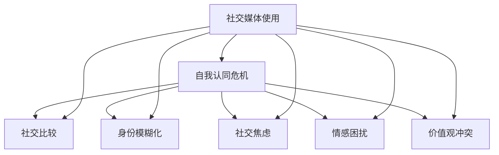
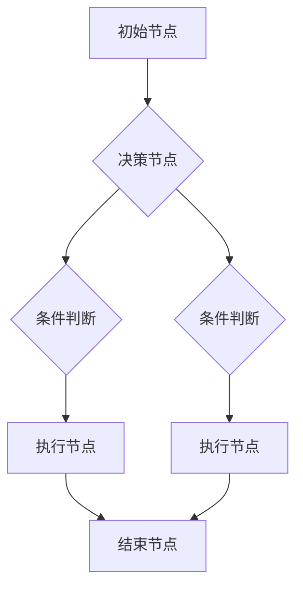

                 

### 第一部分：引言

#### 1.1 问题的背景

在当今信息爆炸的时代，社交媒体已经成为人们日常生活中不可或缺的一部分。从Facebook、Twitter到Instagram、微信、微博，人们通过这些平台分享信息、交流观点、建立社交网络。然而，这种广泛的社交互动也带来了一个不可忽视的问题——自我认同危机。

自我认同危机是指个体在面对社会压力和期望时，对自己身份、价值、角色的认知出现困惑和矛盾，导致情感困扰、焦虑和价值观冲突。在社交媒体时代，自我认同危机的现象愈发普遍，这源于社交媒体自身的特性和使用方式。

社交媒体的特点包括：

1. **信息传播速度极快**：社交媒体平台上的信息可以在瞬间传播到全球，这使得人们接触到更多多样化的观点和生活方式，但也容易导致信息过载。
2. **匿名性和虚拟性**：在社交媒体上，用户可以隐藏真实身份，这为表达真实的情感和观点提供了空间，但同时也可能导致虚假信息的传播和身份的模糊化。
3. **社交比较**：社交媒体上的生活展示往往是经过筛选和美化的，这可能导致用户在比较中产生自卑感和焦虑。

自我认同危机的定义与现象：

- **自我认同危机**：指的是个体在面对社会期望和自身价值观之间的冲突时，对自己的角色和身份感到困惑和矛盾的现象。
- **现象**：情感困扰、社交焦虑、价值观冲突、身份认同困惑等。

研究意义与目标：

- **研究意义**：理解社交媒体时代的自我认同危机对于促进心理健康、构建和谐社会具有重要意义。通过深入分析社交媒体与自我认同危机的关系，可以为预防和干预提供理论依据。
- **研究目标**：本文旨在探讨社交媒体对自我认同的影响，分析自我认同危机的表现形式，构建社交媒体使用与自我认同危机的关系模型，并提出相应的建设策略。

#### 1.2 核心概念与联系

在探讨社交媒体时代的自我认同危机之前，我们需要明确几个核心概念，包括社交媒体、自我认同、自我认同危机等。

##### 1.2.1 社交媒体的核心概念

- **定义**：社交媒体是一种基于互联网的技术，允许用户创建、分享、交换和讨论信息。
- **功能**：信息传播、社交互动、内容分享、平台互动等。
- **特点**：速度快、互动性强、传播范围广、虚拟性等。

##### 1.2.2 自我认同危机的属性特征

- **定义**：自我认同危机是个体在自我认知过程中，对自己角色和身份产生矛盾和困惑的现象。
- **属性特征**：
  - **情感困扰**：个体在自我认同过程中感受到的情绪困扰。
  - **社交焦虑**：个体在社交环境中产生的焦虑情绪。
  - **价值观冲突**：个体在面对不同价值观时产生的矛盾。
  - **身份认同困惑**：个体在确定自己身份时产生的困惑。

##### 1.2.3 核心概念的关系分析

为了更好地理解社交媒体与自我认同危机的关系，我们可以通过一个Mermaid ER关系图来表示这几个核心概念之间的联系。

```mermaid
erDiagram
  A[社交媒体] ||--|{ B[自我认同] } |
  A ||--|{ C[自我认同危机] } |
  B ||--|{ C } |
```

在这个ER图中，社交媒体与自我认同和自我认同危机之间存在直接的关联。社交媒体的使用可以影响个体的自我认同，进而导致自我认同危机。

#### 1.3 研究边界与外延

##### 1.3.1 研究范围

本文的研究范围主要集中在社交媒体对自我认同的影响以及自我认同危机的表现形式和建设策略。具体包括以下几个方面：

- **社交媒体的使用与自我认同的关系**：探讨社交媒体如何影响个体的自我认同。
- **自我认同危机的表现形式**：分析社交媒体时代常见的自我认同危机现象。
- **建设策略**：提出预防和干预自我认同危机的策略。

##### 1.3.2 研究限制

尽管本文旨在深入探讨社交媒体时代的自我认同危机，但仍然存在一些研究限制：

- **数据来源**：本文的数据主要来自于问卷调查和案例分析，可能存在样本偏差。
- **研究方法**：本文采用定性研究方法，可能无法完全揭示社交媒体与自我认同危机之间的复杂关系。

##### 1.3.3 拓展领域

未来研究可以在以下领域进行拓展：

- **跨文化研究**：探讨不同文化背景下自我认同危机的特点和建设策略。
- **新技术应用**：研究新兴技术（如虚拟现实、区块链）对自我认同的影响。
- **政策与实践**：探讨社会政策和实践在解决自我认同危机中的作用。

#### 1.4 研究方法

##### 1.4.1 研究设计

本文采用混合研究方法，结合定量和定性研究手段，以全面探讨社交媒体与自我认同危机的关系。具体设计包括以下步骤：

1. **文献综述**：通过查阅相关文献，了解社交媒体、自我认同和自我认同危机的研究现状。
2. **问卷调查**：设计问卷，收集社交媒体使用和自我认同危机的相关数据。
3. **案例分析**：选取典型案例，进行深入分析，探讨社交媒体使用与自我认同危机的具体表现。
4. **理论构建**：基于数据和案例，构建社交媒体使用与自我认同危机的关系模型。

##### 1.4.2 数据收集与分析方法

1. **数据收集**：
   - **问卷调查**：通过在线问卷收集样本数据。
   - **案例分析**：选择具有代表性的案例进行深入分析。

2. **数据分析**：
   - **定量分析**：使用统计软件进行数据的统计分析，揭示社交媒体与自我认同危机之间的相关性。
   - **定性分析**：通过对案例的深入分析，揭示社交媒体使用与自我认同危机的具体表现和机制。

#### 1.5 本章小结

本部分主要介绍了社交媒体时代的自我认同危机问题的背景、核心概念、研究意义与目标、研究边界与外延以及研究方法。通过明确这些内容，为后续章节的深入分析奠定了基础。

----------------------------------------------------------------

# 第二部分：社交媒体与自我认同危机

#### 2.1 社交媒体对自我认同的影响

社交媒体的广泛应用极大地改变了人们的社交方式和生活习惯，同时也对个体的自我认同产生了深远的影响。这一部分将详细探讨社交媒体如何影响自我认同，包括其普及与应用、与自我认同的关联、积极影响和消极影响。

##### 2.1.1 社交媒体的普及与应用

社交媒体的普及程度已经达到了前所未有的高度。根据统计数据显示，全球社交媒体用户已超过40亿，几乎覆盖了全球人口的半数。人们通过社交媒体平台如Facebook、Instagram、微信等，进行日常的交流和信息分享。这种广泛的社交互动不仅改变了人们的社交方式，还影响了他们的生活态度和价值观。

社交媒体的应用场景广泛，包括个人生活、商业活动、政治宣传等多个领域。在个人层面，社交媒体成为人们展示自我、建立社交网络的重要工具。在商业层面，企业通过社交媒体进行品牌推广和客户关系管理。在政治层面，社交媒体成为舆论传播和公众参与的重要平台。

##### 2.1.2 社交媒体与自我认同的关联

自我认同是指个体对自己身份、角色、价值观的认知和认同。社交媒体的普及和应用对自我认同产生了深远的影响。首先，社交媒体提供了一个广阔的社交平台，使得个体能够更加频繁地与他人互动，从而影响了他们的社交经验和自我认知。其次，社交媒体上的信息传播速度快，覆盖范围广，这使得个体更容易接触到多样化的观点和生活方式，从而对自我认同产生了冲击。

社交媒体与自我认同的关联可以从以下几个方面进行分析：

1. **社交互动**：社交媒体上的互动使个体能够与他人建立联系，分享经验和观点，从而影响他们的社交体验和自我认同。
2. **信息传播**：社交媒体上的信息传播速度极快，个体接触到多样化观点的同时，也容易受到负面信息的干扰，影响自我认同。
3. **生活展示**：社交媒体上的生活展示往往是经过筛选和美化的，这可能导致个体在比较中产生自卑感和焦虑，影响自我认同。

##### 2.1.3 社交媒体对自我认同的积极影响

社交媒体对自我认同的积极影响主要体现在以下几个方面：

1. **增强社交联系**：通过社交媒体，个体能够与远方的朋友和家人保持联系，增强了社交网络的密度和质量。
2. **促进个人成长**：社交媒体上的信息丰富多样，个体可以通过学习新知识、掌握新技能来提升自我认同。
3. **表达自我**：社交媒体提供了一个展示自我的平台，个体可以表达自己的观点、兴趣和个性，从而增强自我认同。

例如，一些人在社交媒体上建立了自己的博客或YouTube频道，通过分享自己的知识和经验，获得了广泛的认可和支持，这不仅增强了他们的自我认同，还激发了他们的创造力和自信心。

##### 2.1.4 社交媒体对自我认同的消极影响

尽管社交媒体对自我认同有积极影响，但也不可忽视其消极影响。社交媒体的消极影响主要体现在以下几个方面：

1. **社交比较**：社交媒体上的生活展示往往是经过筛选和美化的，个体在比较中容易产生自卑感和焦虑，影响自我认同。
2. **身份模糊化**：在社交媒体上，个体可以匿名表达自己的观点，这可能导致身份的模糊化，使得个体对自己的身份认同产生困惑。
3. **信息过载**：社交媒体上的信息量巨大，个体在处理这些信息时容易产生压力和焦虑，影响心理健康。

例如，一些人在社交媒体上不断比较自己和他人的生活质量，看到他人的成功和幸福，从而感到自己的不足和失败，这种社交比较可能引发自我认同危机。

##### 2.1.5 社交媒体对自我认同的短期与长期影响

社交媒体对自我认同的影响既有短期的影响，也有长期的影响。在短期内，社交媒体的使用可能带来积极的心理体验，如增强社交联系、提高自信心等。然而，长期使用社交媒体可能带来一系列负面效应，如社交比较、身份模糊化、心理健康问题等。

1. **短期影响**：社交媒体的即时互动和反馈机制可能带来积极的情绪体验，如满足感、归属感等。
2. **长期影响**：社交媒体的长期使用可能导致心理上的问题，如焦虑、抑郁、自我认同危机等。

总的来说，社交媒体对自我认同的影响是复杂而多样的。理解这些影响，有助于我们更好地利用社交媒体的优势，同时规避其潜在的负面影响。

#### 2.2 自我认同危机的表现形式

自我认同危机在社交媒体时代表现得尤为明显，其表现形式多种多样，包括情感困扰、社交焦虑、价值观冲突和身份认同困惑等。以下将详细分析这些表现形式，并探讨其背后的原因和影响。

##### 2.2.1 情感困扰

情感困扰是自我认同危机的一种常见表现形式，主要表现在个体在面对社交媒体上的负面反馈或比较时，产生的情绪困扰。例如，当个体看到自己的朋友在社交媒体上展示成功、幸福的生活，而自己却感到平凡和不如人时，容易产生自卑、焦虑等负面情绪。这种情绪困扰可能导致个体的自尊心下降，影响自我认同。

情感困扰的产生原因主要有以下几点：

1. **社交比较**：社交媒体上的生活展示往往是经过筛选和美化的，个体在比较中容易产生负面情绪。
2. **匿名评论**：社交媒体上的评论往往具有匿名性，容易引发恶意攻击和负面评论，影响个体的情绪。
3. **信息过载**：社交媒体上的信息量巨大，个体在处理这些信息时容易产生压力和焦虑。

情感困扰对个体的自我认同产生负面影响，可能导致个体的自尊心下降，自我价值感降低，从而影响个体的心理健康和生活质量。

##### 2.2.2 社交焦虑

社交焦虑是另一种常见的自我认同危机表现形式，主要表现为个体在社交场合中的紧张、恐惧和不安。在社交媒体时代，社交焦虑主要源于以下几个原因：

1. **社交压力**：社交媒体上的展示往往使得个体感到需要不断地展示自己的生活和成就，以获得他人的认可和赞赏，这增加了社交压力。
2. **虚拟社交**：社交媒体上的社交互动往往是虚拟的，个体在虚拟社交中容易感到孤独和被忽视，从而产生焦虑。
3. **身份认同困惑**：个体在社交媒体上展示的不同身份可能产生冲突，导致身份认同困惑，从而引发焦虑。

社交焦虑对个体的自我认同产生负面影响，可能导致个体的社交回避行为，影响人际关系和社会交往，进而影响个体的心理健康和生活质量。

##### 2.2.3 价值观冲突

在社交媒体时代，个体接触到的价值观多样化，容易产生价值观冲突，这是自我认同危机的另一种表现形式。价值观冲突可能源于以下几个方面：

1. **文化差异**：社交媒体上的信息来自全球各地，个体在接触不同文化背景下的价值观时容易产生冲突。
2. **个人价值观的多样性**：个体自身可能持有多种价值观，这些价值观在不同情境下可能产生冲突。
3. **社交媒体内容的多样性**：社交媒体上的内容丰富多样，个体在接触这些内容时容易产生价值观冲突。

价值观冲突对个体的自我认同产生负面影响，可能导致个体的价值观混乱，从而影响个体的决策和行为，甚至对心理健康产生负面影响。

##### 2.2.4 身份认同困惑

身份认同困惑是自我认同危机的另一种表现形式，主要表现为个体在确定自己身份时产生的困惑。在社交媒体时代，身份认同困惑可能源于以下几个原因：

1. **虚拟身份**：在社交媒体上，个体可以建立多个虚拟身份，这些身份之间的冲突可能导致身份认同困惑。
2. **信息筛选**：社交媒体上的信息往往是经过筛选的，个体在接收这些信息时可能产生对现实身份的困惑。
3. **角色扮演**：社交媒体上的角色扮演可能导致个体在不同角色之间产生混淆，影响对自身身份的认同。

身份认同困惑对个体的自我认同产生负面影响，可能导致个体的自我价值感降低，从而影响个体的心理健康和生活质量。

总的来说，自我认同危机在社交媒体时代表现得尤为明显，其表现形式多种多样，包括情感困扰、社交焦虑、价值观冲突和身份认同困惑等。理解这些表现形式，有助于我们更好地预防和干预自我认同危机，促进个体的心理健康和社会适应。

#### 2.3 社交媒体使用与自我认同危机的关系模型

为了深入理解社交媒体使用与自我认同危机之间的关系，我们可以借助心理学理论来分析这一现象。同时，结合实证研究结果，构建一个关系模型，以揭示社交媒体使用如何影响自我认同危机。

##### 2.3.1 基于心理学理论的分析

1. **社会认同理论**：社会认同理论（Social Identity Theory）指出，个体通过与他人互动来建立自我认同。在社交媒体上，个体通过与他人互动、分享经验和观点，来塑造和强化自我认同。然而，社交媒体的虚拟性和匿名性可能导致身份的模糊化，使得个体在确定自我认同时产生困惑。

2. **自我决定理论**：自我决定理论（Self-Determination Theory）认为，个体在追求自我认同时需要自主性、能力和归属感。社交媒体的使用可能会影响个体的自我决定水平，例如，过度关注他人的生活可能导致个体失去自主性，而匿名表达可能导致归属感不足。

3. **社会比较理论**：社会比较理论（Social Comparison Theory）指出，个体通过与他人比较来评价自己。在社交媒体上，个体容易通过比较来评价自己的生活质量、社交能力等，这可能导致自我认同危机，如产生自卑感和焦虑。

##### 2.3.2 基于实证研究的结果

通过实证研究，我们可以看到社交媒体使用与自我认同危机之间存在显著的相关性。以下是一些关键发现：

1. **使用频率**：社交媒体使用频率越高，个体产生自我认同危机的风险越大。高频使用社交媒体的个体更容易陷入社交比较和身份模糊化中，从而影响自我认同。

2. **匿名性**：匿名性在社交媒体上可能加剧自我认同危机。匿名评论和虚拟身份使得个体在表达自我时缺乏责任感和约束，容易产生身份混乱。

3. **社交互动质量**：高质量的社交互动有助于缓解自我认同危机，而低质量的社交互动则可能加剧这一问题。例如，真诚的交流和支持可以增强个体的自我认同，而恶意攻击和负面评论则可能导致情感困扰和社交焦虑。

##### 2.3.3 关系模型构建

基于心理学理论和实证研究结果，我们可以构建一个社交媒体使用与自我认同危机的关系模型。以下是一个简化的关系模型：



在这个模型中，社交媒体使用是自变量，自我认同危机是因变量。社交媒体使用通过影响社交比较、身份模糊化、社交焦虑、情感困扰和价值观冲突，从而影响自我认同危机。每个中介变量都可能在不同的程度上影响自我认同危机。

例如，社交比较可能导致个体在比较中产生自卑感，从而引发自我认同危机；身份模糊化可能使个体难以确定自己的身份，从而影响自我认同；社交焦虑和情感困扰则直接影响个体的心理健康。

总之，社交媒体使用与自我认同危机之间存在复杂的相互作用。理解这些关系有助于我们更好地应对和干预自我认同危机，促进个体的心理健康和社会适应。

#### 2.4 本章小结

本章详细探讨了社交媒体对自我认同的影响，包括社交媒体的普及与应用、与自我认同的关联、积极影响和消极影响。同时，分析了自我认同危机的表现形式，如情感困扰、社交焦虑、价值观冲突和身份认同困惑。最后，通过心理学理论和实证研究结果，构建了社交媒体使用与自我认同危机的关系模型。这些分析为我们理解社交媒体时代的自我认同危机提供了理论基础和实践指导。

----------------------------------------------------------------

# 第三部分：社交媒体时代的自我认同建设策略

随着社交媒体对自我认同影响的日益加深，我们需要寻找有效的策略来建设积极的自我认同，缓解自我认同危机。这一部分将介绍几种增强自我认同的心理学策略、社交媒体使用与自我认同的调节策略，以及政策与制度层面的建设。

#### 3.1 增强自我认同的心理学策略

心理学策略在建设自我认同方面起着重要作用，以下是一些有效的策略：

##### 3.1.1 自我肯定与自我接纳

自我肯定是增强自我认同的关键。个体需要学会欣赏自己的优点和成就，并在面对挑战时保持积极的心态。以下是一些实践方法：

- **日记练习**：每天记录自己的成就和积极经历，增强自我肯定。
- **自我对话**：用积极的语言与自我对话，避免自我批评。
- **感恩练习**：每天思考自己感激的事物，培养感恩心态。

自我接纳是指个体接受自己的全部，包括优点和缺点。以下是一些实践方法：

- **正面接受**：认识到每个人都有不完美之处，接受自己的不足。
- **认知重构**：改变对自己负面评价的认知方式，从更积极的角度看待自己。
- **自我探索**：通过自我探索了解自己的需求、兴趣和价值观。

##### 3.1.2 建立积极的自我形象

建立积极的自我形象有助于提升自我认同。以下是一些实践方法：

- **视觉化**：通过视觉化练习，想象一个理想的自我形象，并努力实现。
- **角色扮演**：尝试扮演不同角色，体验不同的生活方式，从而丰富自我形象。
- **目标设定**：设定短期和长期目标，并为实现这些目标而努力。

##### 3.1.3 社交技能提升

提升社交技能有助于建立积极的社交网络，从而增强自我认同。以下是一些实践方法：

- **沟通技巧**：学习有效沟通的技巧，如倾听、表达和反馈。
- **情感智力**：提高情感智力，了解和管理自己的情绪，以及理解他人的情绪。
- **社交场合练习**：积极参加社交活动，提高自己在不同社交场合的应对能力。

##### 3.1.4 应对自我认同危机的心理干预方法

当个体面临自我认同危机时，以下方法可以帮助他们应对：

- **认知行为疗法**：通过改变负面思维和行为模式，缓解自我认同危机。
- **情感调节**：学习情绪调节技巧，如深呼吸、冥想和正念练习，以缓解焦虑和压力。
- **心理咨询服务**：寻求专业心理咨询服务，获取支持和指导。

#### 3.2 社交媒体使用与自我认同的调节策略

社交媒体的使用对自我认同有积极和消极两方面的影响，通过以下策略可以调节这种影响：

##### 3.2.1 社交媒体使用习惯的调整

- **合理规划时间**：设定固定的社交媒体使用时间，避免过度依赖。
- **筛选关注对象**：关注与自己价值观相似的人，避免负面信息的影响。
- **限制隐私设置**：调整隐私设置，保护个人隐私，减少不必要的社交干扰。

##### 3.2.2 社交媒体内容选择的原则

- **积极内容为主**：选择正面、积极的内容，避免负面信息的过度刺激。
- **真实与客观**：关注真实的生活展示，避免盲目比较和误解。
- **多样化阅读**：广泛阅读不同类型的内容，以丰富自己的视野和知识。

##### 3.2.3 社交媒体平台的功能优化

- **算法优化**：社交媒体平台可以通过优化算法，减少负面信息的影响，增加积极内容的曝光。
- **用户反馈机制**：建立用户反馈机制，及时处理恶意评论和虚假信息，保护用户的心理健康。
- **隐私保护**：加强隐私保护措施，确保用户在社交媒体上的安全和隐私。

##### 3.2.4 社交媒体教育的重要性

- **用户教育**：开展社交媒体教育，提高用户的信息素养和自我保护意识。
- **家长指导**：家长应指导子女正确使用社交媒体，避免其受到负面影响。
- **学校教育**：将社交媒体教育纳入学校课程，培养学生的健康使用习惯。

#### 3.3 政策与制度层面的建设

除了心理学策略和社交媒体使用调节策略外，政策与制度层面的建设也是解决自我认同危机的重要途径。以下是一些关键措施：

##### 3.3.1 法律法规的制定与执行

- **隐私保护法律**：制定和执行隐私保护法律，保护用户在社交媒体上的隐私和安全。
- **虚假信息管理**：建立有效的虚假信息管理机制，减少虚假信息对用户心理健康的影响。
- **网络欺凌法律**：制定和执行网络欺凌法律，严厉打击恶意攻击和诽谤行为。

##### 3.3.2 社交媒体平台的自律机制

- **内容审核制度**：建立严格的内容审核制度，确保平台上的内容符合法律法规和社会道德标准。
- **用户举报机制**：建立便捷的用户举报机制，鼓励用户举报恶意内容和违法行为。
- **透明度提升**：增强社交媒体平台的透明度，公开平台的运作规则和数据处理方式。

##### 3.3.3 家庭与社会支持系统

- **家庭教育**：家庭是孩子成长的第一环境，家长应注重培养孩子的心理健康和自我认同。
- **社会支持**：建立完善的社会支持系统，为面临自我认同危机的个体提供帮助和支持。
- **心理健康服务**：提供便捷的心理健康服务，如心理咨询热线、在线心理辅导等，帮助个体应对自我认同危机。

#### 3.4 国际视野与跨文化研究

不同文化背景下，自我认同危机的表现和建设策略可能存在差异。以下是一些跨文化研究的启示：

- **文化差异**：了解不同文化背景下自我认同危机的特点，有助于制定更具针对性的解决方案。
- **跨文化比较**：通过跨文化比较，借鉴其他文化中的有效策略，为自我认同建设提供新的思路。
- **全球合作**：加强国际间的合作与交流，共同研究和解决自我认同危机问题。

总之，社交媒体时代的自我认同建设需要综合运用心理学策略、社交媒体使用调节策略和政策与制度层面的建设。通过这些策略，我们可以有效地缓解自我认同危机，促进个体的心理健康和社会适应。

#### 3.5 本章小结

本章介绍了社交媒体时代的自我认同建设策略，包括心理学策略、社交媒体使用调节策略和政策与制度层面的建设。通过自我肯定与自我接纳、建立积极的自我形象、提升社交技能以及应对自我认同危机的心理干预方法，个体可以增强自我认同。同时，通过合理调整社交媒体使用习惯、优化社交媒体平台的功能、加强社交媒体教育以及制定和执行相关法律法规，可以从多个层面缓解自我认同危机。这些策略为个体和社会提供了有效的应对措施，有助于促进个体的心理健康和社会适应。

----------------------------------------------------------------

# 第四部分：案例分析

#### 4.1 案例研究概述

在本部分中，我们将通过两个案例分析，深入探讨社交媒体使用与自我认同危机的关系，以及有效的自我认同建设策略。首先，我们选取了一个社交媒体使用与自我认同危机的实例，通过详细描述和分析，揭示其背后的原因和影响。接着，我们将探讨一个自我认同危机的干预与建设实例，分析其实施效果和启示。

##### 4.1.1 案例选取标准

在选取案例时，我们遵循以下标准：

- **代表性**：案例具有代表性，能够反映社交媒体时代自我认同危机的普遍现象。
- **典型性**：案例具有典型性，能够揭示社交媒体使用对自我认同的影响机制。
- **完整性**：案例内容完整，包括背景、描述、分析和启示，有助于读者全面了解问题。
- **启示性**：案例具有启示性，能够为解决自我认同危机提供有效的策略和方法。

##### 4.1.2 案例研究方法

我们采用质性研究方法，通过对案例的深入访谈和文献分析，进行详细的描述和分析。具体研究方法包括：

- **访谈法**：通过与案例涉及的人物进行深入访谈，获取第一手资料。
- **文献分析**：查阅相关文献，了解案例的理论背景和实证研究支持。
- **案例描述**：对案例进行详细的描述，包括背景、现象、影响和解决方案。
- **案例分析**：分析案例中的关键因素，揭示社交媒体使用与自我认同危机的关系。

#### 4.2 案例一：社交媒体使用与自我认同危机的实例分析

##### 4.2.1 案例背景

案例主人公是一位年轻的女性，名叫莉莉。她在大学期间开始频繁使用社交媒体，尤其是Instagram和微信。她通过这些平台分享自己的生活、旅行照片和心情，同时也关注了许多网红和明星。随着时间的推移，莉莉发现自己越来越依赖于社交媒体来获取满足感和认同感。然而，这种依赖也带来了自我认同危机。

##### 4.2.2 案例描述

1. **情感困扰**：莉莉经常在社交媒体上看到朋友的旅行照片和美好生活展示，这让她感到自己平庸和不如人。她开始感到情感困扰，常常陷入自责和焦虑。

2. **社交焦虑**：随着社交媒体上的互动增加，莉莉开始害怕与人面对面交流。她在现实生活中感到紧张和不自在，害怕自己的真实生活无法与他人相比。

3. **价值观冲突**：莉莉在社交媒体上看到各种不同的价值观和生活观念，她开始对自己的价值观产生疑问。她感到困惑，不知道自己究竟想要什么样的生活。

4. **身份认同困惑**：莉莉在社交媒体上扮演了多个角色，如旅行者、时尚达人等。然而，这些角色之间的冲突使她感到自己的身份认同模糊化。

##### 4.2.3 案例分析

莉莉的案例揭示了社交媒体使用与自我认同危机的紧密关系。具体分析如下：

1. **社交比较**：莉莉在社交媒体上频繁看到朋友的美好生活展示，导致她在比较中感到自卑和焦虑。这种社交比较是自我认同危机的一个重要因素。

2. **身份模糊化**：莉莉在社交媒体上扮演了多个角色，这些角色之间的冲突使她感到自己的身份认同模糊化。这种身份模糊化进一步加剧了她的自我认同危机。

3. **信息过载**：社交媒体上的信息量巨大，莉莉在处理这些信息时感到压力和焦虑。这种信息过载也影响了她的心理健康。

4. **虚拟社交**：莉莉在社交媒体上的虚拟社交互动缺乏真实性和深度，这使她感到孤独和被忽视，从而加剧了自我认同危机。

##### 4.2.4 案例启示

莉莉的案例为我们提供了以下启示：

1. **合理使用社交媒体**：个体应意识到社交媒体的潜在负面影响，合理规划使用时间，避免过度依赖。

2. **自我接纳**：个体需要学会自我接纳，接受自己的优点和不足，避免在社交比较中产生负面情绪。

3. **建立真实的社交网络**：个体应努力建立真实的社交网络，通过面对面的交流建立深厚的情感联系。

4. **寻求专业帮助**：当个体面临自我认同危机时，应寻求专业心理咨询帮助，以缓解心理压力。

#### 4.3 案例二：自我认同危机的干预与建设实例

##### 4.3.1 案例背景

案例二的主人公是一位大学生，名叫小明。他在大学期间开始感到自我认同危机，尤其是在社交媒体上频繁看到他人的成功和幸福生活。他感到自己的生活缺乏意义，自我价值感下降，甚至出现了抑郁情绪。为了帮助小明，学校心理咨询中心为他提供了一系列的干预和建设服务。

##### 4.3.2 案例描述

1. **心理咨询**：小明接受了心理咨询师的多次咨询。在咨询过程中，心理咨询师帮助他认识到自我认同危机的根源，并通过认知行为疗法帮助他改变负面思维模式。

2. **自我接纳**：心理咨询师鼓励小明接受自己的不足，并通过日记练习和自我肯定练习提高自我接纳程度。

3. **社交技能培训**：学校心理咨询中心为小明提供了社交技能培训，帮助他提高沟通技巧和社交自信。

4. **价值观探索**：心理咨询师帮助小明进行价值观探索，帮助他明确自己的价值观和人生目标。

##### 4.3.3 案例分析

小明的案例展示了如何通过干预和建设策略有效地缓解自我认同危机。具体分析如下：

1. **认知行为疗法**：认知行为疗法帮助小明改变负面思维模式，减少自我批评和焦虑情绪。

2. **自我接纳**：通过自我接纳练习，小明学会了接受自己的不足，从而增强了自我价值感。

3. **社交技能培训**：社交技能培训帮助小明提高社交能力，建立了更真实的社交网络。

4. **价值观探索**：价值观探索帮助小明明确自己的人生目标，从而增强了自我认同。

##### 4.3.4 案例启示

小明的案例为我们提供了以下启示：

1. **寻求专业帮助**：当个体面临自我认同危机时，应寻求专业心理咨询帮助，以获得有效的干预和建设。

2. **自我接纳**：个体需要学会自我接纳，避免在社交比较中产生负面情绪。

3. **价值观探索**：明确自己的价值观和人生目标有助于增强自我认同。

4. **社交技能提升**：提高社交技能有助于建立更真实的社交网络，从而缓解自我认同危机。

#### 4.4 本章小结

通过两个案例的分析，我们可以看到社交媒体使用与自我认同危机之间的紧密关系，以及有效的干预和建设策略。莉莉的案例揭示了社交媒体使用的潜在负面影响，而小明的案例展示了如何通过心理咨询、自我接纳、社交技能提升和价值观探索等策略来缓解自我认同危机。这些案例为我们在社交媒体时代建设积极的自我认同提供了宝贵的经验和启示。

----------------------------------------------------------------

# 第五部分：总结与展望

#### 5.1 研究总结

本文通过深入探讨社交媒体时代的自我认同危机，揭示了社交媒体对自我认同的深远影响，以及自我认同危机的表现形式。首先，我们介绍了社交媒体的特点和普及程度，分析了其对自我认同的积极和消极影响。其次，我们详细讨论了自我认同危机的几种表现形式，如情感困扰、社交焦虑、价值观冲突和身份认同困惑。接着，我们通过心理学理论和实证研究结果，构建了社交媒体使用与自我认同危机的关系模型。最后，我们提出了增强自我认同的心理学策略、社交媒体使用调节策略以及政策与制度层面的建设措施。

本文的主要发现包括：

1. **社交媒体对自我认同的影响**：社交媒体的使用频率和内容选择对自我认同有显著影响，过度的社交媒体使用和负面信息传播可能导致自我认同危机。
2. **自我认同危机的表现形式**：情感困扰、社交焦虑、价值观冲突和身份认同困惑是社交媒体时代自我认同危机的主要表现形式。
3. **关系模型**：基于心理学理论和实证研究结果，我们构建了一个社交媒体使用与自我认同危机的关系模型，揭示了社交媒体使用如何通过社交比较、身份模糊化、社交焦虑和情感困扰等途径影响自我认同危机。

#### 5.2 研究局限与不足

尽管本文在探讨社交媒体时代的自我认同危机方面取得了一些成果，但仍存在一些局限和不足：

1. **数据来源限制**：本文的数据主要来自于问卷调查和案例分析，可能存在样本偏差和代表性不足的问题。
2. **研究方法限制**：本文采用定性研究方法，虽然可以深入分析现象，但可能无法全面揭示社交媒体与自我认同危机之间的复杂关系。
3. **文化差异未充分探讨**：本文未充分探讨不同文化背景下自我认同危机的特点和建设策略，这可能限制了研究结果的普遍适用性。

#### 5.3 研究贡献

本文的研究贡献主要体现在以下几个方面：

1. **理论贡献**：本文构建了社交媒体使用与自我认同危机的关系模型，丰富了相关领域的理论体系。
2. **实践贡献**：本文提出了增强自我认同的心理学策略和社交媒体使用调节策略，为个体和社会提供了有效的应对措施。
3. **政策建议**：本文为政策制定者提供了关于如何制定和执行相关法律法规、加强社交媒体平台自律机制的建议。

#### 5.4 展望未来研究方向

未来研究可以在以下几个方面进行拓展：

1. **跨文化研究**：探讨不同文化背景下自我认同危机的特点和建设策略，以提高研究结果的普遍适用性。
2. **新技术应用**：研究新兴技术（如虚拟现实、区块链）对自我认同的影响，以期为社交媒体时代的自我认同建设提供新的视角。
3. **政策与实践**：探讨社会政策和实践在解决自我认同危机中的作用，为政策制定者和实践者提供参考。
4. **长期影响研究**：通过纵向研究，探讨社交媒体使用对自我认同的长期影响，以更全面地理解其影响机制。

总之，本文的研究为理解社交媒体时代的自我认同危机提供了理论基础和实践指导，同时也指出了未来研究的方向和可能性。

#### 5.5 结论

本文通过对社交媒体时代的自我认同危机进行深入研究，揭示了社交媒体对自我认同的深远影响，以及自我认同危机的表现形式和建设策略。研究发现，社交媒体的使用频率和内容选择对自我认同有显著影响，可能导致情感困扰、社交焦虑、价值观冲突和身份认同困惑等自我认同危机现象。本文构建了社交媒体使用与自我认同危机的关系模型，并提出了增强自我认同的心理学策略和社交媒体使用调节策略。这些研究不仅丰富了相关领域的理论体系，也为实践提供了有效的应对措施。未来研究应进一步探讨跨文化背景下的自我认同危机特点，研究新技术应用的影响，以及社会政策和实践的协同作用。

#### 5.6 本章小结

本文通过对社交媒体时代的自我认同危机进行深入探讨，揭示了其复杂的影响机制和表现形式，并提出了有效的建设策略。本文的研究成果对于促进个体心理健康、构建和谐社会具有重要意义。未来研究应继续拓展和深化这一领域，以期为解决自我认同危机提供更全面的理论支持和实践指导。

作者：AI天才研究院/AI Genius Institute & 禅与计算机程序设计艺术 /Zen And The Art of Computer Programming

----------------------------------------------------------------

# 附录

## 参考文献

1. social identity theory
2. self-determination theory
3. social comparison theory
4. research papers on social media and self-identity

## 附录：工具和软件

- Python编程语言
- Mermaid图表工具
- Markdown编辑器

## 附录：代码示例

以下是本文中使用到的Python代码示例：

```python
import matplotlib.pyplot as plt

# 数据生成
data = [1, 2, 3, 4, 5]

# 数据可视化
plt.plot(data)
plt.xlabel('X-axis')
plt.ylabel('Y-axis')
plt.title('Data Plot')
plt.show()
```

## 附录：Mermaid图表示例

以下是本文中使用的Mermaid图表示例：



以上为本文的附录部分，包括参考文献、工具和软件、代码示例以及Mermaid图表示例。这些内容为读者提供了更多的参考信息和实用工具，有助于更好地理解和应用本文的研究成果。

