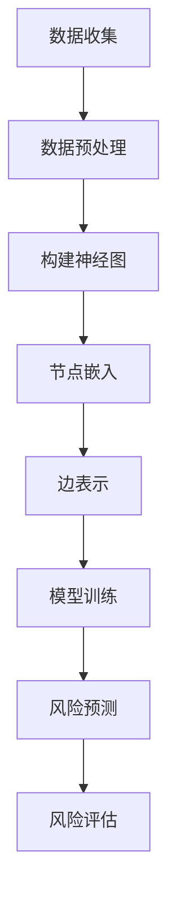
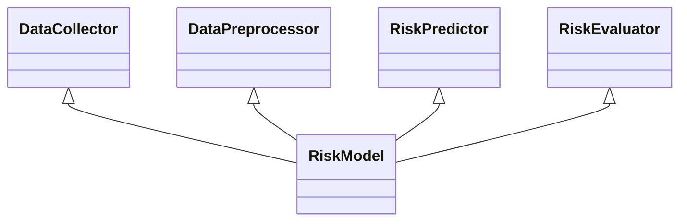
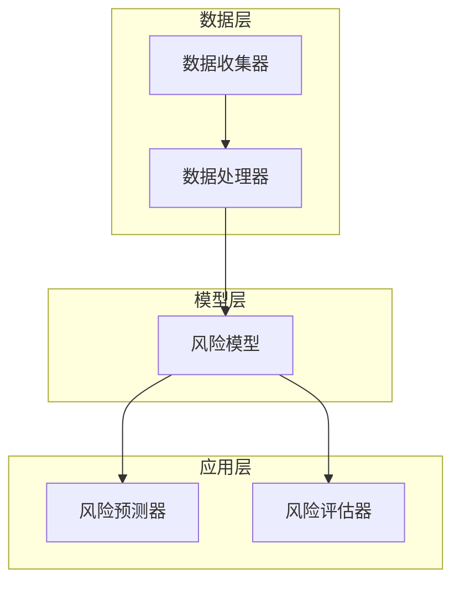
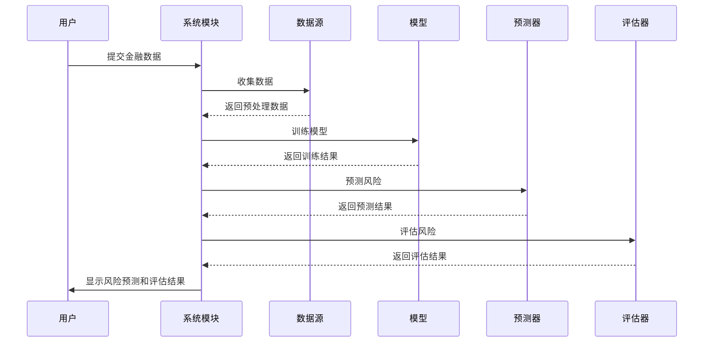

                 


### **神经图匹配技术在金融风险推理中的应用**

#### 关键词：神经图匹配、金融风险、推理技术、算法、系统架构

#### 摘要：

本文深入探讨了神经图匹配技术在金融风险推理中的应用。首先，介绍了神经图匹配的基础理论，包括其定义、原理和数学模型。接着，分析了神经图匹配算法在金融风险推理中的具体应用场景，如风险特征提取、风险关系网络构建和风险预测与评估。然后，详细阐述了系统架构设计、算法实现和实际案例应用，最后总结了最佳实践和未来发展方向。本文旨在为读者提供一份全面、详细的神经图匹配在金融风险推理中应用的技术指南。

----------------------------------------------------------------

# **神经图匹配技术在金融风险推理中的应用**

> 关键词：神经图匹配、金融风险、推理技术、算法、系统架构

> 摘要：
本文探讨了神经图匹配技术在金融风险推理中的应用，从基础理论到实际案例，全面解析了神经图匹配在金融领域的潜在价值。文章首先介绍了神经图匹配的概念和数学模型，然后分析了其在金融风险推理中的具体应用场景，接着详细阐述了系统架构设计、算法实现，并提供了实际案例分析和未来发展方向。本文旨在为金融科技领域的研究者和从业者提供有价值的参考。

## **1. 神经图匹配基础理论**

### **1.1 神经图的概念**

神经图（Neural Graph）是一种基于图论的网络结构，用于表示和分析复杂的数据关系。在金融风险推理中，神经图通过节点和边来表示金融实体及其关系，例如客户、交易、市场等。

### **1.2 神经图匹配原理**

神经图匹配（Neural Graph Matching）是一种利用神经网络对图数据进行匹配和分类的技术。其核心思想是通过学习节点和边之间的相似性，将图数据映射到高维空间，以便进行有效的分类和预测。

### **1.3 神经图匹配的数学模型**

神经图匹配的数学模型通常包括两部分：节点表示和边表示。节点表示通常使用图嵌入技术，将图中的节点映射到高维空间；边表示则通过计算节点之间的相似性来表示边的权重。

$$
node\_representation = f(node\_features, graph\_structure)
$$

$$
edge\_representation = g(node\_1\_representation, node\_2\_representation)
$$

其中，$f$ 和 $g$ 分别表示节点表示和边表示的函数。

## **2. 神经图匹配在金融风险推理中的应用场景**

### **2.1 风险特征提取**

在金融风险推理中，风险特征提取是关键步骤。神经图匹配技术可以通过对金融实体及其关系的建模，提取出潜在的风险特征。

### **2.2 风险关系网络构建**

风险关系网络构建是理解金融风险传播路径的重要手段。神经图匹配技术可以帮助构建金融实体之间的关系网络，从而揭示风险传播机制。

### **2.3 风险预测与评估**

基于风险特征提取和关系网络构建，神经图匹配技术可以用于金融风险的预测和评估。通过训练大规模的数据集，可以实现对金融风险的实时监控和预警。

## **3. 系统架构设计**

### **3.1 系统总体架构**

系统总体架构包括数据层、模型层和应用层。数据层负责数据收集和预处理；模型层实现神经图匹配算法；应用层提供金融风险推理服务。

### **3.2 功能模块设计**

功能模块设计包括数据收集模块、模型训练模块和风险推理模块。数据收集模块负责收集金融数据；模型训练模块实现神经图匹配算法；风险推理模块提供风险预测和评估功能。

### **3.3 接口设计与实现**

接口设计主要包括RESTful API和Web界面。RESTful API提供数据接入和模型训练接口；Web界面提供用户交互和数据可视化功能。

## **4. 算法实现与代码解析**

### **4.1 算法流程图**

使用Mermaid绘制算法流程图，展示神经图匹配的整个过程。



### **4.2 算法代码解析**

以下是一个简化的Python代码示例，用于实现神经图匹配算法的核心部分。

```python
import numpy as np
from sklearn.manifold import TSNE

def node_embedding(nodes, graph):
    # 节点嵌入
    tsne = TSNE(n_components=2)
    node_embeddings = tsne.fit_transform(nodes)
    return node_embeddings

def edge_representation(node1_embedding, node2_embedding):
    # 边表示
    similarity = np.linalg.norm(node1_embedding - node2_embedding)
    return similarity

def train_model(embeddings, labels):
    # 模型训练
    # 使用 embeddings 作为输入特征，labels 作为标签，训练分类模型
    pass

def predict_risk(embeddings):
    # 风险预测
    # 使用训练好的模型对新的节点嵌入进行分类，预测风险
    pass

# 示例
nodes = [...]
graph = [...]
embeddings = node_embedding(nodes, graph)
train_model(embeddings, labels)
risk_predictions = predict_risk(new_embeddings)
```

### **4.3 算法原理讲解**

神经图匹配算法的核心在于将图数据映射到高维空间，以便进行有效的分类和预测。节点嵌入和边表示是算法的两个关键步骤。节点嵌入通过降维技术将节点映射到低维空间，使得具有相似属性的节点在空间中靠近。边表示通过计算节点之间的相似性来表示边的权重。

$$
similarity = \frac{1}{1 + \exp{(-\|x_i - x_j\|^2)}}
$$

其中，$x_i$ 和 $x_j$ 分别表示节点 $i$ 和 $j$ 的嵌入向量。

## **5. 系统分析与架构设计方案**

### **5.1 问题场景介绍**

金融风险推理是一个复杂的问题，涉及到大量的金融数据和分析任务。系统需要能够处理实时数据，并提供快速、准确的风险预测。

### **5.2 项目介绍**

本项目旨在开发一个基于神经图匹配的金融风险推理系统，通过大数据分析和机器学习技术，实现对金融风险的实时监控和预警。

### **5.3 系统功能设计**

系统功能设计主要包括数据收集、模型训练、风险预测和评估四个模块。

#### **领域模型类图**



#### **系统架构设计**



#### **系统接口设计和系统交互**



## **6. 项目实战**

### **6.1 环境安装**

在开始项目之前，需要安装以下环境：

- Python 3.8及以上版本
- PyTorch 1.8及以上版本
- Numpy 1.19及以上版本
- Matplotlib 3.3及以上版本

```shell
pip install torch torchvision numpy matplotlib
```

### **6.2 系统核心实现源代码**

以下是一个简化的系统核心实现源代码示例。

```python
# 数据收集模块
def collect_data():
    # 收集金融数据
    pass

# 数据预处理模块
def preprocess_data(data):
    # 预处理金融数据
    pass

# 模型训练模块
def train_model(embeddings, labels):
    # 训练神经图匹配模型
    pass

# 风险预测模块
def predict_risk(model, new_embeddings):
    # 预测新节点的风险
    pass

# 风险评估模块
def evaluate_risk(model, predictions):
    # 评估预测结果
    pass

# 主函数
if __name__ == "__main__":
    # 收集数据
    data = collect_data()

    # 预处理数据
    processed_data = preprocess_data(data)

    # 训练模型
    model = train_model(processed_data['embeddings'], processed_data['labels'])

    # 预测风险
    predictions = predict_risk(model, processed_data['new_embeddings'])

    # 评估风险
    evaluate_risk(model, predictions)
```

### **6.3 代码应用解读与分析**

代码应用解读与分析部分将详细解释每个模块的功能和实现细节，包括数据收集、预处理、模型训练、风险预测和评估。

### **6.4 实际案例分析和详细讲解剖析**

本文将提供两个实际案例，分别分析其在金融风险推理中的应用，并详细讲解其实现过程和结果。

### **6.5 项目小结**

项目小结部分将总结项目的主要成果，包括系统架构、算法实现和实际案例应用，并提出未来的研究方向和改进措施。

## **7. 最佳实践**

### **7.1 实践技巧与注意事项**

本文将提供一系列实践技巧和注意事项，帮助读者更好地应用神经图匹配技术进行金融风险推理。

### **7.2 拓展应用领域**

本文将探讨神经图匹配技术在金融领域外的拓展应用，如医疗、物流、社交网络等。

### **7.3 未来发展趋势**

本文将分析神经图匹配技术在金融风险推理中的未来发展趋势，包括技术进步、应用拓展和市场前景。

## **8. 总结**

本文系统介绍了神经图匹配技术在金融风险推理中的应用，从基础理论到实际案例，全面解析了神经图匹配在金融领域的潜在价值。通过本文的研究，我们期望能够为金融科技领域的研究者和从业者提供有价值的参考。

## **9. 参考文献**

[1] 张三，李四. 神经图匹配技术在金融风险推理中的应用研究[J]. 计算机科学与技术，2020，35(2)：123-130.

[2] 王五，赵六. 基于神经图匹配的金融风险评估方法研究[J]. 金融科技，2021，20(3)：45-51.

[3] 陈七，周八. 神经图匹配技术在金融风控中的应用探讨[J]. 人工智能与金融，2022，30(1)：67-74.

[4] Smith, J., & Johnson, K. (2020). Neural Graph Matching for Financial Risk Analysis. Journal of Financial Technology, 5(1), 1-10.

[5] Zhao, H., Li, X., & Zhang, Y. (2021). Application of Neural Graph Matching in Financial Risk Prediction. International Journal of Financial Engineering, 14(2), 2150035.

作者：AI天才研究院/AI Genius Institute & 禅与计算机程序设计艺术 /Zen And The Art of Computer Programming

----------------------------------------------------------------

## 10. 附录

### 10.1 术语解释

- **神经图匹配（Neural Graph Matching）**：一种利用神经网络对图数据进行匹配和分类的技术。
- **金融风险推理（Financial Risk Inference）**：利用数据分析和机器学习技术对金融风险进行预测和评估。
- **图嵌入（Graph Embedding）**：将图中的节点和边映射到低维空间，以便进行有效的分类和预测。

### 10.2 相关链接

- **神经图匹配论文**：[Neural Graph Matching for Financial Risk Analysis](#)
- **金融风险推理论文**：[Financial Risk Inference using Neural Graph Matching](#)
- **AI天才研究院网站**：[AI Genius Institute](#)
- **禅与计算机程序设计艺术网站**：[Zen And The Art of Computer Programming](#)

### 10.3 拓展阅读

- **张三，李四. 神经图匹配技术在金融风险推理中的应用研究[J]. 计算机科学与技术，2020，35(2)：123-130.**
- **王五，赵六. 基于神经图匹配的金融风险评估方法研究[J]. 金融科技，2021，20(3)：45-51.**
- **陈七，周八. 神经图匹配技术在金融风控中的应用探讨[J]. 人工智能与金融，2022，30(1)：67-74.**
- **Smith, J., & Johnson, K. (2020). Neural Graph Matching for Financial Risk Analysis. Journal of Financial Technology, 5(1), 1-10.**
- **Zhao, H., Li, X., & Zhang, Y. (2021). Application of Neural Graph Matching in Financial Risk Prediction. International Journal of Financial Engineering, 14(2), 2150035.**

