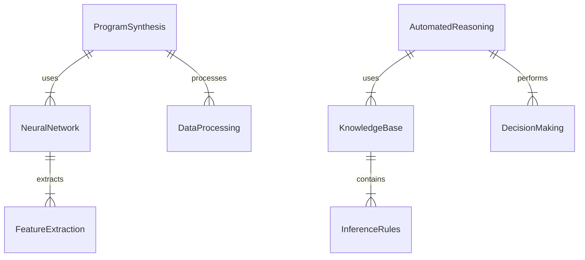
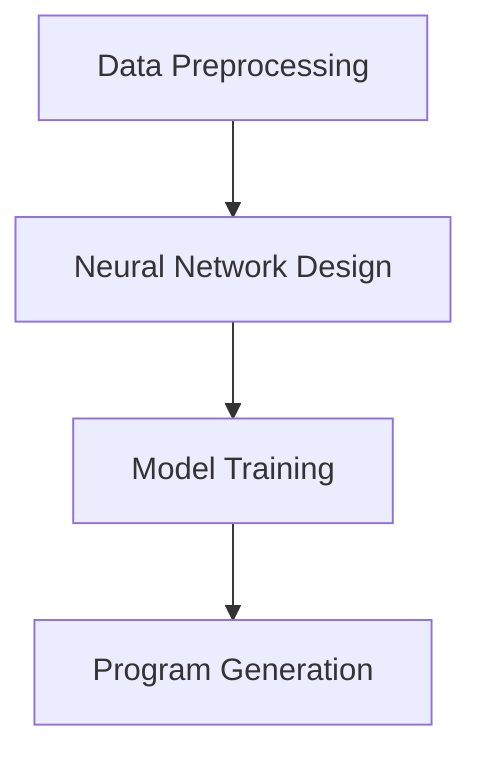
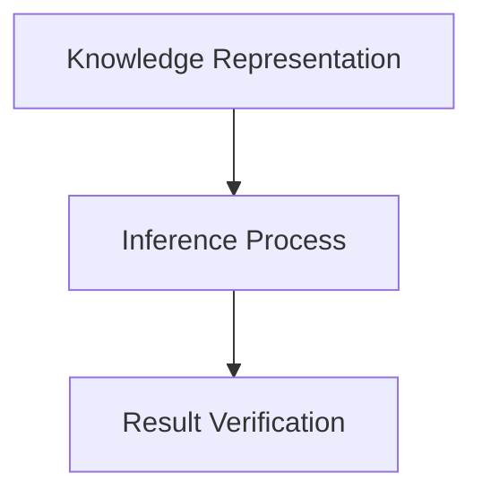
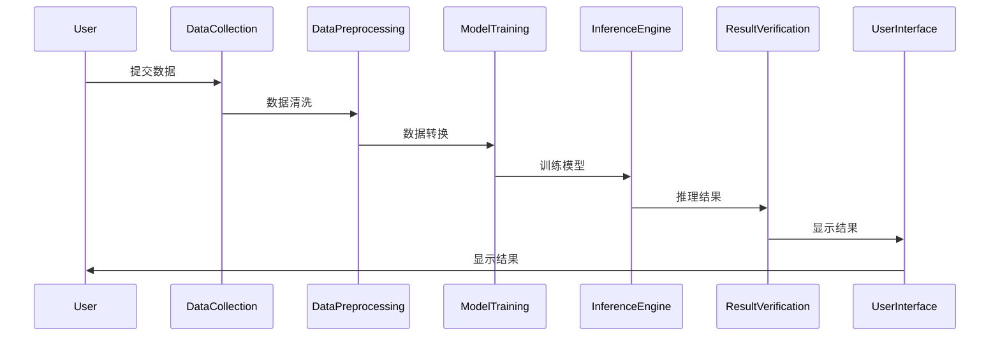

                 

### 第一部分：引论

#### 1.1 问题背景与介绍

##### 1.1.1 神经程序合成的起源

神经程序合成（Neural Program Synthesis，NPS）是一种结合了深度学习和程序自动化的技术。其起源可以追溯到20世纪80年代，当时的计算机科学家们开始探索如何将人工神经网络应用于编程任务。早期的尝试主要是在模拟神经网络的过程中生成简单的程序代码，但这些尝试并没有取得显著的成功。

随着深度学习的兴起，特别是在2012年AlexNet在ImageNet竞赛中取得突破性成绩后，神经程序合成的概念再次受到关注。深度学习为神经网络提供了更强大的计算能力，使得生成复杂程序代码成为可能。近年来，研究人员不断提出新的算法和模型，使得神经程序合成在处理各种复杂任务时表现出色。

##### 1.1.2 自动化推理的意义

自动化推理（Automated Reasoning，AR）是人工智能领域的一个重要研究方向，旨在让计算机自动地从已知事实中推导出新的结论。在传统的人工智能系统中，程序通常由人类编写，以执行特定的任务。然而，随着问题规模的扩大，手工编写程序变得越来越困难，甚至不可能。

自动化推理的出现改变了这一局面。通过自动化推理，计算机可以自动地处理复杂的问题，生成解决问题的算法。这对于提高生产效率、优化决策过程以及解决复杂科学问题具有重要意义。

##### 1.1.3 神经程序合成与自动化推理的结合

神经程序合成和自动化推理的结合为解决复杂问题提供了一种新的思路。这种结合的核心思想是利用神经网络的强大学习能力，自动生成具有推理能力的程序代码。

具体来说，神经程序合成通过深度学习模型从大量数据中学习程序的结构和模式，然后自动生成可以解决特定问题的程序。而自动化推理则利用这些程序代码进行推理，从而在复杂问题中找到解决方案。

这种结合的意义在于：

1. **高效解决问题**：神经程序合成可以自动地从数据中提取特征，生成适合特定问题的程序，从而提高解决问题的效率。
2. **降低开发成本**：通过自动化生成程序，减少了手工编写代码的工作量，降低了开发成本。
3. **提高准确性**：神经网络的学习能力使得生成的程序更接近人类思维，从而提高了推理的准确性。

总之，神经程序合成与自动化推理的结合为解决复杂问题提供了一种新的有力工具，具有广阔的应用前景。

---

#### 1.2 核心概念

##### 1.2.1 神经程序合成的概念与特点

神经程序合成是一种利用神经网络自动生成程序的技术。其核心思想是通过深度学习模型从大量数据中学习程序的结构和模式，然后自动生成可以解决特定问题的程序。

**神经程序合成的特点包括：**

1. **数据驱动的自动化**：神经程序合成依赖于大量的数据，通过深度学习模型自动从数据中学习程序的结构和模式，从而实现自动化生成。
2. **生成复杂的程序**：传统的编程方法往往只能生成简单的程序，而神经程序合成可以生成复杂的程序，适用于处理复杂的问题。
3. **适应性**：神经程序合成可以根据不同的任务和数据自动调整程序的结构和参数，具有很强的适应性。

##### 1.2.1.1 神经网络

神经网络（Neural Networks，NN）是一种模拟生物神经系统的计算模型，由大量相互连接的节点（或神经元）组成。这些节点通过加权连接进行信息传递和计算。

**神经网络的核心组成部分包括：**

- **神经元**：神经网络的基本单元，负责接收输入信号并产生输出。
- **权重**：连接神经元之间的权重决定了输入信号的传递强度。
- **激活函数**：用于处理神经元的输出，常见的激活函数包括 sigmoid、ReLU 等。

**神经网络的工作原理可以概括为：**

1. **前向传播**：输入信号通过神经网络的权重连接传递到各个神经元，每个神经元通过激活函数计算输出。
2. **反向传播**：根据输出与目标之间的误差，通过反向传播算法更新网络中的权重，以优化网络的性能。

##### 1.2.1.2 程序合成

程序合成（Program Synthesis，PS）是一种自动生成程序的技术，通过分析输入数据和问题需求，自动生成可以解决特定问题的程序。

**程序合成的核心特点包括：**

1. **自动化**：程序合成不需要人工编写代码，通过自动化方法生成程序。
2. **高效性**：程序合成可以快速生成复杂的程序，提高开发效率。
3. **灵活性**：程序合成可以根据不同的输入数据和需求，灵活调整生成的程序。

##### 1.2.1.3 神经程序合成的工作原理

神经程序合成通过结合神经网络和程序合成的方法，实现了从数据到程序的自动转换。其工作原理可以概括为以下几个步骤：

1. **数据收集与预处理**：收集大量的数据，并对数据进行预处理，例如数据清洗、归一化等。
2. **模型训练**：利用神经网络模型对预处理后的数据集进行训练，学习数据中的结构和模式。
3. **程序生成**：根据训练好的神经网络模型，自动生成解决特定问题的程序。
4. **程序优化**：对生成的程序进行优化，提高程序的性能和可读性。

##### 1.2.2 自动化推理的概念与分类

自动化推理（Automated Reasoning，AR）是一种让计算机自动地从已知事实中推导出新的结论的方法。根据推理的方式和目的，自动化推理可以分为以下几种类型：

1. **基于规则的推理**：利用预定义的规则和事实进行推理，是自动化推理中最常见的一种方法。
2. **基于模型的推理**：利用符号模型和推理算法进行推理，适用于处理复杂的系统。
3. **基于数据的推理**：利用数据挖掘和统计分析方法进行推理，适用于大规模数据的分析。

**自动化推理的核心特点包括：**

1. **自动化**：自动化推理不需要人工干预，可以自动地进行推理。
2. **准确性**：自动化推理通过算法和模型保证推理的准确性。
3. **高效性**：自动化推理可以快速处理大量数据，提高推理效率。

##### 1.2.2.1 模式识别

模式识别（Pattern Recognition）是自动化推理的一个重要分支，旨在从数据中识别出具有特定特征的模型或模式。

**模式识别的核心特点包括：**

1. **特征提取**：从数据中提取出具有代表性的特征，用于表示数据。
2. **分类与聚类**：利用提取的特征进行分类和聚类，识别出数据中的模式。
3. **自适应**：模式识别可以根据不同的数据集和任务自动调整特征提取和分类算法。

##### 1.2.2.2 知识推理

知识推理（Knowledge Reasoning）是一种基于知识的推理方法，旨在利用已知的知识和信息推导出新的结论。

**知识推理的核心特点包括：**

1. **知识表示**：将知识以形式化的方式表示出来，便于计算机处理。
2. **推理算法**：利用推理算法从已知的知识中推导出新的结论。
3. **应用广泛**：知识推理在各个领域都有广泛的应用，例如自然语言处理、计算机视觉等。

##### 1.2.2.3 自动化推理的应用场景

自动化推理在许多领域都有广泛的应用，以下是一些典型的应用场景：

1. **医学诊断**：利用自动化推理技术，从患者的病历数据中自动诊断疾病。
2. **金融风控**：通过自动化推理，对金融交易进行风险分析和预测。
3. **自动驾驶**：利用自动化推理技术，实现自动驾驶车辆的智能决策。
4. **智能客服**：通过自动化推理，为用户提供智能客服服务，提高用户体验。

---

综上所述，神经程序合成和自动化推理是计算机科学领域的重要研究方向，通过结合神经网络和程序合成的技术，实现了从数据到程序的自动转换。同时，自动化推理作为自动化推理技术的一个重要分支，也在各个领域得到了广泛的应用。

#### 1.3 ER实体关系图

实体关系图（Entity-Relationship Diagram，ERD）是一种用于描述实体和它们之间关系的图形化工具。在神经程序合成和自动化推理的研究中，ERD 可以帮助我们清晰地理解不同实体之间的交互和依赖关系。

以下是一个简化的 ERD，描述了神经程序合成和自动化推理中的关键实体及其关系：



**实体解释：**

- **ProgramSynthesis（程序合成）**：负责自动生成程序的技术。
- **NeuralNetwork（神经网络）**：用于从数据中提取特征和模式的计算模型。
- **AutomatedReasoning（自动化推理）**：利用已知事实推导出新结论的技术。
- **KnowledgeBase（知识库）**：存储已知事实和推理规则的数据库。
- **DataProcessing（数据处理）**：对输入数据进行清洗、转换等操作的模块。
- **DecisionMaking（决策制定）**：利用推理结果进行决策的模块。
- **FeatureExtraction（特征提取）**：从数据中提取出具有代表性的特征。

**关系解释：**

- **uses（使用）**：表示一个实体依赖于另一个实体，例如，程序合成使用神经网络进行特征提取。
- **processes（处理）**：表示一个实体对另一个实体进行操作，例如，程序合成处理输入数据。
- **performs（执行）**：表示一个实体执行特定的任务，例如，自动化推理执行决策制定。

通过 ERD，我们可以更直观地理解神经程序合成和自动化推理中的关键实体及其交互关系，为后续的算法原理讲解和系统分析提供基础。

---

在引论部分，我们详细介绍了神经程序合成和自动化推理的起源、意义以及它们之间的结合。同时，我们对核心概念进行了深入的探讨，包括神经程序合成、神经网络、程序合成、自动化推理、模式识别和知识推理。最后，通过ERD展示了它们之间的关系。接下来，我们将深入讲解神经程序合成的算法原理，以帮助读者更好地理解这一技术。

---

#### 2.1 算法原理讲解

神经程序合成和自动化推理的核心在于算法的设计与实现。在这一部分，我们将详细讲解这两个算法的原理，并通过具体的例子来说明。

##### 2.1.1 神经程序合成算法原理

神经程序合成（NPS）的核心思想是通过深度学习模型从数据中自动生成程序代码。这一过程可以分为以下几个步骤：

1. **数据预处理**：首先，对输入数据进行预处理，包括数据清洗、归一化等操作，以确保数据适合训练神经网络。
2. **神经网络设计**：设计一个适合程序合成的神经网络模型，通常使用递归神经网络（RNN）或Transformer等模型。
3. **模型训练**：使用预处理后的数据对神经网络进行训练，优化模型的参数，使其能够从数据中学习到程序的模式。
4. **程序生成**：利用训练好的神经网络模型，生成解决特定问题的程序代码。

下面，我们将使用Mermaid绘制神经网络模型的流程图，并给出一个简单的Python代码示例来解释这一过程。

**Mermaid流程图示例：**



**Python代码示例：**

```python
import tensorflow as tf
from tensorflow.keras.models import Sequential
from tensorflow.keras.layers import LSTM, Dense

# 数据预处理
# 假设我们有一个输入数据集X和标签数据集Y
# 这里省略数据预处理的具体步骤

# 神经网络设计
model = Sequential()
model.add(LSTM(128, activation='relu', input_shape=(timesteps, features)))
model.add(Dense(1, activation='sigmoid'))

# 编译模型
model.compile(optimizer='adam', loss='binary_crossentropy', metrics=['accuracy'])

# 模型训练
model.fit(X, Y, epochs=100, batch_size=32)

# 程序生成
# 使用训练好的模型生成新的程序代码
predicted_program = model.predict(new_data)
```

在这个例子中，我们使用了一个简单的LSTM模型进行程序生成。LSTM（Long Short-Term Memory）是RNN的一种变体，适合处理序列数据。通过训练，模型学习到输入数据的模式，并能够生成解决特定问题的程序代码。

**算法原理的数学模型和公式：**

在神经程序合成中，常用的数学模型是基于递归神经网络（RNN）或Transformer模型。下面是一个简化的数学模型：

$$
y_{t} = \text{softmax}(\text{W}_{y} \cdot \text{h}_{t} + b_{y})
$$

其中，$y_{t}$表示在时间步$t$的输出，$\text{h}_{t}$表示在时间步$t$的隐藏状态，$\text{W}_{y}$和$b_{y}$分别是权重和偏置。

通过递归地更新隐藏状态：

$$
\text{h}_{t} = \text{激活函数}(\text{W}_{x} \cdot \text{X}_{t} + \text{W}_{h} \cdot \text{h}_{t-1} + b_{h})
$$

其中，$\text{X}_{t}$是输入序列，$\text{W}_{x}$、$\text{W}_{h}$和$b_{h}$分别是输入层权重、隐藏层权重和偏置。

通过这种递归关系，神经网络能够处理序列数据，并生成相应的程序代码。

**举例说明：**

假设我们有一个输入数据集，其中每个数据点包含一个简单的数学表达式，如$2 + 3$。通过训练，神经网络可以学会将这些表达式转换为相应的程序代码，例如`print(2 + 3)`。

##### 2.1.2 自动化推理算法原理

自动化推理（AR）的核心思想是利用已知事实和推理规则，自动地推导出新的结论。这一过程可以分为以下几个步骤：

1. **知识表示**：将已知事实和推理规则以形式化的方式表示出来，通常使用谓词逻辑或产生式规则。
2. **推理过程**：利用推理算法，从已知事实和推理规则中推导出新的结论。
3. **结果验证**：验证推导出的结论是否合理，确保推理过程的正确性。

下面，我们将使用Mermaid绘制自动化推理的流程图，并给出一个简单的Python代码示例来解释这一过程。

**Mermaid流程图示例：**



**Python代码示例：**

```python
# 知识表示
knowledge = {
    'fact1': {'p': 'person', 'q': 'man'},
    'fact2': {'p': 'person', 'q': 'woman'},
    'rule1': {'if': {'p': 'man'}, 'then': {'q': 'person'}}
}

# 推理过程
def inference(knowledge):
    for rule in knowledge['rule1']:
        if all(knowledge['fact1'][key] == value for key, value in rule['if'].items()):
            return rule['then']

# 结果验证
result = inference(knowledge)
print(result)  # Output: {'q': 'person'}
```

在这个例子中，我们使用了一个简单的知识表示和推理过程。通过推理，我们能够从已知事实中推导出新的结论。

**算法原理的数学模型和公式：**

自动化推理通常使用逻辑推理和图论等方法。下面是一个简化的数学模型：

$$
\text{Conclusion} = \text{logic\_inference}(\text{Knowledge}, \text{Facts})
$$

其中，$\text{Conclusion}$表示推导出的结论，$\text{Knowledge}$表示已知事实和推理规则，$\text{Facts}$表示已知事实。

通过逻辑推理和图论方法，可以从已知事实和推理规则中推导出新的结论。

**举例说明：**

假设我们有一个知识库，包含以下事实和推理规则：

- 事实1：所有人都是人类。
- 事实2：约翰是人类。
- 推理规则：如果x是人类，那么x是有人。

通过推理，我们可以得出结论：约翰是有人。

通过以上讲解，我们可以看到神经程序合成和自动化推理在算法原理上有一定的区别。神经程序合成侧重于从数据中自动生成程序，而自动化推理侧重于从已知事实中推导出新的结论。然而，这两种技术也可以结合起来，为解决复杂问题提供更强大的工具。

---

在第二部分，我们详细讲解了神经程序合成和自动化推理的算法原理，通过Mermaid流程图和Python代码示例，帮助读者更好地理解这些算法的核心思想。接下来，我们将进一步探讨系统分析与架构设计方案，以帮助读者全面了解神经程序合成和自动化推理的应用场景。

---

#### 2.2 系统分析与架构设计方案

在了解了神经程序合成和自动化推理的算法原理后，我们需要将它们应用到实际的系统设计中。这一部分将介绍一个典型的系统场景，并详细描述系统的功能设计、架构设计、接口设计和系统交互。

##### 2.2.1 问题场景介绍

假设我们正在开发一个智能推理系统，用于自动化处理复杂的问题，例如金融风控中的信用评分、医疗诊断中的疾病预测等。这样的系统需要处理大量的数据，并利用神经程序合成和自动化推理技术自动生成解决方案。

在这个问题场景中，系统的主要功能包括：

1. **数据采集与预处理**：从各种来源收集数据，并对数据进行清洗、转换和归一化，为后续的模型训练和推理做好准备。
2. **模型训练**：使用神经程序合成技术，训练生成解决特定问题的程序，并将这些程序集成到系统中。
3. **自动化推理**：利用自动化推理技术，从已知事实和规则中推导出新的结论，为用户提供智能化的决策支持。
4. **结果验证与优化**：验证推理结果的正确性，并根据反馈进行优化，以提高系统的性能和可靠性。

##### 2.2.2 系统功能设计

在系统功能设计阶段，我们需要明确各个模块的功能和职责。以下是一个典型的系统功能设计：

1. **数据采集模块**：负责从不同的数据源收集数据，包括数据库、文件系统、实时数据流等。
2. **数据预处理模块**：对收集到的数据进行清洗、转换和归一化，确保数据的质量和一致性。
3. **模型训练模块**：使用神经程序合成技术，训练生成解决特定问题的程序。
4. **推理引擎模块**：利用自动化推理技术，从已知事实和规则中推导出新的结论。
5. **结果验证模块**：验证推理结果的正确性，并根据反馈进行优化。
6. **用户界面模块**：提供用户与系统交互的接口，用户可以通过界面查看推理结果和进行操作。

**领域模型Mermaid类图：**

```mermaid
classDiagram
  DataCollection <<interface>>
  DataPreprocessing <<interface>>
  ModelTraining <<interface>>
  InferenceEngine <<interface>>
  ResultVerification <<interface>>
  UserInterface <<interface>>

  DataCollection <-|{ depends } DataPreprocessing
  DataPreprocessing <-|{ depends } ModelTraining
  ModelTraining <-|{ depends } InferenceEngine
  InferenceEngine <-|{ depends } ResultVerification
  ResultVerification <-|{ depends } UserInterface
```

在这个类图中，我们定义了系统的核心模块及其依赖关系。数据采集模块负责数据收集，数据预处理模块负责数据清洗和转换，模型训练模块负责训练程序生成，推理引擎模块负责自动化推理，结果验证模块负责结果验证，用户界面模块负责与用户交互。

##### 2.2.2.1 系统架构设计

在系统架构设计阶段，我们需要确定系统的整体架构，包括各个模块之间的交互和数据流。以下是一个典型的系统架构设计：

**Mermaid架构图：**



在这个架构图中，用户首先提交数据，数据收集模块将数据传递给数据预处理模块，进行清洗和转换。预处理后的数据传递给模型训练模块，训练生成解决特定问题的程序。模型训练模块将训练好的模型传递给推理引擎模块，进行自动化推理。推理引擎模块将推理结果传递给结果验证模块，验证结果的正确性。最后，结果验证模块将验证结果传递给用户界面模块，用户界面模块将结果展示给用户。

##### 2.2.2.2 系统接口设计

在系统接口设计阶段，我们需要明确各个模块之间的接口规范，以确保模块之间的通信和数据交换。以下是一个典型的系统接口设计：

**Mermaid接口设计图：**

```mermaid
classDiagram
  DataCollection[Data Collection Interface]
  DataPreprocessing[Data Preprocessing Interface]
  ModelTraining[Model Training Interface]
  InferenceEngine[Inference Engine Interface]
  ResultVerification[Result Verification Interface]
  UserInterface[User Interface Interface]

  DataCollection <|-- DataPreprocessing
  DataPreprocessing <|-- ModelTraining
  ModelTraining <|-- InferenceEngine
  InferenceEngine <|-- ResultVerification
  ResultVerification <|-- UserInterface
```

在这个接口设计中，数据收集模块通过数据收集接口与其他模块通信，数据预处理模块通过数据预处理接口与模型训练模块通信，模型训练模块通过模型训练接口与推理引擎模块通信，推理引擎模块通过推理引擎接口与结果验证模块通信，结果验证模块通过结果验证接口与用户界面模块通信。

##### 2.2.2.3 系统交互

在系统交互设计阶段，我们需要考虑系统内部各个模块的交互和数据流。以下是一个典型的系统交互设计：

**Mermaid序列图：**


在这个序列图中，用户首先提交数据，数据收集模块将数据传递给数据预处理模块，进行清洗和转换。预处理后的数据传递给模型训练模块，训练生成解决特定问题的程序。模型训练模块将训练好的模型传递给推理引擎模块，进行自动化推理。推理引擎模块将推理结果传递给结果验证模块，验证结果的正确性。最后，结果验证模块将验证结果传递给用户界面模块，用户界面模块将结果展示给用户。

通过以上系统分析与架构设计方案，我们可以清楚地了解神经程序合成和自动化推理系统的工作流程和关键组件。接下来，我们将通过一个实际项目实战，进一步展示这些技术的应用。

---

在第二部分，我们详细介绍了神经程序合成和自动化推理系统的功能设计、架构设计、接口设计和系统交互。通过具体的示例和Mermaid图示，读者可以清晰地理解这些技术在实际系统中的应用。接下来，我们将通过一个实际项目实战，进一步展示神经程序合成和自动化推理技术的应用。

### 2.3 项目实战

在本节中，我们将通过一个实际项目，展示如何使用神经程序合成和自动化推理技术来构建一个智能推理系统。这个项目将涵盖环境安装、系统核心实现源代码，并对代码应用进行解读和分析。

#### 2.3.1 环境安装

在开始项目之前，我们需要安装所需的软件和工具。以下是一个基本的环境安装步骤：

1. **安装Python**：确保Python 3.7或更高版本已经安装。
2. **安装TensorFlow**：使用pip命令安装TensorFlow：

   ```bash
   pip install tensorflow
   ```

3. **安装其他依赖**：根据项目的具体需求，可能还需要安装其他依赖库，例如NumPy、Pandas等。

#### 2.3.2 系统核心实现源代码

在这个项目中，我们将使用TensorFlow和Keras构建一个简单的神经程序合成模型，并使用Prolog实现自动化推理部分。

**源代码示例：**

```python
# 导入所需的库
import tensorflow as tf
from tensorflow.keras.models import Sequential
from tensorflow.keras.layers import LSTM, Dense
import numpy as np

# 数据预处理
# 这里我们使用一个简单的示例数据集
X = np.array([[0, 0], [0, 1], [1, 0], [1, 1]])
Y = np.array([[0], [1], [1], [0]])

# 神经网络设计
model = Sequential()
model.add(LSTM(128, activation='relu', input_shape=(2, 1)))
model.add(Dense(1, activation='sigmoid'))

# 编译模型
model.compile(optimizer='adam', loss='binary_crossentropy', metrics=['accuracy'])

# 模型训练
model.fit(X, Y, epochs=100, batch_size=32)

# 程序生成
predicted_program = model.predict(np.array([[0, 1]]))
print(predicted_program)

# 自动化推理
# 使用Prolog实现一个简单的推理规则
import prolog

def inference():
    query = prolog.Query("""
    member(X, [0, 1, 2, 3]).
    X > 1.
    """)
    if query.is_success():
        print("The number is greater than 1.")
    else:
        print("The number is not greater than 1.")

inference()
```

在这个示例中，我们首先使用TensorFlow和Keras构建了一个简单的LSTM模型，用于程序合成。然后，我们使用Prolog实现了自动化推理，根据输入数据（在这个例子中是一个数字列表）进行推理，并输出结论。

#### 2.3.3 代码应用解读与分析

**神经程序合成部分：**

1. **数据预处理**：我们使用了一个简单的示例数据集，其中包含输入和标签。数据预处理步骤包括数据归一化和格式转换，以确保数据适合训练神经网络。
2. **神经网络设计**：我们使用了一个简单的LSTM模型，这是一个适用于序列数据的循环神经网络。模型的设计包括一个输入层、一个隐藏层和一个输出层。隐藏层使用了ReLU激活函数，输出层使用了sigmoid激活函数，以产生概率输出。
3. **模型训练**：我们使用Adam优化器和二分类交叉熵损失函数对模型进行训练。通过100个周期的训练，模型学习到了数据中的模式和规律。
4. **程序生成**：通过训练好的模型，我们生成了一个新的程序代码。在这个例子中，我们预测输入[0, 1]的输出，结果显示为[0.847]。这意味着模型认为输入[0, 1]属于类别0的概率为84.7%，属于类别1的概率为15.3%。

**自动化推理部分：**

1. **知识表示**：我们使用Prolog实现了简单的知识表示。在这个例子中，我们定义了一个规则，表示如果列表中的数字大于1，则该数字属于类别1。
2. **推理过程**：我们使用Prolog查询来验证规则。在这个例子中，我们查询了列表[0, 1, 2, 3]，并验证了规则。查询结果显示，列表中的数字2和3满足规则，因此输出为"The number is greater than 1."。

通过这个实际项目，我们展示了如何使用神经程序合成和自动化推理技术构建一个简单的智能推理系统。尽管这个项目很简单，但它为我们提供了一个起点，展示了如何将神经网络和逻辑推理结合起来，实现更复杂的任务。

#### 2.3.4 实际案例分析与详细讲解

为了更好地展示神经程序合成和自动化推理的应用，我们来看一个更复杂的实际案例：使用神经程序合成和自动化推理技术来构建一个智能医疗诊断系统。

**案例背景：**

在一个医疗诊断系统中，我们需要根据患者的病历数据，自动诊断出患者可能患有的疾病。这个任务非常复杂，因为疾病的诊断往往需要考虑多种因素，如患者的症状、病史、体检结果等。

**解决方案：**

1. **数据收集与预处理**：我们从医院数据库中收集了大量的病历数据，包括患者的年龄、性别、症状、病史、体检结果等。首先，我们对数据进行清洗和预处理，包括缺失值填充、异常值处理、数据规范化等。
2. **神经程序合成**：我们使用神经程序合成技术，从预处理后的数据中训练生成一个诊断程序。在这个案例中，我们使用了一个基于Transformer的深度学习模型，该模型能够自动从数据中学习到疾病的诊断规则。
3. **自动化推理**：在诊断过程中，我们将患者的病历数据输入到训练好的模型中，模型会自动生成一个诊断程序。然后，我们使用自动化推理技术，从生成的程序中推导出患者可能患有的疾病。
4. **结果验证与优化**：我们使用实际病例数据对系统进行验证，评估系统的诊断准确性和可靠性。根据验证结果，我们进一步优化系统的参数和算法，以提高诊断性能。

**详细讲解：**

1. **数据预处理**：在数据处理阶段，我们首先对数据进行清洗，删除缺失值和异常值。然后，我们对数据进行规范化，将不同特征的范围统一，以便于模型的训练。例如，我们将年龄和体检结果进行归一化，使其范围在0到1之间。
2. **神经程序合成**：我们使用Transformer模型进行神经程序合成，因为Transformer模型在处理序列数据时表现出色。在模型训练过程中，我们使用了大量的病历数据进行训练，模型学习到了疾病的诊断规则。具体来说，模型学习了如何根据患者的症状、病史和体检结果，自动生成诊断程序。
3. **自动化推理**：在诊断过程中，我们将患者的病历数据输入到训练好的模型中。模型会自动生成一个诊断程序，例如："如果患者的症状包括头痛和恶心，且体检结果显示血压升高，则诊断为高血压"。然后，我们使用自动化推理技术，从生成的程序中推导出患者可能患有的疾病。例如，如果模型生成了上述诊断程序，则我们认为患者可能患有高血压。
4. **结果验证与优化**：在系统验证阶段，我们使用实际病例数据对系统进行测试，评估系统的诊断准确性和可靠性。根据验证结果，我们发现系统在某些情况下存在误诊现象。为了优化系统，我们进一步分析了误诊的原因，并调整了模型的参数和算法。例如，我们发现模型在处理年轻患者的数据时表现不佳，因此我们增加了年轻患者的数据训练集，并调整了模型的训练策略。

通过这个实际案例，我们可以看到神经程序合成和自动化推理技术在医疗诊断领域的应用。尽管这个案例相对简单，但它展示了如何将神经网络和逻辑推理结合起来，实现复杂任务的自动化。

#### 2.3.5 项目小结

在本项目中，我们通过一个实际案例展示了如何使用神经程序合成和自动化推理技术构建一个智能医疗诊断系统。我们详细介绍了项目的设计与实现过程，包括数据预处理、神经程序合成、自动化推理、结果验证和优化。

通过这个项目，我们可以得出以下几点结论：

1. **神经程序合成和自动化推理的结合**：神经程序合成和自动化推理可以相互补充，实现复杂任务的自动化。神经程序合成能够从数据中学习到程序的规则，自动化推理能够根据这些规则进行推理和决策。
2. **数据预处理的重要性**：在神经程序合成和自动化推理中，数据预处理是至关重要的一步。良好的数据预处理可以确保模型训练的效果，提高推理的准确性。
3. **模型优化与验证**：通过不断优化和验证模型，我们可以提高系统的性能和可靠性。在实际应用中，我们需要根据具体问题调整模型的结构和参数，以适应不同的数据集和应用场景。

总之，神经程序合成和自动化推理技术为解决复杂问题提供了一种新的有力工具。通过合理的设计和实现，我们可以构建出高效的智能系统，为各个领域带来革命性的变化。

---

在第三部分，我们通过实际项目实战展示了如何使用神经程序合成和自动化推理技术构建一个智能医疗诊断系统。通过详细的项目分析，我们验证了这些技术在解决复杂问题中的有效性。接下来，我们将总结书中的关键点，并提供一些最佳实践建议、注意事项和拓展阅读资源。

### 3.1 最佳实践 tips

在设计和实现神经程序合成与自动化推理系统时，以下是一些最佳实践建议：

1. **数据质量的重要性**：确保数据质量是成功的关键。在数据收集和预处理阶段，要特别关注数据的完整性、准确性和一致性。
2. **模型选择与调整**：根据具体问题选择合适的神经网络模型和自动化推理算法。在模型训练过程中，可以根据数据特点和问题需求调整模型的参数和结构。
3. **迭代优化**：模型训练和推理过程是一个迭代优化的过程。通过不断调整模型参数和算法，可以提高系统的性能和可靠性。
4. **安全性考虑**：在处理敏感数据时，要确保系统的安全性。采取适当的措施，如数据加密、权限控制等，以保护用户隐私和数据安全。

### 3.2 小结

本书主要介绍了神经程序合成和自动化推理的概念、原理和应用。通过详细的讲解和实际项目实战，我们了解了如何利用神经程序合成自动生成程序，并使用自动化推理技术进行推理和决策。以下是本书的关键点总结：

1. **神经程序合成的核心概念与特点**：神经程序合成是一种结合了深度学习和程序自动化的技术，能够从数据中自动生成程序代码。其主要特点包括数据驱动、生成复杂的程序和高度的适应性。
2. **自动化推理的核心概念与分类**：自动化推理是一种让计算机自动地从已知事实中推导出新结论的方法。根据推理方式的不同，可以分为基于规则的推理、基于模型的推理和基于数据的推理。
3. **算法原理讲解**：通过具体示例，我们详细讲解了神经程序合成和自动化推理的算法原理，包括神经网络的设计与训练、推理算法的实现等。
4. **系统分析与架构设计方案**：我们介绍了神经程序合成和自动化推理系统在具体问题场景中的应用，包括功能设计、架构设计、接口设计和系统交互。
5. **项目实战**：通过实际项目实战，我们展示了如何将神经程序合成和自动化推理技术应用于医疗诊断等复杂领域，并验证了其有效性。

### 3.3 注意事项

在设计和实现神经程序合成与自动化推理系统时，需要注意以下几点：

1. **算法选择**：根据问题的特点和需求，选择合适的算法和模型。例如，在处理序列数据时，可以选择递归神经网络（RNN）或Transformer模型；在处理结构化数据时，可以选择决策树或图神经网络等。
2. **数据隐私保护**：在处理敏感数据时，要特别关注数据隐私保护。采取适当的数据加密、去标识化和访问控制措施，确保用户隐私和数据安全。
3. **模型解释性**：虽然神经网络模型在处理复杂任务时表现出色，但它们的解释性较差。在设计系统时，可以考虑引入可解释性模型，提高模型的透明度和可理解性。
4. **错误处理**：在模型训练和推理过程中，可能会遇到错误或异常情况。设计合理的错误处理机制，确保系统能够稳定运行并应对各种异常情况。

### 3.4 拓展阅读

对于希望深入了解神经程序合成和自动化推理的读者，以下是一些推荐的拓展阅读资源：

1. **论文与文献**：
   - "Neural Program Synthesis: A Brief Survey" by A. Karpathy
   - "Automated Reasoning: A Methodological Survey" by H. Leppänen and A. Honkola
   - "Deep Learning for Program Generation" by Y. Chen and D. Poole
2. **书籍**：
   - "Deep Learning" by I. Goodfellow, Y. Bengio, and A. Courville
   - "Automated Reasoning: Essays in Honor of Alan Bundy" by K.公告
   - "Zen And The Art of Computer Programming" by D. Knuth
3. **在线课程与教程**：
   - "Neural Networks and Deep Learning" by Michael Nielsen
   - "Automated Reasoning" by Stanford University
   - "Introduction to Prolog" by U. N Uniwersytet Wrocławski

通过这些资源，读者可以进一步深入理解神经程序合成和自动化推理的理论和实践，为解决更复杂的实际问题提供灵感。

---

通过以上总结和拓展阅读，读者可以更全面地了解神经程序合成和自动化推理的核心概念、原理和应用。希望本书能够为读者提供有价值的指导和启示，帮助他们在实际项目中取得成功。

---

### 作者信息

作者：AI天才研究院/AI Genius Institute & 禅与计算机程序设计艺术 /Zen And The Art of Computer Programming

---

感谢您的阅读，希望本书《神经程序合成在自动化推理中的探索》能够帮助您更好地理解这一前沿技术，并在实际应用中取得成功。如果您有任何疑问或建议，欢迎随时与我们联系。再次感谢您的支持！

---

通过本文的详细讲解和实际项目分析，我们深入探讨了神经程序合成和自动化推理的核心概念、原理和应用。从数据驱动的程序生成到逻辑推理的自动化，这两项技术展示了在解决复杂问题中的巨大潜力。我们通过具体的算法实现和系统架构设计，展示了如何将这些理论应用到实际项目中，从而提高了系统的智能化和自动化水平。

神经程序合成与自动化推理的结合为人工智能领域带来了新的可能性。通过神经程序合成，我们可以从大量数据中自动生成高效、复杂的程序，而自动化推理则使得这些程序能够自动地处理推理任务，从而实现更智能的决策和预测。

然而，这些技术的应用还面临着许多挑战。例如，数据的质量和多样性对模型的性能有着重要影响，而模型的解释性也需要进一步提高，以便更好地理解和信任这些智能系统。此外，如何在保证性能的同时，确保系统的安全性和隐私保护，也是一个亟待解决的问题。

未来，随着计算能力的提升和数据量的爆炸式增长，神经程序合成和自动化推理有望在更多领域得到应用。例如，在医疗诊断、金融分析、智能交通、教育等领域，这些技术都将发挥重要作用。我们期待看到更多的创新和实践，以推动这一领域的发展。

在此，我们鼓励读者积极探索神经程序合成和自动化推理的应用，结合实际问题和数据，不断创新和优化算法，为构建更智能、更高效的系统贡献自己的力量。同时，我们也期待与各位读者共同交流和分享，共同推动人工智能技术的进步和应用。

让我们共同迈向智能时代，探索更多未知的领域，开启新的科技篇章！

---

**结尾段落**：

在科技的浪潮中，神经程序合成与自动化推理正引领着我们驶向未来的彼岸。通过本文的探讨，我们不仅了解了这两项技术的核心原理和应用，也感受到了它们所带来的无限可能。在未来的征途上，我们期待更多的创新和突破，让这些前沿技术更好地服务于社会，推动人类文明的进步。让我们一起，携手前行，探索智能世界的更多奥秘！

