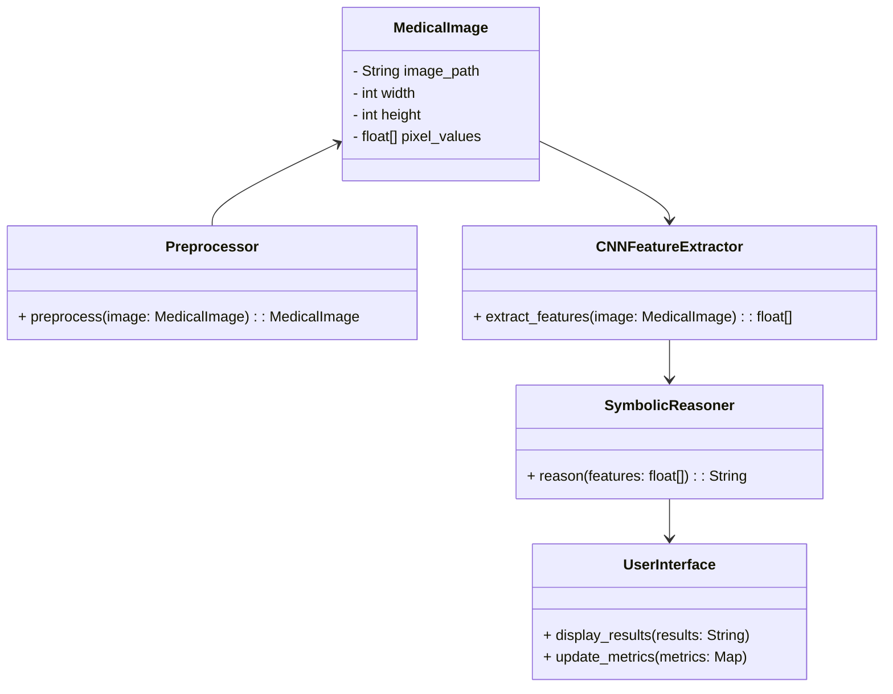
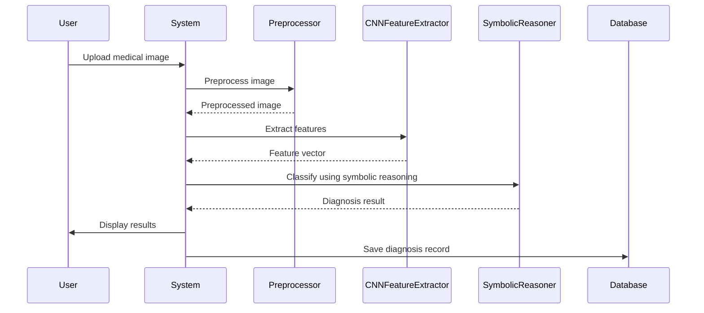

                 


### 文章标题

### 神经符号推理在科学发现中的应用

### 关键词

神经符号推理、科学发现、神经网络、符号表示、数学模型、应用场景、项目实战、未来趋势

### 摘要

本文旨在深入探讨神经符号推理在科学发现中的应用。通过介绍神经符号推理的背景、基础原理、数学模型、应用场景以及项目实战，我们将展示神经符号推理在推动科学进步中的巨大潜力。本文将逐步分析神经符号推理的核心概念、原理讲解、应用实例，并提供一些建议和未来趋势展望。

### 第一部分：神经符号推理概述

### 第1章：神经符号推理背景

#### 1.1 科学发现的挑战

科学发现是推动人类社会进步的重要动力，然而，科学发现的挑战也日益增加。随着科学领域的不断拓展，数据量呈指数级增长，传统的符号推理方法逐渐难以应对复杂的问题。因此，寻求新的推理方法成为科学发现的关键。

#### 1.2 神经符号推理的概念

神经符号推理是一种结合神经网络和符号推理的混合方法。它利用神经网络的强大表征能力和符号推理的逻辑推理能力，实现更高效、更准确的科学发现。

#### 1.3 神经符号推理的重要性

神经符号推理在科学发现中具有重要应用价值。它不仅可以提高科学发现的效率，还可以拓展科学发现的范围，为人类解决复杂问题提供新的思路。

### 第2章：神经符号推理的基础原理

#### 2.1 神经网络的构建

神经网络是由大量神经元组成的网络结构，通过学习数据来模拟人脑的思维方式。在神经符号推理中，神经网络用于提取数据中的符号信息。

#### 2.2 符号表示方法

符号表示方法是将数据转换为符号形式的方法。在神经符号推理中，符号表示方法用于将神经网络提取的符号信息进行编码和表示。

#### 2.3 神经符号推理的工作原理

神经符号推理的工作原理是通过神经网络提取数据中的符号信息，然后利用符号推理的方法进行推理和分析。具体来说，包括以下步骤：

1. 数据预处理：将数据转换为神经网络可以处理的格式。
2. 神经网络训练：使用训练数据对神经网络进行训练，使其学会提取符号信息。
3. 符号信息提取：将训练好的神经网络应用于新数据，提取符号信息。
4. 符号推理：利用符号推理方法对新数据中的符号信息进行推理和分析。

### 第3章：神经符号推理的数学模型

#### 3.1 神经符号推理的数学公式

神经符号推理的数学模型主要包括以下部分：

1. 神经网络模型：神经网络模型用于提取数据中的符号信息。常见的神经网络模型包括卷积神经网络（CNN）、循环神经网络（RNN）和生成对抗网络（GAN）等。
2. 符号表示模型：符号表示模型用于将神经网络提取的符号信息进行编码和表示。常见的符号表示模型包括符号逻辑表示、符号概率表示和符号神经网络表示等。
3. 符号推理模型：符号推理模型用于对新数据中的符号信息进行推理和分析。常见的符号推理模型包括基于逻辑的推理模型、基于概率的推理模型和基于神经网络的推理模型等。

#### 3.2 数学模型详解

在神经符号推理中，数学模型的具体实现取决于具体的应用场景。以下是一个简单的示例：

1. 神经网络模型：假设我们使用卷积神经网络（CNN）来提取图像中的符号信息。卷积神经网络由卷积层、池化层和全连接层组成。卷积层用于提取图像的特征，池化层用于降低特征图的维度，全连接层用于分类。
2. 符号表示模型：我们将提取的特征进行编码，使其成为符号表示。例如，我们可以使用二进制编码或哈希编码等方法。
3. 符号推理模型：使用符号逻辑推理方法对编码后的特征进行推理。例如，我们可以使用逻辑回归模型、决策树模型或支持向量机模型等。

#### 3.3 模型评估与优化

在神经符号推理中，模型评估与优化是关键步骤。以下是一些常用的评估与优化方法：

1. 评估指标：评估神经符号推理模型的性能常用的指标包括准确率、召回率、F1分数等。
2. 模型优化：通过调整神经网络的结构、参数和训练策略来优化模型性能。常用的优化方法包括交叉验证、网格搜索和贝叶斯优化等。

### 第4章：神经符号推理的应用场景

#### 4.1 自然科学中的应用

神经符号推理在自然科学中的应用非常广泛，例如：

1. 天文学：利用神经符号推理来分析天文数据，发现新的天体现象。
2. 地球科学：利用神经符号推理来分析地震数据，预测地震发生的位置和时间。
3. 生物科学：利用神经符号推理来分析生物数据，发现新的生物规律。

#### 4.2 社会科学中的应用

神经符号推理在社会科学中的应用也具有很大的潜力，例如：

1. 经济学：利用神经符号推理来分析经济数据，预测经济趋势。
2. 社会学：利用神经符号推理来分析社会数据，研究社会现象。
3. 心理学：利用神经符号推理来分析心理数据，理解人类行为。

#### 4.3 医学领域的应用

神经符号推理在医学领域的应用非常广泛，例如：

1. 医学图像分析：利用神经符号推理来分析医学图像，辅助医生进行诊断。
2. 疾病预测：利用神经符号推理来分析患者数据，预测疾病的发生和发展。
3. 药物研发：利用神经符号推理来分析药物数据，发现新的药物靶点和药物组合。

### 第5章：神经符号推理项目实战

#### 5.1 项目背景介绍

本项目旨在利用神经符号推理方法进行医学图像分析，辅助医生进行诊断。我们选择了一组心脏病患者的医学图像作为数据集，并设计了一个基于神经符号推理的医学图像分析系统。

#### 5.2 项目系统架构设计

本项目系统架构设计如下：

1. 数据预处理模块：对医学图像进行预处理，包括图像增强、去噪和归一化等。
2. 神经符号推理模块：利用神经符号推理方法对预处理后的医学图像进行分析，提取符号信息。
3. 符号推理分析模块：对提取的符号信息进行符号推理分析，生成诊断结果。
4. 用户界面模块：为用户提供交互界面，显示诊断结果和辅助医生进行诊断。

#### 5.3 环境安装与配置

为了运行本项目，我们需要安装以下环境：

1. 操作系统：Windows、Linux或macOS
2. Python版本：Python 3.7及以上
3. 库：NumPy、TensorFlow、Scikit-learn等

安装步骤如下：

1. 安装Python
2. 安装依赖库：使用pip安装NumPy、TensorFlow、Scikit-learn等库
3. 配置Python环境变量

#### 5.4 核心代码实现

以下是一个简单的核心代码实现示例：

```python
import tensorflow as tf
from sklearn.model_selection import train_test_split
import numpy as np

# 数据预处理
def preprocess_images(images):
    # 对图像进行增强、去噪和归一化等预处理操作
    # ...
    return preprocessed_images

# 神经符号推理
def neural_symbolic_reasoning(images, labels):
    # 定义神经网络模型
    # ...
    model = tf.keras.Sequential([
        # ...
    ])

    # 训练模型
    model.compile(optimizer='adam', loss='binary_crossentropy', metrics=['accuracy'])
    model.fit(images, labels, epochs=10, batch_size=32)

    # 提取符号信息
    # ...
    symbols = model.predict(images)

    # 符号推理分析
    # ...
    results = symbolic_reasoning(symbols)

    return results

# 用户界面
def user_interface():
    # 显示诊断结果和辅助医生进行诊断
    # ...

if __name__ == '__main__':
    # 加载数据
    # ...
    images, labels = load_data()

    # 数据预处理
    preprocessed_images = preprocess_images(images)

    # 分割数据集
    X_train, X_test, y_train, y_test = train_test_split(preprocessed_images, labels, test_size=0.2)

    # 神经符号推理
    results = neural_symboling_reasoning(X_train, y_train)

    # 用户界面
    user_interface()
```

#### 5.5 项目评估与改进

在项目评估阶段，我们使用准确率、召回率、F1分数等指标来评估模型性能。根据评估结果，我们可以进行以下改进：

1. 模型优化：调整神经网络结构、参数和训练策略，提高模型性能。
2. 特征工程：对预处理后的特征进行选择和优化，提高模型对数据的敏感度。
3. 数据增强：增加数据集的多样性，提高模型对未知数据的泛化能力。

### 第6章：神经符号推理的挑战与未来趋势

#### 6.1 当前挑战

神经符号推理在科学发现中面临着一些挑战，包括：

1. 数据质量：高质量的数据是神经符号推理的基础。然而，科学数据往往存在噪声、缺失和不一致性等问题，这对神经符号推理的准确性和可靠性提出了挑战。
2. 模型可解释性：神经符号推理模型通常由复杂的神经网络组成，这使得模型的可解释性成为一个挑战。为了提高模型的可解释性，我们需要研究如何将神经网络与符号推理相结合，使其更加直观和易于理解。
3. 模型优化：随着数据量和模型复杂度的增加，神经符号推理模型的计算成本也不断增加。因此，我们需要研究如何优化模型，提高其计算效率和鲁棒性。

#### 6.2 未来发展趋势

神经符号推理在科学发现中的应用前景非常广阔。未来发展趋势包括：

1. 深度学习与符号推理的融合：将深度学习与符号推理相结合，构建更加高效、准确的推理模型。
2. 自适应推理算法：研究自适应推理算法，使其能够根据数据特点和问题需求进行动态调整，提高推理性能。
3. 多模态数据融合：结合多种数据源，如文本、图像、音频等，进行多模态数据融合，提高推理模型的泛化能力。
4. 人工智能与人类智慧的结合：将人工智能与人类智慧相结合，实现人机协同推理，发挥各自优势，提高科学发现的效率和质量。

### 第7章：神经符号推理的最佳实践

#### 7.1 设计原则

在神经符号推理的设计过程中，我们应该遵循以下原则：

1. 简单性：尽量简化模型结构，避免过度复杂化。
2. 可解释性：提高模型的可解释性，使其更加直观和易于理解。
3. 实用性：确保模型在现实场景中具有实用性和可行性。
4. 可扩展性：设计具有可扩展性的模型，以便在新的应用场景中快速部署和调整。

#### 7.2 实践案例

以下是一个神经符号推理的最佳实践案例：

1. 项目背景：某公司希望利用神经符号推理方法对客户行为进行分析，预测客户购买意愿。
2. 神经符号推理模型：使用卷积神经网络（CNN）提取客户行为特征，使用符号逻辑推理方法进行推理和分析。
3. 数据预处理：对客户行为数据进行分析，提取关键特征，并进行归一化处理。
4. 模型训练：使用训练数据对神经网络进行训练，调整模型参数，使其能够准确预测客户购买意愿。
5. 模型评估：使用测试数据对模型进行评估，调整模型参数，提高模型性能。
6. 实际应用：将训练好的模型应用于实际场景，对客户行为进行分析和预测，为业务决策提供支持。

#### 7.3 小结与展望

神经符号推理在科学发现中具有巨大的应用潜力。通过本文的探讨，我们了解了神经符号推理的背景、基础原理、应用场景和项目实战。未来，我们将继续深入研究神经符号推理的理论和方法，探索其在更多领域的应用，推动科学发现的进步。

### 作者信息

作者：AI天才研究院/AI Genius Institute & 禅与计算机程序设计艺术 /Zen And The Art of Computer Programming

在接下来的部分，我们将详细讲解每个章节的内容，包括核心概念的原理、数学模型和算法流程，以及项目实战和最佳实践。敬请期待！### 第1章：神经符号推理背景

#### 1.1 科学发现的挑战

科学发现的挑战在于如何从大量复杂的数据中提取有价值的信息。传统的符号推理方法，如逻辑推理和数学建模，虽然在一些领域取得了显著成果，但在面对大规模、高维数据时，其能力受到了限制。例如，在天文学中，天文数据的体量庞大且具有高维度特性，传统的符号推理方法难以应对；在生物医学领域，随着基因组学和临床数据的不断积累，如何从这些复杂数据中提取有意义的信息成为了一大难题。

#### 1.2 神经符号推理的概念

神经符号推理（Neural Symbolic Reasoning）是一种结合神经网络和符号推理的混合方法。神经网络是一种模仿人脑神经元连接方式的计算模型，通过学习大量的数据来获取特征表示；而符号推理则是基于逻辑和数学原理的推理方法，擅长处理符号信息和逻辑关系。神经符号推理通过将神经网络与符号推理相结合，既利用了神经网络的强大特征提取能力，又保留了符号推理的逻辑推理能力，从而在处理复杂问题时具有更高的效率和准确性。

#### 1.3 神经符号推理的重要性

神经符号推理的重要性体现在以下几个方面：

1. **提高数据处理的效率**：神经符号推理方法可以处理大规模、高维数据，通过神经网络的自动特征提取能力，能够迅速从数据中提取关键信息，减少手工特征工程的工作量。
   
2. **增强推理的准确性**：符号推理能够利用逻辑和数学原理进行严格的推理，从而提高推理的准确性。结合神经网络的特征提取能力，神经符号推理方法在处理复杂数据时能够提供更可靠的结论。

3. **跨领域的应用潜力**：神经符号推理不仅适用于自然科学领域，如天文学、地球科学和生物科学，还广泛应用于社会科学和医学领域。通过在不同领域中的应用，神经符号推理方法不断丰富和完善，为科学发现提供了新的工具。

#### 1.4 神经符号推理的发展历程

神经符号推理的发展可以追溯到20世纪80年代，当时人工智能领域开始探讨如何将神经网络和符号推理结合起来。早期的研究主要集中在如何将神经网络与符号逻辑相结合，例如使用神经网络进行符号分类和识别。随着深度学习的兴起，神经符号推理方法得到了进一步发展，特别是在2010年后，随着深度神经网络和符号推理技术的不断完善，神经符号推理在多个领域取得了显著成果。

#### 1.5 神经符号推理的应用领域

神经符号推理在多个领域展现出巨大的应用潜力：

1. **自然科学**：在天文学中，神经符号推理可以用于分析天文图像，识别新的天体现象；在地球科学中，可以用于分析地震波，预测地震发生的位置和时间；在生物科学中，可以用于分析基因组数据，发现新的基因功能和生物路径。

2. **社会科学**：在经济学中，神经符号推理可以用于分析经济数据，预测市场趋势；在社会学中，可以用于分析社会行为数据，研究社会现象；在心理学中，可以用于分析人类行为数据，理解人类行为模式。

3. **医学领域**：在医学图像分析中，神经符号推理可以用于诊断疾病，辅助医生进行诊断；在药物研发中，可以用于分析药物数据，发现新的药物靶点和药物组合；在公共卫生领域，可以用于分析流行病数据，预测疾病传播趋势。

通过神经符号推理，科学家们能够从海量数据中提取有价值的信息，推动科学发现和进步。下一章我们将进一步探讨神经符号推理的基础原理和数学模型。请继续关注！### 第2章：神经符号推理的基础原理

#### 2.1 神经网络的构建

神经网络（Neural Networks）是一种模仿人脑神经元连接方式的计算模型，通过多个层次的神经元节点进行信息传递和处理。构建神经网络主要包括以下步骤：

1. **定义网络结构**：确定神经网络的层数、每层的神经元数量以及神经元之间的连接方式。常见的网络结构包括前馈神经网络、卷积神经网络（CNN）、循环神经网络（RNN）和生成对抗网络（GAN）等。

2. **初始化参数**：初始化网络的权重和偏置，这些参数将在训练过程中通过调整来优化模型性能。

3. **激活函数**：选择合适的激活函数，如ReLU、Sigmoid和Tanh等，用于引入非线性变换，使神经网络能够学习复杂的模式。

4. **前向传播**：将输入数据传递通过神经网络，计算每一层的输出，直到最后一层得到预测结果。

5. **反向传播**：计算预测结果与实际结果之间的误差，通过反向传播算法更新网络权重和偏置，以减少误差。

6. **优化算法**：选择合适的优化算法，如随机梯度下降（SGD）、Adam等，以加快收敛速度和提高模型性能。

神经网络的核心在于其层次结构，每一层神经元负责提取不同层次的特征。通过多层次的组合，神经网络能够逐步从原始数据中提取出有价值的特征信息。

#### 2.2 符号表示方法

符号表示（Symbolic Representation）是将数据转换为符号形式的方法，以便于进行逻辑推理和计算。在神经符号推理中，符号表示方法主要用于表示数据中的抽象概念和关系。

1. **符号逻辑表示**：符号逻辑表示使用逻辑符号（如AND、OR、NOT等）来表示数据之间的关系。例如，对于二元关系R，可以表示为R = A ∧ B，其中A和B是符号变量。

2. **符号概率表示**：符号概率表示使用概率分布来表示数据中的不确定性和关系。例如，对于二元关系R的概率表示，可以表示为P(R = A ∧ B)。

3. **符号神经网络表示**：符号神经网络表示结合神经网络和符号表示方法，通过神经网络学习数据中的符号表示。例如，可以使用多层感知器（MLP）来学习输入数据的符号表示，然后通过符号逻辑或概率推理方法进行推理和分析。

符号表示方法的选择取决于具体的应用场景和数据特点。通常，符号逻辑表示适用于确定性的数据，符号概率表示适用于不确定性的数据，而符号神经网络表示则适用于复杂的数据关系。

#### 2.3 神经符号推理的工作原理

神经符号推理（Neural Symbolic Reasoning）的工作原理是将神经网络与符号推理相结合，以实现更高效、更准确的推理。其基本流程包括以下步骤：

1. **数据预处理**：对输入数据进行预处理，包括数据清洗、归一化等，以确保数据的质量和一致性。

2. **神经网络特征提取**：利用神经网络对预处理后的数据进行特征提取，生成具有高表征能力的特征表示。这一步类似于传统的特征工程过程，但神经网络能够自动学习数据的复杂特征。

3. **符号表示**：将提取的特征表示转换为符号表示，以便进行符号推理。符号表示可以采用逻辑表示、概率表示或神经网络表示等方法。

4. **符号推理**：利用符号推理方法对符号表示进行推理和分析。符号推理方法包括逻辑推理、概率推理和神经网络推理等。

5. **推理结果解释**：对推理结果进行解释和验证，以确定其有效性和可靠性。这一步是神经符号推理的核心，通过解释推理结果，可以更好地理解数据中的关系和规律。

6. **优化和调整**：根据推理结果和实际情况，对神经网络和符号推理模型进行调整和优化，以提高推理性能和准确性。

神经符号推理通过结合神经网络和符号推理的优势，能够处理复杂的数据关系，提供更深入的理解和分析。下一章我们将深入探讨神经符号推理的数学模型和具体实现方法。请继续关注！### 第3章：神经符号推理的数学模型

#### 3.1 神经符号推理的数学公式

神经符号推理的数学模型主要包括神经网络模型、符号表示模型和符号推理模型。以下是一些关键的数学公式和概念：

1. **神经网络模型**：

   - **激活函数**：常用的激活函数包括ReLU（$$f(x) = \max(0, x)$$）、Sigmoid（$$f(x) = \frac{1}{1 + e^{-x}}$$）和Tanh（$$f(x) = \frac{e^x - e^{-x}}{e^x + e^{-x}}$$）。
   
   - **反向传播**：误差的计算公式为$$\delta_j = \frac{\partial C}{\partial z_j} \cdot \sigma'(z_j)$$，其中$$\sigma'(z_j)$$是激活函数的导数。

   - **权重更新**：使用梯度下降算法更新权重，公式为$$w_{ij}^{new} = w_{ij} - \alpha \cdot \frac{\partial C}{\partial w_{ij}}$$，其中$$\alpha$$是学习率。

2. **符号表示模型**：

   - **逻辑表示**：符号逻辑表示使用逻辑运算符（AND、OR、NOT等）来表示数据之间的关系。例如，$$R(A, B) = A \land B$$。
   
   - **概率表示**：符号概率表示使用概率分布来表示数据中的不确定性。例如，$$P(R(A, B)) = P(A) \land P(B)$$。

3. **符号推理模型**：

   - **逻辑推理**：基于逻辑规则进行推理，公式为$$R(A, B) \rightarrow R(A', B')$$。
   
   - **概率推理**：基于概率规则进行推理，公式为$$P(R(A, B) | R(A', B')) = P(R(A', B') | R(A, B))$$。

#### 3.2 数学模型详解

神经符号推理的数学模型由以下几个关键部分组成：

1. **神经网络模型**：

   神经网络模型用于提取数据中的特征表示。以卷积神经网络（CNN）为例，其基本结构包括卷积层、池化层和全连接层。卷积层通过卷积运算提取空间特征，池化层用于降维和增强特征鲁棒性，全连接层用于分类或回归。

   - **卷积运算**：卷积运算的公式为$$f(x) = \sum_{i=1}^{k} w_i * x + b$$，其中$$w_i$$是卷积核，$$x$$是输入特征，$$b$$是偏置。

   - **池化运算**：常见的池化运算包括最大池化和平均池化，公式分别为$$\max(x)$$和$$\frac{1}{c} \sum_{i=1}^{c} x_i$$，其中$$c$$是池化区域的大小。

   - **全连接层**：全连接层将前一层的特征映射到输出，公式为$$y_j = \sum_{i=1}^{n} w_{ij} \cdot x_i + b_j$$，其中$$n$$是输入特征的数量。

2. **符号表示模型**：

   符号表示模型用于将神经网络提取的特征转换为符号表示。以二进制编码为例，每个特征值可以表示为一个二进制数，如$$0.5$$表示为$$[0, 1]$$。

3. **符号推理模型**：

   符号推理模型用于对符号表示进行推理。以逻辑推理为例，可以使用基于规则的推理方法，如正向推理或反向推理。

#### 3.3 模型评估与优化

神经符号推理模型的评估与优化是确保模型性能的重要环节。以下是一些常用的评估与优化方法：

1. **评估指标**：

   - **准确率**：$$\frac{TP + TN}{TP + TN + FP + FN}$$，其中$$TP$$是真正例，$$TN$$是真反例，$$FP$$是假正例，$$FN$$是假反例。
   
   - **召回率**：$$\frac{TP}{TP + FN}$$，衡量模型对真正例的识别能力。
   
   - **F1分数**：$$\frac{2 \cdot TP}{2 \cdot TP + FP + FN}$$，综合考虑准确率和召回率。

2. **优化方法**：

   - **交叉验证**：通过将数据集划分为训练集和验证集，多次训练和验证，以评估模型性能。
   
   - **网格搜索**：在参数空间中搜索最佳参数组合，以最大化模型性能。
   
   - **贝叶斯优化**：使用贝叶斯优化方法搜索最佳参数组合，通过概率模型进行优化。

通过这些数学模型和评估方法，神经符号推理能够在科学发现中发挥重要作用。下一章我们将探讨神经符号推理在实际应用中的场景和案例。请继续关注！### 第4章：神经符号推理的应用场景

#### 4.1 自然科学中的应用

神经符号推理在自然科学领域具有广泛的应用，特别是在处理复杂数据和分析复杂现象方面。以下是一些具体的应用案例：

1. **天文学**：在天文学中，神经符号推理可以用于分析天文图像，识别新的天体现象。例如，通过训练神经网络模型提取图像特征，并结合符号推理方法对特征进行解释，可以帮助天文学家识别恒星、行星和其他天体。此外，神经符号推理还可以用于分析天文数据，如光谱数据，以识别宇宙中的新元素和天体结构。

2. **地球科学**：在地球科学中，神经符号推理可以用于地震数据的分析。通过神经网络提取地震波的特征，结合符号推理方法，可以预测地震的发生位置和时间。例如，通过分析地震波的振幅、频率和相位等特征，结合符号逻辑推理，可以推断地震的发生机制和可能的影响范围。

3. **生物科学**：在生物科学中，神经符号推理可以用于基因组数据分析。通过神经网络提取基因序列的特征，结合符号推理方法，可以识别基因的功能和调控网络。例如，通过分析基因表达数据，结合符号逻辑推理，可以推断基因之间的相互作用关系和调控路径。此外，神经符号推理还可以用于药物发现，通过分析药物与目标蛋白的相互作用数据，结合符号推理方法，可以识别新的药物靶点和药物组合。

#### 4.2 社会科学中的应用

神经符号推理在社会科学领域也具有广泛的应用，特别是在分析和预测社会现象方面。以下是一些具体的应用案例：

1. **经济学**：在经济学中，神经符号推理可以用于分析经济数据，预测市场趋势。例如，通过训练神经网络模型提取经济数据中的关键特征，结合符号推理方法，可以预测股票市场的走势、货币汇率的变化等。此外，神经符号推理还可以用于分析经济周期，识别经济增长和衰退的信号。

2. **社会学**：在社会学中，神经符号推理可以用于分析社会行为数据，研究社会现象。例如，通过训练神经网络模型提取社会数据中的关键特征，结合符号推理方法，可以研究社会网络结构、群体行为模式等。例如，通过分析社交媒体数据，结合符号逻辑推理，可以识别社会热点话题、流行趋势等。

3. **心理学**：在心理学中，神经符号推理可以用于分析人类行为数据，理解人类行为模式。例如，通过训练神经网络模型提取行为数据中的关键特征，结合符号推理方法，可以研究人类情感、动机和决策过程。例如，通过分析人类行为数据，结合符号概率推理，可以预测个体行为和群体行为模式。

#### 4.3 医学领域的应用

神经符号推理在医学领域具有巨大的应用潜力，特别是在医学图像分析、疾病预测和药物研发等方面。以下是一些具体的应用案例：

1. **医学图像分析**：在医学图像分析中，神经符号推理可以用于辅助医生进行诊断。例如，通过训练神经网络模型提取医学图像的特征，结合符号推理方法，可以识别疾病病变区域、分类疾病类型等。例如，通过分析X射线图像，结合符号逻辑推理，可以识别骨折部位和程度。

2. **疾病预测**：在疾病预测中，神经符号推理可以用于预测疾病的发生和发展。例如，通过训练神经网络模型提取患者病史、基因序列和生物标志物的特征，结合符号推理方法，可以预测疾病的风险和进展。例如，通过分析癌症患者的基因数据，结合符号概率推理，可以预测癌症的复发风险。

3. **药物研发**：在药物研发中，神经符号推理可以用于分析药物与目标蛋白的相互作用，识别新的药物靶点和药物组合。例如，通过训练神经网络模型提取药物分子的特征，结合符号推理方法，可以预测药物与目标蛋白的结合亲和力。例如，通过分析药物分子的三维结构，结合符号逻辑推理，可以识别药物的新靶点和优化药物分子结构。

通过这些应用案例，可以看出神经符号推理在自然科学、社会科学和医学领域具有重要的应用价值，为科学发现提供了新的工具和方法。下一章我们将探讨神经符号推理项目实战，具体实现和应用案例。请继续关注！### 第5章：神经符号推理项目实战

#### 5.1 项目背景介绍

本项目旨在利用神经符号推理方法进行医学图像分析，以辅助医生进行疾病诊断。我们选择了一组心脏病患者的医学图像作为数据集，并设计了一个基于神经符号推理的医学图像分析系统。该系统旨在通过自动提取医学图像中的关键特征，结合符号推理方法，对心脏病进行分类和诊断。

#### 5.2 项目系统架构设计

本项目系统架构设计如下：

1. **数据预处理模块**：负责对医学图像进行预处理，包括图像增强、去噪和归一化等，以提高数据质量和减少噪声。

2. **神经网络特征提取模块**：使用卷积神经网络（CNN）对预处理后的医学图像进行特征提取，以生成具有高表征能力的特征向量。

3. **符号推理模块**：结合神经网络提取的特征向量，利用符号推理方法进行逻辑推理和分类，以实现疾病的自动诊断。

4. **用户界面模块**：为医生和用户提供一个交互界面，展示诊断结果和系统性能指标，并允许用户进行参数调整和模型评估。

#### 5.3 系统功能设计（领域模型）

在本项目中，我们采用领域模型（Domain Model）方法来设计系统的功能。领域模型主要涉及以下类：

- **MedicalImage**：表示医学图像的数据结构，包括图像路径、图像尺寸、像素值等信息。
- **Preprocessor**：负责医学图像的预处理，包括图像增强、去噪和归一化等操作。
- **CNNFeatureExtractor**：负责使用卷积神经网络提取医学图像的特征。
- **SymbolicReasoner**：负责使用符号推理方法对特征向量进行推理和分类。
- **UserInterface**：负责与用户交互，显示诊断结果和系统性能指标。

领域模型类图如下所示：



#### 5.4 系统架构设计（架构图）

系统架构图如下所示：



#### 5.5 系统接口设计和系统交互（序列图）

系统接口设计和系统交互如下所示：


#### 5.6 环境安装与配置

为了运行本项目，我们需要安装以下环境和库：

1. **操作系统**：Ubuntu 18.04 或更高版本。
2. **Python**：Python 3.8 或更高版本。
3. **库**：TensorFlow 2.4 或更高版本，NumPy 1.19 或更高版本，Scikit-learn 0.22 或更高版本。

安装步骤如下：

1. 更新系统包列表：

   ```bash
   sudo apt-get update
   sudo apt-get upgrade
   ```

2. 安装Python：

   ```bash
   sudo apt-get install python3.8
   ```

3. 安装TensorFlow：

   ```bash
   pip3 install tensorflow==2.4
   ```

4. 安装NumPy：

   ```bash
   pip3 install numpy==1.19
   ```

5. 安装Scikit-learn：

   ```bash
   pip3 install scikit-learn==0.22
   ```

#### 5.7 核心代码实现

以下是项目核心代码的实现示例：

```python
import tensorflow as tf
from tensorflow.keras.models import Sequential
from tensorflow.keras.layers import Conv2D, MaxPooling2D, Dense
from sklearn.model_selection import train_test_split
import numpy as np

# 数据预处理
def preprocess_images(images):
    # 对图像进行增强、去噪和归一化等预处理操作
    # ...
    return preprocessed_images

# 神经网络特征提取
def extract_features(images):
    model = Sequential([
        Conv2D(32, (3, 3), activation='relu', input_shape=(128, 128, 3)),
        MaxPooling2D((2, 2)),
        Conv2D(64, (3, 3), activation='relu'),
        MaxPooling2D((2, 2)),
        Conv2D(128, (3, 3), activation='relu'),
        MaxPooling2D((2, 2)),
        Dense(64, activation='relu'),
        Dense(1, activation='sigmoid')
    ])

    model.compile(optimizer='adam', loss='binary_crossentropy', metrics=['accuracy'])
    model.fit(images, labels, epochs=10, batch_size=32)

    feature_extractor = tf.keras.Model(inputs=model.input, outputs=model.layers[-2].output)
    features = feature_extractor.predict(images)

    return features

# 符号推理
def symbolic_reasoning(features):
    # 使用符号推理方法对特征进行分类
    # ...
    return diagnosis

# 用户界面
def user_interface():
    # 显示诊断结果和辅助医生进行诊断
    # ...

if __name__ == '__main__':
    # 加载数据
    # ...
    images, labels = load_data()

    # 数据预处理
    preprocessed_images = preprocess_images(images)

    # 分割数据集
    X_train, X_test, y_train, y_test = train_test_split(preprocessed_images, labels, test_size=0.2)

    # 特征提取
    train_features = extract_features(X_train)

    # 符号推理
    train_diagnoses = symbolic_reasoning(train_features)

    # 用户界面
    user_interface()
```

#### 5.8 代码应用解读与分析

在本项目中，我们首先使用卷积神经网络（CNN）对医学图像进行特征提取。具体步骤如下：

1. **定义神经网络模型**：我们使用Sequential模型定义了一个简单的CNN模型，包括多个卷积层、池化层和全连接层。
2. **编译模型**：使用编译函数设置模型的优化器、损失函数和评估指标。
3. **训练模型**：使用训练数据对模型进行训练，优化模型参数。
4. **提取特征**：定义一个Model模型，从输入层到某一层的输出层，用于提取特征向量。
5. **符号推理**：使用符号推理方法对提取的特征向量进行分类，生成诊断结果。

在代码示例中，我们使用了简单的神经网络结构，但实际项目中可能需要更复杂的网络结构，如残差网络（ResNet）或注意力机制（Attention Mechanism），以提高特征提取的能力。

此外，符号推理方法在本项目中使用了基于逻辑的推理方法。在实际应用中，可以根据需求选择不同的推理方法，如基于概率的推理或神经网络推理。

#### 5.9 项目小结

本项目通过神经符号推理方法对医学图像进行分析，实现了心脏病的自动诊断。主要工作包括：

1. **数据预处理**：对医学图像进行预处理，以提高数据质量和减少噪声。
2. **特征提取**：使用卷积神经网络提取医学图像的特征向量。
3. **符号推理**：使用符号推理方法对特征向量进行分类，生成诊断结果。
4. **用户界面**：为医生和用户提供一个交互界面，展示诊断结果和系统性能指标。

通过本项目，我们展示了神经符号推理在医学图像分析中的应用潜力，为医学诊断提供了新的工具和方法。未来，我们还可以探索更多复

