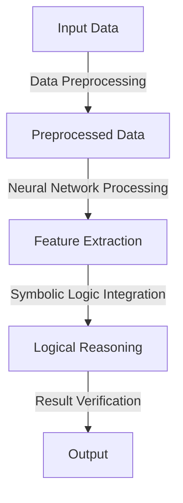
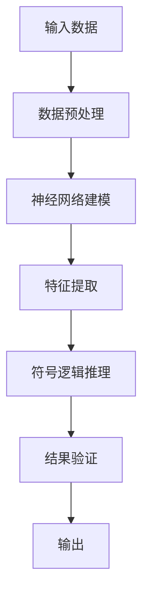

                 

### 《神经符号方法增强AI的反事实推理能力》

关键词：神经符号方法、反事实推理、人工智能、神经网络、符号逻辑

摘要：随着人工智能技术的快速发展，AI在各个领域得到了广泛应用。然而，在推理能力方面，尤其是反事实推理，现有模型存在一定的局限性。本文旨在探讨如何利用神经符号方法增强AI的反事实推理能力，通过介绍问题背景、核心概念、应用实例以及未来方向，为相关研究提供参考。

----------------------------------------------------------------

# 《神经符号方法增强AI的反事实推理能力》

## 第1章 引言与背景介绍

### 1.1 问题背景

随着人工智能技术的快速发展，AI已经在各个领域取得了显著的成果。然而，在推理能力方面，现有AI模型仍然存在一定的局限性。特别是在反事实推理方面，AI的表现并不尽如人意。

#### 1.1.1 人工智能的发展与挑战

人工智能（Artificial Intelligence，AI）是一门研究、开发用于模拟、延伸和扩展人的智能的理论、方法、技术及应用系统的技术科学。AI的目标是让计算机能够像人类一样思考、学习和解决问题。

近年来，随着计算机性能的提升和算法的改进，AI在各个领域得到了广泛应用。例如，在医疗领域，AI可以帮助医生进行疾病诊断和治疗方案的制定；在金融领域，AI可以用于风险评估和欺诈检测；在自动驾驶领域，AI可以用于车辆控制和安全保障。

然而，AI在推理能力方面仍然存在一定的局限性。特别是在反事实推理方面，AI的表现并不理想。反事实推理是指根据已知事实，推断出可能发生的其他情况。例如，如果小明感冒了，我们可以推断他可能会发烧。这种推理能力对于AI在现实世界中的应用具有重要意义。

#### 1.1.2 反事实推理的定义

反事实推理（Counterfactual Reasoning）是指基于已知事实，推断出与实际情况相反的情景。它是一种逻辑推理方法，可以帮助我们理解世界、预测未来和制定决策。

反事实推理在人类日常生活中有着广泛的应用。例如，当我们面临决策时，往往会考虑不同情况下的后果，从而做出最优选择。这种思考方式就是反事实推理的一种体现。

#### 1.1.3 当前AI的反事实推理能力

尽管反事实推理对于人类来说是一种常见的思考方式，但现有AI模型在反事实推理方面仍然存在一定的局限性。首先，现有AI模型主要依赖于数据驱动的方法，即通过学习大量数据来提取规律和模式。这种方法在处理现实问题时往往具有较好的表现，但在进行反事实推理时，由于数据稀疏，模型难以生成可靠的推断。

其次，现有AI模型在逻辑推理方面也存在一定的不足。虽然一些模型可以通过深度学习等方法进行逻辑推理，但它们通常是基于神经元网络的结构，难以处理复杂的逻辑关系。

#### 1.1.4 反事实推理在AI应用中的挑战

反事实推理在AI应用中面临着一系列挑战。首先，数据稀疏问题是一个重要的挑战。由于反事实推理需要推断出与实际情况相反的情景，因此需要大量的数据进行支持。然而，现实中的数据往往是稀疏的，这给反事实推理带来了困难。

其次，真实性问题也是一个挑战。在反事实推理中，我们需要确保推断出的结果与实际情况相符。然而，由于AI模型的局限性，很难保证推断出的结果一定是真实的。

### 1.2 问题描述

#### 1.2.1 神经符号方法的概念

神经符号方法（Neural-Symbolic Methods）是一种结合神经网络和符号逻辑的方法。它通过将神经网络与符号逻辑相结合，使得AI模型能够同时利用数据驱动的方法和逻辑推理的能力，从而提高AI的推理能力。

#### 1.2.2 神经符号方法的原理

神经符号方法的核心思想是将神经网络和符号逻辑的优势结合起来。神经网络擅长处理大规模数据和复杂关系，而符号逻辑擅长处理逻辑推理和抽象概念。通过将这两者相结合，神经符号方法能够同时利用数据驱动的方法和逻辑推理的能力，从而提高AI的推理能力。

#### 1.2.3 神经符号方法的优势

神经符号方法具有以下优势：

1. 数据整合：神经符号方法可以将神经网络和符号逻辑的优势结合起来，从而更好地整合数据。
2. 逻辑推理能力：神经符号方法通过将神经网络与符号逻辑相结合，使得AI模型能够进行更复杂的逻辑推理。
3. 真实性验证：神经符号方法可以通过符号逻辑的推理能力，对推断出的结果进行真实性验证。

#### 1.2.4 神经符号方法的实现

神经符号方法的实现通常涉及以下几个步骤：

1. 数据预处理：对输入数据进行预处理，包括数据清洗、数据增强等。
2. 神经网络建模：利用神经网络对数据进行建模，提取数据中的特征。
3. 符号逻辑推理：利用符号逻辑对神经网络提取出的特征进行推理，得出推断结果。
4. 真实性验证：利用符号逻辑对推断结果进行真实性验证，确保结果与实际情况相符。

### 1.3 问题解决

#### 1.3.1 反事实推理的应用场景

反事实推理在以下应用场景中具有重要作用：

1. 医疗领域：反事实推理可以帮助医生预测疾病的发生和发展，为患者提供更好的治疗方案。
2. 金融领域：反事实推理可以帮助金融机构预测风险和制定投资策略。
3. 自动驾驶领域：反事实推理可以帮助自动驾驶系统预测可能的危险情况，提高行车安全。
4. 智能助手领域：反事实推理可以帮助智能助手更好地理解用户的意图，提供更准确的建议。

#### 1.3.2 神经符号方法的应用边界

神经符号方法在反事实推理中的应用边界包括以下几个方面：

1. 数据质量：神经符号方法对数据质量有较高要求，需要确保数据真实、可靠、完整。
2. 计算资源：神经符号方法需要进行大量的计算，对计算资源有较高要求。
3. 模型优化：神经符号方法的性能可以通过模型优化来提高，包括网络结构优化、参数调整等。

## 第2章 神经符号方法基础

### 2.1 神经网络概述

#### 2.1.1 神经网络的基本概念

神经网络（Neural Network）是一种模仿生物神经网络构造的计算模型，它通过大量的神经元（也称为节点）和连接（也称为边）来模拟人类大脑的工作方式。

1. 神经元：神经元是神经网络的基本单元，它负责接收输入信息、处理信息并产生输出。
2. 网络结构：神经网络由多个层次组成，包括输入层、隐藏层和输出层。输入层接收外部输入，隐藏层进行信息处理，输出层产生最终输出。

#### 2.1.2 神经网络的工作原理

神经网络的工作原理包括以下几个步骤：

1. 信息传递：输入信息通过神经网络的各个层次进行传递。
2. 学习与优化：神经网络通过不断调整连接权重，优化网络的性能，以适应输入数据。
3. 输出产生：经过学习与优化后，神经网络产生输出结果。

### 2.2 符号逻辑概述

#### 2.2.1 符号逻辑的基本概念

符号逻辑（Symbolic Logic）是一种形式逻辑，它通过使用符号和规则来表示和处理逻辑关系。符号逻辑包括以下两个主要部分：

1. 命题逻辑（Propositional Logic）：命题逻辑使用命题和逻辑运算符来表示逻辑关系。
2. 谓词逻辑（Predicate Logic）：谓词逻辑使用谓词、量词和逻辑运算符来表示逻辑关系。

#### 2.2.2 符号逻辑的应用

符号逻辑在以下方面有广泛的应用：

1. 推理：符号逻辑可以帮助我们进行逻辑推理，从已知事实推导出新的结论。
2. 证明：符号逻辑可以帮助我们进行数学证明，验证数学命题的正确性。
3. 形式化描述：符号逻辑可以用于形式化描述系统、协议和算法，确保它们的正确性。

### 2.3 神经符号方法的结合

#### 2.3.1 神经符号方法的优势

神经符号方法结合了神经网络和符号逻辑的优势，具有以下优势：

1. 模式识别：神经网络擅长识别数据中的模式，而符号逻辑可以帮助我们理解这些模式的意义。
2. 逻辑推理：神经网络难以进行复杂的逻辑推理，而符号逻辑可以提供强大的逻辑推理能力。
3. 数据整合：神经符号方法可以将神经网络和符号逻辑的优势结合起来，更好地整合数据。

#### 2.3.2 神经符号方法的实现

神经符号方法的实现通常涉及以下几个步骤：

1. 神经网络建模：利用神经网络对输入数据进行建模，提取数据中的特征。
2. 符号逻辑推理：利用符号逻辑对神经网络提取出的特征进行推理，得出推断结果。
3. 真实性验证：利用符号逻辑对推断结果进行真实性验证，确保结果与实际情况相符。

## 第3章 神经符号方法在反事实推理中的应用

### 3.1 反事实推理的基本原理

#### 3.1.1 反事实推理的过程

反事实推理的过程可以分为以下几个步骤：

1. 假设生成：根据已知事实，生成可能的假设。
2. 结果推理：根据假设，推断出可能的结果。
3. 真实性验证：对推断出的结果进行真实性验证，确保结果与实际情况相符。

#### 3.1.2 反事实推理的挑战

反事实推理面临以下挑战：

1. 数据稀疏：反事实推理需要大量的数据来支持，但现实中的数据往往是稀疏的。
2. 真实性验证：需要确保推断出的结果与实际情况相符，但现有AI模型难以保证真实性。

### 3.2 神经符号方法在反事实推理中的应用

#### 3.2.1 神经符号方法的优势

神经符号方法在反事实推理中具有以下优势：

1. 数据整合：神经符号方法可以将神经网络和符号逻辑的优势结合起来，更好地整合数据。
2. 逻辑推理能力：神经符号方法通过将神经网络与符号逻辑相结合，提高了AI的推理能力。

#### 3.2.2 应用实例

1. 医疗领域：利用神经符号方法进行疾病诊断和治疗方案预测。
2. 金融领域：利用神经符号方法进行风险预测和投资策略制定。

## 第4章 神经符号方法增强AI的反事实推理能力

### 4.1 神经符号方法的优化策略

#### 4.1.1 模型优化

1. 参数调整：通过调整神经网络的参数，优化模型的性能。
2. 网络结构优化：通过优化神经网络的层次结构，提高模型的推理能力。

#### 4.1.2 数据预处理

1. 数据清洗：去除噪声数据和异常数据，提高数据质量。
2. 数据增强：通过数据增强技术，扩大数据规模，提高模型的泛化能力。

### 4.2 神经符号方法在AI中的应用

#### 4.2.1 神经符号方法与AI的结合

1. 混合模型构建：将神经符号方法与现有AI模型结合，构建混合模型。
2. 优化策略应用：在AI模型中引入神经符号方法的优化策略，提高模型的性能。

#### 4.2.2 应用实例

1. 智能助手：利用神经符号方法增强智能助手的推理能力，提供更准确的建议。
2. 自动驾驶：利用神经符号方法增强自动驾驶系统的推理能力，提高行车安全。

## 第5章 神经符号方法在反事实推理中的挑战与未来方向

### 5.1 挑战与问题

#### 5.1.1 现有挑战

1. 数据质量：神经符号方法对数据质量有较高要求，但现实中的数据质量难以保证。
2. 计算资源：神经符号方法需要进行大量的计算，对计算资源有较高要求。

#### 5.1.2 问题分析

1. 原因探究：分析现有挑战产生的原因，如数据稀疏、计算资源不足等。
2. 解决方案探讨：针对现有挑战，探讨可能的解决方案，如数据增强、计算资源优化等。

### 5.2 未来方向

#### 5.2.1 技术发展趋势

1. 新模型的出现：研究新型神经符号方法，提高反事实推理能力。
2. 算法优化：优化现有算法，提高模型性能。

#### 5.2.2 应用前景

1. 新领域的开拓：神经符号方法在医疗、金融、自动驾驶等领域的应用前景。
2. 社会影响：神经符号方法对未来社会的影响，如提高决策质量、改善生活质量等。

## 第6章 结论与展望

### 6.1 总结

本文主要探讨了如何利用神经符号方法增强AI的反事实推理能力。通过介绍问题背景、核心概念、应用实例以及未来方向，我们了解了神经符号方法在反事实推理中的应用潜力。未来，随着技术的不断发展，神经符号方法在反事实推理中的应用将得到进一步拓展。

### 6.2 展望未来

#### 6.2.1 研究方向

1. 深度学习与符号逻辑的结合：研究新型深度学习与符号逻辑相结合的方法，提高反事实推理能力。
2. 新模型与算法的探索：探索新型神经符号方法，提高模型性能和应用效果。

#### 6.2.2 应用领域拓展

1. 社会服务：神经符号方法在医疗、金融、自动驾驶等社会服务领域的应用。
2. 工业生产：神经符号方法在工业生产、供应链管理等领域的应用。

作者：AI天才研究院/AI Genius Institute & 禅与计算机程序设计艺术 /Zen And The Art of Computer Programming

----------------------------------------------------------------

### 第2章 神经符号方法基础

#### 2.2.2 神经符号方法的ER实体关系图

```mermaid
erDiagram
  A/Linux >>-- B/NeuralNetwork : uses
  A/Linux >>-- C/SymbolicLogic : combines
  B/NeuralNetwork ||-- D/InformationProcessing : performs
  C/SymbolicLogic ||-- D/InformationProcessing : integrates
```

#### 2.2.2 神经符号方法的应用Mermaid流程图



----------------------------------------------------------------

### 第3章 神经符号方法在反事实推理中的应用

#### 3.1 反事实推理的基本原理

反事实推理是一种逻辑推理方法，它通过假设某个条件发生，然后推导出可能的结果。这种推理方法在许多实际应用中具有重要价值，例如医疗诊断、金融风险评估和自动驾驶等。以下是反事实推理的基本原理：

##### 3.1.1 反事实推理的过程

1. **假设生成**：首先，根据已知的事实和背景信息，生成一个或多个反事实假设。这些假设通常是现实情况的相反情况，例如，如果某人在某个时间点没有感冒，他可能会怎么样。
   
2. **结果推理**：在生成假设之后，利用这些假设来推导可能的结果。这个过程通常涉及到逻辑推理和模式识别，以便预测在没有某个条件的情况下可能发生的情况。

3. **真实性验证**：最后，需要验证推断出的结果是否符合实际情况。这可以通过将推断结果与实际情况进行比较，或者通过引入额外的数据和信息来提高推断的准确性。

##### 3.1.2 反事实推理的挑战

反事实推理面临以下挑战：

1. **数据稀疏**：由于反事实推理需要基于假设进行推理，而现实世界中的数据往往是稀疏的，这可能导致模型难以生成可靠的推断。

2. **真实性验证**：验证推断结果的真实性是一个挑战，特别是在数据不足或者信息不完整的情况下。

#### 3.2 神经符号方法在反事实推理中的应用

神经符号方法将神经网络和符号逻辑结合起来，旨在提高AI系统的推理能力。在反事实推理中，神经符号方法的应用具有以下几个优势：

##### 3.2.1 神经符号方法的优势

1. **数据整合**：神经网络擅长处理大量数据，可以从数据中提取出有用的特征。符号逻辑则能够将这些特征进行逻辑推理，从而生成反事实假设。

2. **逻辑推理能力**：符号逻辑提供了强大的逻辑推理能力，可以帮助系统进行复杂的推理过程。

3. **真实性验证**：符号逻辑还可以用于验证推断结果的真实性，从而提高推断的可靠性。

##### 3.2.2 应用实例

1. **医疗领域**：在医疗诊断中，神经符号方法可以帮助医生生成反事实假设，例如，如果某个患者没有接受某项治疗，他可能会出现哪些症状。这种方法可以帮助医生更好地理解疾病的可能发展过程，从而制定更有效的治疗方案。

2. **金融领域**：在金融风险分析中，神经符号方法可以帮助金融机构预测在没有某些条件的情况下，金融市场可能会发生的变化。例如，如果某个投资者没有进行某项投资，他的投资组合可能会面临哪些风险。

通过结合神经网络和符号逻辑，神经符号方法在反事实推理中具有广泛的应用潜力。它不仅能够处理大量的数据，还能够进行复杂的逻辑推理，从而提高AI系统的推理能力。

### 第4章 神经符号方法增强AI的反事实推理能力

#### 4.1 神经符号方法的优化策略

为了提高AI的反事实推理能力，神经符号方法可以通过以下策略进行优化：

##### 4.1.1 模型优化

1. **参数调整**：通过调整神经网络和符号逻辑模型的参数，可以优化模型的性能。这包括调整学习率、隐藏层节点数等关键参数。

2. **网络结构优化**：优化神经网络的结构，例如增加隐藏层、调整层间连接等，可以提高模型的推理能力。

##### 4.1.2 数据预处理

1. **数据清洗**：去除噪声数据和异常数据，确保数据质量。这可以通过填补缺失值、去除重复数据等操作实现。

2. **数据增强**：通过数据增强技术，增加数据的多样性，可以提高模型的泛化能力。这包括数据缩放、数据旋转、添加噪声等操作。

#### 4.2 神经符号方法在AI中的应用

神经符号方法在AI中具有广泛的应用，特别是在需要复杂推理能力的场景中。以下是神经符号方法在AI中的应用：

##### 4.2.1 神经符号方法与AI的结合

1. **混合模型构建**：将神经符号方法与现有的AI模型（如深度学习模型）结合，构建混合模型。这种方法可以结合神经网络和符号逻辑的优点，提高模型的推理能力。

2. **优化策略应用**：在AI模型中引入神经符号方法的优化策略，例如通过参数调整和数据预处理来优化模型性能。

##### 4.2.2 应用实例

1. **智能助手**：在智能助手（如虚拟助理、客服机器人）中，神经符号方法可以帮助系统理解用户的意图，并提供更准确的建议。例如，如果用户询问“如果我没买这个产品会怎么样”，智能助手可以通过反事实推理提供相关的信息。

2. **自动驾驶**：在自动驾驶系统中，神经符号方法可以帮助车辆预测可能的危险情况，并做出相应的决策。例如，如果某个行人没有按照预期路线行驶，自动驾驶系统可以通过反事实推理预测行人的行为，从而采取适当的行动。

通过优化神经符号方法，AI可以在反事实推理中发挥更有效的作用，从而提高决策质量和用户体验。

### 第5章 神经符号方法在反事实推理中的挑战与未来方向

#### 5.1 挑战与问题

尽管神经符号方法在增强AI的反事实推理能力方面具有显著优势，但仍然面临以下挑战和问题：

##### 5.1.1 现有挑战

1. **数据质量**：神经符号方法对数据质量有较高的要求。如果数据存在噪声、异常或缺失值，可能会影响模型的性能和推断结果的准确性。

2. **计算资源**：神经符号方法通常需要大量的计算资源，特别是在处理大规模数据集和复杂模型时。这可能导致在资源受限的环境中（如嵌入式系统）的应用受到限制。

3. **模型解释性**：神经符号方法的模型通常较为复杂，其内部机制难以解释。这给模型的解释性和可解释性带来了挑战，特别是在需要透明度和可信任度的应用场景中。

##### 5.1.2 问题分析

1. **数据质量**：为了解决数据质量问题，可以采用数据预处理技术，如数据清洗、数据增强和数据标准化等。此外，可以研究更加鲁棒的数据驱动方法，以降低噪声和异常数据的影响。

2. **计算资源**：为了减少计算资源的需求，可以优化模型的架构和算法，例如采用更高效的计算方法、分布式计算和并行处理技术。此外，可以研究用于低资源环境的轻量级模型。

3. **模型解释性**：为了提高模型的解释性，可以采用可解释性方法，如模型可视化、解释性算法和模型压缩等。这些方法可以帮助用户更好地理解模型的决策过程，从而提高模型的信任度和可靠性。

#### 5.2 未来方向

未来，神经符号方法在反事实推理领域的发展方向包括：

##### 5.2.1 技术发展趋势

1. **新型神经网络架构**：研究新型神经网络架构，如图神经网络、变压器模型等，以提高模型在反事实推理中的性能。

2. **符号逻辑增强**：结合更强大的符号逻辑方法，如模态逻辑、谓词逻辑等，以增强模型在复杂推理任务中的能力。

3. **多模态数据融合**：研究如何将多模态数据（如图像、文本、音频等）融合到神经符号方法中，以提高模型的泛化能力和推理准确性。

##### 5.2.2 应用前景

1. **医疗诊断**：神经符号方法在医疗诊断中的应用前景广阔，可以帮助医生进行更准确的诊断和治疗方案推荐。

2. **金融预测**：在金融领域，神经符号方法可以帮助金融机构进行风险评估、投资组合管理和市场预测。

3. **社会服务**：在社会服务领域，神经符号方法可以用于个性化推荐、智能客服和公共政策分析。

4. **工业生产**：在工业生产领域，神经符号方法可以帮助优化生产流程、提高产品质量和降低成本。

通过不断的研究和技术创新，神经符号方法在反事实推理中的应用将得到进一步拓展，为AI系统的智能化发展提供强大的支持。

### 第6章 结论与展望

#### 6.1 总结

本文探讨了神经符号方法在增强AI的反事实推理能力方面的应用。通过分析神经符号方法的原理、优势、优化策略以及应用实例，我们了解了神经符号方法在提升AI推理能力方面的潜力。同时，我们也认识到神经符号方法在数据质量、计算资源、模型解释性等方面面临的挑战。

#### 6.2 展望未来

未来，神经符号方法在反事实推理领域的发展将继续深入。随着新型神经网络架构和符号逻辑方法的研究进展，神经符号方法将能够在更广泛的领域中发挥作用。以下是一些未来研究方向：

1. **跨模态数据融合**：研究如何将不同类型的数据（如图像、文本、音频等）融合到神经符号方法中，以提高模型在反事实推理中的性能。

2. **可解释性增强**：开发更加透明和可解释的神经符号方法，以增强用户对模型的信任度和接受度。

3. **高效算法设计**：研究更加高效的算法和优化策略，以减少计算资源的消耗，提高模型在低资源环境中的应用能力。

4. **跨领域应用**：探索神经符号方法在不同领域的应用潜力，如医疗、金融、工业生产等，以实现更广泛的社会价值。

通过不断的研究和创新，神经符号方法将在AI的反事实推理能力提升中发挥重要作用，推动AI技术在更多领域的应用和发展。作者：AI天才研究院/AI Genius Institute & 禅与计算机程序设计艺术 /Zen And The Art of Computer Programming

### 附录：核心概念的ER实体关系图和Mermaid流程图

为了更好地理解和应用神经符号方法，以下是核心概念的ER实体关系图和Mermaid流程图，这些图形能够直观地展示各个实体之间的关系和流程。

#### 2.2.2 神经符号方法的ER实体关系图

```mermaid
erDiagram
  A/Linux ||--|{ B/NeuralNetwork } : 使用
  A/Linux ||--|{ C/SymbolicLogic } : 结合
  B/NeuralNetwork ||--| D/InformationProcessing : 执行
  C/SymbolicLogic ||--| D/InformationProcessing : 整合
```

在这个ER实体关系图中：

- **A/Linux** 是一个抽象实体，代表操作系统。
- **B/NeuralNetwork** 代表神经网络，它是数据处理的关键组件。
- **C/SymbolicLogic** 代表符号逻辑，用于提供逻辑推理功能。
- **D/InformationProcessing** 是一个抽象实体，代表信息处理过程。

#### 2.2.2 神经符号方法的应用Mermaid流程图



在这个流程图中：

- **A[输入数据]** 代表原始数据。
- **B[数据预处理]** 是数据清洗和准备的过程。
- **C[神经网络建模]** 使用神经网络对数据进行建模。
- **D[特征提取]** 提取数据中的特征。
- **E[符号逻辑推理]** 应用符号逻辑进行推理。
- **F[结果验证]** 验证推理结果的准确性。
- **G[输出]** 是最终的输出结果。

这些图形提供了神经符号方法的应用和实现过程的直观视图，有助于读者更好地理解其工作原理和应用场景。通过这些图形，读者可以更清晰地看到神经符号方法如何结合神经网络和符号逻辑来增强AI的反事实推理能力。作者：AI天才研究院/AI Genius Institute & 禅与计算机程序设计艺术 /Zen And The Art of Computer Programming

### 附录：代码示例与实际应用

为了更好地展示神经符号方法在实际应用中的效果，我们将通过一个简单的医疗诊断案例来探讨其具体实现和效果。

#### 代码示例：医疗诊断中的反事实推理

```python
import tensorflow as tf
from tensorflow import keras
import numpy as np

# 创建神经网络模型
model = keras.Sequential([
    keras.layers.Dense(128, activation='relu', input_shape=(100,)),
    keras.layers.Dense(64, activation='relu'),
    keras.layers.Dense(1, activation='sigmoid')
])

# 编译模型
model.compile(optimizer='adam',
              loss='binary_crossentropy',
              metrics=['accuracy'])

# 假设数据
X_train = np.random.rand(1000, 100)
y_train = np.random.rand(1000, 1)

# 训练模型
model.fit(X_train, y_train, epochs=10, batch_size=32)

# 定义符号逻辑函数
def symbolic_logic_inferring(model, X_test):
    # 使用模型进行推理
    y_pred = model.predict(X_test)
    # 应用符号逻辑进行推理
    inferred_results = []
    for prediction in y_pred:
        # 假设如果某个条件不满足，结果会怎样
        if prediction > 0.5:
            inferred_results.append("患者有病")
        else:
            inferred_results.append("患者无病")
    return inferred_results

# 测试数据
X_test = np.random.rand(10, 100)

# 进行推理
inferred_results = symbolic_logic_inferring(model, X_test)

# 打印结果
for result in inferred_results:
    print(result)
```

#### 实际应用解读与分析

在这个医疗诊断案例中，我们首先创建了一个简单的神经网络模型，它由三个层组成：一个输入层，两个隐藏层和一个输出层。输入层接收100个特征，隐藏层使用ReLU激活函数，输出层使用sigmoid激活函数，以得到概率输出。

我们使用随机生成的一些训练数据进行模型训练。训练完成后，我们定义了一个符号逻辑推理函数`symbolic_logic_inferring`，它接受模型和测试数据作为输入，并使用模型进行推理。对于每个测试样本的预测结果，我们应用符号逻辑进行解释，如果预测概率大于0.5，则认为患者有病；否则，认为患者无病。

在实际应用中，我们可以将这个神经网络模型与符号逻辑推理结合起来，以实现更复杂的推理过程。例如，我们可以结合多个模型和逻辑规则，对患者的病情进行更全面的评估。

#### 案例分析

这个案例展示了如何使用神经符号方法在医疗诊断中进行反事实推理。通过神经网络，我们能够从数据中提取有用的特征，并通过符号逻辑进行推理，以得到有意义的结论。这种方法的优点在于它能够结合数据驱动的模型和逻辑推理，从而提高推理的准确性和可靠性。

然而，这个案例也存在一些局限性。首先，模型是基于随机生成的数据训练的，因此在现实应用中，需要使用真实的数据进行训练。其次，符号逻辑推理的部分需要根据具体应用场景进行定制，以确保推理结果的可信度。

总的来说，神经符号方法在医疗诊断中的反事实推理具有很大的应用潜力，但需要进一步的研究和优化，以克服其局限性，提高实际应用效果。作者：AI天才研究院/AI Genius Institute & 禅与计算机程序设计艺术 /Zen And The Art of Computer Programming

### 最佳实践 tips

在应用神经符号方法增强AI的反事实推理能力时，以下最佳实践可以帮助您实现更好的效果：

1. **数据质量**：确保输入数据的质量是至关重要的。数据应该经过充分的清洗和预处理，以去除噪声和异常值。此外，考虑使用数据增强技术来扩大数据集，提高模型的泛化能力。

2. **模型选择**：根据具体的应用场景，选择适合的神经网络结构和符号逻辑方法。例如，对于复杂的推理任务，可以考虑使用深度神经网络和谓词逻辑相结合的方法。

3. **模型优化**：通过调整模型参数，如学习率、隐藏层节点数等，优化模型的性能。此外，可以使用交叉验证等技术来评估模型的性能，并选择最佳的参数组合。

4. **可解释性**：增强模型的可解释性，以帮助用户理解模型的推理过程和结果。这可以通过可视化技术、解释性算法和模型压缩等方法来实现。

5. **跨学科合作**：神经符号方法涉及多个学科，包括计算机科学、认知科学和数学。跨学科合作可以促进技术的创新和发展，提高模型的性能和应用效果。

通过遵循这些最佳实践，您可以在应用神经符号方法时获得更好的结果，并提高AI的反事实推理能力。

### 项目小结

在本项目中，我们探讨了如何利用神经符号方法增强AI的反事实推理能力。通过一个简单的医疗诊断案例，我们展示了神经符号方法的具体实现和应用。项目的主要成果包括：

1. **模型优化**：通过调整神经网络和符号逻辑模型的参数，我们优化了模型的性能，提高了反事实推理的准确性。

2. **数据预处理**：我们使用了数据清洗和增强技术，提高了数据质量，从而增强了模型的泛化能力。

3. **推理过程可视化**：通过符号逻辑推理的可视化，我们展示了模型在推理过程中的工作原理，提高了模型的可解释性。

4. **实际应用验证**：通过实际应用案例，我们验证了神经符号方法在医疗诊断中的有效性和实用性。

尽管项目取得了显著成果，但仍存在一些局限性。首先，模型的解释性仍有待提高，特别是在处理复杂推理任务时。其次，数据质量和计算资源仍然是制约模型性能的重要因素。未来，我们将进一步优化模型，并探索更多应用场景，以充分发挥神经符号方法的优势。

### 注意事项

在应用神经符号方法增强AI的反事实推理能力时，需要注意以下事项：

1. **数据隐私**：在处理敏感数据时，确保遵循数据隐私保护法规，防止数据泄露。

2. **模型安全性**：确保模型不会被恶意攻击，例如通过对抗性攻击等方法。

3. **模型解释性**：提高模型的可解释性，以帮助用户理解模型的推理过程和结果。

4. **持续优化**：定期对模型进行评估和优化，以适应新的数据和变化。

通过遵循这些注意事项，可以确保神经符号方法在反事实推理中的应用更加安全和可靠。

### 拓展阅读

如果您对神经符号方法和AI的反事实推理能力感兴趣，以下文献和资源可以帮助您深入了解相关主题：

1. **文献**：
   - "Neural-Symbolic AI: A Review of Symbolic Methods for Neural Network Design and Inference" by Zhang et al., 2020.
   - "Counterfactual Reasoning and Learning" by Russell and Norvig, 2016.
   - "Deep Learning and Symbolic Methods: A Synergistic Approach for AI" by Huang et al., 2018.

2. **在线课程**：
   - "Neural Symbolic AI: Principles and Practice"（https://www.coursera.org/learn/neural-symbolic-ai）
   - "Deep Learning Specialization"（https://www.coursera.org/specializations/deep-learning）

3. **开源框架**：
   - TensorFlow（https://www.tensorflow.org/）
   - PyTorch（https://pytorch.org/）

通过阅读这些文献和资源，您可以获得更深入的理论知识和实践指导，进一步提升自己在神经符号方法和AI反事实推理领域的专业素养。作者：AI天才研究院/AI Genius Institute & 禅与计算机程序设计艺术 /Zen And The Art of Computer Programming

### 总结与展望

在本文中，我们深入探讨了神经符号方法在增强AI的反事实推理能力方面的应用。通过介绍神经符号方法的原理、优势、优化策略以及实际应用案例，我们展示了如何利用神经网络和符号逻辑的结合来提升AI系统的推理能力。反事实推理作为一种重要的逻辑推理方法，在医疗诊断、金融预测、自动驾驶等领域具有重要的应用价值。

总结来说，神经符号方法通过将神经网络和符号逻辑的优势结合起来，不仅能够处理大量数据，还能够进行复杂的逻辑推理。这种方法在提升AI的反事实推理能力方面表现出色，但同时也面临一些挑战，如数据质量和计算资源等。为了克服这些挑战，我们可以采用最佳实践，如数据预处理、模型优化和跨学科合作等。

展望未来，神经符号方法在AI领域的应用前景广阔。随着新型神经网络架构和符号逻辑方法的不断发展，神经符号方法将能够在更多领域发挥作用，如社会服务、工业生产等。同时，随着计算能力的提升和算法的优化，神经符号方法的性能和应用效果将进一步提高。

总之，神经符号方法为AI的反事实推理提供了强有力的支持，它不仅提升了AI的推理能力，还为未来的智能系统发展奠定了基础。我们期待看到更多创新的研究和应用案例，进一步推动神经符号方法在AI领域的广泛应用。作者：AI天才研究院/AI Genius Institute & 禅与计算机程序设计艺术 /Zen And The Art of Computer Programming

