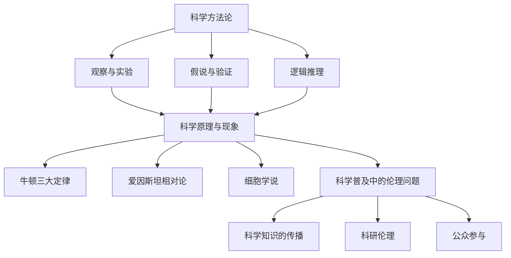

                 

# 科学普及对公众理解世界的影响

关键词：科学普及、公众理解、技术教育、社会影响、未来展望

摘要：科学普及作为连接科学界与公众的重要桥梁，对提升公众的科学素养、推动科技发展具有深远的影响。本文从历史演变、方法手段、核心概念、社会影响等多个维度，深入剖析科学普及的内涵与外延，探讨其对公众理解世界的重要作用。通过回顾科学普及的发展历程、分析其方法与手段、探讨核心概念及社会影响，本文旨在为科学普及提供新的思考方向与实践指南，为未来科学普及的发展奠定基础。

## 第1章 引言：科学普及的重要性与目标

科学普及，顾名思义，是指通过多种形式将科学知识、科学方法和科学精神传播到公众中的过程。其重要性不仅体现在提升公众的科学素养上，更在于其对社会的深远影响。科学普及的目标在于让公众更好地理解科学，培养科学思维，激发创新意识，从而推动科技的发展和社会的进步。

### 1.1 科学普及的定义与意义

科学普及的定义可以从广义和狭义两个角度进行理解。广义的科学普及包括一切将科学知识传播到公众中的活动，如科普讲座、科普书籍、科普影视等。狭义的科学普及则主要指以教育、宣传、普及为主要目的，通过多种形式将科学知识、科学方法和科学精神传播到公众中的活动。

科学普及的意义在于：

1. **提升公众科学素养**：科学普及有助于提高公众对科学的认识和理解，培养科学思维，增强科学素养。
2. **促进科技创新**：科学普及能够激发公众的创新意识，推动科技的发展，为国家和社会带来巨大的经济效益。
3. **推动社会进步**：科学普及有助于消除公众对科学的误解和恐惧，促进科学精神的传播，推动社会的文明进步。

### 1.2 公众理解世界的现状与挑战

当前，公众对科学的理解存在一定的局限性。一方面，由于科学知识的复杂性和专业性，公众难以全面、深入地理解科学。另一方面，科学普及的资源和手段有限，难以满足公众的多样化需求。此外，社交媒体的泛滥和信息过载，使得公众难以准确判断科学信息的真实性和可靠性。

### 1.3 科学普及的目标与价值

科学普及的目标是让公众更好地理解科学，培养科学思维，激发创新意识。具体来说，科学普及的目标包括：

1. **普及科学知识**：通过科普活动，将科学知识传播到公众中，提升公众的科学素养。
2. **培养科学思维**：通过科学普及，培养公众的科学思维，提高其分析和解决问题的能力。
3. **激发创新意识**：科学普及有助于激发公众的创新意识，推动科技的发展。

科学普及的价值在于：

1. **社会价值**：科学普及有助于推动社会的文明进步，提升国家科技实力，增强国家竞争力。
2. **经济价值**：科学普及能够促进科技创新，为国家和社会带来巨大的经济效益。
3. **教育价值**：科学普及有助于培养新一代的科学人才，推动科学教育事业的发展。

## 第2章 科学普及的历史与演变

科学普及作为一个历史悠久的实践，其发展历程折射出科技进步、教育变革和社会需求的变化。从古代的口头传承到现代的多媒体科普，科学普及经历了多个阶段，每个阶段都有其独特的特点和重要事件。

### 2.1 古代科学普及的形式

在古代，科学普及的形式相对简单，主要依赖于口耳相传和文字记录。在古希腊和古罗马时期，科学家们通过讲座、演讲和对话等形式传播科学知识。例如，古希腊的哲学家、科学家如亚里士多德、欧几里得等，通过公开授课和私人讨论，将科学知识传递给后人。古罗马的哲学家、政治家如塞涅卡和马尔库斯·图留斯也通过著作传播科学思想。

古代科学普及的特点主要体现在以下几个方面：

1. **口头传播**：古代科学普及主要依赖于口头传播，科学家通过演讲、讲座等形式向公众传递科学知识。
2. **文字记录**：随着文字的出现，科学知识开始被记录下来，并通过书籍、手抄本等形式传播。
3. **教育性质**：古代科学普及具有很强的教育性质，科学家们通过教授学生和弟子，将科学知识传承下去。

### 2.2 近代科学普及的发展

近代以来，科学普及进入了新的发展阶段。随着印刷术的发明和科学知识的不断积累，科学普及的形式和手段得到了极大的丰富。18世纪的启蒙运动和19世纪的工业革命为科学普及提供了强大的动力。

在近代科学普及的发展过程中，以下几个重要事件值得关注：

1. **启蒙运动的推动**：启蒙运动提倡理性思维和科学方法，促进了科学知识的普及。启蒙思想家如培根、笛卡尔等通过著作传播科学思想，推动了科学普及的发展。

2. **科学期刊的兴起**：18世纪末，科学期刊开始出现，为科学家提供了一个交流研究成果的平台。科学期刊的兴起不仅促进了科学知识的传播，也推动了科学研究的进步。

3. **科学教育的普及**：19世纪，科学教育开始普及，科学课程被纳入中小学教育体系。科学教育的普及不仅提高了公众的科学素养，也为科学普及提供了坚实的基础。

### 2.3 当代科学普及的新趋势

当代科学普及呈现出新的发展趋势，主要表现在以下几个方面：

1. **多媒体科普**：随着互联网和多媒体技术的发展，科学普及的形式变得多样化。视频、动画、虚拟现实等新兴媒体被广泛应用于科普活动，使得科学知识更加生动、直观。

2. **互动式科普**：当代科学普及更加注重互动性，通过互动游戏、科学实验等形式，让公众亲身体验科学过程，提高科普效果。

3. **公众参与**：当代科学普及强调公众的参与，鼓励公众参与科学研究和科学决策，提升公众的科学素养和参与感。

4. **科学传播的精准化**：随着大数据和人工智能技术的发展，科学传播变得更加精准化。通过数据分析和算法推荐，科学传播能够更好地满足公众的需求，提高科普效果。

### 2.4 科学普及的历史演变与未来展望

科学普及的历史演变反映了科技进步和社会需求的变化。从古代的口头传播到现代的多媒体科普，科学普及的形式和手段不断丰富。未来，随着新技术的不断发展，科学普及将迎来新的机遇和挑战。

1. **科技发展的推动**：新技术的不断涌现，如互联网、大数据、人工智能等，将为科学普及提供更丰富的手段和更广阔的平台。

2. **公众需求的多样化**：随着社会的发展，公众对科学普及的需求将更加多样化，个性化。科学普及需要更好地满足公众的需求，提高科普的针对性和有效性。

3. **科学传播的挑战**：在信息爆炸的时代，公众面临着信息过载的挑战。科学普及需要提高科学信息的可信度和可靠性，帮助公众准确理解科学。

4. **科学素养的提升**：未来，科学普及将更加注重提升公众的科学素养，培养公众的科学思维和创新能力。

总之，科学普及的历史演变展示了其在社会中的重要作用。未来，科学普及需要不断创新，以适应科技发展和社会需求的变化，为公众理解世界、推动科技进步和社会进步作出更大贡献。

## 第3章 科学普及的方法与手段

科学普及的方法和手段的多样化和创新性，是推动科学知识传播和社会进步的关键。随着科技的发展和传播技术的进步，科学普及的手段越来越多样化，不仅包括传统的科普讲座、科普书籍和科普影视，还包括新兴的多媒体科普、互动式科普等。以下是科学普及的主要方法与手段及其特点。

### 3.1 传统科学普及方法

#### 3.1.1 科普讲座

科普讲座是一种传统的科学普及方法，通过专家或学者以演讲的形式向公众传播科学知识。这种方法的优点在于：

- **内容权威**：科普讲座通常由具有专业知识的专家或学者主讲，内容权威可靠。
- **形式生动**：讲座过程中，演讲者可以通过语言、图片、实物等多种方式，使讲座内容更加生动有趣。
- **互动性强**：讲座结束后，听众可以提问，与演讲者进行互动，提高讲座的效果。

然而，科普讲座也有其局限性，如受时间、场地等因素的限制，听众范围有限。

#### 3.1.2 科普书籍

科普书籍是将科学知识系统化、书面化的传播形式。其优点包括：

- **便于保存**：书籍可以长期保存，便于读者反复阅读和学习。
- **内容系统**：科普书籍通常对科学知识进行系统性的整理和阐述，有助于读者全面理解科学。
- **读者广泛**：科普书籍的受众范围较广，不同年龄和文化层次的读者都可以从中受益。

但科普书籍也存在一定的局限性，如阅读难度较大，部分读者可能难以理解。

#### 3.1.3 科普影视

科普影视包括纪录片、动画片、科教片等，通过视觉和听觉的方式向公众传播科学知识。其优点包括：

- **生动形象**：科普影视通过图像、声音等多种元素，使科学知识更加生动形象，易于理解。
- **覆盖面广**：科普影视可以通过电视、网络等渠道传播，覆盖面广泛。
- **易于传播**：科普影视可以反复播放，方便传播和分享。

但科普影视也存在一些问题，如制作成本较高，内容有时可能过于简化。

### 3.2 现代科学普及工具与技术

随着互联网和多媒体技术的发展，现代科学普及工具和技术得到了广泛应用，丰富了科学普及的手段。

#### 3.2.1 多媒体科普

多媒体科普包括视频、动画、虚拟现实（VR）、增强现实（AR）等。其特点如下：

- **互动性**：多媒体科普通过互动性设计，使公众能够亲身体验科学过程，提高科普效果。
- **生动形象**：多媒体科普利用图像、声音、动画等多种元素，使科学知识更加生动形象。
- **覆盖面广**：多媒体科普可以通过互联网、移动设备等渠道传播，覆盖面广泛。

例如，虚拟实验室可以通过虚拟现实技术，让公众在虚拟环境中进行科学实验，体验科学的乐趣。

#### 3.2.2 互动式科普

互动式科普通过互动游戏、在线问答、科学实验等形式，增强科普的互动性和趣味性。其特点如下：

- **趣味性**：互动式科普以游戏化的方式，使科普过程更加有趣，吸引公众参与。
- **参与性**：互动式科普鼓励公众积极参与，提高科普效果。
- **适应性**：互动式科普可以根据公众的反馈和需求，灵活调整科普内容，提高科普的适应性。

例如，在线问答平台可以实时回答公众的问题，提供个性化的科普服务。

#### 3.2.3 社交媒体科普

随着社交媒体的普及，社交媒体成为科学普及的重要平台。其特点如下：

- **传播速度快**：社交媒体可以快速传播科学信息，提高科普的传播效率。
- **互动性强**：社交媒体支持公众评论、点赞、分享等功能，增强科普的互动性。
- **多样化**：社交媒体可以发布各种形式的科学内容，如文章、图片、视频等，满足不同公众的需求。

例如，微博、微信等社交媒体平台上的科普文章和视频，可以迅速传播科学知识。

### 3.3 互动式科学普及策略

互动式科学普及策略强调公众的参与和互动，通过多种形式激发公众对科学的兴趣和参与。其策略包括：

1. **在线互动**：通过在线问答、评论区互动等形式，鼓励公众参与科学讨论，提高科普的互动性。
2. **实地活动**：组织科学实验、科学讲座等活动，让公众亲身体验科学，提高科普的参与度。
3. **个性化服务**：根据公众的兴趣和需求，提供个性化的科普内容和服务，提高科普的针对性。

例如，科学博物馆可以通过互动展览、实验活动，让公众在参观过程中亲身体验科学。

总之，科学普及的方法和手段在不断丰富和创新。传统科学普及方法与现代科技手段相结合，互动式科普策略的应用，将进一步提升科学普及的效果，推动科学知识的传播和公众科学素养的提升。

### 第4章 科学普及中的核心概念

科学普及作为一项复杂的社会活动，涉及众多核心概念和原理。理解这些核心概念，有助于更好地把握科学普及的内涵和外延。以下是科学普及中一些重要的核心概念及其联系。

#### 4.1 科学方法论

科学方法论是科学研究和科学普及的基础。它包括科学研究的步骤、方法和技术，以及科学理论的构建和验证。科学方法论的核心概念包括：

1. **观察与实验**：科学方法论强调通过观察和实验获取数据，这是科学研究的基础。
2. **假说与验证**：科学家提出假说，通过实验和观察验证假说，这是科学理论构建的关键步骤。
3. **逻辑推理**：科学方法论要求科学家在研究过程中运用逻辑推理，确保科学结论的可靠性。

科学方法论对科学普及具有重要意义。通过科学方法论的教育，公众可以了解科学研究的流程和方法，提高对科学知识的理解和判断能力。

#### 4.2 科学原理与现象

科学原理和现象是科学知识的重要组成部分。科学原理是对自然界规律的本质解释，而科学现象则是这些原理的具体体现。以下是几个重要的科学原理和现象：

1. **牛顿三大定律**：牛顿的三大定律描述了物体运动的规律，对物理学的发展具有重要意义。
2. **爱因斯坦相对论**：相对论揭示了时空和物质的本质，对现代物理学和天文学的发展产生了深远影响。
3. **细胞学说**：细胞学说揭示了生命的基本单位，推动了生物学的发展。

科学普及通过解释这些科学原理和现象，帮助公众理解自然界的运行规律，培养科学思维和创新能力。

#### 4.3 科学普及中的伦理问题

科学普及中的伦理问题涉及到科学知识的传播、科学研究的伦理规范以及对公众的道德责任。以下是几个重要的伦理问题：

1. **科学知识的传播**：科学普及应当确保科学知识的准确性和可靠性，避免误导和虚假信息的传播。
2. **科研伦理**：科学家在研究过程中应遵守伦理规范，确保研究的公正性和诚信。
3. **公众参与**：科学普及应尊重公众的知情权和参与权，提高公众的科学素养和参与感。

科学普及中的伦理问题要求科学普及者在传播科学知识时，应秉持诚信、公正和负责的态度，确保科学普及的健康发展。

#### 4.4 核心概念之间的联系

科学方法论、科学原理和现象、科学普及中的伦理问题等核心概念之间有着密切的联系。科学方法论为科学研究和科学普及提供了方法和技术支持，科学原理和现象是科学方法论研究的成果，而科学普及则将科学方法论和科学原理传播到公众中。科学普及中的伦理问题则确保了科学知识的准确传播和科学研究的诚信。

图 1 科学普及中的核心概念及其联系

通过上述核心概念及其联系的阐述，我们可以更好地理解科学普及的内涵和外延，为科学普及的实践提供理论支持。

### 第5章 科学普及与社会影响

科学普及不仅对公众的科学素养有深远影响，还对社会、教育、科技产业等多个领域产生了广泛的积极作用。以下是科学普及在这些领域的具体影响。

#### 5.1 科学普及对教育的影响

科学普及对教育的促进作用体现在多个方面。首先，科学普及有助于提高学生的科学素养，激发他们的学习兴趣。通过科普活动，学生能够更好地理解科学知识，培养科学思维和创新能力。其次，科学普及可以促进教育资源的公平分配。在偏远和资源匮乏的地区，科普活动可以帮助当地学生接触到先进的科学知识，缩小城乡教育差距。此外，科学普及还可以促进教师的专业发展。通过参与科普活动和培训，教师可以提升自身的科学素养，改进教学方法，提高教育质量。

#### 5.2 科学普及对科技产业的影响

科学普及对科技产业的影响主要体现在以下几个方面。首先，科学普及有助于培养科技人才。通过科普活动，公众可以了解科技领域的前沿动态和最新成果，激发对科技的兴趣和热情，从而培养更多的科技人才。其次，科学普及可以促进科技创新。当公众对科学有更深入的理解和认识时，他们更有可能提出创新性的想法和建议，推动科技的发展。此外，科学普及还可以提高公众对科技产业的信任度。通过科普活动，公众可以了解科技产业的真实面貌，消除对科技的误解和恐惧，从而提高对科技产业的信任度，促进其健康发展。

#### 5.3 科学普及对公众科学素养的提升

科学普及对公众科学素养的提升具有重要作用。通过科普活动，公众可以了解科学知识，掌握科学方法，提高科学思维能力。具体来说，科学普及可以帮助公众：

1. **提高科学知识水平**：科普活动提供了丰富的科学知识，帮助公众了解自然界的奥秘和科技的进步。
2. **培养科学思维**：科学普及通过逻辑推理、实验验证等方法，培养公众的科学思维和批判性思维能力。
3. **增强创新意识**：科学普及激发了公众的创新意识，鼓励他们提出创新性的想法和解决方案。
4. **提升科学素养**：科学普及有助于公众树立正确的科学观念，提高其科学素养，为社会的进步和发展贡献力量。

#### 5.4 科学普及与社会发展

科学普及对社会发展的影响是多方面的。首先，科学普及有助于推动社会的科技进步和经济发展。通过普及科学知识，提高公众的科学素养，可以为科技创新提供源源不断的动力，推动社会的经济繁荣。其次，科学普及有助于提高公众的科学素质和道德水平。科学普及传播了科学精神和伦理观念，培养了公众的理性思维和道德观念，促进了社会的文明进步。此外，科学普及还可以增强社会的凝聚力和向心力。通过科普活动，公众可以更好地了解彼此，增进相互理解，促进社会的和谐与稳定。

### 5.5 科学普及的挑战与应对

尽管科学普及对社会发展具有积极作用，但在实际操作中也面临诸多挑战。以下是一些主要挑战及应对策略：

1. **科学知识的复杂性和专业性**：科学知识具有复杂性和专业性，使得公众难以理解。应对策略是采用多种形式的科普手段，如多媒体科普、互动式科普等，使科学知识更加生动、直观。
2. **科普资源的分配不均**：科普资源的分配不均导致了城乡、地区之间的科普差距。应对策略是加大政府对科普事业的投入，推动科普资源向偏远和资源匮乏地区倾斜，提高科普服务的公平性。
3. **科学信息的真伪鉴别**：在信息爆炸的时代，公众面临着科学信息真伪鉴别的问题。应对策略是加强科学传播的规范化管理，提高科学信息的可信度和可靠性，同时培养公众的媒体素养和科学判断能力。
4. **公众参与度低**：公众对科普活动的参与度不高，影响了科普效果。应对策略是创新科普活动形式，增强互动性、趣味性，提高公众的参与热情。

总之，科学普及对社会发展具有重要影响，但同时也面临着诸多挑战。通过不断创新科普方法和手段，优化科普资源配置，提高公众的科学素养和参与度，科学普及将为社会进步和科技发展作出更大贡献。

### 第6章 科学普及在不同领域的应用

科学普及的应用范围广泛，涵盖了环境保护、医学、天文学等多个领域。在不同领域中，科学普及通过不同的方法和手段，发挥着重要的作用。

#### 6.1 环境科学普及

环境科学普及旨在提高公众对环境保护的认识和参与度。在环境保护领域，科学普及通过以下几种方式发挥作用：

1. **环境知识传播**：通过科普书籍、科普讲座、多媒体视频等形式，向公众传播环境保护的基本知识和理念，如气候变化、生物多样性保护、节能减排等。

2. **环保意识培养**：通过环保主题活动、实地考察、实验体验等方式，培养公众的环保意识，引导他们践行环保行动。

3. **环保技术创新**：通过科普活动，推广环保技术的应用，如可再生能源、绿色建筑等，提高公众对环保技术的认知和接受度。

4. **公众参与**：通过组织志愿者活动、环保公益活动等，鼓励公众参与环境保护，增强他们的环保责任感。

#### 6.2 医学科学普及

医学科学普及旨在提高公众的健康素养，促进健康生活方式的普及。在医学领域，科学普及的主要方式包括：

1. **健康知识传播**：通过科普书籍、健康教育讲座、在线健康课程等形式，向公众传播医学知识和健康生活方式。

2. **医疗技术普及**：通过科普展览、医学研讨会、在线直播等形式，向公众介绍最新的医疗技术和治疗方法。

3. **健康咨询服务**：通过热线电话、在线问诊平台等，提供专业的健康咨询服务，解答公众的健康问题。

4. **公共卫生宣传**：在传染病防控、健康饮食、运动锻炼等方面，通过媒体宣传、社区活动等，普及公共卫生知识，提高公众的健康水平。

#### 6.3 天文科学普及

天文科学普及旨在激发公众对宇宙的探索兴趣，提高天文知识的普及率。在天文学领域，科学普及的主要方式包括：

1. **天文知识传播**：通过科普书籍、天文讲座、天文展览等形式，向公众传播天文知识，如恒星、行星、宇宙起源等。

2. **观测体验**：通过组织天文观测活动、天文科普营地等，让公众亲身体验天文观测的乐趣，增强对天文科学的兴趣。

3. **虚拟现实应用**：通过虚拟现实技术，为公众提供沉浸式的天文体验，如虚拟星空观测、宇宙探索等。

4. **天文教育**：在天文教育中融入科学普及内容，如学校天文课程、天文科普教材等，提高学生的天文素养。

总之，科学普及在不同领域的应用，通过丰富多样的科普手段，提高了公众的科学素养，促进了科学知识的传播和应用，为社会的科技进步和文明进步作出了重要贡献。

### 第7章 科学普及案例研究

科学普及的实践在全球范围内有着丰富的案例，这些案例展示了科学普及在不同文化和社会背景下的成功经验和教训。以下是几个成功的科学普及案例，以及一个失败的科学普及案例，并通过这些案例的分析，探讨科学普及的要点和改进方向。

#### 7.1 成功的科学普及案例

**案例1：NASA的科学教育计划**

NASA（美国国家航空航天局）的科学教育计划是一个成功的科学普及案例。NASA通过多种方式推广科学教育，包括：

1. **在线资源**：NASA提供了丰富的在线教育资源，如教育网站、学习工具和虚拟实验，这些资源免费向公众开放，帮助教师和学生进行科学探索。

2. **实地教育**：NASA组织了一系列的实地教育活动，如航天飞机之旅、太空站模拟体验等，让学生亲身体验航天科技的魅力。

3. **公众参与**：NASA鼓励公众参与科学研究和航天任务，通过公众科学项目，如“公民科学家”项目，让公众参与到科学研究中来。

**案例分析**：NASA的科学教育计划之所以成功，主要有以下几个原因：

- **多样性的教育资源**：通过在线资源和实地教育，NASA提供了多样化的学习方式，满足了不同人群的需求。
- **公众参与**：公众参与使得科学教育更加生动有趣，提高了公众的参与度和兴趣。
- **教育质量**：NASA的教育资源质量高，内容权威，为公众提供了准确、可靠的科学知识。

**改进方向**：在保持现有优势的基础上，NASA可以进一步：

- **扩大资源覆盖面**：通过合作和推广，扩大教育资源的覆盖面，让更多的学生和教师受益。
- **强化教师培训**：提供更多的教师培训资源，帮助教师更好地利用NASA的教育资源进行教学。

**案例2：英国皇家科学院的科普活动**

英国皇家科学院通过一系列科普活动，提高了公众对科学的兴趣和理解。其主要做法包括：

1. **科普讲座**：定期举办面向公众的科普讲座，邀请科学家和专家分享最新的科研成果和科学知识。

2. **科学展览**：组织科学展览，展示最新的科学成果和技术应用，吸引公众参与。

3. **互动体验**：通过互动实验和科学游戏，让公众亲身体验科学实验的乐趣。

**案例分析**：英国皇家科学院的科普活动之所以成功，主要有以下几个原因：

- **内容丰富多样**：科普讲座、科学展览和互动体验相结合，提供了多样化的科普内容。
- **互动性强**：互动体验和公众参与使得科普活动更加生动有趣。
- **高规格的讲座和展览**：邀请了科学家和专家，保证了科普活动的内容质量和权威性。

**改进方向**：英国皇家科学院可以进一步：

- **加强国际交流**：通过国际交流，引进更多的国际科学成果和经验，提升科普活动的国际影响力。
- **拓展参与渠道**：通过互联网和社交媒体，拓展科普活动的参与渠道，让更多的公众受益。

#### 7.2 失败的科学普及案例

**案例3：某国的全民科学素养提升计划**

某国曾推出一项全民科学素养提升计划，旨在通过大规模的教育活动提高公众的科学素养。然而，该计划在实施过程中出现了诸多问题，导致效果不佳。

1. **教育内容过于枯燥**：计划中的教育内容过于理论化，缺乏实际操作和互动，使得公众难以理解和参与。

2. **缺乏针对性**：计划没有针对不同年龄、职业和兴趣的公众设计相应的教育内容，导致教育效果不理想。

3. **缺乏反馈机制**：计划缺乏有效的反馈机制，无法及时了解公众的学习效果和需求，导致教育内容和方法无法及时调整。

**案例分析**：该全民科学素养提升计划之所以失败，主要有以下几个原因：

- **教育内容设计不当**：教育内容过于枯燥，缺乏互动性和实际操作，难以吸引公众参与。
- **缺乏针对性**：计划没有针对不同群体的需求设计教育内容，导致教育效果不理想。
- **缺乏反馈机制**：缺乏有效的反馈机制，导致教育内容和方法无法及时调整。

**改进方向**：

- **设计生动有趣的教育内容**：通过引入多媒体、互动体验等手段，使教育内容更加生动有趣，提高公众的参与度。
- **针对性设计教育内容**：根据不同群体的需求和兴趣，设计相应的教育内容，提高教育效果。
- **建立反馈机制**：通过定期调查、反馈渠道等方式，及时了解公众的学习效果和需求，调整教育内容和方法。

通过成功和失败的科学普及案例研究，我们可以总结出科学普及的关键要点：

1. **内容生动有趣**：科学普及的内容应生动有趣，通过多媒体、互动体验等手段，吸引公众参与。
2. **针对性设计**：根据不同群体的需求和兴趣，设计相应的教育内容，提高教育效果。
3. **公众参与**：鼓励公众参与科学研究和科普活动，提高科普活动的互动性和趣味性。
4. **反馈机制**：建立有效的反馈机制，及时了解公众的学习效果和需求，调整教育内容和方法。

科学普及不仅需要丰富的教育资源和创新的传播手段，更需要根据实际需求和效果不断调整和改进。通过不断探索和实践，科学普及将为公众理解世界、推动科技发展和社会进步作出更大贡献。

### 第8章 未来展望：科学普及的发展方向

随着科技的不断进步和社会的不断发展，科学普及也面临着新的机遇和挑战。未来，科学普及将在新技术、新理念和新方法的推动下，朝着更加精准、多样和互动的方向发展。

#### 8.1 新技术对科学普及的影响

新技术，如人工智能、虚拟现实（VR）、增强现实（AR）和大数据等，正在深刻改变科学普及的方式和效果。以下是这些技术对科学普及的影响：

1. **人工智能**：人工智能可以通过算法和模型分析公众的需求和行为，提供个性化的科普内容。例如，人工智能可以推荐符合个人兴趣的科学文章、视频和课程，提高科普的精准性和有效性。

2. **虚拟现实（VR）**：虚拟现实技术可以为公众提供沉浸式的科学体验。通过VR技术，公众可以“亲临”科学实验现场，观察微观世界，甚至参与宇宙探索，增强科普的互动性和趣味性。

3. **增强现实（AR）**：增强现实技术将虚拟信息与现实场景相结合，使科普内容更加生动和直观。例如，通过AR技术，公众可以在家中观察和操作虚拟的科学实验，提高科普的参与度。

4. **大数据**：大数据技术可以帮助科学普及机构更好地了解公众的需求和兴趣，优化科普内容和服务。例如，通过分析大数据，科学普及机构可以了解哪些科普内容最受欢迎，从而调整和优化科普策略。

#### 8.2 未来科学普及的趋势

未来，科学普及将呈现以下趋势：

1. **个性化**：随着人工智能和大数据技术的发展，科学普及将更加个性化。公众可以根据自己的兴趣和需求，选择适合自己的科普内容，提高科普的精准性和有效性。

2. **多元化**：科学普及的形式将更加多元化，除了传统的书籍、讲座和展览，还将有更多的新媒体形式，如视频、游戏、虚拟现实等，满足不同群体的需求。

3. **互动性**：科学普及将更加注重互动性，通过互动游戏、在线问答、虚拟实验等方式，增强公众的参与感和体验感。

4. **国际化**：随着全球化的推进，科学普及将越来越国际化。科学普及机构和科学家将跨国合作，分享科学知识和经验，推动全球科学素养的提升。

5. **跨学科**：科学普及将跨学科融合，将科学知识与其他领域相结合，如艺术、文化、教育等，形成更加全面和立体的科普内容。

#### 8.3 科学普及的挑战与机遇

尽管科学普及面临诸多挑战，但未来也充满了机遇。以下是科学普及的主要挑战和机遇：

**挑战**：

1. **科学知识的复杂性和专业性**：科学知识的复杂性和专业性使得科普内容的设计和传播面临挑战。未来需要采用更加生动、直观和易于理解的方式，将复杂科学知识普及到公众中。

2. **信息过载**：在信息爆炸的时代，公众面临着信息过载的问题。未来科学普及需要筛选和提供高质量的科学信息，帮助公众准确理解和判断科学知识。

3. **公众科学素养的差异**：不同地区和群体的公众科学素养存在差异，未来科学普及需要根据不同群体的需求和兴趣，设计相应的科普内容。

**机遇**：

1. **新技术的应用**：新技术的发展为科学普及提供了新的手段和平台，如人工智能、虚拟现实等，可以大大提高科普的互动性和趣味性。

2. **公众参与**：随着公众对科学普及的重视和参与度提高，科学普及将获得更多的支持和资源，推动科普事业的发展。

3. **政策支持**：政府和社会对科普事业的重视和支持，将为科学普及提供更多的资源和政策保障。

总之，未来科学普及将在新技术、新理念和新方法的推动下，朝着更加精准、多样和互动的方向发展。科学普及机构和科学家需要不断创新和探索，以应对挑战，抓住机遇，推动科学普及的持续发展。

### 第9章 结论

科学普及作为连接科学界与公众的桥梁，对提升公众科学素养、推动科技发展和社会进步具有重要意义。本文通过对科学普及的重要性、历史与演变、方法与手段、核心概念、社会影响以及未来展望的深入剖析，得出以下主要发现与结论：

1. **科学普及的重要性**：科学普及不仅有助于提升公众的科学素养，促进科技创新和社会进步，还能够在教育、科技产业等多个领域发挥重要作用。

2. **科学普及的方法与手段**：传统科学普及方法如科普讲座、科普书籍和科普影视，以及现代科技手段如多媒体科普、互动式科普和社交媒体科普，为科学普及提供了多样化的途径。

3. **核心概念的传递**：科学方法论、科学原理和现象、科学普及中的伦理问题等核心概念，是科学普及的重要内容，有助于公众更好地理解科学。

4. **社会影响**：科学普及对教育、科技产业和社会发展的积极影响，体现了其在社会中的重要作用。

5. **未来展望**：随着新技术的应用，科学普及将朝着更加精准、多样和互动的方向发展，为公众理解世界和科技发展提供新的机遇。

### 9.1 主要发现与结论

本文通过回顾科学普及的发展历程，分析了科学普及的方法与手段，探讨了核心概念和社会影响，明确了科学普及的重要性和未来发展方向。科学普及不仅是科学知识的传播，更是科学精神的传承和创新意识的培养。因此，科学普及应成为社会各界共同努力的目标。

### 9.2 政策建议与实践指导

1. **加强政府支持**：政府应加大对科普事业的投入，提供政策和资金支持，推动科普基础设施建设和科普活动开展。

2. **优化科普资源配置**：科学普及机构和科学家应优化科普资源的配置，根据公众的需求和兴趣，设计多样化的科普内容。

3. **提升科普质量**：科学普及应注重内容的权威性和准确性，提高科普活动的设计和实施质量。

4. **鼓励公众参与**：通过多种形式的科普活动，鼓励公众参与科学研究和科普实践，提高公众的科学素养和参与度。

### 9.3 未来的研究方向

1. **科学普及与教育融合**：研究如何将科学普及与教育更好地融合，推动科普教育资源的发展和应用。

2. **科学普及与新媒体互动**：研究新媒体技术在科学普及中的应用，探索互动性、趣味性和精准性的科普新模式。

3. **科学普及评估与反馈**：建立科学普及评估体系，通过反馈机制优化科普内容和策略，提高科普效果。

总之，科学普及是一项长期而系统的工程，需要社会各界的共同努力和不断创新。通过提升科学普及的质量和效果，我们可以更好地推动科学知识传播，提高公众科学素养，促进科技发展和社会进步。

### 目录大纲总结

以上为《科学普及对公众理解世界的影响》一书的目录大纲总结。本书共9章，涵盖了科学普及的定义、历史、方法与手段、核心概念、社会影响和未来展望等内容。通过深入分析科学普及的各个方面，本书旨在为读者提供一个全面了解科学普及对公众理解世界影响的框架，并为科学普及的实践提供理论支持。

### 附录：作者信息

作者：AI天才研究院/AI Genius Institute & 禅与计算机程序设计艺术 /Zen And The Art of Computer Programming

