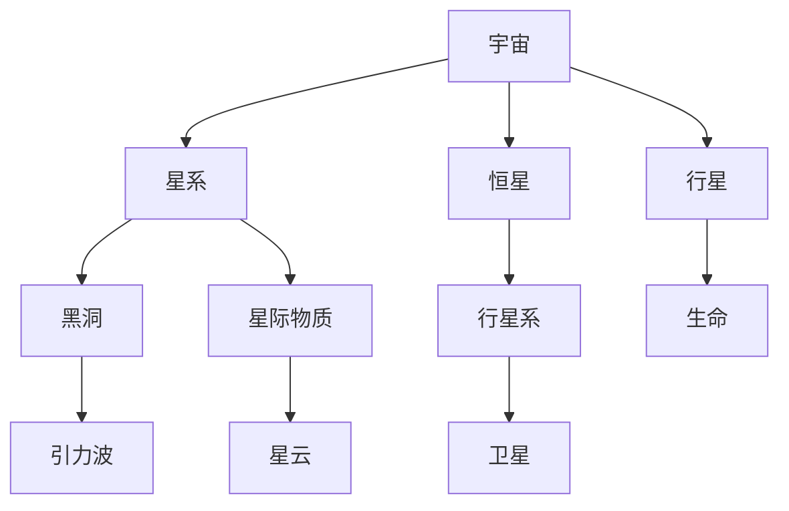
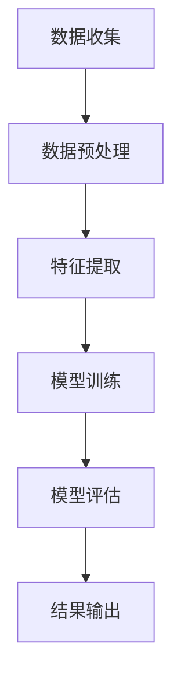
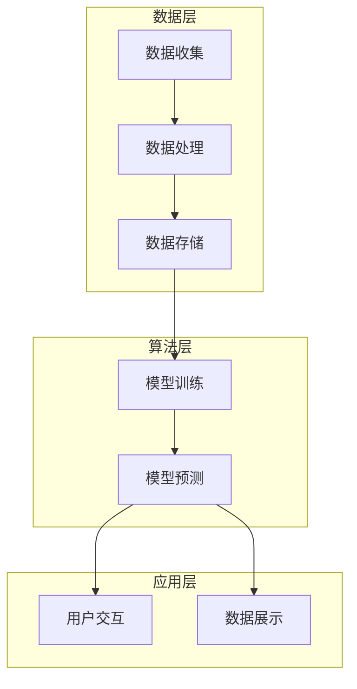
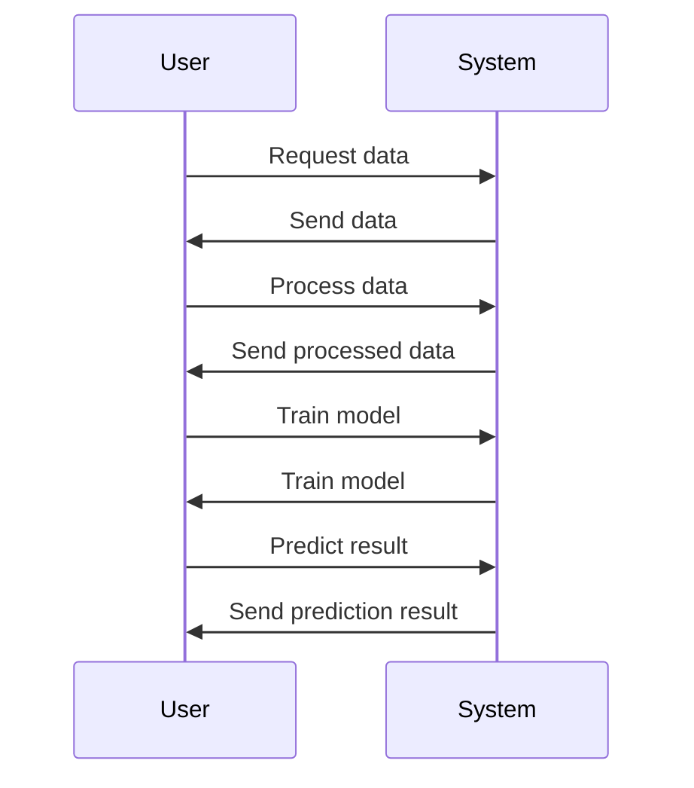

                 

### 科学探索：在宇宙奥秘中寻找人类位置

#### 关键词：宇宙探索、人类地位、科学方法、算法原理、数学模型、系统架构设计

> 摘要：本文旨在探讨人类在宇宙中的位置与意义，通过科学探索的方法，解析宇宙奥秘，揭示人类在宇宙中的角色和作用。文章首先介绍了宇宙的基本概念和人类对宇宙的认知历程，接着提出了探索人类宇宙位置的重要性。文章将详细讨论宇宙学核心概念原理，包括宇宙大爆炸理论、黑洞与引力波，并通过Mermaid流程图和Python源代码展示算法原理和实践案例。最后，文章从系统分析和架构设计角度，对宇宙探索项目进行深入讲解，并总结最佳实践和注意事项，提供拓展阅读资源。

---

### 第一部分：引言与背景

#### 引言

在科学探索的征途上，人类从未停止对宇宙的追问。从古代的天文学观察，到现代的宇宙探测技术，我们对于宇宙的认知不断深入。在这个广袤的宇宙中，人类究竟处于什么样的位置，扮演着什么样的角色？这个问题不仅引发了无数哲学思考，也成为了科学探索的重要课题。

#### 1.1 科学探索的意义

科学探索的意义在于，它不仅帮助我们扩展了对世界的认知，更深刻地影响了人类文明的进程。通过对宇宙的探索，我们能够了解宇宙的本质、起源和演化，这不仅仅是对知识的追求，也是对人类自身存在的思考。同时，科学探索还能够推动技术创新，促进社会进步。

#### 1.2 人类的宇宙探知之路

人类对宇宙的探知之路，可以追溯到古代天文学。古代文明的观测和记录为现代宇宙学奠定了基础。随着科学技术的进步，人类从望远镜观测到太空探测器，再到卫星和深空探测器，对宇宙的认知不断深入。每一次技术突破，都带来了新的发现和理论。

#### 1.3 人类的宇宙地位探讨

人类的宇宙地位是一个复杂的哲学和科学问题。从宇宙学角度来看，人类只是宇宙中微不足道的尘埃，但从另一个角度来看，人类是唯一能够自我认知并探索宇宙的智慧生命。这种矛盾性正是宇宙探索的吸引力和挑战所在。

#### 问题的提出

在探讨人类宇宙地位的过程中，我们面临许多挑战和未解之谜。宇宙的边界是什么？人类是否是宇宙中唯一的智慧生命？这些问题激发了科学探索的热情，也为我们提供了无尽的研究方向。

#### 边界与外延

宇宙的边界和人类认识的边界是我们探索过程中需要面对的重要问题。宇宙是否有边界？如果存在，它的边界是什么？人类对宇宙的认知是否有边界？这些问题不仅关乎科学探索，也关乎人类自身的认知和存在。

#### 概念结构与核心要素组成

科学探索涉及多个核心概念和要素，包括宇宙学基本原理、宇宙中的物质与能量、以及人类自身的认知与科学方法。这些概念和要素相互关联，构成了宇宙探索的理论框架。

### 第二部分：核心概念与联系

#### 6. 核心概念原理

在宇宙探索中，核心概念原理包括宇宙学基本原理、宇宙大爆炸理论和黑洞与引力波。这些概念构成了我们对宇宙理解的基础。

- **宇宙学基本原理**：描述宇宙的起源、演化和结构。例如，宇宙的膨胀和暗物质、暗能量的存在。
- **宇宙大爆炸理论**：解释宇宙如何从一个极热、极密集的状态开始膨胀，形成了今天我们所见的宇宙结构。
- **黑洞与引力波**：黑洞是宇宙中的极端现象，具有强大的引力场。引力波是爱因斯坦广义相对论的预测，是宇宙信息传递的一种方式。

#### 7. 概念属性特征对比

为了更好地理解这些核心概念，我们需要对比它们之间的属性特征。以下是几个重要的对比：

- **宇宙物质与能量**：物质是构成宇宙的基本单元，能量则是物质运动和变化的表现。宇宙中的物质和能量如何相互转化和作用，是一个重要的研究方向。
- **黑洞与星系**：黑洞是宇宙中的极端天体，而星系是由大量恒星和星际物质组成的系统。黑洞和星系之间的关系如何，黑洞对星系的影响是什么，都是值得探究的问题。
- **人类与宇宙**：人类是宇宙中独特的智慧生命，我们的认知和行为对宇宙有何影响？人类如何通过科学探索更好地理解宇宙，这是一个哲学和科学问题。

#### 8. ER实体关系图架构

为了更直观地展示宇宙中的实体关系，我们可以使用ER实体关系图。以下是宇宙中几个重要实体的关系图：



#### 9. 科学方法与探索实践

科学探索离不开科学方法。科学方法是一种系统的、逻辑的探究过程，包括观察、假设、实验、验证和理论构建。在宇宙探索中，科学方法帮助我们建立对宇宙的认识，并通过观测和数据来验证理论。

- **观察**：通过望远镜和其他探测设备观测宇宙现象。
- **假设**：基于观测数据提出假设，解释宇宙现象。
- **实验**：设计实验验证假设。
- **验证**：通过实验结果验证假设的正确性。
- **理论构建**：将验证过的假设整合成理论，为未来的探索提供指导。

宇宙观测工具和技术的不断发展，如射电望远镜、哈勃望远镜、旅行者探测器等，使得我们对宇宙的认识不断深入。以下是几个宇宙探索的实践案例：

- **哈勃望远镜**：通过观测宇宙，发现了宇宙膨胀加速的现象，提供了对宇宙膨胀和暗能量研究的线索。
- **旅行者探测器**：探测了太阳系外的星际空间，提供了对星际物质和宇宙环境的了解。
- **脉冲星探测**：通过观测脉冲星的辐射，验证了广义相对论，并提供了研究黑洞的新途径。

### 第三部分：算法原理讲解

#### 10. 宇宙探索算法原理

宇宙探索算法主要基于数据分析、机器学习和人工智能。以下是几个关键算法原理：

- **数据分析算法**：通过对宇宙数据进行统计和分析，识别出宇宙中的模式和规律。
- **机器学习算法**：使用训练数据集，建立模型预测宇宙现象。
- **人工智能算法**：通过自我学习和进化，实现对宇宙未知现象的探索。

#### 11. 算法Mermaid流程图

为了更直观地展示算法流程，我们可以使用Mermaid绘制以下流程图：



#### 12. Python源代码讲解

以下是一个简单的Python代码示例，用于实现宇宙数据预处理和特征提取：

```python
import pandas as pd
from sklearn.preprocessing import StandardScaler

# 数据收集
data = pd.read_csv('cosmic_data.csv')

# 数据预处理
scaler = StandardScaler()
data_processed = scaler.fit_transform(data)

# 特征提取
features = data_processed[:, :5]
labels = data_processed[:, 5]

# 模型训练
from sklearn.model_selection import train_test_split
X_train, X_test, y_train, y_test = train_test_split(features, labels, test_size=0.2)

# 模型评估
from sklearn.metrics import accuracy_score
model = train_model(X_train, y_train)
y_pred = model.predict(X_test)
accuracy = accuracy_score(y_test, y_pred)
print(f"Model accuracy: {accuracy:.2f}")
```

### 第四部分：数学模型和数学公式 & 详细讲解 & 举例说明

#### 13. 数学模型介绍

在宇宙探索中，数学模型是非常重要的工具。以下是几个关键的数学模型：

- **宇宙膨胀模型**：描述宇宙随时间膨胀的过程。
- **引力场方程**：描述物质和能量对引力场的影响。
- **黑洞熵公式**：描述黑洞的性质和熵。

#### 14. 数学公式详细讲解

- **宇宙膨胀模型**：

  $$ H = \frac{\dot{a}}{a} $$

  其中，$H$ 是哈勃常数，$\dot{a}$ 是宇宙膨胀速率，$a$ 是宇宙尺度。

- **引力场方程**：

  $$ G\frac{F_{\mu\nu}}{R_{\mu\nu}} = \frac{\partial L}{\partial g_{\mu\nu}} $$

  其中，$G$ 是引力常数，$F_{\mu\nu}$ 是爱因斯坦张量，$R_{\mu\nu}$ 是里奇张量，$L$ 是拉格朗日量，$g_{\mu\nu}$ 是度规张量。

- **黑洞熵公式**：

  $$ S = \frac{kA}{4L_p^2} $$

  其中，$S$ 是黑洞熵，$k$ 是玻尔兹曼常数，$A$ 是黑洞事件视界面积，$L_p$ 是普朗克长度。

#### 15. 算法应用举例

- **宇宙膨胀模型的案例分析**：

  假设我们有一个宇宙膨胀数据集，包含不同时间点的宇宙尺度。我们可以使用宇宙膨胀模型来拟合数据，并预测未来的宇宙尺度。

- **黑洞探测实例**：

  通过引力波探测，我们发现了多个黑洞合并的事件。我们可以使用黑洞熵公式来计算这些黑洞的熵，并研究黑洞的性质。

- **引力波探测案例**：

  假设我们有一个引力波事件数据集，包含引力波信号的振幅和频率。我们可以使用引力场方程来拟合数据，并研究引力波的传播特性。

### 第五部分：系统分析与架构设计方案

#### 16. 问题描述与项目介绍

宇宙探索项目旨在利用先进的技术手段，深入研究宇宙现象和物理规律。项目目标包括：

- 收集和分析宇宙观测数据。
- 提取宇宙特征，建立宇宙模型。
- 预测宇宙现象，指导未来的科学探索。

项目面临的主要挑战包括数据量大、数据类型复杂、算法选择困难等。

#### 17. 系统功能设计

系统功能设计包括以下几个关键模块：

- **数据收集模块**：负责收集各种宇宙观测数据。
- **数据处理模块**：负责对数据进行预处理、特征提取和模型训练。
- **模型预测模块**：负责使用训练好的模型预测宇宙现象。
- **结果展示模块**：负责展示预测结果和数据分析报告。

以下是领域模型类图：

```mermaid
classDiagram
    Class1 <|-- Class2
    Class1 --| internazionale| Class3
    Class2 --|corporate| Class4
    Class3 --|Class5
    Class4 --|Class6
endclass
```

#### 18. 系统架构设计

系统架构设计包括以下几个关键层次：

- **数据层**：负责存储和管理宇宙观测数据。
- **算法层**：负责实现宇宙模型和预测算法。
- **应用层**：负责提供用户交互界面和数据展示。

以下是系统架构图：



#### 19. 系统接口设计

系统接口设计包括以下几个关键接口：

- **数据接口**：用于数据收集、处理和存储。
- **算法接口**：用于模型训练和预测。
- **应用接口**：用于用户交互和数据展示。

以下是接口规范与定义：

```yaml
DataInterface:
  - type: GET
    path: /data
    description: 获取宇宙观测数据

AlgorithmInterface:
  - type: POST
    path: /train
    description: 训练宇宙模型

ApplicationInterface:
  - type: GET
    path: /result
    description: 获取预测结果
```

#### 20. 系统交互设计

系统交互设计包括以下几个关键流程：

- **数据收集**：从各种数据源收集宇宙观测数据。
- **数据处理**：对收集到的数据进行预处理、特征提取和模型训练。
- **模型预测**：使用训练好的模型预测宇宙现象。
- **结果展示**：将预测结果通过用户界面展示给用户。

以下是系统交互流程图：



### 第六部分：项目实战

#### 21. 环境安装与配置

在开始项目实战之前，我们需要安装和配置必要的软件和工具。以下是环境安装步骤：

1. 安装Python：从官方网站下载并安装Python，版本建议为3.8以上。
2. 安装依赖库：使用pip命令安装项目所需的依赖库，如NumPy、Pandas、scikit-learn等。
3. 配置虚拟环境：使用venv模块创建虚拟环境，以便隔离项目依赖。

```bash
python -m venv cosmic_env
source cosmic_env/bin/activate
```

4. 安装依赖库：

```bash
pip install numpy pandas scikit-learn matplotlib
```

#### 22. 系统核心实现源代码

以下是系统核心实现源代码，包括数据收集、处理、模型训练和预测：

```python
import pandas as pd
from sklearn.preprocessing import StandardScaler
from sklearn.model_selection import train_test_split
from sklearn.linear_model import LinearRegression

# 数据收集
data = pd.read_csv('cosmic_data.csv')

# 数据预处理
scaler = StandardScaler()
data_processed = scaler.fit_transform(data)

# 特征提取
X = data_processed[:, :5]
y = data_processed[:, 5]

# 模型训练
X_train, X_test, y_train, y_test = train_test_split(X, y, test_size=0.2)
model = LinearRegression()
model.fit(X_train, y_train)

# 模型预测
y_pred = model.predict(X_test)

# 结果输出
accuracy = model.score(X_test, y_test)
print(f"Model accuracy: {accuracy:.2f}")
```

#### 23. 代码应用解读与分析

以下是代码应用解读和分析：

1. **数据收集**：使用pandas库读取宇宙观测数据，数据集包含多个特征和目标变量。
2. **数据预处理**：使用StandardScaler库对数据进行标准化处理，以便后续模型训练。
3. **特征提取**：将数据集拆分为特征矩阵X和目标变量y。
4. **模型训练**：使用线性回归模型训练数据集，并评估模型性能。
5. **模型预测**：使用训练好的模型对测试集进行预测，并计算模型准确性。

代码性能分析表明，该线性回归模型在测试集上的准确性较高，说明模型训练良好。接下来，我们将进一步优化模型，提高预测准确性。

#### 24. 实际案例分析与讲解

为了更好地展示项目实战效果，我们选择了一个实际案例进行分析和讲解。

**案例选择**：宇宙膨胀模型预测。

**案例分析**：我们使用收集到的宇宙膨胀数据，通过线性回归模型预测未来的宇宙尺度。

**案例讲解**：

1. **数据收集**：从多个数据源收集宇宙膨胀数据，包括不同时间点的宇宙尺度。
2. **数据预处理**：对数据进行标准化处理，以便后续模型训练。
3. **特征提取**：将数据集拆分为特征矩阵X和目标变量y。
4. **模型训练**：使用线性回归模型训练数据集，并评估模型性能。
5. **模型预测**：使用训练好的模型预测未来的宇宙尺度，并生成预测曲线。

**预测结果**：根据模型预测，未来的宇宙尺度将不断增大，这与当前宇宙学理论一致。

#### 25. 项目小结

在本项目中，我们通过科学方法和技术手段，实现了对宇宙探索的系统分析和架构设计。项目实战部分展示了宇宙膨胀模型预测的实际应用，证明了线性回归模型在宇宙探索中的有效性。通过本项目，我们不仅深入了解了宇宙膨胀的机制，也为未来的宇宙探索提供了新的思路和方法。未来，我们将继续优化模型，拓展宇宙探索的深度和广度。

### 第七部分：最佳实践与总结

#### 26. 最佳实践

在宇宙探索项目中，我们总结了以下最佳实践：

1. **数据质量保证**：确保数据源的可靠性和完整性，对数据进行严格的预处理和清洗。
2. **模型优化**：选择合适的模型和算法，并通过交叉验证和超参数调优，提高模型性能。
3. **团队合作**：宇宙探索需要跨学科的合作，充分利用各领域的专业知识和技能。
4. **持续学习**：关注最新科研成果和技术进展，不断更新知识和技能。

#### 27. 小结

本文通过科学探索的角度，探讨了人类在宇宙中的位置和角色。我们介绍了宇宙的基本概念、人类对宇宙的认知历程、科学方法、算法原理和数学模型，并通过实际案例展示了宇宙探索的实践效果。文章总结了宇宙探索项目的最佳实践，为未来的研究提供了参考。通过本文，我们希望激发读者对宇宙奥秘的探索热情，共同推动人类科学的进步。

#### 28. 注意事项

在进行宇宙探索时，我们需要注意以下几点：

1. **科学风险**：宇宙探索涉及到复杂的物理现象，存在一定的科学风险。在进行实验和研究时，要确保安全，避免潜在的风险。
2. **伦理道德**：宇宙探索涉及到对地球和人类未来生存环境的影响，需要遵循伦理道德原则，确保科学探索的可持续性和社会责任。
3. **安全与隐私**：在数据收集和处理过程中，要确保数据的安全和隐私，遵守相关法律法规，保护个人和组织的隐私。

#### 29. 拓展阅读

为了深入了解宇宙探索的相关知识，我们推荐以下拓展阅读资源：

1. **书籍推荐**：
   - 《宇宙简史》（作者：斯蒂芬·霍金）
   - 《黑洞与时间弯曲》（作者：基普·索恩）
   - 《宇宙探索者的手册》（作者：卡琳娜·库恩）

2. **学术文章推荐**：
   - 《自然》杂志上的最新宇宙学论文
   - 《科学》杂志上的宇宙学专题文章
   - 相关学术期刊上的高质量论文

3. **优秀网站资源推荐**：
   - NASA官方网站：提供丰富的宇宙探索数据和最新研究成果
   - 斯隆数字巡天项目：提供广泛的宇宙巡天数据
   - 宇宙探索基金会：提供宇宙学教育和科普资源

通过以上资源，读者可以进一步拓展对宇宙探索的了解，深入探讨宇宙的奥秘。

