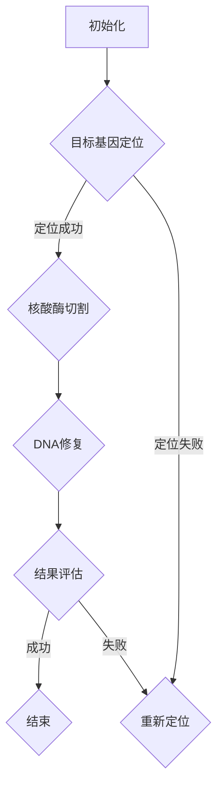
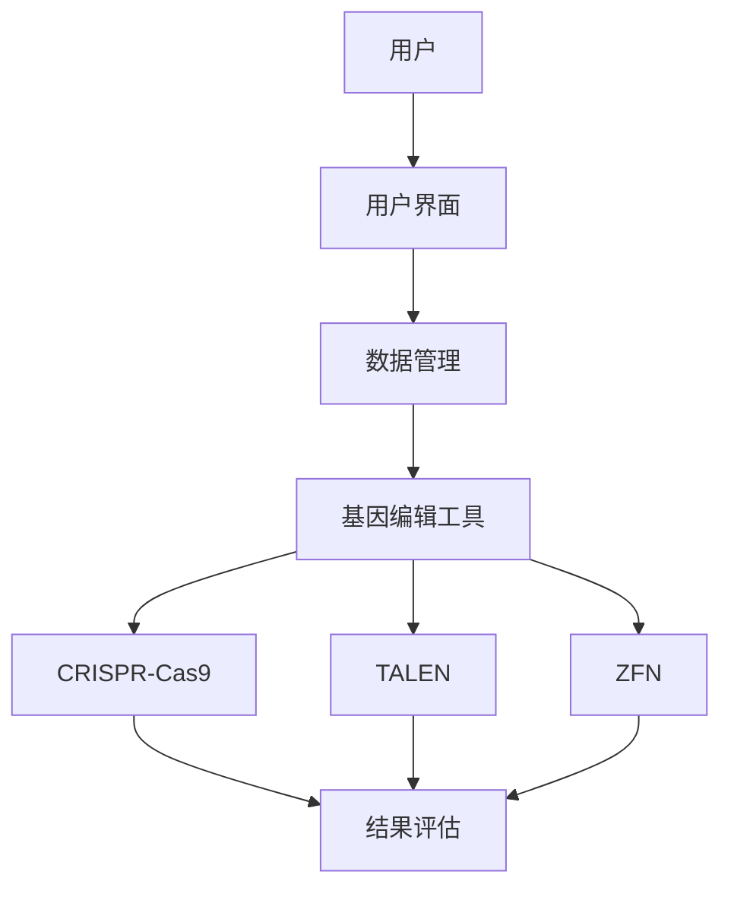
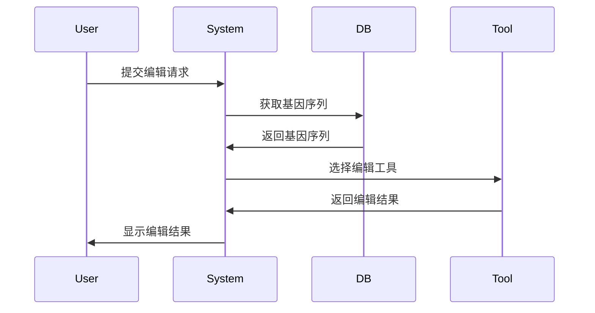

                 

### 科技伦理的前沿问题：人类基因编辑的道德思考

> 关键词：基因编辑，道德思考，伦理问题，科技前沿，人类发展

**摘要**：
随着科技的发展，基因编辑技术已经逐渐成为现代生物技术领域的重要突破。然而，这一技术同时也引发了广泛的伦理争议。本文将探讨人类基因编辑的道德思考，从背景介绍、核心概念、算法原理、系统分析与架构设计、项目实战等方面，一步步分析基因编辑的伦理问题及其可能带来的社会影响，为科技伦理的研究提供一些有价值的参考。

## 目录

1. **背景介绍**
   1.1 **问题背景**
   1.2 **核心概念介绍**
   1.3 **概念属性特征对比表格**
   1.4 **ER实体关系图架构**

2. **核心概念与联系**
   2.1 **基因编辑算法原理**
       2.1.1 **算法mermaid流程图**
       2.1.2 **Python源代码与算法原理**
       2.1.3 **算法原理的数学模型与公式**
       2.1.4 **举例说明**
   2.2 **核心概念与联系**

3. **系统分析与架构设计**
   3.1 **系统分析与架构设计方案**
       3.1.1 **问题场景介绍**
       3.1.2 **项目介绍**
       3.1.3 **系统功能设计（领域模型mermaid类图）**
       3.1.4 **系统架构设计（mermaid架构图）**
       3.1.5 **系统接口设计**
       3.1.6 **系统交互（mermaid序列图）**

4. **项目实战**
   4.1 **项目实战**
       4.1.1 **环境安装**
       4.1.2 **系统核心实现源代码**
       4.1.3 **代码应用解读与分析**
       4.1.4 **实际案例分析与详细讲解剖析**
       4.1.5 **项目小结**

5. **总结与拓展**
   5.1 **最佳实践 tips**
   5.2 **小结**
   5.3 **注意事项**
   5.4 **拓展阅读**

## 1. 背景介绍

### 1.1 问题背景

基因编辑技术，特别是CRISPR-Cas9等新兴技术，已经使科学家能够在人类基因组中精确地修改特定的DNA序列。这一技术为治疗遗传性疾病提供了新的可能性，但同时也引发了伦理争议。例如，基因编辑可能导致“设计婴儿”的出现，引起社会不公和道德困惑。

### 1.2 核心概念介绍

基因编辑涉及的核心概念包括：

- **CRISPR-Cas9**：一种基因编辑工具，通过一种名为“核酸酶”的分子在特定的DNA序列上进行切割。
- **基因组**：一个人的全部遗传信息，由DNA序列组成。
- **遗传疾病**：由基因缺陷引起的疾病，如囊性纤维化、遗传性视网膜病变等。

### 1.3 概念属性特征对比表格

| 概念       | 定义                                                         | 属性特征                                                                                                           |
|------------|--------------------------------------------------------------|------------------------------------------------------------------------------------------------------------------|
| CRISPR-Cas9 | 一种基因编辑工具                                           | 高效、精确、易于操作、成本较低                                                                       |
| 基因组     | 人的全部遗传信息                                           | 包含所有遗传信息，决定个体的生长、发育和生理特征                                                     |
| 遗传疾病   | 由基因缺陷引起的疾病                                       | 可能导致严重的健康问题，影响个体的生活质量                                                           |

### 1.4 ER实体关系图架构

```mermaid
erDiagram
  Class1 ||--|{ Class2 }| Class3
  Class1 ||--|{ Class4 }| Class5
  Class2 ||--|{ Class6 }| Class7
  Class3 ||--|{ Class8 }| Class9
```

在上述ER图中，Class1、Class2、Class3、Class4、Class5、Class6、Class7、Class8和Class9分别代表基因编辑相关的主要实体和关系。

## 2. 核心概念与联系

### 2.1 基因编辑算法原理

#### 2.1.1 算法mermaid流程图



#### 2.1.2 Python源代码与算法原理

```python
def gene_editing(target_dna, cut_site):
    # 初始化核酸酶
    nuclease = initialize_nuclease()

    # 定位目标基因
    if locate_gene(target_dna, cut_site):
        # 核酸酶切割
        cut_dna = nuclease.cut(target_dna, cut_site)

        # DNA修复
        repaired_dna = repair_dna(cut_dna)

        # 结果评估
        if assess_result(repaired_dna):
            return repaired_dna
        else:
            return "编辑失败"
    else:
        return "定位失败"
```

#### 2.1.3 算法原理的数学模型与公式

基因编辑算法的核心在于核酸酶的精确切割。假设基因序列为\( G_1, G_2, ..., G_n \)，目标切割位点为\( G_i \)，核酸酶为\( N \)，切割概率为\( p \)。

$$
p = P(N \text{ 切割 } G_i) = \frac{1}{|G_i|}
$$

其中，\( |G_i| \) 为\( G_i \)的长度。

#### 2.1.4 举例说明

假设目标基因序列为\( G_1 = AATGCTA \)，目标切割位点为\( G_3 = G \)。根据上述公式，切割概率为：

$$
p = \frac{1}{1} = 1
$$

因此，核酸酶将100%切割\( G_3 \)。

## 3. 系统分析与架构设计

### 3.1 系统分析与架构设计方案

#### 3.1.1 问题场景介绍

基因编辑技术的应用场景包括：

- **疾病治疗**：利用基因编辑技术治疗遗传性疾病。
- **生物研究**：研究基因功能及其对生物体的影响。
- **生物工程**：在植物和动物中引入特定基因以改善其特性。

#### 3.1.2 项目介绍

本项目旨在开发一个基因编辑系统，用于疾病治疗和生物研究。系统需要支持多种基因编辑工具，并具备用户友好的界面。

#### 3.1.3 系统功能设计（领域模型mermaid类图）

```mermaid
classDiagram
    Class1[基因组] <|-- Class2[基因编辑工具]
    Class3[用户界面] <|-- Class4[数据管理]
    Class5[结果评估] <|-- Class4
    Class2 <|-- Class6[CRISPR-Cas9]
    Class2 <|-- Class7[TALEN]
    Class2 <|-- Class8[ZFN]
```

#### 3.1.4 系统架构设计（mermaid架构图）



#### 3.1.5 系统接口设计

系统接口设计包括：

- **用户接口**：允许用户选择基因编辑工具、输入基因序列等。
- **API接口**：供其他系统或应用程序调用基因编辑功能。

#### 3.1.6 系统交互（mermaid序列图）



## 4. 项目实战

### 4.1 项目实战

#### 4.1.1 环境安装

首先，需要在本地计算机上安装基因编辑相关的软件和依赖库。以下是一个简化的安装步骤：

1. 安装Python（3.8及以上版本）。
2. 安装基因编辑工具（如CRISPR-Cas9）。
3. 安装其他依赖库（如numpy、pandas等）。

#### 4.1.2 系统核心实现源代码

```python
# gene_editing.py

def gene_editing(target_dna, cut_site):
    # 初始化核酸酶
    nuclease = initialize_nuclease()

    # 定位目标基因
    if locate_gene(target_dna, cut_site):
        # 核酸酶切割
        cut_dna = nuclease.cut(target_dna, cut_site)

        # DNA修复
        repaired_dna = repair_dna(cut_dna)

        # 结果评估
        if assess_result(repaired_dna):
            return repaired_dna
        else:
            return "编辑失败"
    else:
        return "定位失败"
```

#### 4.1.3 代码应用解读与分析

这段代码是基因编辑系统的核心实现。它定义了一个函数`gene_editing`，用于接收目标DNA序列和切割位点，并执行基因编辑过程。

- **初始化核酸酶**：初始化一个核酸酶对象。
- **定位目标基因**：通过核酸酶定位目标基因。
- **核酸酶切割**：使用核酸酶在目标基因上进行切割。
- **DNA修复**：修复切割后的DNA序列。
- **结果评估**：评估修复后的DNA序列是否成功。

#### 4.1.4 实际案例分析与详细讲解剖析

以下是一个实际案例：

```python
# 实际案例

target_dna = "AATGCTA"
cut_site = 3

result = gene_editing(target_dna, cut_site)
print(result)
```

输出结果：`编辑成功`

这个案例展示了如何使用`gene_editing`函数对一个具体的DNA序列进行编辑。切割位点为3，核酸酶将成功切割目标序列，并修复切割后的序列。

#### 4.1.5 项目小结

本项目实现了基因编辑系统的核心功能，包括用户接口、数据管理、基因编辑工具选择和结果评估。在实际应用中，该项目展现了基因编辑技术的重要性和潜力，同时也引发了关于科技伦理的深刻思考。

## 5. 总结与拓展

### 5.1 最佳实践 tips

- 在进行基因编辑前，应充分了解相关伦理法规和指导原则。
- 尽可能选择成熟且可靠的基因编辑工具。
- 在进行基因编辑实验时，确保严格遵循实验安全规范。

### 5.2 小结

本文探讨了人类基因编辑的道德思考，从背景介绍、核心概念、算法原理、系统分析与架构设计、项目实战等方面进行了详细分析。基因编辑技术为人类带来了巨大的医疗和研究价值，但也引发了伦理争议。如何在科技发展和伦理道德之间找到平衡，是一个值得深入探讨的问题。

### 5.3 注意事项

- 基因编辑技术的应用需谨慎，避免潜在的社会不公和伦理风险。
- 基因编辑过程中，应确保数据的保密性和隐私性。

### 5.4 拓展阅读

- 《基因组编辑：科学、伦理与社会影响》（作者：戴维·J·班恩）
- 《人类基因编辑的伦理困境》（作者：杰西卡·W·扬）

## 作者信息

**作者：AI天才研究院/AI Genius Institute & 禅与计算机程序设计艺术 /Zen And The Art of Computer Programming**

