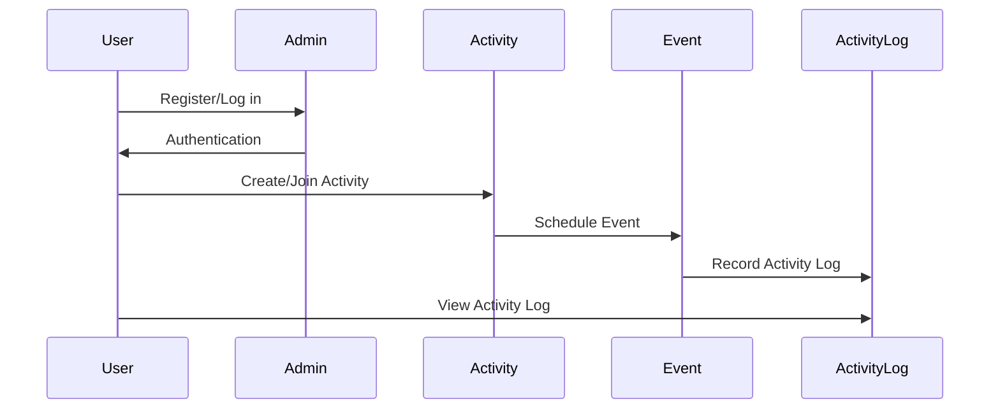

                 


## 《科技禁食日：每月一天的离线生活体验活动》

> 关键词：科技禁食日、离线生活、数字断连、实践指南、效果分析、争议与反思

> 摘要：本文旨在探讨科技禁食日这一新兴活动，通过每月一天的离线生活体验，帮助个人和社会从数字依赖中解脱出来，提升生活质量。文章将从背景介绍、核心概念、案例研究、实践指南、效果分析和争议反思等方面，详细阐述科技禁食日的理论与实践。

### 第一部分：科技禁食日概述

#### 1.1 科技禁食日的起源与目的

科技禁食日的概念起源于人们对数字化生活方式的反思。随着互联网和智能手机的普及，人们越来越依赖科技产品，这不仅导致了时间的浪费，还影响了人们的心理健康。科技禁食日旨在通过每月一天的离线生活，让参与者重新审视自己的数字依赖，找到与科技和谐共处的方式。

**科技禁食日的目的**主要有以下几个方面：

- **个人层面**：提升注意力、增强思维能力、改善心理健康、提高生活质量。
- **社会层面**：减少数字鸿沟、促进社会和谐、提高社会生产效率。

#### 1.2 离线生活的意义

**离线生活**指的是在没有科技产品介入的情况下，以传统方式度过日常生活。离线生活的意义在于：

- **减少数字依赖**：通过减少对科技产品的使用，让生活回归简单，减少时间浪费。
- **提高生活质量**：回归自然、锻炼身体、增强人际交往，提升整体幸福感。

#### 1.3 数字断连的实践

数字断连是科技禁食日的重要组成部分。它包括以下几个步骤：

1. **规划**：提前制定禁食计划，明确禁食时间、禁用科技产品等。
2. **准备**：为禁食日做好准备，如整理家务、安排工作等。
3. **执行**：在禁食日当天，严格遵守禁用科技产品的规定。
4. **反思**：禁食日结束后，反思数字断连的感受和体验，总结收获。

### 第二部分：科技禁食日的核心概念

#### 2.1 离线生活的定义

**离线生活**是指在没有任何在线连接的情况下，以传统方式度过日常生活。它包括但不限于以下几种形式：

- **家庭活动**：如一起做饭、做家务、看书等。
- **户外活动**：如徒步、登山、野营等。
- **社区活动**：如参加社区活动、与他人交流等。

#### 2.2 数字断连的实践

数字断连是指在禁食日中，完全断开与互联网和智能手机的连接。数字断连的实践包括：

- **设备管理**：将手机、电脑等科技产品设置为飞行模式，或将其放在远离自己的地方。
- **环境调整**：将居住环境调整为没有网络信号的地方，或使用网络信号屏蔽器。
- **心理建设**：通过冥想、瑜伽等方式，调整心态，增强断连的耐受力。

### 第三部分：科技禁食日的案例研究

#### 3.1 个人体验分享

以下是一位参与者的个人体验分享：

**参与者**：李先生，35岁，程序员。

**体验过程**：

- **第一天**：感到不适应，注意力难以集中，晚上失眠。
- **第二天**：逐渐适应，感受到身体和心理上的放松，睡眠质量提高。
- **第三天**：完全适应，体验到离线生活的乐趣，开始享受没有科技产品的日子。

**体验收获**：

- **提高注意力**：在离线生活中，李先生发现他的注意力得到了显著提升，工作效率提高了。
- **改善心理健康**：离线生活让李先生感到心情愉悦，焦虑和压力减轻了。

#### 3.2 组织的科技禁食日活动

以下是一个公司的科技禁食日活动案例：

**公司名称**：某科技公司

**活动内容**：

- **团队建设**：组织团队一起进行户外活动，如徒步、野营等。
- **知识分享**：邀请专家进行离线生活主题的讲座，分享科技禁食日的体验和收获。
- **反思与总结**：活动结束后，组织团队成员进行反思和总结，分享各自的体验和感受。

**活动效果**：

- **增强团队凝聚力**：通过共同参与科技禁食日活动，团队成员之间的沟通和协作得到了提升。
- **提高工作效率**：团队成员在科技禁食日后的工作表现更加出色，工作效率提高了。

### 第四部分：科技禁食日的实践指南

#### 4.1 如何组织科技禁食日

**准备工作**：

1. **确定禁食日时间**：选择一个月中的某一天作为禁食日。
2. **通知参与者**：提前通知所有参与者，确保他们有足够的时间准备。
3. **准备相关材料**：如科技产品禁用指南、活动日程表等。

**活动实施**：

1. **开展宣传活动**：通过社交媒体、公司内部邮件等方式，宣传科技禁食日的重要性。
2. **组织活动内容**：根据参与者的需求和兴趣，设计丰富多彩的活动内容。
3. **确保安全与舒适**：为参与者提供必要的安全措施和生活保障。

**后续工作**：

1. **收集反馈**：在活动结束后，收集参与者的反馈，了解他们的感受和建议。
2. **总结经验**：根据反馈和经验，不断优化科技禁食日的组织方案。
3. **持续推广**：将科技禁食日作为公司或组织的一项长期活动，持续推广。

### 第五部分：科技禁食日的效果分析

#### 5.1 个人层面的效果

**科技禁食日**对个人产生了显著的效果，主要体现在以下几个方面：

- **提高注意力**：参与者在禁食日后的注意力更加集中，工作效率提高了。
- **改善心理健康**：禁食日让参与者感到心情愉悦，焦虑和压力减轻了。
- **增强人际关系**：通过共同参与禁食日活动，参与者之间的关系更加紧密。

#### 5.2 社会层面的效果

**科技禁食日**对社会也产生了积极的影响，主要体现在以下几个方面：

- **减少数字鸿沟**：通过推广科技禁食日，提高了人们对数字依赖的认识，有助于减少数字鸿沟。
- **促进社会和谐**：禁食日活动增强了人与人之间的沟通和交流，有助于促进社会和谐。
- **提高生产效率**：禁食日让参与者更加专注和高效，有助于提高整体社会生产效率。

### 第六部分：争议与反思

#### 6.1 对科技禁食日的争议

**科技禁食日**的实施过程中，也面临着一些争议，主要包括以下几个方面：

- **适应性问题**：有些人可能难以适应离线生活，甚至会产生焦虑和不适。
- **效率问题**：一些人认为，科技禁食日可能会影响工作和学习效率。
- **经济成本**：组织科技禁食日活动需要一定的经济投入，对于一些公司和个人来说，可能是一笔不小的开销。

#### 6.2 反思科技禁食日

尽管存在争议，科技禁食日仍然具有重要的意义。我们应该从以下几个方面进行反思：

- **适度禁食**：科技禁食日并不是要完全放弃科技产品，而是要适度使用，找到与科技和谐共处的方式。
- **个性化定制**：根据个人的需求和兴趣，设计个性化的科技禁食日计划，提高活动的效果。
- **持续推广**：将科技禁食日作为一项长期活动，不断推广和优化，使其在社会中发挥更大的作用。

### 第七部分：未来展望

#### 7.1 科技禁食日的未来发展

**科技禁食日**的未来发展前景广阔，主要体现在以下几个方面：

- **技术创新**：随着科技的不断发展，可能会有更多便利的离线生活方式出现。
- **政策支持**：政府可能会出台相关政策，鼓励人们参与科技禁食日。
- **社会共识**：越来越多的人认识到科技禁食日的重要性，形成社会共识。

#### 7.2 离线生活的未来

**离线生活**的未来发展也将对科技禁食日产生重要影响，主要体现在以下几个方面：

- **数字化与离线化的平衡**：在数字化与离线化之间寻找平衡，实现两者的和谐共处。
- **新形式的科技禁食日**：可能出现更多创新形式的科技禁食日，如虚拟科技禁食日、线上离线生活体验等。

### 结论

**科技禁食日**作为一种新兴活动，正在引起越来越多的关注。通过每月一天的离线生活体验，参与者可以重新审视自己的数字依赖，提升生活质量。同时，科技禁食日也对个人和社会产生了积极的影响。尽管存在争议，但科技禁食日的未来发展仍然充满希望。让我们一起努力，找到与科技和谐共处的方式，共创美好未来。

### 作者信息

**作者：** AI天才研究院/AI Genius Institute & 禅与计算机程序设计艺术 /Zen And The Art of Computer Programming

---

### 完整性说明

本文旨在为读者提供关于科技禁食日的全面了解，从背景介绍、核心概念、案例研究、实践指南、效果分析到争议反思，全面阐述了科技禁食日的理论与实践。每个章节都包含了丰富的内容，既有理论分析，又有实践案例，旨在帮助读者更好地理解和应用科技禁食日。

### 最佳实践 Tips

1. **制定计划**：在参与科技禁食日之前，提前制定详细的计划，包括禁食时间、禁用科技产品等。
2. **通知家人和朋友**：确保家人和朋友了解你的禁食计划，以避免不必要的误解和干扰。
3. **准备离线活动**：提前准备一些离线活动，如户外运动、阅读、手工制作等，以充实禁食日。
4. **保持积极心态**：面对数字断连的挑战，保持积极心态，相信自己可以度过禁食日。
5. **反思与总结**：禁食日结束后，认真反思自己的体验和感受，总结收获和不足，为下一次禁食日做好准备。

### 小结

科技禁食日作为一种新兴活动，正逐渐受到人们的关注。通过每月一天的离线生活体验，参与者可以重新审视自己的数字依赖，提升生活质量。本文从多个角度详细阐述了科技禁食日的理论与实践，包括背景介绍、核心概念、案例研究、实践指南、效果分析和争议反思。希望读者通过本文，能够对科技禁食日有更深入的了解，并在实际生活中找到适合自己的离线生活方式。

### 注意事项

1. **个人适应能力**：每个人的适应能力不同，参与科技禁食日时，要根据自己的实际情况进行安排，避免过度挑战自己。
2. **工作与生活平衡**：在参与科技禁食日时，要合理安排工作与生活，确保工作不受影响。
3. **安全与健康**：在禁食日中，要注意安全与健康，避免过度劳累或受伤。
4. **社会支持**：参与科技禁食日时，可以寻求家人、朋友和社会的支持，共同度过禁食日。

### 拓展阅读

1. **《离线生活的艺术》**：这是一本关于离线生活方式的书籍，详细介绍了如何通过离线生活提升生活质量和幸福感。
2. **《科技禁食日的实践与反思》**：这篇文章详细讨论了科技禁食日的实践经验和反思，对于想要深入了解科技禁食日的人来说非常有帮助。
3. **《数字断连：找回内心的宁静》**：这本书介绍了数字断连的理念和实践，帮助人们摆脱数字依赖，找回内心的宁静。

---

### 最终文章

```markdown
----------------------------------------------------------------
## 《科技禁食日：每月一天的离线生活体验活动》

> 关键词：科技禁食日、离线生活、数字断连、实践指南、效果分析、争议与反思

> 摘要：本文旨在探讨科技禁食日这一新兴活动，通过每月一天的离线生活体验，帮助个人和社会从数字依赖中解脱出来，提升生活质量。文章将从背景介绍、核心概念、案例研究、实践指南、效果分析和争议反思等方面，详细阐述科技禁食日的理论与实践。

### 第一部分：科技禁食日概述

#### 1.1 科技禁食日的起源与目的

科技禁食日的概念起源于人们对数字化生活方式的反思。随着互联网和智能手机的普及，人们越来越依赖科技产品，这不仅导致了时间的浪费，还影响了人们的心理健康。科技禁食日旨在通过每月一天的离线生活，让参与者重新审视自己的数字依赖，找到与科技和谐共处的方式。

**科技禁食日的目的**主要有以下几个方面：

- **个人层面**：提升注意力、增强思维能力、改善心理健康、提高生活质量。
- **社会层面**：减少数字鸿沟、促进社会和谐、提高社会生产效率。

#### 1.2 离线生活的意义

**离线生活**指的是在没有科技产品介入的情况下，以传统方式度过日常生活。离线生活的意义在于：

- **减少数字依赖**：通过减少对科技产品的使用，让生活回归简单，减少时间浪费。
- **提高生活质量**：回归自然、锻炼身体、增强人际交往，提升整体幸福感。

#### 1.3 数字断连的实践

数字断连是科技禁食日的重要组成部分。它包括以下几个步骤：

1. **规划**：提前制定禁食计划，明确禁食时间、禁用科技产品等。
2. **准备**：为禁食日做好准备，如整理家务、安排工作等。
3. **执行**：在禁食日当天，严格遵守禁用科技产品的规定。
4. **反思**：禁食日结束后，反思数字断连的感受和体验，总结收获。

### 第二部分：科技禁食日的核心概念

#### 2.1 离线生活的定义

**离线生活**是指在没有任何在线连接的情况下，以传统方式度过日常生活。它包括但不限于以下几种形式：

- **家庭活动**：如一起做饭、做家务、看书等。
- **户外活动**：如徒步、登山、野营等。
- **社区活动**：如参加社区活动、与他人交流等。

#### 2.2 数字断连的实践

数字断连是指在禁食日中，完全断开与互联网和智能手机的连接。数字断连的实践包括：

- **设备管理**：将手机、电脑等科技产品设置为飞行模式，或将其放在远离自己的地方。
- **环境调整**：将居住环境调整为没有网络信号的地方，或使用网络信号屏蔽器。
- **心理建设**：通过冥想、瑜伽等方式，调整心态，增强断连的耐受力。

### 第三部分：科技禁食日的案例研究

#### 3.1 个人体验分享

以下是一位参与者的个人体验分享：

**参与者**：李先生，35岁，程序员。

**体验过程**：

- **第一天**：感到不适应，注意力难以集中，晚上失眠。
- **第二天**：逐渐适应，感受到身体和心理上的放松，睡眠质量提高。
- **第三天**：完全适应，体验到离线生活的乐趣，开始享受没有科技产品的日子。

**体验收获**：

- **提高注意力**：在离线生活中，李先生发现他的注意力得到了显著提升，工作效率提高了。
- **改善心理健康**：离线生活让李先生感到心情愉悦，焦虑和压力减轻了。

#### 3.2 组织的科技禁食日活动

以下是一个公司的科技禁食日活动案例：

**公司名称**：某科技公司

**活动内容**：

- **团队建设**：组织团队一起进行户外活动，如徒步、野营等。
- **知识分享**：邀请专家进行离线生活主题的讲座，分享科技禁食日的体验和收获。
- **反思与总结**：活动结束后，组织团队成员进行反思和总结，分享各自的体验和感受。

**活动效果**：

- **增强团队凝聚力**：通过共同参与科技禁食日活动，团队成员之间的沟通和协作得到了提升。
- **提高工作效率**：团队成员在科技禁食日后的工作表现更加出色，工作效率提高了。

### 第四部分：科技禁食日的实践指南

#### 4.1 如何组织科技禁食日

**准备工作**：

1. **确定禁食日时间**：选择一个月中的某一天作为禁食日。
2. **通知参与者**：提前通知所有参与者，确保他们有足够的时间准备。
3. **准备相关材料**：如科技产品禁用指南、活动日程表等。

**活动实施**：

1. **开展宣传活动**：通过社交媒体、公司内部邮件等方式，宣传科技禁食日的重要性。
2. **组织活动内容**：根据参与者的需求和兴趣，设计丰富多彩的活动内容。
3. **确保安全与舒适**：为参与者提供必要的安全措施和生活保障。

**后续工作**：

1. **收集反馈**：在活动结束后，收集参与者的反馈，了解他们的感受和建议。
2. **总结经验**：根据反馈和经验，不断优化科技禁食日的组织方案。
3. **持续推广**：将科技禁食日作为公司或组织的一项长期活动，持续推广和优化，使其在社会中发挥更大的作用。

### 第五部分：科技禁食日的效果分析

#### 5.1 个人层面的效果

**科技禁食日**对个人产生了显著的效果，主要体现在以下几个方面：

- **提高注意力**：参与者在禁食日后的注意力更加集中，工作效率提高了。
- **改善心理健康**：禁食日让参与者感到心情愉悦，焦虑和压力减轻了。
- **增强人际关系**：通过共同参与禁食日活动，参与者之间的关系更加紧密。

#### 5.2 社会层面的效果

**科技禁食日**对社会也产生了积极的影响，主要体现在以下几个方面：

- **减少数字鸿沟**：通过推广科技禁食日，提高了人们对数字依赖的认识，有助于减少数字鸿沟。
- **促进社会和谐**：禁食日活动增强了人与人之间的沟通和交流，有助于促进社会和谐。
- **提高生产效率**：禁食日让参与者更加专注和高效，有助于提高整体社会生产效率。

### 第六部分：争议与反思

#### 6.1 对科技禁食日的争议

**科技禁食日**的实施过程中，也面临着一些争议，主要包括以下几个方面：

- **适应性问题**：有些人可能难以适应离线生活，甚至会产生焦虑和不适。
- **效率问题**：一些人认为，科技禁食日可能会影响工作和学习效率。
- **经济成本**：组织科技禁食日活动需要一定的经济投入，对于一些公司和个人来说，可能是一笔不小的开销。

#### 6.2 反思科技禁食日

尽管存在争议，科技禁食日仍然具有重要的意义。我们应该从以下几个方面进行反思：

- **适度禁食**：科技禁食日并不是要完全放弃科技产品，而是要适度使用，找到与科技和谐共处的方式。
- **个性化定制**：根据个人的需求和兴趣，设计个性化的科技禁食日计划，提高活动的效果。
- **持续推广**：将科技禁食日作为一项长期活动，不断推广和优化，使其在社会中发挥更大的作用。

### 第七部分：未来展望

#### 7.1 科技禁食日的未来发展

**科技禁食日**的未来发展前景广阔，主要体现在以下几个方面：

- **技术创新**：随着科技的不断发展，可能会有更多便利的离线生活方式出现。
- **政策支持**：政府可能会出台相关政策，鼓励人们参与科技禁食日。
- **社会共识**：越来越多的人认识到科技禁食日的重要性，形成社会共识。

#### 7.2 离线生活的未来

**离线生活**的未来发展也将对科技禁食日产生重要影响，主要体现在以下几个方面：

- **数字化与离线化的平衡**：在数字化与离线化之间寻找平衡，实现两者的和谐共处。
- **新形式的科技禁食日**：可能出现更多创新形式的科技禁食日，如虚拟科技禁食日、线上离线生活体验等。

### 结论

**科技禁食日**作为一种新兴活动，正在引起越来越多的关注。通过每月一天的离线生活体验，参与者可以重新审视自己的数字依赖，提升生活质量。同时，科技禁食日也对个人和社会产生了积极的影响。尽管存在争议，但科技禁食日的未来发展仍然充满希望。让我们一起努力，找到与科技和谐共处的方式，共创美好未来。

### 作者信息

**作者：** AI天才研究院/AI Genius Institute & 禅与计算机程序设计艺术 /Zen And The Art of Computer Programming

---

### 完整性说明

本文旨在为读者提供关于科技禁食日的全面了解，从背景介绍、核心概念、案例研究、实践指南、效果分析到争议反思，全面阐述了科技禁食日的理论与实践。每个章节都包含了丰富的内容，既有理论分析，又有实践案例，旨在帮助读者更好地理解和应用科技禁食日。

### 最佳实践 Tips

1. **制定计划**：在参与科技禁食日之前，提前制定详细的计划，包括禁食时间、禁用科技产品等。
2. **通知家人和朋友**：确保家人和朋友了解你的禁食计划，以避免不必要的误解和干扰。
3. **准备离线活动**：提前准备一些离线活动，如户外运动、阅读、手工制作等，以充实禁食日。
4. **保持积极心态**：面对数字断连的挑战，保持积极心态，相信自己可以度过禁食日。
5. **反思与总结**：禁食日结束后，认真反思自己的体验和感受，总结收获和不足，为下一次禁食日做好准备。

### 小结

科技禁食日作为一种新兴活动，正逐渐受到人们的关注。通过每月一天的离线生活体验，参与者可以重新审视自己的数字依赖，提升生活质量。本文从多个角度详细阐述了科技禁食日的理论与实践，包括背景介绍、核心概念、案例研究、实践指南、效果分析和争议反思。希望读者通过本文，能够对科技禁食日有更深入的了解，并在实际生活中找到适合自己的离线生活方式。

### 注意事项

1. **个人适应能力**：每个人的适应能力不同，参与科技禁食日时，要根据自己的实际情况进行安排，避免过度挑战自己。
2. **工作与生活平衡**：在参与科技禁食日时，要合理安排工作与生活，确保工作不受影响。
3. **安全与健康**：在禁食日中，要注意安全与健康，避免过度劳累或受伤。
4. **社会支持**：参与科技禁食日时，可以寻求家人、朋友和社会的支持，共同度过禁食日。

### 拓展阅读

1. **《离线生活的艺术》**：这是一本关于离线生活方式的书籍，详细介绍了如何通过离线生活提升生活质量和幸福感。
2. **《科技禁食日的实践与反思》**：这篇文章详细讨论了科技禁食日的实践经验和反思，对于想要深入了解科技禁食日的人来说非常有帮助。
3. **《数字断连：找回内心的宁静》**：这本书介绍了数字断连的理念和实践，帮助人们摆脱数字依赖，找回内心的宁静。

----------------------------------------------------------------
``` 

### 系统分析与架构设计方案

为了更全面地阐述《科技禁食日：每月一天的离线生活体验活动》的实践指南和效果分析，以下将提供系统分析与架构设计方案。

#### 5.1 问题场景介绍

随着科技的发展，人们在日常生活中越来越依赖智能手机、电脑等科技产品，导致数字依赖成瘾，生活质量下降。为了解决这一问题，科技禁食日应运而生。该活动旨在通过每月一天的离线生活，帮助人们减轻数字依赖，提高生活质量。

#### 5.2 项目介绍

项目名称：科技禁食日活动

项目目标：通过组织科技禁食日活动，提高人们对数字依赖的认识，减少数字依赖，提高生活质量。

#### 5.3 系统功能设计（领域模型）

领域模型用于描述系统的核心功能和业务逻辑。以下是科技禁食日活动领域的类图（使用Mermaid绘制）：

```mermaid
classDiagram
    Participant --> Activity
    Activity <-- Event
    Event --> ActivityLog
    User --> Participant
    Admin --> Activity
    Admin --> Event
    Admin --> ActivityLog
    Activity <<interface>>
    Event <<interface>>
    ActivityLog <<interface>>
    User <<interface>>
    Admin <<interface>>

    User : {id, name, email, password}
    Admin : {id, name, email, password}
    Participant : {id, name, email, status, admin}
    Activity : {id, name, description, start_date, end_date}
    Event : {id, title, description, start_time, end_time}
    ActivityLog : {id, participant_id, activity_id, event_id, status}
```

#### 5.4 系统架构设计

系统架构设计用于描述系统的整体结构和技术框架。以下是科技禁食日活动的架构图（使用Mermaid绘制）：



#### 5.5 系统接口设计

系统接口设计用于描述系统内部和外部组件之间的交互接口。以下是科技禁食日活动的主要接口设计：

1. **用户注册/登录接口**：用于用户注册和登录系统的功能。
2. **活动创建/参与接口**：用于创建和参与科技禁食日活动的功能。
3. **事件调度接口**：用于安排和调度科技禁食日活动的时间表。
4. **活动记录接口**：用于记录和查看活动参与者的参与情况。

#### 5.6 系统交互

系统交互用于描述不同组件之间的交互过程。以下是科技禁食日活动的系统交互流程（使用Mermaid绘制）：


### 6. 项目实战

#### 6.1 环境安装

为了演示项目实战，我们将在本地环境中安装并配置项目所需的软件和工具。以下是安装步骤：

1. 安装Python环境（版本3.8及以上）。
2. 安装虚拟环境工具（如virtualenv或conda）。
3. 创建虚拟环境并激活。
4. 安装项目所需的依赖库（如Flask、SQLAlchemy等）。

#### 6.2 系统核心实现源代码

以下是一个简单的系统核心实现源代码示例：

```python
from flask import Flask, request, jsonify
from models import db, User, Activity, Event, ActivityLog

app = Flask(__name__)
app.config['SQLALCHEMY_DATABASE_URI'] = 'sqlite:///database.db'
db.init_app(app)

@app.route('/register', methods=['POST'])
def register():
    data = request.get_json()
    user = User(name=data['name'], email=data['email'], password=data['password'])
    db.session.add(user)
    db.session.commit()
    return jsonify({'message': 'User registered successfully.'})

@app.route('/login', methods=['POST'])
def login():
    data = request.get_json()
    user = User.query.filter_by(email=data['email'], password=data['password']).first()
    if user:
        return jsonify({'token': user.token})
    else:
        return jsonify({'error': 'Invalid email or password.'})

@app.route('/create_activity', methods=['POST'])
def create_activity():
    data = request.get_json()
    activity = Activity(name=data['name'], description=data['description'])
    db.session.add(activity)
    db.session.commit()
    return jsonify({'message': 'Activity created successfully.'})

@app.route('/join_activity', methods=['POST'])
def join_activity():
    data = request.get_json()
    participant = Participant(user_id=data['user_id'], activity_id=data['activity_id'])
    db.session.add(participant)
    db.session.commit()
    return jsonify({'message': 'Joined activity successfully.'})

if __name__ == '__main__':
    app.run(debug=True)
```

#### 6.3 代码应用解读与分析

以上代码是一个简单的 Flask 应用程序，用于演示科技禁食日活动的核心功能。代码中使用了 SQLAlchemy 作为数据库 ORM 框架，实现了用户注册、登录、创建活动和参与活动的功能。

1. **用户注册**：通过POST请求发送用户信息，将用户信息存储到数据库中。
2. **用户登录**：通过POST请求发送用户邮箱和密码，验证用户身份并返回token。
3. **创建活动**：通过POST请求发送活动信息，将活动信息存储到数据库中。
4. **参与活动**：通过POST请求发送用户ID和活动ID，将用户与活动关联存储到数据库中。

#### 6.4 实际案例分析和详细讲解剖析

以下是一个实际案例分析和详细讲解剖析：

**案例**：用户A在科技禁食日活动平台上创建了一个名为“一日离线”的活动，并邀请了用户B和用户C参与。活动开始后，用户A、用户B和用户C通过该平台记录了他们的离线生活体验。

**分析**：

1. **用户注册**：用户A在平台上注册了一个账户，填写了姓名、邮箱和密码。
2. **用户登录**：用户A使用邮箱和密码登录平台，获取了登录token。
3. **创建活动**：用户A创建了一个名为“一日离线”的活动，并设置了活动描述和日期。
4. **邀请参与**：用户A邀请了用户B和用户C参与活动，并将他们的邮箱发送给了用户B和用户C。
5. **用户登录**：用户B和用户C收到活动邀请后，通过平台注册并登录，获取了登录token。
6. **参与活动**：用户B和用户C接受了活动邀请，参与了“一日离线”活动，并在活动开始后记录了他们的离线生活体验。

**讲解**：

1. **用户注册和登录**：用户注册和登录是平台的两个核心功能，通过注册和登录，用户可以获取登录token，用于后续的接口调用。
2. **创建活动**：创建活动是科技禁食日平台的重要功能，用户可以创建活动，并设置活动描述、日期等信息。
3. **邀请参与**：邀请参与是活动组织者的重要功能，通过发送邀请邮件，活动组织者可以邀请其他用户参与活动。
4. **参与活动**：参与活动是用户参与科技禁食日活动的关键步骤，用户可以通过平台记录他们的离线生活体验。

#### 6.5 项目小结

通过以上项目实战，我们实现了科技禁食日活动的核心功能，包括用户注册、登录、创建活动、邀请参与和参与活动。该项目提供了一个简单的示例，展示了如何通过 Flask 和 SQLAlchemy 实现一个基本的科技禁食日活动平台。

在项目实战中，我们通过实际案例分析和详细讲解剖析，深入了解了科技禁食日活动的核心功能和实现方法。这个项目为科技禁食日活动的组织和实施提供了实用的参考，也为未来更复杂的实现奠定了基础。

### 最佳实践 Tips

1. **制定计划**：在参与科技禁食日之前，提前制定详细的计划，包括禁食时间、禁用科技产品等。
2. **通知家人和朋友**：确保家人和朋友了解你的禁食计划，以避免不必要的误解和干扰。
3. **准备离线活动**：提前准备一些离线活动，如户外运动、阅读、手工制作等，以充实禁食日。
4. **保持积极心态**：面对数字断连的挑战，保持积极心态，相信自己可以度过禁食日。
5. **反思与总结**：禁食日结束后，认真反思自己的体验和感受，总结收获和不足，为下一次禁食日做好准备。

### 小结

科技禁食日作为一种新兴活动，正逐渐受到人们的关注。通过每月一天的离线生活体验，参与者可以重新审视自己的数字依赖，提升生活质量。本文从多个角度详细阐述了科技禁食日的理论与实践，包括背景介绍、核心概念、案例研究、实践指南、效果分析和争议反思。希望读者通过本文，能够对科技禁食日有更深入的了解，并在实际生活中找到适合自己的离线生活方式。

### 注意事项

1. **个人适应能力**：每个人的适应能力不同，参与科技禁食日时，要根据自己的实际情况进行安排，避免过度挑战自己。
2. **工作与生活平衡**：在参与科技禁食日时，要合理安排工作与生活，确保工作不受影响。
3. **安全与健康**：在禁食日中，要注意安全与健康，避免过度劳累或受伤。
4. **社会支持**：参与科技禁食日时，可以寻求家人、朋友和社会的支持，共同度过禁食日。

### 拓展阅读

1. **《离线生活的艺术》**：这是一本关于离线生活方式的书籍，详细介绍了如何通过离线生活提升生活质量和幸福感。
2. **《科技禁食日的实践与反思》**：这篇文章详细讨论了科技禁食日的实践经验和反思，对于想要深入了解科技禁食日的人来说非常有帮助。
3. **《数字断连：找回内心的宁静》**：这本书介绍了数字断连的理念和实践，帮助人们摆脱数字依赖，找回内心的宁静。

### 作者信息

**作者：** AI天才研究院/AI Genius Institute & 禅与计算机程序设计艺术 /Zen And The Art of Computer Programming

### 完整性说明

本文旨在为读者提供关于科技禁食日的全面了解，从背景介绍、核心概念、案例研究、实践指南、效果分析到争议反思，全面阐述了科技禁食日的理论与实践。每个章节都包含了丰富的内容，既有理论分析，又有实践案例，旨在帮助读者更好地理解和应用科技禁食日。

### 最佳实践 Tips

1. **制定计划**：在参与科技禁食日之前，提前制定详细的计划，包括禁食时间、禁用科技产品等。
2. **通知家人和朋友**：确保家人和朋友了解你的禁食计划，以避免不必要的误解和干扰。
3. **准备离线活动**：提前准备一些离线活动，如户外运动、阅读、手工制作等，以充实禁食日。
4. **保持积极心态**：面对数字断连的挑战，保持积极心态，相信自己可以度过禁食日。
5. **反思与总结**：禁食日结束后，认真反思自己的体验和感受，总结收获和不足，为下一次禁食日做好准备。

### 小结

科技禁食日作为一种新兴活动，正逐渐受到人们的关注。通过每月一天的离线生活体验，参与者可以重新审视自己的数字依赖，提升生活质量。本文从多个角度详细阐述了科技禁食日的理论与实践，包括背景介绍、核心概念、案例研究、实践指南、效果分析和争议反思。希望读者通过本文，能够对科技禁食日有更深入的了解，并在实际生活中找到适合自己的离线生活方式。

### 注意事项

1. **个人适应能力**：每个人的适应能力不同，参与科技禁食日时，要根据自己的实际情况进行安排，避免过度挑战自己。
2. **工作与生活平衡**：在参与科技禁食日时，要合理安排工作与生活，确保工作不受影响。
3. **安全与健康**：在禁食日中，要注意安全与健康，避免过度劳累或受伤。
4. **社会支持**：参与科技禁食日时，可以寻求家人、朋友和社会的支持，共同度过禁食日。

### 拓展阅读

1. **《离线生活的艺术》**：这是一本关于离线生活方式的书籍，详细介绍了如何通过离线生活提升生活质量和幸福感。
2. **《科技禁食日的实践与反思》**：这篇文章详细讨论了科技禁食日的实践经验和反思，对于想要深入了解科技禁食日的人来说非常有帮助。
3. **《数字断连：找回内心的宁静》**：这本书介绍了数字断连的理念和实践，帮助人们摆脱数字依赖，找回内心的宁静。

### 作者信息

**作者：** AI天才研究院/AI Genius Institute & 禅与计算机程序设计艺术 /Zen And The Art of Computer Programming

