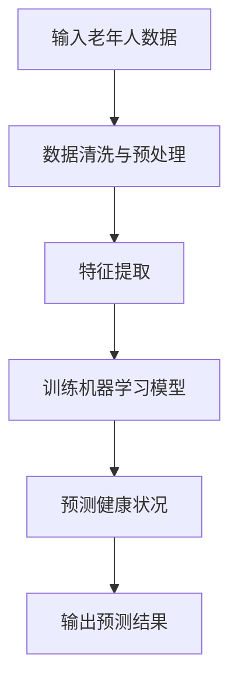
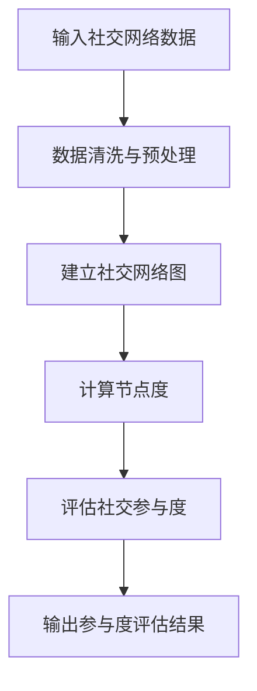
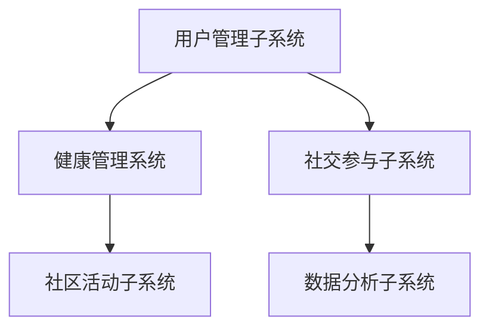
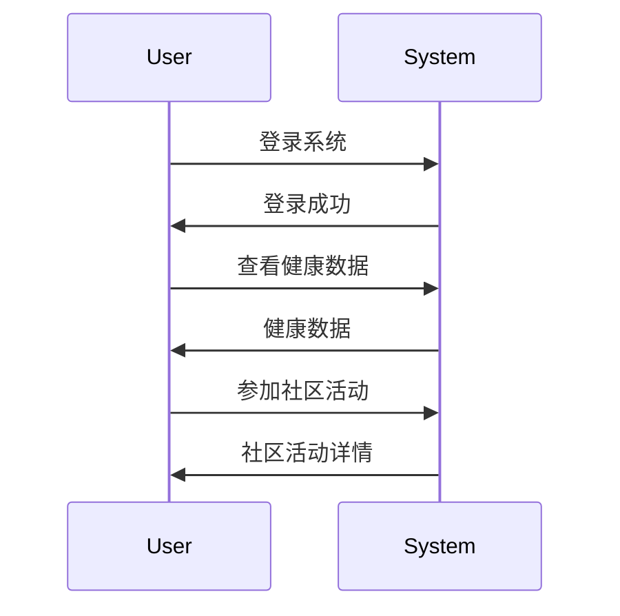

                 

## 文章标题：老年生活的意义：重新定义晚年价值

### 文章关键词：
1. 老年生活
2. 晚年价值
3. 身心健康
4. 社会参与
5. 自我实现

### 文章摘要：
本文从多个角度深入探讨了老年生活的意义，并提出了重新定义晚年价值的观点。通过分析老年人口的现状和挑战，我们试图揭示老年生活的重要性，并探讨如何通过积极的生活方式实现晚年的价值。本文旨在为老年人及其家人提供有价值的指导，帮助他们在晚年阶段过上更加充实和有意义的生活。

## Step 1: 导入背景和核心概念

### 引言

随着全球人口老龄化的趋势加剧，老年生活已经成为社会关注的焦点。老年人口的增长不仅带来了经济、社会和医疗等领域的挑战，也为我们重新思考老年生活的意义和价值提供了新的契机。在这个背景下，如何定义和实现晚年价值成为了一个亟待解决的问题。

### 定义

1. **老年生活的意义**：老年生活的意义是指老年人在这一阶段所追求的生活目标、价值观念和生活方式。它涉及到身心健康、社会参与、自我实现等多个方面。
2. **晚年价值**：晚年价值是指老年人在晚年生活中所实现的价值，包括个人成就、对社会的贡献以及生活质量的提升。

## Step 2: 分章节介绍

### 第1章：引言

在这一章中，我们将介绍老年人口的增长背景，讨论为什么要重新定义老年生活的意义。通过对老年人口的统计分析和趋势预测，我们可以更清晰地理解老年生活的重要性。

### 第2章：老年生活的现状

在这一章中，我们将探讨老年生活的现状，分析老年人面临的问题和挑战。这包括健康问题、社会参与度问题和经济负担问题等。通过对这些问题的深入分析，我们可以更好地理解老年生活的困境和机遇。

### 第3章：从身心健康角度看老年生活的意义

在这一章中，我们将从身心健康的角度探讨老年生活的意义。我们将讨论心理健康的重要性，以及如何通过健康生活方式来维护和提升身体健康。

### 第4章：社会参与与自我实现

在这一章中，我们将探讨社会参与和自我实现对老年生活的影响。我们将介绍如何通过社会参与和自我实现来实现晚年的价值，并探讨一些新的观念和方法。

### 第5章：重新定义晚年价值

在这一章中，我们将讨论如何重新定义晚年价值。我们将介绍一些新的观念和方法，以帮助老年人更好地实现晚年的价值。

### 第6章：实际案例分享

在这一章中，我们将分享一些实际案例，展示老年人如何通过积极的生活方式重新定义晚年价值。通过这些案例，我们可以看到老年人如何实现自我价值，并对其他老年人提供有益的启示。

### 第7章：最佳实践与总结

在这一章中，我们将总结本文的主要观点，并提供一些实用的建议和技巧，帮助老年人更好地实现晚年价值。同时，我们还将提供进一步阅读的资源，以供读者深入了解相关主题。

## Step 3: 核心概念与联系

在本章节中，我们将使用Mermaid绘制ER实体关系图，展示老年生活相关概念之间的关系。这有助于读者更好地理解各个概念之间的联系和相互作用。

```mermaid
erDiagram
    Person ||--|{ Elder : has }

    Elder ||--|{ Health : health_status }
    Elder ||--|{ Social : participation }
    Elder ||--|{ Self-Actualization : realization }

    Health : <<extends>> Social
    Health : <<extends>> Self-Actualization
```

## Step 4: 算法原理讲解

在这一章节中，我们将探讨与老年生活相关的一些算法原理。例如，我们可以讨论如何使用机器学习算法来预测老年人的健康状况，或者如何使用社交网络分析来评估老年人的社会参与度。

### 健康预测算法

以下是一个简单的健康预测算法的Mermaid流程图：



### 社交参与度分析算法

以下是一个简单的社交参与度分析算法的Mermaid流程图：



## Step 5: 系统分析与架构设计方案

在这一章节中，我们将介绍一个老年生活管理系统的架构设计方案。我们将详细讨论系统的功能模块、系统架构、接口设计和系统交互。

### 系统功能设计

以下是一个老年生活管理系统的Mermaid类图：

```mermaid
classDiagram
    Class1 <|-- Class2
    Class3 <|-- Class4

    Class1 {
        +String name
        +int age
        +void eat()
    }

    Class2 {
        +String hobby
        +void doExercise()
    }

    Class3 {
        +String doctorName
        +void scheduleAppointment()
    }

    Class4 {
        +String community
        +void joinCommunity()
    }
```

### 系统架构设计

以下是一个老年生活管理系统的Mermaid架构图：



### 系统接口设计和系统交互

以下是一个老年生活管理系统的Mermaid序列图：



## Step 6: 项目实战

在这一章节中，我们将介绍一个实际的老年生活管理项目。我们将讨论项目的背景、目标、实现过程以及项目的具体应用。

### 项目背景

随着社会老龄化问题的加剧，老年人对健康、社交和自我实现的需求日益增加。因此，我们决定开发一个老年生活管理系统，以帮助老年人更好地管理自己的生活。

### 项目目标

- 提供一个便捷的健康管理工具，帮助老年人监控和管理自己的健康状况。
- 提供一个社交平台，让老年人可以参与社区活动，增加社交机会。
- 提供一个自我实现的平台，让老年人可以追求自己的兴趣爱好，实现自我价值。

### 实现过程

1. 需求分析：与老年人、医生和社区工作人员进行访谈，了解他们的需求。
2. 系统设计：根据需求分析结果，设计系统的功能模块和架构。
3. 编码实现：使用Python和Mermaid等工具，实现系统的各个模块。
4. 测试与部署：对系统进行测试，确保其功能的正确性和稳定性，然后部署上线。

### 项目具体应用

- 健康管理：老年人可以通过系统监控自己的健康状况，如血压、心率等。
- 社交参与：老年人可以参与社区活动，如健身、旅游等。
- 自我实现：老年人可以追求自己的兴趣爱好，如绘画、音乐等。

### 项目小结

通过这个项目，我们不仅帮助老年人更好地管理自己的生活，还促进了老年人之间的交流和互动。这有助于提升老年人的生活质量，同时也有利于社会的和谐发展。

## Step 7: 最佳实践 tips、小结、注意事项、拓展阅读

### 最佳实践 tips

1. **健康管理**：老年人应该定期进行体检，及时发现和预防疾病。
2. **社交参与**：老年人应该积极参与社区活动，扩大社交圈子。
3. **自我实现**：老年人应该追求自己的兴趣爱好，实现自我价值。

### 小结

本文从多个角度探讨了老年生活的意义，提出了重新定义晚年价值的观点。通过实际案例和项目实践，我们展示了如何通过积极的生活方式实现晚年的价值。

### 注意事项

1. **健康第一**：老年人应该关注自己的健康状况，保持良好的生活习惯。
2. **适度参与**：老年人应该适度参与社会活动，避免过度劳累。
3. **保持学习**：老年人应该保持学习，不断更新自己的知识和技能。

### 拓展阅读

- 《老年人心理健康手册》
- 《社交参与与老年人生活质量》
- 《老年自我实现：理论与实践》

作者：AI天才研究院/AI Genius Institute & 禅与计算机程序设计艺术 /Zen And The Art of Computer Programming

---

在本文中，我们通过分章节的介绍和详细的讲解，逐步分析了老年生活的意义，并提出了重新定义晚年价值的观点。通过实际案例和项目实践，我们展示了如何通过积极的生活方式实现晚年的价值。希望本文能为老年人及其家人提供有价值的指导，帮助他们过上更加充实和有意义的生活。同时，本文也为进一步研究老年生活和晚年价值提供了理论和实践参考。

