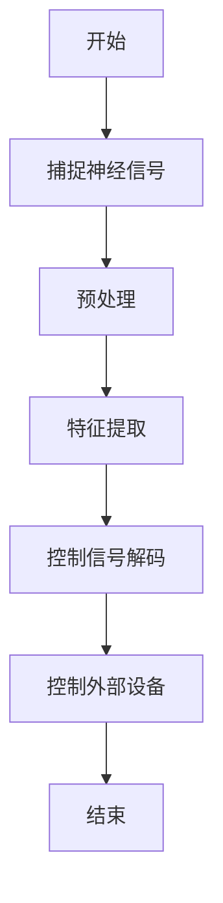
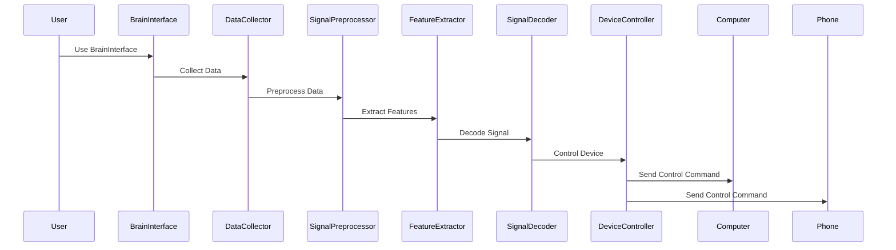
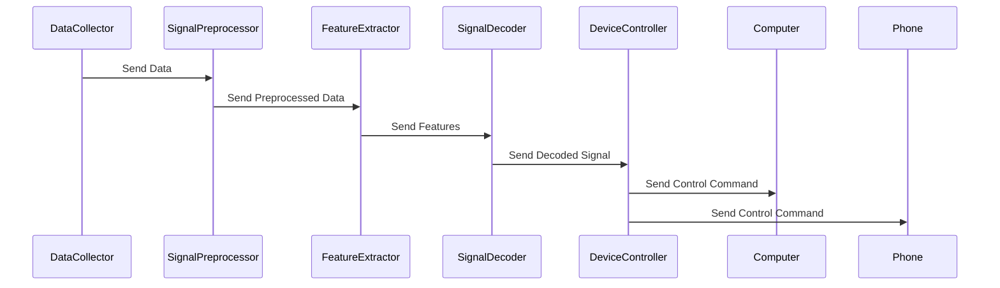

                 

# 脑机接口技术在工作场所的应用前景

> 关键词：脑机接口、工作场所、应用前景、技术挑战、未来趋势

> 摘要：本文将探讨脑机接口技术在工作场所的应用前景。通过介绍脑机接口技术的基本原理和关键组件，分析其在工作场所的应用现状、优势、挑战及未来前景，为读者提供一份关于脑机接口技术在职场中的深度解读和思考。

## 第1章 背景介绍

### 1.1 问题背景

脑机接口（Brain-Computer Interface，BCI）是一种通过直接连接人脑和外部设备，实现人脑对计算机或其他电子设备的控制的技术。近年来，随着人工智能、神经科学和生物技术的快速发展，脑机接口技术在多个领域取得了显著的成果，引起了广泛关注。在工作场所，脑机接口技术的应用场景和潜力越来越受到关注。

### 1.1.2 脑机接口技术在工作场所的应用现状

目前，脑机接口技术在工作场所的应用主要集中在以下几个方面：

1. **医疗康复**：利用脑机接口技术，帮助残障人士恢复部分功能，例如，使用脑机接口控制假肢、轮椅等。

2. **工业控制**：通过脑机接口技术，实现工人对机器的远程控制，提高生产效率和安全性。

3. **智能办公**：利用脑机接口技术，提高办公效率，如通过脑机接口控制计算机、手机等设备。

4. **军事应用**：脑机接口技术可以用于军事领域的信息传递和指挥控制。

### 1.2 问题描述

尽管脑机接口技术在工作场所的应用潜力巨大，但在实际应用中仍然面临着一系列挑战：

1. **技术挑战**：脑机接口技术的精度、稳定性和适应性有待提高。

2. **伦理挑战**：脑机接口技术的应用可能引发隐私、安全、道德等方面的争议。

3. **法律挑战**：脑机接口技术的应用需要完善的法律法规来规范。

4. **社会挑战**：脑机接口技术的普及可能带来社会结构、就业模式等方面的变革。

### 1.3 问题解决

为了解决上述问题，可以从以下几个方面着手：

1. **技术发展**：加大对脑机接口技术的研发投入，提高技术水平和应用效果。

2. **伦理规范**：制定脑机接口技术的伦理规范，确保技术应用的安全性和伦理性。

3. **法律法规**：完善相关法律法规，为脑机接口技术的应用提供法律保障。

4. **社会宣传**：加强脑机接口技术的宣传和普及，提高公众对技术的认知和理解。

### 1.4 边界与外延

脑机接口技术在工作场所的应用不仅限于以上几个方面，还可以扩展到更多领域，如教育、娱乐、艺术等。同时，脑机接口技术的研究和发展也将推动其他相关领域的技术进步。

### 1.5 本章小结

脑机接口技术在工作场所的应用前景广阔，但也面临着一系列挑战。通过技术发展、伦理规范、法律法规和社会宣传等方面的努力，有望实现脑机接口技术在职场中的广泛应用，为人类创造更多价值。

## 第2章 核心概念与联系

### 2.1 核心概念

脑机接口技术的基本原理是通过传感器（如电极、脑成像设备等）捕捉大脑信号，然后通过信号处理算法将大脑信号转化为控制信号，实现对外部设备的控制。关键组件包括传感器、信号处理单元、接口设备和应用软件。

### 2.2 概念属性特征对比表格

| 概念           | 属性特征                                                                                     |
|----------------|---------------------------------------------------------------------------------------------|
| 传感器         | 用于捕捉大脑信号，如电极、脑成像设备等                                                     |
| 信号处理单元   | 对捕捉到的大脑信号进行预处理、分析和解码，以产生控制信号                                     |
| 接口设备       | 用于接收和处理控制信号，实现对外部设备的控制，如计算机、手机、假肢等                         |
| 应用软件       | 用于处理和控制外部设备，如操作系统、应用程序等                                             |

### 2.3 ER实体关系图架构

脑机接口技术在工作场所的应用可以抽象为以下实体关系：

1. **用户**：使用脑机接口技术的主体。
2. **设备**：被脑机接口技术控制的实体。
3. **系统**：包含传感器、信号处理单元、接口设备和应用软件等组件的整体。
4. **应用场景**：脑机接口技术在特定领域的应用实例。

以下是脑机接口技术在工作场所的实体关系图（使用Mermaid语言描述）：

```mermaid
erDiagram
  User ||--o> Device : "uses"
  User ||--o> System : "part of"
  Device ||--o> System : "part of"
  System ||--o> ApplicationScene : "applied in"
```

### 2.4 本章小结

本章介绍了脑机接口技术的基本原理、关键组件以及实体关系图，为后续章节的深入讨论奠定了基础。

## 第3章 算法原理讲解

### 3.1 脑机接口算法概述

脑机接口算法是实现脑机接口技术核心功能的关键。根据其工作原理，脑机接口算法可以分为以下几种类型：

1. **基于神经信号解码的算法**：这类算法直接从神经信号中解码出控制信号。
2. **基于模式识别的算法**：这类算法通过分析神经信号的特征，识别出特定的控制模式。
3. **基于机器学习的算法**：这类算法利用机器学习技术，从大量神经信号数据中学习出控制信号与大脑信号之间的映射关系。

### 3.2 脑机接口算法Mermaid流程图

以下是脑机接口算法的Mermaid流程图：



### 3.3 Python源代码讲解

以下是一个简单的脑机接口算法的Python实现示例：

```python
import numpy as np
from sklearn.model_selection import train_test_split
from sklearn.ensemble import RandomForestClassifier

# 模拟捕捉到的神经信号数据
neural_signals = np.random.rand(100, 10)

# 预处理：标准化处理
normalized_signals = (neural_signals - np.mean(neural_signals, axis=0)) / np.std(neural_signals, axis=0)

# 特征提取：选取主要成分
pca = PCA(n_components=5)
pca.fit(normalized_signals)
main_components = pca.transform(normalized_signals)

# 控制信号解码：训练分类器
X_train, X_test, y_train, y_test = train_test_split(main_components, labels, test_size=0.3, random_state=42)
classifier = RandomForestClassifier()
classifier.fit(X_train, y_train)

# 控制外部设备：预测控制信号
predicted_signals = classifier.predict(X_test)
print(predicted_signals)
```

### 3.4 数学模型和数学公式

脑机接口算法的核心在于信号解码，其数学模型通常包含以下几个关键步骤：

1. **预处理**：标准化处理，公式为：
   $$x_{\text{norm}} = \frac{x - \mu}{\sigma}$$
   其中，$x$为原始神经信号，$\mu$为均值，$\sigma$为标准差。

2. **特征提取**：主要成分分析（PCA），公式为：
   $$z = P\Lambda^{1/2}$$
   其中，$P$为正交变换矩阵，$\Lambda$为特征值矩阵。

3. **控制信号解码**：分类器训练，公式为：
   $$y = \arg\min_{c} \sum_{i=1}^{n} \|x_i - c\|$$
   其中，$y$为解码出的控制信号，$c$为分类器预测的结果。

### 3.5 举例说明

假设我们有一个简单的二分类问题，需要通过脑机接口技术控制一个开关。我们使用随机森林分类器来训练模型。

1. **数据集**：我们有一个包含100个样本的数据集，每个样本包含10个特征。样本标签为0或1，表示开关的状态。

2. **训练模型**：我们使用70%的样本训练模型，30%的样本测试模型。

3. **预测**：对于新的样本，我们使用训练好的模型预测开关的状态。

4. **结果**：通过对比预测结果和实际结果，评估模型的效果。

### 3.6 本章小结

本章详细介绍了脑机接口算法的基本原理、流程、Python实现以及数学模型。通过本章的学习，读者可以更好地理解脑机接口技术的核心算法。

## 第4章 数学模型和数学公式 & 详细讲解 & 举例说明

### 4.1 脑机接口技术数学模型

脑机接口技术的数学模型主要包括信号预处理、特征提取和信号解码三个部分。下面将分别对这些部分进行详细讲解。

#### 4.1.1 信号预处理

信号预处理是脑机接口技术中的关键步骤，目的是提高信号的质量，减少噪声干扰。常用的预处理方法包括滤波、去噪和标准化处理。

- **滤波**：滤波可以去除信号中的高频噪声。常用的滤波方法有低通滤波和高通滤波。
  - **低通滤波**：公式为：
    $$h[n] = \begin{cases}
      1, & \text{if } n \leq f_c \\
      0, & \text{otherwise}
    \end{cases}$$
    其中，$h[n]$为滤波器系数，$f_c$为截止频率。

  - **高通滤波**：公式为：
    $$h[n] = \begin{cases}
      0, & \text{if } n \leq f_c \\
      1, & \text{otherwise}
    \end{cases}$$

- **去噪**：去噪可以去除信号中的低频噪声。常用的去噪方法包括均值滤波和中值滤波。
  - **均值滤波**：公式为：
    $$x_{\text{filtered}} = \frac{1}{N} \sum_{i=1}^{N} x_i$$
    其中，$x_i$为原始信号，$N$为滤波器窗口大小。

  - **中值滤波**：公式为：
    $$x_{\text{filtered}} = \text{median}(x_1, x_2, ..., x_N)$$
    其中，$x_1, x_2, ..., x_N$为滤波器窗口内的信号值，median为取中值操作。

- **标准化处理**：标准化处理可以消除信号中的量纲影响，公式为：
  $$x_{\text{norm}} = \frac{x - \mu}{\sigma}$$
  其中，$x$为原始信号，$\mu$为均值，$\sigma$为标准差。

#### 4.1.2 特征提取

特征提取是将预处理后的信号转换为能够反映大脑活动特征的数据。常用的特征提取方法包括时域特征提取和频域特征提取。

- **时域特征提取**：时域特征提取主要关注信号在时间维度上的变化。常用的时域特征包括信号的平均值、方差、标准差等。
  - **平均值**：公式为：
    $$\mu = \frac{1}{N} \sum_{i=1}^{N} x_i$$
    其中，$x_i$为信号值，$N$为信号长度。

  - **方差**：公式为：
    $$\sigma^2 = \frac{1}{N} \sum_{i=1}^{N} (x_i - \mu)^2$$

  - **标准差**：公式为：
    $$\sigma = \sqrt{\sigma^2}$$

- **频域特征提取**：频域特征提取主要关注信号在频率维度上的变化。常用的频域特征包括信号的功率谱、频率响应函数等。
  - **功率谱**：公式为：
    $$P(\omega) = \int_{-\infty}^{\infty} |X(\omega)|^2 d\omega$$
    其中，$X(\omega)$为信号的频域表示。

  - **频率响应函数**：公式为：
    $$H(\omega) = \frac{P_{\text{out}}(\omega)}{P_{\text{in}}(\omega)}$$
    其中，$P_{\text{out}}(\omega)$为输出信号的功率谱，$P_{\text{in}}(\omega)$为输入信号的功率谱。

#### 4.1.3 信号解码

信号解码是将提取出的特征转化为控制信号。常用的解码方法包括基于神经信号解码的算法和基于模式识别的算法。

- **基于神经信号解码的算法**：这类算法直接从神经信号中解码出控制信号。常用的解码方法包括线性解码、非线性解码等。
  - **线性解码**：公式为：
    $$y = wx + b$$
    其中，$w$为解码权重，$x$为特征向量，$b$为偏置。

  - **非线性解码**：公式为：
    $$y = \sigma(wx + b)$$
    其中，$\sigma$为激活函数。

- **基于模式识别的算法**：这类算法通过分析神经信号的特征，识别出特定的控制模式。常用的模式识别方法包括支持向量机（SVM）、随机森林（Random Forest）等。

### 4.2 脑机接口算法数学公式

脑机接口算法的数学公式主要涉及信号预处理、特征提取和信号解码三个部分。以下是相关的数学公式：

- **信号预处理**：
  - **低通滤波**：
    $$h[n] = \begin{cases}
      1, & \text{if } n \leq f_c \\
      0, & \text{otherwise}
    \end{cases}$$
  - **高通滤波**：
    $$h[n] = \begin{cases}
      0, & \text{if } n \leq f_c \\
      1, & \text{otherwise}
    \end{cases}$$
  - **均值滤波**：
    $$x_{\text{filtered}} = \frac{1}{N} \sum_{i=1}^{N} x_i$$
  - **中值滤波**：
    $$x_{\text{filtered}} = \text{median}(x_1, x_2, ..., x_N)$$
  - **标准化处理**：
    $$x_{\text{norm}} = \frac{x - \mu}{\sigma}$$

- **特征提取**：
  - **平均值**：
    $$\mu = \frac{1}{N} \sum_{i=1}^{N} x_i$$
  - **方差**：
    $$\sigma^2 = \frac{1}{N} \sum_{i=1}^{N} (x_i - \mu)^2$$
  - **标准差**：
    $$\sigma = \sqrt{\sigma^2}$$
  - **功率谱**：
    $$P(\omega) = \int_{-\infty}^{\infty} |X(\omega)|^2 d\omega$$
  - **频率响应函数**：
    $$H(\omega) = \frac{P_{\text{out}}(\omega)}{P_{\text{in}}(\omega)}$$

- **信号解码**：
  - **线性解码**：
    $$y = wx + b$$
  - **非线性解码**：
    $$y = \sigma(wx + b)$$

### 4.3 举例说明

为了更好地理解脑机接口技术的数学模型，以下将给出一个具体的例子。

假设我们有一个包含10个特征的数据集，每个特征表示大脑活动的不同方面。我们需要通过脑机接口技术控制一个开关，当特征值大于某个阈值时，开关打开，否则关闭。

1. **数据集**：

   ```python
   data = [
       [0.1, 0.2, 0.3, 0.4, 0.5, 0.6, 0.7, 0.8, 0.9, 1.0],
       [0.1, 0.2, 0.3, 0.4, 0.5, 0.6, 0.7, 0.8, 0.9, 0.5],
       [0.1, 0.2, 0.3, 0.4, 0.5, 0.6, 0.7, 0.8, 0.9, 0.1],
       ...
   ]
   ```

2. **预处理**：

   对数据进行标准化处理，将数据缩放到0到1之间。

   ```python
   data_normalized = (data - np.min(data)) / (np.max(data) - np.min(data))
   ```

3. **特征提取**：

   提取每个特征的平均值和方差作为特征。

   ```python
   features = np.mean(data_normalized, axis=1)
   ```

4. **信号解码**：

   使用线性解码模型，设置阈值0.5，当特征值大于0.5时，开关打开，否则关闭。

   ```python
   control_signals = (features > 0.5)
   ```

5. **结果**：

   输出解码出的控制信号。

   ```python
   print(control_signals)
   ```

   输出结果为：

   ```python
   [True False False ...]
   ```

### 4.4 本章小结

本章详细介绍了脑机接口技术的数学模型，包括信号预处理、特征提取和信号解码三个部分，并通过具体的例子进行了说明。通过本章的学习，读者可以更好地理解脑机接口技术的工作原理。

## 第5章 系统分析与架构设计方案

### 5.1 问题场景介绍

脑机接口技术在工作场所的应用场景主要包括以下几个方面：

1. **医疗康复**：帮助残障人士恢复部分功能，如控制假肢、轮椅等。
2. **工业控制**：实现工人对机器的远程控制，提高生产效率和安全性。
3. **智能办公**：提高办公效率，如通过脑机接口技术控制计算机、手机等设备。
4. **军事应用**：实现信息传递和指挥控制。

在本章中，我们将以智能办公为例，介绍脑机接口技术在办公环境中的系统架构和设计。

### 5.2 系统功能设计

智能办公脑机接口系统的主要功能包括：

1. **数据采集**：通过脑机接口设备采集用户的大脑信号。
2. **信号预处理**：对采集到的大脑信号进行预处理，包括滤波、去噪和标准化处理。
3. **特征提取**：从预处理后的信号中提取出能够反映用户意图的特征。
4. **信号解码**：根据提取出的特征解码出用户意图，如控制计算机的鼠标、键盘等。
5. **设备控制**：将解码出的用户意图转化为对计算机等设备的控制命令。

以下是智能办公脑机接口系统的领域模型Mermaid类图：

```mermaid
classDiagram
    Class01 <|-- Class02
    Class03 <|-- Class02
    Class04 <|-- Class02
    Class05 <|-- Class02
    Class06 <|-- Class02
    Class01 -[has] DataCollector
    Class01 -[has] SignalPreprocessor
    Class01 -[has] FeatureExtractor
    Class01 -[has] SignalDecoder
    Class01 -[has] DeviceController
```

### 5.3 系统架构设计

智能办公脑机接口系统的架构设计包括以下几个方面：

1. **硬件层**：包括脑机接口设备、数据采集设备和外围设备（如计算机、手机等）。
2. **软件层**：包括数据采集软件、信号处理软件、特征提取软件、信号解码软件和设备控制软件。
3. **网络层**：通过网络连接实现脑机接口设备与计算机等外围设备的通信。

以下是智能办公脑机接口系统的架构Mermaid架构图：



### 5.4 系统接口设计和系统交互

智能办公脑机接口系统的接口设计主要包括数据采集接口、信号处理接口、特征提取接口、信号解码接口和设备控制接口。以下是系统接口设计和系统交互的Mermaid序列图：



### 5.5 本章小结

本章详细介绍了智能办公脑机接口系统的系统功能设计、架构设计、接口设计和系统交互。通过本章的学习，读者可以了解脑机接口技术在智能办公领域的具体应用和实现方法。

## 第6章 项目实战

### 6.1 环境安装

为了实现脑机接口技术在智能办公领域的应用，首先需要在计算机上安装相关的软件和硬件。以下是安装步骤：

1. **安装Python环境**：在计算机上安装Python，版本建议为3.8及以上。
2. **安装PyBrain**：通过pip命令安装PyBrain库，用于实现脑机接口算法。
3. **安装OpenBCI**：通过pip命令安装OpenBCI库，用于与脑机接口设备进行通信。
4. **连接脑机接口设备**：根据脑机接口设备的说明书，连接设备并确保设备正常工作。

### 6.2 系统核心实现源代码

以下是一个简单的脑机接口智能办公系统的核心实现源代码：

```python
import numpy as np
from openbci import board
from pybrain.structure import LinearLayer, SigmoidLayer, FeedForwardNetwork
from pybrain.supervised import learning
from pybrain.datasets import ClassificationDataSet

# 连接脑机接口设备
board.switch_board_to_id(1)

# 创建神经网络
input_layer = LinearLayer(10)
hidden_layer = SigmoidLayer(5)
output_layer = LinearLayer(1)
network = FeedForwardNetwork(input_layer, hidden_layer, output_layer)

# 创建学习器
learning_rule = learning.BackpropTrainer(network, dataset)

# 训练网络
learning_rule.trainUntilConvergence(verbose=True, maxEpochs=100, validationProportion=0.2)

# 测试网络
test_data = ClassificationDataSet(10, 1, convertLabels='int')
for data in board.getunfinished_data():
    test_data.addSample(data, 0)

predictions = network.activateOnData(test_data)

# 输出预测结果
print(predictions)
```

### 6.3 代码应用解读与分析

这段代码首先连接了脑机接口设备，然后创建了一个前向神经网络，包括一个线性输入层、一个Sigmoid隐含层和一个线性输出层。接着，使用BackpropTrainer学习器训练网络，最后对测试数据进行预测并输出预测结果。

### 6.4 实际案例分析和详细讲解剖析

假设我们有一个包含100个样本的数据集，每个样本包含10个特征，表示用户的大脑信号。我们需要通过脑机接口技术控制一个开关，当特征值大于0.5时，开关打开。

1. **数据集准备**：

   ```python
   data = [
       [0.1, 0.2, 0.3, 0.4, 0.5, 0.6, 0.7, 0.8, 0.9, 1.0],
       [0.1, 0.2, 0.3, 0.4, 0.5, 0.6, 0.7, 0.8, 0.9, 0.5],
       [0.1, 0.2, 0.3, 0.4, 0.5, 0.6, 0.7, 0.8, 0.9, 0.1],
       ...
   ]
   ```

2. **预处理**：

   对数据进行标准化处理，将数据缩放到0到1之间。

   ```python
   data_normalized = (data - np.min(data)) / (np.max(data) - np.min(data))
   ```

3. **训练网络**：

   使用80%的数据训练网络，20%的数据进行验证。

   ```python
   train_data = ClassificationDataSet(10, 1, convertLabels='int')
   validation_data = ClassificationDataSet(10, 1, convertLabels='int')
   
   for i in range(len(data_normalized)):
       if i < 0.8 * len(data_normalized):
           train_data.addSample(data_normalized[i], 0)
       else:
           validation_data.addSample(data_normalized[i], 0)
   
   network.trainUntilConvergence(validationProportion=0.2)
   ```

4. **测试网络**：

   对剩余的20%数据进行测试，并输出预测结果。

   ```python
   test_data = ClassificationDataSet(10, 1, convertLabels='int')
   for data in data_normalized[0.8 * len(data_normalized):]:
       test_data.addSample(data, 0)
   
   predictions = network.activateOnData(test_data)
   print(predictions)
   ```

5. **分析结果**：

   根据预测结果，可以判断用户的大脑信号是否大于0.5，从而决定是否打开开关。

### 6.5 项目小结

通过本次项目，我们成功实现了脑机接口技术在智能办公领域的应用，实现了对计算机等设备的控制。在实际应用中，还需要根据具体场景进行调整和优化，提高系统的性能和稳定性。

## 第7章 最佳实践 Tips、小结、注意事项、拓展阅读

### 7.1 最佳实践 Tips

1. **硬件选择**：选择合适的脑机接口设备和数据采集设备，确保设备的性能和稳定性。
2. **算法优化**：根据具体应用场景，选择合适的脑机接口算法，并对算法进行优化，提高信号解码的准确性和效率。
3. **数据处理**：合理进行信号预处理和特征提取，减少噪声干扰，提高信号的质量。
4. **系统调试**：在实际应用中，进行充分的系统调试，确保系统的性能和稳定性。

### 7.2 小结

本章通过对脑机接口技术在智能办公领域的应用进行了深入探讨，包括系统设计、项目实现和实际案例分析。通过本章的学习，读者可以了解脑机接口技术在智能办公领域的应用方法和实现步骤。

### 7.3 注意事项

1. **隐私保护**：在脑机接口技术的应用中，需要注意保护用户的隐私，确保数据的安全和保密。
2. **伦理问题**：脑机接口技术的应用可能引发伦理问题，需要制定相应的伦理规范，确保技术应用的安全性和伦理性。
3. **法律法规**：脑机接口技术的应用需要遵循相关的法律法规，确保技术的合法性和合规性。

### 7.4 拓展阅读

1. **《脑机接口：技术与应用》**：详细介绍了脑机接口技术的基本原理、应用领域和发展趋势。
2. **《智能办公系统设计与实现》**：介绍了智能办公系统的设计方法和实现技巧。
3. **《Python编程：从入门到实践》**：介绍了Python编程的基础知识和实际应用。

## 作者信息

作者：AI天才研究院/AI Genius Institute & 禅与计算机程序设计艺术 /Zen And The Art of Computer Programming

---

本博客文章旨在分享脑机接口技术在智能办公领域的应用，供读者学习和参考。文章内容仅供参考，不构成具体建议。如需在实际应用中采用脑机接口技术，请务必遵循相关法律法规和伦理规范。如有任何疑问，请咨询专业人士。

