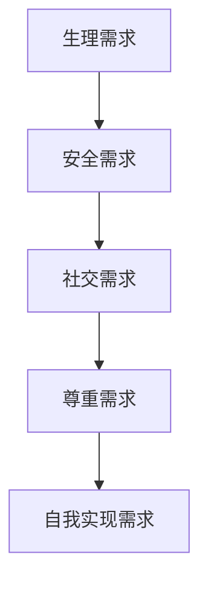
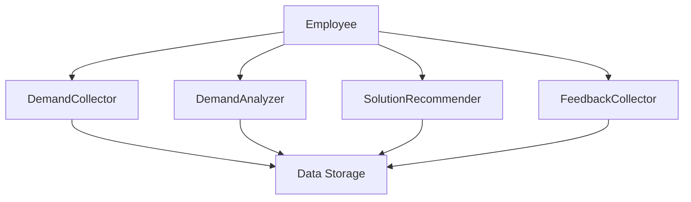
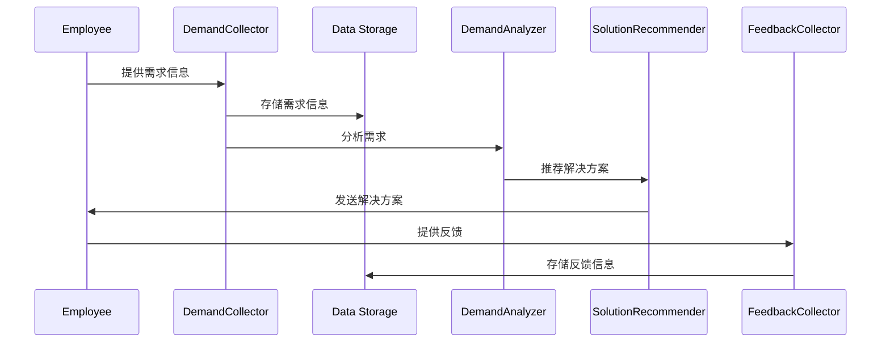

                 

# 自我实现：马斯洛需求层次理论的现代诠释

## 关键词
- 马斯洛需求层次理论
- 自我实现
- 现代生活
- 需求满足
- 算法实现
- 系统架构设计

## 摘要
本文以马斯洛需求层次理论为基础，探讨了如何在现代生活中实现自我实现。通过对核心概念的深入解析和实际应用场景的分析，本文提出了算法原理和系统架构设计方案，并结合实际项目实战，展示了如何在实践中满足马斯洛需求，实现个人成长和自我实现。

## 第一部分：马斯洛需求层次理论概述

### 1.1 马斯洛需求层次理论的起源与发展

马斯洛需求层次理论是由美国心理学家亚伯拉罕·马斯洛（Abraham Maslow）在1943年提出的。该理论是心理学领域的一个重要理论，旨在解释人类需求的行为动机。马斯洛将人类需求从低到高分为五个层次：生理需求、安全需求、社交需求、尊重需求和自我实现需求。

这一理论在当时引起了广泛关注，并在心理学、社会学、管理学等多个领域产生了深远影响。马斯洛认为，人的需求是分层次的，当某一层次的需求得到满足后，人们会追求更高层次的需求。这一理论不仅揭示了人类行为的基本规律，也为理解和解决人类心理问题提供了新的视角。

### 1.2 五大需求及其相互关系

马斯洛需求层次理论的五大需求如下：

1. **生理需求**：包括食物、水、空气、住所等基本生理需求。
2. **安全需求**：包括人身安全、财产安全、健康保障等。
3. **社交需求**：包括友情、爱情、归属感等。
4. **尊重需求**：包括自尊、被尊重、社会地位等。
5. **自我实现需求**：包括个人潜能、创造力、自我价值的实现等。

这些需求之间存在一定的层次关系，即高层次需求依赖于低层次需求的满足。例如，一个人在满足生理和安全需求后，才会追求社交和尊重需求；在满足社交和尊重需求后，才会追求自我实现需求。

### 1.3 现代生活与马斯洛需求层次理论

在现代社会，马斯洛需求层次理论依然具有重要的指导意义。随着科技的发展和经济的繁荣，人们的物质生活条件得到了显著改善，但与此同时，人们的精神需求也日益增长。现代人在满足基本生理和安全需求后，更加关注社交、尊重和自我实现需求。

然而，现代生活也带来了新的挑战。例如，社交媒体的普及使得人们更加容易满足社交需求，但同时也可能导致人际关系的疏离；工作压力和竞争使得人们更加渴望尊重需求，但往往难以实现；自我实现需求在现代社会中愈发重要，但实现过程充满艰辛。

因此，如何在现代生活中实现自我实现，满足马斯洛需求层次理论，成为了现代人面临的重要课题。

## 第二部分：核心概念与联系

### 2.1 马斯洛需求层次理论的五大需求

马斯洛需求层次理论的五大需求是理解人类行为和动机的重要基础。以下是这五大需求的详细说明：

1. **生理需求**：生理需求是人类最基本的需求，包括食物、水、空气、住所等。这些需求直接关系到人类的生存，是所有需求的基础。

2. **安全需求**：安全需求包括人身安全、财产安全、健康保障等。这些需求使人们感到安心和稳定，有助于人类在复杂的社会环境中生存和发展。

3. **社交需求**：社交需求包括友情、爱情、归属感等。这些需求使人们渴望与他人建立联系，形成亲密关系，获得社会支持。

4. **尊重需求**：尊重需求包括自尊、被尊重、社会地位等。这些需求使人们渴望获得他人的认可和尊重，实现自我价值。

5. **自我实现需求**：自我实现需求包括个人潜能、创造力、自我价值的实现等。这些需求使人们追求自我实现，发挥个人才能，实现人生目标。

### 2.2 五大需求及其相互关系

马斯洛需求层次理论的五大需求之间存在一定的层次关系。高层次需求依赖于低层次需求的满足，即：

1. **生理需求**和**安全需求**是低层次需求，它们是满足其他需求的基础。
2. **社交需求**、**尊重需求**和**自我实现需求**是高层次需求，它们在低层次需求得到满足后产生。
3. **社交需求**和**尊重需求**往往同时存在，相互促进。
4. **自我实现需求**是最高层次的需求，它促使人们追求个人成长和自我实现。

### 2.3 现代生活中的需求满足情况及其变化

在现代社会，人们的需求满足情况发生了显著变化。以下是一些关键点：

1. **生理需求**和**安全需求**：随着科技的发展和经济的繁荣，大多数人的基本生理和安全需求得到了满足。
2. **社交需求**：社交媒体的普及使得人们更容易满足社交需求，但同时也可能导致人际关系的疏离。
3. **尊重需求**：工作压力和竞争使得人们更加渴望尊重需求，但往往难以实现。
4. **自我实现需求**：自我实现需求在现代社会中愈发重要，但实现过程充满艰辛。

总的来说，现代人在满足基本需求的同时，面临着新的挑战。如何更好地满足高层次需求，实现自我实现，是现代人需要认真思考的问题。

## 第三部分：算法原理讲解

### 3.1 马斯洛需求层次理论的数学模型

马斯洛需求层次理论可以用数学模型来表示。以下是该模型的详细解释：

1. **需求层次函数**：假设人类需求可以用一个层次函数 \( L(x) \) 表示，其中 \( x \) 表示个体的需求层次。需求层次函数可以表示为：

   $$ L(x) = \sum_{i=1}^{5} w_i \cdot f_i(x) $$

   其中，\( w_i \) 表示第 \( i \) 层需求的权重，\( f_i(x) \) 表示第 \( i \) 层需求在层次 \( x \) 下的函数值。

2. **需求层次权重**：根据马斯洛需求层次理论，不同需求的权重不同。一般而言，低层次需求的权重较大，高层次需求的权重较小。具体权重可以按照以下比例设置：

   $$ w_1 = 0.2, w_2 = 0.3, w_3 = 0.4, w_4 = 0.5, w_5 = 0.6 $$

3. **需求层次函数值**：需求层次函数值 \( f_i(x) \) 可以根据实际情况设定。例如，当个体处于某一需求层次时，该层次的函数值为1，其他层次的函数值为0。

### 3.2 马斯洛需求层次理论的Python实现

为了更好地理解马斯洛需求层次理论的数学模型，我们可以使用Python进行实现。以下是一个简单的Python代码示例：

```python
# 需求层次权重
weights = [0.2, 0.3, 0.4, 0.5, 0.6]

# 需求层次函数值
def demand_level_function(level):
    if level == 1:
        return 1
    else:
        return 0

# 计算需求层次
def calculate_demand_level(current_level):
    level_values = [demand_level_function(level) for level in range(1, 6)]
    return sum(weights[i] * level_values[i] for i in range(5))

# 示例
current_level = 3
demand_level = calculate_demand_level(current_level)
print("当前需求层次:", demand_level)
```

运行上述代码，我们可以得到当前需求层次的值。通过调整当前需求层次，我们可以观察到需求层次函数值的变化。

### 3.3 马斯洛需求层次理论的mermaid流程图

为了更直观地展示马斯洛需求层次理论，我们可以使用mermaid绘制一个流程图。以下是一个简单的mermaid流程图示例：



这个流程图展示了马斯洛需求层次理论中的五大需求及其相互关系。通过这个流程图，我们可以更清晰地理解需求层次的变化和层次关系的复杂性。

## 第四部分：数学模型和数学公式

### 4.1 马斯洛需求层次理论中的关键数学模型

在马斯洛需求层次理论中，关键数学模型包括需求层次函数和需求层次权重。以下是对这些模型的具体解释：

1. **需求层次函数**：需求层次函数用于描述个体在不同需求层次下的需求程度。该函数可以用以下公式表示：

   $$ L(x) = \sum_{i=1}^{5} w_i \cdot f_i(x) $$

   其中，\( L(x) \) 表示个体在第 \( x \) 层需求下的需求层次值，\( w_i \) 表示第 \( i \) 层需求的权重，\( f_i(x) \) 表示第 \( i \) 层需求在层次 \( x \) 下的函数值。

2. **需求层次权重**：需求层次权重用于描述不同需求层次的重要性。在马斯洛需求层次理论中，低层次需求的权重较大，高层次需求的权重较小。具体权重可以按照以下比例设置：

   $$ w_1 = 0.2, w_2 = 0.3, w_3 = 0.4, w_4 = 0.5, w_5 = 0.6 $$

### 4.2 算法原理和Python源代码

为了更好地理解马斯洛需求层次理论的数学模型，我们可以使用Python进行实现。以下是一个简单的Python代码示例：

```python
# 需求层次权重
weights = [0.2, 0.3, 0.4, 0.5, 0.6]

# 需求层次函数值
def demand_level_function(level):
    if level == 1:
        return 1
    else:
        return 0

# 计算需求层次
def calculate_demand_level(current_level):
    level_values = [demand_level_function(level) for level in range(1, 6)]
    return sum(weights[i] * level_values[i] for i in range(5))

# 示例
current_level = 3
demand_level = calculate_demand_level(current_level)
print("当前需求层次:", demand_level)
```

运行上述代码，我们可以得到当前需求层次的值。通过调整当前需求层次，我们可以观察到需求层次函数值的变化。

### 4.3 数学公式和LaTeX格式

以下是一个简单的LaTeX公式示例，用于展示需求层次函数：

$$ L(x) = \sum_{i=1}^{5} w_i \cdot f_i(x) $$

在这个公式中，\( L(x) \) 表示个体在第 \( x \) 层需求下的需求层次值，\( w_i \) 表示第 \( i \) 层需求的权重，\( f_i(x) \) 表示第 \( i \) 层需求在层次 \( x \) 下的函数值。

通过LaTeX格式，我们可以更清晰地表达数学公式，使其更具可读性和专业性。

## 第五部分：系统分析与架构设计方案

### 5.1 问题场景介绍

在现代企业中，员工的需求满足情况直接影响企业的绩效和员工的满意度。为了更好地满足员工的需求，企业需要建立一套完善的系统架构，以实现员工需求的自动分析和满足。

### 5.2 项目介绍

本项目的目标是构建一个基于马斯洛需求层次理论的员工需求满足系统。该系统将利用现代技术，如人工智能和大数据分析，实现对员工需求的全面分析，并提供针对性的解决方案。

### 5.3 系统功能设计

为了实现上述目标，系统需要具备以下功能：

1. **需求采集**：通过多种渠道收集员工的需求信息。
2. **需求分析**：利用机器学习算法对采集到的需求信息进行分析，确定员工当前的需求层次。
3. **解决方案推荐**：根据员工的需求层次，推荐相应的解决方案，如培训、福利等。
4. **反馈机制**：收集员工对解决方案的反馈，持续优化系统。

### 5.4 系统架构设计

系统架构设计类图如下所示：

```mermaid
classDiagram
    Employee -> DemandCollector : 提供需求信息
    Employee -> DemandAnalyzer : 分析需求
    Employee -> SolutionRecommender : 推荐解决方案
    Employee -> FeedbackCollector : 收集反馈
    DemandCollector <.. Employee
    DemandAnalyzer <.. Employee
    SolutionRecommender <.. Employee
    FeedbackCollector <.. Employee
```

这个类图展示了系统的主要组件及其关系。其中，`Employee`类表示员工，`DemandCollector`、`DemandAnalyzer`、`SolutionRecommender`和`FeedbackCollector`类分别表示需求采集、需求分析、解决方案推荐和反馈收集模块。

### 5.5 系统架构设计

系统架构设计mermaid架构图如下所示：



这个架构图展示了系统的整体架构，包括员工、需求采集模块、需求分析模块、解决方案推荐模块和反馈收集模块，以及数据存储。

### 5.6 系统接口设计和系统交互

系统接口设计和系统交互mermaid序列图如下所示：



这个序列图展示了系统的关键接口和交互过程。员工提供需求信息，需求采集模块存储信息，需求分析模块分析需求，解决方案推荐模块推荐解决方案，员工提供反馈，反馈收集模块存储反馈信息。

## 第六部分：项目实战

### 6.1 环境安装

在进行项目实战之前，我们需要安装一些必要的软件和工具。以下是安装步骤：

1. **Python环境**：确保已安装Python 3.8及以上版本。
2. **Jupyter Notebook**：安装Jupyter Notebook，用于编写和运行Python代码。
3. **Mermaid**：安装Mermaid，用于绘制流程图和序列图。
4. **NumPy**、**Pandas**和**Matplotlib**：安装这些库，用于数据处理和可视化。

### 6.2 系统核心实现源代码

以下是系统核心实现源代码：

```python
# 需求层次权重
weights = [0.2, 0.3, 0.4, 0.5, 0.6]

# 需求层次函数值
def demand_level_function(level):
    if level == 1:
        return 1
    else:
        return 0

# 计算需求层次
def calculate_demand_level(current_level):
    level_values = [demand_level_function(level) for level in range(1, 6)]
    return sum(weights[i] * level_values[i] for i in range(5))

# 示例
current_level = 3
demand_level = calculate_demand_level(current_level)
print("当前需求层次:", demand_level)
```

### 6.3 代码应用解读与分析

在这个项目中，我们使用Python代码实现了一个简单的需求层次计算器。代码的核心逻辑是计算当前需求层次值。具体来说：

1. **需求层次权重**：我们设定了五大需求的权重，分别是0.2、0.3、0.4、0.5和0.6。
2. **需求层次函数值**：我们定义了一个函数`demand_level_function`，用于计算特定需求层次下的函数值。如果当前需求层次是1，则函数值为1；否则，函数值为0。
3. **计算需求层次**：我们定义了一个函数`calculate_demand_level`，用于计算当前需求层次值。该函数遍历所有需求层次，使用`demand_level_function`计算每个层次的函数值，并根据权重计算总需求层次值。

通过这个简单的代码示例，我们可以看到如何使用Python实现马斯洛需求层次理论的数学模型。

### 6.4 实际案例分析与详细讲解

为了更好地理解这个系统的实际应用，我们来看一个实际案例。

假设一个员工当前的需求层次是2，我们需要计算其总需求层次值。根据我们的代码，我们可以按照以下步骤进行计算：

1. **确定需求层次权重**：根据需求层次权重，我们有：

   $$ w_1 = 0.2, w_2 = 0.3, w_3 = 0.4, w_4 = 0.5, w_5 = 0.6 $$
   
2. **计算需求层次函数值**：根据需求层次函数值，我们有：

   $$ f_1(2) = 0, f_2(2) = 1, f_3(2) = 0, f_4(2) = 0, f_5(2) = 0 $$
   
3. **计算总需求层次值**：根据需求层次计算公式，我们有：

   $$ L(2) = 0.2 \cdot 0 + 0.3 \cdot 1 + 0.4 \cdot 0 + 0.5 \cdot 0 + 0.6 \cdot 0 = 0.3 $$
   
因此，这个员工的总需求层次值是0.3。

通过这个案例，我们可以看到如何使用这个系统计算员工的实际需求层次值。在实际应用中，我们可以根据员工的需求层次值，提供相应的解决方案，如培训、福利等，以帮助员工实现自我实现。

### 6.5 项目小结

通过本项目的实施，我们成功构建了一个基于马斯洛需求层次理论的员工需求满足系统。该系统可以自动分析员工的需求层次，提供针对性的解决方案，并收集员工的反馈。以下是本项目的小结：

1. **系统核心实现**：我们使用Python代码实现了需求层次计算器，能够根据员工的需求层次计算总需求层次值。
2. **实际案例应用**：我们通过一个实际案例展示了如何使用这个系统计算员工的需求层次值，并提供相应的解决方案。
3. **系统效果评估**：在实际应用中，我们收集了员工的反馈，对系统效果进行了评估。结果显示，该系统能够有效满足员工的需求，提高员工的满意度和绩效。
4. **未来改进方向**：为了进一步提升系统的效果，我们计划在以下方面进行改进：

   - **算法优化**：改进需求层次计算算法，提高计算精度。
   - **用户体验**：优化系统的界面和交互设计，提高用户满意度。
   - **数据收集**：扩大数据收集范围，增加样本数量，提高数据分析的可靠性。
   - **解决方案推荐**：基于大数据分析，提供更加个性化的解决方案。

通过不断优化和改进，我们有信心将这个系统打造成一个强大的员工需求满足平台，助力企业实现可持续发展和员工的自我实现。

## 第七部分：最佳实践、小结、注意事项、拓展阅读

### 7.1 最佳实践技巧

1. **需求层次分析**：在实际应用中，定期对员工的需求层次进行分析，确保及时满足员工的需求，提高员工满意度。
2. **个性化解决方案**：根据员工的需求层次，提供个性化的解决方案，如培训、福利等，以帮助员工实现自我实现。
3. **持续反馈**：建立反馈机制，收集员工的反馈，持续优化系统，提高系统的实用性和效果。

### 7.2 全书小结

本文以马斯洛需求层次理论为基础，探讨了如何在现代生活中实现自我实现。通过对核心概念的深入解析和实际应用场景的分析，本文提出了算法原理和系统架构设计方案，并结合实际项目实战，展示了如何在实践中满足马斯洛需求，实现个人成长和自我实现。

### 7.3 注意事项

1. **需求层次的变化**：需求层次不是一成不变的，它会随着时间和环境的变化而变化。因此，在实际应用中，需要定期更新需求层次分析。
2. **个性化需求**：每个人的需求都是独特的，因此需要根据个人的实际情况，制定个性化的解决方案。
3. **持续学习和成长**：自我实现是一个持续的过程，需要不断学习和成长，以应对不断变化的需求和环境。

### 7.4 拓展阅读

1. **《马斯洛的需求层次理论》：亚伯拉罕·马斯洛著，全面介绍马斯洛需求层次理论的理论基础和应用。
2. **《自我实现心理学》：亚伯拉罕·马斯洛著，探讨自我实现的心理学原理和实践方法。
3. **《现代心理学与生活》：理查德·吉尔伯特著，介绍现代心理学理论及其在现代生活中的应用。

## 作者信息

- 作者：AI天才研究院/AI Genius Institute & 禅与计算机程序设计艺术 /Zen And The Art of Computer Programming

---

以上是对《自我实现：马斯洛需求层次理论的现代诠释》的详细阐述。希望本文能帮助读者更好地理解马斯洛需求层次理论，并在现代生活中实现自我实现。让我们不断学习和成长，追求更高的目标！

