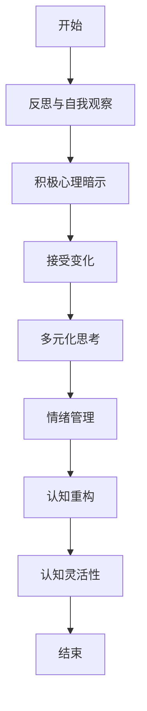
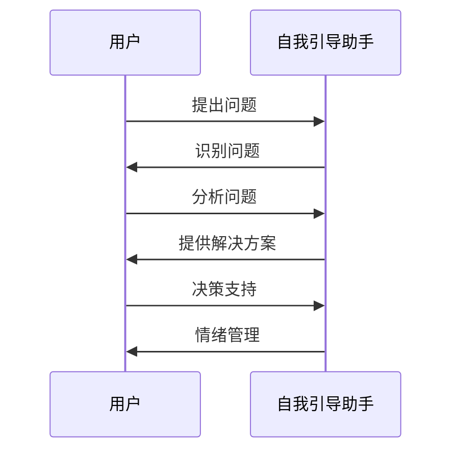

                 

# 自我引导：成为内在指南针的跟随者

关键词：自我引导、批判性思维、问题解决能力、自我认识、认知重构、情绪管理

摘要：
在信息爆炸和复杂性日益增多的现代社会，自我引导能力成为了个体应对挑战和实现成长的关键。本文旨在探讨如何通过培养批判性思维、问题解决能力和自我认识，帮助读者建立内在的指南针，成为自己生活的跟随者。文章将逐步分析自我引导的核心概念，阐述其属性特征，并通过算法原理讲解和实践案例，为读者提供切实可行的培养路径。

## 第一部分：问题背景

### 1.1.1 问题背景

在现代社会，人们面临着越来越多的复杂问题，这些问题需要深入的思考和分析才能解决。然而，对于很多人来说，缺乏有效的自我引导能力，导致他们在面对问题时感到迷茫和无助。因此，本书旨在探讨如何培养自我引导能力，帮助读者成为自己内心的指南针，更加有效地解决生活中的各种问题。

### 1.1.2 问题描述

自我引导是指一个人在没有外部指导的情况下，通过自己的思考和分析来解决问题、做出决策的过程。然而，在现实生活中，很多人往往依赖于他人的意见或指导，缺乏独立思考的能力。这种依赖性不仅影响了个人成长，也限制了他们解决复杂问题的能力。

### 1.1.3 问题解决

为了解决这一问题，本书将探讨如何培养自我引导能力，包括培养批判性思维、提高问题解决能力、增强自我认识等。通过这些方法，读者可以学会如何独立思考，更好地应对生活中的各种挑战。

### 1.1.4 边界与外延

自我引导能力不仅适用于个人生活，也可以应用于工作、学习等各个方面。因此，本书的研究对象包括所有希望提高自我引导能力的人群，无论是学生、职场人士还是其他群体。

### 1.1.5 概念结构与核心要素组成

自我引导能力由以下几个核心要素组成：
1. **批判性思维**：能够从多个角度分析问题，不轻易接受表面的观点或结论。
2. **问题解决能力**：能够识别问题，分析问题的根本原因，并提出有效的解决方案。
3. **自我认识**：了解自己的优点和不足，能够根据自身特点做出合理的决策。

## 第二部分：核心概念与联系

### 2.1.1 核心概念

#### 2.1.1.1 批判性思维

批判性思维是指对问题进行深入、全面的思考和分析，不满足于表面的答案，而是寻求更深入、更全面的解释。它包括以下几个特点：
- **多角度分析**：从多个角度分析问题，不局限于一种观点。
- **逻辑推理**：通过逻辑推理来支持自己的观点或反驳他人的观点。
- **证据支持**：观点需要有充分的证据支持，而不是凭空臆想。

#### 2.1.1.2 问题解决能力

问题解决能力是指识别问题、分析问题、解决问题的能力。它包括以下几个步骤：
- **识别问题**：发现问题的存在，明确问题的性质和影响。
- **分析问题**：分析问题的根本原因，了解问题的各个方面。
- **提出解决方案**：根据问题的性质和原因，提出有效的解决方案。

#### 2.1.1.3 自我认识

自我认识是指对自己的了解和认识，包括自己的优点、缺点、价值观、兴趣等。自我认识有助于个人做出更合理的决策，更好地应对生活中的各种挑战。

### 2.1.2 概念属性特征对比表格

| 特征 | 批判性思维 | 问题解决能力 | 自我认识 |
| --- | --- | --- | --- |
| **定义** | 对问题进行深入、全面的思考和分析 | 识别问题、分析问题、解决问题的能力 | 对自己的了解和认识 |
| **目的** | 寻求更全面、更深入的解释 | 解决问题 | 帮助做出合理决策 |
| **方法** | 多角度分析、逻辑推理、证据支持 | 识别问题、分析问题、提出解决方案 | 反思、自我评估、了解自己 |
| **应用** | 学习、工作、日常生活 | 学习、工作、日常生活 | 学习、工作、日常生活 |

### 2.1.3 ER实体关系图架构

```mermaid
erDiagram
  人 ||--|{ 批判性思维 }|
  人 ||--|{ 问题解决能力 }|
  人 ||--|{ 自我认识 }|
  批判性思维 ||--|{ 方法 }| 方法
  问题解决能力 ||--|{ 步骤 }| 步骤
  自我认识 ||--|{ 内容 }| 内容
```

## 第三部分：算法原理讲解

### 3.1.1 算法原理

自我引导能力的培养需要一定的方法和技巧。以下是一种基于认知心理学的算法原理，用于培养自我引导能力：

#### 3.1.1.1 认知重构

认知重构是指通过改变思维方式和观念来改变个体的认知结构，从而培养自我引导能力。具体方法包括：
- **反思与自我观察**：定期进行反思，观察自己的思维过程和行为模式。
- **积极心理暗示**：通过积极的自我暗示来改变负面思维，提高自我引导能力。

#### 3.1.1.2 认知灵活性

认知灵活性是指个体能够适应新的情况，灵活调整思维方式和行为策略。具体方法包括：
- **接受变化**：学会接受生活中的变化，不抗拒新的事物。
- **多元化思考**：尝试从不同角度思考问题，寻求多种解决方案。

#### 3.1.1.3 情绪管理

情绪管理是指学会控制和管理自己的情绪，避免情绪波动影响思考和分析。具体方法包括：
- **认识情绪**：了解自己的情绪变化，识别情绪的触发因素。
- **情绪调节**：通过深呼吸、冥想等方法来调节情绪，保持冷静和理性。

### 3.1.2 算法流程图



### 3.1.3 算法原理讲解

#### 3.1.3.1 认知重构

认知重构是自我引导能力培养的核心，通过反思与自我观察，个体可以更清楚地认识到自己的思维模式和行为习惯。反思是一种自我审视的过程，它帮助个体识别出潜在的问题和负面思维模式。自我观察则使个体能够从外部视角审视自己的行为，发现内在的认知偏差。

**Python 源代码示例：**

```python
def cognitive_restructuring():
    print("开始反思与自我观察...")
    print("我的思维模式有哪些？")
    print("我的行为习惯有哪些？")
    print("这些模式和行为习惯对我的影响是什么？")
    print("我如何改变它们？")
    
cognitive_restructuring()
```

**算法原理的数学模型和公式：**

认知重构的过程可以看作是一个反馈循环，公式如下：

$$
CR(t+1) = CR(t) + f(观察，反思，自我暗示)
$$

其中，$CR(t)$ 表示当前时刻的认知重构状态，$CR(t+1)$ 表示下一时刻的认知重构状态，$f(观察，反思，自我暗示)$ 表示认知重构函数，它将观察、反思和自我暗示的结果转化为新的认知重构状态。

**举例说明：**

假设个体A在一天结束时进行反思，发现自己在工作中常常因为时间管理不当而感到焦虑。通过自我观察，他识别出自己总是在工作开始时拖延，导致任务堆积。他开始使用积极心理暗示，如“我能够管理好时间，完成任务”，并通过日程规划和时间块管理来改变自己的行为模式。

#### 3.1.3.2 认知灵活性

认知灵活性是指个体能够适应新的情况，灵活调整思维方式和行为策略。在生活中，我们常常遇到变化和不确定性，认知灵活性使我们能够应对这些变化，找到新的解决方案。

**Python 源代码示例：**

```python
def cognitive_flexibility():
    print("接受变化...")
    print("从不同角度思考问题...")
    print("寻求多种解决方案...")
    
cognitive_flexibility()
```

**算法原理的数学模型和公式：**

认知灵活性的提升可以通过以下公式来描述：

$$
CF(t+1) = CF(t) + f(接受变化，多元化思考)
$$

其中，$CF(t)$ 表示当前时刻的认知灵活性，$CF(t+1)$ 表示下一时刻的认知灵活性，$f(接受变化，多元化思考)$ 表示认知灵活性函数，它将接受变化和多元化思考的结果转化为新的认知灵活性状态。

**举例说明：**

个体B在一次团队项目中发现，原先的计划因为外部因素无法实施。他接受这个变化，开始从不同角度思考问题，寻求多种解决方案。最终，他提出一个新的方案，虽然与原计划不同，但能够更好地适应实际情况，得到了团队的认可。

#### 3.1.3.3 情绪管理

情绪管理是自我引导能力的重要组成部分，它使个体能够在面对情绪波动时保持冷静和理性。情绪管理不仅有助于提升自我引导能力，还能够改善身心健康。

**Python 源代码示例：**

```python
def emotion_management():
    print("认识情绪...")
    print("情绪调节...")
    print("保持冷静和理性...")
    
emotion_management()
```

**算法原理的数学模型和公式：**

情绪管理的提升可以通过以下公式来描述：

$$
EM(t+1) = EM(t) + f(认识情绪，情绪调节)
$$

其中，$EM(t)$ 表示当前时刻的情绪管理状态，$EM(t+1)$ 表示下一时刻的情绪管理状态，$f(认识情绪，情绪调节)$ 表示情绪管理函数，它将认识情绪和情绪调节的结果转化为新的情绪管理状态。

**举例说明：**

个体C在一次面试中遇到了紧张情绪，他通过深呼吸和冥想的方法来调节情绪，保持冷静和理性。在面试过程中，他能够清晰地表达自己的观点，最终获得了这份工作。

## 第四部分：系统分析与架构设计

### 4.1 问题场景介绍

在现代职场中，项目管理和任务协调变得日益复杂。团队领导者需要能够快速识别问题、分析问题并制定解决方案，以确保项目按计划进行。然而，缺乏有效的自我引导能力常常导致团队领导者无法有效地应对这些挑战。因此，我们需要一个系统来帮助团队领导者培养自我引导能力，提高问题解决和决策效率。

### 4.2 项目介绍

为了解决上述问题，我们开发了一个名为“自我引导助手”（Self-Guidance Assistant，SGA）的系统。SGA 是一个基于认知心理学的工具，旨在帮助用户培养自我引导能力，通过批判性思维、问题解决能力和情绪管理的训练，提高用户的决策能力和领导力。

### 4.3 系统功能设计

SGA 系统的主要功能包括：
- **问题识别**：帮助用户识别当前面临的问题。
- **问题分析**：提供工具和方法，帮助用户分析问题的根本原因。
- **解决方案提出**：根据问题分析的结果，生成可能的解决方案。
- **决策支持**：提供决策支持，帮助用户选择最佳的解决方案。
- **情绪管理**：通过认知重构和情绪调节，帮助用户保持冷静和理性。

### 4.4 系统架构设计

SGA 系统采用模块化设计，包括以下几个主要模块：
- **用户界面模块**：提供交互界面，用户可以通过界面与系统进行交互。
- **问题识别模块**：使用自然语言处理技术，识别用户提出的问题。
- **问题分析模块**：采用算法对问题进行分析，识别问题的根本原因。
- **解决方案提出模块**：根据问题分析的结果，生成可能的解决方案。
- **决策支持模块**：提供决策支持，帮助用户选择最佳的解决方案。
- **情绪管理模块**：通过认知重构和情绪调节，帮助用户保持冷静和理性。

### 4.5 系统接口设计和系统交互

SGA 系统的接口设计包括 RESTful API 和图形用户界面（GUI）。用户可以通过 API 接口访问系统功能，也可以通过 GUI 进行交互。

**Mermaid 序列图：**



## 第五部分：项目实战

### 5.1 环境安装

安装 SGA 系统需要以下环境：
- Python 3.8 或以上版本
- pip 工具
- Docker 环境

安装步骤：
1. 安装 Python 3.8 或以上版本。
2. 安装 pip 工具。
3. 使用 pip 安装 required-packages 文件夹中的所有依赖包。
4. 启动 Docker 环境。

### 5.2 系统核心实现源代码

**用户界面模块**：

```python
# user_interface.py
from flask import Flask, request, jsonify

app = Flask(__name__)

@app.route('/problem', methods=['POST'])
def handle_problem():
    data = request.json
    problem = data['problem']
    # 调用问题识别模块处理问题
    result = problem_recognition(problem)
    return jsonify(result)

if __name__ == '__main__':
    app.run(debug=True)
```

**问题识别模块**：

```python
# problem_recognition.py
def problem_recognition(problem):
    # 使用自然语言处理技术识别问题
    # 这里只是一个示例，实际使用时需要更复杂的处理
    if '拖延' in problem:
        return "识别到拖延问题"
    else:
        return "未识别到具体问题"
```

**问题分析模块**：

```python
# problem_analysis.py
def analyze_problem(problem):
    # 分析问题的根本原因
    # 这里只是一个示例，实际使用时需要更复杂的分析
    if "拖延" in problem:
        return "原因：缺乏时间管理能力"
    else:
        return "未识别到具体原因"
```

**解决方案提出模块**：

```python
# solution_proposal.py
def propose_solution(problem_analysis):
    # 根据问题分析的结果，生成可能的解决方案
    if "缺乏时间管理能力" in problem_analysis:
        return "解决方案：使用时间块管理法"
    else:
        return "未识别到具体解决方案"
```

**决策支持模块**：

```python
# decision_support.py
def decision_support(solution_proposal):
    # 提供决策支持，帮助用户选择最佳的解决方案
    if solution_proposal == "使用时间块管理法":
        return "建议：实施时间块管理法"
    else:
        return "无具体建议"
```

**情绪管理模块**：

```python
# emotion_management.py
def manage_emotion():
    # 通过认知重构和情绪调节，帮助用户保持冷静和理性
    # 这里只是一个示例，实际使用时需要更复杂的处理
    print("正在调节情绪...")
    print("请深呼吸，放松...")
```

### 5.3 代码应用解读与分析

在 SGA 系统中，用户界面模块通过 Flask 框架实现了 RESTful API，用户可以通过 POST 请求提交问题，系统会调用问题识别、分析、解决方案提出和决策支持模块进行处理，并返回结果。情绪管理模块则通过简单的打印语句模拟情绪调节过程。

**代码解读：**

- **用户界面模块**：通过 Flask 框架接收用户提交的问题，并调用其他模块进行处理。
- **问题识别模块**：使用自然语言处理技术识别用户的问题，这里使用了简单的字符串匹配方法。
- **问题分析模块**：对识别出的问题进行分析，提供问题原因。
- **解决方案提出模块**：根据问题分析的结果，生成可能的解决方案。
- **决策支持模块**：提供决策支持，帮助用户选择最佳的解决方案。
- **情绪管理模块**：通过简单的打印语句模拟情绪调节过程。

### 5.4 实际案例分析和详细讲解剖析

**案例：**  
一个项目团队在项目进展过程中遇到了拖延问题，团队成员A经常在任务开始时拖延，导致任务无法按时完成。

**分析：**  
通过用户界面模块提交问题：“项目进度拖延”，系统会调用问题识别模块识别到具体问题，然后调用问题分析模块分析出拖延问题的原因，可能是缺乏时间管理能力。解决方案提出模块会根据分析结果提出使用时间块管理法的解决方案。决策支持模块会提供决策支持，建议实施时间块管理法。情绪管理模块则会在处理过程中进行情绪调节。

**讲解：**  
在这个案例中，用户通过 SGA 系统提交了问题，系统通过多个模块的协作，帮助用户识别问题、分析问题、提出解决方案，并提供决策支持和情绪管理。这个过程展示了 SGA 系统如何帮助团队领导者培养自我引导能力，提高问题解决和决策效率。

### 5.5 项目小结

SGA 系统通过用户界面、问题识别、问题分析、解决方案提出、决策支持和情绪管理模块的协同工作，帮助用户培养自我引导能力，提高问题解决和决策效率。虽然这个系统只是一个原型，但它的设计思路和实现方法为培养自我引导能力提供了有益的参考。未来，我们可以进一步完善系统功能，提高算法的准确性和效率，为更多用户提供帮助。

## 第六部分：最佳实践 tips

### 6.1 自我引导技巧

- **定期反思**：每天花一些时间反思自己的行为和思维，识别问题并及时调整。
- **保持好奇心**：对未知的事物保持好奇心，不断学习新知识，提高认知灵活性。
- **情绪调节**：学会识别和管理自己的情绪，避免情绪波动影响决策。

### 6.2 团队协作

- **共同学习**：团队成员可以共同学习自我引导技巧，提高团队的协作效率。
- **互相反馈**：鼓励团队成员互相反馈，帮助彼此识别问题和改进方法。
- **持续改进**：团队在面对挑战时，不断调整策略和方法，持续改进自我引导能力。

### 6.3 实际案例

- **案例 1**：项目经理 A 使用 SGA 系统识别项目拖延问题，通过分析原因，提出解决方案，并实施时间块管理法，项目进度得以加快。
- **案例 2**：团队成员 B 在项目中遇到沟通障碍，通过反思和情绪调节，改善沟通效果，团队协作更加顺畅。

## 第七部分：小结

本文通过分析自我引导的核心概念，探讨了如何培养批判性思维、问题解决能力和自我认识，帮助读者成为自己生活的跟随者。文章结合认知心理学原理，讲解了自我引导算法的流程和实现方法，并通过项目实战展示了系统在实际应用中的效果。希望读者能够通过学习和实践，不断提升自我引导能力，更好地应对生活中的各种挑战。

## 第八部分：注意事项

- **自我引导能力培养需要长期坚持**：自我引导能力的提升不是一蹴而就的，需要通过持续的学习和实践，逐步培养。
- **实践与反思相结合**：在培养自我引导能力的过程中，要注重实践与反思的结合，不断总结经验，调整方法。
- **避免盲目依赖系统**：虽然 SGA 系统提供了一定的指导，但最终的决策和行动还需要依靠用户自身的判断和责任感。

## 第九部分：拓展阅读

- **《批判性思维技巧》**：Michael Levin 著，详细介绍批判性思维的方法和技巧。
- **《问题解决心理学》**：Dorothy E. Johnson 著，探讨问题解决的心理机制和实践方法。
- **《情绪智力》**：Daniel Goleman 著，深入探讨情绪智力的重要性及其培养方法。

作者：AI天才研究院/AI Genius Institute & 禅与计算机程序设计艺术 /Zen And The Art of Computer Programming

