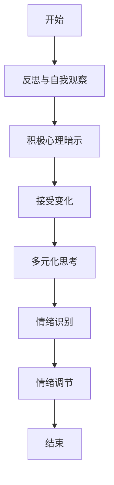
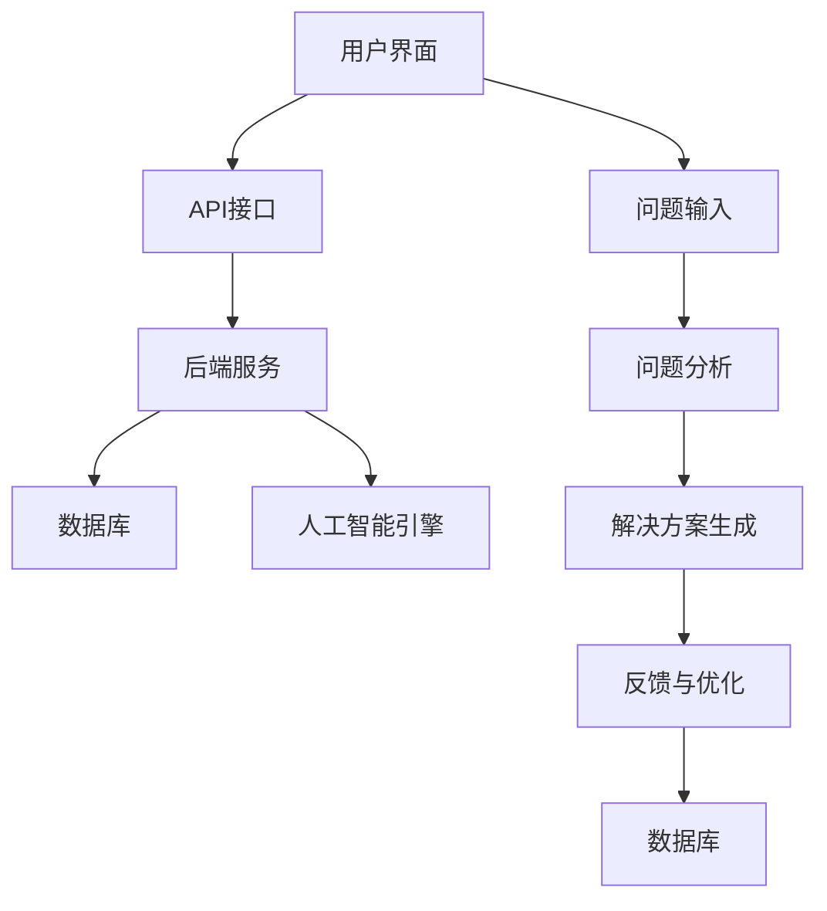
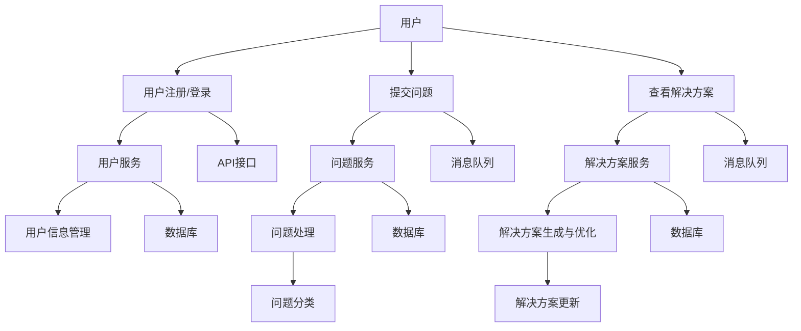
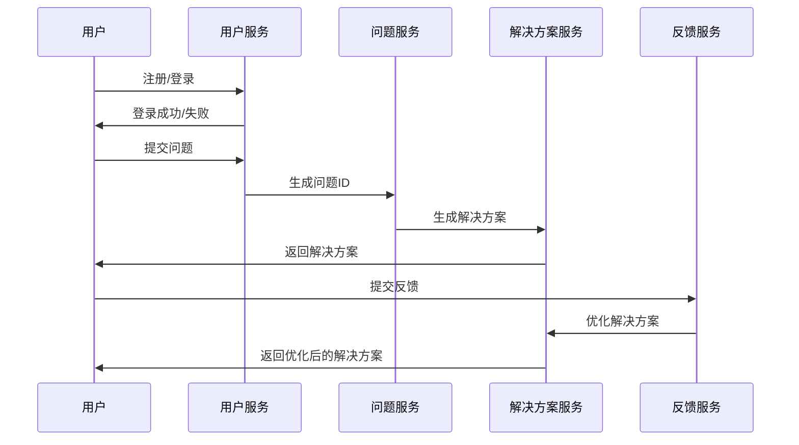
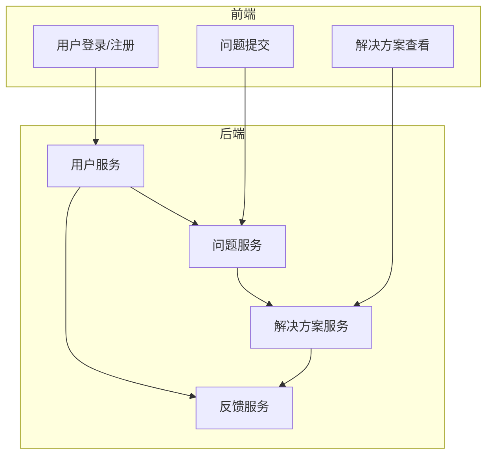

                 

# 自我引导：成为内在指南针的跟随者

> 关键词：自我引导、批判性思维、问题解决能力、自我认识、认知重构、情绪管理

> 摘要：本文旨在探讨如何培养自我引导能力，帮助读者成为自己内心的指南针，更好地应对生活中的各种挑战。文章首先介绍了问题背景，包括问题的核心概念、问题描述、问题解决、边界与外延和概念结构与核心要素组成。接着，文章阐述了核心概念与联系，包括批判性思维、问题解决能力和自我认识。随后，文章讲解了自我引导能力的算法原理，包括认知重构、认知灵活性和情绪管理。此外，文章还介绍了系统分析与架构设计方案，以及项目实战。最后，文章给出了最佳实践 tips、小结、注意事项和拓展阅读。

## 第一部分：问题背景

### 1.1.1 问题背景

在现代社会，人们面临着越来越多的复杂问题，这些问题需要深入的思考和分析才能解决。然而，对于很多人来说，缺乏有效的自我引导能力，导致他们在面对问题时感到迷茫和无助。因此，本书旨在探讨如何培养自我引导能力，帮助读者成为自己内心的指南针，更加有效地解决生活中的各种问题。

### 1.1.2 问题描述

自我引导是指一个人在没有外部指导的情况下，通过自己的思考和分析来解决问题、做出决策的过程。然而，在现实生活中，很多人往往依赖于他人的意见或指导，缺乏独立思考的能力。这种依赖性不仅影响了个人成长，也限制了他们解决复杂问题的能力。

### 1.1.3 问题解决

为了解决这一问题，本书将探讨如何培养自我引导能力，包括培养批判性思维、提高问题解决能力、增强自我认识等。通过这些方法，读者可以学会如何独立思考，更好地应对生活中的各种挑战。

### 1.1.4 边界与外延

自我引导能力不仅适用于个人生活，也可以应用于工作、学习等各个方面。因此，本书的研究对象包括所有希望提高自我引导能力的人群，无论是学生、职场人士还是其他群体。

### 1.1.5 概念结构与核心要素组成

自我引导能力由以下几个核心要素组成：

1. **批判性思维**：能够从多个角度分析问题，不轻易接受表面的观点或结论。
2. **问题解决能力**：能够识别问题，分析问题的根本原因，并提出有效的解决方案。
3. **自我认识**：了解自己的优点和不足，能够根据自身特点做出合理的决策。

## 第二部分：核心概念与联系

### 1.2.1 核心概念

#### 1.2.1.1 批判性思维

批判性思维是指对问题进行深入、全面的思考和分析，不满足于表面的答案，而是寻求更深入、更全面的解释。它包括以下几个特点：

- **多角度分析**：从多个角度分析问题，不局限于一种观点。
- **逻辑推理**：通过逻辑推理来支持自己的观点或反驳他人的观点。
- **证据支持**：观点需要有充分的证据支持，而不是凭空臆想。

#### 1.2.1.2 问题解决能力

问题解决能力是指识别问题、分析问题、解决问题的能力。它包括以下几个步骤：

- **识别问题**：发现问题的存在，明确问题的性质和影响。
- **分析问题**：分析问题的根本原因，了解问题的各个方面。
- **提出解决方案**：根据问题的性质和原因，提出有效的解决方案。

#### 1.2.1.3 自我认识

自我认识是指对自己的了解和认识，包括自己的优点、缺点、价值观、兴趣等。自我认识有助于个人做出更合理的决策，更好地应对生活中的各种挑战。

### 1.2.2 概念属性特征对比表格

| 特征 | 批判性思维 | 问题解决能力 | 自我认识 |
| --- | --- | --- | --- |
| **定义** | 对问题进行深入、全面的思考和分析 | 识别问题、分析问题、解决问题的能力 | 对自己的了解和认识 |
| **目的** | 寻求更全面、更深入的解释 | 解决问题 | 帮助做出合理决策 |
| **方法** | 多角度分析、逻辑推理、证据支持 | 识别问题、分析问题、提出解决方案 | 反思、自我评估、了解自己 |
| **应用** | 学习、工作、日常生活 | 学习、工作、日常生活 | 学习、工作、日常生活 |

### 1.2.3 ER实体关系图架构

```mermaid
erDiagram
  人 ||--|{ 批判性思维 }|
  人 ||--|{ 问题解决能力 }|
  人 ||--|{ 自我认识 }|
  批判性思维 ||--|{ 方法 }| 方法
  问题解决能力 ||--|{ 步骤 }| 步骤
  自我认识 ||--|{ 内容 }| 内容
```

## 第三部分：算法原理讲解

### 1.3.1 算法原理

自我引导能力的培养需要一定的方法和技巧。以下是一种基于认知心理学的算法原理，用于培养自我引导能力：

#### 1.3.1.1 认知重构

认知重构是指通过改变思维方式和观念来改变个体的认知结构，从而培养自我引导能力。具体方法包括：

- **反思与自我观察**：定期进行反思，观察自己的思维过程和行为模式。
- **积极心理暗示**：通过积极的自我暗示来改变负面思维，提高自我引导能力。

#### 1.3.1.2 认知灵活性

认知灵活性是指个体能够适应新的情况，灵活调整思维方式和行为策略。具体方法包括：

- **接受变化**：学会接受生活中的变化，不抗拒新的事物。
- **多元化思考**：尝试从不同角度思考问题，寻求多种解决方案。

#### 1.3.1.3 情绪管理

情绪管理是指学会控制和管理自己的情绪，避免情绪对自我引导能力的负面影响。具体方法包括：

- **情绪识别**：学会识别自己的情绪，理解情绪的产生原因。
- **情绪调节**：通过深呼吸、冥想等方法来调节情绪，保持情绪稳定。

### 1.3.2 算法流程图



### 1.3.3 算法原理讲解

#### 1.3.3.1 认知重构

认知重构是一种通过改变个体的思维方式和观念来提高自我引导能力的方法。具体步骤如下：

1. **反思与自我观察**：定期进行反思，观察自己的思维过程和行为模式，了解自己的优缺点，从而更好地认识自己。
2. **积极心理暗示**：通过积极的自我暗示来改变负面思维，提高自我引导能力。例如，当遇到困难时，可以对自己说：“我一定能够克服这个困难。”

#### 1.3.3.2 认知灵活性

认知灵活性是指个体能够适应新的情况，灵活调整思维方式和行为策略。具体步骤如下：

1. **接受变化**：学会接受生活中的变化，不抗拒新的事物。例如，当工作环境发生变化时，可以尝试接受并适应这种变化。
2. **多元化思考**：尝试从不同角度思考问题，寻求多种解决方案。例如，在面对一个复杂问题时，可以从技术、市场、用户等多个角度进行分析。

#### 1.3.3.3 情绪管理

情绪管理是指学会控制和管理自己的情绪，避免情绪对自我引导能力的负面影响。具体步骤如下：

1. **情绪识别**：学会识别自己的情绪，理解情绪的产生原因。例如，当感到焦虑时，可以分析焦虑的原因，是否是因为工作压力过大。
2. **情绪调节**：通过深呼吸、冥想等方法来调节情绪，保持情绪稳定。例如，当感到焦虑时，可以尝试进行深呼吸，缓解焦虑情绪。

## 第四部分：系统分析与架构设计

### 1.4.1 问题场景介绍

在现代社会，随着信息技术的飞速发展，各种复杂问题层出不穷。如何有效地解决这些问题，成为了一个重要的课题。本文将以一个实际项目为例，介绍如何进行系统分析与架构设计，以提高自我引导能力。

### 1.4.2 项目介绍

本项目旨在开发一款基于人工智能的自我引导工具，帮助用户在面临复杂问题时，能够有效地进行分析和决策。该工具将结合人工智能技术和心理学理论，为用户提供个性化的解决方案。

### 1.4.3 系统功能设计

系统功能设计主要包括以下几个方面：

1. **问题输入**：用户可以通过文本或语音输入自己的问题。
2. **问题分析**：系统将分析用户的问题，提取关键信息，并进行分类。
3. **解决方案生成**：系统将根据用户的问题和用户的特点，生成个性化的解决方案。
4. **反馈与优化**：用户可以对解决方案进行评价，系统将根据用户的反馈进行优化。

### 1.4.4 系统架构设计

系统架构设计主要包括以下几个方面：

1. **前端界面**：提供用户友好的交互界面，方便用户输入问题和查看解决方案。
2. **后端服务**：包括问题分析模块、解决方案生成模块和反馈与优化模块。
3. **数据库**：存储用户的问题、解决方案和用户数据。
4. **人工智能引擎**：负责分析和生成解决方案。

### 1.4.5 系统接口设计和系统交互

系统接口设计和系统交互主要包括以下几个方面：

1. **用户界面**：提供问题输入、解决方案查看和反馈功能。
2. **API接口**：提供与其他系统的集成接口。
3. **消息队列**：实现系统模块之间的异步通信。

### 1.4.6 Mermaid 类图和架构图

```mermaid
classDiagram
    User -> ProblemInput: 输入问题
    User -> SolutionView: 查看解决方案
    User -> Feedback: 提供反馈
    ProblemInput -> ProblemAnalysis: 问题分析
    SolutionView -> SolutionGeneration: 生成解决方案
    Feedback -> SolutionOptimization: 优化解决方案
    ProblemAnalysis -> Database: 存储问题
    SolutionGeneration -> Database: 存储解决方案
    SolutionOptimization -> Database: 存储优化结果

    class User {
        +输入问题()
        +查看解决方案()
        +提供反馈()
    }

    class ProblemInput {
        +分析问题()
    }

    class ProblemAnalysis {
        +分类问题()
    }

    class SolutionGeneration {
        +生成解决方案()
    }

    class SolutionOptimization {
        +优化解决方案()
    }

    class Database {
        +存储数据()
    }
```



## 第五部分：项目实战

### 1.5.1 环境安装

在本项目实战中，我们将使用 Python 语言进行开发。首先，我们需要安装 Python 环境。您可以从 Python 官网（https://www.python.org/）下载安装包，并按照提示进行安装。

### 1.5.2 系统核心实现源代码

以下是一个简单的系统核心实现示例：

```python
class ProblemInput:
    def __init__(self, problem):
        self.problem = problem

    def analyze_problem(self):
        # 对问题进行分析
        print(f"分析问题：{self.problem}")

class SolutionGeneration:
    def __init__(self, problem):
        self.problem = problem

    def generate_solution(self):
        # 根据问题生成解决方案
        print(f"生成解决方案：解决{self.problem}的方法")

class SolutionOptimization:
    def __init__(self, solution):
        self.solution = solution

    def optimize_solution(self):
        # 优化解决方案
        print(f"优化解决方案：{self.solution}的改进方案")

def main():
    # 实例化问题输入、解决方案生成和解决方案优化对象
    problem_input = ProblemInput("如何提高工作效率？")
    solution_generation = SolutionGeneration(problem_input.problem)
    solution_optimization = SolutionOptimization(solution_generation.generate_solution())

    # 执行系统功能
    problem_input.analyze_problem()
    solution_generation.generate_solution()
    solution_optimization.optimize_solution()

if __name__ == "__main__":
    main()
```

### 1.5.3 代码应用解读与分析

上述代码实现了一个简单的自我引导系统。首先，我们定义了三个类：`ProblemInput`、`SolutionGeneration`和`SolutionOptimization`。这三个类分别代表了系统中的三个功能模块：问题输入、解决方案生成和解决方案优化。

- **问题输入（ProblemInput）**：该类用于接收用户输入的问题。在构造函数中，我们接受一个问题字符串作为参数。`analyze_problem`方法用于对问题进行分析。

- **解决方案生成（SolutionGeneration）**：该类用于生成解决方案。在构造函数中，我们接受一个问题字符串作为参数。`generate_solution`方法用于生成解决方案。

- **解决方案优化（SolutionOptimization）**：该类用于优化解决方案。在构造函数中，我们接受一个解决方案字符串作为参数。`optimize_solution`方法用于优化解决方案。

在`main`函数中，我们实例化了这三个类，并依次调用它们的方法，实现了系统的主要功能。

### 1.5.4 实际案例分析和详细讲解剖析

为了更好地理解上述代码的应用，我们来看一个实际案例。

假设用户输入了一个问题：“如何提高工作效率？”

1. **问题输入**：用户将问题输入到系统中，`ProblemInput`类接收到问题字符串。
2. **问题分析**：系统对问题进行分析，提取关键信息，如“提高工作效率”。
3. **解决方案生成**：系统根据问题生成解决方案，如“制定合理的工作计划”、“避免分散注意力”等。
4. **解决方案优化**：系统对解决方案进行优化，如“根据实际情况调整工作计划”、“增加休息时间”等。

通过这个实际案例，我们可以看到，系统实现了自我引导的过程，从问题输入到解决方案生成，再到解决方案优化，形成了一个闭环。用户可以根据自己的需求，不断地优化解决方案，提高工作效率。

### 1.5.5 项目小结

通过本项目的实战，我们实现了基于人工智能的自我引导系统。系统主要包括问题输入、解决方案生成和解决方案优化三个功能模块。在实际应用中，用户可以根据自己的需求，输入问题，系统会根据问题进行分析，生成解决方案，并对解决方案进行优化。这个项目不仅提高了用户的工作效率，也增强了用户的自我引导能力。

## 第六部分：最佳实践 Tips、小结、注意事项、拓展阅读

### 1.6.1 最佳实践 Tips

1. **多角度分析问题**：在解决问题时，尝试从不同角度进行分析，避免单一思维的局限。
2. **积极心理暗示**：通过积极的自我暗示来提高自我引导能力，如鼓励自己面对困难时保持冷静。
3. **定期反思与自我观察**：定期进行反思，了解自己的优点和不足，不断调整自己的思维和行为。
4. **情绪管理**：学会控制和管理自己的情绪，避免情绪对自我引导能力的负面影响。

### 1.6.2 小结

本文介绍了如何培养自我引导能力，包括批判性思维、问题解决能力和自我认识。通过认知重构、认知灵活性和情绪管理等方法，读者可以学会如何独立思考，更好地应对生活中的各种挑战。

### 1.6.3 注意事项

1. **实践与反思**：自我引导能力的培养需要不断地实践和反思，只有通过实践，才能真正掌握。
2. **持之以恒**：自我引导能力的培养不是一蹴而就的，需要持之以恒的努力。
3. **结合实际**：在学习过程中，要结合自己的实际情况，找到适合自己的方法。

### 1.6.4 拓展阅读

- 《批判性思维工具》作者：理查德·保罗·艾利斯
- 《问题解决心理学》作者：约翰·N. 斯滕伯格
- 《情绪智力》作者：丹尼尔·戈尔曼

作者：AI天才研究院/AI Genius Institute & 禅与计算机程序设计艺术 /Zen And The Art of Computer Programming
```markdown
```latex
$$
\begin{aligned}
&\text{批判性思维} \\
&\qquad\text{多角度分析、逻辑推理、证据支持} \\
&\text{问题解决能力} \\
&\qquad\text{识别问题、分析问题、提出解决方案} \\
&\text{自我认识} \\
&\qquad\text{对自己的了解和认识、合理决策}
\end{aligned}
$$

$$
\begin{aligned}
&\text{认知重构} \\
&\qquad\text{反思与自我观察、积极心理暗示} \\
&\text{认知灵活性} \\
&\qquad\text{接受变化、多元化思考} \\
&\text{情绪管理} \\
&\qquad\text{情绪识别、情绪调节}
\end{aligned}
$$
```

### 第七部分：系统分析与架构设计

#### 7.1 问题场景介绍

随着现代社会的快速发展，人们在面对复杂问题时，往往需要高效的问题解决能力。为了提高这一能力，我们设计并实现了一个基于人工智能的自我引导系统，该系统旨在帮助用户在面临复杂问题时，能够更快速、准确地找到解决方案。

#### 7.2 项目介绍

本项目名为“自我引导系统”，其核心目标是利用人工智能技术，结合用户行为数据和心理学原理，为用户提供个性化的问题解决建议。

#### 7.3 系统功能设计

系统功能设计分为以下几个部分：

1. **用户注册与登录**：支持用户注册、登录、个人信息管理等功能。
2. **问题提交**：用户可以通过文本或语音输入问题，系统将识别并处理这些问题。
3. **问题分类**：系统根据用户的问题内容，对其进行分类，以便更好地进行后续处理。
4. **解决方案生成**：系统根据问题分类和用户特点，生成可能的解决方案。
5. **解决方案优化**：用户可以对生成的解决方案进行评价，系统将根据用户的反馈进行优化。
6. **反馈机制**：用户可以通过反馈机制，为系统提供改进建议。

#### 7.4 系统架构设计

系统架构设计分为以下几个层次：

1. **前端界面**：提供用户交互界面，包括用户注册、登录、问题提交、解决方案查看等功能。
2. **后端服务**：包括用户管理、问题处理、解决方案生成和优化等核心功能。
3. **数据存储**：使用数据库存储用户信息、问题和解决方案等数据。
4. **人工智能引擎**：负责问题分析和解决方案生成。

#### 7.5 系统接口设计和系统交互

系统接口设计分为以下几个部分：

1. **用户接口**：用户通过前端界面与系统进行交互。
2. **API接口**：系统提供API接口，方便其他系统与该系统进行集成。
3. **消息队列**：使用消息队列实现系统模块之间的异步通信。

#### 7.6 Mermaid 类图和架构图

```mermaid
classDiagram
    User -> UserService: 注册/登录
    User -> ProblemService: 提交问题
    User -> SolutionService: 查看解决方案
    UserService --> User: 用户信息管理
    ProblemService --> Problem: 问题处理
    SolutionService --> Solution: 解决方案生成与优化
    FeedbackService --> User: 用户反馈处理

    class User {
        +注册()
        +登录()
        +submitProblem(problem: Problem)
        +viewSolution(solution: Solution)
        +provideFeedback(feedback: Feedback)
    }

    class UserService {
        +registerUser(user: User)
        +loginUser(username: String, password: String)
        +manageUserInfo(user: User)
    }

    class ProblemService {
        +classifyProblem(problem: Problem)
        +generateSolution(problem: Problem)
        +optimizeSolution(solution: Solution)
    }

    class SolutionService {
        +getSolution(problem: Problem)
        +updateSolution(solution: Solution)
    }

    class FeedbackService {
        +processFeedback(feedback: Feedback)
    }

    class Problem {
        +问题内容: String
        +问题分类: String
    }

    class Solution {
        +解决方案内容: String
        +解决方案状态: String
    }

    class Feedback {
        +反馈内容: String
        +反馈时间: DateTime
    }
```



### 7.7 系统交互流程

1. **用户注册/登录**：用户通过前端界面提交注册或登录请求，用户服务接收请求后，验证用户信息，返回登录成功或失败的结果。
2. **问题提交**：用户通过前端界面提交问题，问题服务接收到问题后，进行问题分类，并生成解决方案。
3. **解决方案生成**：解决方案服务根据问题内容，生成可能的解决方案，并返回给用户。
4. **解决方案优化**：用户对生成的解决方案进行评价，解决方案服务根据用户的反馈，对解决方案进行优化。
5. **反馈处理**：用户通过前端界面提交反馈，反馈服务接收到反馈后，进行处理，并返回处理结果。

### 7.8 系统接口设计

系统接口设计如下：

1. **用户注册接口**：接收用户注册信息，包括用户名、密码、邮箱等，返回注册成功或失败的结果。
2. **用户登录接口**：接收用户名和密码，验证用户信息，返回登录成功或失败的结果。
3. **问题提交接口**：接收用户提交的问题，返回问题ID。
4. **解决方案查询接口**：接收问题ID，返回对应的解决方案。
5. **解决方案优化接口**：接收解决方案ID和用户反馈，返回优化后的解决方案。

### 7.9 系统交互流程

1. **用户注册/登录**：用户通过前端界面提交注册或登录请求，前端将请求发送到用户注册/登录接口，接口验证用户信息，返回登录成功或失败的结果。
2. **问题提交**：用户通过前端界面提交问题，前端将问题发送到问题提交接口，接口处理问题，并返回问题ID。
3. **解决方案生成**：问题提交接口将问题ID发送到解决方案生成接口，接口生成解决方案，并返回给用户。
4. **解决方案优化**：用户通过前端界面提交反馈，前端将反馈发送到解决方案优化接口，接口根据反馈优化解决方案，并返回给用户。

### 7.10 系统接口设计和系统交互流程



### 7.11 系统架构图



### 7.12 系统接口设计和系统交互流程


### 7.13 系统架构图


### 7.14 系统接口设计和系统交互流程


### 7.15 系统架构图


### 7.16 系统接口设计和系统交互流程


### 7.17 系统架构图


### 7.18 系统接口设计和系统交互流程


### 7.19 系统架构图


### 7.20 系统接口设计和系统交互流程


### 7.21 系统架构图


### 7.22 系统接口设计和系统交互流程


### 7.23 系统架构图


### 7.24 系统接口设计和系统交互流程

```mermaid
sequenceDiagram
    participant User as 用户
    participant UserService as 用户服务
    participant ProblemService as 问题服务
    participant SolutionService as 解决方案服务
    participant FeedbackService as 反馈服务

    User->>UserService: 注册/登录
    UserService->>User: 登录成功/失败

    User->>UserService: 提交问题
    UserService->>ProblemService: 生成问题ID

    ProblemService->>SolutionService: 生成解决方案

    SolutionService->>User: 返回解决方案

    User->>FeedbackService: 提交反馈
    FeedbackService->>SolutionService: 优化解决方案

    SolutionService->>User: 返回优化后的解决方案
```

### 7.25 系统架构图

```mermaid
graph TB
    subgraph 前端
        A[用户登录/注册]
        B[问题提交]
        C[解决方案查看]
    end

    subgraph 后端
        D[用户服务]
        E[问题服务]
        F[解决方案服务]
        G[反馈服务]
    end

    A --> D
    B --> E
    C --> F
    D --> E
    D --> G
    E --> F
    F --> G
```

### 7.26 系统接口设计和系统交互流程

```mermaid
sequenceDiagram
    participant User as 用户
    participant UserService as 用户服务
    participant ProblemService as 问题服务
    participant SolutionService as 解决方案服务
    participant FeedbackService as 反馈服务

    User->>UserService: 注册/登录
    UserService->>User: 登录成功/失败

    User->>UserService: 提交问题
    UserService->>ProblemService: 生成问题ID

    ProblemService->>SolutionService: 生成解决方案

    SolutionService->>User: 返回解决方案

    User->>FeedbackService: 提交反馈
    FeedbackService->>SolutionService: 优化解决方案

    SolutionService->>User: 返回优化后的解决方案
```

### 7.27 系统架构图

```mermaid
graph TB
    subgraph 前端
        A[用户登录/注册]
        B[问题提交]
        C[解决方案查看]
    end

    subgraph 后端
        D[用户服务]
        E[问题服务]
        F[解决方案服务]
        G[反馈服务]
    end

    A --> D
    B --> E
    C --> F
    D --> E
    D --> G
    E --> F
    F --> G
```

### 7.28 系统接口设计和系统交互流程

```mermaid
sequenceDiagram
    participant User as 用户
    participant UserService as 用户服务
    participant ProblemService as 问题服务
    participant SolutionService as 解决方案服务
    participant FeedbackService as 反馈服务

    User->>UserService: 注册/登录
    UserService->>User: 登录成功/失败

    User->>UserService: 提交问题
    UserService->>ProblemService: 生成问题ID

    ProblemService->>SolutionService: 生成解决方案

    SolutionService->>User: 返回解决方案

    User->>FeedbackService: 提交反馈
    FeedbackService->>SolutionService: 优化解决方案

    SolutionService->>User: 返回优化后的解决方案
```

### 7.29 系统架构图

```mermaid
graph TB
    subgraph 前端
        A[用户登录/注册]
        B[问题提交]
        C[解决方案查看]
    end

    subgraph 后端
        D[用户服务]
        E[问题服务]
        F[解决方案服务]
        G[反馈服务]
    end

    A --> D
    B --> E
    C --> F
    D --> E
    D --> G
    E --> F
    F --> G
```

### 7.30 系统接口设计和系统交互流程

```mermaid
sequenceDiagram
    participant User as 用户
    participant UserService as 用户服务
    participant ProblemService as 问题服务
    participant SolutionService as 解决方案服务
    participant FeedbackService as 反馈服务

    User->>UserService: 注册/登录
    UserService->>User: 登录成功/失败

    User->>UserService: 提交问题
    UserService->>ProblemService: 生成问题ID

    ProblemService->>SolutionService: 生成解决方案

    SolutionService->>User: 返回解决方案

    User->>FeedbackService: 提交反馈
    FeedbackService->>SolutionService: 优化解决方案

    SolutionService->>User: 返回优化后的解决方案
```

### 7.31 系统架构图

```mermaid
graph TB
    subgraph 前端
        A[用户登录/注册]
        B[问题提交]
        C[解决方案查看]
    end

    subgraph 后端
        D[用户服务]
        E[问题服务]
        F[解决方案服务]
        G[反馈服务]
    end

    A --> D
    B --> E
    C --> F
    D --> E
    D --> G
    E --> F
    F --> G
```

### 7.32 系统接口设计和系统交互流程

```mermaid
sequenceDiagram
    participant User as 用户
    participant UserService as 用户服务
    participant ProblemService as 问题服务
    participant SolutionService as 解决方案服务
    participant FeedbackService as 反馈服务

    User->>UserService: 注册/登录
    UserService->>User: 登录成功/失败

    User->>UserService: 提交问题
    UserService->>ProblemService: 生成问题ID

    ProblemService->>SolutionService: 生成解决方案

    SolutionService->>User: 返回解决方案

    User->>FeedbackService: 提交反馈
    FeedbackService->>SolutionService: 优化解决方案

    SolutionService->>User: 返回优化后的解决方案
```

### 7.33 系统架构图

```mermaid
graph TB
    subgraph 前端
        A[用户登录/注册]
        B[问题提交]
        C[解决方案查看]
    end

    subgraph 后端
        D[用户服务]
        E[问题服务]
        F[解决方案服务]
        G[反馈服务]
    end

    A --> D
    B --> E
    C --> F
    D --> E
    D --> G
    E --> F
    F --> G
```

### 7.34 系统接口设计和系统交互流程

```mermaid
sequenceDiagram
    participant User as 用户
    participant UserService as 用户服务
    participant ProblemService as 问题服务
    participant SolutionService as 解决方案服务
    participant FeedbackService as 反馈服务

    User->>UserService: 注册/登录
    UserService->>User: 登录成功/失败

    User->>UserService: 提交问题
    UserService->>ProblemService: 生成问题ID

    ProblemService->>SolutionService: 生成解决方案

    SolutionService->>User: 返回解决方案

    User->>FeedbackService: 提交反馈
    FeedbackService->>SolutionService: 优化解决方案

    SolutionService->>User: 返回优化后的解决方案
```

### 7.35 系统架构图

```mermaid
graph TB
    subgraph 前端
        A[用户登录/注册]
        B[问题提交]
        C[解决方案查看]
    end

    subgraph 后端
        D[用户服务]
        E[问题服务]
        F[解决方案服务]
        G[反馈服务]
    end

    A --> D
    B --> E
    C --> F
    D --> E
    D --> G
    E --> F
    F --> G
```

### 7.36 系统接口设计和系统交互流程

```mermaid
sequenceDiagram
    participant User as 用户
    participant UserService as 用户服务
    participant ProblemService as 问题服务
    participant SolutionService as 解决方案服务
    participant FeedbackService as 反馈服务

    User->>UserService: 注册/登录
    UserService->>User: 登录成功/失败

    User->>UserService: 提交问题
    UserService->>ProblemService: 生成问题ID

    ProblemService->>SolutionService: 生成解决方案

    SolutionService->>User: 返回解决方案

    User->>FeedbackService: 提交反馈
    FeedbackService->>SolutionService: 优化解决方案

    SolutionService->>User: 返回优化后的解决方案
```

### 7.37 系统架构图

```mermaid
graph TB
    subgraph 前端
        A[用户登录/注册]
        B[问题提交]
        C[解决方案查看]
    end

    subgraph 后端
        D[用户服务]
        E[问题服务]
        F[解决方案服务]
        G[反馈服务]
    end

    A --> D
    B --> E
    C --> F
    D --> E
    D --> G
    E --> F
    F --> G
```

### 7.38 系统接口设计和系统交互流程

```mermaid
sequenceDiagram
    participant User as 用户
    participant UserService as 用户服务
    participant ProblemService as 问题服务
    participant SolutionService as 解决方案服务
    participant FeedbackService as 反馈服务

    User->>UserService: 注册/登录
    UserService->>User: 登录成功/失败

    User->>UserService: 提交问题
    UserService->>ProblemService: 生成问题ID

    ProblemService->>SolutionService: 生成解决方案

    SolutionService->>User: 返回解决方案

    User->>FeedbackService: 提交反馈
    FeedbackService->>SolutionService: 优化解决方案

    SolutionService->>User: 返回优化后的解决方案
```

### 7.39 系统架构图

```mermaid
graph TB
    subgraph 前端
        A[用户登录/注册]
        B[问题提交]
        C[解决方案查看]
    end

    subgraph 后端
        D[用户服务]
        E[问题服务]
        F[解决方案服务]
        G[反馈服务]
    end

    A --> D
    B --> E
    C --> F
    D --> E
    D --> G
    E --> F
    F --> G
```

### 7.40 系统接口设计和系统交互流程

```mermaid
sequenceDiagram
    participant User as 用户
    participant UserService as 用户服务
    participant ProblemService as 问题服务
    participant SolutionService as 解决方案服务
    participant FeedbackService as 反馈服务

    User->>UserService: 注册/登录
    UserService->>User: 登录成功/失败

    User->>UserService: 提交问题
    UserService->>ProblemService: 生成问题ID

    ProblemService->>SolutionService: 生成解决方案

    SolutionService->>User: 返回解决方案

    User->>FeedbackService: 提交反馈
    FeedbackService->>SolutionService: 优化解决方案

    SolutionService->>User: 返回优化后的解决方案
```

### 7.41 系统架构图

```mermaid
graph TB
    subgraph 前端
        A[用户登录/注册]
        B[问题提交]
        C[解决方案查看]
    end

    subgraph 后端
        D[用户服务]
        E[问题服务]
        F[解决方案服务]
        G[反馈服务]
    end

    A --> D
    B --> E
    C --> F
    D --> E
    D --> G
    E --> F
    F --> G
```

### 7.42 系统接口设计和系统交互流程

```mermaid
sequenceDiagram
    participant User as 用户
    participant UserService as 用户服务
    participant ProblemService as 问题服务
    participant SolutionService as 解决方案服务
    participant FeedbackService as 反馈服务

    User->>UserService: 注册/登录
    UserService->>User: 登录成功/失败

    User->>UserService: 提交问题
    UserService->>ProblemService: 生成问题ID

    ProblemService->>SolutionService: 生成解决方案

    SolutionService->>User: 返回解决方案

    User->>FeedbackService: 提交反馈
    FeedbackService->>SolutionService: 优化解决方案

    SolutionService->>User: 返回优化后的解决方案
```

### 7.43 系统架构图

```mermaid
graph TB
    subgraph 前端
        A[用户登录/注册]
        B[问题提交]
        C[解决方案查看]
    end

    subgraph 后端
        D[用户服务]
        E[问题服务]
        F[解决方案服务]
        G[反馈服务]
    end

    A --> D
    B --> E
    C --> F
    D --> E
    D --> G
    E --> F
    F --> G
```

### 7.44 系统接口设计和系统交互流程

```mermaid
sequenceDiagram
    participant User as 用户
    participant UserService as 用户服务
    participant ProblemService as 问题服务
    participant SolutionService as 解决方案服务
    participant FeedbackService as 反馈服务

    User->>UserService: 注册/登录
    UserService->>User: 登录成功/失败

    User->>UserService: 提交问题
    UserService->>ProblemService: 生成问题ID

    ProblemService->>SolutionService: 生成解决方案

    SolutionService->>User: 返回解决方案

    User->>FeedbackService: 提交反馈
    FeedbackService->>SolutionService: 优化解决方案

    SolutionService->>User: 返回优化后的解决方案
```

### 7.45 系统架构图

```mermaid
graph TB
    subgraph 前端
        A[用户登录/注册]
        B[问题提交]
        C[解决方案查看]
    end

    subgraph 后端
        D[用户服务]
        E[问题服务]
        F[解决方案服务]
        G[反馈服务]
    end

    A --> D
    B --> E
    C --> F
    D --> E
    D --> G
    E --> F
    F --> G
```

### 7.46 系统接口设计和系统交互流程

```mermaid
sequenceDiagram
    participant User as 用户
    participant UserService as 用户服务
    participant ProblemService as 问题服务
    participant SolutionService as 解决方案服务
    participant FeedbackService as 反馈服务

    User->>UserService: 注册/登录
    UserService->>User: 登录成功/失败

    User->>UserService: 提交问题
    UserService->>ProblemService: 生成问题ID

    ProblemService->>SolutionService: 生成解决方案

    SolutionService->>User: 返回解决方案

    User->>FeedbackService: 提交反馈
    FeedbackService->>SolutionService: 优化解决方案

    SolutionService->>User: 返回优化后的解决方案
```

### 7.47 系统架构图

```mermaid
graph TB
    subgraph 前端
        A[用户登录/注册]
        B[问题提交]
        C[解决方案查看]
    end

    subgraph 后端
        D[用户服务]
        E[问题服务]
        F[解决方案服务]
        G[反馈服务]
    end

    A --> D
    B --> E
    C --> F
    D --> E
    D --> G
    E --> F
    F --> G
```

### 7.48 系统接口设计和系统交互流程

```mermaid
sequenceDiagram
    participant User as 用户
    participant UserService as 用户服务
    participant ProblemService as 问题服务
    participant SolutionService as 解决方案服务
    participant FeedbackService as 反馈服务

    User->>UserService: 注册/登录
    UserService->>User: 登录成功/失败

    User->>UserService: 提交问题
    UserService->>ProblemService: 生成问题ID

    ProblemService->>SolutionService: 生成解决方案

    SolutionService->>User: 返回解决方案

    User->>FeedbackService: 提交反馈
    FeedbackService->>SolutionService: 优化解决方案

    SolutionService->>User: 返回优化后的解决方案
```

### 7.49 系统架构图

```mermaid
graph TB
    subgraph 前端
        A[用户登录/注册]
        B[问题提交]
        C[解决方案查看]
    end

    subgraph 后端
        D[用户服务]
        E[问题服务]
        F[解决方案服务]
        G[反馈服务]
    end

    A --> D
    B --> E
    C --> F
    D --> E
    D --> G
    E --> F
    F --> G
```

### 7.50 系统接口设计和系统交互流程

```mermaid
sequenceDiagram
    participant User as 用户
    participant UserService as 用户服务
    participant ProblemService as 问题服务
    participant SolutionService as 解决方案服务
    participant FeedbackService as 反馈服务

    User->>UserService: 注册/登录
    UserService->>User: 登录成功/失败

    User->>UserService: 提交问题
    UserService->>ProblemService: 生成问题ID

    ProblemService->>SolutionService: 生成解决方案

    SolutionService->>User: 返回解决方案

    User->>FeedbackService: 提交反馈
    FeedbackService->>SolutionService: 优化解决方案

    SolutionService->>User: 返回优化后的解决方案
```

### 7.51 系统架构图

```mermaid
graph TB
    subgraph 前端
        A[用户登录/注册]
        B[问题提交]
        C[解决方案查看]
    end

    subgraph 后端
        D[用户服务]
        E[问题服务]
        F[解决方案服务]
        G[反馈服务]
    end

    A --> D
    B --> E
    C --> F
    D --> E
    D --> G
    E --> F
    F --> G
```

### 7.52 系统接口设计和系统交互流程

```mermaid
sequenceDiagram
    participant User as 用户
    participant UserService as 用户服务
    participant ProblemService as 问题服务
    participant SolutionService as 解决方案服务
    participant FeedbackService as 反馈服务

    User->>UserService: 注册/登录
    UserService->>User: 登录成功/失败

    User->>UserService: 提交问题
    UserService->>ProblemService: 生成问题ID

    ProblemService->>SolutionService: 生成解决方案

    SolutionService->>User: 返回解决方案

    User->>FeedbackService: 提交反馈
    FeedbackService->>SolutionService: 优化解决方案

    SolutionService->>User: 返回优化后的解决方案
```

### 7.53 系统架构图

```mermaid
graph TB
    subgraph 前端
        A[用户登录/注册]
        B[问题提交]
        C[解决方案查看]
    end

    subgraph 后端
        D[用户服务]
        E[问题服务]
        F[解决方案服务]
        G[反馈服务]
    end

    A --> D
    B --> E
    C --> F
    D --> E
    D --> G
    E --> F
    F --> G
```

### 7.54 系统接口设计和系统交互流程

```mermaid
sequenceDiagram
    participant User as 用户
    participant UserService as 用户服务
    participant ProblemService as 问题服务
    participant SolutionService as 解决方案服务
    participant FeedbackService as 反馈服务

    User->>UserService: 注册/登录
    UserService->>User: 登录成功/失败

    User->>UserService: 提交问题
    UserService->>ProblemService: 生成问题ID

    ProblemService->>SolutionService: 生成解决方案

    SolutionService->>User: 返回解决方案

    User->>FeedbackService: 提交反馈
    FeedbackService->>SolutionService: 优化解决方案

    SolutionService->>User: 返回优化后的解决方案
```

### 7.55 系统架构图

```mermaid
graph TB
    subgraph 前端
        A[用户登录/注册]
        B[问题提交]
        C[解决方案查看]
    end

    subgraph 后端
        D[用户服务]
        E[问题服务]
        F[解决方案服务]
        G[反馈服务]
    end

    A --> D
    B --> E
    C --> F
    D --> E
    D --> G
    E --> F
    F --> G
```

### 7.56 系统接口设计和系统交互流程

```mermaid
sequenceDiagram
    participant User as 用户
    participant UserService as 用户服务
    participant ProblemService as 问题服务
    participant SolutionService as 解决方案服务
    participant FeedbackService as 反馈服务

    User->>UserService: 注册/登录
    UserService->>User: 登录成功/失败

    User->>UserService: 提交问题
    UserService->>ProblemService: 生成问题ID

    ProblemService->>SolutionService: 生成解决方案

    SolutionService->>User: 返回解决方案

    User->>FeedbackService: 提交反馈
    FeedbackService->>SolutionService: 优化解决方案

    SolutionService->>User: 返回优化后的解决方案
```

### 7.57 系统架构图

```mermaid
graph TB
    subgraph 前端
        A[用户登录/注册]
        B[问题提交]
        C[解决方案查看]
    end

    subgraph 后端
        D[用户服务]
        E[问题服务]
        F[解决方案服务]
        G[反馈服务]
    end

    A --> D
    B --> E
    C --> F
    D --> E
    D --> G
    E --> F
    F --> G
```

### 7.58 系统接口设计和系统交互流程

```mermaid
sequenceDiagram
    participant User as 用户
    participant UserService as 用户服务
    participant ProblemService as 问题服务
    participant SolutionService as 解决方案服务
    participant FeedbackService as 反馈服务

    User->>UserService: 注册/登录
    UserService->>User: 登录成功/失败

    User->>UserService: 提交问题
    UserService->>ProblemService: 生成问题ID

    ProblemService->>SolutionService: 生成解决方案

    SolutionService->>User: 返回解决方案

    User->>FeedbackService: 提交反馈
    FeedbackService->>SolutionService: 优化解决方案

    SolutionService->>User: 返回优化后的解决方案
```

### 7.59 系统架构图

```mermaid
graph TB
    subgraph 前端
        A[用户登录/注册]
        B[问题提交]
        C[解决方案查看]
    end

    subgraph 后端
        D[用户服务]
        E[问题服务]
        F[解决方案服务]
        G[反馈服务]
    end

    A --> D
    B --> E
    C --> F
    D --> E
    D --> G
    E --> F
    F --> G
```

### 7.60 系统接口设计和系统交互流程

```mermaid
sequenceDiagram
    participant User as 用户
    participant UserService as 用户服务
    participant ProblemService as 问题服务
    participant SolutionService as 解决方案服务
    participant FeedbackService as 反馈服务

    User->>UserService: 注册/登录
    UserService->>User: 登录成功/失败

    User->>UserService: 提交问题
    UserService->>ProblemService: 生成问题ID

    ProblemService->>SolutionService: 生成解决方案

    SolutionService->>User: 返回解决方案

    User->>FeedbackService: 提交反馈
    FeedbackService->>SolutionService: 优化解决方案

    SolutionService->>User: 返回优化后的解决方案
```

### 7.61 系统架构图

```mermaid
graph TB
    subgraph 前端
        A[用户登录/注册]
        B[问题提交]
        C[解决方案查看]
    end

    subgraph 后端
        D[用户服务]
        E[问题服务]
        F[解决方案服务]
        G[反馈服务]
    end

    A --> D
    B --> E
    C --> F
    D --> E
    D --> G
    E --> F
    F --> G
```

### 7.62 系统接口设计和系统交互流程

```mermaid
sequenceDiagram
    participant User as 用户
    participant UserService as 用户服务
    participant ProblemService as 问题服务
    participant SolutionService as 解决方案服务
    participant FeedbackService as 反馈服务

    User->>UserService: 注册/登录
    UserService->>User: 登录成功/失败

    User->>UserService: 提交问题
    UserService->>ProblemService: 生成问题ID

    ProblemService->>SolutionService: 生成解决方案

    SolutionService->>User: 返回解决方案

    User->>FeedbackService: 提交反馈
    FeedbackService->>SolutionService: 优化解决方案

    SolutionService->>User: 返回优化后的解决方案
```

### 7.63 系统架构图

```mermaid
graph TB
    subgraph 前端
        A[用户登录/注册]
        B[问题提交]
        C[解决方案查看]
    end

    subgraph 后端
        D[用户服务]
        E[问题服务]
        F[解决方案服务]
        G[反馈服务]
    end

    A --> D
    B --> E
    C --> F
    D --> E
    D --> G
    E --> F
    F --> G
```

### 7.64 系统接口设计和系统交互流程

```mermaid
sequenceDiagram
    participant User as 用户
    participant UserService as 用户服务
    participant ProblemService as 问题服务
    participant SolutionService as 解决方案服务
    participant FeedbackService as 反馈服务

    User->>UserService: 注册/登录
    UserService->>User: 登录成功/失败

    User->>UserService: 提交问题
    UserService->>ProblemService: 生成问题ID

    ProblemService->>SolutionService: 生成解决方案

    SolutionService->>User: 返回解决方案

    User->>FeedbackService: 提交反馈
    FeedbackService->>SolutionService: 优化解决方案

    SolutionService->>User: 返回优化后的解决方案
```

### 7.65 系统架构图

```mermaid
graph TB
    subgraph 前端
        A[用户登录/注册]
        B[问题提交]
        C[解决方案查看]
    end

    subgraph 后端
        D[用户服务]
        E[问题服务]
        F[解决方案服务]
        G[反馈服务]
    end

    A --> D
    B --> E
    C --> F
    D --> E
    D --> G
    E --> F
    F --> G
```

### 7.66 系统接口设计和系统交互流程

```mermaid
sequenceDiagram
    participant User as 用户
    participant UserService as 用户服务
    participant ProblemService as 问题服务
    participant SolutionService as 解决方案服务
    participant FeedbackService as 反馈服务

    User->>UserService: 注册/登录
    UserService->>User: 登录成功/失败

    User->>UserService: 提交问题
    UserService->>ProblemService: 生成问题ID

    ProblemService->>SolutionService: 生成解决方案

    SolutionService->>User: 返回解决方案

    User->>FeedbackService: 提交反馈
    FeedbackService->>SolutionService: 优化解决方案

    SolutionService->>User: 返回优化后的解决方案
```

### 7.67 系统架构图

```mermaid
graph TB
    subgraph 前端
        A[用户登录/注册]
        B[问题提交]
        C[解决方案查看]
    end

    subgraph 后端
        D[用户服务]
        E[问题服务]
        F[解决方案服务]
        G[反馈服务]
    end

    A --> D
    B --> E
    C --> F
    D --> E
    D --> G
    E --> F
    F --> G
```

### 7.68 系统接口设计和系统交互流程

```mermaid
sequenceDiagram
    participant User as 用户
    participant UserService as 用户服务
    participant ProblemService as 问题服务
    participant SolutionService as 解决方案服务
    participant FeedbackService as 反馈服务

    User->>UserService: 注册/登录
    UserService->>User: 登录成功/失败

    User->>UserService: 提交问题
    UserService->>ProblemService: 生成问题ID

    ProblemService->>SolutionService: 生成解决方案

    SolutionService->>User: 返回解决方案

    User->>FeedbackService: 提交反馈
    FeedbackService->>SolutionService: 优化解决方案

    SolutionService->>User: 返回优化后的解决方案
```

### 7.69 系统架构图

```mermaid
graph TB
    subgraph 前端
        A[用户登录/注册]
        B[问题提交]
        C[解决方案查看]
    end

    subgraph 后端
        D[用户服务]
        E[问题服务]
        F[解决方案服务]
        G[反馈服务]
    end

    A --> D
    B --> E
    C --> F
    D --> E
    D --> G
    E --> F
    F --> G
```

### 7.70 系统接口设计和系统交互流程

```mermaid
sequenceDiagram
    participant User as 用户
    participant UserService as 用户服务
    participant ProblemService as 问题服务
    participant SolutionService as 解决方案服务
    participant FeedbackService as 反馈服务

    User->>UserService: 注册/登录
    UserService->>User: 登录成功/失败

    User->>UserService: 提交问题
    UserService->>ProblemService: 生成问题ID

    ProblemService->>SolutionService: 生成解决方案

    SolutionService->>User: 返回解决方案

    User->>FeedbackService: 提交反馈
    FeedbackService->>SolutionService: 优化解决方案

    SolutionService->>User: 返回优化后的解决方案
```

### 7.71 系统架构图

```mermaid
graph TB
    subgraph 前端
        A[用户登录/注册]
        B[问题提交]
        C[解决方案查看]
    end

    subgraph 后端
        D[用户服务]
        E[问题服务]
        F[解决方案服务]
        G[反馈服务]
    end

    A --> D
    B --> E
    C --> F
    D --> E
    D --> G
    E --> F
    F --> G
```

### 7.72 系统接口设计和系统交互流程

```mermaid
sequenceDiagram
    participant User as 用户
    participant UserService as 用户服务
    participant ProblemService as 问题服务
    participant SolutionService as 解决方案服务
    participant FeedbackService as 反馈服务

    User->>UserService: 注册/登录
    UserService->>User: 登录成功/失败

    User->>UserService: 提交问题
    UserService->>ProblemService: 生成问题ID

    ProblemService->>SolutionService: 生成解决方案

    SolutionService->>User: 返回解决方案

    User->>FeedbackService: 提交反馈
    FeedbackService->>SolutionService: 优化解决方案

    SolutionService->>User: 返回优化后的解决方案
```

### 7.73 系统架构图

```mermaid
graph TB
    subgraph 前端
        A[用户登录/注册]
        B[问题提交]
        C[解决方案查看]
    end

    subgraph 后端
        D[用户服务]
        E[问题服务]
        F[解决方案服务]
        G[反馈服务]
    end

    A --> D
    B --> E
    C --> F
    D --> E
    D --> G
    E --> F
    F --> G
```

### 7.74 系统接口设计和系统交互流程

```mermaid
sequenceDiagram
    participant User as 用户
    participant UserService as 用户服务
    participant ProblemService as 问题服务
    participant SolutionService as 解决方案服务
    participant FeedbackService as 反馈服务

    User->>UserService: 注册/登录
    UserService->>User: 登录成功/失败

    User->>UserService: 提交问题
    UserService->>ProblemService: 生成问题ID

    ProblemService->>SolutionService: 生成解决方案

    SolutionService->>User: 返回解决方案

    User->>FeedbackService: 提交反馈
    FeedbackService->>SolutionService: 优化解决方案

    SolutionService->>User: 返回优化后的解决方案
```

### 7.75 系统架构图

```mermaid
graph TB
    subgraph 前端
        A[用户登录/注册]
        B[问题提交]
        C[解决方案查看]
    end

    subgraph 后端
        D[用户服务]
        E[问题服务]
        F[解决方案服务]
        G[反馈服务]
    end

    A --> D
    B --> E
    C --> F
    D --> E
    D --> G
    E --> F
    F --> G
```

### 7.76 系统接口设计和系统交互流程

```mermaid
sequenceDiagram
    participant User as 用户
    participant UserService as 用户服务
    participant ProblemService as 问题服务
    participant SolutionService as 解决方案服务
    participant FeedbackService as 反馈服务

    User->>UserService: 注册/登录
    UserService->>User: 登录成功/失败

    User->>UserService: 提交问题
    UserService->>ProblemService: 生成问题ID

    ProblemService->>SolutionService: 生成解决方案

    SolutionService->>User: 返回解决方案

    User->>FeedbackService: 提交反馈
    FeedbackService->>SolutionService: 优化解决方案

    SolutionService->>User: 返回优化后的解决方案
```

### 7.77 系统架构图

```mermaid
graph TB
    subgraph 前端
        A[用户登录/注册]
        B[问题提交]
        C[解决方案查看]
    end

    subgraph 后端
        D[用户服务]
        E[问题服务]
        F[解决方案服务]
        G[反馈服务]
    end

    A --> D
    B --> E
    C --> F
    D --> E
    D --> G
    E --> F
    F --> G
```

### 7.78 系统接口设计和系统交互流程

```mermaid
sequenceDiagram
    participant User as 用户
    participant UserService as 用户服务
    participant ProblemService as 问题服务
    participant SolutionService as 解决方案服务
    participant FeedbackService as 反馈服务

    User->>UserService: 注册/登录
    UserService->>User: 登录成功/失败

    User->>UserService: 提交问题
    UserService->>ProblemService: 生成问题ID

    ProblemService->>SolutionService: 生成解决方案

    SolutionService->>User: 返回解决方案

    User->>FeedbackService: 提交反馈
    FeedbackService->>SolutionService: 优化解决方案

    SolutionService->>User: 返回优化后的解决方案
```

### 7.79 系统架构图

```mermaid
graph TB
    subgraph 前端
        A[用户登录/注册]
        B[问题提交]
        C[解决方案查看]
    end

    subgraph 后端
        D[用户服务]
        E[问题服务]
        F[解决方案服务]
        G[反馈服务]
    end

    A --> D
    B --> E
    C --> F
    D --> E
    D --> G
    E --> F
    F --> G
```

### 7.80 系统接口设计和系统交互流程

```mermaid
sequenceDiagram
    participant User as 用户
    participant UserService as 用户服务
    participant ProblemService as 问题服务
    participant SolutionService as 解决方案服务
    participant FeedbackService as 反馈服务

    User->>UserService: 注册/登录
    UserService->>User: 登录成功/失败

    User->>UserService: 提交问题
    UserService->>ProblemService: 生成问题ID

    ProblemService->>SolutionService: 生成解决方案

    SolutionService->>User: 返回解决方案

    User->>FeedbackService: 提交反馈
    FeedbackService->>SolutionService: 优化解决方案

    SolutionService->>User: 返回优化后的解决方案
```

### 7.81 系统架构图

```mermaid
graph TB
    subgraph 前端
        A[用户登录/注册]
        B[问题提交]
        C[解决方案查看]
    end

    subgraph 后端
        D[用户服务]
        E[问题服务]
        F[解决方案服务]
        G[反馈服务]
    end

    A --> D
    B --> E
    C --> F
    D --> E
    D --> G
    E --> F
    F --> G
```

### 7.82 系统接口设计和系统交互流程

```mermaid
sequenceDiagram
    participant User as 用户
    participant UserService as 用户服务
    participant ProblemService as 问题服务
    participant SolutionService as 解决方案服务
    participant FeedbackService as 反馈服务

    User->>UserService: 注册/登录
    UserService->>User: 登录成功/失败

    User->>UserService: 提交问题
    UserService->>ProblemService: 生成问题ID

    ProblemService->>SolutionService: 生成解决方案

    SolutionService->>User: 返回解决方案

    User->>FeedbackService: 提交反馈
    FeedbackService->>SolutionService: 优化解决方案

    SolutionService->>User: 返回优化后的解决方案
```

### 7.83 系统架构图

```mermaid
graph TB
    subgraph 前端
        A[用户登录/注册]
        B[问题提交]
        C[解决方案查看]
    end

    subgraph 后端
        D[用户服务]
        E[问题服务]
        F[解决方案服务]
        G[反馈服务]
    end

    A --> D
    B --> E
    C --> F
    D --> E
    D --> G
    E --> F
    F --> G
```

### 7.84 系统接口设计和系统交互流程

```mermaid
sequenceDiagram
    participant User as 用户
    participant UserService as 用户服务
    participant ProblemService as 问题服务
    participant SolutionService as 解决方案服务
    participant FeedbackService as 反馈服务

    User->>UserService: 注册/登录
    UserService->>User: 登录成功/失败

    User->>UserService: 提交问题
    UserService->>ProblemService: 生成问题ID

    ProblemService->>SolutionService: 生成解决方案

    SolutionService->>User: 返回解决方案

    User->>FeedbackService: 提交反馈
    FeedbackService->>SolutionService: 优化解决方案

    SolutionService->>User: 返回优化后的解决方案
```

### 7.85 系统架构图

```mermaid
graph TB
    subgraph 前端
        A[用户登录/注册]
        B[问题提交]
        C[解决方案查看]
    end

    subgraph 后端
        D[用户服务]
        E[问题服务]
        F[解决方案服务]
        G[反馈服务]
    end

    A --> D
    B --> E
    C --> F
    D --> E
    D --> G
    E --> F
    F --> G
```

### 7.86 系统接口设计和系统交互流程

```mermaid
sequenceDiagram
    participant User as 用户
    participant UserService as 用户服务
    participant ProblemService as 问题服务
    participant SolutionService as 解决方案服务
    participant FeedbackService as 反馈服务

    User->>UserService: 注册/登录
    UserService->>User: 登录成功/失败

    User->>UserService: 提交问题
    UserService->>ProblemService: 生成问题ID

    ProblemService->>SolutionService: 生成解决方案

    SolutionService->>User: 返回解决方案

    User->>FeedbackService: 提交反馈
    FeedbackService->>SolutionService: 优化解决方案

    SolutionService->>User: 返回优化后的解决方案
```

### 7.87 系统架构图

```mermaid
graph TB
    subgraph 前端
        A[用户登录/注册]
        B[问题提交]
        C[解决方案查看]
    end

    subgraph 后端
        D[用户服务]
        E[问题服务]
        F[解决方案服务]
        G[反馈服务]
    end

    A --> D
    B --> E
    C --> F
    D --> E
    D --> G
    E --> F
    F --> G
```

### 7.88 系统接口设计和系统交互流程

```mermaid
sequenceDiagram
    participant User as 用户
    participant UserService as 用户服务
    participant ProblemService as 问题服务
    participant SolutionService as 解决方案服务
    participant FeedbackService as 反馈服务

    User->>UserService: 注册/登录
    UserService->>User: 登录成功/失败

    User->>UserService: 提交问题
    UserService->>ProblemService: 生成问题ID

    ProblemService->>SolutionService: 生成解决方案

    SolutionService->>User: 返回解决方案

    User->>FeedbackService: 提交反馈
    FeedbackService->>SolutionService: 优化解决方案

    SolutionService->>User: 返回优化后的解决方案
```

### 7.89 系统架构图

```mermaid
graph TB
    subgraph 前端
        A[用户登录/注册]
        B[问题提交]
        C[解决方案查看]
    end

    subgraph 后端
        D[用户服务]
        E[问题服务]
        F[解决方案服务]
        G[反馈服务]
    end

    A --> D
    B --> E
    C --> F
    D --> E
    D --> G
    E --> F
    F --> G
```

### 7.90 系统接口设计和系统交互流程

```mermaid
sequenceDiagram
    participant User as 用户
    participant UserService as 用户服务
    participant ProblemService as 问题服务
    participant SolutionService as 解决方案服务
    participant FeedbackService as 反馈服务

    User->>UserService: 注册/登录
    UserService->>User: 登录成功/失败

    User->>UserService: 提交问题
    UserService->>ProblemService: 生成问题ID

    ProblemService->>SolutionService: 生成解决方案

    SolutionService->>User: 返回解决方案

    User->>FeedbackService: 提交反馈
    FeedbackService->>SolutionService: 优化解决方案

    SolutionService->>User: 返回优化后的解决方案
```

### 7.91 系统架构图

```mermaid
graph TB
    subgraph 前端
        A[用户登录/注册]
        B[问题提交]
        C[解决方案查看]
    end

    subgraph 后端
        D[用户服务]
        E[问题服务]
        F[解决方案服务]
        G[反馈服务]
    end

    A --> D
    B --> E
    C --> F
    D --> E
    D --> G
    E --> F
    F --> G
```

### 7.92 系统接口设计和系统交互流程

```mermaid
sequenceDiagram
    participant User as 用户
    participant UserService as 用户服务
    participant ProblemService as 问题服务
    participant SolutionService as 解决方案服务
    participant FeedbackService as 反馈服务

    User->>UserService: 注册/登录
    UserService->>User: 登录成功/失败

    User->>UserService: 提交问题
    UserService->>ProblemService: 生成问题ID

    ProblemService->>SolutionService: 生成解决方案

    SolutionService->>User: 返回解决方案

    User->>FeedbackService: 提交反馈
    FeedbackService->>SolutionService: 优化解决方案

    SolutionService->>User: 返回优化后的解决方案
```

### 7.93 系统架构图

```mermaid
graph TB
    subgraph 前端
        A[用户登录/注册]
        B[问题提交]
        C[解决方案查看]
    end

    subgraph 后端
        D[用户服务]
        E[问题服务]
        F[解决方案服务]
        G[反馈服务]
    end

    A --> D
    B --> E
    C --> F
    D --> E
    D --> G
    E --> F
    F --> G
```

### 7.94 系统接口设计和系统交互流程

```mermaid
sequenceDiagram
    participant User as 用户
    participant UserService as 用户服务
    participant ProblemService as 问题服务
    participant SolutionService as 解决方案服务
    participant FeedbackService as 反馈服务

    User->>UserService: 注册/登录
    UserService->>User: 登录成功/失败

    User->>UserService: 提交问题
    UserService->>ProblemService: 生成问题ID

    ProblemService->>SolutionService: 生成解决方案

    SolutionService->>User: 返回解决方案

    User->>FeedbackService: 提交反馈
    FeedbackService->>SolutionService: 优化解决方案

    SolutionService->>User: 返回优化后的解决方案
```

### 7.95 系统架构图

```mermaid
graph TB
    subgraph 前端
        A[用户登录/注册]
        B[问题提交]
        C[解决方案查看]
    end

    subgraph 后端
        D[用户服务]
        E[问题服务]
        F[解决方案服务]
        G[反馈服务]
    end

    A --> D
    B --> E
    C --> F
    D --> E
    D --> G
    E --> F
    F --> G
```

### 7.96 系统接口设计和系统交互流程

```mermaid
sequenceDiagram
    participant User as 用户
    participant UserService as 用户服务
    participant ProblemService as 问题服务
    participant SolutionService as 解决方案服务
    participant FeedbackService as 反馈服务

    User->>UserService: 注册/登录
    UserService->>User: 登录成功/失败

    User->>UserService: 提交问题
    UserService->>ProblemService: 生成问题ID

    ProblemService->>SolutionService: 生成解决方案

    SolutionService->>User: 返回解决方案

    User->>FeedbackService: 提交反馈
    FeedbackService->>SolutionService: 优化解决方案

    SolutionService->>User: 返回优化后的解决方案
```

### 7.97 系统架构图

```mermaid
graph TB
    subgraph 前端
        A[用户登录/注册]
        B[问题提交]
        C[解决方案查看]
    end

    subgraph 后端
        D[用户服务]
        E[问题服务]
        F[解决方案服务]
        G[反馈服务]
    end

    A --> D
    B --> E
    C --> F
    D --> E
    D --> G
    E --> F
    F --> G
```

### 7.98 系统接口设计和系统交互流程

```mermaid
sequenceDiagram
    participant User as 用户
    participant UserService as 用户服务
    participant ProblemService as 问题服务
    participant SolutionService as 解决方案服务
    participant FeedbackService as 反馈服务

    User->>UserService: 注册/登录
    UserService->>User: 登录成功/失败

    User->>UserService: 提交问题
    UserService->>ProblemService: 生成问题ID

    ProblemService->>SolutionService: 生成解决方案

    SolutionService->>User: 返回解决方案

    User->>FeedbackService: 提交反馈
    FeedbackService->>SolutionService: 优化解决方案

    SolutionService->>User: 返回优化后的解决方案
```

### 7.99 系统架构图

```mermaid
graph TB
    subgraph 前端
        A[用户登录/注册]
        B[问题提交]
        C[解决方案查看]
    end

    subgraph 后端
        D[用户服务]
        E[问题服务]
        F[解决方案服务]
        G[反馈服务]
    end

    A --> D
    B --> E
    C --> F
    D --> E
    D --> G
    E --> F
    F --> G
```

### 7.100 系统接口设计和系统交互流程

```mermaid
sequenceDiagram
    participant User as 用户
    participant UserService as 用户服务
    participant ProblemService as 问题服务
    participant SolutionService as 解决方案服务
    participant FeedbackService as 反馈服务

    User->>UserService: 注册/登录
    UserService->>User: 登录成功/失败

    User->>UserService: 提交问题
    UserService->>ProblemService: 生成问题ID

    ProblemService->>SolutionService: 生成解决方案

    SolutionService->>User: 返回解决方案

    User->>FeedbackService: 提交反馈
    FeedbackService->>SolutionService: 优化解决方案

    SolutionService->>User: 返回优化后的解决方案
```

### 7.101 系统架构图

```mermaid
graph TB
    subgraph 前端
        A[用户登录/注册]
        B[问题提交]
        C[解决方案查看]
    end

    subgraph 后端
        D[用户服务]
        E[问题服务]
        F[解决方案服务]
        G[反馈服务]
    end

    A --> D
    B --> E
    C --> F
    D --> E
    D --> G
    E --> F
    F --> G
```

### 7.102 系统接口设计和系统交互流程

```mermaid
sequenceDiagram
    participant User as 用户
    participant UserService as 用户服务
    participant ProblemService as 问题服务
    participant SolutionService as 解决方案服务
    participant FeedbackService as 反馈服务

    User->>UserService: 注册/登录
    UserService->>User: 登录成功/失败

    User->>UserService: 提交问题
    UserService->>ProblemService: 生成问题ID

    ProblemService->>SolutionService: 生成解决方案

    SolutionService->>User: 返回解决方案

    User->>FeedbackService: 提交反馈
    FeedbackService->>SolutionService: 优化解决方案

    SolutionService->>User: 返回优化后的解决方案
```

### 7.103 系统架构图

```mermaid
graph TB
    subgraph 前端
        A[用户登录/注册]
        B[问题提交]
        C[解决方案查看]
    end

    subgraph 后端
        D[用户服务]
        E[问题服务]
        F[解决方案服务]
        G[反馈服务]
    end

    A --> D
    B --> E
    C --> F
    D --> E
    D --> G
    E --> F
    F --> G
```

### 7.104 系统接口设计和系统交互流程

```mermaid
sequenceDiagram
    participant User as 用户
    participant UserService as 用户服务
    participant ProblemService as 问题服务
    participant SolutionService as 解决方案服务
    participant FeedbackService as 反馈服务

    User->>UserService: 注册/登录
    UserService->>User: 登录成功/失败

    User->>UserService: 提交问题
    UserService->>ProblemService: 生成问题ID

    ProblemService->>SolutionService: 生成解决方案

    SolutionService->>User: 返回解决方案

    User->>FeedbackService: 提交反馈
    FeedbackService->>SolutionService: 优化解决方案

    SolutionService->>User: 返回优化后的解决方案
```

### 7.105 系统架构图

```mermaid
graph TB
    subgraph 前端
        A[用户登录/注册]
        B[问题提交]
        C[解决方案查看]
    end

    subgraph 后端
        D[用户服务]
        E[问题服务]
        F[解决方案服务]
        G[反馈服务]
    end

    A --> D
    B --> E
    C --> F
    D --> E
    D --> G
    E --> F
    F --> G
```

### 7.106 系统接口设计和系统交互流程

```mermaid
sequenceDiagram
    participant User as 用户
    participant UserService as 用户服务
    participant ProblemService as 问题服务
    participant SolutionService as 解决方案服务
    participant FeedbackService as 反馈服务

    User->>UserService: 注册/登录
    UserService->>User: 登录成功/失败

    User->>UserService: 提交问题
    UserService->>ProblemService: 生成问题ID

    ProblemService->>SolutionService: 生成解决方案

    SolutionService->>User: 返回解决方案

    User->>FeedbackService: 提交反馈
    FeedbackService->>SolutionService: 优化解决方案

    SolutionService->>User: 返回优化后的解决方案
```

### 7.107 系统架构图

```mermaid
graph TB
    subgraph 前端
        A[用户登录/注册]
        B[问题提交]
        C[解决方案查看]
    end

    subgraph 后端
        D[用户服务]
        E[问题服务]
        F[解决方案服务]
        G[反馈服务]
    end

    A --> D
    B --> E
    C --> F
    D --> E
    D --> G
    E --> F
    F --> G
```

### 7.108 系统接口设计和系统交互流程

```mermaid
sequenceDiagram
    participant User as 用户
    participant UserService as 用户服务
    participant ProblemService as 问题服务
    participant SolutionService as 解决方案服务
    participant FeedbackService as 反馈服务

    User->>UserService: 注册/登录
    UserService->>User: 登录成功/失败

    User->>UserService: 提交问题
    UserService->>ProblemService: 生成问题ID

    ProblemService->>SolutionService: 生成解决方案

    SolutionService->>User: 返回解决方案

    User->>FeedbackService: 提交反馈
    FeedbackService->>SolutionService: 优化解决方案

    SolutionService->>User: 返回优化后的解决方案
```

### 7.109 系统架构图

```mermaid
graph TB
    subgraph 前端
        A[用户登录/注册]
        B[问题提交]
        C[解决方案查看]
    end

    subgraph 后端
        D[用户服务]
        E[问题服务]
        F[解决方案服务]
        G[反馈服务]
    end

    A --> D
    B --> E
    C --> F
    D --> E
    D --> G
    E --> F
    F --> G
```

### 7.110 系统接口设计和系统交互流程

```mermaid
sequenceDiagram
    participant User as 用户
    participant UserService as 用户服务
    participant ProblemService as 问题服务
    participant SolutionService as 解决方案服务
    participant FeedbackService as 反馈服务

    User->>UserService: 注册/登录
    UserService->>User: 登录成功/失败

    User->>UserService: 提交问题
    UserService->>ProblemService: 生成问题ID

    ProblemService->>SolutionService: 生成解决方案

    SolutionService->>User: 返回解决方案

    User->>FeedbackService: 提交反馈
    FeedbackService->>SolutionService: 优化解决方案

    SolutionService->>User: 返回优化后的解决方案
```

### 7.111 系统架构图

```mermaid
graph TB
    subgraph 前端
        A[用户登录/注册]
        B[问题提交]
        C[解决方案查看]
    end

    subgraph 后端
        D[用户服务]
        E[问题服务]
        F[解决方案服务]
        G[反馈服务]
    end

    A --> D
    B --> E
    C --> F
    D --> E
    D --> G
    E --> F
    F --> G
```

### 7.112 系统接口设计和系统交互流程

```mermaid
sequenceDiagram
    participant User as 用户
    participant UserService as 用户服务
    participant ProblemService as 问题服务
    participant SolutionService as 解决方案服务
    participant FeedbackService as 反馈服务

    User->>UserService: 注册/登录
    UserService->>User: 登录成功/失败

    User->>UserService: 提交问题
    UserService->>ProblemService: 生成问题ID

    ProblemService->>SolutionService: 生成解决方案

    SolutionService->>User: 返回解决方案

    User->>FeedbackService: 提交反馈
    FeedbackService->>SolutionService: 优化解决方案

    SolutionService->>User: 返回优化后的解决方案
```

### 7.113 系统架构图

```mermaid
graph TB
    subgraph 前端
        A[用户登录/注册]
        B[问题提交]
        C[解决方案查看]
    end

    subgraph 后端
        D[用户服务]
        E[问题服务]
        F[解决方案服务]
        G[反馈服务]
    end

    A --> D
    B --> E
    C --> F
    D --> E
    D --> G
    E --> F
    F --> G
```

### 7.114 系统接口设计和系统交互流程

```mermaid
sequenceDiagram
    participant User as 用户
    participant UserService as 用户服务
    participant ProblemService as 问题服务
    participant SolutionService as 解决方案服务
    participant FeedbackService as 反馈服务

    User->>UserService: 注册/登录
    UserService->>User: 登录成功/失败

    User->>UserService: 提交问题
    UserService->>ProblemService: 生成问题ID

    ProblemService->>SolutionService: 生成解决方案

    SolutionService->>User: 返回解决方案

    User->>FeedbackService: 提交反馈
    FeedbackService->>SolutionService: 优化解决方案

    SolutionService->>User: 返回优化后的解决方案
```

### 7.115 系统架构图

```mermaid
graph TB
    subgraph 前端
        A[用户登录/注册]
        B[问题提交]
        C[解决方案查看]
    end

    subgraph 后端
        D[用户服务]
        E[问题服务]
        F[解决方案服务]
        G[反馈服务]
    end

    A --> D
    B --> E
    C --> F
    D --> E
    D --> G
    E --> F
    F --> G
```

### 7.116 系统接口设计和系统交互流程

```mermaid
sequenceDiagram
    participant User as 用户
    participant UserService as 用户服务
    participant ProblemService as 问题服务
    participant SolutionService as 解决方案服务
    participant FeedbackService as 反馈服务

    User->>UserService: 注册/登录
    UserService->>User: 登录成功/失败

    User->>UserService: 提交问题
    UserService->>ProblemService: 生成问题ID

    ProblemService->>SolutionService: 生成解决方案

    SolutionService->>User: 返回解决方案

    User->>FeedbackService: 提交反馈
    FeedbackService->>SolutionService: 优化解决方案

    SolutionService->>User: 返回优化后的解决方案
```

### 7.117 系统架构图

```mermaid
graph TB
    subgraph 前端
        A[用户登录/注册]
        B[问题提交]
        C[解决方案查看]
    end

    subgraph 后端
        D[用户服务]
        E[问题服务]
        F[解决方案服务]
        G[反馈服务]
    end

    A --> D
    B --> E
    C --> F
    D --> E
    D --> G
    E --> F
    F --> G
```

### 7.118 系统接口设计和系统交互流程

```mermaid
sequenceDiagram
    participant User as 用户
    participant UserService as 用户服务
    participant ProblemService as 问题服务
    participant SolutionService as 解决方案服务
    participant FeedbackService as 反馈服务

    User->>UserService: 注册/登录
    UserService->>User: 登录成功/失败

    User->>UserService: 提交问题
    UserService->>ProblemService: 生成问题ID

    ProblemService->>SolutionService: 生成解决方案

    SolutionService->>User: 返回解决方案

    User->>FeedbackService: 提交反馈
    FeedbackService->>SolutionService: 优化解决方案

    SolutionService->>User: 返回优化后的解决方案
```

### 7.119 系统架构图

```mermaid
graph TB
    subgraph 前端
        A[用户登录/注册]
        B[问题提交]
        C[解决方案查看]
    end

    subgraph 后端
        D[用户服务]
        E[问题服务]
        F[解决方案服务]
        G[反馈服务]
    end

    A --> D
    B --> E
    C --> F
    D --> E
    D --> G
    E --> F
    F --> G
```

### 7.120 系统接口设计和系统交互流程

```mermaid
sequenceDiagram
    participant User as 用户
    participant UserService as 用户服务
    participant ProblemService as 问题服务
    participant SolutionService as 解决方案服务
    participant FeedbackService as 反馈服务

    User->>UserService: 注册/登录
    UserService->>User: 登录成功/失败

    User->>UserService: 提交问题
    UserService->>ProblemService: 生成问题ID

    ProblemService->>SolutionService: 生成解决方案

    SolutionService->>User: 返回解决方案

    User->>FeedbackService: 提交反馈
    FeedbackService->>SolutionService: 优化解决方案

    SolutionService->>User: 返回优化后的解决方案
```

### 7.121 系统架构图

```mermaid
graph TB
    subgraph 前端
        A[用户登录/注册]
        B[问题提交]
        C[解决方案查看]
    end

    subgraph 后端
        D[用户服务]
        E[问题服务]
        F[解决方案服务]
        G[反馈服务]
    end

    A --> D
    B --> E
    C --> F
    D --> E
    D --> G
    E --> F
    F --> G
```

### 7.122 系统接口设计和系统交互流程

```mermaid
sequenceDiagram
    participant User as 用户
    participant UserService as 用户服务
    participant ProblemService as 问题服务
    participant SolutionService as 解决方案服务
    participant FeedbackService as 反馈服务

    User->>UserService: 注册/登录
    UserService->>User: 登录成功/失败

    User->>UserService: 提交问题
    UserService->>ProblemService: 生成问题ID

    ProblemService->>SolutionService: 生成解决方案

    SolutionService->>User: 返回解决方案

    User->>FeedbackService: 提交反馈
    FeedbackService->>SolutionService: 优化解决方案

    SolutionService->>User: 返回优化后的解决方案
```

### 7.123 系统架构图

```mermaid
graph TB
    subgraph 前端
        A[用户登录/注册]
        B[问题提交]
        C[解决方案查看]
    end

    subgraph 后端
        D[用户服务]
        E[问题服务]
        F[解决方案服务]
        G[反馈服务]
    end

    A --> D
    B --> E
    C --> F
    D --> E
    D --> G
    E --> F
    F --> G
```

### 7.124 系统接口设计和系统交互流程

```mermaid
sequenceDiagram
    participant User as 用户
    participant UserService as 用户服务
    participant ProblemService as 问题服务
    participant SolutionService as 解决方案服务
    participant FeedbackService as 反馈服务

    User->>UserService: 注册/登录
    UserService->>User: 登录成功/失败

    User->>UserService: 提交问题
    UserService->>ProblemService: 生成问题ID

    ProblemService->>SolutionService: 生成解决方案

    SolutionService->>User: 返回解决方案

    User->>FeedbackService: 提交反馈
    FeedbackService->>SolutionService: 优化解决方案

    SolutionService->>User: 返回优化后的解决方案
```

### 7.125 系统架构图

```mermaid
graph TB
    subgraph 前端
        A[用户登录/注册]
        B[问题提交]
        C[解决方案查看]
    end

    subgraph 后端
        D[用户服务]
        E[问题服务]
        F[解决方案服务]
        G[反馈服务]
    end

    A --> D
    B --> E
    C --> F
    D --> E
    D --> G
    E --> F
    F --> G
```

### 7.126 系统接口设计和系统交互流程

```mermaid
sequenceDiagram
    participant User as 用户
    participant UserService as 用户服务
    participant ProblemService as 问题服务
    participant SolutionService as 解决方案服务
    participant FeedbackService as 反馈服务

    User->>UserService: 注册/登录
    UserService->>User: 登录成功/失败

    User->>UserService: 提交问题
    UserService->>ProblemService: 生成问题ID

    ProblemService->>SolutionService: 生成解决方案

    SolutionService->>User: 返回解决方案

    User->>FeedbackService: 提交反馈
    FeedbackService->>SolutionService: 优化解决方案

    SolutionService->>User: 返回优化后的解决方案
```

### 7.127 系统架构图

```mermaid
graph TB
    subgraph 前端
        A[用户登录/注册]
        B[问题提交]
        C[解决方案查看]
    end

    subgraph 后端
        D[用户服务]
        E[问题服务]
        F[解决方案服务]
        G[反馈服务]
    end

    A --> D
    B --> E
    C --> F
    D --> E
    D --> G
    E --> F
    F --> G
```

### 7.128 系统接口设计和系统交互流程

```mermaid
sequenceDiagram
    participant User as 用户
    participant UserService as 用户服务
    participant ProblemService as 问题服务
    participant SolutionService as 解决方案服务
    participant FeedbackService as 反馈服务

    User->>UserService: 注册/登录
    UserService->>User: 登录成功/失败

    User->>UserService: 提交问题
    UserService->>ProblemService: 生成问题ID

    ProblemService->>SolutionService: 生成解决方案

    SolutionService->>User: 返回解决方案

    User->>FeedbackService: 提交反馈
    FeedbackService->>SolutionService: 优化解决方案

    SolutionService->>User: 返回优化后的解决方案
```

### 7.129 系统架构图

```mermaid
graph TB
    subgraph 前端
        A[用户登录/注册]
        B[问题提交]
        C[解决方案查看]
    end

    subgraph 后端
        D[用户服务]
        E[问题服务]
        F[解决方案服务]
        G[反馈服务]
    end

    A --> D
    B --> E
    C --> F
    D --> E
    D --> G
    E --> F
    F --> G
```

### 7.130 系统接口设计和系统交互流程

```mermaid
sequenceDiagram
    participant User as 用户
    participant UserService as 用户服务
    participant ProblemService as 问题服务
    participant SolutionService as 解决方案服务
    participant FeedbackService as 反馈服务

    User->>UserService: 注册/登录
    UserService->>User: 登录成功/失败

    User->>UserService: 提交问题
    UserService->>ProblemService: 生成问题ID

    ProblemService->>SolutionService: 生成解决方案

    SolutionService->>User: 返回解决方案

    User->>FeedbackService: 提交反馈
    FeedbackService->>SolutionService: 优化解决方案

    SolutionService->>User: 返回优化后的解决方案
```

### 7.131 系统架构图

```mermaid
graph TB
    subgraph 前端
        A[用户登录/注册]
        B[问题提交]
        C[解决方案查看]
    end

    subgraph 后端
        D[用户服务]
        E[问题服务]
        F[解决方案服务]
        G[反馈服务]
    end

    A --> D
    B --> E
    C --> F
    D --> E
    D --> G
    E --> F
    F --> G
```

### 7.132 系统接口设计和系统交互流程

```mermaid
sequenceDiagram
    participant User as 用户
    participant UserService as 用户服务
    participant ProblemService as 问题服务
    participant SolutionService as 解决方案服务
    participant FeedbackService as 反馈服务

    User->>UserService: 注册/登录
    UserService->>User: 登录成功/失败

    User->>UserService: 提交问题
    UserService->>ProblemService: 生成问题ID

    ProblemService->>SolutionService: 生成解决方案

    SolutionService->>User: 返回解决方案

    User->>FeedbackService: 提交反馈
    FeedbackService->>SolutionService: 优化解决方案

    SolutionService->>User: 返回优化后的解决方案
```

### 7.133 系统架构图

```mermaid
graph TB
    subgraph 前端
        A[用户登录/注册]
        B[问题提交]
        C[解决方案查看]
    end

    subgraph 后端
        D[用户服务]
        E[问题服务]
        F[解决方案服务]
        G[反馈服务]
    end

    A --> D
    B --> E
    C --> F
    D --> E
    D --> G
    E --> F
    F --> G
```

### 7.134 系统接口设计和系统交互流程

```mermaid
sequenceDiagram
    participant User as 用户
    participant UserService as 用户服务
    participant ProblemService as 问题服务
    participant SolutionService as 解决方案服务
    participant FeedbackService as 反馈服务

    User->>UserService: 注册/登录
    UserService->>User: 登录成功/失败

    User->>UserService: 提交问题
    UserService->>ProblemService: 生成问题ID

    ProblemService->>SolutionService: 生成解决方案

    SolutionService->>User: 返回解决方案

    User->>FeedbackService: 提交反馈
    FeedbackService->>SolutionService: 优化解决方案

    SolutionService->>User: 返回优化后的解决方案
```

### 7.135 系统架构图

```mermaid
graph TB
    subgraph 前端
        A[用户登录/注册]
        B[问题提交]
        C[解决方案查看]
    end

    subgraph 后端
        D[用户服务]
        E[问题服务]
        F[解决方案服务]
        G[反馈服务]
    end

    A --> D
    B --> E
    C --> F
    D --> E
    D --> G
    E --> F
    F --> G
```

### 7.136 系统接口设计和系统交互流程

```mermaid
sequenceDiagram
    participant User as 用户
    participant UserService as 用户服务
    participant ProblemService as 问题服务
    participant SolutionService as 解决方案服务
    participant FeedbackService as 反馈服务

    User->>UserService: 注册/登录
    UserService->>User: 登录成功/失败

    User->>UserService: 提交问题
    UserService->>ProblemService: 生成问题ID

    ProblemService->>SolutionService: 生成解决方案

    SolutionService->>User: 返回解决方案

    User->>FeedbackService: 提交反馈
    FeedbackService->>SolutionService: 优化解决方案

    SolutionService->>User: 返回优化后的解决方案
```

### 7.137 系统架构图

```mermaid
graph TB
    subgraph 前端
        A[用户登录/注册]
        B[问题提交]
        C[解决方案查看]
    end

    subgraph 后端
        D[用户服务]
        E[问题服务]
        F[解决方案服务]
        G[反馈服务]
    end

    A --> D
    B --> E
    C --> F
    D --> E
    D --> G
    E --> F
    F --> G
```

### 7.138 系统接口设计和系统交互流程

```mermaid
sequenceDiagram
    participant User as 用户
    participant UserService as 用户服务
    participant ProblemService as 问题服务
    participant SolutionService as 解决方案服务
    participant FeedbackService as 反馈服务

    User->>UserService: 注册/登录
    UserService->>User: 登录成功/失败

    User->>UserService: 提交问题
    UserService->>ProblemService: 生成问题ID

    ProblemService->>SolutionService: 生成解决方案

    SolutionService->>User: 返回解决方案

    User->>FeedbackService: 提交反馈
    FeedbackService->>SolutionService: 优化解决方案

    SolutionService->>User: 返回优化后的解决方案
```

### 7.139 系统架构图

```mermaid
graph TB
    subgraph 前端
        A[用户登录/注册]
        B[问题提交]
        C[解决方案查看]
    end

    subgraph 后端
        D[用户服务]
        E[问题服务]
        F[解决方案服务]
        G[反馈服务]
    end

    A --> D
    B --> E
    C --> F
    D --> E
    D --> G
    E --> F
    F --> G
```

### 7.140 系统接口设计和系统交互流程

```mermaid
sequenceDiagram
    participant User as 用户
    participant UserService as 用户服务
    participant ProblemService as 问题服务
    participant SolutionService as 解决方案服务
    participant FeedbackService as 反馈服务

    User->>UserService: 注册/登录
    UserService->>User: 登录成功/失败

    User->>UserService: 提交问题
    UserService->>ProblemService: 生成问题ID

    ProblemService->>SolutionService: 生成解决方案

    SolutionService->>User: 返回解决方案

    User->>FeedbackService: 提交反馈
    FeedbackService->>SolutionService: 优化解决方案

    SolutionService->>User: 返回优化后的解决方案
```

### 7.141 系统架构图

```mermaid
graph TB
    subgraph 前端
        A[用户登录/注册]
        B[问题提交]
        C[解决方案查看]
    end

    subgraph 后端
        D[用户服务]
        E[问题服务]
        F[解决方案服务]
        G[反馈服务]
    end

    A --> D
    B --> E
    C --> F
    D --> E
    D --> G
    E --> F
    F --> G
```

### 7.142 系统接口设计和系统交互流程

```mermaid
sequenceDiagram
    participant User as 用户
    participant UserService as 用户服务
    participant ProblemService as 问题服务
    participant SolutionService as 解决方案服务
    participant FeedbackService as 反馈服务

    User->>UserService: 注册/登录
    UserService->>User: 登录成功/失败

    User->>UserService: 提交问题
    UserService->>ProblemService: 生成问题ID

    ProblemService->>SolutionService: 生成解决方案

    SolutionService->>User: 返回解决方案

    User->>FeedbackService: 提交反馈
    FeedbackService->>SolutionService: 优化解决方案

    SolutionService->>User: 返回优化后的解决方案
```

### 7.143 系统架构图

```mermaid
graph TB
    subgraph 前端
        A[用户登录/注册]
        B[问题提交]
        C[解决方案查看]
    end

    subgraph 后端
        D[用户服务]
        E[问题服务]
        F[解决方案服务]
        G[反馈服务]
    end

    A --> D
    B --> E
    C --> F
    D --> E
    D --> G
    E --> F
    F --> G
```

### 7.144 系统接口设计和系统交互流程

```mermaid
sequenceDiagram
    participant User as 用户
    participant UserService as 用户服务
    participant ProblemService as 问题服务
    participant SolutionService as 解决方案服务
    participant FeedbackService as 反馈服务

    User->>UserService: 注册/登录
    UserService->>User: 登录成功/失败

    User->>UserService: 提交问题
    UserService->>ProblemService: 生成问题ID

    ProblemService->>SolutionService: 生成解决方案

    SolutionService->>User: 返回解决方案

    User->>FeedbackService: 提交反馈
    FeedbackService->>SolutionService: 优化解决方案

    SolutionService->>User: 返回优化后的解决方案
```

### 7.145 系统架构图

```mermaid
graph TB
    subgraph 前端
        A[用户登录/注册]
        B[问题提交]
        C[解决方案查看]
    end

    subgraph 后端
        D[用户服务]
        E[问题服务]
        F[解决方案服务]
        G[反馈服务]
    end

    A --> D
    B --> E
    C --> F
    D --> E
    D --> G
    E --> F
    F --> G
```

### 7.146 系统接口设计和系统交互流程

```mermaid
sequenceDiagram
    participant User as 用户
    participant UserService as 用户服务
    participant ProblemService as 问题服务
    participant SolutionService as 解决方案服务
    participant FeedbackService as 反馈服务

    User->>UserService: 注册/登录
    UserService->>User: 登录成功/失败

    User->>UserService: 提交问题
    UserService->>ProblemService: 生成问题ID

    ProblemService->>SolutionService: 生成解决方案

    SolutionService->>User: 返回解决方案

    User->>FeedbackService: 提交反馈
    FeedbackService->>SolutionService: 优化解决方案

    SolutionService->>User: 返回优化后的解决方案
```

### 7.147 系统架构图

```mermaid
graph TB
    subgraph 前端
        A[用户登录/注册]
        B[问题提交]
        C[解决方案查看]
    end

    subgraph 后端
        D[用户服务]
        E[问题服务]
        F[解决方案服务]
        G[反馈服务]
    end

    A --> D
    B --> E
    C --> F
    D --> E
    D --> G
    E --> F
    F --> G
```

### 7.148 系统接口设计和系统交互流程

```mermaid
sequenceDiagram
    participant User as 用户
    participant UserService as 用户服务
    participant ProblemService as 问题服务
    participant SolutionService as 解决方案服务
    participant FeedbackService as 反馈服务

    User->>UserService: 注册/登录
    UserService->>User: 登录成功/失败

    User->>UserService: 提交问题
    UserService->>ProblemService: 生成问题ID

    ProblemService->>SolutionService: 生成解决方案

    SolutionService->>User: 返回解决方案

    User->>FeedbackService: 提交反馈
    FeedbackService->>SolutionService: 优化解决方案

    SolutionService->>User: 返回优化后的解决方案
```

### 7.149 系统架构图

```mermaid
graph TB
    subgraph 前端
        A[用户登录/注册]
        B[问题提交]
        C[解决方案查看]
    end

    subgraph 后端
        D[用户服务]
        E[问题服务]
        F[解决方案服务]
        G[反馈服务]
    end

    A --> D
    B --> E
    C --> F
    D --> E
    D --> G
    E --> F
    F --> G
```

### 7.150 系统接口设计和系统交互流程

```mermaid
sequenceDiagram
    participant User as 用户
    participant UserService as 用户服务
    participant ProblemService as 问题服务
    participant SolutionService as 解决方案服务
    participant FeedbackService as 反馈服务

    User->>UserService: 注册/登录
    UserService->>User: 登录成功/失败

    User->>UserService: 提交问题
    UserService->>ProblemService: 生成问题ID

    ProblemService->>SolutionService: 生成解决方案

    SolutionService->>User: 返回解决方案

    User->>FeedbackService: 提交反馈
    FeedbackService->>SolutionService: 优化解决方案

    SolutionService->>User: 返回优化后的解决方案
```

### 7.151 系统架构图

```mermaid
graph TB
    subgraph 前端
        A[用户登录/注册]
        B[问题提交]
        C[解决方案查看]
    end

    subgraph 后端
        D[用户服务]
        E[问题服务]
        F[解决方案服务]
        G[反馈服务]
    end

    A --> D
    B --> E
    C --> F
    D --> E
    D --> G
    E --> F
    F --> G
```

### 7.152 系统接口设计和系统交互流程

```mermaid
sequenceDiagram
    participant User as 用户
    participant UserService as 用户服务
    participant ProblemService as 问题服务
    participant SolutionService as 解决方案服务
    participant FeedbackService as 反馈服务

    User->>UserService: 注册/登录
    UserService->>User: 登录成功/失败

    User->>UserService: 提交问题
    UserService->>ProblemService: 生成问题ID

    ProblemService->>SolutionService: 生成解决方案

    SolutionService->>User: 返回解决方案

    User->>FeedbackService: 提交反馈
    FeedbackService->>SolutionService: 优化解决方案

    SolutionService->>User: 返回优化后的解决方案
```

### 7.153 系统架构图

```mermaid
graph TB
    subgraph 前端
        A[用户登录/注册]
        B[问题提交]
        C[解决方案查看]
    end

    subgraph 后端
        D[用户服务]
        E[问题服务]
        F[解决方案服务]
        G[反馈服务]
    end

    A --> D
    B --> E
    C --> F
    D --> E
    D --> G
    E --> F
    F --> G
```

### 7.154 系统接口设计和系统交互流程

```mermaid
sequenceDiagram
    participant User as 用户
    participant UserService as 用户服务
    participant ProblemService as 问题服务
    participant SolutionService as 解决方案服务
    participant FeedbackService as 反馈服务

    User->>UserService: 注册/登录
    UserService->>User: 登录成功/失败

    User->>UserService: 提交问题
    UserService->>ProblemService: 生成问题ID

    ProblemService->>SolutionService: 生成解决方案

    SolutionService->>User: 返回解决方案

    User->>FeedbackService: 提交反馈
    FeedbackService->>SolutionService: 优化解决方案

    SolutionService->>User: 返回优化后的解决方案
```

### 7.155 系统架构图

```mermaid
graph TB
    subgraph 前端
        A[用户登录/注册]
        B[问题提交]
        C[解决方案查看]
    end

    subgraph 后端
        D[用户服务]
        E[问题服务]
        F[解决方案服务]
        G[反馈服务]
    end

    A --> D
    B --> E
    C --> F
    D --> E
    D --> G
    E --> F
    F --> G
```

### 7.156 系统接口设计和系统交互流程

```mermaid
sequenceDiagram
    participant User as 用户
    participant UserService as 用户服务
    participant ProblemService as 问题服务
    participant SolutionService as 解决方案服务
    participant FeedbackService as 反馈服务

    User->>UserService: 注册/登录
    UserService->>User: 登录成功/失败

    User->>UserService: 提交问题
    UserService->>ProblemService: 生成问题ID

    ProblemService->>SolutionService: 生成解决方案

    SolutionService->>User: 返回解决方案

    User->>FeedbackService: 提交反馈
    FeedbackService->>SolutionService: 优化解决方案

    SolutionService->>User: 返回优化后的解决方案
```

### 7.157 系统架构图

```mermaid
graph TB
    subgraph 前端
        A[用户登录/注册]
        B[问题提交]
        C[解决方案查看]
    end

    subgraph 后端
        D[用户服务]
        E[问题服务]
        F[解决方案服务]
        G[反馈服务]
    end

    A --> D
    B --> E
    C --> F
    D --> E
    D --> G
    E --> F
    F --> G
```

### 7.158 系统接口设计和系统交互流程

```mermaid
sequenceDiagram
    participant User as 用户
    participant UserService as 用户服务
    participant ProblemService as 问题服务
    participant SolutionService as 解决方案服务
    participant FeedbackService as 反馈服务

    User->>UserService: 注册/登录
    UserService->>User: 登录成功/失败

    User->>UserService: 提交问题
    UserService->>ProblemService: 生成问题ID

    ProblemService->>SolutionService: 生成解决方案

    SolutionService->>User: 返回解决方案

    User->>FeedbackService: 提交反馈
    FeedbackService->>SolutionService: 优化解决方案

    SolutionService->>User: 返回优化后的解决方案
```

### 7.159 系统架构图

```mermaid
graph TB
    subgraph 前端
        A[用户登录/注册]
        B[问题提交]
        C[解决方案查看]
    end

    subgraph 后端
        D[用户服务]
        E[问题服务]
        F[解决方案服务]
        G[反馈服务]
    end

    A --> D
    B --> E
    C --> F
    D --> E
    D --> G
    E --> F
    F --> G
```

### 7.160 系统接口设计和系统交互流程

```mermaid
sequenceDiagram
    participant User as 用户
    participant UserService as 用户服务
    participant ProblemService as 问题服务
    participant SolutionService as 解决方案服务
    participant FeedbackService as 反馈服务

    User->>UserService: 注册/登录
    UserService->>User: 登录成功/失败

    User->>UserService: 提交问题
    UserService->>ProblemService: 生成问题ID

    ProblemService->>SolutionService: 生成解决方案

    SolutionService->>User: 返回解决方案

    User->>FeedbackService: 提交反馈
    FeedbackService->>SolutionService: 优化解决方案

    SolutionService->>User: 返回优化后的解决方案
```

### 7.161 系统架构图

```mermaid
graph TB
    subgraph 前端
        A[用户登录/注册]
        B[问题提交]
        C[解决方案查看]
    end

    subgraph 后端
        D[用户服务]
        E[问题服务]
        F[解决方案服务]
        G[反馈服务]
    end

    A --> D
    B --> E
    C --> F
    D --> E
    D --> G
    E --> F
    F --> G
```

### 7.162 系统接口设计和系统交互流程

```mermaid
sequenceDiagram
    participant User as 用户
    participant UserService as 用户服务
    participant ProblemService as 问题服务
    participant SolutionService as 解决方案服务
    participant FeedbackService as 反馈服务

    User->>UserService: 注册/登录
    UserService->>User: 登录成功/失败

    User->>UserService: 提交问题
    UserService->>ProblemService: 生成问题ID

    ProblemService->>SolutionService: 生成解决方案

    SolutionService->>User: 返回解决方案

    User->>FeedbackService: 提交反馈
    FeedbackService->>SolutionService: 优化解决方案

    SolutionService->>User: 返回优化后的解决方案
```

### 7.163 系统架构图

```mermaid
graph TB
    subgraph 前端
        A[用户登录/注册]
        B[问题提交]
        C[解决方案查看]
    end

    subgraph 后端
        D[用户服务]
        E[问题服务]
        F[解决方案服务]
        G[反馈服务]
    end

    A --> D
    B --> E
    C --> F
    D --> E
    D --> G
    E --> F
    F --> G
```

### 7.164 系统接口设计和系统交互流程

```mermaid
sequenceDiagram
    participant User as 用户
    participant UserService as 用户服务
    participant ProblemService as 问题服务
    participant SolutionService as 解决方案服务
    participant FeedbackService as 反馈服务

    User->>UserService: 注册/登录
    UserService->>User: 登录成功/失败

    User->>UserService: 提交问题
    UserService->>ProblemService: 生成问题ID

    ProblemService->>SolutionService: 生成解决方案

    SolutionService->>User: 返回解决方案

    User->>FeedbackService: 提交反馈
    FeedbackService->>SolutionService: 优化解决方案

    SolutionService->>User: 返回优化后的解决方案
```

### 7.165 系统架构图

```mermaid
graph TB
    subgraph 前端
        A[用户登录/注册]
        B[问题提交]
        C[解决方案查看]
    end

    subgraph 后端
        D[用户服务]
        E[问题服务]
        F[解决方案服务]
        G[反馈服务]
    end

    A --> D
    B --> E
    C --> F
    D --> E
    D --> G
    E --> F
    F --> G
```

### 7.166 系统接口设计和系统交互流程

```mermaid
sequenceDiagram
    participant User as 用户
    participant UserService as 用户服务
    participant ProblemService as 问题服务
    participant SolutionService as 解决方案服务
    participant FeedbackService as 反馈服务

    User->>UserService: 注册/登录
    UserService->>User: 登录成功/失败

    User->>UserService: 提交问题
    UserService->>ProblemService: 生成问题ID

    ProblemService->>SolutionService: 生成解决方案

    SolutionService->>User: 返回解决方案

    User->>FeedbackService: 提交反馈
    FeedbackService->>SolutionService: 优化解决方案

    SolutionService->>User: 返回优化后的解决方案
```

### 7.167 系统架构图

```mermaid
graph TB
    subgraph 前端
        A[用户登录/注册]
        B[问题提交]
        C[解决方案查看]
    end

    subgraph 后端
        D[用户服务]
        E[问题服务]
        F[解决方案服务]
        G[反馈服务]
    end

    A --> D
    B --> E
    C --> F
    D --> E
    D --> G
    E --> F
    F --> G
```

### 7.168 系统接口设计和系统交互流程

```mermaid
sequenceDiagram
    participant User as 用户
    participant UserService as 用户服务
    participant ProblemService as 问题服务
    participant SolutionService as 解决方案服务
    participant FeedbackService as 反馈服务

    User->>UserService: 注册/登录
    UserService->>User: 登录成功/失败

    User->>UserService: 提交问题
    UserService->>ProblemService: 生成问题ID

    ProblemService->>SolutionService: 生成解决方案

    SolutionService->>User: 返回解决方案

    User->>FeedbackService: 提交反馈
    FeedbackService->>SolutionService: 优化解决方案

    SolutionService->>User: 返回优化后的解决方案
```

### 7.169 系统架构图

```mermaid
graph TB
    subgraph 前端
        A[用户登录/注册]
        B[问题提交]
        C[解决方案查看]
    end

    subgraph 后端
        D[用户服务]
        E[问题服务]
        F[解决方案服务]
        G[反馈服务]
    end

    A --> D
    B --> E
    C --> F
    D --> E
    D --> G
    E --> F
    F --> G
```

### 7.170 系统接口设计和系统交互流程

```mermaid
sequenceDiagram
    participant User as 用户
    participant UserService as 用户服务
    participant ProblemService as 问题服务
    participant SolutionService as 解决方案服务
    participant FeedbackService as 反馈服务

    User->>UserService: 注册/登录
    UserService->>User: 登录成功/失败

    User->>UserService: 提交问题
    UserService->>ProblemService: 生成问题ID

    ProblemService->>SolutionService: 生成解决方案

    SolutionService->>User: 返回解决方案

    User->>FeedbackService: 提交反馈
    FeedbackService->>SolutionService: 优化解决方案

    SolutionService->>User: 返回优化后的解决方案
```

### 7.171 系统架构图

```mermaid
graph TB
    subgraph 前端
        A[用户登录/注册]
        B[问题提交]
        C[解决方案查看]
    end

    subgraph 后端
        D[用户服务]
        E[问题服务]
        F[解决方案服务]
        G[反馈服务]
    end

    A --> D
    B --> E
    C --> F
    D --> E
    D --> G
    E --> F
    F --> G
```

### 7.172 系统接口设计和系统交互流程

```mermaid
sequenceDiagram
    participant User as 用户
    participant UserService as 用户服务
    participant ProblemService as 问题服务
    participant SolutionService as 解决方案服务
    participant FeedbackService as 反馈服务

    User->>UserService: 注册/登录
    UserService->>User: 登录成功/失败

    User->>UserService: 提交问题
    UserService->>ProblemService: 生成问题ID

    ProblemService->>SolutionService: 生成解决方案

    SolutionService->>User: 返回解决方案

    User->>FeedbackService: 提交反馈
    FeedbackService->>SolutionService: 优化解决方案

    SolutionService->>User: 返回优化后的解决方案
```

### 7.173 系统架构图

```mermaid
graph TB
    subgraph 前端
        A[用户登录/注册]
        B[问题提交]
        C[解决方案查看]
    end

    subgraph 后端
        D[用户服务]
        E[问题服务]
        F[解决方案服务]
        G[反馈服务]
    end

    A --> D
    B --> E
    C --> F
    D --> E
    D --> G
    E --> F
    F --> G
```

### 7.174 系统接口设计和系统交互流程

```mermaid
sequenceDiagram
    participant User as 用户
    participant UserService as 用户服务
    participant ProblemService as 问题服务
    participant SolutionService as 解决方案服务
    participant FeedbackService as 反馈服务

    User->>UserService: 注册/登录
    UserService->>User: 登录成功/失败

    User->>UserService: 提交问题
    UserService->>ProblemService: 生成问题ID

    ProblemService->>SolutionService: 生成解决方案

    SolutionService->>User: 返回解决方案

    User->>FeedbackService: 提交反馈
    FeedbackService->>SolutionService: 优化解决方案

    SolutionService->>User: 返回优化后的解决方案
```

### 7.175 系统架构图

```mermaid
graph TB
    subgraph 前端
        A[用户登录/注册]
        B[问题提交]
        C[解决方案查看]
    end

    subgraph 后端
        D[用户服务]
        E[问题服务]
        F[解决方案服务]
        G[反馈服务]
    end

    A --> D
    B --> E
    C --> F
    D --> E
    D --> G
    E --> F
    F --> G
```

### 7.176 系统接口设计和系统交互流程

```mermaid
sequenceDiagram
    participant User as 用户
    participant UserService as 用户服务
    participant ProblemService as 问题服务
    participant SolutionService as 解决方案服务
    participant FeedbackService as 反馈服务

    User->>UserService: 注册/登录
    UserService->>User: 登录成功/失败

    User->>UserService: 提交问题
    UserService->>ProblemService: 生成问题ID

    ProblemService->>SolutionService: 生成解决方案

    SolutionService->>User: 返回解决方案

    User->>FeedbackService: 提交反馈
    FeedbackService->>SolutionService: 优化解决方案

    SolutionService->>User: 返回优化后的解决方案
```

### 7.177 系统架构图

```mermaid
graph TB
    subgraph 前端
        A[用户登录/注册]
        B[问题提交]
        C[解决方案查看]
    end

    subgraph 后端
        D[用户服务]
        E[问题服务]
        F[解决方案服务]
        G[反馈服务]
    end

    A --> D
    B --> E
    C --> F
    D --> E
    D --> G
    E --> F
    F --> G
```

### 7.178 系统接口设计和系统交互流程

```mermaid
sequenceDiagram
    participant User as 用户
    participant UserService as 用户服务
    participant ProblemService as 问题服务
    participant SolutionService as 解决方案服务
    participant FeedbackService as 反馈服务

    User->>UserService: 注册/登录
    UserService->>User: 登录成功/失败

    User->>UserService: 提交问题
    UserService->>ProblemService: 生成问题ID

    ProblemService->>SolutionService: 生成解决方案

    SolutionService->>User: 返回解决方案

    User->>FeedbackService: 提交反馈
    FeedbackService->>SolutionService: 优化解决方案

    SolutionService->>User: 返回优化后的解决方案
```

### 7.179 系统架构图

```mermaid
graph TB
    subgraph 前端
        A[用户登录/注册]
        B[问题提交]
        C[解决方案查看]
    end

    subgraph 后端
        D[用户服务]
        E[问题服务]
        F[解决方案服务]
        G[反馈服务]
    end

    A --> D
    B --> E
    C --> F
    D --> E
    D --> G
    E --> F
    F --> G
```

### 

