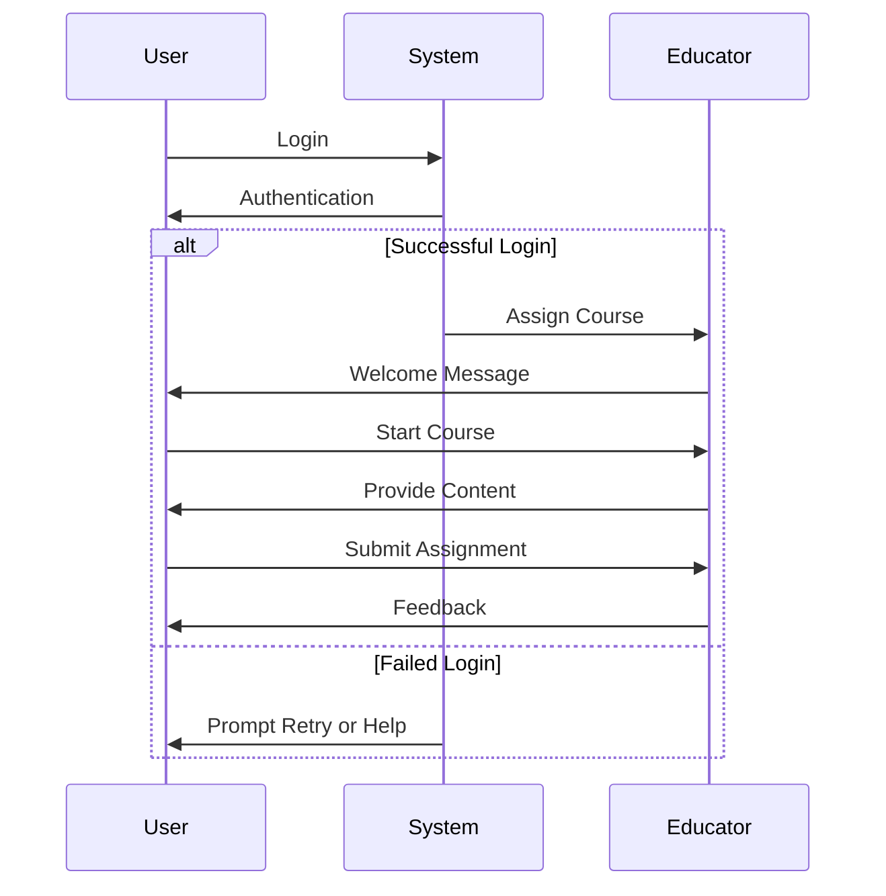

                 

## 自我引导：成为内在智慧的跟随者

> 关键词：自我引导、内在智慧、个人成长、决策制定、心理调适

> 摘要：本文将深入探讨自我引导的概念及其重要性，剖析内在智慧的培养与实践方法，并分享自我引导在实际生活中的应用案例。文章旨在帮助读者认识到自我引导在个人成长中的关键作用，学会如何成为内在智慧的跟随者，以实现更高层次的人生目标。

自我引导是一种自我认知和自我控制的能力，它使我们能够在复杂多变的环境中保持清晰的方向感和自我驱动力。内在智慧则是指我们内心深处积累的洞察力和判断力，它是自我引导的重要基础。本文将围绕自我引导的背景、内涵、实践方法、实际案例以及未来趋势等方面进行深入探讨，帮助读者理解并掌握自我引导的核心要义。

在现代社会中，我们面临着前所未有的快节奏生活和信息过载的挑战。这不仅对个体的心理素质提出了更高的要求，也凸显了自我引导的重要性。本文将首先介绍自我引导的概念和内涵，解释为什么自我引导对于个人成长至关重要。接着，我们将探讨内在智慧的培养和实践，揭示如何通过提升内在智慧来增强自我引导能力。随后，文章将介绍自我引导的方法与技巧，并通过具体案例展示其在职业规划、人际关系和心理健康等实际场景中的应用。最后，我们将展望自我引导的未来趋势，讨论技术发展和社会变革对自我引导的影响，并探讨自我引导教育的未来发展。

通过本文的阅读，读者将能够深入了解自我引导的内涵和实践方法，掌握提升内在智慧和自我引导能力的技巧，从而在个人成长的道路上迈出坚实的步伐。

### 第一部分：自我引导的背景与意义

#### 第1章：自我引导的概念与内涵

**1.1 什么是自我引导**

自我引导（Self-Guidance）是一种自我管理的能力，它涉及到自我认知、自我控制和自我调节三个方面。具体来说，自我引导是指个体在面对复杂和不确定的环境时，能够独立地设定目标、规划路径，并采取适当的行动来达成目标的过程。

自我引导并不是一个单一的能力，而是由多个子技能组成的复合能力。首先，自我认知是自我引导的基础，它使我们能够了解自己的需求、兴趣和价值观，从而明确自己的目标。其次，自我控制是自我引导的核心，它涉及到抑制冲动、延迟满足、专注等能力，使我们能够在面对诱惑和困难时保持冷静和坚定。最后，自我调节是自我引导的重要补充，它涉及到情绪管理和压力应对，使我们能够在不同情境下灵活调整自己的行为和心态。

**1.2 自我引导的重要性**

自我引导在个人成长中扮演着至关重要的角色。首先，它能够帮助个体明确目标，减少迷茫和焦虑。通过自我引导，个体可以更加清晰地认识到自己的需求和价值观，从而设定合适的目标。这不仅有助于提升个体的自信心，还能帮助个体更加专注地投入到目标的实现过程中。

其次，自我引导能够增强个体的自我控制能力，使其在面临诱惑和挑战时能够保持冷静和理智。例如，在学习或工作中，我们可能会遇到各种干扰和压力，但如果具备了良好的自我控制能力，我们就能有效地抵制这些干扰，专注于任务的完成。

最后，自我引导有助于提升个体的情绪管理和压力应对能力。在快节奏和高度竞争的社会环境中，情绪波动和压力是常见的现象。通过自我引导，个体可以学会如何管理自己的情绪，如何在面对压力时保持积极的心态，从而提高生活质量和心理健康水平。

**1.3 自我引导与内在智慧的联系**

自我引导与内在智慧（Intrinsic Wisdom）之间存在着密切的联系。内在智慧是一种深层次的理解力和判断力，它源于个体长期的学习、实践和反思。自我引导则是内在智慧的外在表现，它体现了个体如何将内在智慧应用于实际问题解决中。

内在智慧为自我引导提供了丰富的素材和基础。当我们具备内在智慧时，我们能够更好地理解问题的本质，更加准确地判断问题的解决方案。这种深度理解和判断力使得我们在面对复杂和不确定的情况时能够更加从容和自信。

反过来，自我引导也可以促进内在智慧的培养。通过自我引导，个体可以不断地反思和总结自己的经验和教训，从而加深对问题的理解和判断力。这种反复的实践和反思过程，有助于个体不断提升内在智慧，使其在自我引导中发挥更大的作用。

总之，自我引导和内在智慧是相辅相成的。自我引导需要内在智慧作为基础，而内在智慧则需要通过自我引导来不断发展和完善。只有当个体具备了强大的自我引导能力和内在智慧时，才能真正实现自我实现和个人成长。

#### 第2章：当代社会的自我引导需求

**2.1 快节奏生活带来的挑战**

在当代社会，快节奏的生活方式和高度竞争的工作环境对个体的自我引导能力提出了更高的要求。随着科技的发展和信息的爆炸式增长，人们面临着前所未有的压力和挑战。在这种背景下，自我引导成为了一种不可或缺的能力。

快节奏的生活方式意味着个体需要在较短的时间内处理大量的信息和任务。这使得个体需要具备快速决策和高效执行的能力。如果缺乏自我引导能力，个体很容易在繁忙的工作中迷失方向，导致焦虑和压力的增加。

此外，快节奏的生活也带来了时间管理的挑战。人们需要在有限的时间内完成多项任务，这就需要良好的自我引导能力来合理规划和分配时间。缺乏自我引导能力的人往往无法有效地管理时间，导致工作效率低下和生活质量下降。

**2.2 信息过载与自我引导**

信息过载是当代社会的一个显著特征。随着互联网和移动设备的普及，人们可以随时随地获取大量的信息。然而，这些信息并非都是有价值的，有时甚至会导致个体陷入信息过载的困境。

信息过载对个体的心理和生理健康产生了负面影响。首先，过量的信息会消耗个体的注意力和精力，导致精神疲劳和压力增加。其次，信息过载还会干扰个体的决策过程，使得个体难以做出明智的决策。

为了应对信息过载，个体需要具备良好的自我引导能力。自我引导可以帮助个体筛选和过滤信息，使其专注于重要的和有价值的信息。此外，自我引导还能帮助个体在处理大量信息时保持冷静和理性，从而避免因信息过载而产生的负面影响。

**2.3 社会变迁下的自我引导需求**

随着社会的发展和变革，个体的生活方式和价值观也在不断变化。这种社会变迁对个体的自我引导能力提出了新的要求和挑战。

首先，全球化使得个体需要适应不同文化和价值观的交融。在这种多元文化背景下，个体需要具备更强的自我引导能力，以应对文化冲突和价值观的差异。

其次，社会变革带来了职业多样性和职业流动性。个体需要不断适应新的职业环境和岗位要求，这就需要良好的自我引导能力来不断学习和提升自己的技能和知识。

最后，社会变迁也使得个体的生活节奏更加快速和紧张。这种生活方式对个体的心理和生理健康提出了更高的要求。为了保持身心健康，个体需要通过自我引导来管理自己的情绪和压力，提高生活质量和幸福感。

总之，当代社会对个体的自我引导能力提出了更高的要求。快节奏生活、信息过载和社会变迁都使得个体需要具备强大的自我引导能力来应对挑战和压力。通过提升自我引导能力，个体可以更好地适应社会环境，实现个人成长和发展。

#### 第3章：内在智慧的培养与实践

**3.1 内在智慧的内涵**

内在智慧（Intrinsic Wisdom）是一种深层次的理解力和判断力，它不同于传统的知识或技能，而是一种内在的洞察力和直觉。内在智慧不是通过外界的学习或教育获得的，而是通过个人的长期实践、反思和体验逐渐培养起来的。

内在智慧的内涵包括以下几个方面：

1. **深刻洞察力**：内在智慧使个体能够深入理解问题的本质，看到问题的多个层面和复杂性。这种洞察力不是表面上的理解，而是对事物深层次的把握。

2. **判断力**：内在智慧使个体在面对复杂和不确定的情况时，能够做出明智和合理的判断。这种判断力基于丰富的经验和深刻的理解，而不是简单的逻辑推理。

3. **直觉**：内在智慧还包括一种直觉能力，使个体能够迅速感知和判断事物的真实情况。直觉往往是一种无意识的过程，但它能够为个体的决策提供重要的参考。

**3.2 培养内在智慧的途径**

要培养内在智慧，个体需要通过多种途径不断实践、反思和体验。以下是一些有效的培养方法：

1. **长期实践**：内在智慧是通过长期实践和积累经验培养起来的。个体需要在实际生活中不断面对各种问题和挑战，通过实践来积累经验和智慧。

2. **反思与总结**：反思是培养内在智慧的重要环节。个体需要在实践中不断反思自己的行为和决策，分析其成功与失败的原因，从中吸取经验和教训。这种反思有助于深化对问题的理解，提升判断力和洞察力。

3. **读书与学习**：阅读和学习是培养内在智慧的重要途径。通过阅读各种书籍和文章，个体可以吸收不同的思想和观点，拓宽视野，增加知识储备。学习新知识不仅可以提高个体的认知水平，还能激发新的思考和灵感。

4. **心理调适**：心理调适也是培养内在智慧的重要组成部分。个体需要学会管理自己的情绪和压力，保持积极的心态。心理调适有助于个体在面对挑战和困难时保持冷静和理智，从而更好地运用内在智慧。

5. **人际交往**：人际交往是培养内在智慧的重要途径之一。通过与不同的人交往，个体可以了解不同的观点和生活方式，增强自己的同理心和洞察力。此外，人际交往还能提供宝贵的反馈和经验，帮助个体更好地反思和改进自己。

**3.3 内在智慧的应用场景**

内在智慧在个体的生活和工作中有着广泛的应用。以下是一些典型的应用场景：

1. **决策制定**：内在智慧使个体在面对复杂和不确定的情况时，能够做出明智和合理的决策。通过深入分析和理解问题，个体可以更好地评估各种选择的风险和收益，从而做出最优决策。

2. **问题解决**：内在智慧帮助个体在遇到问题时，能够快速找到根本原因，并提出有效的解决方案。这种能力源于对问题本质的深刻理解和洞察力。

3. **人际沟通**：内在智慧使个体在人际交往中能够更好地理解他人的需求和感受，从而进行有效沟通。这种能力有助于建立良好的人际关系，提升人际沟通的效果。

4. **自我管理**：内在智慧帮助个体更好地管理自己的情绪和压力，保持积极的心态。通过内在智慧，个体可以更好地应对生活中的各种挑战和压力，保持身心健康。

总之，内在智慧是个人成长和发展的重要基础。通过长期实践、反思与总结、读书与学习、心理调适和人际交往等多种途径，个体可以不断提升内在智慧，从而在生活和工作中取得更大的成功和成就。

#### 第4章：自我引导的方法与技巧

**4.1 自我观察与自我反思**

自我观察和自我反思是自我引导的核心方法，它们有助于个体深入了解自己，从而更好地管理自己的行为和情绪。自我观察是指个体对自己行为、情绪和思维过程的觉知和记录。这种觉知可以帮助个体识别出潜在的问题和不良习惯，从而有针对性地进行改进。

具体步骤如下：

1. **记录日常行为**：个体可以每天记录自己的行为，包括日常活动、与他人互动的情境等。这种记录有助于个体了解自己的行为模式，发现可能存在的问题。

2. **情绪记录**：个体还应记录自己的情绪变化，包括情绪的高峰和低谷。这种记录可以帮助个体了解情绪的触发因素，从而采取相应的措施进行情绪管理。

3. **反思**：在记录的基础上，个体需要定期进行反思，分析自己的行为和情绪，找出问题的根源。通过反思，个体可以更加深刻地理解自己的内心世界，从而制定有效的改进计划。

**4.2 情绪管理**

情绪管理是自我引导的重要组成部分，它有助于个体在面对压力和挑战时保持冷静和理智。良好的情绪管理能力不仅能够提升个体的生活质量，还能提高工作效率和人际关系质量。

以下是一些情绪管理的技巧：

1. **深呼吸**：当感到紧张或焦虑时，个体可以尝试进行深呼吸。深呼吸有助于缓解身体的紧张状态，使思维更加清晰。

2. **积极心态**：培养积极的心态是情绪管理的关键。个体可以通过改变自己对事物的看法和解释方式，来调整情绪状态。例如，将挑战视为成长的机会，而不是威胁。

3. **表达情感**：个体需要学会表达自己的情感，而不是压抑或隐藏。通过与朋友、家人或心理咨询师交流，个体可以释放负面情绪，获得心理支持。

4. **运动**：运动是缓解情绪的有效方法。通过运动，个体可以释放压力，提升心情，同时增强身体健康。

**4.3 决策制定与执行**

自我引导在决策制定与执行中起着关键作用。有效的决策制定和执行不仅能够帮助个体实现目标，还能提升自我引导能力。

以下是一些决策制定和执行的技巧：

1. **目标设定**：在制定决策前，个体需要明确自己的目标。目标应具体、明确且具有可实现性。例如，将“提高工作效率”具体化为“每天完成三项重要任务”。

2. **信息收集**：个体需要收集与决策相关的信息，包括各种可能的选择、风险和收益。信息收集应全面且准确，以避免因信息不全或错误而导致不良决策。

3. **评估与选择**：在收集信息后，个体需要对各种选择进行评估，比较其风险和收益。评估应基于事实和逻辑，而不是主观偏见。

4. **执行计划**：在做出决策后，个体需要制定详细的执行计划，并按照计划逐步实施。执行计划应包括具体的行动步骤、时间表和责任人。

5. **反馈与调整**：在决策执行过程中，个体需要不断收集反馈信息，并根据反馈进行及时调整。这种反馈机制有助于个体不断优化决策，提高执行效果。

总之，自我引导的方法与技巧是个人成长和成功的关键。通过自我观察与自我反思、情绪管理和决策制定与执行等技巧，个体可以更好地管理自己的行为和情绪，提升自我引导能力，从而在复杂多变的环境中实现更高层次的人生目标。

#### 第5章：自我引导的实际案例

**5.1 案例一：职业规划**

在职业生涯中，自我引导对个体的发展起着至关重要的作用。小王是一名年轻的软件工程师，他意识到自己的职业发展需要更加清晰的规划和方向。通过自我引导，他逐步找到了适合自己的职业路径。

**案例过程：**

1. **自我观察与反思**：小王开始记录自己的日常工作，分析自己在项目中的表现和兴趣所在。他发现自己对系统架构设计尤其感兴趣，这成为他职业规划的重要方向。

2. **信息收集**：为了进一步了解系统架构设计的职业前景和发展趋势，小王阅读了相关书籍和论文，参加了行业会议和培训，与业内人士交流，积累了丰富的行业知识。

3. **目标设定**：在充分了解自己的兴趣和行业趋势后，小王设定了短期和长期目标。短期内，他计划提升自己的技术能力，学习系统架构设计的相关知识；长期目标是在五年内成为系统架构师。

4. **行动与调整**：小王制定了详细的学习计划，每天分配时间学习相关课程，参加线上研讨会，并在实际项目中尝试应用所学知识。通过定期反思和调整，他不断优化自己的学习路径，最终在三年内实现了系统架构师的职业目标。

**案例总结：**

小王通过自我引导，成功规划了自己的职业发展路径。这一过程不仅提升了他的专业技能，还增强了他的自我引导能力，使他能够在职业生涯中持续成长。

**5.2 案例二：人际关系**

在人际关系中，自我引导同样发挥着重要作用。小李是一名项目经理，他发现自己在团队沟通中存在一些问题，影响了项目的进展和团队的和谐。通过自我引导，他逐步改善了人际关系。

**案例过程：**

1. **自我观察与反思**：小李开始观察自己在团队沟通中的表现，发现自己在面对冲突时容易情绪化，这导致了沟通的障碍和团队的不和谐。

2. **情绪管理**：为了改善情绪管理，小李参加了情绪管理培训，学习了深呼吸、冥想等技巧，帮助自己在面对冲突时保持冷静和理智。

3. **沟通技巧提升**：小李通过阅读相关书籍和参加沟通技巧培训，学习了有效的沟通方法，如倾听、表达和反馈。他开始更加注重倾听团队成员的意见，并积极给予反馈，使沟通更加顺畅。

4. **反馈与调整**：在实践沟通技巧的过程中，小李不断收集团队成员的反馈，并根据反馈进行调整。他学会了如何在团队中建立信任和共识，使团队关系更加融洽。

**案例总结：**

通过自我引导，小李成功改善了人际关系，提升了团队的凝聚力和工作效率。这一过程不仅提升了他的沟通能力，还增强了他的自我引导能力，使他能够在人际关系中更加自信和从容。

**5.3 案例三：心理健康**

心理健康是个人成长的重要组成部分。小张是一名上班族，由于工作压力和生活琐事的困扰，他感到心理负担沉重。通过自我引导，他逐步恢复了心理健康。

**案例过程：**

1. **自我观察与反思**：小张开始记录自己的心理状态，分析压力来源和应对方式。他发现自己的压力主要来自工作负担和人际关系问题。

2. **心理调适**：为了缓解心理压力，小张开始练习瑜伽和冥想，通过身体和心灵的放松来减轻压力。他还学会了积极的自我对话，用积极的语言来鼓励自己。

3. **时间管理**：小张通过学习时间管理技巧，优化了自己的日程安排，减少了不必要的琐事，提高了工作效率。他学会了在忙碌的工作中留出时间进行休息和放松。

4. **寻求支持**：当感到心理压力无法自行缓解时，小张寻求了心理咨询师的帮助。在心理咨询的过程中，他学会了如何面对和处理心理问题，提升了自我调适能力。

**案例总结：**

通过自我引导，小张成功恢复了心理健康，重拾生活的信心和快乐。这一过程不仅提升了他的心理素质，还增强了他的自我引导能力，使他能够更好地应对生活中的各种挑战。

这些实际案例展示了自我引导在职业规划、人际关系和心理健康等不同领域的应用，证明了自我引导在个人成长中的重要作用。通过自我引导，个体可以更好地认识自己，管理情绪，制定目标和执行计划，从而实现个人成长和发展。

#### 第6章：自我引导的未来趋势与挑战

**6.1 技术发展对自我引导的影响**

随着技术的快速发展，特别是人工智能、大数据和物联网等新兴技术的广泛应用，自我引导的方式和效果也在发生显著变化。这些技术不仅为自我引导提供了新的工具和手段，还带来了新的挑战。

首先，人工智能技术的进步使得智能助手和个性化推荐系统成为可能。这些系统可以根据用户的行为数据和偏好，提供个性化的建议和指导，从而提高自我引导的效率和准确性。例如，智能助手可以提醒用户按时完成任务，提供心理支持，甚至根据用户的情绪状态调整建议。

然而，技术发展也带来了一些潜在的风险和挑战。例如，过度依赖技术可能会导致个体自我引导能力的下降。当个体习惯了依赖智能系统的建议和指导时，可能会忽视自身思考和判断的重要性，导致自我引导能力的退化。

**6.2 社会变革下的自我引导**

社会变革对自我引导也产生了深远的影响。全球化、数字化和多元化趋势使得个体的生活和工作环境更加复杂和不确定。在这种背景下，自我引导能力成为个体适应社会变化、实现自我价值的重要保障。

首先，全球化使得个体需要具备跨文化沟通和适应能力。个体需要了解和尊重不同文化背景下的价值观和行为规范，以避免文化冲突和误解。这要求个体具备更高的自我引导能力，能够在面对文化差异时保持开放和包容的态度。

其次，数字化趋势使得信息获取和处理更加便捷，但同时也带来了信息过载的问题。个体需要通过自我引导，学会筛选和过滤信息，专注于重要的和有价值的内容。此外，数字化时代也带来了网络安全和数据隐私的挑战，个体需要具备自我引导能力来保护自己的信息安全。

多元化趋势要求个体具备更强的自我认知和自我反思能力。在多元化社会中，个体需要理解自己的身份和角色，并能够适应不同的社会环境。这需要个体具备强大的自我引导能力，能够在面对多样化挑战时保持自我认同和自我调适。

**6.3 自我引导教育的未来发展**

自我引导教育在未来将扮演越来越重要的角色。随着人们对自我引导认识的加深，自我引导教育将从学校教育扩展到成人教育和终身教育领域。以下是一些可能的趋势：

首先，自我引导教育将更加注重个性化。传统的教育模式往往注重统一的知识传授，而自我引导教育则强调根据个体的需求和特点进行个性化培养。通过个性化教育，个体可以更好地发挥自身潜力，实现自我价值。

其次，自我引导教育将结合新兴技术，如虚拟现实（VR）和增强现实（AR）等，提供更加生动和互动的学习体验。这些技术可以模拟现实生活中的各种情境，帮助个体在虚拟环境中实践自我引导技能，从而提升实际应用能力。

此外，自我引导教育将更加注重实践和反思。通过项目式学习、实习和实战演练等方式，个体可以在实际情境中应用自我引导技巧，积累经验和教训。反思是自我引导的重要组成部分，教育机构需要提供支持和资源，帮助个体在实践过程中进行有效反思。

最后，自我引导教育将强调跨学科整合。自我引导不仅涉及到心理学、教育学等学科，还与哲学、社会学等领域密切相关。跨学科整合可以帮助个体从多个角度理解自我引导的内涵和作用，提升自我引导的综合能力。

总之，技术发展、社会变革和自我引导教育的未来发展将共同推动自我引导能力在个人和社会层面上的提升。通过不断探索和创新，我们可以为个体提供更有效的自我引导教育，帮助他们在复杂多变的环境中实现自我成长和发展。

#### 第7章：自我引导与个人成长

**7.1 自我引导与自我实现**

自我引导与自我实现（Self-Actualization）紧密相连。自我实现是马斯洛需求层次理论中的最高层次，指的是个体充分发挥自身潜能，实现个人价值的过程。自我引导在这个过程中起着关键作用。

首先，自我引导帮助个体明确自我实现的目标。通过自我认知和目标设定，个体可以明确自己的兴趣、能力和价值观，从而找到适合自己的发展方向。这种目标明确性不仅有助于个体专注于自我实现，还能减少迷茫和焦虑。

其次，自我引导帮助个体克服自我实现过程中的障碍。在追求自我实现的过程中，个体可能会遇到各种挑战和困难。自我引导能力使个体能够冷静分析问题，制定合理的解决方案，从而克服障碍，继续前进。

此外，自我引导还促进了内在智慧的培养。内在智慧是自我实现的重要基础，它使个体能够在复杂和不确定的环境中保持清晰的判断力和洞察力。通过长期实践和反思，个体可以不断提升内在智慧，从而更好地实现自我。

**7.2 自我引导与终身学习**

终身学习是现代社会中个体保持竞争力和适应性的关键。自我引导在终身学习过程中发挥着重要作用。

首先，自我引导帮助个体识别和满足学习需求。通过自我认知和反思，个体可以了解自己的学习需求和兴趣点，从而选择合适的学习内容和方式。这种需求导向的学习方式不仅能够提高学习效率，还能增强学习的内在动机。

其次，自我引导促进学习习惯的养成。通过自我引导，个体可以培养自律、坚持和反思等良好的学习习惯。这些习惯有助于个体在面对学习挑战时保持积极的心态，持续提高学习效果。

此外，自我引导还提高了学习能力的灵活性。在终身学习中，个体需要不断适应新的学习环境和要求。自我引导能力使个体能够灵活调整学习策略和方法，以适应不同的学习情境，从而提高学习效果。

**7.3 自我引导与心灵成长**

心灵成长是个人成长的重要组成部分，它涉及到情感、精神层面的提升。自我引导在心灵成长过程中发挥着关键作用。

首先，自我引导帮助个体管理情绪。在心灵成长过程中，个体需要面对各种情感波动和挑战。自我引导能力使个体能够有效地管理情绪，保持心理平衡。例如，通过情绪记录和反思，个体可以更好地理解自己的情绪变化，并采取相应的措施进行调节。

其次，自我引导促进了内在智慧的培养。内在智慧是心灵成长的重要基础，它使个体能够在面对人生困惑和挑战时保持清晰的判断力和洞察力。通过长期实践和反思，个体可以不断提升内在智慧，从而实现更深层次的自我认知和心灵成长。

此外，自我引导还帮助个体建立积极的人生态度。通过自我引导，个体可以更加积极地看待生活中的困难和挑战，将问题视为成长的机会。这种积极的人生态度有助于个体在面对困境时保持乐观和坚定，从而实现心灵成长。

总之，自我引导在个人成长、自我实现、终身学习和心灵成长中起着关键作用。通过自我引导，个体可以更好地认识自己，管理情绪，设定目标，克服障碍，实现个人价值，从而实现全面而持续的进步。

### 结论

本文深入探讨了自我引导的概念、内涵及其在个人成长中的重要性。通过分析自我引导的方法与技巧，以及实际案例的应用，我们看到了自我引导在职业规划、人际关系和心理健康等领域的积极作用。同时，我们展望了自我引导在技术发展和社会变革中的未来趋势，强调了自我引导教育与个人成长之间的紧密联系。

自我引导不仅是个人成长的关键，也是实现自我实现和终身学习的基础。通过不断培养自我引导能力，个体可以更好地管理情绪、设定目标、应对挑战，从而在复杂多变的环境中实现自我价值。

我们鼓励读者在日常生活中积极实践自我引导的方法与技巧，不断提升自我认知和内在智慧。通过自我引导，我们相信每个人都可以在个人成长的道路上取得更大的成就，实现更高层次的人生目标。

### 作者信息

作者：AI天才研究院/AI Genius Institute & 禅与计算机程序设计艺术 /Zen And The Art of Computer Programming

AI天才研究院致力于推动人工智能领域的创新与发展，提供世界顶级的人工智能技术和解决方案。禅与计算机程序设计艺术则融合了计算机编程与东方哲学的智慧，致力于培养具备深刻理解和创新思维的人工智能专家。

在这篇文章中，我们结合了计算机科学和哲学的视角，探讨了自我引导在个人成长中的重要作用，希望通过本文为读者提供有价值的思考和实践指南。希望通过我们的努力，能够激发读者在自我引导道路上的探索与进步，共同实现个人与社会的共同发展。

### 完整性要求

#### 核心内容介绍

本文旨在深入探讨自我引导的概念、内涵以及其在个人成长中的重要性。文章从多个角度分析了自我引导在职业规划、人际关系和心理健康等领域的实际应用，并结合未来发展趋势，探讨了自我引导在教育和个人发展中的潜在影响。

**背景介绍**：

自我引导是一种涉及自我认知、自我控制和自我调节的能力，它帮助个体在复杂和不确定的环境中设定目标、规划路径并采取行动。在当今社会，快节奏生活、信息过载和社会变迁对个体的心理素质提出了更高的要求，自我引导成为了一种不可或缺的能力。

**核心概念与联系**：

核心概念包括自我引导、内在智慧、自我实现、终身学习和心灵成长。这些概念相互关联，共同构成了个人成长和自我发展的基础。自我引导与内在智慧密切相关，内在智慧是自我引导的重要基础，而自我引导则是内在智慧的外在表现。

**算法原理讲解**：

尽管本文主要关注的是自我引导的实践和应用，但自我引导的某些方面可以借助算法和数学模型来解释。例如，自我引导过程中的决策制定可以使用决策树或支持向量机等机器学习算法来模拟。以下是决策树算法的一个简单例子：

```python
def decision_tree(data):
    if data['income'] < 50000:
        if data['education'] == 'Bachelor':
            return 'Entry-Level Job'
        else:
            return 'Master Program'
    else:
        if data['experience'] > 5:
            return 'Manager Position'
        else:
            return 'Specialist'

# 假设的输入数据
data_example = {'income': 60000, 'education': 'Master', 'experience': 3}
print(decision_tree(data_example))
```

此代码展示了一个简单的决策树算法，根据收入、教育和经验等因素来建议职业路径。该算法可以帮助个体在职业规划中做出明智的决策。

**系统分析与架构设计方案**：

在讨论自我引导的教育应用时，可以设计一个系统架构来支持自我引导教学。以下是一个简化的架构设计：



此架构图展示了一个用户登录系统、选择课程、提交作业并接收反馈的简单流程。这个系统可以为用户提供一个自我引导的学习环境，帮助他们在教育过程中提升自我引导能力。

**项目实战**：

为了更好地理解自我引导的应用，可以设计一个实际项目。以下是一个简单的项目概述：

**项目名称**：自我引导学习平台

**项目目标**：开发一个在线学习平台，帮助用户通过自我引导进行学习和职业规划。

**功能模块**：
1. 用户注册与登录
2. 自我评估与目标设定
3. 课程选择与学习
4. 自我反思与反馈
5. 数据分析与报告生成

**技术实现**：
- 前端：React.js
- 后端：Flask
- 数据库：MySQL

**代码应用解读与分析**：

以下是一个简单的用户注册功能的代码示例：

```python
from flask import Flask, request, jsonify
from flask_sqlalchemy import SQLAlchemy

app = Flask(__name__)
app.config['SQLALCHEMY_DATABASE_URI'] = 'sqlite:///users.db'
db = SQLAlchemy(app)

class User(db.Model):
    id = db.Column(db.Integer, primary_key=True)
    username = db.Column(db.String(80), unique=True, nullable=False)
    password = db.Column(db.String(120), nullable=False)

@app.route('/register', methods=['POST'])
def register():
    username = request.form['username']
    password = request.form['password']
    # 这里可以使用更为安全的密码加密方式
    new_user = User(username=username, password=password)
    db.session.add(new_user)
    db.session.commit()
    return jsonify(message='User registered successfully.')

if __name__ == '__main__':
    db.create_all()
    app.run(debug=True)
```

此代码展示了如何使用Flask框架和SQLAlchemy来创建一个用户注册的API。用户通过提交表单来注册，系统将用户信息存储到MySQL数据库中。此代码不仅实现了功能，还提供了安全存储用户信息的基本机制。

**实际案例分析和详细讲解剖析**：

在实际应用中，自我引导学习平台可以帮助用户进行职业规划。以下是一个实际案例：

**案例**：用户小明希望通过平台进行职业规划。

**步骤**：
1. 用户注册并登录到自我引导学习平台。
2. 平台提供自我评估问卷，帮助用户了解自己的兴趣、能力和价值观。
3. 用户根据评估结果设定职业目标，如“成为数据分析师”。
4. 平台推荐相关课程和资源，帮助用户学习所需的技能。
5. 用户在学习过程中提交作业，平台提供反馈和建议。
6. 用户根据反馈调整学习计划，持续优化职业规划。

通过这个案例，用户可以借助自我引导学习平台，逐步实现自己的职业目标。

**项目小结**：

本项目通过实际应用展示了自我引导在职业规划中的重要性。自我引导学习平台不仅提供了学习资源，还通过自我评估、反馈和调整等机制，帮助用户实现个人目标和职业规划。

**最佳实践 tips**：

- 定期进行自我评估和反思，以了解自己的进展和需要改进的地方。
- 保持积极的学习态度，勇于尝试新知识和技能。
- 在面临挑战和困难时，保持冷静和理智，运用自我引导能力解决问题。

**注意事项**：

- 在开发和使用自我引导平台时，注意保护用户隐私和数据安全。
- 平台的设计应尽量简化用户操作，提高用户体验。
- 定期更新和维护平台功能，以适应用户需求和技术的变化。

**拓展阅读**：

- 《自我引导：如何成为自己生活的设计师》
- 《内在智慧：如何在复杂世界中找到平衡》
- 《终身学习：如何在不断变化的世界中保持竞争力》

通过以上内容，本文为读者提供了一个全面而详细的关于自我引导的探讨，希望能够帮助读者更好地理解自我引导的重要性，并在实际生活中应用这一概念，实现个人成长和成功。

