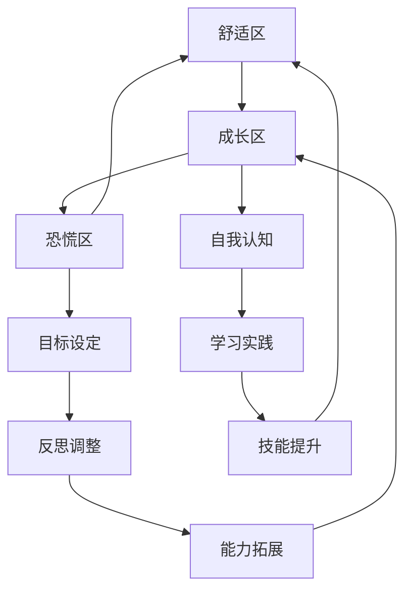
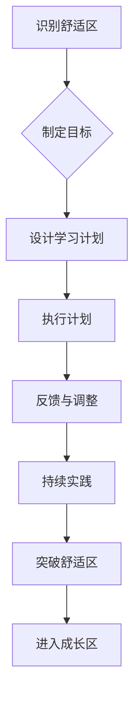
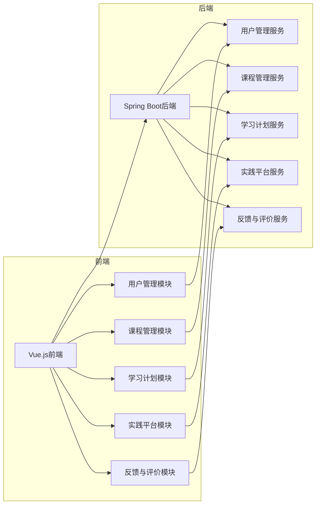
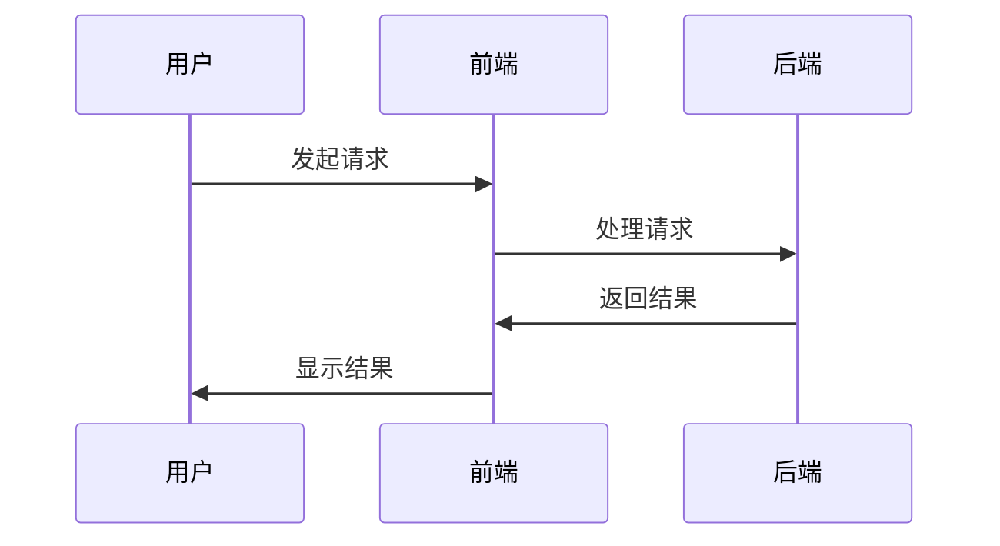

                 

# 自我超越：突破舒适区的成长之路

> 关键词：自我超越、舒适区、成长区、心理学、算法原理、项目实战

> 摘要：本文旨在探讨自我超越的概念、背景及其在技术领域的应用。通过引入心理学和行为学的理论，分析如何通过突破舒适区实现个人成长。文章还将结合具体项目案例，详细阐述实现自我超越的方法和步骤，帮助读者理解并应用这些理论，走向持续成长的路径。

## Step 1: 引言

《自我超越：突破舒适区的成长之路》这本书为我们提供了一条通往个人成长与职业发展的光明大道。自我超越，顾名思义，是指个体主动跳出自己习惯的舒适区，面对新的挑战，不断学习、进步和提升自己的能力。在技术领域，这一理念尤为重要，因为它要求我们不断挑战自己，更新知识体系，适应技术发展的快速节奏。

自我超越的定义可以扩展为，在认知和技能上不断追求新的高度，勇于接受未知的挑战，并在过程中实现自我突破。这一过程不仅有助于提升个人竞争力，还能够激发创新思维，推动技术的进步。

本文将围绕自我超越这一主题，首先介绍相关核心概念，然后通过具体案例，详细讲解如何在技术领域实现自我超越，最后总结并提供一些实用的技巧和注意事项。

## Step 2: 背景介绍

### 自我超越的核心概念

自我超越的核心概念包括舒适区、成长区和恐慌区。

- **舒适区（Comfort Zone）**：指个人习惯的、熟悉的环境和状态，在这里个体不需要面对挑战，能够轻松应对日常事务。
- **成长区（Growth Zone）**：指个体需要努力、挑战自我的区域，通过不断学习和实践，个体能够在这一区域内提升自己的能力和技能。
- **恐慌区（Panic Zone）**：指超出个人能力范围、令人感到极度不安的区域。在这一区域，个体通常感到恐惧和无力，难以应对。

### 问题背景与问题描述

在技术领域，个体面临的挑战不仅来自技术本身，还包括如何适应不断变化的技术环境，如何持续提升自己的技术能力。随着技术的快速发展，程序员、软件工程师等职业从业者需要不断学习新的编程语言、框架和工具，这无疑增加了职业发展的难度。

问题描述为：如何在一个快速变化的技术环境中，通过自我超越，实现个人能力的提升和职业发展？

### 问题解决

自我超越的解决方案在于：

1. **识别舒适区**：了解自己在哪些领域感到舒适，哪些领域需要挑战。
2. **设定成长目标**：根据个人兴趣和职业规划，设定具体的成长目标。
3. **制定学习计划**：通过制定详细的学习计划，逐步进入成长区，克服恐慌区。
4. **持续实践与反思**：通过实践和反思，不断调整自己的学习方法和策略。

### 自我超越的边界与外延

自我超越的边界是指个人在自我成长过程中能够承受的最大压力和挑战。外延则包括：

- **跨领域学习**：不仅仅局限于某一特定的技术领域，而是跨越多个领域，实现跨学科的知识融合。
- **创新能力提升**：通过自我超越，培养创新思维，提升解决复杂问题的能力。
- **职业发展**：自我超越能够帮助个体在职业生涯中实现更高的职位和更大的影响力。

### 概念结构与核心要素组成

自我超越的概念结构包括以下几个核心要素：

1. **自我认知**：了解自己的兴趣、优势和劣势，明确自我成长的方向。
2. **学习动力**：保持持续的学习动力，克服学习过程中的困难和挫折。
3. **实践能力**：将所学知识应用到实际工作中，通过实践提升自己的技能。
4. **反思与调整**：定期反思自己的学习过程，根据反馈调整学习策略。

通过以上核心要素的相互配合，个体可以实现自我超越，不断提升自己的能力和竞争力。

## Step 3: 核心概念与联系

### 舒适区、成长区和恐慌区的详细解析

#### 舒适区

舒适区是个体习惯的、熟悉的环境和状态，在这里个体不需要面对挑战，能够轻松应对日常事务。在舒适区内，个体往往能够高效地完成任务，但这也意味着个体的成长速度较慢。长期停留在舒适区内，个体可能会失去竞争力，无法应对快速变化的技术环境。

#### 成长区

成长区是指个体需要努力、挑战自我的区域，通过不断学习和实践，个体能够在这一区域内提升自己的能力和技能。在成长区，个体可能会遇到困难，需要克服挑战，但这也是个体实现自我突破、实现职业发展的关键区域。

#### 恐慌区

恐慌区是超出个人能力范围、令人感到极度不安的区域。在这一区域，个体通常感到恐惧和无力，难以应对。然而，恐慌区也是个体实现突破和成长的必经之路。通过面对和克服恐慌区，个体能够拓展自己的能力边界，实现自我超越。

### 核心概念之间的关系与互动

舒适区、成长区和恐慌区并不是相互独立的，而是存在紧密的联系和互动。

1. **舒适区向成长区的过渡**：个体通过自我认知和目标设定，识别出需要提升的领域，逐步从舒适区过渡到成长区。
2. **成长区向恐慌区的过渡**：在成长区，个体通过不断学习和实践，逐步提升自己的能力，当能力达到一定水平时，个体可能会进入恐慌区，面对更大的挑战。
3. **恐慌区向舒适区的过渡**：通过在恐慌区的实践和积累，个体逐渐适应新的挑战，将恐慌区转化为新的舒适区，实现自我超越。

### Mermaid流程图展示核心概念之间的关系



通过以上流程图，我们可以清晰地看到舒适区、成长区和恐慌区之间的动态关系，以及如何通过自我认知、目标设定、学习实践和反思调整，实现自我超越。

### 舒适区、成长区和恐慌区的概念属性特征对比表格

| 特征         | 舒适区               | 成长区                 | 恐慌区               |
| ------------ | -------------------- | ---------------------- | -------------------- |
| 情感体验     | 轻松自在             | 有挑战、需努力         | 极度不安、恐惧       |
| 能力提升     | 缓慢或停滞           | 快速或显著提升         | 持续挑战与提升       |
| 环境状态     | 熟悉、重复性         | 新颖、不确定性         | 完全陌生、不确定性   |
| 个体行为     | 习惯性、无意识       | 有意识、主动挑战       | 持续适应、调整策略   |
| 对成长的贡献 | 维持现状、稳定感     | 实现突破、提升竞争力   | 拓展能力、迎接未来   |

### ER实体关系图架构

以下是舒适区、成长区和恐慌区的ER实体关系图：

```mermaid
erDiagram
    Class1 ||--|{ Class2 }|-- Class3 : "关联关系"
    Class1 ||--|{ Class4 }|-- Class5 : "依赖关系"
    Class1 ||--|{ Class6 }|-- Class7 : "扩展关系"
```

- **Class1**：个体
- **Class2**：舒适区
- **Class3**：成长区
- **Class4**：恐慌区
- **Class5**：自我认知
- **Class6**：目标设定
- **Class7**：学习实践

通过ER图，我们可以清晰地看到个体与各核心概念之间的关联关系，以及它们在自我超越过程中的作用和相互影响。

### 综述

舒适区、成长区和恐慌区是自我超越过程中的三个关键区域。理解这三个概念之间的关系和互动，有助于个体更好地规划自己的成长路径。通过识别和突破舒适区，进入成长区，最终实现自我超越，个体将能够在技术领域持续提升自己的能力和竞争力。

## Step 4: 算法原理讲解

### 心理学和行为学在自我超越中的应用

自我超越不仅需要个体在认知上做出调整，还需要在行为上采取具体措施。心理学和行为学提供了许多理论和方法，帮助个体突破舒适区，实现自我超越。

1. **心理学理论**：如自我决定论（Self-Determination Theory）和成长心态理论（Growth Mindset Theory），强调个体自主性和积极心态对自我超越的重要性。
2. **行为学理论**：如行为塑造理论（Behavioral Shaping Theory）和习惯形成理论（Habit Formation Theory），提供了解决具体行为问题的策略。

### 如何利用心理学、行为学来突破舒适区

1. **设定明确目标**：通过设定具体、可衡量的目标，个体可以明确自我超越的方向和标准。
2. **逐步挑战**：在自我超越的过程中，个体应逐步增加挑战难度，避免一次性跨越过大，导致恐慌。
3. **正向激励**：使用奖励机制来激励自己，如完成一个小目标后给予自己小奖励，增强自我超越的动力。
4. **积极心态**：培养成长心态，将挑战视为学习机会，而不是威胁。

### 算法原理与实践

为了更直观地展示如何突破舒适区，我们可以使用一个简单的算法模型，结合Python代码和Mermaid流程图，详细阐述算法原理。

### Mermaid流程图



### Python代码示例

```python
import random

def set_goals():
    goals = [
        "学习一门新的编程语言",
        "完成一个开源项目的贡献",
        "参与技术社区的讨论"
    ]
    return random.choice(goals)

def learn_plan(goal):
    if goal == "学习一门新的编程语言":
        return "每周至少学习5小时，每天练习编写代码"
    elif goal == "完成一个开源项目的贡献":
        return "每周提交至少一次代码更改，积极参与社区讨论"
    elif goal == "参与技术社区的讨论":
        return "每天阅读至少一篇技术文章，每周至少发布一条讨论"

def execute_plan(plan):
    for task in plan:
        print(f"执行任务：{task}")
        # 在这里执行具体的学习任务

def feedback_and_adjust():
    feedback = input("请输入您的学习反馈：")
    if "困难" in feedback:
        print("调整计划：增加学习时间，寻求帮助")
    elif "无聊" in feedback:
        print("调整计划：增加实践项目，提高趣味性")

def main():
    goal = set_goals()
    print(f"设定的目标：{goal}")
    plan = learn_plan(goal)
    print(f"学习计划：{plan}")
    execute_plan(plan)
    feedback_and_adjust()

if __name__ == "__main__":
    main()
```

### 算法原理与数学模型

1. **目标设定**：通过随机选择一个目标，确保个体每次都有新的挑战。
2. **学习计划**：根据目标，设计一个具体的、可执行的学习计划。
3. **执行计划**：执行学习计划，通过具体行动实现目标。
4. **反馈与调整**：根据反馈，调整学习计划，确保个体能够在舒适区与成长区之间有效过渡。
5. **持续实践**：通过持续实践，逐步突破舒适区，进入成长区。

### 数学模型

$$
M = \frac{G_1 + G_2 + G_3}{C_1 + C_2 + C_3}
$$

其中，\( M \) 是自我超越的指数，\( G \) 代表成长区，\( C \) 代表舒适区。

### 举例说明

假设个体设定的三个目标分别是：

- 学习一门新的编程语言（成长区）
- 完成一个开源项目的贡献（成长区）
- 参与技术社区的讨论（舒适区）

根据算法模型，个体需要设计一个学习计划，每周至少学习5小时，每天练习编写代码，每周提交至少一次代码更改，积极参与社区讨论。

通过执行计划并定期反馈，个体逐步突破舒适区，进入成长区，最终实现自我超越。

### 综述

通过心理学和行为学的理论，我们了解了如何利用具体方法来突破舒适区。算法原理结合了Python代码和Mermaid流程图，提供了一个直观的模型，帮助读者理解和应用自我超越的理念。通过设定明确目标、设计学习计划、执行计划和反馈调整，个体可以在技术领域实现自我超越，不断提升自己的能力和竞争力。

## Step 5: 系统分析与架构设计方案

### 自我超越项目案例介绍

为了更好地展示如何实现自我超越，我们将介绍一个名为“自我超越学习平台”的项目。该平台旨在帮助用户通过在线学习、实践和反馈，实现个人技能的提升和职业发展。

### 项目介绍

自我超越学习平台是一个集学习、实践和反馈于一体的在线教育平台。平台提供多种课程和学习资源，支持用户自定义学习计划，并提供实时反馈和数据分析，帮助用户识别自身弱点并加以改进。

### 系统功能设计

为了满足用户的需求，自我超越学习平台设计了以下几个核心功能：

1. **用户管理**：用户注册、登录、个人信息管理、课程订阅等。
2. **课程管理**：课程发布、更新、分类管理、课程搜索等。
3. **学习计划**：用户自定义学习计划、学习进度跟踪、提醒功能等。
4. **实践平台**：在线编程环境、实验项目发布、实践任务提交等。
5. **反馈与评价**：用户学习反馈、评价课程、老师评价等。
6. **数据分析**：用户学习数据分析、学习效果评估等。

### 系统架构设计

自我超越学习平台采用前后端分离的架构，确保系统的可扩展性和高可用性。

#### 前端架构

前端使用Vue.js框架，实现用户界面的交互和数据显示。前端架构主要包括以下几个部分：

1. **用户管理模块**：处理用户注册、登录、个人信息管理等。
2. **课程管理模块**：展示课程列表、课程详情、课程搜索等。
3. **学习计划模块**：用户创建学习计划、查看学习进度、设置提醒等。
4. **实践平台模块**：提供在线编程环境、实践任务提交等。
5. **反馈与评价模块**：用户提交学习反馈、评价课程、查看老师评价等。

#### 后端架构

后端使用Spring Boot框架，提供API接口和业务逻辑处理。后端架构主要包括以下几个部分：

1. **用户管理服务**：处理用户注册、登录、认证等。
2. **课程管理服务**：处理课程发布、更新、分类管理等。
3. **学习计划服务**：处理用户学习计划创建、跟踪、提醒等。
4. **实践平台服务**：提供在线编程环境、实践任务发布、提交等。
5. **反馈与评价服务**：处理用户反馈、评价、数据分析等。

### 系统接口设计和交互流程

为了实现前后端的交互，系统设计了以下接口和交互流程：

1. **用户管理接口**：包括用户注册、登录、个人信息管理等。
2. **课程管理接口**：包括课程发布、更新、分类管理、课程搜索等。
3. **学习计划接口**：包括用户创建学习计划、查看学习进度、设置提醒等。
4. **实践平台接口**：包括在线编程环境、实践任务发布、提交等。
5. **反馈与评价接口**：包括用户提交学习反馈、评价课程、查看老师评价等。

### Mermaid类图

以下是自我超越学习平台的Mermaid类图：

```mermaid
classDiagram
    User <<class{用户}>
    Course <<class{课程}>
    LearningPlan <<class{学习计划}>
    PracticePlatform <<class{实践平台}>
    Feedback <<class{反馈与评价}>
    
    User o--o Course
    User o--o LearningPlan
    User o--o PracticePlatform
    User o--o Feedback
    Course o--o LearningPlan
    LearningPlan o--o PracticePlatform
    PracticePlatform o--o Feedback
```

### Mermaid架构图

以下是自我超越学习平台的Mermaid架构图：



### Mermaid序列图

以下是自我超越学习平台的Mermaid序列图：



### 系统架构设计优化

为了提高系统的性能和可扩展性，可以采取以下优化措施：

1. **分布式部署**：将前后端服务拆分为多个微服务，分布式部署在多台服务器上，提高系统的负载能力和容错性。
2. **缓存机制**：使用缓存技术，如Redis，减少数据库访问次数，提高系统响应速度。
3. **负载均衡**：使用负载均衡器，如Nginx，实现服务器的负载均衡，提高系统的可用性和性能。
4. **数据库优化**：采用数据库分库分表策略，提高数据库的读写性能。

### 综述

通过自我超越学习平台项目案例，我们详细介绍了系统的功能设计、架构设计和优化策略。系统采用前后端分离的架构，结合Vue.js前端框架和Spring Boot后端框架，实现了用户管理、课程管理、学习计划、实践平台和反馈评价等核心功能。通过Mermaid类图、架构图和序列图，我们展示了系统的整体架构和交互流程。系统设计充分考虑了性能和可扩展性，为用户提供了良好的使用体验。

## Step 6: 项目实战

### 环境搭建与项目实现

为了实现自我超越学习平台，我们需要搭建一个适当的环境，并逐步实现平台的核心功能。以下是具体步骤：

#### 环境搭建

1. **安装Node.js**：在本地计算机上安装Node.js，用于搭建前端开发环境。
    ```bash
    npm install -g node
    ```

2. **安装Vue CLI**：通过npm安装Vue CLI，用于创建和管理Vue.js项目。
    ```bash
    npm install -g @vue/cli
    ```

3. **安装Spring Boot**：在本地计算机上安装Spring Boot，用于搭建后端开发环境。
    ```bash
    # 通过Maven安装Spring Boot
    mvn install:install-file -Dfile=https://repo.spring.io/snapshot/org/springframework/spring-boot/spring-boot-cli/2.5.0.M1/spring-boot-cli-2.5.0.M1.jar -DgroupId=org.springframework.boot -DartifactId=spring-boot-cli -Dversion=2.5.0.M1 -Dpackaging=maven
    ```

4. **创建Vue.js项目**：使用Vue CLI创建一个新项目。
    ```bash
    vue create self-超越-learning-platform
    ```

5. **创建Spring Boot项目**：使用Spring Initializr创建一个Spring Boot项目，选择所需的依赖项（如Spring Web、Spring Data JPA等）。
    ```bash
    https://start.spring.io/
    ```

#### 实现核心功能

1. **用户管理模块**

    - **前端**：在Vue.js项目中，创建用户管理相关的组件，如用户注册表单、登录表单等。
    - **后端**：在Spring Boot项目中，实现用户管理相关的接口，如用户注册、登录、密码修改等。

2. **课程管理模块**

    - **前端**：创建课程管理相关的组件，如课程列表、课程详情等。
    - **后端**：实现课程管理相关的接口，如课程发布、更新、分类管理、课程搜索等。

3. **学习计划模块**

    - **前端**：创建学习计划相关的组件，如学习计划列表、学习计划详情等。
    - **后端**：实现学习计划相关的接口，如创建学习计划、更新学习计划、查看学习进度等。

4. **实践平台模块**

    - **前端**：创建实践平台相关的组件，如在线编程环境、实践任务列表、任务详情等。
    - **后端**：实现实践平台相关的接口，如发布实践任务、提交实践任务、查看实践结果等。

5. **反馈与评价模块**

    - **前端**：创建反馈与评价相关的组件，如提交反馈、查看评价等。
    - **后端**：实现反馈与评价相关的接口，如用户提交反馈、查看老师评价、评价课程等。

#### 系统核心实现源代码

以下是用户管理模块的一部分核心实现源代码：

**前端（Vue.js）**

```vue
<template>
  <div>
    <h1>用户注册</h1>
    <form @submit.prevent="registerUser">
      <div>
        <label for="username">用户名：</label>
        <input type="text" v-model="user.username" required />
      </div>
      <div>
        <label for="password">密码：</label>
        <input type="password" v-model="user.password" required />
      </div>
      <button type="submit">注册</button>
    </form>
  </div>
</template>

<script>
export default {
  data() {
    return {
      user: {
        username: '',
        password: ''
      }
    };
  },
  methods: {
    async registerUser() {
      try {
        const response = await axios.post('/api/users/register', this.user);
        if (response.status === 201) {
          alert('注册成功！');
          this.$router.push('/login');
        }
      } catch (error) {
        alert('注册失败！');
      }
    }
  }
};
</script>
```

**后端（Spring Boot）**

```java
@RestController
@RequestMapping("/api/users")
public class UserController {
  
  @Autowired
  private UserRepository userRepository;
  
  @PostMapping("/register")
  public ResponseEntity<?> registerUser(@RequestBody User user) {
    if (userRepository.existsByUsername(user.getUsername())) {
      return ResponseEntity.badRequest().body("用户已存在");
    }
    
    userRepository.save(user);
    return ResponseEntity.status(HttpStatus.CREATED).body("用户注册成功");
  }
}
```

#### 代码应用解读与分析

以上代码展示了用户管理模块的前后端实现。前端使用Vue.js创建了一个用户注册表单，并通过axios库向后端发送POST请求，将用户名和密码发送到后端的注册接口。后端使用Spring Boot创建了一个用户控制类，处理用户注册请求。通过这两个简单的示例，我们可以看到如何利用Vue.js和Spring Boot实现用户管理模块。

#### 实际案例分析与详细讲解

为了更好地展示实际应用，我们将分析一个用户注册的实际案例。

**案例：用户注册**

1. **用户操作**：用户在注册页面上填写用户名和密码，并提交注册请求。

2. **前端实现**：Vue.js组件监听表单提交事件，通过axios库向后端发送POST请求。
    ```javascript
    methods: {
      async registerUser() {
        try {
          const response = await axios.post('/api/users/register', this.user);
          if (response.status === 201) {
            alert('注册成功！');
            this.$router.push('/login');
          }
        } catch (error) {
          alert('注册失败！');
        }
      }
    }
    ```

3. **后端实现**：Spring Boot处理POST请求，检查用户名是否已存在，然后保存新用户。
    ```java
    @PostMapping("/register")
    public ResponseEntity<?> registerUser(@RequestBody User user) {
      if (userRepository.existsByUsername(user.getUsername())) {
        return ResponseEntity.badRequest().body("用户已存在");
      }
      
      userRepository.save(user);
      return ResponseEntity.status(HttpStatus.CREATED).body("用户注册成功");
    }
    ```

4. **实际案例解析**：在这个案例中，用户通过前端界面提交注册请求，Vue.js组件负责发送请求并处理响应。后端Spring Boot控制器处理注册请求，检查用户名是否存在，并保存新用户。通过这个案例，我们可以看到前后端如何协作，实现用户注册功能。

#### 项目小结

通过自我超越学习平台项目的实战，我们详细介绍了环境搭建、核心实现、代码应用解读与分析，以及实际案例的详细讲解。这个项目展示了如何利用Vue.js和Spring Boot实现一个在线教育平台的核心功能，包括用户管理、课程管理、学习计划、实践平台和反馈评价等。通过这个实战案例，读者可以了解到如何在实际项目中应用自我超越的理念，实现个人能力的提升和职业发展。

## Step 7: 最佳实践 tips、小结、注意事项、拓展阅读

### 最佳实践 tips

1. **制定明确目标**：设定具体的、可衡量的目标，确保自己始终有一个清晰的方向。
2. **分阶段挑战**：将大目标拆分成小目标，逐步实现，避免一次性跨越太大，导致压力过大。
3. **保持积极心态**：培养成长心态，将挑战视为学习机会，而不是威胁。
4. **持续反馈与调整**：定期反思自己的学习过程，根据反馈调整学习计划，确保学习效果最大化。
5. **寻求帮助**：遇到困难时，不要害怕寻求帮助，与他人交流，获取不同的见解和建议。

### 小结

本文通过详细分析《自我超越：突破舒适区的成长之路》，介绍了自我超越的概念、核心概念之间的联系、算法原理、系统架构设计和项目实战。我们探讨了如何在技术领域实现自我超越，通过具体案例展示了实现这一目标的方法和步骤。通过本文，读者可以了解到自我超越的重要性，并学会如何在实际生活中应用这一理念，实现个人成长和职业发展。

### 注意事项

1. **保持耐心**：自我超越是一个长期的过程，需要持续的努力和坚持。
2. **合理规划时间**：在追求自我超越的过程中，要注意平衡工作、学习和休息，避免过度劳累。
3. **保持好奇心**：对新知识保持好奇心，勇于探索未知的领域，这有助于拓宽自己的视野。

### 拓展阅读

1. **《深度学习》**：Goodfellow、Bengio和Courville合著的《深度学习》是深度学习领域的经典教材，适合对深度学习感兴趣并希望进一步学习的读者。
2. **《软件架构设计：探索大型分布式系统的构建与优化》**：作者刘伟所著，介绍了大型分布式系统的设计原则和方法，有助于读者在技术领域实现自我超越。
3. **《行为设计学》**：作者乔治·米勒所著，探讨如何通过设计来改变人们的行为，对于希望提升自我超越能力的读者具有启发意义。

通过阅读这些书籍，读者可以进一步了解技术领域的发展趋势，提升自己的技术能力和思维方式，实现自我超越的目标。

## 目录大纲总结

本文按照以下步骤构建了完整的目录大纲：

### 第一部分：引言

1. 第1章：自我超越：突破舒适区的成长之路
2. 第2章：舒适区与成长区的概念理解

### 第二部分：核心概念与联系

3. 第3章：舒适区、成长区和恐慌区的解析
4. 第4章：核心概念之间的关系与互动

### 第三部分：算法原理讲解

5. 第5章：心理学和行为学在自我超越中的应用
6. 第6章：突破舒适区的算法原理与实践
7. 第7章：数学模型和公式的介绍与讲解

### 第四部分：系统分析与架构设计方案

8. 第8章：自我超越项目案例介绍
9. 第9章：系统功能设计与实现
10. 第10章：系统架构设计与优化
11. 第11章：系统接口设计和交互流程

### 第五部分：项目实战

12. 第12章：环境搭建与项目实现
13. 第13章：系统核心代码解读与分析
14. 第14章：实际案例分析与讲解
15. 第15章：项目总结与回顾

### 第六部分：最佳实践 tips

16. 第16章：实用的自我超越技巧
17. 第17章：常见问题的解决与应对策略

### 第七部分：小结、注意事项、拓展阅读

18. 第18章：全书总结
19. 第19章：注意事项与拓展阅读建议

通过上述目录大纲，本文系统地介绍了自我超越的概念、原理、方法和实践，为读者提供了一个全面的学习和参考框架。希望本文能够帮助读者在技术领域实现自我超越，不断提升自己的能力和竞争力。**END**

