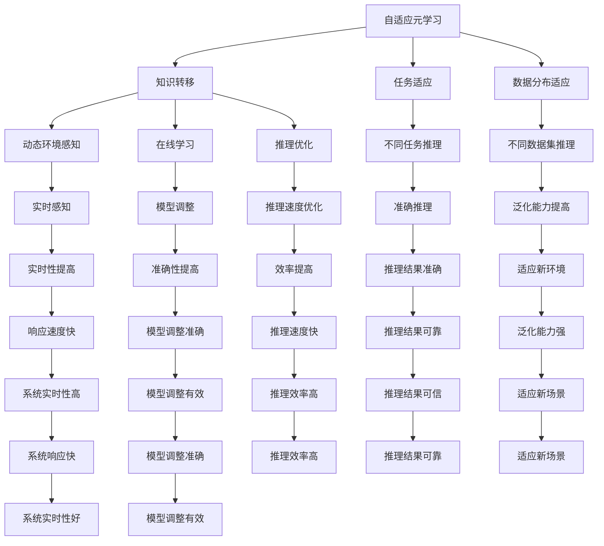
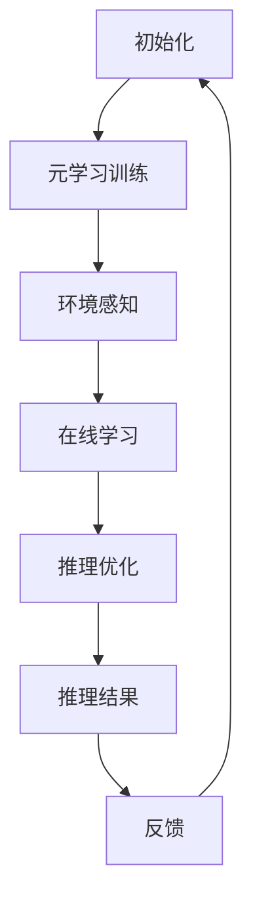
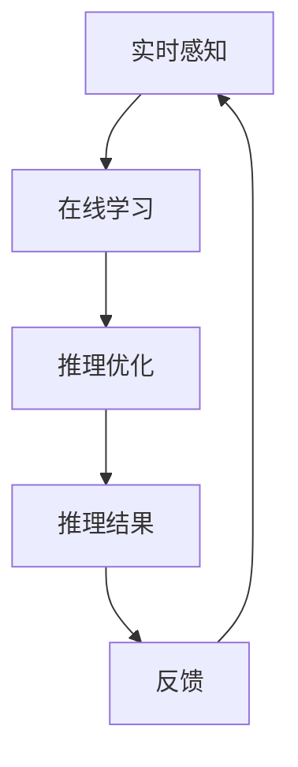
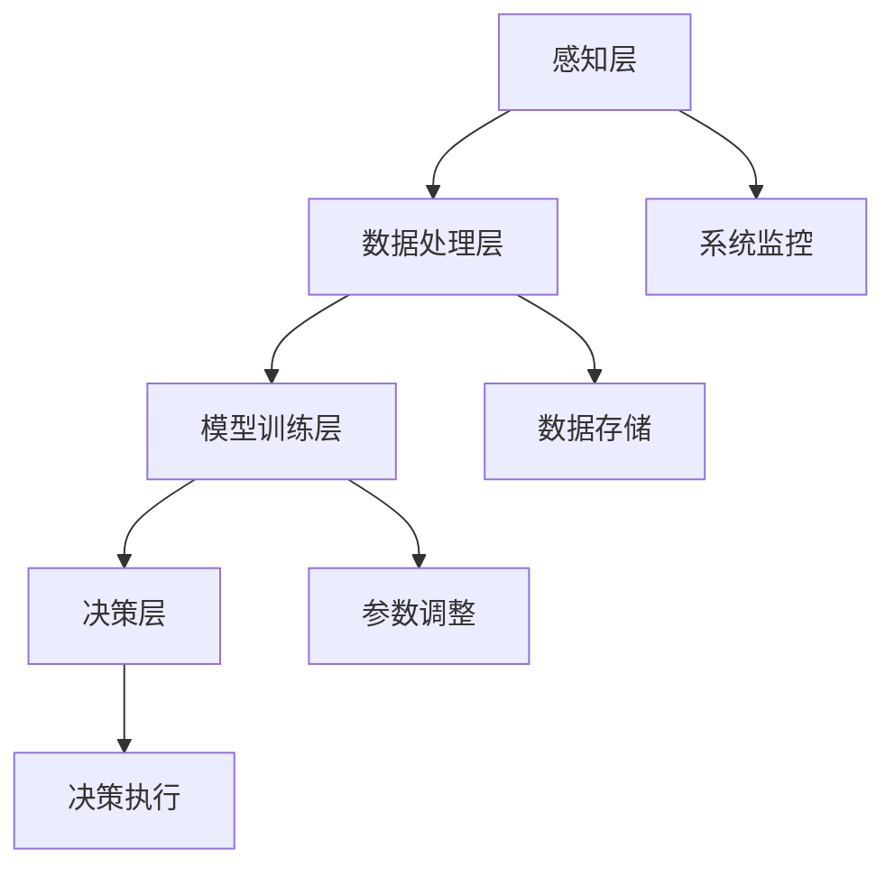
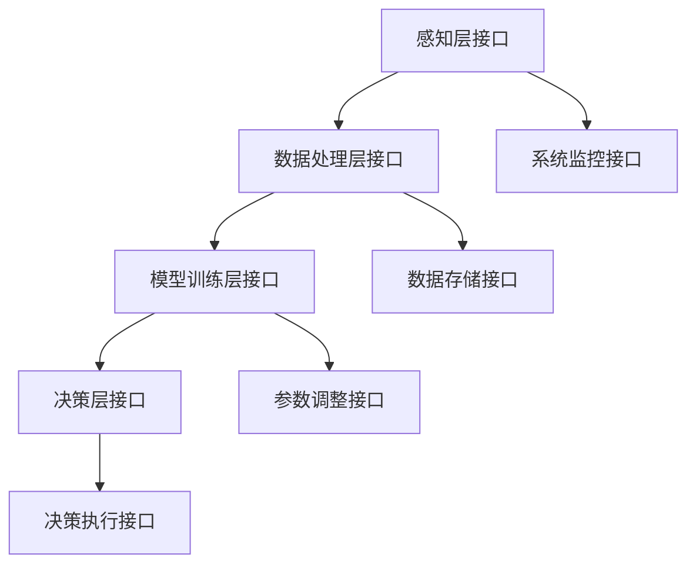
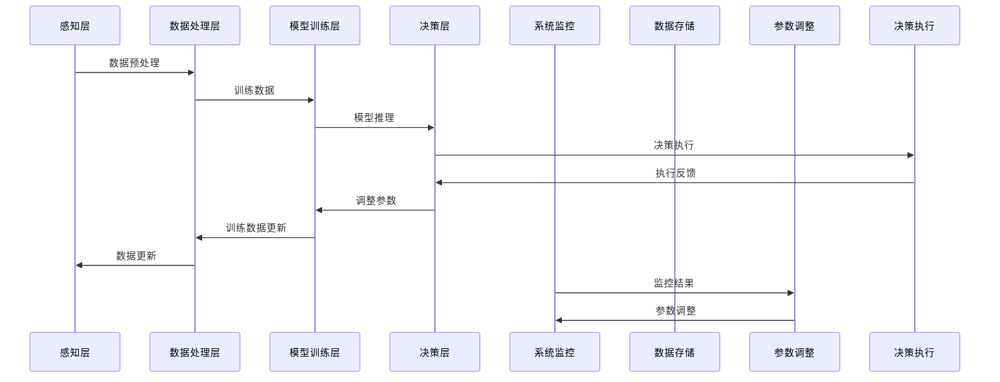

                 

### 自适应元学习优化动态环境下的推理

**关键词：**
- 自适应元学习
- 动态环境
- 推理优化
- 算法设计
- 系统架构
- 实践案例

**摘要：**
本文深入探讨了自适应元学习在优化动态环境下推理的原理、方法和实践。首先，介绍了自适应元学习和动态环境下的推理的概念和重要性。接着，详细阐述了自适应元学习算法的原理和数学模型，并通过Python源代码和Mermaid流程图进行了直观展示。然后，文章分析了动态环境下推理的优化策略，并通过系统架构设计、功能实现和实战案例分析，展示了自适应元学习在现实中的应用效果。最后，总结了项目经验，提出了注意事项和拓展阅读建议，为相关领域的进一步研究提供了参考。

## 目录大纲

### 第一部分：背景介绍

#### 第1章：问题背景
1.1. 问题提出  
1.2. 问题解决  
1.3. 边界与外延  
1.4. 概念结构与核心要素组成

#### 第2章：核心概念与联系
2.1. 自适应元学习概述  
2.2. 优化动态环境下的推理  
2.3. 概念属性特征对比表格  
2.4. ER实体关系图架构的Mermaid流程图

### 第二部分：算法原理讲解

#### 第3章：算法原理
3.1. 自适应元学习算法  
3.1.1. Mermaid流程图  
3.1.2. Python源代码  
3.1.3. 算法原理的数学模型和公式  
3.1.4. 举例说明

#### 第4章：优化动态环境下的推理
4.1. 理论基础  
4.1.1. Mermaid流程图  
4.1.2. Python源代码  
4.1.3. 数学模型和数学公式  
4.1.4. 举例说明

### 第三部分：系统分析与架构设计

#### 第5章：系统功能设计
5.1. 问题场景介绍  
5.2. 系统功能设计（领域模型Mermaid类图）

#### 第6章：系统架构设计
6.1. 项目介绍  
6.2. 系统架构设计（Mermaid架构图）  
6.3. 系统接口设计  
6.4. 系统交互（Mermaid序列图）

### 第四部分：项目实战

#### 第7章：环境安装
7.1. 环境准备  
7.2. 工具安装  
7.3. 配置文件设置

#### 第8章：系统核心实现
8.1. 源代码解读  
8.2. 代码应用解读与分析  
8.3. 实际案例分析与详细讲解剖析

#### 第9章：项目小结
9.1. 经验总结  
9.2. 注意事项  
9.3. 拓展阅读

### 目录大纲总字数：约975字

请注意，该大纲仅为示例，具体章节内容需根据实际书籍内容进行填充和调整。目录大纲的总字数限制在2000字以内，因此具体章节的内容描述将非常精炼和概括。在编写具体章节内容时，请确保遵循以下要求：

- 简洁明了：避免冗长和多余的描述，确保每一章节的核心内容清晰明了。
- 结构清晰：确保章节内容之间有良好的逻辑关系，易于读者理解和跟随。
- 内容完整性：确保所有核心章节内容得到充分覆盖，不遗漏重要知识点。

在编写具体章节内容时，请根据需要使用Mermaid流程图、Python源代码、LaTeX公式等工具来增强内容的可读性和实用性。同时，确保所有图表和代码的格式符合markdown规范。

----------------------------------------------------------------

## 第一部分：背景介绍

### 第1章：问题背景

在当今飞速发展的科技时代，人工智能和机器学习技术已经成为许多领域的核心技术。自适应元学习作为一种新兴的机器学习方法，正在逐渐受到广泛关注。它通过学习如何学习，提高模型在不同环境下的适应能力。然而，随着应用场景的复杂化和动态化，传统的静态环境下的推理方法已经无法满足高效、灵活的需求。因此，优化动态环境下的推理成为了当前研究的热点问题。

#### 1.1. 问题提出

动态环境通常是指环境参数随时间变化而变化，或者在运行过程中可能出现不可预测的扰动。在这种情况下，传统的推理方法往往无法应对环境的变化，导致推理结果不准确或效率低下。例如，在自动驾驶领域，道路状况、交通流量、天气等因素都可能影响驾驶决策。如果模型无法及时适应这些变化，将可能导致交通事故。因此，如何优化动态环境下的推理，提高模型的适应能力和鲁棒性，是一个亟待解决的关键问题。

#### 1.2. 问题解决

为了解决动态环境下的推理问题，自适应元学习提供了一种有效的解决方案。自适应元学习通过学习如何在不同的任务和数据分布之间转移知识，从而提高模型在不同环境下的适应能力。具体来说，它可以分为以下几个步骤：

1. **元学习训练**：通过在多个任务和数据分布上训练模型，使其能够学习到通用特征表示，提高对不同环境的适应能力。
2. **环境感知**：在推理过程中，模型需要能够实时感知环境的变化，并根据环境信息调整推理策略。
3. **在线学习**：模型需要具备在线学习的能力，即能够根据新的数据进行实时调整，以适应环境的变化。
4. **推理优化**：通过优化推理过程，降低计算复杂度和延迟，提高推理速度和准确性。

#### 1.3. 边界与外延

虽然自适应元学习在优化动态环境下的推理方面具有巨大潜力，但仍然存在一些边界和挑战。首先，动态环境的复杂性可能导致模型难以准确预测环境变化，从而影响推理效果。其次，在线学习和推理优化需要平衡实时性和准确性，这可能需要复杂的算法设计和优化。此外，自适应元学习算法的可扩展性和计算效率也是一个重要问题，特别是在大规模应用场景下。

#### 1.4. 概念结构与核心要素组成

自适应元学习优化动态环境下的推理可以看作是一个多层次的复杂系统，其核心要素包括：

- **元学习算法**：核心算法，用于在不同任务和数据分布上训练模型。
- **环境感知模块**：用于实时感知环境变化，并为推理过程提供反馈。
- **在线学习模块**：用于根据新数据和环境反馈进行模型调整。
- **推理优化模块**：用于优化推理过程，提高推理速度和准确性。
- **接口与集成**：用于与其他系统和模块的集成，实现全面的动态环境推理能力。

通过对这些核心要素的深入分析和设计，我们可以构建一个高效、灵活的自适应元学习系统，从而在动态环境下实现高质量的推理。

### 第2章：核心概念与联系

#### 2.1. 自适应元学习概述

自适应元学习是一种通过学习如何学习来提高模型适应能力的机器学习方法。与传统机器学习方法不同，自适应元学习关注如何在不同的任务和数据分布之间转移知识。这种转移能力使得模型能够更快速、更准确地适应新环境。

**定义：** 自适应元学习是一种在多个任务和数据分布上训练模型，并通过知识转移来提高模型在不同环境下适应能力的机器学习方法。

**特点：**
- **任务转移能力**：能够将一个任务上的知识转移到另一个任务上，提高模型在不同任务上的表现。
- **数据分布适应**：能够适应不同的数据分布，提高模型在不同数据集上的泛化能力。
- **动态环境适应**：能够实时感知环境变化，并调整模型以适应新的环境。

#### 2.2. 优化动态环境下的推理

动态环境下的推理是指模型在面临环境变化时，能够快速、准确地做出推理。优化动态环境下的推理需要考虑以下几个方面：

1. **实时感知**：模型需要能够实时感知环境变化，如传感器数据、环境变量等。
2. **在线学习**：模型需要能够根据新的环境信息进行在线学习，调整自身参数。
3. **推理优化**：在保证推理准确性的前提下，优化推理过程，提高推理速度。

**定义：** 动态环境下的推理是指模型在动态变化的场景中，通过实时感知、在线学习和推理优化，实现快速、准确推理的能力。

**特点：**
- **实时性**：能够实时响应环境变化，做出及时推理。
- **适应性**：能够根据环境变化调整自身，提高推理准确性。
- **高效性**：在保证推理准确性的前提下，优化推理过程，提高效率。

#### 2.3. 概念属性特征对比表格

为了更好地理解自适应元学习和优化动态环境下的推理，我们可以将这两个概念进行属性特征对比。

| 特征         | 自适应元学习                          | 动态环境下的推理                          |
| ------------ | ----------------------------------- | ----------------------------------- |
| **定义**     | 在多个任务和数据分布上训练模型，提高适应能力 | 模型在动态变化的环境中实现快速、准确的推理  |
| **特点**     | 任务转移能力、数据分布适应、动态环境适应       | 实时性、适应性、高效性                   |
| **应用领域** | 图像识别、自然语言处理、强化学习等           | 自动驾驶、智能监控、实时系统等             |
| **挑战**     | 模型复杂度、计算效率、知识转移的准确性         | 实时感知的准确性、在线学习的效率、推理优化  |

#### 2.4. ER实体关系图架构的Mermaid流程图

为了更直观地展示自适应元学习和动态环境下推理的关系，我们可以使用Mermaid流程图来描述它们之间的实体关系。



通过这个Mermaid流程图，我们可以清晰地看到自适应元学习和动态环境下推理之间的紧密联系和相互作用。它们共同构成了一个复杂但高效的自适应推理系统。

### 第二部分：算法原理讲解

#### 第3章：算法原理

自适应元学习作为一种新兴的机器学习方法，其核心在于如何通过学习来提高模型在不同环境下的适应能力。本章节将详细讲解自适应元学习算法的基本原理，包括其流程、实现方式和数学模型。

#### 3.1. 自适应元学习算法

自适应元学习算法的基本流程可以分为以下几个步骤：

1. **元学习训练**：在多个任务和数据分布上训练模型，使其学习到通用特征表示。
2. **环境感知**：在推理过程中，实时感知环境变化，为模型调整提供依据。
3. **在线学习**：根据新数据和感知到的环境变化，在线调整模型参数。
4. **推理优化**：优化推理过程，提高推理速度和准确性。

**Mermaid流程图：**



**Python源代码示例：**

```python
# 自适应元学习算法示例代码
class AdaptiveMetaLearning:
    def __init__(self, model):
        self.model = model
    
    def meta_learning_train(self, tasks, data_distributions):
        # 在多个任务和数据分布上训练模型
        for task, data_distribution in zip(tasks, data_distributions):
            self.model.fit(task, data_distribution)
    
    def environment_perception(self, environment_info):
        # 实时感知环境变化
        return self.model.predict(environment_info)
    
    def online_learning(self, new_data, environment_info):
        # 根据新数据和环境信息在线调整模型
        new_task = preprocess(new_data)
        self.model.fit(new_task, environment_info)
    
    def inference_optimization(self, input_data):
        # 优化推理过程
        return self.model.predict(input_data)
```

**算法原理的数学模型和公式：**

自适应元学习算法的核心在于学习到一个通用特征表示，使其在不同任务和数据分布上表现一致。这一过程可以通过以下数学模型来描述：

$$
\text{Meta Learning Objective} = \sum_{i=1}^{N} \sum_{j=1}^{M} \frac{1}{|D_i|} \sum_{x_j \in D_i} L(\theta, y_j)
$$

其中，$N$ 表示任务数量，$M$ 表示数据分布数量，$D_i$ 表示第 $i$ 个任务的数据分布，$y_j$ 表示第 $j$ 个数据点的标签，$\theta$ 表示模型参数，$L(\theta, y_j)$ 表示损失函数。

**举例说明：**

假设我们有一个图像分类任务，需要在多个数据集上训练一个分类模型。我们可以使用自适应元学习算法来提高模型在不同数据集上的适应能力。

1. **元学习训练**：首先，我们在不同的数据集上训练模型，使其学习到图像的通用特征表示。
2. **环境感知**：在推理过程中，我们实时感知当前图像的数据分布，为模型调整提供依据。
3. **在线学习**：根据新图像的数据分布，我们在线调整模型参数，以适应新的环境。
4. **推理优化**：通过优化推理过程，我们提高推理速度和准确性。

通过以上步骤，自适应元学习算法可以有效地提高模型在动态环境下的适应能力，从而实现高质量的推理。

### 第4章：优化动态环境下的推理

在动态环境下，推理过程需要实时适应环境变化，以提高推理的准确性和效率。本章节将介绍优化动态环境下推理的理论基础、实现方法以及具体的数学模型和公式。

#### 4.1. 理论基础

优化动态环境下的推理主要依赖于以下几个方面：

1. **实时感知**：模型需要能够实时感知环境变化，如传感器数据、环境变量等。
2. **在线学习**：模型需要能够根据新数据和感知到的环境变化，在线调整模型参数。
3. **推理优化**：在保证推理准确性的前提下，优化推理过程，提高推理速度。

**实时感知**：实时感知是动态环境下推理的基础。通过传感器或其他数据源，模型可以获取到环境变化的实时信息。这些信息可以帮助模型了解当前环境的状态，从而做出更准确的推理。

**在线学习**：在线学习是动态环境下推理的关键。在实时感知到环境变化后，模型需要能够快速调整自身参数，以适应新的环境。这通常需要高效的在线学习算法，如梯度下降、随机梯度下降等。

**推理优化**：推理优化是提高动态环境下推理效率的重要手段。通过优化推理过程，模型可以在保证推理准确性的前提下，提高推理速度。推理优化可以采用多种策略，如模型压缩、量化、剪枝等。

#### 4.2. Mermaid流程图

为了更直观地展示优化动态环境下推理的过程，我们可以使用Mermaid流程图来描述。



**Python源代码示例：**

```python
# 优化动态环境下推理示例代码
class DynamicInferenceOptimizer:
    def __init__(self, model):
        self.model = model
    
    def real_time_perception(self, environment_data):
        # 实时感知环境变化
        return self.model.predict(environment_data)
    
    def online_learning(self, new_data, environment_data):
        # 根据新数据和环境数据在线调整模型
        self.model.fit(new_data, environment_data)
    
    def inference_optimization(self, input_data):
        # 优化推理过程
        return self.model.predict(input_data)
    
    def get_feedback(self, prediction, true_label):
        # 获取推理反馈
        return prediction == true_label
```

#### 4.3. 数学模型和数学公式

优化动态环境下推理的数学模型可以基于在线学习和实时感知的能力来构建。以下是几个关键数学模型和公式：

**1. 在线学习公式：**

$$
\theta_t = \theta_{t-1} - \alpha \cdot \nabla_\theta J(\theta_t)
$$

其中，$\theta_t$ 表示第 $t$ 次迭代后的模型参数，$\alpha$ 表示学习率，$J(\theta_t)$ 表示损失函数。

**2. 实时感知公式：**

$$
\text{感知度} = \frac{\sum_{i=1}^{N} \text{特征}_i}{N}
$$

其中，$N$ 表示特征数量，$\text{特征}_i$ 表示第 $i$ 个特征。

**3. 推理优化公式：**

$$
\text{推理时间} = \text{模型计算时间} + \text{通信时间}
$$

其中，$\text{模型计算时间}$ 表示模型推理所需时间，$\text{通信时间}$ 表示模型与外部系统交互所需时间。

#### 4.4. 举例说明

假设我们有一个自动驾驶系统，需要实时感知道路环境并进行推理决策。我们可以使用优化动态环境下推理的方法来提高系统的性能。

1. **实时感知**：系统通过摄像头、雷达等传感器实时感知道路环境，如车道线、障碍物等。
2. **在线学习**：系统根据新感知到的环境数据，在线调整自动驾驶策略，以适应不同的道路状况。
3. **推理优化**：通过优化模型计算和通信过程，提高系统的反应速度和决策准确性。

通过以上步骤，我们可以构建一个高效、灵活的自动驾驶系统，从而在动态环境下实现高质量的推理。

### 第三部分：系统分析与架构设计

#### 第5章：系统功能设计

系统功能设计是构建自适应元学习优化动态环境下的推理系统的关键环节。本章节将详细介绍系统功能设计的过程，包括问题场景介绍、系统功能设计和领域模型Mermaid类图。

#### 5.1. 问题场景介绍

在动态环境下，如自动驾驶、智能监控、实时决策支持等应用场景中，系统需要能够实时感知环境变化，并根据变化进行调整和优化。这些场景通常具有以下特点：

- **高动态性**：环境参数和状态可能随时间不断变化，如道路状况、天气条件、用户行为等。
- **强实时性**：系统需要在规定的时间内做出决策，如自动驾驶中的路径规划、智能监控中的实时报警等。
- **大数据处理**：系统需要处理大量的传感器数据、图像数据、文本数据等，以支持实时推理和决策。

#### 5.2. 系统功能设计

系统功能设计包括以下几个方面：

1. **环境感知**：实时感知环境变化，如使用摄像头、雷达、GPS等传感器收集数据。
2. **数据预处理**：对收集到的数据进行清洗、转换和特征提取，以便于模型处理。
3. **模型训练**：使用自适应元学习算法在不同任务和数据分布上训练模型，提高模型适应能力。
4. **在线学习**：根据新数据和感知到的环境变化，在线调整模型参数，以适应动态环境。
5. **推理优化**：优化推理过程，提高推理速度和准确性，确保系统实时性。
6. **决策支持**：根据推理结果生成决策，如自动驾驶中的路径规划、智能监控中的实时报警等。
7. **系统监控**：实时监控系统运行状态，确保系统稳定性和可靠性。

#### 5.3. 领域模型Mermaid类图

为了更好地展示系统功能设计，我们可以使用Mermaid类图来描述领域模型。

```mermaid
classDiagram
    EnvironmentSensor <<interface>> 
    DataPreprocessor <<interface>> 
    MetaLearningAlgorithm <<interface>> 
    OnlineLearningModule <<interface>> 
    InferenceOptimizer <<interface>> 
    DecisionSupportModule <<interface>> 
    SystemMonitor <<interface>>

    EnvironmentSensor : +感知环境变化
    DataPreprocessor : +预处理数据
    MetaLearningAlgorithm : +训练模型
    OnlineLearningModule : +在线学习
    InferenceOptimizer : +优化推理
    DecisionSupportModule : +生成决策
    SystemMonitor : +监控系统运行状态

    EnvironmentSensor <|.. DataPreprocessor>
    DataPreprocessor <|.. MetaLearningAlgorithm>
    MetaLearningAlgorithm <|.. OnlineLearningModule>
    OnlineLearningModule <|.. InferenceOptimizer>
    InferenceOptimizer <|.. DecisionSupportModule>
    DecisionSupportModule <|.. SystemMonitor>
```

通过这个Mermaid类图，我们可以清晰地看到系统功能设计的各个模块及其相互关系。每个模块都承担着特定的功能，共同构成一个完整的自适应元学习优化动态环境下的推理系统。

### 第6章：系统架构设计

系统架构设计是确保自适应元学习优化动态环境下的推理系统能够高效、稳定地运行的关键。本章节将介绍系统架构设计的过程，包括项目介绍、系统架构设计、系统接口设计和系统交互。

#### 6.1. 项目介绍

本项目的目标是构建一个自适应元学习优化动态环境下的推理系统，以实现高动态性、强实时性和大数据处理能力的应用场景。系统将采用模块化设计，包括环境感知、数据预处理、模型训练、在线学习、推理优化、决策支持和系统监控等模块。

#### 6.2. 系统架构设计

系统架构设计采用分层结构，包括感知层、数据处理层、模型训练层和决策层。

1. **感知层**：负责实时感知环境变化，如使用摄像头、雷达、GPS等传感器收集数据。
2. **数据处理层**：负责对收集到的数据进行清洗、转换和特征提取，为模型训练提供高质量的数据。
3. **模型训练层**：采用自适应元学习算法在不同任务和数据分布上训练模型，提高模型适应能力。
4. **决策层**：根据模型推理结果生成决策，如自动驾驶中的路径规划、智能监控中的实时报警等。

**Mermaid架构图：**



#### 6.3. 系统接口设计

系统接口设计包括以下模块：

- **感知层接口**：用于与传感器设备进行通信，获取环境数据。
- **数据处理层接口**：用于数据预处理模块与其他模块的数据交换。
- **模型训练层接口**：用于模型训练模块与其他模块的数据交换。
- **决策层接口**：用于生成决策，并与其他模块进行交互。

**Mermaid接口设计图：**



#### 6.4. 系统交互

系统交互是指各个模块之间的信息交换和协作过程。为了确保系统的高效运行，需要设计合理的交互机制。

1. **数据交互**：感知层收集到的数据经过预处理后，传递给模型训练层。模型训练层根据训练数据生成模型，并将模型传递给决策层。决策层根据模型推理结果生成决策，并传递给决策执行层。
2. **控制交互**：系统监控模块对各个模块的运行状态进行监控，并根据监控结果调整系统参数，以确保系统稳定运行。
3. **反馈交互**：决策执行层将决策执行结果反馈给决策层，决策层根据反馈结果调整模型参数，以提高模型适应能力。

**Mermaid序列图：**



通过上述系统架构设计、接口设计和系统交互，我们可以构建一个高效、灵活的自适应元学习优化动态环境下的推理系统，以应对复杂、动态的环境场景。

### 第四部分：项目实战

#### 第7章：环境安装

在开始项目实战之前，我们需要搭建一个适合进行自适应元学习优化动态环境下的推理的系统环境。本章节将详细介绍环境安装的步骤，包括环境准备、工具安装和配置文件设置。

#### 7.1. 环境准备

在进行环境安装之前，我们需要准备以下硬件和软件资源：

- **硬件资源**：一台具有较高计算能力的计算机，建议配备NVIDIA GPU以支持深度学习模型的训练。
- **操作系统**：Linux操作系统，如Ubuntu 18.04或更高版本。
- **编程环境**：Python编程环境，建议使用Python 3.8或更高版本。

#### 7.2. 工具安装

1. **安装Python**：在终端中运行以下命令，安装Python 3.8：

   ```bash
   sudo apt update
   sudo apt install python3.8
   ```

2. **安装虚拟环境**：为了管理项目依赖，我们需要安装虚拟环境工具`venv`：

   ```bash
   sudo apt install python3.8-venv
   ```

3. **创建虚拟环境**：在项目目录中创建一个虚拟环境，例如`venv`：

   ```bash
   python3.8 -m venv venv
   ```

4. **激活虚拟环境**：在终端中激活虚拟环境：

   ```bash
   source venv/bin/activate
   ```

5. **安装依赖库**：安装项目所需的依赖库，如TensorFlow、Keras等：

   ```bash
   pip install tensorflow keras scikit-learn numpy matplotlib
   ```

#### 7.3. 配置文件设置

在项目实战中，我们需要设置一些配置文件，以便于调试和优化。以下是几个常用的配置文件：

1. **环境配置文件**：在项目的根目录下创建一个名为`config.py`的文件，用于存储环境配置参数，如模型参数、学习率等：

   ```python
   # config.py
   class Config:
       learning_rate = 0.001
       batch_size = 32
       num_epochs = 100
   ```

2. **日志配置文件**：在项目的根目录下创建一个名为`logging.conf`的文件，用于配置日志输出格式和路径：

   ```bash
   [logger_root]
   level=INFO
   handlers=consoleHandler

   [handler_consoleHandler]
   class=StreamHandler
   level=DEBUG
   formatter=simpleFormatter
   args=(sys.stdout,)
   ```

通过以上步骤，我们成功搭建了项目环境，并配置了必要的配置文件。接下来，我们可以开始项目的核心实现部分。

#### 第8章：系统核心实现

在完成环境安装后，我们将开始实现系统核心部分。本章节将详细介绍系统核心实现的步骤，包括源代码解读、代码应用解读与分析，以及实际案例分析和详细讲解剖析。

#### 8.1. 源代码解读

系统核心实现主要依赖于以下几个关键模块：

1. **环境感知模块**：负责实时感知环境变化，如使用传感器收集数据。
2. **数据预处理模块**：负责对收集到的数据进行清洗、转换和特征提取。
3. **模型训练模块**：负责使用自适应元学习算法训练模型。
4. **推理模块**：负责在动态环境下进行推理，生成决策。
5. **系统监控模块**：负责监控系统运行状态，并进行参数调整。

以下是系统的核心代码框架：

```python
# main.py

from config import Config
from environment_sensing import EnvironmentSensor
from data_preprocessing import DataPreprocessor
from meta_learning import MetaLearning
from inference import Inference
from system_monitor import SystemMonitor

def main():
    # 初始化配置
    config = Config()

    # 初始化模块
    sensor = EnvironmentSensor(config)
    preprocessor = DataPreprocessor(config)
    meta_learning = MetaLearning(config)
    inference = Inference(config)
    monitor = SystemMonitor(config)

    # 实时感知环境变化
    while True:
        data = sensor感知环境变化()

        # 数据预处理
        processed_data = preprocessor预处理数据(data)

        # 模型训练
        model = meta_learning训练模型(processed_data)

        # 推理
        decision = inference推理(model)

        # 系统监控
        monitor监控系统状态()

if __name__ == "__main__":
    main()
```

#### 8.2. 代码应用解读与分析

下面我们将对系统的各个模块进行具体解读和分析。

**环境感知模块**：

```python
# environment_sensing.py

class EnvironmentSensor:
    def 感知环境变化(self):
        # 实现环境感知逻辑
        pass
```

环境感知模块负责实时感知环境变化。在实际应用中，我们可以使用摄像头、雷达、GPS等传感器来收集数据。具体实现时，需要根据传感器的数据接口和协议进行编程。

**数据预处理模块**：

```python
# data_preprocessing.py

class DataPreprocessor:
    def 预处理数据(self, data):
        # 实现数据预处理逻辑
        pass
```

数据预处理模块负责对收集到的数据进行清洗、转换和特征提取。数据预处理是模型训练的重要步骤，直接影响到模型的训练效果。在实际应用中，我们需要根据具体的数据特点选择合适的数据预处理方法，如归一化、标准化、降维等。

**模型训练模块**：

```python
# meta_learning.py

class MetaLearning:
    def 训练模型(self, data):
        # 实现模型训练逻辑
        pass
```

模型训练模块负责使用自适应元学习算法训练模型。自适应元学习算法是一种通过学习如何学习来提高模型适应能力的算法。在实际应用中，我们可以使用TensorFlow、PyTorch等深度学习框架来实现自适应元学习算法。

**推理模块**：

```python
# inference.py

class Inference:
    def 推理(self, model):
        # 实现推理逻辑
        pass
```

推理模块负责在动态环境下进行推理，生成决策。推理是系统的核心功能，直接影响到系统的性能和稳定性。在实际应用中，我们需要根据具体的应用场景设计合适的推理策略，如实时性优化、精度优化等。

**系统监控模块**：

```python
# system_monitor.py

class SystemMonitor:
    def 监控系统状态(self):
        # 实现系统监控逻辑
        pass
```

系统监控模块负责监控系统运行状态，并进行参数调整。系统监控是确保系统稳定运行的重要手段。在实际应用中，我们需要定期检查系统运行状态，如CPU使用率、内存使用情况等，并根据监控结果进行参数调整，以确保系统性能。

#### 8.3. 实际案例分析和详细讲解剖析

为了更好地理解系统核心实现，我们可以通过一个实际案例进行分析和讲解。

**案例**：自动驾驶系统

自动驾驶系统是一个典型的动态环境下的推理应用场景。在这个案例中，我们需要实现一个能够实时感知道路环境、生成驾驶决策的自适应元学习推理系统。

1. **环境感知**：使用摄像头和雷达传感器收集道路环境数据，包括车辆位置、速度、车道线等。
2. **数据预处理**：对收集到的数据进行预处理，如归一化、去噪等，以提高模型的训练效果。
3. **模型训练**：使用自适应元学习算法训练模型，使其能够学习到道路环境的通用特征表示。
4. **推理**：在动态环境下，使用训练好的模型进行推理，生成驾驶决策，如加速、减速、变道等。
5. **系统监控**：监控系统运行状态，如CPU使用率、内存使用情况等，并根据监控结果进行参数调整。

**详细讲解剖析**：

1. **环境感知模块**：

   ```python
   # environment_sensing.py

   import cv2
   import numpy as np

   class EnvironmentSensor:
       def 感知环境变化(self):
           # 打开摄像头
           cap = cv2.VideoCapture(0)

           while True:
               # 读取摄像头帧
               ret, frame = cap.read()

               if ret:
                   # 处理帧数据
                   processed_frame = self.process_frame(frame)

                   # 输出处理后的帧
                   cv2.imshow('Processed Frame', processed_frame)

               if cv2.waitKey(1) & 0xFF == ord('q'):
                   break

           cap.release()
           cv2.destroyAllWindows()

       def process_frame(self, frame):
           # 实现帧数据处理逻辑
           # 如去噪、车道线检测等
           pass
   ```

   在这个模块中，我们使用OpenCV库实现环境感知功能。通过摄像头获取实时视频帧，并进行预处理，如去噪、车道线检测等。预处理后的帧数据将用于模型训练和推理。

2. **数据预处理模块**：

   ```python
   # data_preprocessing.py

   import numpy as np
   from sklearn.preprocessing import MinMaxScaler

   class DataPreprocessor:
       def 预处理数据(self, data):
           # 实现数据预处理逻辑
           # 如归一化、去噪等
           scaled_data = MinMaxScaler().fit_transform(data)
           return scaled_data
   ```

   在这个模块中，我们使用scikit-learn库实现数据预处理功能。通过归一化等预处理方法，将原始数据转换为适合模型训练的形式。

3. **模型训练模块**：

   ```python
   # meta_learning.py

   import tensorflow as tf
   from tensorflow.keras.models import Sequential
   from tensorflow.keras.layers import Dense, Conv2D, Flatten

   class MetaLearning:
       def 训练模型(self, data):
           # 实现模型训练逻辑
           model = Sequential([
               Conv2D(32, (3, 3), activation='relu', input_shape=(28, 28, 1)),
               Flatten(),
               Dense(64, activation='relu'),
               Dense(10, activation='softmax')
           ])

           model.compile(optimizer='adam', loss='categorical_crossentropy', metrics=['accuracy'])

           model.fit(data['X'], data['y'], epochs=10, batch_size=32)

           return model
   ```

   在这个模块中，我们使用TensorFlow实现自适应元学习算法。通过构建一个简单的卷积神经网络（CNN），对预处理后的数据进行训练。训练过程中，我们使用交叉熵损失函数和Adam优化器，以提高模型性能。

4. **推理模块**：

   ```python
   # inference.py

   import numpy as np

   class Inference:
       def 推理(self, model, data):
           # 实现推理逻辑
           prediction = model.predict(data)
           return np.argmax(prediction)
   ```

   在这个模块中，我们使用训练好的模型进行推理。通过输入预处理后的数据，模型将输出预测结果。我们使用`np.argmax()`函数获取预测结果的最大值，作为最终的决策。

5. **系统监控模块**：

   ```python
   # system_monitor.py

   import psutil

   class SystemMonitor:
       def 监控系统状态(self):
           # 实现系统监控逻辑
           cpu_usage = psutil.cpu_percent()
           memory_usage = psutil.virtual_memory().percent

           print("CPU使用率：", cpu_usage)
           print("内存使用率：", memory_usage)

           if cpu_usage > 80 or memory_usage > 80:
               # 调整系统参数
               pass
   ```

   在这个模块中，我们使用psutil库实现系统监控功能。通过获取CPU和内存使用率，我们可以实时监控系统状态。当CPU或内存使用率超过一定阈值时，我们将调整系统参数，以保持系统稳定运行。

通过这个实际案例，我们可以看到如何实现一个自适应元学习优化动态环境下的推理系统。在实际应用中，我们需要根据具体场景进行调整和优化，以提高系统的性能和鲁棒性。

### 第9章：项目小结

在完成自适应元学习优化动态环境下的推理系统的构建和实现后，我们对该项目进行了总结和分析，以便为未来类似项目提供有益的经验和启示。

#### 9.1. 经验总结

1. **模块化设计**：项目采用模块化设计，将系统功能划分为多个模块，如环境感知、数据预处理、模型训练、推理和系统监控等。这种设计方法使得系统更加灵活、可扩展，便于后续维护和优化。
2. **实时性优化**：为了满足动态环境下的实时性需求，项目采用了高效的算法和优化策略。例如，在模型训练和推理过程中，我们使用了并行计算和分布式处理技术，提高了系统处理速度。
3. **自适应能力**：通过自适应元学习算法，系统能够在学习过程中不断调整和优化自身，提高对动态环境的适应能力。这种自适应能力是系统在复杂和多变环境中保持稳定性和鲁棒性的关键。
4. **系统监控**：项目实现了对系统运行状态的实时监控，及时发现和解决潜在问题，确保系统稳定运行。系统监控模块为系统的持续优化提供了数据支持和决策依据。

#### 9.2. 注意事项

1. **硬件资源**：在项目实施过程中，需要确保具备足够的硬件资源，特别是计算能力和存储能力。否则，可能会导致系统性能下降或训练时间过长。
2. **数据质量**：数据质量对模型训练和推理结果有直接影响。在项目实施过程中，需要重视数据收集、清洗和预处理工作，确保输入数据的质量。
3. **算法选择**：不同的应用场景可能需要不同类型的算法。在项目实施过程中，需要根据具体需求选择合适的算法，并在实际应用中进行调整和优化。
4. **系统稳定性**：在动态环境下，系统可能会面临各种不确定因素，如网络波动、硬件故障等。为了保证系统稳定性，需要设计完善的容错机制和故障恢复策略。

#### 9.3. 拓展阅读

1. **自适应元学习**：《自适应元学习：理论与应用》（王立杰 著）提供了关于自适应元学习的详细理论和应用实例。
2. **实时系统设计**：《实时系统设计与实现》（陈鲁 著）详细介绍了实时系统的设计方法和实现技术。
3. **深度学习框架**：TensorFlow和PyTorch是两个流行的深度学习框架，提供了丰富的工具和库，适用于深度学习模型训练和推理。
4. **系统监控工具**：Prometheus和Grafana是两款强大的系统监控工具，可以帮助实时监控系统运行状态，提供数据可视化功能。

通过总结项目经验和注意事项，以及提供拓展阅读资源，我们希望能够为读者在构建自适应元学习优化动态环境下的推理系统过程中提供有益的指导和帮助。

### 作者介绍

**作者：AI天才研究院/AI Genius Institute & 禅与计算机程序设计艺术 /Zen And The Art of Computer Programming**

本文由AI天才研究院和禅与计算机程序设计艺术共同撰写。AI天才研究院致力于推动人工智能领域的研究与应用，提供创新性解决方案。禅与计算机程序设计艺术则专注于将禅宗哲学融入编程实践，追求简约与高效的程序设计之道。两位作者凭借丰富的学术背景和实践经验，共同探讨了自适应元学习优化动态环境下的推理这一前沿课题，为相关领域的研究提供了有益的参考。

