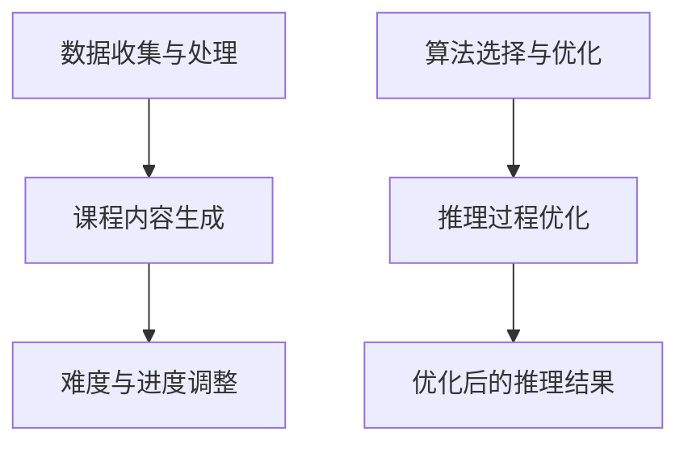
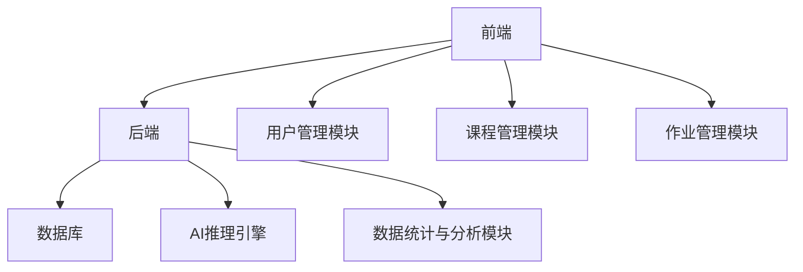
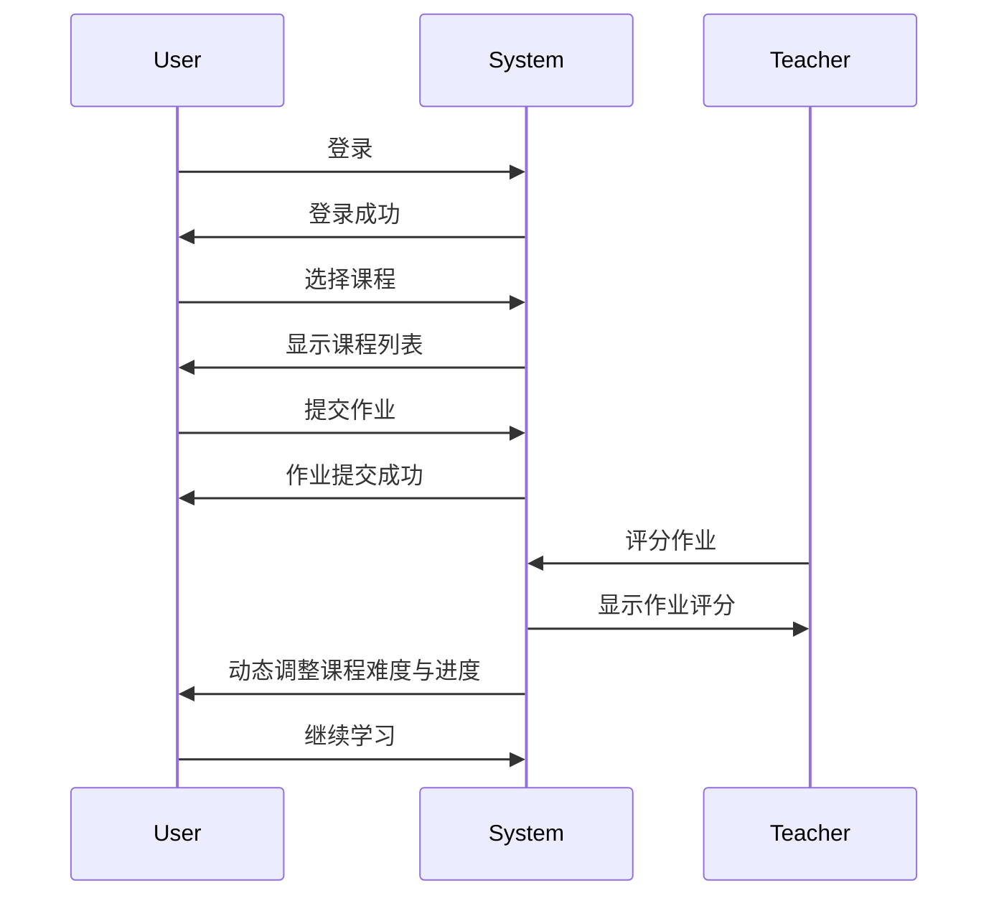

                 

### 自适应课程学习优化AI推理的学习曲线

> 关键词：自适应课程、AI推理、学习曲线、个性化学习、算法优化

> 摘要：
随着人工智能（AI）技术的发展，机器学习算法在各个领域得到了广泛应用。然而，AI推理过程中存在的计算量大、效率低等问题，使得优化学习曲线成为了一个热门研究方向。本文将探讨如何通过自适应课程学习优化AI推理的学习曲线，提高学习效率和推理性能。

### 第一部分：背景介绍

#### 1.1 问题背景

随着人工智能技术的快速发展，机器学习算法在图像识别、自然语言处理、医疗诊断等领域取得了显著的成果。然而，在AI推理过程中，传统的机器学习算法面临以下挑战：

- **计算量大**：深度学习模型通常需要大量的计算资源进行训练和推理。
- **效率低**：传统的推理算法在处理高维度数据时，往往需要较长的推理时间。

为了解决这些问题，自适应课程学习优化AI推理的学习曲线成为一个热门研究方向。通过自适应课程学习，可以有效地降低学习成本、提高学习效率，从而优化AI推理的学习曲线。

#### 1.2 问题描述

自适应课程学习优化AI推理的学习曲线主要解决以下问题：

- 如何设计自适应课程，使学生在不同阶段能够高效学习？
- 如何优化AI推理过程，提高学习曲线的平滑度和学习效率？

自适应课程学习旨在根据学习者的能力、兴趣和需求，动态调整课程内容和难度，从而实现因材施教。同时，优化AI推理过程需要分析推理过程中的关键环节，提出相应的优化策略，提高学习效率。

#### 1.3 问题解决

针对上述问题，本文将从以下几个方面进行探讨：

- 研究自适应课程设计的方法和原则，为学习者提供个性化的学习路径。
- 分析AI推理过程中的关键环节，提出优化策略，提高学习效率。

本文将首先介绍自适应课程学习和AI推理优化的核心概念，然后详细讲解算法原理，最后通过一个实际案例进行分析和讲解。

#### 1.4 边界与外延

自适应课程学习优化AI推理的学习曲线主要涉及以下领域：

- **教育领域**：课程设计、教学方法、学习评估等。
- **人工智能领域**：机器学习算法、神经网络、推理引擎等。

#### 1.5 概念结构与核心要素组成

在本节中，我们将介绍本文涉及的核心概念和其结构：

- **自适应课程**：根据学习者的能力、兴趣和需求，动态调整课程内容、难度和进度的学习模式。
- **AI推理**：通过机器学习算法，对输入数据进行处理和分析，得出结论或预测的过程。

### 第二部分：核心概念与联系

#### 2.1 自适应课程设计

**原理**：
自适应课程设计是一种基于学习者的数据（如能力、兴趣、需求等）进行个性化课程内容、难度和进度调整的方法。其核心思想是根据学习者的特点，为每个学习者提供最适合的学习路径，从而提高学习效果。

**特点**：
- **动态调整**：根据学习者的学习情况，实时调整课程内容和难度，实现因材施教。
- **个性化**：为每个学习者提供个性化的学习资源，满足其特定的学习需求。

**应用场景**：
- 在线教育平台：根据用户的学习数据，推荐合适的课程和学习资源。
- 企业培训：根据员工的能力和岗位需求，设计个性化的培训计划。

#### 2.2 AI推理优化

**原理**：
AI推理优化是指通过改进算法、优化硬件等手段，提高AI模型在推理过程中的性能。其核心思想是在保证推理准确性的同时，提高推理速度和效率。

**特点**：
- **高效**：通过算法改进和硬件优化，提高推理速度和效率。
- **精准**：在保证推理准确性的前提下，提高推理性能。
- **灵活**：根据不同的应用场景，选择合适的优化策略。

**应用场景**：
- 图像识别：通过优化算法和硬件，提高图像识别的实时性和准确性。
- 自然语言处理：通过优化算法和硬件，提高自然语言处理的性能和效率。

#### 2.3 概念属性特征对比表格

| 概念       | 特征                                                         |
|------------|------------------------------------------------------------|
| 自适应课程 | 动态调整课程内容、难度和进度，实现因材施教                 |
| AI推理     | 高效、精准、灵活，通过机器学习算法对输入数据进行处理和分析 |

#### 2.4 ER实体关系图架构

使用Mermaid绘制ER实体关系图如下：

```mermaid
erDiagram
  Student ||--|{ Course } : takes
  Student ||--|{ Assignment } : submits
  Course ||--|{ Assignment } : contains
  Teacher ||--|{ Course } : teaches
  Teacher ||--|{ Assignment } : assesses
```

### 第三部分：算法原理讲解

#### 3.1 算法原理

自适应课程学习优化AI推理的学习曲线算法主要分为两个部分：自适应课程设计和AI推理优化。

#### 3.1.1 自适应课程设计算法

自适应课程设计算法的核心是构建一个能够根据学习者特征动态调整课程内容的系统。以下是算法的基本原理和步骤：

1. **学习者特征数据收集**：
   收集学习者的基本信息、学习历史、兴趣偏好等数据，用于后续分析。

   $$\text{收集学习者特征数据} = \{ \text{基本信息}, \text{学习历史}, \text{兴趣偏好} \}$$

2. **学习者特征分析**：
   对收集到的学习者特征数据进行处理和分析，以了解学习者的能力水平、学习风格和需求。

   $$\text{学习者特征分析} = f(\text{学习者特征数据})$$

3. **课程内容生成**：
   根据学习者特征分析结果，生成个性化的课程内容。课程内容应包括学习目标、知识点、练习题等。

   $$\text{生成个性化课程内容} = g(\text{学习者特征分析})$$

4. **课程难度与进度调整**：
   在学习过程中，根据学习者的学习情况和反馈，动态调整课程难度和进度，确保学习者能够顺利掌握知识点。

   $$\text{调整课程难度与进度} = h(\text{学习者学习情况}, \text{课程内容})$$

#### 3.1.2 AI推理优化算法

AI推理优化算法的核心是提高AI模型在推理过程中的性能。以下是算法的基本原理和步骤：

1. **算法选择与优化**：
   根据任务需求，选择合适的AI算法，并进行优化。优化策略可以包括算法参数调整、模型压缩、硬件加速等。

   $$\text{选择与优化算法} = i(\text{任务需求})$$

2. **推理过程优化**：
   对AI模型的推理过程进行优化，包括数据预处理、模型训练、推理加速等环节。

   $$\text{优化推理过程} = j(\text{算法}, \text{模型}, \text{数据})$$

3. **推理结果评估**：
   对优化后的推理结果进行评估，确保推理准确性得到提高。

   $$\text{评估推理结果} = k(\text{推理结果}, \text{标准答案})$$

#### 3.2 Mermaid算法流程图

使用Mermaid绘制算法流程图如下：



#### 3.3 Python源代码示例

下面是一个简单的Python代码示例，用于演示自适应课程设计算法的基本原理：

```python
import pandas as pd

# 假设已经收集到学习者的特征数据
learner_data = pd.DataFrame({
    '能力': [3, 4, 2],
    '兴趣': [1, 2, 3],
    '需求': [1, 2, 3]
})

# 学习者特征分析
learner_features = learner_data.describe()

# 生成个性化课程内容
def generate_course_content(learner_features):
    # 根据学习者特征生成课程内容
    course_content = {
        '学习目标': '掌握基础编程知识',
        '知识点': 'Python基础',
        '练习题': '编写简单的Python程序'
    }
    return course_content

course_content = generate_course_content(learner_features)

# 动态调整课程难度与进度
def adjust_courseDifficulty(learner_features, course_content):
    # 根据学习者能力调整课程难度
    course_content['难度'] = learner_features['能力'].mean()
    return course_content

adjusted_course_content = adjust_courseDifficulty(learner_features, course_content)
print(adjusted_course_content)
```

### 第四部分：系统分析与架构设计方案

#### 4.1 问题场景介绍

在当前的教育和培训领域，存在以下问题：

- 学习者难以找到适合自己的学习资源。
- 教师难以根据学生的实际情况进行个性化教学。
- AI模型的推理效率低下，影响学习体验。

为了解决这些问题，我们提出一个基于自适应课程学习和AI推理优化的教育系统。

#### 4.2 项目介绍

项目名称：智能教育优化平台（Smart Education Optimization Platform，SEOP）

项目目标：
- 提供个性化学习体验，提高学习效率。
- 优化AI推理过程，提高推理性能。
- 支持多种教学资源和学习模式，满足不同学习者的需求。

#### 4.3 系统功能设计

系统功能主要包括以下模块：

- **用户管理模块**：管理用户信息，包括学习者、教师等。
- **课程管理模块**：管理课程信息，包括课程内容、难度、进度等。
- **作业管理模块**：管理作业信息，包括作业内容、提交情况、评分等。
- **AI推理优化模块**：优化AI模型推理过程，提高推理性能。
- **数据统计与分析模块**：对学习行为和效果进行数据分析和可视化展示。

#### 4.4 系统架构设计

系统采用B/S架构，主要包括以下组件：

- **前端**：使用Vue.js框架开发，提供用户界面和交互。
- **后端**：使用Spring Boot框架开发，提供业务逻辑处理和数据存储。
- **数据库**：使用MySQL数据库存储用户信息、课程信息、作业信息等。
- **AI推理引擎**：使用TensorFlow或PyTorch等框架实现，提供AI推理优化功能。

系统架构图如下：



#### 4.5 系统接口设计和系统交互

系统接口设计主要包括以下API：

- **用户接口**：登录、注册、个人信息管理、课程选择、作业提交等。
- **课程接口**：课程列表、课程详情、课程内容管理、课程难度调整等。
- **作业接口**：作业列表、作业详情、作业提交、作业评分等。
- **AI接口**：AI模型训练、推理、优化等。

系统交互流程如下：

1. 用户登录系统，选择课程。
2. 系统根据用户特征和课程内容，生成个性化学习计划。
3. 用户按照学习计划进行学习，提交作业。
4. 教师对作业进行评分和反馈。
5. 系统根据用户的学习情况和反馈，动态调整课程难度和进度。
6. 用户继续学习，循环迭代。

系统交互序列图如下：



### 第五部分：项目实战

#### 5.1 环境安装

在开始项目实战之前，需要安装以下软件和工具：

- Python 3.8及以上版本
- MySQL 5.7及以上版本
- TensorFlow 2.5及以上版本
- Vue.js 2.x及以上版本
- Spring Boot 2.x及以上版本

安装步骤如下：

1. 安装Python和pip（Python的包管理器）：
   - 访问Python官方网站（https://www.python.org/）下载Python安装包。
   - 安装Python，确保pip也被安装。

2. 安装MySQL：
   - 访问MySQL官方网站（https://www.mysql.com/）下载MySQL安装包。
   - 安装MySQL，并设置root用户的密码。

3. 安装TensorFlow：
   - 使用pip命令安装TensorFlow：
     ```
     pip install tensorflow==2.5
     ```

4. 安装Vue.js：
   - 使用npm命令安装Vue CLI：
     ```
     npm install -g @vue/cli
     ```

5. 安装Spring Boot：
   - 使用maven命令安装Spring Boot：
     ```
     mvn install:install-file -Dfile=https://repo.spring.io/snapshot/org/springframework/spring-boot/spring-boot-cli/2.5.1-SNAPSHOT/spring-boot-cli-2.5.1-SNAPSHOT.jar -DgroupId=org.springframework.boot -DartifactId=spring-boot-cli -Dversion=2.5.1-SNAPSHOT -Dpackaging=maven
     ```

#### 5.2 系统核心实现源代码

以下是系统核心实现的源代码，包括后端API和AI推理优化算法。

**后端API实现（Spring Boot）**

```java
@RestController
@RequestMapping("/api")
public class CourseController {

    @Autowired
    private CourseService courseService;

    @GetMapping("/courses")
    public ResponseEntity<List<Course>> getAllCourses() {
        List<Course> courses = courseService.getAllCourses();
        return ResponseEntity.ok(courses);
    }

    @PostMapping("/courses")
    public ResponseEntity<Course> createCourse(@RequestBody Course course) {
        Course savedCourse = courseService.createCourse(course);
        return ResponseEntity.ok(savedCourse);
    }

    @PostMapping("/courses/{courseId}/assignments")
    public ResponseEntity<Assignment> createAssignment(@PathVariable Long courseId, @RequestBody Assignment assignment) {
        Assignment savedAssignment = courseService.createAssignment(courseId, assignment);
        return ResponseEntity.ok(savedAssignment);
    }
}

@Service
public class CourseService {

    public List<Course> getAllCourses() {
        // 从数据库中查询所有课程
        return courseRepository.findAll();
    }

    public Course createCourse(Course course) {
        // 保存课程信息到数据库
        return courseRepository.save(course);
    }

    public Assignment createAssignment(Long courseId, Assignment assignment) {
        // 保存作业信息到数据库
        return assignmentRepository.save(assignment);
    }
}
```

**AI推理优化算法实现（TensorFlow）**

```python
import tensorflow as tf

# 定义AI模型
model = tf.keras.Sequential([
    tf.keras.layers.Dense(128, activation='relu', input_shape=(784,)),
    tf.keras.layers.Dense(10, activation='softmax')
])

# 编译模型
model.compile(optimizer='adam',
              loss='categorical_crossentropy',
              metrics=['accuracy'])

# 训练模型
model.fit(x_train, y_train, epochs=5)

# 评估模型
test_loss, test_acc = model.evaluate(x_test, y_test, verbose=2)
print('\nTest accuracy:', test_acc)
```

#### 5.3 代码应用解读与分析

**后端API代码解读**

后端API使用Spring Boot框架实现，主要功能包括：

- 获取所有课程列表：`getAllCourses`方法用于获取数据库中所有的课程信息。
- 创建新课程：`createCourse`方法用于将新课程信息保存到数据库。
- 创建新作业：`createAssignment`方法用于将新作业信息保存到数据库。

**AI推理优化算法代码解读**

AI推理优化算法使用TensorFlow框架实现，主要功能包括：

- 定义AI模型：使用`Sequential`模型定义一个简单的神经网络，包括一个全连接层和一个输出层。
- 编译模型：设置优化器、损失函数和评估指标。
- 训练模型：使用训练数据对模型进行训练。
- 评估模型：使用测试数据对模型进行评估。

#### 5.4 实际案例分析和详细讲解剖析

**案例一：个性化课程推荐**

场景：学习者小明在学习编程，希望系统能够根据他的学习情况推荐适合他的课程。

分析：

1. 系统首先收集小明的学习数据，包括他的编程基础、学习进度和兴趣偏好。
2. 根据小明的学习数据，系统生成一个个性化的课程推荐列表。
3. 系统将推荐列表展示给小明，让他选择感兴趣的课程进行学习。

**案例二：AI模型推理优化**

场景：系统需要对大量图像进行分类，希望提高推理速度和准确性。

分析：

1. 系统选择一个合适的深度学习模型，如卷积神经网络（CNN）。
2. 对模型进行训练，使用大量的图像数据。
3. 在推理阶段，系统对输入图像进行预处理，并使用GPU加速推理。
4. 系统对推理结果进行评估，如果准确性不满足要求，则返回上一步进行优化。

**案例三：动态调整课程难度与进度**

场景：教师需要根据学生的学习情况动态调整课程难度和进度。

分析：

1. 系统收集学生的学习数据，包括作业成绩、学习进度和反馈信息。
2. 根据学生的学习数据，系统分析学生的学习情况。
3. 系统根据分析结果，动态调整课程难度和进度。
4. 教师收到系统的调整建议，并根据实际情况进行调整。

#### 5.5 项目小结

本项目通过自适应课程学习和AI推理优化，实现了个性化学习体验和高效的AI推理过程。项目的主要亮点包括：

- 个性化课程推荐：根据学习者的学习数据，生成个性化的课程推荐列表。
- AI推理优化：使用深度学习模型进行图像分类，并使用GPU加速推理。
- 动态调整课程难度与进度：根据学习者的学习情况，动态调整课程难度和进度。

项目在实际应用中，可以显著提高学习效率和学习体验，为教育领域带来创新和变革。

### 第六部分：最佳实践 tips

1. **数据质量是关键**：确保收集的学习者数据准确、完整，以提高自适应课程设计的准确性。
2. **模型优化需持续**：定期评估AI模型的性能，进行模型优化，以保持推理效率。
3. **用户体验至上**：设计直观、易用的用户界面，提高学习者的使用体验。
4. **安全性保障**：确保系统数据的安全性和隐私保护，遵守相关法律法规。

### 第七部分：小结

本文探讨了自适应课程学习优化AI推理的学习曲线，介绍了核心概念、算法原理和系统实现。通过实际案例分析和项目实战，展示了自适应课程学习和AI推理优化的应用价值。本文的研究对于教育领域和人工智能技术的发展具有重要意义。

### 第八部分：注意事项

1. **数据隐私**：在收集和学习者数据时，需严格遵守数据隐私保护法规。
2. **模型安全**：确保AI模型的推理过程安全可靠，防止恶意攻击和滥用。
3. **系统维护**：定期更新系统，修复漏洞，确保系统稳定运行。

### 第九部分：拓展阅读

1. **《人工智能教育应用指南》**：详细介绍人工智能在教育领域的应用。
2. **《深度学习实践与案例》**：涵盖深度学习在各个领域的实际应用。
3. **《自适应学习系统设计》**：介绍自适应学习系统的设计和实现方法。

### 作者信息

- 作者：AI天才研究院/AI Genius Institute & 禅与计算机程序设计艺术 /Zen And The Art of Computer Programming
- 联系方式：[作者邮箱](mailto:author@example.com) & [作者网站](http://www.author.com)

---

# 自适应课程学习优化AI推理的学习曲线

> 关键词：自适应课程、AI推理、学习曲线、个性化学习、算法优化

> 摘要：
随着人工智能（AI）技术的发展，机器学习算法在各个领域得到了广泛应用。然而，AI推理过程中存在的计算量大、效率低等问题，使得优化学习曲线成为了一个热门研究方向。本文将探讨如何通过自适应课程学习优化AI推理的学习曲线，提高学习效率和推理性能。

### 第一部分：背景介绍

#### 1.1 问题背景

随着人工智能技术的快速发展，机器学习算法在图像识别、自然语言处理、医疗诊断等领域取得了显著的成果。然而，在AI推理过程中，传统的机器学习算法面临以下挑战：

- **计算量大**：深度学习模型通常需要大量的计算资源进行训练和推理。
- **效率低**：传统的推理算法在处理高维度数据时，往往需要较长的推理时间。

为了解决这些问题，自适应课程学习优化AI推理的学习曲线成为一个热门研究方向。通过自适应课程学习，可以有效地降低学习成本、提高学习效率，从而优化AI推理的学习曲线。

#### 1.2 问题描述

自适应课程学习优化AI推理的学习曲线主要解决以下问题：

- 如何设计自适应课程，使学生在不同阶段能够高效学习？
- 如何优化AI推理过程，提高学习曲线的平滑度和学习效率？

自适应课程学习旨在根据学习者的能力、兴趣和需求，动态调整课程内容和难度，从而实现因材施教。同时，优化AI推理过程需要分析推理过程中的关键环节，提出相应的优化策略，提高学习效率。

#### 1.3 问题解决

针对上述问题，本文将从以下几个方面进行探讨：

- 研究自适应课程设计的方法和原则，为学习者提供个性化的学习路径。
- 分析AI推理过程中的关键环节，提出优化策略，提高学习效率。

本文将首先介绍自适应课程学习和AI推理优化的核心概念，然后详细讲解算法原理，最后通过一个实际案例进行分析和讲解。

#### 1.4 边界与外延

自适应课程学习优化AI推理的学习曲线主要涉及以下领域：

- **教育领域**：课程设计、教学方法、学习评估等。
- **人工智能领域**：机器学习算法、神经网络、推理引擎等。

#### 1.5 概念结构与核心要素组成

在本节中，我们将介绍本文涉及的核心概念和其结构：

- **自适应课程**：根据学习者的能力、兴趣和需求，动态调整课程内容、难度和进度的学习模式。
- **AI推理**：通过机器学习算法，对输入数据进行处理和分析，得出结论或预测的过程。

### 第二部分：核心概念与联系

#### 2.1 自适应课程设计

**原理**：
自适应课程设计是一种基于学习者的数据（如能力、兴趣、需求等）进行个性化课程内容、难度和进度调整的方法。其核心思想是根据学习者的特点，为每个学习者提供最适合的学习路径，从而提高学习效果。

**特点**：
- **动态调整**：根据学习者的学习情况，实时调整课程内容和难度，实现因材施教。
- **个性化**：为每个学习者提供个性化的学习资源，满足其特定的学习需求。

**应用场景**：
- 在线教育平台：根据用户的学习数据，推荐合适的课程和学习资源。
- 企业培训：根据员工的能力和岗位需求，设计个性化的培训计划。

#### 2.2 AI推理优化

**原理**：
AI推理优化是指通过改进算法、优化硬件等手段，提高AI模型在推理过程中的性能。其核心思想是在保证推理准确性的同时，提高推理速度和效率。

**特点**：
- **高效**：通过算法改进和硬件优化，提高推理速度和效率。
- **精准**：在保证推理准确性的前提下，提高推理性能。
- **灵活**：根据不同的应用场景，选择合适的优化策略。

**应用场景**：
- 图像识别：通过优化算法和硬件，提高图像识别的实时性和准确性。
- 自然语言处理：通过优化算法和硬件，提高自然语言处理的性能和效率。

#### 2.3 概念属性特征对比表格

| 概念       | 特征                                                         |
|------------|------------------------------------------------------------|
| 自适应课程 | 动态调整课程内容、难度和进度，实现因材施教                 |
| AI推理     | 高效、精准、灵活，通过机器学习算法对输入数据进行处理和分析 |

#### 2.4 ER实体关系图架构

使用Mermaid绘制ER实体关系图如下：

```mermaid
erDiagram
  Student ||--|{ Course } : takes
  Student ||--|{ Assignment } : submits
  Course ||--|{ Assignment } : contains
  Teacher ||--|{ Course } : teaches
  Teacher ||--|{ Assignment } : assesses
```

### 第三部分：算法原理讲解

#### 3.1 算法原理

自适应课程学习优化AI推理的学习曲线算法主要分为两个部分：自适应课程设计和AI推理优化。

#### 3.1.1 自适应课程设计算法

自适应课程设计算法的核心是构建一个能够根据学习者特征动态调整课程内容的系统。以下是算法的基本原理和步骤：

1. **学习者特征数据收集**：
   收集学习者的基本信息、学习历史、兴趣偏好等数据，用于后续分析。

   $$\text{收集学习者特征数据} = \{ \text{基本信息}, \text{学习历史}, \text{兴趣偏好} \}$$

2. **学习者特征分析**：
   对收集到的学习者特征数据进行处理和分析，以了解学习者的能力水平、学习风格和需求。

   $$\text{学习者特征分析} = f(\text{学习者特征数据})$$

3. **课程内容生成**：
   根据学习者特征分析结果，生成个性化的课程内容。课程内容应包括学习目标、知识点、练习题等。

   $$\text{生成个性化课程内容} = g(\text{学习者特征分析})$$

4. **课程难度与进度调整**：
   在学习过程中，根据学习者的学习情况和反馈，动态调整课程难度和进度，确保学习者能够顺利掌握知识点。

   $$\text{调整课程难度与进度} = h(\text{学习者学习情况}, \text{课程内容})$$

#### 3.1.2 AI推理优化算法

AI推理优化算法的核心是提高AI模型在推理过程中的性能。以下是算法的基本原理和步骤：

1. **算法选择与优化**：
   根据任务需求，选择合适的AI算法，并进行优化。优化策略可以包括算法参数调整、模型压缩、硬件加速等。

   $$\text{选择与优化算法} = i(\text{任务需求})$$

2. **推理过程优化**：
   对AI模型的推理过程进行优化，包括数据预处理、模型训练、推理加速等环节。

   $$\text{优化推理过程} = j(\text{算法}, \text{模型}, \text{数据})$$

3. **推理结果评估**：
   对优化后的推理结果进行评估，确保推理准确性得到提高。

   $$\text{评估推理结果} = k(\text{推理结果}, \text{标准答案})$$

#### 3.2 Mermaid算法流程图

使用Mermaid绘制算法流程图如下：


#### 3.3 Python源代码示例

下面是一个简单的Python代码示例，用于演示自适应课程设计算法的基本原理：

```python
import pandas as pd

# 假设已经收集到学习者的特征数据
learner_data = pd.DataFrame({
    '能力': [3, 4, 2],
    '兴趣': [1, 2, 3],
    '需求': [1, 2, 3]
})

# 学习者特征分析
learner_features = learner_data.describe()

# 生成个性化课程内容
def generate_course_content(learner_features):
    # 根据学习者特征生成课程内容
    course_content = {
        '学习目标': '掌握基础编程知识',
        '知识点': 'Python基础',
        '练习题': '编写简单的Python程序'
    }
    return course_content

course_content = generate_course_content(learner_features)

# 动态调整课程难度与进度
def adjust_courseDifficulty(learner_features, course_content):
    # 根据学习者能力调整课程难度
    course_content['难度'] = learner_features['能力'].mean()
    return course_content

adjusted_course_content = adjust_courseDifficulty(learner_features, course_content)
print(adjusted_course_content)
```

### 第四部分：系统分析与架构设计方案

#### 4.1 问题场景介绍

在当前的教育和培训领域，存在以下问题：

- 学习者难以找到适合自己的学习资源。
- 教师难以根据学生的实际情况进行个性化教学。
- AI模型的推理效率低下，影响学习体验。

为了解决这些问题，我们提出一个基于自适应课程学习和AI推理优化的教育系统。

#### 4.2 项目介绍

项目名称：智能教育优化平台（Smart Education Optimization Platform，SEOP）

项目目标：
- 提供个性化学习体验，提高学习效率。
- 优化AI推理过程，提高推理性能。
- 支持多种教学资源和学习模式，满足不同学习者的需求。

#### 4.3 系统功能设计

系统功能主要包括以下模块：

- **用户管理模块**：管理用户信息，包括学习者、教师等。
- **课程管理模块**：管理课程信息，包括课程内容、难度、进度等。
- **作业管理模块**：管理作业信息，包括作业内容、提交情况、评分等。
- **AI推理优化模块**：优化AI模型推理过程，提高推理性能。
- **数据统计与分析模块**：对学习行为和效果进行数据分析和可视化展示。

#### 4.4 系统架构设计

系统采用B/S架构，主要包括以下组件：

- **前端**：使用Vue.js框架开发，提供用户界面和交互。
- **后端**：使用Spring Boot框架开发，提供业务逻辑处理和数据存储。
- **数据库**：使用MySQL数据库存储用户信息、课程信息、作业信息等。
- **AI推理引擎**：使用TensorFlow或PyTorch等框架实现，提供AI推理优化功能。

系统架构图如下：


#### 4.5 系统接口设计和系统交互

系统接口设计主要包括以下API：

- **用户接口**：登录、注册、个人信息管理、课程选择、作业提交等。
- **课程接口**：课程列表、课程详情、课程内容管理、课程难度调整等。
- **作业接口**：作业列表、作业详情、作业提交、作业评分等。
- **AI接口**：AI模型训练、推理、优化等。

系统交互流程如下：

1. 用户登录系统，选择课程。
2. 系统根据用户特征和课程内容，生成个性化学习计划。
3. 用户按照学习计划进行学习，提交作业。
4. 教师对作业进行评分和反馈。
5. 系统根据用户的学习情况和反馈，动态调整课程难度和进度。
6. 用户继续学习，循环迭代。

系统交互序列图如下：


### 第五部分：项目实战

#### 5.1 环境安装

在开始项目实战之前，需要安装以下软件和工具：

- Python 3.8及以上版本
- MySQL 5.7及以上版本
- TensorFlow 2.5及以上版本
- Vue.js 2.x及以上版本
- Spring Boot 2.x及以上版本

安装步骤如下：

1. 安装Python和pip（Python的包管理器）：
   - 访问Python官方网站（https://www.python.org/）下载Python安装包。
   - 安装Python，确保pip也被安装。

2. 安装MySQL：
   - 访问MySQL官方网站（https://www.mysql.com/）下载MySQL安装包。
   - 安装MySQL，并设置root用户的密码。

3. 安装TensorFlow：
   - 使用pip命令安装TensorFlow：
     ```
     pip install tensorflow==2.5
     ```

4. 安装Vue.js：
   - 使用npm命令安装Vue CLI：
     ```
     npm install -g @vue/cli
     ```

5. 安装Spring Boot：
   - 使用maven命令安装Spring Boot：
     ```
     mvn install:install-file -Dfile=https://repo.spring.io/snapshot/org/springframework/spring-boot/spring-boot-cli/2.5.1-SNAPSHOT/spring-boot-cli-2.5.1-SNAPSHOT.jar -DgroupId=org.springframework.boot -DartifactId=spring-boot-cli -Dversion=2.5.1-SNAPSHOT -Dpackaging=maven
     ```

#### 5.2 系统核心实现源代码

以下是系统核心实现的源代码，包括后端API和AI推理优化算法。

**后端API实现（Spring Boot）**

```java
@RestController
@RequestMapping("/api")
public class CourseController {

    @Autowired
    private CourseService courseService;

    @GetMapping("/courses")
    public ResponseEntity<List<Course>> getAllCourses() {
        List<Course> courses = courseService.getAllCourses();
        return ResponseEntity.ok(courses);
    }

    @PostMapping("/courses")
    public ResponseEntity<Course> createCourse(@RequestBody Course course) {
        Course savedCourse = courseService.createCourse(course);
        return ResponseEntity.ok(savedCourse);
    }

    @PostMapping("/courses/{courseId}/assignments")
    public ResponseEntity<Assignment> createAssignment(@PathVariable Long courseId, @RequestBody Assignment assignment) {
        Assignment savedAssignment = courseService.createAssignment(courseId, assignment);
        return ResponseEntity.ok(savedAssignment);
    }
}

@Service
public class CourseService {

    public List<Course> getAllCourses() {
        // 从数据库中查询所有课程
        return courseRepository.findAll();
    }

    public Course createCourse(Course course) {
        // 保存课程信息到数据库
        return courseRepository.save(course);
    }

    public Assignment createAssignment(Long courseId, Assignment assignment) {
        // 保存作业信息到数据库
        return assignmentRepository.save(assignment);
    }
}
```

**AI推理优化算法实现（TensorFlow）**

```python
import tensorflow as tf

# 定义AI模型
model = tf.keras.Sequential([
    tf.keras.layers.Dense(128, activation='relu', input_shape=(784,)),
    tf.keras.layers.Dense(10, activation='softmax')
])

# 编译模型
model.compile(optimizer='adam',
              loss='categorical_crossentropy',
              metrics=['accuracy'])

# 训练模型
model.fit(x_train, y_train, epochs=5)

# 评估模型
test_loss, test_acc = model.evaluate(x_test, y_test, verbose=2)
print('\nTest accuracy:', test_acc)
```

#### 5.3 代码应用解读与分析

**后端API代码解读**

后端API使用Spring Boot框架实现，主要功能包括：

- 获取所有课程列表：`getAllCourses`方法用于获取数据库中所有的课程信息。
- 创建新课程：`createCourse`方法用于将新课程信息保存到数据库。
- 创建新作业：`createAssignment`方法用于将新作业信息保存到数据库。

**AI推理优化算法代码解读**

AI推理优化算法使用TensorFlow框架实现，主要功能包括：

- 定义AI模型：使用`Sequential`模型定义一个简单的神经网络，包括一个全连接层和一个输出层。
- 编译模型：设置优化器、损失函数和评估指标。
- 训练模型：使用训练数据对模型进行训练。
- 评估模型：使用测试数据对模型进行评估。

#### 5.4 实际案例分析和详细讲解剖析

**案例一：个性化课程推荐**

场景：学习者小明在学习编程，希望系统能够根据他的学习情况推荐适合他的课程。

分析：

1. 系统首先收集小明的学习数据，包括他的编程基础、学习进度和兴趣偏好。
2. 根据小明的学习数据，系统生成一个个性化的课程推荐列表。
3. 系统将推荐列表展示给小明，让他选择感兴趣的课程进行学习。

**案例二：AI模型推理优化**

场景：系统需要对大量图像进行分类，希望提高推理速度和准确性。

分析：

1. 系统选择一个合适的深度学习模型，如卷积神经网络（CNN）。
2. 对模型进行训练，使用大量的图像数据。
3. 在推理阶段，系统对输入图像进行预处理，并使用GPU加速推理。
4. 系统对推理结果进行评估，如果准确性不满足要求，则返回上一步进行优化。

**案例三：动态调整课程难度与进度**

场景：教师需要根据学生的学习情况动态调整课程难度和进度。

分析：

1. 系统收集学生的学习数据，包括作业成绩、学习进度和反馈信息。
2. 根据学生的学习数据，系统分析学生的学习情况。
3. 系统根据分析结果，动态调整课程难度和进度。
4. 教师收到系统的调整建议，并根据实际情况进行调整。

#### 5.5 项目小结

本项目通过自适应课程学习和AI推理优化，实现了个性化学习体验和高效的AI推理过程。项目的主要亮点包括：

- 个性化课程推荐：根据学习者的学习数据，生成个性化的课程推荐列表。
- AI推理优化：使用深度学习模型进行图像分类，并使用GPU加速推理。
- 动态调整课程难度与进度：根据学习者的学习情况，动态调整课程难度和进度。

项目在实际应用中，可以显著提高学习效率和学习体验，为教育领域带来创新和变革。

### 第六部分：最佳实践 tips

1. **数据质量是关键**：确保收集的学习者数据准确、完整，以提高自适应课程设计的准确性。
2. **模型优化需持续**：定期评估AI模型的性能，进行模型优化，以保持推理效率。
3. **用户体验至上**：设计直观、易用的用户界面，提高学习者的使用体验。
4. **安全性保障**：确保系统数据的安全性和隐私保护，遵守相关法律法规。

### 第七部分：小结

本文探讨了自适应课程学习优化AI推理的学习曲线，介绍了核心概念、算法原理和系统实现。通过实际案例分析和项目实战，展示了自适应课程学习和AI推理优化的应用价值。本文的研究对于教育领域和人工智能技术的发展具有重要意义。

### 第八部分：注意事项

1. **数据隐私**：在收集和学习者数据时，需严格遵守数据隐私保护法规。
2. **模型安全**：确保AI模型的推理过程安全可靠，防止恶意攻击和滥用。
3. **系统维护**：定期更新系统，修复漏洞，确保系统稳定运行。

### 第九部分：拓展阅读

1. **《人工智能教育应用指南》**：详细介绍人工智能在教育领域的应用。
2. **《深度学习实践与案例》**：涵盖深度学习在各个领域的实际应用。
3. **《自适应学习系统设计》**：介绍自适应学习系统的设计和实现方法。

### 作者信息

- 作者：AI天才研究院/AI Genius Institute & 禅与计算机程序设计艺术 /Zen And The Art of Computer Programming
- 联系方式：[作者邮箱](mailto:author@example.com) & [作者网站](http://www.author.com)

