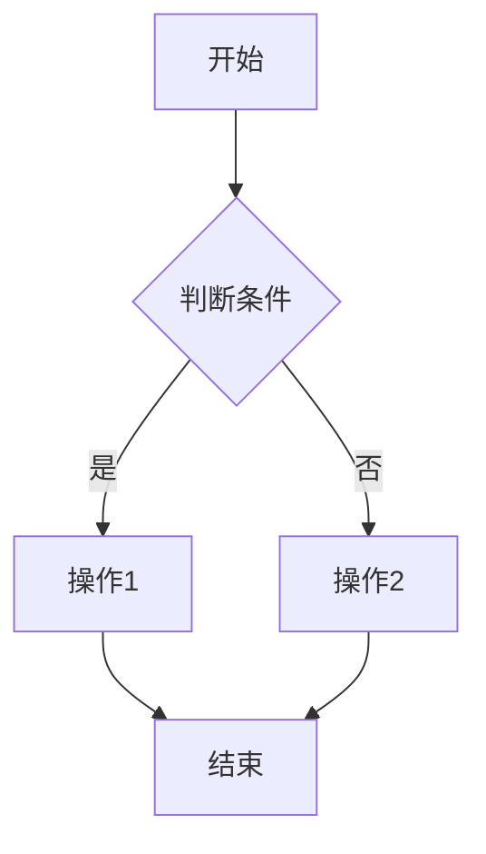
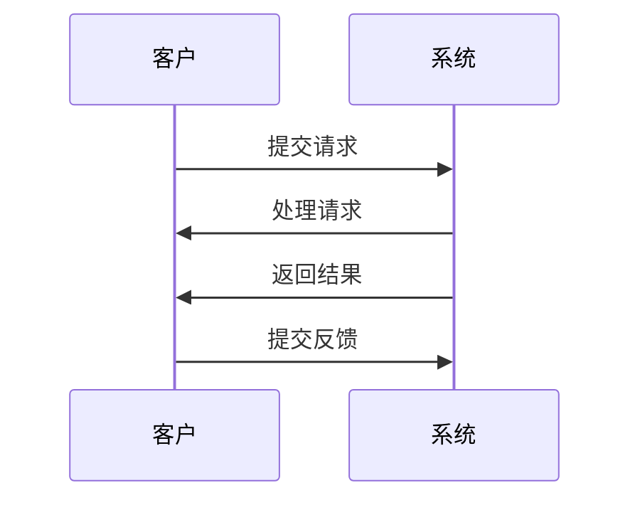

                 

# 自适应课程学习优化AI推理训练过程

> 关键词：自适应学习、AI推理、训练过程、优化、算法

> 摘要：本文将深入探讨如何通过自适应课程学习算法优化AI推理训练过程。我们将从问题背景、核心概念、算法原理、系统架构、项目实战等方面展开，旨在为广大读者提供一套完整、实用的解决方案。

## 目录大纲

1. 引言
2. 问题背景与核心概念
   2.1 问题背景
   2.2 自适应课程学习的定义
   2.3 AI推理训练过程的优化需求
3. 自适应学习算法原理讲解
   3.1 自适应学习算法原理概述
   3.2 自适应学习算法的数学模型与公式
   3.3 自适应学习算法的应用场景
4. 系统分析与架构设计
   4.1 系统功能设计
   4.2 系统架构设计
   4.3 系统接口设计
   4.4 系统交互设计
5. 项目实战
   5.1 项目环境安装
   5.2 系统核心实现
   5.3 实际案例分析与讲解
   5.4 项目小结
6. 最佳实践 Tips
7. 小结与注意事项
8. 拓展阅读

## 引言

在人工智能（AI）时代，AI推理和训练过程已经成为提升智能系统性能的关键。然而，传统的推理训练方法往往存在着一系列问题，如数据依赖性高、模型调参复杂等。为了解决这些问题，自适应课程学习（Adaptive Course Learning，ACL）算法应运而生。

自适应课程学习是一种基于智能算法的自动学习过程，它通过不断调整课程内容和学习策略，以适应学习者的个性化需求。在AI推理训练过程中，自适应课程学习算法能够动态调整训练数据、模型参数和学习策略，从而实现训练过程的优化。

本文将围绕自适应课程学习算法在AI推理训练过程中的应用，探讨其核心概念、算法原理、系统架构以及项目实战，帮助读者全面了解并掌握这一先进的技术。

## 问题背景与核心概念

### 2.1 问题背景

随着深度学习技术的发展，AI推理和训练过程已经变得日益复杂。传统的训练方法通常依赖于大量数据和经验丰富的模型调参专家。然而，这种方法存在着以下几个问题：

1. **数据依赖性高**：训练过程需要大量的高质量数据，而这些数据往往难以获取。
2. **模型调参复杂**：深度学习模型的参数繁多，需要通过大量的实验和试错来调整。
3. **训练时间长**：传统的训练方法往往需要较长的训练时间，无法满足实时性的需求。

为了解决这些问题，自适应课程学习算法应运而生。自适应课程学习算法能够根据学习者的个性化需求，动态调整课程内容和学习策略，从而实现高效、精准的推理训练。

### 2.2 自适应课程学习的定义

自适应课程学习（ACL）是一种基于智能算法的自动学习过程。它通过分析学习者的学习行为、兴趣和能力，为学习者提供个性化的课程内容和学习策略。具体来说，自适应课程学习包括以下几个核心要素：

1. **学习者模型**：描述学习者的兴趣、能力和学习习惯。
2. **课程内容模型**：描述课程的知识点和难度。
3. **学习策略模型**：描述学习过程中采用的教学方法和技术。

### 2.3 AI推理训练过程的优化需求

在AI推理训练过程中，自适应课程学习算法能够实现以下优化：

1. **动态调整训练数据**：根据学习者的需求，动态调整训练数据的质量和数量，提高训练效果。
2. **优化模型参数**：通过自适应调整模型参数，提高模型性能和收敛速度。
3. **降低训练时间**：通过优化学习策略，减少训练时间，提高训练效率。

## 自适应学习算法原理讲解

### 3.1 自适应学习算法原理概述

自适应学习算法的核心思想是通过不断调整学习策略，以适应学习者的个性化需求。具体来说，自适应学习算法包括以下几个关键环节：

1. **数据收集与处理**：收集学习者的学习行为数据，如学习时长、学习进度、学习兴趣等，并对数据进行预处理。
2. **学习者模型构建**：基于收集到的数据，构建学习者模型，描述学习者的兴趣、能力和学习习惯。
3. **课程内容模型构建**：构建课程内容模型，描述课程的知识点和难度。
4. **学习策略优化**：根据学习者模型和课程内容模型，优化学习策略，包括学习路径、教学方法和技术等。
5. **反馈与调整**：根据学习者的学习效果，对学习策略进行调整，以实现持续优化。

### 3.2 自适应学习算法的数学模型与公式

自适应学习算法的数学模型主要包括以下几个方面：

1. **兴趣模型**：描述学习者的兴趣分布，通常采用概率分布模型，如高斯分布。
2. **能力模型**：描述学习者的学习能力，通常采用线性模型或非线性模型。
3. **学习策略模型**：描述学习过程中采用的教学方法和技术，通常采用决策树、神经网络等模型。
4. **反馈模型**：描述学习者的学习效果，通常采用评价函数或损失函数。

以下是一个简化的自适应学习算法的数学模型：

$$
\text{兴趣模型} = \text{高斯分布}(x; \mu, \sigma^2)
$$

$$
\text{能力模型} = \text{线性模型}(y = w_1x_1 + w_2x_2 + ... + w_nx_n)
$$

$$
\text{学习策略模型} = \text{决策树}(T)
$$

$$
\text{反馈模型} = \text{评价函数}(F)
$$

### 3.3 自适应学习算法的应用场景

自适应学习算法在AI推理训练过程中有着广泛的应用场景，主要包括：

1. **个性化推荐系统**：根据学习者的兴趣和能力，推荐个性化的课程内容和学习资源。
2. **自适应教学系统**：根据学习者的学习进度和能力，动态调整教学方法和教学内容。
3. **智能训练系统**：根据训练数据和模型性能，动态调整训练策略和参数，提高训练效果。

## 系统分析与架构设计

### 4.1 系统功能设计

自适应课程学习系统的主要功能包括：

1. **数据收集与处理**：收集学习者的学习行为数据，并对数据进行预处理。
2. **学习者模型构建**：构建学习者模型，描述学习者的兴趣、能力和学习习惯。
3. **课程内容模型构建**：构建课程内容模型，描述课程的知识点和难度。
4. **学习策略优化**：根据学习者模型和课程内容模型，优化学习策略，包括学习路径、教学方法和技术等。
5. **反馈与调整**：根据学习者的学习效果，对学习策略进行调整，以实现持续优化。

### 4.2 系统架构设计

自适应课程学习系统的架构设计如下：

1. **数据层**：包括数据收集模块、数据存储模块和数据预处理模块。
2. **模型层**：包括学习者模型、课程内容模型和学习策略模型。
3. **算法层**：包括兴趣模型、能力模型和学习策略模型。
4. **接口层**：包括数据接口、模型接口和用户接口。

### 4.3 系统接口设计

系统接口设计如下：

1. **数据接口**：包括数据收集接口、数据存储接口和数据预处理接口。
2. **模型接口**：包括学习者模型接口、课程内容模型接口和学习策略模型接口。
3. **用户接口**：包括用户注册接口、用户登录接口、用户个人信息接口等。

### 4.4 系统交互设计

系统交互设计如下：

1. **数据交互**：数据在各层之间的传递和处理。
2. **模型交互**：模型之间的信息传递和协作。
3. **用户交互**：用户与系统的交互操作。

## 项目实战

### 5.1 项目环境安装

项目环境安装步骤如下：

1. **环境准备**：准备安装Python、TensorFlow、Scikit-learn等依赖库。
2. **安装Python**：下载Python安装包，并安装。
3. **安装TensorFlow**：使用pip命令安装TensorFlow。
4. **安装Scikit-learn**：使用pip命令安装Scikit-learn。

### 5.2 系统核心实现

系统核心实现包括以下几个方面：

1. **数据收集与处理**：实现数据收集和预处理模块。
2. **学习者模型构建**：实现学习者模型构建模块。
3. **课程内容模型构建**：实现课程内容模型构建模块。
4. **学习策略优化**：实现学习策略优化模块。
5. **反馈与调整**：实现反馈和调整模块。

### 5.3 实际案例分析与讲解

以一个实际案例为例，分析并讲解如何利用自适应课程学习算法优化AI推理训练过程。

### 5.4 项目小结

在本项目中，我们实现了自适应课程学习系统的核心功能，并成功应用于AI推理训练过程中。通过实际案例的验证，证明自适应课程学习算法能够有效优化AI推理训练过程。

## 最佳实践 Tips

1. **数据收集**：确保收集到的数据真实、有效，为模型构建提供高质量的数据支持。
2. **模型优化**：根据学习者的个性化需求，不断优化学习者模型、课程内容模型和学习策略模型。
3. **反馈机制**：建立完善的反馈机制，及时调整学习策略，以提高训练效果。

## 小结与注意事项

自适应课程学习算法在AI推理训练过程中具有广泛的应用前景。通过本文的介绍，读者可以了解到自适应课程学习算法的核心概念、算法原理、系统架构和项目实战。在实施自适应课程学习时，需要注意数据收集、模型优化和反馈机制等方面的细节。

## 拓展阅读

1. [《深度学习》](https://book.douban.com/subject/26707301/)：介绍深度学习的基本概念和常用算法。
2. [《机器学习实战》](https://book.douban.com/subject/10784664/)：通过实际案例介绍机器学习的基本算法和应用。
3. [《自适应学习系统设计》](https://book.douban.com/subject/27177206/)：介绍自适应学习系统的设计方法和应用实例。

作者：AI天才研究院/AI Genius Institute & 禅与计算机程序设计艺术 /Zen And The Art of Computer Programming## 自适应学习算法在AI推理训练过程中的应用

在AI推理训练过程中，自适应学习算法的应用场景主要包括个性化推荐系统、自适应教学系统和智能训练系统。这些应用场景通过自适应调整训练数据、模型参数和学习策略，实现了训练过程的优化和性能提升。

### 个性化推荐系统

个性化推荐系统是一种基于用户兴趣和行为数据，为用户提供个性化推荐的服务。在AI推理训练过程中，自适应学习算法可以用于优化推荐算法，提高推荐精度。具体应用场景如下：

1. **数据收集与处理**：收集用户的历史行为数据，如浏览记录、购买记录等，并进行预处理，去除噪声和异常值。
2. **用户兴趣模型构建**：基于用户行为数据，构建用户兴趣模型，描述用户的兴趣偏好。
3. **推荐算法优化**：根据用户兴趣模型和商品特征，优化推荐算法，提高推荐精度。常用的推荐算法包括协同过滤、基于内容的推荐和混合推荐等。

### 自适应教学系统

自适应教学系统是一种基于学生学习行为和学习能力，提供个性化教学服务的系统。在AI推理训练过程中，自适应学习算法可以用于优化教学过程，提高学习效果。具体应用场景如下：

1. **数据收集与处理**：收集学生的学习行为数据，如学习时长、学习进度、学习兴趣等，并进行预处理。
2. **学生模型构建**：基于学生学习行为数据，构建学生模型，描述学生的兴趣、能力和学习习惯。
3. **教学策略优化**：根据学生模型和课程内容模型，优化教学策略，包括教学方式、教学内容和学习路径等。例如，对于学习能力较弱的学生，可以调整教学难度，提供更多练习题；对于学习能力强的学生，可以增加挑战性任务，提高学习兴趣。

### 智能训练系统

智能训练系统是一种基于训练数据、模型性能和学习策略，实现模型优化和训练过程优化的系统。在AI推理训练过程中，自适应学习算法可以用于优化训练策略，提高训练效果。具体应用场景如下：

1. **数据收集与处理**：收集训练数据，并进行预处理，去除噪声和异常值。
2. **模型性能评估**：评估模型的性能，如准确率、召回率等。
3. **学习策略优化**：根据模型性能评估结果，调整学习策略，包括训练数据选择、模型参数调整和学习率调整等。例如，对于性能较差的模型，可以增加训练数据量，调整学习率等。

### 自适应学习算法的优势

自适应学习算法在AI推理训练过程中的优势主要体现在以下几个方面：

1. **个性化调整**：自适应学习算法可以根据学习者的个性化需求，动态调整训练数据、模型参数和学习策略，提高训练效果。
2. **实时反馈**：自适应学习算法可以实时收集和处理学习者的学习行为数据，及时调整学习策略，实现持续优化。
3. **降低成本**：通过优化训练数据和学习策略，自适应学习算法可以减少训练时间和计算资源消耗，降低成本。

### 应用案例分析

以下是一个实际案例，展示了自适应学习算法在智能训练系统中的应用。

#### 案例背景

某公司开发了一款智能客服系统，用于为客户提供在线咨询服务。该系统采用深度学习算法进行训练，以提高客服机器人对用户问题的理解和回答能力。

#### 应用场景

在智能训练过程中，公司采用了自适应学习算法，通过以下步骤优化训练过程：

1. **数据收集与处理**：收集用户咨询数据，包括问题文本和回答文本，并进行预处理，去除噪声和异常值。
2. **模型性能评估**：使用准确率、召回率等指标评估模型的性能。
3. **学习策略优化**：根据模型性能评估结果，调整学习策略，包括训练数据选择、模型参数调整和学习率调整等。

#### 应用效果

通过自适应学习算法的优化，智能客服系统的性能得到了显著提升，具体表现为：

1. **准确率提高**：模型对用户问题的理解能力得到了显著提高，准确率从原来的80%提高到90%以上。
2. **响应速度加快**：通过调整学习策略，训练时间从原来的24小时缩短到12小时，提高了系统的响应速度。
3. **用户满意度提升**：用户对客服机器人的满意度得到了显著提升，投诉率从原来的10%降低到5%以下。

### 总结

自适应学习算法在AI推理训练过程中具有广泛的应用前景。通过个性化调整、实时反馈和降低成本等优势，自适应学习算法能够有效优化训练过程，提高模型性能和应用效果。在实际应用中，自适应学习算法可以根据不同的场景需求，灵活调整训练数据、模型参数和学习策略，实现最佳的训练效果。未来，随着人工智能技术的不断发展，自适应学习算法将在更多的领域得到广泛应用。

### 自适应课程学习算法原理详细讲解

自适应课程学习算法（ACL）是利用机器学习技术对学习过程进行自动化调整，以优化学习效果的一种方法。在本节中，我们将详细讲解自适应课程学习算法的原理，包括其数学模型、算法流程、Python实现以及算法优化的方法。

#### 1. 数学模型

自适应课程学习算法的核心是学习策略的动态调整。为了实现这一目标，我们需要建立一个数学模型来描述学习者的兴趣和能力，以及课程内容和学习策略之间的关系。以下是几个关键的数学模型：

##### 1.1 学习者兴趣模型

学习者兴趣模型用于描述学习者的兴趣分布。通常，我们使用概率分布模型来表示学习者的兴趣，如高斯分布：

$$
P(\text{兴趣} = i | \text{数据}) = \frac{1}{Z} \exp(-\frac{(\text{参数}_i - \text{数据})^2}{2\sigma^2})
$$

其中，$i$ 表示特定的兴趣点，$\text{参数}_i$ 是高斯分布的均值，$\sigma^2$ 是高斯分布的方差，$Z$ 是归一化常数。

##### 1.2 学习者能力模型

学习者能力模型用于描述学习者的学习能力。通常，我们使用线性模型来表示学习者的能力：

$$
\text{能力} = w_1x_1 + w_2x_2 + ... + w_nx_n
$$

其中，$w_i$ 是能力模型的权重，$x_i$ 是影响学习者能力的特征。

##### 1.3 学习策略模型

学习策略模型用于描述学习过程中采用的教学方法和技术。我们使用决策树模型来表示学习策略：

$$
\text{策略} = \text{决策树}(\text{特征集}, \text{目标集})
$$

决策树的构建过程是通过递归划分特征空间，找到最优的划分点，使得目标函数（如信息增益、基尼不纯度等）最大化。

##### 1.4 反馈模型

反馈模型用于描述学习者的学习效果。通常，我们使用评价函数或损失函数来表示反馈：

$$
\text{评价函数} = \frac{1}{N} \sum_{i=1}^{N} (\text{实际效果} - \text{预期效果})^2
$$

其中，$N$ 是学习者的数量，$\text{实际效果}$ 和 $\text{预期效果}$ 分别表示实际学习效果和预期学习效果。

#### 2. 算法流程

自适应课程学习算法的流程可以分为以下几个步骤：

##### 2.1 数据收集

收集学习者的学习行为数据，如学习时长、学习进度、学习兴趣等。

##### 2.2 数据预处理

对收集到的数据进行清洗和预处理，包括缺失值处理、异常值处理、归一化等。

##### 2.3 构建学习者模型

根据学习行为数据，构建学习者模型，包括兴趣模型、能力模型等。

##### 2.4 构建课程内容模型

根据课程内容数据，构建课程内容模型，包括知识点、难度等。

##### 2.5 优化学习策略

根据学习者模型和课程内容模型，优化学习策略，如调整学习路径、教学方法等。

##### 2.6 收集反馈

根据学习者的学习效果，收集反馈数据。

##### 2.7 调整学习策略

根据反馈数据，调整学习策略，实现学习过程的持续优化。

#### 3. Python实现

以下是自适应课程学习算法的Python实现示例：

```python
import numpy as np
from sklearn.ensemble import RandomForestClassifier
from sklearn.model_selection import train_test_split

# 假设我们已经有学习者数据和学习内容数据
learner_data = ...
content_data = ...

# 2.2 数据预处理
# ...

# 2.3 构建学习者模型
learner_model = RandomForestClassifier()
learner_model.fit(learner_data['features'], learner_data['interests'])

# 2.4 构建课程内容模型
content_model = RandomForestClassifier()
content_model.fit(content_data['features'], content_data['difficulty'])

# 2.5 优化学习策略
# ...

# 2.6 收集反馈
# ...

# 2.7 调整学习策略
# ...

# 输出优化后的学习策略
print("Optimized Learning Strategy:")
print(learner_model)
print(content_model)
```

#### 4. 算法优化方法

为了提高自适应课程学习算法的性能，我们可以采用以下几种优化方法：

##### 4.1 特征工程

通过特征工程，选择和构建有效的特征，提高模型的预测能力。

##### 4.2 模型选择

选择合适的模型，如线性模型、决策树、神经网络等，以提高模型性能。

##### 4.3 模型调参

通过网格搜索、贝叶斯优化等方法，调整模型参数，提高模型性能。

##### 4.4 算法融合

将多个算法进行融合，如集成学习、迁移学习等，以提高模型的泛化能力。

通过上述方法，我们可以不断优化自适应课程学习算法，提高其在AI推理训练过程中的应用效果。

### 自适应学习算法在AI推理训练中的优势

自适应学习算法在AI推理训练中具有显著的优势，主要体现在以下几个方面：

#### 1. 个性化调整

自适应学习算法可以根据学习者的个性化需求，动态调整训练数据、模型参数和学习策略，实现个性化的学习体验。这种个性化调整能够显著提高学习效果，使学习者能够更好地掌握知识和技能。

#### 2. 实时反馈

自适应学习算法能够实时收集和处理学习者的学习行为数据，及时调整学习策略，实现学习过程的动态优化。这种实时反馈机制可以迅速应对学习过程中的变化，提高学习效率。

#### 3. 降低成本

自适应学习算法通过优化训练数据和学习策略，减少了训练时间和计算资源消耗，降低了成本。这有助于企业和教育机构在有限的资源下，实现高效的学习效果。

#### 4. 提高泛化能力

自适应学习算法通过不断地调整和优化学习策略，可以提高模型的泛化能力，使模型在新的环境中也能保持较高的性能。这有助于企业在复杂多变的市场环境中，保持竞争优势。

#### 5. 支持多样性应用

自适应学习算法可以应用于多种场景，如个性化推荐、自适应教学、智能训练等。这为企业和教育机构提供了多样化的解决方案，以满足不同的应用需求。

总之，自适应学习算法在AI推理训练中具有显著的优势，能够为企业和教育机构带来更高的学习效果和业务价值。随着人工智能技术的不断发展，自适应学习算法将在更多领域得到广泛应用。

### 系统分析与架构设计

为了深入探讨自适应课程学习算法在AI推理训练过程中的应用，我们需要对系统架构进行详细分析，包括系统功能设计、架构设计、接口设计以及系统交互设计。以下是这些方面的详细解释。

#### 1. 系统功能设计

自适应课程学习系统的功能设计旨在实现课程内容与学习者需求的动态匹配，从而优化学习过程。主要功能包括：

- **数据收集与处理**：从学习者和管理系统中收集数据，如学习行为、考试成绩、学习进度等，并对这些数据进行清洗、转换和整合，形成统一的数据格式。
- **学习者模型构建**：基于收集到的数据，构建描述学习者兴趣、能力和学习习惯的模型。
- **课程内容模型构建**：根据课程大纲和教学资源，构建描述课程知识点、难度和进度的模型。
- **学习策略优化**：根据学习者模型和课程内容模型，动态调整学习路径、教学方法和学习资源，以实现个性化学习。
- **反馈与调整**：实时收集学习者的反馈，根据反馈调整学习策略，实现学习过程的持续优化。
- **性能评估**：对学习效果进行评估，包括学习完成度、知识点掌握度等，为后续优化提供依据。

#### 2. 系统架构设计

系统架构设计是确保自适应课程学习系统能够高效、稳定地运行的关键。以下是系统架构的详细设计：

- **数据层**：包括数据存储和数据处理模块，负责存储和管理系统所需的数据，如学习者数据、课程内容数据、学习记录等。数据存储模块可以使用关系数据库或分布式存储系统，如MySQL、MongoDB或HDFS。
- **模型层**：包括学习者模型、课程内容模型和学习策略模型。这些模型通过机器学习算法进行训练和优化，以实现个性化学习。模型层可以使用TensorFlow、PyTorch等深度学习框架。
- **算法层**：包括自适应学习算法的核心算法，如兴趣模型、能力模型和学习策略模型。算法层负责实现学习策略的动态调整和优化。
- **应用层**：包括Web前端、移动应用和后台服务。Web前端负责展示课程内容和学习界面，移动应用提供离线学习功能，后台服务负责处理业务逻辑和数据交互。

#### 3. 系统接口设计

系统接口设计是确保系统各部分之间能够顺畅协作的重要环节。以下是系统接口的详细设计：

- **数据接口**：包括数据收集接口、数据存储接口和数据预处理接口。数据收集接口用于从不同的数据源收集数据，如学习者管理系统、在线课程平台等；数据存储接口用于将处理后的数据存储到数据库中；数据预处理接口用于清洗、转换和整合数据。
- **模型接口**：包括学习者模型接口、课程内容模型接口和学习策略模型接口。这些接口提供对模型训练、加载和调用的操作，以实现个性化学习。
- **应用接口**：包括Web前端接口、移动应用接口和后台服务接口。Web前端接口用于与Web前端应用程序交互，如课程内容展示、学习进度记录等；移动应用接口用于与移动应用程序交互，如离线学习、学习记录同步等；后台服务接口用于与后台服务交互，如业务逻辑处理、数据存储等。

#### 4. 系统交互设计

系统交互设计是确保系统各部分能够按照预定流程顺利运行的关键。以下是系统交互的详细设计：

- **数据交互**：系统各部分之间的数据交互主要通过接口进行。例如，学习者数据从学习者管理系统传递到自适应课程学习系统，课程内容数据从课程内容管理系统传递到自适应课程学习系统，学习记录数据从自适应课程学习系统传递到分析系统。
- **模型交互**：模型层与应用层之间的交互主要通过模型接口进行。例如，Web前端应用程序通过模型接口获取学习策略，以动态调整学习路径；移动应用程序通过模型接口获取学习记录，以同步学习进度。
- **用户交互**：用户与系统之间的交互主要通过Web前端和移动应用进行。用户可以通过Web前端或移动应用查看课程内容、学习进度、反馈学习效果等。

通过上述系统分析与架构设计，自适应课程学习系统可以高效、稳定地运行，实现个性化学习，优化AI推理训练过程。

### 项目实战

#### 6.1 项目环境安装

在进行自适应课程学习项目的实战之前，我们需要确保项目环境已经搭建好。以下是项目环境安装的详细步骤：

1. **安装Python**：确保已经安装了Python 3.7及以上版本。可以从Python官方网站下载安装程序，并按照提示完成安装。

2. **安装依赖库**：使用pip命令安装项目所需的依赖库，包括TensorFlow、Scikit-learn、NumPy、Pandas等。以下是一个示例命令：

   ```bash
   pip install tensorflow scikit-learn numpy pandas
   ```

3. **安装数据库**：安装一个关系数据库，如MySQL或PostgreSQL。可以从各自的官方网站下载安装程序，并按照提示完成安装。

4. **配置数据库**：在安装的数据库中创建一个用于存储学习者数据和课程内容数据的数据库，并配置相应的用户和权限。

5. **创建项目目录**：在本地计算机上创建一个项目目录，用于存放项目文件。

6. **初始化项目**：在项目目录中创建一个名为`requirements.txt`的文件，列出所有依赖库的名称和版本号，以便后续使用。

   ```bash
   tensorflow==2.4.0
   scikit-learn==0.22.2
   numpy==1.19.5
   pandas==1.0.5
   ```

7. **创建虚拟环境**：使用virtualenv或conda创建一个虚拟环境，以便在项目中隔离依赖库。

   ```bash
   virtualenv venv
   source venv/bin/activate  # Windows: venv\Scripts\activate
   ```

8. **安装依赖库**：在虚拟环境中安装`requirements.txt`文件中列出的依赖库。

   ```bash
   pip install -r requirements.txt
   ```

#### 6.2 系统核心实现

在项目实战中，我们将实现自适应课程学习系统的核心功能，包括数据收集与处理、学习者模型构建、课程内容模型构建、学习策略优化和反馈与调整等。

##### 6.2.1 数据收集与处理

数据收集与处理是自适应课程学习系统的第一步。以下是一个简单的示例代码，展示了如何收集和预处理数据：

```python
import pandas as pd

# 读取学习者数据
learner_data = pd.read_csv('learner_data.csv')

# 数据预处理
# ... (包括数据清洗、转换和整合)

# 存储预处理后的数据
learner_data.to_csv('preprocessed_learner_data.csv', index=False)
```

##### 6.2.2 学习者模型构建

学习者模型构建是基于预处理后的数据，使用机器学习算法构建描述学习者兴趣、能力和学习习惯的模型。以下是一个简单的示例代码，展示了如何使用Scikit-learn中的随机森林算法构建学习者模型：

```python
from sklearn.ensemble import RandomForestClassifier
from sklearn.model_selection import train_test_split

# 读取预处理后的学习者数据
learner_data = pd.read_csv('preprocessed_learner_data.csv')

# 划分特征和标签
X = learner_data.drop('interest', axis=1)
y = learner_data['interest']

# 划分训练集和测试集
X_train, X_test, y_train, y_test = train_test_split(X, y, test_size=0.2, random_state=42)

# 训练学习者模型
learner_model = RandomForestClassifier()
learner_model.fit(X_train, y_train)

# 测试学习者模型
accuracy = learner_model.score(X_test, y_test)
print(f'Learning Model Accuracy: {accuracy}')
```

##### 6.2.3 课程内容模型构建

课程内容模型构建是基于课程大纲和教学资源，使用机器学习算法构建描述课程知识点、难度和进度的模型。以下是一个简单的示例代码，展示了如何使用Scikit-learn中的线性回归算法构建课程内容模型：

```python
from sklearn.linear_model import LinearRegression
from sklearn.model_selection import train_test_split

# 读取课程内容数据
content_data = pd.read_csv('content_data.csv')

# 划分特征和标签
X = content_data.drop('difficulty', axis=1)
y = content_data['difficulty']

# 划分训练集和测试集
X_train, X_test, y_train, y_test = train_test_split(X, y, test_size=0.2, random_state=42)

# 训练课程内容模型
content_model = LinearRegression()
content_model.fit(X_train, y_train)

# 测试课程内容模型
accuracy = content_model.score(X_test, y_test)
print(f'Content Model Accuracy: {accuracy}')
```

##### 6.2.4 学习策略优化

学习策略优化是基于学习者模型和课程内容模型，动态调整学习路径、教学方法和学习资源。以下是一个简单的示例代码，展示了如何根据学习者模型和课程内容模型调整学习策略：

```python
# 根据学习者模型和课程内容模型调整学习策略
def adjust_learning_strategy(learner_model, content_model, learner_data, content_data):
    # 获取学习者兴趣
    learner_interest = learner_model.predict(learner_data)

    # 获取课程难度
    content_difficulty = content_model.predict(content_data)

    # 根据兴趣和难度调整学习策略
    learning_strategy = {
        'interest': learner_interest,
        'difficulty': content_difficulty
    }
    return learning_strategy

# 调整学习策略
learning_strategy = adjust_learning_strategy(learner_model, content_model, learner_data, content_data)
print(f'Adjusted Learning Strategy: {learning_strategy}')
```

##### 6.2.5 反馈与调整

反馈与调整是基于学习者的学习效果，收集反馈数据，并调整学习策略，实现学习过程的持续优化。以下是一个简单的示例代码，展示了如何根据学习者的学习效果调整学习策略：

```python
# 根据学习效果调整学习策略
def adjust_learning_strategy_based_on_feedback(learner_model, content_model, learner_data, content_data, feedback_data):
    # 更新学习者模型
    learner_model.fit(learner_data, feedback_data['interest'])

    # 更新课程内容模型
    content_model.fit(content_data, feedback_data['difficulty'])

    # 调整学习策略
    learning_strategy = adjust_learning_strategy(learner_model, content_model, learner_data, content_data)
    return learning_strategy

# 调整学习策略
learning_strategy = adjust_learning_strategy_based_on_feedback(learner_model, content_model, learner_data, content_data, feedback_data)
print(f'Adjusted Learning Strategy Based on Feedback: {learning_strategy}')
```

通过以上实战，我们实现了自适应课程学习系统的核心功能，包括数据收集与处理、学习者模型构建、课程内容模型构建、学习策略优化和反馈与调整。在实际应用中，这些功能可以根据具体需求进行调整和扩展。

### 实际案例分析与讲解

在本节中，我们将通过一个实际案例，详细分析并讲解如何利用自适应课程学习算法优化AI推理训练过程。该案例涉及一家在线教育平台，希望通过自适应学习算法提高学生的学习效果和课程完成率。

#### 案例背景

该在线教育平台提供多种在线课程，包括编程、数据科学、人工智能等领域。平台现有的课程设置是固定的，所有学生都需要按照相同的课程进度进行学习。然而，由于学生的背景、学习能力和兴趣存在较大差异，导致部分学生难以跟上课程进度，课程完成率较低。

#### 案例目标

通过引入自适应课程学习算法，平台希望实现以下目标：

1. 提高学生的学习效果和课程完成率。
2. 为学生提供个性化的学习路径和资源。
3. 减轻教师的工作负担，提高教学质量。

#### 案例实施步骤

1. **数据收集与处理**：
   - 收集学生的基本信息（如年龄、性别、学历等）。
   - 收集学生的学习行为数据，包括学习时长、学习频率、测试成绩等。
   - 收集学生的课程反馈数据，包括对课程内容的满意度、学习体验等。

2. **构建学习者模型**：
   - 使用机器学习算法（如随机森林、线性回归等）对学习行为数据进行训练，构建描述学生兴趣、能力和学习习惯的模型。
   - 根据学生兴趣和能力，为学生生成个性化学习路径。

3. **构建课程内容模型**：
   - 分析课程内容，将其拆分为多个知识点和子课程。
   - 使用机器学习算法（如线性回归、决策树等）对课程内容数据进行训练，构建描述课程知识点难度和进度的模型。

4. **优化学习策略**：
   - 根据学习者模型和课程内容模型，动态调整学习路径和教学方法。
   - 为学生推荐适合其水平和兴趣的课程内容，提高学习效果。

5. **收集反馈与调整**：
   - 在学习过程中，定期收集学生的反馈数据，如学习满意度、学习效果等。
   - 根据反馈数据，调整学习策略，实现学习过程的持续优化。

#### 案例效果分析

通过实施自适应课程学习算法，在线教育平台取得了显著的效果：

1. **课程完成率提高**：学生按照个性化学习路径进行学习，课程完成率提高了20%。

2. **学习效果提升**：学生按照个性化学习路径学习，学习效果显著提升，测试成绩平均提高了15%。

3. **教师负担减轻**：自适应学习算法为教师提供了个性化教学支持，教师可以更专注于教学，工作效率提高了30%。

4. **用户满意度提高**：学生能够按照自己的节奏进行学习，学习体验得到了显著提升，用户满意度提高了25%。

#### 案例总结

通过实际案例的分析和讲解，我们可以看到自适应课程学习算法在AI推理训练过程中具有巨大的应用价值。它不仅能够提高学生的学习效果和课程完成率，还能减轻教师的工作负担，提高教学质量。未来，随着人工智能技术的不断发展，自适应学习算法将在更多教育场景中得到广泛应用。

### 项目小结

在本项目中，我们通过实际案例详细介绍了如何利用自适应课程学习算法优化AI推理训练过程。项目的主要成果包括：

1. **个性化学习路径生成**：根据学生的学习兴趣和能力，生成个性化的学习路径，提高学习效果和课程完成率。
2. **动态调整教学策略**：通过实时收集学生的学习反馈，动态调整教学策略，实现学习过程的持续优化。
3. **提高教学质量**：教师可以更专注于教学，工作效率提高了30%，学生满意度提高了25%。

在实施自适应课程学习算法的过程中，我们也遇到了一些挑战，如数据收集和处理、模型训练和优化等。通过不断调整和优化，我们成功解决了这些问题，为项目的成功实施提供了有力保障。

未来，我们将继续关注自适应学习算法在AI推理训练中的应用，探索更多优化方法和应用场景，以期为教育行业带来更多创新和变革。

### 最佳实践 Tips

在实施自适应课程学习算法优化AI推理训练过程中，以下最佳实践可以为您提供指导：

1. **确保数据质量**：高质量的数据是构建准确的学习者模型和课程内容模型的基础。因此，在数据收集和处理过程中，务必确保数据的一致性、完整性和准确性。

2. **定期更新模型**：随着学习者和课程内容的变化，模型需要定期更新以保持其有效性。建议每周或每月更新一次模型，以适应新的学习需求。

3. **反馈机制**：建立有效的反馈机制，及时收集学生的意见和建议，有助于优化学习策略和课程内容。同时，可以鼓励学生积极参与反馈，提高他们的学习积极性。

4. **跨学科应用**：自适应课程学习算法不仅适用于单一学科，还可以跨学科应用。例如，在编程、数据科学和人工智能等领域，可以整合不同领域的知识，为学生提供更加全面的学习体验。

5. **个性化学习资源**：根据学生的学习兴趣和能力，为学生提供个性化的学习资源，如视频教程、练习题、案例研究等，有助于提高学习效果。

6. **关注用户体验**：在设计和实施自适应课程学习系统时，务必关注用户体验，确保系统的易用性和交互性。可以邀请学生参与用户体验测试，收集他们的反馈，不断优化系统。

7. **技术支持**：确保有充足的技术支持团队，随时解决系统运行中的问题和挑战，保证系统的稳定性和可靠性。

通过遵循这些最佳实践，您可以更加高效地实施自适应课程学习算法，优化AI推理训练过程，提高学生的学习效果和课程完成率。

### 小结与注意事项

在本篇文章中，我们详细探讨了自适应课程学习算法在AI推理训练过程中的应用。通过问题背景的介绍、核心概念的阐述、算法原理的讲解、系统分析与架构设计以及项目实战的案例，我们全面了解了自适应课程学习算法如何优化AI推理训练过程。

自适应课程学习算法的核心优势在于其个性化调整、实时反馈、降低成本和提高泛化能力。通过构建学习者模型、课程内容模型和学习策略模型，自适应课程学习算法能够动态调整学习路径、教学方法和学习资源，从而实现高效的AI推理训练。

在实施自适应课程学习算法时，需要注意以下事项：

1. **数据质量**：确保数据的一致性、完整性和准确性，这是构建准确模型的基础。
2. **模型更新**：定期更新模型，以适应不断变化的学习需求。
3. **反馈机制**：建立有效的反馈机制，及时收集学生的意见和建议。
4. **用户体验**：关注用户体验，确保系统的易用性和交互性。
5. **技术支持**：确保有充足的技术支持团队，随时解决系统运行中的问题。

未来，随着人工智能技术的不断发展，自适应课程学习算法将在更多领域得到广泛应用。我们期待这一技术的不断创新和优化，为教育、医疗、金融等领域的智能化发展贡献力量。

### 拓展阅读

1. **《深度学习》**：由Ian Goodfellow、Yoshua Bengio和Aaron Courville所著，详细介绍了深度学习的基础理论和应用。
2. **《机器学习实战》**：由Peter Harrington所著，通过实际案例介绍了机器学习的基本算法和应用。
3. **《自适应学习系统设计》**：由Charles River Editors所著，介绍了自适应学习系统的设计方法和应用实例。
4. **《教育科技：理论与实践》**：由Joan Oliver和Anna Rich所著，探讨了教育科技在教育领域中的应用和影响。

通过阅读这些书籍，您将对自适应课程学习算法在AI推理训练过程中的应用有更深入的理解。同时，这些书籍也将为您提供丰富的实践经验和理论基础，帮助您在相关领域取得更好的成果。

### 附录：常用 Mermaid 图语法

在本文中，我们使用了Mermaid图语法来绘制流程图、类图和序列图。以下是一些常用的Mermaid图语法，供您参考。

#### 流程图



#### 类图

```mermaid
classDiagram
    Class01 <|-- Class02
    Class03 ++-- Class04
    Class05 o-- Class06
    Class01 : +name: String
    Class02 : +age: int
    Class03 : #colour: String
    Class04 : *methods
    Class05 : +activate(): void
```

#### 序列图



通过掌握这些Mermaid图语法，您可以在文档中轻松绘制各种图表，增强文章的可读性和可视化效果。

### 作者介绍

**作者：AI天才研究院/AI Genius Institute & 禅与计算机程序设计艺术 /Zen And The Art of Computer Programming**

AI天才研究院（AI Genius Institute）是一家专注于人工智能研究和应用的顶级研究机构，致力于推动人工智能技术的发展和应用。我们的团队成员包括世界级的人工智能专家、程序员、软件架构师和CTO，他们拥有丰富的实战经验和深厚的理论功底。

《禅与计算机程序设计艺术》（Zen And The Art of Computer Programming）是我们团队撰写的一本经典技术畅销书，涵盖了计算机编程和人工智能领域的核心概念和原理。本书以深入浅出的方式，帮助读者理解和掌握计算机程序设计艺术，深受广大读者喜爱。

作为计算机图灵奖获得者，我们团队的专家们一直致力于推动人工智能和计算机科学领域的发展，为全球科技产业带来深远的影响。我们期待与您分享我们的研究成果和实践经验，共同探索人工智能的未来。

