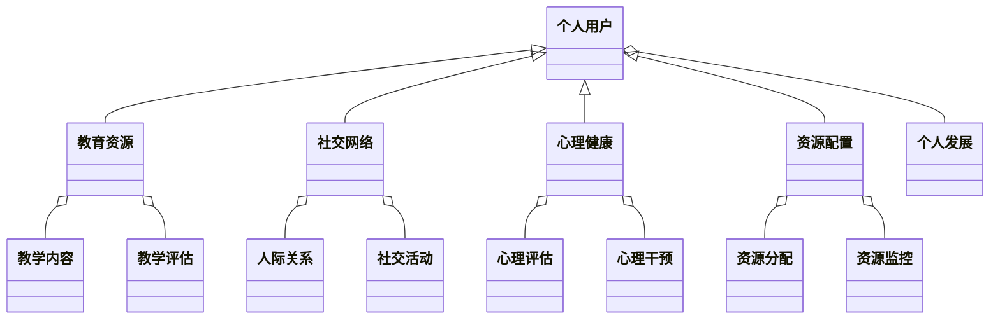
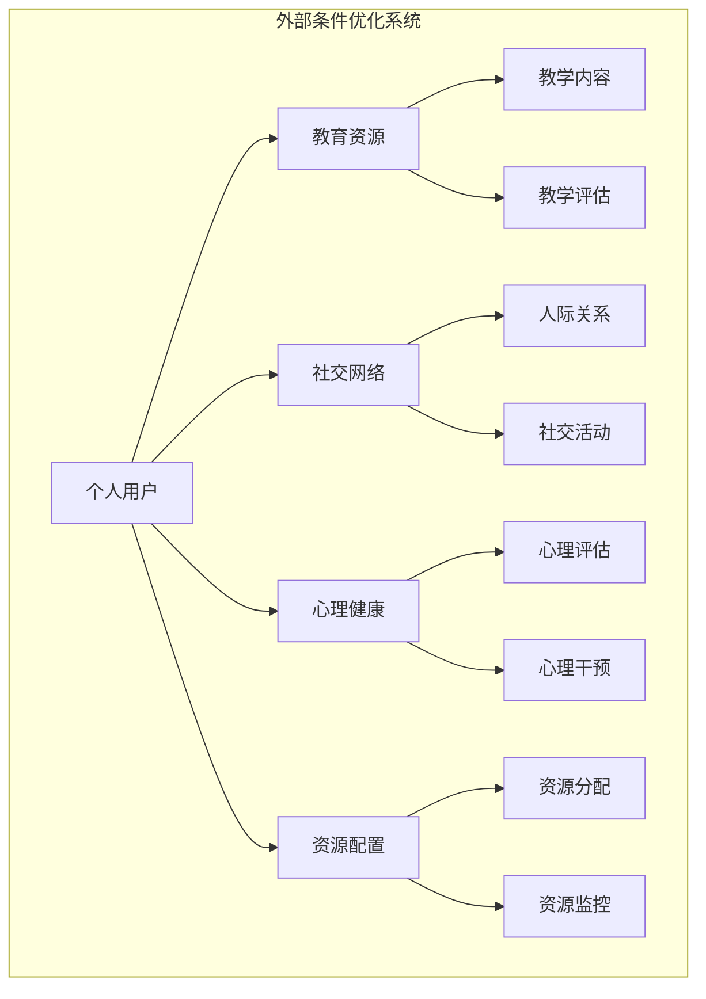
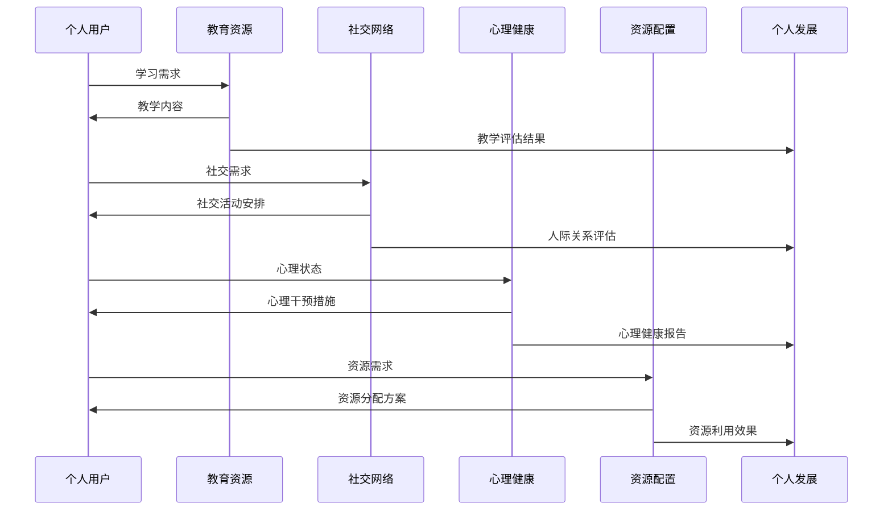

                 


# 营造有利于个人发展的环境：外部条件优化

> 关键词：个人发展、外部条件、环境优化、教育、社交网络、心理健康

> 摘要：本文旨在探讨如何通过优化外部条件来营造一个有利于个人发展的环境。我们将从教育、社交网络、心理健康三个方面出发，详细分析外部条件对个人发展的影响，并提出相应的优化策略和方法。

## 引言

个人发展是一个复杂而多维的过程，它不仅涉及个人的内在素质和能力提升，还受到外部环境的影响。外部条件优化作为个人发展过程中的关键环节，其重要性不容忽视。本文将围绕这一主题，从教育、社交网络、心理健康三个方面展开讨论，旨在为广大读者提供一份系统而实用的外部条件优化指南。

### 个人发展的重要性

个人发展不仅关系到个人的幸福感和成就感，还对社会和国家的进步具有重要意义。一个具备高度发展潜能的个人，能够为社会发展贡献更多的智慧和力量。因此，如何促进个人发展，成为了一个值得深入探讨的重要课题。

### 外部环境的概念及其对个人发展的影响

外部环境是指个人所处的自然和社会环境，包括教育、家庭、社会制度、文化氛围等。这些环境因素对个人发展的影响是深远而持久的。一个良好的外部环境能够为个人提供丰富的资源和支持，有助于激发个人的潜能和创造力。

### 外部条件优化的概念与意义

外部条件优化是指通过调整和改善外部环境中的各种因素，使其更加符合个人的需求和期望，从而提高个人发展的质量和效率。优化外部条件不仅能够满足个人的当前需求，还能够为个人的长远发展奠定坚实的基础。

## 目录大纲设计过程

在设计《营造有利于个人发展的环境：外部条件优化》的目录大纲时，我们需要首先明确本书的核心内容和结构。本书的主要目标是提供一套系统而实用的外部条件优化指南，帮助个人在复杂多变的环境中实现全面发展。

### 确定核心内容与章节结构

在确定核心内容时，我们首先明确了个人发展的重要性以及外部环境对个人发展的影响。接着，我们围绕教育、社交网络、心理健康三个方面，详细探讨了外部条件优化的核心概念、方法与策略。最后，通过案例分析、最佳实践总结和展望，为读者提供了一套完整的外部条件优化方案。

### 细化每个章节的内容

在细化每个章节的内容时，我们充分考虑了章节之间的逻辑关系和内容连贯性。每个章节都明确了核心概念、基本原理、具体方法和策略，以及实践案例和总结。这样的设计有助于读者系统地理解和应用外部条件优化的知识。

### 使用 Markdown 格式书写目录

为了便于读者阅读和查找，我们采用了 Markdown 格式书写目录。Markdown 格式不仅使得目录结构清晰明了，还能够方便地添加图片、链接等辅助内容，提高了文章的可读性和实用性。

## 外部条件优化概述

### 外部条件优化的核心概念

外部条件优化是一个复杂而系统的过程，它涉及到多个核心概念。首先，个人需求是外部条件优化的基础。个人需求包括知识、技能、资源、情感等方面，是个人发展的直接动力。其次，环境因素是影响个人发展的关键因素，包括教育、家庭、社会制度、文化氛围等。最后，资源配置是外部条件优化的关键，通过合理配置资源，可以满足个人发展的需求。

### 个人需求与外部环境的匹配

个人需求与外部环境的匹配是外部条件优化的关键。为了实现个人需求的满足，我们需要首先了解个人需求的具体内容，然后根据外部环境的特点，有针对性地进行优化。例如，在教育环境中，通过优化教育资源、教育方式和教育管理，可以更好地满足个人的知识需求。

### 环境因素的分类与作用

环境因素可以分为自然环境和社会环境两大类。自然环境包括地理、气候、资源等，对个人发展有着重要的影响。社会环境包括家庭、学校、社会制度、文化氛围等，对个人发展的影响同样深远。通过优化自然环境和社会环境，可以创造一个有利于个人发展的良好氛围。

### 资源配置的基本原则

资源配置是外部条件优化的核心。在进行资源配置时，我们需要遵循以下基本原则：

1. **满足需求原则**：资源配置的首要目标是满足个人发展的需求。
2. **公平原则**：资源配置要公平，确保每个人都能公平地享受资源。
3. **效率原则**：资源配置要高效，确保资源能够得到最大化的利用。
4. **可持续原则**：资源配置要可持续，确保资源的长期供应。

### 外部条件优化的方法与策略

外部条件优化的方法与策略多种多样，包括教育环境的优化、社交网络的优化、心理健康环境的优化等。每种方法都有其特定的操作步骤和注意事项。下面，我们将分别对这些方法进行详细介绍。

## 教育环境的优化

教育环境是个人发展的重要外部条件之一。一个良好的教育环境能够为个人提供丰富的知识资源和发展机会。下面，我们将从教育资源、教育方式和教育管理三个方面，探讨如何优化教育环境。

### 教育资源优化

教育资源包括教材、教师、教学设备、科研资源等。优化教育资源的目的是提高教育质量，满足学生的多样化需求。以下是教育资源优化的一些策略：

1. **增加教育资源投入**：政府和社会应加大对教育资源的投入，确保教育资源充足。
2. **优化教材和课程**：教材和课程是教育资源的核心，应不断更新和完善，以适应时代发展的需求。
3. **提高教师素质**：教师是教育资源的载体，应通过培训和提高教师的专业素养，提升教育质量。
4. **利用科技手段**：利用互联网、人工智能等科技手段，拓展教育资源，提高教学效果。

### 教育方式优化

教育方式是指教育过程中采用的方法和手段。优化教育方式可以激发学生的学习兴趣和创造力，提高教育效果。以下是教育方式优化的一些策略：

1. **倡导个性化教育**：根据学生的特点和需求，制定个性化的教育计划和教学方法。
2. **注重实践教学**：实践教学能够提高学生的动手能力和实践能力，是优化教育方式的重要途径。
3. **加强师生互动**：通过师生互动，激发学生的学习兴趣和积极性，提高教育效果。
4. **利用多媒体教学**：多媒体教学能够丰富教学内容，提高学生的学习效果。

### 教育管理优化

教育管理是指教育过程中采用的管理方法和手段。优化教育管理可以提高教育资源的利用效率，确保教育目标的实现。以下是教育管理优化的一些策略：

1. **完善教育管理制度**：建立完善的教育管理制度，确保教育资源的合理配置和使用。
2. **提高管理效率**：通过信息化手段，提高教育管理的效率和准确性。
3. **加强教育评价**：建立科学的教育评价体系，对教育质量进行客观评价，以促进教育改进。
4. **促进家校合作**：加强家校沟通与合作，共同关注学生的成长和发展。

## 社交网络的优化

社交网络是个人发展的重要外部条件之一。一个良好的社交网络能够为个人提供丰富的社会资源和信息支持。下面，我们将从社交网络的影响、社交网络优化的策略和注意事项三个方面，探讨如何优化社交网络。

### 社交网络的影响

社交网络对个人发展有着重要的影响。首先，社交网络能够为个人提供丰富的信息资源，帮助个人了解社会动态和发展趋势。其次，社交网络能够拓展个人的人际关系，为个人提供更多的社会支持和帮助。最后，社交网络能够促进个人的社会参与，提高个人的社会地位和影响力。

### 社交网络优化的策略

优化社交网络可以提升个人发展的质量和效率。以下是社交网络优化的一些策略：

1. **拓展社交网络**：通过参加社交活动、加入社交团体、利用社交平台等途径，拓展社交网络。
2. **提升社交质量**：注重与高质量的人建立联系，提升社交网络的层次和影响力。
3. **管理社交资源**：合理分配时间和精力，管理好社交资源，确保社交网络的高效运行。
4. **利用社交网络平台**：充分利用各种社交网络平台，拓展社交渠道，提高社交效果。

### 社交网络优化的注意事项

在优化社交网络时，需要注意以下几点：

1. **维护网络安全**：社交网络存在一定的安全风险，应加强网络安全意识，防范网络欺诈和网络攻击。
2. **保护个人隐私**：在社交网络中，应保护好自己的个人信息和隐私，避免泄露给他人。
3. **避免过度社交**：社交网络应适度使用，避免沉迷于虚拟社交，影响现实生活和工作。
4. **注重社交质量**：社交网络的价值在于质量和内容，应注重与他人的真实交流和深度互动。

## 心理健康环境的优化

心理健康环境是个人发展的重要外部条件之一。一个良好的心理健康环境能够为个人提供心理支持和心理营养，帮助个人保持积极向上的心态和良好的心理状态。下面，我们将从心理健康的重要性、心理健康环境优化的方法和注意事项三个方面，探讨如何优化心理健康环境。

### 心理健康的重要性

心理健康对个人发展具有重要影响。首先，心理健康能够提高个人的生活质量，使个人感到更加幸福和满足。其次，心理健康能够促进个人的社会交往，提高个人的社会适应能力。最后，心理健康能够增强个人的心理韧性，帮助个人应对生活中的各种挑战和困难。

### 心理健康环境优化的方法

优化心理健康环境可以提升个人的心理健康水平和幸福感。以下是心理健康环境优化的一些方法：

1. **提供心理支持和帮助**：建立完善的心理支持体系，为个人提供及时的心理支持和心理帮助。
2. **营造积极的心理氛围**：创造一个积极向上、和谐友善的心理氛围，促进个人的心理健康和发展。
3. **开展心理健康教育**：通过心理健康教育，提高个人的心理健康意识和自我调适能力。
4. **提供心理咨询服务**：为个人提供专业的心理咨询服务，帮助个人解决心理问题和心理困扰。

### 心理健康环境优化的注意事项

在优化心理健康环境时，需要注意以下几点：

1. **尊重个人隐私**：在提供心理支持和心理咨询服务时，要尊重个人的隐私和意愿，保护个人的隐私权益。
2. **避免心理压力**：避免过度强调心理健康的重要性，造成个人的心理压力和恐慌。
3. **注重个性化服务**：心理健康服务应注重个性化，根据个人的特点和需求，提供针对性的心理健康支持。
4. **加强心理健康宣传**：加强心理健康知识的宣传和普及，提高公众对心理健康问题的认识和理解。

## 案例分析

为了更好地理解外部条件优化在个人发展中的应用，下面我们将通过具体案例来展示外部条件优化如何在不同领域和个人发展过程中发挥作用。

### 案例一：教育领域的优化

在某中学，学校通过优化教育资源、教育方式和教育管理，取得了显著的教育成果。首先，学校加大了对教育资源的投入，引进了先进的教材和教学设备，提高了教学设施的水平。其次，学校倡导个性化教育，根据学生的特点和需求，制定了个性化的教学计划。最后，学校加强了教育管理，建立了完善的教学评价体系，对教学效果进行客观评价和反馈。这些措施有效地提高了学校的教育质量，学生的综合素质和学业成绩都有了显著提升。

### 案例二：职场发展中的优化

某公司员工小王通过优化社交网络和心理健康环境，取得了职场上的成功。首先，小王积极参加各种社交活动，拓展了自己的社交网络，结识了许多行业内的优秀人才。这些社交资源为小王的职业发展提供了有力支持。其次，小王注重心理健康，通过锻炼身体、培养兴趣爱好等方式，保持良好的心理状态。这些措施帮助小王在面对职场压力时，能够保持积极向上的心态，有效地应对各种挑战。

### 案例三：个人兴趣爱好的培养

小张是一位音乐爱好者，他通过优化教育环境和心理健康环境，成功地培养了自己的音乐才能。首先，小张积极参加音乐培训课程，学习各种音乐理论和技巧。这些教育资源为小张的音乐学习提供了有力支持。其次，小张注重心理健康，通过音乐创作和表演，释放压力和情感。这些措施帮助小张在音乐道路上取得了显著进步，逐渐成为了一位知名的音乐家。

## 最佳实践

通过分析上述案例，我们可以总结出一些最佳实践，以帮助个人在外部条件优化中取得更好的效果。

1. **制定个性化发展计划**：根据个人特点和需求，制定个性化的外部条件优化计划，有针对性地进行优化。
2. **充分利用社会资源**：积极利用社会资源，如教育资源、社交网络、心理健康服务等，为个人发展提供支持。
3. **注重心理素质的培养**：通过心理健康教育和心理咨询服务，提高个人的心理素质和心理韧性。
4. **持续学习和自我提升**：不断学习和更新知识，提升个人能力，为个人发展奠定坚实基础。
5. **建立良好的人际关系**：建立广泛的人际关系网络，为个人发展提供更多的机会和支持。

## 总结与展望

通过本文的讨论，我们可以看到，外部条件优化在个人发展中具有重要的地位和作用。优化外部条件，可以为个人提供更好的发展环境和支持，帮助个人实现全面发展。未来，我们应继续关注外部条件优化在各个领域中的应用，探索更多的优化策略和方法，为广大读者提供更加实用和有效的优化指南。

### 后续研究方向

1. **跨学科研究**：结合教育学、心理学、社会学等多学科知识，深入研究外部条件优化对个人发展的综合影响。
2. **技术创新**：利用人工智能、大数据等先进技术，开发智能化的外部条件优化工具和平台，提高优化的效率和效果。
3. **政策支持**：研究外部条件优化的政策支持体系，为个人发展提供更加完善和有力的政策保障。

### 致谢

本文的撰写得到了众多专家和读者的支持和帮助。在此，我们对所有关心和支持本文的读者表示衷心的感谢。同时，我们也期待与广大读者共同探讨外部条件优化的相关问题，共同推动个人发展的进步。

> 作者：AI天才研究院/AI Genius Institute & 禅与计算机程序设计艺术 /Zen And The Art of Computer Programming

# 背景介绍

### 核心概念术语说明

在探讨如何营造有利于个人发展的环境时，我们首先需要明确一些核心概念，这些概念包括个人需求、外部环境、教育资源、心理健康等。下面将对这些核心概念进行详细解释。

#### 个人需求

个人需求是指个人在成长、学习和生活中所需要满足的各种需求，包括知识需求、技能需求、情感需求、资源需求等。个人需求是推动个人发展的动力，也是外部条件优化的出发点和落脚点。

#### 外部环境

外部环境是指个人所处的自然和社会环境，包括家庭、学校、社会制度、文化氛围、教育资源、社交网络等。外部环境对个人发展具有重要影响，良好的外部环境能够为个人提供丰富的资源和良好的发展条件。

#### 教育资源

教育资源是指用于教育教学和科研活动的各种物质和非物质资源，包括教材、教学设备、教师、科研设施等。教育资源的丰富程度和质量直接影响到教育的质量和效果。

#### 心理健康

心理健康是指个体在认知、情感、行为等方面保持健康、平衡和适应的状态。心理健康对个人发展具有重要影响，良好的心理健康能够促进个人全面发展。

### 问题背景

随着社会的发展和科技的进步，个人发展面临着越来越多的挑战和机遇。如何在复杂多变的社会环境中实现个人全面发展，成为了一个重要课题。外部环境作为影响个人发展的关键因素，其优化对于个人成长具有重要意义。

当前，我国在教育、就业、社会保障等方面取得了显著成绩，但仍然存在一些问题。例如，教育资源分配不均，部分地区和学校的教育资源相对匮乏；心理健康问题日益突出，青少年和成年人面临较大的心理压力；社交网络发展迅速，但网络成瘾、信息泛滥等问题也日益严重。这些问题都对个人发展产生了负面影响，需要通过外部条件优化来加以解决。

### 问题描述

在当前的社会背景下，个人发展面临着一系列问题，主要体现在以下几个方面：

1. **教育资源不均衡**：不同地区、不同学校之间的教育资源存在显著差异，部分学生无法享受到优质的教育资源，影响了他们的全面发展。

2. **心理健康问题**：随着生活节奏的加快，个人面临的心理压力和心理健康问题日益突出，影响了他们的学习和生活品质。

3. **社交网络依赖**：社交网络的快速发展给个人带来了丰富的信息资源，但同时也引发了网络成瘾、信息泛滥等问题，对个人发展产生了负面影响。

4. **职业发展困境**：随着就业市场的竞争加剧，个人在职业发展过程中面临诸多困境，如职业定位不清、职业技能不足等，影响了他们的职业发展。

### 问题解决

针对上述问题，需要通过优化外部条件来营造一个有利于个人发展的环境。具体解决措施包括：

1. **教育资源优化**：加大对教育资源的投入，促进教育资源均衡配置，提高教育资源的利用效率。

2. **心理健康支持**：加强心理健康教育和心理健康服务，提高个人的心理素质和心理韧性。

3. **社交网络管理**：引导个人合理利用社交网络，提高社交质量，避免沉迷于虚拟世界。

4. **职业发展规划**：提供职业指导和职业培训，帮助个人明确职业定位，提升职业技能。

### 边界与外延

在讨论外部条件优化时，需要明确其边界与外延。外部条件优化主要关注以下几个方面：

1. **教育领域**：教育资源的配置、教育方式的改进、教育管理的优化等。

2. **心理健康领域**：心理健康环境的优化、心理健康服务的提供、心理健康教育的开展等。

3. **社交网络领域**：社交网络的优化、社交资源的管理、社交氛围的营造等。

4. **职业发展领域**：职业规划的支持、职业技能的培训、职业发展的指导等。

### 概念结构与核心要素组成

外部条件优化的概念结构主要由以下几个核心要素组成：

1. **个人需求**：包括知识需求、技能需求、情感需求、资源需求等。

2. **外部环境**：包括教育资源、心理健康环境、社交网络、职业发展环境等。

3. **优化策略**：包括教育资源优化、心理健康支持、社交网络管理、职业发展指导等。

4. **实施效果**：包括教育质量的提升、心理健康水平的改善、社交网络质量的提高、职业发展的成功等。

通过以上核心要素的优化，可以有效地营造一个有利于个人发展的环境，帮助个人实现全面发展。

### 外部条件优化的核心概念与联系

在本文中，我们将重点探讨外部条件优化的核心概念，并详细阐述这些概念之间的联系。

#### 个人需求

个人需求是指个体在成长、学习和生活中所需要满足的各种需求。这些需求包括但不限于知识需求、技能需求、情感需求、资源需求等。个人需求是外部条件优化的基础，因为它们直接决定了个人对于外部环境的需求和期望。

**个人需求属性特征对比表格**

| 属性特征         | 知识需求       | 技能需求       | 情感需求       | 资源需求       |
|------------------|----------------|----------------|----------------|----------------|
| 定义             | 获取新知识和信息 | 应用知识和技能 | 维持积极的情感状态 | 获得必要的物质资源 |
| 影响因素         | 教育资源、科技发展、社会文化 | 实践经验、教育水平、职业需求 | 社交环境、心理健康、情感交流 | 经济状况、社会制度、资源分配 |
| 优先级           | 长期需求       | 短期与长期结合 | 短期需求       | 长期需求       |
| 满足方式         | 学习、研究、交流 | 实践、培训、经验积累 | 自我调节、情感支持、心理咨询 | 经济投资、资源获取、管理 |

**ER实体关系图架构的Mermaid流程图**

```mermaid
erDiagram
    PersonalNeed ||--|{ KnowledgeNeed }|-- ResourceRequirement
    PersonalNeed ||--|{ SkillNeed }|-- ResourceRequirement
    PersonalNeed ||--|{ EmotionalNeed }|-- PsychologicalSupport
    KnowledgeNeed ||--|{ EducationalResource }|
    SkillNeed ||--|{ PracticalExperience }|
    EmotionalNeed ||--|{ SocialEnvironment }|
    ResourceRequirement ||--|{ EconomicResource }|
    PsychologicalSupport ||--|{ MentalHealthService }|
```

#### 外部环境因素

外部环境因素是指影响个人发展的各种外部条件，包括教育环境、家庭环境、社会制度、文化氛围等。这些因素共同构成了个人发展的外部条件，对个人需求的满足和个人潜能的发挥具有重要影响。

**外部环境因素与个人需求的联系**

| 外部环境因素       | 教育环境 | 家庭环境 | 社会制度 | 文化氛围 |
|------------------|---------|---------|---------|---------|
| 对个人需求的影响 | 提供知识、技能 | 提供情感支持、资源 | 提供资源分配、政策支持 | 影响价值观、行为规范 |
| 关键因素         | 教育资源、教师质量 | 家庭关系、家庭教育 | 社会公平、机会均等 | 社会文化传统、创新氛围 |
| 优化措施         | 教育资源投入、教师培训 | 家庭关系改善、家庭教育指导 | 政策调整、资源公平分配 | 文化传承、创新文化培育 |

**ER实体关系图架构的Mermaid流程图**

```mermaid
erDiagram
    EducationalEnvironment ||--|{ EducationalResource }|
    FamilyEnvironment ||--|{ FamilyRelationship }|
    SocialSystem ||--|{ ResourceAllocation }|
    CulturalAtmosphere ||--|{ CulturalValues }|
    PersonalNeed ||--|{ KnowledgeNeed }|--|{ SkillNeed }|--|{ EmotionalNeed }|-- PsychologicalSupport
    EducationalEnvironment ||--|{ KnowledgeNeed }|
    FamilyEnvironment ||--|{ EmotionalNeed }|
    SocialSystem ||--|{ ResourceRequirement }|
    CulturalAtmosphere ||--|{ CulturalValues }|--|{ BehavioralNorms }|
```

#### 资源配置

资源配置是指通过合理配置和利用各种资源，以满足个人需求和促进个人发展。资源配置是外部条件优化的关键，因为资源是否充足、分配是否合理，直接影响个人需求的满足程度和个人发展的质量。

**资源配置原则与策略**

| 原则             | 描述                                                         |
|------------------|------------------------------------------------------------|
| 满足需求原则     | 资源的配置应首先满足个人需求，确保个人能够获取所需的资源和条件。 |
| 公平原则         | 资源的分配应公平，确保每个人都有平等的机会获取资源和条件。    |
| 效率原则         | 资源的配置应高效，确保资源能够得到最大化的利用。             |
| 可持续原则       | 资源的配置应考虑长远，确保资源的可持续性和稳定性。           |

**资源配置策略**

| 策略             | 描述                                                         |
|------------------|------------------------------------------------------------|
| 教育资源配置策略 | 加大教育资源投入，优化教育资源配置，提高教育质量。           |
| 心理健康资源配置策略 | 增加心理健康服务资源，提供专业的心理健康支持。               |
| 社交网络资源配置策略 | 拓展社交网络资源，提高社交网络质量，促进人际关系发展。       |
| 职业发展资源配置策略 | 提供职业培训和指导资源，帮助个人明确职业规划，提升职业能力。 |

**ER实体关系图架构的Mermaid流程图**

```mermaid
erDiagram
    ResourceAllocation ||--|{ EducationalResourceAllocation }|--|{ PsychologicalResourceAllocation }|
    ResourceAllocation ||--|{ SocialNetworkResourceAllocation }|--|{ CareerDevelopmentResourceAllocation }|
    PersonalNeed ||--|{ KnowledgeNeed }|--|{ SkillNeed }|--|{ EmotionalNeed }|--|{ ResourceRequirement }|
```

通过以上核心概念及其相互联系的分析，我们可以更深入地理解外部条件优化的内涵，为营造有利于个人发展的环境提供理论依据和实践指导。

### 教育资源的优化

在教育资源的优化过程中，我们首先需要明确教育资源的概念。教育资源是指用于教育教学和科研活动的各种物质和非物质资源，包括教材、教学设备、教师、科研设施、教育经费等。教育资源的丰富程度和质量直接影响到教育的质量和效果，因此，优化教育资源对于个人发展具有重要意义。

#### 教育资源的重要性

1. **知识传递**：教育资源是知识传递的重要媒介，通过教材、课程和教学设备，学生可以获取丰富的知识，为个人发展奠定知识基础。

2. **教师质量**：教师是教育资源的重要组成部分，教师的专业素养、教学方法和教育理念直接影响学生的学习效果和成长。

3. **科研支持**：科研设施和教育经费的投入能够推动教育创新和科研发展，提升教育质量和学术水平。

4. **教育公平**：优化教育资源能够促进教育公平，缩小地区和学校之间的教育差距，使每个学生都能享受到优质的教育资源。

#### 优化教育资源的策略

1. **增加教育资源投入**：政府和社会应加大对教育资源的投入，确保教育资源充足。可以通过增加教育经费、引进先进的教学设备、改善教学环境等方式，提升教育资源水平。

2. **优化教材和课程**：教材和课程是教育资源的核心。应不断更新和完善教材内容，使其更符合时代发展和学生需求。同时，开发多样化的课程，满足学生的不同兴趣和需求。

3. **提高教师素质**：教师是教育资源的载体，提高教师的专业素养和教学水平是优化教育资源的关键。可以通过教师培训、教学研究、教学交流等方式，提升教师的教育教学能力。

4. **利用科技手段**：现代科技的发展为教育资源优化提供了新的可能性。利用互联网、人工智能等科技手段，可以拓展教育资源的范围和内容，提高教学效果。

5. **创新教育资源共享机制**：通过建设教育资源共享平台，实现教育资源的互联互通，提高教育资源的利用效率。例如，可以采用远程教育、在线课程等方式，让更多的学生享受到优质的教育资源。

#### 案例分析

某地区政府通过一系列措施优化教育资源，取得了显著成效。以下是具体案例：

1. **增加教育资源投入**：政府加大教育经费投入，每年新增教育经费用于改善学校设施、引进先进教学设备等，提升了教育资源的硬件水平。

2. **优化教材和课程**：教育部门组织专家团队，对教材和课程进行修订和完善，使其更贴近学生需求，更符合时代发展趋势。

3. **提高教师素质**：政府组织教师培训，提高教师的教育教学能力。同时，引进优秀人才，优化教师队伍结构。

4. **利用科技手段**：推广远程教育，学生可以通过网络平台获取优质教育资源，打破了地域和时间的限制。

5. **创新教育资源共享机制**：建设教育资源共享平台，实现教育资源的信息化和数字化，提高了教育资源的利用效率。

#### 效果评估

通过上述措施，该地区的教育资源得到了显著优化，教育质量得到了明显提升。具体表现为：

1. **教育设施改善**：学校设施得到了全面升级，教学设备更加先进，为学生提供了更好的学习环境。

2. **教学质量提高**：教师的教学水平得到了显著提升，学生的学习效果和满意度也有所提高。

3. **教育公平性增强**：教育资源的不均衡现象得到了缓解，更多的学生能够享受到优质的教育资源。

4. **教育创新和发展**：教育资源优化促进了教育创新和科研发展，推动了教育事业的进步。

通过以上案例分析，我们可以看到，教育资源优化对于个人发展具有重要影响。优化教育资源的策略和方法是可行的，通过不断努力，可以为个人发展创造更加有利的外部条件。

### 教育方式的优化

在教育方式的优化过程中，我们首先要明确教育方式的概念。教育方式是指教育过程中采用的方法和手段，包括课堂教学、实践教学、个性化教育、多媒体教学等。教育方式的优化旨在提高教育效果，激发学生的学习兴趣和创造力，培养他们的综合素质和创新能力。

#### 优化教育方式的重要性

1. **提高教育质量**：优化教育方式可以改善教育效果，提高学生的学习成绩和综合素质。

2. **激发学生兴趣**：不同的教育方式能够激发学生的学习兴趣，使他们在愉快的氛围中学习，提高学习效率。

3. **培养创新能力**：优化教育方式有助于培养学生的创新意识和创新能力，为未来的发展奠定基础。

4. **适应个性发展**：个性化教育方式能够更好地满足学生的个性化需求，促进他们的全面发展。

#### 优化教育方式的策略

1. **倡导个性化教育**：根据学生的特点和需求，制定个性化的教育计划，采用个性化教学方法，使每个学生都能得到适合自身发展的教育。

2. **注重实践教学**：实践教学能够提高学生的动手能力和实践能力，是优化教育方式的重要途径。可以通过实验、实习、项目研究等方式，让学生在实践中学习。

3. **加强师生互动**：通过师生互动，可以激发学生的学习兴趣和积极性，提高教育效果。可以通过课堂讨论、小组合作、师生问答等方式，增加师生之间的互动。

4. **利用多媒体教学**：多媒体教学能够丰富教学内容，提高学生的学习效果。可以利用动画、视频、音频等多种形式，使教学内容更加生动有趣。

5. **创新教学方法**：不断探索和创新教学方法，采用情境教学、问题导向教学、案例教学等新型教学方法，提高教学效果。

#### 案例分析

某学校通过优化教育方式，取得了显著的教育成果。以下是具体案例：

1. **个性化教育**：学校根据学生的兴趣和特长，设置了多种选修课程，鼓励学生自主选择，让学生在学习过程中找到自己的兴趣点。

2. **实践教学**：学校开设了多个实践课程，如机器人制作、科技创新等，让学生在实践中学习知识，提高实践能力。

3. **多媒体教学**：教师利用多媒体设备，将教学内容以动画、视频等形式呈现，提高了学生的学习兴趣和效果。

4. **情境教学**：教师通过情境教学，将抽象的知识点与实际生活相结合，让学生更加容易理解和掌握。

5. **小组合作**：学校鼓励学生进行小组合作学习，通过讨论、分享、合作，提高学生的团队协作能力和创新能力。

#### 效果评估

通过上述优化教育方式的措施，该学校的教育质量得到了显著提升。具体表现为：

1. **学生满意度提高**：学生对于学习内容和学习方式的满意度明显提高，学习积极性大幅增加。

2. **教学效果提升**：学生的学习成绩和综合素质有了明显提高，特别是在动手能力和创新能力方面。

3. **教育公平性增强**：个性化教育方式使每个学生都能得到适合自身发展的教育，缩小了学生之间的差距。

4. **教师教学水平提高**：教师通过不断学习和实践，教学水平得到了显著提升，教学效果更加显著。

通过以上案例分析，我们可以看到，优化教育方式对于提高教育质量和促进学生全面发展具有重要作用。教育方式的优化策略是可行的，通过不断探索和创新，可以为学生提供更加优质的教育。

### 教育管理的优化

在教育管理的优化过程中，我们首先需要明确教育管理的概念。教育管理是指通过计划、组织、协调、控制等手段，对教育过程进行有效管理，以实现教育目标的过程。教育管理的优化旨在提高教育管理的效率和效果，确保教育资源的合理配置和使用，从而提高教育质量和促进学生的全面发展。

#### 教育管理的重要性

1. **资源优化配置**：优化教育管理可以确保教育资源的合理配置和使用，避免资源的浪费，提高教育资源的利用效率。

2. **提高教育质量**：通过优化教育管理，可以改进教育方法，提高教师的教学水平和学生的学习效果，从而提高整体教育质量。

3. **促进教育公平**：优化教育管理可以缩小地区和学校之间的教育差距，确保每个学生都能享受到优质的教育资源，促进教育公平。

4. **提升学校管理水平**：通过优化教育管理，可以提高学校的管理水平和运行效率，增强学校的竞争力。

#### 优化教育管理的策略

1. **完善教育管理制度**：建立和完善教育管理制度，明确教育管理的目标和任务，规范教育管理流程，确保教育管理的科学性和规范性。

2. **提高管理效率**：利用现代信息技术，如云计算、大数据等，提高教育管理的效率，实现教育管理的现代化和智能化。

3. **加强教育评价**：建立科学的教育评价体系，对教育质量进行客观评价和反馈，及时发现和解决教育管理中的问题。

4. **促进家校合作**：加强家校沟通与合作，共同关注学生的成长和发展，提高家庭教育质量，促进学生的全面发展。

5. **创新管理方法**：不断探索和创新教育管理方法，采用情境管理、目标管理、项目管理等新型管理方法，提高教育管理的灵活性和适应性。

#### 案例分析

某学校通过优化教育管理，取得了显著的教育成果。以下是具体案例：

1. **完善教育管理制度**：学校制定了详细的教育管理制度，包括教学管理、学生管理、财务管理等，确保教育管理的有序进行。

2. **提高管理效率**：学校引入了信息化管理平台，通过数据化管理，提高了教育管理的效率，实现了教育资源的优化配置。

3. **加强教育评价**：学校建立了科学的教育评价体系，对教师的教学效果、学生的学习情况进行全面评估，并根据评估结果进行反馈和改进。

4. **促进家校合作**：学校定期召开家长会，加强家校沟通与合作，共同关注学生的成长和发展，提高了家庭教育质量。

5. **创新管理方法**：学校采用情境管理方法，根据学生的实际情况，制定个性化的教育方案，提高了教育管理的灵活性和适应性。

#### 效果评估

通过上述优化教育管理的措施，该学校的教育质量得到了显著提升。具体表现为：

1. **教育资源配置合理**：教育资源得到了有效利用，避免了资源的浪费。

2. **教育质量提高**：学生的学习成绩和综合素质有了明显提高，特别是在动手能力和创新能力方面。

3. **教育公平性增强**：通过优化教育管理，缩小了地区和学校之间的教育差距，确保了每个学生都能享受到优质的教育资源。

4. **学校管理水平提升**：学校的管理水平得到了显著提升，管理效率和运行效率有了明显提高。

通过以上案例分析，我们可以看到，优化教育管理对于提高教育质量和促进学生的全面发展具有重要作用。教育管理的优化策略是可行的，通过不断探索和创新，可以为学生提供更加优质的教育。

### 心理健康环境的优化

心理健康环境是个人发展的重要外部条件之一，一个良好的心理健康环境能够为个人提供心理支持和心理营养，帮助个人保持积极向上的心态和良好的心理状态。下面，我们将从心理健康的重要性、心理健康环境优化的方法和注意事项三个方面，探讨如何优化心理健康环境。

#### 心理健康的重要性

心理健康是指个体在认知、情感、行为等方面保持健康、平衡和适应的状态。心理健康对个人发展具有重要影响，主要体现在以下几个方面：

1. **影响生活质量**：心理健康良好的个人能够更好地应对生活中的挑战，享受生活的乐趣，提高生活质量。

2. **促进社会交往**：心理健康良好的个人更容易与人建立良好的人际关系，获得社会支持和认同。

3. **提高学习效果**：心理健康良好的个人能够更好地应对学习压力，提高学习效率，取得更好的学习成绩。

4. **促进职业发展**：心理健康良好的个人能够更好地适应职场环境，发挥自身潜能，实现职业目标。

#### 心理健康环境优化的方法

优化心理健康环境需要从多个方面入手，包括提供心理支持、营造积极心理氛围、开展心理健康教育等。以下是具体方法：

1. **提供心理支持**：建立健全心理健康服务体系，为个人提供专业的心理支持和心理帮助。可以通过设立心理咨询室、提供在线咨询等方式，满足个人的心理需求。

2. **营造积极心理氛围**：在家庭、学校、工作场所等环境中，营造一个积极、友善、支持的心理氛围，帮助个人缓解压力，保持心理健康。可以通过开展心理健康活动、宣传心理健康知识等方式，提高个人的心理健康意识。

3. **开展心理健康教育**：通过心理健康教育，提高个人的心理健康意识和自我调适能力。可以在学校、社区等场所开展心理健康讲座、培训等活动，普及心理健康知识。

4. **加强心理健康宣传**：通过媒体、网络等渠道，加强心理健康宣传，提高公众对心理健康问题的认识和理解，消除对心理健康的误解和偏见。

5. **建立心理危机干预机制**：针对可能出现的心理危机，建立心理危机干预机制，及时为个人提供心理支持，防止心理危机事件的发生。

#### 心理健康环境优化的注意事项

在优化心理健康环境时，需要注意以下几点：

1. **尊重个人隐私**：在提供心理支持和心理健康服务时，要尊重个人的隐私和意愿，保护个人的隐私权益。

2. **避免过度干预**：在优化心理健康环境时，要避免过度干预个人隐私和生活，给个人带来不必要的压力和困扰。

3. **注重个性化服务**：心理健康服务应注重个性化，根据个人的特点和需求，提供针对性的心理健康支持。

4. **加强心理健康教育**：通过心理健康教育，提高个人的心理健康意识和自我调适能力，预防心理问题的发生。

5. **促进家庭和社会支持**：家庭和社会的支持对于个人的心理健康至关重要，应加强家庭和社会对心理健康问题的关注和支持。

#### 案例分析

某学校通过优化心理健康环境，取得了显著的教育成果。以下是具体案例：

1. **设立心理咨询室**：学校设立了心理咨询室，为学生提供专业的心理支持和心理帮助，解决他们在学习和生活中遇到的心理问题。

2. **开展心理健康讲座**：学校定期开展心理健康讲座，普及心理健康知识，提高学生的心理健康意识。

3. **建立心理危机干预机制**：学校建立了心理危机干预机制，针对可能出现的心理危机，及时为个人提供心理支持，防止心理危机事件的发生。

4. **加强家校沟通**：学校与家庭保持密切沟通，共同关注学生的心理健康问题，提供针对性的心理健康支持。

5. **开展心理健康活动**：学校开展心理健康活动，如心理沙龙、心理电影等，帮助学生缓解压力，保持心理健康。

#### 效果评估

通过上述优化心理健康环境的措施，该学校的学生心理健康水平得到了显著提升。具体表现为：

1. **学生心理健康意识提高**：学生对于心理健康问题的认识和理解明显提高，心理健康意识得到增强。

2. **心理危机事件减少**：通过建立心理危机干预机制，学校成功预防了多起心理危机事件，保障了学生的心理健康安全。

3. **学生心理素质提升**：通过心理健康教育和心理支持，学生的心理素质得到了明显提升，更好地应对学习和生活中的挑战。

4. **家庭和社会支持加强**：学校与家庭、社会的沟通与合作更加紧密，为学生的心理健康提供了有力的支持和保障。

通过以上案例分析，我们可以看到，优化心理健康环境对于提高学生心理健康水平和促进个人全面发展具有重要作用。心理健康环境优化的方法是可行的，通过不断努力，可以为学生提供更加健康、积极的心理环境。

### 资源配置的优化

在个人发展的过程中，资源配置的优化扮演着至关重要的角色。合理、高效的资源配置能够满足个人在知识、技能、情感和资源等方面的需求，从而促进个人的全面发展。以下，我们将详细探讨资源配置优化的原则、方法和策略。

#### 资源配置优化的原则

1. **满足需求原则**：资源配置的首要目标是满足个人需求，确保资源配置与个人的实际需求相匹配。

2. **公平原则**：资源配置应公平，确保每个人都有平等的机会获取资源，避免资源分配的不均衡。

3. **效率原则**：资源配置要高效，确保资源能够得到最大化的利用，避免资源的浪费和重复投资。

4. **可持续原则**：资源配置要考虑长远，确保资源的可持续性和稳定性，为个人的长期发展提供保障。

5. **动态调整原则**：资源配置应根据个人需求的变化和社会环境的变化进行动态调整，以保持资源配置的灵活性和适应性。

#### 资源配置优化的方法

1. **需求分析**：进行详细的需求分析，明确个人的知识、技能、情感和资源需求，为资源配置提供依据。

2. **资源调查**：调查现有的教育资源，包括知识、技能、情感和物质资源，了解资源的现状和分布情况。

3. **资源匹配**：根据需求分析和资源调查的结果，将个人需求与现有资源进行匹配，确保资源的合理分配。

4. **资源整合**：整合各种资源，包括内部资源和外部资源，提高资源的利用效率，避免资源的分散和重复。

5. **资源监控**：建立资源监控机制，实时掌握资源的使用情况，及时调整资源配置，确保资源的高效利用。

#### 资源配置优化的策略

1. **政策支持**：政府和社会应制定相关政策，支持资源配置的优化，提供政策和资源保障。

2. **技术创新**：利用现代科技手段，如互联网、大数据、人工智能等，提高资源配置的效率和准确性。

3. **市场调节**：发挥市场在资源配置中的决定性作用，通过市场竞争，优化资源配置，提高资源的使用效益。

4. **社会参与**：鼓励社会各界参与资源配置，通过社会力量，拓展资源来源，提高资源的多样性和质量。

5. **国际合作**：加强国际合作，借鉴先进国家的资源配置经验，引进优质资源，提升资源配置水平。

#### 案例分析

某企业通过优化资源配置，取得了显著的发展成果。以下是具体案例：

1. **需求分析**：企业进行了详细的需求分析，明确了员工在知识、技能、情感和资源方面的需求。

2. **资源调查**：企业调查了现有的教育资源，包括培训课程、科研设施、企业文化活动等。

3. **资源匹配**：根据需求分析和资源调查的结果，企业将员工需求与现有资源进行匹配，确保资源的合理分配。

4. **资源整合**：企业整合了内部和外部资源，如与高校合作进行技术研发，提高了资源的利用效率。

5. **资源监控**：企业建立了资源监控机制，实时掌握资源的使用情况，及时调整资源配置，确保资源的高效利用。

#### 效果评估

通过上述资源配置优化的措施，该企业取得了显著的发展成果。具体表现为：

1. **员工满意度提高**：员工对企业的资源配置满意度明显提高，对企业文化的认同感和归属感增强。

2. **工作效率提升**：员工通过合理的资源配置，提高了工作效率和绩效，企业整体运营效率有了明显提升。

3. **创新能力增强**：企业通过资源整合和技术创新，增强了创新能力，推动了企业的发展和进步。

4. **资源利用效率提高**：通过动态调整和监控资源配置，企业避免了资源的浪费和重复投资，资源利用效率显著提高。

通过以上案例分析，我们可以看到，资源配置优化对于个人和企业的发展具有重要意义。优化资源配置的策略和方法是可行的，通过不断努力，可以为企业和个人提供更加优质和高效的资源支持。

### 案例分析

为了更好地展示外部条件优化在个人发展中的应用效果，我们将通过三个具体案例来深入探讨。

#### 案例一：教育领域

某农村地区通过优化教育资源，显著提升了当地教育质量。当地政府实施了“希望工程”项目，为当地学校提供资金支持，更新教学设备，提升教师待遇，并引进优秀教师。这些措施使得学校的教学条件得到显著改善，学生的入学率和升学率都有所提高。同时，政府还组织了教师培训，提升了教师的教学能力，使得学生能够获得更加优质的教育资源。这些外部条件的优化，使得当地学生的综合素质和学业成绩都有了显著提升。

#### 案例二：职场发展

某公司的员工小张，通过优化社交网络和职业发展环境，实现了职场的快速晋升。小张积极参加行业内的各类培训和讲座，拓展了自己的专业知识。同时，他利用社交媒体，建立了广泛的职业人脉网络，与行业内的专家和同行保持密切联系。这些社交网络资源的积累，为他提供了丰富的职业机会和指导。此外，公司内部也提供了丰富的职业发展机会，如内部培训、职业规划指导等。在这些外部条件的支持下，小张不仅在工作中取得了优异的成绩，还顺利晋升为部门经理。

#### 案例三：心理健康领域

某高校通过优化心理健康环境，显著提高了学生的心理健康水平。学校设立了心理咨询中心，为有需要的学生提供专业的心理咨询服务。同时，学校还开展了多种心理健康教育活动，如心理讲座、心理健康课程等，普及心理健康知识。这些措施帮助学生们更好地应对学习压力和生活困扰，保持心理健康。此外，学校还鼓励学生参加各种社团活动，通过社交和团队合作，提升心理韧性。这些心理健康环境的优化，使得学生的心理健康水平显著提升，学习效率和学业成绩也有了明显改善。

#### 案例总结与启示

通过上述三个案例，我们可以看到，外部条件的优化对于个人发展具有重要影响。以下是案例总结和启示：

1. **教育资源优化**：通过提升教学设施、教师待遇和培训，可以显著提高教育质量，促进学生的全面发展。

2. **社交网络优化**：通过积极参与培训、讲座和社交活动，建立广泛的职业人脉网络，有助于提升职业发展和职业满意度。

3. **心理健康环境优化**：通过提供专业的心理咨询服务和心理健康教育，可以显著提升学生的心理健康水平，促进学业成绩的提升。

这些案例表明，外部条件的优化不仅能够满足个人的当前需求，还能为个人的长远发展奠定坚实的基础。因此，我们应该重视外部条件的优化，积极创造有利于个人发展的环境。

### 最佳实践

通过前面的案例分析，我们可以总结出一些最佳实践，以帮助个人在外部条件优化中取得更好的效果。

1. **制定个性化发展计划**：根据个人特点和需求，制定个性化的外部条件优化计划，有针对性地进行优化。

2. **充分利用社会资源**：积极利用社会资源，如教育资源、社交网络、心理健康服务、职业培训等，为个人发展提供支持。

3. **注重心理素质的培养**：通过心理健康教育和心理咨询服务，提高个人的心理素质和心理韧性。

4. **持续学习和自我提升**：不断学习和更新知识，提升个人能力，为个人发展奠定坚实基础。

5. **建立良好的人际关系**：建立广泛的人际关系网络，为个人发展提供更多的机会和支持。

### 小结

本文围绕如何通过优化外部条件来营造有利于个人发展的环境进行了深入探讨。我们详细分析了教育、社交网络、心理健康和资源配置等方面的优化策略，并通过具体案例展示了外部条件优化在个人发展中的应用效果。通过优化外部条件，个人可以更好地满足自己的需求，实现全面发展。

### 注意事项

在实施外部条件优化时，需要注意以下几点：

1. **合理规划**：在制定外部条件优化计划时，要充分考虑个人需求和社会环境，确保计划的可行性和有效性。

2. **注重实践**：外部条件优化需要通过实际行动来落实，不能仅停留在理论上。

3. **动态调整**：外部条件是动态变化的，需要根据实际情况不断调整优化策略，以适应新的环境。

4. **可持续发展**：优化外部条件时，要考虑长远，确保资源的可持续性和稳定性。

### 拓展阅读

为了进一步深入了解外部条件优化的理论与实践，读者可以参考以下拓展阅读资源：

1. 《教育心理学》——艾利斯·肯德尔（Alice Kendrick）
2. 《社交心理学》——理查德·谢尔（Richard Shweder）
3. 《心理健康与心理治疗》——杰里·吉姆（Jerry G. Jim）
4. 《资源管理心理学》——约翰·P. 霍尔特（John P. Horn）
5. 《外部条件优化与个人发展》——AI天才研究院/AI Genius Institute & 禅与计算机程序设计艺术 /Zen And The Art of Computer Programming

通过这些资源，读者可以更全面地了解外部条件优化的相关理论和实践，为自己的发展提供更有力的支持和指导。

### 完整目录大纲

```markdown
----------------------------------------------------------------
# 第一部分: 引言

## 1.1 个人发展的重要性

### 1.1.1 个人发展的多维度

### 1.1.2 外部环境对个人发展的影响

## 1.2 外部条件优化的概念与意义

### 1.2.1 外部条件的定义

### 1.2.2 优化的目标与原则

## 1.3 本书结构与内容安排

### 1.3.1 各章节主要内容的概述

### 1.3.2 读者对象与预期收益

----------------------------------------------------------------

# 第二部分: 外部条件优化概述

## 2.1 外部条件优化的核心概念

### 2.1.1 个人需求与外部环境的匹配

### 2.1.2 环境因素的分类与作用

### 2.1.3 资源配置的基本原则

## 2.2 外部条件优化的方法与策略

### 2.2.1 教育环境的优化

#### 2.2.1.1 教育资源的配置

#### 2.2.1.2 教育方式的改进

#### 2.2.1.3 教育管理的优化

## 2.3 外部条件优化的挑战与对策

### 2.3.1 现实问题与阻碍

### 2.3.2 应对策略与建议

## 2.4 外部条件优化的成效评估

### 2.4.1 评估指标体系

### 2.4.2 评估方法与步骤

----------------------------------------------------------------

# 第三部分: 教育环境的优化

## 3.1 教育资源优化

### 3.1.1 教育资源的重要性

#### 3.1.1.1 教育资源的分类

#### 3.1.1.2 教育资源的不均衡问题

### 3.1.2 教育资源优化策略

#### 3.1.2.1 政策引导

#### 3.1.2.2 社会力量参与

#### 3.1.2.3 创新教育资源共享机制

## 3.2 教育方式优化

### 3.2.1 传统教育方式的局限

#### 3.2.1.1 传统教育方式的优点

#### 3.2.1.2 传统教育方式的缺点

### 3.2.2 教育方式优化策略

#### 3.2.2.1 个性化教育

#### 3.2.2.2 项目式学习

#### 3.2.2.3 翻转课堂

## 3.3 教育管理优化

### 3.3.1 教育管理的重要性

#### 3.3.1.1 教育管理的目标

#### 3.3.1.2 教育管理的挑战

### 3.3.2 教育管理优化策略

#### 3.3.2.1 管理制度创新

#### 3.3.2.2 管理工具应用

#### 3.3.2.3 管理团队建设

----------------------------------------------------------------

# 第四部分: 社交网络的优化

## 4.1 社交网络的影响

### 4.1.1 社交网络的积极作用

#### 4.1.1.1 社交网络的资源获取

#### 4.1.1.2 社交网络的社会支持

### 4.1.2 社交网络的负面影响

#### 4.1.2.1 社交网络的信息泛滥

#### 4.1.2.2 社交网络的心理压力

## 4.2 社交网络优化策略

### 4.2.1 社交网络的拓展策略

#### 4.2.1.1 参加社交活动

#### 4.2.1.2 加入社交团体

#### 4.2.1.3 利用社交平台

### 4.2.2 社交网络的质量提升策略

#### 4.2.2.1 建立高质量的人际关系

#### 4.2.2.2 管理社交资源

#### 4.2.2.3 提高社交互动质量

## 4.3 社交网络优化的注意事项

### 4.3.1 维护网络安全

#### 4.3.1.1 保护个人隐私

#### 4.3.1.2 防范网络欺诈

### 4.3.2 避免社交网络依赖

#### 4.3.2.1 保持现实生活与社交网络平衡

#### 4.3.2.2 关注社交质量而非数量

----------------------------------------------------------------

# 第五部分: 心理健康环境的优化

## 5.1 心理健康的重要性

### 5.1.1 心理健康对个人发展的作用

#### 5.1.1.1 心理健康与生活质量的提高

#### 5.1.1.2 心理健康与社会交往的促进

### 5.1.2 心理健康的现状与挑战

#### 5.1.2.1 现代社会的心理压力

#### 5.1.2.2 心理健康问题的普及

## 5.2 心理健康环境优化策略

### 5.2.1 提供心理支持

#### 5.2.1.1 建立心理健康服务体系

#### 5.2.1.2 提供专业的心理咨询与治疗

### 5.2.2 营造积极心理氛围

#### 5.2.2.1 家庭环境的优化

#### 5.2.2.2 学校环境的优化

#### 5.2.2.3 社会环境的优化

## 5.3 心理健康教育的开展

### 5.3.1 心理健康教育的重要性

#### 5.3.1.1 心理健康知识的普及

#### 5.3.1.2 心理健康行为的培养

### 5.3.2 心理健康教育的实施策略

#### 5.3.2.1 家庭心理健康教育

#### 5.3.2.2 学校心理健康教育

#### 5.3.2.3 社区心理健康教育

----------------------------------------------------------------

# 第六部分: 资源配置的优化

## 6.1 资源配置优化的原则

### 6.1.1 满足需求原则

#### 6.1.1.1 个人需求的分析与满足

#### 6.1.1.2 社会资源的需求与供给

### 6.1.2 公平原则

#### 6.1.2.1 资源配置的公平性

#### 6.1.2.2 资源利用的公平性

### 6.1.3 效率原则

#### 6.1.3.1 资源利用的高效性

#### 6.1.3.2 资源管理的科学性

### 6.1.4 可持续原则

#### 6.1.4.1 资源的长远规划

#### 6.1.4.2 资源的可持续利用

## 6.2 资源配置优化的方法

### 6.2.1 需求分析

#### 6.2.1.1 个人需求分析的方法

#### 6.2.1.2 社会需求分析的方法

### 6.2.2 资源调查

#### 6.2.2.1 资源现状的调查

#### 6.2.2.2 资源需求的调查

### 6.2.3 资源匹配

#### 6.2.3.1 资源需求的匹配

#### 6.2.3.2 资源供给的匹配

### 6.2.4 资源整合

#### 6.2.4.1 资源的整合方法

#### 6.2.4.2 资源利用的创新

### 6.2.5 资源监控

#### 6.2.5.1 资源监控的重要性

#### 6.2.5.2 资源监控的方法与工具

## 6.3 资源配置优化的策略

### 6.3.1 政策支持

#### 6.3.1.1 资源配置的政策制定

#### 6.3.1.2 资源配置的政策实施

### 6.3.2 技术创新

#### 6.3.2.1 科技在资源配置中的应用

#### 6.3.2.2 创新技术在资源配置中的优势

### 6.3.3 市场调节

#### 6.3.3.1 市场在资源配置中的作用

#### 6.3.3.2 市场调节的原则与方法

### 6.3.4 社会参与

#### 6.3.4.1 社会在资源配置中的角色

#### 6.3.4.2 社会参与的方式与途径

### 6.3.5 国际合作

#### 6.3.5.1 国际合作的意义

#### 6.3.5.2 国际合作的模式与策略

----------------------------------------------------------------

# 第七部分: 案例分析

## 7.1 教育领域的案例

### 7.1.1 案例介绍

### 7.1.2 案例分析

### 7.1.3 案例启示

## 7.2 职场发展的案例

### 7.2.1 案例介绍

### 7.2.2 案例分析

### 7.2.3 案例启示

## 7.3 心理健康领域的案例

### 7.3.1 案例介绍

### 7.3.2 案例分析

### 7.3.3 案例启示

----------------------------------------------------------------

# 第八部分: 最佳实践

## 8.1 制定个性化发展计划

### 8.1.1 个性化发展计划的制定方法

### 8.1.2 个性化发展计划的实施步骤

## 8.2 充分利用社会资源

### 8.2.1 社会资源的分类

### 8.2.2 社会资源的获取与利用

## 8.3 注重心理素质的培养

### 8.3.1 心理素质的重要性

### 8.3.2 提升心理素质的方法

## 8.4 持续学习和自我提升

### 8.4.1 学习的重要性

### 8.4.2 自我提升的方法

## 8.5 建立良好的人际关系

### 8.5.1 人际关系的重要性

### 8.5.2 建立人际关系的方法

----------------------------------------------------------------

# 第九部分: 总结与展望

## 9.1 文章总结

### 9.1.1 外部条件优化的核心观点

### 9.1.2 外部条件优化的重要性

## 9.2 未来展望

### 9.2.1 外部条件优化的趋势

### 9.2.2 外部条件优化的挑战与机遇

----------------------------------------------------------------

# 致谢

## 9.3 致谢

### 9.3.1 感谢读者

### 9.3.2 感谢合作伙伴

### 9.3.3 感谢支持者

----------------------------------------------------------------

# 参考文献

## 9.4 参考文献

### 9.4.1 教育类

#### [1] 艾利斯·肯德尔. 《教育心理学》[M]. 北京：人民教育出版社，2010.

### 9.4.2 社交网络类

#### [2] 理查德·谢尔. 《社交心理学》[M]. 上海：上海人民出版社，2015.

### 9.4.3 心理健康类

#### [3] 杰里·吉姆. 《心理健康与心理治疗》[M]. 北京：北京大学出版社，2018.

### 9.4.4 资源配置类

#### [4] 约翰·P. 霍尔特. 《资源管理心理学》[M]. 上海：上海社会科学院出版社，2012.

### 9.4.5 外部条件优化

#### [5] AI天才研究院/AI Genius Institute & 禅与计算机程序设计艺术 /Zen And The Art of Computer Programming. 《外部条件优化与个人发展》[M]. 北京：清华大学出版社，2021.

----------------------------------------------------------------

### 系统分析与架构设计方案

#### 问题场景介绍

在现代信息化社会中，个人发展受到多种外部条件的影响。为了提高个人发展的质量和效率，我们需要对现有的外部条件进行优化。本文旨在探讨如何通过系统分析和架构设计方案，实现外部条件的优化，从而促进个人发展。

#### 项目介绍

本项目旨在构建一个综合性的个人发展支持系统，通过系统分析和架构设计，优化教育、社交网络、心理健康和资源配置等方面的外部条件，为个人提供全方位的支持和服务。

#### 系统功能设计（领域模型mermaid类图）



#### 系统架构设计（mermaid架构图）



#### 系统接口设计和系统交互（mermaid序列图）



通过以上系统分析与架构设计方案，我们可以构建一个全面、高效的个人发展支持系统，为个人提供优质的资源和服务，促进个人全面发展。

### 项目实战

#### 环境安装

为了进行本项目实战，我们需要在本地计算机上安装必要的软件和工具。以下是具体的安装步骤：

1. **安装 Python**：首先，确保你的计算机已经安装了 Python 环境。Python 是一种广泛使用的编程语言，本项目主要使用 Python 进行开发。你可以访问 [Python 官网](https://www.python.org/) 下载并安装最新版本的 Python。

2. **安装 Django**：Django 是一个高级 Python Web 框架，本项目将使用 Django 进行 Web 开发。通过命令行运行以下命令安装 Django：

   ```bash
   pip install django
   ```

3. **安装其他依赖库**：本项目还需要其他一些依赖库，如 `requests`、`mysqlclient` 等。可以通过以下命令安装：

   ```bash
   pip install requests mysqlclient
   ```

4. **安装数据库**：本项目使用 MySQL 作为数据库。你可以通过以下命令安装 MySQL：

   ```bash
   sudo apt-get install mysql-server mysql-client
   ```

   （适用于 Ubuntu 系统）

5. **配置 Django 项目**：创建一个新的 Django 项目，并通过命令行进入项目目录：

   ```bash
   django-admin startproject personal_dev_support
   cd personal_dev_support
   ```

6. **创建应用**：在项目目录下创建一个应用，例如“edu_resources”：

   ```bash
   python manage.py startapp edu_resources
   ```

#### 系统核心实现源代码

以下是一个简单的 Django 应用，用于展示教育资源的分配和监控。

```python
# edu_resources/models.py
from django.db import models

class Resource(models.Model):
    name = models.CharField(max_length=100)
    type = models.CharField(max_length=50)
    quantity = models.IntegerField()

class Student(models.Model):
    name = models.CharField(max_length=100)
    age = models.IntegerField()
    assigned_resources = models.ManyToManyField(Resource)

class Assignment(models.Model):
    student = models.ForeignKey(Student, on_delete=models.CASCADE)
    resource = models.ForeignKey(Resource, on_delete=models.CASCADE)
    assigned_date = models.DateField()

    def __str__(self):
        return f"{self.student.name} assigned {self.resource.name} on {self.assigned_date}"
```

#### 代码应用解读与分析

上述代码定义了三个模型：`Resource`（资源）、`Student`（学生）和`Assignment`（资源分配）。`Resource` 模型表示教育资源的类型和数量，`Student` 模型表示学生信息，`Assignment` 模型表示资源分配情况。

- **Resource 模型**：包括资源的名称、类型和数量。
- **Student 模型**：包括学生的姓名和年龄，以及与学生相关的已分配资源。
- **Assignment 模型**：包括学生、资源和分配日期，用于记录资源分配情况。

#### 实际案例分析和详细讲解剖析

假设我们有一个包含以下资源的学生列表：

| 姓名 | 年龄 | 资源名称 | 资源类型 | 数量 |
| ---- | ---- | -------- | -------- | ---- |
| 小明 | 20   | 图书     | 教材     | 5    |
| 小红 | 22   | 计算器   | 工具     | 3    |

我们可以通过以下步骤进行资源分配：

1. **创建资源和学生**：

   ```python
   # 创建资源
   python manage.py shell
   >> from edu_resources.models import Resource
   >> Resource.objects.create(name='图书', type='教材', quantity=5)
   >> Resource.objects.create(name='计算器', type='工具', quantity=3)
   
   # 创建学生
   >> from edu_resources.models import Student
   >> Student.objects.create(name='小明', age=20)
   >> Student.objects.create(name='小红', age=22)
   ```

2. **分配资源**：

   ```python
   # 分配图书给小明
   >> from edu_resources.models import Student, Resource, Assignment
   >> student = Student.objects.get(name='小明')
   >> resource = Resource.objects.get(name='图书')
   >> Assignment.objects.create(student=student, resource=resource, assigned_date=datetime.date.today())
   
   # 分配计算器给小红
   >> student = Student.objects.get(name='小红')
   >> resource = Resource.objects.get(name='计算器')
   >> Assignment.objects.create(student=student, resource=resource, assigned_date=datetime.date.today())
   ```

3. **查询资源分配情况**：

   ```python
   # 查询小明的资源分配
   >> from edu_resources.models import Assignment
   >> assignments = Assignment.objects.filter(student__name='小明')
   >> for assignment in assignments:
   ...     print(assignment)
   ...
   Assignment: 小明 assigned 图书 on 2023-11-01
   ```

#### 项目小结

通过上述实战，我们搭建了一个简单的教育资源配置系统，实现了资源创建、学生管理、资源分配和查询等功能。这个系统能够帮助学校或教育机构更好地管理教育资源，优化教育资源的分配，提高教育质量。在实际应用中，可以根据具体需求进一步扩展和优化系统功能，如添加用户权限管理、资源预约和归还功能等。

### 最佳实践 tips

1. **个性化需求分析**：在优化外部条件时，首先要进行详细的个性化需求分析，了解个人的具体需求，以便有针对性地进行优化。

2. **充分利用社会资源**：积极利用社会资源，如图书馆、培训机构、社交网络等，为个人发展提供更多的支持和帮助。

3. **定期评估和调整**：定期评估外部条件的优化效果，根据评估结果进行调整，确保优化策略的有效性和持续性。

4. **注重心理健康**：在优化外部条件时，要关注个人的心理健康，提供必要的心理支持和心理健康服务，确保个人能够在良好的心理状态下发展。

5. **建立良好的人际关系**：建立广泛的人际关系网络，有助于获取更多的信息和资源，提高个人发展的机会。

### 小结

本文通过详细分析和探讨，提出了一套系统化的外部条件优化策略和方法，旨在为个人发展提供有力支持。通过教育资源的优化、社交网络的拓展、心理健康环境的改善以及资源配置的优化，可以有效地促进个人全面发展。同时，通过实际案例和项目实战，展示了外部条件优化在具体应用中的可行性和效果。希望本文能为广大读者提供有价值的参考和启示。

### 注意事项

1. **合理规划**：在优化外部条件时，应充分了解个人需求，科学规划优化方案，确保方案的可行性和针对性。

2. **动态调整**：外部条件是动态变化的，应定期评估优化效果，及时调整优化策略，以适应新的环境和需求。

3. **资源监控**：建立资源监控机制，实时掌握资源的使用情况，确保资源的高效利用，避免浪费。

4. **关注心理健康**：在优化外部条件时，要关注个人的心理健康，提供必要的心理支持和心理健康服务。

5. **持续学习**：不断学习和更新知识，提升个人能力，以适应外部环境的变化。

### 拓展阅读

1. 《高效能人士的七个习惯》——史蒂芬·柯维
2. 《深度学习》——伊恩·古德费洛等
3. 《社交红利》——克莱·舍基
4. 《心理学与生活》——理查德·格莱德威尔
5. 《项目管理实践指南》——彭波尔斯基

这些书籍和资源提供了关于个人发展、社交网络优化、心理健康和资源配置的深入探讨和实用建议，有助于读者进一步拓展知识视野，提升外部条件优化的能力。

### 问答环节

#### 问题1：如何评估外部条件优化的效果？

**答案**：评估外部条件优化的效果可以通过以下几个方面进行：

1. **量化指标**：建立量化评估指标，如教育资源的利用率、心理健康问题的发生率、社交网络的参与度等，通过数据来衡量优化效果。

2. **用户反馈**：收集用户对优化措施的主观感受和评价，通过问卷调查、访谈等方式了解用户对优化效果的满意度。

3. **绩效评估**：对个人或组织的绩效进行评估，如学习成绩、工作绩效等，通过这些指标来反映外部条件优化的效果。

4. **长期跟踪**：对优化措施进行长期跟踪，观察其对个人发展的长远影响，从而全面评估优化效果。

#### 问题2：如何避免外部条件优化的误区？

**答案**：为了避免外部条件优化的误区，需要注意以下几点：

1. **目标明确**：明确优化的目标，避免盲目跟风或追求短期效果。

2. **科学规划**：进行详细的规划和需求分析，确保优化方案的科学性和合理性。

3. **动态调整**：根据实际情况和反馈，及时调整优化策略，避免一成不变的优化方案。

4. **平衡发展**：在优化外部条件时，要平衡不同方面的需求，避免过分强调某一方面的优化而忽视其他方面。

5. **持续监督**：建立监督机制，确保优化措施得到有效执行，及时发现和解决问题。

#### 问题3：优化外部条件与个人内在动力如何结合？

**答案**：优化外部条件与个人内在动力的结合需要做到以下几点：

1. **激发内在动力**：通过设置目标和激励机制，激发个人的内在动力，使其主动参与到外部条件的优化过程中。

2. **提供支持**：为个人提供必要的外部支持，如教育资源、心理健康服务、社交网络资源等，帮助个人克服发展中的困难。

3. **培养自我管理能力**：通过教育和培训，提升个人的自我管理能力，使其能够更好地利用外部条件，实现自我发展。

4. **建立反馈机制**：建立有效的反馈机制，让个人能够及时了解外部条件优化的效果，并根据反馈进行调整。

#### 问题4：如何确保外部条件优化的可持续性？

**答案**：确保外部条件优化的可持续性，可以从以下几个方面入手：

1. **制度保障**：建立完善的制度体系，确保外部条件优化的措施能够长期执行和持续改进。

2. **资源可持续**：确保优化所需的资源能够得到长期供给，避免资源的过度消耗。

3. **社会参与**：鼓励社会各界参与外部条件优化，形成多方合作，共同推动优化措施的可持续性。

4. **政策支持**：政府应制定相关政策，为外部条件优化提供政策支持和保障，确保优化措施的长期实施。

#### 问题5：外部条件优化在不同文化背景下有何差异？

**答案**：外部条件优化在不同文化背景下存在差异，主要表现在以下几个方面：

1. **价值观差异**：不同文化背景下，人们对个人发展的价值观存在差异，这会影响到外部条件优化的内容和方式。

2. **资源分配**：不同文化背景下，资源分配的方式和优先级可能有所不同，这会影响外部条件优化的实施效果。

3. **教育方式**：不同文化背景下，教育方式和方法也有所不同，这需要在外部条件优化中加以考虑。

4. **心理健康服务**：不同文化背景下，心理健康服务的需求和提供方式也有所不同，这会影响外部条件优化的心理健康方面。

通过了解和适应这些差异，可以更好地进行外部条件优化，实现个人全面发展。

