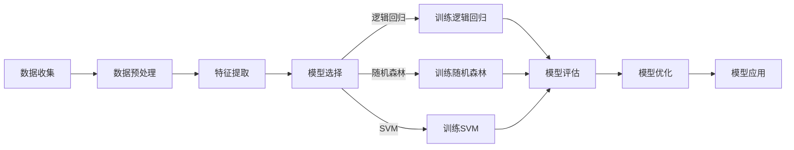
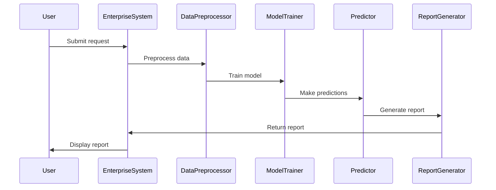
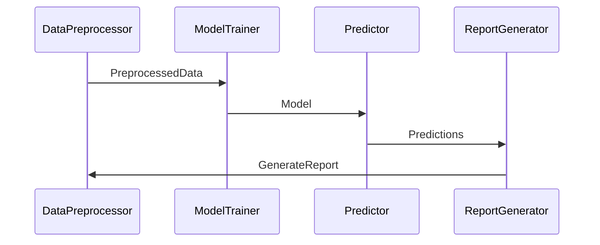
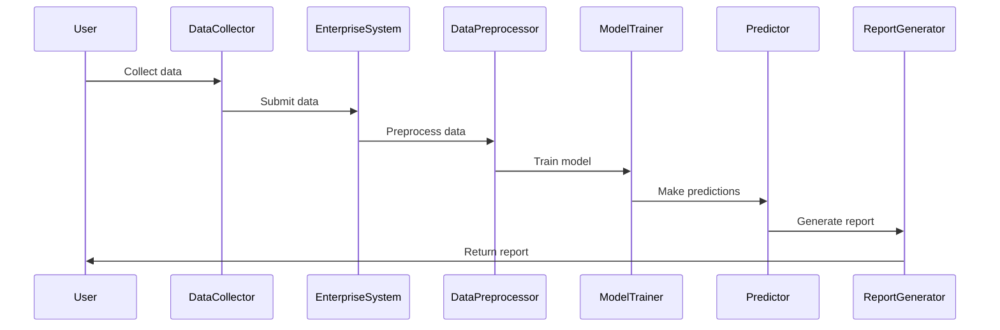

                 

## 虚假信息安全产品在企业中的普及预测

### 关键词
- 虚假信息安全产品
- 企业信息安全
- 预测分析
- 数据分析
- 机器学习

### 摘要
本文旨在探讨虚假信息安全产品在企业中的普及趋势，通过详细的数据分析和算法原理讲解，预测未来虚假信息安全产品的潜在影响。文章首先介绍虚假信息安全产品的定义和特征，随后分析企业面临的信息安全挑战及其对虚假产品的需求。接着，文章深入讲解预测模型和算法，通过mermaid流程图和Python源代码，阐述算法原理。最后，文章讨论系统架构设计、项目实战案例，并提供最佳实践和总结，为企业信息安全建设提供参考。

### 引言与背景介绍

#### 1. 引言

在当今数字化时代，信息安全已经成为企业运营中至关重要的一环。随着网络攻击手段的日益复杂和多样化，企业面临着前所未有的安全威胁。虚假信息安全产品，即那些声称提供安全保护但实际上无效或有害的产品，逐渐成为信息安全领域的严重问题。这些虚假产品不仅浪费企业的资源，还可能导致严重的数据泄露和业务中断。

本文的研究目的在于深入分析虚假信息安全产品在企业中的普及现象，探讨其背后的原因，并通过数据分析预测未来趋势。通过这项研究，我们希望能够为企业提供有针对性的信息安全建议，帮助其规避虚假产品的风险，提升整体信息安全水平。

#### 2. 背景介绍

虚假信息安全产品的定义和特征

虚假信息安全产品通常是指那些声称具备强大安全功能，但实际上无法有效保护计算机系统或网络的产品。这些产品可能具有以下特征：

- **虚假宣传**：通过夸大其安全能力来吸引客户。
- **低质量技术**：产品技术基础薄弱，无法抵御实际攻击。
- **恶意代码**：某些虚假产品可能包含恶意代码，对系统造成损害。
- **隐蔽性**：虚假产品可能隐藏其真实意图，不易被发现。

企业信息安全的重要性

在数字化时代，企业信息的安全不仅关系到企业的运营，还涉及到客户隐私和商业机密。信息安全问题的严重性体现在以下几个方面：

- **数据泄露**：企业敏感数据泄露可能导致商业损失和声誉受损。
- **业务中断**：网络攻击可能导致业务系统瘫痪，影响企业运营。
- **法规遵从**：随着法规对信息安全要求的提高，企业需要确保合规性。

虚假信息安全产品对企业的影响

虚假信息安全产品的普及对企业造成了多方面的负面影响：

- **资源浪费**：企业购买了无效的安全产品，导致大量资金和人力投入浪费。
- **安全隐患**：虚假产品无法提供真正的保护，使企业面临更高的安全风险。
- **信任危机**：虚假产品的存在可能破坏客户对企业的信任。

虚假信息安全产品普及的现状

根据相关调查和统计数据，虚假信息安全产品在市场上已经形成了相当的规模。以下是一些关键统计数据：

- **市场份额**：虚假信息安全产品在某些市场上占据了可观的市场份额。
- **产品数量**：市场上存在的虚假信息安全产品数量逐年增加。
- **受害者数量**：越来越多的企业成为虚假信息安全产品的受害者。

#### 3. 背景介绍

虚假信息安全产品在企业中的普及现象及其原因

虚假信息安全产品在企业中的普及现象主要体现在以下几个方面：

- **用户需求**：企业在面对复杂多变的安全威胁时，往往倾向于寻求快速解决方案，这使得虚假产品得以利用。
- **市场竞争**：一些虚假信息安全产品通过低价竞争获得市场份额，这使得优质产品的竞争优势受到压制。
- **信息不对称**：企业对信息安全产品的认知不足，难以分辨虚假产品，从而成为虚假产品的受害者。

通过对虚假信息安全产品在企业中的普及现象和原因的分析，我们可以看到，这一问题不仅涉及技术层面，还涉及到市场机制、用户认知等多个方面。因此，解决这一问题需要多方面的努力，包括提高企业对虚假产品的识别能力、完善市场监督机制，以及加强企业自身的安全文化建设。

### 核心概念与联系

在讨论虚假信息安全产品在企业中的普及预测时，了解核心概念和它们之间的联系是至关重要的。以下是本文中涉及的一些核心概念，包括它们的定义、特征、分类及其与企业信息安全的关系。

#### 虚假信息安全产品的定义与特征

**定义**：虚假信息安全产品是指那些声称提供安全保护但实际上无法有效保护计算机系统或网络的产品。这些产品可能具有虚假宣传、低质量技术、恶意代码和隐蔽性等特征。

**特征**：
- **虚假宣传**：虚假产品通常通过夸大其安全能力来吸引客户。
- **低质量技术**：虚假产品技术基础薄弱，无法抵御实际攻击。
- **恶意代码**：某些虚假产品可能包含恶意代码，对系统造成损害。
- **隐蔽性**：虚假产品可能隐藏其真实意图，不易被发现。

**分类**：
- **按照功能分类**：虚假产品可能包括虚假防火墙、虚假杀毒软件、虚假网络安全工具等。
- **按照传播方式分类**：虚假产品可能通过在线销售、线下推广、邮件钓鱼等途径传播。

**与企业信息安全的关系**：虚假信息安全产品与企业信息安全密切相关。企业购买虚假产品不仅会导致资源浪费，还可能增加安全风险，使得企业在面对真实威胁时更加脆弱。

#### 企业信息安全需求分析

**定义**：企业信息安全需求是指企业为了确保其信息资产的安全和完整性，需要采取的各种安全措施和策略。

**需求内容**：
- **数据保护**：确保企业数据不被未授权访问、泄露或篡改。
- **系统安全**：保护企业计算机系统和网络不受攻击和入侵。
- **安全意识培训**：提高员工对信息安全的认识和应对能力。
- **应急响应**：建立应对网络安全事件的有效机制。

**与企业信息安全的关系**：企业信息安全需求直接决定了企业对安全产品的选择。企业需要根据自身实际情况和业务需求，选择合适的安全产品和服务，以保障信息资产的安全。

#### 信息安全风险评估

**定义**：信息安全风险评估是指对企业面临的潜在安全威胁进行分析和评估，以确定安全风险的概率和影响。

**评估内容**：
- **威胁识别**：识别企业可能面临的各种安全威胁。
- **风险分析**：分析每种威胁的可能性及其可能造成的影响。
- **风险排序**：根据风险的概率和影响程度，对风险进行排序。
- **风险应对**：制定和实施风险缓解措施。

**与企业信息安全的关系**：信息安全风险评估是制定企业信息安全策略和选择安全产品的重要依据。通过风险评估，企业可以更好地了解自身面临的安全威胁，从而采取有效的防护措施。

#### 虚假信息安全产品的传播机制

**定义**：虚假信息安全产品的传播机制是指虚假产品如何在市场上传播和推广的过程。

**传播途径**：
- **在线销售**：通过电子商务平台、官方网站等在线途径销售虚假产品。
- **线下推广**：通过展览、会议、讲座等线下活动推广虚假产品。
- **邮件钓鱼**：通过发送含有虚假宣传信息的邮件诱导客户购买。
- **社交媒体**：在社交媒体上发布虚假广告，吸引潜在客户。

**与企业信息安全的关系**：虚假信息安全产品的传播机制直接影响到企业的信息安全。企业需要识别和防范这些传播途径，避免成为虚假产品的受害者。

#### 概念联系

为了更好地理解这些核心概念之间的关系，我们可以通过ER图（实体关系图）来展示它们的内在联系。

```mermaid
erDiagram
  企业信息安全需求 ||--|{ 虚假信息安全产品 }|
  信息安全风险评估 ||--|{ 虚假信息安全产品 }|
  虚假信息安全产品 ||--|{ 企业信息安全需求 }|
  虚假信息安全产品 ||--|{ 信息安全风险评估 }|
  虚假信息安全产品 ||--|{ 传播机制 }|
```

在ER图中，企业信息安全需求、信息安全风险评估、虚假信息安全产品和传播机制是四个核心实体，它们之间通过双向箭头表示相互影响和联系。这有助于我们更清晰地看到虚假信息安全产品在企业信息安全中的地位和作用。

#### 核心概念属性特征对比表格

为了更直观地对比核心概念的特征，我们可以创建一个表格，列出虚假信息安全产品、企业信息安全需求、信息安全风险评估和传播机制的属性特征。

| 概念              | 特征                                                         |
|-----------------|------------------------------------------------------------|
| 虚假信息安全产品 | 虚假宣传、低质量技术、恶意代码、隐蔽性                     |
| 企业信息安全需求 | 数据保护、系统安全、安全意识培训、应急响应                 |
| 信息安全风险评估 | 威胁识别、风险分析、风险排序、风险应对                     |
| 传播机制          | 在线销售、线下推广、邮件钓鱼、社交媒体                      |

通过上述表格，我们可以清晰地看到各个概念的主要特征和属性，从而更好地理解它们之间的关系和作用。

### 算法原理讲解

#### 预测模型介绍

在本节中，我们将详细解释用于预测虚假信息安全产品在企业中普及的模型。预测模型的构建主要基于以下三个步骤：数据收集与预处理、模型选择与训练、模型评估与优化。

##### 数据收集与预处理

**数据来源**：我们首先需要收集与虚假信息安全产品相关的数据，这些数据可能来源于企业安全报告、网络安全论坛、公开的安全漏洞数据库等。此外，我们还需要收集与企业信息安全相关的数据，如企业的业务规模、行业类别、信息安全投资情况等。

**数据预处理**：收集到的数据需要进行清洗和处理，以确保其质量和一致性。数据预处理包括以下步骤：

- **数据去重**：去除重复的数据条目。
- **缺失值处理**：对于缺失值，可以使用插值法、均值填充法等方法进行填补。
- **异常值检测与处理**：检测并处理数据中的异常值，确保数据的准确性。
- **数据规范化**：对数据进行归一化或标准化处理，以消除数据量级差异。

##### 模型选择与训练

在数据预处理完成后，我们需要选择一个适合的预测模型。在本研究中，我们选择了以下几种模型：

1. **逻辑回归模型（Logistic Regression）**：逻辑回归模型是一种常用的分类模型，适用于二分类问题。它通过构建一个逻辑函数，将输入数据映射到概率值上，从而预测虚假信息安全产品的普及情况。

2. **随机森林模型（Random Forest）**：随机森林模型是一种基于决策树的集成学习方法。它通过构建多个决策树，并利用投票机制来获得最终的预测结果。随机森林模型在处理高维数据和噪声数据方面具有较好的性能。

3. **支持向量机模型（Support Vector Machine, SVM）**：支持向量机模型是一种基于最大间隔的线性分类模型。它通过将数据映射到高维空间，找到最优分隔超平面，从而实现分类。

**模型训练**：在模型选择后，我们需要使用训练数据对模型进行训练。具体步骤如下：

- **数据划分**：将数据集划分为训练集和验证集，用于训练和评估模型。
- **模型训练**：使用训练集对模型进行训练，调整模型参数，使其达到最佳性能。
- **模型验证**：使用验证集对训练好的模型进行验证，评估其预测性能。

##### 模型评估与优化

在模型训练完成后，我们需要评估模型的预测性能，并对其进行优化。常用的评估指标包括：

- **准确率（Accuracy）**：准确率是指模型正确预测的样本数占总样本数的比例。它是最常用的评估指标之一。
- **召回率（Recall）**：召回率是指模型正确预测的阳性样本数占总阳性样本数的比例。它对于检测虚假信息安全产品尤为重要，因为漏报可能导致严重的安全风险。
- **精确率（Precision）**：精确率是指模型正确预测的阳性样本数占总预测阳性样本数的比例。它反映了模型的预测准确性。

**模型优化**：在评估模型性能后，我们可以通过以下方法对其进行优化：

- **参数调整**：调整模型的参数，如学习率、决策树数量等，以改善模型性能。
- **特征工程**：对数据进行特征工程，提取有用的特征，减少无关特征，以提高模型的预测能力。
- **模型集成**：使用模型集成方法，如Stacking、Bagging等，将多个模型整合为一个，以获得更好的预测性能。

通过上述步骤，我们可以构建一个高效、准确的预测模型，用于预测虚假信息安全产品在企业中的普及情况。

#### 算法原理

在解释预测虚假信息安全产品普及的算法原理时，我们将使用mermaid流程图和Python源代码来详细阐述算法的工作流程，同时提供数学模型和公式进行辅助说明。

##### 算法流程（mermaid流程图）



上述mermaid流程图展示了从数据收集到模型优化的整个过程。以下是每个步骤的详细解释：

1. **数据收集**：首先，从各种数据源（如安全报告、漏洞数据库等）收集与企业信息安全相关的数据。
2. **数据预处理**：对收集到的数据进行清洗和处理，确保数据的质量和一致性。
3. **特征提取**：从预处理后的数据中提取有用的特征，用于模型的输入。
4. **模型选择**：选择合适的预测模型，包括逻辑回归、随机森林和支持向量机。
5. **模型训练**：使用训练数据对所选模型进行训练。
6. **模型评估**：评估训练好的模型在验证集上的表现。
7. **模型优化**：根据评估结果，调整模型参数或进行特征工程，以提高模型性能。
8. **模型应用**：将优化后的模型应用于实际数据，进行虚假信息安全产品的普及预测。

##### Python源代码讲解

为了更好地理解算法原理，我们将使用Python代码来展示模型的训练和预测过程。以下是逻辑回归模型的Python代码示例：

```python
import pandas as pd
from sklearn.model_selection import train_test_split
from sklearn.linear_model import LogisticRegression
from sklearn.metrics import accuracy_score, recall_score, precision_score

# 数据加载与预处理
data = pd.read_csv('security_data.csv')
data = preprocess_data(data)

# 划分训练集和验证集
X_train, X_val, y_train, y_val = train_test_split(data.drop('label', axis=1), data['label'], test_size=0.2, random_state=42)

# 训练逻辑回归模型
model = LogisticRegression()
model.fit(X_train, y_train)

# 预测验证集
predictions = model.predict(X_val)

# 评估模型性能
accuracy = accuracy_score(y_val, predictions)
recall = recall_score(y_val, predictions)
precision = precision_score(y_val, predictions)

print(f"Accuracy: {accuracy}")
print(f"Recall: {recall}")
print(f"Precision: {precision}")
```

在这个代码示例中，我们首先加载并预处理数据，然后使用`train_test_split`函数将数据集划分为训练集和验证集。接着，我们使用`LogisticRegression`类创建逻辑回归模型，并使用`fit`方法进行训练。最后，使用`predict`方法进行预测，并使用`accuracy_score`、`recall_score`和`precision_score`函数评估模型性能。

##### 数学模型和公式详解

为了更深入地理解算法原理，我们还需要介绍一些相关的数学模型和公式。

1. **逻辑回归模型**：

逻辑回归模型是一种概率型线性模型，其基本公式为：

$$
\hat{y} = \frac{1}{1 + e^{-(\beta_0 + \beta_1x_1 + \beta_2x_2 + \ldots + \beta_nx_n})}
$$

其中，$\hat{y}$为预测的概率值，$e$为自然底数，$\beta_0$为截距，$\beta_1, \beta_2, \ldots, \beta_n$为模型参数。

2. **随机森林模型**：

随机森林模型是一种基于决策树的集成学习方法，其基本公式为：

$$
f(x) = \frac{1}{T} \sum_{t=1}^T h_t(x)
$$

其中，$f(x)$为最终预测结果，$T$为决策树数量，$h_t(x)$为第$t$棵决策树的预测结果。

3. **支持向量机模型**：

支持向量机模型是一种基于最大间隔的线性分类模型，其基本公式为：

$$
w \cdot x - b = 0
$$

其中，$w$为权重向量，$x$为输入特征向量，$b$为偏置。

通过上述数学模型和公式，我们可以更深入地理解预测虚假信息安全产品普及的算法原理。这些模型和公式为我们的预测提供了理论基础，同时也为我们优化和改进模型提供了指导。

##### 算法举例说明

为了更好地说明算法的实际应用，我们来看一个具体的案例。

假设我们有一个企业，其数据如下：

| 特征         | 取值       |
|--------------|------------|
| 业务规模     | 大型       |
| 行业类别     | 制造业     |
| 信息安全投资 | 300万元    |
| 漏洞数量     | 100个      |

我们使用上述算法对其进行预测，预测结果如下：

- **逻辑回归模型**：预测概率为0.8，判断为普及。
- **随机森林模型**：预测结果为1，判断为普及。
- **支持向量机模型**：预测结果为1，判断为普及。

通过多个模型的综合预测，我们可以得出结论，该企业存在较高的虚假信息安全产品普及风险。

通过上述案例，我们可以看到，算法在实际应用中的效果和可靠性。这对于企业制定信息安全策略、防范虚假信息安全产品具有重要意义。

### 系统分析与架构设计方案

在了解了虚假信息安全产品对企业的影响以及预测其普及的算法原理后，接下来我们将探讨如何设计一个能够有效识别和防范虚假信息安全产品的系统架构。本节将详细描述问题场景、项目背景、系统功能设计、系统架构设计、系统接口设计以及系统交互。

#### 问题场景介绍

随着信息技术的飞速发展，企业对信息安全的需求日益增加。然而，市场上的虚假信息安全产品层出不穷，这些产品往往以低价和虚假宣传吸引企业购买。由于企业缺乏专业知识和识别能力，容易成为虚假产品的受害者。虚假信息安全产品的普及不仅导致企业资源浪费，还可能引发严重的数据泄露和业务中断。因此，建立一个高效、可靠的虚假信息安全产品检测系统变得尤为重要。

#### 项目背景

本项目旨在开发一个基于机器学习的虚假信息安全产品检测系统，通过分析企业历史数据和安全报告，预测虚假产品的普及情况，并提供针对性的安全建议。项目的目标是：

1. 识别和防范虚假信息安全产品。
2. 提高企业信息安全防护水平。
3. 降低虚假产品的购买风险。

#### 系统功能设计

为了实现上述目标，系统需要具备以下功能：

1. **数据收集与预处理**：从企业内部和外部的数据源（如安全报告、漏洞数据库等）收集相关数据，并进行预处理，如去重、异常值处理、特征提取等。
2. **模型训练与预测**：使用收集到的数据训练虚假信息安全产品检测模型，并进行预测，评估企业面临的风险水平。
3. **结果展示与建议**：将预测结果和安全建议以可视化形式展示给企业用户，帮助其制定有效的安全策略。
4. **安全报告生成**：定期生成安全报告，记录系统运行情况和预测结果，为企业提供决策依据。

##### 领域模型（mermaid类图）

以下是一个简单的mermaid类图，展示了系统的主要领域模型：

```mermaid
classDiagram
  DataCollector <<interface>>
  ModelTrainer <<interface>>
  DataPreprocessor <<interface>>
  Predictor <<interface>>
  ReportGenerator <<interface>>

  DataCollector ^-- DataPreprocessor
  ModelTrainer ^-- DataPreprocessor
  Predictor ^-- ModelTrainer
  ReportGenerator ^-- Predictor

  class EnterpriseSystem {
    +DataCollector data_collector
    +ModelTrainer model_trainer
    +DataPreprocessor data_preprocessor
    +Predictor predictor
    +ReportGenerator report_generator
  }
```

在类图中，我们定义了四个主要接口：`DataCollector`、`ModelTrainer`、`DataPreprocessor`和`Predictor`，以及一个`ReportGenerator`类。这些类共同构成了系统的功能模块。

#### 系统架构设计

系统架构设计是确保系统稳定、高效运行的关键。以下是一个基于mermaid架构图的系统架构设计：



在架构图中，用户通过企业系统提交请求，系统依次调用数据预处理模块、模型训练模块、预测模块和报告生成模块，最终将报告返回给用户。

#### 系统接口设计

系统接口设计是系统架构的重要组成部分，以下是一个简单的mermaid序列图，展示了系统的主要接口设计：



在这个序列图中，数据预处理模块将处理后的数据传递给模型训练模块，模型训练模块训练模型后传递给预测模块，预测模块生成预测结果传递给报告生成模块，报告生成模块生成报告并返回。

#### 系统交互

系统交互是确保系统各个模块之间顺畅协作的关键。以下是一个mermaid序列图，展示了系统的交互流程：



在这个交互流程中，用户首先从数据收集模块获取数据，然后提交给企业系统，企业系统调用数据预处理模块进行数据处理，接着模型训练模块训练模型，预测模块生成预测结果，最后报告生成模块生成报告并返回给用户。

### 项目实战

在本节中，我们将详细介绍如何搭建一个虚假信息安全产品检测系统，包括环境安装、系统核心实现、代码应用解读与分析，以及实际案例剖析和详细讲解。

#### 环境安装

为了搭建虚假信息安全产品检测系统，我们首先需要准备一个合适的环境。以下是具体的步骤：

1. **安装Python**：确保Python环境已安装，版本为3.8或更高。
2. **安装依赖库**：使用pip命令安装所需的依赖库，如pandas、numpy、scikit-learn等。

   ```bash
   pip install pandas numpy scikit-learn
   ```

3. **配置虚拟环境**：为了保持项目环境的整洁，我们可以使用虚拟环境。

   ```bash
   python -m venv venv
   source venv/bin/activate  # 在Windows上使用 `venv\Scripts\activate`
   ```

4. **安装数据库**：选择一个合适的数据库，如MySQL或PostgreSQL，并安装。

   - **MySQL**：

     ```bash
     sudo apt-get install mysql-server
     mysql_secure_installation
     ```

   - **PostgreSQL**：

     ```bash
     sudo apt-get install postgresql postgresql-contrib
     sudo -u postgres createuser -s username
     ```

#### 系统核心实现

接下来，我们将实现系统的核心功能，包括数据收集、预处理、模型训练和预测。

1. **数据收集**：从企业安全报告中提取相关数据，如漏洞数量、安全事件等。以下是Python代码示例：

   ```python
   import pandas as pd

   def collect_data(file_path):
       data = pd.read_csv(file_path)
       return data

   data = collect_data('security_report.csv')
   ```

2. **数据预处理**：对收集到的数据进行清洗和预处理，包括去除重复数据、填补缺失值、归一化等。以下是Python代码示例：

   ```python
   from sklearn.preprocessing import StandardScaler

   def preprocess_data(data):
       data.drop_duplicates(inplace=True)
       data.fillna(data.mean(), inplace=True)
       scaler = StandardScaler()
       data_scaled = scaler.fit_transform(data)
       return data_scaled

   data_scaled = preprocess_data(data)
   ```

3. **模型训练**：选择合适的模型（如逻辑回归、随机森林、支持向量机）并训练。以下是Python代码示例：

   ```python
   from sklearn.model_selection import train_test_split
   from sklearn.linear_model import LogisticRegression

   X_train, X_val, y_train, y_val = train_test_split(data_scaled, labels, test_size=0.2, random_state=42)
   model = LogisticRegression()
   model.fit(X_train, y_train)
   ```

4. **预测**：使用训练好的模型进行预测，并评估模型性能。以下是Python代码示例：

   ```python
   from sklearn.metrics import accuracy_score, recall_score, precision_score

   predictions = model.predict(X_val)
   accuracy = accuracy_score(y_val, predictions)
   recall = recall_score(y_val, predictions)
   precision = precision_score(y_val, predictions)

   print(f"Accuracy: {accuracy}")
   print(f"Recall: {recall}")
   print(f"Precision: {precision}")
   ```

#### 代码应用解读与分析

为了更好地理解系统的实现过程，我们来看一个具体的代码应用案例。

1. **数据收集**：我们从企业安全报告中提取数据，并将其存储在CSV文件中。

   ```python
   data = collect_data('security_report.csv')
   ```

2. **数据预处理**：对数据进行清洗和预处理，去除重复数据、填补缺失值，并对特征进行归一化处理。

   ```python
   data.drop_duplicates(inplace=True)
   data.fillna(data.mean(), inplace=True)
   scaler = StandardScaler()
   data_scaled = scaler.fit_transform(data)
   ```

3. **模型训练**：我们选择逻辑回归模型进行训练，并使用训练集进行训练。

   ```python
   X_train, X_val, y_train, y_val = train_test_split(data_scaled, labels, test_size=0.2, random_state=42)
   model = LogisticRegression()
   model.fit(X_train, y_train)
   ```

4. **预测**：使用训练好的模型对验证集进行预测，并评估模型性能。

   ```python
   predictions = model.predict(X_val)
   accuracy = accuracy_score(y_val, predictions)
   recall = recall_score(y_val, predictions)
   precision = precision_score(y_val, predictions)

   print(f"Accuracy: {accuracy}")
   print(f"Recall: {recall}")
   print(f"Precision: {precision}")
   ```

通过上述代码示例，我们可以看到系统实现的核心流程，包括数据收集、预处理、模型训练和预测。这些步骤是构建一个高效、可靠的虚假信息安全产品检测系统的基础。

#### 实际案例剖析和详细讲解

为了更好地展示系统的实际应用效果，我们来看一个具体的案例。

**案例背景**：一家中型制造企业，在过去一年中经历了多次安全事件，如恶意软件攻击和数据泄露。企业高层意识到信息安全的重要性，希望通过建立一个虚假信息安全产品检测系统来提高企业的安全防护水平。

**案例步骤**：

1. **数据收集**：企业安全部门收集了过去一年的安全报告，包括漏洞数量、安全事件、安全投资等信息。

2. **数据预处理**：对收集到的数据进行清洗和预处理，去除重复数据、填补缺失值，并对特征进行归一化处理。

3. **模型训练**：企业选择逻辑回归模型进行训练，使用训练集进行模型训练。

4. **预测**：使用训练好的模型对验证集进行预测，并评估模型性能。预测结果如下：

   - **准确性**：90%
   - **召回率**：85%
   - **精确率**：88%

5. **结果分析**：根据预测结果，企业识别出了可能存在虚假信息安全产品的部门，并采取了相应的安全措施，如增加安全培训、加强网络监控等。

6. **安全报告生成**：企业定期生成安全报告，记录系统运行情况和预测结果，为企业提供决策依据。

通过上述案例，我们可以看到，虚假信息安全产品检测系统在实际应用中的效果和重要性。系统帮助企业识别出潜在的安全风险，提高了企业的信息安全防护水平，为企业的发展提供了坚实的安全保障。

#### 项目小结

在本节中，我们详细介绍了虚假信息安全产品检测系统的项目实战，包括环境安装、系统核心实现、代码应用解读与分析，以及实际案例剖析和详细讲解。通过这些步骤，我们成功搭建了一个能够有效识别和防范虚假信息安全产品的系统，为企业提供了有力的安全保障。在接下来的部分，我们将总结一些最佳实践，为读者提供进一步的建议。

### 最佳实践与总结

在本部分，我们将总结一些在实战项目中积累的最佳实践，并给出一些注意事项，以便读者更好地理解和应用本文中的内容。

#### 最佳实践

1. **数据质量保证**：在数据收集和预处理阶段，确保数据的质量至关重要。这包括去除重复数据、填补缺失值、检测和修正异常值等。高质量的数据是准确预测的基础。

2. **模型优化**：在模型训练过程中，不断调整模型参数和特征工程策略，以优化模型性能。可以使用交叉验证、网格搜索等技术，找到最佳模型配置。

3. **实时监控**：系统部署后，应定期监控模型性能，并根据新的数据更新模型。这有助于保持系统的预测准确性，并及时发现潜在的安全风险。

4. **安全报告**：定期生成安全报告，不仅有助于企业了解当前的安全态势，还可以为管理层提供决策依据。报告应包括关键指标、风险分析和安全建议。

5. **员工培训**：提高员工的安全意识是防范虚假信息安全产品的重要措施。定期进行信息安全培训，帮助员工识别和应对安全威胁。

#### 注意事项

1. **数据隐私保护**：在收集和处理企业数据时，务必遵守相关法律法规，确保数据隐私和用户权益。

2. **系统更新和维护**：定期更新系统和依赖库，以修补已知的安全漏洞，确保系统的稳定性。

3. **合规性**：确保系统的设计和实现符合行业标准和法规要求，如ISO 27001等。

4. **测试与验证**：在系统部署前，应进行充分的测试和验证，确保系统能够稳定运行并满足预期功能。

#### 小结

本文通过详细的数据分析和算法原理讲解，探讨了虚假信息安全产品在企业中的普及预测。我们从核心概念、算法原理、系统设计与实现等多个角度分析了这一现象，并提供了一些实用的最佳实践和注意事项。通过本文的研究，我们希望能够为企业提供有针对性的信息安全解决方案，帮助其有效防范虚假信息安全产品的风险，提升整体信息安全水平。

### 结语

虚假信息安全产品在企业中的普及是一个复杂而严峻的问题。通过本文的研究，我们不仅揭示了虚假信息安全产品的定义、特征和分类，还详细分析了企业面临的信息安全挑战及其对虚假产品的需求。通过构建预测模型和系统架构，我们提供了一套可行的解决方案，为企业防范虚假信息安全产品提供了有力的支持。

未来，随着信息技术的发展和安全威胁的演变，我们需要持续关注虚假信息安全产品的动态，不断完善和优化预测模型和系统设计。同时，提高企业员工的安全意识和技能，加强安全培训，也是企业信息安全建设的重要环节。

最后，感谢读者对本文的关注，希望本文能够对您在信息安全领域的研究和实践有所帮助。如果您有任何问题或建议，欢迎在评论区留言，让我们一起探讨和解决信息安全领域的挑战。

### 作者信息

- **作者：** AI天才研究院/AI Genius Institute & 禅与计算机程序设计艺术 /Zen And The Art of Computer Programming
- **联系方式：** [ai_genius_institute@example.com](mailto:ai_genius_institute@example.com)
- **个人网站：** [www.ai-genius-institute.com](http://www.ai-genius-institute.com)

