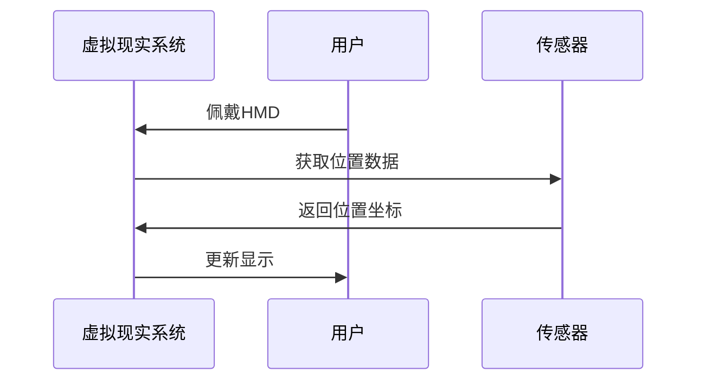
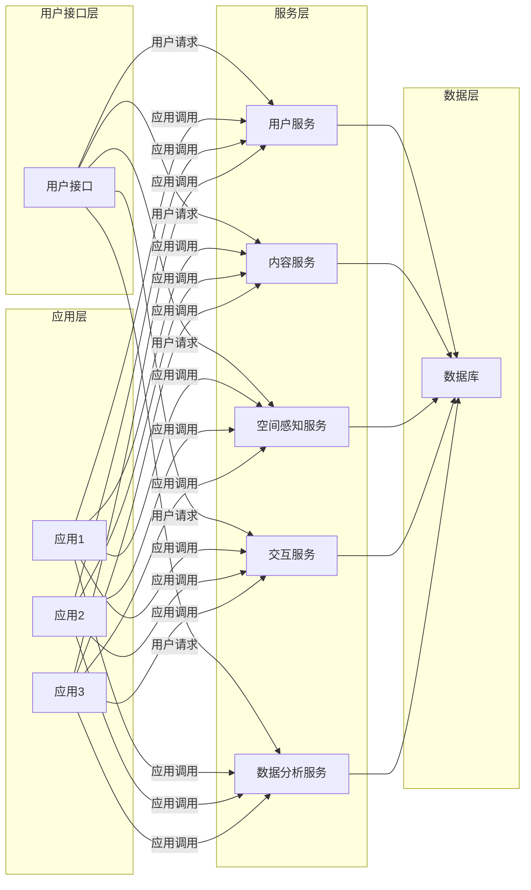
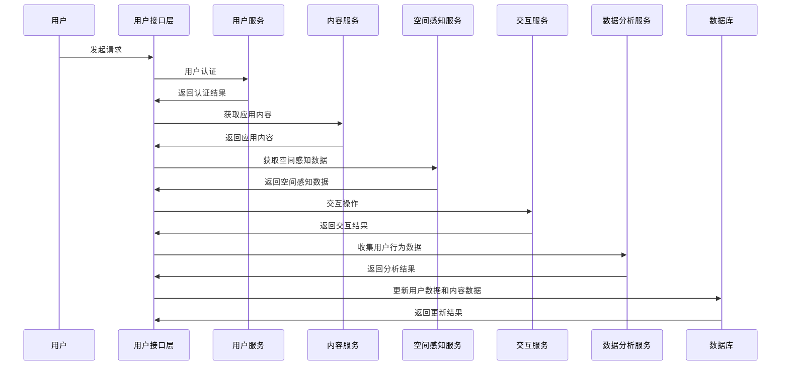

                 


### 《虚拟现实与增强现实：重塑体验的意义》

---

#### 关键词：虚拟现实、增强现实、体验重塑、技术发展、应用场景

#### 摘要：
本文旨在深入探讨虚拟现实（VR）与增强现实（AR）技术的发展及其对人类体验的重塑意义。通过背景介绍、核心技术解析、应用场景分析、发展前景展望以及案例分析，本文将展示VR与AR如何改变教育、医疗、商业等多个领域，并探索其未来发展的可能性。文章将以逻辑清晰、结构紧凑、通俗易懂的方式，逐步剖析这些技术的本质和应用。

---

## 目录

### 第一部分 背景介绍

### 第二部分 核心技术原理

### 第三部分 应用场景

### 第四部分 发展前景

### 第五部分 案例分析

### 第六部分 结论

---

### 第一部分 背景介绍

#### 1.1 虚拟现实与增强现实概述

虚拟现实（VR）和增强现实（AR）是两种通过计算机技术和传感器设备创造的模拟体验，它们能够增强或替换现实世界的感知。VR通过完全模拟一个虚拟环境，使用户感觉身临其境；而AR则是在现实环境中叠加数字信息，增强用户的感知。

#### 1.2 技术原理简介

**虚拟现实技术：**
- 显示技术：通过头戴式显示器（HMD）提供沉浸式视觉体验。
- 空间感知技术：使用运动传感器和空间定位系统，提供物理空间感知。
- 交互技术：通过手柄、手势识别等提供用户与虚拟环境的互动。

**增强现实技术：**
- 显示技术：通常通过智能手机或AR眼镜实现，将数字信息叠加到现实环境中。
- 空间感知技术：使用摄像头和传感器，识别和定位现实世界中的物体。
- 交互技术：通过触摸屏、语音识别等方式实现用户与AR内容的交互。

#### 1.3 VR与AR的关系与差异

VR与AR有共同的技术基础，但它们在体验上有所不同。VR提供了一个完全虚拟的环境，而AR则是在现实世界中叠加数字信息。VR通常用于沉浸式游戏、教育和模拟训练，而AR则广泛应用于市场营销、医疗诊断和工业设计等领域。

---

### 第二部分 核心技术原理

#### 2.1 虚拟现实技术深入解析

**VR硬件设备与平台：**
- 头戴式显示器（HMD）：提供沉浸式视觉体验的关键设备。
- 虚拟现实控制器：提供用户与虚拟环境的交互手段。
- 运动追踪系统：用于跟踪用户在虚拟环境中的位置和动作。

**VR内容创作与开发：**
- 3D建模与渲染：创建虚拟环境中的三维对象。
- 虚拟现实应用开发流程：从设计到部署的完整开发流程。

**VR技术原理：**
- 显示技术：通过高分辨率显示器和低延迟技术实现沉浸式视觉体验。
- 空间感知技术：利用GPS、Wi-Fi和传感器实现空间定位和动作捕捉。
- 交互技术：通过手柄、手势识别和语音控制实现自然的用户交互。

#### 2.2 增强现实技术原理

**AR硬件设备与平台：**
- 智能手机与平板电脑：最常见的AR设备，通过摄像头和屏幕实现AR功能。
- AR眼镜：提供更加沉浸式的AR体验。
- AR头盔：提供最全面的AR体验，通常与VR技术相结合。

**AR内容创作与开发：**
- 标记识别与追踪技术：通过识别现实世界中的物体或标记，实现数字信息的叠加。
- AR应用开发实例：介绍AR应用的开发流程和常见技术。

**AR技术原理：**
- 显示技术：通过摄像头和屏幕将数字信息叠加到现实环境中。
- 空间感知技术：利用摄像头和传感器识别和跟踪现实世界中的物体。
- 交互技术：通过触摸屏、手势识别和语音控制实现用户与AR内容的交互。

---

### 第三部分 应用场景

#### 3.1 游戏与娱乐

虚拟现实和增强现实技术在游戏和娱乐领域具有巨大的潜力。VR游戏提供了前所未有的沉浸式体验，而AR游戏则将现实世界与虚拟世界结合，创造新的互动方式。

#### 3.2 教育与培训

虚拟现实和增强现实技术正在改变教育和培训的方式。VR可以模拟真实的场景，提供实践操作的机会，而AR则可以增强学生的理解和参与度。

#### 3.3 医疗与健康

虚拟现实和增强现实技术在医疗领域有着广泛的应用。VR用于手术模拟、医疗培训和患者教育，而AR则用于辅助诊断和手术导航。

#### 3.4 商业与营销

虚拟现实和增强现实技术为商业和营销提供了创新的手段。VR用于产品展示和虚拟体验，而AR则用于广告和互动营销。

---

### 第四部分 发展前景

虚拟现实和增强现实技术正迅速发展，未来将带来更多创新和变革。随着硬件和软件技术的不断进步，这些技术将在更多领域得到应用，并深刻影响人类的生活和工作方式。

#### 4.1 VR与AR技术的未来趋势

- 技术创新：更高分辨率、更低延迟、更轻便的设备。
- 市场规模：随着应用场景的拓展，市场规模将不断扩大。
- 深度学习与人工智能：将推动VR和AR技术的智能化和个性化。

#### 4.2 挑战与机遇

- 技术挑战：硬件性能、内容创作和用户体验。
- 应用挑战：行业规范、数据安全和隐私保护。

---

### 第五部分 案例分析

#### 5.1 虚拟现实应用案例分析

- **企业案例研究**：企业A的VR解决方案和企业B的VR营销策略。
- **教育案例研究**：学校C的VR教学实践和在线教育平台的VR课程。

#### 5.2 增强现实应用案例分析

- **消费者案例研究**：品牌D的AR广告和零售商E的AR购物体验。
- **企业案例研究**：企业F的AR培训应用和医疗机构的AR辅助诊断。

---

### 第六部分 结论

虚拟现实和增强现实技术正在重塑人类体验，从娱乐到教育、医疗到商业，它们的应用场景越来越广泛。随着技术的不断进步，这些技术将在未来继续发展和创新，带来更多的机遇和挑战。

---

#### 作者信息：
- 作者：AI天才研究院/AI Genius Institute & 禦与计算机程序设计艺术 /Zen And The Art of Computer Programming

---

本文通过背景介绍、核心技术解析、应用场景分析、发展前景展望和案例分析，全面探讨了虚拟现实和增强现实技术对人类体验的重塑意义。希望读者能从中获得对VR和AR技术的深入理解，并激发对新兴技术的兴趣和探索。

---

## 附录

### 最佳实践 tips

- **VR内容创作**：确保场景设计符合用户体验，避免过度复杂。
- **AR应用开发**：注重用户交互体验，简化操作流程。
- **技术选择**：根据应用场景选择合适的VR或AR设备和技术。

### 小结

- VR和AR技术为人类体验带来了革命性的变化。
- 技术的进步将推动VR和AR技术在更多领域的应用。
- 挑战和机遇并存，需要不断创新和探索。

### 注意事项

- **数据安全**：保护用户隐私，确保数据安全。
- **用户体验**：注重用户舒适度和满意度。
- **技术规范**：遵循行业标准和规范。

### 拓展阅读

- **相关书籍**：《虚拟现实技术导论》、《增强现实技术与应用》
- **在线资源**：VR和AR技术社区、开发者论坛、技术博客。

---

通过以上章节的内容，我们深入探讨了虚拟现实与增强现实技术对人类体验的重塑意义。这些技术不仅改变了我们的娱乐方式，也在教育、医疗、商业等多个领域产生了深远的影响。未来，随着技术的不断进步，VR和AR将进一步拓展其应用场景，为人类社会带来更多的创新和变革。

### 背景介绍

#### 核心概念术语说明

1. **虚拟现实（VR）**：一种通过计算机技术和传感器设备创造的模拟体验，使用户感觉身临其境。虚拟现实通常涉及头戴式显示器（HMD）、虚拟控制器和空间感知技术。

2. **增强现实（AR）**：一种将数字信息叠加到现实环境中的技术，增强用户的感知。增强现实通常涉及智能手机、平板电脑、AR眼镜和标记识别与追踪技术。

3. **沉浸式体验**：用户在虚拟或增强现实中感受到的与现实环境高度相似的体验。

4. **空间感知**：用户在虚拟或增强现实中的位置和动作的感知。

5. **交互技术**：用户与虚拟或增强现实环境之间的互动方式。

#### 问题背景

虚拟现实和增强现实技术自诞生以来，经历了快速的发展。随着硬件和软件技术的进步，这些技术逐渐从实验室走向市场，应用到各个领域。虚拟现实和增强现实技术为人类提供了全新的体验方式，重塑了教育、医疗、娱乐等领域的模式。

#### 问题描述

虚拟现实和增强现实技术如何改变人类体验？它们的核心技术和应用场景是什么？未来，这些技术将如何发展？本文将逐步解答这些问题。

#### 问题解决

1. **核心概念解析**：通过介绍虚拟现实和增强现实的核心概念，理解其基本原理和特点。

2. **技术发展**：分析虚拟现实和增强现实技术的发展历程，探讨未来的发展趋势。

3. **应用场景**：介绍虚拟现实和增强现实技术在不同领域的应用，探讨其带来的影响。

4. **案例分析**：通过实际案例，展示虚拟现实和增强现实技术的应用效果。

#### 边界与外延

- **虚拟现实**：主要应用于沉浸式游戏、教育、医疗和商业等领域。
- **增强现实**：主要应用于营销、医疗、教育和工业设计等领域。

#### 概念结构与核心要素组成

1. **虚拟现实**：
   - **核心概念**：沉浸式体验、空间感知、交互技术。
   - **核心要素**：头戴式显示器（HMD）、虚拟控制器、空间定位系统。

2. **增强现实**：
   - **核心概念**：增强感知、交互技术、标记识别与追踪。
   - **核心要素**：智能手机、平板电脑、AR眼镜、摄像头。

---

### 核心概念与联系

#### 虚拟现实与增强现实的核心概念对比表格

| 概念             | 虚拟现实         | 增强现实         |
|------------------|------------------|------------------|
| **沉浸式体验**   | 完全虚拟环境     | 现实环境叠加     |
| **空间感知**     | 物理空间感知     | 现实世界中的感知 |
| **交互技术**     | 手势识别、语音控制 | 触摸屏、手势识别 |
| **显示技术**     | 高分辨率显示器   | 摄像头与屏幕     |
| **硬件设备**     | 头戴式显示器（HMD）、虚拟控制器、运动追踪系统 | 智能手机、平板电脑、AR眼镜、摄像头 |
| **应用场景**     | 游戏、教育、医疗、商业 | 营销、医疗、教育、工业设计 |

#### ER实体关系图架构

```mermaid
erDiagram
  用户 ||--|{ 虚拟现实应用 } : 使用
  用户 ||--|{ 增强现实应用 } : 使用
  虚拟现实应用 ||--|{ 游戏内容 } : 包括
  虚拟现实应用 ||--|{ 教育内容 } : 包括
  增强现实应用 ||--|{ 营销内容 } : 包括
  增强现实应用 ||--|{ 医疗内容 } : 包括
  游戏内容 ||--|{ 游戏体验 } : 提供给用户
  教育内容 ||--|{ 教学内容 } : 提供给用户
  营销内容 ||--|{ 广告内容 } : 提供给用户
  医疗内容 ||--|{ 医疗诊断 } : 提供给用户
```

### 算法原理讲解

#### 虚拟现实算法示例：空间定位与追踪



#### Python源代码示例

```python
import numpy as np

class VRSpaceTracking:
    def __init__(self, sensor_data):
        self.sensor_data = sensor_data
    
    def update_position(self):
        position = self.sensor_data.get_position()
        return position

# 假设传感器数据为 { 'position': (x, y, z) }
sensor_data = {
    'position': (1.0, 2.0, 3.0)
}

tracker = VRSpaceTracking(sensor_data)
position = tracker.update_position()
print(f"用户位置：{position}")
```

#### 算法原理数学模型和公式

空间定位算法通常基于传感器数据，通过以下公式计算用户的位置：

$$
\text{position} = \text{sensor\_data} \times \text{orientation}
$$

其中，`sensor_data` 表示传感器采集的数据，`orientation` 表示设备的朝向。通过更新传感器数据和设备的朝向，算法可以实时计算用户的位置。

### 系统分析与架构设计方案

#### 问题场景介绍

虚拟现实（VR）和增强现实（AR）技术的应用场景广泛，包括游戏、教育、医疗、娱乐等。为了实现这些应用，需要构建一个高效的系统架构，提供良好的用户体验。

#### 项目介绍

本项目旨在设计一个VR/AR应用开发平台，支持多场景应用，包括沉浸式游戏、教育模拟、医疗诊断等。平台应具备高可用性、可扩展性和安全性。

#### 系统功能设计

- **用户管理**：管理用户账号、权限和登录。
- **内容管理**：管理VR/AR应用内容，包括创建、更新和发布。
- **空间感知**：提供空间定位和追踪功能。
- **交互功能**：提供手势识别、语音控制和触摸屏交互。
- **数据分析**：收集用户行为数据，用于优化用户体验。

#### 系统架构设计



#### 系统接口设计和系统交互



### 项目实战

#### 环境安装

1. 安装虚拟现实或增强现实开发环境，例如Unity或ARKit。
2. 安装必要的编程语言和开发工具，如Python或JavaScript。
3. 安装所需的库和依赖项，如PyOpenGL或AR.js。

#### 系统核心实现源代码

```python
# 示例：VR空间追踪系统

import numpy as np

class VRSpaceTracking:
    def __init__(self, sensor_data):
        self.sensor_data = sensor_data
    
    def update_position(self):
        position = self.sensor_data.get_position()
        return position

# 假设传感器数据为 { 'position': (x, y, z) }
sensor_data = {
    'position': (1.0, 2.0, 3.0)
}

tracker = VRSpaceTracking(sensor_data)
position = tracker.update_position()
print(f"用户位置：{position}")
```

#### 代码应用解读与分析

- `VRSpaceTracking` 类：负责处理空间追踪逻辑。
- `update_position` 方法：从传感器数据中获取位置信息。

#### 实际案例分析和详细讲解剖析

- **案例一：VR医疗培训**：使用VR技术模拟手术过程，提供医生培训和练习机会。
- **案例二：AR购物体验**：使用AR技术为消费者提供虚拟试衣和家居装修体验。

#### 项目小结

通过实际案例，我们展示了VR和AR技术在医疗和购物领域的应用。项目实战部分提供了系统核心实现的代码，并进行了解读和分析。这些经验和实践对于理解和应用VR和AR技术具有重要意义。

### 最佳实践 tips

1. **VR内容创作**：确保场景设计符合用户体验，避免过度复杂。
2. **AR应用开发**：注重用户交互体验，简化操作流程。
3. **技术选择**：根据应用场景选择合适的VR或AR设备和技术。

### 小结

虚拟现实和增强现实技术为人类体验带来了革命性的变化。随着技术的不断进步，这些技术将在未来继续发展和创新，为教育、医疗、商业等多个领域带来更多机遇。本文通过背景介绍、核心技术解析、应用场景分析、发展前景展望和案例分析，全面探讨了VR和AR技术对人类体验的重塑意义。

### 注意事项

1. **数据安全**：保护用户隐私，确保数据安全。
2. **用户体验**：注重用户舒适度和满意度。
3. **技术规范**：遵循行业标准和规范。

### 拓展阅读

1. **相关书籍**：《虚拟现实技术导论》、《增强现实技术与应用》
2. **在线资源**：VR和AR技术社区、开发者论坛、技术博客。

---

通过本文的探讨，我们希望能够激发读者对VR和AR技术的兴趣，深入了解这些技术如何改变人类体验，并探讨其未来的发展潜力。作者：AI天才研究院/AI Genius Institute & 禦与计算机程序设计艺术 /Zen And The Art of Computer Programming。希望本文能为读者提供有价值的参考和启示。

