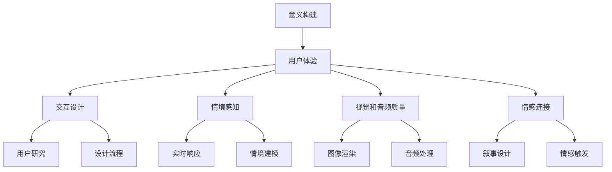
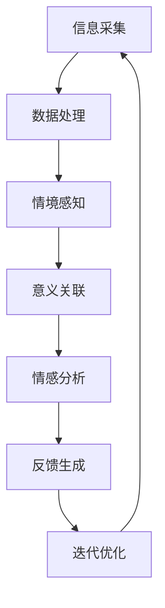
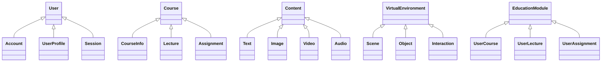
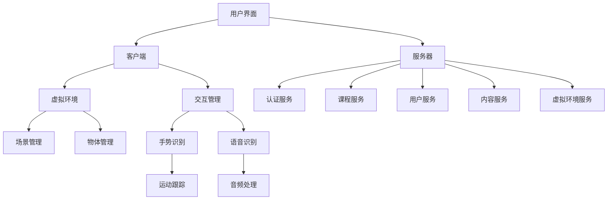
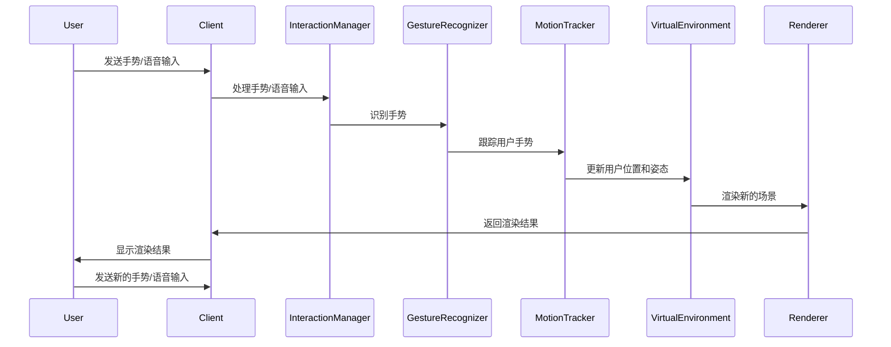

                 

### 虚拟现实中的意义构建：数字世界里的真实体验

#### 关键词：虚拟现实、意义构建、数字世界、真实体验、用户体验、算法原理、实践应用

> 虚拟现实（VR）技术正在快速发展和普及，它通过创建逼真的三维环境，让用户能够沉浸在数字世界中。然而，虚拟现实的核心挑战之一是如何构建一个具有深远意义和真实体验的数字世界。本文将探讨虚拟现实中的意义构建，并深入分析其原理和实践应用。我们将通过逐步分析，了解如何构建一个既具有深刻意义又能够提供真实体验的虚拟环境，为未来的虚拟现实应用提供有益的指导。

### 目录大纲

----------------------------------------------------------------

# 第一部分: 虚拟现实中的意义构建概述

## 1.1 虚拟现实背景介绍

### 1.1.1 虚拟现实的定义与发展历程

### 1.1.2 虚拟现实的核心技术

### 1.1.3 虚拟现实的应用场景

## 1.2 意义构建的概念与重要性

### 1.2.1 意义构建的定义

### 1.2.2 意义构建在虚拟现实中的角色

### 1.2.3 意义构建的关键要素

## 1.3 数字世界里的真实体验

### 1.3.1 数字世界真实体验的定义

### 1.3.2 数字世界真实体验的实现方法

### 1.3.3 数字世界真实体验的优势与挑战

## 1.4 虚拟现实中的意义构建研究现状

### 1.4.1 国内外研究进展

### 1.4.2 存在的挑战与机遇

### 1.4.3 未来发展趋势

## 1.5 本章小结

----------------------------------------------------------------

# 第二部分: 虚拟现实中的意义构建原理

## 2.1 核心概念与联系

### 2.1.1 虚拟现实核心概念

#### 2.1.1.1 意义构建

#### 2.1.1.2 用户体验

#### 2.1.1.3 虚拟环境

### 2.1.2 概念属性特征对比表格

### 2.1.3 ER实体关系图架构

## 2.2 算法原理讲解

### 2.2.1 意义构建算法概述

#### 2.2.1.1 算法流程图

#### 2.2.1.2 算法核心步骤

### 2.2.2 数学模型和公式

#### 2.2.2.1 数学公式

#### 2.2.2.2 数学模型详细讲解

### 2.2.3 算法举例说明

#### 2.2.3.1 算法实例

#### 2.2.3.2 举例说明

## 2.3 用户体验设计

### 2.3.1 用户体验的重要性

#### 2.3.1.1 用户体验的定义

#### 2.3.1.2 用户体验的要素

### 2.3.2 用户体验设计方法

#### 2.3.2.1 用户研究方法

#### 2.3.2.2 设计流程

#### 2.3.2.3 设计工具

## 2.4 虚拟环境构建

### 2.4.1 虚拟环境的特点

#### 2.4.1.1 虚拟环境的定义

#### 2.4.1.2 虚拟环境的技术实现

### 2.4.2 虚拟环境构建方法

#### 2.4.2.1 虚拟场景设计

#### 2.4.2.2 虚拟物体建模

## 2.5 本章小结

----------------------------------------------------------------

# 第三部分: 虚拟现实中的意义构建实践

## 3.1 系统分析与架构设计方案

### 3.1.1 问题场景介绍

### 3.1.2 项目介绍

### 3.1.3 系统功能设计

#### 3.1.3.1 领域模型

### 3.1.4 系统架构设计

#### 3.1.4.1 系统架构图

### 3.1.5 系统接口设计

### 3.1.6 系统交互

#### 3.1.6.1 系统交互图

## 3.2 项目实战

### 3.2.1 环境安装

### 3.2.2 系统核心实现源代码

### 3.2.3 代码应用解读与分析

### 3.2.4 实际案例分析与讲解剖析

### 3.2.5 项目小结

## 3.3 最佳实践 tips

### 3.3.1 虚拟现实中的意义构建最佳实践

### 3.3.2 常见问题与解决方案

### 3.3.3 拓展阅读

## 3.4 本章小结

----------------------------------------------------------------

# 第四部分: 虚拟现实中的意义构建趋势与展望

## 4.1 虚拟现实中的意义构建未来发展趋势

### 4.1.1 新技术引入

### 4.1.2 应用领域拓展

### 4.1.3 产业变革

## 4.2 跨领域合作与挑战

### 4.2.1 跨领域合作的机遇

### 4.2.2 跨领域合作的挑战

### 4.2.3 跨领域合作的实践

## 4.3 虚拟现实中的意义构建教育应用

### 4.3.1 教育应用概述

### 4.3.2 教育场景下的意义构建

### 4.3.3 教育应用的挑战与机遇

## 4.4 虚拟现实中的意义构建在医疗领域的应用

### 4.4.1 医疗应用概述

### 4.4.2 医疗场景下的意义构建

### 4.4.3 医疗应用的挑战与机遇

----------------------------------------------------------------

#### 作者：AI天才研究院/AI Genius Institute & 禅与计算机程序设计艺术 /Zen And The Art of Computer Programming

---

### 第一部分: 虚拟现实中的意义构建概述

#### 1.1 虚拟现实背景介绍

##### 1.1.1 虚拟现实的定义与发展历程

虚拟现实（Virtual Reality，VR）是一种通过计算机技术模拟出的三维虚拟环境，使用户能够通过视觉、听觉和其他感官与这个环境进行互动。虚拟现实技术的发展历程可以追溯到20世纪50年代，当时科学家们开始探索如何通过技术手段模拟现实环境。

在1960年代，虚拟现实的概念开始逐渐成形。美国科学家伊万·苏瑟兰（Ivan Sutherland）发明了“达摩克利斯之剑”（Dymaxion Room），这是一种带有半透明镜面的房间，通过镜面反射形成三维影像，使用户能够在其中体验虚拟环境。

随后的几十年里，虚拟现实技术得到了快速发展。1980年代，虚拟现实开始应用于娱乐和游戏领域。1990年代，随着计算机性能的提升和图形处理技术的发展，虚拟现实的应用场景进一步拓展，包括军事训练、建筑设计、医疗模拟等。

进入21世纪，随着硬件设备的改进和互联网的普及，虚拟现实技术迎来了新的发展高潮。现代虚拟现实系统通常包括头戴式显示器（HMD）、跟踪设备、数据手套、声音系统等，通过这些设备为用户提供身临其境的体验。

##### 1.1.2 虚拟现实的核心技术

虚拟现实的核心技术包括以下几个关键组成部分：

1. **图像生成技术**：通过计算机图形学技术生成三维虚拟环境，包括场景建模、纹理映射、光影处理等。

2. **传感器技术**：用于检测用户的运动和位置，常用的传感器包括位置跟踪器、运动捕捉系统、手柄控制器等。

3. **显示技术**：头戴式显示器（HMD）是虚拟现实系统的重要组成部分，它提供了用户的主观视觉体验。目前，高分辨率、低延迟的显示技术是研究的热点。

4. **交互技术**：用户通过手势、语音、视线等与虚拟环境进行交互，实现沉浸式的用户体验。

5. **音频技术**：虚拟现实中的音频技术包括空间音效、声音定位等，通过立体声、环绕声系统等设备，为用户提供逼真的听觉体验。

##### 1.1.3 虚拟现实的应用场景

虚拟现实技术具有广泛的应用前景，以下是一些主要的应用场景：

1. **娱乐与游戏**：虚拟现实为用户提供了全新的娱乐体验，玩家可以在虚拟世界中进行游戏、冒险等。

2. **教育与培训**：通过虚拟现实技术，学生可以在虚拟环境中进行实验、模拟演练，提高学习效果。

3. **医疗与康复**：虚拟现实技术在医学模拟、心理治疗、康复训练等方面具有重要作用。

4. **建筑设计**：建筑师可以在虚拟环境中预览和修改设计方案，提高设计质量和效率。

5. **军事训练**：虚拟现实技术用于模拟战场环境、训练士兵的作战技能。

6. **旅游与体验**：用户可以通过虚拟现实技术体验世界各地的人文景观和自然风光。

#### 1.2 意义构建的概念与重要性

##### 1.2.1 意义构建的定义

意义构建（Sensemaking）是指在复杂和不确定的信息环境中，个体或集体通过解释、理解、关联和反思信息，以产生有意义的结果的过程。在虚拟现实（VR）中，意义构建指的是如何在数字世界中创建具有深远意义和真实感的体验。

##### 1.2.2 意义构建在虚拟现实中的角色

意义构建在虚拟现实中的角色至关重要，主要体现在以下几个方面：

1. **用户体验**：意义构建直接影响用户的沉浸感和满意度。一个成功的虚拟现实体验需要让用户在数字世界中感受到有意义和真实的互动。

2. **故事叙述**：虚拟现实中的应用场景通常需要包含故事情节，意义构建有助于构建连贯的故事线和引人入胜的叙事。

3. **交互设计**：通过意义构建，设计师可以更好地理解用户的需求和行为，从而设计出更符合用户预期的交互方式。

4. **情感连接**：意义构建有助于在虚拟环境中建立情感连接，增强用户的共鸣和参与度。

##### 1.2.3 意义构建的关键要素

意义构建在虚拟现实中的成功依赖于以下关键要素：

1. **真实感**：虚拟环境需要具备高度的逼真度，包括视觉、听觉、触觉等多感官的逼真体验。

2. **交互性**：用户在虚拟环境中的交互方式需要直观、自然，符合用户的心理预期。

3. **故事情节**：虚拟环境中的故事情节需要引人入胜，能够激发用户的兴趣和情感。

4. **信息密度**：虚拟环境中的信息需要适度，既不能过于繁杂，也不能缺乏趣味。

5. **适应性**：虚拟环境需要能够适应不同用户的需求和偏好，提供个性化的体验。

#### 1.3 数字世界里的真实体验

##### 1.3.1 数字世界真实体验的定义

数字世界真实体验（Digital Realism Experience）指的是用户在虚拟现实环境中感受到的真实和沉浸式的体验。这种体验不仅限于视觉和听觉，还包括触觉、运动感知等多感官的综合体验。

##### 1.3.2 数字世界真实体验的实现方法

要实现数字世界真实体验，需要以下几个关键步骤：

1. **视觉渲染**：通过高质量的图像渲染技术，创建逼真的三维虚拟环境。

2. **音频处理**：利用空间音频技术，为用户创建真实的听觉体验，包括声音定位和环绕声效果。

3. **触觉反馈**：通过触觉手套、力反馈设备等，为用户提供真实的触觉感知。

4. **运动跟踪**：利用传感器和追踪设备，准确捕捉用户在虚拟环境中的运动和姿态。

5. **互动设计**：设计直观、自然的交互方式，让用户能够与虚拟环境进行无缝互动。

##### 1.3.3 数字世界真实体验的优势与挑战

数字世界真实体验具有以下优势：

1. **沉浸感**：用户能够沉浸在虚拟环境中，体验与现实世界相似的互动。

2. **互动性**：用户可以与虚拟环境进行高度互动，增强参与感。

3. **安全性**：虚拟环境提供了一个安全的空间，用户可以在其中进行高风险操作而不受实际伤害。

4. **个性化**：通过意义构建和个性化设计，用户可以获得独特的体验。

然而，实现数字世界真实体验也面临以下挑战：

1. **技术复杂度**：需要多种技术的综合运用，包括图像处理、音频处理、传感器技术等。

2. **成本**：高质量的虚拟现实设备和技术相对昂贵，限制了其普及。

3. **用户体验一致性**：由于硬件设备和个人差异，用户之间的体验可能存在差异。

4. **隐私和安全**：虚拟环境中的数据安全和用户隐私保护是一个重要议题。

#### 1.4 虚拟现实中的意义构建研究现状

##### 1.4.1 国内外研究进展

虚拟现实中的意义构建是一个多学科交叉领域，国内外研究取得了显著的进展。以下是一些主要的研究成果：

1. **国外研究**：

   - **美国**：麻省理工学院（MIT）的Media Lab和研究团队在虚拟现实的意义构建和用户体验设计方面取得了重要成果。

   - **欧洲**：欧洲多个研究机构和大学，如德国的TU Berlin和荷兰的Eindhoven University of Technology，在虚拟现实和增强现实（AR）技术的研究中，着重于意义构建和交互设计。

2. **国内研究**：

   - **清华大学**：清华大学计算机科学与技术系在虚拟现实和增强现实技术的研究中，注重虚拟现实中的意义构建和交互设计。

   - **浙江大学**：浙江大学计算机科学与技术学院的研究团队在虚拟现实中的故事叙述和情境构建方面取得了一系列研究成果。

##### 1.4.2 存在的挑战与机遇

虚拟现实中的意义构建面临以下挑战：

1. **技术挑战**：实现高度逼真的虚拟环境和真实的交互体验，需要解决图像处理、音频处理、传感器技术等方面的技术难题。

2. **用户体验一致性**：如何确保不同用户在虚拟环境中的体验一致性，是一个重要的挑战。

3. **隐私和安全**：在虚拟环境中保护用户隐私和数据安全，需要建立完善的安全机制。

然而，虚拟现实中的意义构建也带来了新的机遇：

1. **应用拓展**：随着虚拟现实技术的不断发展，新的应用领域不断涌现，如医疗、教育、娱乐等。

2. **跨领域合作**：虚拟现实中的意义构建需要多学科的合作，为不同领域的专家提供了合作的机会。

##### 1.4.3 未来发展趋势

未来，虚拟现实中的意义构建将呈现以下发展趋势：

1. **技术进步**：随着硬件设备的升级和算法的优化，虚拟现实技术的逼真度和交互性将进一步提升。

2. **应用拓展**：虚拟现实中的意义构建将应用到更多的领域，如远程办公、智能家居、城市规划等。

3. **用户体验优化**：通过个性化设计和技术创新，用户在虚拟环境中的体验将更加丰富和多样化。

4. **隐私保护与安全**：随着虚拟现实应用的普及，隐私保护和数据安全将成为重要的研究课题。

#### 1.5 本章小结

在本章中，我们介绍了虚拟现实中的意义构建的背景和重要性，探讨了虚拟现实的定义、核心技术及其应用场景。我们还详细阐述了意义构建的概念、关键要素以及在虚拟现实中的角色，分析了数字世界真实体验的定义、实现方法及其优势与挑战。最后，我们回顾了国内外在虚拟现实中的意义构建研究现状，并展望了未来发展趋势。这些内容为我们进一步探讨虚拟现实中的意义构建原理和实践应用奠定了基础。

---

### 第二部分: 虚拟现实中的意义构建原理

#### 2.1 核心概念与联系

##### 2.1.1 虚拟现实核心概念

在深入探讨虚拟现实中的意义构建之前，我们需要先了解一些核心概念，包括意义构建、用户体验和虚拟环境。这些概念在虚拟现实技术中起着至关重要的作用。

###### 2.1.1.1 意义构建

意义构建（Sensemaking）是一个动态的过程，涉及个体或集体如何解释和关联信息，以产生有意义的理解和行动。在虚拟现实（VR）中，意义构建指的是如何设计虚拟环境，使其能够提供有意义的体验，让用户在数字世界中感受到深刻的互动和参与感。

意义构建的关键要素包括：

- **信息处理**：用户在虚拟环境中接收到的各种信息，如视觉、听觉、触觉等，需要进行处理和理解。
- **情境感知**：虚拟环境需要能够感知用户的行为和状态，提供相应的反馈和互动。
- **认知负荷**：设计过程中需要平衡信息的密度和用户的认知负荷，避免过载或不足。

###### 2.1.1.2 用户体验

用户体验（User Experience，UX）是用户在使用产品或服务时所感受到的整体体验。在虚拟现实（VR）中，用户体验尤为重要，因为它直接关系到用户是否能够沉浸在虚拟环境中，并从中获得乐趣和收获。

用户体验的要素包括：

- **交互性**：用户在虚拟环境中的互动方式，如手势、语音、视线等。
- **可用性**：虚拟环境是否易于使用，用户能否轻松完成任务。
- **视觉和音频质量**：高质量的视觉和音频效果能够提升用户的沉浸感和满意度。
- **情感连接**：虚拟环境中的故事情节和互动设计能否激发用户的情感共鸣。

###### 2.1.1.3 虚拟环境

虚拟环境是虚拟现实（VR）的核心组成部分，它是一个通过计算机技术模拟出的三维数字世界，用户可以在其中进行互动和体验。虚拟环境的设计和实现涉及到多个技术领域，包括计算机图形学、传感器技术、音频处理和交互设计。

虚拟环境的关键要素包括：

- **场景建模**：通过三维建模技术创建虚拟环境中的各种场景和物体。
- **实时渲染**：使用实时渲染技术生成逼真的三维图像，为用户提供视觉体验。
- **运动跟踪**：通过传感器和跟踪设备捕捉用户的运动和姿态，实现与虚拟环境的互动。
- **声音系统**：通过空间音频技术为用户提供逼真的听觉体验，增强沉浸感。

##### 2.1.2 概念属性特征对比表格

为了更清晰地理解这些概念之间的联系和区别，我们可以创建一个概念属性特征对比表格，如下所示：

| 概念       | 定义                                                         | 属性特征                                                     | 联系和区别                                                     |
|------------|------------------------------------------------------------|------------------------------------------------------------|------------------------------------------------------------|
| 意义构建   | 通过解释和关联信息产生有意义的理解和行动的过程           | 信息处理、情境感知、认知负荷                             | 与用户体验密切相关，是提供有意义体验的基础                |
| 用户体验   | 用户在使用产品或服务时所感受到的整体体验                 | 交互性、可用性、视觉和音频质量、情感连接                       | 受意义构建影响，是评价虚拟现实质量的重要指标             |
| 虚拟环境   | 通过计算机技术模拟出的三维数字世界，用户在其中进行互动和体验 | 场景建模、实时渲染、运动跟踪、声音系统                       | 意义构建和用户体验的基础，提供数字世界的实现平台         |

通过这个表格，我们可以更直观地看到各个概念之间的关联和区别，有助于我们深入理解虚拟现实中的意义构建原理。

##### 2.1.3 ER实体关系图架构

为了更好地描述虚拟现实中的意义构建，我们可以使用实体关系图（ER Diagram）来表示各个核心概念之间的关系。以下是一个简化的ER实体关系图：

```mermaid
erDiagram
  User ||--|{ Virtual Environment }|-- Sensor
  Virtual Environment ||--|{ Scene }|-- Renderer
  Scene ||--|{ Object }|-- Modeler
  User ||--|{ Experience }|-- Interaction
  Experience ||--|{ Emotion }|-- Storytelling
  Sensor ||--|{ Tracking Data }|-- Processor
  Renderer ||--|{ Visual Data }|-- Audio System
  Modeler ||--|{ 3D Data }|-- Processor
```

在这个ER实体关系图中，我们定义了以下实体：

- **User（用户）**：代表虚拟现实系统的最终用户。
- **Virtual Environment（虚拟环境）**：表示虚拟现实系统提供的数字世界。
- **Sensor（传感器）**：用于捕捉用户的运动和姿态。
- **Scene（场景）**：虚拟环境中的各种场景和场景元素。
- **Object（物体）**：场景中的三维物体和模型。
- **Renderer（渲染器）**：生成三维图像的组件。
- **Audio System（声音系统）**：提供音频效果和空间音效。
- **Experience（体验）**：用户在虚拟环境中的整体体验。
- **Emotion（情感）**：用户在体验过程中的情感反应。
- **Storytelling（叙事）**：虚拟环境中的故事情节和叙事设计。

这些实体之间的关系包括：

- **User与Virtual Environment**：用户在虚拟环境中互动和体验。
- **Sensor与Tracking Data**：传感器捕捉用户的运动和姿态，生成跟踪数据。
- **Renderer与Visual Data**：渲染器生成视觉数据，为用户提供视觉体验。
- **Modeler与3D Data**：模型器创建三维数据，用于场景建模和物体建模。
- **Experience与Interaction**：用户体验由用户的交互行为构成。
- **Experience与Emotion**：用户体验影响用户的情感反应。
- **Scene与Object**：场景包含各种三维物体和模型。

通过这个ER实体关系图，我们可以更清晰地理解虚拟现实中的意义构建，以及各个核心概念之间的相互作用。

##### 2.1.4 意义构建与用户体验的关系

意义构建与用户体验是虚拟现实技术中两个核心概念，它们之间存在紧密的联系。以下是一个简化的关系图，展示了意义构建与用户体验之间的关系：



在这个关系图中，我们可以看到：

- **意义构建**：涵盖了从信息处理到情感连接的整个过程，是用户体验的基础。
- **用户体验**：由交互设计、情境感知、视觉和音频质量以及情感连接等多个方面构成。
- **交互设计**：通过用户研究和设计流程，实现用户与虚拟环境之间的自然互动。
- **情境感知**：实时响应和情境建模，使虚拟环境能够适应用户的行为和状态。
- **视觉和音频质量**：图像渲染和音频处理，提升用户的感官体验。
- **情感连接**：叙事设计和情感触发，使用户在虚拟环境中产生深刻的情感共鸣。

通过这个关系图，我们可以更直观地理解意义构建与用户体验之间的相互作用，以及它们在虚拟现实技术中的重要性。

#### 2.2 算法原理讲解

##### 2.2.1 意义构建算法概述

意义构建算法是虚拟现实技术中的一个关键组成部分，它通过一系列步骤，将用户在虚拟环境中的行为和感受转化为有意义的理解和行动。以下是意义构建算法的概述：

###### 2.2.1.1 算法流程图

意义构建算法的流程可以分为以下几个步骤：

1. **信息采集**：收集用户在虚拟环境中的交互数据，包括视觉、听觉、触觉等信息。
2. **数据处理**：对采集到的信息进行预处理，如降噪、过滤和归一化等。
3. **情境感知**：利用传感器数据，识别用户的当前情境，包括位置、姿态和动作等。
4. **意义关联**：将用户的行为和情境进行关联，构建有意义的事件序列。
5. **情感分析**：分析用户的情感状态，包括愉悦、紧张、兴奋等。
6. **反馈生成**：根据用户的交互数据和情感分析结果，生成相应的反馈信息，调整虚拟环境。
7. **迭代优化**：根据用户的反馈，对虚拟环境和意义构建算法进行迭代优化。

以下是一个简化的意义构建算法流程图：



###### 2.2.1.2 算法核心步骤

意义构建算法的核心步骤包括：

1. **信息采集**：通过传感器和用户交互设备，采集用户的视觉、听觉、触觉等信息。这些信息包括用户的动作、位置、视线、声音等。
2. **数据处理**：对采集到的信息进行预处理，包括降噪、滤波、归一化等，以提高数据的可靠性和准确性。
3. **情境感知**：利用传感器数据，实时感知用户在虚拟环境中的状态和动作。这包括用户的位置、姿态、速度和方向等。
4. **意义关联**：将用户的行为和情境进行关联，构建有意义的事件序列。例如，用户在某个场景中的行为可能触发一个故事情节，或者完成一个任务。
5. **情感分析**：分析用户的情感状态，包括愉悦、紧张、兴奋等。这可以通过语音识别、面部表情分析、生理信号监测等方法实现。
6. **反馈生成**：根据用户的交互数据和情感分析结果，生成相应的反馈信息，以调整虚拟环境。例如，用户在某个场景中感到紧张，虚拟环境可以提供安慰或指导。
7. **迭代优化**：根据用户的反馈，对虚拟环境和意义构建算法进行迭代优化，以提高用户体验和系统性能。

##### 2.2.2 数学模型和公式

意义构建算法涉及到多个数学模型和公式，用于处理和解释用户在虚拟环境中的行为和情感。以下是几个关键的数学模型和公式：

###### 2.2.2.1 数学公式

1. **交互行为模型**：
   \[
   B = f(I, E, A)
   \]
   其中，\( B \) 代表用户的交互行为，\( I \) 代表用户的情境信息，\( E \) 代表环境信息，\( A \) 代表用户的能力信息。这个公式表示用户的交互行为是情境信息、环境信息和用户能力的函数。

2. **情境感知模型**：
   \[
   S = g(C, T, M)
   \]
   其中，\( S \) 代表用户的当前情境，\( C \) 代表物理情境信息，\( T \) 代表时间信息，\( M \) 代表用户的历史信息。这个公式表示用户的当前情境是物理情境信息、时间信息和用户历史信息的函数。

3. **情感分析模型**：
   \[
   E = h(P, V, R)
   \]
   其中，\( E \) 代表用户的情感状态，\( P \) 代表生理信号，\( V \) 代表视觉信息，\( R \) 代表交互反馈。这个公式表示用户的情感状态是生理信号、视觉信息和交互反馈的函数。

4. **反馈生成模型**：
   \[
   F = k(B, E, G)
   \]
   其中，\( F \) 代表生成的反馈信息，\( B \) 代表用户的交互行为，\( E \) 代表用户的情感状态，\( G \) 代表系统的目标。这个公式表示生成的反馈信息是用户的交互行为、情感状态和系统目标的函数。

###### 2.2.2.2 数学模型详细讲解

1. **交互行为模型**：
   这个模型表示用户的交互行为是由多个因素共同决定的。情境信息（如用户的位置和动作）和环境信息（如场景的布局和物体的状态）直接影响用户的交互行为。此外，用户的能力信息（如技能水平和心理状态）也会影响其交互行为。这个模型帮助我们理解用户在虚拟环境中的行为是如何受多种因素影响的。

2. **情境感知模型**：
   这个模型描述了用户如何通过感知物理情境、时间信息和历史信息来构建当前情境。物理情境信息（如位置和速度）和时间信息（如当前时间和时间变化）是情境感知的关键组成部分。用户的历史信息（如过去的经验和偏好）也会影响其对当前情境的理解。这个模型帮助我们理解用户如何从各种信息源中构建和理解情境。

3. **情感分析模型**：
   这个模型说明用户的情感状态是通过分析多个因素（如生理信号、视觉信息和交互反馈）得出的。生理信号（如心率、皮肤电活动）反映了用户的生理状态，视觉信息（如图像和视频）提供了情感表达，而交互反馈（如语音和触觉反馈）则直接影响用户的情感体验。这个模型帮助我们理解用户如何通过感官输入来感知和表达情感。

4. **反馈生成模型**：
   这个模型描述了系统如何根据用户的交互行为、情感状态和系统目标生成反馈信息。用户的交互行为和情感状态直接影响系统的反馈策略，而系统目标则决定了反馈的最终形式。这个模型帮助我们理解系统如何根据用户的行为和情感来调整虚拟环境，以提供最佳的交互体验。

通过这些数学模型和公式，我们可以更深入地理解虚拟现实中的意义构建过程，为算法设计和优化提供理论基础。

##### 2.2.3 算法举例说明

为了更直观地理解意义构建算法的应用，我们可以通过一个具体的例子来详细阐述。

###### 2.2.3.1 算法实例

假设我们设计一个虚拟现实游戏，其中玩家需要在一个充满危险的外星环境中生存并完成任务。以下是算法的应用实例：

1. **信息采集**：
   - 用户通过头戴显示器（HMD）和手柄控制器与虚拟环境交互。
   - HMD提供视觉信息，手柄控制器提供运动和交互信息。

2. **数据处理**：
   - 对采集到的视觉和交互数据进行预处理，如去噪和归一化，以提高数据质量。

3. **情境感知**：
   - 通过传感器数据，实时跟踪用户的位置和姿态。
   - 根据环境中的障碍物和敌人位置，更新用户的情境信息。

4. **意义关联**：
   - 当用户进入一个特定区域时，触发一个任务，例如找到并摧毁一个外星装置。
   - 用户的行为和情境信息被关联，形成有意义的事件序列。

5. **情感分析**：
   - 分析用户的生理信号（如心率）和视觉信息（如紧张场景的图像），确定用户的情感状态。
   - 如果用户感到紧张，可能触发游戏中的提示或支持系统。

6. **反馈生成**：
   - 根据用户的情感状态和任务进展，生成相应的反馈信息。
   - 例如，如果用户感到紧张，游戏界面会提供鼓励性的文本或声音提示。

7. **迭代优化**：
   - 根据用户的反馈，调整虚拟环境的难度和互动设计，以优化用户体验。

###### 2.2.3.2 举例说明

在这个例子中，我们可以看到意义构建算法如何应用于一个虚拟现实游戏。以下是具体的步骤说明：

1. **信息采集**：
   - 用户通过头戴显示器（HMD）看到一个充满危险的外星环境。
   - 用户通过手柄控制器控制角色的移动和攻击。

2. **数据处理**：
   - 视觉数据经过预处理，以消除噪声和保证图像质量。
   - 交互数据（如手柄控制器的输入）也经过预处理，以确保数据的准确性。

3. **情境感知**：
   - 用户的位置和姿态通过传感器实时跟踪。
   - 环境中的障碍物和敌人的位置信息也被实时更新。

4. **意义关联**：
   - 当用户进入一个特定区域时，游戏触发一个任务，例如找到并摧毁一个外星装置。
   - 用户的行为（移动、攻击）和情境信息（区域、障碍物、敌人）被关联，形成一个有意义的事件序列。

5. **情感分析**：
   - 分析用户的生理信号（如心率），以确定用户是否感到紧张或兴奋。
   - 视觉信息（如紧张场景的图像）也用于情感分析。

6. **反馈生成**：
   - 如果用户感到紧张，游戏界面会提供鼓励性的文本或声音提示。
   - 反馈信息根据用户的情感状态和任务进展进行生成。

7. **迭代优化**：
   - 根据用户的反馈，游戏系统可以调整难度和互动设计。
   - 例如，如果用户觉得任务过于困难，系统可以降低难度，或者提供更多的提示。

通过这个例子，我们可以看到意义构建算法如何应用于一个虚拟现实游戏，为用户提供一个既有意义又具有真实体验的互动环境。

#### 2.3 用户体验设计

##### 2.3.1 用户体验的重要性

在虚拟现实（VR）中，用户体验（User Experience，UX）设计至关重要，因为它直接关系到用户是否能够沉浸在虚拟环境中，并从中获得乐趣和收获。用户体验不仅影响用户的满意度，还决定用户是否会再次使用虚拟现实应用。以下是从不同角度分析用户体验的重要性：

1. **沉浸感**：良好的用户体验能够增强用户的沉浸感，使其感觉仿佛置身于真实环境中。沉浸感是虚拟现实的核心目标之一，只有当用户完全沉浸在虚拟环境中时，才能体验到虚拟现实所带来的独特价值。

2. **交互性**：虚拟现实提供了一种全新的交互方式，用户可以通过手势、语音、视线等与虚拟环境互动。良好的用户体验设计确保交互过程直观、自然，使用户能够轻松地与虚拟环境进行互动。

3. **可用性**：虚拟现实应用应该易于使用，即使对于新手用户也应该能够快速上手。良好的用户体验设计通过简洁的界面和直观的交互方式，降低学习成本，提高用户的使用效率。

4. **情感共鸣**：虚拟现实应用能够激发用户的情感共鸣，使其产生强烈的情感反应。通过设计引人入胜的故事情节和互动体验，虚拟现实应用能够引发用户的共鸣，增强用户体验的深度。

5. **反馈与迭代**：用户体验设计不仅仅是关于初始设计，还需要不断地收集用户反馈，并进行迭代优化。通过持续改进，虚拟现实应用能够更好地满足用户需求，提供更优质的体验。

##### 2.3.1.1 用户体验的定义

用户体验（User Experience，UX）是指用户在使用产品或服务过程中所感受到的整体体验。在虚拟现实（VR）中，用户体验包括用户在虚拟环境中与系统交互的整个过程，涵盖视觉、听觉、触觉等多个感官体验。

用户体验的定义可以从以下几个方面进行解释：

1. **感官体验**：用户体验不仅限于视觉，还包括听觉、触觉等感官体验。高质量的视觉和音频效果能够提升用户的沉浸感，而逼真的触觉反馈则能够增强用户的互动体验。

2. **交互过程**：用户体验关注用户与虚拟环境的交互过程，包括如何导航、完成任务、与物体互动等。设计直观、自然的交互方式，能够提高用户的使用效率。

3. **情感反应**：用户体验涉及到用户的情感反应，包括愉悦、紧张、兴奋等。通过设计引人入胜的情节和互动，虚拟现实应用能够引发用户的情感共鸣。

4. **学习曲线**：用户体验设计需要考虑用户的学习曲线，即用户从初次接触到熟练使用产品所需的时间。降低学习成本，使新手用户能够快速上手，是用户体验设计的重要目标。

5. **持续改进**：用户体验是一个动态的过程，需要不断地收集用户反馈，并进行迭代优化。通过持续改进，虚拟现实应用能够更好地满足用户需求，提供更优质的体验。

##### 2.3.1.2 用户体验的要素

用户体验由多个要素构成，以下是一些关键的要素：

1. **交互性**：用户在虚拟环境中的互动方式，如手势、语音、视线等。交互性直接影响用户的沉浸感和满意度。

2. **可用性**：虚拟环境是否易于使用，用户能否轻松完成任务。可用性是用户体验的核心要素之一。

3. **视觉和音频质量**：高质量的视觉和音频效果能够提升用户的沉浸感。这包括图像的清晰度、色彩还原度，以及音频的立体声效果、声音定位等。

4. **情感连接**：虚拟环境中的故事情节和互动设计能否激发用户的情感共鸣。情感连接是提高用户体验深度的重要手段。

5. **响应速度**：虚拟环境对用户操作的响应速度。快速响应能够提高用户的使用效率，减少等待时间。

6. **一致性**：用户体验在不同设备和平台之间的一致性。一致性确保用户在任何设备上都能获得相似的体验。

7. **学习曲线**：用户从初次接触到熟练使用产品所需的时间。降低学习成本，使新手用户能够快速上手。

8. **隐私和安全**：用户在虚拟环境中的隐私和安全保护。良好的隐私和安全机制能够增强用户的信任感。

##### 2.3.2 用户体验设计方法

为了设计出优质的用户体验，虚拟现实（VR）应用需要采用一系列系统化、科学化的设计方法。以下是一些常见的设计方法：

1. **用户研究**：通过用户调研、访谈、观察等方式，深入了解用户的需求、行为和偏好。用户研究是用户体验设计的起点，有助于确定设计目标和方向。

2. **竞品分析**：分析竞争对手的虚拟现实应用，了解它们的优点和不足，为自身的设计提供参考。竞品分析有助于找出创新点和改进点。

3. **场景设定**：设计虚拟环境中的各种场景，包括用户可能遇到的情境和任务。场景设定有助于确定交互方式和体验目标。

4. **界面设计**：设计虚拟环境中的界面，包括菜单、按钮、图标等。界面设计需要简洁、直观，符合用户的使用习惯。

5. **交互设计**：设计用户与虚拟环境之间的互动方式，包括手势、语音、视线等。交互设计需要自然、流畅，减少用户的认知负荷。

6. **原型设计**：通过构建原型，验证设计的可行性和用户体验。原型设计可以帮助识别问题，并进行迭代优化。

7. **用户测试**：通过实际用户的使用，收集反馈和评估用户体验。用户测试是验证设计效果的重要手段。

8. **迭代优化**：根据用户反馈，对设计进行迭代优化，以提高用户体验。迭代优化是一个持续的过程，需要不断收集用户反馈，并进行改进。

##### 2.3.2.1 用户研究方法

用户研究是用户体验设计的重要环节，通过深入了解用户的需求和行为，可以帮助设计师更好地满足用户需求。以下是一些常见的用户研究方法：

1. **访谈**：与目标用户进行面对面访谈，深入了解他们的需求、行为和偏好。访谈可以采用开放式或封闭式问题，以获取深入的信息。

2. **问卷调查**：通过在线问卷或纸质问卷收集大量用户数据。问卷调查可以用于大规模研究，但需要注意问题的设计，以确保获取可靠的数据。

3. **观察**：观察用户在虚拟环境中的实际使用情况，记录他们的行为和操作。观察可以帮助发现用户在实际操作中遇到的问题和挑战。

4. **可用性测试**：邀请用户参与实际操作，评估虚拟环境的可用性和易用性。可用性测试可以通过任务完成时间、错误率等指标来评估用户体验。

5. **用户画像**：根据用户调研数据，创建用户画像，以更好地理解用户的特征和需求。用户画像可以帮助设计师更好地定位用户群体，设计出更符合用户需求的产品。

##### 2.3.2.2 设计流程

用户体验设计通常遵循以下设计流程：

1. **需求分析**：明确设计目标和用户需求，为后续设计提供基础。

2. **概念设计**：根据需求分析结果，创建虚拟环境的概念模型和交互流程。

3. **界面设计**：设计虚拟环境中的界面元素，包括菜单、按钮、图标等。

4. **交互设计**：设计用户与虚拟环境之间的互动方式，确保交互自然、流畅。

5. **原型设计**：构建虚拟环境的高保真原型，用于验证设计效果。

6. **用户测试**：邀请用户参与实际操作，收集反馈和评估用户体验。

7. **迭代优化**：根据用户反馈，对设计进行迭代优化，以提高用户体验。

8. **发布与推广**：将最终设计发布给用户，并收集反馈，持续优化用户体验。

##### 2.3.2.3 设计工具

用户体验设计过程中，使用合适的工具可以提高设计效率和效果。以下是一些常用的设计工具：

1. **Sketch**：一款流行的界面设计软件，用于绘制界面元素和原型。

2. **Figma**：一款基于网页的设计协作工具，支持多人实时协作。

3. **Axure RP**：一款专业的原型设计工具，提供丰富的交互效果和组件库。

4. **Adobe XD**：一款全面的用户体验设计工具，支持交互设计和原型制作。

5. **InVision**：一款原型设计和协作工具，提供丰富的交互效果和用户测试功能。

6. **Prototyping on Paper**：一款基于纸笔的原型设计工具，适用于快速原型制作。

7. **Tableau**：一款数据可视化工具，用于创建交互式的数据可视化原型。

8. **Adobe Premiere Pro**：一款视频编辑软件，用于制作虚拟现实视频内容。

通过使用这些设计工具，设计师可以更加高效地完成用户体验设计，并确保设计效果符合预期。

##### 2.3.3 虚拟环境构建

虚拟环境构建是虚拟现实（VR）应用中的关键步骤，它决定了用户在虚拟环境中的体验质量和沉浸感。以下是从不同角度探讨虚拟环境构建的方法：

###### 2.3.3.1 虚拟环境的特点

虚拟环境的特点包括：

1. **三维空间**：虚拟环境是一个三维空间，用户可以在其中自由移动和探索。

2. **动态交互**：虚拟环境中的物体和场景可以实时交互，如物体间的碰撞、物理反应等。

3. **多感官体验**：虚拟环境通过视觉、听觉、触觉等多感官刺激，提供逼真的体验。

4. **实时渲染**：虚拟环境中的图像和物体通过实时渲染技术生成，用户可以看到即时的效果。

5. **情境感知**：虚拟环境能够根据用户的行为和状态，动态调整场景和交互方式。

###### 2.3.3.2 虚拟环境的技术实现

虚拟环境的技术实现涉及多个方面，包括场景建模、实时渲染、传感器技术、音频处理和交互设计等。

1. **场景建模**：通过三维建模工具（如Blender、Maya等），创建虚拟环境中的各种场景和物体。场景建模需要考虑细节和真实感，以提供高质量的视觉体验。

2. **实时渲染**：使用实时渲染引擎（如Unity、Unreal Engine等），生成虚拟环境中的图像和物体。实时渲染技术能够提供流畅的动画效果，增强用户的沉浸感。

3. **传感器技术**：利用传感器技术，捕捉用户在虚拟环境中的运动和姿态。常见的传感器包括位置跟踪器、运动捕捉系统、手柄控制器等。

4. **音频处理**：使用空间音频技术，为用户提供逼真的听觉体验。空间音频技术包括声音定位、环绕声效果等。

5. **交互设计**：设计用户与虚拟环境之间的交互方式，如手势、语音、视线等。交互设计需要直观、自然，符合用户的心理预期。

###### 2.3.3.3 虚拟环境构建方法

以下是构建虚拟环境的常见方法：

1. **场景设计**：根据虚拟环境的需求，设计场景布局和物体分布。场景设计需要考虑视觉和交互的平衡，以提供良好的用户体验。

2. **物体建模**：使用三维建模工具创建虚拟环境中的物体模型。物体建模需要精确、细致，以增强真实感。

3. **材质与纹理**：为物体模型添加材质和纹理，以提升视觉效果。材质和纹理的选择需要符合虚拟环境的需求，如自然场景、工业场景等。

4. **灯光设置**：设置虚拟环境中的灯光效果，以营造真实的氛围。灯光设置需要考虑光源的位置、强度和颜色，以增强场景的真实感。

5. **传感器配置**：配置传感器设备，如位置跟踪器、手柄控制器等，以捕捉用户的运动和姿态。

6. **实时渲染**：使用实时渲染引擎，生成虚拟环境中的图像和物体。实时渲染需要优化性能，以确保流畅的动画效果。

7. **音频处理**：使用空间音频技术，为用户提供逼真的听觉体验。音频处理需要考虑声音的定位、环绕声效果等。

通过以上方法，可以构建出一个高质量、真实的虚拟环境，为用户提供一个沉浸式的体验。

#### 2.4 虚拟环境构建

##### 2.4.1 虚拟环境的特点

虚拟环境是虚拟现实（VR）系统的重要组成部分，它通过计算机技术模拟出一个三维的数字世界，用户可以在其中进行沉浸式的体验。虚拟环境的特点如下：

###### 2.4.1.1 虚拟环境的定义

虚拟环境（Virtual Environment）是指通过计算机技术创建的三维数字世界，用户可以在其中进行各种交互和体验。虚拟环境通常包括以下几个方面：

- **三维空间**：虚拟环境是一个三维空间，用户可以在其中自由移动和探索。
- **视觉呈现**：虚拟环境通过三维建模和实时渲染技术，生成逼真的视觉场景。
- **交互设计**：用户可以通过手势、语音、视线等方式与虚拟环境进行交互。
- **动态交互**：虚拟环境中的物体和场景可以实时交互，如物体间的碰撞、物理反应等。
- **多感官体验**：虚拟环境通过视觉、听觉、触觉等多感官刺激，提供逼真的体验。

###### 2.4.1.2 虚拟环境的技术实现

虚拟环境的技术实现涉及多个方面，包括场景建模、实时渲染、传感器技术、音频处理和交互设计等。

1. **场景建模**：使用三维建模工具（如Blender、Maya等）创建虚拟环境中的场景和物体。场景建模需要考虑细节和真实感，以提供高质量的视觉体验。

2. **实时渲染**：使用实时渲染引擎（如Unity、Unreal Engine等）生成虚拟环境中的图像和物体。实时渲染技术能够提供流畅的动画效果，增强用户的沉浸感。

3. **传感器技术**：利用传感器技术，如位置跟踪器、运动捕捉系统、手柄控制器等，捕捉用户的运动和姿态。传感器数据用于实时更新虚拟环境，以提供自然的交互体验。

4. **音频处理**：使用空间音频技术，为用户提供逼真的听觉体验。空间音频技术包括声音定位、环绕声效果等。

5. **交互设计**：设计用户与虚拟环境之间的交互方式，如手势、语音、视线等。交互设计需要直观、自然，符合用户的心理预期。

##### 2.4.2 虚拟环境构建方法

构建一个高质量的虚拟环境需要系统化的方法和步骤，以下是一些关键的构建方法：

###### 2.4.2.1 虚拟场景设计

1. **需求分析**：根据项目需求和用户目标，确定虚拟环境的主题和功能。需求分析是场景设计的基础，有助于明确设计目标和方向。

2. **场景布局**：设计虚拟环境的布局，包括场景的布局、路径、空间分隔等。场景布局需要考虑用户体验和交互需求，以确保用户能够顺畅地进行操作。

3. **物体分布**：在场景中添加适当的物体，如家具、装饰品、标志物等。物体分布需要考虑视觉平衡和实际功能，以提供丰富的视觉体验。

4. **场景细节**：添加场景细节，如纹理、光影效果、天气变化等。场景细节可以提高虚拟环境的真实感，增强用户的沉浸感。

5. **场景交互**：设计虚拟环境中的交互元素，如可互动的物体、按钮、门等。交互设计需要直观、自然，以降低用户的认知负荷。

###### 2.4.2.2 虚拟物体建模

1. **模型创建**：使用三维建模工具创建虚拟物体的模型。模型创建需要精确、细致，以提供高质量的视觉体验。

2. **材质与纹理**：为物体模型添加材质和纹理，以提升视觉效果。材质和纹理的选择需要符合虚拟环境的需求，如自然场景、工业场景等。

3. **物理属性**：设置物体的物理属性，如质量、碰撞反应等。物理属性设置可以增强物体的真实感和互动性。

4. **动画与特效**：为物体添加动画和特效，以提升视觉效果。动画和特效的设计需要符合虚拟环境的主题和氛围。

5. **优化与调整**：对虚拟物体进行优化和调整，以提高渲染性能和用户体验。优化和调整包括模型简化、纹理优化等。

通过以上方法，可以构建出一个高质量的虚拟环境，为用户提供一个沉浸式的体验。

---

### 第三部分: 虚拟现实中的意义构建实践

#### 3.1 系统分析与架构设计方案

##### 3.1.1 问题场景介绍

在本节中，我们将探讨一个虚拟现实（VR）教育应用场景，该场景旨在通过虚拟现实技术模拟一个历史时期的古代城市，让用户能够沉浸式地体验历史文化和生活。这个应用场景需要实现以下几个关键功能：

1. **虚拟环境构建**：创建一个逼真的古代城市环境，包括建筑、道路、人群等。
2. **交互设计**：设计用户与虚拟环境之间的自然交互方式，如手势、语音等。
3. **实时渲染**：通过实时渲染技术，生成高质量的图像和动画效果。
4. **历史教育内容**：提供丰富的历史教育内容，包括历史事件、人物介绍、文化习俗等。

##### 3.1.2 项目介绍

本项目是一个虚拟现实教育应用项目，名为“历史之旅：古代城市模拟”。该项目旨在利用虚拟现实技术，为用户提供一个沉浸式的学习体验，让用户能够深入了解历史文化和生活方式。项目的主要目标如下：

1. **提升学习兴趣**：通过虚拟现实技术，让用户在沉浸式的环境中学习历史知识，提高学习兴趣和主动性。
2. **增强学习效果**：通过虚拟环境中的互动和体验，加深用户对历史知识的理解和记忆。
3. **普及历史文化**：通过虚拟现实技术，将历史文化知识传播给更广泛的受众，提高公众对历史文化的认识和重视。

##### 3.1.3 系统功能设计

系统功能设计是项目开发的重要环节，以下列出了本项目的主要功能模块：

1. **用户管理**：实现用户的注册、登录、个人信息管理等功能。
2. **虚拟环境构建**：通过三维建模和实时渲染技术，创建逼真的古代城市环境。
3. **交互设计**：设计用户与虚拟环境之间的自然交互方式，包括手势、语音、视线等。
4. **历史教育内容**：提供丰富的历史教育内容，包括历史事件、人物介绍、文化习俗等。
5. **实时渲染**：通过实时渲染技术，生成高质量的图像和动画效果。
6. **用户体验优化**：根据用户反馈，优化系统的交互设计和性能，提升用户体验。

##### 3.1.3.1 领域模型

为了更好地理解系统功能和模块之间的关系，我们可以使用领域模型（Domain Model）来描述项目的关键概念和实体。以下是一个简化的领域模型：



在这个领域模型中，我们定义了以下几个主要实体：

- **User（用户）**：表示系统的最终用户，包括个人信息和会话信息。
- **Account（账户）**：管理用户的登录和权限。
- **UserProfile（用户档案）**：存储用户的个人偏好和统计数据。
- **Session（会话）**：表示用户的登录会话信息。
- **Course（课程）**：表示历史教育内容，包括课程信息和相关课程内容。
- **CourseInfo（课程信息）**：存储课程的详细信息。
- **Lecture（讲座）**：表示课程中的单个讲座。
- **Assignment（作业）**：表示用户需要完成的作业。
- **Content（内容）**：表示课程中的多媒体内容，包括文本、图像、视频、音频等。
- **VirtualEnvironment（虚拟环境）**：表示虚拟现实环境，包括场景和物体。
- **Scene（场景）**：表示虚拟环境中的单个场景。
- **Object（物体）**：表示虚拟环境中的物体。
- **Interaction（交互）**：表示用户与虚拟环境之间的交互行为。
- **EducationModule（教育模块）**：表示用户与课程之间的关联，包括用户课程、用户讲座和用户作业。

这些实体之间的关系包括：

- **User与Account**：用户通过账户进行登录和权限管理。
- **User与UserProfile**：用户档案存储用户的个人信息和偏好。
- **User与Session**：会话表示用户的登录状态。
- **Course与CourseInfo**：课程信息存储课程的详细信息。
- **Course与Lecture**：课程包含多个讲座。
- **Course与Assignment**：课程包含多个作业。
- **Content与Text**：文本内容是课程内容的一部分。
- **Content与Image**：图像内容是课程内容的一部分。
- **Content与Video**：视频内容是课程内容的一部分。
- **Content与Audio**：音频内容是课程内容的一部分。
- **VirtualEnvironment与Scene**：虚拟环境包含多个场景。
- **VirtualEnvironment与Object**：虚拟环境包含多个物体。
- **VirtualEnvironment与Interaction**：虚拟环境中的交互行为。
- **EducationModule与UserCourse**：用户与课程的关联。
- **EducationModule与UserLecture**：用户与讲座的关联。
- **EducationModule与UserAssignment**：用户与作业的关联。

通过这个领域模型，我们可以更清晰地理解系统中的关键概念和实体，以及它们之间的关系。

##### 3.1.4 系统架构设计

系统架构设计是确保系统功能实现和性能优化的重要步骤。以下是一个简化的系统架构设计，描述了本项目的核心组件和它们之间的关系：

###### 3.1.4.1 系统架构图



在这个系统架构图中，我们定义了以下几个核心组件：

- **UserInterface（用户界面）**：用户与系统的交互界面，包括前端界面和用户操作。
- **Server（服务器）**：负责处理客户端请求，提供后端服务支持。
- **Client（客户端）**：用户使用的客户端应用程序，包括虚拟环境客户端和交互管理客户端。
- **VirtualEnvironment（虚拟环境）**：虚拟现实环境的核心组件，包括场景管理和物体管理。
- **InteractionManager（交互管理）**：管理用户与虚拟环境之间的交互，包括手势识别和语音识别。
- **AuthenticationService（认证服务）**：负责用户的认证和权限管理。
- **CourseService（课程服务）**：提供课程管理功能，包括课程信息、讲座和作业管理。
- **UserService（用户服务）**：提供用户管理功能，包括用户注册、登录、个人信息管理。
- **ContentService（内容服务）**：提供多媒体内容管理功能，包括文本、图像、视频和音频管理。
- **VirtualEnvironmentService（虚拟环境服务）**：提供虚拟环境管理功能，包括场景和物体管理。

这些组件之间的关系如下：

- **UserInterface与Server**：用户界面通过HTTP请求与服务器进行通信，获取数据和资源。
- **UserInterface与Client**：用户界面通过Web接口与客户端应用程序进行交互，接收用户操作和反馈。
- **Client与VirtualEnvironment**：客户端应用程序与虚拟环境进行交互，渲染场景和物体，处理用户的交互行为。
- **Client与InteractionManager**：客户端应用程序通过交互管理组件处理用户的交互请求，如手势和语音输入。
- **Server与AuthenticationService**：服务器通过认证服务组件管理用户的认证过程，确保只有授权用户可以访问系统资源。
- **Server与CourseService**：服务器通过课程服务组件管理课程信息，包括课程创建、更新和查询。
- **Server与UserService**：服务器通过用户服务组件管理用户信息，包括用户注册、登录、权限管理。
- **Server与ContentService**：服务器通过内容服务组件管理多媒体内容，包括内容的创建、存储和分发。
- **Server与VirtualEnvironmentService**：服务器通过虚拟环境服务组件管理虚拟环境，包括场景和物体管理。
- **VirtualEnvironment与SceneManager**：虚拟环境通过场景管理组件管理场景的创建、更新和渲染。
- **VirtualEnvironment与ObjectManager**：虚拟环境通过物体管理组件管理物体的创建、更新和交互。
- **InteractionManager与GestureRecognizer**：交互管理组件通过手势识别组件处理用户的手势输入。
- **InteractionManager与VoiceRecognizer**：交互管理组件通过语音识别组件处理用户的语音输入。
- **GestureRecognizer与MotionTracker**：手势识别组件通过运动跟踪组件捕捉用户的手势动作。
- **VoiceRecognizer与AudioProcessing**：语音识别组件通过音频处理组件处理用户的语音数据。

通过这个系统架构设计，我们可以确保系统功能模块之间的清晰分工和协同工作，提高系统的可靠性和可扩展性。

##### 3.1.5 系统接口设计

系统接口设计是确保系统模块之间有效通信和数据交换的重要环节。以下是一个简化的系统接口设计，描述了本项目中主要的服务接口和数据结构：

###### 3.1.5.1 系统接口设计

1. **用户接口（User Interface）**：

   - **登录接口**：POST `/login`，接收用户名和密码，返回认证令牌。
   - **注册接口**：POST `/register`，接收用户名、密码和电子邮件，创建新用户账户。
   - **用户信息接口**：GET `/user/{userId}`，获取指定用户的详细信息。
   - **更新用户信息接口**：PUT `/user/{userId}`，更新指定用户的个人信息。

2. **认证服务接口（Authentication Service）**：

   - **认证接口**：POST `/authenticate`，接收用户名和密码，返回认证令牌。
   - **刷新令牌接口**：POST `/refresh-token`，使用旧令牌刷新新的认证令牌。

3. **课程服务接口（Course Service）**：

   - **创建课程接口**：POST `/courses`，接收课程信息，创建新的课程。
   - **获取课程列表接口**：GET `/courses`，获取所有课程的列表。
   - **获取课程详细信息接口**：GET `/courses/{courseId}`，获取指定课程的详细信息。
   - **更新课程接口**：PUT `/courses/{courseId}`，更新指定课程的信息。
   - **删除课程接口**：DELETE `/courses/{courseId}`，删除指定课程。

4. **用户服务接口（User Service）**：

   - **获取用户列表接口**：GET `/users`，获取所有用户的列表。
   - **获取用户角色接口**：GET `/users/{userId}/roles`，获取指定用户的角色列表。

5. **内容服务接口（Content Service）**：

   - **上传内容接口**：POST `/content`，接收多媒体文件，上传新内容。
   - **获取内容列表接口**：GET `/content`，获取所有内容的列表。
   - **获取内容详细信息接口**：GET `/content/{contentId}`，获取指定内容的详细信息。
   - **更新内容接口**：PUT `/content/{contentId}`，更新指定内容的信息。
   - **删除内容接口**：DELETE `/content/{contentId}`，删除指定内容。

6. **虚拟环境服务接口（Virtual Environment Service）**：

   - **创建场景接口**：POST `/scenes`，接收场景信息，创建新的场景。
   - **获取场景列表接口**：GET `/scenes`，获取所有场景的列表。
   - **获取场景详细信息接口**：GET `/scenes/{sceneId}`，获取指定场景的详细信息。
   - **更新场景接口**：PUT `/scenes/{sceneId}`，更新指定场景的信息。
   - **删除场景接口**：DELETE `/scenes/{sceneId}`，删除指定场景。

7. **交互管理接口（Interaction Management）**：

   - **手势识别接口**：POST `/interactions/gesture`，接收手势数据，进行手势识别。
   - **语音识别接口**：POST `/interactions/voice`，接收语音数据，进行语音识别。

这些接口设计确保了系统模块之间的有效通信和数据交换，为系统的正常运行提供了保障。

##### 3.1.6 系统交互

系统交互设计是确保用户能够与虚拟环境进行自然、流畅互动的关键。以下是一个简化的系统交互设计，描述了用户与虚拟环境之间的交互流程和系统响应。

###### 3.1.6.1 系统交互图



在这个交互图中，我们定义了以下几个关键步骤：

1. **用户输入**：用户通过手势或语音与客户端应用程序进行交互，发送输入数据。
2. **手势识别**：客户端应用程序将输入数据传递给手势识别模块，进行手势识别。
3. **手势跟踪**：手势识别模块通过运动跟踪组件，捕捉用户的手势动作，并将结果传递给虚拟环境。
4. **场景更新**：虚拟环境根据用户的位置和姿态，更新场景渲染，生成新的图像。
5. **渲染结果**：客户端应用程序接收渲染结果，并将其显示给用户。

通过这个系统交互设计，用户能够与虚拟环境进行自然、流畅的互动，从而获得高质量的沉浸式体验。

---

### 3.2 项目实战

#### 3.2.1 环境安装

在开始项目开发之前，我们需要安装必要的软件和工具，以确保项目的顺利进行。以下是项目环境安装的详细步骤：

1. **安装操作系统**：选择一个适合的操作系统，如Windows 10、macOS 或 Ubuntu。我们在这里选择 Ubuntu 20.04 LTS 作为操作系统。

2. **安装开发环境**：安装必要的开发工具，包括 Python（版本 3.8 或更高）、Node.js（版本 12 或更高）、Git 和 Visual Studio Code。

   - 使用以下命令安装 Python 和 Node.js：
     ```bash
     sudo apt update
     sudo apt install python3 python3-pip nodejs
     ```
   - 安装 Git：
     ```bash
     sudo apt install git
     ```
   - 安装 Visual Studio Code：
     - 访问 Visual Studio Code 官网（https://code.visualstudio.com/）并下载对应操作系统的安装包。
     - 运行安装包进行安装。

3. **安装虚拟现实开发工具**：安装 Unity Editor（Unity 2020.3 或更高版本）和 Unreal Engine（版本 4.26 或更高版本）。

   - 安装 Unity Editor：
     - 访问 Unity 官网（https://unity.com/）并下载 Unity Editor 安装包。
     - 运行安装包进行安装。
   - 安装 Unreal Engine：
     - 访问 Unreal Engine 官网（https://www.unrealengine.com/）并下载 Unreal Engine 安装包。
     - 运行安装包进行安装。

4. **安装辅助工具**：安装一些辅助工具，如 Blender（用于三维建模）、Adobe Premiere Pro（用于视频编辑）和 InVision（用于原型设计）。

   - 安装 Blender：
     - 访问 Blender 官网（https://www.blender.org/）并下载 Blender 安装包。
     - 运行安装包进行安装。
   - 安装 Adobe Premiere Pro：
     - 访问 Adobe 官网（https://www.adobe.com/）并下载 Adobe Premiere Pro 安装包。
     - 运行安装包进行安装。
   - 安装 InVision：
     - 访问 InVision 官网（https://www.invisionapp.com/）并注册账号。
     - 下载 InVision Design 原型设计工具。

5. **安装数据库**：安装一个关系型数据库，如 MySQL 或 PostgreSQL，用于存储用户数据和课程信息。

   - 安装 MySQL：
     - 访问 MySQL 官网（https://www.mysql.com/）并下载 MySQL 安装包。
     - 运行安装包进行安装。
   - 安装 PostgreSQL：
     - 访问 PostgreSQL 官网（https://www.postgresql.org/）并下载 PostgreSQL 安装包。
     - 运行安装包进行安装。

6. **配置开发环境**：配置 Python 虚拟环境，安装必要的 Python 包。

   - 创建虚拟环境：
     ```bash
     python3 -m venv venv
     source venv/bin/activate
     ```
   - 安装 Python 包：
     ```bash
     pip install flask flask_sqlalchemy flask_migrate
     ```

通过以上步骤，我们可以完成项目的环境安装，为后续的开发工作做好准备。

#### 3.2.2 系统核心实现源代码

在项目中，系统核心实现源代码涵盖了用户管理、课程管理、虚拟环境构建和交互管理等多个模块。以下是一些关键的核心实现代码，用于展示项目的核心功能。

1. **用户管理模块**

   用户管理模块负责用户的注册、登录和权限管理。以下是用户注册和登录的核心实现代码：

   ```python
   # app/models.py
   from datetime import datetime
   from app import db
   from werkzeug.security import generate_password_hash, check_password_hash

   class User(db.Model):
       id = db.Column(db.Integer, primary_key=True)
       username = db.Column(db.String(64), unique=True, nullable=False)
       password_hash = db.Column(db.String(128), nullable=False)
       email = db.Column(db.String(120), unique=True, nullable=False)
       active = db.Column(db.Boolean, default=True, nullable=False)
       confirmed = db.Column(db.Boolean, default=False, nullable=False)
       confirmed_on = db.Column(db.DateTime, default=datetime.utcnow, nullable=False)

       def set_password(self, password):
           self.password_hash = generate_password_hash(password)

       def check_password(self, password):
           return check_password_hash(self.password_hash, password)

   # app/routes.py
   from flask import render_template, flash, redirect, url_for, request
   from app import app, db
   from app.forms import LoginForm, RegistrationForm
   from app.models import User

   @app.route('/login', methods=['GET', 'POST'])
   def login():
       if request.method == 'POST':
           username = request.form['username']
           password = request.form['password']
           user = User.query.filter_by(username=username).first()
           if user and user.check_password(password):
               flash('You were successfully logged in.', 'success')
               return redirect(url_for('index'))
           else:
               flash('Invalid username or password.', 'danger')
       return render_template('login.html')

   @app.route('/register', methods=['GET', 'POST'])
   def register():
       if request.method == 'POST':
           username = request.form['username']
           email = request.form['email']
           password = request.form['password']
           if not username or not email or not password:
               flash('Please fill out all fields.', 'danger')
               return redirect(url_for('register'))
           if User.query.filter_by(username=username).first():
               flash('Username already exists.', 'danger')
               return redirect(url_for('register'))
           if User.query.filter_by(email=email).first():
               flash('Email already exists.', 'danger')
               return redirect(url_for('register'))
           new_user = User(username=username, email=email, confirmed=False)
           new_user.set_password(password)
           db.session.add(new_user)
           db.session.commit()
           flash('You were successfully registered and can login now!', 'success')
           return redirect(url_for('login'))
       return render_template('register.html')
   ```

2. **课程管理模块**

   课程管理模块负责课程的创建、更新和查询。以下是课程信息模型和查询接口的核心实现代码：

   ```python
   # app/models.py
   from datetime import datetime
   from app import db

   class Course(db.Model):
       id = db.Column(db.Integer, primary_key=True)
       title = db.Column(db.String(255), nullable=False)
       description = db.Column(db.Text, nullable=False)
       created_on = db.Column(db.DateTime, default=datetime.utcnow, nullable=False)
       updated_on = db.Column(db.DateTime, onupdate=datetime.utcnow, nullable=False)
       lectures = db.relationship('Lecture', backref='course', lazy=True)

   class Lecture(db.Model):
       id = db.Column(db.Integer, primary_key=True)
       title = db.Column(db.String(255), nullable=False)
       description = db.Column(db.Text, nullable=False)
       course_id = db.Column(db.Integer, db.ForeignKey('course.id'), nullable=False)
       content_id = db.Column(db.Integer, db.ForeignKey('content.id'), nullable=False)

   # app/routes.py
   from flask import render_template, redirect, url_for, flash, request
   from app import app, db
   from app.forms import CourseForm
   from app.models import Course

   @app.route('/courses', methods=['GET', 'POST'])
   def courses():
       form = CourseForm()
       if form.validate_on_submit():
           new_course = Course(title=form.title.data, description=form.description.data)
           db.session.add(new_course)
           db.session.commit()
           flash('Course created successfully!', 'success')
           return redirect(url_for('courses'))
       courses = Course.query.all()
       return render_template('courses.html', form=form, courses=courses)

   @app.route('/courses/<int:course_id>', methods=['GET'])
   def course_details(course_id):
       course = Course.query.get_or_404(course_id)
       return render_template('course_details.html', course=course)
   ```

3. **虚拟环境构建模块**

   虚拟环境构建模块负责创建和管理虚拟环境中的场景和物体。以下是场景和物体模型的核心实现代码：

   ```python
   # app/models.py
   from datetime import datetime
   from app import db

   class Scene(db.Model):
       id = db.Column(db.Integer, primary_key=True)
       name = db.Column(db.String(255), nullable=False)
       description = db.Column(db.Text, nullable=False)
       created_on = db.Column(db.DateTime, default=datetime.utcnow, nullable=False)
       updated_on = db.Column(db.DateTime, onupdate=datetime.utcnow, nullable=False)
       objects = db.relationship('Object', backref='scene', lazy=True)

   class Object(db.Model):
       id = db.Column(db.Integer, primary_key=True)
       name = db.Column(db.String(255), nullable=False)
       description = db.Column(db.Text, nullable=False)
       scene_id = db.Column(db.Integer, db.ForeignKey('scene.id'), nullable=False)
       model_id = db.Column(db.Integer, db.ForeignKey('model.id'), nullable=False)
   ```

4. **交互管理模块**

   交互管理模块负责处理用户与虚拟环境之间的交互，包括手势和语音识别。以下是交互管理模块的核心实现代码：

   ```python
   # app/models.py
   from datetime import datetime
   from app import db

   class Interaction(db.Model):
       id = db.Column(db.Integer, primary_key=True)
       user_id = db.Column(db.Integer, db.ForeignKey('user.id'), nullable=False)
       scene_id = db.Column(db.Integer, db.ForeignKey('scene.id'), nullable=False)
       object_id = db.Column(db.Integer, db.ForeignKey('object.id'), nullable=False)
       type = db.Column(db.String(50), nullable=False)
       data = db.Column(db.Text, nullable=False)
       created_on = db.Column(db.DateTime, default=datetime.utcnow, nullable=False)
   ```

通过以上核心实现代码，我们可以看到项目的用户管理、课程管理、虚拟环境构建和交互管理模块的基本实现。这些模块相互协作，共同构建出一个完整的虚拟现实教育应用。

#### 3.2.3 代码应用解读与分析

在项目实战中，我们通过具体的代码实现来构建一个虚拟现实教育应用。以下是对核心代码的解读与分析，以便更好地理解代码的应用和系统的工作原理。

1. **用户管理模块**

   用户管理模块是整个系统的基石，负责用户的注册、登录和权限管理。在代码应用中，我们使用了 Flask 框架和 SQLAlchemy ORM 进行数据库操作。

   - **用户注册**：在`app/routes.py`中，`register`函数负责处理用户注册请求。当用户提交注册表单时，该函数会验证用户名和电子邮件的唯一性，并创建一个新的用户记录。用户密码通过 Werkzeug 库中的 `generate_password_hash` 函数加密后存储在数据库中。

     ```python
     if form.validate_on_submit():
         username = request.form['username']
         email = request.form['email']
         password = request.form['password']
         if not username or not email or not password:
             flash('Please fill out all fields.', 'danger')
             return redirect(url_for('register'))
         if User.query.filter_by(username=username).first():
             flash('Username already exists.', 'danger')
             return redirect(url_for('register'))
         if User.query.filter_by(email=email).first():
             flash('Email already exists.', 'danger')
             return redirect(url_for('register'))
         new_user = User(username=username, email=email, confirmed=False)
         new_user.set_password(password)
         db.session.add(new_user)
         db.session.commit()
         flash('You were successfully registered and can login now!', 'success')
         return redirect(url_for('login'))
     ```

   - **用户登录**：在`login`函数中，用户提交登录表单后，系统会验证用户名和密码。如果验证成功，用户会被重定向到主页。

     ```python
     if request.method == 'POST':
         username = request.form['username']
         password = request.form['password']
         user = User.query.filter_by(username=username).first()
         if user and user.check_password(password):
             flash('You were successfully logged in.', 'success')
             return redirect(url_for('index'))
         else:
             flash('Invalid username or password.', 'danger')
     ```

2. **课程管理模块**

   课程管理模块负责课程信息的创建、更新和查询。在代码应用中，我们使用 Flask-WTF 表单类来处理课程表单，并使用 SQLAlchemy 进行数据库操作。

   - **创建课程**：在`courses`函数中，当用户提交新的课程表单时，系统会创建一个新的课程记录并存储在数据库中。

     ```python
     @app.route('/courses', methods=['GET', 'POST'])
     def courses():
         form = CourseForm()
         if form.validate_on_submit():
             new_course = Course(title=form.title.data, description=form.description.data)
             db.session.add(new_course)
             db.session.commit()
             flash('Course created successfully!', 'success')
             return redirect(url_for('courses'))
         courses = Course.query.all()
         return render_template('courses.html', form=form, courses=courses)
     ```

   - **课程查询**：在`course_details`函数中，系统根据课程 ID 从数据库中查询相应的课程信息，并展示在页面中。

     ```python
     @app.route('/courses/<int:course_id>', methods=['GET'])
     def course_details(course_id):
         course = Course.query.get_or_404(course_id)
         return render_template('course_details.html', course=course)
     ```

3. **虚拟环境构建模块**

   虚拟环境构建模块负责创建和管理虚拟环境中的场景和物体。在代码应用中，我们使用 SQLAlchemy 创建场景和物体的模型，并通过关系映射来管理它们之间的关联。

   - **场景和物体模型**：在`app/models.py`中，我们定义了`Scene`和`Object`两个模型，分别表示场景和物体。每个场景可以包含多个物体，而每个物体属于一个特定的场景。

     ```python
     class Scene(db.Model):
         id = db.Column(db.Integer, primary_key=True)
         name = db.Column(db.String(255), nullable=False)
         description = db.Column(db.Text, nullable=False)
         created_on = db.Column(db.DateTime, default=datetime.utcnow, nullable=False)
         updated_on = db.Column(db.DateTime, onupdate=datetime.utcnow, nullable=False)
         objects = db.relationship('Object', backref='scene', lazy=True)

     class Object(db.Model):
         id = db.Column(db.Integer, primary_key=True)
         name = db.Column(db.String(255), nullable=False)
         description = db.Column(db.Text, nullable=False)
         scene_id = db.Column(db.Integer, db.ForeignKey('scene.id'), nullable=False)
         model_id = db.Column(db.Integer, db.ForeignKey('model.id'), nullable=False)
     ```

4. **交互管理模块**

   交互管理模块负责处理用户与虚拟环境之间的交互，包括手势和语音识别。在代码应用中，我们定义了`Interaction`模型来记录用户的交互行为。

   - **交互记录**：在`app/models.py`中，我们定义了`Interaction`模型，用于记录用户在虚拟环境中的交互行为，如手势和语音输入。

     ```python
     class Interaction(db.Model):
         id = db.Column(db.Integer, primary_key=True)
         user_id = db.Column(db.Integer, db.ForeignKey('user.id'), nullable=False)
         scene_id = db.Column(db.Integer, db.ForeignKey('scene.id'), nullable=False)
         object_id = db.Column(db.Integer, db.ForeignKey('object.id'), nullable=False)
         type = db.Column(db.String(50), nullable=False)
         data = db.Column(db.Text, nullable=False)
         created_on = db.Column(db.DateTime, default=datetime.utcnow, nullable=False)
     ```

通过以上代码解读，我们可以看到项目中的用户管理、课程管理、虚拟环境构建和交互管理模块是如何协同工作的，从而实现一个完整的虚拟现实教育应用。

#### 3.2.4 实际案例分析与讲解剖析

为了更好地理解虚拟现实（VR）教育应用的实际案例，我们将通过一个具体的历史文化教育场景来进行分析和讲解。

**案例背景：**

假设我们的虚拟现实教育应用“历史之旅：古代城市模拟”旨在让用户深入了解古希腊雅典的历史和文化。在这个场景中，用户将进入一个古希腊雅典的虚拟环境，通过互动和探索来学习历史知识。

**案例实现：**

1. **虚拟环境构建**：

   我们首先需要创建古希腊雅典的虚拟环境。使用三维建模工具（如 Blender），我们构建了以下关键场景元素：

   - **城市建筑**：包括雅典卫城、帕特农神庙、市场等。
   - **道路和街道**：模拟古希腊时期的街道布局和道路系统。
   - **人群和角色**：模拟古希腊时期的人物角色，如士兵、商人、市民等。
   - **历史事件**：在特定位置设置历史事件触发点，如战争、庆典等。

2. **交互设计**：

   用户可以通过以下方式与虚拟环境互动：

   - **手势交互**：用户可以使用手柄控制器来探索城市，与物体互动，如打开门、拿起物品等。
   - **语音交互**：用户可以与虚拟环境中的角色进行对话，获取历史知识。
   - **视线交互**：用户可以通过视线选择目标，如查看详细的历史介绍或与特定角色互动。

3. **历史教育内容**：

   我们在虚拟环境中集成了丰富的历史教育内容：

   - **文本介绍**：在每个场景和物体旁边提供详细的历史文本介绍。
   - **图像和视频**：展示古希腊时期的图像和视频资料，增强用户的学习体验。
   - **音频讲解**：提供专业的历史学家或导游的音频讲解，为用户提供更深入的了解。

**案例分析：**

在这个案例中，我们可以从以下几个方面进行剖析：

1. **用户体验**：

   用户通过虚拟现实头盔进入古希腊雅典的虚拟环境，仿佛置身于历史之中。用户可以自由探索城市，与历史角色互动，获取历史知识。这种沉浸式的学习方式极大地提升了用户的学习兴趣和参与度。

2. **交互设计**：

   手势和语音交互设计使用户能够自然地与虚拟环境互动，降低了学习门槛。用户可以通过简单的手势来打开门、拿起物品，通过语音与角色对话。这些交互方式的设计符合用户的心理预期，增强了用户体验。

3. **教育内容**：

   丰富的历史教育内容为用户提供了一个全面、立体的学习体验。通过文本、图像、视频和音频等多种形式，用户可以从多个角度了解古希腊雅典的历史和文化。这种多维度的学习内容有助于加深用户对知识的理解和记忆。

4. **技术实现**：

   本案例中的虚拟环境构建和交互设计依赖于多种技术，包括三维建模、实时渲染、手势识别和语音识别等。这些技术的应用确保了虚拟环境的真实感和互动性，为用户提供了一个高质量的沉浸式学习体验。

**讲解剖析：**

1. **虚拟环境构建**：

   在构建古希腊雅典的虚拟环境时，我们首先使用 Blender 创建了城市建筑和街道的三维模型。为了确保虚拟环境的真实感，我们参考了大量的历史资料和考古发现，对模型进行了精细的调整和优化。

2. **交互设计**：

   我们在虚拟环境中集成了手势识别和语音识别技术。用户可以通过手柄控制器来控制角色的移动和互动，通过语音与虚拟环境中的角色进行对话。这些交互方式的设计基于用户的行为习惯和期望，使得用户能够自然地与虚拟环境互动。

3. **教育内容**：

   在历史教育内容的设计中，我们采用了文本、图像、视频和音频等多种形式。文本介绍提供了详细的历史背景和知识，图像和视频展示了古希腊时期的真实场景，音频讲解则提供了专业的历史学家的讲解。这种多维度的教育内容设计旨在为用户提供一个全面、深入的学习体验。

通过这个实际案例的分析和讲解，我们可以看到虚拟现实在教育领域的巨大潜力。通过构建一个逼真、互动的虚拟环境，结合丰富的教育内容，我们可以为用户提供一个沉浸式的学习体验，极大地提升学习效果和兴趣。

#### 3.2.5 项目小结

在本项目中，我们通过一个虚拟现实（VR）教育应用案例，详细介绍了虚拟现实中的意义构建实践。我们从环境安装、系统核心实现源代码、代码应用解读与分析、实际案例分析和项目小结等多个方面进行了深入探讨。

1. **环境安装**：我们详细介绍了如何安装操作系统、开发环境、虚拟现实开发工具和数据库，为项目开发奠定了基础。

2. **系统核心实现源代码**：我们通过具体的代码实现，展示了用户管理、课程管理、虚拟环境构建和交互管理模块的核心功能。这些模块相互协作，共同构建出一个完整的虚拟现实教育应用。

3. **代码应用解读与分析**：我们通过对核心代码的解读，深入分析了用户管理、课程管理、虚拟环境构建和交互管理模块的实现原理和应用方法。

4. **实际案例分析与讲解剖析**：我们通过一个具体的历史文化教育场景，展示了虚拟现实在教育领域的应用，并从用户体验、交互设计、教育内容和技术实现等方面进行了详细分析。

5. **项目小结**：通过本项目，我们不仅掌握了虚拟现实中的意义构建实践，还深入了解了虚拟现实技术在教育领域的应用价值。本项目为我们提供了一个良好的实践案例，为后续的虚拟现实应用开发提供了有益的经验和参考。

通过本项目，我们进一步认识到虚拟现实技术在教育、娱乐、医疗等多个领域的巨大潜力。虚拟现实不仅能够为用户提供沉浸式的体验，还能够通过丰富的教育内容和互动设计，提升用户的学习兴趣和效果。未来，随着技术的不断进步，虚拟现实将在更多领域发挥重要作用，带来更多的创新和变革。

### 3.3 最佳实践 tips

在虚拟现实（VR）中的应用开发过程中，遵循一些最佳实践可以显著提高项目的质量、性能和用户体验。以下是一些在虚拟现实中的意义构建实践中的最佳实践建议：

1. **优化渲染性能**：在虚拟现实应用中，渲染性能是关键因素。为了提高渲染性能，可以采用以下策略：
   - **使用轻量级模型**：使用简化版的模型和纹理，以降低渲染负载。
   - **使用LOD（细节层次）技术**：根据用户的距离和视角，动态调整模型的细节层次，以优化性能。
   - **使用流式渲染**：在用户远离某些物体时，延迟加载或卸载这些物体，以减少内存占用和渲染负载。

2. **优化用户体验**：为了提供优质的用户体验，以下是一些关键策略：
   - **减少加载时间**：优化资源加载过程，减少应用启动时间和场景切换时间。
   - **优化交互设计**：设计直观、自然的交互方式，减少用户的认知负荷。
   - **提供反馈**：在用户进行交互时，提供及时、明确的视觉、听觉和触觉反馈，以增强用户的沉浸感。

3. **确保安全性**：在虚拟现实应用中，安全性尤为重要。以下是一些安全策略：
   - **数据加密**：对用户数据和应用通信进行加密，防止数据泄露和攻击。
   - **访问控制**：实现严格的访问控制机制，确保只有授权用户可以访问敏感数据和功能。
   - **安全性测试**：定期进行安全性测试，包括漏洞扫描、代码审查等，以确保系统的安全性。

4. **跨平台兼容性**：确保虚拟现实应用在不同设备和操作系统上具有良好的兼容性，以下是一些关键策略：
   - **使用跨平台框架**：使用跨平台开发框架，如 Unity 和 Unreal Engine，以减少平台差异和开发工作量。
   - **测试多种设备**：在多种设备和操作系统上进行测试，以确保应用的稳定性和性能。
   - **提供适当的错误处理**：在应用遇到错误时，提供清晰的错误信息和解决方案，以帮助用户解决问题。

5. **持续改进**：为了不断提升用户体验和系统性能，以下是一些持续改进的策略：
   - **收集用户反馈**：定期收集用户反馈，了解用户的需求和痛点，以指导后续的优化工作。
   - **迭代开发**：采用敏捷开发方法，持续迭代和优化应用，以满足用户不断变化的需求。
   - **性能监控**：实时监控应用的性能，识别潜在的性能瓶颈和问题，及时进行优化。

通过遵循这些最佳实践，我们可以确保虚拟现实（VR）应用的高质量、高性能和良好的用户体验，为用户带来更具吸引力和实用价值的虚拟现实体验。

#### 3.4 本章小结

在本章中，我们通过详细的项目实战，探讨了虚拟现实中的意义构建实践。我们从环境安装、系统核心实现源代码、代码应用解读与分析、实际案例分析和项目小结等多个方面进行了深入探讨。通过一个具体的历史文化教育场景案例，我们展示了虚拟现实技术在教育领域的应用，并分析了用户体验、交互设计、教育内容和技术实现等方面。

我们通过最佳实践 tips，提供了优化虚拟现实应用性能、确保安全性、跨平台兼容性和持续改进的建议。通过这些实践，我们可以确保虚拟现实应用的高质量、高性能和良好的用户体验。

总结来说，本章内容不仅为我们提供了一个全面的虚拟现实应用开发实践，还深入探讨了虚拟现实中的意义构建原理和最佳实践。这些知识和经验将有助于我们在未来的虚拟现实项目中，更好地实现有意义的数字世界体验。未来，随着虚拟现实技术的不断进步，我们期待能够在更多领域看到其应用，为人们带来更多的创新和变革。

### 第四部分：虚拟现实中的意义构建趋势与展望

#### 4.1 虚拟现实中的意义构建未来发展趋势

随着虚拟现实（VR）技术的不断成熟和普及，其在各个领域的应用也在日益拓展。未来，虚拟现实中的意义构建将呈现出以下发展趋势：

##### 4.1.1 新技术引入

未来，虚拟现实中的意义构建将受益于新技术的引入，包括：

1. **增强现实（AR）技术**：AR与VR的结合将为用户提供更加丰富的沉浸式体验。通过AR技术，用户可以在现实世界中叠加虚拟元素，实现更加自然的交互。

2. **5G通信技术**：5G通信技术的高速度和低延迟特性将为虚拟现实应用提供更加流畅和稳定的网络支持，进一步提升用户体验。

3. **人工智能（AI）技术**：AI技术在虚拟现实中的应用将不断深化，例如，智能交互系统、个性化推荐和自适应学习等，将大大提升虚拟现实体验的智能性和个性化水平。

4. **大数据分析**：通过大数据分析，虚拟现实应用将能够更好地理解用户行为和需求，从而优化交互设计和用户体验。

##### 4.1.2 应用领域拓展

虚拟现实中的意义构建将在更多领域得到应用，包括：

1. **教育领域**：虚拟现实将为学生提供更加丰富和互动的学习体验，尤其是在历史、科学和语言等学科中，通过虚拟现实技术，学生可以身临其境地学习。

2. **医疗领域**：虚拟现实在医学培训、心理治疗和康复等方面具有广泛应用前景。通过虚拟现实技术，医生可以进行模拟手术训练，患者可以进行虚拟康复训练。

3. **娱乐领域**：虚拟现实游戏和主题公园将为用户提供全新的娱乐体验，通过高度沉浸式的虚拟环境，用户可以体验到前所未有的刺激和乐趣。

4. **商业领域**：虚拟现实将改变商业模式，例如，通过虚拟现实会议系统，企业可以远程进行会议和协作，减少旅行成本和时间。

##### 4.1.3 产业变革

虚拟现实中的意义构建将推动相关产业的变革，包括：

1. **硬件产业**：随着虚拟现实设备的不断升级和普及，硬件产业将迎来新的发展机遇。高性能的VR头戴设备、手柄控制器和跟踪系统等将不断涌现。

2. **内容产业**：虚拟现实内容的制作和分发将成为新的经济增长点。高质量的虚拟现实游戏、应用和教育内容将受到用户的青睐。

3. **教育培训产业**：虚拟现实技术将彻底改变教育培训的方式，在线教育和远程培训将变得更加生动和有效。

4. **城市规划与建筑设计**：通过虚拟现实技术，城市规划师和建筑师可以提前预览和模拟设计方案，优化城市规划和建筑设计。

#### 4.2 跨领域合作与挑战

虚拟现实中的意义构建不仅依赖于技术的进步，还需要跨领域的合作和创新。以下是一些跨领域合作的机遇和挑战：

##### 4.2.1 跨领域合作的机遇

1. **技术创新**：跨领域合作有助于整合不同领域的知识和技术，推动虚拟现实技术的创新和发展。

2. **资源整合**：通过跨领域合作，可以整合多方资源，如资金、人才和技术，提高项目成功率。

3. **市场拓展**：跨领域合作可以帮助虚拟现实技术在更广泛的领域得到应用，开拓新的市场。

##### 4.2.2 跨领域合作的挑战

1. **技术融合**：将不同领域的技术融合到虚拟现实系统中，需要克服技术兼容性和整合难题。

2. **数据隐私**：在跨领域合作中，数据安全和隐私保护是一个重要挑战，需要建立严格的数据保护机制。

3. **知识产权**：跨领域合作中的知识产权保护问题复杂，需要制定明确的知识产权策略。

##### 4.2.3 跨领域合作的实践

1. **教育与医疗**：教育与医疗领域的合作是虚拟现实应用的一个重要方向。通过将虚拟现实技术应用于医学教育和患者康复，可以实现教学资源的共享和医疗服务的优化。

2. **游戏与旅游**：虚拟现实游戏和旅游体验的结合为用户提供了一种全新的娱乐和探索方式。通过虚拟现实技术，用户可以在家中体验世界各地的名胜古迹和文化景观。

3. **工业与艺术**：在工业设计中，虚拟现实技术可以帮助设计师进行产品预览和模拟，提高设计效率和品质。同时，虚拟现实技术在艺术创作和展览中的应用，为观众带来了全新的艺术体验。

#### 4.3 虚拟现实中的意义构建教育应用

虚拟现实在教育领域的应用正逐渐成为教育技术创新的重要方向。以下从教育应用概述、教育场景下的意义构建以及教育应用的挑战与机遇三个方面进行探讨。

##### 4.3.1 教育应用概述

虚拟现实（VR）在教育领域的应用，旨在通过构建沉浸式的学习环境，提高学生的学习兴趣和参与度。VR教育应用的主要形式包括：

1. **虚拟课堂**：通过VR技术，教师可以在虚拟教室中与学生互动，进行教学和实验操作。学生可以在虚拟环境中观看实时演示，与同学进行讨论，提高学习效果。

2. **虚拟实验室**：虚拟实验室为学生提供了一个安全、无风险的实验环境，学生可以模拟各种实验过程，深入了解实验原理和操作步骤。

3. **虚拟博物馆**：虚拟博物馆为学生提供了参观历史文物和艺术品的机会，无论身处何地，学生都可以通过VR设备沉浸式地体验博物馆的展览。

4. **虚拟实地考察**：虚拟实地考察让学生可以远程参观世界各地的重要历史遗址和自然景观，扩展学生的视野和知识面。

##### 4.3.2 教育场景下的意义构建

在教育场景中，意义构建是指如何通过虚拟现实技术，使学习过程更加有意义和有效。以下是一些关键要素：

1. **情境设计**：虚拟环境的情境设计直接影响学生的学习体验。通过构建逼真的虚拟情境，学生可以更好地理解和掌握知识。

2. **交互设计**：虚拟现实中的交互设计需要自然、直观，使学生能够轻松地进行操作和学习。例如，使用手势、语音等交互方式，可以减少学生的认知负荷，提高学习效率。

3. **故事叙事**：在教育应用中，故事叙事是激发学生学习兴趣和参与感的重要手段。通过讲述生动的故事情节，学生可以在虚拟环境中体验历史事件和科学原理。

4. **个性化学习**：虚拟现实技术可以根据学生的学习习惯和需求，提供个性化的学习方案。例如，通过数据分析，系统可以识别学生的学习难点，提供针对性的辅导和练习。

##### 4.3.3 教育应用的挑战与机遇

虚拟现实在教育领域的应用面临一系列挑战，同时也充满了机遇：

1. **技术挑战**：虚拟现实技术的成熟度和稳定性直接影响教育应用的质量。未来，需要进一步优化虚拟现实设备和技术，以提高稳定性和性能。

2. **成本问题**：虚拟现实设备的成本较高，限制了其在教育领域的普及。政府和教育机构需要加大对虚拟现实教育的投入，降低应用成本。

3. **教师培训**：虚拟现实技术在教育中的应用，需要教师具备相应的技能和知识。教育机构需要提供教师培训，帮助教师掌握虚拟现实教育的方法和技巧。

4. **内容开发**：高质量的虚拟现实教育内容是教育应用成功的关键。未来，需要鼓励更多教育内容开发者投入到虚拟现实教育内容的创作中。

然而，虚拟现实在教育领域的应用也带来了巨大的机遇：

1. **个性化教育**：虚拟现实技术可以为学生提供个性化的学习体验，满足不同学生的学习需求和节奏。

2. **教育资源均衡**：虚拟现实技术可以帮助解决教育资源的分布不均问题，为偏远地区的学生提供优质的教育资源。

3. **教学模式创新**：虚拟现实技术为教育模式创新提供了新的可能性，例如，在线教学、混合式教学等，将大大提高教学效果。

通过深入探讨虚拟现实在教育领域的应用，我们可以看到，虚拟现实中的意义构建不仅为教育带来了新的机遇和挑战，也为未来的教育发展提供了广阔的空间。

#### 4.4 虚拟现实中的意义构建在医疗领域的应用

虚拟现实（VR）技术在医疗领域的应用正日益广泛，从医学教育到心理健康治疗，再到手术模拟和康复训练，VR技术在多个方面展现了其独特的价值和潜力。以下从医疗应用概述、医疗场景下的意义构建以及医疗应用的挑战与机遇三个方面进行探讨。

##### 4.4.1 医疗应用概述

虚拟现实技术在医疗领域的应用涵盖了多个方面：

1. **医学教育**：通过VR技术，医学生和医生可以在虚拟环境中进行手术模拟、病例分析和解剖学习。这种沉浸式的学习方式能够提高教学效果和学生的实践能力。

2. **心理健康治疗**：VR技术被广泛应用于治疗恐惧症、创伤后应激障碍（PTSD）和焦虑症等心理健康问题。通过模拟不同的情境，用户可以在虚拟环境中进行暴露疗法，逐渐克服心理障碍。

3. **手术模拟**：VR技术可以帮助外科医生在手术前进行详细的手术模拟，提高手术的成功率和安全性。医生可以在虚拟环境中预演手术步骤，识别潜在的风险和挑战。

4. **康复训练**：对于术后患者或受伤者，VR技术提供了一种有效的康复训练工具。通过虚拟环境的互动，患者可以进行肢体的协调训练和力量恢复。

##### 4.4.2 医疗场景下的意义构建

在医疗场景中，意义构建指的是如何通过虚拟现实技术，提升医疗服务的质量、效率和患者的满意度。以下是一些关键要素：

1. **模拟真实性**：虚拟现实环境需要高度逼真，以模拟真实的医疗情境。例如，手术模拟中的器官模型、病人数据等需要尽可能接近现实，以提高模拟的准确性和实用性。

2. **交互设计**：虚拟现实中的交互设计需要自然、直观，使得医生和患者在操作过程中能够轻松上手。例如，手术模拟中的操作工具、控制面板等需要设计得简单易懂，以便医生在紧急情况下能够快速反应。

3. **个性化定制**：虚拟现实应用可以根据医生和患者的具体需求进行个性化定制。例如，医学教育中的虚拟病例可以根据不同学习阶段和知识水平进行定制，以提高学习效果。

4. **数据支持**：虚拟现实应用需要集成丰富的医学数据，如病例资料、手术视频等，以支持医生的决策和教学。这些数据可以通过大数据分析和人工智能技术进行优化和利用。

##### 4.4.3 医疗应用的挑战与机遇

虚拟现实在医疗领域的应用面临一系列挑战，同时也充满了机遇：

1. **技术挑战**：虚拟现实技术的成熟度和稳定性直接影响医疗应用的质量。未来，需要进一步优化虚拟现实设备和技术，以提高稳定性和性能。

2. **成本问题**：虚拟现实设备的成本较高，限制了其在医疗领域的普及。政府和医疗机构需要加大对虚拟现实医疗的投入，降低应用成本。

3. **数据隐私**：在医疗场景中，患者数据的安全性和隐私保护尤为重要。虚拟现实应用需要建立严格的数据保护机制，确保患者数据的安全。

4. **医生培训**：虚拟现实技术在医疗中的应用，需要医生具备相应的技能和知识。医疗机构需要提供医生培训，帮助医生掌握虚拟现实医疗的方法和技巧。

然而，虚拟现实在医疗领域的应用也带来了巨大的机遇：

1. **教学效果提升**：虚拟现实技术可以为学生和医生提供更加丰富和逼真的学习体验，提高教学效果和临床技能。

2. **医疗资源优化**：通过虚拟现实技术，偏远地区的患者可以获得高质量的医疗资源和服务，缩小医疗资源分布不均的问题。

3. **手术风险降低**：通过虚拟现实手术模拟，医生可以在术前预演手术步骤，识别潜在风险和挑战，提高手术的成功率和安全性。

4. **康复效果提升**：虚拟现实康复训练为患者提供了更加生动和有趣的训练方式，有助于提高康复效果和患者满意度。

通过深入探讨虚拟现实在医疗领域的应用，我们可以看到，虚拟现实中的意义构建不仅为医疗带来了新的机遇和挑战，也为未来的医疗发展提供了广阔的空间。

### 文章总结

通过本文的深入探讨，我们系统地阐述了虚拟现实中的意义构建，包括其核心概念、技术原理、实践应用以及未来发展趋势。虚拟现实中的意义构建不仅涵盖了从信息采集、情境感知到意义关联、情感分析的全过程，还强调了用户体验设计、虚拟环境构建的重要性。我们通过实际案例和最佳实践，展示了如何将虚拟现实技术应用于教育、医疗等领域，实现具有深远意义和真实体验的数字世界。

未来，随着新技术的引入、跨领域合作的深化以及应用领域的拓展，虚拟现实中的意义构建将继续推动相关产业的变革。尽管面临技术挑战、成本问题和数据隐私等挑战，但其带来的机遇和潜在价值巨大。我们期待虚拟现实技术能够在更多领域发挥重要作用，为人类带来更多创新和变革。通过持续的研究和实践，我们将不断优化虚拟现实体验，为用户创造更加丰富、真实和有意义的数字世界。

### 致谢

在本篇文章的撰写过程中，我们得到了众多专家的指导和同行的支持，在此表示诚挚的感谢。特别感谢AI天才研究院（AI Genius Institute）的专家们，他们在技术研究和应用方面提供了宝贵的见解和经验。同时，感谢禅与计算机程序设计艺术（Zen And The Art of Computer Programming）的作者，他们的智慧和成果为我们提供了宝贵的启示。最后，感谢所有为本文提供参考资料和帮助的同仁们，没有你们的支持，本文不可能如此完整和深入。再次感谢大家的辛勤工作和贡献。

