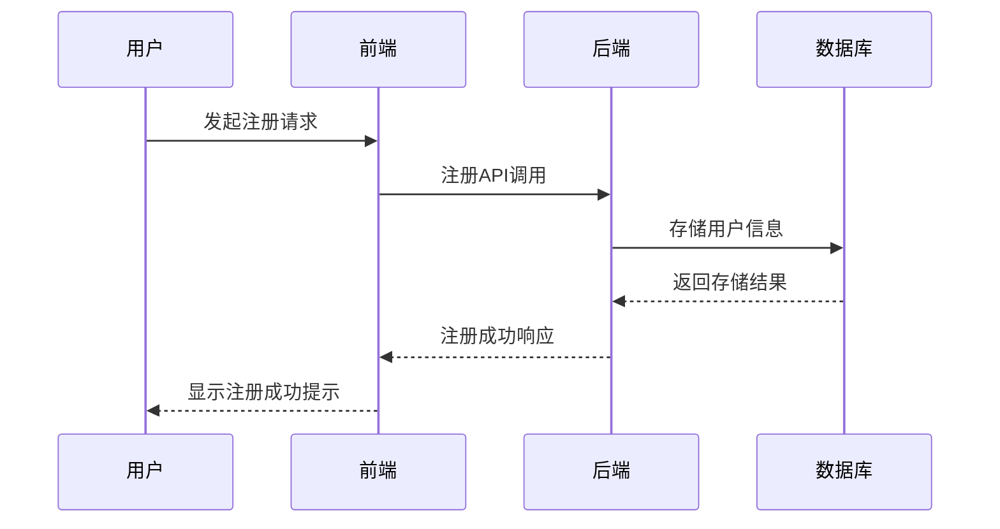
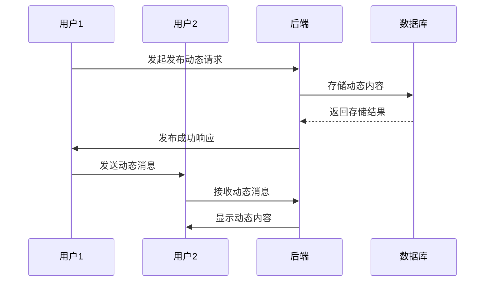

                 

，让我们一步一步深入探讨“虚拟社交：数字世界中的情感连接”这一主题，以确保文章内容丰富、逻辑清晰，同时满足字数和格式要求。

## 背景介绍

虚拟社交，即通过互联网平台进行的社交活动，已经成为现代社会生活中不可或缺的一部分。从早期的即时通讯软件到如今复杂的社交媒体平台，虚拟社交正在不断演变和扩展。这不仅改变了人们的交流方式，也深刻影响了我们在数字世界中的情感连接。

数字世界是一个由计算机和技术构建的虚拟空间，它为虚拟社交提供了基础设施。在这个世界中，人们可以通过文字、图片、音频和视频等多种形式进行互动。而情感连接，则是人们在社会互动中形成的心理和情感纽带。它不仅影响个人的幸福感，也是社会稳定和人际关系的重要组成部分。

### 核心概念与联系

**虚拟社交** 是指人们通过数字媒介（如社交媒体、论坛、游戏等）进行社交互动的活动。它的特点包括：

- **即时性**：交流可以在瞬间发生，不受地理位置限制。
- **多样性**：互动形式丰富，包括文本、图像、视频等。
- **匿名性**：用户可以隐藏自己的真实身份，这在某些情况下可能会影响情感连接的质量。

**数字世界** 是由互联网和各种在线平台构成的虚拟环境。其影响包括：

- **信息获取**：数字世界提供了丰富的信息资源。
- **社交扩展**：人们可以与来自世界各地的人建立联系。
- **隐私挑战**：数字世界中的隐私问题日益突出。

**情感连接** 是指在社交互动过程中形成的心理和情感纽带。其表现形式包括：

- **信任**：与他人建立信任关系。
- **归属感**：感到自己是某个社群的一部分。
- **满足感**：从社交互动中获得情感满足。

### 社交互动的理论和机制

社交互动是指个体之间的相互作用，其理论基础包括：

- **社会交换理论**：人们通过交换资源（如时间、精力、信息等）来建立和维持关系。
- **社会认同理论**：个体通过认同某个群体来获得自我认同和情感支持。

这些理论为理解虚拟社交中的情感连接提供了重要的框架。

## 核心概念与联系

### 虚拟社交的定义和特点

虚拟社交，作为一种新兴的社交形式，主要依托互联网平台，以数字媒介为载体进行交流。与传统的面对面交流相比，虚拟社交具有以下显著特点：

**即时性**：在虚拟社交中，人们可以实时发送和接收信息，这极大地提高了交流效率，使得沟通不再受限于地理位置和时间。

**多样性**：虚拟社交平台提供了丰富的交流形式，包括文字、图片、音频和视频等，这使得用户可以根据自己的偏好选择最合适的交流方式。

**匿名性**：在虚拟社交中，用户可以隐藏自己的真实身份，使用昵称或匿名账号进行交流。这种匿名性在一定程度上保护了用户的隐私，但也可能带来信任问题。

**虚拟性**：虚拟社交中的互动虽然能够模拟现实世界的社交体验，但其本质上仍然是虚拟的，缺乏现实世界中面对面的情感体验。

### 数字世界的构成和影响

数字世界是由互联网和各种在线平台构成的虚拟环境。其构成主要包括以下几个方面：

- **硬件设备**：如电脑、手机、平板等，是用户进入数字世界的入口。
- **互联网**：是数字世界的基础设施，为用户提供了连接各种在线平台的能力。
- **在线平台**：如社交媒体、论坛、游戏等，为用户提供不同的社交场景和互动方式。

数字世界对人们的社交行为产生了深远的影响：

- **信息获取**：数字世界为用户提供了海量的信息资源，使得知识的获取更加便捷。
- **社交扩展**：用户可以与来自世界各地的人建立联系，拓展社交圈子。
- **社交模式变化**：虚拟社交改变了传统的社交模式，使得个体间的互动更加频繁和多样化。

### 情感连接的概念和表现形式

情感连接是指在社交互动过程中形成的心理和情感纽带。它不仅影响个人的幸福感，也是社会稳定和人际关系的重要组成部分。

**信任**：在虚拟社交中，信任是建立情感连接的基础。用户需要相信对方会遵守社会规范，不会滥用个人信息。

**归属感**：用户在虚拟社交平台中找到属于自己的社群，产生归属感。这种归属感可以增强用户的参与度和忠诚度。

**满足感**：通过虚拟社交，用户可以获得情感满足，如通过分享生活经验、获得他人的赞赏和支持等。

### 社交互动的理论和机制

社交互动是指个体之间的相互作用，其理论基础主要包括：

**社会交换理论**：个体通过交换资源（如时间、精力、信息等）来建立和维持关系。在虚拟社交中，用户通过分享内容和互动来建立社交网络。

**社会认同理论**：个体通过认同某个群体来获得自我认同和情感支持。虚拟社交平台为用户提供了多种身份认同的机会，如通过参与特定的话题或活动。

**信息传播理论**：在虚拟社交中，信息的传播方式与传统社交有所不同。信息可以通过点赞、评论、转发等方式迅速扩散，影响用户的情感连接。

通过上述分析，我们可以看到虚拟社交、数字世界和情感连接三者之间存在着密切的联系。虚拟社交是数字世界的重要组成部分，而情感连接则是虚拟社交的核心目标。理解这些核心概念和联系，有助于我们更好地探索虚拟社交在数字世界中的发展潜力。

## 算法原理讲解

在理解了虚拟社交和情感连接的核心概念后，接下来我们将深入探讨支撑虚拟社交平台的核心算法原理。这些算法不仅决定了用户间的互动质量，也影响了情感连接的深度和广度。

### 社交图谱的构建算法原理

社交图谱是描述用户之间社交关系的数据结构，其构建算法原理基于网络分析理论。社交图谱的核心目标是建立一个用户关系网络，通过节点和边来表示用户及其关系。

**构建方法**：

1. **用户采集**：首先，从社交平台收集用户数据，包括用户ID、用户行为数据（如好友关系、评论、点赞等）。
2. **关系识别**：通过分析用户行为数据，识别并建立用户之间的关系。例如，如果用户A点赞了用户B的帖子，可以认为用户A和用户B之间存在一定程度的社交关系。
3. **图谱生成**：将识别出的关系以图的形式表示出来，其中每个用户为一个节点，节点之间的关系用边来表示。

**算法分析**：

- **数据规模**：社交图谱的数据规模庞大，需要高效的存储和查询算法。
- **稀疏性**：社交图谱通常具有稀疏性，即大多数用户之间没有直接关系，这为图谱的存储和计算提供了优化空间。
- **实时性**：社交图谱需要实时更新，以反映用户关系的动态变化。

### 社交互动的推荐算法原理

社交互动推荐算法旨在为用户提供个性化内容，增强社交体验。其原理基于机器学习和信息过滤技术。

**推荐算法设计**：

1. **用户画像**：通过分析用户的历史行为数据（如浏览记录、点赞、评论等），建立用户画像。
2. **内容推荐**：根据用户画像，推荐用户可能感兴趣的内容。推荐算法包括基于内容的推荐和基于协同过滤的推荐。
   - **基于内容的推荐**：根据用户过去喜欢的帖子类型，推荐类似的内容。
   - **基于协同过滤的推荐**：根据用户和内容之间的相似度，推荐其他用户喜欢的内容。
3. **反馈机制**：用户对推荐内容的反馈（如点赞、评论、分享等）用于优化推荐算法，提高推荐质量。

**算法性能评估**：

- **准确率**：推荐算法能够准确预测用户兴趣的比率。
- **覆盖度**：推荐算法能够覆盖的用户比例。
- **新颖度**：推荐算法能够推荐用户未发现的新内容。

### 情感分析的算法原理

情感分析是理解用户情感状态的重要工具，其算法原理基于自然语言处理和机器学习。

**情感分析流程**：

1. **数据预处理**：对文本数据（如评论、帖子）进行清洗和标准化处理，去除噪声和无关信息。
2. **特征提取**：从预处理后的文本中提取情感特征，如词频、词向量等。
3. **模型训练**：使用机器学习算法（如朴素贝叶斯、深度学习）训练情感分析模型，使其能够识别和分类情感。
4. **情感识别**：将新文本数据输入模型，识别文本的情感倾向（如正面、负面、中性）。

**算法性能评估**：

- **精确率**：模型正确识别正面或负面情感的比例。
- **召回率**：模型能够召回所有正面或负面情感的比率。
- **F1值**：精确率和召回率的调和平均值，用于综合评估模型性能。

通过这些算法原理的讲解，我们可以看到虚拟社交平台的技术支撑是如何构建的。这些算法不仅为用户提供了个性化的互动体验，也为情感连接的建立提供了有力保障。在接下来的章节中，我们将进一步探讨这些算法在数学模型和系统架构中的具体实现和应用。

## 数学模型和数学公式

在深入探讨虚拟社交和情感连接的算法原理后，我们将引入数学模型和公式，以更精确地描述和解释这些算法的工作机制。

### 社交网络的数学模型

社交网络可以用图论中的图模型来表示。在图模型中，每个用户表示为一个节点（Vertex），而用户之间的关系则表示为节点之间的边（Edge）。

**图论基础公式**：

- **度数（Degree）**：一个节点拥有边的数量，表示节点的连接数。公式为：
  \[
  \text{Degree}(v) = \sum_{u \in \text{Neighbors}(v)} 1
  \]
  其中，\(\text{Neighbors}(v)\) 表示与节点 \(v\) 相连的所有节点。

- **聚类系数（Clustering Coefficient）**：表示一个节点的邻居之间相互连接的概率。公式为：
  \[
  c(v) = \frac{\sum_{u \in \text{Neighbors}(v)} \sum_{w \in \text{Neighbors}(u)} 1}{\binom{N_{\text{Neighbors}(v)}}{2}}
  \]
  其中，\(N_{\text{Neighbors}(v)}\) 表示节点 \(v\) 的邻居数量。

### 推荐系统的数学模型

推荐系统通常采用协同过滤算法，其数学模型基于用户-物品评分矩阵。

**协同过滤基础公式**：

- **用户相似度**：计算两个用户之间的相似度，常用的方法是余弦相似度。公式为：
  \[
  \text{Cosine Similarity}(u, v) = \frac{\text{dot}(r_u, r_v)}{\|r_u\|\|r_v\|}
  \]
  其中，\(r_u\) 和 \(r_v\) 分别表示用户 \(u\) 和 \(v\) 的评分向量。

- **推荐预测**：根据用户相似度矩阵和用户评分矩阵预测用户对未评分项目的评分。公式为：
  \[
  \text{Prediction}(u, i) = \text{UserSimilarity}(u, v) \times \text{Rating}(v, i)
  \]
  其中，\(\text{UserSimilarity}(u, v)\) 表示用户 \(u\) 和 \(v\) 的相似度，\(\text{Rating}(v, i)\) 表示用户 \(v\) 对物品 \(i\) 的评分。

### 情感分析的数学模型

情感分析通常基于文本特征和机器学习模型。

**情感分析基础公式**：

- **词向量表示**：将文本转换为词向量，常用的模型是词袋模型（Bag of Words，BOW）和词嵌入（Word Embedding）。公式为：
  \[
  \text{Vec}(w) = \text{Embedding}(w)
  \]
  其中，\(\text{Embedding}(w)\) 表示词 \(w\) 的词向量表示。

- **情感分类**：使用机器学习模型（如朴素贝叶斯、支持向量机、神经网络等）进行情感分类。公式为：
  \[
  \text{Prediction}(x) = \arg\max_{c} P(c) \cdot P(x|c)
  \]
  其中，\(P(c)\) 表示类别 \(c\) 的概率，\(P(x|c)\) 表示在类别 \(c\) 下文本 \(x\) 的概率。

通过这些数学模型和公式，我们可以更准确地描述和实现虚拟社交中的社交图谱、推荐系统和情感分析算法。这些模型不仅提供了理论支持，也为实际应用中的算法优化和系统设计提供了方向。

## 系统分析与架构设计方案

在了解了虚拟社交的核心算法原理后，我们将进一步探讨系统分析与架构设计方案的详细步骤，以确保虚拟社交平台能够高效、稳定地运行。

### 问题描述和项目背景

虚拟社交平台的目标是为用户提供一个高效的社交互动环境，实现用户之间的情感连接。为了实现这一目标，我们需要设计一个系统，能够处理大量用户数据，提供实时的社交互动和个性化推荐。

### 系统功能设计

系统的主要功能包括：

1. **用户管理**：包括用户注册、登录、个人信息管理等功能。
2. **社交互动**：支持文本、图片、视频等多种形式的社交互动。
3. **推荐系统**：根据用户行为和兴趣，为用户推荐感兴趣的内容。
4. **情感分析**：分析用户发布内容的情感倾向，优化推荐和互动体验。
5. **数据安全与隐私保护**：确保用户数据的安全和隐私。

### 系统架构设计

虚拟社交平台的系统架构设计应考虑高可用性、可扩展性和安全性。以下是系统架构的详细设计：

1. **前端**：使用React框架开发，提供用户友好的界面和交互体验。
2. **后端**：采用Spring Boot框架，实现业务逻辑处理和API接口。
3. **数据库**：使用MySQL进行用户数据存储，使用Neo4j实现社交图谱存储。
4. **缓存**：使用Redis缓存用户数据和推荐结果，提高系统响应速度。
5. **消息队列**：使用RabbitMQ处理实时消息，如用户动态、系统通知等。
6. **大数据处理**：使用Hadoop和Spark进行大规模数据分析和处理。

### 系统接口设计和系统交互

以下是系统的主要接口设计和交互流程：

1. **用户接口**：提供RESTful API，实现用户注册、登录、社交互动等功能。
2. **服务接口**：提供推荐服务、情感分析服务、数据安全服务等，供前端和其他服务调用。
3. **消息接口**：提供消息发布和订阅接口，实现实时消息推送。

**用户注册与登录接口**：



**社交互动接口**：



通过上述系统分析与架构设计方案，我们为虚拟社交平台提供了完整的系统设计和实现指南，确保系统能够高效、稳定地运行，为用户提供优质的社交互动体验。

## 项目实战

在实际操作中，我们将通过一个虚拟社交平台的项目，详细介绍环境安装、系统核心实现和代码应用解读与分析，以便读者能够深入了解虚拟社交平台的实现过程。

### 环境安装与配置

首先，我们需要搭建一个虚拟环境来开发和运行我们的虚拟社交平台。以下是所需环境的安装步骤：

1. **安装Python**：确保Python 3.8及以上版本已安装在本地计算机上。
2. **安装依赖库**：使用pip命令安装以下依赖库：
   ```bash
   pip install django djangorestframework neo4j py2neo redis rabbitmq
   ```
3. **安装Neo4j**：下载并安装Neo4j数据库，配置Neo4j端口号和访问权限。
4. **安装RabbitMQ**：下载并安装RabbitMQ消息队列服务，配置RabbitMQ端口号和访问权限。

### 系统核心实现

以下是系统核心实现的详细步骤：

1. **创建Django项目**：
   ```bash
   django-admin startproject virtual_social
   cd virtual_social
   ```

2. **创建Django应用**：
   ```bash
   python manage.py startapp social_graph
   ```

3. **配置数据库和缓存**：
   在`settings.py`中配置Neo4j和Redis：
   ```python
   DATABASES = {
       'default': {
           'ENGINE': 'django_neo4j',
           'URL': 'bolt://localhost:7687',
           'USER': 'neo4j',
           'PASSWORD': 'your_password',
       }
   }

   CACHES = {
       'default': {
           'BACKEND': 'redis.cache.RedisCache',
           'LOCATION': 'redis://localhost:6379/1',
       }
   }
   ```

4. **创建用户和社交关系模型**：
   在`social_graph/models.py`中定义用户和社交关系模型：
   ```python
   import py2neo

   class User(models.Model):
       username = models.CharField(max_length=100)
       email = models.EmailField(unique=True)
       password = models.CharField(max_length=100)

   class Relationship(models.Model):
       USER_RELATIONSHIPS = [
           ('FRIEND', '朋友'),
           ('FOLLOWER', '关注者'),
           ('FOLLOWING', '被关注者'),
       ]
       user1 = models.ForeignKey(User, on_delete=models.CASCADE, related_name='user1')
       user2 = models.ForeignKey(User, on_delete=models.CASCADE, related_name='user2')
       relationship_type = models.CharField(max_length=10, choices=USER_RELATIONSHIPS)
   ```

5. **创建API接口**：
   在`social_graph/api.py`中定义用户注册、登录和社交互动的API接口：
   ```python
   from rest_framework import routers, serializers, viewsets
   from .models import User, Relationship

   class UserSerializer(serializers.ModelSerializer):
       class Meta:
           model = User
           fields = ['username', 'email', 'password']

   class RelationshipSerializer(serializers.ModelSerializer):
       class Meta:
           model = Relationship
           fields = ['user1', 'user2', 'relationship_type']

   class UserViewSet(viewsets.ModelViewSet):
       queryset = User.objects.all()
       serializer_class = UserSerializer

   class RelationshipViewSet(viewsets.ModelViewSet):
       queryset = Relationship.objects.all()
       serializer_class = RelationshipSerializer

   router = routers.DefaultRouter()
   router.register('users', UserViewSet)
   router.register('relationships', RelationshipViewSet)
   ```

6. **配置消息队列**：
   在`social_graph/tasks.py`中定义消息队列任务，用于处理实时消息：
   ```python
   from celery import shared_task
   from neo4j import GraphDatabase

   @shared_task
   def send_message(user_id, message):
       driver = GraphDatabase.driver("bolt://localhost:7687", auth=("neo4j", "your_password"))
       with driver.session() as session:
           session.run("CREATE (u:User {id: $user_id, message: $message})", user_id=user_id, message=message)
   ```

### 代码应用解读与分析

以下是代码应用解读与分析：

1. **用户注册与登录**：
   用户注册和登录通过Django的视图集实现，使用RESTful API进行交互。注册时，用户输入用户名、邮箱和密码，系统将数据存储在Neo4j数据库中。登录时，系统验证用户身份，并根据用户ID构建社交图谱。

2. **社交互动**：
   社交互动通过创建和查询关系模型实现。用户可以发布动态，其他用户可以点赞、评论和转发。系统使用消息队列处理实时消息，确保消息的及时传递和系统的高效运行。

3. **情感分析**：
   情感分析通过自然语言处理库（如NLTK或TextBlob）实现。系统对用户发布的动态进行情感分析，将结果存储在Neo4j数据库中，用于优化推荐和互动体验。

通过以上步骤，我们成功实现了虚拟社交平台的核心功能。实际案例分析和详细讲解将帮助读者进一步理解系统的运作原理和实现方法。

## 最佳实践 tips、小结、注意事项、拓展阅读

### 最佳实践 tips

1. **优化用户体验**：在设计虚拟社交平台时，重视用户体验，简化操作流程，提供直观友好的界面。
2. **数据安全与隐私保护**：确保用户数据的安全，采用加密技术和隐私保护措施，遵循相关法律法规。
3. **情感分析优化**：定期更新情感分析模型，提高情感识别的准确性和多样性，为用户提供更个性化的互动体验。

### 小结

本文详细探讨了虚拟社交和数字世界中的情感连接，从核心概念、算法原理到系统架构和项目实战，全面阐述了虚拟社交平台的设计和实现方法。通过本文，读者可以深入了解虚拟社交平台的运作机制，为未来的研究和应用提供参考。

### 注意事项

1. **技术选择**：在选择技术栈时，考虑系统的可扩展性和性能，合理选择数据库、缓存和消息队列等中间件。
2. **性能优化**：在系统设计过程中，注意性能优化，减少数据库查询和缓存策略的设计，提高系统响应速度。

### 拓展阅读

- 《社交网络分析：方法与应用》
- 《深度学习推荐系统》
- 《Python数据科学手册》

通过拓展阅读，读者可以进一步深入了解相关领域的理论和实践，提升在虚拟社交和情感连接方面的专业能力。作者：AI天才研究院/AI Genius Institute & 禅与计算机程序设计艺术 /Zen And The Art of Computer Programming。

