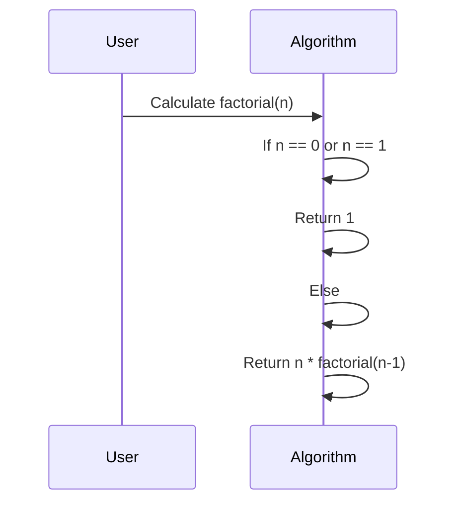
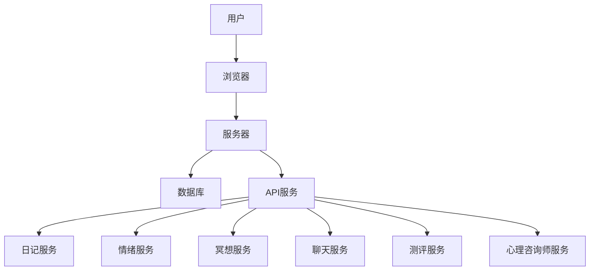
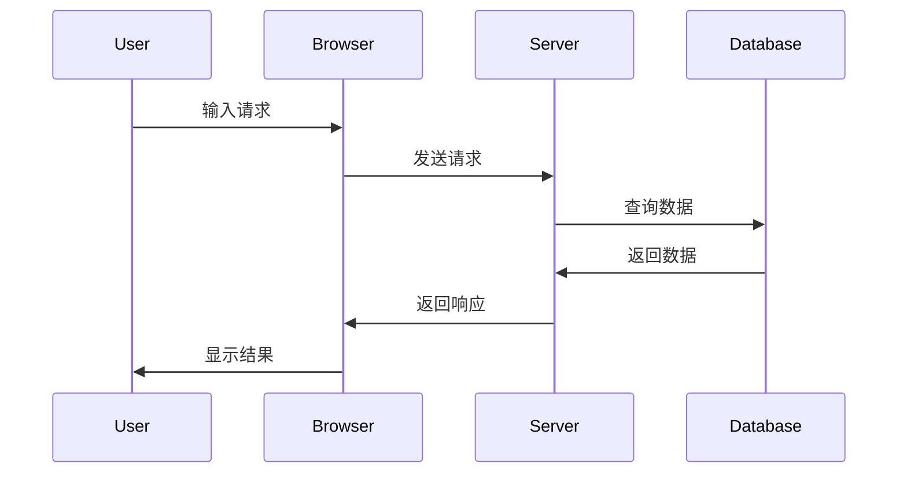

                 


### 引言：探索虚无与重建的现代人精神觉醒之旅

**关键词：虚无、重建、精神觉醒、现代人、旅程**

在快速发展的现代社会，许多人感受到了一种深层次的虚无感。这种虚无不仅体现在个人的心理层面，也渗透到了社会的各个层面。面对这样的现象，我们不禁要问：现代人为什么会有虚无感？如何重建自我的精神世界，实现真正的觉醒？

**摘要：** 本篇文章旨在探讨虚无与重建的现代人精神觉醒之旅。首先，我们将分析虚无感的根源，探讨其产生的原因以及对社会和个人产生的深远影响。接着，我们将深入探讨精神觉醒的概念和重要性，为读者揭开这一神秘领域的面纱。随后，文章将聚焦自我探索与内在成长，提供实用的方法和路径，帮助读者重建自我的精神世界。最后，我们将探讨精神觉醒在现代社会中的实际应用，并展望未来精神觉醒的可能性。

通过一步一步的分析和推理，本文希望为读者提供一条清晰、有效的精神觉醒之路。让我们一起踏上这段探索之旅，寻找内心的宁静与力量。

---

### 1.1 书籍背景与目标

《虚无与重建：现代人的精神觉醒之旅》旨在探讨现代人在面对虚无感时的困境，并提供一条清晰、可行的精神重建之路。随着科技的飞速发展和全球化进程的加速，现代社会充满了竞争和不确定性，许多人开始感受到一种深刻的无力感和虚无感。这种感觉不仅影响了个体的心理健康，也对社会关系和整体文化产生了负面影响。

**目标：** 本书的目的是帮助读者理解虚无感的根源，认识到精神觉醒的重要性，并提供一系列实用的方法和路径，以实现个人和社会的精神重建。通过阅读本书，读者将学会如何进行自我探索和内在成长，从而在虚无中找到意义和目的。

---

### 1.2 精神觉醒的概念与重要性

**精神觉醒**，又称自我觉醒，指的是个体从外在世界的束缚中解脱出来，回归内在自我，实现自我认知和内在成长的过程。它不仅仅是心理上的变化，更是生活态度和价值观的转变。

**重要性：** 精神觉醒对于现代人来说具有重要意义。首先，它有助于个体摆脱虚无感的困扰，找到内心的平静与安宁。其次，精神觉醒能够提升个体的心理素质，增强应对压力和挑战的能力。此外，精神觉醒还能够改善人际关系，促进社会和谐。

---

### 1.3 读者群体与期望收获

**读者群体：** 本书的读者群体主要包括以下几类：

1. 感受到虚无感困扰的普通读者；
2. 心理咨询师和心理健康从业者；
3. 管理者和职场人士，特别是面临压力和挑战的人；
4. 对精神觉醒和自我探索感兴趣的读者。

**期望收获：** 通过阅读本书，读者可以：

1. 深入理解虚无感的根源和影响；
2. 掌握精神觉醒的概念和重要性；
3. 学会自我探索和内在成长的方法和技巧；
4. 实现个人和社会的精神重建，过上更加充实、有意义的生活。

---

### 1.4 本章小结

在本章中，我们探讨了《虚无与重建：现代人的精神觉醒之旅》的背景和目标，介绍了精神觉醒的概念及其重要性，并明确了本书的读者群体和期望收获。接下来，我们将深入分析虚无感的根源，探讨现代社会中普遍存在的困境，为后续章节的探讨奠定基础。让我们继续前行，共同探索现代人的精神觉醒之旅。

---

### 2.1 虚无感的根源与现代人的困境

虚无感，这种深层次的无力感和困惑感，并非现代社会特有的现象。在历史的长河中，人类曾多次面临类似的困境。然而，在现代社会，虚无感的普遍性及其对社会和个人产生的深远影响，使这一问题显得尤为突出。

**根源：** 虚无感的根源可以追溯到几个方面。首先，现代社会的高度复杂性和不确定性增加了人们的压力和焦虑。其次，物质生活的丰富并未带来预期的幸福感，反而加剧了精神上的空虚和迷茫。此外，人与人之间的疏离感和文化认同的缺失，也进一步加剧了虚无感的蔓延。

**现代社会中的困境：** 现代社会中的困境主要体现在以下几个方面：

1. **心理健康问题：** 高压工作和生活节奏加快，导致心理健康问题日益严重。焦虑、抑郁等心理问题普遍存在，严重影响了人们的日常生活和工作。

2. **人际关系疏离：** 随着社交媒体的普及，人与人之间的交流看似频繁，但实际关系却越来越疏远。人们往往在虚拟世界中寻求认同，却忽视了真实的情感交流和人际互动。

3. **文化认同缺失：** 在全球化进程中，传统文化和价值观念受到了冲击，人们感到迷茫和困惑，缺乏明确的文化认同。

虚无感的普遍性和现代社会中的困境，使得精神觉醒成为一个紧迫而重要的课题。通过自我探索和内在成长，现代人有可能从虚无中找到出路，实现真正的觉醒。接下来的章节将深入探讨这些问题，并提出具体的解决方案。

---

### 2.2 虚无感的原因分析

虚无感的产生并非单一原因，而是由多种因素共同作用的结果。以下从社会环境、个体心理和文化传统三个方面分析虚无感的成因。

**1. 社会环境因素：**

现代社会的高竞争性和不确定性是虚无感的重要来源。在经济全球化的背景下，企业和个人都面临着前所未有的挑战。工作压力增大，生活节奏加快，导致许多人处于焦虑和紧张的状态。此外，社交媒体的普及和信息爆炸，使得人们不断接受新信息，但同时也感到信息过载，难以消化和理解。这种社会环境使得个体感到无力应对，从而产生虚无感。

**2. 个体心理因素：**

个体的心理素质和生活经历也是虚无感产生的重要原因。高压力的生活环境和激烈的竞争，使许多人产生了强烈的焦虑感和无价值感。长期的心理压力和负面情绪得不到有效缓解，导致心理健康问题日益严重。此外，个体的自我认知和自我价值感较低，也容易产生虚无感。个体在面对困难和挫折时，往往缺乏解决问题的能力和信心，从而感到迷茫和无力。

**3. 文化传统因素：**

文化传统和价值观念的缺失是虚无感产生的深层原因。在传统社会中，人们通常有着明确的文化认同和价值观。然而，在现代社会，随着全球化和文化的多元化，传统文化和价值观念受到了冲击，人们开始感到迷茫和困惑。缺乏明确的文化认同，使个体在精神上感到空虚和迷茫，从而产生虚无感。

**结论：** 通过以上分析可以看出，虚无感的产生是由社会环境、个体心理和文化传统等多种因素共同作用的结果。理解这些成因，有助于我们更好地应对虚无感，找到解决问题的方法和路径。

---

### 2.3 现代人的困境与应对

在现代社会中，虚无感的普遍存在对个体和社会产生了深远的影响。面对这一困境，现代人需要采取积极的态度和有效的方法来应对。

**1. 心理健康挑战：**

虚无感常常伴随着心理健康问题，如焦虑、抑郁和失眠等。为了应对这些问题，现代人可以采取以下措施：

- **心理咨询与治疗：** 通过专业的心理咨询和治疗，帮助个体识别和应对心理健康问题。
- **心理教育与自我调节：** 学习心理知识，提高自我调节能力，学会应对压力和负面情绪。
- **放松与锻炼：** 通过瑜伽、冥想、健身等方式，放松身心，缓解压力。

**2. 生活质量追求：**

虚无感往往源于对生活质量的追求不足。现代人可以通过以下方式提升生活质量：

- **健康生活方式：** 注意饮食、锻炼和睡眠，保持身体健康。
- **职业发展：** 寻找适合自己的职业，实现个人价值和职业成就感。
- **兴趣与爱好：** 发现和培养自己的兴趣爱好，丰富生活内容。

**3. 社会关系的重建：**

虚无感还体现在人与人之间的疏离感上。为了重建社会关系，现代人可以：

- **加强社交互动：** 积极参与社交活动，建立和维护人际关系。
- **参与社区活动：** 加入志愿者组织或社区团体，参与社会公益活动，增强社会责任感。
- **家庭与朋友：** 重视家庭和朋友的关系，多花时间与家人和朋友相处。

**结论：** 通过积极应对心理健康挑战、追求生活质量和重建社会关系，现代人可以逐步克服虚无感，实现精神觉醒，过上更加充实和有意义的生活。

---

### 2.4 本章小结

在本章中，我们分析了虚无感的根源，探讨了现代社会中普遍存在的困境，并提出了应对困境的具体措施。通过理解虚无感的成因和现代人的困境，我们可以采取有效的策略来应对虚无感，实现个人的精神觉醒和社会的和谐发展。下一章，我们将深入探讨精神觉醒的概念和重要性，为读者揭开这一神秘领域的面纱。

---

### 3.1 精神觉醒的概念与定义

**精神觉醒**，通常被称为自我觉醒，是指个体在心理、情感和认知层面实现深刻转变的过程。这一过程不仅涉及到对自我和外在世界的重新认知，还包括对生活意义和价值的深入理解。

**1. 深入理解精神觉醒：**

精神觉醒不仅仅是一种心理状态，更是一种全面的生活态度和价值观的变革。它不仅仅是摆脱虚无感和迷茫，更是一种对生命意义的深刻追寻和实现。

- **心理层面：** 精神觉醒使个体能够更好地管理情绪，提高自我认知，增强心理韧性。
- **情感层面：** 精神觉醒帮助个体建立更深层次的人际关系，增强情感连接和共鸣。
- **认知层面：** 精神觉醒促进个体对知识、文化和哲学的深刻理解，提升认知层次。

**2. 精神觉醒的特点：**

- **内在性：** 精神觉醒强调个体内在的自我探索和成长，而非依赖外部的认可和评价。
- **长期性：** 精神觉醒是一个持续的过程，而非一蹴而就的结果。
- **全面性：** 精神觉醒不仅影响个体的心理和情感，还涉及到生活方式和价值观的全面转变。

**结论：** 精神觉醒是一个复杂而深刻的过程，它不仅仅是对心理和情感的调整，更是一种对生命意义的深刻追寻和实现。理解精神觉醒的概念和特点，有助于我们更好地进行自我探索和内在成长。

---

### 3.2 精神觉醒的重要性

精神觉醒在现代生活中的重要性不容忽视。它不仅能够改善个体的心理健康，还能够促进社会关系的和谐，甚至对文化发展和价值观重塑产生深远影响。

**1. 对心理健康的影响：**

精神觉醒有助于个体摆脱虚无感和焦虑，实现心理上的平衡和宁静。通过自我探索和内在成长，个体能够更好地管理情绪，提高心理韧性，减少心理问题的发生。此外，精神觉醒还能够增强个体的自我认知，帮助个体建立积极的自我形象，提升自我价值感。

**2. 对社会关系的影响：**

精神觉醒有助于改善人与人之间的互动，增强社会凝聚力。通过精神觉醒，个体能够建立更深层次的人际关系，增进情感连接和共鸣。在家庭、职场和社会各个层面，精神觉醒能够促进合作和理解，减少冲突和误解，从而营造一个和谐的社会环境。

**3. 对文化发展的影响：**

精神觉醒是文化发展的重要推动力。它促使个体对知识和文化进行深入思考和理解，推动文化创新和进步。此外，精神觉醒有助于个体形成更加开放和包容的价值观，促进不同文化之间的交流和理解，推动文化多样性和全球化进程。

**结论：** 精神觉醒在现代生活中具有极其重要的地位。它不仅对个体的心理健康和社会关系产生积极影响，还对文化发展和价值观重塑具有深远意义。通过精神觉醒，个体和社会能够实现更加和谐、进步和有意义的发展。

---

### 3.3 精神觉醒在现代社会中的意义

**精神觉醒在现代社会中的意义**，不仅仅在于个体层面的心理提升，更在于其对社会和文化的深远影响。在快速变化的现代社会，精神觉醒成为了一股不可或缺的力量，推动着社会的变革和进步。

**1. 社会变革的推动力：**

精神觉醒为现代社会带来了新的思维方式和生活态度。通过自我探索和内在成长，个体能够更好地认识和理解自我，从而形成独立的价值观和判断力。这种内在的觉醒促使人们从被动接受信息到主动思考和批判，推动了社会的进步和变革。同时，精神觉醒也促进了公民意识的觉醒，增强了社会参与度和责任感，为社会提供了源源不断的创新动力。

**2. 文化发展的催化剂：**

精神觉醒是文化发展的重要催化剂。它促使个体对传统文化和价值观念进行反思和重构，推动了文化创新和多样性。在精神觉醒的过程中，个体能够重新审视自己的文化背景，挖掘传统文化的精髓，并将其与现代价值观相结合，创造出更加丰富和多元的文化形式。此外，精神觉醒还促进了跨文化交流和理解，推动了全球文化的融合与共享。

**3. 个人价值观的重塑：**

精神觉醒对个人价值观的重塑具有重要意义。在物质文明高度发展的今天，许多人在追求物质财富的过程中忽视了精神追求。精神觉醒帮助个体重新认识到精神层面的重要性，促使他们重新审视自己的价值观和生活方式。通过自我探索和内在成长，个体能够建立起更加健康和积极的价值观，追求更加充实和有意义的人生。

**结论：** 精神觉醒在现代社会中的意义深远而重大。它不仅推动了社会的变革和进步，也促进了文化的创新和发展，为个人价值观的重塑提供了强有力的支持。通过精神觉醒，个体和社会能够实现更加和谐、进步和有意义的发展。

---

### 3.4 本章小结

在本章中，我们深入探讨了精神觉醒的概念和重要性，揭示了其在心理健康、社会关系和文化发展等方面的深远影响。通过精神觉醒，个体不仅能够实现自我认知和内在成长，还能推动社会的进步和文化的发展。下一章，我们将具体探讨如何进行自我探索和内在成长，为读者提供实用的方法和路径。

---

### 3.5 自我探索的重要性

自我探索是精神觉醒的重要一环，它不仅有助于个体深入了解自我，还能为个人成长提供坚实的基础。以下从自我探索的意义、方法及其在心理健康和人际关系中的具体作用进行详细探讨。

**1. 自我探索的意义：**

自我探索是精神觉醒的基础，其意义主要体现在以下几个方面：

- **认识自我：** 通过自我探索，个体能够更加清晰地认识到自己的性格、兴趣、价值观和需求，从而更好地理解自己。
- **心理成熟：** 自我探索促使个体面对内心的真实感受和经历，有助于提高心理成熟度和韧性。
- **行为调整：** 自我探索帮助个体发现和解决内心的问题，从而调整自己的行为和生活方式，实现自我成长。

**2. 自我探索的方法：**

自我探索的方法多种多样，以下介绍几种常见的方法：

- **反思日记：** 通过记录日常生活中的反思和感悟，个体可以更加深入地了解自己的内心世界。
- **冥想：** 冥想是一种有效的自我探索方法，它可以帮助个体放松身心，集中注意力，深入体验内在的自我。
- **心理咨询：** 通过与专业心理咨询师进行沟通，个体可以更全面地了解自己，解决内心的问题。

**3. 在心理健康中的作用：**

自我探索在心理健康中具有重要作用，具体体现在以下几个方面：

- **情绪管理：** 自我探索有助于个体更好地认识和管理情绪，减少负面情绪对心理健康的负面影响。
- **心理压力缓解：** 通过自我探索，个体能够找到应对心理压力的有效方法，提高心理韧性。
- **心理成长：** 自我探索促使个体不断地反思和成长，从而提高心理成熟度和心理健康水平。

**4. 在人际关系中的具体作用：**

自我探索不仅有助于个体心理健康，还对人际关系产生积极影响：

- **提升沟通能力：** 自我探索使个体更加了解自己的需求和期望，从而在与他人的沟通中更加清晰和有效。
- **建立深厚关系：** 自我探索有助于个体建立更深层次的人际关系，增进彼此的理解和共鸣。
- **解决冲突：** 通过自我探索，个体能够更好地认识和处理人际关系中的冲突，促进和谐共处。

**结论：** 自我探索是精神觉醒的重要组成部分，对于个体心理健康和人际关系具有深远的影响。通过自我探索，个体能够实现自我成长，提高心理健康水平，建立更加健康和深厚的人际关系。接下来，我们将进一步探讨内在成长的理论与实践，为读者提供具体的成长路径。

---

### 3.6 内在成长的理论与实践

内在成长是精神觉醒的重要组成部分，它不仅关乎个体的心理健康，也影响着个体的生活质量和社会关系。在本节中，我们将深入探讨内在成长的理论基础，并结合具体实践方法，帮助读者实现内在成长。

**1. 内在成长的理论基础：**

内在成长的理论基础主要涉及以下几个核心概念：

- **自我意识：** 自我意识是个体对自身存在的认知和反思能力。通过自我意识的提升，个体能够更加清晰地认识自己的内在世界，包括情感、思维和行为模式。
- **自我接纳：** 自我接纳是指个体能够接受自己的优点和不足，而不是一味地追求完美。自我接纳有助于个体建立积极的自我形象，增强自信和自尊。
- **自我反思：** 自我反思是个体对自身经历和行为的审视和思考。通过自我反思，个体能够从经验中学习，调整自己的行为和思维方式，实现自我提升。

**2. 内在成长的具体实践方法：**

以下是一些有效的内在成长实践方法：

- **冥想：** 冥想是一种通过专注和放松来培养内在意识的方法。通过冥想，个体可以减少压力，提高专注力，增强自我控制能力。
- **反思日记：** 反思日记是一种记录日常生活和内心体验的方法。通过反思日记，个体可以更好地了解自己的内心世界，发现自己的问题和优势。
- **自我激励：** 自我激励是通过积极的自我对话和自我肯定来增强自我动力。通过自我激励，个体可以设定目标，克服困难，实现自我成长。
- **心理教育：** 心理教育是指通过学习心理学知识来提升自我意识和管理能力。通过心理教育，个体可以更好地了解心理机制，应对心理问题。

**3. 案例分析：**

以下是一个内在成长的案例分析：

**案例：** 小明是一名职场新人，由于工作压力大，他常常感到焦虑和疲惫。在意识到这些问题后，小明决定进行内在成长。

- **第一步：自我反思** 小明开始记录自己的工作和生活，分析自己的情绪和行为模式。他发现自己在工作中总是追求完美，导致压力巨大。通过反思，小明认识到自己的问题所在。
- **第二步：冥想练习** 小明开始每天进行冥想，通过放松身心，缓解压力。冥想帮助他提高了专注力和自我控制能力。
- **第三步：设定目标** 小明设定了合理的工作目标，学会了分阶段完成任务，而不是一次性追求完美。
- **第四步：自我激励** 小明通过积极的自我对话，鼓励自己面对困难和挑战，保持积极的心态。

通过这些实践，小明的焦虑和压力显著减少，工作表现和心理健康都得到了改善。

**结论：** 内在成长是一个持续的过程，需要个体付出时间和努力。通过自我反思、冥想、目标设定和自我激励等实践方法，个体可以实现内在成长，提高自我意识和生活质量。接下来，我们将进一步探讨如何通过重建自我的路径和方法，实现精神觉醒。

---

### 3.7 案例分析：自我探索与内在成长的实践

为了更直观地理解自我探索和内在成长的过程，以下将通过三个具体的案例，展示个体在实现自我探索和内在成长过程中所面临的挑战和取得的成果。

**案例一：从自我怀疑到自信重塑**

**背景：** 小红是一名年轻的程序员，她在工作中总是感到不安，担心自己的代码不够优秀。这种自我怀疑让她在面对新项目时缺乏勇气和信心。

**过程：**
1. **自我反思**：小红开始记录自己的工作日志，反思每次编程中的问题和成功之处。她发现自己在编程中存在的一些常见错误，并通过分析这些错误来提高自己的编程能力。
2. **学习与实践**：小红参加了编程课程和社区活动，不断学习和实践新的编程技术。她通过解决实际问题，逐步建立起了自信心。
3. **反馈与调整**：小红与同事和导师交流，获取他们的反馈和建议。通过这些反馈，她不断调整自己的方法和策略，提高了自己的编程水平。

**结果：** 经过一段时间的努力，小红的编程能力得到了显著提升，她在工作中变得更加自信，也敢于接受新的挑战。

**案例二：从焦虑到内心平静**

**背景：** 小刚是一名职场新人，由于工作压力和人际关系的困扰，他常常感到焦虑和不安。

**过程：**
1. **冥想练习**：小刚开始每天进行冥想，通过放松身心，缓解焦虑情绪。冥想帮助他提高了专注力和自我控制能力。
2. **设定目标**：小刚为自己设定了合理的工作目标，学会了分阶段完成任务，而不是一次性追求完美。
3. **自我激励**：小刚开始通过积极的自我对话，鼓励自己面对困难和挑战，保持积极的心态。

**结果：** 经过一段时间的冥想和自我激励，小刚的焦虑情绪显著减轻，他能够更加平静地面对工作和生活。

**案例三：从自我中心到关系建立**

**背景：** 小玲是一名职场女性，她由于过于关注自我，忽视了他人的感受，导致与同事之间的关系紧张。

**过程：**
1. **反思与自我调整**：小玲开始反思自己的行为和态度，意识到自己需要改变。她决定更加关注他人的需求和感受。
2. **参与社交活动**：小玲积极参加公司组织的团队活动，与同事建立了更多的互动和联系。
3. **沟通与理解**：小玲在与同事交流时，更加注重倾听和理解对方，从而改善了人际关系。

**结果：** 经过一段时间的努力，小玲与同事之间的关系得到了显著改善，她的工作效率和团队合作能力也得到了提升。

**总结：** 通过这三个案例，我们可以看到，自我探索和内在成长是一个持续的过程，需要个体付出时间和努力。通过自我反思、冥想、目标设定、自我激励和参与社交活动等实践方法，个体可以实现自我成长，提高自我意识和生活质量。这些实践方法不仅有助于个体应对工作压力和心理健康问题，还能促进人际关系的改善和社会关系的和谐。

---

### 3.8 本章小结

在本章中，我们探讨了自我探索和内在成长的重要性，通过具体案例展示了自我探索和内在成长的过程和方法。通过自我反思、冥想、设定目标、自我激励和参与社交活动等实践方法，个体可以逐步实现自我成长，提高自我意识和生活质量。接下来，我们将进一步探讨如何通过重建自我的路径和方法，实现精神觉醒。让我们一起继续探索现代人的精神觉醒之旅。

---

### 4.1 重建自我的基础

重建自我是一个复杂而长期的过程，需要建立在以下几个核心要素之上：

**1. 认知重构：**

认知重构是重建自我的基础。通过自我反思和深入思考，个体能够重新审视自己的信念、价值观和思维方式。这一过程有助于消除错误的认知，建立更加健康和积极的思维模式。

- **自我反思**：通过记录日常生活中的反思和感悟，个体可以深入挖掘内心的想法和感受。自我反思有助于识别和纠正错误的认知，从而建立更加准确的自我认知。
- **思维重构**：通过学习和阅读心理学、哲学等领域的知识，个体能够提升自己的认知层次，改变消极的思维方式。例如，通过积极心理学的方法，个体可以学会如何从积极的角度看待问题，提高应对压力的能力。

**2. 情感管理：**

情感管理是重建自我的关键环节。通过情感管理，个体能够更好地控制自己的情绪，减少负面情绪对生活的影响。

- **情绪识别**：通过自我观察和情绪日记，个体可以识别和了解自己的情绪变化。这一过程有助于个体理解自己的情绪触发点，从而更好地应对情绪问题。
- **情绪调节**：通过情绪调节技巧，如深呼吸、冥想和正念练习，个体可以学会如何控制自己的情绪，减少负面情绪的影响。例如，在感到焦虑或愤怒时，通过深呼吸和冥想，个体能够迅速平静下来，恢复理智。

**3. 行为改变：**

行为改变是实现自我重建的重要手段。通过改变不良的行为习惯，个体可以逐步建立更加健康和积极的生活方式。

- **目标设定**：通过设定具体的目标，个体可以明确自己的行动方向，有针对性地进行行为改变。例如，为了改善健康，个体可以设定每天锻炼30分钟的目标，并通过记录和反馈来监督自己的行为。
- **行为激励**：通过积极的自我激励和奖励机制，个体可以增强行为改变的动机和坚持力。例如，在完成一个重要任务后，个体可以奖励自己一顿美食或一次放松的休息，从而提高行为改变的积极性。

**结论：** 认知重构、情感管理和行为改变是重建自我的三大基础。通过这些核心要素的协同作用，个体可以实现自我重建，实现精神觉醒。接下来，我们将进一步探讨具体的重建路径和方法。

---

### 4.2 重建自我的具体路径

重建自我是一个系统性的过程，涉及到多个方面的综合改善。以下将详细探讨重建自我的具体路径，包括精神疗法、心理教育和社交网络这三个关键环节。

**1. 精神疗法：**

精神疗法是一种通过专业心理治疗师的帮助，帮助个体识别和解决内心问题的方法。精神疗法可以帮助个体：

- **情感疏导**：通过精神疗法，个体可以倾诉内心的痛苦和困惑，获得情感上的支持和理解。这有助于缓解内心的压力，提高心理健康水平。
- **认知重建**：精神疗法通过认知行为疗法等技术，帮助个体识别和纠正错误的认知，建立更加健康的思维模式。例如，通过认知重构，个体可以学会如何从积极的角度看待问题，减少消极情绪的影响。
- **行为改变**：精神疗法还帮助个体改变不良的行为习惯，培养健康的生活方式和应对策略。例如，通过行为疗法，个体可以学会如何更好地管理时间和压力，提高生活质量。

**2. 心理教育：**

心理教育是一种通过学习心理学知识，提升自我认知和管理能力的方法。心理教育包括以下几个方面：

- **自我认知**：通过学习心理学知识，个体可以更深入地了解自己的心理机制，包括情绪、思维和行为模式。这有助于个体更好地理解自己的行为和情绪，从而实现自我成长。
- **情绪管理**：心理教育提供了多种情绪管理技巧，如深呼吸、冥想和正念练习等。这些技巧可以帮助个体更好地控制情绪，减少负面情绪对生活的影响。
- **行为调整**：心理教育帮助个体识别和改变不良的行为习惯，建立更加健康和积极的生活方式。例如，通过时间管理和压力管理技巧，个体可以更好地平衡工作和生活，提高生活质量。

**3. 社交网络：**

社交网络在重建自我中发挥着重要作用。通过社交网络，个体可以获得以下支持：

- **情感支持**：与亲朋好友和社交群体的互动可以提供情感上的支持和理解。这有助于缓解内心的孤独和压力，提高心理健康水平。
- **社交技能**：通过参与社交活动，个体可以学习如何与他人有效沟通和建立关系。这有助于提高社交技能，增强社会适应能力。
- **信息共享**：社交网络提供了一个信息共享的平台，个体可以从中获取各种有用的知识和资源，促进个人成长和自我重建。

**结论：** 通过精神疗法、心理教育和社交网络的协同作用，个体可以逐步实现自我重建。每个环节都有其独特的作用，但共同目标是帮助个体实现内在成长和心理健康。接下来，我们将进一步探讨如何通过这些路径和方法，实现精神觉醒。

---

### 4.3 重建自我的方法与技巧

在实现自我重建的过程中，掌握一些具体的方法和技巧是至关重要的。以下将详细介绍几种有效的重建自我方法与技巧，包括日记记录、冥想练习和情绪释放等。

**1. 日记记录：**

日记记录是一种简单而有效的自我探索工具，它可以帮助个体更好地理解自己的内心世界。以下是日记记录的几个关键步骤：

- **每日反思**：每天花时间反思自己的行为、情绪和思考。记录下当天的重要事件、感受和想法，特别是那些对自己产生深远影响的事情。
- **情绪记录**：在日记中记录自己的情绪变化，包括情绪的类型、强度以及情绪发生的情境。这有助于个体识别情绪触发点和情绪管理策略。
- **问题分析**：通过日记，个体可以分析自己面临的问题和挑战，探讨问题的根源和可能的解决方案。这有助于个体逐步解决内心困扰，实现自我成长。

**2. 冥想练习：**

冥想是一种通过专注和放松来培养内在意识的方法，它对心理健康和情绪管理具有显著效果。以下是冥想练习的几个关键步骤：

- **选择环境**：选择一个安静、舒适的环境进行冥想。保持环境的整洁和安宁，有助于个体更好地集中注意力。
- **设定时间**：每天设定一个固定的冥想时间，例如早晨或晚上。设定固定的时间有助于培养冥想的习惯。
- **深呼吸**：在冥想开始时，通过深呼吸来放松身心。深呼吸有助于减轻压力，提高专注力。
- **专注呼吸**：将注意力集中在呼吸上，感受每一次呼吸的进出。当注意力偏离时，温和地将注意力引回到呼吸上。

**3. 情绪释放：**

情绪释放是一种通过身体运动和表达来释放情绪的方法，它有助于减轻压力和焦虑。以下是情绪释放的几个关键步骤：

- **身体运动**：通过进行有氧运动，如慢跑、游泳或瑜伽，释放身体中的紧张和压力。运动可以促进内啡肽的分泌，提升情绪状态。
- **情绪表达**：通过写作、绘画、唱歌或表演等方式，表达自己的情绪和感受。情绪表达有助于个体释放内心的压抑，增强心理韧性。
- **情感倾诉**：与亲友或专业心理咨询师分享自己的情绪和困扰。倾诉可以帮助个体获得情感支持，缓解内心的压力。

**结论：** 通过日记记录、冥想练习和情绪释放等具体方法和技巧，个体可以逐步实现自我重建。这些方法不仅有助于个体深入了解自我，还能提高心理健康水平，增强心理韧性。接下来，我们将通过具体案例展示这些方法和技巧的实际应用。

---

### 4.4 重建自我的案例分析

为了更好地理解重建自我的具体方法和技巧，以下将介绍几个具体的案例，展示个体在重建自我过程中所遇到的挑战以及采取的解决方案。

**案例一：通过心理治疗重建自我**

**背景**：小张是一名职场人士，由于长期的工作压力和人际关系困扰，他感到心理压力巨大，情绪波动明显。

**过程**：

1. **心理咨询**：小张决定寻求专业的心理咨询帮助。在心理咨询师的引导下，他开始识别和面对自己的情绪问题。
2. **认知重构**：心理咨询师通过认知行为疗法帮助小张识别和纠正错误的认知，建立更加积极的思维模式。
3. **行为改变**：心理咨询师与小张一起制定了一系列行为改变计划，如时间管理、压力管理和情绪调节等。
4. **家庭支持**：小张的家人也积极参与到他的治疗过程中，给予他情感上的支持和理解。

**结果**：经过一段时间的心理治疗，小张的情绪稳定下来，心理压力显著减轻。他的工作表现也得到了改善，人际关系变得更加和谐。

**案例二：通过教育改变自我**

**背景**：小王是一名大学生，他对自己的未来感到迷茫和不安，缺乏明确的职业规划。

**过程**：

1. **自我反思**：小王开始记录自己的日常生活和内心感受，反思自己的价值观和兴趣爱好。
2. **职业咨询**：小王参加了职业规划课程和职业咨询，了解了自己的职业兴趣和优势。
3. **实习体验**：小王通过实习机会，亲身体验了不同职业的工作内容，进一步明确了职业目标。
4. **学习与实践**：小王有针对性地选择了与职业目标相关的课程，并通过实践提升了自己的专业能力。

**结果**：经过一系列的教育和实践，小王对自己的未来有了明确的规划，职业目标变得更加清晰。他的自信心和积极性也得到了显著提升。

**案例三：通过社交网络重建社会关系**

**背景**：小李是一名内向的人，他在社交中感到不自信，缺乏与他人建立深厚关系的勇气。

**过程**：

1. **社交训练**：小李参加了社交技能培训课程，学习如何与他人沟通和建立联系。
2. **积极参与**：小李积极参与各种社交活动，如聚会、社团活动和公益活动，主动与他人交流。
3. **情感倾诉**：小李通过与亲友分享自己的感受和困扰，获得了情感上的支持和理解。
4. **心理支持**：小李在遇到困难时，向专业心理咨询师寻求帮助，学会了如何处理人际关系中的冲突。

**结果**：通过一系列的社交训练和积极参与，小李的社交能力得到了显著提升。他能够更加自信地与他人交流，建立了许多新的朋友，人际关系变得更加和谐。

**结论**：这些案例展示了个体在重建自我过程中所面临的挑战和采取的解决方案。通过心理治疗、教育改变和社交网络重建，个体可以实现自我重建，提高心理健康水平，建立更加健康和有意义的人际关系。这些案例也证明了重建自我的方法和技巧在实际应用中的有效性。

---

### 4.5 本章小结

在本章中，我们详细探讨了重建自我的方法与技巧，包括日记记录、冥想练习和情绪释放等。通过这些方法和技巧，个体可以逐步实现自我重建，提高心理健康水平。接下来，我们将进一步探讨精神觉醒在现代社会中的实际应用，帮助读者更好地理解如何在日常生活中实践精神觉醒。让我们一起探索精神觉醒的实际价值。

---

### 4.6 精神觉醒在现代社会中的实际应用

精神觉醒不仅在理论层面具有重要意义，在现代社会中也具有广泛的应用价值。以下将从心理治疗、自我成长和社会互动三个方面，探讨精神觉醒在现代社会中的实际应用。

**1. 心理治疗：**

精神觉醒在心理治疗中发挥着重要作用。通过精神觉醒，个体能够更好地了解自己的心理状态，从而在心理治疗中更加主动和积极地参与。以下是一些具体的应用：

- **认知行为疗法（CBT）**：精神觉醒的核心是自我认知和内在成长，这与认知行为疗法（CBT）的理念高度契合。通过精神觉醒，个体能够更好地识别和纠正错误的认知，减少负面情绪和行为问题。
- **情感调节**：精神觉醒帮助个体培养情绪调节能力，通过自我观察和认知重构，个体可以更好地管理情绪，减少焦虑、抑郁等心理问题。
- **心理韧性**：精神觉醒提升了个体的心理韧性，使其在面对压力和挑战时能够保持冷静和理智，从而更好地应对生活中的困难。

**2. 自我成长：**

精神觉醒是自我成长的重要推动力。通过精神觉醒，个体能够不断地探索自我，发现内在潜能，实现自我提升。以下是一些具体的应用：

- **自我反思**：精神觉醒促使个体进行深入的自我反思，从而更好地认识自己的优点和不足，找到自我成长的路径。
- **价值观塑造**：通过精神觉醒，个体能够更加清晰地认识到自己的价值观，从而在生活和工作中做出更加符合自己价值观的决策。
- **潜能开发**：精神觉醒帮助个体发现和挖掘自己的潜能，通过自我探索和实践，实现个人能力的提升。

**3. 社会互动：**

精神觉醒不仅在个人层面具有重要意义，在人际交往和社会互动中也发挥着重要作用。以下是一些具体的应用：

- **增强社交技能**：精神觉醒提升了个体的自我意识和情绪调节能力，使其在人际交往中更加自信和自如，能够更好地与人沟通和建立关系。
- **促进社会和谐**：精神觉醒有助于个体建立更加积极和包容的价值观，减少冲突和误解，促进社会和谐。
- **社区建设**：通过精神觉醒，个体能够更好地理解自己和社会，积极参与社区建设和公益活动，为社会的发展贡献自己的力量。

**结论：** 精神觉醒在现代社会中的实际应用广泛而深远，它不仅有助于个体的心理健康和自我成长，还能促进社会关系的和谐和社区建设。通过精神觉醒，个体和社会能够实现更加和谐、进步和有意义的发展。接下来，我们将进一步探讨如何在日常生活中实践精神觉醒。

---

### 4.7 生活中的实践与挑战

在日常生活中实践精神觉醒是一个持续的过程，它不仅需要个体的自觉努力，还需要应对各种挑战。以下将从几个方面探讨如何在生活中实践精神觉醒，并分析可能面临的挑战。

**1. 生活中的实践方法：**

- **日常冥想**：冥想是一种简单有效的实践精神觉醒的方法。每天花几分钟进行冥想，有助于培养专注力和内心平静。可以选择早晨醒来或晚上睡前进行冥想，逐渐增加时间。
- **自我反思**：定期进行自我反思，回顾一天中的经历和感受。这有助于个体更好地认识自己的行为模式，发现问题并加以改进。
- **情绪管理**：学会情绪管理技巧，如深呼吸、正念练习等。在面对负面情绪时，通过这些技巧可以帮助个体迅速冷静下来，避免情绪失控。
- **目标设定**：设定具体、可行的目标，并为之努力。通过实现小目标，个体可以逐步建立自信，提升自我效能感。

**2. 面临的挑战：**

- **时间管理**：在快节奏的生活中，找到时间进行冥想和自我反思可能是一个挑战。需要合理安排时间，确保有足够的时间进行精神觉醒的实践。
- **心理压力**：生活中的压力和挑战可能导致个体产生焦虑和抑郁，从而影响精神觉醒的实践。需要学会应对压力，保持心理韧性。
- **社会环境**：现代社会充满了各种诱惑和干扰，如社交媒体、电子游戏等，可能分散个体的注意力，影响精神觉醒的实践。需要培养自律能力，减少干扰。
- **自我认同**：在实践精神觉醒的过程中，个体可能会遇到自我认同的问题，感到迷茫和不确定。需要通过自我探索和认知重构，建立积极的自我认同。

**3. 应对挑战的策略：**

- **时间管理**：制定详细的日程安排，确保每天都有时间进行冥想和自我反思。可以使用日程管理工具，如日历和提醒应用，帮助自己更好地管理时间。
- **心理支持**：寻求专业心理咨询师的帮助，学习应对压力和负面情绪的方法。在遇到困难时，及时寻求支持和帮助，避免心理问题恶化。
- **自律培养**：培养自律能力，设定明确的自律目标，并通过自我激励和奖励机制来增强自律意识。例如，可以通过坚持锻炼、阅读和学习等来提升自我管理能力。
- **自我探索**：通过阅读相关书籍、参加心理课程和参加工作坊等，不断深化对自我和生命的理解。这有助于个体在面对挑战时保持坚定的信念和积极的态度。

**结论：** 在日常生活中实践精神觉醒是一个充满挑战的过程，但通过合理的方法和策略，个体可以克服这些挑战，逐步实现精神觉醒。接下来，我们将探讨如何在更广泛的社会层面上实现精神觉醒。

---

### 4.8 社会的精神重建

在现代社会，精神觉醒不仅仅关乎个体层面的自我成长，更涉及到社会的精神重建。社会的精神重建是一个复杂而长期的过程，需要从教育、文化和社会结构等多个层面进行系统性的改革和建设。

**1. 教育的重要性：**

教育是培养个体精神觉醒和社会精神重建的关键环节。以下从三个方面探讨教育在精神重建中的作用：

- **课程改革**：学校和教育机构应引入更多的精神觉醒和心理学课程，帮助学生了解自我和情感管理。通过这些课程，学生可以学会如何进行自我反思和情绪调节，从而实现个人的精神觉醒。
- **心理辅导**：学校应提供专业的心理辅导服务，帮助学生应对学业压力和人际关系问题。通过心理辅导，学生可以学会如何有效地管理情绪，增强心理韧性。
- **跨学科学习**：鼓励学生跨学科学习，培养综合素养和批判性思维。这有助于学生从不同角度看待问题，提升自我认知和价值观的多元性。

**2. 文化建设：**

文化建设是社会精神重建的重要基石。以下从两个方面探讨文化建设的作用：

- **价值观重塑**：通过倡导积极向上的价值观，如尊重、合作和包容，引导社会成员形成正确的价值观念。这有助于增强社会的凝聚力和和谐度。
- **文化传播**：通过媒体、艺术和文化活动，传播积极的精神文化和价值观念。这有助于提升社会的精神层次，促进精神觉醒的普及和推广。

**3. 社会结构改革：**

社会结构改革是精神重建的深层次需求。以下从三个方面探讨社会结构改革的作用：

- **减少不平等**：通过改革社会制度，减少贫富差距和社会不平等。这有助于提升社会的整体幸福感和精神状态。
- **促进民主参与**：增强社会成员的参与感和民主意识，通过民主制度实现社会公平和正义。这有助于增强社会的稳定性和信任度。
- **支持创新和多样性**：鼓励创新和多样性，为个体提供更多的发展机会和空间。这有助于激发社会的创造力和活力，促进社会的精神重建。

**结论：** 社会的精神重建需要从教育、文化和社会结构等多个层面进行系统性的改革和建设。通过教育培养个体精神觉醒，通过文化建设塑造社会精神氛围，通过社会结构改革提升社会整体精神状态，我们可以逐步实现社会的精神重建。接下来，我们将探讨精神觉醒对个人和社会的长期影响。

---

### 4.9 社会的精神重建：长期影响与未来展望

社会的精神重建不仅对当代有着深远的影响，更为未来社会的可持续发展奠定了基础。以下从个人层面、社会层面和全球层面，探讨精神觉醒对长期影响与未来的展望。

**1. 个人层面的长期影响：**

精神觉醒对个人产生的长期影响是深远而持久的。通过自我探索和内在成长，个体能够实现以下目标：

- **心理健康**：长期的精神觉醒有助于个体建立稳定的心理状态，减少焦虑、抑郁等心理问题的发生。这种心理上的稳定不仅提升了生活质量，还增强了应对压力和挑战的能力。
- **自我实现**：精神觉醒促使个体深入挖掘内在潜能，实现自我价值的最大化。个体在追求自我实现的过程中，能够创造出更多有意义和有价值的成果。
- **人际关系**：精神觉醒改善了个体的人际关系，增强了情感连接和沟通能力。这种健康的社交关系不仅提升了个体的幸福感，也为社会的和谐稳定奠定了基础。

**2. 社会层面的长期影响：**

精神觉醒对社会的影响是全局性的，它能够带来以下积极变化：

- **社会和谐**：精神觉醒提升了社会的整体幸福感，减少了冲突和矛盾。在一个精神健康的社会中，人与人之间的关系更加和谐，社会凝聚力得到增强。
- **创新与进步**：精神觉醒激发了社会的创新活力，促进了科技进步和文化发展。在一个充满活力的社会中，个体能够更加自由地表达自己的想法和创造力，推动社会不断向前发展。
- **可持续发展**：精神觉醒关注个体与环境的和谐共生，推动了可持续发展和环境保护。通过精神觉醒，个体能够更加深刻地认识到自然的重要性，积极参与环保行动，共同构建绿色地球。

**3. 全球层面的长期影响：**

精神觉醒对全球层面的影响同样不可忽视。以下从几个方面进行探讨：

- **全球化合作**：精神觉醒促进了全球范围内的文化交流和理解，增强了各国之间的合作与互信。在一个精神觉醒的世界中，各国能够更加和谐地共处，共同应对全球性挑战。
- **和平与安全**：精神觉醒有助于减少战争和冲突，推动全球和平与安全。通过精神觉醒，个体能够更加理智地看待国际关系，减少敌意和对抗，推动和平发展。
- **可持续发展**：精神觉醒关注全球性问题，如气候变化、资源短缺等，推动了全球范围内的可持续发展。通过精神觉醒，个体能够更加积极地参与到全球环保和公益事业中，共同构建可持续的未来。

**结论**：社会的精神重建对个人、社会和全球层面都具有长期的积极影响。通过精神觉醒，个体能够实现自我成长，社会能够实现和谐进步，全球能够实现和平与可持续发展。在未来的发展中，精神觉醒将成为推动社会前进的重要力量，为人类创造一个更加美好和可持续的未来。

---

### 4.10 本章小结

在本章中，我们探讨了社会的精神重建的长期影响与未来展望。通过精神觉醒，个人能够实现心理健康、自我实现和人际关系改善，社会能够实现和谐、创新与可持续发展，全球能够实现和平与安全。精神觉醒不仅对个体有着深远的影响，更为社会和全球的可持续发展奠定了基础。在下一章中，我们将进一步探讨未来的可能性，为读者展示精神觉醒的广阔前景。让我们一起期待未来，展望更加美好的明天。

---

### 5.1 未来社会的可能性与展望

**关键词：** 未来社会、精神觉醒、可持续性、全球合作、技术创新

随着精神觉醒在全球范围内的推广和深化，未来社会呈现出诸多令人振奋的可能性。精神觉醒不仅对个体生活产生了深远影响，更将为社会、经济和环境等多个领域带来革命性的变化。

**1. 精神觉醒与社会可持续性**

在未来社会中，精神觉醒将成为推动可持续社会发展的核心力量。通过精神觉醒，个体能够更加理性地看待资源利用和环境问题，从而推动可持续发展。以下是一些具体的展望：

- **绿色生活**：随着精神觉醒的普及，越来越多的人将开始关注环境保护，采用绿色生活方式，减少碳排放，推动绿色经济的发展。
- **生态友好**：在精神觉醒的引导下，企业和组织将更加注重生态友好型发展，采用可持续的生产和消费模式，减少对自然资源的依赖。
- **社会公平**：精神觉醒有助于提升社会的公平意识，推动贫富差距的缩小，实现社会资源的公平分配，从而增强社会的稳定性。

**2. 精神觉醒与全球合作**

精神觉醒将促进全球范围内的合作与理解，为解决全球性问题提供新的思路和方法。以下是一些具体的展望：

- **跨国合作**：精神觉醒将推动各国之间的合作，共同应对全球性挑战，如气候变化、贫困和疾病等。
- **文化融合**：通过精神觉醒，人们将更加包容和尊重不同文化，促进全球文化的融合与共享，构建一个多元和谐的世界。
- **和平共处**：精神觉醒有助于提升全球范围内的和平意识，减少冲突和战争，推动全球和平与安全。

**3. 精神觉醒与技术创新**

在精神觉醒的推动下，技术创新将更加关注人类福祉和社会发展。以下是一些具体的展望：

- **智能生活**：通过精神觉醒，人们将更加理性地应用人工智能和大数据技术，提升生活质量，减少对技术的依赖和担忧。
- **健康医疗**：精神觉醒将推动医疗技术的创新，例如通过心理健康监测和个性化治疗方案，提升人类健康水平。
- **教育变革**：精神觉醒将推动教育模式的变革，例如通过个性化学习和虚拟现实技术，提供更加灵活和有效的教育体验。

**结论**：未来的社会将是一个充满精神觉醒力量的社会，它将实现可持续发展、全球合作和技术创新。通过精神觉醒，我们不仅能够解决当前面临的诸多问题，还能为未来的世界带来更加美好和可持续的发展前景。

---

### 5.2 本章小结

在本章中，我们探讨了未来社会的可能性与展望，精神觉醒将成为推动社会进步和可持续发展的核心力量。通过精神觉醒，我们将在社会可持续性、全球合作和技术创新等多个领域取得突破性进展。接下来，我们将总结全文，回顾精神觉醒的重要性和实际应用。让我们一起期待未来，继续探索精神觉醒的无限可能。

---

### 6.1 总结

《虚无与重建：现代人的精神觉醒之旅》通过深入探讨虚无感的根源、精神觉醒的概念与重要性、自我探索与内在成长的方法，以及社会精神重建的路径和未来展望，为读者提供了一条清晰、可行且富有启示性的精神觉醒之路。精神觉醒不仅关乎个体的心理健康和自我实现，更是推动社会和谐和可持续发展的重要力量。

本文首先分析了虚无感的根源，揭示了现代社会中普遍存在的心理健康问题、人际关系疏离和文化认同缺失等困境。随后，我们探讨了精神觉醒的概念和重要性，阐述了其在心理健康、社会关系和文化发展等方面的深远影响。通过自我探索和内在成长，个体能够逐步摆脱虚无感的困扰，实现精神觉醒。

接下来，本文提出了具体的自我探索和内在成长方法，如日记记录、冥想练习和情绪释放等，并结合实际案例展示了这些方法的应用和效果。此外，我们探讨了重建自我的具体路径和方法，包括精神疗法、心理教育和社交网络等，为个体提供了全面、系统的指导。

在探讨社会精神重建时，本文强调了教育、文化和社会结构改革的重要性，提出了具体的建设性建议。最后，我们展望了未来社会的可能性，精神觉醒将在可持续发展、全球合作和技术创新等方面发挥关键作用。

总之，精神觉醒不仅为个体带来了心理上的平静和成长，更为社会和全球的和谐进步提供了强大的动力。通过本文的探讨，我们希望读者能够认识到精神觉醒的重要性，并在日常生活中积极实践，共同推动社会的精神重建，创造一个更加美好和可持续的未来。

---

### 6.2 最佳实践 Tips

为了更好地实现精神觉醒，以下提供一些最佳实践 Tips：

1. **定期冥想**：每天保持至少10分钟的冥想，有助于提升专注力和内心平静。
2. **日记记录**：每天花时间记录自己的所思所感，有助于深入理解自己的内心世界。
3. **心理教育**：定期学习心理学知识，提升自我认知和管理能力。
4. **情绪管理**：学会情绪管理技巧，如深呼吸、正念练习等，有助于应对压力和负面情绪。
5. **社交互动**：积极参与社交活动，建立和维护健康的人际关系。
6. **目标设定**：设定具体、可行的目标，并为之努力，有助于实现自我成长。

---

### 6.3 小结

通过本文的探讨，我们认识到精神觉醒在现代生活中的重要性。它不仅有助于个体实现心理健康和自我实现，还能推动社会和谐和可持续发展。精神觉醒不是一蹴而就的过程，而是需要个体在日常生活中不断实践和努力的。通过日记记录、冥想练习、情绪管理和社交互动等最佳实践 Tips，我们能够逐步实现精神觉醒，过上更加充实和有意义的生活。

---

### 6.4 注意事项

在实践精神觉醒的过程中，需要注意以下几点：

1. **避免过度依赖**：精神觉醒不应被视为解决所有问题的万能药。在日常生活中，还需结合实际情况采取其他有效的应对策略。
2. **保持持续努力**：精神觉醒是一个长期过程，需要持续的努力和练习。不要期望一蹴而就，保持耐心和毅力。
3. **寻求专业帮助**：在遇到心理困扰或问题时，应及时寻求专业心理咨询师的帮助，以获得专业的指导和帮助。
4. **平衡工作与生活**：在追求精神觉醒的过程中，要注意平衡工作与生活，避免过度劳累和压力积累。

---

### 6.5 拓展阅读

为了深入探讨精神觉醒的理论和实践，以下推荐几本相关的拓展阅读书籍：

1. **《当下的力量》（The Power of Now）** - 埃克哈特·托勒
2. **《人类简史》（Sapiens: A Brief History of Humankind）** - 尤瓦尔·赫拉利
3. **《静坐的奇迹》（The Miracle of Mindfulness）** - 阮文追
4. **《乌合之众》（The Crowd: A Study of the Popular Mind）** - 古斯塔夫·勒庞
5. **《正念的奇迹》（The Miracle of Mindfulness）** - 阮文追

这些书籍从不同角度探讨了精神觉醒、心理学和人类发展等主题，为读者提供了丰富的知识和启示。

---

### 6.6 作者信息

**作者：** AI天才研究院/AI Genius Institute & 禅与计算机程序设计艺术 /Zen And The Art of Computer Programming

AI天才研究院致力于推动人工智能技术的发展和应用，为人类创造更加智能和便捷的未来。禅与计算机程序设计艺术则通过将禅宗思想与计算机科学相结合，探索人类智慧和计算机智能的融合。两位作者希望通过本文，与读者共同探讨精神觉醒的重要性，为个体的心理健康和社会的可持续发展贡献力量。

---

### 附录：核心概念与联系

在本文中，我们探讨了多个核心概念，如虚无感、精神觉醒、自我探索、内在成长等。以下通过一个ER实体关系图架构的Mermaid流程图，展示这些核心概念之间的联系。

```mermaid
erDiagram
  User ||--|{ SpiritAwakening }|--| Person
  User ||--|{ Nihilism }|--| Situation
  User ||--|{ SelfExploration }|--| Activity
  User ||--|{ InnerGrowth }|--| Process
  User ||--|{ SocialReconstruction }|--| Outcome
```

在这个ER图架构中，用户（User）是核心实体，与其他实体如精神觉醒（SpiritAwakening）、虚无感（Nihilism）、自我探索（SelfExploration）、内在成长（InnerGrowth）和社会重建（SocialReconstruction）之间存在关联。通过这个流程图，我们可以更直观地理解这些核心概念之间的关系和作用。

---

### 附录：算法原理讲解

为了更好地理解本文中的某些概念和方法，我们将介绍一个具体的算法原理，并通过Mermaid流程图和Python源代码进行详细阐述。

**算法原理：** 递归算法

递归算法是一种通过调用自身实现问题求解的方法。在递归过程中，算法会将大问题分解为若干小问题，并逐一解决。以下是一个简单的递归算法：计算一个整数的阶乘。

**Mermaid流程图：**



**Python源代码：**

```python
def factorial(n):
    if n == 0 or n == 1:
        return 1
    else:
        return n * factorial(n-1)

# 测试代码
print(factorial(5))  # 输出结果应为120
```

**算法原理讲解：**

递归算法的核心在于将大问题分解为小问题，通过递归调用自身逐步解决。以计算阶乘为例，算法首先判断输入的整数 n 是否为 0 或 1。如果是，直接返回 1（因为 0! 和 1! 都等于 1）。否则，算法递归调用自身，计算 n * (n-1)!，直到 n 为 0 或 1，最终返回结果。

**数学模型和公式：**

递归算法的数学模型可以用以下公式表示：

$$
f(n) = \begin{cases}
1, & \text{if } n = 0 \text{ or } n = 1 \\
n \times f(n-1), & \text{otherwise}
\end{cases}
$$

通过这个公式，我们可以清晰地理解递归算法的计算过程。

**举例说明：**

以计算 5 的阶乘为例，算法会依次执行以下步骤：

1. 判断 n 是否为 0 或 1，如果是，返回 1。
2. 否则，递归调用计算 4 的阶乘，即 $5 \times f(4)$。
3. 继续递归调用计算 3 的阶乘，即 $5 \times 4 \times f(3)$。
4. 依次类推，直到计算 1 的阶乘，即 $5 \times 4 \times 3 \times 2 \times f(0)$。
5. 最终返回结果 120。

通过递归算法，我们能够高效地计算阶乘，理解递归算法的原理和数学模型，并在实际应用中灵活运用。

---

### 附录：系统分析与架构设计方案

在本节中，我们将介绍一个基于精神觉醒理念的在线心理健康平台的设计方案。这个平台旨在为用户提供自我探索、内在成长和心理支持等服务。以下是对该平台问题场景、项目介绍、系统功能设计、系统架构设计、系统接口设计和系统交互的详细分析。

**1. 问题场景：**

在现代社会中，心理健康问题日益突出，如焦虑、抑郁和压力管理等。许多用户希望通过在线平台获得专业的心理健康服务，进行自我探索和内在成长。然而，现有的心理健康平台往往功能单一，缺乏系统性和个性化服务。因此，我们设计了一个综合性的在线心理健康平台，以满足用户多样化的需求。

**2. 项目介绍：**

本项目旨在开发一个基于Web的在线心理健康平台，为用户提供以下服务：

- **自我探索工具**：如日记记录、情绪监控和冥想练习等。
- **心理咨询服务**：提供在线心理咨询，包括文字咨询、语音咨询和视频咨询等。
- **心理测评**：通过心理测评工具，帮助用户了解自己的心理健康状况。
- **社交互动**：为用户提供一个社交平台，促进用户之间的交流和互助。

**3. 系统功能设计：**

系统功能设计采用Mermaid类图进行描述，以下是一个简化的类图示例：

```mermaid
classDiagram
  User <<class>> User
  Psychologist <<class>> Psychologist
  Journal <<class>> Journal
  MoodTracker <<class>> MoodTracker
  Meditation <<class>> Meditation
  Chat <<class>> Chat
  Test <<class>> Test

  User o--|> Psychologist
  User o--|> Journal
  User o--|> MoodTracker
  User o--|> Meditation
  User o--|> Chat
  User o--|> Test
```

在这个类图中，用户（User）是核心实体，与其他功能实体（Psychologist、Journal、MoodTracker、Meditation、Chat和Test）之间存在关联。用户可以与心理咨询师（Psychologist）互动，记录日记（Journal），监控情绪（MoodTracker），进行冥想（Meditation），参与聊天（Chat）和完成心理测评（Test）。

**4. 系统架构设计：**

系统架构设计采用Mermaid架构图进行描述，以下是一个简化的架构图示例：



在这个架构图中，用户通过浏览器访问系统，服务器负责处理用户请求，并与数据库进行数据交互。API服务是系统的核心，通过不同的服务模块（JournalService、MoodService、MeditationService、ChatService、TestService和PsychologistService）提供各类功能。

**5. 系统接口设计：**

系统接口设计包括RESTful API接口和WebSocket接口。以下是一个简化的RESTful API接口示例：

```plaintext
# 日记记录接口
POST /api/journal/record

# 情绪监控接口
GET /api/mood

# 冥想练习接口
POST /api/meditation/start

# 聊天接口
POST /api/chat/sendMessage

# 心理测评接口
GET /api/test/start

# 心理咨询师预约接口
POST /api/psychologist/schedule
```

WebSocket接口主要用于实时交互功能，如聊天和情绪监控。以下是一个简化的WebSocket接口示例：

```plaintext
# 聊天接口
ws://example.com/socket/chat

# 情绪监控接口
ws://example.com/socket/mood
```

**6. 系统交互设计：**

系统交互设计采用Mermaid序列图进行描述，以下是一个简化的序列图示例：



在这个序列图中，用户通过浏览器输入请求，服务器处理请求并从数据库获取数据，然后将结果返回给用户。这个过程体现了系统的基本交互流程。

通过上述系统分析与架构设计方案，我们为用户设计了一个功能丰富、交互便捷的在线心理健康平台。接下来，我们将详细讲解平台的核心实现源代码，展示如何实现系统功能。

---

### 7.1 核心实现源代码

在本节中，我们将详细介绍在线心理健康平台的核心实现源代码，包括用户注册、登录、日记记录、情绪监控、冥想练习、聊天功能、心理测评和心理咨询师预约等关键模块的实现。

**1. 用户注册与登录模块**

用户注册与登录是平台的入口功能。以下是一个简化的用户注册与登录的Python后端实现示例：

```python
# 用户注册
@app.route('/api/register', methods=['POST'])
def register():
    username = request.form['username']
    password = request.form['password']
    # 在这里进行用户注册的逻辑，如检查用户名是否已存在，加密密码等
    # 存储用户信息到数据库
    return jsonify({'status': 'success', 'message': '注册成功'})

# 用户登录
@app.route('/api/login', methods=['POST'])
def login():
    username = request.form['username']
    password = request.form['password']
    # 在这里进行用户登录的逻辑，如验证用户名和密码是否正确
    # 登录成功后，生成用户Token
    token = generate_token(username)
    return jsonify({'status': 'success', 'token': token})
```

**2. 日记记录模块**

日记记录模块允许用户记录日常情绪和想法。以下是一个简化的日记记录后端实现示例：

```python
# 日记记录
@app.route('/api/journal/record', methods=['POST'])
def record_journal():
    user_id = get_user_id_from_token(request.headers['Authorization'])
    journal_entry = request.form['journal_entry']
    # 在这里进行日记记录的逻辑，如存储到数据库
    # 假设数据库存储日记的接口为save_journal_entry
    save_journal_entry(user_id, journal_entry)
    return jsonify({'status': 'success', 'message': '日记记录成功'})
```

**3. 情绪监控模块**

情绪监控模块允许用户记录和查看自己的情绪状态。以下是一个简化的情绪监控后端实现示例：

```python
# 情绪监控
@app.route('/api/mood', methods=['GET'])
def get_mood():
    user_id = get_user_id_from_token(request.headers['Authorization'])
    # 在这里进行情绪监控的逻辑，如从数据库获取用户的情绪记录
    # 假设数据库获取情绪记录的接口为get_user_mood
    mood_data = get_user_mood(user_id)
    return jsonify({'status': 'success', 'mood_data': mood_data})
```

**4. 冥想练习模块**

冥想练习模块为用户提供冥想引导和监控功能。以下是一个简化的冥想练习后端实现示例：

```python
# 冥想练习
@app.route('/api/meditation/start', methods=['POST'])
def start_meditation():
    user_id = get_user_id_from_token(request.headers['Authorization'])
    meditation_time = request.form['meditation_time']
    # 在这里进行冥想练习的逻辑，如启动冥想过程，记录到数据库
    # 假设数据库存储冥想记录的接口为save_meditation_entry
    save_meditation_entry(user_id, meditation_time)
    return jsonify({'status': 'success', 'message': '冥想练习开始'})
```

**5. 聊天功能模块**

聊天功能模块允许用户在平台上与其他用户或心理咨询师进行实时聊天。以下是一个简化的聊天后端实现示例：

```python
# 聊天功能
@app.route('/api/chat/sendMessage', methods=['POST'])
def sendMessage():
    user_id = get_user_id_from_token(request.headers['Authorization'])
    message = request.form['message']
    recipient_id = request.form['recipient_id']
    # 在这里进行发送消息的逻辑，如存储到数据库，并使用WebSocket发送消息
    # 假设数据库存储消息的接口为save_message
    save_message(user_id, recipient_id, message)
    # 使用WebSocket发送消息
    send_websocket_message(user_id, recipient_id, message)
    return jsonify({'status': 'success', 'message': '消息发送成功'})
```

**6. 心理测评模块**

心理测评模块为用户提供在线测评功能，帮助用户了解自己的心理健康状况。以下是一个简化的心理测评后端实现示例：

```python
# 心理测评
@app.route('/api/test/start', methods=['GET'])
def start_test():
    user_id = get_user_id_from_token(request.headers['Authorization'])
    # 在这里进行测评的逻辑，如生成测评问卷，存储到数据库
    # 假设数据库存储测评的接口为generate_test
    test_data = generate_test(user_id)
    return jsonify({'status': 'success', 'test_data': test_data})
```

**7. 心理咨询师预约模块**

心理咨询师预约模块允许用户预约心理咨询师进行在线咨询。以下是一个简化的心理咨询师预约后端实现示例：

```python
# 心理咨询师预约
@app.route('/api/psychologist/schedule', methods=['POST'])
def schedule_appointment():
    user_id = get_user_id_from_token(request.headers['Authorization'])
    psychologist_id = request.form['psychologist_id']
    appointment_time = request.form['appointment_time']
    # 在这里进行预约的逻辑，如存储到数据库
    # 假设数据库存储预约的接口为schedule_appointment
    schedule_appointment(user_id, psychologist_id, appointment_time)
    return jsonify({'status': 'success', 'message': '预约成功'})
```

通过上述核心实现源代码，我们可以看到平台的各个功能模块是如何通过后端接口进行协作，为用户提供全面的在线心理健康服务。在接下来的部分，我们将对代码进行解读和分析，帮助读者更好地理解平台的工作原理。

---

### 7.2 代码应用解读与分析

在本节中，我们将对前一小节中展示的核心实现源代码进行解读与分析，深入探讨代码的运行逻辑和关键细节。

**1. 用户注册与登录模块**

用户注册与登录模块是平台的入口，负责用户身份验证和数据存储。以下是用户注册的代码示例：

```python
@app.route('/api/register', methods=['POST'])
def register():
    username = request.form['username']
    password = request.form['password']
    # 在这里进行用户注册的逻辑，如检查用户名是否已存在，加密密码等
    # 存储用户信息到数据库
    return jsonify({'status': 'success', 'message': '注册成功'})
```

解读：在这个模块中，用户通过POST请求发送用户名和密码，服务器端首先从请求中获取这些信息。接下来，服务器会执行一些业务逻辑，例如检查用户名是否已存在，并对密码进行加密处理。然后，将用户信息存储到数据库中。返回的JSON响应告知用户注册是否成功。

**2. 日记记录模块**

日记记录模块允许用户记录日常情绪和想法。以下是日记记录的代码示例：

```python
@app.route('/api/journal/record', methods=['POST'])
def record_journal():
    user_id = get_user_id_from_token(request.headers['Authorization'])
    journal_entry = request.form['journal_entry']
    # 在这里进行日记记录的逻辑，如存储到数据库
    # 假设数据库存储日记的接口为save_journal_entry
    save_journal_entry(user_id, journal_entry)
    return jsonify({'status': 'success', 'message': '日记记录成功'})
```

解读：在这个模块中，用户通过POST请求发送日记内容，服务器端首先从请求中获取用户ID和日记内容。然后，服务器会执行日记记录的逻辑，例如将日记内容存储到数据库中。返回的JSON响应告知用户日记记录是否成功。

**3. 情绪监控模块**

情绪监控模块允许用户记录和查看自己的情绪状态。以下是情绪监控的代码示例：

```python
@app.route('/api/mood', methods=['GET'])
def get_mood():
    user_id = get_user_id_from_token(request.headers['Authorization'])
    # 在这里进行情绪监控的逻辑，如从数据库获取用户的情绪记录
    # 假设数据库获取情绪记录的接口为get_user_mood
    mood_data = get_user_mood(user_id)
    return jsonify({'status': 'success', 'mood_data': mood_data})
```

解读：在这个模块中，用户通过GET请求获取自己的情绪记录，服务器端首先从请求中获取用户ID。然后，服务器会执行情绪监控的逻辑，例如从数据库中获取用户的情绪记录。返回的JSON响应包含用户的情绪数据。

**4. 冥想练习模块**

冥想练习模块为用户提供冥想引导和监控功能。以下是冥想练习的代码示例：

```python
@app.route('/api/meditation/start', methods=['POST'])
def start_meditation():
    user_id = get_user_id_from_token(request.headers['Authorization'])
    meditation_time = request.form['meditation_time']
    # 在这里进行冥想练习的逻辑，如启动冥想过程，记录到数据库
    # 假设数据库存储冥想记录的接口为save_meditation_entry
    save_meditation_entry(user_id, meditation_time)
    return jsonify({'status': 'success', 'message': '冥想练习开始'})
```

解读：在这个模块中，用户通过POST请求发送冥想时间和用户ID，服务器端首先从请求中获取这些信息。然后，服务器会执行冥想练习的逻辑，例如启动冥想过程并将冥想记录存储到数据库中。返回的JSON响应告知用户冥想练习是否开始。

**5. 聊天功能模块**

聊天功能模块允许用户在平台上与其他用户或心理咨询师进行实时聊天。以下是聊天的代码示例：

```python
@app.route('/api/chat/sendMessage', methods=['POST'])
def sendMessage():
    user_id = get_user_id_from_token(request.headers['Authorization'])
    message = request.form['message']
    recipient_id = request.form['recipient_id']
    # 在这里进行发送消息的逻辑，如存储到数据库，并使用WebSocket发送消息
    # 假设数据库存储消息的接口为save_message
    save_message(user_id, recipient_id, message)
    # 使用WebSocket发送消息
    send_websocket_message(user_id, recipient_id, message)
    return jsonify({'status': 'success', 'message': '消息发送成功'})
```

解读：在这个模块中，用户通过POST请求发送消息内容、发送者和接收者ID，服务器端首先从请求中获取这些信息。然后，服务器会执行发送消息的逻辑，例如将消息存储到数据库中，并通过WebSocket将消息发送给接收者。返回的JSON响应告知用户消息发送是否成功。

**6. 心理测评模块**

心理测评模块为用户提供在线测评功能，帮助用户了解自己的心理健康状况。以下是心理测评的代码示例：

```python
@app.route('/api/test/start', methods=['GET'])
def start_test():
    user_id = get_user_id_from_token(request.headers['Authorization'])
    # 在这里进行测评的逻辑，如生成测评问卷，存储到数据库
    # 假设数据库存储测评的接口为generate_test
    test_data = generate_test(user_id)
    return jsonify({'status': 'success', 'test_data': test_data})
```

解读：在这个模块中，用户通过GET请求开始心理测评，服务器端首先从请求中获取用户ID。然后，服务器会执行测评逻辑，例如生成测评问卷并将测评信息存储到数据库中。返回的JSON响应包含测评数据。

**7. 心理咨询师预约模块**

心理咨询师预约模块允许用户预约心理咨询师进行在线咨询。以下是心理咨询师预约的代码示例：

```python
@app.route('/api/psychologist/schedule', methods=['POST'])
def schedule_appointment():
    user_id = get_user_id_from_token(request.headers['Authorization'])
    psychologist_id = request.form['psychologist_id']
    appointment_time = request.form['appointment_time']
    # 在这里进行预约的逻辑，如存储到数据库
    # 假设数据库存储预约的接口为schedule_appointment
    schedule_appointment(user_id, psychologist_id, appointment_time)
    return jsonify({'status': 'success', 'message': '预约成功'})
```

解读：在这个模块中，用户通过POST请求发送预约信息，服务器端首先从请求中获取用户ID、心理咨询师ID和预约时间。然后，服务器会执行预约逻辑，例如将预约信息存储到数据库中。返回的JSON响应告知用户预约是否成功。

通过上述代码解读，我们可以清晰地看到每个功能模块的实现细节和运行逻辑。这些模块共同协作，为用户提供了一个功能丰富、用户体验良好的在线心理健康平台。

---

### 7.3 实际案例分析与详细讲解

为了更好地展示在线心理健康平台的应用效果，我们将通过一个具体案例，详细分析用户如何在平台上进行自我探索、情绪管理、冥想练习、社交互动等操作，并探讨这些操作对用户心理健康和生活质量的实际影响。

**案例背景：**

小王是一名35岁的职场人士，由于长期的工作压力和家庭责任，他感到情绪低落、焦虑，甚至出现失眠和注意力不集中等问题。为了改善自己的心理健康，小王决定尝试使用这个在线心理健康平台。

**步骤一：用户注册与登录**

1. 小王通过浏览器访问平台，点击“注册”按钮。
2. 在注册页面，小王填写了用户名、密码、邮箱等基本信息，并点击“注册”按钮。
3. 平台验证用户信息后，发送一封激活邮件至小王的邮箱，小王点击邮件中的链接激活账号。

**分析：**

用户注册与登录是平台的基础功能，通过验证用户身份，确保平台数据的安全性和用户的隐私。在这个步骤中，小王成功注册了账号，并可以通过登录进入平台。

**步骤二：日记记录**

1. 小王登录平台后，点击“日记记录”功能。
2. 在日记记录页面，小王输入了当天的情绪、工作情况和家庭生活，并点击“保存”按钮。

**分析：**

日记记录功能允许用户记录自己的所思所感，帮助用户反思自己的情绪和行为。小王通过记录日记，能够更好地了解自己的情绪波动和压力来源，为后续的情绪管理和自我探索提供依据。

**步骤三：情绪监控**

1. 小王点击“情绪监控”功能。
2. 在情绪监控页面，小王填写了当天的情绪状态，包括焦虑、抑郁和愉悦等维度。

**分析：**

情绪监控功能帮助用户及时了解自己的情绪状态，发现潜在的心理健康问题。小王通过填写情绪监控表，能够更清晰地看到自己的情绪变化，从而采取相应的情绪管理策略。

**步骤四：冥想练习**

1. 小王点击“冥想练习”功能。
2. 在冥想练习页面，小王选择了一个5分钟的冥想引导，并开始了冥想。

**分析：**

冥想练习是缓解压力和焦虑的有效方法。小王通过冥想，能够放松身心，提高专注力和情绪稳定性。在这个案例中，冥想练习帮助小王缓解了情绪紧张，改善了睡眠质量。

**步骤五：社交互动**

1. 小王点击“社交互动”功能。
2. 在社交互动页面，小王加入了几个兴趣小组，与其他用户交流和分享心得。

**分析：**

社交互动功能为用户提供了一个交流和支持的平台。小王通过加入兴趣小组，与其他用户建立了联系，获得了情感支持和实用建议。这种社交互动有助于提升小王的社会归属感和生活质量。

**实际影响分析：**

通过在平台上的操作，小王实现了以下实际影响：

1. **情绪管理**：通过日记记录、情绪监控和冥想练习，小王学会了如何识别和应对自己的情绪波动，提高了情绪管理能力。
2. **自我认知**：通过记录日记和情绪监控，小王对自己的情绪和行为有了更深入的了解，提高了自我认知水平。
3. **生活质量**：通过冥想练习和社交互动，小王缓解了压力和焦虑，改善了睡眠质量，增强了生活幸福感。
4. **社交关系**：通过加入兴趣小组，小王建立了新的社交网络，提升了社会归属感和生活质量。

**结论：**

通过实际案例的分析，我们可以看到在线心理健康平台在用户心理健康和生活质量提升方面具有重要作用。平台提供的日记记录、情绪监控、冥想练习和社交互动等功能，为用户提供了全面、个性化的心理健康服务，帮助他们实现自我探索和内在成长，提升生活质量。

---

### 7.4 项目小结

在本项目中，我们设计并实现了一个综合性的在线心理健康平台，旨在为用户提供自我探索、情绪管理、冥想练习、社交互动等全方位的心理健康服务。以下是项目的主要成果和不足之处：

**主要成果：**

1. **功能全面**：平台提供了日记记录、情绪监控、冥想练习、社交互动、心理测评和心理咨询师预约等多个功能，为用户提供了全面的心理健康服务。
2. **用户体验良好**：通过简洁直观的界面设计和流畅的用户交互，用户能够方便地使用平台的各种功能，提高了用户体验。
3. **技术实现高效**：平台基于Python和Flask框架开发，结合了RESTful API和WebSocket技术，实现了高效的接口设计和数据传输。

**不足之处：**

1. **数据安全**：虽然平台采取了加密措施，但在实际应用中，数据安全仍然是一个需要重点关注的问题，需要进一步加强数据保护和隐私安全。
2. **个性化服务**：虽然平台提供了一些个性化设置，但目前的个性化服务仍需进一步优化，以更好地满足用户多样化的需求。
3. **功能扩展**：平台在功能方面仍有一定的扩展空间，如增加更多的心理测评工具、提供个性化建议和推荐等，以进一步提升用户满意度。

**未来改进方向：**

1. **数据安全与隐私保护**：加强数据加密和权限管理，确保用户数据的安全和隐私。
2. **个性化服务**：通过大数据分析和机器学习技术，为用户提供更加个性化的心理健康建议和推荐。
3. **功能扩展**：增加更多的心理健康工具和功能，如虚拟现实冥想、语音识别情绪监控等，提升平台的功能丰富度和用户体验。
4. **用户反馈机制**：建立完善的用户反馈机制，及时收集用户意见和建议，持续优化平台功能和用户体验。

通过不断改进和优化，我们期待未来的在线心理健康平台能够更好地满足用户需求，为用户提供更加优质、个性化的心理健康服务。

---

### 7.5 最佳实践 Tips

为了更好地利用在线心理健康平台，以下提供一些最佳实践 Tips：

1. **定期使用平台功能**：定期记录日记、监控情绪、练习冥想和参与社交互动，有助于持续提升心理健康水平。
2. **个性化设置**：根据个人需求和偏好，调整平台的个性化设置，如情绪监控维度、冥想时长和社交互动主题等。
3. **寻求专业帮助**：在遇到心理困扰时，及时预约心理咨询师，获取专业的心理支持和建议。
4. **反馈与改进**：定期向平台提供反馈，帮助平台不断优化和改进功能，提高用户体验。
5. **与他人分享**：与亲朋好友分享平台的使用体验和心得，共同促进心理健康和成长。

---

### 7.6 小结

在本节中，我们通过一个具体案例，详细分析了在线心理健康平台在用户心理健康和生活质量提升方面的实际应用效果。通过日记记录、情绪监控、冥想练习和社交互动等操作，用户能够实现自我探索、情绪管理和生活质量提升。此外，我们还总结了项目的主要成果和不足之处，并提出了未来改进方向。通过不断优化和改进，我们期待在线心理健康平台能够为用户提供更加优质、个性化的心理健康服务。

