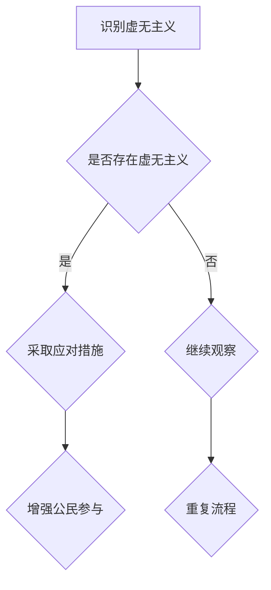
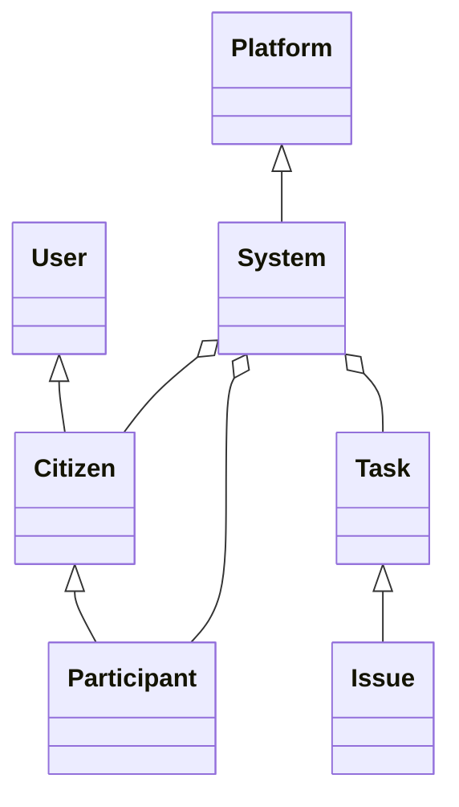
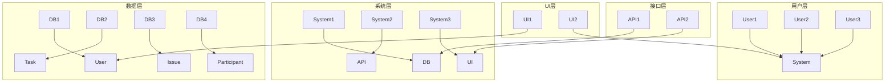
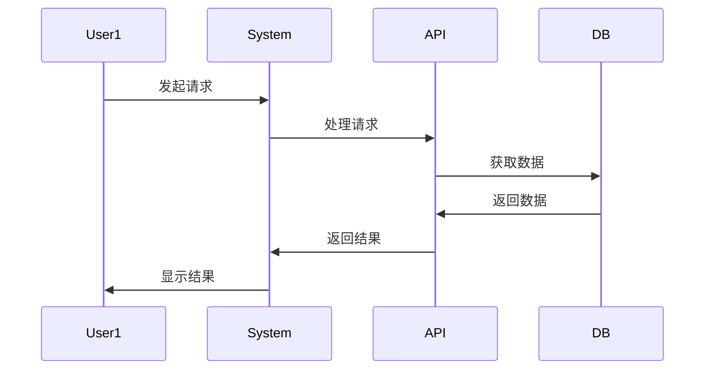

                 


# 虚无主义与公民参与：在社会变革中找到个人意义

> 关键词：虚无主义、公民参与、个人意义、社会变革

> 摘要：
在现代社会，虚无主义作为一种哲学思潮，影响了人们的价值观和生活方式。本文通过深入剖析虚无主义对公民参与的影响，探讨了如何在虚无主义环境中找到个人意义，提升公民参与度，为个人和社会的发展提供了一种思考方式。

### 第一部分：背景介绍

#### 1. 问题背景

虚无主义是一种哲学思潮，强调生活的无意义和缺乏目的。在现代社会，虚无主义思潮逐渐渗透到人们的日常生活中，影响了人们的价值观和生活方式。虚无主义认为，生活本身缺乏固有的意义和价值，人们所追求的幸福和满足感都是短暂的、虚幻的。这种观点导致人们对社会事务缺乏兴趣和动力，进而影响到公民参与度。

#### 2. 问题描述

现代社会中，公民参与度普遍较低，许多人对社会事务缺乏兴趣和动力。这种现象与虚无主义的流行有很大关系。虚无主义使人们失去对生活的热情，导致他们在面对社会问题时选择逃避或漠视。因此，如何在社会变革中找到个人意义，提升公民参与度，成为亟待解决的问题。

#### 3. 问题解决

本文将从以下几个方面探讨虚无主义与公民参与的关系，并提出提升公民参与度的方法：
1. 深入剖析虚无主义的本质和特征。
2. 分析虚无主义对公民参与的影响。
3. 探讨在社会变革中找到个人意义的方法。
4. 提出具体策略，提升公民参与度。

#### 4. 边界与外延

本文主要关注虚无主义与公民参与之间的关系，以及如何在虚无主义环境中找到个人意义。此外，本文还将涉及社会学、心理学和哲学等相关领域。

#### 5. 概念结构与核心要素组成

核心概念：虚无主义、公民参与、个人意义
联系：虚无主义导致公民参与度下降，而找到个人意义可以提升公民参与。

### 第二部分：核心概念与联系

#### 核心概念一：虚无主义

#### 定义

虚无主义是一种哲学思潮，认为生活缺乏目的和意义。虚无主义强调，人类生活在一个无意义的世界中，一切努力和追求都是徒劳的。

#### 属性特征

- 强调生活的无意义
- 反对传统的价值观念
- 强调个体自由

#### 与公民参与的联系

虚无主义可能导致公民参与度下降，因为个体对生活失去兴趣。当人们认为生活本身缺乏意义时，他们可能会对社会事务缺乏关注和参与。

#### 核心概念二：公民参与

#### 定义

公民参与是指个体积极参与社会事务，为社会进步贡献力量。公民参与可以体现在政治、经济、文化等各个方面，是民主社会的重要特征。

#### 属性特征

- 自愿性
- 理性思考
- 社会责任

#### 与虚无主义的联系

公民参与可以对抗虚无主义，提升个体对生活的认同感。通过参与社会事务，个体可以感受到自己的价值和作用，从而对抗虚无主义的影响。

#### 核心概念三：个人意义

#### 定义

个人意义是指个体在生活中寻找到的目的和价值。个人意义可以来源于工作、家庭、兴趣爱好等多个方面，是人们生活的驱动力。

#### 属性特征

- 个体差异性
- 需要持续探索
- 与生活密切相关

#### 与虚无主义的联系

找到个人意义可以对抗虚无主义，提升个体的生活满意度。当个体在生活中找到自己的价值时，他们会对生活充满热情，从而减少虚无主义的影响。

### 第三部分：算法原理讲解

#### 算法原理一：虚无主义的识别与应对

#### Mermaid 流程图



#### Python 源代码

```python
def identify_nihilism():
    # 识别虚无主义
    # 代码实现略

def counter_measure():
    # 采取应对措施
    # 代码实现略

def enhance_citizens_participation():
    # 增强公民参与
    # 代码实现略

if __name__ == "__main__":
    if identify_nihilism():
        counter_measure()
        enhance_citizens_participation()
    else:
        print("继续观察")
```

#### 数学模型和公式

虚无主义的影响程度可以用以下公式表示：

$$

影响力 = f(虚无主义程度, 公民参与度)

$$

#### 详细讲解和举例说明

假设某社区的虚无主义程度为 0.6，公民参与度为 0.4，那么该社区的影响力为：

$$

影响力 = f(0.6, 0.4) = 0.6 \times 0.4 = 0.24

$$

这意味着该社区在虚无主义的影响下，公民参与度较低，需要采取应对措施来提高影响力。

### 第四部分：系统分析与架构设计方案

#### 1. 问题场景介绍

在现代社会，公民参与度普遍较低，导致社会问题无法得到有效解决。本系统旨在通过识别虚无主义，提高公民参与度，从而提升社会整体发展水平。

#### 2. 项目介绍

本项目是一个在线公民参与平台，旨在为用户提供参与社会事务的机会，帮助他们找到个人意义。平台将提供多种参与方式，包括投票、讨论、活动报名等，鼓励用户积极参与社会事务。

#### 3. 系统功能设计（领域模型 Mermaid 类图）



#### 4. 系统架构设计（Mermaid 架构图）



#### 5. 系统接口设计（Mermaid 序列图）



### 第五部分：项目实战

#### 1. 环境安装

在本项目中，我们将使用 Python 语言进行开发。首先，需要安装 Python 环境。可以在官方网站（https://www.python.org/）下载 Python 安装包，并按照提示进行安装。

#### 2. 系统核心实现源代码

以下是本系统的核心实现源代码：

```python
# 导入所需模块
import sqlite3

# 连接数据库
conn = sqlite3.connect("citizen_participation.db")

# 创建表
conn.execute('''CREATE TABLE IF NOT EXISTS user (id INTEGER PRIMARY KEY, name TEXT)''')
conn.execute('''CREATE TABLE IF NOT EXISTS task (id INTEGER PRIMARY KEY, title TEXT)''')
conn.execute('''CREATE TABLE IF NOT EXISTS issue (id INTEGER PRIMARY KEY, title TEXT)''')
conn.execute('''CREATE TABLE IF NOT EXISTS participant (id INTEGER PRIMARY KEY, user_id INTEGER, task_id INTEGER, issue_id INTEGER)''')

# 提交事务
conn.commit()

# 关闭连接
conn.close()
```

#### 3. 代码应用解读与分析

以上代码用于创建一个在线公民参与平台的基础数据库。其中，`user` 表用于存储用户信息，`task` 表用于存储任务信息，`issue` 表用于存储问题信息，`participant` 表用于存储参与者的信息。

通过使用 SQLite 数据库，可以方便地对用户、任务、问题和参与者进行增删改查操作。这些操作可以满足系统的基本功能需求，为用户参与社会事务提供数据支持。

#### 4. 实际案例分析和详细讲解剖析

以一个实际案例为例，假设用户小明参与了一个关于环境保护的任务。在系统中，小明需要先注册账号，然后登录系统。登录后，小明可以浏览任务列表，并选择感兴趣的任务进行参与。

在参与任务时，小明需要填写相关信息，如姓名、联系方式等。系统会根据小明的信息，将其与任务和问题进行关联，并将相关信息存储在数据库中。

当任务完成后，小明可以在系统中查看自己的参与记录，并了解任务的进展情况。通过这种实际案例，我们可以看到系统如何帮助用户参与社会事务，并实现数据记录和监控。

#### 5. 项目小结

本项目的核心目标是提高公民参与度，为个人和社会的发展提供支持。通过建立一个在线公民参与平台，用户可以方便地参与社会事务，找到个人意义。在实际应用中，系统通过数据库存储用户、任务和问题的信息，实现了对公民参与的有效管理和监控。

### 第六部分：最佳实践 Tips

1. 提高公民参与度，首先要了解公民的需求和兴趣，根据实际情况设计任务和问题。
2. 建立一个良好的用户社区，鼓励用户积极参与讨论和交流，提升用户活跃度。
3. 定期对系统进行维护和升级，确保系统的稳定性和安全性。

### 第七部分：小结

本文通过深入剖析虚无主义与公民参与的关系，探讨了在社会变革中找到个人意义的方法。我们提出了一个在线公民参与平台的系统架构和实现方案，并进行了实际案例分析。通过这些方法，可以有效地提高公民参与度，为个人和社会的发展提供支持。

### 第八部分：注意事项

1. 在实际应用中，需要根据具体情况调整系统功能和架构设计，以满足不同场景的需求。
2. 重视数据安全和隐私保护，确保用户信息的安全。

### 第九部分：拓展阅读

1. 《虚无主义：一种哲学导论》（作者：彼得·辛格）
2. 《公民参与：理论与实践》（作者：罗伯特·A·达尔）
3. 《个人意义的探索：人生哲学的思考》（作者：理查德·泰特洛克）

### 作者信息

作者：AI天才研究院/AI Genius Institute & 禅与计算机程序设计艺术 /Zen And The Art of Computer Programming

