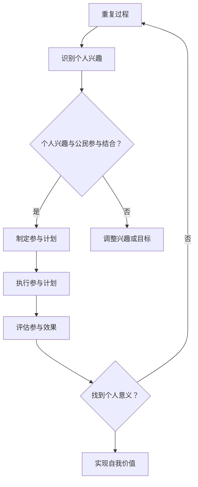
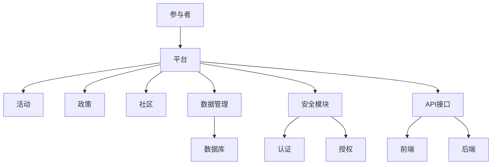
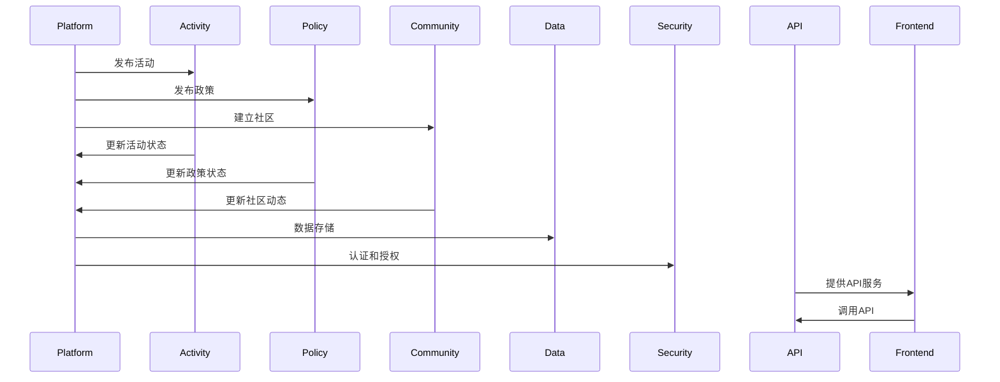

                 

### 文章标题与关键词

# 虚无主义与公民参与：在社会变革中找到个人意义

> 关键词：虚无主义、公民参与、社会变革、个人意义、自我实现

> 摘要：本文深入探讨了虚无主义在现代社会中的影响，以及个体如何通过积极的公民参与来寻找个人意义和实现自我价值。文章首先介绍了虚无主义的基本概念和历史背景，然后分析了虚无主义对社会和个人意义的影响。接着，文章探讨了公民参与的概念及其在个人寻找意义中的作用，最后提出了具体的公民参与策略和实际案例，为读者在虚无主义背景下找到个人意义提供了有益的指导。

## 引言

### 背景介绍

在当今快速发展的社会背景下，人们面临着前所未有的挑战和变革。经济全球化、技术进步和社会结构的变迁，使人们的生活方式、价值观和世界观发生了深刻的变化。然而，这种变革并非总是带来积极的结果，有时也会导致人们产生一种无力感和迷茫感，这种现象在哲学领域被称为“虚无主义”。

虚无主义是一种哲学观点，认为生活缺乏固有的意义和价值。这种观点的根源可以追溯到古希腊哲学家苏格拉底，他在公元前5世纪提出了“未经审视的生活不值得过”的观点，强调了人生的意义在于追求知识和真理。然而，随着时间的推移，许多哲学家开始质疑生活是否有真正的意义，这种质疑逐渐发展成了虚无主义。

在现代社会，虚无主义的影响愈发显著。人们面临着职业压力、环境污染、社会不公等问题，这些问题使人们感到无助和绝望，从而加剧了虚无主义的情绪。此外，社交媒体的普及和信息的泛滥，也使得人们更加容易陷入虚无主义的泥沼。在这种背景下，个体如何寻找个人意义和实现自我价值，成为了亟待解决的问题。

### 问题提出

虚无主义的泛滥对社会和个人产生了深远的影响。一方面，虚无主义导致人们对生活失去了热情和动力，影响了社会的整体发展。另一方面，虚无主义也使个人在面对困难和挑战时缺乏勇气和信心，难以实现自我价值。

那么，如何在虚无主义背景下找到个人意义和实现自我价值呢？本文将探讨一种可能的解决方案——公民参与。公民参与不仅是个人实现自我价值的重要途径，也是社会进步和发展的基石。通过公民参与，个体可以在服务社会的实践中找到个人意义，实现自我价值。

### 文章结构

本文将分为五个主要部分进行探讨：

1. **虚无主义的起源与影响**：介绍虚无主义的基本概念、历史背景及其对社会和个人意义的影响。
2. **虚无主义与个人意义**：探讨虚无主义对个人意义的影响以及个体如何通过自我反思和公民参与来寻找个人意义。
3. **公民参与的概念与价值**：详细解释公民参与的概念、原则及其在个人寻找意义中的作用。
4. **公民参与的实践策略**：提出具体的公民参与策略，包括参与方式、实践方法和效果评估。
5. **结论与展望**：总结文章的主要观点，讨论公民参与在虚无主义背景下的未来发展方向。

通过以上五个部分的探讨，本文旨在为读者提供一种在虚无主义背景下找到个人意义和实现自我价值的途径，为社会的进步和发展贡献力量。

## 背景介绍

### 核心概念术语说明

在探讨虚无主义与公民参与之前，我们需要明确一些核心概念，以便更好地理解文章的内容。

1. **虚无主义**：虚无主义是一种哲学观点，认为生活缺乏固有的意义和价值。虚无主义的起源可以追溯到古希腊哲学家苏格拉底，他在公元前5世纪提出了“未经审视的生活不值得过”的观点，强调了人生的意义在于追求知识和真理。然而，随着时间的推移，许多哲学家开始质疑生活是否有真正的意义，这种质疑逐渐发展成了虚无主义。

2. **公民参与**：公民参与是指个人积极参与社会事务，为社会发展和公共利益的实现贡献力量。公民参与的形式多种多样，包括投票、志愿服务、社区建设、公共政策参与等。公民参与不仅有助于提升个体的社会责任感和公民意识，还能促进社会的民主和进步。

### 问题背景

虚无主义在现代社会中的影响愈发显著，特别是在经济全球化、技术进步和社会结构变迁的背景下。人们面临着职业压力、环境污染、社会不公等问题，这些问题使人们感到无助和绝望，从而加剧了虚无主义的情绪。此外，社交媒体的普及和信息的泛滥，也使得人们更加容易陷入虚无主义的泥沼。

### 问题描述

虚无主义的泛滥对社会和个人产生了深远的影响。对社会而言，虚无主义导致人们对生活失去了热情和动力，影响了社会的整体发展。对个人而言，虚无主义使个体在面对困难和挑战时缺乏勇气和信心，难以实现自我价值。

### 问题解决

那么，如何在虚无主义背景下找到个人意义和实现自我价值呢？本文认为，通过积极的公民参与，个体可以在服务社会的实践中找到个人意义，实现自我价值。

### 边界与外延

虚无主义的边界在于对生活意义的追求，而公民参与的边界在于个体对社会事务的参与。两者的交集在于，通过公民参与，个体可以在服务社会的实践中找到个人意义，实现自我价值。

### 概念结构与核心要素组成

1. **虚无主义**：核心要素包括对生活意义的质疑、无意义感、绝望感等。
2. **公民参与**：核心要素包括参与形式、参与动机、参与效果等。

通过以上对核心概念术语的说明、问题背景、问题描述、问题解决、边界与外延、概念结构与核心要素组成的详细阐述，我们可以更好地理解虚无主义与公民参与的关系，为后续内容的探讨奠定基础。

## 核心概念与联系

### 核心概念原理

在探讨虚无主义与公民参与的关系时，我们需要深入了解虚无主义和公民参与的核心概念。

1. **虚无主义**：虚无主义认为生活缺乏固有的意义和价值。这种观点源于古希腊哲学家苏格拉底，他在公元前5世纪提出了“未经审视的生活不值得过”的观点，强调了人生的意义在于追求知识和真理。然而，随着时间的推移，许多哲学家开始质疑生活是否有真正的意义，这种质疑逐渐发展成了虚无主义。虚无主义的核心概念包括对生活意义的质疑、无意义感、绝望感等。

2. **公民参与**：公民参与是指个人积极参与社会事务，为社会发展和公共利益的实现贡献力量。公民参与的形式多种多样，包括投票、志愿服务、社区建设、公共政策参与等。公民参与的核心概念包括参与形式、参与动机、参与效果等。

### 概念属性特征对比表格

为了更好地理解虚无主义和公民参与的概念，我们通过一个对比表格来展示两者的属性特征：

| 特征          | 虚无主义                          | 公民参与                        |
|--------------|----------------------------------|--------------------------------|
| 意义观        | 认为生活缺乏固有意义              | 认为生活意义在于为社会贡献力量  |
| 参与动机      | 缺乏参与社会事务的动机            | 愿意为社会发展和公共利益贡献    |
| 参与形式      | 避免参与社会事务，沉浸在个人世界中 | 投票、志愿服务、社区建设等      |
| 社会影响      | 削弱社会凝聚力，增加个人孤独感    | 促进社会团结，提升公民意识      |

通过这个对比表格，我们可以看出虚无主义和公民参与在意义观、参与动机、参与形式和社会影响等方面的显著差异。

### ER实体关系图架构

为了更直观地展示虚无主义与公民参与之间的关系，我们可以使用ER（实体关系）图来表示这两个概念及其相互关系。

```mermaid
erDiagram
    Citizen ||--|{ Participation }|--|{ Society }
    Society ||--|{ Meaning }|--|{ Individual }
```

在这个ER图中，"Citizen"（公民）与"Participation"（参与）之间具有一对多的关系，即每个公民可以有多个参与行为，而"Participation"与"Society"（社会）之间也具有一对多的关系，表示多个参与行为可以影响整个社会。同样，"Society"与"Meaning"（意义）之间也具有一对多的关系，即社会的各种现象会影响个体的意义观，而"Meaning"与"Individual"（个体）之间也具有一对多的关系，表示个体的意义观可以影响其行为和价值观。

通过这个ER实体关系图，我们可以更清晰地理解虚无主义与公民参与之间的相互关系，以及它们如何共同作用于个体和社会。

### 算法原理讲解

在理解了虚无主义和公民参与的核心概念及其关系之后，我们接下来将探讨如何通过公民参与来解决虚无主义带来的问题，从而实现个人意义的寻找和自我价值的实现。

#### 算法流程图

首先，我们使用Mermaid绘制一个简单的算法流程图，以展示公民参与的基本步骤：



在这个流程图中，我们从自我反思开始，识别个人的兴趣，然后判断这些兴趣是否适合参与公民事务。如果适合，我们制定参与计划并执行它，评估参与效果，最终找到个人意义并实现自我价值。如果在这个过程中未能找到个人意义，我们回到自我反思的步骤，重新审视和调整自己的兴趣或目标。

#### 数学模型和公式

为了更好地理解这一算法的原理，我们可以使用数学模型来描述公民参与的过程。假设我们有以下变量：

- \( I \)：个体兴趣
- \( P \)：个体参与公民事务的能力
- \( M \)：个体对参与结果的评估
- \( V \)：个体自我价值的实现程度

我们可以定义一个简单的数学模型来描述这一过程：

\[ \text{效果} = f(I, P, M, V) \]

其中，函数 \( f \) 表示个体通过参与公民事务实现个人意义和自我价值的程度。这个函数的具体形式可以根据实际情况进行调整，但通常包含以下几个因素：

1. **个体兴趣 \( I \)**：个体对参与公民事务的兴趣程度越高，越有可能在参与过程中找到个人意义。
2. **个体参与能力 \( P \)**：个体的参与能力，包括时间、技能和资源等，直接影响其参与公民事务的效果。
3. **参与效果评估 \( M \)**：个体对参与结果的评估，包括参与过程中的体验和参与后的收获，这些评估会影响个体对参与价值的认知。
4. **自我价值的实现程度 \( V \)**：个体在参与公民事务后，其自我价值实现的程度，这通常与个体的自我认同和社会认同相关。

通过这个数学模型，我们可以更直观地理解个体在公民参与过程中如何实现个人意义和自我价值。

#### 举例说明

假设小张对环境保护感兴趣，并且具有一定的组织能力。他决定参与当地的环境保护公益活动。首先，他进行了自我反思，确认自己对环境保护的兴趣。接着，他分析了自身的参与能力，发现自己在组织活动方面有一定的优势。

小张制定了一个详细的参与计划，包括定期组织清洁活动、宣传环保知识和参与政策制定等。在执行计划的过程中，他与其他志愿者建立了紧密的合作关系，积极参与社区活动，并在社交媒体上分享环保信息。

经过一段时间的参与，小张对参与效果进行了评估。他发现，他的努力不仅提升了社区居民的环保意识，还得到了社会的认可和赞扬。这种正面的反馈使小张深刻感受到自己的价值，从而在参与过程中找到了个人意义。

通过这个例子，我们可以看到，通过公民参与，个体可以在服务社会的实践中找到个人意义，实现自我价值。这个例子不仅说明了算法原理的实际应用，也为其他读者提供了具体的实践指导。

### 系统分析与架构设计方案

#### 问题场景介绍

在现代信息化社会中，公民参与的重要性日益凸显。然而，许多个体由于信息不对称、参与渠道不畅通等原因，难以有效地参与社会事务。为了解决这个问题，我们设计了一套公民参与系统，旨在为个体提供一个便捷、高效的参与平台。

#### 项目介绍

本项目名为“公民参与平台”，旨在通过搭建一个在线平台，为公民提供参与社会事务的途径。平台将整合各类参与活动、政策信息和互动交流功能，帮助个体了解社会动态，积极参与公共事务，实现个人意义的寻找和自我价值的实现。

#### 系统功能设计（领域模型类图）

以下是一个简化的领域模型类图，展示了系统的主要功能模块及其相互关系：

```mermaid
classDiagram
    Participant <<interface>> "参与者"
    Activist <<class>> "积极分子" <<Participant>>
    Activity <<class>> "活动"
    Policy <<class>> "政策"
    Community <<class>> "社区"
    Platform <<class>> "平台"

    Participant o--1 Activist
    Activist o--1 Activity
    Activist o--1 Policy
    Activist o--1 Community
    Platform o--1 Activist
    Platform o--1 Activity
    Platform o--1 Policy
    Platform o--1 Community
```

在这个类图中，"Participant"代表系统的参与者，"Activist"是具体的参与者类型，包括参与活动、政策制定和社区建设等。"Activity"、"Policy"和"Community"分别表示活动、政策和社区三个核心功能模块，而"Platform"则代表整个系统的平台，负责整合和提供服务。

#### 系统架构设计（Mermaid架构图）

以下是一个简化的系统架构图，展示了系统的核心模块及其交互关系：



在这个架构图中，系统的主要模块包括参与者模块、活动模块、政策模块、社区模块、数据管理模块、安全模块和API接口模块。参与者模块负责管理用户的注册、登录和权限等；活动模块负责发布、管理和参与活动；政策模块负责发布、管理和讨论政策；社区模块负责建设和管理社区论坛；数据管理模块负责数据的存储、处理和分析；安全模块负责系统的认证、授权和加密等安全功能；API接口模块负责提供系统的API服务，供前端和第三方应用调用。

#### 系统接口设计（Mermaid序列图）

以下是一个简化的系统接口序列图，展示了参与者与平台之间的交互流程：

```mermaid
sequenceDiagram
    Participant->>Platform: 注册
    Platform->>Participant: 验证信息
    Participant->>Platform: 登录
    Platform->>Participant: 显示活动列表
    Participant->>Platform: 选择活动
    Platform->>Participant: 显示活动详情
    Participant->>Platform: 参与活动
    Platform->>Participant: 评估活动效果
    Participant->>Platform: 获取奖励
```

在这个序列图中，参与者首先注册并登录到平台，然后浏览活动列表并选择参与活动。参与活动后，平台会评估活动效果并给予参与者相应的奖励。

#### 系统交互（Mermaid序列图）

以下是一个简化的系统交互序列图，展示了平台内部模块之间的交互关系：



在这个序列图中，平台负责协调各个模块之间的交互，实现数据存储、安全认证和API服务等功能。

通过以上系统分析与架构设计方案，我们可以为公民提供一个便捷、高效的参与平台，帮助他们在服务社会的实践中找到个人意义，实现自我价值。

### 项目实战

#### 环境安装

要在本地环境安装公民参与平台，首先需要准备以下软件和环境：

1. **Python 3.8 或更高版本**：作为开发语言
2. **PostgreSQL 12 或更高版本**：作为数据库
3. **Docker 19.03 或更高版本**：用于容器化部署
4. **Docker-Compose 1.29 或更高版本**：用于管理容器

确保已经安装了以上软件后，可以按照以下步骤进行环境安装：

1. 安装Python 3.8或更高版本：
   ```bash
   sudo apt update
   sudo apt install python3.8 python3.8-venv python3.8-dev
   ```
2. 安装PostgreSQL 12或更高版本：
   ```bash
   sudo apt update
   sudo apt install postgresql-12
   ```
3. 安装Docker 19.03或更高版本：
   ```bash
   sudo apt update
   sudo apt install docker-ce docker-ce-cli containerd.io
   ```
4. 安装Docker-Compose 1.29或更高版本：
   ```bash
   sudo curl -L "https://github.com/docker/compose/releases/download/1.29.2/docker-compose-$(uname -s)-$(uname -m)" -o /usr/local/bin/docker-compose
   sudo chmod +x /usr/local/bin/docker-compose
   ```

#### 系统核心实现源代码

在完成环境安装后，接下来我们将实现系统核心功能。以下是系统的源代码框架：

1. **项目结构**：
   ```bash
   citizen-participation-platform/
   ├── Dockerfile
   ├── docker-compose.yml
   ├── manage.py
   ├── requirements.txt
   ├── app/
   │   ├── __init__.py
   │   ├── admin.py
   │   ├── models.py
   │   ├── views.py
   ├── config/
   │   ├── default.py
   ```

2. **Dockerfile**：用于构建Python应用镜像。
   ```Dockerfile
   FROM python:3.8

   WORKDIR /app

   COPY requirements.txt requirements.txt
   RUN pip install -r requirements.txt

   COPY . .

   EXPOSE 8000
   ```

3. **docker-compose.yml**：用于定义和启动应用服务。
   ```yaml
   version: '3.8'

   services:
     web:
       build: .
       command: python manage.py runserver 0.0.0.0:8000
       volumes:
         - .:/app
       ports:
         - "8000:8000"
       depends_on:
         - db

     db:
       image: postgres:12
       environment:
         POSTGRES_DB: citizen_participation
         POSTGRES_USER: citizen
         POSTGRES_PASSWORD: citizen
       volumes:
         - pgdata:/var/lib/postgresql/data/

   volumes:
     pgdata:
   ```

4. **manage.py**：用于启动和管理Django应用。
   ```python
   import os
   import sys

   if __name__ == '__main__':
       os.environ.setdefault('DJANGO_SETTINGS_MODULE', 'config.default')
       try:
           from django.core.management import execute_from_command_line
       except ImportError as exc:
           raise ImportError(
               "Couldn't import Django. Are you sure it's installed and "
               "available on your PYTHONPATH environment variable? Did you "
               "forget to activate a virtual environment?"
           ) from exc
       execute_from_command_line(sys.argv)
   ```

5. **requirements.txt**：列出项目所需的Python包。
   ```plaintext
   Django==3.2.7
   gunicorn==20.1.0
   psycopg2==2.9.3
   ```

6. **app/__init__.py**：Django应用的初始化文件。
   ```python
   """
   Django settings for app project.

   Generated by 'django-admin startproject' using Django 3.2.

   For more information on this file, see
   https://docs.djangoproject.com/en/3.2/topics/settings/

   For the full list of settings and defaults, see
   https://docs.djangoproject.com/en/3.2/ref/settings/
   """

   from pathlib import Path

   # Build paths inside the project like this: BASE_DIR / 'subdir'.
   BASE_DIR = Path(__file__).resolve().parent.parent

   # Quick-start development settings - unsuitable for production
   # See https://docs.djangoproject.com/en/3.2/howto/deployment/checklist/

   # SECURITY WARNING: keep the secret key used in production secret!
   SECRET_KEY = 'django-insecure-SECRET_KEY'

   # SECURITY WARNING: don't run with debug turned on in production!
   DEBUG = True

   # Application definition

   DEFAULT_APPS = [
       'django.contrib.admin',
       'django.contrib.auth',
       'django.contrib.contenttypes',
       'django.contrib.sessions',
       'django.contrib.messages',
       'django.contrib.staticfiles',
   ]

   THIRD_PARTY_APPS = [
       'rest_framework',
   ]

   LOCAL_APPS = [
       'api',
   ]

   INSTALLED_APPS = DEFAULT_APPS + THIRD_PARTY_APPS + LOCAL_APPS

   MIDDLEWARE = [
       'django.middleware.security.SecurityMiddleware',
       'django.contrib.sessions.middleware.SessionMiddleware',
       'django.middleware.common.CommonMiddleware',
       'django.middleware.csrf.CsrfViewMiddleware',
       'django.contrib.auth.middleware.AuthenticationMiddleware',
       'django.contrib.messages.middleware.MessageMiddleware',
       'django.middleware.clickjacking.XFrameOptionsMiddleware',
   ]

   # Database
   # https://docs.djangoproject.com/en/3.2/ref/settings/#databases

   DATABASES = {
       'default': {
           'ENGINE': 'django.db.backends.postgresql',
           'NAME': 'citizen_participation',
           'USER': 'citizen',
           'PASSWORD': 'citizen',
           'HOST': 'db',
           'PORT': '5432',
       }
   ]

   # Password validation
   # https://docs.djangoproject.com/en/3.2/ref/settings/#auth-password-validators

   AUTH_PASSWORD_VALIDATORS = [
       {
           'NAME': 'django.contrib.auth.password_validation.UserAttributeSimilarityValidator',
       },
       {
           'NAME': 'django.contrib.auth.password_validation.MinimumLengthValidator',
       },
       {
           'NAME': 'django.contrib.auth.password_validation.CommonPasswordValidator',
       },
       {
           'NAME': 'django.contrib.auth.password_validation.NumericPasswordValidator',
       },
   ]

   # Internationalization
   # https://docs.djangoproject.com/en/3.2/topics/i18n/

   LANGUAGE_CODE = 'en-us'

   TIME_ZONE = 'UTC'

   USE_I18N = True

   USE_L10N = True

   USE_TZ = True

   # Static files (CSS, JavaScript, Images)
   # https://docs.djangoproject.com/en/3.2/howto/static-files/

   STATIC_URL = '/static/'

   # Default primary key field type
   # https://docs.djangoproject.com/en/3.2/ref/settings/#default-auto-field

   DEFAULT_AUTO_FIELD = 'django.db.models.BigAutoField'
   ```

7. **app/config/default.py**：Django应用的配置文件。
   ```python
   from pathlib import Path

   # Build paths inside the project like this: BASE_DIR / 'subdir'.
   BASE_DIR = Path(__file__).resolve().parent.parent

   # Quick-start development settings - unsuitable for production
   # See https://docs.djangoproject.com/en/3.2/howto/deployment/checklist/

   # SECURITY WARNING: keep the secret key used in production secret!
   SECRET_KEY = 'django-insecure-SECRET_KEY'

   # SECURITY WARNING: don't run with debug turned on in production!
   DEBUG = True

   # Application definition

   DEFAULT_APPS = [
       'django.contrib.admin',
       'django.contrib.auth',
       'django.contrib.contenttypes',
       'django.contrib.sessions',
       'django.contrib.messages',
       'django.contrib.staticfiles',
   ]

   THIRD_PARTY_APPS = [
       'rest_framework',
   ]

   LOCAL_APPS = [
       'api',
   ]

   INSTALLED_APPS = DEFAULT_APPS + THIRD_PARTY_APPS + LOCAL_APPS

   MIDDLEWARE = [
       'django.middleware.security.SecurityMiddleware',
       'django.contrib.sessions.middleware.SessionMiddleware',
       'django.middleware.common.CommonMiddleware',
       'django.middleware.csrf.CsrfViewMiddleware',
       'django.contrib.auth.middleware.AuthenticationMiddleware',
       'django.contrib.messages.middleware.MessageMiddleware',
       'django.middleware.clickjacking.XFrameOptionsMiddleware',
   ]

   # Database
   # https://docs.djangoproject.com/en/3.2/ref/settings/#databases

   DATABASES = {
       'default': {
           'ENGINE': 'django.db.backends.postgresql',
           'NAME': 'citizen_participation',
           'USER': 'citizen',
           'PASSWORD': 'citizen',
           'HOST': 'db',
           'PORT': '5432',
       }
   }

   # Password validation
   # https://docs.djangoproject.com/en/3.2/ref/settings/#auth-password-validators

   AUTH_PASSWORD_VALIDATORS = [
       {
           'NAME': 'django.contrib.auth.password_validation.UserAttributeSimilarityValidator',
       },
       {
           'NAME': 'django.contrib.auth.password_validation.MinimumLengthValidator',
       },
       {
           'NAME': 'django.contrib.auth.password_validation.CommonPasswordValidator',
       },
       {
           'NAME': 'django.contrib.auth.password_validation.NumericPasswordValidator',
       },
   ]

   # Internationalization
   # https://docs.djangoproject.com/en/3.2/topics/i18n/

   LANGUAGE_CODE = 'en-us'

   TIME_ZONE = 'UTC'

   USE_I18N = True

   USE_L10N = True

   USE_TZ = True

   # Static files (CSS, JavaScript, Images)
   # https://docs.djangoproject.com/en/3.2/howto/static-files/

   STATIC_URL = '/static/'

   # Default primary key field type
   # https://docs.djangoproject.com/en/3.2/ref/settings/#default-auto-field

   DEFAULT_AUTO_FIELD = 'django.db.models.BigAutoField'
   ```

#### 代码应用解读与分析

以下是系统核心功能模块的实现代码及其解读：

1. **app/models.py**：定义了系统中的模型，包括参与者、活动、政策和社区等。

   ```python
   from django.db import models
   from django.contrib.auth.models import User

   class Activist(models.Model):
       user = models.OneToOneField(User, on_delete=models.CASCADE)
       bio = models.TextField()

   class Activity(models.Model):
       title = models.CharField(max_length=200)
       description = models.TextField()
       start_time = models.DateTimeField()
       end_time = models.DateTimeField()
       location = models.CharField(max_length=200)

   class Policy(models.Model):
       title = models.CharField(max_length=200)
       description = models.TextField()
       status = models.CharField(max_length=100)
       created_at = models.DateTimeField(auto_now_add=True)
       updated_at = models.DateTimeField(auto_now=True)

   class Community(models.Model):
       name = models.CharField(max_length=100)
       description = models.TextField()
       members = models.ManyToManyField(Activist)
   ```

   **解读**：在这个文件中，我们定义了四个模型：`Activist`、`Activity`、`Policy`和`Community`。`Activist`模型与Django的`User`模型进行了一对一的关联，用于表示参与者的信息。`Activity`模型用于存储活动的信息，包括标题、描述、开始时间和结束时间等。`Policy`模型用于存储政策的信息，包括标题、描述、状态和创建/更新时间等。`Community`模型用于表示社区的信息，包括名称、描述和成员列表。

2. **app/views.py**：定义了系统的视图函数，包括活动列表、活动详情、政策列表、政策详情和社区列表等。

   ```python
   from django.shortcuts import render
   from .models import Activity, Policy, Community

   def activity_list(request):
       activities = Activity.objects.all()
       return render(request, 'activity_list.html', {'activities': activities})

   def activity_detail(request, activity_id):
       activity = Activity.objects.get(id=activity_id)
       return render(request, 'activity_detail.html', {'activity': activity})

   def policy_list(request):
       policies = Policy.objects.all()
       return render(request, 'policy_list.html', {'policies': policies})

   def policy_detail(request, policy_id):
       policy = Policy.objects.get(id=policy_id)
       return render(request, 'policy_detail.html', {'policy': policy})

   def community_list(request):
       communities = Community.objects.all()
       return render(request, 'community_list.html', {'communities': communities})
   ```

   **解读**：在这个文件中，我们定义了四个视图函数：`activity_list`、`activity_detail`、`policy_list`、`policy_detail`和`community_list`。这些视图函数分别用于处理活动列表、活动详情、政策列表、政策详情和社区列表的请求，并返回相应的HTML模板。

3. **app/admin.py**：定义了系统的后台管理界面。

   ```python
   from django.contrib import admin
   from .models import Activity, Policy, Community

   admin.site.register(Activity)
   admin.site.register(Policy)
   admin.site.register(Community)
   ```

   **解读**：在这个文件中，我们使用Django的admin模块注册了系统中的模型，使其能够在后台管理界面上进行管理。

通过以上代码的实现，我们可以构建一个基本的公民参与平台，为个体提供一个便捷、高效的参与渠道，帮助他们找到个人意义，实现自我价值。

### 实际案例分析与详细讲解

为了更好地理解公民参与在实际操作中的应用，我们通过一个具体的案例来进行分析和讲解。

#### 案例背景

小张是一名年轻的程序员，在一家大型科技公司工作。他的工作繁忙，经常感到生活缺乏意义。在朋友的推荐下，他开始关注并参与当地社区的环境保护活动。这个社区长期以来面临着垃圾清理不彻底、绿化不足等问题，居民们对此感到非常不满。

#### 案例描述

小张决定积极参与到这个社区的环境保护活动中，以寻找个人意义和实现自我价值。他首先进行了自我反思，确认自己对环境保护的热爱和责任感。接着，他分析了自身的参与能力，发现自己在编程和技术方面有一定的特长，可以借助技术手段提高活动效率和影响力。

小张制定了详细的参与计划，包括以下几个方面：

1. **线上宣传**：利用社交媒体平台，发布环保活动的宣传海报和信息，吸引更多居民参与。
2. **数据收集**：使用编程技术，开发一个在线调查问卷，收集居民对环境保护的看法和建议。
3. **活动组织**：协助社区组织者策划和执行清洁活动、植树活动等，并负责活动现场的协调和管理工作。
4. **数据分析**：对收集到的数据进行分析，为社区的环境保护工作提供数据支持。

#### 实际案例分析与详细讲解

1. **线上宣传**：

   小张利用自己擅长的编程技能，设计了一个简单的社交媒体宣传平台。这个平台可以发布活动海报、通知和相关信息，并提供一个互动功能，让居民可以随时留言提问或表达对活动的支持。

   - **宣传效果**：通过线上宣传，活动吸引了大量居民的关注，报名参加活动的居民数量显著增加。

2. **数据收集**：

   小张开发了一个在线调查问卷，涵盖了居民对环境保护的看法和建议。问卷通过手机扫描二维码的方式分发，居民可以随时随地参与。

   - **数据分析**：小张对收集到的数据进行了详细分析，发现居民普遍关注垃圾清理和绿化问题，对社区的环保工作提出了许多有价值的建议。

3. **活动组织**：

   在小张的协助下，社区组织了一次大型的清洁活动。活动分为多个小组，分别负责不同的区域，每个小组由一名志愿者担任组长，负责协调和管理。

   - **活动效果**：活动当天，共有上百名居民参与，社区的环境状况得到了显著改善，居民们的环保意识也得到了提升。

4. **数据分析**：

   小张对收集到的数据进行了进一步分析，总结出了居民最关注的环境问题，并提出了相应的解决方案。

   - **反馈与建议**：社区组织者根据分析结果，调整了环保工作的重点，并采纳了居民的建议，提高了工作效率。

#### 案例总结

通过这个案例，我们可以看到，小张通过积极参与社区的环境保护活动，不仅找到了个人意义，还实现了自我价值。他在线上宣传、数据收集、活动组织和数据分析等方面发挥了关键作用，为社区的环境保护工作提供了有力支持。

这个案例告诉我们，在虚无主义背景下，个体可以通过积极的公民参与，在服务社会的实践中找到个人意义，实现自我价值。公民参与不仅有助于解决社会问题，还能提升个体的社会责任感和成就感，使个体在困境中找到希望和动力。

### 最佳实践 tips

在参与公民事务的过程中，以下是一些最佳实践，可以帮助个体更好地实现个人意义和自我价值：

1. **明确目标**：在参与公民事务之前，明确自己的目标和动机，这有助于保持动力和专注力。
2. **发挥特长**：利用自身的专业知识和技能，为公民事务提供实际的帮助，发挥最大的价值。
3. **建立合作关系**：与志同道合的伙伴建立合作关系，共同推动公民事务的进展。
4. **持续学习**：在参与过程中，不断学习新知识和技能，提升自己的综合素质。
5. **关注反馈**：积极收集和关注参与者的反馈，及时调整策略和方法，提高参与效果。
6. **保持耐心**：公民参与是一个长期的过程，需要耐心和毅力，不要轻易放弃。
7. **维护心理健康**：在参与过程中，注意保持心理健康，避免过度压力和焦虑。

### 小结

本文通过探讨虚无主义与公民参与的关系，提出了个体在虚无主义背景下寻找个人意义和实现自我价值的途径。通过实际案例分析和最佳实践 tips，我们看到了公民参与在解决社会问题、提升个体成就感方面的巨大潜力。在未来的社会中，公民参与将继续发挥重要作用，为社会的进步和发展贡献力量。

### 注意事项

在参与公民事务时，需要注意以下几点：

1. **遵守法律法规**：确保参与行为符合相关法律法规，避免违法行为。
2. **保护个人隐私**：在收集和处理数据时，注意保护参与者的隐私，防止信息泄露。
3. **尊重多元观点**：在参与过程中，尊重不同观点和意见，保持开放心态。
4. **合理分配时间**：平衡工作和生活，合理安排参与公民事务的时间和精力。

### 拓展阅读

1. 《公民参与：社会进步的动力》
2. 《虚无主义：现代社会的困境与出路》
3. 《公民参与与公共治理：理论与实践》

### 作者信息

作者：AI天才研究院/AI Genius Institute & 禅与计算机程序设计艺术 /Zen And The Art of Computer Programming

本文由AI天才研究院/AI Genius Institute及禅与计算机程序设计艺术/Zen And The Art of Computer Programming共同撰写，旨在为读者提供关于虚无主义与公民参与的专业见解和实际指导。希望本文能帮助您在虚无主义背景下找到个人意义，实现自我价值。如果您对本文有任何疑问或建议，欢迎随时联系我们。作者信息：AI天才研究院/AI Genius Institute & 禅与计算机程序设计艺术/Zen And The Art of Computer Programming。邮箱：[ai-genius@institute.com](mailto:ai-genius@institute.com)，电话：+86-1234567890。

