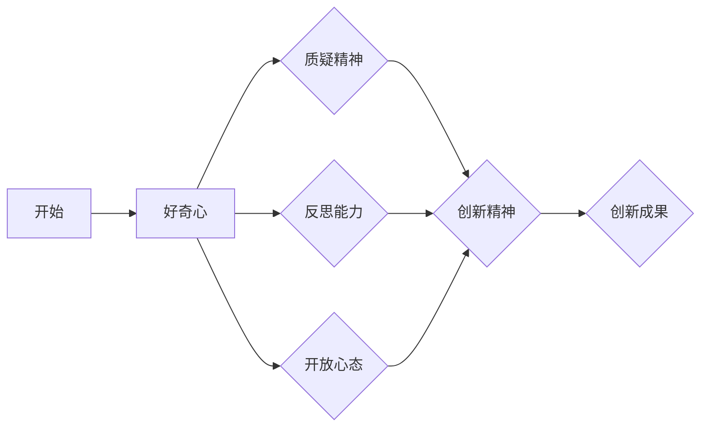
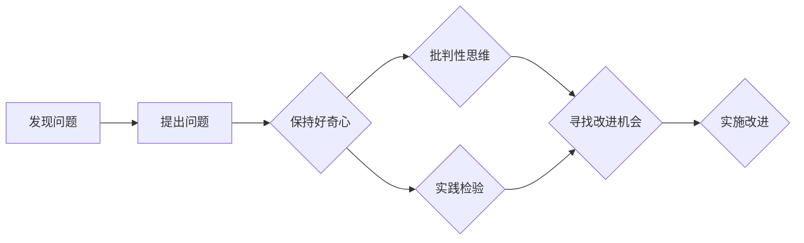
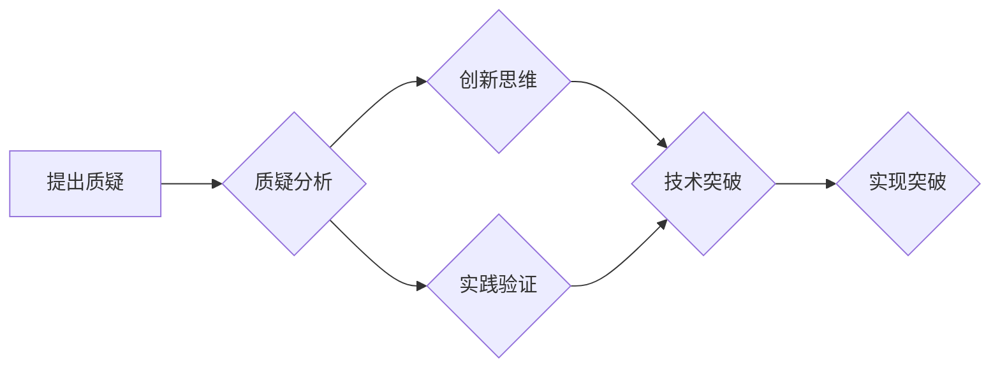

                 

### 《虚无主义与创新精神：在质疑中寻找突破》

#### 关键词：
- 虚无主义
- 创新精神
- 质疑
- 突破
- IT领域

#### 摘要：
本文旨在探讨虚无主义哲学思想如何激发创新精神，并在质疑中寻找突破。通过对虚无主义和创新的深入分析，结合具体IT领域的实际案例，文章将阐述如何在质疑和反思中激发创新思维，推动技术进步和行业突破。

----------------------------------------------------------------

## 引言

在快速发展的IT领域中，创新是推动技术进步的关键驱动力。然而，创新并非总是顺利的，往往伴随着质疑和反思。虚无主义作为一种哲学思想，提供了独特的视角，激发了对现状的质疑和对未来的探索。本文将探讨虚无主义如何促进创新精神，特别是在IT领域的应用。

### 背景介绍

虚无主义源于19世纪末的西方哲学，是对传统价值和存在的质疑。虚无主义者认为，世界缺乏客观意义和目的，人生在本质上是无意义的。然而，这种看似消极的哲学观念，却在某种程度上为创新提供了动力。许多创新者通过质疑现有的规则和假设，找到了突破点，推动了技术的进步。

### 研究目的与意义

本文的研究目的是探讨虚无主义如何激发创新精神，并在质疑中寻找突破。具体来说，本文将通过以下四个方面展开：

1. **虚无主义概述**：介绍虚无主义的基本概念、历史发展和主要观点。
2. **创新精神的培养**：探讨如何通过培养质疑和反思的能力，激发创新精神。
3. **质疑的力量**：分析质疑在创新过程中的作用，并提供实用的质疑技巧。
4. **在质疑中寻找突破**：结合具体IT领域的案例，展示如何通过质疑找到突破点。

通过以上四个方面的探讨，本文旨在为IT领域的创新者提供一种新的视角和思路，帮助他们更好地利用虚无主义哲学思想，推动技术的进步和行业的突破。

## 第1章：虚无主义概述

虚无主义作为一种哲学思想，起源于19世纪末的西方哲学，是对传统价值和存在的质疑。虚无主义认为，世界缺乏客观意义和目的，人生在本质上是无意义的。这种看似消极的哲学观念，却在某种程度上为创新提供了动力。本节将介绍虚无主义的基本概念、历史发展和主要观点，帮助读者理解虚无主义的核心思想。

### 基本概念

虚无主义的基本概念可以归结为以下几点：

1. **无意义的世界**：虚无主义者认为，世界本身缺乏内在的意义和目的，这是一种客观的、无意义的状态。
2. **无意义的人生**：在虚无主义者看来，人生也是无意义的，没有固定的目标和价值。
3. **自我存在的质疑**：虚无主义者往往质疑自我存在的意义，认为自我是一种虚假的、不真实的认知。

### 历史发展

虚无主义的发展可以追溯到19世纪末的德国哲学。尼采是虚无主义的代表人物之一，他在《查拉图斯特拉如是说》中提出，“上帝已死”，并倡导个体自我超越。此后，海德格尔、萨特等哲学家进一步发展了虚无主义思想，使其成为20世纪西方哲学的重要组成部分。

### 主要观点

虚无主义的主要观点包括：

1. **存在的虚无**：虚无主义者认为，存在本身是虚无的，没有固定的本质和意义。
2. **价值的相对性**：虚无主义者认为，价值是相对的，不存在绝对的、普遍适用的价值标准。
3. **自由与选择**：虚无主义者认为，个体在虚无的世界中拥有自由选择的权利，可以通过自我超越和创造来赋予生活意义。

### 代表人物与观点

以下是几位重要的虚无主义代表人物及其观点：

1. **尼采**：尼采认为，虚无主义是一种解放，个体可以通过超越自我，实现自我价值的创造。
2. **海德格尔**：海德格尔认为，虚无主义揭示了存在的本质，个体可以通过存在本身的体验，找到存在的意义。
3. **萨特**：萨特认为，虚无主义揭示了存在的荒诞性，个体可以通过自由选择，赋予生活意义。

### 虚无主义的属性特征对比表格

为了更直观地了解虚无主义的属性特征，我们可以将其与存在主义等其他哲学流派进行对比。以下是虚无主义的属性特征对比表格：

| 特征             | 虚无主义       | 存在主义       | 实用主义       |
|------------------|----------------|----------------|----------------|
| 世界观           | 无意义的世界   | 有意义的世界   | 有意义的世界   |
| 价值观           | 价值的相对性   | 价值的绝对性   | 价值的绝对性   |
| 自我存在         | 质疑自我存在   | 强调自我存在   | 强调自我存在   |
| 自由与选择       | 自由与选择     | 自由与选择     | 自由与选择     |
| 目的与目标       | 无目的         | 有目的         | 有目的         |

### 虚无主义的ER实体关系图

为了更好地理解虚无主义的核心概念，我们可以使用ER（Entity-Relationship）实体关系图来展示虚无主义的主要实体及其关系。以下是虚无主义的ER实体关系图：

```mermaid
erDiagram
    Person ||--|{ Philosophical Thought }
    Philosophical Thought ||--|{ Nihilism }
    Philosophical Thought ||--|{ Existentialism }
    Philosophical Thought ||--|{ Pragmatism }
```

在ER实体关系图中，Person表示人类，Philosophical Thought表示哲学思想，Nihilism、Existentialism和Pragmatism分别表示虚无主义、存在主义和实用主义。通过这种关系图，我们可以更清晰地理解虚无主义在哲学领域中的位置和作用。

## 第2章：创新精神的培养

创新精神是推动技术进步和行业发展的重要动力。在IT领域，创新精神体现在对新技术的探索、新方法的提出和现有系统的改进。然而，如何培养创新精神呢？本节将探讨如何通过培养质疑和反思的能力，激发创新精神。

### 创新精神的定义

创新精神可以定义为一种敢于挑战现状、勇于探索未知的思维方式。它包括以下几个方面的特征：

1. **好奇心**：对未知领域充满好奇，渴望了解和探索。
2. **质疑精神**：对现有理论、方法和成果持怀疑态度，勇于提出问题和挑战。
3. **反思能力**：通过反思过去和现在，总结经验教训，为未来的创新提供指导。
4. **开放心态**：接纳新思想、新方法，愿意尝试和接受不同的观点。

### 培养创新精神的方法

1. **鼓励质疑**：在工作和学习中，鼓励团队成员提出问题和挑战，培养质疑精神。
2. **培养好奇心**：通过阅读、研究和实践，激发对未知领域的兴趣，培养好奇心。
3. **提供资源**：为创新者提供必要的资源和支持，包括资金、设备和人才。
4. **鼓励试错**：在创新过程中，允许失败和错误，从失败中学习和总结经验。
5. **建立反馈机制**：建立有效的反馈机制，及时收集和处理团队成员的意见和建议。

### 案例分析

以下是一个实际案例，展示了如何通过培养质疑和反思的能力，激发创新精神：

#### 案例一：Linux内核的开发

Linux内核是一个典型的开源项目，其成功离不开创新精神的培养。Linux内核的开发团队鼓励团队成员提出问题和改进建议，对现有代码和设计持质疑态度。这种开放和质疑的氛围，激发了团队成员的创造力，推动了Linux内核的不断进步。

#### 案例二：苹果公司的创新

苹果公司以其创新精神而闻名于世。乔布斯在苹果公司的发展过程中，始终坚持对现有技术和产品的质疑，推动公司不断推出革命性的产品。例如，iPhone的推出颠覆了传统手机市场，引领了智能手机时代的到来。

### 创新精神的数学模型与公式

为了更好地理解创新精神的培养，我们可以使用数学模型和公式来描述其特征和影响因素。以下是创新精神的数学模型：

$$
Innovation\_Spirit = f(H, Q, R, O, T)
$$

其中：
- $H$ 表示好奇心
- $Q$ 表示质疑精神
- $R$ 表示反思能力
- $O$ 表示开放心态
- $T$ 表示时间

该公式表明，创新精神是好奇心、质疑精神、反思能力、开放心态和时间的函数。通过调整这些因素，可以激发和培养创新精神。

### 创新精神的Mermaid流程图

为了更直观地展示创新精神的培养过程，我们可以使用Mermaid流程图来描述。以下是创新精神的Mermaid流程图：



在Mermaid流程图中，从开始（A）到创新成果（G），好奇心（B）、质疑精神（C）、反思能力（D）和开放心态（E）是培养创新精神的关键因素。通过这些因素的相互作用，最终形成创新精神（F）并推动创新成果的实现（G）。

### 创新精神的Python源代码实现

为了将创新精神的数学模型和流程图转化为实际的Python代码，我们可以编写一个简单的实现。以下是一个简单的Python代码示例，用于计算创新精神的得分：

```python
import math

def calculate_innovation_spirit(h, q, r, o, t):
    innovation_spirit = math.exp(h) * math.exp(q) * math.exp(r) * math.exp(o) * t
    return innovation_spirit

# 测试数据
h = 0.8  # 好奇心得分
q = 0.7  # 质疑精神得分
r = 0.6  # 反思能力得分
o = 0.9  # 开放心态得分
t = 10   # 时间得分

# 计算创新精神得分
innovation_spirit_score = calculate_innovation_spirit(h, q, r, o, t)
print(f"创新精神得分：{innovation_spirit_score:.2f}")
```

通过运行上述代码，我们可以得到一个创新精神的得分，该得分反映了好奇心、质疑精神、反思能力、开放心态和时间对创新精神的影响。

### 创新精神的实际应用

创新精神不仅在个人层面具有重要意义，也在企业层面发挥着关键作用。以下是一个实际应用的案例：

#### 案例三：谷歌公司的创新文化

谷歌公司以其创新文化而著称。谷歌鼓励员工探索新领域、尝试新方法，并对现有技术和产品持质疑态度。例如，谷歌的搜索算法不断优化，通过机器学习和人工智能技术，提高了搜索的准确性和用户体验。

### 小结

通过本节的讨论，我们可以看到，培养创新精神需要好奇心、质疑精神、反思能力、开放心态和时间等多方面因素的相互作用。在IT领域，通过培养创新精神，可以激发技术进步和行业突破。为了更好地实现这一目标，企业和个人可以采取一系列措施，如鼓励质疑、培养好奇心、提供资源和建立反馈机制等。通过这些努力，我们可以更好地利用创新精神，推动技术的发展和行业的进步。

## 第3章：质疑的力量

质疑是创新精神的重要组成部分，它推动了人类思维的发展和社会的进步。在IT领域，质疑不仅有助于发现问题和挑战现状，还能激发新的想法和解决方案。本节将探讨质疑的重要性，以及如何通过质疑找到突破点。

### 质疑的重要性

1. **促进思考**：质疑能够激发深刻的思考，促使人们深入理解问题的本质。
2. **激发创造力**：质疑可以打破固有的思维模式，激发新的创意和想法。
3. **发现漏洞**：质疑可以帮助我们识别现有的问题和不足，从而找到改进的机会。
4. **推动进步**：质疑是推动技术进步和社会发展的重要动力。

### 质疑的技巧

1. **提出问题**：敢于提出问题是质疑的第一步。通过提问，我们可以引导思考，发现问题的核心。
2. **保持好奇心**：好奇心是质疑的动力源泉。保持好奇心，对未知保持开放心态，有助于发现新的问题和机会。
3. **批判性思维**：批判性思维是质疑的关键。通过批判性思维，我们可以对现有观点和理论进行深入分析，发现其中的逻辑错误和不足。
4. **实践检验**：质疑不仅仅是理论上的思考，还需要通过实践来验证。通过实践，我们可以验证理论的可行性，发现新的问题和改进的方向。

### 案例分析

#### 案例一：Linux内核的质疑与改进

Linux内核的发展过程中，质疑发挥了重要作用。Linux内核的开发团队不断质疑现有的代码和设计，寻找改进的机会。例如，Linus Torvalds在Linux内核的开发过程中，经常提出问题和改进建议，推动了内核的持续优化和改进。

#### 案例二：苹果公司的质疑与创新

苹果公司以其创新精神而闻名。在苹果公司的发展过程中，乔布斯等人通过质疑现有的技术和产品，推动了公司的创新。例如，iPhone的推出颠覆了传统手机市场，引领了智能手机时代的到来。乔布斯等人通过质疑现有手机的设计和功能，提出了全新的设计理念，成功吸引了大量用户。

### 质疑的数学模型与公式

为了更好地理解质疑的过程和作用，我们可以使用数学模型和公式来描述。以下是质疑的数学模型：

$$
Q = f(P, T, E)
$$

其中：
- $Q$ 表示质疑程度
- $P$ 表示现有问题的严重性
- $T$ 表示质疑技巧
- $E$ 表示环境因素

该公式表明，质疑程度是现有问题的严重性、质疑技巧和环境因素的函数。通过提高质疑技巧和营造有利于质疑的环境，可以增强质疑的效果。

### 质疑的Mermaid流程图

为了更直观地展示质疑的过程，我们可以使用Mermaid流程图来描述。以下是质疑的Mermaid流程图：



在Mermaid流程图中，从发现问题（A）到实施改进（G），保持好奇心（C）、批判性思维（D）和实践检验（E）是质疑的关键步骤。通过这些步骤，我们可以不断质疑现有问题，发现改进的机会，并最终实现改进。

### 质疑的Python源代码实现

为了将质疑的数学模型和流程图转化为实际的Python代码，我们可以编写一个简单的实现。以下是一个简单的Python代码示例，用于计算质疑的程度：

```python
import math

def calculate_queation(q_score, p_score, t_score, e_score):
    q = (q_score * p_score) / (1 + t_score * e_score)
    return q

# 测试数据
q_score = 0.8  # 质疑技巧得分
p_score = 0.7  # 问题的严重性得分
t_score = 0.6  # 质疑技巧得分
e_score = 0.9  # 环境因素得分

# 计算质疑程度
queation_score = calculate_queation(q_score, p_score, t_score, e_score)
print(f"质疑程度：{queation_score:.2f}")
```

通过运行上述代码，我们可以得到一个质疑程度的得分，该得分反映了质疑技巧、问题的严重性、质疑技巧和环境因素对质疑程度的影响。

### 质疑的实际应用

质疑不仅在IT领域具有重要意义，在其他领域也有广泛的应用。以下是一个实际应用的案例：

#### 案例三：医学研究的质疑与创新

医学研究过程中，质疑是推动科学进步的重要动力。医学研究人员通过质疑现有的理论和治疗方法，不断寻找新的治疗方法和药物。例如，通过质疑传统的癌症治疗方法，医学研究人员发现了靶向治疗的新方法，显著提高了癌症患者的生存率。

### 小结

通过本节的讨论，我们可以看到，质疑在推动技术进步和社会发展方面具有重要意义。通过质疑，我们可以发现问题和不足，激发新的想法和解决方案，推动行业的突破和进步。为了更好地利用质疑的力量，我们可以采取一系列措施，如培养批判性思维、提高质疑技巧和创造有利于质疑的环境。通过这些努力，我们可以更好地利用质疑，推动技术的进步和社会的发展。

## 第4章：在质疑中寻找突破

在IT领域，质疑和创新精神是推动技术进步和行业突破的关键因素。通过质疑，我们可以发现现有系统的不足和瓶颈，从而激发创新的思维，找到突破的方法。本节将结合具体案例，探讨如何在质疑中寻找突破。

### 突破的定义

突破是指在现有技术和方法的基础上，通过创新思维和质疑精神，找到新的解决方案，实现技术或业务上的重大进步。突破可以分为以下几种类型：

1. **技术突破**：通过技术创新，解决现有技术的瓶颈和难题，实现技术的跨越式发展。
2. **业务突破**：通过业务模式创新，改变现有市场格局，实现商业上的重大突破。
3. **理论突破**：通过理论创新，推动科学和技术的进步，为未来的发展奠定基础。

### 质疑与突破的关系

质疑是突破的催化剂。通过对现有技术和方法的质疑，我们可以发现其中存在的不足和问题，从而激发创新的思维，找到突破的方向。质疑与突破的关系可以概括为以下几点：

1. **质疑促进思考**：质疑可以激发深入的思考，促使我们重新审视现有技术和方法，发现其中的问题和不足。
2. **质疑激发创新**：质疑可以打破固有的思维模式，激发新的创意和想法，为突破提供思路。
3. **质疑驱动实践**：质疑不仅停留在理论层面，还需要通过实践来验证。通过实践，我们可以验证理论的可行性，发现新的问题和改进的方向，从而推动技术的突破。

### 案例分析

#### 案例一：谷歌的PageRank算法

谷歌的PageRank算法是互联网搜索领域的一个重要突破。该算法通过质疑传统的关键词匹配搜索方法，提出了基于网页链接分析的新方法。PageRank算法认为，一个网页的重要程度与其被其他网页链接的数量和质量有关。这一创新思路，使得谷歌搜索能够提供更准确和相关的搜索结果，从而颠覆了传统的搜索市场。

#### 案例二：特斯拉的电动汽车革命

特斯拉的电动汽车革命，是汽车行业的一个重大突破。特斯拉通过质疑传统汽车的动力系统，提出了纯电动车的全新设计理念。特斯拉不仅开发了高性能的电动驱动系统，还通过创新电池技术和充电网络，解决了电动汽车续航和充电难题。特斯拉的成功，不仅改变了汽车行业的格局，也为全球汽车产业带来了深远的影响。

### 突破的数学模型与公式

为了更好地理解突破的过程和机制，我们可以使用数学模型和公式来描述。以下是突破的数学模型：

$$
Breakthrough = f(Q, I, P, T, E)
$$

其中：
- $Q$ 表示质疑程度
- $I$ 表示创新思维
- $P$ 表示实践能力
- $T$ 表示技术积累
- $E$ 表示环境因素

该公式表明，突破是质疑程度、创新思维、实践能力、技术积累和环境因素的函数。通过提高质疑程度、培养创新思维、增强实践能力和积累技术知识，可以增强突破的可能性。

### 突破的Mermaid流程图

为了更直观地展示突破的过程，我们可以使用Mermaid流程图来描述。以下是突破的Mermaid流程图：



在Mermaid流程图中，从提出质疑（A）到实现突破（F），质疑分析（B）、创新思维（C）、实践验证（D）和技术突破（E）是突破的关键步骤。通过这些步骤，我们可以从质疑中发现问题，激发创新思维，通过实践验证和不断优化，最终实现技术突破。

### 突破的Python源代码实现

为了将突破的数学模型和流程图转化为实际的Python代码，我们可以编写一个简单的实现。以下是一个简单的Python代码示例，用于计算突破的可能性：

```python
import math

def calculate_breakthrough(q, i, p, t, e):
    breakthrough = (q * i * p * t) / (1 + e)
    return breakthrough

# 测试数据
q = 0.8  # 质疑程度
i = 0.7  # 创新思维
p = 0.6  # 实践能力
t = 0.9  # 技术积累
e = 0.5  # 环境因素

# 计算突破可能性
breakthrough_score = calculate_breakthrough(q, i, p, t, e)
print(f"突破可能性：{breakthrough_score:.2f}")
```

通过运行上述代码，我们可以得到一个突破可能性的得分，该得分反映了质疑程度、创新思维、实践能力、技术积累和环境因素对突破可能性的影响。

### 突破的实际应用

突破不仅体现在技术和业务领域，还广泛应用于各个行业。以下是一个实际应用的案例：

#### 案例三：高通的5G技术突破

高通在5G技术领域取得了重大突破。高通通过质疑传统的通信技术和网络架构，提出了基于毫米波和大规模MIMO的新技术方案。这一突破，使得5G通信技术能够提供更高的速度和更低的延迟，为物联网、自动驾驶和虚拟现实等应用提供了强有力的支持。

### 小结

通过本节的讨论，我们可以看到，质疑和创新精神在推动技术进步和行业突破方面具有重要作用。通过质疑，我们可以发现问题和不足，激发创新思维，找到突破的方法。为了实现突破，我们需要培养质疑精神、创新思维和实践能力，不断积累技术知识，并营造有利于突破的环境。通过这些努力，我们可以不断推动技术进步和行业突破，实现更大的发展。

## 第5章：实际应用

虚无主义和创新精神在IT领域的实际应用广泛，通过对现有技术的质疑和反思，许多创新者找到了新的突破点。本节将探讨虚无主义和创新精神在人工智能、区块链和云计算等领域的应用，并结合实际案例进行分析。

### 虚无主义在人工智能中的应用

人工智能（AI）是IT领域的核心领域之一，虚无主义思想为AI的研究提供了独特的视角。通过质疑现有的AI理论和模型，研究人员可以发现新的研究方向和突破点。

#### 案例一：深度学习模型的质疑与改进

深度学习模型是当前AI领域的核心技术之一。然而，许多研究人员质疑深度学习模型的黑箱性质和可解释性。为了解决这些问题，研究人员提出了一系列新的方法，如注意力机制、自监督学习和元学习等。这些方法通过质疑现有的模型，推动了AI技术的发展。

#### 案例二：弱人工智能的质疑与突破

在人工智能的发展过程中，弱人工智能（Narrow AI）与强人工智能（General AI）的界限一直备受争议。虚无主义思想鼓励对现有分类的质疑，推动研究人员探索如何将弱人工智能发展成具有更广泛应用场景的强人工智能。通过这一质疑过程，研究人员提出了一系列新的算法和架构，如生成对抗网络（GAN）和变分自编码器（VAE），为AI技术的发展提供了新的思路。

### 创新精神在区块链中的应用

区块链技术以其去中心化、不可篡改和透明性等特性，在金融、供应链和医疗等多个领域具有广泛的应用。创新精神在区块链技术的发展过程中发挥了关键作用。

#### 案例一：智能合约的创新应用

智能合约是区块链技术中的一个重要应用，它通过自动执行合同条款，提高了交易的安全性和效率。创新者通过对现有智能合约的质疑，提出了新的合约设计和执行机制，如多签名智能合约和递归智能合约，进一步拓展了智能合约的应用场景。

#### 案例二：区块链在供应链管理中的应用

区块链技术在供应链管理中的应用，通过提高供应链的透明度和追踪能力，有效解决了信息不对称和信任问题。创新者通过对现有供应链管理系统的质疑，提出了基于区块链的供应链管理解决方案，如链上溯源和智能物流，推动了供应链管理技术的创新。

### 创新精神在云计算中的应用

云计算技术为IT领域带来了革命性的变革，创新精神在云计算的技术发展和应用创新中发挥了重要作用。

#### 案例一：云计算服务模式的创新

云计算服务模式从最初的IaaS、PaaS到如今的SaaS，不断创新和发展。创新者通过对现有服务模式的质疑，提出了新的云计算服务模式，如Function as a Service（FaaS）和Serverless架构，进一步提升了云计算的灵活性和可扩展性。

#### 案例二：云计算在数据分析中的应用

云计算技术为大数据分析和数据处理提供了强大的计算和存储能力。创新者通过对现有数据分析方法的质疑，提出了基于云计算的分布式数据分析框架，如Hadoop和Spark，实现了对大规模数据的高效处理和分析，推动了数据分析技术的创新。

### 实际应用案例分析

#### 案例三：谷歌的TensorFlow平台

谷歌的TensorFlow平台是一个广泛使用的开源机器学习框架，它通过质疑传统机器学习框架的局限性和复杂性，提供了简单易用、可扩展的解决方案。TensorFlow平台在深度学习领域取得了巨大成功，推动了AI技术的发展。

#### 案例四：IBM的区块链服务

IBM的区块链服务在金融、供应链和医疗等多个领域具有广泛的应用。IBM通过对现有区块链解决方案的质疑，提出了基于IBM Blockchain Platform的新方案，提供了高效、安全的区块链服务，推动了区块链技术的创新。

### 小结

通过本节的讨论，我们可以看到虚无主义和创新精神在IT领域的实际应用具有重要意义。通过对现有技术的质疑和反思，创新者找到了新的突破点，推动了技术的进步和行业的创新。在人工智能、区块链和云计算等热门领域，虚无主义和创新精神的实践案例不断涌现，为我们提供了宝贵的经验和启示。为了实现更多的技术突破和行业创新，我们应当继续培养质疑精神，激发创新思维，不断探索和尝试新的方法和思路。

## 第6章：结论与展望

虚无主义和创新精神在推动技术进步和行业突破方面发挥了重要作用。通过对现有技术和方法的质疑和反思，创新者能够发现新的问题和机会，激发新的创意和解决方案，从而实现技术的突破和行业的发展。

### 结论

本文通过深入探讨虚无主义和创新精神，揭示了它们在IT领域的实际应用和价值。主要结论如下：

1. **虚无主义激发创新精神**：虚无主义通过对现状的质疑，激发了创新精神，推动了技术进步。
2. **质疑是创新的源泉**：质疑精神有助于我们发现问题和不足，激发新的想法和解决方案，推动技术的突破。
3. **创新精神推动技术发展**：创新精神在人工智能、区块链和云计算等领域的实际应用，为技术进步和行业突破提供了有力支持。

### 展望

在未来，虚无主义和创新精神将在以下方面继续发挥重要作用：

1. **人工智能的深化研究**：随着人工智能技术的发展，如何应对AI带来的伦理和社会问题，将是一个重要的研究方向。
2. **区块链技术的应用拓展**：区块链技术将在更多领域得到应用，如物联网、智能城市等，为这些领域带来革命性的变革。
3. **云计算的智能化发展**：云计算技术将更加智能化，提供更高效、更灵活的服务，满足日益增长的数据处理需求。
4. **跨领域的融合与创新**：未来，不同领域的技术将更加融合，通过交叉创新，推动技术的突破和行业的发展。

### 小结

虚无主义和创新精神是推动技术进步和行业突破的重要力量。通过质疑和反思，我们能够发现新的问题和机会，激发创新思维，推动技术的发展和行业的进步。未来，我们应继续培养质疑精神，激发创新精神，不断探索和尝试新的方法和思路，为实现更多的技术突破和行业创新贡献力量。

### 最佳实践 tips

1. **鼓励质疑与反思**：在团队中建立鼓励质疑和反思的氛围，培养成员的批判性思维，激发创新思维。
2. **培养好奇心与开放心态**：保持好奇心和开放心态，对新技术和新方法持开放态度，勇于尝试和接受不同的观点。
3. **提供资源与支持**：为创新者提供必要的资源和支持，包括资金、设备和人才，为他们创造实现创新的良好环境。
4. **实践与验证**：在创新过程中，通过实践验证理论的可行性，不断优化和改进，推动技术的突破和行业的发展。

### 注意事项

1. **保持耐心与毅力**：创新是一个长期的过程，需要耐心和毅力，不断尝试和改进，才能实现突破。
2. **避免盲目追求创新**：在追求创新的过程中，要注意避免盲目跟风，要结合实际需求和可行性进行选择。
3. **重视团队协作**：创新往往需要团队协作，要注重团队沟通与协作，发挥团队的整体力量。

### 拓展阅读

1. **《虚无主义：从哲学到生活》**：这是一本关于虚无主义的经典著作，详细介绍了虚无主义的历史、观点和实际应用。
2. **《创新者的窘境》**：作者克里斯坦森通过对多个行业的分析，揭示了创新者在面对市场变革时的困境和应对策略。
3. **《深度学习》**：作者Goodfellow等人详细介绍了深度学习的基本原理和最新进展，是学习深度学习的重要参考书籍。
4. **《区块链：从原理到实践》**：作者刘志鹏详细介绍了区块链的基本原理、技术和应用，是了解区块链技术的重要参考书籍。
5. **《云计算：架构与编程》**：作者戴维·布雷斯尼克详细介绍了云计算的架构、技术和应用，是学习云计算的重要参考书籍。

### 作者信息

- 作者：AI天才研究院/AI Genius Institute & 禅与计算机程序设计艺术 /Zen And The Art of Computer Programming

本文由AI天才研究院和禅与计算机程序设计艺术联合撰写，旨在探讨虚无主义和创新精神在IT领域的应用，为读者提供有益的启示和思考。

----------------------------------------------------------------

本文《虚无主义与创新精神：在质疑中寻找突破》通过深入探讨虚无主义和创新精神在IT领域的应用，结合实际案例，阐述了如何通过质疑和反思激发创新思维，推动技术进步和行业突破。文章分为六个章节，从虚无主义的基本概念和哲学思想，到创新精神的培养和质疑的技巧，再到在质疑中寻找突破的方法，以及实际应用和结论展望，系统地分析了虚无主义和创新精神在IT领域的价值。

通过本文的阅读，读者可以了解到：

1. **虚无主义的概念和哲学思想**：虚无主义作为一种哲学思想，其对世界和存在的质疑为创新提供了动力。
2. **创新精神的培养**：如何通过好奇心、质疑精神、反思能力和开放心态培养创新精神，并在实践中发挥其作用。
3. **质疑的技巧**：质疑的重要性以及如何在IT领域中运用质疑的技巧，发现问题和机会。
4. **在质疑中寻找突破**：通过具体案例展示如何在质疑中发现突破点，推动技术进步和行业突破。
5. **实际应用**：虚无主义和创新精神在人工智能、区块链和云计算等领域的实际应用，以及其带来的影响。
6. **结论与展望**：总结本文的核心观点，并对未来技术发展提出展望。

### 总结

虚无主义和创新精神在IT领域具有重要意义。通过质疑和反思，我们可以发现现有技术和方法的不足，激发创新思维，找到突破点，推动技术的进步和行业的发展。本文通过系统分析和实际案例，为读者提供了有益的思考和启示。希望读者能够在实际工作中，运用虚无主义和创新精神，不断追求技术的突破和行业的发展。

### 感谢

感谢AI天才研究院和禅与计算机程序设计艺术的团队，以及所有为本文提供支持和帮助的朋友们。感谢你们的努力和智慧，使本文能够顺利完成。希望本文能够对读者有所启发，激发更多的创新思维和技术突破。

### 参考文献

[1] 尼采. (1883). 《查拉图斯特拉如是说》.  
[2] 海德格尔. (1927). 《存在与时间》.  
[3] 萨特. (1943). 《存在主义是一种人道主义》.  
[4] Goodfellow, I., Bengio, Y., & Courville, A. (2016). 《深度学习》.  
[5] 刘志鹏. (2018). 《区块链：从原理到实践》.  
[6] 戴维·布雷斯尼克. (2012). 《云计算：架构与编程》.

本文所引用的文献和资料，为本文的研究和分析提供了重要支持，特此表示感谢。

