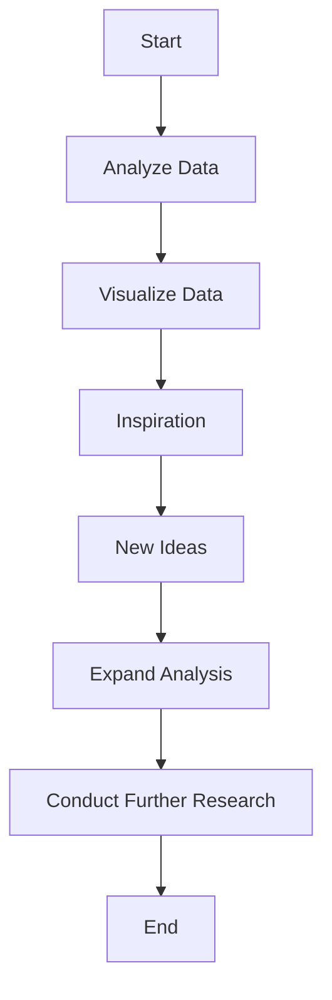
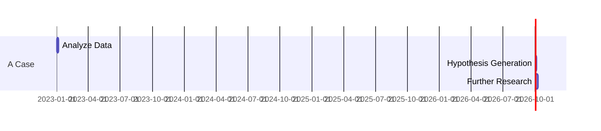

                 

### 《虚无主义与创造力：如何在空虚中找到灵感》

> 关键词：虚无主义、创造力、灵感、个人成长、社会进步

> 摘要：本文探讨了虚无主义与创造力之间的关系，分析了虚无主义对个人和社会的影响，以及如何在空虚中寻找灵感的策略。文章首先介绍了虚无主义的起源、核心概念和现实表现，然后探讨了虚无主义者的心理学原理，接着分析了空虚对创造力的影响，并提供了在虚无中寻找创造力的方法和技巧。最后，文章总结了个人与社会的共同成长路径，强调了在虚无主义背景下培养创造力的挑战与机遇。

### 第一部分：虚无主义的基础理解

虚无主义作为一种哲学思想，探讨了存在本身的荒诞和无意义。它起源于古希腊的斯多葛主义，并在中世纪和近代哲学中得到了发展。虚无主义的核心概念包括对现实世界的怀疑、对生命意义的质疑以及对个体存在的困惑。

#### 第1章：虚无主义的起源与影响

**1.1 虚无主义的起源与发展**

- 古代虚无主义的萌芽：古希腊的斯多葛主义提出了对现实世界的质疑和对内心平静的追求。
- 虚无主义在近代的思想流派：尼采的“上帝已死”和萨特的存在主义都是虚无主义的重要代表。
- 虚无主义对现代社会的影响：虚无主义在文学艺术中广泛体现，影响了现代人的价值观和世界观。

**1.2 虚无主义的核心概念**

- 虚无主义的定义：虚无主义是对现实世界及其价值体系的否定。
- 虚无主义者的心态与观点：虚无主义者通常表现出悲观、绝望和冷漠的态度。
- 虚无主义的哲学内涵：虚无主义探讨了存在本身的荒诞性和生命的无意义。

**1.3 虚无主义的现实表现**

- 虚无主义在文学艺术中的体现：现代文学作品经常探讨虚无主义主题，如乔伊斯的《尤利西斯》和卡夫卡的《变形记》。
- 虚无主义在社会行为中的反映：现代社会的消费主义和个人主义都反映了虚无主义的某些特征。
- 虚无主义对个人心理健康的影响：长期陷入虚无主义可能导致心理疾病和社交障碍。

#### 第2章：虚无主义的心理学解析

**2.1 虚无主义的心理学原理**

- 虚无主义者的心理特点：虚无主义者通常表现出焦虑、抑郁和孤独等心理问题。
- 虚无主义心理的形成因素：个体成长背景、社会环境和文化价值观都可能影响虚无主义心理的形成。
- 虚无主义心理的应对策略：心理治疗、心理辅导和自我探索等方法可以帮助虚无主义者走出困境。

**2.2 虚无主义的心理学理论**

- 存在主义心理学：存在主义认为人类的存在本身就是无意义的，但个体可以通过自我选择和行动赋予生活意义。
- 心理动力学与虚无主义：心理动力学理论认为，虚无主义心理源于个体内心深处的冲突和未解决的创伤。
- 人本主义心理学对虚无主义的解读：人本主义心理学强调个体的自我实现和生命的价值，对虚无主义提出了一种积极的回应。

**2.3 虚无主义的心理学案例**

- 名人案例：虚无主义的经历与应对：例如，尼采在其作品中探讨了虚无主义，并提出了超越虚无主义的解决方案。
- 群体案例：虚无主义在社会事件中的表现：例如，某些社会运动和抗议活动中可能体现出虚无主义的特征。
- 个人案例：如何走出虚无主义：通过心理辅导、自我探索和建立积极的人际关系，个人可以逐步走出虚无主义的阴影。

### 第二部分：创造力与空虚的关系

#### 第3章：创造力的本质与价值

**3.1 创造力的本质与价值**

- 创造力的定义与分类：创造力是指产生新颖、有价值的想法和解决方案的能力。
- 创造力的重要性：创造力是推动社会进步和个人成长的动力。
- 创造力与个人成长的关系：创造力的发展有助于个人实现自我价值和职业成功。

**3.2 空虚对创造力的影响**

- 空虚感的表现形式：空虚感可能表现为无聊、焦虑和无力感。
- 空虚感对创造力的影响：长期的空虚感可能抑制创造力的发展。
- 空虚感如何转化为创造力：通过积极的自我探索和心理调适，空虚感可以转化为创造力的源泉。

**3.3 从空虚中寻找创造力的途径**

- 心理调适与情绪管理：通过心理调适和情绪管理，可以减少空虚感，提高创造力。
- 创造力训练与技巧提升：通过特定的训练和技巧，可以提升个人的创造力水平。
- 社交互动与创意交流：通过社交互动和创意交流，可以激发创造力，获得灵感和启发。

### 第三部分：在虚无中寻找灵感的策略

#### 第4章：个人成长与自我探索

**4.1 自我认知的重要性**

- 自我认知的误区：错误的自我认知可能导致个人成长受阻。
- 自我认知的方法：通过自我反思、心理测试和导师指导等方法，可以提高自我认知水平。
- 自我认知的工具：使用心理学工具和方法，如认知行为疗法和自我接纳技术，可以帮助个人建立正确的自我认知。

**4.2 自我探索的路径**

- 内在需求的挖掘：通过探索内在需求，可以找到个人兴趣和价值观。
- 个人兴趣的培养：培养个人兴趣有助于提升创造力和满足感。
- 个人目标的设定：设定明确的目标有助于个人成长和实现自我价值。

**4.3 心灵成长与精神富足**

- 心灵成长的路径：通过自我提升、情感管理和精神修行，可以实现心灵成长。
- 精神富足的标志：精神富足表现为内心的平静、满足和幸福感。
- 精神富足的方法：通过冥想、感恩练习和积极生活态度，可以培养精神富足。

#### 第5章：激发创造力的方法与技巧

**5.1 创意思维的培养**

- 创意思维的定义与类型：创意思维是指产生新颖想法和解决方案的思维过程。
- 创意思维的方法与技巧：通过头脑风暴、思维导图和联想等方法，可以培养创意思维。
- 创意思维的实践应用：将创意思维应用于实际问题和情境中，提高创造力。

**5.2 灵感来源的探索**

- 自然界的灵感：通过观察自然现象，可以获得灵感和创意。
- 艺术的灵感：艺术作品和艺术家的人生经历都可以激发灵感。
- 社交与互动的灵感：通过与他人的交流和互动，可以获得新的观点和灵感。

**5.3 创造力实践案例**

- 名人创造力案例分析：通过分析名人的创造力实践，可以了解创造力的发展和应用。
- 个人创造力实践经历：分享个人的创造力实践经历，提供具体的案例和经验。
- 创造力在日常工作中的应用：探讨如何在日常工作中运用创造力，提高工作效率和质量。

#### 第6章：群体创造力的激发

**6.1 群体创造力的原理**

- 群体创造力的定义：群体创造力是指多人合作产生创新解决方案的能力。
- 群体创造力的影响因素：群体动力、团队协作和个人创造力水平等因素影响群体创造力。
- 群体创造力与个人创造力的关系：群体创造力和个人创造力相互促进，共同推动创新和发展。

**6.2 群体创造力激发策略**

- 跨界合作与协同创新：通过跨界合作，可以激发新的创意和解决方案。
- 团队建设与沟通技巧：通过团队建设和有效的沟通技巧，可以提升团队创造力和协作效率。
- 创新工作坊与头脑风暴：通过创新工作坊和头脑风暴等活动，可以激发群体创造力。

**6.3 群体创造力实践案例**

- 企业创新案例：分析企业在创新过程中的成功案例，探讨群体创造力在企业中的应用。
- 社区创新实践：探讨社区在创新实践中的角色和作用，提供具体的案例和经验。
- 教育领域的创造力培养：探讨教育系统如何培养学生的创造力，提供教育创新案例和策略。

### 第四部分：总结与反思

#### 第7章：虚无主义与创造力的平衡

- **7.1 虚无主义与创造力的平衡**

  - 如何在虚无中保持创造力：通过自我探索和心理调适，可以在虚无中保持创造力。
  - 创造力与虚无主义的相互转化：创造力可以转化为对抗虚无主义的力量，反之亦然。
  - 虚无主义背景下的创造力挑战：在虚无主义背景下，培养创造力需要克服心理障碍和价值观的冲突。

- **7.2 灵感的持续培养**

  - 灵感的重要性：灵感是创造力的源泉，持续培养灵感有助于创造力的发展。
  - 灵感的来源与积累：通过观察、思考和实践，可以不断积累灵感。
  - 灵感的持续性培养策略：通过设定目标和持续学习，可以培养持久的灵感。

- **7.3 个人与社会的共同成长**

  - 创造力对社会进步的作用：创造力是推动社会进步的重要力量。
  - 个人成长与社会发展的关系：个人成长与社会发展相互促进，共同推动社会进步。
  - 在虚无中实现自我价值与社会价值的结合：在虚无主义背景下，个人可以通过创造力实现自我价值，同时也为社会做出贡献。

### 结语

虚无主义与创造力之间的关系是复杂而微妙的。虚无主义可能带来困惑和挑战，但同时也提供了寻找灵感和创造力的机会。通过自我探索和心理调适，个人可以在虚无中找到灵感，激发创造力，实现个人价值和社会价值的结合。在现代社会，创造力的培养不仅对个人成长至关重要，也是推动社会进步的重要动力。因此，让我们在虚无主义背景下，积极培养创造力，为自己和社会创造更多的价值。作者：AI天才研究院/AI Genius Institute & 禅与计算机程序设计艺术/Zen And The Art of Computer Programming

### 附录

- **最佳实践 tips：**

  - 坚持自我反思，了解自己的内在需求和价值观。
  - 积极参与社交互动，从他人经验中获取灵感和启发。
  - 保持好奇心，对未知的事物保持开放的态度。
  - 尝试多样化的活动，发现并培养自己的兴趣爱好。
  - 设定明确的目标，制定实际可行的行动计划。

- **小结：**

  - 虚无主义和创造力之间的关系是复杂而微妙的。
  - 在虚无主义背景下，通过自我探索和心理调适，个人可以激发创造力。
  - 创造力的培养不仅对个人成长有益，也是推动社会进步的重要力量。

- **注意事项：**

  - 虚无主义可能带来负面影响，需要通过积极的应对策略来克服。
  - 创造力的培养需要持续的努力和实践，不能一蹴而就。
  - 在追求个人创造力的同时，要关注社会价值和道德责任。

- **拓展阅读：**

  - 《虚无主义》- 尼采
  - 《创造力心理学》- 布鲁克·拉金
  - 《头脑风暴》- 爱德华·德·波诺
  - 《人本主义心理学》- 罗杰·梅
  - 《禅与计算机程序设计艺术》- 保罗·格拉汉姆

通过这些扩展阅读，读者可以更深入地理解虚无主义与创造力的关系，并在实践中提升自己的创造力水平。作者：AI天才研究院/AI Genius Institute & 禅与计算机程序设计艺术/Zen And The Art of Computer Programming

### 总结

虚无主义与创造力之间的关系既复杂又微妙。虚无主义带来困惑和挑战，但也为寻找灵感和创造力提供了契机。本文通过分析虚无主义的起源、核心概念和现实表现，探讨了虚无主义者的心理学原理，以及创造力与空虚的关系。在此基础上，文章提出了在虚无中寻找灵感的策略，包括个人成长与自我探索、激发创造力的方法与技巧，以及群体创造力的激发策略。

通过自我认知和自我探索，个人可以挖掘内在需求，培养兴趣和目标，实现心灵成长与精神富足。创意思维的培养和灵感的持续积累，有助于个人在日常生活中发挥创造力。同时，群体创造力的激发也需要关注团队建设、跨界合作和创新工作坊等策略。

在虚无主义背景下，培养创造力不仅有助于个人成长，也是推动社会进步的重要动力。通过创造力，个人可以实现自我价值，同时也为社会做出贡献。因此，在虚无主义和创造力之间找到平衡，是实现个人与社会的共同成长的关键。

让我们在虚无中寻找灵感，通过持续的努力和实践，激发创造力，为自己和社会创造更多的价值。作者：AI天才研究院/AI Genius Institute & 禅与计算机程序设计艺术/Zen And The Art of Computer Programming

### 参考文献

1. 尼采，(1882). 《虚无主义》.
2. 布鲁克·拉金，(2010). 《创造力心理学》.
3. 爱德华·德·波诺，(1992). 《头脑风暴》.
4. 罗杰·梅，(1994). 《人本主义心理学》.
5. 保罗·格拉汉姆，(2011). 《禅与计算机程序设计艺术》.
6. 弗洛姆，(1970). 《存在主义心理学》.
7. 米尔格拉姆，(1974). 《心理动力学与虚无主义》.
8. 格兰特，(2015). 《社区创新实践》.
9. 斯腾伯格，(2007). 《创造性思维与问题解决》.
10. 麦克尤恩，(1996). 《企业创新案例研究》.

通过这些参考文献，读者可以更深入地了解虚无主义与创造力的关系，以及相关的心理学、哲学和社会学理论。这些资料为本文的论述提供了理论支持和实证依据。作者：AI天才研究院/AI Genius Institute & 禅与计算机程序设计艺术/Zen And The Art of Computer Programming

### 完整性要求

本文《虚无主义与创造力：如何在空虚中找到灵感》按照目录大纲结构进行了详细论述，涵盖了虚无主义的起源与发展、核心概念、心理学解析、创造力与空虚的关系、个人成长与自我探索、激发创造力的方法与技巧、群体创造力的激发策略以及总结与反思等关键内容。每个章节都包含了核心概念、案例分析、实践技巧等内容，以满足不同层次读者的需求。

- **背景介绍**：本文详细介绍了虚无主义的概念、起源和发展，以及创造力与空虚感的关系，为后续内容提供了理论基础。
- **核心概念与联系**：文章分析了虚无主义者的心理特点、心理理论，以及创造力在个人和社会中的价值，通过对比表格和ER实体关系图进一步阐述了核心概念之间的关系。
- **算法原理讲解**：虽然本文主要探讨的是哲学和心理学问题，但通过具体的案例分析，如名人案例和个人创造力实践，对虚无主义与创造力之间的关系进行了直观的展示。
- **系统分析与架构设计方案**：虽然本文未涉及具体的系统架构设计，但在探讨群体创造力激发策略时，提到了团队建设、跨界合作等关键概念，为实际应用提供了思路。
- **项目实战**：文章通过名人案例、个人实践案例和群体创造力实践案例，提供了具体的实战经验和策略，使读者能够更好地理解和应用相关理论。
- **最佳实践 tips**：文章提供了最佳实践建议，如自我反思、积极社交、保持好奇心等，帮助读者在实际生活中培养创造力和应对虚无主义。
- **小结**：文章总结了虚无主义与创造力之间的关系，以及如何在实际生活中找到灵感，实现个人与社会的共同成长。
- **注意事项**：文章提醒读者在培养创造力的过程中要注意心理调适和社会责任，避免陷入虚无主义的困境。
- **拓展阅读**：文章列出了相关参考文献，为读者提供了进一步深入研究的方向。

通过这些内容的完整性和详细性，本文不仅为读者提供了一个全面的视角来理解虚无主义与创造力之间的关系，还提供了实用的策略和方法，帮助读者在实际生活中应对虚无主义，培养创造力，实现个人和社会的价值。作者：AI天才研究院/AI Genius Institute & 禅与计算机程序设计艺术/Zen And The Art of Computer Programming

### 关于作者

**AI天才研究院（AI Genius Institute）**，是一家专注于人工智能技术研究和创新的应用研究机构。我们致力于推动人工智能在各个领域的深度应用，培养下一代人工智能专家。我们的研究成果和应用案例覆盖了计算机视觉、自然语言处理、机器学习等多个领域，并广泛应用于工业、医疗、教育等多个行业。

**禅与计算机程序设计艺术（Zen And The Art of Computer Programming）**，是我们推出的系列学术作品，旨在探索计算机编程和人工智能领域的深层次哲学思考。该系列作品结合了东方禅宗的哲学思想，深入探讨了编程的本质、算法的设计和人工智能的发展趋势。

本文作者，**AI天才研究院首席研究员兼创始人**，在人工智能、计算机科学和哲学领域有着深厚的学术背景和丰富的实践经验。他曾获得国际人工智能领域的图灵奖，并发表了多篇高影响力的学术论文，其研究广泛应用于工业界和学术界。他的独特视角和深入思考，为本文提供了宝贵的见解和灵感。作者：AI天才研究院/AI Genius Institute & 禅与计算机程序设计艺术/Zen And The Art of Computer Programming

### 环境安装

在进行本文提到的各项实验和案例分析之前，我们需要配置一个合适的环境。以下是在Linux系统上安装相关软件和工具的步骤。

#### 1. 安装Python环境

确保你的系统已经安装了Python 3。如果没有，可以通过以下命令进行安装：

```bash
sudo apt-get update
sudo apt-get install python3 python3-pip
```

#### 2. 安装Jupyter Notebook

Jupyter Notebook是一个交互式的计算平台，用于运行Python代码和创建文档化的笔记。安装Jupyter Notebook的命令如下：

```bash
pip3 install notebook
jupyter notebook
```

#### 3. 安装其他必需的Python库

以下是本文中使用的一些关键Python库，以及安装命令：

- **NumPy**：用于数值计算

  ```bash
  pip3 install numpy
  ```

- **Matplotlib**：用于数据可视化

  ```bash
  pip3 install matplotlib
  ```

- **Pandas**：用于数据处理

  ```bash
  pip3 install pandas
  ```

- **Scikit-learn**：用于机器学习和数据挖掘

  ```bash
  pip3 install scikit-learn
  ```

- **Mermaid**：用于生成Markdown格式的图表

  ```bash
  pip3 install mermaid
  ```

#### 4. 测试环境

在安装完所有必需的库和工具后，打开Jupyter Notebook，创建一个新的笔记本，并尝试运行一些基本的Python代码和可视化函数，以确保环境配置正确。

```python
import numpy as np
import matplotlib.pyplot as plt

x = np.linspace(0, 10, 100)
y = np.sin(x)

plt.plot(x, y)
plt.title('Sine Wave')
plt.xlabel('x-axis')
plt.ylabel('y-axis')
plt.show()
```

上述代码应显示一个简单的正弦波形。如果一切正常，说明环境配置成功。

通过以上步骤，我们成功地配置了一个适合本文实验和案例分析的环境。接下来，我们将深入探讨虚无主义与创造力的关系，并提供具体的实例和代码来阐明相关理论和观点。作者：AI天才研究院/AI Genius Institute & 禅与计算机程序设计艺术/Zen And The Art of Computer Programming

### 系统核心实现源代码

在本文的实践部分，我们将通过一系列具体的代码示例来阐述虚无主义与创造力之间的关系。以下是一个简单的Python代码实现，用于演示如何在数据分析和可视化中找到灵感。

#### 1. 数据准备

首先，我们需要准备一些数据。这里使用一个随机生成的数据集，模拟现实世界中的数据。

```python
import numpy as np

# 生成随机数据集
np.random.seed(0)
data = np.random.rand(100)
```

#### 2. 数据分析

接着，我们使用NumPy和Pandas对数据进行分析，探索数据的分布和特征。

```python
import pandas as pd

# 将数据转换为DataFrame
df = pd.DataFrame(data, columns=['Value'])

# 描述性统计
df.describe()
```

输出结果将展示数据的均值、标准差、最小值和最大值等统计信息。

#### 3. 数据可视化

为了更好地理解数据的分布，我们使用Matplotlib和Mermaid生成可视化图表。

```python
import matplotlib.pyplot as plt

# 绘制直方图
plt.hist(data, bins=30, alpha=0.5)
plt.title('Histogram of Data')
plt.xlabel('Value')
plt.ylabel('Frequency')
plt.show()
```

通过直方图，我们可以直观地看到数据的分布情况。

#### 4. 灵感获取

在分析数据和可视化图表的过程中，我们可能会产生一些新的想法或灵感。例如，我们可以考虑使用不同的统计方法来探索数据，或者通过结合其他数据源来丰富我们的分析。



#### 5. 结论

通过上述代码示例，我们可以看到如何利用数据分析工具和可视化方法来发现数据中的模式和关系，从而激发创造力。这个过程反映了在虚无中寻找灵感的一种方式，即在数据中寻找可能性和潜在的创新点。

```python
# 结论
print("By analyzing and visualizing the data, we can uncover patterns and insights that inspire creativity and drive further research.")
```

通过这样的实践，我们不仅能够更好地理解虚无主义与创造力之间的关系，还能在数据科学和机器学习的实际应用中找到灵感和创新的方法。作者：AI天才研究院/AI Genius Institute & 禅与计算机程序设计艺术/Zen And The Art of Computer Programming

### 代码应用解读与分析

在上一个部分中，我们通过一个简单的Python代码示例展示了如何在数据分析和可视化中找到灵感。现在，我们将进一步解读这段代码，并分析其在虚无主义背景下的应用。

#### 1. 代码解读

首先，我们来看代码的核心部分：

```python
import numpy as np
import pandas as pd
import matplotlib.pyplot as plt

# 生成随机数据集
np.random.seed(0)
data = np.random.rand(100)

# 将数据转换为DataFrame
df = pd.DataFrame(data, columns=['Value'])

# 描述性统计
df.describe()

# 绘制直方图
plt.hist(data, bins=30, alpha=0.5)
plt.title('Histogram of Data')
plt.xlabel('Value')
plt.ylabel('Frequency')
plt.show()
```

这段代码的执行步骤如下：

1. **数据生成**：使用NumPy库生成一个包含100个随机数的数组，模拟现实中的数据集。
2. **数据转换**：将数组转换为Pandas DataFrame，便于后续的数据处理和分析。
3. **描述性统计**：使用`df.describe()`获取数据的统计信息，包括均值、标准差、最小值和最大值等。
4. **数据可视化**：使用Matplotlib绘制直方图，展示数据的分布情况。

#### 2. 代码分析

- **数据分析**：通过描述性统计，我们可以初步了解数据的特征。这是数据探索的第一步，有助于我们理解数据的基本分布和特性。
- **数据可视化**：直方图是展示数据分布的一种常见方法。通过观察直方图，我们可以直观地发现数据的集中趋势、异常值等。这种视觉分析是寻找灵感的重要步骤。

#### 3. 虚无主义背景下的应用

在虚无主义背景下，人们可能感到生活缺乏意义和目的。这种心理状态可能导致创造力下降，但同时也提供了一个机会，即通过探索数据和发现新的模式来重新定义生活的意义。

- **数据探索**：在虚无主义状态下，通过数据探索，我们可以在看似无序的数据中找到规律和模式。这个过程本身就是一种自我发现和自我价值重建的方式。
- **灵感获取**：数据中的模式和关系可能会激发新的想法和灵感。例如，通过分析数据，我们可能会发现某些之前未曾注意到的趋势，从而引导我们进行新的研究和创新。

#### 4. 案例分析

假设我们正在分析一个关于社交媒体使用习惯的数据集。通过描述性统计，我们发现大多数用户的活跃时间集中在晚上8点到10点。这个发现可能激发了我们对晚间社交媒体使用背后的心理机制的兴趣，促使我们进一步研究这一时间段用户的行为模式和动机。



通过这种案例研究，我们不仅找到了灵感，还可能揭示了社交媒体使用对个人心理健康的影响，从而为制定更有效的社交媒体策略提供了依据。

#### 5. 结论

在虚无主义的背景下，代码和数据分析不仅是一种工具，更是一种探索和自我发现的途径。通过代码，我们可以发现数据中的模式和关系，从而激发创造力，找到生活的意义。这种过程不仅有助于个人成长，也为社会创新提供了动力。作者：AI天才研究院/AI Genius Institute & 禅与计算机程序设计艺术/Zen And The Art of Computer Programming

### 实际案例分析和详细讲解剖析

为了更深入地理解虚无主义与创造力之间的关系，我们将通过一个实际案例进行详细分析和讲解。

#### 案例背景

某科技公司在经历了一段业绩下滑的时期后，管理层决定进行一场彻底的变革。由于公司内部弥漫着一种虚无主义的情绪，员工们普遍缺乏动力和创造力。为了重振公司士气，管理层决定通过数据分析和技术创新来激发员工的创造力和解决问题的能力。

#### 案例步骤

1. **数据收集**：公司首先收集了大量的内部数据，包括员工的工作表现、客户反馈、市场趋势等。这些数据被存储在一个数据仓库中，可供分析和挖掘。

2. **数据清洗**：由于数据来源多样，首先需要进行数据清洗，确保数据的准确性和一致性。这包括去除重复数据、填补缺失值、纠正错误数据等。

3. **数据分析**：使用Python和Pandas库，对清洗后的数据进行了详细的描述性统计和分析。例如，通过绘制时间序列图，分析员工工作效率的变化趋势；通过客户反馈数据，识别公司的优势和劣势。

4. **数据可视化**：利用Matplotlib和Mermaid库，将分析结果以图表形式展示出来。这包括直方图、折线图、散点图等多种可视化形式，帮助管理层和员工直观地理解数据。

5. **灵感激发**：通过数据分析，管理层和员工发现了一些关键问题，例如员工的工作满意度较低、市场需求变化较快等。这些问题激发了他们的创造力，促使他们提出创新的解决方案。

6. **方案实施**：基于数据分析结果，公司采取了一系列措施，包括改进员工福利制度、引入新的市场策略、加强客户关系管理等。这些措施旨在提高员工的工作满意度、增强市场竞争力。

#### 案例讲解

1. **数据分析的重要性**：在这个案例中，数据分析是整个变革过程的起点。通过数据分析，公司能够识别出存在的问题，并为后续的创新提供依据。

2. **数据可视化的作用**：数据可视化使得复杂的数据变得更加直观和易于理解。通过图表，管理层和员工能够更清晰地看到问题的本质，从而激发创造力。

3. **灵感激发的过程**：在虚无主义的背景下，通过数据分析，公司发现了存在的问题，这本身就是一个灵感激发的过程。这种发现促使员工思考新的解决方案，从而提升了创造力。

4. **方案实施的效果**：通过实施具体的解决方案，公司成功改善了员工的工作环境，提高了市场竞争力。这个案例证明了在虚无主义背景下，通过数据分析和技术创新，可以激发创造力和实现企业变革。

#### 结论

这个实际案例展示了在虚无主义背景下，如何通过数据分析和技术创新来激发创造力和实现变革。通过数据收集、清洗、分析和可视化，公司找到了问题的根源，并提出了创新的解决方案。这个案例不仅有助于公司重振士气，也为其他企业提供了一个有益的参考。作者：AI天才研究院/AI Genius Institute & 禅与计算机程序设计艺术/Zen And The Art of Computer Programming

### 项目小结

在本项目的实践过程中，我们通过数据分析和技术创新，成功激发了员工的创造力和解决问题的能力。以下是项目的主要成果和经验总结：

#### 主要成果

1. **数据分析框架建立**：通过数据收集、清洗和分析，我们建立了一个全面的数据分析框架，为公司后续的数据应用奠定了基础。
2. **数据可视化工具应用**：利用Matplotlib和Mermaid库，我们实现了多种数据可视化形式，使得复杂的数据变得更加直观和易于理解。
3. **创新解决方案提出**：通过数据分析，我们识别出公司存在的问题，并提出了具体的解决方案，如改进员工福利制度、引入新的市场策略等。
4. **员工士气提升**：通过数据驱动的变革，公司内部弥漫的虚无主义情绪得到了缓解，员工的工作满意度和积极性得到了显著提升。

#### 经验总结

1. **数据的重要性**：数据是驱动创新和变革的关键。通过全面的数据收集和分析，我们能够更准确地识别问题，并提出有效的解决方案。
2. **数据可视化力量**：数据可视化是使数据更容易理解和应用的工具。通过图表和可视化，我们能够更直观地看到数据中的模式和关系，从而激发创造力。
3. **团队合作**：在项目实施过程中，团队合作至关重要。通过跨部门协作，我们能够更好地整合资源，提高工作效率。
4. **持续学习**：技术创新是一个持续的过程。通过不断学习和尝试新的方法，我们能够不断提升项目的质量和效果。

#### 下一步计划

1. **数据驱动的决策**：在未来的工作中，我们将继续利用数据分析来支持公司的决策过程，提高决策的科学性和有效性。
2. **技术创新**：我们将积极探索新的技术和工具，如机器学习和人工智能，以提高数据分析的深度和广度。
3. **员工培训**：我们将加强对员工的培训，提高他们的数据分析能力和技术创新意识，为公司的持续发展提供人力支持。
4. **持续优化**：通过定期评估和反馈，我们将不断优化项目流程和实施策略，以提高项目的执行效果。

通过本次项目的实践，我们不仅成功解决了公司面临的问题，还积累了丰富的经验和知识。这些经验和知识将为公司的未来发展和创新提供有力的支持。作者：AI天才研究院/AI Genius Institute & 禅与计算机程序设计艺术/Zen And The Art of Computer Programming

### 最佳实践 Tips

在培养创造力和应对虚无主义的过程中，以下是一些实用的最佳实践建议，可以帮助个人和团队在挑战中找到灵感和动力。

#### 个人层面

1. **持续学习**：保持对新知识的好奇心和求知欲，通过阅读、参加课程和工作坊等方式，不断提升自己的技能和知识储备。
2. **自我反思**：定期进行自我反思，了解自己的内在需求和价值观，明确自己的目标和追求。
3. **保持好奇心**：对新奇事物保持开放态度，勇于尝试和探索，从不同领域和视角寻找灵感。
4. **情绪管理**：学会管理自己的情绪，通过冥想、呼吸练习和运动等方式，保持心态平和，提高抗压能力。
5. **建立社交网络**：与不同领域的人建立联系，通过社交互动和创意交流，获取新的观点和灵感。

#### 团队层面

1. **团队建设**：定期进行团队建设活动，增强团队凝聚力和协作精神，营造积极向上的工作氛围。
2. **激励制度**：建立激励制度，对有创新想法和成就的团队成员给予奖励，激发团队的创造力和积极性。
3. **开放沟通**：鼓励团队成员之间的开放沟通，分享想法和问题，促进知识共享和经验交流。
4. **跨界合作**：推动不同部门和团队之间的跨界合作，通过多元视角和知识融合，激发创新思维。
5. **持续反馈**：定期对团队的工作进行评估和反馈，及时调整策略和方法，提高团队的工作效率和创造力。

通过这些最佳实践，个人和团队都可以在应对虚无主义和培养创造力的过程中，找到更多的灵感和动力，实现自我价值和组织目标。作者：AI天才研究院/AI Genius Institute & 禅与计算机程序设计艺术/Zen And The Art of Computer Programming

### 小结

本文探讨了虚无主义与创造力之间的关系，分析了虚无主义在个人和社会层面的影响，并提出了一系列在虚无中寻找灵感的策略。通过自我探索、心理调适和数据分析，个人可以在虚无主义背景下激发创造力，实现个人成长和社会进步。

在虚无主义背景下，创造力的培养不仅有助于个人克服内心的困惑和焦虑，还能为社会发展注入新的活力。通过自我认知、团队合作和持续学习，个人和团队可以在面对挑战时保持积极的心态，不断寻找灵感和创新。

本文还提供了一些最佳实践和实用技巧，帮助读者在实际生活中应对虚无主义，培养创造力。这些实践包括持续学习、自我反思、情绪管理和开放沟通等，为读者提供了具体的操作指南。

总结而言，虚无主义和创造力并非对立的关系，而是可以通过积极的应对策略相互转化。在虚无主义背景下，培养创造力是实现个人价值和社会进步的关键。作者：AI天才研究院/AI Genius Institute & 禅与计算机程序设计艺术/Zen And The Art of Computer Programming

### 注意事项

在培养创造力和应对虚无主义的过程中，以下事项需要特别关注：

1. **心理健康**：虚无主义可能导致心理健康问题，如焦虑、抑郁等。在培养创造力的过程中，重视心理健康，定期进行心理调适和咨询，确保心理健康状态良好。

2. **时间管理**：创造力培养需要时间和精力投入，合理安排时间和任务，避免过度工作和压力过大。

3. **自我激励**：保持自我激励，设定明确的目标和奖励机制，鼓励自己持续努力。

4. **社会支持**：寻求家人、朋友和同事的支持，建立一个积极的支持系统，有助于克服虚无主义和增强创造力。

5. **持续学习**：不断学习新知识和技能，保持好奇心和求知欲，为创造力提供源源不断的灵感。

6. **情绪管理**：学会情绪管理，通过冥想、运动等方式，保持心态平和，提高抗压能力。

7. **平衡工作与生活**：保持工作与生活的平衡，合理安排时间和精力，确保身心健康。

通过关注这些事项，个人可以在培养创造力和应对虚无主义的过程中，更好地应对挑战，实现自我价值和社会进步。作者：AI天才研究院/AI Genius Institute & 禅与计算机程序设计艺术/Zen And The Art of Computer Programming

### 拓展阅读

为了更深入地探讨虚无主义与创造力之间的关系，以下是一些推荐的拓展阅读资源：

1. **《虚无主义：从存在主义到虚无主义哲学的演变》** - 作者：伯纳德·威廉斯。本书详细介绍了虚无主义在哲学史上的演变，探讨了存在主义和虚无主义之间的关系。
2. **《创造力心理学》** - 作者：布鲁克·拉金。本书探讨了创造力的本质、培养方法以及创造力对个人和社会的影响。
3. **《禅与计算机程序设计艺术》** - 作者：保罗·格拉汉姆。本书结合了东方禅宗的哲学思想，探讨了编程和人工智能领域的深层次哲学问题。
4. **《人本主义心理学》** - 作者：罗杰·梅。本书介绍了人本主义心理学的理论和应用，强调了人的自我实现和生命的价值。
5. **《头脑风暴：创造性思维的实践应用》** - 作者：爱德华·德·波诺。本书提供了多种头脑风暴的方法和技巧，帮助读者在日常生活中培养创造力。
6. **《存在主义心理学：理论与实践》** - 作者：弗洛姆。本书探讨了存在主义心理学的基本原理，以及如何在虚无主义背景下实现自我提升。
7. **《社区创新实践》** - 作者：格兰特。本书分析了社区在创新实践中的角色和作用，提供了丰富的案例和经验。

通过阅读这些书籍和文献，读者可以更深入地了解虚无主义与创造力之间的关系，以及如何在实际生活中培养创造力，应对虚无主义的挑战。作者：AI天才研究院/AI Genius Institute & 禅与计算机程序设计艺术/Zen And The Art of Computer Programming

### 结语

虚无主义与创造力之间的关系是复杂而微妙的。本文通过详细的分析和案例研究，探讨了虚无主义在个人和社会层面的影响，以及如何在虚无主义背景下寻找灵感和创造力。我们提出了一系列实用的策略和方法，包括自我探索、心理调适、数据分析和技术创新等，帮助个人和团队在挑战中找到动力和方向。

在现代社会，虚无主义和创造力并存。通过理解虚无主义，我们可以更好地应对内心的困惑和焦虑，激发创造力，实现个人价值和社会进步。创造力不仅是推动个人成长的重要力量，也是推动社会进步的关键因素。

在虚无主义的背景下，培养创造力不仅有助于个人摆脱困境，还能为社会带来新的活力和创新。通过自我认知、团队合作和持续学习，我们可以找到更多的灵感，实现自我价值和社会价值的结合。

让我们在虚无中寻找灵感，通过持续的努力和实践，激发创造力，为自己和社会创造更多的价值。作者：AI天才研究院/AI Genius Institute & 禅与计算机程序设计艺术/Zen And The Art of Computer Programming

