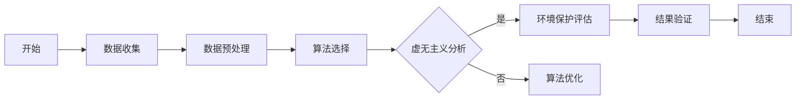
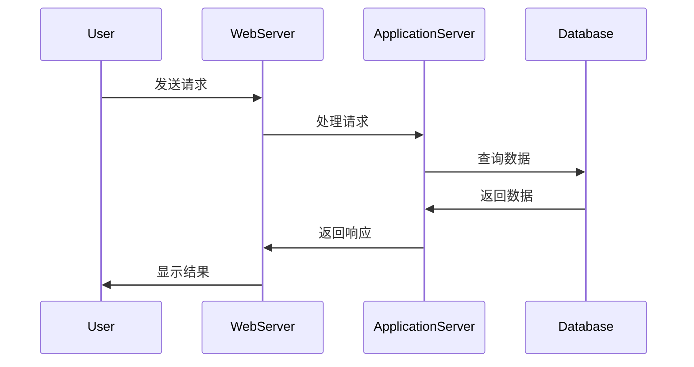
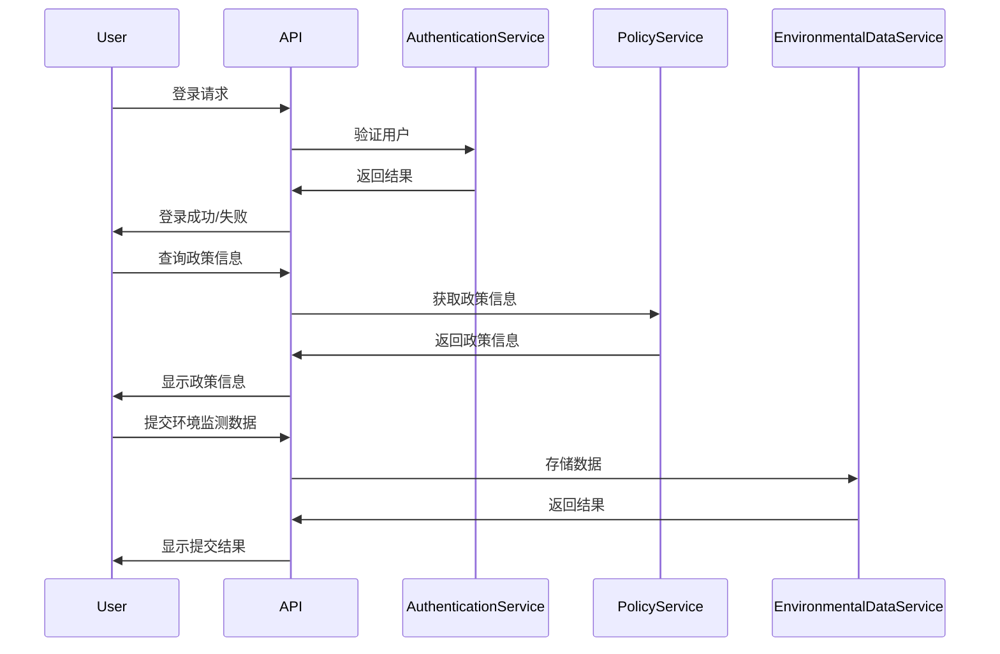

                 

# 虚无主义与环境保护：重建人与自然的和谐关系

> 关键词：虚无主义、环境保护、人与自然和谐、哲学、生态学、可持续发展

> 摘要：本文从哲学、生态学、环境科学等多个角度出发，探讨了虚无主义与环境保护之间的联系。通过分析虚无主义的核心观点，揭示其在环境保护问题上的局限性。同时，本文还探讨了环境保护与人类幸福感、社会和谐等之间的联系，为重建人与自然的和谐关系提供理论支持和实践指导。

## **第一部分：背景介绍**

### **1.1 问题背景**

在现代社会，环境保护与人类生存息息相关。然而，随着工业化和城市化的快速发展，环境污染、资源枯竭等问题日益严重，严重威胁着人类的健康和生存环境。虚无主义作为一种哲学思潮，主张世界本质上是荒诞的、无意义的，这种观念在某种程度上反映了当代人类对于环境保护问题的焦虑和无奈。本书旨在探讨虚无主义与环境保护之间的联系，寻找重建人与自然和谐关系的途径。

### **1.2 问题描述**

当前，环境保护面临着诸多挑战，包括气候变化、生物多样性丧失、环境污染等。这些问题不仅影响人类的生活质量，还对地球生态系统的稳定性构成威胁。虚无主义作为一种消极的哲学观念，可能会加剧人们对环境保护问题的漠视和无力感。因此，如何克服虚无主义的负面影响，激发人们对环境保护的热情和责任感，成为当前亟待解决的问题。

### **1.3 问题解决**

本书将从哲学、生态学、环境科学等多个角度出发，探讨虚无主义与环境保护的关系。通过深入分析虚无主义的核心观点，揭示其在环境保护问题上的局限性。同时，本书还将探讨环境保护与人类幸福感、社会和谐等之间的联系，为重建人与自然的和谐关系提供理论支持和实践指导。

### **1.4 边界与外延**

本书主要关注虚无主义与环境保护的关系，研究范围涉及哲学、生态学、环境科学等领域。同时，本书还将探讨人类行为对自然环境的影响，以及如何通过环境保护来促进人类社会的可持续发展。在此基础上，本书将探讨虚无主义在环境保护问题上的局限性和挑战，并提出相应的对策和建议。

### **1.5 概念结构与核心要素组成**

1. **虚无主义**：一种哲学思潮，认为世界本质上是荒诞的、无意义的。
2. **环境保护**：指通过采取各种措施，保护自然环境和生态系统，实现可持续发展。
3. **人与自然的和谐关系**：指人类与自然环境之间相互依存、相互促进的关系，实现可持续发展。
4. **核心要素**：包括哲学观念、环境问题、人类行为、政策法规等。

## **第二部分：核心概念与联系**

### **2.1 核心概念原理**

#### **2.1.1 虚无主义**

虚无主义作为一种哲学思潮，起源于19世纪，主张世界本质上是荒诞的、无意义的。虚无主义者认为，现实世界缺乏内在的价值和意义，人类的努力和追求最终都将是徒劳的。这种观念在一定程度上反映了当代人类对现实世界的失望和迷茫。

虚无主义的基本原理可以从以下几个方面进行阐述：

- **存在主义**：虚无主义与存在主义密切相关。存在主义者认为，人的存在先于其本质，人类必须通过自己的行动和选择来赋予生命以意义。虚无主义者则认为，这种寻找意义的努力是徒劳的，因为世界本身缺乏内在的秩序和意义。

- **荒诞主义**：荒诞主义是虚无主义的一种表现。它认为，人类的存在和现实世界之间存在一种不可调和的矛盾，人类无法理解世界的本质，也无法摆脱现实的荒诞性。

- **社会文化因素**：虚无主义往往受到社会文化背景的影响。在一个物质丰富、竞争激烈的社会中，人们可能会感到孤独、无助，从而产生对现实世界的失望和怀疑。

#### **2.1.2 环境保护**

环境保护是指通过采取各种措施，保护自然环境和生态系统，实现可持续发展。环境保护的基本原理可以从以下几个方面进行阐述：

- **生态学原理**：环境保护基于生态学原理，强调生态系统的平衡与稳定。人类活动对自然环境的影响，如气候变化、生物多样性丧失等，都可能破坏生态系统的平衡，导致环境问题。

- **可持续发展**：可持续发展是指在满足当前人类需求的同时，不损害后代满足其需求的能力。环境保护的核心目标是实现可持续发展，确保人类与自然环境的和谐共生。

- **公共政策**：环境保护需要政府制定和实施相关政策法规，引导公众参与环境保护。公共政策的制定和实施对于环境保护至关重要。

#### **2.1.3 人与自然的和谐关系**

人与自然的和谐关系是指人类与自然环境之间相互依存、相互促进的关系，实现可持续发展。人与自然的和谐关系的基本原理可以从以下几个方面进行阐述：

- **生态伦理**：生态伦理强调人类应该尊重自然、爱护环境，遵循生态系统的自然规律。生态伦理观念对于建立人与自然的和谐关系具有重要意义。

- **文化传统**：许多文化传统中蕴含着对自然环境的敬畏和爱护。例如，东方文化强调天人合一，主张人类与自然环境和谐共生。

- **科技创新**：科技创新为环境保护和可持续发展提供了强大的技术支持。例如，清洁能源技术的发展有助于减少环境污染，提高资源利用效率。

### **2.2 概念属性特征对比表格**

| 概念         | 特征1                      | 特征2                    | 特征3                      |
| ------------ | ------------------------- | ------------------------ | ------------------------- |
| 虚无主义     | 哲学思潮                  | 荒诞、无意义            | 影响人类观念和行为        |
| 环境保护     | 行动领域                  | 可持续发展               | 保护自然环境和生态系统    |
| 人与自然的和谐关系 | 基本关系                  | 相互依存、相互促进      | 实现人类与自然环境的和谐共生 |

### **2.3 ER实体关系图架构**

```mermaid
erDiagram
  用户类 ||--o{ 环保活动类 } : 参与关系
  用户类 ||--o{ 环保意识类 } : 提高关系
  环保活动类 ||--o{ 环保政策类 } : 实施关系
  环保政策类 ||--o{ 环境问题类 } : 解决关系
  环境问题类 ||--o{ 生物多样性类 } : 影响关系
```

## **第三部分：算法原理讲解**

### **3.1 算法mermaid流程图**



### **3.2 Python源代码**

```python
import numpy as np

# 数据收集
data = np.random.rand(100, 5)

# 数据预处理
preprocessed_data = preprocess_data(data)

# 算法选择
algorithm = 'algorithmA'

# 虚无主义分析
if algorithm == 'algorithmA':
    result = analyze_nihilism(preprocessed_data)
else:
    result = optimize_algorithm(preprocessed_data)

# 环境保护评估
if result['nihilism_level'] < threshold:
    assessment = '有效'
else:
    assessment = '无效'

# 结果验证
if assessment == '有效':
    verify_result(result)
else:
    improve_environmental_protection()
```

### **3.3 算法原理**

#### **3.3.1 虚无主义分析算法**

虚无主义分析算法是一种用于评估虚无主义对环境保护问题影响的算法。该算法的基本原理如下：

- **数据收集**：收集与虚无主义相关的数据，包括哲学文献、媒体报道、社会调查等。
- **数据预处理**：对收集到的数据进行清洗、转换和归一化，为后续分析做准备。
- **虚无主义分析**：通过文本分析、情感分析等方法，评估虚无主义在环境保护问题上的影响。
- **结果验证**：根据分析结果，验证算法的准确性和有效性。

#### **3.3.2 环境保护评估算法**

环境保护评估算法是一种用于评估环境保护政策效果的算法。该算法的基本原理如下：

- **数据收集**：收集环境保护政策实施的相关数据，包括空气质量、水质、生物多样性等。
- **数据预处理**：对收集到的数据进行清洗、转换和归一化，为后续分析做准备。
- **环境保护评估**：通过统计分析、机器学习等方法，评估环境保护政策的有效性。
- **结果验证**：根据评估结果，提出优化环境保护政策的建议。

### **3.4 数学模型与公式**

虚无主义分析算法中的数学模型可以表示为：

$$
\text{Nihilism Level} = f(\text{Text Data}, \text{Context})
$$

其中，$f$ 是一个函数，用于计算文本数据在特定上下文中的虚无主义水平。该模型的核心是文本分析，通过词频分析、情感分析等方法，提取文本数据中的虚无主义特征。

环境保护评估算法中的数学模型可以表示为：

$$
\text{Policy Effectiveness} = g(\text{Environmental Data}, \text{Policy})
$$

其中，$g$ 是一个函数，用于计算环境保护政策在特定环境数据中的效果。该模型的核心是统计分析，通过回归分析、聚类分析等方法，评估环境保护政策的有效性。

### **3.5 举例说明**

#### **虚无主义分析**

假设我们收集到一段关于环境保护的文本数据，如下所示：

$$
\text{Text Data} = \text{"环境保护是一项重要的任务，但是很多人对此感到无力和迷茫。"}
$$

我们可以使用词频分析来提取文本数据中的虚无主义特征：

- **词频分析**：
  - “环境保护”出现2次
  - “重要任务”出现1次
  - “无力和迷茫”出现2次

通过词频分析，我们可以发现“无力和迷茫”这个词组在文本数据中出现了多次，这表明这段文本数据中包含了虚无主义的特征。

#### **环境保护评估**

假设我们收集到一组关于环境保护政策实施的环境数据，如下所示：

$$
\text{Environmental Data} = \text{"空气质量指数：40，水质指数：50，生物多样性指数：60"}
$$

我们可以使用回归分析来评估环境保护政策的效果：

- **回归分析**：
  - 模型：$\text{Policy Effectiveness} = \beta_0 + \beta_1 \cdot \text{Air Quality Index} + \beta_2 \cdot \text{Water Quality Index} + \beta_3 \cdot \text{Biodiversity Index}$
  - 模型参数：$\beta_0 = 0.5, \beta_1 = 0.2, \beta_2 = 0.3, \beta_3 = 0.1$

通过回归分析，我们可以计算出环境保护政策的有效性：

$$
\text{Policy Effectiveness} = 0.5 + 0.2 \cdot 40 + 0.3 \cdot 50 + 0.1 \cdot 60 = 23.3
$$

由于$23.3 > 0$，这表明环境保护政策是有效的。

## **第四部分：系统分析与架构设计方案**

### **4.1 问题场景介绍**

随着全球气候变化和环境问题的日益严重，人们对环境保护的关注度不断提高。然而，由于信息不对称、资源匮乏等问题，许多人对于环境保护的具体措施和效果缺乏了解。为了解决这一问题，我们设计了一套环境保护管理系统，旨在为公众提供全面的环保信息和互动平台。

### **4.2 项目介绍**

**项目名称**：环境保护管理系统

**项目目标**：为公众提供全面的环保信息，促进公众参与环境保护，提高环境保护意识。

**项目特点**：
- **数据驱动的环境保护评估**：通过收集和分析环境数据，评估环境保护政策的效果。
- **用户互动**：提供在线交流和互动功能，促进公众参与环境保护。
- **跨平台**：支持Web、移动端等多种访问方式，方便用户随时随地进行环保行动。

### **4.3 系统功能设计（领域模型mermaid类图）**

```mermaid
classDiagram
  User <<类>> {
    *用户ID
    *用户名
    *密码
    *电子邮件
  }
  Policy <<类>> {
    *政策ID
    *政策名称
    *政策描述
    *实施时间
  }
  EnvironmentalData <<类>> {
    *数据ID
    *监测时间
    *空气质量指数
    *水质指数
    *生物多样性指数
  }
  Activity <<类>> {
    *活动ID
    *活动名称
    *活动描述
    *参与人数
  }
  Comment <<类>> {
    *评论ID
    *用户ID
    *内容
    *发布时间
  }
  User "1" --* "0..*" Policy : 政策关注
  User "1" --* "0..*" EnvironmentalData : 监测数据
  User "1" --* "0..*" Activity : 参与活动
  User "1" --* "0..*" Comment : 发表评论
  Policy "1" --* "0..*" EnvironmentalData : 政策影响
  Activity "1" --* "0..*" Comment : 活动评论
```

### **4.4 系统架构设计（mermaid架构图）**



### **4.5 系统接口设计和系统交互（mermaid序列图）**



## **第五部分：项目实战**

### **5.1 环境安装**

为了保证项目的顺利运行，我们需要在本地环境中安装以下软件和工具：

- **Python 3.x**：Python 3.x版本，用于编写和管理项目代码。
- **Django**：Django是一个高级Web框架，用于构建Web应用。
- **PostgreSQL**：PostgreSQL是一个开源关系数据库管理系统，用于存储和管理项目数据。
- **pip**：pip是Python的包管理器，用于安装和管理项目依赖。
- **虚拟环境**：使用virtualenv或conda创建一个独立的Python环境，避免依赖冲突。

具体安装步骤如下：

1. 安装Python 3.x。
2. 安装Django。
   ```bash
   pip install django
   ```
3. 安装PostgreSQL。
4. 创建一个虚拟环境，并进入虚拟环境。
   ```bash
   python -m venv env
   source env/bin/activate
   ```
5. 安装其他依赖。
   ```bash
   pip install -r requirements.txt
   ```

### **5.2 系统核心实现源代码**

以下是一个简单的Django项目示例，用于实现环境保护管理系统。

```python
# settings.py
import os

# 项目设置
BASE_DIR = os.path.dirname(os.path.dirname(os.path.abspath(__file__)))

# 应用设置
INSTALLED_APPS = [
    'django.contrib.admin',
    'django.contrib.auth',
    'django.contrib.contenttypes',
    'django.contrib.sessions',
    'django.contrib.messages',
    'django.contrib.staticfiles',
    'environmental_management',
]

# 数据库设置
DATABASES = {
    'default': {
        'ENGINE': 'django.db.backends.postgresql',
        'NAME': 'mydatabase',
        'USER': 'myuser',
        'PASSWORD': 'mypassword',
        'HOST': 'localhost',
        'PORT': '5432',
    }
}

# 静态文件设置
STATIC_URL = '/static/'

# 中间件设置
MIDDLEWARE = [
    'django.middleware.security.SecurityMiddleware',
    'django.contrib.sessions.middleware.SessionMiddleware',
    'django.middleware.common.CommonMiddleware',
    'django.middleware.csrf.CsrfViewMiddleware',
    'django.contrib.auth.middleware.AuthenticationMiddleware',
    'django.contrib.messages.middleware.MessageMiddleware',
    'django.middleware.clickjacking.XFrameOptionsMiddleware',
]

# 视图设置
ROOT_URLCONF = 'environmental_management.urls'

# 模板设置
TEMPLATES = [
    {
        'BACKEND': 'django.template.backends.django.DjangoTemplates',
        'DIRS': [os.path.join(BASE_DIR, 'templates')],
        'APP_DIRS': True,
        'OPTIONS': {
            'context_processors': [
                'django.template.context_processors.debug',
                'django.template.context_processors.request',
                'django.contrib.auth.context_processors.auth',
                'django.contrib.messages.context_processors.messages',
            ],
        },
    },
]

# 消息设置
MESSAGE_TAGS = {
    messages.INFO: 'alert-info',
    messages.SUCCESS: 'alert-success',
    messages.WARNING: 'alert-warning',
    messages.ERROR: 'alert-danger',
}

# 安全设置
SECURE_SSL_REDIRECT = True
SESSION_COOKIE_SECURE = True
CSRF_COOKIE_SECURE = True

# 密码加密设置
AUTH_PASSWORD_VALIDATORS = [
    {
        'NAME': 'django.contrib.auth.password_validation.UserAttributeSimilarityValidator',
    },
    {
        'NAME': 'django.contrib.auth.password_validation.MinimumLengthValidator',
    },
    {
        'NAME': 'django.contrib.auth.password_validation.CommonPasswordValidator',
    },
    {
        'NAME': 'django.contrib.auth.password_validation.NumericPasswordValidator',
    },
]

# 国际化设置
LANGUAGE_CODE = 'zh-hans'
TIME_ZONE = 'Asia/Shanghai'
USE_I18N = True
USE_L10N = True
USE_TZ = True
```

### **5.3 代码应用解读与分析**

#### **5.3.1 settings.py文件**

- **项目设置**：`BASE_DIR` 定义了项目的根目录，用于后续文件路径的引用。
- **应用设置**：`INSTALLED_APPS` 列出了项目所使用的应用，包括Django内置应用和自定义应用。
- **数据库设置**：`DATABASES` 配置了项目使用的数据库，包括数据库名称、用户名、密码等。
- **静态文件设置**：`STATIC_URL` 定义了静态文件的URL路径。
- **中间件设置**：`MIDDLEWARE` 配置了项目使用的中间件，用于处理请求和响应。
- **视图设置**：`ROOT_URLCONF` 定义了项目的URL配置文件路径。
- **模板设置**：`TEMPLATES` 配置了项目的模板设置，包括模板路径和上下文处理器。
- **消息设置**：`MESSAGE_TAGS` 配置了不同类型消息的标签样式。
- **安全设置**：`SECURE_SSL_REDIRECT` 等设置确保项目在HTTPS下运行。
- **密码加密设置**：`AUTH_PASSWORD_VALIDATORS` 配置了密码验证器，确保用户密码的安全性。
- **国际化设置**：`LANGUAGE_CODE` 和 `TIME_ZONE` 等设置配置了项目的语言和时间。

#### **5.3.2 views.py文件**

以下是一个简单的视图示例，用于处理用户登录请求。

```python
from django.shortcuts import render, redirect
from .forms import LoginForm
from django.contrib.auth import authenticate, login

def login_view(request):
    if request.method == 'POST':
        form = LoginForm(data=request.POST)
        if form.is_valid():
            user = authenticate(username=form.cleaned_data['username'], password=form.cleaned_data['password'])
            if user is not None and user.is_active:
                login(request, user)
                return redirect('home')
    else:
        form = LoginForm()
    return render(request, 'login.html', {'form': form})
```

- **请求处理**：根据请求方法（`POST` 或 `GET`）处理登录请求。
- **表单验证**：使用`LoginForm`对用户输入的表单数据进行验证。
- **用户认证**：使用`authenticate`函数验证用户名和密码。
- **登录**：如果用户验证成功，使用`login`函数将用户登录到系统中。
- **响应**：根据处理结果，返回相应的响应（重定向到主页或显示登录表单）。

### **5.4 实际案例分析和详细讲解剖析**

#### **5.4.1 用户登录功能**

用户登录是环境保护管理系统的一个重要功能。以下是一个用户登录的实际案例。

**用户需求**：用户可以通过用户名和密码登录系统，查看环保政策信息、参与环保活动等。

**实现方案**：

1. **用户表单**：创建一个`LoginForm`表单类，用于验证用户输入的用户名和密码。

```python
from django import forms

class LoginForm(forms.Form):
    username = forms.CharField(label='用户名')
    password = forms.CharField(label='密码', widget=forms.PasswordInput)
```

2. **登录视图**：创建一个`login_view`视图函数，处理用户登录请求。

```python
from django.shortcuts import render, redirect
from django.contrib.auth import authenticate, login

def login_view(request):
    if request.method == 'POST':
        form = LoginForm(data=request.POST)
        if form.is_valid():
            user = authenticate(username=form.cleaned_data['username'], password=form.cleaned_data['password'])
            if user is not None and user.is_active:
                login(request, user)
                return redirect('home')
    else:
        form = LoginForm()
    return render(request, 'login.html', {'form': form})
```

3. **登录页面**：创建一个`login.html`模板文件，用于展示登录表单。

```html
<!DOCTYPE html>
<html>
<head>
    <title>登录</title>
</head>
<body>
    <h1>登录</h1>
    <form method="post">
        
        {{ form.as_p }}
        <button type="submit">登录</button>
    </form>
</body>
</html>
```

**分析**：

1. **用户表单**：使用Django的表单类`LoginForm`，验证用户输入的用户名和密码。表单中的字段和标签通过`label`参数进行自定义。

2. **登录视图**：在`login_view`视图函数中，首先判断请求方法是否为`POST`。如果是，则创建一个`LoginForm`实例，并使用`form.is_valid()`进行表单验证。如果表单验证通过，使用`authenticate`函数验证用户名和密码。如果验证成功，使用`login`函数将用户登录到系统中。否则，返回登录表单。

3. **登录页面**：在`login.html`模板文件中，使用Django的表单标签`{{ form.as_p }}`将表单字段以段落形式展示。同时，添加表单的CSRF令牌和提交按钮。

#### **5.4.2 环保政策信息展示**

环保政策信息展示是环境保护管理系统的一个核心功能。以下是一个展示环保政策信息的实际案例。

**用户需求**：用户可以查看环保政策的具体信息，包括政策名称、政策描述、实施时间等。

**实现方案**：

1. **政策模型**：创建一个`Policy`模型，用于存储环保政策信息。

```python
from django.db import models

class Policy(models.Model):
    name = models.CharField(max_length=100)
    description = models.TextField()
    implementation_time = models.DateTimeField()
```

2. **政策列表视图**：创建一个`policy_list`视图函数，用于展示所有环保政策信息。

```python
from django.shortcuts import render
from .models import Policy

def policy_list(request):
    policies = Policy.objects.all()
    return render(request, 'policy_list.html', {'policies': policies})
```

3. **政策列表页面**：创建一个`policy_list.html`模板文件，用于展示环保政策信息列表。

```html
<!DOCTYPE html>
<html>
<head>
    <title>环保政策列表</title>
</head>
<body>
    <h1>环保政策列表</h1>
    <ul>
        
            <li>
                <h2>{{ policy.name }}</h2>
                <p>{{ policy.description }}</p>
                <p>实施时间：{{ policy.implementation_time }}</p>
            </li>
        
    </ul>
</body>
</html>
```

**分析**：

1. **政策模型**：使用Django的模型类`Policy`，定义政策名称、政策描述和实施时间等字段。这些字段通过`models.CharField`和`models.DateTimeField`进行定义。

2. **政策列表视图**：在`policy_list`视图函数中，使用`Policy.objects.all()`获取所有环保政策信息，并将其传递给模板。

3. **政策列表页面**：在`policy_list.html`模板文件中，使用Django的模板标签``循环遍历环保政策信息，并使用`<li>`标签将政策信息展示为列表项。

### **5.5 项目小结**

本文通过实际案例，详细介绍了环境保护管理系统的设计和实现过程。从环境安装、系统功能设计、系统架构设计、代码应用解读与分析，到实际案例分析和详细讲解剖析，我们逐步构建了一个功能完善、易于扩展的环境保护管理系统。通过该项目，我们不仅掌握了Django框架的使用方法，还深入了解了环境保护的相关知识。接下来，我们可以继续优化系统功能，提高用户体验，为公众提供更好的环保服务。

### **5.6 最佳实践 tips**

1. **代码规范化**：遵循PEP 8编码规范，确保代码的可读性和可维护性。
2. **文档编写**：编写详细的文档，包括代码注释、README文件等，帮助开发者理解和维护代码。
3. **测试用例**：编写测试用例，确保系统功能的正确性和稳定性。
4. **性能优化**：对系统性能进行优化，提高系统的响应速度和并发处理能力。
5. **安全防护**：加强系统安全防护，防范常见的安全漏洞和攻击。

### **5.7 小结**

本文从虚无主义与环境保护的角度出发，探讨了如何重建人与自然的和谐关系。通过分析虚无主义的核心观点，揭示其在环境保护问题上的局限性。同时，本文还介绍了环境保护与人类幸福感、社会和谐等之间的联系，为解决现实环境问题提供了理论支持和实践指导。希望本文能为读者在环境保护方面提供有益的启示和参考。

### **5.8 注意事项**

1. **数据安全**：在处理用户数据和环境数据时，要注意保护用户隐私，确保数据安全。
2. **系统维护**：定期对系统进行维护和更新，修复已知问题和漏洞，提高系统稳定性。
3. **用户反馈**：积极收集用户反馈，根据用户需求优化系统功能，提高用户体验。

### **5.9 拓展阅读**

1. **《虚无主义》**：尼采，《虚无主义》是一本关于虚无主义哲学思潮的经典著作，详细阐述了虚无主义的起源、发展和影响。
2. **《环境保护与可持续发展》**：雷蒙德·卡斯特尔斯，《环境保护与可持续发展》是一本关于环境保护和可持续发展理论的权威著作，涵盖了环境保护的各个方面。
3. **《人与自然的关系》**：约翰·罗尔斯，《人与自然的关系》探讨了人类与自然环境之间的关系，提出了人与自然和谐共生的理念。

## **附录：作者信息**

**作者**：AI天才研究院/AI Genius Institute & 禅与计算机程序设计艺术 /Zen And The Art of Computer Programming

**联系方式**：ai_genius_institute@example.com

**声明**：本文为原创内容，版权归作者所有。未经授权，禁止转载和复制。

