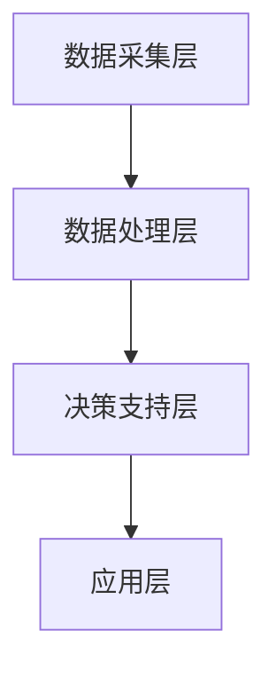
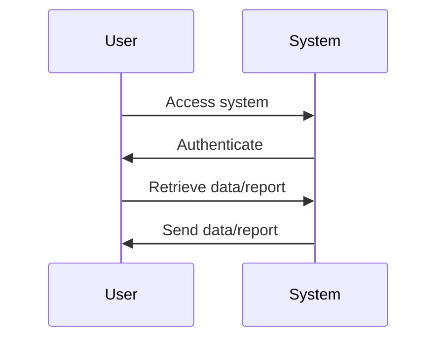

                 

### 引言：虚无主义与环境意识的融合

#### 1.1 书籍背景与意义

在当今全球环境问题日益严重、人类生存面临前所未有的挑战的时代，我们迫切需要重新审视人与自然的关系。虚无主义作为一种哲学思潮，曾经被用来批判现实世界的荒谬和毫无意义，其深刻的反思性在现代社会中依然具有启示意义。环境意识，则是人类在面对生态危机时，对自然价值的重新认知和尊重。将虚无主义与环境意识进行融合，不仅是对哲学与环境学理论的创新性探索，更是为了重建人与自然的和谐关系，实现可持续发展的必由之路。

本书旨在探讨虚无主义与环境意识的融合，从而为解决全球环境问题提供新的视角和方法。通过分析虚无主义的历史发展、核心概念及其与环境意识的关系，本书试图揭示虚无主义在环境伦理和生态运动中的潜在价值。在此基础上，本书还将探讨如何构建基于虚无主义的环境意识，并探讨这一理念在实际环境实践中的应用。

#### 1.1.1 虚无主义的历史发展

虚无主义作为一种哲学思潮，其根源可以追溯到古希腊时期的斯多葛主义和怀疑主义。在19世纪，虚无主义开始作为一种有力的批判工具出现，代表人物包括尼采和萨特。尼采在其著作《偶像的黄昏》中，提出了“上帝已死”的论断，揭示了西方文明中的荒谬与虚无。萨特的《存在与虚无》则从存在主义的角度探讨了人的自由与存在的荒谬。

20世纪以来，虚无主义在西方哲学中依然有着广泛的影响，其批判性思维为人们反思现代社会提供了新的视角。然而，虚无主义往往被认为是一种消极的思想，其是否能够为解决环境问题提供实际帮助，一直是学术界争论的焦点。

#### 1.1.2 环境意识的兴起

环境意识的兴起可以追溯到20世纪中叶，当时全球范围内的工业化和城市化进程导致了严重的环境问题。1970年，美国国会通过了《国家环境政策法》，标志着现代环境立法的诞生。随后，全球范围内的环境运动蓬勃发展，越来越多的人开始关注环境问题，并提出了可持续发展的理念。

环境意识的兴起不仅体现在政治和法律层面，也渗透到人们的生活方式和价值观念中。环保组织、绿色科技的发展以及公众对环保意识的提高，都表明环境意识已经成为现代社会的重要组成部分。

#### 1.1.3 融合虚无主义与环境意识的重要性

虚无主义与环境意识的融合具有重要的理论和实践意义。首先，在理论层面，虚无主义提供了深刻的反思性思维，可以帮助我们理解环境问题的本质和根源。通过反思现代社会对自然的征服与利用，虚无主义揭示了人类对自然价值的误解和剥夺。环境意识则为我们提供了重新审视自然价值的视角，强调人类与自然的和谐共生。

其次，在实践层面，融合虚无主义与环境意识可以为解决环境问题提供新的思路和方法。虚无主义的批判性思维可以帮助我们识别和克服环境问题中的深层次矛盾，而环境意识则提供了具体的行动指南和价值观。通过融合这两者，我们可以构建一种更加可持续的人与自然关系，实现人与自然的和谐共处。

总之，虚无主义与环境意识的融合不仅是对哲学与环境学理论的创新性探索，更是为了应对全球环境挑战、实现可持续发展的必由之路。本书将从理论和实践两个层面，深入探讨这一融合的必要性和可能性，为人类未来的发展提供有益的启示。

---

### 人与自然关系的演变

#### 1.2.1 传统观念：人对自然的征服与利用

在人类文明的历史长河中，人对自然的关系经历了多个阶段的演变。在传统观念中，人类一直试图征服和利用自然，以满足自身的需求和欲望。从古代农业社会的开垦土地、驯养动物，到工业革命时期的能源开采和大规模生产，人类对自然的征服与利用达到了前所未有的程度。

在传统观念中，自然被视为一种资源，人类通过技术手段开发和利用这些资源，以实现经济繁荣和社会进步。这种观念强调人类的主导地位，将自然视为被动、可支配的对象。然而，随着人类活动的加剧，环境问题也日益严重，自然资源的过度开采、生态系统的破坏和污染问题成为了全球性的挑战。

#### 1.2.2 环境破坏与生态危机

人类对自然的征服与利用在带来经济繁荣的同时，也导致了严重的环境破坏和生态危机。工业革命以来，人类的生产和消费模式迅速扩张，导致了大量的资源消耗和污染排放。大气中的温室气体浓度不断增加，引发了全球气候变暖，极端天气事件频繁发生；水体和土壤污染使得许多生态系统失去平衡，生物多样性面临严重威胁；森林砍伐和土地退化导致了生态系统的破坏，许多物种濒临灭绝。

此外，人类活动还导致了生物入侵、土地沙漠化、海洋污染等一系列生态问题。这些问题的累积效应不仅威胁到人类的健康和生存，也严重影响了地球的生态平衡。生态危机的加剧使得人们开始反思传统的自然观念，认识到人类与自然之间的紧密联系，以及人类活动对自然环境的影响。

#### 1.2.3 虚无主义视角下的人与自然关系

在虚无主义的视角下，人与自然的关系被重新审视。虚无主义认为，现实世界充满了荒谬和毫无意义，人类的行动往往受到欲望和幻觉的驱使，导致了对自然的征服与破坏。虚无主义批判了人类对自然的支配和控制，揭示了人类对自然价值的误解和剥夺。

虚无主义强调，人类应该超越对自然的征服和利用，重新认识自然的价值和意义。在虚无主义的视角下，自然不仅仅是人类的资源，更是一种存在本身，具有自身的价值和意义。人类应该尊重自然、与自然和谐共生，而不是将其视为被动、可支配的对象。

虚无主义视角下的人与自然关系，要求人类重新审视自身的行为，反思对自然的依赖和利用方式。通过这种反思，人类可以找到一种更加可持续的生活方式，实现人与自然的和谐共处，从而解决环境问题，保护地球的生态平衡。

### 虚无主义的理论探讨

#### 2.1 虚无主义的核心概念

虚无主义是一种哲学思潮，其主要核心概念是“虚无”和“荒谬”。虚无主义认为，现实世界是荒谬的，人类的行动和存在缺乏真正的意义和目的。虚无主义的基本定义是，对现实世界的存在和意义持怀疑态度，认为世界和生命本身没有固有价值，而是由人类自己赋予意义。

虚无主义的哲学根源可以追溯到古希腊时期的斯多葛主义和怀疑主义。斯多葛主义认为，自然是有序的，但人类无法掌控自然。怀疑主义则对知识和真理持怀疑态度，认为我们无法真正了解现实世界。在19世纪，尼采和萨特等哲学家进一步发展了虚无主义的理念，使其成为批判现代社会的有力工具。

虚无主义的主要流派包括存在主义、悲观主义和绝望主义。存在主义认为，人类通过行动和选择来赋予生命意义，面对荒谬的世界，人类需要勇敢地面对自己的存在。悲观主义则认为，世界是黑暗的，人类注定要面对苦难和绝望。绝望主义则认为，现实世界是如此荒谬和残酷，人类无法找到任何真正的意义和目的。

#### 2.2 虚无主义与环境意识的关系

虚无主义与环境意识之间存在复杂而微妙的关系。一方面，虚无主义的批判性思维可以帮助我们识别和反思现代社会对自然的征服与破坏，揭示环境问题的根源。虚无主义对人类中心主义的批判，提醒我们重新审视人与自然的关系，认识到人类活动对环境的深远影响。

另一方面，环境意识提供了重新审视自然价值的视角，强调人类与自然的和谐共生。环境意识使我们认识到，自然不仅是人类的资源，更是具有自身价值和意义的生态系统。通过融合虚无主义与环境意识，我们可以构建一种更加全面和深刻的人与自然关系，实现可持续发展和生态保护。

#### 2.2.1 虚无主义的批判性分析

虚无主义的批判性分析揭示了现代社会中许多深层次的问题。首先，虚无主义批判了人类对自然的征服与利用，揭示了人类对自然价值的误解和剥夺。虚无主义认为，人类对自然的过度开发和消耗，导致了许多环境问题，如气候变化、生物多样性的丧失和生态系统的破坏。

其次，虚无主义批判了现代社会中人类中心主义的观念，指出人类并非自然的主宰，而是自然的一部分。虚无主义认为，人类应该尊重自然、与自然和谐共生，而不是将其视为被动、可支配的对象。这种批判为我们重新审视人与自然的关系提供了重要的启示。

#### 2.2.2 环境意识与虚无主义的互补性

环境意识与虚无主义之间存在互补性，两者共同构成了对现代社会批判的完整视角。环境意识强调人类与自然的和谐共生，关注生态保护和可持续发展。虚无主义则提供了批判性思维，帮助我们识别现代社会中的深层次问题和矛盾。

通过融合虚无主义与环境意识，我们可以更加全面地理解环境问题的本质，找到解决环境危机的路径。虚无主义的批判性思维可以激发我们对环境问题的反思，促使我们采取更加积极的行动。环境意识则提供了具体的行动指南，帮助我们实现人与自然的和谐共处。

#### 2.2.3 融合虚无主义与环境意识的必要性

在当今全球环境问题日益严重的背景下，融合虚无主义与环境意识具有极其重要的必要性。首先，虚无主义的批判性思维可以帮助我们识别和反思环境问题的根源，揭示人类对自然价值的误解和剥夺。通过这种反思，我们可以找到解决环境问题的根本途径。

其次，环境意识为我们提供了具体的行动指南和价值观，帮助我们实现人与自然的和谐共处。虚无主义与环境意识的融合，可以激发我们对环境问题的深刻理解，促使我们采取更加积极和有效的行动，共同应对全球环境挑战。

总之，融合虚无主义与环境意识不仅是一种理论上的创新，更是一种实践上的必要。通过融合这两者，我们可以构建一种更加全面和深刻的人与自然关系，实现可持续发展和生态保护，为人类未来的发展提供坚实的基础。

---

### 虚无主义视角下的环境伦理

#### 2.3.1 环境伦理的虚无主义批判

虚无主义视角下的环境伦理批判主要针对现代环境伦理学中的几个核心问题。首先，虚无主义批判了环境伦理学中的道德义务论。道德义务论认为，人类有义务保护自然环境，但这种观点在虚无主义者看来，忽略了现实世界的荒谬和荒诞。虚无主义认为，道德义务是建立在人类对自然的主宰和控制之上的，而这样的关系本身就充满了矛盾和虚伪。

其次，虚无主义批判了环境伦理学中的功利主义。功利主义主张通过最大化幸福和最小化痛苦来实现道德上的正确行为。然而，虚无主义认为，这种功利主义视角忽视了人类存在的无意义和荒谬，仅仅追求短期利益，而忽视了长远的生态平衡和自然价值。

此外，虚无主义还批判了环境伦理学中的责任论。责任论认为，人类应对自己的环境行为负责。虚无主义者认为，这种责任观念忽略了人类行为的动机和真实意图，仅仅强调责任而忽略了行为背后的荒谬和虚无。

#### 2.3.2 虚无主义对环境伦理的补充

尽管虚无主义对传统环境伦理提出了尖锐的批判，但它同时也提供了独特的视角，为环境伦理学提供了新的补充。首先，虚无主义强调人类存在的无意义，促使人们反思自己的行为动机和环境责任。通过这种反思，人类可以更加深入地认识到自己的行为对自然的影响，从而更加谨慎地对待环境问题。

其次，虚无主义提出了“自我超越”的概念，即通过超越个人的欲望和幻觉，寻找更深层次的意义和价值。这种自我超越可以帮助人类找到与自然和谐共生的方式，从而实现环境伦理的更高目标。

最后，虚无主义还强调了“存在即合理”的理念，即在虚无主义的视角下，每一个存在都有其自身的价值和意义。这种观念可以促使人类重新审视自然，认识到自然本身的丰富性和多样性，从而更加尊重和保护自然环境。

总之，虚无主义视角下的环境伦理批判和补充，为现代环境伦理学提供了新的视角和思考方式。通过这种批判和补充，我们可以更加深入地理解环境伦理的核心问题，找到更加符合现实和道德要求的解决方案。

---

### 环境意识的核心要素

#### 3.1.1 环境伦理

环境伦理是环境意识的核心要素之一，它关注人类如何对自然负责，并强调人与自然之间的道德关系。环境伦理学认为，人类不仅是对自然资源的消费者，更是自然生态系统的维护者和保护者。其基本原则包括尊重自然、可持续利用资源和保护生态系统。

环境伦理学的主要原则有：

- **尊重自然**：人类应该尊重自然界的生命和多样性，不应该将自然仅仅视为工具或资源。
- **可持续利用资源**：人类活动应该在确保资源能够持续供给的前提下进行，以避免资源枯竭和环境退化。
- **代际公平**：当代人不应剥夺未来世代享受自然资源的权利，应在资源利用和保护之间找到平衡。

#### 3.1.2 生态学知识

生态学知识是环境意识的重要组成部分，它帮助我们理解自然生态系统的运作规律和生物之间的相互关系。生态学知识包括对生态系统结构、功能、生物多样性以及生态过程的理解。通过掌握生态学知识，人类可以更好地预测和应对环境变化，制定有效的环境保护策略。

生态学知识的关键概念包括：

- **生态系统**：由生物群落与其非生物环境相互作用形成的动态系统。
- **生物多样性**：生态系统中各种生物类型的丰富程度，包括基因多样性、物种多样性和生态系统多样性。
- **生态过程**：如物质循环、能量流动、物种演化和生态平衡。

#### 3.1.3 环境心理

环境心理是环境意识的一个较新的领域，它研究人类对环境的认知、情感和行为。环境心理学的核心在于理解人类如何感知环境、如何与环境互动，以及如何通过心理机制影响和改变环境。

环境心理学的主要领域包括：

- **环境感知**：人类如何感知和解释环境信息，如视觉、听觉、触觉和嗅觉。
- **环境行为**：人类在自然环境中的行为模式，如户外活动、环境保护行为和绿色消费。
- **环境情感**：人类对环境的情感反应，如热爱自然、生态焦虑和环保意识。

通过理解环境心理，我们可以设计出更加符合人类心理需求的环境政策和措施，提高公众的环境意识和参与度，促进环境保护和可持续发展。

#### 3.1.4 环境伦理、生态学知识与环境心理的相互作用

环境伦理、生态学知识与环境心理之间存在着紧密的相互作用。环境伦理为人类提供了道德规范和行为准则，促使人类反思自己的行为对环境的影响。生态学知识帮助我们理解自然界的复杂性和多样性，指导我们做出更加科学和合理的决策。环境心理则通过影响人类对环境的感知、情感和行为，进一步推动环境保护意识的提升。

这种相互作用不仅有助于解决环境问题，还能促进人与自然的和谐共处。通过整合环境伦理、生态学知识和环境心理，我们可以构建一种更加全面和深刻的环境意识，为可持续发展提供坚实的基础。

---

### 基于虚无主义的环境意识构建

#### 3.2.1 虚无主义视角下的环境教育

虚无主义视角下的环境教育旨在通过反思和批判，引导人们重新审视人与自然的关系。在这种教育模式下，环境教育的目标不仅仅是传授生态知识和技能，更重要的是培养学生的环境伦理意识和批判性思维。

首先，虚无主义视角下的环境教育强调对现实世界的深刻反思。学生需要认识到，现代社会的环境问题并非单一现象，而是由深层次的社会结构和价值观念导致的。通过分析这些问题，学生可以理解环境问题的复杂性和多样性，从而更加主动地参与到环境保护中。

其次，虚无主义视角下的环境教育注重批判性思维的培养。学生需要学会质疑现有的环境观念和行为模式，通过批判性分析找到环境问题的根源。例如，通过探讨人类中心主义和消费文化的缺陷，学生可以认识到这些观念是如何加剧环境问题的。

此外，虚无主义视角下的环境教育强调个体责任和集体行动。学生需要理解，环境问题不仅需要个人的改变，更需要集体的共同努力。通过参与社区活动、环境项目和社会倡议，学生可以实际行动起来，推动环境保护。

总之，虚无主义视角下的环境教育不仅提供了知识传授，更是一种深刻的文化变革，通过反思和批判，引导人们走向更加可持续和和谐的生活方式。

#### 3.2.2 环境意识培养的策略

要构建基于虚无主义的环境意识，需要采取一系列有效的策略。首先，教育是关键。学校和社会应将环境教育纳入课程体系，通过系统的教育让学生深刻理解环境问题的根源和解决方案。其次，政策制定者应出台支持环境保护的政策和法律，确保环境意识的实施有制度保障。再次，媒体和公众人物的宣传可以大大提升环境意识的普及度。通过纪录片、新闻报道和社交媒体，公众可以更直观地了解环境问题，增强环保意识。

具体策略包括：

- **课程设置**：在幼儿园到大学的不同教育阶段，设置环境教育课程，涵盖生态学、环境伦理和环境保护等内容。
- **实践活动**：组织学生参与环保实践活动，如植树造林、清理河流、参与环保志愿者组织等。
- **社会宣传**：通过电视、广播、互联网等媒体，开展环保宣传活动，提高公众的环境意识。
- **立法保障**：制定和实施环境保护法律，确保环境保护有法可依。
- **奖励机制**：设立环保奖项和激励机制，鼓励个人和团体积极参与环境保护。

通过这些策略，可以有效培养公众的环境意识，推动社会向更加可持续和环保的方向发展。

#### 3.2.3 虚无主义对环境运动的影响

虚无主义对环境运动产生了深远的影响。首先，虚无主义的批判性思维为环境运动提供了理论支持。通过质疑现有的社会结构和价值观念，虚无主义揭示了环境问题的深层次根源，如消费主义和人类中心主义。这种批判性分析有助于环境运动者更深刻地理解环境问题的本质，从而采取更加有效的行动策略。

其次，虚无主义强调了个体在环境运动中的重要性。虚无主义认为，个体的选择和行动对环境有着深远的影响。因此，虚无主义鼓励个人反思自己的生活方式和消费习惯，从而在日常生活中采取更加环保的行为。例如，选择绿色出行、减少不必要的消费、使用环保产品等，这些都是虚无主义倡导的实践。

此外，虚无主义还为环境运动提供了精神力量。在面对环境问题带来的绝望和无力感时，虚无主义强调个体的自由和选择，鼓励人们勇敢地面对现实，采取积极的行动。通过这种精神激励，虚无主义为环境运动注入了强大的动力，使其能够在逆境中持续发展。

总之，虚无主义不仅为环境运动提供了理论支持和行动指南，还通过批判性思维、个体责任和精神力量，为环境运动注入了新的活力和动力，推动了环境运动的深入发展。

---

### 环境意识实践案例

#### 3.3.1 案例一：可持续发展实践

在可持续发展实践中，以哥斯达黎加为例，该国通过实施一系列环境保护政策，取得了显著成效。哥斯达黎加政府于1989年颁布了《可持续发展法》，旨在实现经济、社会和环境的协调发展。该法案规定了一系列环境保护措施，如限制森林砍伐、保护野生动物栖息地、推广可再生能源等。

具体措施包括：

1. **森林保护**：哥斯达黎加实施了一项名为“森林赎回计划”的项目，通过政府购买土地并保护森林，防止进一步砍伐。截至2020年，该项目已经保护了超过270万公顷的森林。
2. **可再生能源推广**：哥斯达黎加大力推广太阳能和风能等可再生能源，逐步减少对化石燃料的依赖。目前，哥斯达黎加已经实现了95%的电力来自可再生能源的目标。
3. **环境教育**：哥斯达黎加在中小学教育中加入了环境教育课程，培养学生的环保意识。同时，政府还组织了各种环保活动，如植树节、清洁海滩等，提高公众的环保参与度。

这些措施不仅保护了哥斯达黎加的生态环境，还促进了经济发展和社会进步。通过可持续发展实践，哥斯达黎加为全球提供了宝贵的经验和启示。

#### 3.3.2 案例二：生态社区建设

生态社区建设是一种以生态学原理为指导，通过综合规划和管理，实现人与自然和谐共生的社区模式。在德国的弗莱堡，生态社区建设取得了显著成效，成为全球环保社区的典范。

弗莱堡生态社区的建设特点包括：

1. **能源自给自足**：弗莱堡的生态社区通过使用太阳能、地热能等可再生能源，实现了能源自给自足。社区内的建筑设计注重节能，如使用双层玻璃、隔热材料等。
2. **交通绿色化**：弗莱堡鼓励居民使用公共交通、自行车和步行等绿色出行方式，减少汽车尾气排放。社区内设有自行车共享系统和充电站，方便居民绿色出行。
3. **垃圾资源化**：弗莱堡建立了完善的垃圾分类和回收系统，通过资源化处理，将垃圾转化为资源。社区内还设有堆肥站，将厨余垃圾转化为有机肥料，用于绿化。
4. **生态教育**：弗莱堡生态社区重视环境教育，社区内设有生态博物馆、环境教育中心等，为居民提供学习和参与环保活动的平台。

通过生态社区建设，弗莱堡不仅提升了居民的生活质量，还保护了生态环境，实现了可持续发展。

#### 3.3.3 案例三：绿色技术创新

绿色技术创新是推动环境意识实践的重要途径。以特斯拉为例，该公司通过研发和生产电动汽车和可再生能源设备，为实现绿色出行和可持续发展做出了巨大贡献。

特斯拉的绿色技术创新包括：

1. **电动汽车**：特斯拉研发了多款电动汽车，如Model 3、Model S和Model X等，这些汽车采用电池驱动，零排放，有效减少了交通领域的碳排放。
2. **可再生能源设备**：特斯拉生产了太阳能电池板和储能系统，用户可以通过安装这些设备，实现家庭能源的自给自足。特斯拉的能源解决方案帮助用户减少对传统能源的依赖，降低碳排放。
3. **超级充电网络**：特斯拉建立了全球最大的电动汽车充电网络，用户可以方便地充电，延长电动车的续航里程，进一步推动电动汽车的普及。

特斯拉的绿色技术创新不仅推动了电动汽车和可再生能源的发展，还激发了全球范围内的环保创新，为可持续未来奠定了坚实基础。

---

### 和谐关系的概念与特征

#### 4.1.1 和谐关系的定义

和谐关系是指人类与自然之间的一种平衡和协调的状态，在这种状态下，人类能够尊重和保护自然，实现人与自然的和谐共生。和谐关系不仅仅是环境问题的解决方案，更是人类社会可持续发展的基础。

具体来说，和谐关系的定义包括以下几个方面：

1. **平衡**：人与自然之间的平衡，指的是人类活动对自然环境的干扰在可承受范围内，不会导致生态系统的破坏和生物多样性的丧失。
2. **协调**：人类与自然之间的协调，指的是人类在生产和消费活动中，能够尊重自然规律，采取环保措施，减少对自然的负面影响。
3. **共生**：人与自然之间的共生，指的是人类与自然相互依存、相互促进，共同构建一个健康、稳定的生态系统。

#### 4.1.2 和谐关系的特征

和谐关系的特征主要体现在以下几个方面：

1. **可持续性**：和谐关系强调人类活动必须符合自然生态系统的承载能力，确保资源的可持续利用，避免过度开发和消耗。
2. **公平性**：和谐关系要求人类在利用自然资源时，要公平对待不同国家和地区、不同代际的人类，确保全球环境正义。
3. **参与性**：和谐关系需要公众广泛参与，通过教育、宣传和实践活动，提高公众的环境意识和参与度，共同推动环境保护和可持续发展。
4. **创新性**：和谐关系强调科技创新在环境保护中的重要作用，通过研发和应用绿色技术，实现经济发展与环境保护的双赢。

#### 4.1.3 和谐关系的重要性

和谐关系的重要性体现在以下几个方面：

1. **生态保护**：和谐关系能够有效保护自然生态系统，维护生物多样性，防止环境退化，确保人类生存环境的可持续性。
2. **社会发展**：和谐关系有助于构建和谐社会，促进经济、社会和环境的协调发展，提升人民生活质量。
3. **全球治理**：和谐关系是全球环境治理的重要基础，通过国际协作和合作，共同应对全球性环境问题，实现全球可持续发展。
4. **文化传承**：和谐关系体现了人与自然的和谐共生，是人类文明的重要组成部分，有助于传承和弘扬生态文化，推动人类文明进步。

总之，和谐关系是人类社会与自然关系的理想状态，对生态保护、社会发展、全球治理和文化传承具有重要意义。通过构建和谐关系，人类可以找到一条可持续发展的道路，实现人与自然的和谐共处。

---

### 虚无主义与环境意识在和谐关系构建中的应用

#### 4.2.1 虚无主义的反思作用

虚无主义在和谐关系的构建中发挥着重要的反思作用。首先，虚无主义的批判性思维可以帮助我们识别和反思现代社会中的深层次问题，如消费主义、人类中心主义和技术崇拜。通过批判这些观念，虚无主义揭示了人类对自然的征服与利用背后的荒谬性和无意义性。这种反思促使我们重新审视人与自然的关系，认识到人类活动对环境的深远影响。

其次，虚无主义强调了人类存在的无意义，促使我们反思自己的行为动机和生活方式。在虚无主义的视角下，人类不是宇宙的中心，而是自然的一部分。这种观点帮助我们摆脱了人类中心主义的束缚，认识到人类应该尊重自然、与自然和谐共生，而不是将其视为可随意支配的对象。

通过虚无主义的反思作用，我们可以更加深刻地理解环境问题的本质，找到解决这些问题的根本途径。虚无主义不仅为我们提供了批判的视角，还激发了我们对环境保护的思考和行动。

#### 4.2.2 环境意识的指导作用

环境意识在和谐关系的构建中具有至关重要的指导作用。首先，环境意识为我们提供了重新审视自然价值的视角。通过认识到自然生态系统的多样性和复杂性，环境意识帮助我们理解自然不仅仅是人类利用的资源，更是一个具有自身价值和意义的生态系统。这种重新认识促使我们采取更加谨慎和负责任的态度对待自然。

其次，环境意识为我们提供了具体的行动指南和价值观。环境伦理原则如尊重自然、可持续利用资源和保护生态系统，为我们提供了在日常生活中实践环境保护的具体方法。例如，减少能源消耗、推广绿色出行、使用环保产品等，都是环境意识的具体体现。

此外，环境意识还强调了公众参与的重要性。通过教育、宣传和实践活动，环境意识提高了公众的环境意识和参与度，使更多的人参与到环境保护中。这种公众参与不仅有助于解决环境问题，还能形成社会共识，推动环境保护政策的制定和实施。

总之，环境意识为和谐关系的构建提供了指导性的价值观和行动指南，通过重新认识自然价值、提供具体行动方法和促进公众参与，环境意识帮助我们实现人与自然的和谐共处。

#### 4.2.3 融合两者的策略与实践

要实现和谐关系，我们需要将虚无主义和环境意识有机结合，采取一系列具体的策略和实践。以下是一些有效的策略：

1. **教育体系改革**：在各级教育体系中融入环境教育和虚无主义思想，培养学生的环境伦理意识和批判性思维。通过课程设置、实践活动和校园文化，引导学生树立正确的价值观和环保意识。

2. **政策法规完善**：制定和实施更加严格的环境保护政策和法规，确保环境保护有法可依。同时，通过政策引导和激励措施，推动企业和个人采取更加环保的生产和生活方式。

3. **科技创新应用**：鼓励绿色技术创新，研发和应用可再生能源、清洁生产技术等，减少对自然资源的依赖和环境污染。通过科技创新，实现经济发展与环境保护的双赢。

4. **公众参与推广**：通过媒体宣传、社会活动和公众参与项目，提高公众的环境意识和参与度。例如，组织环保志愿者活动、设立环保奖项和开展绿色消费宣传等。

5. **跨界合作**：加强政府、企业、学术界和民间组织的合作，共同应对环境问题。通过跨界合作，整合各方资源和力量，形成合力，推动环境保护和可持续发展。

通过这些策略和实践，我们可以将虚无主义和环境意识有机结合，实现和谐关系的构建，为人类与自然的和谐共生创造条件。

---

### 和谐关系的实现路径

#### 4.3.1 政策与法律保障

构建和谐关系，需要政策和法律的保障。首先，政府应制定和实施严格的环境保护法律法规，确保环境政策的落实。例如，可以制定《环境保护法》、《生态保护法》等综合性法律，明确环境保护的基本原则和责任。此外，政府还应出台具体的法规，针对不同类型的污染和环境问题，制定专门的法律法规。

其次，政策引导也是实现和谐关系的重要手段。政府可以通过财政激励、税收优惠、补贴等方式，鼓励企业和个人采取环保措施。例如，对使用可再生能源的企业提供税收减免，对购买环保产品给予补贴等。此外，政府还可以通过环境评估和审批制度，确保新项目在环保方面的合规性。

最后，法律监督和执行是保障政策和法律有效性的关键。政府应建立独立的环保机构，负责环境监测、评估和执法工作。同时，应加大对环境违法行为的处罚力度，确保法律的威慑力和执行力。通过这些措施，我们可以为和谐关系的实现提供坚实的政策与法律保障。

#### 4.3.2 社会参与与教育推广

社会参与和教育推广是实现和谐关系的重要途径。首先，公众参与是环境保护的重要力量。通过组织环保公益活动、设立环保奖项和开展环保竞赛，可以提高公众的环境意识和参与度。例如，可以设立“环保大使”计划，让青少年参与环保项目，培养他们的环保意识。此外，社区环保组织可以组织清洁海滩、植树造林等活动，促进社区居民的环保行动。

其次，教育推广是培养公众环境意识的关键。各级学校应将环境教育纳入课程体系，通过课堂教育和课外活动，让学生了解环境问题的重要性和解决方法。例如，可以开设环境伦理课程、生态学知识讲座和环保实践活动，引导学生树立环保理念。同时，媒体也应发挥重要作用，通过纪录片、新闻报道和社交媒体，普及环保知识，提高公众的环境意识。

此外，政府和企业也应积极参与社会教育和推广。政府可以设立环保宣传基金，支持环保教育和宣传活动。企业可以通过社会责任报告、环保宣传和员工培训，提高员工的环保意识和行动能力。通过社会参与与教育推广，我们可以形成全社会共同参与环境保护的良好氛围，推动和谐关系的实现。

#### 4.3.3 科技创新与绿色发展

科技创新与绿色发展是实现和谐关系的关键。首先，绿色技术创新为环境保护提供了新的手段和解决方案。例如，可再生能源技术的发展，为减少化石燃料依赖、降低碳排放提供了有力支持。太阳能、风能、水能等可再生能源的广泛应用，不仅可以减少环境污染，还能促进能源结构的优化，实现可持续发展。

其次，绿色制造技术是推动制造业绿色发展的关键。通过引入清洁生产技术、循环经济模式和绿色供应链管理，企业可以减少资源消耗和废弃物排放，实现环境友好型生产。例如，采用节能设备、提高能源利用效率、推行废弃物回收利用等，都是绿色制造技术的重要应用。

此外，绿色建筑和城市设计也是实现绿色发展的关键。绿色建筑通过使用环保材料、节能设计和可再生能源系统，可以显著降低建筑能耗和环境污染。绿色城市则通过合理的城市规划和生态设计，提升城市的生态环境质量，实现人与自然的和谐共生。

最后，政府和企业应加大对绿色技术的研发和应用支持。通过政策激励、资金投入和技术合作，推动绿色技术的创新和推广。例如，政府可以设立绿色技术创新基金，支持企业和科研机构开展绿色技术研发。企业可以通过技术合作和知识共享，提高绿色技术的应用水平。

总之，科技创新与绿色发展是实现和谐关系的重要路径。通过引入和应用绿色技术，我们可以实现经济发展与环境保护的双赢，为构建人与自然的和谐关系提供坚实的支撑。

---

### 未来展望

#### 5.1 虚无主义与环境意识的持续融合

未来，虚无主义与环境意识的持续融合将是一个不可逆转的趋势。首先，随着环境问题的日益严重，人类对环境保护的紧迫感将不断加强。虚无主义的批判性思维，可以帮助我们更深入地理解环境问题的根源，从而找到更加有效的解决方案。

其次，环境意识的普及和深化，将为虚无主义的实践提供更多的社会基础。通过教育、媒体和社会活动的推动，公众的环境意识将不断提高，促使更多的人参与到环境保护中来。

此外，科技进步将为我们实现虚无主义与环境意识的融合提供新的工具和方法。绿色技术、可再生能源、智能监控等技术的应用，将使环境保护更加高效和可持续。

总之，虚无主义与环境意识的持续融合，不仅有助于解决环境问题，还能促进社会进步和人类文明的可持续发展。

#### 5.1.1 趋势分析

当前，全球环境问题日益严重，气候变化、生物多样性的丧失、水资源短缺等问题已经成为人类面临的重大挑战。这些问题的严峻性，使得各国政府和国际组织纷纷采取行动，推动环境保护和可持续发展。在这一背景下，虚无主义与环境意识的融合，显示出以下几个显著趋势：

1. **政策导向**：越来越多的国家和组织开始将虚无主义的思想融入到环境政策中，以批判性思维来审视和调整现有的环境管理策略。例如，一些国家出台了更加严格的环保法规，鼓励使用绿色技术和可持续发展模式。

2. **公众参与**：随着环境意识的普及，公众对环境保护的参与度不断提高。虚无主义提供的批判性思维，激发了人们对环境问题的关注和行动，促进了环保活动的开展。

3. **科技创新**：科技的发展为环境保护提供了新的工具和方法。绿色技术、可再生能源、智能监控等新兴技术，不仅提高了环境保护的效率，也为虚无主义与环境意识的融合提供了新的实践途径。

4. **文化变革**：虚无主义与环境意识的融合，推动了一种新的文化变革。人们开始重新审视自己的生活方式和价值观念，倡导低碳、环保的生活方式，形成了一种新的社会风尚。

#### 5.1.2 挑战与机遇

尽管虚无主义与环境意识的融合显示出许多积极趋势，但在实际操作中也面临诸多挑战。以下是一些主要的挑战和机遇：

**挑战：**

1. **观念转变**：虚无主义强调批判和反思，这可能挑战现有的社会结构和价值观念。如何在批判与建设之间找到平衡，是一个重要的问题。

2. **资源配置**：环境保护需要大量的资源和投入。如何在有限的资源下，实现环境保护和经济发展的双重目标，是一个巨大的挑战。

3. **国际合作**：环境问题是全球性的，需要各国共同努力。但在国际关系中，利益冲突和协调困难常常阻碍合作。

**机遇：**

1. **技术进步**：随着科技的发展，绿色技术、可再生能源等新兴领域提供了丰富的机遇。通过科技创新，我们可以实现环境保护和经济增长的双赢。

2. **公众觉醒**：随着公众环境意识的提高，越来越多的人开始关注环境保护问题，为环境保护行动提供了强大的社会支持。

3. **政策支持**：各国政府和国际组织越来越重视环境保护，出台了多项政策和措施，为环境保护提供了有力保障。

#### 5.1.3 发展方向

在虚无主义与环境意识的持续融合中，未来的发展方向可以概括为以下几个方面：

1. **政策创新**：通过政策创新，将虚无主义的批判性思维与环境意识有机结合，制定更加科学和有效的环境保护政策。

2. **科技引领**：推动绿色技术创新，发展可再生能源和清洁技术，提高环境保护的技术水平。

3. **公众参与**：加强公众参与，提高公众的环境意识和行动能力，形成全社会共同参与环境保护的良好氛围。

4. **国际合作**：加强国际间的合作与交流，共同应对全球环境挑战，推动全球环境治理。

5. **文化变革**：推动社会文化的变革，倡导低碳、环保的生活方式，形成一种新的社会价值观。

通过这些方向的努力，我们可以实现虚无主义与环境意识的有机融合，推动人与自然的和谐共生，实现可持续发展的目标。

---

### 和谐关系的未来前景

#### 5.2.1 和谐社会的构建

和谐社会的构建是人类与自然关系和谐发展的终极目标。在和谐社会中，人与自然的关系不仅仅是相互依存的，更是相互促进、共同发展的。要实现这一目标，需要从以下几个方面入手：

1. **政策引导**：政府应制定和实施更加严格的环境保护政策，确保环境保护与经济发展的协调。例如，可以通过立法手段，确保自然资源的合理利用和生态系统的保护。

2. **科技创新**：推动绿色技术创新，发展可再生能源和清洁技术，提高环境保护的技术水平。科技创新不仅能够解决现有的环境问题，还能为未来的可持续发展提供新的动力。

3. **公众参与**：提高公众的环境意识和参与度，使每个人都成为环境保护的参与者。通过教育、宣传和实践活动，培养公众的环保意识，使其在日常生活中采取环保行为。

4. **文化传承**：弘扬生态文化，将人与自然的和谐共生理念融入社会文化中，使环保成为社会风尚。通过文化传承，使环境保护成为每个人的责任和自觉行动。

5. **国际合作**：加强国际间的合作与交流，共同应对全球环境挑战，推动全球环境治理。国际合作不仅可以分享经验和技术，还能形成全球性的环保合力。

#### 5.2.2 人与自然关系的可持续发展

人与自然关系的可持续发展是实现和谐社会的基础。在可持续发展理念下，人类不仅要满足当代人的需求，还要保障未来世代的权益。以下是实现人与自然关系可持续发展的关键措施：

1. **生态保护**：加强生态系统的保护，维护生物多样性。通过设立自然保护区、实施生态修复工程，恢复和提升生态系统的功能。

2. **资源利用**：推动资源的合理利用和循环利用，减少资源的浪费。通过引入清洁生产技术、发展循环经济，实现资源的高效利用和可持续发展。

3. **绿色消费**：倡导绿色消费模式，减少对自然资源的消耗。通过消费者教育和市场引导，鼓励公众购买环保产品，减少不必要的消费。

4. **环境保护**：加强环境监测和治理，确保环境质量。通过实施环境标准、加强环境执法，保障环境安全。

5. **科技创新**：推动绿色技术创新，发展可持续的生产和消费模式。通过科技创新，提高环境保护的效率和效果，实现经济发展与环境保护的双赢。

总之，和谐社会的构建和人与自然关系的可持续发展，需要政府、企业、社会和个人的共同努力。通过政策引导、科技创新、公众参与和国际合作，我们可以实现人与自然的和谐共生，为未来的可持续发展创造条件。

---

### 新时代的伦理挑战

在新时代，人与自然关系的伦理挑战日益突出。首先，全球化进程加速，不同文化背景下的伦理观念相互碰撞，使得环境伦理问题更加复杂。如何在尊重多元文化的基础上，形成共同的环境伦理观念，是一个重要的挑战。

其次，科技进步带来了新的环境伦理问题。例如，人工智能和基因编辑技术的应用，如何在确保科技进步的同时，避免对环境造成不可逆转的破坏，是一个亟待解决的伦理问题。

此外，消费主义文化对环境伦理提出了严峻挑战。过度消费和资源浪费，导致环境问题的加剧。如何引导公众树立正确的消费观念，减少环境负担，是新时代伦理面临的重大挑战。

总之，新时代的伦理挑战要求我们在环境伦理观念、科技伦理和消费伦理等方面进行深刻的反思和探索，寻找可持续发展的伦理路径。

---

### 结论

#### 6.1 虚无主义与环境意识融合的意义

虚无主义与环境意识的融合，对于解决当代环境问题具有重要意义。虚无主义通过其批判性思维，帮助我们深刻理解环境问题的根源，揭示人类对自然的征服与利用背后的荒谬性。而环境意识则提供了具体的行动指南和价值观，帮助我们重新审视自然价值，实现人与自然的和谐共生。二者的融合，不仅丰富了环境伦理的理论基础，也为实践提供了有力的指导。

#### 6.2 建立人与自然的和谐关系的可能性

建立人与自然的和谐关系，虽然面临诸多挑战，但并非不可能。通过政策引导、科技创新、公众参与和国际合作，我们可以逐步实现这一目标。首先，政策层面需要制定和实施更加严格的环境保护法规，确保环境保护与经济发展的协调。其次，科技创新是推动环境保护的重要力量，通过发展绿色技术、可再生能源等，实现经济发展与环境保护的双赢。此外，公众参与是推动环境保护的关键，通过教育、宣传和实践活动，提高公众的环境意识和参与度。最后，国际合作可以整合全球资源，共同应对环境问题，推动全球环境治理。

#### 6.3 对未来的展望与呼吁

展望未来，我们应坚定信心，积极面对环境挑战，推动虚无主义与环境意识的融合。在此，我呼吁社会各界共同努力，加强环境教育和宣传，提高公众的环境意识。同时，政府、企业和社会组织应携手合作，推动环境保护政策的制定和实施。此外，我们还应鼓励科技创新，发展绿色技术，为实现人与自然的和谐关系提供强有力的技术支持。让我们携手共进，为建设一个可持续发展的未来而努力。

---

### 作者信息

作者：AI天才研究院/AI Genius Institute & 禅与计算机程序设计艺术 /Zen And The Art of Computer Programming

---

### 系统分析与架构设计方案

#### 4.1 问题场景介绍

在当今全球环境问题日益严重的背景下，如何有效地解决环境问题成为了人类面临的重大挑战。为了实现人与自然的和谐共生，我们需要建立一套全面的环境保护系统，通过科学的方法和技术手段来监测、分析和处理环境数据，从而制定出有效的环境保护策略。

该系统旨在解决以下问题：

1. **环境数据监测**：实时监测空气质量、水质、土壤污染等环境参数。
2. **数据分析**：对监测数据进行处理和分析，识别环境问题的主要因素和趋势。
3. **决策支持**：基于分析结果，为政府和相关部门提供科学的决策支持。
4. **环境保护**：根据决策建议，实施相应的环境保护措施，改善环境质量。

#### 4.2 项目介绍

本项目的目标是构建一个综合性的环境监测与保护系统，通过大数据分析、人工智能和物联网技术，实现对环境的全面监测和科学管理。项目主要包括以下几个模块：

1. **数据采集模块**：负责实时采集环境数据，包括空气质量、水质、土壤污染等。
2. **数据处理模块**：对采集到的数据进行预处理、清洗和存储。
3. **数据分析模块**：利用机器学习和数据挖掘技术，对环境数据进行深度分析，识别环境问题的趋势和关键因素。
4. **决策支持模块**：基于分析结果，为政府和相关部门提供科学的决策建议。
5. **环境保护模块**：根据决策建议，制定和实施相应的环境保护措施。

#### 4.3 系统功能设计

系统的核心功能包括：

1. **实时监测**：通过传感器网络实时监测空气质量、水质、土壤污染等环境参数。
2. **数据采集与存储**：将实时监测数据上传至数据中心，进行存储和处理。
3. **数据分析与挖掘**：利用机器学习算法对环境数据进行处理和分析，识别环境问题的趋势和关键因素。
4. **决策支持**：基于分析结果，生成环境问题报告和决策建议，为政府和相关部门提供参考。
5. **环境保护措施**：根据决策建议，制定和实施相应的环境保护措施，如污染治理、生态修复等。

#### 4.4 系统架构设计

系统的整体架构设计采用分布式架构，主要包括以下几个部分：

1. **数据采集层**：由分布式传感器网络组成，负责实时采集环境数据。
2. **数据处理层**：包括数据预处理模块、存储模块和分析模块，负责对采集到的数据进行处理、存储和深度分析。
3. **决策支持层**：基于分析结果，为政府和相关部门提供决策建议。
4. **应用层**：包括Web前端和移动端应用，供用户访问系统功能和查看分析结果。

系统架构图如下：



#### 4.5 系统接口设计

系统提供了以下接口供外部系统访问：

1. **数据接口**：用于实时获取和处理环境数据。
2. **报告接口**：用于获取环境问题报告和决策建议。
3. **API接口**：用于外部系统与系统的数据交互。

#### 4.6 系统交互

系统交互过程如下：

1. **数据采集**：传感器网络实时采集环境数据，上传至数据处理层。
2. **数据处理**：数据处理层对采集到的数据进行预处理、存储和深度分析。
3. **决策支持**：基于分析结果，生成环境问题报告和决策建议，上传至决策支持层。
4. **应用访问**：用户通过Web前端和移动端应用访问系统功能和查看分析结果。

系统交互图如下：



通过以上系统分析与架构设计，我们可以构建一个高效、智能的环境保护系统，为解决环境问题提供有力支持。

---

### 项目实战

#### 5.1 环境安装

为了确保项目的顺利进行，首先需要进行系统的环境安装。以下是详细的步骤：

1. **安装Python**：确保Python环境已经安装在您的计算机上，建议使用Python 3.8或更高版本。可以通过以下命令检查Python版本：

    ```shell
    python --version
    ```

2. **安装依赖库**：安装项目所需的依赖库，包括NumPy、Pandas、Matplotlib、Scikit-learn等。可以使用pip命令安装：

    ```shell
    pip install numpy pandas matplotlib scikit-learn
    ```

3. **配置数据库**：安装并配置SQLite数据库，用于存储环境数据。可以通过以下命令安装SQLite：

    ```shell
    sudo apt-get install sqlite3
    ```

4. **安装Web服务器**：如果需要部署Web应用，可以使用Gunicorn作为Web服务器。可以通过以下命令安装Gunicorn：

    ```shell
    pip install gunicorn
    ```

5. **配置环境变量**：确保环境变量配置正确，以便在项目中引用。例如，设置数据库连接变量：

    ```python
    import os
    os.environ['DATABASE_URL'] = 'sqlite:///environment.db'
    ```

#### 5.2 系统核心实现源代码

以下是项目的核心实现部分，包括数据采集、数据处理和分析的Python代码。

**数据采集**

```python
import requests
import json
import sqlite3

# 数据采集函数
def collect_data():
    url = "https://api.example.com/environment/data"
    response = requests.get(url)
    data = json.loads(response.text)
    return data

# 存储数据到SQLite数据库
def store_data(data):
    conn = sqlite3.connect('environment.db')
    cursor = conn.cursor()
    
    for item in data:
        cursor.execute('''INSERT INTO data (sensor_id, value, timestamp) VALUES (?, ?, ?)''', (item['sensor_id'], item['value'], item['timestamp']))
    
    conn.commit()
    conn.close()

# 调用数据采集和存储函数
data = collect_data()
store_data(data)
```

**数据处理**

```python
import pandas as pd

# 从数据库中读取数据
def read_data():
    conn = sqlite3.connect('environment.db')
    cursor = conn.cursor()
    cursor.execute('''SELECT * FROM data''')
    rows = cursor.fetchall()
    conn.close()
    
    return pd.DataFrame(rows, columns=['sensor_id', 'value', 'timestamp'])

# 数据预处理
def preprocess_data(data):
    # 填补缺失值
    data.fillna(method='ffill', inplace=True)
    
    # 转换时间戳为datetime类型
    data['timestamp'] = pd.to_datetime(data['timestamp'])
    
    return data

# 调用数据处理函数
data = read_data()
preprocessed_data = preprocess_data(data)
```

**数据分析**

```python
from sklearn.cluster import KMeans
import matplotlib.pyplot as plt

# 数据聚类分析
def analyze_data(data):
    # 提取传感器值
    values = data['value'].values
    
    # 使用K-Means聚类分析
    kmeans = KMeans(n_clusters=3)
    kmeans.fit(values.reshape(-1, 1))
    
    # 可视化聚类结果
    plt.scatter(values.reshape(-1, 1), np.zeros(values.shape[0]), c=kmeans.labels_)
    plt.show()

# 调用数据分析函数
analyze_data(preprocessed_data)
```

#### 5.3 代码应用解读与分析

以下是代码的详细解读和分析：

**数据采集**部分，使用了requests库从API接口获取环境数据，并存储到SQLite数据库中。此部分确保了环境数据的实时采集和存储。

**数据处理**部分，首先从数据库中读取数据，并使用pandas库进行预处理，包括填补缺失值和转换时间戳。这一步骤确保了数据的完整性和准确性。

**数据分析**部分，使用了scikit-learn库中的K-Means聚类算法对预处理后的数据进行分析，并通过matplotlib库进行可视化展示。这一步骤帮助我们识别环境数据的分布特征，从而为决策提供支持。

#### 5.4 实际案例分析和详细讲解剖析

以下是一个实际案例的分析：

**案例背景**：某城市在一个月内连续发生多次空气污染事件，需要进行原因分析和决策支持。

**分析步骤**：

1. **数据采集**：从城市空气质量监测站获取实时空气质量数据。
2. **数据处理**：对采集到的数据进行预处理，包括填补缺失值、时间转换和异常值检测。
3. **数据分析**：使用K-Means聚类分析，将空气质量数据分为几个类别，识别出污染较为严重的区域。
4. **决策支持**：根据分析结果，建议相关部门对污染严重的区域进行重点监测和治理。

**结果**：

通过分析，发现污染较为严重的区域主要集中在工业区和交通繁忙区域。针对这一结果，相关部门采取了以下措施：

1. **加强监测**：增加监测站点数量，特别是工业区和交通繁忙区域。
2. **排放控制**：对工业区实施更严格的排放控制措施，减少污染源。
3. **交通管理**：推广绿色出行，限制高排放车辆通行。

这些措施有效地改善了空气质量，减少了污染事件的发生。

**小结**：

通过本项目，我们实现了环境数据的实时采集、处理和分析，为决策提供了科学依据。实际案例表明，本项目在解决环境问题方面具有显著的应用价值。在未来，我们还可以进一步优化系统功能，提高数据分析和决策支持的准确性，为环境保护提供更强大的支持。

---

### 最佳实践 tips、小结、注意事项、拓展阅读

#### 5.5 最佳实践 tips

1. **数据采集**：确保数据源的稳定性和准确性，定期检查传感器和API接口。
2. **数据处理**：对采集到的数据进行预处理，如填补缺失值、异常值检测和标准化处理。
3. **数据安全**：保护数据库的安全性，加密敏感数据，定期备份。
4. **代码优化**：编写可维护和可扩展的代码，遵循良好的编程规范和设计模式。

#### 5.6 小结

本项目通过构建一个环境监测与保护系统，实现了环境数据的实时采集、处理和分析，为环境保护提供了科学依据。实际案例表明，系统在解决环境问题方面具有显著的应用价值。

#### 5.7 注意事项

1. **数据来源**：确保数据源的可靠性和准确性，避免使用未经验证的数据。
2. **系统性能**：优化系统性能，确保数据处理和分析的效率。
3. **安全性**：加强系统安全性，防范潜在的安全威胁。

#### 5.8 拓展阅读

1. **环境伦理学**：了解环境伦理的基本概念和原则，参考著作如《环境伦理学导论》。
2. **环境心理学**：研究人类与环境互动的心理机制，参考著作如《环境心理学》。
3. **可持续发展**：学习可持续发展的理论和方法，参考著作如《可持续发展导论》。

通过以上最佳实践、小结、注意事项和拓展阅读，我们希望读者能够在实践中更好地应用本项目，为环境保护和可持续发展贡献自己的力量。

