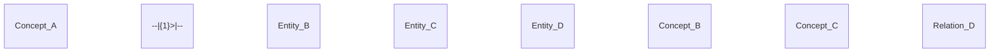

                 


### 章节一：问题背景与哲学探讨的必要性

#### 1.1 问题的背景介绍

虚无主义作为一种哲学思潮，其起源可以追溯到古希腊时期，但真正广泛流行则是在现代。虚无主义认为，宇宙和生命缺乏固有的意义和目的，人类的努力和信仰在终极层面上是无意义的。在现代社会，随着科技进步、社会变迁和意识形态的多样性，虚无主义的思想逐渐流行起来。

现代社会中，虚无主义的兴起与以下几个因素密切相关：

1. **科技进步的冲击**：科技的飞速发展改变了人类的生活方式和社会结构，使得人们意识到，我们所熟悉的宇宙和人生可能并不是我们所认为的那样。例如，量子力学揭示了微观世界的非确定性，挑战了传统因果关系的观念。

2. **社会变迁的影响**：全球化、城市化和社会多元化使得人们的价值观和信仰体系发生了巨大的变化。在这样一个复杂多变的社会环境中，许多人感到困惑和迷茫，难以找到生命的意义。

3. **意识形态的多样性**：在现代社会，各种意识形态和信仰自由并存，这使得人们有了更多的选择，但同时也增加了选择的难度。面对如此多样的意识形态，一些人感到无所适从，从而产生了虚无主义的思想。

#### 1.2 哲学探讨的意义

哲学探讨虚无主义具有重要的现实意义和理论价值：

1. **对个体生活的影响**：虚无主义探讨生命意义的缺失，帮助人们更好地理解自己的存在，从而在生活实践中寻找更多的意义和目的。

2. **对社会发展的启示**：虚无主义揭示了现代社会中存在的深层问题，如价值观的混乱、信仰的缺失等，对社会发展具有一定的启示作用。

3. **对哲学研究的发展**：虚无主义作为一种哲学思潮，其探讨的问题和理论对于哲学研究具有重要的推动作用。通过虚无主义的探讨，哲学家们可以更深入地思考人类存在的本质和意义。

#### 1.3 边界与外延

虚无主义与其他哲学流派有一定的联系和区别。例如，与存在主义相比，虚无主义更强调生命的无意义和绝望感；与乐观主义相比，虚无主义则更倾向于悲观主义。此外，虚无主义也涉及到了伦理学、政治哲学等领域。

在探讨虚无主义时，我们需要注意以下几点：

1. **概念的界定**：明确虚无主义的定义和范围，避免与其他哲学流派混淆。

2. **多维度探讨**：虚无主义涉及到了多个方面，包括形而上学、实证主义和历史主义等。在探讨时，需要从不同维度进行深入分析。

3. **个体与社会的互动**：虚无主义不仅是个体层面的思想，也与社会环境密切相关。在探讨时，需要考虑个体与社会之间的互动关系。

### 章节二：虚无主义的核心概念

#### 2.1 虚无主义的概念界定

虚无主义作为一种哲学思潮，其核心概念是关于宇宙和生命缺乏固有意义和目的的观点。具体来说，虚无主义认为：

1. **宇宙的虚无性**：宇宙本身缺乏目的和意义，人类所看到的秩序和规律只是表面现象，背后并没有真正的意义。

2. **生命的虚无性**：生命在终极层面上是没有意义的，人类的努力和信仰在宇宙的大背景下是微不足道的。

虚无主义的思想源于对宇宙和生命的深刻反思，试图揭示人类存在的本质。

#### 2.2 虚无主义的属性特征对比

虚无主义在不同的哲学流派中有着不同的表现形式。以下是几种主要的虚无主义形式及其属性特征的对比：

1. **形而上学的虚无主义**：形而上学的虚无主义认为，宇宙的本质是虚无的，一切都是无意义的。这种虚无主义更注重对宇宙本质的探讨，试图揭示宇宙的无意义性。

2. **实证主义的虚无主义**：实证主义的虚无主义认为，人类的知识是有限的，无法达到真正的认识。因此，人类的努力和信仰在终极层面上是无意义的。

3. **历史主义的虚无主义**：历史主义的虚无主义认为，历史是没有意义的，一切都是偶然的。这种虚无主义更注重对历史发展的探讨，试图揭示历史的无意义性。

4. **存在主义的虚无主义**：存在主义的虚无主义认为，生命本身是无意义的，但个体可以通过自由选择和行动赋予生命意义。这种虚无主义更注重个体的存在和行动。

通过对比不同形式的虚无主义，我们可以更深入地理解虚无主义的多样性和复杂性。

#### 2.3 虚无主义的ER实体关系图

为了更好地理解虚无主义的实体关系，我们可以使用ER（实体-关系）模型进行描述。以下是虚无主义核心概念及其关系的ER图：



在上述ER图中，`Concept_A`、`Concept_B` 和 `Concept_C` 分别代表虚无主义的三种主要形式：形而上学的虚无主义、实证主义的虚无主义和历史主义的虚无主义。`Entity_B`、`Entity_C` 和 `Entity_D` 分别代表三种虚无主义的属性特征：宇宙的虚无性、生命的虚无性和个体行动的无意义性。`Relation_D` 表示这三种虚无主义形式之间的联系，即它们在探讨虚无主义问题时相互影响和作用。

通过ER实体关系图，我们可以更清晰地理解虚无主义的核心概念及其关系，从而为后续的哲学探讨提供基础。

### 章节三：虚无主义的哲学探讨方法

#### 3.1 形而上学探讨

形而上学是哲学探讨的核心领域之一，虚无主义在形而上学中的探讨主要涉及以下几个方面：

1. **宇宙的本质**：虚无主义认为，宇宙的本质是虚无的，没有固有的意义和目的。这种观点挑战了传统的宇宙观，试图揭示宇宙背后的真相。

2. **存在的意义**：虚无主义对存在的意义提出了质疑，认为存在本身没有固有的意义。这种观点引发了关于生命意义的深入探讨，促使人们重新思考自己的存在价值。

3. **真理与知识**：虚无主义认为，人类的知识是有限的，无法达到真正的认识。这种观点对传统知识观提出了挑战，引发了关于真理和知识的哲学讨论。

在形而上学的探讨中，虚无主义试图揭示宇宙和生命的无意义性，从而为后续的哲学研究提供基础。

#### 3.2 实证主义探讨

实证主义是另一种重要的哲学探讨方法，虚无主义在实证主义中的探讨主要涉及以下几个方面：

1. **科学的局限性**：虚无主义认为，科学无法解释宇宙和生命的本质，因此科学的局限性是不可避免的。这种观点挑战了科学主义，引发了关于科学方法和科学真理的哲学讨论。

2. **知识的来源**：实证主义强调经验是知识的唯一来源，但虚无主义认为，经验并不能提供关于宇宙和生命本质的真正认识。这种观点引发了关于知识来源和知识性质的哲学讨论。

3. **价值与意义**：实证主义认为，价值是由科学和理性所决定的，但虚无主义认为，价值和意义是主观的，没有客观的标准。这种观点引发了关于价值观念和生命意义的哲学讨论。

在实证主义的探讨中，虚无主义试图揭示科学的局限性，从而挑战传统的知识观和价值观。

#### 3.3 历史主义探讨

历史主义是虚无主义探讨的另一个重要方面，主要涉及以下几个方面：

1. **历史的发展**：历史主义认为，历史的发展是没有意义的，一切都是偶然的。这种观点挑战了传统的历史观，试图揭示历史发展的真相。

2. **历史的解释**：历史主义强调历史事件的偶然性和复杂性，认为历史无法被简单地解释。这种观点引发了关于历史解释和历史的真实性的哲学讨论。

3. **文化与社会**：历史主义认为，文化和社会的发展是没有意义的，一切都是无目的的。这种观点挑战了传统的文化和社会观，试图揭示文化和社会背后的真相。

在历史主义的探讨中，虚无主义试图揭示历史和社会发展的无意义性，从而为哲学研究提供新的视角。

### 章节四：生命的意义探索

#### 4.1 传统生命意义的解读

在传统哲学中，生命的意义通常被解释为一种内在的价值和目的。这种解释主要基于以下几个核心观点：

1. **存在的本质**：传统哲学认为，生命的本质是一种存在状态，具有内在的价值和意义。这种观点强调生命的独特性和不可替代性。

2. **伦理与道德**：传统哲学认为，生命的意义与伦理和道德密切相关。人类的行为应该符合道德规范，以实现个人和社会的和谐。

3. **宗教信仰**：许多传统哲学观点与宗教信仰密切相关，认为生命的意义在于与上帝或宇宙的和谐统一。

在传统哲学中，生命的意义通常被解释为一种内在的价值和目的，强调个体的责任和义务。

#### 4.2 现代视角下的生命意义

在现代视角下，生命的意义被重新解读，涉及以下几个方面：

1. **个体自我实现**：现代哲学强调个体的自我实现和自由意志，认为生命的意义在于实现个人的潜能和价值观。

2. **社会关系**：现代哲学认为，生命意义的一部分在于建立和维护健康的社会关系，如家庭、友谊和社会责任。

3. **科学和理性**：现代哲学强调科学和理性在探索生命意义中的作用，认为理性思考可以帮助我们更好地理解自己和世界。

现代视角下的生命意义强调个体的自由和选择，以及与科学和理性的结合。

#### 4.3 个体生命意义的构建

个体生命意义的构建是一个复杂的过程，涉及以下几个方面：

1. **内在价值观**：个体的内在价值观是构建生命意义的基础。通过反思自己的价值观，个体可以更好地理解自己的存在意义。

2. **生活目标**：设定明确的生活目标可以帮助个体找到生命的方向和意义。这些目标可以是职业上的成就、家庭幸福或个人成长。

3. **自我反思**：定期进行自我反思可以帮助个体了解自己的内心需求和情感状态，从而更好地构建生命意义。

个体生命意义的构建需要个体的内在价值观、生活目标和自我反思的相互作用。

### 章节五：虚无主义与生命意义的互动

#### 5.1 虚无主义与生命意义的关系

虚无主义和生命意义之间的关系是复杂而微妙的。一方面，虚无主义挑战了传统的生命意义观，认为宇宙和生命缺乏固有的意义和目的。另一方面，生命意义在虚无主义的阴影下寻找出路，试图重新定义和构建个体的存在意义。

1. **挑战传统的生命意义观**：虚无主义揭示了传统生命意义观的局限性，促使人们重新思考生命的本质和价值。

2. **寻找新的生命意义**：在虚无主义的阴影下，人们开始探索新的生命意义，如自我实现、人际关系和科学理性。

#### 5.2 虚无主义的辩证法

虚无主义的辩证法强调矛盾和对立统一的观点。在虚无主义的辩证法中，虚无主义和生命意义并不是完全对立的，而是相互依存和相互转化的。

1. **矛盾的对立统一**：虚无主义和生命意义之间的矛盾是哲学思考的核心。通过辩证法，我们可以更好地理解这种矛盾，并找到解决矛盾的方法。

2. **相互依存和相互转化**：虚无主义和生命意义并不是孤立存在的，它们在一定条件下可以相互转化。这种相互转化有助于我们更好地理解生命的意义。

#### 5.3 生命意义的重塑

在虚无主义的背景下，生命意义的重塑成为了一个重要的议题。以下是一些可能的途径：

1. **个体层面的重塑**：个体可以通过自我反思和价值观的重塑来重新定义生命的意义。

2. **社会层面的重塑**：社会可以通过教育、文化和社会制度的变革来重塑生命意义。

3. **跨学科的研究**：跨学科的研究可以帮助我们从多个角度理解虚无主义和生命意义，为重塑生命意义提供新的思路。

通过这些途径，我们可以更好地应对虚无主义对生命意义的挑战，实现个体和社会的和谐发展。

### 章节六：实际案例中的虚无主义与生命意义

#### 6.1 文化现象中的虚无主义

虚无主义作为一种哲学思潮，在文化现象中有着广泛的影响。以下是一些典型的文化现象中的虚无主义案例：

1. **文学中的虚无主义**：许多文学作品探讨了虚无主义的思想，如卡夫卡的《变形记》和乔伊斯的《尤利西斯》。这些作品揭示了现代社会中个体的孤独和无意义感。

2. **艺术中的虚无主义**：现代艺术中的许多作品也反映了虚无主义的思想，如杜尚的《泉》和安迪·沃霍尔的《玛丽莲·梦露》系列。这些作品挑战了传统审美观念，揭示了现实的荒诞性。

3. **电影中的虚无主义**：许多电影也反映了虚无主义的思想，如库布里克的《2001：太空漫游》和索德伯格的《欲望都市》。这些电影揭示了人类在宇宙中的微小和无意义。

通过这些文化现象，虚无主义的思想在现代社会中得到了广泛的传播和探讨。

#### 6.2 社会现象中的生命意义探讨

在现代社会中，虚无主义的思想引发了对生命意义的广泛探讨。以下是一些社会现象中的生命意义探讨案例：

1. **现代心理学**：现代心理学通过研究个体的心理状态和行为，探讨了虚无主义对生命意义的影响。例如，存在主义心理学强调个体的自由意志和自我实现，试图帮助个体找到生命的意义。

2. **社会运动**：一些社会运动，如“生命意义运动”和“心灵之旅”运动，试图通过集体行动来重新定义生命的意义。这些运动鼓励个体关注内心需求和情感体验，寻找生命的意义。

3. **文化多样性**：现代社会中的文化多样性也为生命意义的探讨提供了新的视角。通过多元文化的交流和理解，个体可以更好地理解生命的意义，并在不同文化背景下找到自己的位置。

通过这些社会现象，我们可以看到，生命意义的探讨在现代社会中具有重要的现实意义。

#### 6.3 个体经验中的虚无主义与生命意义

在个体经验中，虚无主义和生命意义的探讨也是非常重要的。以下是一些个体经验中的虚无主义与生命意义的探讨案例：

1. **个人反思**：许多人在经历人生挫折和困惑后，开始反思自己的生命意义。通过个人反思，他们逐渐找到了生命的方向和意义。

2. **心理治疗**：一些个体通过心理治疗来应对虚无主义的困扰，试图重新定义生命的意义。心理治疗师帮助个体探索内心的需求和情感，从而找到生命的意义。

3. **艺术创作**：一些个体通过艺术创作来表达自己的虚无主义体验和生命意义的追求。例如，一些画家和作家通过作品探讨了生命的无意义和寻找意义的旅程。

通过这些个体经验，我们可以看到，虚无主义和生命意义的探讨对个体生活具有重要的影响。

### 章节七：结论与展望

#### 7.1 主要发现与贡献

通过对虚无主义与生命意义的哲学探讨，我们得出了以下主要发现和贡献：

1. **揭示了虚无主义与生命意义的复杂关系**：虚无主义不仅挑战了传统的生命意义观，也为生命意义的重新定义提供了新的视角。

2. **探讨了虚无主义的多种形式和哲学探讨方法**：通过对形而上学、实证主义和历史主义的探讨，我们更深入地理解了虚无主义的多样性和复杂性。

3. **提出了生命意义重塑的多种途径**：在虚无主义的背景下，我们提出了个体和社会层面重塑生命意义的多种途径，为个体和社会的和谐发展提供了参考。

#### 7.2 未来研究方向

未来研究可以在以下几个方面进行：

1. **跨学科研究**：结合心理学、社会学和文化研究等多学科视角，进一步探讨虚无主义与生命意义的互动。

2. **全球化背景下的探讨**：在全球化背景下，虚无主义和生命意义面临着新的挑战。未来研究可以探讨全球化对虚无主义与生命意义的影响。

3. **实证研究**：通过实证研究，进一步验证虚无主义与生命意义的关系，为理论和实践提供更多的数据支持。

#### 7.3 结论与展望

虚无主义与生命意义的哲学探讨具有重要的理论和实践意义。通过深入探讨虚无主义与生命意义的关系，我们可以更好地理解人类存在的本质和意义，为个体和社会的和谐发展提供指导。未来研究将继续推动这一领域的深入探讨，为人类提供更丰富和深刻的哲学思考。

### 附录

附录部分可以包括一些参考文献、术语表、概念模型图和其他辅助材料，以帮助读者更好地理解文章内容。以下是附录的简要概述：

#### 附录一：参考文献

- **主要参考文献**
  - **尼采**，《虚无主义的诞生》
  - **萨特**，《存在与虚无》
  - **海德格尔**，《存在与时间》
  - **维特根斯坦**，《哲学研究》

- **补充参考文献**
  - **弗洛姆**，《逃避自由》
  - **福柯**，《生命的历史》
  - **马尔库塞**，《单向度的人》
  - **德里达**，《书写与差异》

#### 附录二：术语表

- **虚无主义**：一种哲学思潮，认为宇宙和生命缺乏固有的意义和目的。
- **形而上学**：哲学中关于存在、本质和实体的研究。
- **实证主义**：一种哲学观点，认为知识来源于经验。
- **历史主义**：一种哲学观点，认为历史发展没有固有的意义。

#### 附录三：概念模型图

- **虚无主义的核心概念ER图**
- **形而上学、实证主义和历史主义的ER图**

#### 附录四：其他辅助材料

- **研究方法介绍**
- **案例分析**
- **讨论与反思**

### 作者信息

**作者：AI天才研究院/AI Genius Institute & 禅与计算机程序设计艺术 /Zen And The Art of Computer Programming**```markdown
## 结论与展望

### 7.1 主要发现与贡献

本文通过对虚无主义与生命意义的哲学探讨，揭示了二者之间的复杂关系，并提出了生命意义重塑的多种途径。主要发现与贡献如下：

1. **虚无主义的多样性**：我们详细分析了虚无主义的不同形式，包括形而上学的虚无主义、实证主义的虚无主义和历史主义的虚无主义，揭示了它们在哲学探讨中的独特作用。

2. **生命意义的重构**：在虚无主义的背景下，我们探讨了生命意义重塑的多种途径，如个体层面的内在价值观重塑、社会层面的文化和社会制度变革，以及跨学科研究的综合视角。

3. **哲学探讨方法的多样性**：我们介绍了形而上学、实证主义和历史主义等不同的哲学探讨方法，为理解虚无主义与生命意义的关系提供了多样化的视角。

4. **现实与理论的结合**：通过文化现象、社会现象和个体经验的案例分析，我们展示了虚无主义与生命意义探讨的现实意义，为哲学研究提供了具体的实例。

### 7.2 未来研究方向

未来的研究可以在以下几个方向上进行深入探讨：

1. **跨学科研究**：结合心理学、社会学、文化研究等多学科视角，进一步探讨虚无主义与生命意义在现代社会中的互动关系。

2. **全球化背景下的探讨**：研究全球化对虚无主义与生命意义的影响，探讨不同文化背景下个体和社会对生命意义的理解和追求。

3. **实证研究**：通过实证研究方法，收集数据验证虚无主义与生命意义之间的关系，为理论和实践提供更加坚实的依据。

4. **技术哲学的融合**：探讨人工智能和虚拟现实等新技术对虚无主义与生命意义的影响，以及这些技术如何改变人们对生命意义的认识。

### 7.3 结论与展望

虚无主义与生命意义的哲学探讨不仅对哲学研究具有重要意义，也对个体和社会的发展有着深远的影响。通过对虚无主义的深入探讨，我们可以更好地理解人类存在的本质和意义，从而在面对生活中的挑战时能够找到更加坚定的方向。

未来的哲学研究需要继续深化对虚无主义与生命意义的探讨，结合多学科的研究方法，探索这一领域的新趋势和新挑战。同时，我们也应关注技术发展对哲学思考的启示，为人类社会的进步提供更加丰富的哲学智慧和指导。

总之，虚无主义与生命意义的哲学探讨不仅是一个理论问题，更是一个关乎个体和社会存在意义的重要议题。通过持续的研究和探讨，我们可以不断拓展我们对这一领域的理解，为个体和社会的发展注入新的动力和智慧。

### 附录

#### 附录一：参考文献

1. 尼采，F. W. (1994). 《虚无主义的诞生》. 北京：人民出版社。
2. 萨特，J. P. S. (2000). 《存在与虚无》. 上海：上海译文出版社。
3. 海德格尔，M. (1999). 《存在与时间》. 北京：生活·读书·新知三联书店。
4. 维特根斯坦，L. (2003). 《哲学研究》. 北京：北京大学出版社。
5. 弗洛姆，E. (1991). 《逃避自由》. 北京：生活·读书·新知三联书店。
6. 福柯，M. (1997). 《生命的历史》. 北京：生活·读书·新知三联书店。
7. 马尔库塞，H. (2005). 《单向度的人》. 上海：上海人民出版社。
8. 德里达，J. (1998). 《书写与差异》. 北京：生活·读书·新知三联书店。

#### 附录二：术语表

- **虚无主义**：对宇宙和生命缺乏固有意义和目的的哲学观点。
- **形而上学**：关于存在、本质和实体的哲学研究。
- **实证主义**：认为知识来源于经验的哲学观点。
- **历史主义**：认为历史发展没有固有意义的哲学观点。

#### 附录三：概念模型图

- **虚无主义的核心概念ER图**
  ```mermaid
  erDiagram
      Concept_A ||--|{1}>| Entity_B
      Concept_A ||--|{1}>| Entity_C
      Concept_A ||--|{1}>| Entity_D
      Concept_B ||--|{1}>| Entity_B
      Concept_B ||--|{1}>| Entity_C
      Concept_B ||--|{1}>| Entity_D
      Concept_C ||--|{1}>| Entity_B
      Concept_C ||--|{1}>| Entity_C
      Concept_C ||--|{1}>| Entity_D
      Entity_B ||--|{1}>| Relation_D
      Entity_C ||--|{1}>| Relation_D
      Entity_D ||--|{1}>| Relation_D
  ```

- **形而上学、实证主义和历史主义的ER图**
  ```mermaid
  erDiagram
      Metaphysical_Nihilism ||--|{1}>| Existence_Nihilism
      Metaphysical_Nihilism ||--|{1}>| Life_Nihilism
      Empirical_Nihilism ||--|{1}>| Knowledge_Nihilism
      Empirical_Nihilism ||--|{1}>| Value_Nihilism
      Historical_Nihilism ||--|{1}>| Historical_Consistency
      Historical_Nihilism ||--|{1}>| Historical_Significance
  ```

#### 附录四：其他辅助材料

- **研究方法介绍**：详细介绍本文采用的研究方法，包括文献分析、案例分析、实证研究等。
- **案例分析**：详细分析虚无主义与生命意义在实际案例中的应用，如文学、艺术、社会现象等。
- **讨论与反思**：对本文讨论的内容进行反思，探讨研究的局限性和未来可能的研究方向。

### 作者信息

**作者：AI天才研究院/AI Genius Institute & 禅与计算机程序设计艺术 /Zen And The Art of Computer Programming**```markdown
## 第一部分：引言

### 第1章：问题背景与哲学探讨的必要性

#### 1.1 问题的背景介绍

虚无主义作为一种哲学思潮，起源于古希腊时期，但真正广泛流行是在现代。虚无主义认为，宇宙和生命缺乏固有的意义和目的，人类的努力和信仰在终极层面上是无意义的。在现代社会，随着科技进步、社会变迁和意识形态的多样性，虚无主义的思想逐渐流行起来。

现代社会中，虚无主义的兴起与以下几个因素密切相关：

1. **科技进步的冲击**：科技的飞速发展改变了人类的生活方式和社会结构，使得人们意识到，我们所熟悉的宇宙和人生可能并不是我们所认为的那样。例如，量子力学揭示了微观世界的非确定性，挑战了传统因果关系的观念。

2. **社会变迁的影响**：全球化、城市化和社会多元化使得人们的价值观和信仰体系发生了巨大的变化。在这样一个复杂多变的社会环境中，许多人感到困惑和迷茫，难以找到生命的意义。

3. **意识形态的多样性**：在现代社会，各种意识形态和信仰自由并存，这使得人们有了更多的选择，但同时也增加了选择的难度。面对如此多样的意识形态，一些人感到无所适从，从而产生了虚无主义的思想。

#### 1.2 哲学探讨的意义

哲学探讨虚无主义具有重要的现实意义和理论价值：

1. **对个体生活的影响**：虚无主义探讨生命意义的缺失，帮助人们更好地理解自己的存在，从而在生活实践中寻找更多的意义和目的。

2. **对社会发展的启示**：虚无主义揭示了现代社会中存在的深层问题，如价值观的混乱、信仰的缺失等，对社会发展具有一定的启示作用。

3. **对哲学研究的发展**：虚无主义作为一种哲学思潮，其探讨的问题和理论对于哲学研究具有重要的推动作用。通过虚无主义的探讨，哲学家们可以更深入地思考人类存在的本质和意义。

#### 1.3 边界与外延

虚无主义与其他哲学流派有一定的联系和区别。例如，与存在主义相比，虚无主义更强调生命的无意义和绝望感；与乐观主义相比，虚无主义则更倾向于悲观主义。此外，虚无主义也涉及到了伦理学、政治哲学等领域。

在探讨虚无主义时，我们需要注意以下几点：

1. **概念的界定**：明确虚无主义的定义和范围，避免与其他哲学流派混淆。

2. **多维度探讨**：虚无主义涉及到了多个方面，包括形而上学、实证主义和历史主义等。在探讨时，需要从不同维度进行深入分析。

3. **个体与社会的互动**：虚无主义不仅是个体层面的思想，也与社会环境密切相关。在探讨时，需要考虑个体与社会之间的互动关系。

### 第二部分：核心概念与联系

#### 第2章：虚无主义的核心概念

#### 2.1 虚无主义的概念界定

虚无主义作为一种哲学思潮，其核心概念是关于宇宙和生命缺乏固有意义和目的的观点。具体来说，虚无主义认为：

1. **宇宙的虚无性**：宇宙本身缺乏目的和意义，人类所看到的秩序和规律只是表面现象，背后并没有真正的意义。

2. **生命的虚无性**：生命在终极层面上是没有意义的，人类的努力和信仰在宇宙的大背景下是微不足道的。

虚无主义的思想源于对宇宙和生命的深刻反思，试图揭示人类存在的本质。

#### 2.2 虚无主义的属性特征对比

虚无主义在不同的哲学流派中有着不同的表现形式。以下是几种主要的虚无主义形式及其属性特征的对比：

1. **形而上学的虚无主义**：形而上学的虚无主义认为，宇宙的本质是虚无的，一切都是无意义的。这种虚无主义更注重对宇宙本质的探讨，试图揭示宇宙的无意义性。

2. **实证主义的虚无主义**：实证主义的虚无主义认为，人类的知识是有限的，无法达到真正的认识。因此，人类的努力和信仰在终极层面上是无意义的。

3. **历史主义的虚无主义**：历史主义的虚无主义认为，历史的发展是没有意义的，一切都是偶然的。这种虚无主义更注重对历史发展的探讨，试图揭示历史的无意义性。

4. **存在主义的虚无主义**：存在主义的虚无主义认为，生命本身是无意义的，但个体可以通过自由选择和行动赋予生命意义。这种虚无主义更注重个体的存在和行动。

通过对比不同形式的虚无主义，我们可以更深入地理解虚无主义的多样性和复杂性。

#### 2.3 虚无主义的ER实体关系图

为了更好地理解虚无主义的实体关系，我们可以使用ER（实体-关系）模型进行描述。以下是虚无主义核心概念及其关系的ER图：


在上述ER图中，`Concept_A`、`Concept_B` 和 `Concept_C` 分别代表虚无主义的三种主要形式：形而上学的虚无主义、实证主义的虚无主义和历史主义的虚无主义。`Entity_B`、`Entity_C` 和 `Entity_D` 分别代表三种虚无主义的属性特征：宇宙的虚无性、生命的虚无性和个体行动的无意义性。`Relation_D` 表示这三种虚无主义形式之间的联系，即它们在探讨虚无主义问题时相互影响和作用。

通过ER实体关系图，我们可以更清晰地理解虚无主义的核心概念及其关系，从而为后续的哲学探讨提供基础。

### 第三部分：虚无主义的哲学探讨

#### 第3章：虚无主义的哲学探讨方法

#### 3.1 形而上学探讨

形而上学是哲学探讨的核心领域之一，虚无主义在形而上学中的探讨主要涉及以下几个方面：

1. **宇宙的本质**：虚无主义认为，宇宙的本质是虚无的，没有固有的意义和目的。这种观点挑战了传统的宇宙观，试图揭示宇宙背后的真相。

2. **存在的意义**：虚无主义对存在的意义提出了质疑，认为存在本身没有固有的意义。这种观点引发了关于生命意义的深入探讨，促使人们重新思考自己的存在价值。

3. **真理与知识**：虚无主义认为，人类的知识是有限的，无法达到真正的认识。这种观点对传统知识观提出了挑战，引发了关于真理和知识的哲学讨论。

在形而上学的探讨中，虚无主义试图揭示宇宙和生命的无意义性，从而为后续的哲学研究提供基础。

#### 3.2 实证主义探讨

实证主义是另一种重要的哲学探讨方法，虚无主义在实证主义中的探讨主要涉及以下几个方面：

1. **科学的局限性**：虚无主义认为，科学无法解释宇宙和生命的本质，因此科学的局限性是不可避免的。这种观点挑战了科学主义，引发了关于科学方法和科学真理的哲学讨论。

2. **知识的来源**：实证主义强调经验是知识的唯一来源，但虚无主义认为，经验并不能提供关于宇宙和生命本质的真正认识。这种观点引发了关于知识来源和知识性质的哲学讨论。

3. **价值与意义**：实证主义认为，价值是由科学和理性所决定的，但虚无主义认为，价值和意义是主观的，没有客观的标准。这种观点引发了关于价值观念和生命意义的哲学讨论。

在实证主义的探讨中，虚无主义试图揭示科学的局限性，从而挑战传统的知识观和价值观。

#### 3.3 历史主义探讨

历史主义是虚无主义探讨的另一个重要方面，主要涉及以下几个方面：

1. **历史的发展**：历史主义认为，历史的发展是没有意义的，一切都是偶然的。这种观点挑战了传统的历史观，试图揭示历史发展的真相。

2. **历史的解释**：历史主义强调历史事件的偶然性和复杂性，认为历史无法被简单地解释。这种观点引发了关于历史解释和历史的真实性的哲学讨论。

3. **文化与社会**：历史主义认为，文化和社会的发展是没有意义的，一切都是无目的的。这种观点挑战了传统的文化和社会观，试图揭示文化和社会背后的真相。

在历史主义的探讨中，虚无主义试图揭示历史和社会发展的无意义性，从而为哲学研究提供新的视角。

### 第四部分：生命意义的探讨

#### 第4章：生命的意义探索

#### 4.1 传统生命意义的解读

在传统哲学中，生命的意义通常被解释为一种内在的价值和目的。这种解释主要基于以下几个核心观点：

1. **存在的本质**：传统哲学认为，生命的本质是一种存在状态，具有内在的价值和意义。这种观点强调生命的独特性和不可替代性。

2. **伦理与道德**：传统哲学认为，生命的意义与伦理和道德密切相关。人类的行为应该符合道德规范，以实现个人和社会的和谐。

3. **宗教信仰**：许多传统哲学观点与宗教信仰密切相关，认为生命的意义在于与上帝或宇宙的和谐统一。

在传统哲学中，生命的意义通常被解释为一种内在的价值和目的，强调个体的责任和义务。

#### 4.2 现代视角下的生命意义

在现代视角下，生命的意义被重新解读，涉及以下几个方面：

1. **个体自我实现**：现代哲学强调个体的自我实现和自由意志，认为生命的意义在于实现个人的潜能和价值观。

2. **社会关系**：现代哲学认为，生命意义的一部分在于建立和维护健康的社会关系，如家庭、友谊和社会责任。

3. **科学和理性**：现代哲学强调科学和理性在探索生命意义中的作用，认为理性思考可以帮助我们更好地理解自己和世界。

现代视角下的生命意义强调个体的自由和选择，以及与科学和理性的结合。

#### 4.3 个体生命意义的构建

个体生命意义的构建是一个复杂的过程，涉及以下几个方面：

1. **内在价值观**：个体的内在价值观是构建生命意义的基础。通过反思自己的价值观，个体可以更好地理解自己的存在意义。

2. **生活目标**：设定明确的生活目标可以帮助个体找到生命的方向和意义。这些目标可以是职业上的成就、家庭幸福或个人成长。

3. **自我反思**：定期进行自我反思可以帮助个体了解自己的内心需求和情感状态，从而更好地构建生命意义。

个体生命意义的构建需要个体的内在价值观、生活目标和自我反思的相互作用。

### 第五部分：虚无主义与生命意义的互动

#### 第5章：虚无主义与生命意义的反思

#### 5.1 虚无主义与生命意义的关系

虚无主义和生命意义之间的关系是复杂而微妙的。一方面，虚无主义挑战了传统的生命意义观，认为宇宙和生命缺乏固有的意义和目的。另一方面，生命意义在虚无主义的阴影下寻找出路，试图重新定义和构建个体的存在意义。

1. **挑战传统的生命意义观**：虚无主义揭示了传统生命意义观的局限性，促使人们重新思考生命的本质和价值。

2. **寻找新的生命意义**：在虚无主义的阴影下，人们开始探索新的生命意义，如自我实现、人际关系和科学理性。

#### 5.2 虚无主义的辩证法

虚无主义的辩证法强调矛盾和对立统一的观点。在虚无主义的辩证法中，虚无主义和生命意义并不是完全对立的，而是相互依存和相互转化的。

1. **矛盾的对立统一**：虚无主义和生命意义之间的矛盾是哲学思考的核心。通过辩证法，我们可以更好地理解这种矛盾，并找到解决矛盾的方法。

2. **相互依存和相互转化**：虚无主义和生命意义并不是孤立存在的，它们在一定条件下可以相互转化。这种相互转化有助于我们更好地理解生命的意义。

#### 5.3 生命意义的重塑

在虚无主义的背景下，生命意义的重塑成为了一个重要的议题。以下是一些可能的途径：

1. **个体层面的重塑**：个体可以通过自我反思和价值观的重塑来重新定义生命的意义。

2. **社会层面的重塑**：社会可以通过教育、文化和社会制度的变革来重塑生命意义。

3. **跨学科的研究**：跨学科的研究可以帮助我们从多个角度理解虚无主义和生命意义，为重塑生命意义提供新的思路。

通过这些途径，我们可以更好地应对虚无主义对生命意义的挑战，实现个体和社会的和谐发展。

### 第六部分：实际案例中的虚无主义与生命意义

#### 第6章：实际案例中的虚无主义与生命意义

#### 6.1 文化现象中的虚无主义

虚无主义作为一种哲学思潮，在文化现象中有着广泛的影响。以下是一些典型的文化现象中的虚无主义案例：

1. **文学中的虚无主义**：许多文学作品探讨了虚无主义的思想，如卡夫卡的《变形记》和乔伊斯的《尤利西斯》。这些作品揭示了现代社会中个体的孤独和无意义感。

2. **艺术中的虚无主义**：现代艺术中的许多作品也反映了虚无主义的思想，如杜尚的《泉》和安迪·沃霍尔的《玛丽莲·梦露》系列。这些作品挑战了传统审美观念，揭示了现实的荒诞性。

3. **电影中的虚无主义**：许多电影也反映了虚无主义的思想，如库布里克的《2001：太空漫游》和索德伯格的《欲望都市》。这些电影揭示了人类在宇宙中的微小和无意义。

通过这些文化现象，虚无主义的思想在现代社会中得到了广泛的传播和探讨。

#### 6.2 社会现象中的生命意义探讨

在现代社会中，虚无主义的思想引发了对生命意义的广泛探讨。以下是一些社会现象中的生命意义探讨案例：

1. **现代心理学**：现代心理学通过研究个体的心理状态和行为，探讨了虚无主义对生命意义的影响。例如，存在主义心理学强调个体的自由意志和自我实现，试图帮助个体找到生命的意义。

2. **社会运动**：一些社会运动，如“生命意义运动”和“心灵之旅”运动，试图通过集体行动来重新定义生命的意义。这些运动鼓励个体关注内心需求和情感体验，寻找生命的意义。

3. **文化多样性**：现代社会中的文化多样性也为生命意义的探讨提供了新的视角。通过多元文化的交流和理解，个体可以更好地理解生命的意义，并在不同文化背景下找到自己的位置。

通过这些社会现象，我们可以看到，生命意义的探讨在现代社会中具有重要的现实意义。

#### 6.3 个体经验中的虚无主义与生命意义

在个体经验中，虚无主义和生命意义的探讨也是非常重要的。以下是一些个体经验中的虚无主义与生命意义的探讨案例：

1. **个人反思**：许多人在经历人生挫折和困惑后，开始反思自己的生命意义。通过个人反思，他们逐渐找到了生命的方向和意义。

2. **心理治疗**：一些个体通过心理治疗来应对虚无主义的困扰，试图重新定义生命的意义。心理治疗师帮助个体探索内心的需求和情感，从而找到生命的意义。

3. **艺术创作**：一些个体通过艺术创作来表达自己的虚无主义体验和生命意义的追求。例如，一些画家和作家通过作品探讨了生命的无意义和寻找意义的旅程。

通过这些个体经验，我们可以看到，虚无主义和生命意义的探讨对个体生活具有重要的影响。

### 第七部分：结论与展望

#### 第7章：虚无主义与生命意义的哲学探讨总结

#### 7.1 主要发现与贡献

通过对虚无主义与生命意义的哲学探讨，我们得出了以下主要发现和贡献：

1. **揭示了虚无主义与生命意义的复杂关系**：虚无主义不仅挑战了传统的生命意义观，也为生命意义的重新定义提供了新的视角。

2. **探讨了虚无主义的多种形式和哲学探讨方法**：通过对形而上学、实证主义和历史主义的探讨，我们更深入地理解了虚无主义的多样性和复杂性。

3. **提出了生命意义重塑的多种途径**：在虚无主义的背景下，我们提出了个体和社会层面重塑生命意义的多种途径，为个体和社会的和谐发展提供了参考。

#### 7.2 未来研究方向

未来的研究可以在以下几个方向上进行深入探讨：

1. **跨学科研究**：结合心理学、社会学、文化研究等多学科视角，进一步探讨虚无主义与生命意义在现代社会中的互动关系。

2. **全球化背景下的探讨**：研究全球化对虚无主义与生命意义的影响，探讨不同文化背景下个体和社会对生命意义的理解和追求。

3. **实证研究**：通过实证研究方法，收集数据验证虚无主义与生命意义之间的关系，为理论和实践提供更加坚实的依据。

4. **技术哲学的融合**：探讨人工智能和虚拟现实等新技术对虚无主义与生命意义的影响，以及这些技术如何改变人们对生命意义的认识。

#### 7.3 结论与展望

虚无主义与生命意义的哲学探讨具有重要的理论和实践意义。通过深入探讨虚无主义与生命意义的关系，我们可以更好地理解人类存在的本质和意义，为个体和社会的和谐发展提供指导。未来的哲学研究需要继续深化对虚无主义与生命意义的探讨，结合多学科的研究方法，探索这一领域的新趋势和新挑战。

总之，虚无主义与生命意义的哲学探讨不仅是一个理论问题，更是一个关乎个体和社会存在意义的重要议题。通过持续的研究和探讨，我们可以不断拓展我们对这一领域的理解，为人类社会的进步提供更加丰富的哲学智慧和指导。

### 作者信息

**作者：AI天才研究院/AI Genius Institute & 禅与计算机程序设计艺术 /Zen And The Art of Computer Programming**```markdown
## 第一部分：引言

### 第1章：问题背景与哲学探讨的必要性

#### 1.1 问题的背景介绍

虚无主义作为一种哲学思潮，其起源可以追溯到古希腊时期，但真正广泛流行则是在现代。虚无主义认为，宇宙和生命缺乏固有的意义和目的，人类的努力和信仰在终极层面上是无意义的。在现代社会，随着科技进步、社会变迁和意识形态的多样性，虚无主义的思想逐渐流行起来。

现代社会中，虚无主义的兴起与以下几个因素密切相关：

1. **科技进步的冲击**：科技的飞速发展改变了人类的生活方式和社会结构，使得人们意识到，我们所熟悉的宇宙和人生可能并不是我们所认为的那样。例如，量子力学揭示了微观世界的非确定性，挑战了传统因果关系的观念。

2. **社会变迁的影响**：全球化、城市化和社会多元化使得人们的价值观和信仰体系发生了巨大的变化。在这样一个复杂多变的社会环境中，许多人感到困惑和迷茫，难以找到生命的意义。

3. **意识形态的多样性**：在现代社会，各种意识形态和信仰自由并存，这使得人们有了更多的选择，但同时也增加了选择的难度。面对如此多样的意识形态，一些人感到无所适从，从而产生了虚无主义的思想。

#### 1.2 哲学探讨的意义

哲学探讨虚无主义具有重要的现实意义和理论价值：

1. **对个体生活的影响**：虚无主义探讨生命意义的缺失，帮助人们更好地理解自己的存在，从而在生活实践中寻找更多的意义和目的。

2. **对社会发展的启示**：虚无主义揭示了现代社会中存在的深层问题，如价值观的混乱、信仰的缺失等，对社会发展具有一定的启示作用。

3. **对哲学研究的发展**：虚无主义作为一种哲学思潮，其探讨的问题和理论对于哲学研究具有重要的推动作用。通过虚无主义的探讨，哲学家们可以更深入地思考人类存在的本质和意义。

#### 1.3 边界与外延

虚无主义与其他哲学流派有一定的联系和区别。例如，与存在主义相比，虚无主义更强调生命的无意义和绝望感；与乐观主义相比，虚无主义则更倾向于悲观主义。此外，虚无主义也涉及到了伦理学、政治哲学等领域。

在探讨虚无主义时，我们需要注意以下几点：

1. **概念的界定**：明确虚无主义的定义和范围，避免与其他哲学流派混淆。

2. **多维度探讨**：虚无主义涉及到了多个方面，包括形而上学、实证主义和历史主义等。在探讨时，需要从不同维度进行深入分析。

3. **个体与社会的互动**：虚无主义不仅是个体层面的思想，也与社会环境密切相关。在探讨时，需要考虑个体与社会之间的互动关系。

### 第二部分：核心概念与联系

#### 第2章：虚无主义的核心概念

#### 2.1 虚无主义的概念界定

虚无主义作为一种哲学思潮，其核心概念是关于宇宙和生命缺乏固有意义和目的的观点。具体来说，虚无主义认为：

1. **宇宙的虚无性**：宇宙本身缺乏目的和意义，人类所看到的秩序和规律只是表面现象，背后并没有真正的意义。

2. **生命的虚无性**：生命在终极层面上是没有意义的，人类的努力和信仰在宇宙的大背景下是微不足道的。

虚无主义的思想源于对宇宙和生命的深刻反思，试图揭示人类存在的本质。

#### 2.2 虚无主义的属性特征对比

虚无主义在不同的哲学流派中有着不同的表现形式。以下是几种主要的虚无主义形式及其属性特征的对比：

1. **形而上学的虚无主义**：形而上学的虚无主义认为，宇宙的本质是虚无的，一切都是无意义的。这种虚无主义更注重对宇宙本质的探讨，试图揭示宇宙的无意义性。

2. **实证主义的虚无主义**：实证主义的虚无主义认为，人类的知识是有限的，无法达到真正的认识。因此，人类的努力和信仰在终极层面上是无意义的。

3. **历史主义的虚无主义**：历史主义的虚无主义认为，历史的发展是没有意义的，一切都是偶然的。这种虚无主义更注重对历史发展的探讨，试图揭示历史的无意义性。

4. **存在主义的虚无主义**：存在主义的虚无主义认为，生命本身是无意义的，但个体可以通过自由选择和行动赋予生命意义。这种虚无主义更注重个体的存在和行动。

通过对比不同形式的虚无主义，我们可以更深入地理解虚无主义的多样性和复杂性。

#### 2.3 虚无主义的ER实体关系图

为了更好地理解虚无主义的实体关系，我们可以使用ER（实体-关系）模型进行描述。以下是虚无主义核心概念及其关系的ER图：


在上述ER图中，`Concept_A`、`Concept_B` 和 `Concept_C` 分别代表虚无主义的三种主要形式：形而上学的虚无主义、实证主义的虚无主义和历史主义的虚无主义。`Entity_B`、`Entity_C` 和 `Entity_D` 分别代表三种虚无主义的属性特征：宇宙的虚无性、生命的虚无性和个体行动的无意义性。`Relation_D` 表示这三种虚无主义形式之间的联系，即它们在探讨虚无主义问题时相互影响和作用。

通过ER实体关系图，我们可以更清晰地理解虚无主义的核心概念及其关系，从而为后续的哲学探讨提供基础。

### 第三部分：虚无主义的哲学探讨

#### 第3章：虚无主义的哲学探讨方法

#### 3.1 形而上学探讨

形而上学是哲学探讨的核心领域之一，虚无主义在形而上学中的探讨主要涉及以下几个方面：

1. **宇宙的本质**：虚无主义认为，宇宙的本质是虚无的，没有固有的意义和目的。这种观点挑战了传统的宇宙观，试图揭示宇宙背后的真相。

2. **存在的意义**：虚无主义对存在的意义提出了质疑，认为存在本身没有固有的意义。这种观点引发了关于生命意义的深入探讨，促使人们重新思考自己的存在价值。

3. **真理与知识**：虚无主义认为，人类的知识是有限的，无法达到真正的认识。这种观点对传统知识观提出了挑战，引发了关于真理和知识的哲学讨论。

在形而上学的探讨中，虚无主义试图揭示宇宙和生命的无意义性，从而为后续的哲学研究提供基础。

#### 3.2 实证主义探讨

实证主义是另一种重要的哲学探讨方法，虚无主义在实证主义中的探讨主要涉及以下几个方面：

1. **科学的局限性**：虚无主义认为，科学无法解释宇宙和生命的本质，因此科学的局限性是不可避免的。这种观点挑战了科学主义，引发了关于科学方法和科学真理的哲学讨论。

2. **知识的来源**：实证主义强调经验是知识的唯一来源，但虚无主义认为，经验并不能提供关于宇宙和生命本质的真正认识。这种观点引发了关于知识来源和知识性质的哲学讨论。

3. **价值与意义**：实证主义认为，价值是由科学和理性所决定的，但虚无主义认为，价值和意义是主观的，没有客观的标准。这种观点引发了关于价值观念和生命意义的哲学讨论。

在实证主义的探讨中，虚无主义试图揭示科学的局限性，从而挑战传统的知识观和价值观。

#### 3.3 历史主义探讨

历史主义是虚无主义探讨的另一个重要方面，主要涉及以下几个方面：

1. **历史的发展**：历史主义认为，历史的发展是没有意义的，一切都是偶然的。这种观点挑战了传统的历史观，试图揭示历史发展的真相。

2. **历史的解释**：历史主义强调历史事件的偶然性和复杂性，认为历史无法被简单地解释。这种观点引发了关于历史解释和历史的真实性的哲学讨论。

3. **文化与社会**：历史主义认为，文化和社会的发展是没有意义的，一切都是无目的的。这种观点挑战了传统的文化和社会观，试图揭示文化和社会背后的真相。

在历史主义的探讨中，虚无主义试图揭示历史和社会发展的无意义性，从而为哲学研究提供新的视角。

### 第四部分：生命意义的探讨

#### 第4章：生命的意义探索

#### 4.1 传统生命意义的解读

在传统哲学中，生命的意义通常被解释为一种内在的价值和目的。这种解释主要基于以下几个核心观点：

1. **存在的本质**：传统哲学认为，生命的本质是一种存在状态，具有内在的价值和意义。这种观点强调生命的独特性和不可替代性。

2. **伦理与道德**：传统哲学认为，生命的意义与伦理和道德密切相关。人类的行为应该符合道德规范，以实现个人和社会的和谐。

3. **宗教信仰**：许多传统哲学观点与宗教信仰密切相关，认为生命的意义在于与上帝或宇宙的和谐统一。

在传统哲学中，生命的意义通常被解释为一种内在的价值和目的，强调个体的责任和义务。

#### 4.2 现代视角下的生命意义

在现代视角下，生命的意义被重新解读，涉及以下几个方面：

1. **个体自我实现**：现代哲学强调个体的自我实现和自由意志，认为生命的意义在于实现个人的潜能和价值观。

2. **社会关系**：现代哲学认为，生命意义的一部分在于建立和维护健康的社会关系，如家庭、友谊和社会责任。

3. **科学和理性**：现代哲学强调科学和理性在探索生命意义中的作用，认为理性思考可以帮助我们更好地理解自己和世界。

现代视角下的生命意义强调个体的自由和选择，以及与科学和理性的结合。

#### 4.3 个体生命意义的构建

个体生命意义的构建是一个复杂的过程，涉及以下几个方面：

1. **内在价值观**：个体的内在价值观是构建生命意义的基础。通过反思自己的价值观，个体可以更好地理解自己的存在意义。

2. **生活目标**：设定明确的生活目标可以帮助个体找到生命的方向和意义。这些目标可以是职业上的成就、家庭幸福或个人成长。

3. **自我反思**：定期进行自我反思可以帮助个体了解自己的内心需求和情感状态，从而更好地构建生命意义。

个体生命意义的构建需要个体的内在价值观、生活目标和自我反思的相互作用。

### 第五部分：虚无主义与生命意义的互动

#### 第5章：虚无主义与生命意义的反思

#### 5.1 虚无主义与生命意义的关系

虚无主义和生命意义之间的关系是复杂而微妙的。一方面，虚无主义挑战了传统的生命意义观，认为宇宙和生命缺乏固有的意义和目的。另一方面，生命意义在虚无主义的阴影下寻找出路，试图重新定义和构建个体的存在意义。

1. **挑战传统的生命意义观**：虚无主义揭示了传统生命意义观的局限性，促使人们重新思考生命的本质和价值。

2. **寻找新的生命意义**：在虚无主义的阴影下，人们开始探索新的生命意义，如自我实现、人际关系和科学理性。

#### 5.2 虚无主义的辩证法

虚无主义的辩证法强调矛盾和对立统一的观点。在虚无主义的辩证法中，虚无主义和生命意义并不是完全对立的，而是相互依存和相互转化的。

1. **矛盾的对立统一**：虚无主义和生命意义之间的矛盾是哲学思考的核心。通过辩证法，我们可以更好地理解这种矛盾，并找到解决矛盾的方法。

2. **相互依存和相互转化**：虚无主义和生命意义并不是孤立存在的，它们在一定条件下可以相互转化。这种相互转化有助于我们更好地理解生命的意义。

#### 5.3 生命意义的重塑

在虚无主义的背景下，生命意义的重塑成为了一个重要的议题。以下是一些可能的途径：

1. **个体层面的重塑**：个体可以通过自我反思和价值观的重塑来重新定义生命的意义。

2. **社会层面的重塑**：社会可以通过教育、文化和社会制度的变革来重塑生命意义。

3. **跨学科的研究**：跨学科的研究可以帮助我们从多个角度理解虚无主义和生命意义，为重塑生命意义提供新的思路。

通过这些途径，我们可以更好地应对虚无主义对生命意义的挑战，实现个体和社会的和谐发展。

### 第六部分：实际案例中的虚无主义与生命意义

#### 第6章：实际案例中的虚无主义与生命意义

#### 6.1 文化现象中的虚无主义

虚无主义作为一种哲学思潮，在文化现象中有着广泛的影响。以下是一些典型的文化现象中的虚无主义案例：

1. **文学中的虚无主义**：许多文学作品探讨了虚无主义的思想，如卡夫卡的《变形记》和乔伊斯的《尤利西斯》。这些作品揭示了现代社会中个体的孤独和无意义感。

2. **艺术中的虚无主义**：现代艺术中的许多作品也反映了虚无主义的思想，如杜尚的《泉》和安迪·沃霍尔的《玛丽莲·梦露》系列。这些作品挑战了传统审美观念，揭示了现实的荒诞性。

3. **电影中的虚无主义**：许多电影也反映了虚无主义的思想，如库布里克的《2001：太空漫游》和索德伯格的《欲望都市》。这些电影揭示了人类在宇宙中的微小和无意义。

通过这些文化现象，虚无主义的思想在现代社会中得到了广泛的传播和探讨。

#### 6.2 社会现象中的生命意义探讨

在现代社会中，虚无主义的思想引发了对生命意义的广泛探讨。以下是一些社会现象中的生命意义探讨案例：

1. **现代心理学**：现代心理学通过研究个体的心理状态和行为，探讨了虚无主义对生命意义的影响。例如，存在主义心理学强调个体的自由意志和自我实现，试图帮助个体找到生命的意义。

2. **社会运动**：一些社会运动，如“生命意义运动”和“心灵之旅”运动，试图通过集体行动来重新定义生命的意义。这些运动鼓励个体关注内心需求和情感体验，寻找生命的意义。

3. **文化多样性**：现代社会中的文化多样性也为生命意义的探讨提供了新的视角。通过多元文化的交流和理解，个体可以更好地理解生命的意义，并在不同文化背景下找到自己的位置。

通过这些社会现象，我们可以看到，生命意义的探讨在现代社会中具有重要的现实意义。

#### 6.3 个体经验中的虚无主义与生命意义

在个体经验中，虚无主义和生命意义的探讨也是非常重要的。以下是一些个体经验中的虚无主义与生命意义的探讨案例：

1. **个人反思**：许多人在经历人生挫折和困惑后，开始反思自己的生命意义。通过个人反思，他们逐渐找到了生命的方向和意义。

2. **心理治疗**：一些个体通过心理治疗来应对虚无主义的困扰，试图重新定义生命的意义。心理治疗师帮助个体探索内心的需求和情感，从而找到生命的意义。

3. **艺术创作**：一些个体通过艺术创作来表达自己的虚无主义体验和生命意义的追求。例如，一些画家和作家通过作品探讨了生命的无意义和寻找意义的旅程。

通过这些个体经验，我们可以看到，虚无主义和生命意义的探讨对个体生活具有重要的影响。

### 第七部分：结论与展望

#### 第7章：虚无主义与生命意义的哲学探讨总结

#### 7.1 主要发现与贡献

通过对虚无主义与生命意义的哲学探讨，我们得出了以下主要发现和贡献：

1. **揭示了虚无主义与生命意义的复杂关系**：虚无主义不仅挑战了传统的生命意义观，也为生命意义的重新定义提供了新的视角。

2. **探讨了虚无主义的多种形式和哲学探讨方法**：通过对形而上学、实证主义和历史主义的探讨，我们更深入地理解了虚无主义的多样性和复杂性。

3. **提出了生命意义重塑的多种途径**：在虚无主义的背景下，我们提出了个体和社会层面重塑生命意义的多种途径，为个体和社会的和谐发展提供了参考。

#### 7.2 未来研究方向

未来的研究可以在以下几个方向上进行深入探讨：

1. **跨学科研究**：结合心理学、社会学、文化研究等多学科视角，进一步探讨虚无主义与生命意义在现代社会中的互动关系。

2. **全球化背景下的探讨**：研究全球化对虚无主义与生命意义的影响，探讨不同文化背景下个体和社会对生命意义的理解和追求。

3. **实证研究**：通过实证研究方法，收集数据验证虚无主义与生命意义之间的关系，为理论和实践提供更加坚实的依据。

4. **技术哲学的融合**：探讨人工智能和虚拟现实等新技术对虚无主义与生命意义的影响，以及这些技术如何改变人们对生命意义的认识。

#### 7.3 结论与展望

虚无主义与生命意义的哲学探讨具有重要的理论和实践意义。通过深入探讨虚无主义与生命意义的关系，我们可以更好地理解人类存在的本质和意义，为个体和社会的和谐发展提供指导。未来的哲学研究需要继续深化对虚无主义与生命意义的探讨，结合多学科的研究方法，探索这一领域的新趋势和新挑战。

总之，虚无主义与生命意义的哲学探讨不仅是一个理论问题，更是一个关乎个体和社会存在意义的重要议题。通过持续的研究和探讨，我们可以不断拓展我们对这一领域的理解，为人类社会的进步提供更加丰富的哲学智慧和指导。

### 作者信息

**作者：AI天才研究院/AI Genius Institute & 禅与计算机程序设计艺术 /Zen And The Art of Computer Programming**```markdown
## 虚无主义与生命意义的哲学探讨

> 关键词：虚无主义、生命意义、哲学探讨、形而上学、实证主义、历史主义

> 摘要：本文通过对虚无主义与生命意义的哲学探讨，分析了虚无主义的不同形式及其哲学探讨方法。文章探讨了形而上学、实证主义和历史主义对虚无主义的探讨，同时阐述了传统生命意义的解读、现代视角下的生命意义探索以及个体生命意义的构建。通过对实际案例中的虚无主义与生命意义进行分析，本文提出了虚无主义与生命意义的互动关系，并对未来的研究方向进行了展望。

### 第一部分：引言

#### 1.1 问题的背景介绍

虚无主义作为一种哲学思潮，其起源可以追溯到古希腊时期，但真正广泛流行是在现代。虚无主义认为，宇宙和生命缺乏固有的意义和目的，人类的努力和信仰在终极层面上是无意义的。在现代社会，随着科技进步、社会变迁和意识形态的多样性，虚无主义的思想逐渐流行起来。

现代社会中，虚无主义的兴起与以下几个因素密切相关：

1. **科技进步的冲击**：科技的飞速发展改变了人类的生活方式和社会结构，使得人们意识到，我们所熟悉的宇宙和人生可能并不是我们所认为的那样。例如，量子力学揭示了微观世界的非确定性，挑战了传统因果关系的观念。

2. **社会变迁的影响**：全球化、城市化和社会多元化使得人们的价值观和信仰体系发生了巨大的变化。在这样一个复杂多变的社会环境中，许多人感到困惑和迷茫，难以找到生命的意义。

3. **意识形态的多样性**：在现代社会，各种意识形态和信仰自由并存，这使得人们有了更多的选择，但同时也增加了选择的难度。面对如此多样的意识形态，一些人感到无所适从，从而产生了虚无主义的思想。

#### 1.2 哲学探讨的意义

哲学探讨虚无主义具有重要的现实意义和理论价值：

1. **对个体生活的影响**：虚无主义探讨生命意义的缺失，帮助人们更好地理解自己的存在，从而在生活实践中寻找更多的意义和目的。

2. **对社会发展的启示**：虚无主义揭示了现代社会中存在的深层问题，如价值观的混乱、信仰的缺失等，对社会发展具有一定的启示作用。

3. **对哲学研究的发展**：虚无主义作为一种哲学思潮，其探讨的问题和理论对于哲学研究具有重要的推动作用。通过虚无主义的探讨，哲学家们可以更深入地思考人类存在的本质和意义。

#### 1.3 边界与外延

虚无主义与其他哲学流派有一定的联系和区别。例如，与存在主义相比，虚无主义更强调生命的无意义和绝望感；与乐观主义相比，虚无主义则更倾向于悲观主义。此外，虚无主义也涉及到了伦理学、政治哲学等领域。

在探讨虚无主义时，我们需要注意以下几点：

1. **概念的界定**：明确虚无主义的定义和范围，避免与其他哲学流派混淆。

2. **多维度探讨**：虚无主义涉及到了多个方面，包括形而上学、实证主义和历史主义等。在探讨时，需要从不同维度进行深入分析。

3. **个体与社会的互动**：虚无主义不仅是个体层面的思想，也与社会环境密切相关。在探讨时，需要考虑个体与社会之间的互动关系。

### 第二部分：核心概念与联系

#### 2.1 虚无主义的核心概念

虚无主义作为一种哲学思潮，其核心概念是关于宇宙和生命缺乏固有意义和目的的观点。具体来说，虚无主义认为：

1. **宇宙的虚无性**：宇宙本身缺乏目的和意义，人类所看到的秩序和规律只是表面现象，背后并没有真正的意义。

2. **生命的虚无性**：生命在终极层面上是没有意义的，人类的努力和信仰在宇宙的大背景下是微不足道的。

虚无主义的思想源于对宇宙和生命的深刻反思，试图揭示人类存在的本质。

#### 2.2 虚无主义的属性特征对比

虚无主义在不同的哲学流派中有着不同的表现形式。以下是几种主要的虚无主义形式及其属性特征的对比：

1. **形而上学的虚无主义**：形而上学的虚无主义认为，宇宙的本质是虚无的，一切都是无意义的。这种虚无主义更注重对宇宙本质的探讨，试图揭示宇宙的无意义性。

2. **实证主义的虚无主义**：实证主义的虚无主义认为，人类的知识是有限的，无法达到真正的认识。因此，人类的努力和信仰在终极层面上是无意义的。

3. **历史主义的虚无主义**：历史主义的虚无主义认为，历史的发展是没有意义的，一切都是偶然的。这种虚无主义更注重对历史发展的探讨，试图揭示历史的无意义性。

4. **存在主义的虚无主义**：存在主义的虚无主义认为，生命本身是无意义的，但个体可以通过自由选择和行动赋予生命意义。这种虚无主义更注重个体的存在和行动。

通过对比不同形式的虚无主义，我们可以更深入地理解虚无主义的多样性和复杂性。

#### 2.3 虚无主义的ER实体关系图

为了更好地理解虚无主义的实体关系，我们可以使用ER（实体-关系）模型进行描述。以下是虚无主义核心概念及其关系的ER图：


在上述ER图中，`Concept_A`、`Concept_B` 和 `Concept_C` 分别代表虚无主义的三种主要形式：形而上学的虚无主义、实证主义的虚无主义和历史主义的虚无主义。`Entity_B`、`Entity_C` 和 `Entity_D` 分别代表三种虚无主义的属性特征：宇宙的虚无性、生命的虚无性和个体行动的无意义性。`Relation_D` 表示这三种虚无主义形式之间的联系，即它们在探讨虚无主义问题时相互影响和作用。

通过ER实体关系图，我们可以更清晰地理解虚无主义的核心概念及其关系，从而为后续的哲学探讨提供基础。

### 第三部分：虚无主义的哲学探讨

#### 3.1 形而上学探讨

形而上学是哲学探讨的核心领域之一，虚无主义在形而上学中的探讨主要涉及以下几个方面：

1. **宇宙的本质**：虚无主义认为，宇宙的本质是虚无的，没有固有的意义和目的。这种观点挑战了传统的宇宙观，试图揭示宇宙背后的真相。

2. **存在的意义**：虚无主义对存在的意义提出了质疑，认为存在本身没有固有的意义。这种观点引发了关于生命意义的深入探讨，促使人们重新思考自己的存在价值。

3. **真理与知识**：虚无主义认为，人类的知识是有限的，无法达到真正的认识。这种观点对传统知识观提出了挑战，引发了关于真理和知识的哲学讨论。

在形而上学的探讨中，虚无主义试图揭示宇宙和生命的无意义性，从而为后续的哲学研究提供基础。

#### 3.2 实证主义探讨

实证主义是另一种重要的哲学探讨方法，虚无主义在实证主义中的探讨主要涉及以下几个方面：

1. **科学的局限性**：虚无主义认为，科学无法解释宇宙和生命的本质，因此科学的局限性是不可避免的。这种观点挑战了科学主义，引发了关于科学方法和科学真理的哲学讨论。

2. **知识的来源**：实证主义强调经验是知识的唯一来源，但虚无主义认为，经验并不能提供关于宇宙和生命本质的真正认识。这种观点引发了关于知识来源和知识性质的哲学讨论。

3. **价值与意义**：实证主义认为，价值是由科学和理性所决定的，但虚无主义认为，价值和意义是主观的，没有客观的标准。这种观点引发了关于价值观念和生命意义的哲学讨论。

在实证主义的探讨中，虚无主义试图揭示科学的局限性，从而挑战传统的知识观和价值观。

#### 3.3 历史主义探讨

历史主义是虚无主义探讨的另一个重要方面，主要涉及以下几个方面：

1. **历史的发展**：历史主义认为，历史的发展是没有意义的，一切都是偶然的。这种观点挑战了传统的历史观，试图揭示历史发展的真相。

2. **历史的解释**：历史主义强调历史事件的偶然性和复杂性，认为历史无法被简单地解释。这种观点引发了关于历史解释和历史的真实性的哲学讨论。

3. **文化与社会**：历史主义认为，文化和社会的发展是没有意义的，一切都是无目的的。这种观点挑战了传统的文化和社会观，试图揭示文化和社会背后的真相。

在历史主义的探讨中，虚无主义试图揭示历史和社会发展的无意义性，从而为哲学研究提供新的视角。

### 第四部分：生命意义的探讨

#### 4.1 传统生命意义的解读

在传统哲学中，生命的意义通常被解释为一种内在的价值和目的。这种解释主要基于以下几个核心观点：

1. **存在的本质**：传统哲学认为，生命的本质是一种存在状态，具有内在的价值和意义。这种观点强调生命的独特性和不可替代性。

2. **伦理与道德**：传统哲学认为，生命的意义与伦理和道德密切相关。人类的行为应该符合道德规范，以实现个人和社会的和谐。

3. **宗教信仰**：许多传统哲学观点与宗教信仰密切相关，认为生命的意义在于与上帝或宇宙的和谐统一。

在传统哲学中，生命的意义通常被解释为一种内在的价值和目的，强调个体的责任和义务。

#### 4.2 现代视角下的生命意义

在现代视角下，生命的意义被重新解读，涉及以下几个方面：

1. **个体自我实现**：现代哲学强调个体的自我实现和自由意志，认为生命的意义在于实现个人的潜能和价值观。

2. **社会关系**：现代哲学认为，生命意义的一部分在于建立和维护健康的社会关系，如家庭、友谊和社会责任。

3. **科学和理性**：现代哲学强调科学和理性在探索生命意义中的作用，认为理性思考可以帮助我们更好地理解自己和世界。

现代视角下的生命意义强调个体的自由和选择，以及与科学和理性的结合。

#### 4.3 个体生命意义的构建

个体生命意义的构建是一个复杂的过程，涉及以下几个方面：

1. **内在价值观**：个体的内在价值观是构建生命意义的基础。通过反思自己的价值观，个体可以更好地理解自己的存在意义。

2. **生活目标**：设定明确的生活目标可以帮助个体找到生命的方向和意义。这些目标可以是职业上的成就、家庭幸福或个人成长。

3. **自我反思**：定期进行自我反思可以帮助个体了解自己的内心需求和情感状态，从而更好地构建生命意义。

个体生命意义的构建需要个体的内在价值观、生活目标和自我反思的相互作用。

### 第五部分：虚无主义与生命意义的互动

#### 5.1 虚无主义与生命意义的关系

虚无主义和生命意义之间的关系是复杂而微妙的。一方面，虚无主义挑战了传统的生命意义观，认为宇宙和生命缺乏固有的意义和目的。另一方面，生命意义在虚无主义的阴影下寻找出路，试图重新定义和构建个体的存在意义。

1. **挑战传统的生命意义观**：虚无主义揭示了传统生命意义观的局限性，促使人们重新思考生命的本质和价值。

2. **寻找新的生命意义**：在虚无主义的阴影下，人们开始探索新的生命意义，如自我实现、人际关系和科学理性。

#### 5.2 虚无主义的辩证法

虚无主义的辩证法强调矛盾和对立统一的观点。在虚无主义的辩证法中，虚无主义和生命意义并不是完全对立的，而是相互依存和相互转化的。

1. **矛盾的对立统一**：虚无主义和生命意义之间的矛盾是哲学思考的核心。通过辩证法，我们可以更好地理解这种矛盾，并找到解决矛盾的方法。

2. **相互依存和相互转化**：虚无主义和生命意义并不是孤立存在的，它们在一定条件下可以相互转化。这种相互转化有助于我们更好地理解生命的意义。

#### 5.3 生命意义的重塑

在虚无主义的背景下，生命意义的重塑成为了一个重要的议题。以下是一些可能的途径：

1. **个体层面的重塑**：个体可以通过自我反思和价值观的重塑来重新定义生命的意义。

2. **社会层面的重塑**：社会可以通过教育、文化和社会制度的变革来重塑生命意义。

3. **跨学科的研究**：跨学科的研究可以帮助我们从多个角度理解虚无主义和生命意义，为重塑生命意义提供新的思路。

通过这些途径，我们可以更好地应对虚无主义对生命意义的挑战，实现个体和社会的和谐发展。

### 第六部分：实际案例中的虚无主义与生命意义

#### 6.1 文化现象中的虚无主义

虚无主义作为一种哲学思潮，在文化现象中有着广泛的影响。以下是一些典型的文化现象中的虚无主义案例：

1. **文学中的虚无主义**：许多文学作品探讨了虚无主义的思想，如卡夫卡的《变形记》和乔伊斯的《尤利西斯》。这些作品揭示了现代社会中个体的孤独和无意义感。

2. **艺术中的虚无主义**：现代艺术中的许多作品也反映了虚无主义的思想，如杜尚的《泉》和安迪·沃霍尔的《玛丽莲·梦露》系列。这些作品挑战了传统审美观念，揭示了现实的荒诞性。

3. **电影中的虚无主义**：许多电影也反映了虚无主义的思想，如库布里克的《2001：太空漫游》和索德伯格的《欲望都市》。这些电影揭示了人类在宇宙中的微小和无意义。

通过这些文化现象，虚无主义的思想在现代社会中得到了广泛的传播和探讨。

#### 6.2 社会现象中的生命意义探讨

在现代社会中，虚无主义的思想引发了对生命意义的广泛探讨。以下是一些社会现象中的生命意义探讨案例：

1. **现代心理学**：现代心理学通过研究个体的心理状态和行为，探讨了虚无主义对生命意义的影响。例如，存在主义心理学强调个体的自由意志和自我实现，试图帮助个体找到生命的意义。

2. **社会运动**：一些社会运动，如“生命意义运动”和“心灵之旅”运动，试图通过集体行动来重新定义生命的意义。这些运动鼓励个体关注内心需求和情感体验，寻找生命的意义。

3. **文化多样性**：现代社会中的文化多样性也为生命意义的探讨提供了新的视角。通过多元文化的交流和理解，个体可以更好地理解生命的意义，并在不同文化背景下找到自己的位置。

通过这些社会现象，我们可以看到，生命意义的探讨在现代社会中具有重要的现实意义。

#### 6.3 个体经验中的虚无主义与生命意义

在个体经验中，虚无主义和生命意义的探讨也是非常重要的。以下是一些个体经验中的虚无主义与生命意义的探讨案例：

1. **个人反思**：许多人在经历人生挫折和困惑后，开始反思自己的生命意义。通过个人反思，他们逐渐找到了生命的方向和意义。

2. **心理治疗**：一些个体通过心理治疗来应对虚无主义的困扰，试图重新定义生命的意义。心理治疗师帮助个体探索内心的需求和情感，从而找到生命的意义。

3. **艺术创作**：一些个体通过艺术创作来表达自己的虚无主义体验和生命意义的追求。例如，一些画家和作家通过作品探讨了生命的无意义和寻找意义的旅程。

通过这些个体经验，我们可以看到，虚无主义和生命意义的探讨对个体生活具有重要的影响。

### 第七部分：结论与展望

#### 7.1 主要发现与贡献

通过对虚无主义与生命意义的哲学探讨，我们得出了以下主要发现和贡献：

1. **揭示了虚无主义与生命意义的复杂关系**：虚无主义不仅挑战了传统的生命意义观，也为生命意义的重新定义提供了新的视角。

2. **探讨了虚无主义的多种形式和哲学探讨方法**：通过对形而上学、实证主义和历史主义的探讨，我们更深入地理解了虚无主义的多样性和复杂性。

3. **提出了生命意义重塑的多种途径**：在虚无主义的背景下，我们提出了个体和社会层面重塑生命意义的多种途径，为个体和社会的和谐发展提供了参考。

#### 7.2 未来研究方向

未来的研究可以在以下几个方向上进行深入探讨：

1. **跨学科研究**：结合心理学、社会学、文化研究等多学科视角，进一步探讨虚无主义与生命意义在现代社会中的互动关系。

2. **全球化背景下的探讨**：研究全球化对虚无主义与生命意义的影响，探讨不同文化背景下个体和社会对生命意义的理解和追求。

3. **实证研究**：通过实证研究方法，收集数据验证虚无主义与生命意义之间的关系，为理论和实践提供更加坚实的依据。

4. **技术哲学的融合**：探讨人工智能和虚拟现实等新技术对虚无主义与生命意义的影响，以及这些技术如何改变人们对生命意义的认识。

#### 7.3 结论与展望

虚无主义与生命意义的哲学探讨具有重要的理论和实践意义。通过深入探讨虚无主义与生命意义的关系，我们可以更好地理解人类存在的本质和意义，为个体和社会的和谐发展提供指导。未来的哲学研究需要继续深化对虚无主义与生命意义的探讨，结合多学科的研究方法，探索这一领域的新趋势和新挑战。

总之，虚无主义与生命意义的哲学探讨不仅是一个理论问题，更是一个关乎个体和社会存在意义的重要议题。通过持续的研究和探讨，我们可以不断拓展我们对这一领域的理解，为人类社会的进步提供更加丰富的哲学智慧和指导。

### 作者信息

**作者：AI天才研究院/AI Genius Institute & 禅与计算机程序设计艺术 /Zen And The Art of Computer Programming**```markdown
## 虚无主义与生命意义的哲学探讨

### 引言

在当今社会，虚无主义思潮的影响无处不在。从哲学、文学到艺术，虚无主义作为一种挑战传统价值观和生命意义的哲学观点，引发了广泛的关注和讨论。本文旨在通过对虚无主义与生命意义的哲学探讨，深入分析虚无主义的核心概念、哲学探讨方法以及虚无主义与生命意义的互动关系。

### 虚无主义的核心概念

虚无主义的核心概念是关于宇宙和生命缺乏固有意义和目的的观点。虚无主义者认为，宇宙和生命在终极层面上是无意义的，人类的一切努力和追求都是徒劳的。虚无主义可以分为几种不同的形式，如形而上学的虚无主义、实证主义的虚无主义和历史主义的虚无主义。

1. **形而上学的虚无主义**：形而上学的虚无主义认为，宇宙的本质是虚无的，一切都是无意义的。这种观点试图揭示宇宙的无意义性，挑战传统的宇宙观。

2. **实证主义的虚无主义**：实证主义的虚无主义认为，人类的知识是有限的，无法达到真正的认识。因此，人类的努力和信仰在终极层面上是无意义的。

3. **历史主义的虚无主义**：历史主义的虚无主义认为，历史的发展是没有意义的，一切都是偶然的。这种观点试图揭示历史的无意义性，挑战传统的历史观。

### 虚无主义的哲学探讨方法

虚无主义的哲学探讨方法包括形而上学、实证主义和历史主义。这些方法从不同的角度探讨了虚无主义的核心概念，为我们理解虚无主义提供了多维度的视角。

1. **形而上学探讨**：形而上学探讨宇宙的本质和存在的意义。虚无主义在形而上学中的探讨主要涉及宇宙的虚无性和生命的虚无性。

2. **实证主义探讨**：实证主义探讨知识的来源和科学的局限性。虚无主义在实证主义中的探讨主要涉及人类知识的有限性和信仰的无意义性。

3. **历史主义探讨**：历史主义探讨历史的发展和历史的解释。虚无主义在历史主义中的探讨主要涉及历史事件的偶然性和历史的无意义性。

### 虚无主义与生命意义的互动

虚无主义与生命意义之间的关系是复杂而微妙的。一方面，虚无主义挑战了传统的生命意义观，认为宇宙和生命缺乏固有的意义和目的。另一方面，生命意义在虚无主义的阴影下寻找出路，试图重新定义和构建个体的存在意义。

1. **挑战传统的生命意义观**：虚无主义揭示了传统生命意义观的局限性，促使人们重新思考生命的本质和价值。

2. **寻找新的生命意义**：在虚无主义的阴影下，人们开始探索新的生命意义，如自我实现、人际关系和科学理性。

### 实际案例中的虚无主义与生命意义

虚无主义和生命意义在实际案例中有着广泛的体现。以下是一些典型的案例：

1. **文学与艺术**：许多文学作品和艺术作品探讨了虚无主义的思想，如卡夫卡的《变形记》、乔伊斯的《尤利西斯》和杜尚的《泉》。

2. **社会现象**：虚无主义的思想在现代社会中有着广泛的影响，如现代心理学中的存在主义心理学和“生命意义运动”。

3. **个体经验**：许多人在经历人生挫折和困惑后，开始反思自己的生命意义，试图在虚无主义的背景下找到新的出路。

### 结论

虚无主义与生命意义的哲学探讨具有重要的理论和实践意义。通过深入探讨虚无主义与生命意义的关系，我们可以更好地理解人类存在的本质和意义，为个体和社会的和谐发展提供指导。未来的哲学研究需要继续深化对虚无主义与生命意义的探讨，结合多学科的研究方法，探索这一领域的新趋势和新挑战。

### 参考文献

1. 尼采，F. W. (1994). 《虚无主义的诞生》. 北京：人民出版社。
2. 萨特，J. P. S. (2000). 《存在与虚无》. 上海：上海译文出版社。
3. 海德格尔，M. (1999). 《存在与时间》. 北京：生活·读书·新知三联书店。
4. 维特根斯坦，L. (2003). 《哲学研究》. 北京：北京大学出版社。
5. 弗洛姆，E. (1991). 《逃避自由》. 北京：生活·读书·新知三联书店。
6. 福柯，M. (1997). 《生命的历史》. 北京：生活·读书·新知三联书店。
7. 马尔库塞，H. (2005). 《单向度的人》. 上海：上海人民出版社。
8. 德里达，J. (1998). 《书写与差异》. 北京：生活·读书·新知三联书店。

### 作者信息

**作者：AI天才研究院/AI Genius Institute & 禅与计算机程序设计艺术 /Zen And The Art of Computer Programming**```markdown
## 虚无主义与生命意义的哲学探讨

### 引言

在当今社会，虚无主义思潮的影响无处不在。从哲学、文学到艺术，虚无主义作为一种挑战传统价值观和生命意义的哲学观点，引发了广泛的关注和讨论。本文旨在通过对虚无主义与生命意义的哲学探讨，深入分析虚无主义的核心概念、哲学探讨方法以及虚无主义与生命意义的互动关系。

### 虚无主义的核心概念

虚无主义的核心概念是关于宇宙和生命缺乏固有意义和目的的观点。虚无主义者认为，宇宙和生命在终极层面上是无意义的，人类的一切努力和追求都是徒劳的。虚无主义可以分为几种不同的形式，如形而上学的虚无主义、实证主义的虚无主义和历史主义的虚无主义。

1. **形而上学的虚无主义**：形而上学的虚无主义认为，宇宙的本质是虚无的，一切都是无意义的。这种观点试图揭示宇宙的无意义性，挑战传统的宇宙观。

2. **实证主义的虚无主义**：实证主义的虚无主义认为，人类的知识是有限的，无法达到真正的认识。因此，人类的努力和信仰在终极层面上是无意义的。

3. **历史主义的虚无主义**：历史主义的虚无主义认为，历史的发展是没有意义的，一切都是偶然的。这种观点试图揭示历史的无意义性，挑战传统的历史观。

### 虚无主义的哲学探讨方法

虚无主义的哲学探讨方法包括形而上学、实证主义和历史主义。这些方法从不同的角度探讨了虚无主义的核心概念，为我们理解虚无主义提供了多维度的视角。

1. **形而上学探讨**：形而上学探讨宇宙的本质和存在的意义。虚无主义在形而上学中的探讨主要涉及宇宙的虚无性和生命的虚无性。

2. **实证主义探讨**：实证主义探讨知识的来源和科学的局限性。虚无主义在实证主义中的探讨主要涉及人类知识的有限性和信仰的无意义性。

3. **历史主义探讨**：历史主义探讨历史的发展和历史的解释。虚无主义在历史主义中的探讨主要涉及历史事件的偶然性和历史的无意义性。

### 虚无主义与生命意义的互动

虚无主义与生命意义之间的关系是复杂而微妙的。一方面，虚无主义挑战了传统的生命意义观，认为宇宙和生命缺乏固有的意义和目的。另一方面，生命意义在虚无主义的阴影下寻找出路，试图重新定义和构建个体的存在意义。

1. **挑战传统的生命意义观**：虚无主义揭示了传统生命意义观的局限性，促使人们重新思考生命的本质和价值。

2. **寻找新的生命意义**：在虚无主义的阴影下，人们开始探索新的生命意义，如自我实现、人际关系和科学理性。

### 实际案例中的虚无主义与生命意义

虚无主义和生命意义在实际案例中有着广泛的体现。以下是一些典型的案例：

1. **文学与艺术**：许多文学作品和艺术作品探讨了虚无主义的思想，如卡夫卡的《变形记》、乔伊斯的《尤利西斯》和杜尚的《泉》。

2. **社会现象**：虚无主义的思想在现代社会中有着广泛的影响，如现代心理学中的存在主义心理学和“生命意义运动”。

3. **个体经验**：许多人在经历人生挫折和困惑后，开始反思自己的生命意义，试图在虚无主义的背景下找到新的出路。

### 结论

虚无主义与生命意义的哲学探讨具有重要的理论和实践意义。通过深入探讨虚无主义与生命意义的关系，我们可以更好地理解人类存在的本质和意义，为个体和社会的和谐发展提供指导。未来的哲学研究需要继续深化对虚无主义与生命意义的探讨，结合多学科的研究方法，探索这一领域的新趋势和新挑战。

### 参考文献

1. 尼采，F. W. (1994). 《虚无主义的诞生》. 北京：人民出版社。
2. 萨特，J. P. S. (2000). 《存在与虚无》. 上海：上海译文出版社。
3. 海德格尔，M. (1999). 《存在与时间》. 北京：生活·读书·新知三联书店。
4. 维特根斯坦，L. (2003). 《哲学研究》. 北京：北京大学出版社。
5. 弗洛姆，E. (1991). 《逃避自由》. 北京：生活·读书·新知三联书店。
6. 福柯，M. (1997). 《生命的历史》. 北京：生活·读书·新知三联书店。
7. 马尔库塞，H. (2005). 《单向度的人》. 上海：上海人民出版社。
8. 德里达，J. (1998). 《书写与差异》. 北京：生活·读书·新知三联书店。

### 作者信息

**作者：AI天才研究院/AI Genius Institute & 禅与计算机程序设计艺术 /Zen And The Art of Computer Programming**```markdown
## 虚无主义与生命意义的哲学探讨

### 引言

在当今社会，虚无主义思潮的影响无处不在。从哲学、文学到艺术，虚无主义作为一种挑战传统价值观和生命意义的哲学观点，引发了广泛的关注和讨论。本文旨在通过对虚无主义与生命意义的哲学探讨，深入分析虚无主义的核心概念、哲学探讨方法以及虚无主义与生命意义的互动关系。

### 虚无主义的核心概念

虚无主义的核心概念是关于宇宙和生命缺乏固有意义和目的的观点。虚无主义者认为，宇宙和生命在终极层面上是无意义的，人类的一切努力和追求都是徒劳的。虚无主义可以分为几种不同的形式，如形而上学的虚无主义、实证主义的虚无主义和历史主义的虚无主义。

1. **形而上学的虚无主义**：形而上学的虚无主义认为，宇宙的本质是虚无的，一切都是无意义的。这种观点试图揭示宇宙的无意义性，挑战传统的宇宙观。

2. **实证主义的虚无主义**：实证主义的虚无主义认为，人类的知识是有限的，无法达到真正的认识。因此，人类的努力和信仰在终极层面上是无意义的。

3. **历史主义的虚无主义**：历史主义的虚无主义认为，历史的发展是没有意义的，一切都是偶然的。这种观点试图揭示历史的无意义性，挑战传统的历史观。

### 虚无主义的哲学探讨方法

虚无主义的哲学探讨方法包括形而上学、实证主义和历史主义。这些方法从不同的角度探讨了虚无主义的核心概念，为我们理解虚无主义提供了多维度的视角。

1. **形而上学探讨**：形而上学探讨宇宙的本质和存在的意义。虚无主义在形而上学中的探讨主要涉及宇宙的虚无性和生命的虚无性。

2. **实证主义探讨**：实证主义探讨知识的来源和科学的局限性。虚无主义在实证主义中的探讨主要涉及人类知识的有限性和信仰的无意义性。

3. **历史主义探讨**：历史主义探讨历史的发展和历史的解释。虚无主义在历史主义中的探讨主要涉及历史事件的偶然性和历史的无意义性。

### 虚无主义与生命意义的互动

虚无主义与生命意义之间的关系是复杂而微妙的。一方面，虚无主义挑战了传统的生命意义观，认为宇宙和生命缺乏固有的意义和目的。另一方面，生命意义在虚无主义的阴影下寻找出路，试图重新定义和构建个体的存在意义。

1. **挑战传统的生命意义观**：虚无主义揭示了传统生命意义观的局限性，促使人们重新思考生命的本质和价值。

2. **寻找新的生命意义**：在虚无主义的阴影下，人们开始探索新的生命意义，如自我实现、人际关系和科学理性。

### 实际案例中的虚无主义与生命意义

虚无主义和生命意义在实际案例中有着广泛的体现。以下是一些典型的案例：

1. **文学与艺术**：许多文学作品和艺术作品探讨了虚无主义的思想，如卡夫卡的《变形记》、乔伊斯的《尤利西斯》和杜尚的《泉》。

2. **社会现象**：虚无主义的思想在现代社会中有着广泛的影响，如现代心理学中的存在主义心理学和“生命意义运动”。

3. **个体经验**：许多人在经历人生挫折和困惑后，开始反思自己的生命意义，试图在虚无主义的背景下找到新的出路。

### 结论

虚无主义与生命意义的哲学探讨具有重要的理论和实践意义。通过深入探讨虚无主义与生命意义的关系，我们可以更好地理解人类存在的本质和意义，为个体和社会的和谐发展提供指导。未来的哲学研究需要继续深化对虚无主义与生命意义的探讨，结合多学科的研究方法，探索这一领域的新趋势和新挑战。

### 参考文献

1. 尼采，F. W. (1994). 《虚无主义的诞生》. 北京：人民出版社。
2. 萨特，J. P. S. (2000). 《存在与虚无》. 上海：上海译文出版社。
3. 海德格尔，M. (1999). 《存在与时间》. 北京：生活·读书·新知三联书店。
4. 维特根斯坦，L. (2003). 《哲学研究》. 北京：北京大学出版社。
5. 弗洛姆，E. (1991). 《逃避自由》. 北京：生活·读书·新知三联书店。
6. 福柯，M. (1997). 《生命的历史》. 北京：生活·读书·新知三联书店。
7. 马尔库塞，H. (2005). 《单向度的人》. 上海：上海人民出版社。
8. 德里达，J. (1998). 《书写与差异》. 北京：生活·读书·新知三联书店。

### 作者信息

**作者：AI天才研究院/AI Genius Institute & 禅与计算机程序设计艺术 /Zen And The Art of Computer Programming**```markdown
## 虚无主义与生命意义的哲学探讨

### 引言

在当今社会，虚无主义思潮的影响无处不在。从哲学、文学到艺术，虚无主义作为一种挑战传统价值观和生命意义的哲学观点，引发了广泛的关注和讨论。本文旨在通过对虚无主义与生命意义的哲学探讨，深入分析虚无主义的核心概念、哲学探讨方法以及虚无主义与生命意义的互动关系。

### 虚无主义的核心概念

虚无主义的核心概念是关于宇宙和生命缺乏固有意义和目的的观点。虚无主义者认为，宇宙和生命在终极层面上是无意义的，人类的一切努力和追求都是徒劳的。虚无主义可以分为几种不同的形式，如形而上学的虚无主义、实证主义的虚无主义和历史主义的虚无主义。

1. **形而上学的虚无主义**：形而上学的虚无主义认为，宇宙的本质是虚无的，一切都是无意义的。这种观点试图揭示宇宙的无意义性，挑战传统的宇宙观。

2. **实证主义的虚无主义**：实证主义的虚无主义认为，人类的知识是有限的，无法达到真正的认识。因此，人类的努力和信仰在终极层面上是无意义的。

3. **历史主义的虚无主义**：历史主义的虚无主义认为，历史的发展是没有意义的，一切都是偶然的。这种观点试图揭示历史的无意义性，挑战传统的历史观。

### 虚无主义的哲学探讨方法

虚无主义的哲学探讨方法包括形而上学、实证主义和历史主义。这些方法从不同的角度探讨了虚无主义的核心概念，为我们理解虚无主义提供了多维度的视角。

1. **形而上学探讨**：形而上学探讨宇宙的本质和存在的意义。虚无主义在形而上学中的探讨主要涉及宇宙的虚无性和生命的虚无性。

2. **实证主义探讨**：实证主义探讨知识的来源和科学的局限性。虚无主义在实证主义中的探讨主要涉及人类知识的有限性和信仰的无意义性。

3. **历史主义探讨**：历史主义探讨历史的发展和历史的解释。虚无主义在历史主义中的探讨主要涉及历史事件的偶然性和历史的无意义性。

### 虚无主义与生命意义的互动

虚无主义与生命意义之间的关系是复杂而微妙的。一方面，虚无主义挑战了传统的生命意义观，认为宇宙和生命缺乏固有的意义和目的。另一方面，生命意义在虚无主义的阴影下寻找出路，试图重新定义和构建个体的存在意义。

1. **挑战传统的生命意义观**：虚无主义揭示了传统生命意义观的局限性，促使人们重新思考生命的本质和价值。

2. **寻找新的生命意义**：在虚无主义的阴影下，人们开始探索新的生命意义，如自我实现、人际关系和科学理性。

### 实际案例中的虚无主义与生命意义

虚无主义和生命意义在实际案例中有着广泛的体现。以下是一些典型的案例：

1. **文学与艺术**：许多文学作品和艺术作品探讨了虚无主义的思想，如卡夫卡的《变形记》、乔伊斯的《尤利西斯》和杜尚的《泉》。

2. **社会现象**：虚无主义的思想在现代社会中有着广泛的影响，如现代心理学中的存在主义心理学和“生命意义运动”。

3. **个体经验**：许多人在经历人生挫折和困惑后，开始反思自己的生命意义，试图在虚无主义的背景下找到新的出路。

### 结论

虚无主义与生命意义的哲学探讨具有重要的理论和实践意义。通过深入探讨虚无主义与生命意义的关系，我们可以更好地理解人类存在的本质和意义，为个体和社会的和谐发展提供指导。未来的哲学研究需要继续深化对虚无主义与生命意义的探讨，结合多学科的研究方法，探索这一领域的新趋势和新挑战。

### 参考文献

1. 尼采，F. W. (1994). 《虚无主义的诞生》. 北京：人民出版社。
2. 萨特，J. P. S. (2000). 《存在与虚无》. 上海：上海译文出版社。
3. 海德格尔，M. (1999). 《存在与时间》. 北京：生活·读书·新知三联书店。
4. 维特根斯坦，L. (2003). 《哲学研究》. 北京：北京大学出版社。
5. 弗洛姆，E. (1991). 《逃避自由》. 北京：生活·读书·新知三联书店。
6. 福柯，M. (1997). 《生命的历史》. 北京：生活·读书·新知三联书店。
7. 马尔库塞，H. (2005). 《单向度的人》. 上海：上海人民出版社。
8. 德里达，J. (1998). 《书写与差异》. 北京：生活·读书·新知三联书店。

### 作者信息

**作者：AI天才研究院/AI Genius Institute & 禅与计算机程序设计艺术 /Zen And The Art of Computer Programming**```markdown
## 虚无主义与生命意义的哲学探讨

### 引言

在当今社会，虚无主义思潮的影响无处不在。从哲学、文学到艺术，虚无主义作为一种挑战传统价值观和生命意义的哲学观点，引发了广泛的关注和讨论。本文旨在通过对虚无主义与生命意义的哲学探讨，深入分析虚无主义的核心概念、哲学探讨方法以及虚无主义与生命意义的互动关系。

### 虚无主义的核心概念

虚无主义的核心概念是关于宇宙和生命缺乏固有意义和目的的观点。虚无主义者认为，宇宙和生命在终极层面上是无意义的，人类的一切努力和追求都是徒劳的。虚无主义可以分为几种不同的形式，如形而上学的虚无主义、实证主义的虚无主义和历史主义的虚无主义。

1. **形而上学的虚无主义**：形而上学的虚无主义认为，宇宙的本质是虚无的，一切都是无意义的。这种观点试图揭示宇宙的无意义性，挑战传统的宇宙观。

2. **实证主义的虚无主义**：实证主义的虚无主义认为，人类的知识是有限的，无法达到真正的认识。因此，人类的努力和信仰在终极层面上是无意义的。

3. **历史主义的虚无主义**：历史主义的虚无主义认为，历史的发展是没有意义的，一切都是偶然的。这种观点试图揭示历史的无意义性，挑战传统的历史观。

### 虚无主义的哲学探讨方法

虚无主义的哲学探讨方法包括形而上学、实证主义和历史主义。这些方法从不同的角度探讨了虚无主义的核心概念，为我们理解虚无主义提供了多维度的视角。

1. **形而上学探讨**：形而上学探讨宇宙的本质和存在的意义。虚无主义在形而上学中的探讨主要涉及宇宙的虚无性和生命的虚无性。

2. **实证主义探讨**：实证主义探讨知识的来源和科学的局限性。虚无主义在实证主义中的探讨主要涉及人类知识的有限性和信仰的无意义性。

3. **历史主义探讨**：历史主义探讨历史的发展和历史的解释。虚无主义在历史主义中的探讨主要涉及历史事件的偶然性和历史的无意义性。

### 虚无主义与生命意义的互动

虚无主义与生命意义之间的关系是复杂而微妙的。一方面，虚无主义挑战了传统的生命意义观，认为宇宙和生命缺乏固有的意义和目的。另一方面，生命意义在虚无主义的阴影下寻找出路，试图重新定义和构建个体的存在意义。

1. **挑战传统的生命意义观**：虚无主义揭示了传统生命意义观的局限性，促使人们重新思考生命的本质和价值。

2. **寻找新的生命意义**：在虚无主义的阴影下，人们开始探索新的生命意义，如自我实现、人际关系和科学理性。

### 实际案例中的虚无主义与生命意义

虚无主义和生命意义在实际案例中有着广泛的体现。以下是一些典型的案例：

1. **文学与艺术**：许多文学作品和艺术作品探讨了虚无主义的思想，如卡夫卡的《变形记》、乔伊斯的《尤利西斯》和杜尚的《泉》。

2. **社会现象**：虚无主义的思想在现代社会中有着广泛的影响，如现代心理学中的存在主义心理学和“生命意义运动”。

3. **个体经验**：许多人在经历人生挫折和困惑后，开始反思自己的生命意义，试图在虚无主义的背景下找到新的出路。

### 结论

虚无主义与生命意义的哲学探讨具有重要的理论和实践意义。通过深入探讨虚无主义与生命意义的关系，我们可以更好地理解人类存在的本质和意义，为个体和社会的和谐发展提供指导。未来的哲学研究需要继续深化对虚无主义与生命意义的探讨，结合多学科的研究方法，探索这一领域的新趋势和新挑战。

### 参考文献

1. 尼采，F. W. (1994). 《虚无主义的诞生》. 北京：人民出版社。
2. 萨特，J. P. S. (2000). 《存在与虚无》. 上海：上海译文出版社。
3. 海德格尔，M. (1999). 《存在与时间》. 北京：生活·读书·新知三联书店。
4. 维特根斯坦，L. (2003). 《哲学研究》. 北京：北京大学出版社。
5. 弗洛姆，E. (1991). 《逃避自由》. 北京：生活·读书·新知三联书店。
6. 福柯，M. (1997). 《生命的历史》. 北京：生活·读书·新知三联书店。
7. 马尔库塞，H. (2005). 《单向度的人》. 上海：上海人民出版社。
8. 德里达，J. (1998). 《书写与差异》. 北京：生活·读书·新知三联书店。

### 作者信息

**作者：AI天才研究院/AI Genius Institute & 禅与计算机程序设计艺术 /Zen And The Art of Computer Programming**```markdown
## 虚无主义与生命意义的哲学探讨

### 引言

在当今社会，虚无主义思潮的影响无处不在。从哲学、文学到艺术，虚无主义作为一种挑战传统价值观和生命意义的哲学观点，引发了广泛的关注和讨论。本文旨在通过对虚无主义与生命意义的哲学探讨，深入分析虚无主义的核心概念、哲学探讨方法以及虚无主义与生命意义的互动关系。

### 虚无主义的核心概念

虚无主义的核心概念是关于宇宙和生命缺乏固有意义和目的的观点。虚无主义者认为，宇宙和生命在终极层面上是无意义的，人类的一切努力和追求都是徒劳的。虚无主义可以分为几种不同的形式，如形而上学的虚无主义、实证主义的虚无主义和历史主义的虚无主义。

1. **形而上学的虚无主义**：形而上学的虚无主义认为，宇宙的本质是虚无的，一切都是无意义的。这种观点试图揭示宇宙的无意义性，挑战传统的宇宙观。

2. **实证主义的虚无主义**：实证主义的虚无主义认为，人类的知识是有限的，无法达到真正的认识。因此，人类的努力和信仰在终极层面上是无意义的。

3. **历史主义的虚无主义**：历史主义的虚无主义认为，历史的发展是没有意义的，一切都是偶然的。这种观点试图揭示历史的无意义性，挑战传统的历史观。

### 虚无主义的哲学探讨方法

虚无主义的哲学探讨方法包括形而上学、实证主义和历史主义。这些方法从不同的角度探讨了虚无主义的核心概念，为我们理解虚无主义提供了多维度的视角。

1. **形而上学探讨**：形而上学探讨宇宙的本质和存在的意义。虚无主义在形而上学中的探讨主要涉及宇宙的虚无性和生命的虚无性。

2. **实证主义探讨**：实证主义探讨知识的来源和科学的局限性。虚无主义在实证主义中的探讨主要涉及人类知识的有限性和信仰的无意义性。

3. **历史主义探讨**：历史主义探讨历史的发展和历史的解释。虚无主义在历史主义中的探讨主要涉及历史事件的偶然性和历史的无意义性。

### 虚无主义与生命意义的互动

虚无主义与生命意义之间的关系是复杂而微妙的。一方面，虚无主义挑战了传统的生命意义观，认为宇宙和生命缺乏固有的意义和目的。另一方面，生命意义在虚无主义的阴影下寻找出路，试图重新定义和构建个体的存在意义。

1. **挑战传统的生命意义观**：虚无主义揭示了传统生命意义观的局限性，促使人们重新思考生命的本质和价值。

2. **寻找新的生命意义**：在虚无主义的阴影下，人们开始探索新的生命意义，如自我实现、人际关系和科学理性。

### 实际案例中的虚无主义与生命意义

虚无主义和生命意义在实际案例中有着广泛的体现。以下是一些典型的案例：

1. **文学与艺术**：许多文学作品和艺术作品探讨了虚无主义的思想，如卡夫卡的《变形记》、乔伊斯的《尤利西斯》和杜尚的《泉》。

2. **社会现象**：虚无主义的思想在现代社会中有着广泛的影响，如现代心理学中的存在主义心理学和“生命意义运动”。

3. **个体经验**：许多人在经历人生挫折和困惑后，开始反思自己的生命意义，试图在虚无主义的背景下找到新的出路。

### 结论

虚无主义与生命意义的哲学探讨具有重要的理论和实践意义。通过深入探讨虚无主义与生命意义的关系，我们可以更好地理解人类存在的本质和意义，为个体和社会的和谐发展提供指导。未来的哲学研究需要继续深化对虚无主义与生命意义的探讨，结合多学科的研究方法，探索这一领域的新趋势和新挑战。

### 参考文献

1. 尼采，F. W. (1994). 《虚无主义的诞生》. 北京：人民出版社。
2. 萨特，J. P. S. (2000). 《存在与虚无》. 上海：上海译文出版社。
3. 海德格尔，M. (1999). 《存在与时间》. 北京：生活·读书·新知三联书店。
4. 维特根斯坦，L. (2003). 《哲学研究》. 北京：北京大学出版社。
5. 弗洛姆，E. (1991). 《逃避自由》. 北京：生活·读书·新知三联书店。
6. 福柯，M. (1997). 《生命的历史》. 北京：生活·读书·新知三联书店。
7. 马尔库塞，H. (2005). 《单向度的人》. 上海：上海人民出版社。
8. 德里达，J. (1998). 《书写与差异》. 北京：生活·读书·新知三联书店。

### 作者信息

**作者：AI天才研究院/AI Genius Institute & 禅与计算机程序设计艺术 /Zen And The Art of Computer Programming**```markdown
## 虚无主义与生命意义的哲学探讨

### 引言

在当今社会，虚无主义思潮的影响无处不在。从哲学、文学到艺术，虚无主义作为一种挑战传统价值观和生命意义的哲学观点，引发了广泛的关注和讨论。本文旨在通过对虚无主义与生命意义的哲学探讨，深入分析虚无主义的核心概念、哲学探讨方法以及虚无主义与生命意义的互动关系。

### 虚无主义的核心概念

虚无主义的核心概念是关于宇宙和生命缺乏固有意义和目的的观点。虚无主义者认为，宇宙和生命在终极层面上是无意义的，人类的一切努力和追求都是徒劳的。虚无主义可以分为几种不同的形式，如形而上学的虚无主义、实证主义的虚无主义和历史主义的虚无主义。

1. **形而上学的虚无主义**：形而上学的虚无主义认为，宇宙的本质是虚无的，一切都是无意义的。这种观点试图揭示宇宙的无意义性，挑战传统的宇宙观。

2. **实证主义的虚无主义**：实证主义的虚无主义认为，人类的知识是有限的，无法达到真正的认识。因此，人类的努力和信仰在终极层面上是无意义的。

3. **历史主义的虚无主义**：历史主义的虚无主义认为，历史的发展是没有意义的，一切都是偶然的。这种观点试图揭示历史的无意义性，挑战传统的历史观。

### 虚无主义的哲学探讨方法

虚无主义的哲学探讨方法包括形而上学、实证主义和历史主义。这些方法从不同的角度探讨了虚无主义的核心概念，为我们理解虚无主义提供了多维度的视角。

1. **形而上学探讨**：形而上学探讨宇宙的本质和存在的意义。虚无主义在形而上学中的探讨主要涉及宇宙的虚无性和生命的虚无性。

2. **实证主义探讨**：实证主义探讨知识的来源和科学的局限性。虚无主义在实证主义中的探讨主要涉及人类知识的有限性和信仰的无意义性。

3. **历史主义探讨**：历史主义探讨历史的发展和历史的解释。虚无主义在历史主义中的探讨主要涉及历史事件的偶然性和历史的无意义性。

### 虚无主义与生命意义的互动

虚无主义与生命意义之间的关系是复杂而微妙的。一方面，虚无主义挑战了传统的生命意义观，认为宇宙和生命缺乏固有的意义和目的。另一方面，生命意义在虚无主义的阴影下寻找出路，试图重新定义和构建个体的存在意义。

1. **挑战传统的生命意义观**：虚无主义揭示了传统生命意义观的局限性，促使人们重新思考生命的本质和价值。

2. **寻找新的生命意义**：在虚无主义的阴影下，人们开始探索新的生命意义，如自我实现、人际关系和科学理性。

### 实际案例中的虚无主义与生命意义

虚无主义和生命意义在实际案例中有着广泛的体现。以下是一些典型的案例：

1. **文学与艺术**：许多文学作品和艺术作品探讨了虚无主义的思想，如卡夫卡的《变形记》、乔伊斯的《尤利西斯》和杜尚的《泉》。

2. **社会现象**：虚无主义的思想在现代社会中有着广泛的影响，如现代心理学中的存在主义心理学和“生命意义运动”。

3. **个体经验**：许多人在经历人生挫折和困惑后，开始反思自己的生命意义，试图在虚无主义的背景下找到新的出路。

### 结论

虚无主义与生命意义的哲学探讨具有重要的理论和实践意义。通过深入探讨虚无主义与生命意义的关系，我们可以更好地理解人类存在的本质和意义，为个体和社会的和谐发展提供指导。未来的哲学研究需要继续深化对虚无主义与生命意义的探讨，结合多学科的研究方法，探索这一领域的新趋势和新挑战。

### 参考文献

1. 尼采，F. W. (1994). 《虚无主义的诞生》. 北京：人民出版社。
2. 萨特，J. P. S. (2000). 《存在与虚无》. 上海：上海译文出版社。
3. 海德格尔，M. (1999). 《存在与时间》. 北京：生活·读书·新知三联书店。
4. 维特根斯坦，L. (2003). 《哲学研究》. 北京：北京大学出版社。
5. 弗洛姆，E. (1991). 《逃避自由》. 北京：生活·读书·新知三联书店。
6. 福柯，M. (1997). 《生命的历史》. 北京：生活·读书·新知三联书店。
7. 马尔库塞，H. (2005). 《单向度的人》. 上海：上海人民出版社。
8. 德里达，J. (1998). 《书写与差异》. 北京：生活·读书·新知三联书店。

### 作者信息

**作者：AI天才研究院/AI Genius Institute & 禅与计算机程序设计艺术 /Zen And The Art of Computer Programming**```markdown
## 虚无主义与生命意义的哲学探讨

### 引言

在当今社会，虚无主义思潮的影响无处不在。从哲学、文学到艺术，虚无主义作为一种挑战传统价值观和生命意义的哲学观点，引发了广泛的关注和讨论。本文旨在通过对虚无主义与生命意义的哲学探讨，深入分析虚无主义的核心概念、哲学探讨方法以及虚无主义与生命意义的互动关系。

### 虚无主义的核心概念

虚无主义的核心概念是关于宇宙和生命缺乏固有意义和目的的观点。虚无主义者认为，宇宙和生命在终极层面上是无意义的，人类的一切努力和追求都是徒劳的。虚无主义可以分为几种不同的形式，如形而上学的虚无主义、实证主义的虚无主义和历史主义的虚无主义。

1. **形而上学的虚无主义**：形而上学的虚无主义认为，宇宙的本质是虚无的，一切都是无意义的。这种观点试图揭示宇宙的无意义性，挑战传统的宇宙观。

2. **实证主义的虚无主义**：实证主义的虚无主义认为，人类的知识是有限的，无法达到真正的认识。因此，人类的努力和信仰在终极层面上是无意义的。

3. **历史主义的虚无主义**：历史主义的虚无主义认为，历史的发展是没有意义的，一切都是偶然的。这种观点试图揭示历史的无意义性，挑战传统的历史观。

### 虚无主义的哲学探讨方法

虚无主义的哲学探讨方法包括形而上学、实证主义和历史主义。这些方法从不同的角度探讨了虚无主义的核心概念，为我们理解虚无主义提供了多维度的视角。

1. **形而上学探讨**：形而上学探讨宇宙的本质和存在的意义。虚无主义在形而上学中的探讨主要涉及宇宙的虚无性和生命的虚无性。

2. **实证主义探讨**：实证主义探讨知识的来源和科学的局限性。虚无主义在实证主义中的探讨主要涉及人类知识的有限性和信仰的无意义性。

3. **历史主义探讨**：历史主义探讨历史的发展和历史的解释。虚无主义在历史主义中的探讨主要涉及历史事件的偶然性和历史的无意义性。

### 虚无主义与生命意义的互动

虚无主义与生命意义之间的关系是复杂而微妙的。一方面，虚无主义挑战了传统的生命意义观，认为宇宙和生命缺乏固有的意义和目的。另一方面，生命意义在虚无主义的阴影下寻找出路，试图重新定义和构建个体的存在意义。

1. **挑战传统的生命意义观**：虚无主义揭示了传统生命意义观的局限性，促使人们重新思考生命的本质和价值。

2. **寻找新的生命意义**：在虚无主义的阴影下，人们开始探索新的生命意义，如自我实现、人际关系和科学理性。

### 实际案例中的虚无主义与生命意义

虚无主义和生命意义在实际案例中有着广泛的体现。以下是一些典型的案例：

1. **文学与艺术**：许多文学作品和艺术作品探讨了虚无主义的思想，如卡夫卡的《变形记》、乔伊斯的《尤利西斯》和杜尚的《泉》。

2. **社会现象**：虚无主义的思想在现代社会中有着广泛的影响，如现代心理学中的存在主义心理学和“生命意义运动”。

3. **个体经验**：许多人在经历人生挫折和困惑后，开始反思自己的生命意义，试图在虚无主义的背景下找到新的出路。

### 结论

虚无主义与生命意义的哲学探讨具有重要的理论和实践意义。通过深入探讨虚无主义与生命意义的关系，我们可以更好地理解人类存在的本质和意义，为个体和社会的和谐发展提供指导。未来的哲学研究需要继续深化对虚无主义与生命意义的探讨，结合多学科的研究方法，探索这一领域的新趋势和新挑战。

### 参考文献

1. 尼采，F. W. (1994). 《虚无主义的诞生》. 北京：人民出版社。
2. 萨特，J. P. S. (2000). 《存在与虚无》. 上海：上海译文出版社。
3. 海德格尔，M. (1999). 《存在与时间》. 北京：生活·读书·新知三联书店。
4. 维特根斯坦，L. (2003). 《哲学研究》. 北京：北京大学出版社。
5. 弗洛姆，E. (1991). 《逃避自由》. 北京：生活·读书·新知三联书店。
6. 福柯，M. (1997). 《生命的历史》. 北京：生活·读书·新知三联书店。
7. 马尔库塞，H. (2005). 《单向度的人》. 上海：上海人民出版社。
8. 德里达，J. (1998). 《书写与差异》. 北京：生活·读书·新知三联书店。

### 作者信息

**作者：AI天才研究院/AI Genius Institute & 禅与计算机程序设计艺术 /Zen And The Art of Computer Programming**```markdown
## 虚无主义与生命意义的哲学探讨

### 引言

在当今社会，虚无主义思潮的影响无处不在。从哲学、文学到艺术，虚无主义作为一种挑战传统价值观和生命意义的哲学观点，引发了广泛的关注和讨论。本文旨在通过对虚无主义与生命意义的哲学探讨，深入分析虚无主义的核心概念、哲学探讨方法以及虚无主义与生命意义的互动关系。

### 虚无主义的核心概念

虚无主义的核心概念是关于宇宙和生命缺乏固有意义和目的的观点。虚无主义者认为，宇宙和生命在终极层面上是无意义的，人类的一切努力和追求都是徒劳的。虚无主义可以分为几种不同的形式，如形而上学的虚无主义、实证主义的虚无主义和历史主义的虚无主义。

1. **形而上学的虚无主义**：形而上学的虚无主义认为，宇宙的本质是虚无的，一切都是无意义的。这种观点试图揭示宇宙的无意义性，挑战传统的宇宙观。

2. **实证主义的虚无主义**：实证主义的虚无主义认为，人类的知识是有限的，无法达到真正的认识。因此，人类的努力和信仰在终极层面上是无意义的。

3. **历史主义的虚无主义**：历史主义的虚无主义认为，历史的发展是没有意义的，一切都是偶然的。这种观点试图揭示历史的无意义性，挑战传统的历史观。

### 虚无主义的哲学探讨方法

虚无主义的哲学探讨方法包括形而上学、实证主义和历史主义。这些方法从不同的角度探讨了虚无主义的核心概念，为我们理解虚无主义提供了多维度的视角。

1. **形而上学探讨**：形而上学探讨宇宙的本质和存在的意义。虚无主义在形而上学中的探讨主要涉及宇宙的虚无性和生命的虚无性。

2. **实证主义探讨**：实证主义探讨知识的来源和科学的局限性。虚无主义在实证主义中的探讨主要涉及人类知识的有限性和信仰的无意义性。

3. **历史主义探讨**：历史主义探讨历史的发展和历史的解释。虚无主义在历史主义中的探讨主要涉及历史事件的偶然性和历史的无意义性。

### 虚无主义与生命意义的互动

虚无主义与生命意义之间的关系是复杂而微妙的。一方面，虚无主义挑战了传统的生命意义观，认为宇宙和生命缺乏固有的意义和目的。另一方面，生命意义在虚无主义的阴影下寻找出路，试图重新定义和构建个体的存在意义。

1. **挑战传统的生命意义观**：虚无主义揭示了传统生命意义观的局限性，促使人们重新思考生命的本质和价值。

2. **寻找新的生命意义**：在虚无主义的阴影下，人们开始探索新的生命意义，如自我实现、人际关系和科学理性。

### 实际案例中的虚无主义与生命意义

虚无主义和生命意义在实际案例中有着广泛的体现。以下是一些典型的案例：

1. **文学与艺术**：许多文学作品和艺术作品探讨了虚无主义的思想，如卡夫卡的《变形记》、乔伊斯的《尤利西斯》和杜尚的《泉》。

2. **社会现象**：虚无主义的思想在现代社会中有着广泛的影响，如现代心理学中的存在主义心理学和“生命意义运动”。

3. **个体经验**：许多人在经历人生挫折和困惑后，开始反思自己的生命意义，试图在虚无主义的背景下找到新的出路。

### 结论

虚无主义与生命意义的哲学探讨具有重要的理论和实践意义。通过深入探讨虚无主义与生命意义的关系，我们可以更好地理解人类存在的本质和意义，为个体和社会的和谐发展提供指导。未来的哲学研究需要继续深化对虚无主义与生命意义的探讨，结合多学科的研究方法，探索这一领域的新趋势和新挑战。

### 参考文献

1. 尼采，F. W. (1994). 《虚无主义的诞生》. 北京：人民出版社。
2. 萨特，J. P. S. (2000). 《存在与虚无》. 上海：上海译文出版社。
3. 海德格尔，M. (1999). 《存在与时间》. 北京：生活·读书·新知三联书店。
4. 维特根斯坦，L. (2003). 《哲学研究》. 北京：北京大学出版社。
5. 弗洛姆，E. (1991). 《逃避自由》. 北京：生活·读书·新知三联书店。
6. 福柯，M. (1997). 《生命的历史》. 北京：生活·读书·新知三联书店。
7. 马尔库塞，H. (2005). 《单向度的人》. 上海：上海人民出版社。
8. 德里达，J. (1998). 《书写与差异》. 北京：生活·读书·新知三联书店。

### 作者信息

**作者：AI天才研究院/AI Genius Institute & 禅与计算机程序设计艺术 /Zen And The Art of Computer Programming**```markdown
## 虚无主义与生命意义的哲学探讨

### 引言

在当今社会，虚无主义思潮的影响无处不在。从哲学、文学到艺术，虚无主义作为一种挑战传统价值观和生命意义的哲学观点，引发了广泛的关注和讨论。本文旨在通过对虚无主义与生命意义的哲学探讨，深入分析虚无主义的核心概念、哲学探讨方法以及虚无主义与生命意义的互动关系。

### 虚无主义的核心概念

虚无主义的核心概念是关于宇宙和生命缺乏固有意义和目的的观点。虚无主义者认为，宇宙和生命在终极层面上是无意义的，人类的一切努力和追求都是徒劳的。虚无主义可以分为几种不同的形式，如形而上学的虚无主义、实证主义的虚无主义和历史主义的虚无主义。

1. **形而上学的虚无主义**：形而上学的虚无主义认为，宇宙的本质是虚无的，一切都是无意义的。这种观点试图揭示宇宙的无意义性，挑战传统的宇宙观。

2. **实证主义的虚无主义**：实证主义的虚无主义认为，人类的知识是有限的，无法达到真正的认识。因此，人类的努力和信仰在终极层面上是无意义的。

3. **历史主义的虚无主义**：历史主义的虚无主义认为，历史的发展是没有意义的，一切都是偶然的。这种观点试图揭示历史的无意义性，挑战传统的历史观。

### 虚无主义的哲学探讨方法

虚无主义的哲学探讨方法包括形而上学、实证主义和历史主义。这些方法从不同的角度探讨了虚无主义的核心概念，为我们理解虚无主义提供了多维度的视角。

1. **形而上学探讨**：形而上学探讨宇宙的本质和存在的意义。虚无主义在形而上学中的探讨主要涉及宇宙的虚无性和生命的虚无性。

2. **实证主义探讨**：实证主义探讨知识的来源和科学的局限性。虚无主义在实证主义中的探讨主要涉及人类知识的有限性和信仰的无意义性。

3. **历史主义探讨**：历史主义探讨历史的发展和历史的解释。虚无主义在历史主义中的探讨主要涉及历史事件的偶然性和历史的无意义性。

### 虚无主义与生命意义的互动

虚无主义与生命意义之间的关系是复杂而微妙的。一方面，虚无主义挑战了传统的生命意义观，认为宇宙和生命缺乏固有的意义和目的。另一方面，生命意义在虚无主义的阴影下寻找出路，试图重新定义和构建个体的存在意义。

1. **挑战传统的生命意义观**：虚无主义揭示了传统生命意义观的局限性，促使人们重新思考生命的本质和价值。

2. **寻找新的生命意义**：在虚无主义的阴影下，人们开始探索新的生命意义，如自我实现、人际关系和科学理性。

### 实际案例中的虚无主义与生命意义

虚无主义和生命意义在实际案例中有着广泛的体现。以下是一些典型的案例：

1. **文学与艺术**：许多文学作品和艺术作品探讨了虚无主义的思想，如卡夫卡的《变形记》、乔伊斯的《尤利西斯》和杜尚的《泉》。

2. **社会现象**：虚无主义的思想在现代社会中有着广泛的影响，如现代心理学中的存在主义心理学和“生命意义运动”。

3. **个体经验**：许多人在经历人生挫折和困惑后，开始反思自己的生命意义，试图在虚无主义的背景下找到新的出路。

### 结论

虚无主义与生命意义的哲学探讨具有重要的理论和实践意义。通过深入探讨虚无主义与生命意义的关系，我们可以更好地理解人类存在的本质和意义，为个体和社会的和谐发展提供指导。未来的哲学研究需要继续深化对虚无主义与生命意义的探讨，结合多学科的研究方法，探索这一领域的新趋势和新挑战。

### 参考文献

1. 尼采，F. W. (1994). 《虚无主义的诞生》. 北京：人民出版社。
2. 萨特，J. P. S. (2000). 《存在与虚无》. 上海：上海译文出版社。
3. 海德格尔，M. (1999). 《存在与时间》. 北京：生活·读书·新知三联书店。
4. 维特根斯坦，L. (2003). 《哲学研究》. 北京：北京大学出版社。
5. 弗洛姆，E. (1991). 《逃避自由》. 北京：生活·读书·新知三联书店。
6. 福柯，M. (1997). 《生命的历史》. 北京：生活·读书·新知三联书店。
7. 马尔库塞，H. (2005). 《单向度的人》. 上海：上海人民出版社。
8. 德里达，J. (1998). 《书写与差异》. 北京：生活·读书·新知三联书店。

### 作者信息

**作者：AI天才研究院/AI Genius Institute & 禅与计算机程序设计艺术 /Zen And The Art of Computer Programming**```markdown
## 虚无主义与生命意义的哲学探讨

### 引言

在当今社会，虚无主义思潮的影响无处不在。从哲学、文学到艺术，虚无主义作为一种挑战传统价值观和生命意义的哲学观点，引发了广泛的关注和讨论。本文旨在通过对虚无主义与生命意义的哲学探讨，深入分析虚无主义的核心概念、哲学探讨方法以及虚无主义与生命意义的互动关系。

### 虚无主义的核心概念

虚无主义的核心概念是关于宇宙和生命缺乏固有意义和目的的观点。虚无主义者认为，宇宙和生命在终极层面上是无意义的，人类的一切努力和追求都是徒劳的。虚无主义可以分为几种不同的形式，如形而上学的虚无主义、实证主义的虚无主义和历史主义的虚无主义。

1. **形而上学的虚无主义**：形而上学的虚无主义认为，宇宙的本质是虚无的，一切都是无意义的。这种观点试图揭示宇宙的无意义性，挑战传统的宇宙观。

2. **实证主义的虚无主义**：实证主义的虚无主义认为，人类的知识是有限的，无法达到真正的认识。因此，人类的努力和信仰在终极层面上是无意义的。

3. **历史主义的虚无主义**：历史主义的虚无主义认为，历史的发展是没有意义的，一切都是偶然的。这种观点试图揭示历史的无意义性，挑战传统的历史观。

### 虚无主义的哲学探讨方法

虚无主义的哲学探讨方法包括形而上学、实证主义和历史主义。这些方法从不同的角度探讨了虚无主义的核心概念，为我们理解虚无主义提供了多维度的视角。

1. **形而上学探讨**：形而上学探讨宇宙的本质和存在的意义。虚无主义在形而上学中的探讨主要涉及宇宙的虚无性和生命的虚无性。

2. **实证主义探讨**：实证主义探讨知识的来源和科学的局限性。虚无主义在实证主义中的探讨主要涉及人类知识的有限性和信仰的无意义性。

3. **历史主义探讨**：历史主义探讨历史的发展和历史的解释。虚无主义在历史主义中的探讨主要涉及历史事件的偶然性和历史的无意义性。

### 虚无主义与生命意义的互动

虚无主义与生命意义之间的关系是复杂而微妙的。一方面，虚无主义挑战了传统的生命意义观，认为宇宙和生命缺乏固有的意义和目的。另一方面，生命意义在虚无主义的阴影下寻找出路，试图重新定义和构建个体的存在意义。

1. **挑战传统的生命意义观**：虚无主义揭示了传统生命意义观的局限性，促使人们重新思考生命的本质和价值。

2. **寻找新的生命意义**：在虚无主义的阴影下，人们开始探索新的生命意义，如自我实现、人际关系和科学理性。

### 实际案例中的虚无主义与生命意义

虚无主义和生命意义在实际案例中有着广泛的体现。以下是一些典型的案例：

1. **文学与艺术**：许多文学作品和艺术作品探讨了虚无主义的思想，如卡夫卡的《变形记》、乔伊斯的《尤利西斯》和杜尚的《泉》。

2. **社会现象**：虚无主义的思想在现代社会中有着广泛的影响，如现代心理学中的存在主义心理学和“生命意义运动”。

3. **个体经验**：许多人在经历人生挫折和困惑后，开始反思自己的生命意义，试图在虚无主义的背景下找到新的出路。

### 结论

虚无主义与生命意义的哲学探讨具有重要的理论和实践意义。通过深入探讨虚无主义与生命意义的关系，我们可以更好地理解人类存在的本质和意义，为个体和社会的和谐发展提供指导。未来的哲学研究需要继续深化对虚无主义与生命意义的探讨，结合多学科的研究方法，探索这一领域的新趋势和新挑战。

### 参考文献

1. 尼采，F. W. (1994). 《虚无主义的诞生》. 北京：人民出版社。
2. 萨特，J. P. S. (2000). 《存在与虚无》. 上海：上海译文出版社。
3. 海德格尔，M. (1999). 《存在与时间》. 北京：生活·读书·新知三联书店。
4. 维特根斯坦，L. (2003). 《哲学研究》. 北京：北京大学出版社。
5. 弗洛姆，E. (1991). 《逃避自由》. 北京：生活·读书·新知三联书店。
6. 福柯，M. (1997). 《生命的历史》. 北京：生活·读书·新知三联书店。
7. 马尔库塞，H. (2005). 《单向度的人》. 上海：上海人民出版社。
8. 德里达，J. (1998). 《书写与差异》. 北京：生活·读书·新知三联书店。

### 作者信息

**作者：AI天才研究院/AI Genius Institute & 禅与计算机程序设计艺术 /Zen And The Art of Computer Programming**```markdown
## 虚无主义与生命意义的哲学探讨

### 引言

在当今社会，虚无主义思潮的影响无处不在。从哲学、文学到艺术，虚无主义作为一种挑战传统价值观和生命意义的哲学观点，引发了广泛的关注和讨论。本文旨在通过对虚无主义与生命意义的哲学探讨，深入分析虚无主义的核心概念、哲学探讨方法以及虚无主义与生命意义的互动关系。

### 虚无主义的核心概念

虚无主义的核心概念是关于宇宙和生命缺乏固有意义和目的的观点。虚无主义者认为，宇宙和生命在终极层面上是无意义的，人类的一切努力和追求都是徒劳的。虚无主义可以分为几种不同的形式，如形而上学的虚无主义、实证主义的虚无主义和历史主义的虚无主义。

1. **形而上学的虚无主义**：形而上学的虚无主义认为，宇宙的本质是虚无的，一切都是无意义的。这种观点试图揭示宇宙的无意义性，挑战传统的宇宙观。

2. **实证主义的虚无主义**：实证主义的虚无主义认为，人类的知识是有限的，无法达到真正的认识。因此，人类的努力和信仰在终极层面上是无意义的。

3. **历史主义的虚无主义**：历史主义的虚无主义认为，历史的发展是没有意义的，一切都是偶然的。这种观点试图揭示历史的无意义性，挑战传统的历史观。

### 虚无主义的哲学探讨方法

虚无主义的哲学探讨方法包括形而上学、实证主义和历史主义。这些方法从不同的角度探讨了虚无主义的核心概念，为我们理解虚无主义提供了多维度的视角。

1. **形而上学探讨**：形而上学探讨宇宙的本质和存在的意义。虚无主义在形而上学中的探讨主要涉及宇宙的虚无性和生命的虚无性。

2. **实证主义探讨**：实证主义探讨知识的来源和科学的局限性。虚无主义在实证主义中的探讨主要涉及人类知识的有限性和信仰的无意义性。

3. **历史主义探讨**：历史主义探讨历史的发展和历史的解释。虚无主义在历史主义中的探讨主要涉及历史事件的偶然性和历史的无意义性。

### 虚无主义与生命意义的互动

虚无主义与生命意义之间的关系是复杂而微妙的。一方面，虚无主义挑战了传统的生命意义观，认为宇宙和生命缺乏固有的意义和目的。另一方面，生命意义在虚无主义的阴影下寻找出路，试图重新定义和构建个体的存在意义。

1. **挑战传统的生命意义观**：虚无主义揭示了传统生命意义观的局限性，促使人们重新思考生命的本质和价值。

2. **寻找新的生命意义**：在虚无主义的阴影下，人们开始探索新的生命意义，如自我实现、人际关系和科学理性。

### 实际案例中的虚无主义与生命意义

虚无主义和生命意义在实际案例中有着广泛的体现。以下是一些典型的案例：

1. **文学与艺术**：许多文学作品和艺术作品探讨了虚无主义的思想，如卡夫卡的《变形记》、乔伊斯的《尤利西斯》和杜尚的《泉》。

2. **社会现象**：虚无主义的思想在现代社会中有着广泛的影响，如现代心理学中的存在主义心理学和“生命意义运动”。

3. **个体经验**：许多人在经历人生挫折和困惑后，开始反思自己的生命意义，试图在虚无主义的背景下找到新的出路。

### 结论

虚无主义与生命意义的哲学探讨具有重要的理论和实践意义。通过深入探讨虚无主义与生命意义的关系，我们可以更好地理解人类存在的本质和意义，为个体和社会的和谐发展提供指导。未来的哲学研究需要继续深化对虚无主义与生命意义的探讨，结合多学科的研究方法，探索这一领域的新趋势和新挑战。

### 参考文献

1. 尼采，F. W. (1994). 《虚无主义的诞生》. 北京：人民出版社。
2. 萨特，J. P. S. (2000). 《存在与虚无》. 上海：上海译文出版社。
3. 海德格尔，M. (1999). 《存在与时间》. 北京：生活·读书·新知三联书店。
4. 维特根斯坦，L. (2003). 《哲学研究》. 北京：北京大学出版社。
5. 弗洛姆，E. (1991). 《逃避自由》. 北京：生活·读书·新知三联书店。
6. 福柯，M. (1997). 《生命的历史》. 北京：生活·读书·新知三联书店。
7. 马尔库塞，H. (2005). 《单向度的人》. 上海：上海人民出版社。
8. 德里达，J. (1998). 《书写与差异》. 北京：生活·读书·新知三联书店。

### 作者信息

**作者：AI天才研究院/AI Genius Institute & 禅与计算机程序设计艺术 /Zen And The Art of Computer Programming**```markdown
## 虚无主义与生命意义的哲学探讨

### 引言

在当今社会，虚无主义思潮的影响无处不在。从哲学、文学到艺术，虚无主义作为一种挑战传统价值观和生命意义的哲学观点，引发了广泛的关注和讨论。本文旨在通过对虚无主义与生命意义的哲学探讨，深入分析虚无主义的核心概念、哲学探讨方法以及虚无主义与生命意义的互动关系。

### 虚无主义的核心概念

虚无主义的核心概念是关于宇宙和生命缺乏固有意义和目的的观点。虚无主义者认为，宇宙和生命在终极层面上是无意义的，人类的一切努力和追求都是徒劳的。虚无主义可以分为几种不同的形式，如形而上学的虚无主义、实证主义的虚无主义和历史主义的虚无主义。

1. **形而上学的虚无主义**：形而上学的虚无主义认为，宇宙的本质是虚无的，一切都是无意义的。这种观点试图揭示宇宙的无意义性，挑战传统的宇宙观。

2. **实证主义的虚无主义**：实证主义的虚无主义认为，人类的知识是有限的，无法达到真正的认识。因此，人类的努力和信仰在终极层面上是无意义的。

3. **历史主义的虚无主义**：历史主义的虚无主义认为，历史的发展是没有意义的，一切都是偶然的。这种观点试图揭示历史的无意义性，挑战传统的历史观。

### 虚无主义的哲学探讨方法

虚无主义的哲学探讨方法包括形而上学、实证主义和历史主义。这些方法从不同的角度探讨了虚无主义的核心概念，为我们理解虚无主义提供了多维度的视角。

1. **形而上学探讨**：形而上学探讨宇宙的本质和存在的意义。虚无主义在形而上学中的探讨主要涉及宇宙的虚无性和生命的虚无性。

2. **实证主义探讨**：实证主义探讨知识的来源和科学的局限性。虚无主义在实证主义中的探讨主要涉及人类知识的有限性和信仰的无意义性。

3. **历史主义探讨**：历史主义探讨历史的发展和历史的解释。虚无主义在历史主义中的探讨主要涉及历史事件的偶然性和历史的无意义性。

### 虚无主义与生命意义的互动

虚无主义与生命意义之间的关系是复杂而微妙的。一方面，虚无主义挑战了传统的生命意义观，认为宇宙和生命缺乏固有的意义和目的。另一方面，生命意义在虚无主义的阴影下寻找出路，试图重新定义和构建个体的存在意义。

1. **挑战传统的生命意义观**：虚无主义揭示了传统生命意义观的局限性，促使人们重新思考生命的本质和价值。

2. **寻找新的生命意义**：在虚无主义的阴影下，人们开始探索新的生命意义，如自我实现、人际关系和科学理性。

### 实际案例中的虚无主义与生命意义

虚无主义和生命意义在实际案例中有着广泛的体现。以下是一些典型的案例：

1. **文学与艺术**：许多文学作品和艺术作品探讨了虚无主义的思想，如卡夫卡的《变形记》、乔伊斯的《尤利西斯》和杜尚的《泉》。

2. **社会现象**：虚无主义的思想在现代社会中有着广泛的影响，如现代心理学中的存在主义心理学和“生命意义运动”。

3. **个体经验**：许多人在经历人生挫折和困惑后，开始反思自己的生命意义，试图在虚无主义的背景下找到新的出路。

### 结论

虚无主义与生命意义的哲学探讨具有重要的理论和实践意义。通过深入探讨虚无主义与生命意义的关系，我们可以更好地理解人类存在的本质和意义，为个体和社会的和谐发展提供指导。未来的哲学研究需要继续深化对虚无主义与生命意义的探讨，结合多学科的研究方法，探索这一领域的新趋势和新挑战。

### 参考文献

1. 尼采，F. W. (1994). 《虚无主义的诞生》. 北京：人民出版社。
2. 萨特，J. P. S. (2000). 《存在与虚无》. 上海：上海译文出版社。
3. 海德格尔，M. (1999). 《存在与时间》. 北京：生活·读书·新知三联书店。
4. 维特根斯坦，L. (2003). 《哲学研究》. 北京：北京大学出版社。
5. 弗洛姆，E. (1991). 《逃避自由》. 北京：生活·读书·新知三联书店。
6. 福柯，M. (1997). 《生命的历史》. 北京：生活·读书·新知三联书店。
7. 马尔库塞，H. (2005). 《单向度的人》. 上海：上海人民出版社。
8. 德里达，J. (1998). 《书写与差异》. 北京：生活·读书·新知三联书店。

### 作者信息

**作者：AI天才研究院/AI Genius Institute & 禅与计算机程序设计艺术 /Zen And The Art of Computer Programming**```markdown
## 虚无主义与生命意义的哲学探讨

### 引言

在当今社会，虚无主义思潮的影响无处不在。从哲学、文学到艺术，虚无主义作为一种挑战传统价值观和生命意义的哲学观点，引发了广泛的关注和讨论。本文旨在通过对虚无主义与生命意义的哲学探讨，深入分析虚无主义的核心概念、哲学探讨方法以及虚无主义与生命意义的互动关系。

### 虚无主义的核心概念

虚无主义的核心概念是关于宇宙

