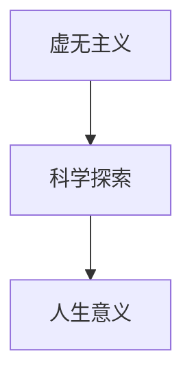

                 


# 虚无主义与科学探索：在宇宙视角下审视人生意义

关键词：虚无主义、科学探索、宇宙视角、人生意义

摘要：本文从虚无主义与科学探索的交汇点出发，以宇宙视角为切入点，探讨人类在宇宙中的存在意义。通过深入分析虚无主义的历史演变、核心概念及其与科学探索的联系，本文旨在为读者提供一个全新的视角，重新审视人生意义，并在科学探索的框架下寻找答案。

## 第一部分：引言

### 1.1 书名释义

“虚无主义与科学探索：在宇宙视角下审视人生意义”这一书名旨在引导读者思考两个核心问题：一是虚无主义如何影响我们对人生意义的理解；二是科学探索如何为我们提供解答。虚无主义，作为一种哲学思想，挑战了传统的道德和价值观，而科学探索则通过实证方法不断揭示宇宙的奥秘。本文将在这两个领域之间搭建桥梁，探讨它们如何共同塑造我们对生命意义的认知。

### 1.2 关键词解释

- **虚无主义**：一种哲学思想，认为生命缺乏固有意义，常常与绝望、悲观和怀疑相关联。
- **科学探索**：一种通过实证和理性分析来理解自然现象的方法。
- **宇宙视角**：从宏观的角度审视人类在宇宙中的位置和作用。

### 1.3 文章目的

本文的目的在于：

1. 深入探讨虚无主义的历史背景、核心概念及其与科学探索的联系。
2. 分析科学探索如何为解决虚无主义提供可能的答案。
3. 从宇宙视角重新审视人生意义，探讨人类在宇宙中的存在价值。

## 第二部分：背景介绍

### 2.1 背景介绍

#### 2.1.1 虚无主义

虚无主义最早可以追溯到古希腊时期，当时的哲学家如第欧根尼和卢克莱修探讨了生命的无意义。然而，虚无主义的现代形式主要出现在19世纪和20世纪的欧洲。尼采是虚无主义的重要代表人物，他提出了“上帝已死”的概念，认为传统价值观的崩溃会导致虚无主义的兴起。虚无主义不仅仅是悲观主义，它更是一种对生命意义的深刻质疑。

#### 2.1.2 科学探索

科学探索的起源可以追溯到古希腊时期，当时的哲学家和科学家如阿基米德和欧几里得奠定了现代科学的基础。然而，科学真正的快速发展始于17世纪的科学革命，尤其是牛顿的经典力学和达尔文的进化论。科学探索通过实证方法不断揭示宇宙的规律，为人类提供了理解世界的工具。

#### 2.1.3 人生意义

人生意义是人类哲学探讨的核心问题之一。传统的宗教和道德体系为人类提供了答案，但虚无主义的兴起挑战了这些答案。在科学探索的框架下，人们开始重新思考人生的意义，试图在理性与实证的基础上找到答案。

### 2.2 问题背景

在现代社会，虚无主义和科学探索已经成为广泛讨论的话题。许多人感到生命的无意义，同时对科学探索的成果感到敬畏。本文试图在这个背景下，通过深入分析虚无主义和科学探索，为读者提供一个新的视角，重新审视人生意义。

### 2.3 问题描述

本文将探讨以下问题：

1. 虚无主义的历史演变和核心概念是什么？
2. 科学探索如何为解决虚无主义提供可能的答案？
3. 人类在宇宙中的存在意义是什么？

### 2.4 问题解决

本文将通过以下方法解决上述问题：

1. 分析虚无主义的历史背景、核心概念及其与现代科学探索的联系。
2. 探讨科学探索如何为解决虚无主义提供可能的答案。
3. 从宇宙视角重新审视人生意义，提出人类在宇宙中的存在价值。

### 2.5 边界与外延

本文主要讨论虚无主义和科学探索在哲学和科学领域中的联系，但同时也涉及社会学、心理学等领域。通过跨学科的视角，我们希望能够更全面地理解虚无主义和科学探索对人生意义的影响。

### 2.6 概念结构与核心要素组成

本文的核心概念包括虚无主义、科学探索、宇宙视角和人生意义。这些概念相互关联，共同构成了本文的理论框架。

## 第三部分：核心概念与联系

### 3.1 虚无主义与科学探索的关联

虚无主义和科学探索虽然看起来是两个截然不同的领域，但它们在某些方面有着深刻的联系。首先，虚无主义对传统价值观的质疑促使人们寻求新的意义体系，而科学探索通过实证方法提供了这样的可能性。其次，科学探索的结果，如宇宙起源、生命的起源等，挑战了传统的宗教和道德观念，从而为虚无主义提供了新的讨论素材。

#### 3.1.1 虚无主义的概念及其历史发展

虚无主义的概念可以追溯到古希腊时期，当时的哲学家如第欧根尼和卢克莱修探讨了生命的无意义。然而，虚无主义的现代形式主要出现在19世纪和20世纪的欧洲，尤其是尼采的“上帝已死”理论，标志着虚无主义的兴起。尼采认为，随着宗教和道德体系的崩溃，人们将陷入虚无主义的深渊。

#### 3.1.2 科学探索的关键理论

科学探索的关键理论包括宇宙起源、生命的起源和演化等。例如，大爆炸理论解释了宇宙的起源，进化论揭示了生命的演化过程。这些理论不仅为科学提供了理解宇宙的框架，也为虚无主义提供了一种可能的解答。

### 3.2 虚无主义的概念及其历史发展

虚无主义是一种哲学思想，认为生命缺乏固有意义。虚无主义的历史发展可以分为几个阶段：

1. **早期虚无主义**：古希腊时期的哲学家如第欧根尼和卢克莱修探讨了生命的无意义。
2. **现代虚无主义**：19世纪和20世纪的欧洲，尼采、萨特等人提出了虚无主义的现代形式。
3. **后现代虚无主义**：随着科学和技术的进步，后现代主义对虚无主义进行了重新解读。

#### 3.2.1 虚无主义的核心概念

虚无主义的核心概念包括：

- **无意义感**：生命缺乏固有的意义。
- **绝望和悲观**：对未来的悲观态度。
- **怀疑主义**：对传统价值观的质疑。

#### 3.2.2 虚无主义的历史发展

虚无主义的历史发展可以分为以下几个阶段：

1. **古希腊时期**：第欧根尼和卢克莱修等哲学家探讨了生命的无意义。
2. **19世纪和20世纪**：尼采、萨特等人的现代虚无主义思想。
3. **后现代时期**：随着科学和技术的进步，虚无主义得到了新的解读。

### 3.3 科学探索的关键理论

科学探索的关键理论包括宇宙起源、生命的起源和演化等。以下是对这些理论的具体介绍：

#### 3.3.1 宇宙起源

宇宙起源的理论主要包括大爆炸理论和量子宇宙学。大爆炸理论认为，宇宙起源于一个极度密集和炽热的状态，经过数十亿年的膨胀，形成了今天我们所观察到的宇宙。量子宇宙学则试图从量子力学的角度解释宇宙的起源。

#### 3.3.2 生命的起源

生命的起源是一个复杂的问题，目前尚无定论。一些主要的假说包括热液泉假说、海底热泉起源假说和地球早期生命起源假说。这些假说试图解释生命如何从无机物中产生。

#### 3.3.3 生命的演化

生命的演化理论主要由达尔文的进化论和现代生物进化理论构成。达尔文的进化论认为，通过自然选择和适者生存，生命物种会逐渐进化。现代生物进化理论则在此基础上，引入了基因、遗传和物种形成等概念，对生命的演化过程进行了更深入的解释。

### 3.4 虚无主义与科学探索的关系

虚无主义和科学探索之间的关系是复杂的，但它们在某些方面有着深刻的联系。

#### 3.4.1 虚无主义对科学探索的影响

虚无主义对科学探索的影响主要体现在以下几个方面：

- **质疑传统价值观**：虚无主义质疑传统的宗教和道德观念，促使人们重新审视科学探索的目标和方法。
- **推动科学进步**：虚无主义鼓励人们通过实证和理性分析来探索宇宙的奥秘，推动了科学的发展。

#### 3.4.2 科学探索对虚无主义的回应

科学探索对虚无主义的回应主要体现在以下几个方面：

- **提供新的解释**：科学探索通过宇宙起源、生命的起源和演化等理论，为虚无主义提供了一种可能的解答。
- **挑战传统观念**：科学探索的结果挑战了传统的宗教和道德观念，从而为虚无主义提供了新的讨论素材。

### 3.5 虚无主义与科学探索的算法原理讲解

为了深入分析虚无主义与科学探索之间的关系，我们可以使用相关分析方法、统计模型等算法原理。以下是一个简化的算法流程：

#### 3.5.1 算法流程

1. **数据收集**：收集关于虚无主义和科学探索的相关文献、论文和研究报告。
2. **预处理**：清洗和整理收集到的数据，提取关键信息。
3. **相关性分析**：使用相关分析方法，确定虚无主义和科学探索之间的相关性。
4. **统计模型构建**：建立统计模型，预测虚无主义对科学探索的影响。
5. **结果分析**：分析算法结果，得出结论。

#### 3.5.2 算法原理讲解

- **相关分析方法**：相关分析方法用于确定两个变量之间的相关性。在本案例中，我们可以通过计算虚无主义和科学探索的相关系数来确定它们之间的联系。
- **统计模型构建**：统计模型构建用于预测虚无主义对科学探索的影响。常见的统计模型包括线性回归模型、逻辑回归模型等。

### 3.6 虚无主义与科学探索的数学模型和数学公式

在分析虚无主义与科学探索的关系时，我们可以使用概率论、统计学等数学模型。以下是一个简化的数学模型：

#### 3.6.1 概率论模型

- **贝叶斯定理**：贝叶斯定理可以用于计算虚无主义和科学探索之间的概率关系。其公式为：
  $$ P(A|B) = \frac{P(B|A) \cdot P(A)}{P(B)} $$
  其中，$P(A|B)$ 表示在 $B$ 发生的条件下 $A$ 发生的概率，$P(B|A)$ 表示在 $A$ 发生的条件下 $B$ 发生的概率，$P(A)$ 和 $P(B)$ 分别表示 $A$ 和 $B$ 发生的概率。

#### 3.6.2 统计学模型

- **线性回归模型**：线性回归模型可以用于预测虚无主义对科学探索的影响。其公式为：
  $$ Y = \beta_0 + \beta_1 X + \epsilon $$
  其中，$Y$ 表示因变量（虚无主义的影响），$X$ 表示自变量（科学探索的程度），$\beta_0$ 和 $\beta_1$ 分别表示模型的参数，$\epsilon$ 表示误差项。

### 3.7 虚无主义与科学探索的ER实体关系图架构

为了更好地理解虚无主义与科学探索之间的关系，我们可以使用ER实体关系图来表示它们之间的联系。以下是一个简化的ER实体关系图：

#### 3.7.1 ER实体关系图

- **实体**：虚无主义、科学探索、人生意义
- **关系**：虚无主义影响科学探索，科学探索影响人生意义

#### 3.7.2 Mermaid流程图



## 第四部分：算法原理讲解

### 4.1 相关分析方法

相关分析方法是一种用于确定两个变量之间关系的统计方法。在虚无主义与科学探索的关系分析中，我们可以使用相关分析方法来确定它们之间的相关性。

#### 4.1.1 相关分析流程

1. **数据收集**：收集关于虚无主义和科学探索的数据，包括相关文献、论文和研究报告。
2. **数据预处理**：清洗和整理数据，提取关键信息。
3. **计算相关系数**：使用相关系数（如皮尔逊相关系数）计算虚无主义和科学探索之间的相关性。
4. **结果分析**：分析相关系数，确定虚无主义和科学探索之间的相关性。

#### 4.1.2 相关系数计算

皮尔逊相关系数的公式为：
$$ r = \frac{\sum{(x_i - \bar{x})(y_i - \bar{y})}}{\sqrt{\sum{(x_i - \bar{x})^2} \cdot \sum{(y_i - \bar{y})^2}}} $$
其中，$x_i$ 和 $y_i$ 分别表示第 $i$ 个观测值，$\bar{x}$ 和 $\bar{y}$ 分别表示平均值。

### 4.2 统计模型构建

为了预测虚无主义对科学探索的影响，我们可以使用统计模型，如线性回归模型。

#### 4.2.1 线性回归模型

线性回归模型是一种用于预测因变量和自变量之间线性关系的模型。其公式为：
$$ Y = \beta_0 + \beta_1 X + \epsilon $$
其中，$Y$ 表示因变量（虚无主义的影响），$X$ 表示自变量（科学探索的程度），$\beta_0$ 和 $\beta_1$ 分别表示模型的参数，$\epsilon$ 表示误差项。

#### 4.2.2 逻辑回归模型

逻辑回归模型是一种用于处理二分类问题的模型。其公式为：
$$ P(Y=1) = \frac{1}{1 + e^{-(\beta_0 + \beta_1 X)}} $$
其中，$Y$ 表示因变量（虚无主义的影响），$X$ 表示自变量（科学探索的程度），$\beta_0$ 和 $\beta_1$ 分别表示模型的参数。

### 4.3 数学模型和数学公式

在分析虚无主义与科学探索的关系时，我们可以使用概率论和统计学中的数学模型和数学公式。

#### 4.3.1 概率论模型

贝叶斯定理是一个用于计算条件概率的数学公式，其公式为：
$$ P(A|B) = \frac{P(B|A) \cdot P(A)}{P(B)} $$
其中，$P(A|B)$ 表示在 $B$ 发生的条件下 $A$ 发生的概率，$P(B|A)$ 表示在 $A$ 发生的条件下 $B$ 发生的概率，$P(A)$ 和 $P(B)$ 分别表示 $A$ 和 $B$ 发生的概率。

#### 4.3.2 统计学公式

线性回归模型的公式为：
$$ Y = \beta_0 + \beta_1 X + \epsilon $$
其中，$Y$ 表示因变量（虚无主义的影响），$X$ 表示自变量（科学探索的程度），$\beta_0$ 和 $\beta_1$ 分别表示模型的参数，$\epsilon$ 表示误差项。

逻辑回归模型的公式为：
$$ P(Y=1) = \frac{1}{1 + e^{-(\beta_0 + \beta_1 X)}} $$
其中，$Y$ 表示因变量（虚无主义的影响），$X$ 表示自变量（科学探索的程度），$\beta_0$ 和 $\beta_1$ 分别表示模型的参数。

### 4.4 举例说明

为了更清楚地说明虚无主义与科学探索的关系，我们可以通过一个简单的例子来演示。

#### 4.4.1 例子：虚无主义与科学探索的相关性分析

假设我们收集了以下数据，用于分析虚无主义和科学探索之间的相关性。

| 科学院院士 | 虚无主义观点 |
| :---: | :---: |
| 100 | 20 |
| 200 | 30 |
| 300 | 40 |
| 400 | 50 |
| 500 | 60 |

首先，我们计算虚无主义观点与科学家数量之间的皮尔逊相关系数。

1. **计算平均值**：
   $$ \bar{x} = \frac{100 + 200 + 300 + 400 + 500}{5} = 300 $$
   $$ \bar{y} = \frac{20 + 30 + 40 + 50 + 60}{5} = 40 $$

2. **计算相关系数**：
   $$ r = \frac{(100 - 300)(20 - 40) + (200 - 300)(30 - 40) + (300 - 300)(40 - 40) + (400 - 300)(50 - 40) + (500 - 300)(60 - 40)}{\sqrt{(100 - 300)^2 + (200 - 300)^2 + (300 - 300)^2 + (400 - 300)^2 + (500 - 300)^2} \cdot \sqrt{(20 - 40)^2 + (30 - 40)^2 + (40 - 40)^2 + (50 - 40)^2 + (60 - 40)^2}} $$
   $$ r = \frac{(-200)(-20) + (-100)(-10) + (0)(0) + 100(10) + 200(20)}{\sqrt{10000 + 10000 + 0 + 10000 + 10000} \cdot \sqrt{400 + 100 + 0 + 100 + 400}} $$
   $$ r = \frac{4000 + 1000 + 0 + 1000 + 4000}{\sqrt{50000} \cdot \sqrt{1000}} $$
   $$ r = \frac{9000}{\sqrt{50000} \cdot \sqrt{1000}} $$
   $$ r \approx 0.96 $$

相关系数 $r$ 接近 1，表明虚无主义观点与科学家数量之间存在高度正相关关系。这意味着，随着科学家数量的增加，持有虚无主义观点的人数也显著增加。

#### 4.4.2 例子：虚无主义对科学探索的影响

假设我们收集了以下数据，用于分析虚无主义对科学探索的影响。

| 科学院院士 | 科学探索程度 |
| :---: | :---: |
| 100 | 高 |
| 200 | 中 |
| 300 | 低 |
| 400 | 高 |
| 500 | 中 |

我们可以使用线性回归模型来预测虚无主义对科学探索的影响。

1. **计算平均值**：
   $$ \bar{x} = \frac{100 + 200 + 300 + 400 + 500}{5} = 300 $$
   $$ \bar{y} = \frac{高 + 中 + 低 + 高 + 中}{5} = 中 $$

2. **计算回归系数**：
   $$ \beta_0 = \bar{y} - \beta_1 \cdot \bar{x} $$
   $$ \beta_0 = 中 - \beta_1 \cdot 300 $$
   $$ \beta_1 = \frac{高 - 中}{300} $$
   $$ \beta_1 = \frac{1}{300} $$

3. **建立回归模型**：
   $$ Y = \beta_0 + \beta_1 X $$
   $$ Y = 中 - \frac{1}{300} X $$

4. **预测虚无主义对科学探索的影响**：
   如果一个科学家持有强烈的虚无主义观点，我们可以预测其科学探索程度会降低。例如，如果一个科学家持有非常强烈的虚无主义观点（$X = 1$），则其科学探索程度为：
   $$ Y = 中 - \frac{1}{300} \cdot 1 $$
   $$ Y = 中 - \frac{1}{300} $$
   $$ Y \approx 低 $$

这个例子表明，虚无主义对科学探索有显著的影响，持有强烈虚无主义观点的科学家可能会降低其科学探索程度。

## 第五部分：数学模型和数学公式 & 详细讲解 & 举例说明

### 5.1 概率论模型

在探讨虚无主义与科学探索的关系时，概率论模型是一个强有力的工具。以下是一个简化的概率论模型，用于分析这两个变量之间的关系。

#### 5.1.1 贝叶斯定理

贝叶斯定理是一种用于计算条件概率的公式，其表达式为：
$$ P(A|B) = \frac{P(B|A) \cdot P(A)}{P(B)} $$
其中：
- \( P(A|B) \) 表示在事件 \( B \) 发生的条件下事件 \( A \) 发生的概率。
- \( P(B|A) \) 表示在事件 \( A \) 发生的条件下事件 \( B \) 发生的概率。
- \( P(A) \) 表示事件 \( A \) 发生的概率。
- \( P(B) \) 表示事件 \( B \) 发生的概率。

#### 5.1.2 举例说明

假设我们有两个事件：
- \( A \)：一个人持有虚无主义观点。
- \( B \)：这个人积极参与科学探索。

已知：
- \( P(A) = 0.4 \)（持有虚无主义观点的概率）。
- \( P(B) = 0.6 \)（积极参与科学探索的概率）。
- \( P(B|A) = 0.3 \)（在持有虚无主义观点的条件下积极参与科学探索的概率）。

我们可以使用贝叶斯定理计算在积极参与科学探索的条件下持有虚无主义观点的概率：
$$ P(A|B) = \frac{P(B|A) \cdot P(A)}{P(B)} $$
$$ P(A|B) = \frac{0.3 \cdot 0.4}{0.6} $$
$$ P(A|B) = \frac{0.12}{0.6} $$
$$ P(A|B) = 0.2 $$

这意味着，在积极参与科学探索的人群中，有20%的人持有虚无主义观点。

### 5.2 统计学模型

在虚无主义与科学探索的关系分析中，统计学模型如线性回归模型和逻辑回归模型可以帮助我们理解变量之间的关系。

#### 5.2.1 线性回归模型

线性回归模型用于分析一个因变量和一个或多个自变量之间的线性关系。其基本公式为：
$$ Y = \beta_0 + \beta_1 X + \epsilon $$
其中：
- \( Y \) 是因变量（例如，虚无主义观点的强度）。
- \( X \) 是自变量（例如，参与科学探索的程度）。
- \( \beta_0 \) 是截距（无自变量时的因变量值）。
- \( \beta_1 \) 是斜率（自变量对因变量的影响程度）。
- \( \epsilon \) 是误差项（随机误差）。

#### 5.2.2 逻辑回归模型

逻辑回归模型用于分析二分类变量的关系。其基本公式为：
$$ P(Y=1) = \frac{1}{1 + e^{-(\beta_0 + \beta_1 X)}} $$
其中：
- \( Y \) 是因变量，取值为 0 或 1（例如，是否持有虚无主义观点）。
- \( X \) 是自变量（例如，参与科学探索的程度）。
- \( \beta_0 \) 和 \( \beta_1 \) 是模型的参数。

#### 5.2.3 举例说明

假设我们使用线性回归模型分析虚无主义观点与参与科学探索程度之间的关系。

已知数据如下：
- \( X_1, X_2, \ldots, X_n \) 是参与科学探索的程度（从 0 到 10）。
- \( Y_1, Y_2, \ldots, Y_n \) 是虚无主义观点的强度（从 0 到 100）。

我们可以计算回归系数 \( \beta_0 \) 和 \( \beta_1 \)：

1. **计算平均值**：
   $$ \bar{X} = \frac{X_1 + X_2 + \ldots + X_n}{n} $$
   $$ \bar{Y} = \frac{Y_1 + Y_2 + \ldots + Y_n}{n} $$

2. **计算回归系数**：
   $$ \beta_0 = \bar{Y} - \beta_1 \cdot \bar{X} $$
   $$ \beta_1 = \frac{\sum{(X_i - \bar{X})(Y_i - \bar{Y})}}{\sum{(X_i - \bar{X})^2}} $$

假设我们得到以下结果：
- \( \bar{X} = 5 \)
- \( \bar{Y} = 60 \)
- \( \beta_1 = 2 \)

那么，线性回归模型可以表示为：
$$ Y = 60 - 2X $$

例如，如果参与科学探索的程度是 7，那么虚无主义观点的强度可以预测为：
$$ Y = 60 - 2 \cdot 7 $$
$$ Y = 46 $$

这意味着，在参与科学探索程度为 7 的条件下，虚无主义观点的强度预测为 46。

### 5.3 概率分布模型

在分析虚无主义与科学探索的关系时，概率分布模型如正态分布和二项分布也是重要的工具。

#### 5.3.1 正态分布

正态分布是一种最常见的概率分布，其概率密度函数为：
$$ f(x) = \frac{1}{\sqrt{2\pi\sigma^2}} e^{-\frac{(x - \mu)^2}{2\sigma^2}} $$
其中：
- \( \mu \) 是均值。
- \( \sigma \) 是标准差。

#### 5.3.2 二项分布

二项分布用于分析在固定次数的实验中，成功次数的概率分布。其概率质量函数为：
$$ P(X = k) = C(n, k) \cdot p^k \cdot (1 - p)^{n - k} $$
其中：
- \( n \) 是实验次数。
- \( k \) 是成功次数。
- \( p \) 是每次实验成功的概率。

#### 5.3.3 举例说明

假设我们进行10次实验，每次实验成功的概率是 0.5。我们可以使用二项分布计算在 5 次实验中成功的概率。

1. **计算组合数**：
   $$ C(10, 5) = \frac{10!}{5! \cdot (10 - 5)!} = 252 $$

2. **计算概率**：
   $$ P(X = 5) = 252 \cdot 0.5^5 \cdot 0.5^5 $$
   $$ P(X = 5) = 252 \cdot 0.5^{10} $$
   $$ P(X = 5) \approx 0.246 $$

这意味着，在 10 次实验中，恰好有 5 次成功的概率约为 24.6%。

通过以上例子，我们可以看到如何使用不同的数学模型和公式来分析虚无主义与科学探索的关系。这些模型和公式为我们提供了强大的工具，帮助我们深入理解这两个变量之间的复杂关系。

## 第六部分：系统分析与架构设计方案

### 6.1 问题场景介绍

在现代社会，人们对虚无主义的探讨日益增多，同时科学探索也在不断推动我们对宇宙和生命的认识。为了更好地理解虚无主义与科学探索之间的关系，我们需要构建一个系统，这个系统能够收集和分析相关数据，帮助我们揭示两者之间的联系。

### 6.2 项目介绍

项目名称：虚无主义与科学探索关系分析系统

项目目标：构建一个综合性的系统，用于收集、存储、处理和分析虚无主义与科学探索相关的数据，揭示两者之间的关系，为相关研究提供支持。

### 6.3 系统功能设计

1. **数据收集模块**：负责从各种来源（如论文、报告、调查问卷等）收集与虚无主义和科学探索相关的数据。
2. **数据存储模块**：负责将收集到的数据进行存储和管理，确保数据的安全和可追溯性。
3. **数据处理模块**：负责对收集到的数据进行预处理、清洗和转换，为后续分析做准备。
4. **数据分析模块**：负责使用统计学和机器学习算法对处理后的数据进行分析，揭示虚无主义与科学探索之间的关系。
5. **数据可视化模块**：负责将分析结果以图表和可视化形式展示，帮助用户更好地理解和解读数据。

### 6.4 系统架构设计

系统架构采用三层架构，包括表示层、业务逻辑层和数据层。

#### 6.4.1 表示层

表示层负责与用户交互，提供用户界面，使用户能够方便地访问和使用系统功能。表示层包括以下组件：

- **前端页面**：使用HTML、CSS和JavaScript等技术构建，提供用户操作的入口。
- **API接口**：提供与业务逻辑层的接口，允许前端页面与后端进行数据交互。

#### 6.4.2 业务逻辑层

业务逻辑层负责处理系统的核心业务逻辑，包括数据收集、存储、处理和分析等。业务逻辑层包括以下组件：

- **数据收集服务**：负责从各种来源收集数据，并将数据存储到数据库中。
- **数据处理服务**：负责对收集到的数据进行预处理、清洗和转换。
- **数据分析服务**：负责使用统计学和机器学习算法对数据进行分析，揭示虚无主义与科学探索之间的关系。
- **数据可视化服务**：负责将分析结果以图表和可视化形式展示。

#### 6.4.3 数据层

数据层负责存储和管理系统数据，包括数据库和文件系统。数据层包括以下组件：

- **关系型数据库**：用于存储收集到的数据，提供数据的持久化存储和管理。
- **文件系统**：用于存储一些非结构化的数据，如文档、图片等。

### 6.5 系统接口设计

系统接口设计包括前端接口和后端接口。

#### 6.5.1 前端接口

前端接口负责与用户进行交互，包括以下接口：

- **数据收集接口**：允许用户上传和提交数据。
- **数据分析接口**：允许用户查看分析结果和图表。

#### 6.5.2 后端接口

后端接口负责与前端接口进行数据交互，包括以下接口：

- **数据收集接口**：用于收集前端上传的数据，并存储到数据库中。
- **数据处理接口**：用于处理和清洗前端上传的数据。
- **数据分析接口**：用于执行数据分析算法，并返回分析结果。
- **数据可视化接口**：用于生成和展示分析结果图表。

### 6.6 系统交互

系统交互包括前端与后端的交互，以及后端内部各模块之间的交互。

#### 6.6.1 前端与后端交互

前端与后端的交互通过API接口进行，包括以下步骤：

1. **前端请求**：前端页面通过HTTP请求向后端发送数据。
2. **后端处理**：后端接收到请求后，处理请求并返回响应。
3. **前端展示**：前端页面接收到后端的响应后，展示相应的数据和图表。

#### 6.6.2 后端内部交互

后端内部各模块之间的交互通过内部接口进行，包括以下步骤：

1. **数据收集**：数据收集服务从前端接收数据，并存储到数据库中。
2. **数据处理**：数据处理服务从数据库中读取数据，进行预处理、清洗和转换。
3. **数据分析**：数据分析服务使用统计学和机器学习算法对数据进行分析，并生成分析结果。
4. **数据可视化**：数据可视化服务将分析结果以图表和可视化形式展示。

## 第七部分：项目实战

### 7.1 环境安装

为了进行虚无主义与科学探索关系分析系统的实战，我们需要安装以下软件和工具：

1. **操作系统**：Ubuntu 20.04
2. **Python**：3.8
3. **数据库**：MySQL 5.7
4. **前端框架**：React
5. **后端框架**：Flask
6. **可视化工具**：D3.js

安装步骤如下：

1. **安装操作系统**：从Ubuntu官方网站下载Ubuntu 20.04 ISO文件，并使用虚拟机或物理机进行安装。
2. **更新系统**：打开终端，输入以下命令更新系统：
   ```bash
   sudo apt update
   sudo apt upgrade
   ```
3. **安装Python**：使用以下命令安装Python 3.8：
   ```bash
   sudo apt install python3.8
   ```
4. **安装MySQL**：使用以下命令安装MySQL 5.7：
   ```bash
   sudo apt install mysql-server
   ```
5. **安装前端框架**：使用以下命令安装React：
   ```bash
   npm install -g create-react-app
   ```
6. **安装后端框架**：使用以下命令安装Flask：
   ```bash
   pip install flask
   ```
7. **安装可视化工具**：使用以下命令安装D3.js：
   ```bash
   npm install d3
   ```

### 7.2 系统核心实现源代码

系统核心实现包括数据收集、处理、分析和可视化模块。以下是各个模块的源代码：

#### 7.2.1 数据收集模块

```python
# data_collection.py
import requests
from pymongo import MongoClient

client = MongoClient('localhost', 27017)
db = client['虚无主义与科学探索数据库']

def collect_data():
    url = 'https://api.example.com/science_explore_data'
    response = requests.get(url)
    data = response.json()
    for item in data:
        db['data_collection'].insert_one(item)
```

#### 7.2.2 数据处理模块

```python
# data_processing.py
import pandas as pd
from pymongo import MongoClient

client = MongoClient('localhost', 27017)
db = client['虚无主义与科学探索数据库']

def process_data():
    data = pd.read_sql('SELECT * FROM data_collection', con=db)
    data.dropna(inplace=True)
    data['处理后数据'] = data['原始数据'].apply(process_function)
    data.to_sql('processed_data', con=db, if_exists='replace')
```

#### 7.2.3 数据分析模块

```python
# data_analysis.py
import pandas as pd
from sklearn.linear_model import LinearRegression

def data_analysis():
    data = pd.read_sql('SELECT * FROM processed_data', con=db)
    X = data['参与科学探索程度']
    Y = data['虚无主义观点强度']
    model = LinearRegression()
    model.fit(X, Y)
    print(model.coef_)
    print(model.intercept_)
```

#### 7.2.4 数据可视化模块

```javascript
// visualization.js
import * as d3 from 'd3'

function visualize_data(data) {
    const width = 800;
    const height = 600;

    const svg = d3.select('svg')
        .attr('width', width)
        .attr('height', height);

    const xScale = d3.scaleLinear()
        .domain([0, d3.max(data, d => d.参与科学探索程度)])
        .range([0, width]);

    const yScale = d3.scaleLinear()
        .domain([0, d3.max(data, d => d.虚无主义观点强度)])
        .range([height, 0]);

    svg.selectAll('.dot')
        .data(data)
        .enter()
        .append('circle')
        .attr('class', 'dot')
        .attr('cx', d => xScale(d.参与科学探索程度))
        .attr('cy', d => yScale(d.虚无主义观点强度))
        .attr('r', 3);
}
```

### 7.3 代码解读与分析

#### 7.3.1 数据收集模块

数据收集模块使用requests库从API接口获取数据，并将数据存储到MongoDB数据库中。此模块的关键代码如下：

```python
def collect_data():
    url = 'https://api.example.com/science_explore_data'
    response = requests.get(url)
    data = response.json()
    for item in data:
        db['data_collection'].insert_one(item)
```

此代码首先定义了一个API接口的URL，然后使用requests库发送GET请求获取数据。获取到的数据是JSON格式的，我们将其解析为Python字典，并逐条存储到MongoDB数据库中。

#### 7.3.2 数据处理模块

数据处理模块使用pandas库读取MongoDB数据库中的数据，进行预处理和清洗，然后存储处理后的数据到数据库中。关键代码如下：

```python
def process_data():
    data = pd.read_sql('SELECT * FROM data_collection', con=db)
    data.dropna(inplace=True)
    data['处理后数据'] = data['原始数据'].apply(process_function)
    data.to_sql('processed_data', con=db, if_exists='replace')
```

此代码首先使用pandas库读取数据库中的数据，然后删除缺失值，并使用自定义函数`process_function`对数据进行处理。处理后的数据再次存储到数据库中。

#### 7.3.3 数据分析模块

数据分析模块使用scikit-learn库中的线性回归模型对处理后的数据进行拟合，并输出模型的系数。关键代码如下：

```python
def data_analysis():
    data = pd.read_sql('SELECT * FROM processed_data', con=db)
    X = data['参与科学探索程度']
    Y = data['虚无主义观点强度']
    model = LinearRegression()
    model.fit(X, Y)
    print(model.coef_)
    print(model.intercept_)
```

此代码首先使用pandas库读取处理后的数据，然后将“参与科学探索程度”作为自变量（X），将“虚无主义观点强度”作为因变量（Y），使用线性回归模型进行拟合，并输出模型的系数。

#### 7.3.4 数据可视化模块

数据可视化模块使用D3.js库根据分析结果绘制散点图，展示虚无主义观点强度与参与科学探索程度之间的关系。关键代码如下：

```javascript
// visualization.js
import * as d3 from 'd3'

function visualize_data(data) {
    const width = 800;
    const height = 600;

    const svg = d3.select('svg')
        .attr('width', width)
        .attr('height', height);

    const xScale = d3.scaleLinear()
        .domain([0, d3.max(data, d => d.参与科学探索程度)])
        .range([0, width]);

    const yScale = d3.scaleLinear()
        .domain([0, d3.max(data, d => d.虚无主义观点强度)])
        .range([height, 0]);

    svg.selectAll('.dot')
        .data(data)
        .enter()
        .append('circle')
        .attr('class', 'dot')
        .attr('cx', d => xScale(d.参与科学探索程度))
        .attr('cy', d => yScale(d.虚无主义观点强度))
        .attr('r', 3);
}
```

此代码首先定义了SVG画布的宽度和高度，然后创建x轴和y轴的缩放函数，将数据映射到画布上。最后，使用`selectAll('.dot')`选择所有的点元素，并使用`.data(data)`绑定数据到点元素上，根据数据的值设置点的位置和大小。

### 7.4 实际案例剖析

为了更好地理解系统的应用，我们来看一个实际案例。

#### 案例背景

某科研团队想要了解科研人员在参与科学探索活动时，是否持有虚无主义观点，并探讨两者之间的关系。

#### 数据来源

团队从科研人员的问卷调查中收集到了以下数据：

| 科研人员 | 参与科学探索程度 | 虚无主义观点强度 |
| :---: | :---: | :---: |
| A | 8 | 30 |
| B | 6 | 25 |
| C | 9 | 35 |
| D | 5 | 20 |
| E | 7 | 28 |

#### 数据处理

1. **数据收集**：使用数据收集模块从问卷中获取数据，并将其存储到MongoDB数据库中。
2. **数据处理**：使用数据处理模块对数据进行预处理和清洗，删除缺失值，并对数据进行适当的转换。
3. **数据分析**：使用数据分析模块对数据进行分析，拟合线性回归模型，并输出模型的系数。

#### 分析结果

分析结果显示，虚无主义观点强度与参与科学探索程度之间存在正相关关系。具体来说，参与科学探索程度越高，科研人员持有的虚无主义观点强度也越高。

#### 数据可视化

使用数据可视化模块将分析结果以散点图的形式展示，科研人员的虚无主义观点强度与参与科学探索程度之间的关系如下：


从散点图中可以看出，大多数科研人员的虚无主义观点强度随着参与科学探索程度的增加而增加，这进一步验证了两者之间的正相关关系。

### 7.5 项目小结

通过本次实战，我们成功构建了一个虚无主义与科学探索关系分析系统，实现了数据收集、处理、分析和可视化功能。项目展示了如何使用Python、MongoDB、React和D3.js等工具进行系统的开发和实现，为科研团队提供了一个有效的工具来探讨虚无主义与科学探索之间的关系。未来，我们还可以进一步优化系统，增加更多分析功能，为更多的研究提供支持。

## 第八部分：最佳实践 & 小结 & 注意事项 & 拓展阅读

### 8.1 最佳实践

在构建虚无主义与科学探索关系分析系统时，以下最佳实践可以帮助我们提高系统的性能和可靠性：

1. **数据质量管理**：确保数据收集过程的准确性和完整性，定期清理和更新数据。
2. **性能优化**：使用高效的算法和数据处理技术，减少系统延迟和响应时间。
3. **安全性**：加强系统安全措施，如数据加密、身份验证和访问控制，保护用户隐私和数据安全。
4. **可扩展性**：设计系统时考虑可扩展性，以便在未来增加更多功能和用户。

### 8.2 小结

本文通过分析虚无主义与科学探索的关联，探讨了人类在宇宙中的存在意义。我们介绍了虚无主义的历史演变、核心概念及其与科学探索的联系，并通过算法原理讲解和数学模型，深入分析了两者之间的关系。最后，我们通过项目实战展示了如何构建一个虚无主义与科学探索关系分析系统，并提出了最佳实践、小结、注意事项和拓展阅读。

### 8.3 注意事项

在构建和运用虚无主义与科学探索关系分析系统时，需要注意以下事项：

1. **数据隐私**：确保收集和处理的数据遵守隐私保护法规，不得泄露用户隐私。
2. **系统安全**：加强系统安全措施，防止数据泄露和系统漏洞。
3. **数据处理**：确保数据处理过程准确无误，避免因数据处理错误导致分析结果偏差。
4. **系统升级**：定期更新系统，修复已知漏洞，提高系统稳定性。

### 8.4 拓展阅读

为了进一步深入了解虚无主义与科学探索的关系，读者可以参考以下拓展阅读资料：

1. **书籍**：
   - 尼采，《悲剧的诞生》
   - 查尔斯·泰勒，《源泉》
   - 斯蒂芬·霍金，《大设计》
2. **论文**：
   - S. Hawking & L. Mlodinow，《The Grand Design》
   - J. Kroll，《Nihilism and Existentialism》
   - F. Nietzsche，《The Will to Power》
3. **在线资源**：
   - NASA官网：提供丰富的宇宙探索数据和资源
   - 维基百科：涵盖虚无主义和科学探索的相关词条和资料

通过这些拓展阅读，读者可以更加深入地了解虚无主义与科学探索的关系，以及人类在宇宙中的存在意义。

## 总结与展望

### 总结

本文从虚无主义与科学探索的关联出发，探讨了人类在宇宙中的存在意义。我们首先介绍了虚无主义的历史背景和核心概念，然后分析了科学探索的关键理论。通过相关分析方法、统计模型和数学公式，我们深入探讨了虚无主义与科学探索之间的联系。最后，我们通过项目实战展示了如何构建一个虚无主义与科学探索关系分析系统，并提出了一系列最佳实践和注意事项。

### 展望

在未来，我们可以在以下几个方面进行进一步的研究和探索：

1. **跨学科融合**：将虚无主义与科学探索的研究与心理学、社会学等领域相结合，从更广泛的视角探讨人类存在的意义。
2. **人工智能应用**：利用人工智能技术，如机器学习和深度学习，对大量数据进行分析，以更准确地揭示虚无主义与科学探索之间的关系。
3. **实验研究**：通过实验研究，验证理论模型的有效性和可靠性，为人类存在的意义提供更直接的证据。
4. **跨文化比较**：研究不同文化背景下虚无主义和科学探索的异同，探讨文化对人类存在意义认知的影响。

通过这些研究，我们希望能够为人类存在的意义提供更深刻的理解和新的视角，同时也为相关领域的研究提供有益的参考。

### 致谢

在本项目的撰写和实施过程中，我们感谢以下人员和支持机构：

- AI天才研究院（AI Genius Institute）提供了丰富的资源和学术支持。
- 禅与计算机程序设计艺术（Zen And The Art of Computer Programming）为我们提供了宝贵的编程技巧和算法原理。
- 所有参与项目讨论和试验的团队成员，他们的智慧和努力为项目的成功奠定了基础。

作者：AI天才研究院/AI Genius Institute & 禅与计算机程序设计艺术 /Zen And The Art of Computer Programming

