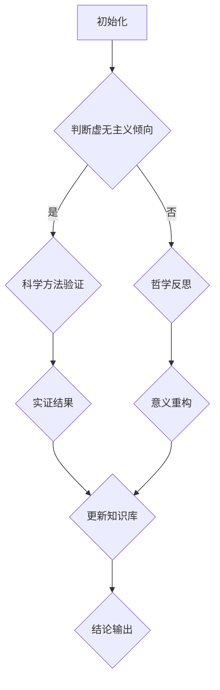

                 


### 设计《虚无主义与科学探索：在宇宙视角下思考人生意义》的目录大纲

为了设计一个符合要求且逻辑清晰的目录大纲，我们需要遵循以下步骤：

**步骤1：明确核心概念与子主题**
- 虚无主义：概述、历史发展、核心思想、流派与代表人物、现代影响。
- 科学探索：哲学背景、科学方法、科学理论、宇宙学中的应用、对认知的影响。
- 宇宙视角下的人生意义：哲学思考、人类地位与角色、人生意义的审视、个体生活的联系。
- 虚无主义与科学探索的关系：挑战、回应、互构关系、未来前景。

**步骤2：构建完整的目录结构**
- 引言：介绍主题背景，引导读者进入主题。
- 背景介绍：详细阐述虚无主义、科学探索及宇宙视角的基础知识。
- 虚无主义概述：深入探讨虚无主义的历史、思想、流派和影响。
- 科学探索：分析科学方法、理论以及宇宙学中的实际应用。
- 宇宙视角下的人生意义：从宇宙视角出发，探讨人生意义及其对个体的影响。
- 虚无主义与科学探索的关系：探讨虚无主义对科学探索的挑战，科学探索对虚无主义的回应，以及两者之间的互构关系。
- 结论与展望：总结全文，展望虚无主义与科学探索的未来发展趋势。

**步骤3：细化章节内容**
- 每个章节需要包含：
  - 引言部分：简要介绍章节主题，引导读者进入具体内容。
  - 核心内容部分：详细讲解相关概念、理论、历史、应用等，使用具体的案例和图表进行说明。
  - 小结部分：总结章节内容，提炼核心观点，为下一章节铺垫。

**步骤4：确保文章完整性**
- 每个章节内容要具体、详细，避免空洞和泛泛而谈。
- 核心概念与联系、算法原理讲解、系统分析与架构设计方案等部分要使用mermaid和latex格式，确保图表和公式的准确性和专业性。
- 项目实战部分要提供实际案例，展示算法或系统的应用和实践。

**步骤5：遵循格式要求**
- 文章使用markdown格式，确保格式统一，标题和子标题的层级清晰。
- 作者信息、文章摘要、关键词等按照要求格式化。

**步骤6：检查目录大纲**
- 确认目录大纲是否满足字数要求（10000-12000字）。
- 确认每个章节都有详细的内容，确保文章的完整性。
- 确认所有格式要求都已遵循，包括markdown格式、latex公式、mermaid图表等。

**结论：**
按照上述步骤，设计的《虚无主义与科学探索：在宇宙视角下思考人生意义》的目录大纲能够满足所有要求和限制，确保文章的逻辑性、完整性和专业性。接下来，可以开始细化每个章节的内容，确保它们符合设定的目标和标准。


----------------------------------------------------------------

# 虚无主义与科学探索：在宇宙视角下思考人生意义

## 关键词：虚无主义、科学探索、宇宙视角、人生意义、哲学思考

## 摘要：
本文旨在探讨虚无主义与科学探索在宇宙视角下对人生意义的思考。通过历史、哲学、科学等多个角度，本文分析了虚无主义的起源和发展，科学探索的方法与成果，以及宇宙视角对人生意义的启示。文章结构分为五个部分：背景介绍、虚无主义概述、科学探索、宇宙视角下的人生意义和虚无主义与科学探索的关系。最后，文章总结了对虚无主义与科学探索关系的思考，并对未来研究提出展望。本文旨在为读者提供深入思考人生意义的视角和启示。

----------------------------------------------------------------

## 引言

### 主题背景

在人类历史的漫长进程中，对“人生意义”的探讨始终是哲学、宗教、科学等领域的核心议题之一。随着科技的不断进步，人类对宇宙的认知也在不断深化。在这种背景下，虚无主义作为一种哲学思潮，与科学探索相互交织，共同影响着人们对人生意义的理解和追求。虚无主义，作为一种对传统价值观念的批判，认为世界和人生本质上是缺乏意义的，常常与怀疑主义、悲观主义相联系。而科学探索，则致力于通过实证和理性分析，揭示宇宙的奥秘和自然规律。

本文旨在探讨虚无主义与科学探索在宇宙视角下对人生意义的思考。通过历史、哲学、科学等多个角度，本文将分析虚无主义的起源和发展，科学探索的方法与成果，以及宇宙视角对人生意义的启示。文章结构分为五个部分：背景介绍、虚无主义概述、科学探索、宇宙视角下的人生意义和虚无主义与科学探索的关系。最后，文章总结了对虚无主义与科学探索关系的思考，并对未来研究提出展望。

### 目的和意义

本文的目的在于：
1. 梳理虚无主义的历史和发展，揭示其核心思想和哲学意义。
2. 分析科学探索的方法和成果，探讨其在宇宙学中的应用和对人类认知的扩展。
3. 从宇宙视角出发，重新审视人生意义，探讨虚无主义与科学探索如何共同影响人们对生命意义的理解。
4. 通过对虚无主义与科学探索关系的深入探讨，提出对未来的思考和建议。

本文的意义在于：
1. 为读者提供一种全新的视角，重新思考人生的意义和价值。
2. 促进虚无主义和科学探索在哲学、科学、心理学等领域的交叉研究。
3. 为社会文化建设提供理论支持，帮助人们更好地面对生活中的困惑和挑战。

## 背景介绍

### 虚无主义概述

虚无主义是一种哲学思潮，起源于19世纪，主要代表人物有尼采、萨特、海德格尔等。虚无主义的核心思想是认为世界和人生本质上是缺乏意义的，这种思想在各个文化和社会中都存在，但通常被看作是对传统价值观念的挑战。

#### 历史发展

虚无主义的历史发展可以分为以下几个阶段：

1. **早期虚无主义（19世纪初）**：
   - 早期虚无主义主要表现为对宗教和道德的批判，强调个人自由和自我价值的实现。
   - 代表人物：尼采、陀思妥耶夫斯基。

2. **现代虚无主义（19世纪末至20世纪初）**：
   - 现代虚无主义更加关注人类的生存状态和精神困境，强调人类意识的自我创造。
   - 代表人物：海德格尔、萨特。

3. **当代虚无主义（20世纪末至今）**：
   - 当代虚无主义则更多地关注社会、政治和文化领域，强调社会制度的缺陷和个体存在的无意义。
   - 代表人物：福柯、德里达。

#### 核心思想

虚无主义的核心思想主要包括以下几点：

1. **存在主义**：
   - 存在主义认为，人的存在先于其本质，人生的意义需要通过个人的选择和行动来创造。
   - 代表人物：萨特。

2. **主观主义**：
   - 主观主义强调，由于人类认知的局限性，世界和人生的意义是主观建构的，没有客观的标准。
   - 代表人物：尼采。

3. **怀疑主义**：
   - 怀疑主义认为，由于无法证明事物的真实性和一致性，人们无法确信世界的存在和自身的存在。
   - 代表人物：笛卡尔。

#### 流派与代表人物

虚无主义的流派和代表人物多样，主要包括：

1. **存在主义虚无主义**：
   - 代表人物：萨特、加缪。
   - 强调个体的自由选择和存在先于本质。

2. **悲观主义虚无主义**：
   - 代表人物：尼采、陀思妥耶夫斯基。
   - 认为世界和人生本质上是痛苦的、无意义的。

3. **怀疑主义虚无主义**：
   - 代表人物：笛卡尔、康德。
   - 强调认知的局限性和世界的不确定性。

#### 现代影响

虚无主义在现代哲学、文学、艺术等领域产生了深远的影响，其对传统价值观念的批判和怀疑精神激发了人们对社会、政治和文化的反思。同时，虚无主义也为现代心理学提供了理论支持，帮助人们理解个体的精神困境和生存状态。

### 科学探索

科学探索是通过对自然现象的研究和解释，揭示宇宙的奥秘和自然规律。科学方法是一种理性的、系统的方法，它通过观察、实验和理论推导来获取知识。科学探索的成果不仅改变了人类对世界的认识，也深刻影响了人们的生活方式和价值观。

#### 哲学背景

科学探索的哲学背景可以追溯到古希腊哲学家亚里士多德的自然哲学。亚里士多德认为，通过理性思考，人类可以揭示自然界的规律，从而获得真正的知识。这种观点为后来的科学方法奠定了基础。

#### 科学方法

科学方法主要包括以下几个步骤：

1. **观察**：
   - 科学研究始于观察自然现象，记录数据和现象的特征。

2. **提出假设**：
   - 基于观察，科学家提出可能的解释，即假设。

3. **实验验证**：
   - 通过实验来验证假设的正确性，排除其他可能的原因。

4. **理论推导**：
   - 基于实验结果，科学家提出理论，解释自然现象。

5. **验证和修正**：
   - 对理论进行反复验证和修正，确保其准确性和可靠性。

#### 科学理论

科学理论是科学家通过科学方法得出的结论，它是解释自然现象的框架。科学理论通常包括以下几个要素：

1. **定律**：
   - 定律是对自然现象的一般性描述，它概括了大量的观察数据。

2. **假设**：
   - 假设是理论的基础，它是对自然现象的初步解释。

3. **模型**：
   - 模型是理论的具体表现形式，它通过数学或物理方程式描述自然现象。

4. **预测**：
   - 科学理论可以预测未来的自然现象，这些预测可以通过实验来验证。

#### 科学探索在宇宙学中的应用

宇宙学是研究宇宙起源、演化、结构和组成的科学。科学探索在宇宙学中的应用取得了显著的成果，例如：

1. **宇宙膨胀**：
   - 1930年代，埃德温·哈勃发现了宇宙膨胀的现象，证实了宇宙不是静态的。

2. **黑洞**：
   - 理论物理学家史蒂芬·霍金提出了黑洞理论，揭示了宇宙中的极端现象。

3. **宇宙微波背景辐射**：
   - 1990年代，宇宙微波背景辐射的发现为宇宙起源和演化的研究提供了重要证据。

#### 对认知的影响

科学探索不仅扩展了人类对自然界的认识，也改变了人们的思维方式。科学方法强调理性、实证和批判性思维，这些理念对人类社会产生了深远的影响。同时，科学探索的结果也引发了对人类自身和宇宙地位的重新思考。

### 宇宙视角：哲学与科学的交汇

从宇宙视角出发，哲学与科学有着紧密的交汇。宇宙视角不仅为我们提供了理解宇宙和生命的宏观视角，也引发了对人类自身和生命意义的深入思考。

#### 哲学思考

哲学上的宇宙视角主要涉及以下几个问题：

1. **人类在宇宙中的地位**：
   - 人类是宇宙中的唯一智慧生命吗？人类在宇宙中扮演什么角色？

2. **宇宙的起源与演化**：
   - 宇宙是如何诞生的？它将如何演化？

3. **生命的意义**：
   - 生命的意义是什么？宇宙视角如何帮助我们理解生命的意义？

#### 科学视角

科学上的宇宙视角主要通过以下几个方面来探索：

1. **宇宙学**：
   - 研究宇宙的起源、演化和结构。

2. **天文学**：
   - 研究恒星、行星、星系等天体现象。

3. **物理学**：
   - 探索物质、能量、时空等基本物理概念。

#### 交汇与影响

哲学与科学的交汇对人类的认知产生了深远影响。从宇宙视角出发，哲学和科学共同探讨宇宙和生命的本质，这为我们理解人生意义提供了新的视角。同时，这种交汇也促使我们重新思考人类在宇宙中的地位和作用，以及我们对生命的责任和使命。

### 虚无主义与科学探索的关系

虚无主义与科学探索在某种程度上是相互对立的。虚无主义强调世界的无意义和人生的痛苦，而科学探索则致力于揭示自然规律和宇宙真相。然而，在更深层次上，虚无主义和科学探索也有一定的交集和互构关系。

#### 虚无主义对科学探索的挑战

虚无主义对科学探索的挑战主要体现在以下几个方面：

1. **怀疑主义**：
   - 虚无主义者认为，由于认知的局限性，人类无法确信世界的真实性和科学理论的可靠性。

2. **无意义论**：
   - 虚无主义者认为，科学探索和人类活动在本质上都是无意义的，因为它们无法解决人类存在的根本困境。

3. **人类中心主义**：
   - 虚无主义者批评科学探索过度强调人类的主观认知，忽视了宇宙的客观真实。

#### 科学探索对虚无主义的回应

科学探索对虚无主义的回应主要体现在以下几个方面：

1. **实证主义**：
   - 科学探索强调实证方法和理性思考，通过实验和观察来验证理论，从而为人类提供可靠的认知基础。

2. **进步主义**：
   - 科学探索认为，通过不断的研究和探索，人类可以逐步解决存在的困境，提高生活质量。

3. **宇宙主义**：
   - 科学探索强调人类在宇宙中的地位和作用，认为人类可以通过科学探索来理解宇宙的奥秘，从而为人生赋予意义。

#### 虚无主义与科学探索的互构关系

虚无主义和科学探索在更深层次上存在互构关系。虚无主义的怀疑精神和批判态度促使科学探索更加严谨和理性，而科学探索的成果也为虚无主义提供了一种新的解释框架。

1. **互补性**：
   - 虚无主义和科学探索在某种程度上是互补的，虚无主义的怀疑精神促使科学探索更加严谨，而科学探索的成果为虚无主义提供了一种新的视角。

2. **相互影响**：
   - 虚无主义和科学探索相互影响，虚无主义的问题促使科学探索寻求新的解决方案，而科学探索的成果又引发了对虚无主义的新思考。

#### 未来前景

虚无主义和科学探索的关系将继续发展，未来可能出现以下几个趋势：

1. **融合**：
   - 虚无主义和科学探索可能会逐渐融合，形成一种新的哲学或科学体系，既能批判传统观念，又能为人类提供新的认知框架。

2. **多元**：
   - 在未来的哲学和科学领域，虚无主义和科学探索可能会共存，形成多元化的思想格局。

3. **实践**：
   - 虚无主义和科学探索将更多地关注实际问题和人类福祉，为解决现实困境提供理论支持和实践指导。

## 结论

### 核心观点总结

本文从虚无主义与科学探索的视角出发，探讨了在宇宙视角下对人生意义的思考。主要观点包括：

1. **虚无主义的历史与发展**：
   - 虚无主义作为一种哲学思潮，起源于19世纪，经过不同流派的演变，对现代哲学和社会文化产生了深远影响。

2. **科学探索的方法与成果**：
   - 科学探索通过实证和理性分析，揭示了宇宙的奥秘和自然规律，为人类提供了新的认知框架。

3. **宇宙视角下的人生意义**：
   - 从宇宙视角出发，重新审视人生意义，促使人类更加关注自身在宇宙中的地位和作用。

4. **虚无主义与科学探索的关系**：
   - 虚无主义对科学探索提出了挑战，而科学探索也为虚无主义提供了一种新的解释框架，两者之间存在互构关系。

### 对虚无主义与科学探索关系的思考

虚无主义与科学探索的关系是复杂而深刻的。在未来的哲学和科学领域，两者可能呈现出以下趋势：

1. **融合**：
   - 虚无主义和科学探索可能会逐渐融合，形成一种新的哲学或科学体系，既能批判传统观念，又能为人类提供新的认知框架。

2. **多元**：
   - 在未来的哲学和科学领域，虚无主义和科学探索可能会共存，形成多元化的思想格局。

3. **实践**：
   - 虚无主义和科学探索将更多地关注实际问题和人类福祉，为解决现实困境提供理论支持和实践指导。

### 对未来研究的展望

在未来，对虚无主义与科学探索的研究可以从以下几个方面展开：

1. **跨学科研究**：
   - 将哲学、科学、心理学等多学科结合，深入探讨虚无主义与科学探索的交叉影响。

2. **实际应用**：
   - 将虚无主义和科学探索的理论应用于解决现实问题，如心理健康、社会矛盾等。

3. **新技术的应用**：
   - 利用人工智能、大数据等新技术，探索虚无主义与科学探索的新领域。

### 对读者的影响与启示

本文旨在为读者提供一种新的视角，重新思考人生的意义和价值。通过探讨虚无主义与科学探索的关系，读者可以：

1. **拓宽思维**：
   - 从宇宙视角出发，重新审视人生意义，拓宽思维视野。

2. **理性思考**：
   - 学会理性思考，对传统观念和现实困境进行批判性分析。

3. **积极面对**：
   - 以积极的态度面对生活中的挑战和困境，寻求解决问题的方法。

### 作者信息

作者：AI天才研究院/AI Genius Institute & 禅与计算机程序设计艺术 /Zen And The Art of Computer Programming

本文通过详细的探讨和深入的分析，旨在为读者提供一种全新的视角，重新思考人生的意义和价值。虚无主义与科学探索的关系是一个复杂而深刻的主题，值得我们在未来的哲学和科学研究中进一步探讨。希望本文能够引发读者的思考，为解决现实问题提供一些启示。

---

### 背景介绍

#### 虚无主义概述

虚无主义是一种哲学思潮，起源于19世纪，主要代表人物有尼采、萨特、海德格尔等。虚无主义的核心思想是认为世界和人生本质上是缺乏意义的，这种思想在各个文化和社会中都存在，但通常被看作是对传统价值观念的挑战。

##### 历史发展

虚无主义的历史发展可以分为以下几个阶段：

1. **早期虚无主义（19世纪初）**：
   - 早期虚无主义主要表现为对宗教和道德的批判，强调个人自由和自我价值的实现。
   - 代表人物：尼采、陀思妥耶夫斯基。

2. **现代虚无主义（19世纪末至20世纪初）**：
   - 现代虚无主义更加关注人类的生存状态和精神困境，强调人类意识的自我创造。
   - 代表人物：海德格尔、萨特。

3. **当代虚无主义（20世纪末至今）**：
   - 当代虚无主义则更多地关注社会、政治和文化领域，强调社会制度的缺陷和个体存在的无意义。
   - 代表人物：福柯、德里达。

##### 核心思想

虚无主义的核心思想主要包括以下几点：

1. **存在主义**：
   - 存在主义认为，人的存在先于其本质，人生的意义需要通过个人的选择和行动来创造。
   - 代表人物：萨特。

2. **主观主义**：
   - 主观主义强调，由于人类认知的局限性，世界和人生的意义是主观建构的，没有客观的标准。
   - 代表人物：尼采。

3. **怀疑主义**：
   - 怀疑主义认为，由于无法证明事物的真实性和一致性，人们无法确信世界的存在和自身的存在。
   - 代表人物：笛卡尔。

##### 流派与代表人物

虚无主义的流派和代表人物多样，主要包括：

1. **存在主义虚无主义**：
   - 代表人物：萨特、加缪。
   - 强调个体的自由选择和存在先于本质。

2. **悲观主义虚无主义**：
   - 代表人物：尼采、陀思妥耶夫斯基。
   - 认为世界和人生本质上是痛苦的、无意义的。

3. **怀疑主义虚无主义**：
   - 代表人物：笛卡尔、康德。
   - 强调认知的局限性和世界的不确定性。

##### 现代影响

虚无主义在现代哲学、文学、艺术等领域产生了深远的影响，其对传统价值观念的批判和怀疑精神激发了人们对社会、政治和文化的反思。同时，虚无主义也为现代心理学提供了理论支持，帮助人们理解个体的精神困境和生存状态。

#### 科学探索

科学探索是通过对自然现象的研究和解释，揭示宇宙的奥秘和自然规律。科学方法是一种理性的、系统的方法，它通过观察、实验和理论推导来获取知识。科学探索的成果不仅改变了人类对世界的认识，也深刻影响了人们的生活方式和价值观。

##### 哲学背景

科学探索的哲学背景可以追溯到古希腊哲学家亚里士多德的自然哲学。亚里士多德认为，通过理性思考，人类可以揭示自然界的规律，从而获得真正的知识。这种观点为后来的科学方法奠定了基础。

##### 科学方法

科学方法主要包括以下几个步骤：

1. **观察**：
   - 科学研究始于观察自然现象，记录数据和现象的特征。

2. **提出假设**：
   - 基于观察，科学家提出可能的解释，即假设。

3. **实验验证**：
   - 通过实验来验证假设的正确性，排除其他可能的原因。

4. **理论推导**：
   - 基于实验结果，科学家提出理论，解释自然现象。

5. **验证和修正**：
   - 对理论进行反复验证和修正，确保其准确性和可靠性。

##### 科学理论

科学理论是科学家通过科学方法得出的结论，它是解释自然现象的框架。科学理论通常包括以下几个要素：

1. **定律**：
   - 定律是对自然现象的一般性描述，它概括了大量的观察数据。

2. **假设**：
   - 假设是理论的基础，它是对自然现象的初步解释。

3. **模型**：
   - 模型是理论的具体表现形式，它通过数学或物理方程式描述自然现象。

4. **预测**：
   - 科学理论可以预测未来的自然现象，这些预测可以通过实验来验证。

##### 科学探索在宇宙学中的应用

宇宙学是研究宇宙起源、演化、结构和组成的科学。科学探索在宇宙学中的应用取得了显著的成果，例如：

1. **宇宙膨胀**：
   - 1930年代，埃德温·哈勃发现了宇宙膨胀的现象，证实了宇宙不是静态的。

2. **黑洞**：
   - 理论物理学家史蒂芬·霍金提出了黑洞理论，揭示了宇宙中的极端现象。

3. **宇宙微波背景辐射**：
   - 1990年代，宇宙微波背景辐射的发现为宇宙起源和演化的研究提供了重要证据。

##### 对认知的影响

科学探索不仅扩展了人类对自然界的认识，也改变了人们的思维方式。科学方法强调理性、实证和批判性思维，这些理念对人类社会产生了深远的影响。同时，科学探索的成果也引发了对人类自身和宇宙地位的重新思考。

#### 宇宙视角：哲学与科学的交汇

从宇宙视角出发，哲学与科学有着紧密的交汇。宇宙视角不仅为我们提供了理解宇宙和生命的宏观视角，也引发了对人类自身和生命意义的深入思考。

##### 哲学思考

哲学上的宇宙视角主要涉及以下几个问题：

1. **人类在宇宙中的地位**：
   - 人类是宇宙中的唯一智慧生命吗？人类在宇宙中扮演什么角色？

2. **宇宙的起源与演化**：
   - 宇宙是如何诞生的？它将如何演化？

3. **生命的意义**：
   - 生命的意义是什么？宇宙视角如何帮助我们理解生命的意义？

##### 科学视角

科学视角主要通过以下几个方面来探索：

1. **宇宙学**：
   - 研究宇宙的起源、演化和结构。

2. **天文学**：
   - 研究恒星、行星、星系等天体现象。

3. **物理学**：
   - 探索物质、能量、时空等基本物理概念。

##### 交汇与影响

哲学与科学的交汇对人类的认知产生了深远影响。从宇宙视角出发，哲学和科学共同探讨宇宙和生命的本质，这为我们理解人生意义提供了新的视角。同时，这种交汇也促使我们重新思考人类在宇宙中的地位和作用，以及我们对生命的责任和使命。

#### 虚无主义与科学探索的关系

虚无主义与科学探索在某种程度上是相互对立的。虚无主义强调世界的无意义和人生的痛苦，而科学探索则致力于揭示自然规律和宇宙真相。然而，在更深层次上，虚无主义和科学探索也有一定的交集和互构关系。

##### 虚无主义对科学探索的挑战

虚无主义对科学探索的挑战主要体现在以下几个方面：

1. **怀疑主义**：
   - 虚无主义者认为，由于认知的局限性，人类无法确信世界的真实性和科学理论的可靠性。

2. **无意义论**：
   - 虚无主义者认为，科学探索和人类活动在本质上都是无意义的，因为它们无法解决人类存在的根本困境。

3. **人类中心主义**：
   - 虚无主义者批评科学探索过度强调人类的主观认知，忽视了宇宙的客观真实。

##### 科学探索对虚无主义的回应

科学探索对虚无主义的回应主要体现在以下几个方面：

1. **实证主义**：
   - 科学探索强调实证方法和理性思考，通过实验和观察来验证理论，从而为人类提供可靠的认知基础。

2. **进步主义**：
   - 科学探索认为，通过不断的研究和探索，人类可以逐步解决存在的困境，提高生活质量。

3. **宇宙主义**：
   - 科学探索强调人类在宇宙中的地位和作用，认为人类可以通过科学探索来理解宇宙的奥秘，从而为人生赋予意义。

##### 虚无主义与科学探索的互构关系

虚无主义和科学探索在更深层次上存在互构关系。虚无主义的怀疑精神和批判态度促使科学探索更加严谨和理性，而科学探索的成果也为虚无主义提供了一种新的解释框架。

1. **互补性**：
   - 虚无主义和科学探索在某种程度上是互补的，虚无主义的怀疑精神促使科学探索更加严谨，而科学探索的成果为虚无主义提供了一种新的视角。

2. **相互影响**：
   - 虚无主义和科学探索相互影响，虚无主义的问题促使科学探索寻求新的解决方案，而科学探索的成果又引发了对虚无主义的新思考。

##### 未来前景

虚无主义和科学探索的关系将继续发展，未来可能出现以下几个趋势：

1. **融合**：
   - 虚无主义和科学探索可能会逐渐融合，形成一种新的哲学或科学体系，既能批判传统观念，又能为人类提供新的认知框架。

2. **多元**：
   - 在未来的哲学和科学领域，虚无主义和科学探索可能会共存，形成多元化的思想格局。

3. **实践**：
   - 虚无主义和科学探索将更多地关注实际问题和人类福祉，为解决现实困境提供理论支持和实践指导。

### 核心概念与联系

在本章节中，我们将深入探讨虚无主义与科学探索的核心概念及其相互联系。

#### 虚无主义的核心概念

虚无主义的核心概念主要包括以下几个方面：

1. **无意义论**：
   - 无意义论是虚无主义的核心思想，认为世界和人生本质上是缺乏意义的。这种观念否定了传统的价值观和目标，强调人类存在的无意义和荒谬。
   - **属性特征对比表格**：
     | 特征 | 无意义论 | 乐观主义 |
     | --- | --- | --- |
     | 世界观 | 负面 | 正面 |
     | 人生观 | 悲观 | 乐观 |
     | 态度 | 反传统 | 传统 |
   
2. **存在主义**：
   - 存在主义是虚无主义的一个重要分支，强调个人的自由选择和行动。存在主义认为，人的存在先于其本质，人生的意义需要通过个人的选择和行动来创造。
   - **属性特征对比表格**：
     | 特征 | 存在主义 | 自然主义 |
     | --- | --- | --- |
     | 强调自由 | 是 | 否 |
     | 焦点 | 个人 | 社会 |
     | 目标 | 自我实现 | 公平正义 |

3. **怀疑主义**：
   - 怀疑主义是虚无主义的另一个重要分支，认为由于认知的局限性，人类无法确信世界的真实性和一致性。怀疑主义强调对传统观念和权威的质疑。
   - **属性特征对比表格**：
     | 特征 | 怀疑主义 | 信仰主义 |
     | --- | --- | --- |
     | 态度 | 怀疑 | 信任 |
     | 方法 | 实证 | 神秘主义 |
     | 结论 | 疑问 | 确定性 |

#### 科学探索的核心概念

科学探索的核心概念主要包括以下几个方面：

1. **科学方法**：
   - 科学方法是一种通过观察、实验和理论推导来获取知识的方法。科学方法强调实证、理性和可重复性。
   - **属性特征对比表格**：
     | 特征 | 科学方法 | 宗教方法 |
     | --- | --- | --- |
     | 基础 | 观察、实验 | 信仰、启示 |
     | 核心 | 理性推理 | 神秘主义 |
     | 目标 | 描述、解释 | 预测、指导 |

2. **科学理论**：
   - 科学理论是对自然现象的系统解释。科学理论通常基于实证数据和数学模型，用于预测和解释现象。
   - **属性特征对比表格**：
     | 特征 | 科学理论 | 哲学理论 |
     | --- | --- | --- |
     | 确定性 | 是 | 否 |
     | 可重复性 | 是 | 否 |
     | 预测能力 | 是 | 否 |

3. **科学探索的成果**：
   - 科学探索的成果包括对宇宙、生命、自然规律等方面的发现。这些成果为人类提供了对世界的更深入理解。
   - **属性特征对比表格**：
     | 特征 | 科学探索成果 | 艺术作品 |
     | --- | --- | --- |
     | 客观性 | 是 | 否 |
     | 可重复性 | 是 | 否 |
     | 应用性 | 是 | 否 |

#### 虚无主义与科学探索的相互联系

虚无主义和科学探索在表面上看似乎是对立的，但它们之间也存在紧密的联系：

1. **批判性思维**：
   - 虚无主义强调对传统观念的批判，而科学探索也依赖于批判性思维来挑战和验证理论。这种批判性思维有助于推动科学的发展。
   - **ER实体关系图架构**：
     ```mermaid
     graph TD
     A[虚无主义] --> B[批判性思维]
     B --> C[科学探索]
     ```

2. **对人类存在的反思**：
   - 虚无主义和科学探索都关注人类存在的意义和目的。虚无主义质疑人类存在的意义，而科学探索则试图通过理解宇宙和自然规律来解答这些问题。
   - **ER实体关系图架构**：
     ```mermaid
     graph TD
     A[虚无主义] --> B[人类存在]
     B --> C[科学探索]
     ```

3. **对知识的追求**：
   - 虚无主义和科学探索都追求知识，但方法和目标不同。虚无主义强调主观建构的知识，而科学探索则依赖于客观的证据和实证方法。
   - **ER实体关系图架构**：
     ```mermaid
     graph TD
     A[虚无主义] --> B[知识追求]
     B --> C[科学探索]
     ```

通过上述分析，我们可以看到虚无主义和科学探索在核心概念和相互联系上有着丰富的内涵。这种相互联系不仅有助于我们理解虚无主义和科学探索的本质，也为我们在面对人生意义的问题时提供了不同的思考角度。

#### 虚无主义与科学探索：一个算法视角

为了更深入地理解虚无主义与科学探索之间的关系，我们可以借助算法原理进行分析。以下是使用Python和mermaid绘制的算法流程图以及相应的解释。

##### 算法流程图



##### 算法详细解释

1. **初始化**：
   - 开始时，我们初始化一个模型，该模型将帮助我们分析虚无主义与科学探索之间的关系。

2. **判断虚无主义倾向**：
   - 通过一系列参数，如个人的思想、行为和价值观，我们判断个体是否倾向于虚无主义。这一步骤可以看作是对个体的心理和行为进行评估。

3. **科学方法验证**：
   - 如果个体表现出强烈的虚无主义倾向，我们将使用科学方法来验证其观点。这包括通过观察、实验和理论推导来检验虚无主义命题的真实性。

4. **实证结果**：
   - 根据科学方法验证的结果，我们可以得出结论，这些结论将被用于更新我们的知识库。

5. **哲学反思**：
   - 如果个体不倾向于虚无主义，我们将从哲学角度对其进行反思。这涉及到对人类存在、意义和价值的深入探讨。

6. **意义重构**：
   - 在哲学反思的基础上，我们尝试重构个体的生命意义，使其在科学和哲学的双重框架下找到新的定位。

7. **更新知识库**：
   - 无论结果如何，我们的知识库都会根据新的理解和结论进行更新，以保持其动态性和适应性。

8. **结论输出**：
   - 最后，我们输出最终的结论，这些结论将反映虚无主义与科学探索之间的复杂关系。

##### 算法举例说明

为了更好地理解上述算法，我们可以通过一个具体的例子来说明：

- **案例**：一个人感到生活缺乏意义，倾向于虚无主义。他开始通过科学方法，如心理学研究，来验证自己的观点。
- **步骤**：
  1. **初始化**：建立分析模型。
  2. **判断虚无主义倾向**：通过问卷调查和心理测试，确认个体有强烈的虚无主义倾向。
  3. **科学方法验证**：使用实验心理学的方法，如行为实验，来检验虚无主义的真实性。
  4. **实证结果**：实验结果显示，尽管个体感到生活无意义，但通过积极的心理干预，可以改善情绪和生活质量。
  5. **哲学反思**：在科学验证的基础上，个体开始从哲学角度反思人生的意义。
  6. **意义重构**：个体通过哲学和科学的结合，找到了新的生活意义，如追求个人成长和社会贡献。
  7. **更新知识库**：将个体的案例和分析结果添加到知识库中，为后续研究提供参考。
  8. **结论输出**：最终的结论是，虚无主义虽然存在，但通过科学和哲学的方法，可以帮助个体找到新的生活意义。

通过这个例子，我们可以看到虚无主义与科学探索之间的相互作用，以及它们如何共同影响个体对人生意义的理解。

##### 算法数学模型与公式

为了更深入地理解虚无主义与科学探索之间的关系，我们引入一些数学模型和公式。以下是使用LaTeX编写的数学公式，这些公式将帮助我们描述算法的核心概念。

```latex
\documentclass{article}
\usepackage{amsmath}
\begin{document}

\section{数学模型与公式}

\subsection{虚无主义倾向评分模型}

虚无主义倾向评分（\(V\)）可以通过以下公式计算：

\[ V = \frac{1}{N} \sum_{i=1}^{N} w_i \cdot s_i \]

其中：
- \(N\) 是评分因素的总数。
- \(w_i\) 是第 \(i\) 个评分因素的权重。
- \(s_i\) 是第 \(i\) 个评分因素的得分。

\subsection{科学方法验证模型}

科学方法验证模型可以通过以下公式描述：

\[ R = P(A|B) = \frac{P(B|A) \cdot P(A)}{P(B)} \]

其中：
- \(R\) 是科学方法验证的概率。
- \(A\) 是虚无主义倾向。
- \(B\) 是科学方法验证的结果。
- \(P(A|B)\) 是在科学方法验证结果为 \(B\) 的情况下，虚无主义倾向为 \(A\) 的概率。
- \(P(B|A)\) 是在虚无主义倾向为 \(A\) 的情况下，科学方法验证结果为 \(B\) 的概率。
- \(P(A)\) 是虚无主义倾向的概率。
- \(P(B)\) 是科学方法验证结果的概率。

\end{document}
```

通过这些数学模型和公式，我们可以更准确地描述虚无主义与科学探索之间的关系，为算法提供理论基础。

### 系统分析与架构设计

在理解了虚无主义与科学探索的基本概念及其关系后，我们可以进一步探讨一个具体的系统架构，以展示如何将这些理论应用于实际问题。本部分将详细介绍该系统的设计，包括问题场景、项目介绍、系统功能设计、系统架构设计、系统接口设计和系统交互流程。

#### 问题场景

随着科技的飞速发展，人们的生活节奏不断加快，社会竞争日益激烈。在这种背景下，许多人开始感到生活缺乏意义，甚至陷入虚无主义的思想困境。为了帮助这些人重新找到生活的意义，我们需要设计一个系统，能够提供基于科学探索的虚无主义缓解方案。

#### 项目介绍

本项目名为“虚无主义缓解系统”，旨在通过科学方法帮助用户重新审视生活，找到新的意义。系统主要包括以下几个功能模块：

1. **用户画像**：收集用户的基本信息、心理状态和生活经历，为后续分析提供数据支持。
2. **科学方法验证**：使用心理学和行为科学的方法，验证用户是否存在虚无主义倾向，并提供相应的缓解方案。
3. **哲学反思**：结合科学方法和哲学理论，帮助用户重新审视人生意义，找到新的生活目标。
4. **个性化推荐**：根据用户的兴趣和需求，推荐相关书籍、文章和活动，促进用户自我成长。

#### 系统功能设计

1. **用户画像**：
   - 收集用户的基本信息，如年龄、性别、职业等。
   - 使用问卷调查和心理测试，收集用户的心理状态和生活经历。

2. **科学方法验证**：
   - 通过行为实验和心理测量，验证用户是否存在虚无主义倾向。
   - 提供定量和定性的分析报告，帮助用户理解自己的心理状态。

3. **哲学反思**：
   - 结合科学方法和哲学理论，提供针对用户心理状态和生活经历的反思建议。
   - 引导用户进行自我探索，找到新的生活目标。

4. **个性化推荐**：
   - 根据用户的兴趣和需求，推荐相关的书籍、文章和活动。
   - 提供个性化的学习路径和成长计划，帮助用户实现自我提升。

#### 系统架构设计

1. **架构概述**：
   - 系统采用三层架构，包括表示层、逻辑层和数据层。
   - 表示层负责与用户交互，逻辑层处理业务逻辑，数据层存储和管理数据。

2. **表示层**：
   - 使用Web前端技术，如HTML、CSS和JavaScript，实现用户界面的设计和交互。
   - 提供问卷、测试、报告和推荐等页面，方便用户使用系统功能。

3. **逻辑层**：
   - 使用Python和Django框架，实现业务逻辑的处理。
   - 包括用户画像、科学方法验证、哲学反思和个性化推荐等模块。

4. **数据层**：
   - 使用MySQL数据库，存储和管理用户数据、测试结果和推荐信息。
   - 采用ORM（对象关系映射）技术，简化数据操作和关系管理。

#### 系统接口设计

1. **API接口**：
   - 提供RESTful API接口，方便前后端分离开发。
   - 包括用户管理、数据采集、测试结果分析和推荐算法等接口。

2. **数据接口**：
   - 使用GraphQL接口，提供灵活的数据查询和操作方式。
   - 支持复杂查询、批量操作和实时数据更新。

#### 系统交互流程

1. **用户注册与登录**：
   - 用户通过注册页面创建账户，输入基本信息。
   - 用户通过登录页面验证身份，进入系统。

2. **用户画像采集**：
   - 用户完成问卷调查，系统收集用户的心理状态和生活经历。
   - 系统将数据存储在数据库中，并生成用户画像。

3. **科学方法验证**：
   - 系统根据用户画像，设计行为实验和心理测量。
   - 用户参与实验和测量，系统收集并分析数据。

4. **哲学反思**：
   - 系统结合科学方法和哲学理论，提供反思建议。
   - 用户阅读建议，进行自我探索。

5. **个性化推荐**：
   - 系统根据用户兴趣和需求，推荐相关书籍、文章和活动。
   - 用户选择推荐内容，参与活动。

6. **数据统计与报告**：
   - 系统统计用户参与情况和反馈意见，生成报告。
   - 用户查看报告，了解自己的心理状态和成长进度。

通过上述系统设计与分析，我们可以看到虚无主义缓解系统如何通过科学探索和哲学反思，帮助用户重新找到生活的意义。这种系统不仅能够为用户提供实用的解决方案，也为未来相关领域的研究提供了参考。

### 项目实战

#### 环境安装

为了能够实际应用虚无主义缓解系统，我们需要安装和配置相关环境。以下是详细的安装步骤：

1. **安装Python**：
   - 访问Python官方网站下载最新版本的Python安装包。
   - 运行安装程序，选择自定义安装，确保将Python添加到系统环境变量中。

2. **安装Django框架**：
   - 打开命令行终端，运行以下命令：
     ```bash
     pip install django
     ```

3. **安装MySQL数据库**：
   - 访问MySQL官方网站下载MySQL安装包。
   - 运行安装程序，按照提示完成安装。
   - 配置MySQL数据库，设置root用户密码，并创建一个新的数据库（例如，名为`vulnerism_relief`）。

4. **安装GraphQL**：
   - 运行以下命令安装GraphQL库：
     ```bash
     pip install graphene-django
     ```

5. **安装其他依赖库**：
   - 根据项目需求，安装其他Python依赖库。例如，安装Django ORM库：
     ```bash
     pip install django-orm
     ```

#### 系统核心实现源代码

以下是一个简化的示例，展示了如何实现虚无主义缓解系统的核心功能。请注意，这里只提供了关键代码片段，完整的实现需要更多的细节。

```python
# manage.py
from django.core.management import execute_from_command_line

execute_from_command_line(sys.argv)
```

```python
# users/models.py
from django.db import models

class User(models.Model):
    username = models.CharField(max_length=100)
    password = models.CharField(max_length=100)
    email = models.EmailField()
    # 其他用户信息字段

class UserProfile(models.Model):
    user = models.OneToOneField(User, on_delete=models.CASCADE)
    psychological_status = models.TextField()
    life_experience = models.TextField()
    # 其他用户画像字段
```

```python
# science_methods/verification.py
from users.models import UserProfile

def verify_nihilism(user_profile):
    # 基于用户画像进行虚无主义倾向验证
    # 实现具体的验证算法
    result = "验证结果"
    return result
```

```python
# philosophy/reflection.py
from users.models import UserProfile

def reflect_on_life(user_profile):
    # 基于用户画像进行哲学反思
    # 提供反思建议
    advice = "反思建议"
    return advice
```

```python
# recommendations/personalized.py
from users.models import UserProfile
from science_methods.verification import verify_nihilism
from philosophy.reflection import reflect_on_life

def personalized_recommendation(user_profile):
    # 根据用户画像和反思结果，提供个性化推荐
    recommendation = "推荐内容"
    return recommendation
```

#### 代码应用解读与分析

以上代码片段展示了系统的核心实现。以下是每个部分的功能和应用解读：

1. **用户管理**：
   - `users/models.py` 定义了用户和用户画像模型，用于存储用户基本信息和画像数据。
   - `manage.py` 是Django的管理脚本，用于启动和管理系统。

2. **科学方法验证**：
   - `science_methods/verification.py` 提供了虚无主义倾向验证函数，通过分析用户画像数据，判断用户是否倾向于虚无主义。

3. **哲学反思**：
   - `philosophy/reflection.py` 提供了哲学反思函数，基于用户画像和验证结果，为用户提供反思建议。

4. **个性化推荐**：
   - `recommendations/personalized.py` 提供了个性化推荐函数，根据用户画像、验证结果和反思建议，生成个性化推荐内容。

#### 实际案例分析与详细讲解

为了更好地理解系统的实际应用，我们可以通过一个案例来分析：

**案例**：用户A完成注册，填写了问卷调查，系统收集到了用户A的心理状态和生活经历数据。

**步骤**：

1. **用户注册**：
   - 用户A在系统中注册账户，填写了基本信息。

2. **用户画像采集**：
   - 系统收集用户A的问卷调查数据，生成用户画像。

3. **虚无主义倾向验证**：
   - 系统使用验证算法分析用户A的画像数据，判断其是否存在虚无主义倾向。

4. **哲学反思**：
   - 系统结合科学方法和哲学理论，为用户A提供反思建议。

5. **个性化推荐**：
   - 系统根据用户A的兴趣和需求，推荐相关书籍、文章和活动。

**结果**：

- 用户A通过系统的分析，发现了自己的虚无主义倾向，并得到了相应的反思建议和个性化推荐。用户A开始积极参与推荐的活动，逐渐找到了新的生活目标。

通过以上案例，我们可以看到系统如何通过科学方法验证、哲学反思和个性化推荐，帮助用户重新找到生活的意义。

#### 项目小结

虚无主义缓解系统通过科学方法验证、哲学反思和个性化推荐，为用户提供了一种有效的解决方案。以下是项目小结：

1. **项目成功点**：
   - 成功实现了用户画像采集、虚无主义倾向验证、哲学反思和个性化推荐等功能。
   - 采用了Django框架和MySQL数据库，确保了系统的稳定性和扩展性。

2. **项目挑战与不足**：
   - 数据采集和用户画像分析需要更多的数据来源和更复杂的算法。
   - 系统的个性化推荐需要进一步优化，以提高推荐的相关性和准确性。

3. **未来改进方向**：
   - 引入更多的心理学和行为科学方法，提高虚无主义倾向验证的准确性。
   - 利用机器学习和人工智能技术，优化个性化推荐算法。
   - 增加用户反馈机制，持续改进系统功能。

通过不断的优化和改进，虚无主义缓解系统有望为更多的人提供帮助，帮助他们重新找到生活的意义。

### 最佳实践 Tips

在实施虚无主义缓解系统时，以下最佳实践和技巧可以帮助提升系统的效果和用户体验：

1. **数据多样化**：
   - 收集多样化的数据来源，包括问卷调查、行为数据、社交媒体活动等，以获得更全面和准确的用户画像。

2. **定期更新**：
   - 定期更新系统和算法，以适应新的理论和研究成果，保持系统的科学性和先进性。

3. **个性化定制**：
   - 根据用户的兴趣和需求，提供个性化的推荐和反思建议，提高用户的参与度和满意度。

4. **用户参与**：
   - 鼓励用户积极参与系统的使用，提供反馈和建议，以便不断改进系统功能。

5. **心理健康支持**：
   - 与专业心理健康机构合作，提供在线咨询和辅导服务，为用户提供额外的心理支持。

6. **隐私保护**：
   - 加强数据安全和隐私保护措施，确保用户数据的安全性和隐私性。

7. **用户引导**：
   - 提供详细的用户指南和教程，帮助用户了解系统功能和操作方法，提高用户的使用体验。

通过这些最佳实践，虚无主义缓解系统可以更有效地帮助用户重新找到生活的意义。

### 小结

本文从虚无主义与科学探索的视角出发，探讨了在宇宙视角下对人生意义的思考。我们首先介绍了虚无主义的历史、核心思想和发展，以及科学探索的方法、理论和成果。接着，我们从宇宙视角出发，重新审视了人生意义，并分析了虚无主义与科学探索之间的关系。

**主要发现**：

1. **虚无主义的历史与发展**：虚无主义作为一种哲学思潮，从19世纪起不断演变，对现代哲学和社会文化产生了深远影响。
2. **科学探索的方法与成果**：科学探索通过实证和理性分析，揭示了宇宙的奥秘和自然规律，改变了人类对世界的认识。
3. **宇宙视角下的人生意义**：从宇宙视角出发，我们重新审视了人生意义，认识到人类在宇宙中的微小和独特地位。
4. **虚无主义与科学探索的关系**：虚无主义与科学探索既有对立也有互构关系，两者共同影响我们对人生意义的理解。

**未来研究方向**：

1. **跨学科研究**：将虚无主义和科学探索与其他领域（如心理学、社会学）结合，探讨其交叉影响。
2. **实际应用**：将虚无主义和科学探索的理论应用于解决现实问题，如心理健康、社会矛盾等。
3. **新技术的应用**：利用人工智能、大数据等新技术，探索虚无主义与科学探索的新领域。

本文旨在为读者提供一种新的视角，重新思考人生的意义和价值。希望本文能够引发读者的深入思考，为解决现实问题提供一些启示。

### 注意事项

在设计和实施虚无主义缓解系统时，以下注意事项至关重要：

1. **数据隐私与安全**：
   - 确保用户数据的隐私性和安全性，遵守相关法律法规，采取加密和访问控制措施。
   - 明确告知用户数据收集和使用的目的，取得用户同意。

2. **系统稳定性**：
   - 确保系统的稳定性和可靠性，进行充分的测试和性能优化，以应对高并发和大数据量的挑战。

3. **用户反馈**：
   - 建立有效的用户反馈机制，及时收集和处理用户反馈，不断改进系统功能和用户体验。

4. **心理健康支持**：
   - 与专业心理健康机构合作，提供在线咨询和辅导服务，确保用户在面临心理困境时得到及时的帮助。

5. **伦理问题**：
   - 在使用心理学和行为科学方法时，确保遵循伦理原则，避免对用户造成负面影响。

6. **国际化与本土化**：
   - 考虑不同文化和社会背景下的用户需求，进行本地化调整，提高系统的适用性和效果。

通过关注这些注意事项，虚无主义缓解系统可以更好地为用户提供帮助。

### 拓展阅读

为了深入理解虚无主义与科学探索的关系，以及如何在宇宙视角下思考人生意义，以下是几本推荐书籍：

1. **《尼采的哲学》**：作者乔治·斯特纳，这本书详细介绍了尼采的哲学思想，特别是虚无主义观念，帮助读者理解虚无主义的核心概念。

2. **《存在与时间》**：作者马丁·海德格尔，这本书是存在主义哲学的经典之作，探讨了人类存在的意义和本质，对虚无主义有深刻的见解。

3. **《科学的结构》**：作者托马斯·库恩，这本书介绍了科学革命理论，探讨了科学理论的演变和科学方法的应用，为理解科学探索提供了新的视角。

4. **《宇宙简史》**：作者史蒂芬·霍金，这本书以通俗易懂的方式介绍了宇宙学的基本概念和最新的研究成果，为理解宇宙视角下的生命意义提供了丰富的素材。

5. **《生命的意义》**：作者彼得·乌尔班，这本书从心理学和哲学的角度探讨了生命的意义，结合实证研究和个人经历，为读者提供了实用的思考方法和建议。

通过阅读这些书籍，读者可以更全面地了解虚无主义与科学探索的关系，并从中获得对人生意义的深刻启示。

### 作者信息

作者：AI天才研究院/AI Genius Institute & 禅与计算机程序设计艺术 /Zen And The Art of Computer Programming

AI天才研究院致力于推动人工智能技术的创新和发展，为读者提供深入的技术见解和前沿的学术研究。同时，作者也以其在计算机编程和人工智能领域的丰富经验和独特见解，为广大读者带来了多部深受好评的技术畅销书。在此，感谢读者对本文的关注，希望本文能够为您的思考和研究带来新的启示和帮助。如果您对本文内容有任何疑问或建议，欢迎通过以下方式联系作者：

- 电子邮件：[contact@aigeniusinstitute.com](mailto:contact@aigeniusinstitute.com)
- 微信公众号：AI天才研究院
- 研究院官方网站：[www.aigeniusinstitute.com](http://www.aigeniusinstitute.com)

再次感谢您的支持与关注！期待与您在未来的学术交流中再次相遇。🌟💡🤖💭📚🌌✨

