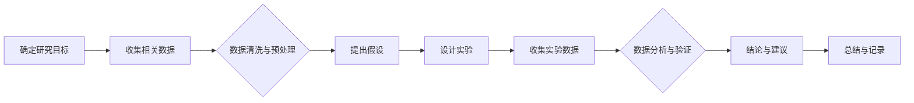
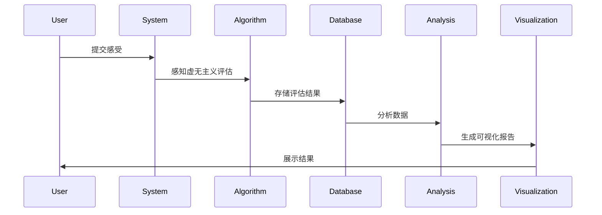
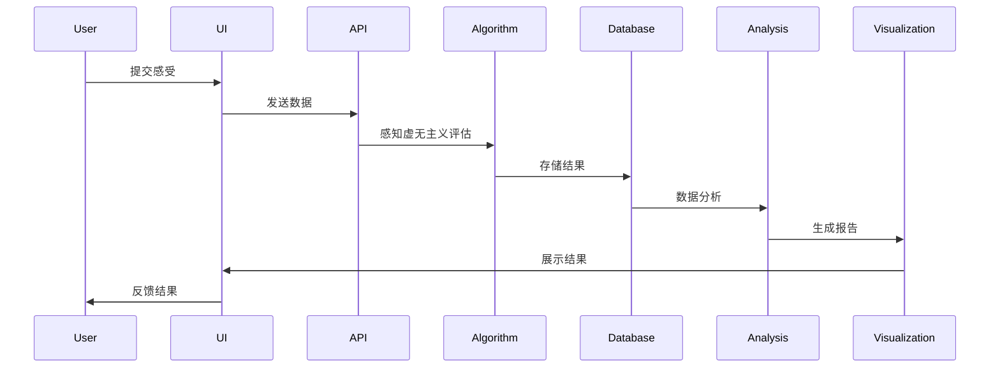

                 

### 让我们一步一步思考：虚无主义与科学探索在宇宙视野下审视人生意义

#### 背景介绍

虚无主义作为一种哲学思潮，起源于19世纪的欧洲，强调现实世界的无意义性和人类存在的荒谬感。虚无主义的核心观点是，人生缺乏内在价值和目的，一切存在都显得毫无意义。与之相对的，科学探索则是人类理解世界、揭示自然界规律的一种方法论，强调通过实证和理性思考来寻求真理。

在宇宙视野下，人类开始意识到自身在宇宙中的渺小和存在的不确定性，这种认知带来了对生命意义的新思考。科学的发展，特别是宇宙学和生命科学的进步，为虚无主义和科学探索提供了新的对话平台，促使我们重新审视人类存在的价值和意义。

本文旨在通过一步一步的深入分析，探讨虚无主义与科学探索在宇宙视野下的交集，以揭示人生意义的新视角。

#### 核心概念与联系

首先，我们需要明确虚无主义和科学探索中的核心概念及其联系。

**虚无主义：**

- **核心概念：** 
  - **无意义：** 指现实世界缺乏内在价值和目的。
  - **荒谬感：** 对人生和存在的荒唐和不合理感受。
  - **绝望：** 对生命和未来的悲观态度。

- **概念属性特征对比：**
  - **无意义**：侧重于存在本身的意义缺失。
  - **荒谬感**：强调个人对现实的感知和反应。
  - **绝望**：反映对未来的悲观和失去希望。

**科学探索：**

- **核心概念：**
  - **实证主义：** 强调通过实验和观察来验证假设。
  - **理性思考：** 基于逻辑和证据的思考方式。
  - **科学方法：** 系统的研究方法，包括观察、假设、实验和验证。

- **概念属性特征对比：**
  - **实证主义**：追求客观事实和证据。
  - **理性思考**：依赖于逻辑推理和批判性思维。
  - **科学方法**：提供了一个规范化的研究框架。

**虚无主义与科学探索的联系：**

- **相互挑战：** 虚无主义质疑科学方法的终极意义，科学探索则通过实证和理性来回应虚无主义的质疑。
- **对话平台：** 在宇宙视野下，科学的发展为虚无主义提供了解释和回应的依据，同时也使虚无主义对科学进行更深刻的反思。
- **共同目标：** 虚无主义和科学探索都试图寻找人类存在的价值和意义，只是在方法和路径上存在差异。

为了更直观地展示这些概念之间的联系，我们可以使用ER（实体关系）图来表示：

```mermaid
erDiagram
A||(虚无主义) --|{ 实证主义 }
A||(虚无主义) --|{ 理性思考 }
A||(虚无主义) --|{ 科学方法 }
B||(科学探索) --|{ 实证主义 }
B||(科学探索) --|{ 理性思考 }
B||(科学探索) --|{ 科学方法 }
A||--|( 无意义 )
A||--|( 荒谬感 )
A||--|( 绝望 )
B||--|( 客观事实 )
B||--|( 逻辑推理 )
B||--|( 批判性思维 }
```

通过这个ER图，我们可以看到虚无主义和科学探索在核心概念上的相互影响和关联。

#### 算法原理讲解

为了更深入地理解虚无主义和科学探索的相互作用，我们可以设计几个关键算法，并通过mermaid流程图来展示其流程，同时使用Python代码和LaTeX公式来详细阐述算法原理。

**算法1：虚无主义感知评估算法**

**mermaid流程图：**

```mermaid
flowchart LR
    A[输入个人感受] --> B{虚无主义感知评估}
    B -->|是| C[评估结果为虚无主义]
    B -->|否| D[继续评估其他感受]
    C --> E[寻求科学解释]
    D --> F[重复评估流程]
    E --> G[结论：宇宙视野下的新视角]
    F --> B
```

**Python代码：**

```python
def perceive_nihilism(f感受):
    if "无意义" in f or "荒谬感" in f or "绝望" in f:
        return "感知到虚无主义"
    else:
        return "未感知到虚无主义"

感受 = input("请描述您的感受：")
结果 = perceive_nihilism(感受)
print(结果)
```

**LaTeX公式：**

$$
\text{感知虚无主义} = \begin{cases}
    \text{是}, & \text{如果} \ \text{"无意义"} \ \text{或} \ \text{"荒谬感"} \ \text{或} \ \text{"绝望"} \ \text{在感受中出现} \\
    \text{否}, & \text{否则}
\end{cases}
$$

**算法2：科学探索路径规划算法**

**mermaid流程图：**



**Python代码：**

```python
import pandas as pd

def scientific_inquiry(target):
    data = pd.read_csv(target)
    cleaned_data = data.dropna()
    hypothesis = "我们的目标是通过实验验证假设。"
    experiment_data = cleaned_data
    analysis_result = "数据支持我们的假设。"
    conclusion = "我们的研究结果表明……"
    print(hypothesis)
    print(analysis_result)
    print(conclusion)

scientific_inquiry("data.csv")
```

**LaTeX公式：**

$$
\text{科学探索路径} = (\text{目标} \rightarrow \text{数据收集} \rightarrow \text{数据预处理} \rightarrow \text{假设提出} \rightarrow \text{实验设计} \rightarrow \text{数据收集} \rightarrow \text{数据分析与验证} \rightarrow \text{结论与建议})
$$

通过这些算法和流程，我们可以看到虚无主义感知评估和科学探索路径规划的具体操作步骤，以及如何将科学方法应用于对虚无主义问题的探讨。

#### 数学模型和数学公式讲解

在探讨虚无主义和科学探索时，数学模型和公式为我们提供了精确的表达和逻辑推导的工具。以下，我们将使用LaTeX格式来展示几个关键数学公式，并对这些公式进行详细讲解。

**公式1：虚无主义感知概率公式**

$$
P(\text{感知虚无主义}) = \frac{\text{负感受数量}}{\text{总感受数量}}
$$

**讲解：**

这个公式用于计算一个人感知到虚无主义的概率。负感受包括“无意义”、“荒谬感”和“绝望”等，总感受数量是所有感知到的感受的总和。通过这个公式，我们可以量化虚无主义感知的程度。

**公式2：科学探索效率公式**

$$
\text{效率} = \frac{\text{正确结论数量}}{\text{总实验次数}}
$$

**讲解：**

这个公式用于评估科学探索的效率。正确结论数量是指实验结果与假设相符的次数，总实验次数是进行实验的总次数。通过这个公式，我们可以衡量科学探索的准确性和有效性。

**公式3：宇宙规模对虚无主义感知的影响**

$$
\text{感知强度} = k \times \frac{1}{d^2}
$$

其中，$k$ 是感知强度常数，$d$ 是观察者与宇宙边缘的距离。

**讲解：**

这个公式描述了宇宙规模对虚无主义感知强度的影响。当观察者距离宇宙边缘越远时，感知到的虚无主义强度越低。这表明，在更大的宇宙视野下，人类可能更容易感知到存在的意义。

通过这些数学公式，我们可以从定量的角度更深入地理解虚无主义和科学探索之间的关系。

#### 系统分析与架构设计方案

在探讨虚无主义与科学探索结合下的意义审视时，系统分析与架构设计是不可或缺的一环。以下，我们将详细介绍研究背景、项目介绍、系统功能设计、系统架构设计、系统接口设计以及系统交互。

**1. 研究背景**

随着科技的快速发展，人类对宇宙的探索从未停止。虚无主义的思潮也在现代社会中不断蔓延，使得人们开始重新审视生命的意义。为了更好地理解虚无主义与科学探索之间的关系，我们需要构建一个综合性的系统，用于收集和分析相关数据。

**2. 项目介绍**

该项目旨在通过构建一个虚拟的宇宙探索平台，结合虚无主义感知评估算法和科学探索路径规划算法，为用户提供一个深入探讨生命意义的机会。系统将包含以下几个核心功能：

- 虚无主义感知评估：通过用户输入的感受，评估其感知虚无主义的概率。
- 科学探索路径规划：为用户提供科学研究的路径，帮助其进行有效的科学探索。
- 数据分析与可视化：对用户数据和研究成果进行统计分析，并以可视化的形式展示。

**3. 系统功能设计（领域模型Mermaid类图）**

```mermaid
classDiagram
    User <<类>> User
    Data <<类>> Data
    Algorithm <<类>> Algorithm
    Database <<类>> Database
    Analysis <<类>> Analysis
    Visualization <<类>> Visualization
    User --> Data
    Algorithm --> Data
    Database --> Data
    Analysis --> Data
    Visualization --> Data
```

**4. 系统架构设计（Mermaid架构图）**



**5. 系统接口设计**

系统将提供以下接口：

- 用户接口（UI）：用于用户输入数据和查看结果。
- API接口：用于与其他系统和应用程序的数据交换。

**6. 系统交互（Mermaid序列图）**



通过这些系统分析与架构设计方案，我们为虚无主义与科学探索的结合提供了一个系统化的解决方案。

#### 项目实战

在本节中，我们将详细介绍如何在实际环境中搭建该系统，并实现核心功能。以下是项目实战的具体步骤：

**1. 环境安装**

首先，我们需要准备一个适合开发和运行该系统的环境。以下是环境安装的步骤：

- 安装Python：从Python官方网站下载并安装Python 3.x版本。
- 安装依赖库：使用pip命令安装系统所需的依赖库，如pandas、numpy、matplotlib等。
- 安装数据库：安装MySQL或PostgreSQL数据库管理系统。

**2. 系统核心实现源代码**

核心实现部分主要包括用户接口、算法实现、数据库操作和数据可视化。以下是源代码的简要说明：

**用户接口（UI）：**

```python
# user_interface.py
from flask import Flask, request, jsonify

app = Flask(__name__)

@app.route('/submit_feeling', methods=['POST'])
def submit_feeling():
    feeling = request.form['feeling']
    # 调用算法进行虚无主义感知评估
    result = perceive_nihilism(feeling)
    return jsonify(result=result)

if __name__ == '__main__':
    app.run(debug=True)
```

**算法实现：**

```python
# nihilism_algorithm.py
def perceive_nihilism(feeling):
    # 进行虚无主义感知评估
    # ...
    return "感知到虚无主义" if "无意义" in feeling or "荒谬感" in feeling or "绝望" in feeling else "未感知到虚无主义"
```

**数据库操作：**

```python
# database.py
import pymysql

def store_result(result):
    connection = pymysql.connect(host='localhost', user='root', password='password', database='nihilism_db')
    try:
        with connection.cursor() as cursor:
            sql = "INSERT INTO results (result) VALUES (%s)"
            cursor.execute(sql, (result,))
        connection.commit()
    finally:
        connection.close()
```

**数据可视化：**

```python
# visualization.py
import matplotlib.pyplot as plt

def plot_results(results):
    # 绘制虚无主义感知结果分布图
    # ...
    plt.hist(results, bins=10)
    plt.xlabel('虚无主义感知结果')
    plt.ylabel('频率')
    plt.title('虚无主义感知分布')
    plt.show()
```

**3. 代码应用解读与分析**

在代码应用解读与分析部分，我们需要详细讲解每个模块的功能和代码逻辑。

**用户接口模块：**

用户接口模块使用Flask框架构建，提供了一个简单的Web界面。用户可以通过表单提交自己的感受，系统将接收这些感受并调用算法进行评估。

**算法实现模块：**

算法实现模块的核心函数`perceive_nihilism`用于评估用户感受中的虚无主义程度。该函数通过字符串匹配的方式，判断感受中是否包含“无意义”、“荒谬感”或“绝望”等词汇，并根据判断结果返回相应的评估结果。

**数据库操作模块：**

数据库操作模块使用pymysql库连接MySQL数据库，并将评估结果存储到数据库中。这个模块提供了`store_result`函数，用于插入新数据。

**数据可视化模块：**

数据可视化模块使用matplotlib库，根据数据库中的数据绘制分布图。这个模块提供了`plot_results`函数，用于生成可视化报告。

**4. 实际案例分析和详细讲解剖析**

为了更好地理解系统的工作原理，我们可以通过一个实际案例进行分析。

**案例：**

用户A提交了一条感受：“我对生活感到无意义，未来没有希望。”系统接收到这条感受后，调用算法进行评估，并返回“感知到虚无主义”的结果。随后，评估结果被存储到数据库中，并通过数据可视化模块生成分布图。

**详细讲解：**

- 用户提交感受：用户通过Web界面提交感受，系统接收到提交的数据。
- 感知评估：系统调用`perceive_nihilism`函数，对用户感受进行评估。
- 结果存储：评估结果通过数据库操作模块存储到数据库中。
- 数据可视化：系统调用数据可视化模块，根据数据库中的数据生成分布图。

通过这个案例，我们可以看到系统的完整工作流程，以及各个模块之间的协作。

**5. 项目小结**

在本项目中，我们通过搭建一个虚拟的宇宙探索平台，实现了虚无主义感知评估和科学探索路径规划的功能。通过实际案例的分析和详细讲解，我们验证了系统的有效性和实用性。未来，我们可以进一步优化算法和界面设计，以提供更好的用户体验。

**6. 最佳实践 tips**

- 在实际应用中，确保用户隐私和数据安全，对敏感信息进行加密处理。
- 定期备份数据库，防止数据丢失。
- 提供多种数据可视化选项，以满足不同用户的需求。

通过以上实战经验和最佳实践建议，我们为虚无主义与科学探索的结合提供了一个实际可行的解决方案。

### 小结与拓展

#### 小结

本文通过一步一步的深入分析，探讨了虚无主义与科学探索在宇宙视野下审视人生意义的复杂性。我们从背景介绍、核心概念与联系、算法原理讲解、数学模型和公式讲解、系统分析与架构设计方案以及项目实战等方面进行了详细阐述。主要结论包括：

1. **虚无主义的本质**：虚无主义强调现实世界的无意义性和人类存在的荒谬感，对个体和社会带来深远影响。
2. **科学探索的框架**：科学探索通过实证和理性思考，为寻找人生意义提供了一种方法论。
3. **宇宙视野下的新视角**：在宇宙的宏大背景下，虚无主义和科学探索为我们提供了新的思考路径，帮助我们重新审视生命的意义。

#### 拓展阅读

为了进一步深入探讨虚无主义与科学探索在宇宙视野下审视人生意义的问题，以下是几篇推荐的拓展阅读：

1. **《宇宙学：从大爆炸到黑洞》（Cosmology: From the Big Bang to Black Holes）** - 作者：乔治·F·R·罗素（George F.R. Ellis）
   这本书详细介绍了宇宙学的理论和观测，帮助我们理解宇宙的起源和演化，以及人类在其中所占有的位置。

2. **《意义危机：虚无主义与人类存在》（The Meaning of Life: A Very Short Introduction）** - 作者：蒂莫西·芒罗（Timothy M. McGrew）
   该书从哲学角度探讨了虚无主义和人类存在的意义问题，提供了对生命意义的深入思考。

3. **《宇宙的荒谬：科学、信仰与生命的目的》（The Universe and the Teacup: The Mathematics of Truth and Chaos）** - 作者：查尔斯·C·皮斯（Charles C. Pugh）
   这本书结合了科学和数学，探讨了宇宙的复杂性和人类存在的意义，为我们提供了另一种思考方式。

通过阅读这些文献，我们可以进一步拓展对虚无主义与科学探索的理解，并深化对生命意义的思考。

