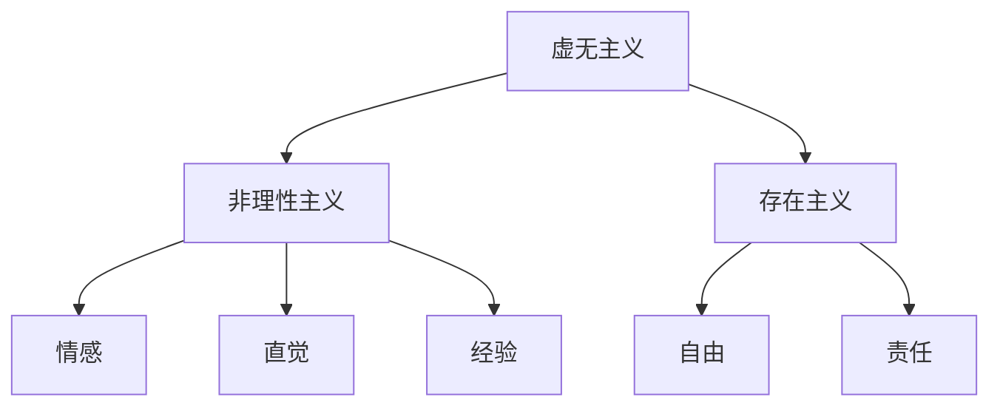

                 

## 虚无主义与终身学习：在知识探索中寻找人生方向

### 关键词：虚无主义、终身学习、知识探索、人生方向、哲学

> 摘要：本文从虚无主义的探讨出发，深入分析了虚无主义的哲学基础、现状及其应对策略。在此基础上，文章详细阐述了终身学习的理念、路径、技巧与方法，并结合成功案例，探讨了知识探索与人生方向的关系。通过这些分析，本文旨在帮助读者在知识探索中寻找人生方向，克服虚无主义的负面影响，实现个人成长与价值。

### 目录大纲：

1. **第一部分：虚无主义的探讨**
   1. **背景介绍**
   2. **虚无主义的哲学基础**
   3. **当代虚无主义的现状**
   4. **虚无主义的应对策略**

2. **第二部分：终身学习的实践**
   1. **终身学习的理念**
   2. **终身学习的路径**
   3. **终身学习的技巧与方法**
   4. **终身学习的案例分析**

3. **第三部分：知识探索与人生方向**
   1. **知识探索的哲学意义**
   2. **知识探索的方法**
   3. **知识探索与人生方向的关系**
   4. **结论**

---

### 1. 背景介绍

虚无主义（Nihilism）起源于19世纪初，是对传统道德、宗教和社会价值观的否定。虚无主义认为，宇宙和人类的存在缺乏固有的目的或意义，因此，个体在生命中的行为和选择是自由的，不受任何先验的道德或宗教规范的约束。

虚无主义的起源可以追溯到欧洲启蒙运动和浪漫主义时期的哲学思想。随着科学技术的发展和对人类自我认识的深入，人们开始质疑传统价值观的合理性，从而产生了虚无主义思潮。

在现代社会，虚无主义的表现形式多样，包括个人主义、消费主义、虚无主义哲学等。虚无主义不仅影响了个体的心理健康，还对社会的稳定和道德价值观产生了挑战。

### 2. 虚无主义的哲学基础

虚无主义的哲学基础主要包括非理性主义和存在主义。

#### 非理性主义

非理性主义认为，理性不是人类认知的唯一基础，情感、直觉和经验同样重要。这种观点挑战了传统的理性主义哲学，认为人类的行为和决策不仅仅受理性支配，还受到非理性因素的影响。

#### 存在主义

存在主义是虚无主义的重要分支，强调个体的自由和责任。存在主义认为，人类的存在没有先验的目的或意义，个体必须通过自己的选择和行动来创造意义。

**核心概念与联系**

| 核心概念 | 描述 |  
| --- | --- |  
| 虚无主义 | 否定传统价值观，认为宇宙和人类的存在缺乏固有目的或意义 |  
| 非理性主义 | 认为情感、直觉和经验对人类认知和行为有重要作用 |  
| 存在主义 | 强调个体的自由和责任，认为个体必须通过自己的选择和行动来创造意义 |

**ER实体关系图架构**

### 3. 当代虚无主义的现状

在当代社会，虚无主义的影响日益显著。一方面，虚无主义挑战了传统的道德和宗教价值观，推动了个人主义和消费主义的盛行。另一方面，虚无主义也导致了一些社会问题的出现，如心理健康问题、自杀率上升等。

**个人心理表现**

虚无主义对个体心理健康的影响主要表现在以下几个方面：

1. **缺乏目标感**：个体感到自己的行为和选择没有意义，缺乏明确的人生目标。
2. **消极情绪**：长期处于消极情绪中，如无助、绝望、孤独等。
3. **逃避现实**：通过酗酒、吸毒、过度消费等方式逃避现实问题。

**社会影响**

虚无主义对社会的影响主要体现在以下几个方面：

1. **道德沦丧**：传统道德和价值观的动摇导致社会道德水平的下降。
2. **家庭破裂**：个体对家庭责任和义务的忽视导致家庭关系的破裂。
3. **社会不稳定**：虚无主义思潮可能导致社会动荡，影响社会稳定。

### 4. 虚无主义的应对策略

面对虚无主义带来的挑战，个体和社会可以采取以下应对策略：

#### 心理调适方法

1. **自我认知**：通过自我反思，了解自己的价值观和人生目标，找到自己的定位。
2. **情感管理**：学会调节和管理自己的情绪，避免长期处于消极情绪中。
3. **寻求支持**：与亲友、心理咨询师等建立良好的沟通和支持关系，共同面对虚无主义的挑战。

#### 寻求人生意义的探索途径

1. **志愿服务**：通过参与志愿服务，帮助他人，找到自己的社会价值和存在意义。
2. **学习与成长**：通过终身学习，不断提升自己的知识和技能，实现个人成长。
3. **精神追求**：通过宗教信仰、哲学思考等方式，寻求更高层次的精神满足。

### 5. 终身学习的理念

终身学习（Lifelong Learning）是指一个人在一生中不断学习、积累知识和技能的过程。终身学习不仅包括正式教育，还包括非正式教育和自我学习。终身学习的理念强调，学习是一种持续的过程，而不是一次性的事件。

#### 终身学习的定义

终身学习是一种全面的学习方式，包括知识的获取、技能的提升、态度的转变和价值观的塑造。它涵盖了个人成长、职业发展和社区参与等多个方面。

#### 终身学习的重要性

1. **适应社会变化**：随着科技的发展和社会的进步，终身学习成为适应社会变化和保持竞争力的必要条件。
2. **个人成长**：终身学习有助于个体不断拓展自己的知识边界，提升个人素质，实现自我价值。
3. **社会进步**：终身学习可以促进社会成员的全面发展，提高社会整体素质，推动社会进步。

### 6. 终身学习的路径

终身学习可以通过多种路径实现，包括教育系统、社会资源和自我学习。

#### 教育系统中的终身学习

教育系统为终身学习提供了制度化的支持，包括：

1. **正规教育**：通过大学、职业培训等正规教育途径，获取新的知识和技能。
2. **继续教育**：在工作后继续接受教育和培训，提升职业素养和竞争力。
3. **成人教育**：为成年人提供继续学习和发展的机会，满足他们不同阶段的学习需求。

#### 社会资源与自我学习

社会资源和自我学习是实现终身学习的重要途径，包括：

1. **在线学习平台**：如Coursera、edX等，提供丰富的在线课程和资源，方便个人自主学习。
2. **图书馆和社区中心**：提供丰富的书籍、资源和活动，支持个人的学习和成长。
3. **实践与交流**：通过实践项目和社交活动，与他人交流和分享知识，提升自己的学习效果。

### 7. 终身学习的技巧与方法

终身学习需要一定的技巧和方法，以下是一些常用的技巧：

#### 学习策略与习惯

1. **目标设定**：明确自己的学习目标和计划，制定合理的学习计划。
2. **时间管理**：合理安排学习时间，确保有足够的时间进行学习和复习。
3. **主动学习**：积极参与课堂讨论、实践项目和社交活动，主动获取知识。

#### 学习工具与资源利用

1. **电子书籍和在线资料**：利用电子书籍、在线课程和学术资源，拓宽知识领域。
2. **学习软件和工具**：使用学习软件和工具，如思维导图、笔记软件等，提高学习效率。
3. **网络资源**：利用网络资源，如学术论坛、博客、社交媒体等，与他人交流和分享知识。

### 8. 终身学习的案例分析

#### 成功的终身学习案例

**案例一：马云**

马云是中国著名企业家，阿里巴巴集团的创始人。他从小学习成绩平平，但通过自学英语和不断学习，最终创立了阿里巴巴，成为全球知名的企业家和慈善家。马云的成功证明了终身学习的重要性。

**案例二：史蒂芬·霍金**

史蒂芬·霍金是英国著名物理学家，他的著作《时间简史》成为全球畅销书。尽管霍金患有肌肉萎缩症，但他通过自学和科研，在物理学领域取得了卓越成就。霍金的故事展示了终身学习对个人成长和成功的关键作用。

#### 挑战与问题及解决方案

**挑战一：时间管理**

**问题**：在忙碌的工作和生活中，如何分配时间进行终身学习？

**解决方案**：制定详细的学习计划，合理安排学习时间，利用碎片化时间进行学习，如早晨、晚上和通勤时间。

**挑战二：知识更新**

**问题**：随着科技的发展，如何跟上知识更新的步伐？

**解决方案**：关注行业动态和前沿技术，利用在线学习平台和学术资源，及时更新自己的知识体系。

**挑战三：学习动力**

**问题**：如何保持学习动力，避免学习倦怠？

**解决方案**：设定明确的学习目标，找到学习的乐趣，与他人交流和分享学习成果，增强学习动力。

### 9. 知识探索的哲学意义

知识探索是人类认识世界、解决问题、实现自我价值的重要途径。在哲学意义上，知识探索具有以下几个方面的意义：

#### 知识的价值

1. **认识世界**：知识探索帮助我们了解自然和社会现象，认识世界的本质和规律。
2. **解决问题**：知识探索为解决问题提供了理论依据和解决方案，推动科技和社会的发展。
3. **实现自我价值**：通过知识探索，个体可以实现自我认知、自我提升和自我实现，实现人生价值。

#### 知识与人生的关系

1. **知识塑造人生**：知识探索影响个体的思维方式、价值观和行为模式，从而影响个体的人生轨迹。
2. **人生促进知识探索**：个体的人生经历和需求激发知识探索的动机，推动知识创新和发展。

### 10. 知识探索的方法

知识探索需要一定的方法和技巧，以下介绍几种常用的方法：

#### 科研方法与思维技巧

1. **实证研究**：通过实验、调查和观察等方法，收集和分析数据，验证理论假设。
2. **理论分析**：运用逻辑推理、数学模型等方法，对现象进行分析和解释。
3. **批判性思维**：培养批判性思维能力，对知识进行质疑、分析和评估。

#### 跨学科的知识整合

1. **跨学科研究**：结合不同学科的知识和方法，解决复杂问题。
2. **知识整合**：将不同领域的知识进行整合，形成新的理论体系和应用方法。
3. **创新思维**：通过跨学科的知识整合，激发创新思维，推动知识创新和发展。

### 11. 知识探索与人生方向的关系

知识探索与人生方向密切相关，通过知识探索，个体可以：

1. **明确人生目标**：通过知识探索，个体可以了解自己的兴趣、能力和价值观，从而明确自己的人生目标。
2. **拓展职业发展**：知识探索有助于个体提升自己的专业能力和竞争力，为职业发展提供更多机会。
3. **提升生活质量**：知识探索可以提高个体的生活质量，使其更好地适应社会发展和变化。

**知识探索如何帮助我们找到人生方向**

1. **自我认知**：知识探索帮助个体深入了解自己，找到自己的兴趣和激情。
2. **职业规划**：通过知识探索，个体可以了解不同职业领域的发展前景和趋势，为自己选择合适的职业方向。
3. **终身学习**：知识探索是终身学习的一部分，通过不断学习和成长，个体可以不断调整自己的人生方向，实现自我价值。

### 12. 结论

本文从虚无主义和终身学习的角度，探讨了知识探索与人生方向的关系。虚无主义挑战了传统价值观，对个体和社会产生了一定的影响。而终身学习为个体提供了持续成长和发展的机会，通过知识探索，个体可以找到自己的人生方向，实现自我价值。在未来，我们应继续关注虚无主义和终身学习的研究，为个体和社会的发展提供指导。同时，我们也应注重知识探索的方法和技巧，提升知识创新能力，为人类的进步做出贡献。

### 总结

本文首先介绍了虚无主义的历史背景、哲学基础和当代现状，分析了虚无主义的个人心理表现和社会影响，并提出了应对策略。接着，详细阐述了终身学习的理念、路径、技巧与方法，以及成功案例。最后，探讨了知识探索的哲学意义、方法与人生方向的关系，为读者提供了寻找人生方向的指导。

通过本文的分析，我们认识到虚无主义和终身学习对个体和社会的重要性。在知识爆炸的时代，终身学习已成为适应社会发展、实现个人价值的必备能力。而知识探索则是我们在复杂世界中寻找人生方向的重要途径。

### 最佳实践 tips

1. **树立终身学习意识**：将终身学习作为生活的一部分，不断提升自己的知识和技能。
2. **设定明确的学习目标**：制定具体的学习计划，确保学习过程有目标、有方向。
3. **积极寻找学习资源**：利用在线学习平台、图书馆、社区等资源，拓宽自己的知识领域。
4. **培养批判性思维**：在学习过程中，保持独立思考，对知识进行质疑和分析。
5. **与他人分享学习成果**：通过交流和分享，与他人共同成长，激发学习动力。

### 小结

虚无主义和终身学习是我们面对复杂世界的重要工具。通过终身学习，我们可以不断拓展自己的知识边界，找到自己的人生方向。知识探索则是我们在这一过程中不断成长、实现自我价值的关键。希望本文能为您的知识探索和人生方向提供有益的启示。

### 注意事项

1. **避免盲目学习**：在学习过程中，要明确自己的需求和兴趣，避免盲目跟风。
2. **合理安排时间**：平衡工作、学习和生活，确保学习效果和质量。
3. **保持好奇心**：对未知领域保持好奇心，激发学习兴趣和动力。
4. **持续反思**：在学习过程中，不断反思自己的学习方法和效果，及时调整和改进。

### 拓展阅读

1. **《虚无主义：一种哲学导论》**：作者威廉·塔夫脱，详细介绍了虚无主义的历史、哲学基础和当代影响。
2. **《终身学习：21世纪的生存法则》**：作者史蒂芬·柯维，探讨了终身学习的重要性、方法和实践。
3. **《知识探索：方法与实践》**：作者罗伯特·J·泽林斯基，介绍了知识探索的基本方法和技巧。

### 作者信息

作者：AI天才研究院/AI Genius Institute & 禅与计算机程序设计艺术 /Zen And The Art of Computer Programming

本文由AI天才研究院（AI Genius Institute）与禅与计算机程序设计艺术（Zen And The Art of Computer Programming）联合撰写，旨在为读者提供有关虚无主义、终身学习和知识探索的深入分析和思考。我们致力于推动人工智能和计算机科学领域的发展，助力个体和社会的进步。如有任何问题或建议，欢迎随时与我们联系。让我们共同探索知识的海洋，寻找人生的方向！

